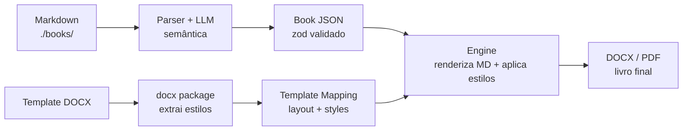
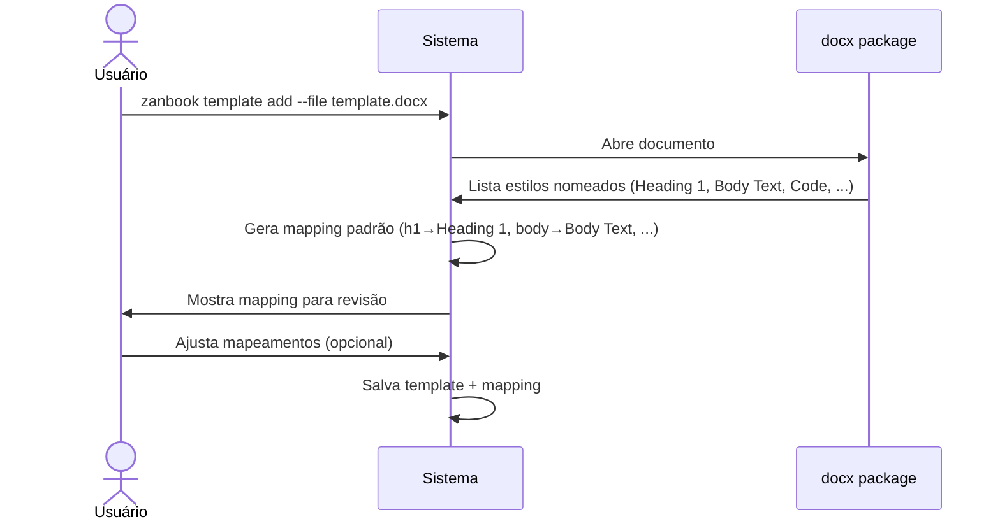
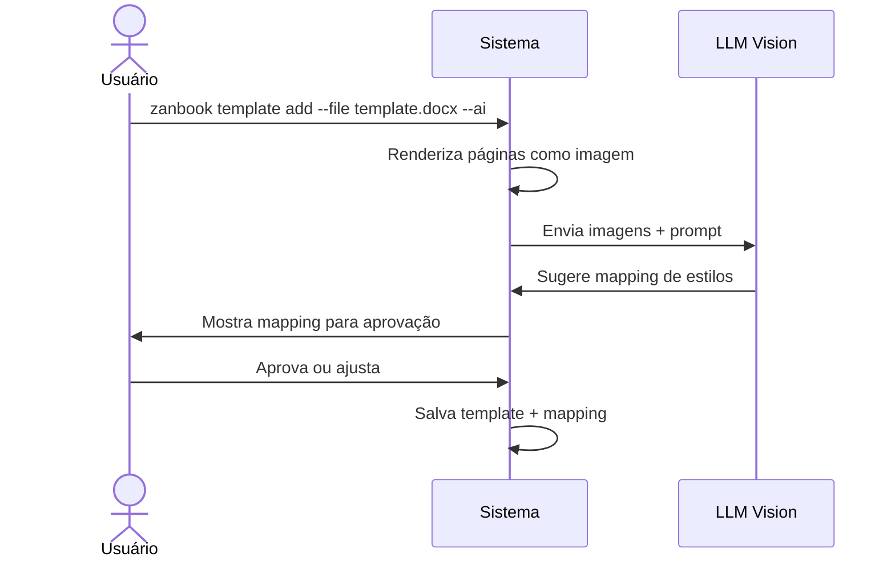
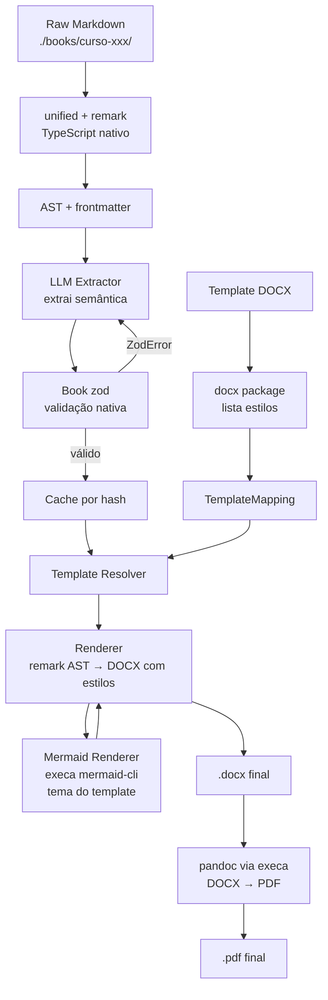

# Zan Book — Gerador de Livros a partir de Markdown

Sistema de automação editorial que extrai dados estruturados de arquivos Markdown educacionais e os insere em templates DOCX/PDF com layout profissional, usando LLMs para extração semântica e análise de templates.

## Princípio de Design

> **O LLM extrai semântica. O parser cuida da sintaxe.**

O Zan Book não pede ao LLM que re-construa a AST de um documento Markdown — isso é trabalho de um parser determinístico. O LLM extrai apenas **metadados semânticos** (título, objetivos, nível, tags, anotações pedagógicas). O conteúdo bruto em markdown é preservado e renderizado pelo gerador DOCX.

## Visão Geral

O **Zan Book** converte materiais didáticos em Markdown — com estrutura consistente mas não formalizada — em documentos profissionais (DOCX, PDF) prontos para distribuição como livros, apostilas ou e-books.



### Três Pilares

| Pilar         | O que faz                                                          | Tecnologia                 |
| ------------- | ------------------------------------------------------------------ | -------------------------- |
| **Extração**  | Parser de MD + LLM extrai metadados semânticos → `Book` (zod)      | unified/remark, openai SDK |
| **Templates** | `docx` package lista estilos nomeados; LLM Vision só se necessário | docx (npm)                 |
| **Geração**   | Engine renderiza markdown bruto aplicando estilos do template      | docx, pandoc (execa)       |

---

## Estrutura do Projeto

```
zan-book/
├── books/                          # Conteúdo-fonte: cursos em Markdown
│   ├── curso-banco-de-dados-sql/
│   ├── curso-engenharia-de-software/
│   ├── curso-github-copilot/
│   ├── curso-javascript/
│   ├── curso-nodejs/
│   └── curso-product-owner/
├── templates/                      # Templates DOCX cadastrados
│   └── *.docx
├── src/
│   ├── contracts.ts                # Schemas zod (Book, Lesson, TemplateMapping)
│   ├── extractor.ts                # Markdown → Book (parser + LLM)
│   ├── analyzer.ts                 # DOCX → TemplateMapping (docx + LLM opcional)
│   ├── renderer.ts                 # Markdown → DOCX (aplica estilos do template)
│   ├── converter.ts                # DOCX → PDF (pandoc via execa)
│   └── cli.ts                      # Interface de linha de comando (commander)
├── cache/                          # Cache de extração por hash (gitignored)
├── package.json
├── tsconfig.json
└── README.md
```

---

## Padrões dos Materiais

Após inspeção dos 6 cursos em `./books/`, identificamos o seguinte padrão universal:

```
curso-{nome}/
├── README.md                              # Plano do módulo (fonte única da verdade)
├── aula01/
│   ├── aula-01-{slug}.md                  # Conteúdo principal da aula
│   ├── aula-01-questoes-de-aprendizagem.md # Checkpoint de aprendizagem
│   └── images/                            # Imagens da aula (opcional)
├── aula02/
│   └── ...
└── aulaNN/
```

**Variações entre cursos:**

| Atributo                              | Presente em                                | Ausente em                                                                |
| ------------------------------------- | ------------------------------------------ | ------------------------------------------------------------------------- |
| `images/` por aula                    | banco-de-dados-sql                         | engenharia-de-software, javascript, nodejs, github-copilot, product-owner |
| Campo `data` no frontmatter           | engenharia-de-software                     | demais cursos                                                             |
| Campo `nivel` no frontmatter          | banco-de-dados-sql, engenharia-de-software | demais cursos                                                             |
| Seção `## Mapa Mental`                | banco-de-dados-sql, engenharia-de-software | demais cursos                                                             |
| `## Projeto Progressivo` no README    | todos                                      | —                                                                         |
| Tabela de fases no README             | banco-de-dados-sql, nodejs, javascript     | product-owner (usa blocos)                                                |
| Seções `Quick Check` inline           | banco-de-dados-sql, engenharia-de-software | —                                                                         |
| Callouts com `>`                      | todos                                      | —                                                                         |
| Blocos de código com syntax highlight | todos                                      | —                                                                         |
| Diagramas Mermaid (` ```mermaid `)    | —                                          | todos (suporte no contrato para conteúdo futuro)                          |

---

## Book Contract — Contrato de Estrutura

O contrato é definido em **TypeScript com zod** — schemas tipados, validação nativa, sem JSON Schema separado.

### Princípio

O conteúdo da aula é preservado como **markdown bruto** (`string`). O LLM extrai apenas:

1. **Metadados estruturados** — campos fixos, tipados, validados (frontmatter, título, objetivos)
2. **Anotações semânticas** — marcações que o parser não consegue identificar (quick check, callout pedagógico, quebra de seção)

A renderização de sintaxe (negrito, código, tabelas, listas) é responsabilidade do `renderer.ts`, não do extrator.

### Schemas

```typescript
import { z } from "zod";

// === Frontmatter (campos fixos, tipados, validados) ===

const LevelEnum = z.enum(["iniciante", "intermediario", "avancado"]);

const FrontmatterSchema = z.object({
  titulo: z.string(),
  modulo: z.string(),
  aula: z.string(),
  duracao_estimada: z.string().optional(), // "100 minutos"
  nivel: LevelEnum.optional(),
  tags: z.array(z.string()).default([]),
  data: z.string().date().optional(), // ISO date (YYYY-MM-DD)
});

type Frontmatter = z.infer<typeof FrontmatterSchema>;

// === Anotações semânticas (o que o parser não sabe) ===

const AnnotationKind = z.enum([
  "quick_check", // checkpoint pedagógico inline
  "callout", // destaque pedagógico (note|tip|warning|important)
  "mind_map", // imagem de mapa mental
  "section_break", // divisão estrutural de conteúdo
  "mermaid", // diagrama mermaid (renderizar como imagem)
]);

const AnnotationSchema = z.object({
  kind: AnnotationKind,
  line_start: z.number().int().positive(), // linha no content_md (1-indexed)
  line_end: z.number().int().positive().optional(), // undefined = mesma linha
  metadata: z.record(z.string()).default({}),
  // ex: { variant: "warning" }, { caption: "Fluxo de autenticação" }
});

type Annotation = z.infer<typeof AnnotationSchema>;

// === Lesson (Aula) ===

const LessonSchema = z.object({
  number: z.number().int().positive(), // ordinal, 1-indexed
  slug: z.string(), // "banco-de-dados-sql-conceitos-tabelas-sqlite"
  frontmatter: FrontmatterSchema,
  title: z.string(), // texto do H1
  subtitle: z.string(), // texto do H2 imediatamente após H1
  objectives: z.array(z.string()), // ["Identificar as limitações do JSON...", ...]
  content_md: z.string(), // markdown BRUTO — o renderer cuida da sintaxe
  questions_md: z.string().nullable().default(null), // markdown BRUTO das questões
  annotations: z.array(AnnotationSchema).default([]),
  images: z.array(z.string()).default([]), // paths relativos
});

type Lesson = z.infer<typeof LessonSchema>;

// === Book (Curso) ===

const BookSchema = z.object({
  id: z.string(), // "curso-banco-de-dados-sql"
  title: z.string(), // título do README (H1)
  subtitle: z.string(), // 1º parágrafo após título
  total_lessons: z.number().int().positive(),
  metadata: z.record(z.unknown()), // público, pré-requisitos, fases...
  // texto livre do README — não rigidamente tipado; usa unknown para aceitar strings, arrays, objetos
  lessons: z.array(LessonSchema),
});

type Book = z.infer<typeof BookSchema>;
```

### Extração do README (Plano do Curso)

O LLM recebe o markdown completo do README e extrai:

| Seção do README              | Campo em Book                    |
| ---------------------------- | -------------------------------- |
| H1 (título)                  | `Book.title`                     |
| 1º parágrafo                 | `Book.subtitle`                  |
| Contagem de pastas `aulaXX/` | `Book.total_lessons`             |
| Público-alvo                 | `Book.metadata["audience"]`      |
| Pré-requisitos               | `Book.metadata["prerequisites"]` |
| Tabela de fases / blocos     | `Book.metadata["phases"]`        |
| Compromisso do módulo        | `Book.metadata["commitment"]`    |
| Demais seções                | `Book.metadata` (chave livre)    |

### Por que `content_md` e não AST?

| Abordagem AST (anterior)                 | Abordagem `content_md` (atual)                   |
| ---------------------------------------- | ------------------------------------------------ |
| LLM produz 11 variantes de nó por aula   | LLM não toca na sintaxe                          |
| `InlineStyle` com offset/length — frágil | Sintaxe preservada no bruto                      |
| ~500 tokens por aula só em estrutura     | 0 tokens em estrutura                            |
| Re-prompt se AST inválida                | Parser determinístico (unified/remark), sem erro |
| Renderer precisa reconstruir markdown    | Renderer parseia markdown direto                 |

### Por que `annotations` e não só `content_md`?

Existem elementos que **parecem sintaxe mas são semântica**:

- `> **Quick Check:** ...` — é um blockquote na sintaxe, mas semanticamente é um _checkpoint pedagógico_
- `` — é uma imagem na sintaxe, mas semanticamente é o _resumo visual da aula_
- `> [!WARNING]` — é um callout com variante pedagógica

O LLM identifica esses elementos e cria `Annotation`s com `line_start`/`line_end` (linhas no `content_md`) e `metadata` (dados específicos como `variant` ou `caption`). O renderer usa as anotações para aplicar estilos especiais do template.

### Mapeamento Markdown → Contrato

| Elemento Markdown                       | Campo no Contrato                                               |
| --------------------------------------- | --------------------------------------------------------------- |
| YAML frontmatter `---...---`            | `Lesson.frontmatter`                                            |
| `# Título` (H1)                         | `Lesson.title`                                                  |
| `## Subtítulo` (H2 após H1)             | `Lesson.subtitle`                                               |
| `- [ ] **Verbo** descrição`             | `Lesson.objectives[]`                                           |
| Corpo da aula (todo o resto)            | `Lesson.content_md`                                             |
| Arquivo `*-questoes-de-aprendizagem.md` | `Lesson.questions_md`                                           |
| ``                          | `Lesson.images[]`                                               |
| `> **Quick Check:** ...`                | `Annotation(kind: "quick_check")`                               |
| `> [!WARNING] ...`                      | `Annotation(kind: "callout", metadata: { variant: "warning" })` |
| ``            | `Annotation(kind: "mind_map")`                                  |
| ` ```mermaid ... ``` `                  | `Annotation(kind: "mermaid")`                                   |
| README: público, pré-requisitos, fases  | `Book.metadata`                                                 |

---

## Template System

### Princípio

O template DOCX **já contém os estilos**. O sistema não reescreve estilos em JSON — apenas descobre **qual estilo nomeado aplicar a qual elemento**.

### Dois modos de cadastro

**Modo automático** (padrão, sem LLM):



**Modo LLM Vision** (para templates sem estilos nomeados):



### Template Mapping

```typescript
import { z } from "zod";

const LayoutBlockSchema = z.object({
  kind: z.enum(["cover", "toc", "chapter", "questions", "appendix"]),
  source: z.string(), // "book.metadata" | "lesson" | "lesson.questions"
  page_break: z.boolean().default(true),
});

const TemplateMappingSchema = z.object({
  id: z.string(),
  name: z.string(), // "Template Padrão A4 — Zan Academy"
  docx_path: z.string(), // caminho para o arquivo .docx original

  // Estrutura: ordem dos blocos no documento final
  layout: z.array(LayoutBlockSchema),

  // Estilos: elemento markdown → nome de estilo no DOCX
  styles: z.record(z.string()).default({
    h1: "Heading 1",
    h2: "Heading 2",
    h3: "Heading 3",
    body: "Body Text",
    code: "CodeBlock",
    blockquote: "Quote",
    table_header: "Table Header",
    table_cell: "Table Cell",
    image_caption: "Caption",
    objectives: "List Bullet",
    questions_title: "Heading 2",
    questions_body: "Body Text",
  }),

  // Estilos para anotações semânticas
  annotation_styles: z.record(z.string()).default({
    quick_check: "Callout",
    callout_note: "Note",
    callout_warning: "Warning",
    mind_map: "Image Center",
    mermaid: "Image Center",
  }),

  // Configurações de página (lidas do DOCX, não reescritas)
  page_size: z.string().default("A4"),
  margins: z.record(z.number()).default({}),

  // Tema visual para diagramas Mermaid (extraído do template DOCX)
  mermaid_theme: MermaidThemeSchema.optional(),
});

const MermaidThemeSchema = z.object({
  /** Tema base do Mermaid (afeta esquema de cores global) */
  base: z
    .enum(["default", "neutral", "dark", "forest", "base"])
    .default("neutral"),
  /** Cores extraídas dos estilos do template para ornar com o documento */
  colors: z
    .object({
      primary: z.string().default("#2563EB"), // cor de destaque (títulos, bordas)
      secondary: z.string().default("#7C3AED"), // cor secundária (nós alternativos)
      text: z.string().default("#1E293B"), // cor de texto principal
      background: z.string().default("#FFFFFF"), // fundo do diagrama
      border: z.string().default("#CBD5E1"), // bordas e linhas de conexão
      accent_light: z.string().default("#EFF6FF"), // fundo de nós
    })
    .optional(),
  /** Fonte preferencial (extraída do estilo Body Text do DOCX) */
  font_family: z.string().optional(),
  /** Tamanho base da fonte em px (escala: 1pt ≈ 1.33px) */
  font_size: z.number().default(14),
});

type MermaidTheme = z.infer<typeof MermaidThemeSchema>;

type TemplateMapping = z.infer<typeof TemplateMappingSchema>;
```

### Por que não reescrever estilos em JSON?

O DOCX já define fonte, tamanho, cor, espaçamento, alinhamento. Reescrever isso em JSON cria:

- **Duplicação**: dois lugares para manter a mesma informação
- **Desincronização**: se o DOCX muda, o JSON fica desatualizado
- **Complexidade**: 15+ interfaces com dezenas de propriedades cada

O `TemplateMapping` apenas diz "use o estilo 'Heading 1' do DOCX para h1". O pacote `docx` aplica o estilo — com toda a sua formatação original.

### Adaptação Visual dos Diagramas Mermaid

Mermaid renderiza diagramas com tema próprio. Para que os diagramas **ornem com o documento final**, o Zan Book extrai a identidade visual do template DOCX e a traduz para um tema Mermaid:

| Fonte no DOCX                         | Campo no MermaidTheme | Como é extraído                     |
| ------------------------------------- | --------------------- | ----------------------------------- |
| Cor da fonte do estilo `Body Text`    | `colors.text`         | Lê `font.color` do estilo nomeado   |
| Cor do estilo `Heading 1`             | `colors.primary`      | Cor predominante dos títulos        |
| Cor de fundo predominante (ou branco) | `colors.background`   | Se o DOCX tem fundo colorido, usa-o |
| Fonte do estilo `Body Text`           | `font_family`         | Lê `font.name` do estilo nomeado    |
| Tamanho do `Body Text` × 1.33 (pt→px) | `font_size`           | Conversão aproximada                |

O `mermaid-cli` recebe um arquivo de configuração JSON com essas variáveis, que são injetadas no tema `base` do Mermaid via `%%{init: { "theme": "base", "themeVariables": { ... } }}%%`.

Se o template **não tem estilos nomeados**, o LLM Vision (modo `--ai`) infere as cores predominantes da renderização visual e sugere o `MermaidTheme`.

---

---

## Pipeline de Geração



### Etapas

1. **Parse**: `unified` + `remark-parse` converte Markdown → AST + `remark-frontmatter` extrai YAML
2. **Extract**: LLM recebe o markdown + AST e retorna JSON com metadados semânticos e anotações
3. **Validate**: `zod` valida na desserialização; se `ZodError`, re-prompt com erros
4. **Cache**: hash do arquivo markdown → se não mudou, pula extração
5. **Resolve Template**: carrega `TemplateMapping` (estilos já mapeados)
6. **Render**: `renderer.ts` percorre a AST do remark e aplica estilos do template via pacote `docx`. Anotações semânticas disparam estilos especiais. Diagramas Mermaid são renderizados via `mermaid-cli` (execa) com as cores do template (`mermaid_theme`) e inseridos como imagem.
7. **Convert**: `pandoc` via `execa` converte DOCX → PDF

### Tolerância a Falhas

- Retry com backoff exponencial (1s, 2s, 4s, 8s)
- Máximo 3 tentativas por aula
- Erro persistente → log em `cache/errors.jsonl` + skip da aula
- Ao final, report: "8/8 aulas extraídas" ou "7/8 (aula 3 falhou: ZodError)"
- Cache só é escrito após extração bem-sucedida

---

## Cache e Idempotência

```json
// cache/{file_hash}.json
{
  "source_hash": "sha256:abc123...",
  "extracted_at": "2026-07-15T10:30:00",
  "book": { "..." }
}
```

- **Hash por arquivo**: cada aula é cacheada independentemente
- **Incremental**: se 1 aula mudou, só ela é re-extraída
- **Idempotente**: mesma entrada → mesma saída (LLM com `temperature=0`)
- **Invalidação**: deletar `cache/` força re-extração completa

---

## Configuração

```jsonc
// zanbook.config.json — na raiz do projeto
{
  "llm": {
    "provider": "openai", // "openai" | "anthropic" | "local"
    "model": "gpt-4o-mini", // modelo para extração semântica
    "temperature": 0, // determinístico para idempotência
    "maxRetries": 3,
  },
  "paths": {
    "booksDir": "books", // diretório raiz dos cursos
    "templatesDir": "templates", // diretório de templates
    "cacheDir": "cache", // diretório de cache
    "outputDir": "output", // saída de DOCX/PDF gerados
  },
  "tools": {
    "mermaidCli": "mmdc", // caminho para mermaid-cli
    "pandoc": "pandoc", // caminho para pandoc
  },
  "template": {
    "pageSize": "A4",
    "defaultMargins": {
      "top": 25,
      "bottom": 25,
      "left": 30,
      "right": 20,
    },
  },
}
```

---

## Stack Tecnológica

| Camada                | Tecnologia                    | Justificativa                                               |
| --------------------- | ----------------------------- | ----------------------------------------------------------- |
| **Markdown Parsing**  | unified + remark (TypeScript) | AST completa, ecossistema maduro, tipagem nativa            |
| **Validação**         | zod                           | Schemas tipados, inferência de tipos, validação + re-prompt |
| **Extração LLM**      | openai / @anthropic-ai/sdk    | SDK nativo TypeScript, structured outputs                   |
| **Template Analysis** | docx (npm)                    | Lista estilos nomeados — LLM Vision só se necessário        |
| **DOCX Generation**   | docx (npm)                    | API completa em TS, aplica estilos nomeados do template     |
| **Mermaid Rendering** | mermaid-cli (execa)           | Renderiza ```mermaid → SVG/PNG                              |
| **PDF Conversion**    | pandoc (execa)                | Conversão robusta com preservação de layout                 |
| **CLI**               | commander + chalk             | Interface de linha de comando com tipagem                   |
| **Runtime**           | Node.js + TypeScript          | Stack única, sem child_process entre linguagens             |

---

## Instalação e Uso

> ⚠️ Projeto em fase de design. Instruções de instalação serão adicionadas na primeira implementação.

```bash
# Preview da CLI planejada

# 1. Cadastrar um template (modo automático)
zanbook template add --name "Padrão A4" --file templates/meu-template.docx

# 1b. Cadastrar com análise LLM (para templates sem estilos nomeados)
zanbook template add --name "Padrão A4" --file templates/meu-template.docx --ai

# 2. Extrair dados de um curso
zanbook extract --source books/curso-banco-de-dados-sql --output data/curso.json

# 2b. Extração incremental (usa cache, só re-extrai o que mudou)
zanbook extract --source books/curso-banco-de-dados-sql --output data/curso.json --cache

# 3. Gerar documento
zanbook generate --data data/curso.json --template "Padrão A4" --output output/livro.docx

# 4. Gerar PDF
zanbook generate --data data/curso.json --template "Padrão A4" --format pdf --output output/livro.pdf
```

---

## Guia de Contribuição

1. **Branches**: `feat/`, `fix/`, `docs/` — nunca commitar direto em `main`
2. **Commits**: [Conventional Commits](https://www.conventionalcommits.org/)
3. **Contrato**: Mudanças no Book Contract = editar `src/contracts.ts` (zod). Schemas e tipos inferidos no mesmo arquivo.
4. **Templates**: Novos templates devem ter estilos nomeados. Usar `--ai` apenas quando necessário.

---

## Licença

[Definir licença]
