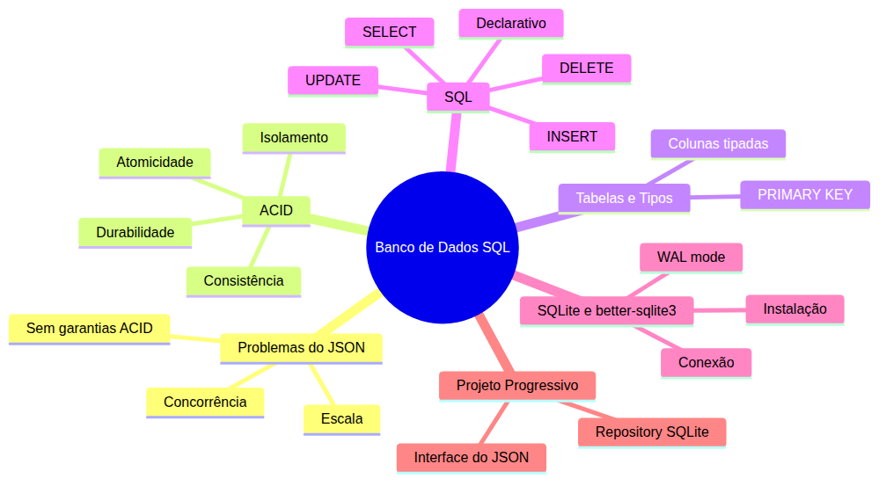

# Curso de Banco de Dados SQL — Aula 01

## Banco de Dados SQL — Conceitos, Tabelas e SQLite

**Duração estimada:** 100 minutos (45 de leitura + 55 de prática)
**Nível:** Iniciante
**Pré-requisitos:** Node.js, Express, manipulação de JSON com fs.promises, Repository Pattern (curso-nodejs, Aula 10)

---

## Objetivos de Aprendizagem

Ao final desta aula, você será capaz de:

- [ ] **Identificar** as limitações do armazenamento em JSON para aplicações reais
- [ ] **Explicar** os quatro pilares ACID com exemplos do Gerenciador de Tarefas
- [ ] **Definir** o que são tabelas, colunas e tipos de dados em bancos relacionais
- [ ] **Distinguir** bancos de dados relacionais de armazenamento em arquivos
- [ ] **Explicar** o que é SQL e sua natureza declarativa
- [ ] **Identificar** os quatro comandos fundamentais do SQL (CRUD)
- [ ] **Instalar** e configurar o SQLite com better-sqlite3 em um projeto Node.js
- [ ] **Criar** tabelas com CREATE TABLE usando colunas, tipos e constraints
- [ ] **Inserir** dados com INSERT e consultar com SELECT
- [ ] **Atualizar** registros com UPDATE e remover com DELETE
- [ ] **Construir** um repository SQLite que preserva a interface do repository JSON
- [ ] **Converter** tipos INTEGER para Boolean ao ler dados do SQLite

---

## Como Usar Esta Aula

Esta aula está organizada em duas partes. A **primeira parte** constrói os fundamentos conceituais: problemas do JSON, ACID, tabelas e SQL. A **segunda parte** aplica esses conceitos com SQLite e better-sqlite3. Ao final, o arquivo separado de Questões de Aprendizagem traz as tarefas de checkpoint.

**Tempo estimado:** 45 minutos de leitura + 55 minutos de prática (código, exercícios e questões).

---

## Mapa Mental





> *O mapa mental acima mostra a estrutura da aula. Cada ramo representa um conceito que você vai explorar.*

---

**FUNDAMENTOS: Armazenamento, Dados e Consultas — o Que Existe Antes do Banco**

> *Os conceitos desta seção são universais — valem para qualquer banco de dados relacional, independentemente da ferramenta específica. Na segunda parte, você verá como o SQLite implementa cada um deles.*

---

## 1. Por que JSON Não é Suficiente — o Problema que o Banco Resolve

Você já tem um Gerenciador de Tarefas funcional. Ele salva dados em `tarefas.json`, lê com `fs.readFileSync`, escreve com `fs.writeFileSync`. Funciona. Mas tem três problemas fatais que só aparecem quando a aplicação cresce.

**Problema 1: não escala.** Com 10 tarefas, o JSON é lido em milissegundos. Com 100 mil tarefas e 50 requisições por segundo, cada leitura carrega o arquivo INTEIRO na memória. Você não consegue responder "quais tarefas foram criadas ontem?" sem percorrer todos os registros. Um banco de dados indexa os dados — você consulta só o que precisa.

**Problema 2: sem concorrência.** Duas requisições chegam ao mesmo tempo. A primeira lê o JSON, adiciona uma tarefa e escreve. A segunda leu o JSON ANTES da primeira escrever — e sobrescreve o arquivo com os dados antigos. A primeira tarefa sumiu. Isso é uma *race condition*.

**Problema 3: sem garantias.** O servidor cai no meio de um `writeFile`. O arquivo `tarefas.json` fica corrompido — metade dos dados escritos, o resto é lixo binário. Não há "desfazer". Não há "tudo ou nada".

Bancos de dados resolvem esses três problemas com um conjunto de propriedades chamado **ACID**.

### ACID — Atomicidade, Consistência, Isolamento, Durabilidade

ACID é um acrônimo para quatro garantias que um banco de dados relacional oferece. Vamos ver cada uma com exemplos do seu Gerenciador de Tarefas.

**Atomicidade:** ou a operação completa inteira, ou ela não acontece. Imagine que você está criando uma tarefa E enviando um e-mail de notificação. Se o e-mail falha, a tarefa não deveria ter sido criada. Com JSON, o `writeFile` já escreveu a tarefa — não tem como voltar atrás. No banco, você usa uma *transação*: se algo falha, o banco desfaz tudo como se nada tivesse acontecido.

**Consistência:** os dados sempre respeitam as regras definidas. No JSON, você pode escrever `"concluida": "talvez"` ou `"concluida": null` — não há nenhuma garantia de que o campo é verdadeiro ou falso. No banco, você define que `concluida` é INTEGER e, se quiser, que só aceita 0 ou 1. O banco REJEITA dados inconsistentes.

**Isolamento:** duas operações simultâneas não interferem uma na outra. Lembra da race condition? O banco isola as transações — a segunda requisição espera a primeira terminar. Cada uma vê uma versão consistente dos dados.

**Durabilidade:** uma vez confirmada, a operação sobrevive a quedas de energia. O `writeFile` parcial não acontece. O banco usa técnicas como *WAL* (Write-Ahead Log) para garantir que, se o servidor cair, os dados confirmados estão seguros.

> *"ACID transforma seu banco de dados de uma caixa frágil em um cofre confiável. Cada uma das quatro letras é uma promessa que o banco faz para seus dados."*

### Quick Check 1

**1. Qual dos três problemas do JSON é resolvido pelo isolamento ACID?**
**Resposta:** O problema da concorrência (race condition). O isolamento garante que duas transações simultâneas não interfiram uma na outra.

**2. O que acontece com uma operação incompleta em um banco que respeita atomicidade?**
**Resposta:** A operação inteira é desfeita (rollback) — o banco volta ao estado anterior como se nada tivesse acontecido.

---

## 2. Tabelas — a Estrutura dos Dados Relacionais

Se JSON é uma gaveta bagunçada onde você joga arquivos, uma tabela é uma **planilha organizada**. Cada linha é um registro (uma tarefa), cada coluna é um campo (título, data, status).

### Colunas Tipadas

Diferente do JSON, onde um campo pode ser string em um objeto e número em outro, um banco relacional exige que cada coluna tenha um **tipo fixo**.

Os tipos mais comuns são:

| Tipo | O que guarda | Exemplo |
|---|---|---|
| INTEGER | Números inteiros | 1, 42, 0 |
| TEXT | Texto (qualquer tamanho) | "Comprar pão" |
| REAL | Números decimais | 3.14, 99.90 |
| BLOB | Dados binários | Imagens, arquivos |

Veja um exemplo. No JSON você pode ter:

```json
[
  { "id": 1, "titulo": "Comprar pão", "concluida": false },
  { "id": "dois", "titulo": "Estudar SQL", "concluida": "sim" }
]
```

Percebeu? O `id` do segundo é string, e `concluida` é string também. O JSON aceita — mas seu programa que espera `id` como número vai quebrar. No banco, isso é impossível: se a coluna é INTEGER, o banco SÓ aceita números.

### PRIMARY KEY

Toda tabela tem uma **chave primária** — uma coluna (ou conjunto de colunas) que identifica CADA linha de forma única.

Pense no CPF: cada pessoa tem um CPF diferente. Se você buscar pelo CPF, sabe exatamente quem é. A `PRIMARY KEY` é o CPF da tabela.

No JSON, você controla os IDs manualmente. No banco, você pode pedir para ele gerar automaticamente usando `AUTOINCREMENT` — a cada nova linha, o banco atribui o próximo número disponível.

### Contraste com JSON

| Característica | JSON | Banco Relacional |
|---|---|---|
| Tipo dos dados | Dinâmico (qualquer valor) | Fixo (coluna tipada) |
| Garantia de unicidade | Nenhuma | PRIMARY KEY |
| Consulta eficiente | Percorre tudo | Índices + SQL |
| Concorrência | Race conditions | Transações isoladas |

### Quick Check 2

**1. O que acontece se você tentar inserir um texto em uma coluna definida como INTEGER?**
**Resposta:** O banco rejeita a operação com um erro de tipo. Diferente do JSON, que aceitaria qualquer valor.

**2. Para que serve a PRIMARY KEY em uma tabela?**
**Resposta:** Para identificar cada linha de forma única. Garante que não existam dois registros com o mesmo valor na chave primária.

---

## 3. SQL — a Linguagem que Conversa com o Banco

SQL (Structured Query Language) é a **língua franca** dos bancos relacionais. Com ela você cria tabelas, insere dados, consulta, atualiza e deleta.

### Declarativo vs Imperativo

JavaScript é imperativo: você diz COMO fazer cada passo. SQL é declarativo: você diz O QUE quer, e o banco descobre COMO fazer.

```javascript
// Imperativo (JavaScript) — você diz o passo a passo
const dados = fs.readFileSync('tarefas.json', 'utf-8')
const tarefas = JSON.parse(dados)
const ativas = tarefas.filter(t => !t.concluida)
```

```sql
-- Declarativo (SQL) — você diz o que quer
SELECT * FROM tarefas WHERE concluida = 0
```

No SQL, você não abre arquivo, não faz parse, não percorre array. Você simplesmente diz "me dê as tarefas não concluídas". O banco decide se usa índice, se lê da memória ou do disco, em que ordem.

### CRUD — Create, Read, Update, Delete

Quatro operações fundamentais que você vai usar em toda aplicação:

**CREATE (INSERT):** adiciona uma nova linha na tabela.

```sql
INSERT INTO tarefas (titulo, concluida) VALUES ('Comprar pão', 0)
```

**READ (SELECT):** busca dados da tabela.

```sql
SELECT * FROM tarefas
SELECT titulo FROM tarefas WHERE concluida = 0
```

**UPDATE:** modifica linhas existentes.

```sql
UPDATE tarefas SET concluida = 1 WHERE id = 1
```

**DELETE:** remove linhas da tabela.

```sql
DELETE FROM tarefas WHERE id = 1
```

> *Esses quatro comandos são 90% do que você vai escrever em SQL no dia a dia. O segredo é praticar cada um até virar automático.*

### Quick Check 3

**1. Qual a diferença entre uma linguagem declarativa e uma imperativa?**
**Resposta:** Na declarativa (SQL) você diz O QUE quer; na imperativa (JavaScript) você diz COMO fazer.

**2. Qual comando SQL você usa para buscar apenas tarefas concluídas?**
**Resposta:** `SELECT * FROM tarefas WHERE concluida = 1` (ou `WHERE concluida = true` em bancos que suportam Boolean).

---

**APLICAÇÃO: SQLite e better-sqlite3 — Teoria em Prática**

> *Agora que você entende os conceitos de tabelas, SQL e ACID, vamos conectá-los à prática com SQLite e better-sqlite3. Tudo que você leu até aqui se materializa em código a partir de agora.*

---

## 4. SQLite — o Banco de Dados Mais Simples que Existe

SQLite é um banco de dados **embutido**: não precisa de servidor, não precisa de instalação complexa, não precisa de configuração. O banco é um arquivo único (`.db`) que seu programa lê e escreve diretamente.

É o banco mais usado no mundo — está em todo celular Android, no Chrome, no Firefox, no macOS. Perfeito para aprender porque não tem complicação operacional.

### Instalação no Node.js

No seu projeto do Gerenciador de Tarefas, instale:

```bash
npm install better-sqlite3
```

O `better-sqlite3` é uma biblioteca Node.js que permite executar SQL no SQLite de forma **síncrona** — a query retorna o resultado direto, sem callbacks ou Promises. Para um servidor Express, isso simplifica muito.

### Criando a Conexão

```javascript
const Database = require('better-sqlite3')
const db = new Database('dados.db')
```

Pronto. A primeira linha conecta ao arquivo `dados.db`. Se o arquivo não existe, ele é criado automaticamente.

### WAL Mode — Desempenho em Concorrência

Por padrão, o SQLite usa modo *journal* (arquivo de diário). Para aplicações com leitura e escrita simultâneas, o modo **WAL** (Write-Ahead Log) é mais rápido:

```javascript
db.pragma('journal_mode = WAL')
```

O WAL permite que várias leituras aconteçam ao mesmo tempo que uma escrita — sem bloqueios. Isso resolve o problema de concorrência que vimos na Parte 1.

### Quick Check 4

**1. SQLite precisa de um servidor instalado separadamente para funcionar?**
**Resposta:** Não. SQLite é embutido — o banco é um arquivo único lido diretamente pela aplicação.

**2. O que faz o comando `db.pragma('journal_mode = WAL')`?**
**Resposta:** Ativa o modo Write-Ahead Log, que melhora o desempenho em cenários de leitura e escrita simultâneas.

---

## 5. Criando a Tabela de Tarefas com CREATE TABLE

Agora vamos criar a tabela que vai armazenar as tarefas. Este é o `CREATE TABLE` que vamos usar:

```sql
CREATE TABLE tarefas (
  id INTEGER PRIMARY KEY AUTOINCREMENT,
  titulo TEXT NOT NULL,
  concluida INTEGER DEFAULT 0,
  criada_em TEXT DEFAULT CURRENT_TIMESTAMP
)
```

Entendendo cada coluna:

- **id** — INTEGER, chave primária, auto incremento. O banco gera o número sozinho.
- **titulo** — TEXT, obrigatório (`NOT NULL`). O nome da tarefa. (Nota: usamos `titulo` para manter consistência com seu Gerenciador de Tarefas do curso-nodejs.)
- **concluida** — INTEGER, valor padrão 0 (falso). SQLite não tem tipo Boolean — usamos 0 para falso e 1 para verdadeiro.
- **criada_em** — TEXT, padrão é a data/hora atual (`CURRENT_TIMESTAMP`). O banco preenche automaticamente.

### Mão na Massa — Criar Tabela

Vamos criar um arquivo de setup. Crie `setup-banco.js`:

```javascript
const Database = require('better-sqlite3')

const db = new Database('dados.db')
db.pragma('journal_mode = WAL')

db.exec(`
  CREATE TABLE IF NOT EXISTS tarefas (
    id INTEGER PRIMARY KEY AUTOINCREMENT,
    titulo TEXT NOT NULL,
    concluida INTEGER DEFAULT 0,
    criada_em TEXT DEFAULT CURRENT_TIMESTAMP
  )
`)

console.log('Tabela criada com sucesso!')
```

Execute:

```bash
node setup-banco.js
```

**Verificação:** O console mostra "Tabela criada com sucesso!" e o arquivo `dados.db` aparece no diretório.

### Quick Check 5

**1. O que faz a constraint NOT NULL em uma coluna?**
**Resposta:** Garante que a coluna não pode ficar vazia — toda linha inserida deve ter um valor para aquela coluna.

**2. Por que `concluida` é INTEGER e não BOOLEAN no SQLite?**
**Resposta:** SQLite não tem tipo Boolean nativo. Usamos 0 para falso e 1 para verdadeiro, convertendo na leitura do repository.

---

## 6. Inserindo e Consultando Dados

### INSERT — Adicionar Tarefas

```javascript
const inserirTarefa = db.prepare(`
  INSERT INTO tarefas (titulo, concluida) VALUES (?, ?)
`)

inserirTarefa.run('Comprar pão', 0)
inserirTarefa.run('Estudar SQL', 0)
inserirTarefa.run('Ler documentação do Express', 1)
```

O `?` é um **placeholder** — o better-sqlite3 substitui pelos valores que você passa no `run()`. Isso protege contra SQL injection (mais sobre isso na Aula 02).

### SELECT — Consultar Tarefas

```javascript
// Todas as tarefas
const todas = db.prepare('SELECT * FROM tarefas').all()
console.log(todas)

// Tarefas não concluídas (WHERE com filtro)
const pendentes = db.prepare('SELECT * FROM tarefas WHERE concluida = 0').all()
console.log(pendentes)

// Tarefa específica (WHERE com parâmetro)
const tarefa = db.prepare('SELECT * FROM tarefas WHERE id = ?').get(1)
console.log(tarefa)

// Projeção — só algumas colunas
const titulos = db.prepare('SELECT titulo, criada_em FROM tarefas').all()
console.log(titulos)
```

Perceba os métodos:
- `.all()` — retorna um array com todas as linhas
- `.get()` — retorna a primeira linha (ou `undefined` se não achar)

### Mão na Massa — Inserir e Consultar

Crie `crud-tarefas.js`:

```javascript
const Database = require('better-sqlite3')

const db = new Database('dados.db')
db.pragma('journal_mode = WAL')

// Inserir
const inserir = db.prepare('INSERT INTO tarefas (titulo, concluida) VALUES (?, ?)')
inserir.run('Finalizar relatório', 0)
inserir.run('Reunião com equipe', 0)

// Listar todas
console.log('Todas as tarefas:')
console.log(db.prepare('SELECT * FROM tarefas').all())

// Buscar por ID
const tarefa = db.prepare('SELECT * FROM tarefas WHERE id = ?').get(1)
console.log('Tarefa #1:')
console.log(tarefa)
```

Execute e veja os resultados no terminal.

### Quick Check 6

**1. Qual a diferença entre os métodos `.all()` e `.get()` do better-sqlite3?**
**Resposta:** `.all()` retorna um array com todas as linhas encontradas; `.get()` retorna apenas a primeira linha (ou `undefined` se não encontrar nenhuma).

**2. O que faz o placeholder `?` em uma query preparada?**
**Resposta:** Ele é um espaço reservado que o better-sqlite3 substitui pelo valor passado em `run()`, `get()` ou `all()`, protegendo contra SQL injection.

---

## 7. Atualizando e Removendo Dados

### UPDATE — Marcar como Concluída

```javascript
const atualizar = db.prepare('UPDATE tarefas SET concluida = 1 WHERE id = ?')
atualizar.run(2)
```

### DELETE — Remover Tarefa

```javascript
const remover = db.prepare('DELETE FROM tarefas WHERE id = ?')
remover.run(3)
```

### ⚠️ Regra de Ouro: SEMPRE use WHERE

O erro mais comum de quem começa com SQL é esquecer o WHERE:

```sql
-- ISSO DELETA TUDO (sem WHERE)
DELETE FROM tarefas

-- ISSO ATUALIZA TUDO (sem WHERE)
UPDATE tarefas SET concluida = 1
```

Sem WHERE, o comando atinge TODAS as linhas. É como `array.splice(0)` sem querer. Sempre verifique: "eu passei um WHERE?" antes de executar UPDATE ou DELETE.

### Mão na Massa — UPDATE e DELETE

Adicione ao `crud-tarefas.js`:

```javascript
// Atualizar: marcar tarefa 1 como concluída
const atualizar = db.prepare('UPDATE tarefas SET concluida = 1 WHERE id = ?')
atualizar.run(1)
console.log('Tarefa 1 concluída!')

// Deletar tarefa 2
const deletar = db.prepare('DELETE FROM tarefas WHERE id = ?')
deletar.run(2)
console.log('Tarefa 2 removida!')

// Conferir resultado
console.log('Estado final:')
console.log(db.prepare('SELECT * FROM tarefas').all())
```

### Quick Check 7

**1. O que acontece se você executar `DELETE FROM tarefas` sem WHERE?**
**Resposta:** Todas as linhas da tabela são removidas. O comando DELETE sem WHERE atinge a tabela inteira.

**2. Qual a regra de ouro antes de executar um UPDATE ou DELETE?**
**Resposta:** Sempre verificar se a cláusula WHERE está presente e se filtra exatamente as linhas que você quer modificar ou remover.

---

## 8. Projeto Progressivo — Repository com SQLite

Agora vem a parte mais importante da aula: **conectar o SQLite ao seu Gerenciador de Tarefas** sem mudar os controllers ou services.

Lembra do Repository Pattern? O repository JSON da Aula 10 do curso-nodejs tem esta interface:

```javascript
const tarefaRepo = {
  listar: () => { /* retorna array */ },
  buscarPorId: (id) => { /* retorna objeto ou null */ },
  criar: (dados) => { /* insere e retorna o novo registro */ },
  atualizar: (id, dados) => { /* atualiza e retorna */ },
  remover: (id) => { /* remove e retorna boolean */ }
}
```

Vamos criar `tarefa-repo-sqlite.js` com EXATAMENTE a mesma interface — mas usando SQLite.

### Conversão INTEGER para Boolean

Aqui tem uma diferença crucial: o SQLite armazena `concluida` como 0 ou 1 (INTEGER). Mas seu controller espera um Boolean (`true`/`false`). Na hora de ler, precisamos converter:

```javascript
function converterTarefa(row) {
  if (!row) return null
  return {
    ...row,
    concluida: row.concluida === 1  // converte 0/1 para false/true
  }
}
```

### Código Completo do Repository

Crie `repositorios/tarefa-repo-sqlite.js`:

```javascript
const Database = require('better-sqlite3')

let db

function initDatabase() {
  db = new Database('dados.db')
  db.pragma('journal_mode = WAL')

  db.exec(`
    CREATE TABLE IF NOT EXISTS tarefas (
      id INTEGER PRIMARY KEY AUTOINCREMENT,
      titulo TEXT NOT NULL,
      concluida INTEGER DEFAULT 0,
      criada_em TEXT DEFAULT CURRENT_TIMESTAMP
    )
  `)
}

function converterTarefa(row) {
  if (!row) return null
  return {
    ...row,
    concluida: row.concluida === 1
  }
}

const tarefaRepo = {
  listar() {
    const rows = db.prepare('SELECT * FROM tarefas').all()
    return rows.map(converterTarefa)
  },

  buscarPorId(id) {
    const row = db.prepare('SELECT * FROM tarefas WHERE id = ?').get(id)
    return converterTarefa(row)
  },

  criar(dados) {
    const info = db.prepare(
      'INSERT INTO tarefas (titulo, concluida) VALUES (?, ?)'
    ).run(dados.titulo, dados.concluida ? 1 : 0)

    return this.buscarPorId(info.lastInsertRowid)
  },

  atualizar(id, dados) {
    db.prepare(
      'UPDATE tarefas SET titulo = ?, concluida = ? WHERE id = ?'
    ).run(dados.titulo, dados.concluida ? 1 : 0, id)

    return this.buscarPorId(id)
  },

  remover(id) {
    const info = db.prepare('DELETE FROM tarefas WHERE id = ?').run(id)
    return info.changes > 0
  }
}

initDatabase()
module.exports = tarefaRepo
```

Veja como a interface é IDÊNTICA ao repository JSON. Você pode trocar um pelo outro sem mudar uma linha dos services ou controllers. Isso é a beleza do Repository Pattern.

### Mão na Massa — Testar o Repository

Crie `testar-repo.js`:

```javascript
const tarefaRepo = require('./repositorios/tarefa-repo-sqlite')

// Criar
const nova = tarefaRepo.criar({ titulo: 'Estudar bancos de dados', concluida: false })
console.log('Criada:', nova)

// Listar
console.log('Lista:', tarefaRepo.listar())

// Buscar por ID
console.log('Busca:', tarefaRepo.buscarPorId(nova.id))

// Atualizar
const atualizada = tarefaRepo.atualizar(nova.id, { titulo: 'Estudar SQL', concluida: true })
console.log('Atualizada:', atualizada)

// Remover
const removida = tarefaRepo.remover(nova.id)
console.log('Removida?', removida)
```

Execute e veja o repository SQLite em ação.

### Quick Check 8

**1. Por que o repository SQLite precisa de uma função `converterTarefa`?**
**Resposta:** Porque o SQLite armazena `concluida` como INTEGER (0 ou 1), mas a aplicação espera Boolean (`true`/`false`). A função converte na leitura.

**2. Qual a vantagem de manter a mesma interface entre o repository JSON e o SQLite?**
**Resposta:** Permite trocar a implementação de armazenamento sem alterar uma linha dos services ou controllers — o Repository Pattern desacopla o acesso a dados do restante da aplicação.

---

## Autoavaliação: Quiz Rápido

**1. Qual propriedade ACID garante que uma operação incompleta é desfeita inteiramente?**
**Resposta:**

A atomicidade. Se qualquer passo da operação falha, o banco desfaz todos os passos anteriores (rollback).

**2. Qual a diferença entre JSON e uma tabela relacional quanto à tipagem dos dados?**
**Resposta:**

JSON tem tipagem dinâmica — um campo pode ser número em um objeto e string em outro. A tabela relacional tem tipagem fixa — cada coluna só aceita o tipo definido (INTEGER, TEXT, etc.).

**3. Para que serve a cláusula WHERE no SQL?**
**Resposta:**

Para filtrar quais linhas serão afetadas pelo comando. Sem WHERE, o comando atinge todas as linhas da tabela.

**4. SQLite precisa de um servidor separado para funcionar?**
**Resposta:**

Não. SQLite é um banco embutido — o banco é um arquivo único que a aplicação lê diretamente.

**5. Como o better-sqlite3 trata os placeholders `?` nas queries?**
**Resposta:**

Ele substitui cada `?` pelo valor passado no método (`run()`, `get()`, `all()`), protegendo contra SQL injection.

**6. Por que a coluna `concluida` é INTEGER e não BOOLEAN no SQLite?**
**Resposta:**

SQLite não possui tipo Boolean nativo. Usamos 0 para falso e 1 para verdadeiro, convertendo na leitura.

---

## Mão na Massa: Exercícios Graduados

**Exercício 1 (Fácil) — Consultar Tarefas por Data**

Crie uma query que lista todas as tarefas criadas no dia de hoje.

**Gabarito:**

```sql
SELECT * FROM tarefas WHERE criada_em >= date('now')
```

No Node.js:

```javascript
const hoje = db.prepare(
  "SELECT * FROM tarefas WHERE criada_em >= date('now')"
).all()
```

---

**Exercício 2 (Médio) — Inserir Múltiplas Tarefas**

Crie uma função que recebe um array de títulos e insere todas como não concluídas.

**Gabarito:**

```javascript
function inserirMultiplas(titulos) {
  const inserir = db.prepare(
    'INSERT INTO tarefas (titulo, concluida) VALUES (?, 0)'
  )

  const inseridas = []
  for (const titulo of titulos) {
    const info = inserir.run(titulo)
    inseridas.push({ id: info.lastInsertRowid, titulo, concluida: false })
  }

  return inseridas
}

console.log(inserirMultiplas(['Tarefa A', 'Tarefa B', 'Tarefa C']))
```

---

**Desafio (Difícil) — Evitar Títulos Duplicados**

Modifique o repository para impedir que duas tarefas tenham o mesmo título. Use a constraint `UNIQUE` na coluna `titulo`.

> O que é UNIQUE? A constraint UNIQUE garante que todos os valores em uma coluna sejam diferentes entre si. É como a PRIMARY KEY, mas para colunas que não são a chave primária.

**Gabarito:**

Altere o `CREATE TABLE`:

```sql
CREATE TABLE IF NOT EXISTS tarefas (
  id INTEGER PRIMARY KEY AUTOINCREMENT,
  titulo TEXT NOT NULL UNIQUE,
  concluida INTEGER DEFAULT 0,
  criada_em TEXT DEFAULT CURRENT_TIMESTAMP
)
```

No repository, trate o erro de duplicidade:

```javascript
criar(dados) {
  try {
    const info = db.prepare(
      'INSERT INTO tarefas (titulo, concluida) VALUES (?, ?)'
    ).run(dados.titulo, dados.concluida ? 1 : 0)

    return this.buscarPorId(info.lastInsertRowid)
  } catch (erro) {
    if (erro.message.includes('UNIQUE constraint failed')) {
      throw new Error('Já existe uma tarefa com este título')
    }
    throw erro
  }
}
```

---

## Resumo da Aula

### Os 8 Conceitos Fundamentais

1. **Problemas do JSON**: não escala, sem concorrência, sem garantias — bancos resolvem com ACID
2. **ACID**: Atomicidade (tudo ou nada), Consistência (regras respeitadas), Isolamento (transações independentes), Durabilidade (dados persistem após confirmação)
3. **Tabelas**: estrutura organizada com colunas tipadas e PRIMARY KEY para identificação única
4. **SQL**: linguagem declarativa para conversar com o banco — você diz O QUE, não COMO
5. **CRUD**: INSERT (criar), SELECT (ler), UPDATE (atualizar), DELETE (remover)
6. **SQLite**: banco embutido, zero-config, arquivo único — ideal para aprender e desenvolvimento
7. **better-sqlite3**: biblioteca síncrona para executar SQL no Node.js
8. **Repository Pattern com SQLite**: mesma interface do JSON, implementação diferente — services e controllers não mudam

### O Que Você Construiu Hoje

- [x] Arquivo `setup-banco.js` — criação da tabela tarefas
- [x] Arquivo `crud-tarefas.js` — INSERT, SELECT, UPDATE, DELETE
- [x] `repositorios/tarefa-repo-sqlite.js` — repository SQLite com interface compatível com JSON
- [x] `testar-repo.js` — teste completo do repository

---

## Próxima Aula

**Aula 02: Knex — Query Builder e Por que Não SQL Puro**

Escrever SQL como string funciona para uma query. Para vinte endpoints com filtros dinâmicos, concatenar string é perigoso (SQL injection) e ilegível. Na próxima aula, você vai conhecer o Knex: um query builder que gera SQL seguro com uma API encadeável em JavaScript.

---

## Referências

### Documentação Oficial

- [SQLite Documentation](https://www.sqlite.org/docs.html)
- [better-sqlite3 API](https://github.com/WiseLibs/better-sqlite3)
- [WAL Mode (SQLite)](https://www.sqlite.org/wal.html)

### Ferramentas

- [DB Browser for SQLite](https://sqlitebrowser.org/) — visualize seu banco graficamente

### Artigos para Aprofundamento

- [ACID Explained](https://www.geeksforgeeks.org/acid-properties-in-dbms/)
- [SQLite vs JSON: When to Use Which](https://www.sqlite.org/json1.html)

---

## FAQ

**P: O SQLite é usado em produção?**
R: Sim. SQLite é usado em produção em aplicações mobile, desktop e sistemas embarcados. Para aplicações web com múltiplos usuários simultâneos, PostgreSQL ou MySQL são mais indicados.

**P: Posso usar async/await com better-sqlite3?**
R: O better-sqlite3 é síncrono por design — não precisa de async/await. Para versões assíncronas, use `sql.js` ou o driver nativo `sqlite3` (com callbacks).

**P: O que acontece se eu esquecer o WHERE no UPDATE?**
R: Todas as linhas da tabela são atualizadas. Sempre verifique seu WHERE antes de executar UPDATE ou DELETE.

**P: Como vejo o conteúdo do banco fora do Node.js?**
R: Use o DB Browser for SQLite, uma ferramenta gráfica que abre arquivos `.db` e permite visualizar e editar tabelas.

**P: O banco fica lento com muitos registros?**
R: SQLite performa bem até centenas de milhares de registros. Para milhões, considere PostgreSQL.

**P: Preciso fechar a conexão com o banco?**
R: O better-sqlite3 fecha automaticamente quando o processo Node.js termina. Para fechar manualmente, chame `db.close()`.

**P: O que significa IF NOT EXISTS no CREATE TABLE?**
R: Cria a tabela apenas se ela ainda não existe. Sem isso, executar o script duas vezes causaria erro "table already exists".

**P: Como escolho entre INTEGER e TEXT para datas?**
R: SQLite não tem tipo DATE. Use TEXT com formato ISO (`2026-07-14 10:30:00`) e as funções de data do SQLite.

---

## Glossário

| Termo | Definição |
|---|---|
| **ACID** | Conjunto de quatro propriedades (Atomicidade, Consistência, Isolamento, Durabilidade) que garantem processamento confiável de transações |
| **Atomicidade** | Propriedade que garante que uma transação é executada por completo ou é desfeita inteiramente (Ver seção 1) |
| **Chave primária** | Coluna (ou conjunto de colunas) que identifica cada linha da tabela de forma única (Ver seção 2) |
| **CRUD** | Acrônimo para Create (INSERT), Read (SELECT), Update (UPDATE), Delete (DELETE) (Ver seção 3) |
| **Declarativo** | Estilo de linguagem onde você declara O QUE quer, não COMO obter (Ver seção 3) |
| **Query** | Consulta ou comando enviado ao banco de dados |
| **SQL** | Structured Query Language — linguagem padrão para bancos relacionais (Ver seção 3) |
| **SQLite** | Banco de dados relacional embutido, sem servidor, armazenado em arquivo único (Ver seção 4) |
| **Tabela** | Estrutura que organiza dados em linhas e colunas, como uma planilha (Ver seção 2) |
| **Transação** | Unidade de trabalho que contém uma ou mais operações SQL (Ver seção 1) |
| **WAL** | Write-Ahead Log — modo de journal que melhora concorrência em leitura e escrita simultâneas (Ver seção 4) |
| **better-sqlite3** | Biblioteca Node.js síncrona para executar SQL no SQLite (Ver seção 4) |
