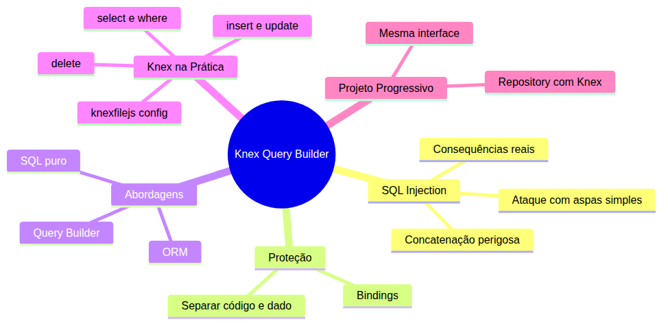

# Curso de Banco de Dados SQL — Aula 02

## Knex — Query Builder e Por que Não SQL Puro

**Duração estimada:** 90 minutos (40 de leitura + 50 de prática)
**Nível:** Intermediário
**Pré-requisitos:** Curso Node.js completo (Aula 10 — Repository Pattern com JSON), Aula 01 de Banco de Dados SQL (SQLite, better-sqlite3, CRUD SQL, `tarefa-repo-sqlite.js`)

---

## Objetivos de Aprendizagem

Ao final desta aula, você será capaz de:

- [ ] **Explicar** o que é SQL injection e como um atacante explora concatenação de strings
- [ ] **Demonstrar** um ataque de SQL injection em uma query vulnerável
- [ ] **Diferenciar** query builder, ORM e SQL puro indicando quando usar cada um
- [ ] **Explicar** como queries parametrizadas e bindings protegem contra injeção
- [ ] **Instalar** e configurar o Knex com o driver better-sqlite3
- [ ] **Criar** um arquivo knexfile.js de configuração
- [ ] **Substituir** `db.prepare(sql).all()` por `knex('tabela').select('*')`
- [ ] **Reescrever** o repository SQLite com Knex mantendo a interface inalterada
- [ ] **Comparar** a legibilidade entre SQL puro e Knex em queries dinâmicas

---

## Como Usar Esta Aula

Esta aula está organizada em duas partes. A **primeira parte** constrói os fundamentos de segurança em bancos de dados: SQL injection, queries parametrizadas e a diferença entre SQL puro, query builders e ORMs. A **segunda parte** aplica esses conceitos com Knex — substituindo o SQL puro do repository que você construiu na Aula 01. Ao final, o arquivo separado de Questões de Aprendizagem traz as tarefas de checkpoint.

**Tempo estimado:** 40 minutos de leitura + 50 minutos de prática.

---

## Mapa Mental





> *O mapa mental acima mostra a estrutura da aula. Cada ramo representa um conceito que você vai explorar.*

---

## Recapitulação da Aula 01

| Aula | Conceito | Onde aparece nesta aula | Como se conecta |
|---|---|---|---|
| Aula 01 | **SQLite + better-sqlite3** (seções 4-5) | Seções 5-7 | O Knex usa o mesmo driver better-sqlite3; a configuração muda, o banco é o mesmo |
| Aula 01 | **CRUD SQL** (seções 3, 6-7) | Seções 6-7 | Cada método do Knex (.select, .insert) substitui um comando SQL que você já conhece |
| Aula 01 | **Repository Pattern** (seção 8) | Seção 7 | Você vai reescrever o mesmo repository com Knex — interface idêntica |
| Aula 01 | **Placeholders `?`** (seção 6) | Seções 2-3 | O Knex trata bindings automaticamente — você não escreve `?` manualmente |

---

**FUNDAMENTOS: Segurança em Consultas — SQL Injection e a Camada de Proteção**

> *Os conceitos desta seção são universais — valem para qualquer banco de dados e qualquer linguagem de programação. SQL injection é um dos ataques mais comuns da web, e entender como ele funciona é essencial antes de conhecer a ferramenta que o previne. Na segunda parte, você verá como um query builder implementa cada proteção automaticamente.*

---

## 1. SQL Injection — o Perigo da Concatenação

Imagine que você está preenchendo um formulário de busca no seu Gerenciador de Tarefas. O campo diz "Buscar tarefa por título". Você digita "Comprar" e o sistema retorna todas as tarefas que contêm essa palavra.

Funciona assim: o servidor recebe o texto que você digitou e monta uma query SQL dinamicamente.

```sql
-- Com o valor "Comprar":
SELECT * FROM tarefas WHERE titulo = 'Comprar'
```

Isso gera o SQL acima. Perfeito.

Agora, em vez de "Comprar", o usuário digita **`'; DROP TABLE tarefas; --`**. A string vira:

```sql
SELECT * FROM tarefas WHERE titulo = ''; DROP TABLE tarefas; --'
```

O SQL entende isso como **três comandos**:
1. `SELECT * FROM tarefas WHERE titulo = ''` — busca vazia
2. `DROP TABLE tarefas` — apaga a tabela inteira
3. `--'` — comentário que ignora o resto

Pronto. Sua tabela `tarefas` com todos os registros dos seus usuários foi deletada. **Isso é SQL injection.**

### A Anatomia do Ataque

O problema não é o SQL. O problema é que você está **misturando código com dado**. O `'` digitado pelo usuário fecha a string SQL e permite que o restante seja interpretado como comandos.

Pense em uma carta de crédito. Você escreve "Pague ao portador R$ 1000,00". Se o portador puder editar a carta depois de você assinar, ele escreve "Pague ao portador R$ 10000,00" — um zero a mais. A concatenação de SQL é exatamente isso: o usuário escreve no campo de dados, mas o sistema trata como parte do código.

### Três Vetores de Ataque Comuns

**1. Injeção por aspas simples:** como no exemplo acima. O atacante insere `'` para fechar a string e depois adiciona comandos próprios.

**2. Injeção por UNION:** o atacante explora um SELECT para ler dados de outras tabelas. `' UNION SELECT * FROM usuarios --`. A query retorna uma união dos resultados — o atacante vê senhas e e-mails de outros usuários.

**3. Injeção cega (blind SQL injection):** o atacante não vê o resultado, mas consegue extrair informação perguntando SIM/NÃO. `' OR 1=1 --` retorna tudo; `' OR 1=2 --` retorna nada. Com tentativas suficientes, ele descobre dados caractere por caractere.

### Consequências Reais

SQL injection não é teoria. Em 2017, o ataque ao **Equifax** (uma das maiores empresas de crédito dos EUA) expôs dados de 147 milhões de pessoas — via SQL injection. Em 2016, vazaram 57 milhões de registros do **Uber** pelo mesmo vetor.

O mais assustador? O ataque do Equifax era trivial de prevenir. Uma query parametrizada teria impedido o maior vazamento de dados da história até então.

### Quick Check 1

**1. O que torna uma query vulnerável a SQL injection?**
**Resposta:** Concatenação direta de valores fornecidos pelo usuário na string SQL, sem separar o código dos dados.

**2. O que o caractere `'` (aspas simples) faz no contexto de SQL injection?**
**Resposta:** Fecha a string SQL que estava sendo construída, permitindo que o restante da entrada do usuário seja interpretado como comandos SQL.

---

## 2. Proteção com Queries Parametrizadas

A solução para SQL injection é tão antiga quanto o problema: **separar os dados do código**. Em vez de montar a string SQL manualmente, você envia a estrutura da query separada dos valores.

### Como Funciona

```sql
-- Concatenação (perigosa): o valor é embutido na string
SELECT * FROM tarefas WHERE titulo = 'Comprar'

-- Parametrizada (segura)
SELECT * FROM tarefas WHERE titulo = ?
```

O `?` é um **placeholder** ou **binding**. Você envia ao banco:
1. A estrutura da query: `SELECT * FROM tarefas WHERE titulo = ?`
2. Os valores: `['Comprar pão']` ou `["'; DROP TABLE tarefas; --"]`

O banco **sabe** que o valor do binding é dado, não código. Mesmo que o usuário digite `'; DROP TABLE tarefas; --`, o banco trata como o texto literal — exatamente como se fosse o título de uma tarefa.

### Por que Isolamento Funciona

No seu Gerenciador de Tarefas, você já usou bindings sem saber. Na Aula 01:

```sql
SELECT * FROM tarefas WHERE id = ?
```

O `?` ali não é só um placeholder conveniente — é uma **barreira de segurança**. O banco de dados sabe que o valor passado no binding deve ser tratado como dado, nunca como código.

### Analogia: o Caixa Eletrônico

Uma query não parametrizada é como dar um cheque em branco para alguém. A pessoa escreve o valor que quiser. Uma query parametrizada é como um formulário pré-impresso com campos fixos — você só preenche os espaços em branco, não pode escrever novas linhas.

O banco de dados faz o papel do caixa: ele sabe que o campo "valor" aceita números e que a linha "instruções adicionais" não existe. O atacante pode escrever `'; DROP TABLE tarefas; --` no campo de título, mas para o banco isso é apenas o texto de um título — não um comando.

### Quick Check 2

**1. O que diferencia uma query parametrizada de uma query concatenada em termos de segurança?**
**Resposta:** Na query parametrizada, o banco recebe a estrutura SQL e os valores separadamente, tratando os valores como dados literais — nunca como comandos.

**2. Por que o binding `?` impede que `'; DROP TABLE tarefas; --` seja executado como comando?**
**Resposta:** Porque o banco interpreta o valor do binding como uma string literal (um dado), não como parte do código SQL. As aspas e comandos dentro do binding perdem o significado especial.

---

## 3. Query Builder, ORM e SQL Puro — Três Abordagens

Agora que você entende SQL injection e a proteção com bindings, vamos olhar para as três formas de escrever queries no código.

### SQL Puro

Você escreve a query SQL como string e envia para o banco. Exatamente o que fez na Aula 01.

**Vantagens:** controle total sobre o SQL, sem abstrações entre você e o banco. Perfeito para queries complexas, otimizações específicas ou quando você precisa de uma função SQL que a abstração não expõe.

**Desvantagens:** você gerencia bindings manualmente, precisa saber o dialeto SQL do banco, e a query não é "verificável" até executar — um erro de digitação em `UDPATE` só aparece em runtime.

**Segurança:** depende de você lembrar de usar bindings em TODOS os lugares. Um `?` esquecido vira um `'${dado}'` vulnerável.

### Query Builder

Você escreve a query usando métodos encadeáveis. Exemplo conceitual (sem produto específico):

```
query('tarefas')
  .select('*')
  .where('concluida', 0)
  .orderBy('criada_em', 'desc')
```

O query builder gera a string SQL internamente e aplica bindings automaticamente. Você nunca concatena strings — cada método adiciona uma cláusula.

**Vantagens:** bindings automáticos (sem risco de esquecer), portabilidade entre bancos (mesmo código gera SQL diferente para SQLite, PostgreSQL, MySQL), e detecção de erros de sintaxe mais cedo.

**Desvantagens:** uma camada extra entre você e o banco. Para queries muito específicas, você pode precisar escrever SQL puro dentro do query builder.

**Segurança:** embutida no design. Como você nunca monta strings SQL manualmente, SQL injection é estruturalmente prevenido.

### ORM (Object-Relational Mapping)

Você interage com o banco como se fossem objetos, sem escrever SQL ou usar query builder:

```
Tarefa.findAll({ where: { concluida: false } })
```

**Vantagens:** produtividade máxima para CRUD simples. Muda de banco sem mudar código. Migrations e seeds integrados.

**Desvantagens:** performance imprevisível para queries complexas. O ORM gera SQL que você não controla — às vezes gera N+1 queries sem você perceber.

**Segurança:** geralmente segura, mas a complexidade extra pode introduzir vetores de ataque menos óbvios (como mass assignment).

### Comparação

| Característica | SQL Puro | Query Builder | ORM |
|---|---|---|---|
| Controle sobre o SQL | Total | Alto | Baixo |
| Segurança contra injection | Manual (bindings) | Automática | Automática |
| Portabilidade entre bancos | Nenhuma | Alta | Alta |
| Curva de aprendizado | Baixa | Média | Alta |
| Performance previsível | Sim | Sim | Nem sempre |
| Verbosidade | Baixa | Média | Baixa |

### Quick Check 3

**1. Qual a principal diferença entre um query builder e um ORM?**
**Resposta:** O query builder gera SQL a partir de métodos — você ainda escreve a estrutura da query, mas em código. O ORM abstrai o banco em objetos — você não escreve SQL nem estrutura de query.

**2. Em que cenário o SQL puro é preferível a um query builder ou ORM?**
**Resposta:** Quando você precisa de controle total sobre o SQL gerado — queries complexas com otimizações específicas de banco, funções SQL proprietárias ou performance máxima sem camadas intermediárias.

---

## 4. O Query Builder como Camada de Segurança

Aqui está o coração do argumento desta aula: um query builder não é só uma conveniência — é uma **camada de segurança estrutural**.

### Bindings Automáticos

No SQL puro, o binding é uma **disciplina**: você precisa lembrar de colocar `?` em cada valor e passar os parâmetros na ordem certa — `SELECT * FROM tarefas WHERE titulo = ? AND concluida = ?`.

No query builder, o binding é **estrutural**: cada método recebe valores e o query builder decide onde colocar os bindings.

```
query('tarefas').select('*').where({ titulo: busca, concluida: 0 })
```

Você não escreve `?`. Você não conta parâmetros. Você não pode "esquecer" de usar um binding porque a API não aceita concatenação.

### Método Encadeável — Impossível Concatenar

No SQL puro, é tentador ir concatenando cláusulas WHERE com os valores diretamente na string — `AND titulo = 'valor'` — e cada concatenação é uma porta para injeção.

No query builder, cada `.where()` adiciona uma cláusula com binding automático — `q.where('titulo', valor)` — você nunca toca em string SQL.

### Portabilidade entre Bancos

Esta é a cereja do bolo: um query builder gera SQL no **dialeto correto** para o banco que você está usando. O mesmo código `.where('criada_em', '>=', '2026-01-01')` gera:

- SQLite/PostgreSQL: `WHERE criada_em >= ?` (bindings)
- MySQL: `` WHERE criada_em >= ? `` (bindings, mas sem os colchetes do MySQL)

Isso significa que hoje você pode usar SQLite para desenvolvimento e, quando for para produção com PostgreSQL (que veremos em aulas futuras), o query builder ajusta o SQL automaticamente — e sempre com bindings.

### Resumo de Segurança

| Risco | SQL Puro | Query Builder |
|---|---|---|
| Concatenação acidental | Fácil de acontecer | Estruturalmente impossível |
| Binding esquecido | Um `?` a menos = vulnerabilidade | Automático em toda chamada |
| Dialeto incorreto | Você precisa saber o dialeto | O query builder traduz |
| Injeção em ORDER BY | Precisa de sanitização manual | Tratado pelo método `.orderBy()` |

### Quick Check 4

**1. Como o método encadeável de um query builder previne SQL injection?**
**Resposta:** Porque você nunca constrói strings SQL manualmente. Cada método adiciona cláusulas com bindings automáticos — não há concatenação para explorar.

**2. O que significa "portabilidade entre bancos" no contexto de um query builder?**
**Resposta:** O mesmo código gera queries SQL no dialeto correto para cada banco (SQLite, PostgreSQL, MySQL), permitindo trocar de banco sem reescrever as queries.

---

**APLICAÇÃO: Knex — Query Builder SQL em JavaScript**

> *Agora que você entende SQL injection, queries parametrizadas e o papel dos query builders, vamos conectar esses conceitos à prática com o **Knex** — o query builder mais popular do ecossistema Node.js. Você vai instalar, configurar e usar o Knex para reescrever o repository da Aula 01 sem mudar a interface.*

---

## 5. Instalação e Configuração do Knex

O Knex é um query builder para Node.js que suporta SQLite, PostgreSQL, MySQL e vários outros bancos. A instalação é simples: o pacote `knex` mais o driver do banco que você quer usar.

### Instalação

No diretório do seu Gerenciador de Tarefas:

```bash
npm install knex better-sqlite3
```

O `knex` é o query builder. O `better-sqlite3` é o driver SQLite que você já conhece da Aula 01.

### knexfile.js — Configuração Centralizada

O Knex usa um arquivo de configuração chamado `knexfile.js` na raiz do projeto. É aqui que você define qual banco usar, o caminho do arquivo e outras opções:

```javascript
// knexfile.js
module.exports = {
  client: 'better-sqlite3',
  connection: {
    filename: './dados.db'
  },
  useNullAsDefault: true
}
```

**Campos:**
- **client**: o driver do banco. `'better-sqlite3'` para SQLite, `'pg'` para PostgreSQL.
- **connection.filename**: caminho do arquivo do banco SQLite. Exatamente o mesmo `dados.db` da Aula 01.
- **useNullAsDefault**: configuração específica do SQLite. O SQLite não suporta valores default para colunas nullable — esta opção evita warnings.

### Criando a Conexão com Knex

Com o `knexfile.js` configurado, você cria a instância do Knex no seu código:

```javascript
const knexConfig = require('./knexfile')
const knex = require('knex')(knexConfig)
```

Ou de forma mais comum, exportando diretamente:

```javascript
// conexao-knex.js
const knex = require('knex')({
  client: 'better-sqlite3',
  connection: {
    filename: './dados.db'
  },
  useNullAsDefault: true
})

module.exports = knex
```

> *Perceba: diferente do `new Database('dados.db')` da Aula 01, agora você tem uma instância do Knex configurada. O Knex gerencia a conexão internamente.*

### Testando a Conexão

```javascript
const knex = require('./conexao-knex')

knex.raw('SELECT 1 + 1 AS resultado')
  .then(resultado => console.log('Conectado!', resultado))
  .catch(erro => console.error('Erro:', erro))
```

Se aparecer "Conectado!" sem erros, sua configuração está correta.

### Mão na Massa — Configurar Knex

- [ ] Crie `knexfile.js` na raiz do projeto com client `better-sqlite3`, filename `./dados.db` e `useNullAsDefault: true`
- [ ] Crie `conexao-knex.js` que importa a configuração e exporta a instância do Knex
- [ ] Execute `node -e "require('./conexao-knex').raw('SELECT 1').then(() => console.log('OK'))"` para testar

**Verificação:** O terminal exibe "OK" sem erros. O arquivo `dados.db` (se não existia) é criado.

### Quick Check 5

**1. Qual a função do arquivo knexfile.js?**
**Resposta:** Centralizar a configuração do Knex: driver do banco, caminho do arquivo ou connection string, e opções específicas.

**2. Para que serve a opção `useNullAsDefault: true` na configuração do Knex com SQLite?**
**Resposta:** O SQLite não suporta valores default para colunas nullable sem valor explícito. Esta opção define NULL como valor padrão, evitando warnings do Knex.

---

## 6. Knex na Prática — SELECT, INSERT, UPDATE, DELETE

Agora vamos traduzir cada comando SQL que você aprendeu na Aula 01 para a sintaxe do Knex.

### SELECT — Consultar Dados

```javascript
// SQL puro
db.prepare('SELECT * FROM tarefas').all()

// Knex
await knex('tarefas').select('*')
```

Perceba: `knex('tarefas')` é equivalente a `FROM tarefas`. O `.select('*')` é opcional — `knex('tarefas')` por si só já faz `SELECT * FROM tarefas`.

**Com filtro:**

```javascript
// SQL puro
db.prepare('SELECT * FROM tarefas WHERE concluida = ?').all(0)

// Knex
await knex('tarefas').where('concluida', 0)
```

**Múltiplos filtros:**

```javascript
// SQL puro
db.prepare(
  'SELECT * FROM tarefas WHERE titulo LIKE ? AND concluida = ?'
).all('%comprar%', 0)

// Knex
await knex('tarefas')
  .where('titulo', 'like', '%comprar%')
  .where('concluida', 0)
```

**Ordenação:**

```javascript
// SQL puro
db.prepare('SELECT * FROM tarefas ORDER BY criada_em DESC').all()

// Knex
await knex('tarefas').orderBy('criada_em', 'desc')
```

### INSERT — Inserir Dados

```javascript
// SQL puro
db.prepare('INSERT INTO tarefas (titulo, concluida) VALUES (?, ?)').run('Comprar pão', 0)

// Knex
const [id] = await knex('tarefas').insert({ titulo: 'Comprar pão', concluida: 0 })
```

O `.insert()` recebe um objeto. As chaves são os nomes das colunas, os valores são os dados. O Knex gera o INSERT com bindings automaticamente.

O retorno é um array com o ID da nova linha (no SQLite, é o `lastInsertRowid`).

**Múltiplas linhas:**

```javascript
await knex('tarefas').insert([
  { titulo: 'Comprar pão', concluida: 0 },
  { titulo: 'Estudar SQL', concluida: 0 },
  { titulo: 'Ler docs', concluida: 1 }
])
```

### UPDATE — Atualizar Dados

```javascript
// SQL puro
db.prepare('UPDATE tarefas SET concluida = 1 WHERE id = ?').run(5)

// Knex
await knex('tarefas').where('id', 5).update({ concluida: 1 })
```

A ordem importa: primeiro você identifica as linhas (`.where`), depois define o que atualizar (`.update`).

### DELETE — Remover Dados

```javascript
// SQL puro
db.prepare('DELETE FROM tarefas WHERE id = ?').run(5)

// Knex
await knex('tarefas').where('id', 5).del()
```

### Método Encadeável na Prática

O poder do Knex aparece em queries mais complexas:

```javascript
const tarefasRecentes = await knex('tarefas')
  .select('id', 'titulo', 'criada_em')
  .where('concluida', 0)
  .where('criada_em', '>=', '2026-07-01')
  .orderBy('criada_em', 'desc')
  .limit(10)
```

Compare com o SQL puro equivalente:

```javascript
const sql = `
  SELECT id, titulo, criada_em 
  FROM tarefas 
  WHERE concluida = ? AND criada_em >= ? 
  ORDER BY criada_em DESC 
  LIMIT 10
`
db.prepare(sql).all(0, '2026-07-01')
```

A diferença principal: no Knex, cada cláusula é um método com contexto. O `.where()` sabe que está adicionando uma condição. O `.orderBy()` sabe que é ordenação. Você não precisa gerenciar a posição dos `?` — o Knex faz isso.

### Mão na Massa — Queries com Knex

- [ ] Crie `testar-knex.js` que conecta ao banco via Knex
- [ ] Faça um SELECT de todas as tarefas
- [ ] Insira duas novas tarefas com `.insert()`
- [ ] Atualize uma tarefa como concluída com `.where().update()`
- [ ] Liste as tarefas pendentes ordenadas por data
- [ ] Remova uma tarefa com `.where().del()`

**Verificação:** Cada operação exibe o resultado no terminal. Compare com o `crud-tarefas.js` da Aula 01.

### Quick Check 6

**1. Qual a diferença entre `knex('tarefas').select('*')` e `knex('tarefas')`?**
**Resposta:** Nenhuma. `knex('tarefas')` já é equivalente a `SELECT * FROM tarefas`. O `.select('*')` é explícito mas redundante.

**2. No Knex, o que o método `.del()` faz e por que ele NÃO se chama `.delete()`?**
**Resposta:** Remove linhas da tabela. O Knex usa `.del()` em vez de `.delete()` porque `delete` é uma palavra reservada em JavaScript e também porque `.del()` é mais curto e consistente com a nomenclatura do Knex.

---

## 7. Projeto Progressivo — Repository com Knex

Agora vamos ao ponto central: **reescrever `tarefa-repo-sqlite.js` usando Knex** sem mudar a interface que services e controllers esperam.

### A Interface que Não Muda

Lembra da interface do repository? Ela é exatamente a mesma da Aula 01 e do curso-nodejs:

```javascript
const tarefaRepo = {
  listar: () => { /* retorna array de tarefas */ },
  buscarPorId: (id) => { /* retorna tarefa ou null */ },
  criar: (dados) => { /* insere e retorna a nova tarefa */ },
  atualizar: (id, dados) => { /* atualiza e retorna */ },
  remover: (id) => { /* remove e retorna boolean */ }
}
```

A única diferença é a implementação interna. O que antes usava `db.prepare(sql).all()` agora usa `knex('tarefas').select('*')`.

### Código Completo do Repository com Knex

Crie `repositorios/tarefa-repo-knex.js`:

```javascript
const knex = require('../conexao-knex')

function converterTarefa(row) {
  if (!row) return null
  return {
    ...row,
    concluida: row.concluida === 1
  }
}

const tarefaRepo = {
  async listar() {
    const rows = await knex('tarefas').select('*')
    return rows.map(converterTarefa)
  },

  async buscarPorId(id) {
    const row = await knex('tarefas').where('id', id).first()
    return converterTarefa(row)
  },

  async criar(dados) {
    const [id] = await knex('tarefas').insert({
      titulo: dados.titulo,
      concluida: dados.concluida ? 1 : 0
    })

    return this.buscarPorId(id)
  },

  async atualizar(id, dados) {
    await knex('tarefas')
      .where('id', id)
      .update({
        titulo: dados.titulo,
        concluida: dados.concluida ? 1 : 0
      })

    return this.buscarPorId(id)
  },

  async remover(id) {
    const removidos = await knex('tarefas').where('id', id).del()
    return removidos > 0
  }
}

module.exports = tarefaRepo
```

### As Diferenças Principais

| Aspecto | SQL Puro (Aula 01) | Knex (Aula 02) |
|---|---|---|
| Conexão | `new Database('dados.db')` | `knex(config)` |
| SELECT | `db.prepare(sql).all()` | `knex('tarefas').select('*')` |
| WHERE | `WHERE id = ?` com binding manual | `.where('id', id)` inline |
| INSERT | `INSERT INTO ... VALUES (?, ?)` | `.insert({ coluna: valor })` |
| UPDATE | `UPDATE ... SET col = ? WHERE id = ?` | `.where('id', id).update({ col: val })` |
| DELETE | `DELETE FROM ... WHERE id = ?` | `.where('id', id).del()` |
| Métodos | `.all()`, `.get()`, `.run()` | `.select()`, `.where()`, `.insert()`, `.update()`, `.del()` |
| Retorno | Síncrono | Promise (async) |

### async/await no Repository

A maior mudança prática: **os métodos do Knex retornam Promises**. O repository da Aula 01 era síncrono. Agora os métodos são `async`.

Isso significa que os **services** que usam o repository precisam usar `await`:

```javascript
// Service — antes (SQL puro síncrono)
const tarefas = tarefaRepo.listar()

// Service — depois (Knex assíncrono)
const tarefas = await tarefaRepo.listar()
```

Se seu service já usa `async/await` (o que é comum no Express), essa mudança é trivial. Se não, você precisará adicionar `async` nas funções do service.

### Mão na Massa — Testar o Repository Knex

- [ ] Crie `repositorios/tarefa-repo-knex.js` com o código acima
- [ ] Crie `testar-repo-knex.js`:

```javascript
const tarefaRepo = require('./repositorios/tarefa-repo-knex')

async function testar() {
  const nova = await tarefaRepo.criar({ titulo: 'Estudar Knex', concluida: false })
  console.log('Criada:', nova)

  const todas = await tarefaRepo.listar()
  console.log('Lista:', todas)

  const busca = await tarefaRepo.buscarPorId(nova.id)
  console.log('Busca:', busca)

  const atualizada = await tarefaRepo.atualizar(nova.id, { titulo: 'Estudar Knex na prática', concluida: true })
  console.log('Atualizada:', atualizada)

  const removida = await tarefaRepo.remover(nova.id)
  console.log('Removida?', removida)
}

testar().catch(console.error)
```

- [ ] Execute com `node testar-repo-knex.js`

**Verificação:** O terminal exibe todas as operações com sucesso. O comportamento é idêntico ao `tarefa-repo-sqlite.js` da Aula 01.

### Comparando a Interface

Troque o repository no seu arquivo de rotas ou na factory:

```javascript
// Antes (Aula 01)
const tarefaRepo = require('./repositorios/tarefa-repo-sqlite')

// Depois (Aula 02)  
const tarefaRepo = require('./repositorios/tarefa-repo-knex')
```

As rotas, controllers e services continuam funcionando. O Knex é só mais uma implementação do Repository Pattern.

### Quick Check 7

**1. Qual a principal mudança que o Knex introduz na API do repository em comparação com o better-sqlite3 puro?**
**Resposta:** Os métodos passam de síncronos para assíncronos (retornam Promises). O service precisa usar `await` para consumir os resultados.

**2. O que muda na interface do repository quando você troca SQL puro por Knex?**
**Resposta:** Nada. A interface (`listar`, `buscarPorId`, `criar`, `atualizar`, `remover`) permanece idêntica. Apenas a implementação interna muda.

---

## Autoavaliação: Quiz Rápido

**1. O que é SQL injection e como ele ocorre?**
**Resposta:**

SQL injection é um ataque onde o usuário insere comandos SQL maliciosos através de campos de entrada. Ocorre quando valores fornecidos pelo usuário são concatenados diretamente em strings SQL sem tratamento, permitindo que o atacante execute comandos arbitrários no banco.

**2. Qual a diferença entre uma query concatenada e uma query parametrizada?**
**Resposta:**

Na query concatenada, o valor do usuário é embutido diretamente na string SQL. Na parametrizada, a estrutura da query é enviada separada dos valores, e o banco trata os valores como dados literais — impedindo que sejam interpretados como comandos.

**3. Em quais cenários o SQL puro é preferível a um query builder?**
**Resposta:**

Quando você precisa de controle total sobre o SQL gerado — queries com funções proprietárias do banco, otimizações específicas ou SQL muito complexo que o query builder não expressa bem.

**4. Como o Knex difere de um ORM como Sequelize ou Prisma?**
**Resposta:**

O Knex é um query builder — você escreve a estrutura da query em JavaScript (`.select()`, `.where()`), mas ainda pensa em termos de SQL. Um ORM abstrai o banco em objetos — você manipula instâncias de classes como `Tarefa.findAll()` sem escrever SQL.

**5. O que o arquivo knexfile.js configura?**
**Resposta:**

O driver do banco (client), a conexão (filename para SQLite, connection string para PostgreSQL) e opções específicas como `useNullAsDefault`.

**6. Qual método do Knex substitui `db.prepare('DELETE FROM tarefas WHERE id = ?').run(id)`?**
**Resposta:**

`knex('tarefas').where('id', id).del()`.

**7. Por que você pode trocar `tarefa-repo-sqlite.js` por `tarefa-repo-knex.js` sem mudar os services?**
**Resposta:**

Porque ambos implementam a mesma interface (listar, buscarPorId, criar, atualizar, remover). O Repository Pattern desacopla a implementação do banco da lógica de negócio.

**8. Qual garantia de segurança o Knex oferece que o SQL puro não oferece por padrão?**
**Resposta:**

Bindings automáticos em todos os métodos. No Knex, você nunca concatena valores em strings SQL — todo valor passado para `.where()`, `.insert()`, `.update()` é tratado como dado, não como código.

---

## Mão na Massa: Exercícios Graduados

**Exercício 1 (Fácil) — Query com Filtro Múltiplo**

Usando Knex, escreva uma query que lista todas as tarefas não concluídas criadas depois de 1º de julho de 2026, ordenadas por data de criação (mais recentes primeiro).

**Gabarito:**

```javascript
const resultado = await knex('tarefas')
  .select('*')
  .where('concluida', 0)
  .where('criada_em', '>=', '2026-07-01')
  .orderBy('criada_em', 'desc')
```

---

**Exercício 2 (Médio) — Busca com LIKE**

O Gerenciador de Tarefas precisa de uma função de busca por título. Usando Knex, crie uma função `buscarPorTitulo(termo)` que retorna tarefas cujo título contém o termo (case-insensitive). Os resultados devem vir ordenados por ID crescente.

**Gabarito:**

```javascript
async function buscarPorTitulo(termo) {
  return await knex('tarefas')
    .select('*')
    .where('titulo', 'like', `%${termo}%`)
    .orderBy('id', 'asc')
}
```

Note que o operador `like` e o valor com `%` são passados como parâmetros do `.where()`. O Knex aplica bindings em todos eles — mesmo o `%${termo}%` é seguro porque o Knex trata o valor completo como binding, não como código SQL.

---

**Desafio (Difícil) — Repository com Transação**

A função `criar` do repository atual insere uma tarefa e depois busca o registro inserido para retornar. Em cenários de alta concorrência, pode haver uma condição de corrida entre o INSERT e o SELECT seguinte. Use `knex.transaction()` para garantir que a inserção e a leitura ocorram na mesma transação atômica.

**Gabarito:**

```javascript
async criar(dados) {
  return knex.transaction(async (trx) => {
    const [id] = await trx('tarefas').insert({
      titulo: dados.titulo,
      concluida: dados.concluida ? 1 : 0
    })

    const row = await trx('tarefas').where('id', id).first()
    return converterTarefa(row)
  })
}
```

O `knex.transaction()` cria um contexto de transação (`trx`). Todas as queries executadas com `trx` em vez de `knex` fazem parte da mesma transação. Se algo falha, o banco desfaz tudo (atomicidade).

---

## Resumo da Aula

### Os 8 Conceitos Fundamentais

1. **SQL injection**: ataque que explora concatenação de strings SQL com dados do usuário — o `'` fecha a string e permite comandos arbitrários
2. **Queries parametrizadas**: separam a estrutura SQL dos valores usando bindings (`?`), impedindo que dados sejam interpretados como código
3. **Query builder**: camada entre o código e o SQL que gera queries com bindings automáticos — você escreve em JavaScript, não em string
4. **ORM vs Query Builder vs SQL puro**: três abordagens com diferentes níveis de abstração, controle e segurança
5. **Knex**: query builder para Node.js que suporta múltiplos bancos e gera SQL seguro automaticamente
6. **knexfile.js**: arquivo de configuração centralizada do Knex (driver, conexão, opções)
7. **API do Knex**: `.select()`, `.where()`, `.insert()`, `.update()`, `.del()` substituem comandos SQL com bindings automáticos
8. **Repository Pattern com Knex**: mesma interface da Aula 01, implementação com query builder — services e controllers não mudam

### O Que Você Construiu Hoje

- [x] `knexfile.js` — configuração centralizada do Knex
- [x] `conexao-knex.js` — instância do Knex conectada ao SQLite
- [x] `testar-knex.js` — queries SELECT, INSERT, UPDATE, DELETE com Knex
- [x] `repositorios/tarefa-repo-knex.js` — repository com Knex, interface compatível
- [x] `testar-repo-knex.js` — teste completo do repository Knex

---

## Próxima Aula

**Aula 03: Migrations e Seeds — Versionando o Banco**

Criar tabela rodando `CREATE TABLE` no código funciona no desenvolvimento. Em produção, o banco evolui: adiciona colunas, renomeia campos, cria tabelas novas. Migrations versionam o esquema do banco como Git versiona código. E seeds populam dados iniciais. Na Aula 03, você vai aprender a usar migrations e seeds do Knex para versionar seu banco profissionalmente.

---

## Referências

### Documentação Oficial

- [Knex.js Guide](https://knexjs.org/guide/)
- [Knex Query Builder API](https://knexjs.org/guide/query-builder.html)
- [better-sqlite3](https://github.com/WiseLibs/better-sqlite3)
- [OWASP SQL Injection](https://owasp.org/www-community/attacks/SQL_Injection)

### Ferramentas

- [Knex npm package](https://www.npmjs.com/package/knex)

### Vídeos Recomendados

- [SQL Injection Explained (Computerphile)](https://www.youtube.com/watch?v=ciNHn38EyRc) — explicação visual do ataque (~10 min)

### Artigos para Aprofundamento

- [OWASP SQL Injection Prevention Cheat Sheet](https://cheatsheetseries.owasp.org/cheatsheets/SQL_Injection_Prevention_Cheat_Sheet.html)
- [Knex vs Raw SQL: When to Use Which](https://knexjs.org/guide/raw.html)

---

## FAQ

**P: O Knex é a única opção de query builder para Node.js?**
R: Não. Existem outros como o `squel.js` e o `mongo-knex`. Mas o Knex é o mais usado, com suporte a mais bancos e integração com migrations.

**P: Preciso instalar o Knex globalmente?**
R: Não. A instalação local (`npm install knex`) é suficiente. O CLI do Knex (`knex migrate:make`) funciona via `npx knex` ou scripts do package.json.

**P: O Knex funciona com async/await ou só com Promises?**
R: O Knex retorna Promises, então funciona com `await` ou `.then()`. No Node.js moderno, use `async/await` para código mais limpo.

**P: Posso misturar Knex com SQL puro?**
R: Sim. O Knex tem o método `.raw()` para SQL puro quando você precisa de algo que o query builder não expressa. Mas use com cuidado para não reintroduzir concatenação.

**P: O que acontece com a função converterTarefa no repository Knex?**
R: Ela permanece idêntica. O Knex retorna as linhas com a mesma estrutura que o better-sqlite3 — `concluida` ainda é 0 ou 1 (INTEGER). A conversão continua necessária.

**P: Como faço debug das queries que o Knex gera?**
R: Adicione `debug: true` no knexfile.js. O Knex exibe no console cada query SQL gerada com seus bindings.

**P: O Knex é seguro contra SQL injection em TODOS os métodos?**
R: Sim, quando você usa a API do query builder (`.where()`, `.insert()`, etc.). O único risco é se você usar `.raw()` com concatenação manual — mas isso é uma escolha sua.

**P: Preciso fechar a conexão do Knex?**
R: Sim, em aplicações que sobem e descem muitas conexões, chame `knex.destroy()` no encerramento do processo. Para o Gerenciador de Tarefas, o Node.js faz isso automaticamente ao terminar.

---

## Glossário

| Termo | Definição |
|---|---|
| **Binding** | Valor passado separadamente da estrutura SQL, tratado como dado literal pelo banco (Ver seção 2) |
| **Concatenação** | Operação de juntar strings que, no contexto SQL, permite que dados do usuário sejam interpretados como código (Ver seção 1) |
| **Knex** | Query builder para Node.js que gera SQL seguro com bindings automáticos (Ver seção 5) |
| **knexfile.js** | Arquivo de configuração centralizada do Knex (Ver seção 5) |
| **ORM** | Object-Relational Mapping — abstração que representa tabelas como objetos e linhas como instâncias (Ver seção 3) |
| **Query Builder** | Biblioteca que constrói queries SQL programaticamente usando métodos encadeáveis, com bindings automáticos (Ver seção 3) |
| **Query parametrizada** | Query onde valores são passados como bindings separados da estrutura SQL (Ver seção 2) |
| **SQL injection** | Ataque que explora a concatenação de dados do usuário em strings SQL para executar comandos maliciosos (Ver seção 1) |
| **Transação** | Unidade de trabalho atômica onde todas as operações ou acontecem ou são desfeitas (Ver Desafio) |
| **`.del()`** | Método do Knex para deletar linhas (equivalente a DELETE) (Ver seção 6) |
| **useNullAsDefault** | Opção do Knex para SQLite que define NULL como valor padrão para colunas nullable (Ver seção 5) |
