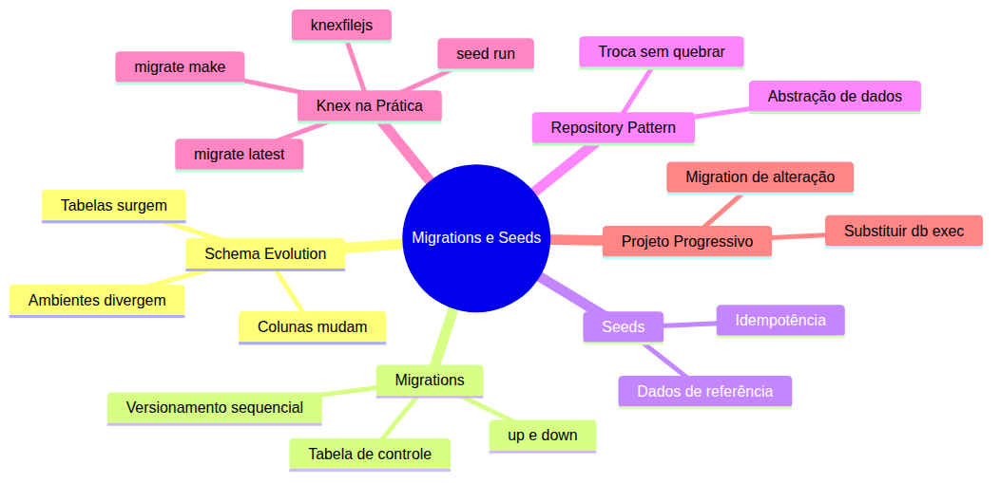
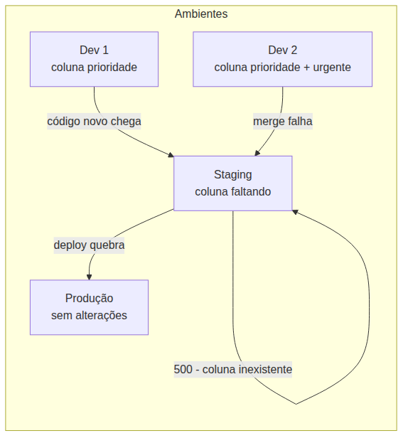
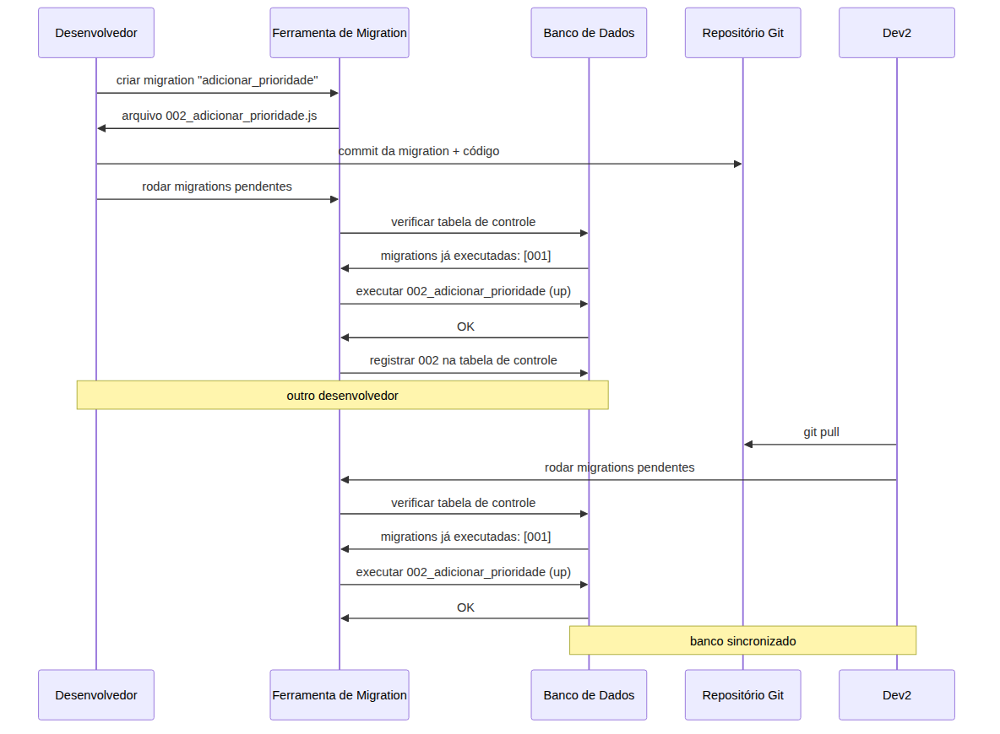
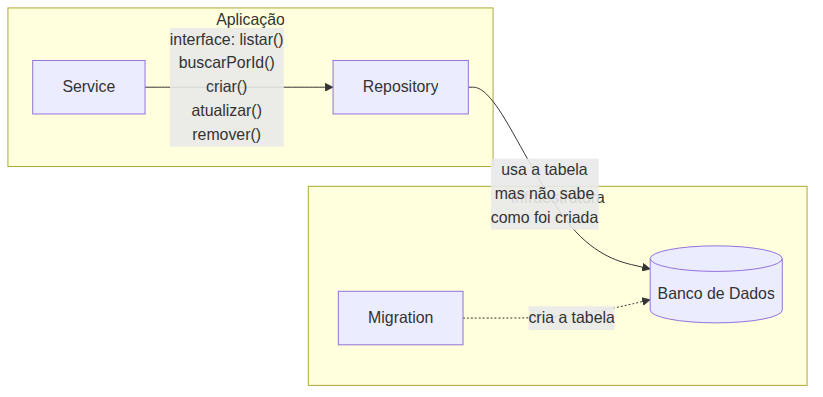

# Curso de Banco de Dados SQL — Aula 03

## Migrations e Seeds — Versionando o Banco

**Duração estimada:** 90 minutos (40 de leitura + 50 de prática)
**Nível:** Intermediário
**Pré-requisitos:** Aula 01 (SQLite, better-sqlite3, CRUD SQL), Aula 02 (Knex Query Builder, knexfile.js, repository com Knex)

---

## Objetivos de Aprendizagem

Ao final desta aula, você será capaz de:

- [ ] **Explicar** o que é evolução de esquema e por que bancos de dados mudam com o tempo
- [ ] **Definir** migrations como mecanismo de versionamento de esquema e compará-las com versionamento de código
- [ ] **Descrever** os problemas de criar tabelas via `db.exec()` em equipes com múltiplos desenvolvedores
- [ ] **Definir** o que são seeds e diferenciar dados de referência de dados de produção
- [ ] **Nomear** o Repository Pattern, explicando como a interface desacopla a aplicação da implementação
- [ ] **Configurar** diretórios de migrations e seeds no `knexfile.js`
- [ ] **Criar** arquivos de migration com `knex migrate:make`, implementando `exports.up` e `exports.down`
- [ ] **Executar** `knex migrate:latest` e interpretar a tabela `knex_migrations`
- [ ] **Criar** e executar seeds com `knex seed:make` e `knex seed:run`
- [ ] **Criar** migration de alteração de esquema adicionando coluna a tabela existente sem perder dados

---

## Como Usar Esta Aula

Esta aula está organizada em duas partes. A **primeira parte** constrói os fundamentos de evolução de esquema, versionamento de banco, seeds e o Repository Pattern formalizado. A **segunda parte** aplica esses conceitos com Knex — substituindo o `db.exec('CREATE TABLE...')` da Aula 01 por migrations profissionais. Ao final, o arquivo separado de Questões de Aprendizagem traz as tarefas de checkpoint.

**Tempo estimado:** 40 minutos de leitura + 50 minutos de prática.

---

## Mapa Mental





> *O mapa mental acima mostra a estrutura da aula. Cada ramo representa um conceito que você vai explorar.*

---

## Recapitulação das Aulas 01 e 02

| Aula | Conceito | Onde aparece nesta aula | Como se conecta |
|---|---|---|---|
| Aula 01 | **SQLite + `db.exec()`** (seção 4) | Seções 3, 7-8 | A tabela criada com `db.exec` será substituída por uma migration versionada |
| Aula 01 | **CREATE TABLE tarefas** (seção 4) | Seções 7-8, 10 | A mesma estrutura de tabela migra para um arquivo versionado com `up` e `down` |
| Aula 02 | **Knex Query Builder** (seções 5-7) | Seções 6-10 | O Knex CLI gerencia migrations e seeds; o schema builder cria/alterar tabelas |
| Aula 02 | **knexfile.js** (seção 5) | Seção 6 | O knexfile.js ganha configurações de diretório para migrations e seeds |
| Aula 02 | **Repository com Knex** (seção 7) | Seção 5 | O Repository Pattern é formalizado — você já implementou, agora ganha nome |

---

**FUNDAMENTOS: Evolução de Esquema e Versionamento de Banco de Dados**

> *Os conceitos desta seção são universais — valem para qualquer banco de dados e qualquer linguagem de programação. Migrations resolvem um problema de engenharia de software que existe desde que bancos relacionais são usados em produção. Na segunda parte, você verá como uma ferramenta concreta implementa cada um desses conceitos.*

---

## 1. Schema Evolution — Por que Bancos de Dados Mudam

Seu Gerenciador de Tarefas está funcionando. Você tem uma tabela `tarefas` com `id`, `titulo`, `concluida` e `criada_em`. Os usuários cadastram tarefas, marcam como concluídas, tudo certo.

Agora chega o Product Manager: "Precisamos de prioridade nas tarefas. Baixa, média, alta."

Você adiciona `prioridade` no código. Mas o banco — que está em produção, com dados reais de centenas de usuários — não tem essa coluna. O que acontece?

O código tenta ler `tarefa.prioridade` e recebe `undefined`. O filtro `WHERE prioridade = 'alta'` falha porque a coluna não existe. O INSERT de uma nova tarefa quebra porque o SQL espera uma coluna que o banco não tem.

**Isso é schema evolution** — o processo inevitável de modificar a estrutura do banco para acompanhar a evolução da aplicação. Nenhum banco de dados em produção fica parado. Sempre surgem novas funcionalidades que exigem novas colunas, novas tabelas, novos relacionamentos.

### Três Tipos de Mudança

**Adicionar coluna:** o caso mais comum. Sua tabela `tarefas` ganha `prioridade`. Dados existentes continuam intactos — você define um valor padrão para as tarefas que já estavam no banco.

**Criar tabela:** seu sistema ganha a funcionalidade de categorias. Uma nova tabela `categorias` surge. Agora você tem duas tabelas, possivelmente relacionadas.

**Remover ou renomear coluna:** o campo `titulo` vira `descricao` porque o negócio mudou. Você precisa migrar os dados existentes e atualizar todas as queries que usam o nome antigo.

O problema não é fazer essas mudanças. O problema é **coordená-las** entre ambientes e desenvolvedores.

### O Problema da Coordenação

Você desenvolve em sua máquina local. Seu colega desenvolve na máquina dele. O ambiente de staging tem um banco separado. A produção é outro banco.

Sem um mecanismo de versionamento, cada ambiente vira uma ilha:

- Dev 1 adicionou `prioridade` no banco local — funciona
- Dev 2 ainda não sabe da coluna — as queries dele quebram quando o código dele vai para staging
- Staging recebe o código novo, mas o banco de staging não foi atualizado — erro 500
- Produção recebe o deploy, mas a migration manual foi esquecida — aplicação fora do ar

É como tentar sincronizar quatro pessoas editando o mesmo arquivo sem usar Git. Alguém sempre vai sobrescrever o trabalho de outro.





> *Ambientes divergem quando não há versionamento de esquema. O deploy quebra porque o banco não foi atualizado junto com o código.*

### Quick Check 1

**1. O que acontece quando o código espera uma coluna que o banco ainda não tem?**
**Resposta:** O código quebra: SELECT falha com "coluna inexistente", INSERT não consegue inserir, e a aplicação retorna erro 500 para o usuário.

**2. Por que o comando `ALTER TABLE` é mais arriscado que `CREATE TABLE` em um ambiente sem versionamento?**
**Resposta:** `ALTER TABLE` modifica dados existentes e pode quebrar queries em execução. Sem versionamento, não há como coordenar a alteração entre desenvolvedores e ambientes — cada pessoa aplica manualmente e o histórico se perde.

---

## 2. Migrations — o "Git" do Banco de Dados

Schema evolution é inevitável. O que você precisa é de um mecanismo para **versionar** essas mudanças — de forma ordenada, rastreável e reproduzível entre ambientes.

**Migration** é um arquivo que descreve uma transformação no esquema do banco. Pense nela como um **commit** para seu banco de dados. Cada migration tem:

- **Operação `up`:** aplica a mudança (cria tabela, adiciona coluna, etc.)
- **Operação `down`:** reverte a mudança (dropa tabela, remove coluna, etc.)

### A Analogia com Git

Quando você faz um commit no Git, o repositório registra exatamente o que mudou. Outro desenvolvedor faz `git pull` e recebe suas alterações. O histórico é linear, rastreável e reproduzível.

Com migrations funciona igual:

1. Você cria uma migration que adiciona a coluna `prioridade`
2. Faz commit da migration no Git
3. Outro desenvolvedor faz pull e roda as migrations
4. O banco dele fica idêntico ao seu

A diferença? Git versiona **código**. Migration versiona **esquema de banco**. O fluxo é complementar: o código novo depende do esquema novo, e as migrations garantem que o esquema esteja atualizado antes do código rodar.

### O Ciclo de Vida de uma Migration





> *O fluxo de migrations garante que todos os ambientes executem as mesmas transformações na mesma ordem.*

### Tabela de Controle

Toda ferramenta de migration mantém uma **tabela de controle** no banco. Essa tabela registra quais migrations já foram aplicadas. Quando você roda o comando para aplicar migrations, a ferramenta:

1. Consulta a tabela de controle: "o que já foi executado?"
2. Compara com os arquivos de migration no sistema de arquivos
3. Executa apenas as migrations pendentes, em ordem sequencial

Isso garante **idempotência**: rodar o comando duas vezes produz o mesmo resultado. Na segunda vez, todas as migrations já estão registradas — nada é executado.

### Por que `up` e `down`?

O `up` aplica a mudança. O `down` a reverte. Juntos formam um par atômico e reversível.

| Operação | O que faz | Quando usar |
|---|---|---|
| `up` | Aplica a transformação (cria tabela, adiciona coluna) | Desenvolvimento, deploy, CI/CD |
| `down` | Reverte a transformação (remove tabela, remove coluna) | Rollback de deploy, desenvolvimento local |

Sem o `down`, você não consegue desfazer uma migration. Em produção, rollback de deploy sem reversão de banco deixa o esquema em um estado inconsistente.

### Quick Check 2

**1. Se sua equipe tem 3 desenvolvedores e cada um cria uma migration, como o banco de cada um se mantém sincronizado?**
**Resposta:** Cada desenvolvedor faz commit das migrations no Git. Ao fazer pull, o outro desenvolvedor roda o comando de aplicar migrations — a ferramenta compara os arquivos com a tabela de controle e executa apenas as pendentes. O banco fica idêntico.

**2. Qual a diferença entre o estado do banco e o estado do código quando se usa migrations?**
**Resposta:** O estado do banco é a soma de todas as migrations aplicadas em ordem. O estado do código é o último commit. Eles evoluem juntos: cada commit pode incluir novas migrations, e as migrations garantem que o banco esteja no estado esperado pelo código.

---

## 3. Migrations vs. SQL na Mão — o Custo de Escalar com `db.exec()`

Lembra de como você criou a tabela `tarefas` na Aula 01?

```sql
db.exec(`CREATE TABLE IF NOT EXISTS tarefas (
  id INTEGER PRIMARY KEY AUTOINCREMENT,
  titulo TEXT NOT NULL,
  concluida INTEGER DEFAULT 0,
  criada_em TEXT DEFAULT CURRENT_TIMESTAMP
)`)
```

Isso funciona. O `IF NOT EXISTS` evita recriar a tabela se ela já existe. Parece seguro, certo?

Funciona quando você é o único desenvolvedor. Quando tudo roda na sua máquina. Quando não há produção, staging, homologação. Mas em um cenário profissional, essa abordagem quebra em quatro pontos.

### Problema 1 — Ambientes Divergem

Seu projeto tem três ambientes: desenvolvimento (sua máquina), staging (testes) e produção (usuários reais).

Você adiciona a coluna `prioridade` no código. Como o banco vai ganhar essa coluna? Você pode:

a) Rodar um `ALTER TABLE` manual no SQLite de desenvolvimento — funciona, mas você esquece de rodar nos outros ambientes
b) Esperar o `CREATE TABLE IF NOT EXISTS` adicionar — mas ele só cria a tabela se ela NÃO existe, não adiciona colunas
c) Adicionar `ALTER TABLE` junto com `CREATE TABLE` — o código fica cada vez maior e mais difícil de manter

### Problema 2 — Ordem de Deploy

Você faz deploy do código novo (que usa `prioridade`) antes de atualizar o banco de produção. O que acontece?

As queries quebram porque a coluna não existe. Erro 500 para todos os usuários. A aplicação fica fora do ar até você rodar manualmente o `ALTER TABLE`.

Se você atualizar o banco antes do deploy do código, o código antigo não se importa com a coluna extra — funciona. Mas e no próximo deploy? E se forem 10 alterações? A coordenação manual fica inviável.

### Problema 3 — Rollback Impossível

O deploy deu errado. Você precisa voltar à versão anterior do código. O Git faz `git revert` e pronto. Mas o banco?

A coluna `prioridade` foi adicionada. Os registros existentes receberam o valor padrão. Alguns registros já têm `prioridade: 'alta'`. Como desfazer? Se você simplesmente dropar a coluna, perde os dados que usuários já preencheram.

Sem migrations, rollback de banco é um processo manual e arriscado. Com migrations, você roda o `down` e a alteração é revertida de forma controlada.

### Problema 4 — Histórico Perdido

Daqui a seis meses, alguém vai perguntar: "Quando a coluna `prioridade` foi adicionada? Quem fez? Qual era o motivo?"

Sem migrations, a resposta é: "Não sei. Alguém rodou um ALTER TABLE em algum momento. O commit do código não mostra a mudança no banco."

Com migrations, cada alteração é um arquivo versionado no Git — com autor, data, mensagem descritiva e código de reversão. O histórico do banco é tão rastreável quanto o histórico do código.

### A Transição

`db.exec('CREATE TABLE...')` não é "errado". É uma abordagem que funciona para protótipos e projetos individuais. Mas conforme o projeto cresce — mais desenvolvedores, mais ambientes, mais funcionalidades — as migrations se tornam essenciais.

Os problemas que você viu aqui são exatamente os que as migrations resolvem. É hora de ver como.

### Quick Check 3

**1. Cite duas situações em que `db.exec('CREATE TABLE...')` falha em um ambiente com múltiplos desenvolvedores.**
**Resposta:** (1) Adicionar uma coluna nova — o `CREATE TABLE IF NOT EXISTS` não altera tabelas existentes; (2) Coordenar mudanças entre ambientes — cada desenvolvedor precisa lembrar de rodar ALTER TABLE manualmente nos próprios bancos.

**2. Por que o `IF NOT EXISTS` não resolve o problema de evolução de esquema?**
**Resposta:** Porque `IF NOT EXISTS` só impede recriar a tabela se ela já existe. Ele não adiciona colunas novas, não altera tipos, não renomeia campos. É uma proteção contra erro de criação, não uma solução de versionamento.

---

## 4. Seeds — Dados de Referência que Todo Ambiente Precisa

As migrations resolvem o versionamento da **estrutura** do banco. Mas e os **dados** que precisam existir para a aplicação funcionar?

Seu Gerenciador de Tarefas precisa de categorias padrão: "Trabalho", "Pessoal", "Estudos", "Saúde". Sem essas categorias, o sistema de filtros não funciona. Você poderia cadastrá-las manualmente toda vez que cria um banco novo. Mas isso é repetitivo e sujeito a erro.

**Seeds** resolvem isso: são scripts que inserem dados iniciais ou de referência no banco.

### A Diferença Entre Migrations e Seeds

| | Migration | Seed |
|---|---|---|
| O que cria | Estrutura (tabelas, colunas, índices) | Conteúdo (linhas, registros) |
| Quantas vezes roda | Uma vez (depois fica na tabela de controle) | Múltiplas vezes (deve ser idempotente) |
| Reversão | Sim (`down`) | Não (se roda de novo, limpa e reinsere) |
| Exemplo | Criar tabela `categorias` | Inserir "Trabalho", "Pessoal", "Estudos" |
| Versionamento no Git | Sim — cada migration é um arquivo | Sim — cada seed é um arquivo |

Migrations constroem a **casa**. Seeds colocam os **móveis**. Você não constrói a casa de novo toda vez que entra — e os móveis padrão já estão lá.

### Quando Usar Seeds

**Dados de referência:** listas fixas que a aplicação precisa para operar. Categorias, tipos de usuário, status de pedido, configurações iniciais.

**Dados de desenvolvimento:** registros de exemplo para você testar a aplicação sem precisar cadastrar tudo manualmente. Cinco tarefas iniciais, três usuários de teste, um produto de demonstração.

**Dados de admin:** usuário administrador padrão, role de superusuário, permissões iniciais.

### Quando NÃO Usar Seeds

**Dados de produção gerados por usuários:** cada tarefa que um usuário cadastra não é um seed — é dado de operação. Seeds são para dados que independem do usuário.

**Logs e auditoria:** dados transitórios que não devem ser recriados.

**Dados sensíveis reais:** senhas de produção, tokens de API, chaves de serviço. Seeds podem conter dados de exemplo, nunca dados reais de produção.

### Idempotência — a Regra de Ouro dos Seeds

Um seed bem projetado pode ser executado múltiplas vezes sem causar problemas. Isso se chama **idempotência**.

O padrão mais comum: antes de inserir os dados, o seed **limpa** os registros existentes e reinsere do zero. Assim, toda vez que o seed roda, o banco fica no mesmo estado.

```javascript
// Estrutura conceitual de um seed idempotente:
// 1. Remove dados existentes
// 2. Insere dados novos
```

Sem idempotência, rodar um seed duas vezes duplicaria os registros — "Trabalho" apareceria duas vezes, o sistema de filtros quebraria com categorias repetidas.

### Quick Check 4

**1. Qual a diferença fundamental entre uma migration e um seed?**
**Resposta:** Migration versiona estrutura do banco (cria/alterar tabelas). Seed insere dados iniciais no banco. Um roda uma vez e fica registrado; o outro pode rodar múltiplas vezes se for idempotente.

**2. Por que um seed deve ser idempotente? O que acontece se não for?**
**Resposta:** Idempotência garante que rodar o seed várias vezes produza o mesmo resultado. Sem ela, cada execução duplicaria os registros, causando dados inconsistentes (categorias repetidas, usuário admin duplicado).

---

## 5. Repository Pattern Formalizado — Nomeando o que Você Já Faz

Você já implementou o Repository Pattern três vezes: com JSON no curso de Node.js, com SQL puro na Aula 01 e com um query builder na Aula 02. Em todos os casos, a interface foi a mesma:

```javascript
tarefaRepo.listar()        // retorna todas as tarefas
tarefaRepo.buscarPorId(id) // retorna uma tarefa pelo ID
tarefaRepo.criar(dados)    // cria uma nova tarefa
tarefaRepo.atualizar(id, dados) // atualiza uma tarefa existente
tarefaRepo.remover(id)     // remove uma tarefa
```

O service que usa esse repository nunca soube — e nunca precisou saber — se os dados estavam em um arquivo JSON, em um banco relacional ou em um query builder. Ele apenas chamava `tarefaRepo.listar()` e recebia um array de tarefas.

**Isso é o Repository Pattern.**

### A Definição Formal

> Repository Pattern é um padrão de projeto que abstrai o acesso a dados atrás de uma interface. A aplicação (services, controllers) nunca sabe como os dados são persistidos — ela só conhece os métodos da interface do repositório.

Os benefícios são concretos:

**Testabilidade:** você pode criar um repositório mock que retorna dados fixos sem tocar em banco. O service não precisa de banco para ser testado.

**Trocabilidade:** amanhã você troca SQLite por PostgreSQL. O service continua idêntico. Só o repository muda.

**Isolamento:** se o banco muda de versão ou o driver SQL muda, você altera apenas o repository. O resto da aplicação não é afetado.

### O Que Isso Tem a Ver com Migrations?

O repository usa a tabela criada pela migration — mas **não sabe nem se importa** com como a tabela foi criada.

Separar a **criação do esquema** (migrations) do **acesso aos dados** (repository) é outra camada de desacoplamento:

- Migrations se preocupam com: estrutura das tabelas, tipos das colunas, índices, chaves
- Repository se preocupam com: CRUD, queries, filtros, joins





> *Migrations e Repository Pattern são complementares. Um cria a estrutura, o outro acessa os dados. A interface do repository não muda — independente de como a tabela foi criada.*

### Por que Agora?

Nas aulas anteriores, você usou o pattern sem saber que ele tinha nome. Agora que você já o implementou três vezes, o padrão merece ser formalizado. Saber o nome "Repository Pattern" permite:

- Pesquisar documentação e discussões sobre o padrão
- Comunicar com outros desenvolvedores usando o termo correto
- Reconhecer o padrão em outros projetos e frameworks

Na prática, nada muda no seu código. O que muda é que agora você **sabe o que está fazendo** e **sabe que existe uma comunidade inteira** de desenvolvedores que usam o mesmo padrão.

### Quick Check 5

**1. Se amanhã você trocar SQLite por PostgreSQL, quantas linhas do service precisam mudar? Por quê?**
**Resposta:** Nenhuma. O service depende apenas da interface do repository (`listar`, `buscarPorId`, etc.). Quem muda é a implementação do repository — o service continua chamando os mesmos métodos.

**2. Qual a diferença entre Repository Pattern e um simples "arquivo que faz queries"?**
**Resposta:** Repository Pattern é uma camada com interface definida que abstrai completamente o mecanismo de persistência. Um "arquivo que faz queries" pode vazar detalhes do banco (como SQL específico, conexão, driver) para quem o chama.

---

**APLICAÇÃO: Migrations e Seeds com Knex**

> *Agora que você entende os fundamentos de schema evolution, migrations, seeds e o Repository Pattern, vamos conectá-los à prática com o Knex CLI e o schema builder.*

---

## 6. Configurando Migrations e Seeds no Projeto

O primeiro passo é dizer ao Knex onde ele deve criar e procurar os arquivos de migration e seed. Isso é feito no `knexfile.js`, que você configurou na Aula 02.

### O knexfile.js Estendido

Abra seu `knexfile.js`. Ele provavelmente está assim:

```javascript
module.exports = {
  client: 'better-sqlite3',
  connection: {
    filename: './dev.sqlite3'
  },
  useNullAsDefault: true
}
```

Para trabalhar com migrations, você precisa adicionar duas chaves: `migrations` e `seeds`.

```javascript
module.exports = {
  client: 'better-sqlite3',
  connection: {
    filename: './dev.sqlite3'
  },
  useNullAsDefault: true,
  migrations: {
    directory: './migrations'
  },
  seeds: {
    directory: './seeds'
  }
}
```

O Knex CLI lê essas configurações para saber:
- Onde criar novos arquivos de migration (`migrate:make`)
- Onde buscar migrations para executar (`migrate:latest`, `migrate:rollback`)
- Onde criar e buscar arquivos de seed (`seed:make`, `seed:run`)

### Criando os Diretórios

Crie os diretórios manualmente (o CLI também cria, mas é uma boa prática tê-los explícitos):

```bash
mkdir -p migrations seeds
```

A estrutura do seu projeto agora deve ser:

```
projeto/
├── knexfile.js
├── migrations/         ← migrations ficam aqui
├── seeds/              ← seeds ficam aqui
├── src/
│   ├── repos/
│   │   └── tarefa-repo-knex.js
│   └── ... 
└── dev.sqlite3
```

### Verifique a Configuração

Rode o comando de listagem de migrations. Ele vai mostrar que nenhuma migration foi criada ainda:

```bash
npx knex migrate:list
```

A saída deve ser algo como:

```
No Migrations files Found
```

Se você receber um erro de configuração, revise o `knexfile.js` — provavelmente faltou a chave `migrations.directory`.

**Mão na Massa — Configurar diretórios:**

- [ ] Abra seu `knexfile.js` e adicione `migrations: { directory: './migrations' }` e `seeds: { directory: './seeds' }`
- [ ] Crie as pastas `migrations/` e `seeds/` com `mkdir -p`
- [ ] Rode `npx knex migrate:list` e confirme "No Migrations files Found"

### Quick Check 6

**1. Onde o Knex CLI busca as configurações de diretórios de migration e seed?**
**Resposta:** No arquivo `knexfile.js`, nas chaves `migrations.directory` e `seeds.directory`. O CLI lê o knexfile.js automaticamente ao ser executado no diretório do projeto.

**2. O que acontece se você rodar `knex migrate:make` sem ter configurado o diretório de migrations?**
**Resposta:** O Knex cria um diretório `migrations` na raiz do projeto automaticamente. Mas é mais seguro configurar explicitamente no knexfile.js para evitar surpresas com diretórios em locais inesperados.

---

## 7. Primeira Migration — Criando a Tabela `tarefas`

Agora você vai substituir aquele `db.exec('CREATE TABLE...')` da Aula 01 por uma migration profissional.

### Criando o Arquivo de Migration

```bash
npx knex migrate:make criar_tabela_tarefas
```

Isso gera um arquivo na pasta `migrations/` com um nome parecido com:

```
20260714120000_criar_tabela_tarefas.js
```

O timestamp `20260714120000` (ano-mês-dia-hora-minuto-segundo) garante que as migrations sejam **ordenadas cronologicamente**. O Knex executa as migrations na ordem dos timestamps — sempre.

### Estrutura do Arquivo de Migration

Abra o arquivo gerado. Você vai encontrar:

```javascript
exports.up = function(knex) {
  
}

exports.down = function(knex) {
  
}
```

Duas funções vazias. Sua missão é preenchê-las.

**`exports.up`:** recebe uma instância do Knex e deve aplicar a mudança no banco.
**`exports.down`:** recebe uma instância do Knex e deve desfazer a mudança.

O parâmetro `knex` dentro dessas funções não é o query builder comum — é uma instância especial que inclui o **schema builder** (`knex.schema`). O schema builder é a API do Knex para definir estrutura de tabelas.

### Implementando `up` com Schema Builder

```javascript
exports.up = function(knex) {
  return knex.schema.createTable('tarefas', function(table) {
    table.increments('id').primary()
    table.string('titulo').notNullable()
    table.boolean('concluida').defaultTo(false)
    table.timestamp('criada_em').defaultTo(knex.fn.now())
  })
}
```

Cada linha dentro de `createTable` define uma coluna:

| Método | Coluna | O que faz |
|---|---|---|
| `table.increments('id').primary()` | `id` | INTEGER auto-incremento, chave primária |
| `table.string('titulo').notNullable()` | `titulo` | Texto, obrigatório (NOT NULL) |
| `table.boolean('concluida').defaultTo(false)` | `concluida` | Booleano, padrão `false` (0) |
| `table.timestamp('criada_em').defaultTo(knex.fn.now())` | `criada_em` | Data/hora, padrão momento atual |

### Implementando `down` — Reversão

```javascript
exports.down = function(knex) {
  return knex.schema.dropTable('tarefas')
}
```

Simples: se o `up` cria a tabela, o `down` a remove. A operação é atômica — ou a migration inteira acontece, ou nada acontece.

### Por que `return`?

Repare no `return` antes de cada chamada. O Knex precisa que você **retorne a promise** da operação para saber quando ela terminou. Sem o `return`, a próxima migration pode começar antes da anterior terminar.

### Comparação com o `db.exec()` da Aula 01

```sql
-- Aula 01: SQL puro no código
db.exec(`CREATE TABLE IF NOT EXISTS tarefas (
  id INTEGER PRIMARY KEY AUTOINCREMENT,
  titulo TEXT NOT NULL,
  concluida INTEGER DEFAULT 0,
  criada_em TEXT DEFAULT CURRENT_TIMESTAMP
)`)
```

```javascript
// Aula 03: Migration versionada
exports.up = function(knex) {
  return knex.schema.createTable('tarefas', function(table) {
    table.increments('id').primary()
    table.string('titulo').notNullable()
    table.boolean('concluida').defaultTo(false)
    table.timestamp('criada_em').defaultTo(knex.fn.now())
  })
}
```

O resultado no banco é o mesmo. A diferença? A migration é versionada, tem reversão, está no Git e será executada em todos os ambientes automaticamente.

**Mão na Massa — Criar a primeira migration:**

- [ ] Rode `npx knex migrate:make criar_tabela_tarefas`
- [ ] Abra o arquivo gerado em `migrations/`
- [ ] Implemente `exports.up` com `knex.schema.createTable` conforme o exemplo acima
- [ ] Implemente `exports.down` com `knex.schema.dropTable('tarefas')`
- [ ] Confirme que a estrutura da tabela é equivalente à da Aula 01 (colunas: id, titulo, concluida, criada_em)

### Quick Check 7

**1. Qual a função do timestamp no nome do arquivo de migration?**
**Resposta:** Garantir a ordem de execução. O Knex ordena as migrations pelo timestamp e as executa sequencialmente. Se dois desenvolvedores criam migrations no mesmo dia, o timestamp define qual roda primeiro.

**2. Se você implementar `exports.up` mas deixar `exports.down` vazio, qual o problema?**
**Resposta:** Você não consegue reverter a migration com `rollback`. Se o deploy falhar, o banco fica em um estado inconsistente — a tabela foi criada mas não pode ser removida via migration.

---

## 8. Executando Migrations — `knex migrate:latest`

Com a migration criada, é hora de executá-la e ver o banco ganhar vida.

### O Comando

```bash
npx knex migrate:latest
```

A saída deve ser algo como:

```
Using environment: development
Batch 1 run: 1 migrations
```

Pronto. A tabela `tarefas` foi criada no banco.

### O que Acontece por Dentro

Quando você roda `knex migrate:latest`, o Knex:

1. Abre o banco de dados
2. Cria a tabela **`knex_migrations`** (se não existir) — esta é a tabela de controle
3. Consulta `knex_migrations` para saber quais migrations já foram executadas
4. Compara com os arquivos na pasta `migrations/` ordenados por timestamp
5. Executa as migrations pendentes, uma a uma
6. Registra cada migration executada na tabela `knex_migrations`

### Inspecionando a Tabela de Controle

Conecte-se ao banco e consulte a tabela `knex_migrations`:

```bash
node -e "
const knex = require('knex')(require('./knexfile'))
knex('knex_migrations').select('*').then(console.log).finally(() => knex.destroy())
"
```

A saída mostra os registros das migrations executadas:

```
[
  {
    id: 1,
    name: '20260714120000_criar_tabela_tarefas.js',
    batch: 1,
    migration_time: 2026-07-14 12:05:00
  }
]
```

**`name`:** nome do arquivo de migration executado.
**`batch`:** número do lote. Toda execução de `migrate:latest` cria um novo batch.
**`migration_time`:** quando a migration foi executada.

### Idempotência na Prática

Rode `npx knex migrate:latest` novamente:

```bash
npx knex migrate:latest
```

A saída agora é:

```
Using environment: development
Already up to date
```

O Knex consultou `knex_migrations`, viu que a única migration já foi executada, e não fez nada. **Isso é idempotência** — rodar o comando múltiplas vezes produz o mesmo resultado.

### Verificando a Tabela

Use o schema builder para confirmar que a tabela existe:

```bash
node -e "
const knex = require('knex')(require('./knexfile'))
knex('tarefas').columnInfo().then(info => {
  console.log('Colunas:', Object.keys(info))
}).finally(() => knex.destroy())
"
```

A saída deve ser:

```
Colunas: [ 'id', 'titulo', 'concluida', 'criada_em' ]
```

**Mão na Massa — Executar a migration:**

- [ ] Rode `npx knex migrate:latest`
- [ ] Verifique a saída: "Batch 1 run: 1 migrations"
- [ ] Rode novamente `npx knex migrate:latest` e confirme "Already up to date"
- [ ] Consulte `knex('knex_migrations').select('*')` para ver o registro
- [ ] Use `knex('tarefas').columnInfo()` para confirmar as colunas

### Quick Check 8

**1. Como o Knex sabe quais migrations já foram executadas?**
**Resposta:** Ele mantém a tabela `knex_migrations` no banco, que registra o nome, o lote e o timestamp de cada migration executada. Antes de rodar, ele consulta essa tabela e compara com os arquivos no sistema.

**2. O que acontece se você rodar `migrate:latest` e uma migration falhar no meio?**
**Resposta:** A migration que falhou não é registrada na tabela `knex_migrations`. O Knex interrompe a execução e não executa as migrations seguintes. Você precisa corrigir o erro e rodar `migrate:latest` novamente.

---

## 9. Seeds — Populando Dados Iniciais

A tabela `tarefas` existe, mas está vazia. Você poderia cadastrar tarefas manualmente via INSERT. Mas é mais prático criar um seed que popula as tarefas de exemplo automaticamente.

### Criando um Seed

```bash
npx knex seed:make tarefas_iniciais
```

Isso gera um arquivo em `seeds/` com o nome:

```
tarefas_iniciais.js
```

Diferente das migrations, os seeds **não têm timestamp** no nome. Não há ordenação entre seeds — todos são executados na mesma chamada de `seed:run`.

### Estrutura do Arquivo de Seed

Abra o arquivo gerado. A estrutura é diferente das migrations:

```javascript
exports.seed = async function(knex) {
  // Deletes ALL existing entries
  await knex('tarefas').del()
  // Inserts seed entries
  await knex('tarefas').insert([
    { id: 1, titulo: 'Estudar SQL', concluida: false },
    { id: 2, titulo: 'Configurar Knex', concluida: true },
    { id: 3, titulo: 'Revisar Repository Pattern', concluida: false },
    { id: 4, titulo: 'Criar migrations do projeto', concluida: false },
    { id: 5, titulo: 'Ler sobre PostgreSQL', concluida: true }
  ])
}
```

### O Padrão de Idempotência

Repare na primeira linha: `await knex('tarefas').del()`. Ela **remove todos os registros** antes de inserir os novos. Isso garante idempotência:

- Rode o seed uma vez: 5 tarefas inseridas
- Rode o seed de novo: as 5 tarefas são removidas e reinseridas — ainda 5 tarefas
- Rode o seed 10 vezes: ainda 5 tarefas

Sem o `del()`, cada execução adicionaria mais 5 tarefas — depois de 10 execuções, você teria 50 tarefas duplicadas.

### Executando Seeds

```bash
npx knex seed:run
```

Saída:

```
Using environment: development
Ran 1 seed files
```

### Verificando os Dados

```bash
node -e "
const knex = require('knex')(require('./knexfile'))
knex('tarefas').select('*').then(tarefas => {
  console.log(JSON.stringify(tarefas, null, 2))
}).finally(() => knex.destroy())
"
```

Saída esperada:

```json
[
  { "id": 1, "titulo": "Estudar SQL", "concluida": 0, "criada_em": "2026-07-14 12:10:00" },
  { "id": 2, "titulo": "Configurar Knex", "concluida": 1, "criada_em": "2026-07-14 12:10:00" },
  ...
]
```

Note que `criada_em` foi preenchido automaticamente pelo `defaultTo(knex.fn.now())` definido na migration. Você não precisou passar esse campo no seed.

**Mão na Massa — Criar e executar seed:**

- [ ] Rode `npx knex seed:make tarefas_iniciais`
- [ ] Implemente o seed com 5 tarefas (títulos variados, algumas concluídas, outras pendentes)
- [ ] Inclua `await knex('tarefas').del()` no início para idempotência
- [ ] Rode `npx knex seed:run`
- [ ] Verifique com `knex('tarefas').select('*')` que as 5 tarefas estão no banco

### Quick Check 9

**1. Por que o arquivo de seed NÃO tem `exports.up` e `exports.down` como as migrations?**
**Resposta:** Porque seed não é uma transformação incremental — é uma população de dados. Não há ordem entre seeds e não há rollback. Seeds podem ser executados múltiplas vezes (com idempotência), diferente de migrations que executam uma vez e ficam registradas.

**2. O que a linha `await knex('tarefas').del()` faz no início do seed e por que ela está lá?**
**Resposta:** Ela remove todos os registros existentes da tabela antes de inserir os novos. Isso garante idempotência — rodar o seed múltiplas vezes produz o mesmo resultado, sem duplicar dados.

---

## 10. Migration de Alteração — Adicionando a Coluna `prioridade`

O Product Manager chegou: "Precisamos de prioridade nas tarefas. Baixa, média, alta."

Com migrations, você não edita a migration existente — você cria uma **nova migration** que altera a tabela. Isso preserva o histórico e mantém a rastreabilidade.

### Criando a Migration de Alteração

```bash
npx knex migrate:make adicionar_prioridade
```

### Implementando `up` com `alterTable`

Diferente de `createTable` (que cria uma tabela do zero), `alterTable` modifica uma tabela existente:

```javascript
exports.up = function(knex) {
  return knex.schema.alterTable('tarefas', function(table) {
    table.string('prioridade').defaultTo('média')
  })
}

exports.down = function(knex) {
  return knex.schema.alterTable('tarefas', function(table) {
    table.dropColumn('prioridade')
  })
}
```

Repare: você **não** recria a tabela. `alterTable` adiciona a coluna `prioridade` à tabela existente. As 5 tarefas do seed continuam intactas — e ganham `prioridade: 'média'` automaticamente por causa do `defaultTo`.

### Rodando a Nova Migration

```bash
npx knex migrate:latest
```

Saída:

```
Using environment: development
Batch 2 run: 1 migrations
```

Agora a tabela `knex_migrations` tem **dois registros**:

```
[
  { id: 1, name: '20260714120000_criar_tabela_tarefas.js', batch: 1, ... },
  { id: 2, name: '20260714120100_adicionar_prioridade.js', batch: 2, ... }
]
```

### Verificando a Alteração

```bash
node -e "
const knex = require('knex')(require('./knexfile'))
knex('tarefas').columnInfo().then(info => {
  console.log('Colunas:', Object.keys(info))
}).finally(() => knex.destroy())
"
```

Saída:

```
Colunas: [ 'id', 'titulo', 'concluida', 'criada_em', 'prioridade' ]
```

A coluna `prioridade` está lá. E os dados?

```bash
node -e "
const knex = require('knex')(require('./knexfile'))
knex('tarefas').select('id', 'titulo', 'prioridade').then(tarefas => {
  console.log(JSON.stringify(tarefas, null, 2))
}).finally(() => knex.destroy())
"
```

Saída esperada:

```json
[
  { "id": 1, "titulo": "Estudar SQL", "prioridade": "média" },
  { "id": 2, "titulo": "Configurar Knex", "prioridade": "média" },
  ...
]
```

**Os dados não foram perdidos.** As 5 tarefas continuam lá, agora com `prioridade: 'média'`.

### Atualizando uma Tarefa com Prioridade

```bash
node -e "
const knex = require('knex')(require('./knexfile'))
knex('tarefas').where('id', 1).update({ prioridade: 'alta' }).then(() => {
  return knex('tarefas').where('id', 1).select('id', 'titulo', 'prioridade')
}).then(tarefa => {
  console.log(JSON.stringify(tarefa, null, 2))
}).finally(() => knex.destroy())
"
```

Saída:

```json
[
  { "id": 1, "titulo": "Estudar SQL", "prioridade": "alta" }
]
```

O repository com Knex que você construiu na Aula 02 continua funcionando. Ele retorna `prioridade` agora, sem nenhuma alteração no código dele. A migration adicionou a coluna, e o query builder a inclui automaticamente nos resultados.

**Mão na Massa — Criar e aplicar migration de alteração:**

- [ ] Rode `npx knex migrate:make adicionar_prioridade`
- [ ] Implemente `exports.up` com `knex.schema.alterTable` adicionando coluna `prioridade`
- [ ] Implemente `exports.down` com `dropColumn('prioridade')`
- [ ] Rode `npx knex migrate:latest` e confirme "Batch 2 run: 1 migrations"
- [ ] Verifique com `columnInfo()` que a coluna existe e que os dados do seed foram preservados
- [ ] Atualize uma tarefa com `prioridade: 'alta'` e confirme que funciona

### Quick Check 10

**1. Qual método do schema builder você usa para alterar uma tabela existente em vez de criá-la?**
**Resposta:** `knex.schema.alterTable('tabela', callback)`. Diferente de `createTable` que só funciona se a tabela não existe, `alterTable` modifica a estrutura de uma tabela já existente.

**2. O que acontece com os dados que já estavam na tabela quando você adiciona uma coluna com `defaultTo('média')`?**
**Resposta:** Os dados existentes são preservados. A nova coluna é adicionada com o valor padrão `'média'` para todos os registros que já estavam na tabela. Nenhum dado é perdido ou alterado.

---

## Autoavaliação: Quiz Rápido

**1. O que é schema evolution e por que ele é inevitável em aplicações reais?**
**Resposta:** Schema evolution é o processo de modificar a estrutura do banco ao longo do tempo. É inevitável porque novas funcionalidades sempre exigem novas colunas, tabelas ou relacionamentos — o banco precisa evoluir junto com a aplicação.

**2. Qual a diferença entre uma migration e um seed?**
**Resposta:** Migration versiona a estrutura do banco (cria/alterar tabelas). Seed insere dados iniciais no banco. A migration executa uma vez e fica registrada na tabela de controle; o seed pode executar múltiplas vezes se for idempotente.

**3. Qual o principal benefício do Repository Pattern segundo a formalização desta aula?**
**Resposta:** Abstrair o acesso a dados atrás de uma interface, permitindo trocar a implementação (JSON, SQLite, PostgreSQL) sem alterar services ou controllers. A aplicação nunca sabe como os dados são persistidos.

**4. Para que serve a chave `migrations.directory` no `knexfile.js`?**
**Resposta:** Para configurar onde o Knex CLI cria e procura os arquivos de migration. Sem essa configuração, o Knex cria o diretório `migrations` na raiz, mas com ela você controla explicitamente o caminho.

**5. Qual a estrutura de um arquivo de migration do Knex?**
**Resposta:** Um arquivo que exporta duas funções: `exports.up` (aplica a mudança usando knex.schema) e `exports.down` (reverte a mudança). Exemplo: `up` cria tabela com `knex.schema.createTable`, `down` remove com `knex.schema.dropTable`.

**6. O que a tabela `knex_migrations` armazena?**
**Resposta:** Armazena o nome de cada migration executada, o número do lote (batch) e o timestamp de execução. O Knex consulta essa tabela para saber quais migrations já foram aplicadas.

**7. Qual a diferença entre `knex.schema.createTable` e `knex.schema.alterTable`?**
**Resposta:** `createTable` cria uma tabela nova (falha se já existir). `alterTable` modifica uma tabela existente — adiciona, remove ou altera colunas sem recriar a tabela ou perder dados.

---

## Mão na Massa: Exercícios Graduados

### Exercício 1 (Fácil) — Migration para Nova Tabela

**Duração estimada:** 15 minutos

Crie uma migration `criar_tabela_categorias` com as seguintes colunas:

- `id`: INTEGER, chave primária, auto-incremento
- `nome`: string, obrigatório (NOT NULL)
- `cor`: string, valor padrão `'#cccccc'`
- `criada_em`: timestamp, valor padrão `now()`

Implemente `up` e `down` completos. Rode a migration e verifique com `columnInfo()`.

**Gabarito:**

```bash
npx knex migrate:make criar_tabela_categorias
```

Arquivo de migration:

```javascript
exports.up = function(knex) {
  return knex.schema.createTable('categorias', function(table) {
    table.increments('id').primary()
    table.string('nome').notNullable()
    table.string('cor').defaultTo('#cccccc')
    table.timestamp('criada_em').defaultTo(knex.fn.now())
  })
}

exports.down = function(knex) {
  return knex.schema.dropTable('categorias')
}
```

Rodar e verificar:

```bash
npx knex migrate:latest
```

Verifique com:

```bash
node -e "
const knex = require('knex')(require('./knexfile'))
knex('categorias').columnInfo().then(info => {
  console.log(Object.keys(info))
}).finally(() => knex.destroy())
"
```

Saída esperada: `[ 'id', 'nome', 'cor', 'criada_em' ]`

---

### Exercício 2 (Médio) — Seed com Categorias de Exemplo

**Duração estimada:** 20 minutos

Crie um seed `categorias_iniciais` com 4 categorias: "Trabalho", "Pessoal", "Estudos", "Saúde". Garanta idempotência com `del()` antes de inserir.

Depois, crie uma migration de alteração `adicionar_categoria_id` que adiciona a coluna `categoria_id` (inteiro, nullable) na tabela `tarefas`.

**Gabarito:**

```bash
npx knex seed:make categorias_iniciais
```

Arquivo de seed `seeds/categorias_iniciais.js`:

```javascript
exports.seed = async function(knex) {
  await knex('categorias').del()
  await knex('categorias').insert([
    { nome: 'Trabalho', cor: '#ff6b6b' },
    { nome: 'Pessoal', cor: '#51cf66' },
    { nome: 'Estudos', cor: '#339af0' },
    { nome: 'Saúde', cor: '#f06595' }
  ])
}
```

```bash
npx knex seed:run
```

```bash
npx knex migrate:make adicionar_categoria_id
```

```javascript
exports.up = function(knex) {
  return knex.schema.alterTable('tarefas', function(table) {
    table.integer('categoria_id').nullable()
  })
}

exports.down = function(knex) {
  return knex.schema.alterTable('tarefas', function(table) {
    table.dropColumn('categoria_id')
  })
}
```

```bash
npx knex migrate:latest
```

Verifique com `columnInfo()` que `categoria_id` está na tabela `tarefas`.

---

### Desafio (Difícil) — Rollback e Reconstrução de Migration

**Duração estimada:** 25 minutos

Simule um cenário de rollback:

1. Liste as migrations executadas consultando `knex_migrations`
2. Execute `npx knex migrate:rollback` para desfazer a última migration
3. Verifique que a coluna `prioridade` sumiu da tabela `tarefas`
4. Edite o arquivo da migration `adicionar_prioridade` alterando o valor default para `'baixa'`
5. Rode `knex migrate:latest` novamente
6. Verifique que a coluna voltou com o novo default

Dica: `knex migrate:rollback` executa a função `down` da última migration aplicada. Se você rodar `rollback` duas vezes, ele desfaz as duas últimas migrations, e assim por diante.

**Gabarito:**

```bash
# Listar migrations executadas
node -e "
const knex = require('knex')(require('./knexfile'))
knex('knex_migrations').select('*').then(rows => {
  console.log(JSON.stringify(rows, null, 2))
}).finally(() => knex.destroy())
"
```

Saída esperada: duas migrations registradas.

```bash
# Rollback da última migration
npx knex migrate:rollback
```

Saída: `Batch 2 rolled back: 1 migrations`

```bash
# Verificar que prioridade sumiu
node -e "
const knex = require('knex')(require('./knexfile'))
knex('tarefas').columnInfo().then(info => {
  console.log(Object.keys(info))
}).finally(() => knex.destroy())
"
```

Saída: `[ 'id', 'titulo', 'concluida', 'criada_em' ]` — `prioridade` não está mais lá.

Agora edite o arquivo `migrations/YYYYMMDDHHmmss_adicionar_prioridade.js` e altere o `defaultTo('média')` para `defaultTo('baixa')`.

```bash
# Rodar migrations novamente
npx knex migrate:latest
```

Saída: `Batch 3 run: 1 migrations`

```bash
# Verificar coluna com novo default
node -e "
const knex = require('knex')(require('./knexfile'))
knex('tarefas').columnInfo().then(info => {
  console.log(Object.keys(info))
}).finally(() => knex.destroy())
"
```

Saída: `[ 'id', 'titulo', 'concluida', 'criada_em', 'prioridade' ]`

```bash
# Verificar que as tarefas existentes têm prioridade 'baixa'
node -e "
const knex = require('knex')(require('./knexfile'))
knex('tarefas').select('id', 'titulo', 'prioridade').then(rows => {
  console.log(JSON.stringify(rows, null, 2))
}).finally(() => knex.destroy())
"
```

As tarefas existentes ganharam `prioridade: 'baixa'`.

---

## Resumo da Aula

### Os 8 Conceitos Fundamentais

1. **Schema evolution**: bancos de dados em produção evoluem — adicionar colunas, criar tabelas, renomear campos. Sem versionamento, ambientes divergem e deploys quebram.
2. **Migrations**: arquivos sequenciais com operações `up` (aplica) e `down` (reverte) — o "Git do banco de dados".
3. **`db.exec()` não escala**: criar tabelas no código funciona para um desenvolvedor, mas em equipe gera ambientes divergentes, impede rollback e perde histórico.
4. **Seeds**: scripts para dados de referência. Diferentes de migrations (que criam estrutura) e de dados de produção (que usuários geram). Devem ser idempotentes.
5. **Repository Pattern**: abstração de acesso a dados atrás de uma interface — `listar()`, `buscarPorId()`, `criar()`, `atualizar()`, `remover()`. O aluno já implementou 3 vezes (JSON, SQLite, Knex).
6. **Knex CLI**: `migrate:make` (criar), `migrate:latest` (executar pendentes), `seed:make` (criar seed), `seed:run` (executar seeds).
7. **`knex_migrations`**: tabela de controle que registra quais migrations foram aplicadas — garante idempotência e rastreabilidade.
8. **Migration de alteração**: `knex.schema.alterTable` modifica tabelas existentes sem perder dados. Não edite migrations já executadas — crie novas.

### O Que Você Construiu Hoje

- [x] Diretórios `migrations/` e `seeds/` configurados no `knexfile.js`
- [x] Migration `criar_tabela_tarefas` com `up` e `down`
- [x] Execução de `knex migrate:latest` e verificação da tabela `knex_migrations`
- [x] Seed `tarefas_iniciais` com 5 tarefas de exemplo
- [x] Migration de alteração `adicionar_prioridade` com `alterTable`
- [x] Rollback e reconstrução de migration (desafio)

---

## Próxima Aula

**Aula 04: PostgreSQL — Banco de Produção**

SQLite é ótimo para desenvolvimento, mas produção exige um banco que lide com múltiplas conexões simultâneas, tipos avançados e escalabilidade real. Na Aula 04, você vai instalar PostgreSQL via Docker, criar seu primeiro banco e conectar com Node.js usando o driver `pg`. Spoiler: as migrations que você criou hoje funcionam exatamente iguais no PostgreSQL.

---

## Referências

### Documentação Oficial

- [Knex Migrations Guide](https://knexjs.org/guide/migrations.html)
- [Knex Seeds Guide](https://knexjs.org/guide/seeds.html)
- [Knex Schema Builder](https://knexjs.org/guide/schema-builder.html)
- [SQLite ALTER TABLE](https://www.sqlite.org/lang_altertable.html)

### Ferramentas

- [better-sqlite3](https://github.com/WiseLibs/better-sqlite3)
- [Knex.js](https://knexjs.org/)

### Artigos para Aprofundamento

- [Martin Fowler — Repository Pattern](https://martinfowler.com/eaaCatalog/repository.html)
- [O Problema do Schema Evolution em Produção](https://www.infoq.com/articles/evolutionary-database-design/)

---

## FAQ

**P: Já tenho a tabela criada com `db.exec()`. Preciso apagar e recriar com migration?**
R: Depende. Se você está em desenvolvimento, apague a tabela (ou o arquivo SQLite), crie a migration e rode `migrate:latest`. Se está em produção, crie a migration e o Knex detecta que a tabela já existe? Não — ele tenta criar e falha. Nesse caso, crie uma migration inicial que use `knex.schema.hasTable()` para verificar antes de criar.

**P: O que acontece se eu rodar `knex migrate:latest` e uma migration falhar no meio?**
R: A migration que falhou não é registrada na `knex_migrations`. As migrations seguintes não são executadas. Corrija o erro e rode `migrate:latest` novamente.

**P: Posso editar uma migration que já foi executada?**
R: Tecnicamente sim, mas não deve. A migration já foi executada em outros ambientes. Editá-la cria divergência. A prática correta é criar uma nova migration com a correção.

**P: Seeds são executados automaticamente junto com migrations?**
R: Não. `migrate:latest` só executa migrations. `seed:run` executa seeds. São comandos separados. Em pipelines de CI/CD, geralmente roda migrations automaticamente e seeds manualmente.

**P: Como faço para desfazer a última migration?**
R: Use `npx knex migrate:rollback`. Ele executa o `down` da última migration aplicada e a remove da tabela de controle.

**P: A tabela `knex_migrations` deve ser commitada no Git?**
R: Não. A tabela `knex_migrations` vive dentro do banco de dados (no arquivo SQLite). O que vai para o Git são os arquivos na pasta `migrations/` — eles que recriam o banco do zero em qualquer ambiente.

**P: Repository Pattern é a mesma coisa que Singleton?**
R: Não. Repository Pattern é sobre abstração de dados (interface de acesso). Singleton é sobre ter uma única instância de um objeto na aplicação. Um repository pode ser Singleton, mas o padrão em si não tem relação com instância única.

**P: Preciso escrever seeds para TODOS os dados de desenvolvimento?**
R: Apenas para dados de referência que a aplicação precisa para funcionar (categorias, tipos de usuário, etc.). Dados de teste específicos podem ser inseridos em scripts separados ou manualmente.

---

## Glossário

| Termo | Definição |
|---|---|
| **Migration** | Arquivo versionado que descreve uma transformação no esquema do banco (criar/alterar/remover tabelas e colunas) |
| **Seed** | Script que insere dados iniciais ou de referência no banco |
| **Schema Evolution** | Processo de modificar a estrutura do banco ao longo do tempo para acompanhar a evolução da aplicação |
| **`knex_migrations`** | Tabela de controle do Knex que registra quais migrations já foram executadas |
| **`knex_migrations_lock`** | Tabela auxiliar que previne execução concorrente de migrations |
| **Repository Pattern** | Padrão de projeto que abstrai o acesso a dados atrás de uma interface — a aplicação não sabe como os dados são persistidos |
| **Idempotência** | Propriedade de uma operação que pode ser executada múltiplas vezes produzindo o mesmo resultado |
| **Rollback** | Operação que reverte uma migration, executando sua função `down` |
| **`exports.up` / `exports.down`** | Funções exportadas por um arquivo de migration — `up` aplica a mudança, `down` a reverte |
| **Schema Builder** | API do Knex para definir estrutura de tabelas (`knex.schema.createTable`, `alterTable`) |
| **`defaultTo()`** | Método do schema builder que define um valor padrão para uma coluna |
| **`alterTable()`** | Método do schema builder que modifica uma tabela existente sem recriá-la |
