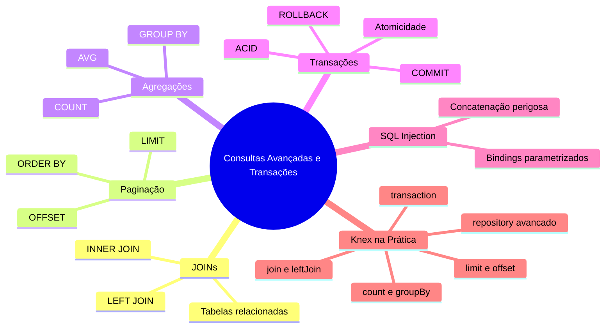
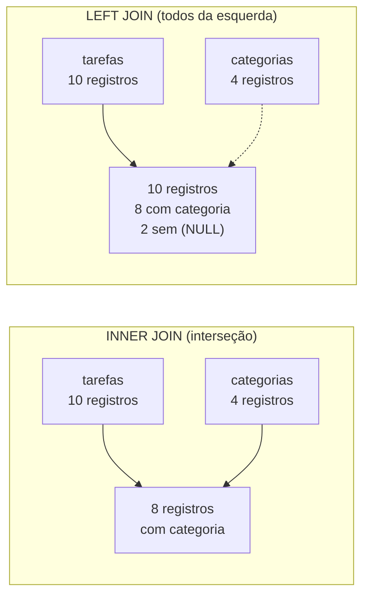

# Curso de Banco de Dados SQL — Aula 06

## Consultas Avançadas, Transações e SQL Injection

**Duração estimada:** 100 minutos (45 de leitura + 55 de prática)
**Nível:** Intermediário
**Pré-requisitos:** Aula 04 (PostgreSQL via Docker, driver `pg`), Aula 05 (Knex com PostgreSQL, knexfile.js para pg, connection pool)

---

## Objetivos de Aprendizagem

Ao final desta aula, você será capaz de:

- [ ] **Explicar** o que é um JOIN e diferenciar INNER JOIN de LEFT JOIN
- [ ] **Implementar** consultas com JOIN usando Knex `.join()` e `.leftJoin()`
- [ ] **Construir** paginação com `LIMIT`, `OFFSET` e `.orderBy()` para navegar por resultados
- [ ] **Usar** `.count()`, `.avg()` e `.groupBy()` para agregar dados
- [ ] **Definir** transação como unidade atômica de operações e implementá-la com `knex.transaction()`
- [ ] **Diferenciar** commit de rollback e quando cada um ocorre
- [ ] **Identificar** SQL injection e explicar como bindings parametrizados previnem
- [ ] **Aplicar** todas as queries avançadas no Repository Pattern sem quebrar a interface
- [ ] **Criar** uma migration para a tabela `usuarios` e integrá-la ao projeto progressivo
- [ ] **Executar** uma transação completa de criação de usuário com tarefa inicial

---

## Como Usar Esta Aula

Esta aula está organizada em duas partes. A **primeira parte** constrói os fundamentos de JOINs, paginação, agregações, transações e SQL injection — conceitos universais de banco de dados. A **segunda parte** aplica cada um com Knex no PostgreSQL. Ao final, o arquivo separado de Questões de Aprendizagem traz as tarefas de checkpoint.

**Tempo estimado:** 45 minutos de leitura + 55 minutos de prática.

---

## Mapa Mental



> *O mapa mental acima mostra a estrutura da aula. Cada ramo representa um conceito que você vai explorar.*

---

## Recapitulação das Aulas 04 e 05

| Aula | Conceito | Onde aparece nesta aula | Como se conecta |
|---|---|---|---|
| Aula 04 | **PostgreSQL via Docker** (seções 5-7) | Seções 6-10 | O banco PostgreSQL que você configurou roda todas as queries avançadas desta aula |
| Aula 04 | **Connection string e driver pg** (seção 6) | Seções 6-11 | O Knex usa a mesma connection string para conectar ao PostgreSQL |
| Aula 05 | **Knex com PostgreSQL** (knexfile.js) | Seções 6-11 | O mesmo knexfile.js com `client: 'pg'` funciona sem alterações |
| Aula 05 | **Connection pool** (pool: min/max) | Seções 6-11 | O pool gerencia as conexões para as queries avançadas |
| Aula 03 | **Repository Pattern** (seção 5) | Seções 6-11 | Você vai adicionar métodos ao repository sem quebrar a interface existente |

---

**FUNDAMENTOS: Conexões entre Dados e Operações Atômicas**

> *Os conceitos desta seção são universais — valem para qualquer banco de dados relacional, independentemente da ferramenta específica. Na segunda parte, você verá como cada um se traduz em código com uma biblioteca de consultas.*

---

## 1. JOINs — Ligando Tabelas pelo que Elas Têm em Comum

Seu banco tem duas tabelas: `tarefas` e `categorias`. Cada tarefa tem um `categoria_id` que aponta para uma categoria. Até agora, para exibir uma tarefa com o nome da categoria, você precisava fazer duas consultas: uma na tabela `tarefas` e outra na tabela `categorias`.

**JOIN** é o mecanismo que o SQL usa para combinar registros de duas ou mais tabelas com base em uma coluna comum. Você faz uma única consulta e recebe dados das duas tabelas lado a lado.

Pense em duas planilhas: a primeira lista tarefas com `id`, `titulo` e `categoria_id`. A segunda lista categorias com `id` e `nome`. O JOIN junta as duas planilhas onde `tarefas.categoria_id = categorias.id`. O resultado é uma linha por tarefa, cada uma com o nome da categoria ao lado.

### INNER JOIN — Só o que Tem dos Dois Lados

O INNER JOIN retorna apenas os registros que têm correspondência nas duas tabelas. Se uma tarefa não tem categoria (`categoria_id` é NULL), ela não aparece. Se uma categoria não tem tarefas, ela também não aparece.

```sql
SELECT tarefas.titulo, categorias.nome
FROM tarefas
INNER JOIN categorias ON tarefas.categoria_id = categorias.id
```

Resultado conceitual:
```
titulo              | nome
Estudar PostgreSQL  | Estudos
Configurar Knex     | Desenvolvimento
Revisar Migrations  | Trabalho
```

Veja um exemplo: sua tabela `tarefas` tem 10 registros, 8 com `categoria_id` preenchido e 2 com NULL. A tabela `categorias` tem 4 registros. O INNER JOIN retorna 8 linhas — uma para cada tarefa que aponta para uma categoria existente.

Outro exemplo: suponha que uma categoria "Saúde" existe mas nenhuma tarefa a referencia. Ela não aparece no resultado do INNER JOIN — mesmo existindo na tabela `categorias`, não há tarefa que a referencie.

E agora com três tabelas: imagine uma tabela `usuarios` relacionada a `tarefas`. Você poderia fazer INNER JOIN de `tarefas` com `categorias` e com `usuarios` na mesma query, ligando cada par pela coluna de relacionamento.

### LEFT JOIN — Todos da Esquerda, Mesmo sem Correspondência

O LEFT JOIN retorna todos os registros da tabela da esquerda (a primeira mencionada), mesmo que não tenham correspondência na tabela da direita. Quando não há correspondência, as colunas da direita aparecem como NULL.

```sql
SELECT tarefas.titulo, categorias.nome
FROM tarefas
LEFT JOIN categorias ON tarefas.categoria_id = categorias.id
```

Diferença prática: se uma tarefa não tem categoria (`categoria_id = NULL`), com INNER JOIN ela desaparece. Com LEFT JOIN, ela aparece com o nome da categoria como NULL.



> *INNER JOIN retorna só a interseção. LEFT JOIN retorna todos da esquerda, preenchendo com NULL onde não há correspondência.*

### Quick Check 1

**1. Qual a diferença entre INNER JOIN e LEFT JOIN no número de linhas retornadas?**
**Resposta:** INNER JOIN retorna apenas linhas com correspondência nas duas tabelas. LEFT JOIN retorna todas as linhas da tabela esquerda, com NULL onde não há correspondência na direita.

**2. Se uma tarefa tem `categoria_id = NULL`, ela aparece em qual tipo de JOIN?**
**Resposta:** Aparece no LEFT JOIN (com nome da categoria como NULL), mas não aparece no INNER JOIN porque não há correspondência na tabela `categorias`.

---

## 2. Paginação — Buscando Fatias de Dados

Sua aplicação tem 10 tarefas hoje. Daqui a três meses, pode ter 10 mil. Retornar todas de uma vez em uma consulta é inviável: a resposta demora, o navegador trava, o celular do usuário congela.

**Paginação** resolve isso: você busca uma fatia dos dados por vez. O SQL oferece duas palavras-chave para isso: `LIMIT` e `OFFSET`.

`LIMIT` define quantos registros você quer. `OFFSET` define quantos registros pular antes de começar.

```sql
-- Página 1: primeiras 10 tarefas
SELECT * FROM tarefas ORDER BY id LIMIT 10 OFFSET 0

-- Página 2: próximas 10 tarefas
SELECT * FROM tarefas ORDER BY id LIMIT 10 OFFSET 10

-- Página 3: mais 10 tarefas
SELECT * FROM tarefas ORDER BY id LIMIT 10 OFFSET 20
```

Veja um exemplo: imagine um livro de 100 páginas, cada página com 10 linhas. LIMIT = 10 (linhas por página), OFFSET = 0 (página 1), OFFSET = 10 (página 2), OFFSET = 20 (página 3).

Outro exemplo: seu Gerenciador de Tarefas tem 237 tarefas. Você define 20 tarefas por página. Para navegar, calcula o OFFSET como `(pagina - 1) * itensPorPagina`.

E agora com um filtro: você quer ver apenas tarefas pendentes, paginadas. A query combina WHERE com LIMIT e OFFSET. A ordenação é essencial — sem ORDER BY, a paginação fica inconsistente.

### Por que ORDER BY é Obrigatório

Sem `ORDER BY`, o banco não garante a ordem dos registros. Na página 1, você recebe as tarefas 1, 3, 5. Na página 2, pode receber as tarefas 5, 7, 9 — a tarefa 5 aparece nas duas páginas, e a tarefa 2 nunca aparece.

Sempre ordene por uma coluna estável (como `id` ou `criada_em`) para que a paginação seja consistente.

> *Até aqui, você já entendeu JOINs, paginação e agregações. Isso já é MUITO. Respire. Transações e SQL injection são os próximos — e são os que vão te salvar em produção.*

### Quick Check 2

**1. Qual a fórmula para calcular OFFSET a partir do número da página e do limite por página?**
**Resposta:** OFFSET = (pagina - 1) * limite. Exemplo: página 3 com limite 10 → OFFSET = (3 - 1) * 10 = 20.

**2. Por que a paginação exige ORDER BY?**
**Resposta:** Sem ORDER BY, o banco não garante ordem consistente entre chamadas — registros podem aparecer em páginas diferentes ou serem pulados.

---

## 3. Agregações — Resumo de Dados em uma Consulta

Às vezes você não quer os dados detalhados — quer um resumo. Quantas tarefas estão pendentes? Qual a média de tarefas por categoria? Quantas tarefas cada usuário criou?

**Funções de agregação** processam um conjunto de linhas e retornam um único valor resumido.

### COUNT — Quantos Registros?

`COUNT(*)` conta o número total de linhas. `COUNT(coluna)` conta quantas linhas têm valor não-nulo naquela coluna.

```sql
-- Total de tarefas
SELECT COUNT(*) AS total FROM tarefas

-- Tarefas concluídas
SELECT COUNT(*) AS concluidas FROM tarefas WHERE concluida = true
```

### COUNT com GROUP BY — Agrupando Resultados

Você quer contar tarefas por status (concluída vs pendente). É aqui que entra o **GROUP BY**: você agrupa registros que compartilham o mesmo valor em uma coluna e aplica a função de agregação a cada grupo.

```sql
SELECT concluida, COUNT(*) AS total
FROM tarefas
GROUP BY concluida
```

Resultado:
```
concluida | total
false     | 7
true      | 3
```

Veja um exemplo: sua tabela tem 10 tarefas (3 concluídas, 7 pendentes). O GROUP BY separa em dois grupos e o COUNT conta cada grupo. Simples.

Outro exemplo: contar tarefas por categoria. Você combina JOIN com GROUP BY para agrupar pelo nome da categoria.

```sql
SELECT categorias.nome, COUNT(tarefas.id) AS total
FROM tarefas
LEFT JOIN categorias ON tarefas.categoria_id = categorias.id
GROUP BY categorias.nome
```

### AVG, SUM e Outras Agregações

Além de COUNT, o SQL oferece:

| Função | O que faz | Exemplo |
|---|---|---|
| `AVG(coluna)` | Média dos valores | `AVG(prioridade_numerica)` |
| `SUM(coluna)` | Soma dos valores | `SUM(valor_pedido)` |
| `MAX(coluna)` | Maior valor | `MAX(criada_em)` |
| `MIN(coluna)` | Menor valor | `MIN(prioridade_numerica)` |

> *Se você está se perguntando "e prioridade que é texto, como calcula AVG?", a resposta é: não calcula. AVG, SUM, MAX, MIN funcionam com colunas numéricas. Para texto, você usa COUNT e GROUP BY.*

### Quick Check 3

**1. O que o GROUP BY faz em uma consulta com agregação?**
**Resposta:** GROUP BY agrupa os registros que têm o mesmo valor na coluna especificada, permitindo que a função de agregação (COUNT, AVG, SUM) seja aplicada a cada grupo separadamente.

**2. Qual a diferença entre COUNT(*) e COUNT(coluna)?**
**Resposta:** COUNT(*) conta todas as linhas, incluindo NULLs. COUNT(coluna) conta apenas linhas onde a coluna não é NULL.

---

## 4. Transações — Tudo ou Nada

Imagine que você está criando um novo usuário no sistema. O processo envolve duas operações: inserir o registro na tabela `usuarios` e criar uma tarefa inicial de boas-vindas para ele. Se a primeira operação funcionar e a segunda falhar, você fica com um usuário órfão — existe no banco, mas não tem a tarefa que deveria.

**Transação** é uma unidade de trabalho que contém uma ou mais operações no banco. O princípio é simples: **ou todas as operações acontecem, ou nenhuma**.

### ACID — As Quatro Garantias de uma Transação

O banco garante quatro propriedades para transações, conhecidas pela sigla ACID:

**Atomicidade:** a transação é indivisível. Se qualquer operação falha, tudo é desfeito. É como um golpe de artes marciais — ou o golpe completo acontece, ou você não dá golpe nenhum.

**Consistência:** a transação leva o banco de um estado válido a outro estado válido. As regras (chaves estrangeiras, NOT NULL, tipos) são respeitadas.

**Isolamento:** transações simultâneas não interferem entre si. Enquanto uma transação está em andamento, outras não veem suas alterações parciais.

**Durabilidade:** quando a transação é confirmada (COMMIT), os dados são persistentes — não se perdem mesmo se o banco cair.

### O Fluxo da Transação

No SQL, uma transação segue três passos:

1. **BEGIN**: inicia a transação. A partir deste ponto, todas as operações são temporárias — só você vê.
2. **Operações**: INSERT, UPDATE, DELETE — tudo o que você precisa fazer.
3. **COMMIT** (confirmar) ou **ROLLBACK** (desfazer).

```sql
BEGIN;

INSERT INTO usuarios (nome, email) VALUES ('João', 'joao@email.com');
INSERT INTO tarefas (titulo, user_id) VALUES ('Bem-vindo!', 1);

COMMIT;
-- Se algo falhar antes do COMMIT, ROLLBACK desfaz tudo
```

Veja um exemplo real: transferência bancária entre duas contas. A operação debitada da conta A (UPDATE...) e creditada na conta B (UPDATE...) deve ser atômica. Se o débito funciona e o crédito falha, o dinheiro simplesmente desaparece.

Outro exemplo com seu sistema: criar um pedido com vários itens. A transação insere o pedido (INSERT na tabela `pedidos`) e depois insere cada item (INSERT na tabela `itens_pedido`). Se o terceiro item falha por restrição de chave estrangeira, o pedido inteiro é desfeito — nenhum item parcial persiste.

E agora no contexto do seu projeto: criar um usuário e já associar uma tarefa inicial de boas-vindas. As duas operações devem ser atômicas. Se o INSERT do usuário funciona mas o INSERT da tarefa quebra (por exemplo, uma coluna obrigatória faltando), o ROLLBACK desfaz o usuário também.

### Quando Usar Transações

Sempre que uma operação depende de outra. Regra prática: se você precisa que duas ou mais operações no banco estejam sempre consistentes entre si, use transação.

### Quick Check 4

**1. O que acontece se uma transação com 3 INSERTs falha no segundo INSERT?**
**Resposta:** O banco executa ROLLBACK automaticamente e desfaz o primeiro INSERT. Nenhum dos 3 INSERTs é persistido — o banco volta ao estado anterior ao BEGIN.

**2. Qual a diferença entre COMMIT e ROLLBACK?**
**Resposta:** COMMIT confirma todas as operações da transação e as torna permanentes. ROLLBACK desfaz todas as operações da transação, retornando ao estado anterior ao BEGIN.

---

## 5. SQL Injection — Quando o Dado Vira Comando

SQL injection é uma das vulnerabilidades mais antigas e perigosas de aplicações web. Ela acontece quando dados fornecidos pelo usuário são interpretados como parte do comando SQL — porque foram concatenados diretamente na string da query.

### O Problema

Imagine que sua aplicação recebe um identificador vindo da requisição e monta uma consulta SQL simplesmente inserindo esse valor na string:

```
// Código VULNERÁVEL — conceito
id_recebido = "1; DROP TABLE tarefas"
query = "SELECT * FROM tarefas WHERE id = " + id_recebido
// Resultado: SELECT * FROM tarefas WHERE id = 1; DROP TABLE tarefas
```

O que o usuário malicioso fez? Ele injetou um comando SQL dentro do valor que deveria ser apenas um número. O banco executa: primeiro seleciona a tarefa com id 1, depois DELETA a tabela inteira.

Veja outro exemplo: a query `SELECT * FROM usuarios WHERE email = '[email]'` recebe o valor `' OR '1'='1`. O resultado: `SELECT * FROM usuarios WHERE email = '' OR '1'='1'`. Retorna todos os usuários — login bypass completo. O invasor entrou sem saber senha alguma.

E um terceiro exemplo: `DELETE FROM tarefas WHERE id = [id]` com id = `1 OR 1=1`. A query vira `DELETE FROM tarefas WHERE id = 1 OR 1=1` — deleta todas as tarefas da tabela. Sem WHERE efetivo.

### A Solução: Bindings Parametrizados

Em vez de montar a string SQL com os valores, você envia a query com **placeholders** (marcadores de posição) e os valores separadamente. O banco sabe: "isto é código SQL, aquilo é dado". O valor nunca é interpretado como comando.

```sql
-- Com binding: o valor $1 é tratado como DADO, nunca como SQL
SELECT * FROM tarefas WHERE id = $1
-- O banco recebe o valor "1; DROP TABLE tarefas" como literal, não como comando
```

Pense em um formulário de papel com campos em branco. Você escreve a query fixa (`SELECT * FROM tarefas WHERE id = ____`) e entrega os valores em separado. O banco preenche os campos, mas nunca interpreta o que você escreveu como parte do comando.

### Quick Check 5

**1. O que é SQL injection?**
**Resposta:** É uma vulnerabilidade onde dados fornecidos pelo usuário são interpretados como comando SQL porque foram concatenados diretamente na string da query, permitindo que o invasor execute comandos arbitrários.

**2. Como bindings parametrizados previnem SQL injection?**
**Resposta:** Bindings separam o código SQL dos dados. O banco recebe a query com placeholders e os valores em separado, tratando os valores sempre como dados — nunca como parte do comando SQL.

---

**APLICAÇÃO: JOINs, Paginação, Transações e SQL Injection com Knex**

> *Agora que você entende os fundamentos de JOINs, paginação, agregações, transações e SQL injection, vamos conectá-los à prática com Knex e PostgreSQL. Cada conceito vira um método no seu repository.*

---

## 6. Criando a Tabela `categorias`

Antes de praticar JOINs, você precisa de uma segunda tabela para relacionar com `tarefas`. Crie a migration:

```bash
npx knex migrate:make criar_tabela_categorias
```

```javascript
exports.up = function(knex) {
  return knex.schema.createTable('categorias', function(table) {
    table.increments('id').primary()
    table.string('nome').notNullable().unique()
    table.timestamp('criada_em').defaultTo(knex.fn.now())
  })
}

exports.down = function(knex) {
  return knex.schema.dropTable('categorias')
}
```

Agora adicione a coluna `categoria_id` na tabela `tarefas`:

```bash
npx knex migrate:make adicionar_categoria_id_tarefas
```

```javascript
exports.up = function(knex) {
  return knex.schema.alterTable('tarefas', function(table) {
    table.integer('categoria_id').references('id').inTable('categorias')
  })
}

exports.down = function(knex) {
  return knex.schema.alterTable('tarefas', function(table) {
    table.dropColumn('categoria_id')
  })
}
```

Rode as migrations:

```bash
npx knex migrate:latest
```

Crie um seed para popular as categorias:

```bash
npx knex seed:make categorias_iniciais
```

```javascript
exports.seed = async function(knex) {
  await knex('categorias').del()
  await knex('categorias').insert([
    { nome: 'Estudos' },
    { nome: 'Trabalho' },
    { nome: 'Pessoal' },
    { nome: 'Saúde' }
  ])
}
```

```bash
npx knex seed:run
```

Agora você tem uma tabela `categorias` com 4 registros e suas tarefas podem referenciar uma categoria via `categoria_id`. Vamos usar JOIN para consultar tarefas com o nome da categoria.

### Quick Check 6

**1. Quantas migrations você criou para preparar o terreno para os JOINs?**
**Resposta:** Duas: `criar_tabela_categorias` (cria a tabela categorias) e `adicionar_categoria_id_tarefas` (adiciona a chave estrangeira em tarefas).

**2. Por que a seed de categorias usa `await knex('categorias').del()` antes do insert?**
**Resposta:** Para limpar a tabela antes de reinserir os dados, garantindo que seeds repetidos não dupliquem registros. É uma prática segura para idempotência.

---

## 7. JOINs com Knex — Ligando Tabelas no Query Builder

O Knex traduz JOINs para o dialeto SQL do banco configurado. Você usa `.join()` para INNER JOIN e `.leftJoin()` para LEFT JOIN.

### Sintaxe Básica

```javascript
const resultado = await knex('tarefas')
  .join('categorias', 'tarefas.categoria_id', 'categorias.id')
  .select('tarefas.titulo', 'categorias.nome as categoria')
```

O Knex gera: `SELECT tarefas.titulo, categorias.nome AS categoria FROM tarefas INNER JOIN categorias ON tarefas.categoria_id = categorias.id`.

### Alias de Tabela em JOIN

Para queries mais curtas, use alias:

```javascript
const resultado = await knex('tarefas as t')
  .join('categorias as c', 't.categoria_id', 'c.id')
  .select('t.id', 't.titulo', 'c.nome as categoria')
```

Aliais são apelidos para as tabelas. `t` vira sinônimo de `tarefas`, `c` vira sinônimo de `categorias`. A query fica mais legível, especialmente com JOINs múltiplos.

### LEFT JOIN com Knex

```javascript
const resultado = await knex('tarefas as t')
  .leftJoin('categorias as c', 't.categoria_id', 'c.id')
  .select('t.id', 't.titulo', 'c.nome as categoria')
```

A única diferença: `.leftJoin()` no lugar de `.join()`. O Knex gera LEFT JOIN no SQL. Tarefas sem categoria aparecem com `categoria = null`.

### Adicionando ao Repository

Abra seu `tarefa-repo-knex.js` e adicione:

```javascript
async listarComCategoria() {
  return await knex('tarefas as t')
    .join('categorias as c', 't.categoria_id', 'c.id')
    .select('t.*', 'c.nome as categoria_nome')
}
```

**Mão na Massa — Implementar JOIN no Repository:**

- [ ] No seu `tarefa-repo-knex.js`, adicione o método `listarComCategoria()` com `.join()`
- [ ] Teste com um script ou endpoint que chame o método
- [ ] Modifique para `.leftJoin()` e veja a diferença nos resultados

### Quick Check 7

**1. Qual método do Knex você usa para INNER JOIN?**
**Resposta:** `.join(nomeTabela, coluna1, coluna2)`. Exemplo: `.join('categorias', 't.categoria_id', 'c.id')`.

**2. Como você evita conflito de nomes quando duas tabelas têm coluna `id`?**
**Resposta:** Usando alias com prefixo: `.select('t.*', 'c.nome as categoria_nome')`. O `as` renomeia a coluna no resultado.

---

## 8. Paginação com Knex — Limit, Offset e Ordenação

O Knex expõe LIMIT e OFFSET como métodos `.limit()` e `.offset()`. A ordenação é feita com `.orderBy()`.

### Sintaxe Básica

```javascript
const pagina = 2
const itensPorPagina = 10
const offset = (pagina - 1) * itensPorPagina

const tarefas = await knex('tarefas')
  .orderBy('id', 'asc')
  .limit(itensPorPagina)
  .offset(offset)
```

O Knex gera: `SELECT * FROM tarefas ORDER BY id ASC LIMIT 10 OFFSET 10`.

### Contagem Total para Paginação

Para mostrar ao usuário quantas páginas existem, você precisa do total de registros:

```javascript
const total = await knex('tarefas').count('* as total')
const totalRegistros = total[0].total
const totalPaginas = Math.ceil(totalRegistros / itensPorPagina)
```

### Método Reutilizável no Repository

```javascript
async listarPaginado(pagina = 1, itensPorPagina = 10) {
  const offset = (pagina - 1) * itensPorPagina

  const [tarefas, total] = await Promise.all([
    knex('tarefas')
      .orderBy('id', 'asc')
      .limit(itensPorPagina)
      .offset(offset),
    knex('tarefas').count('* as total')
  ])

  return {
    dados: tarefas,
    pagina,
    itensPorPagina,
    total: total[0].total,
    totalPaginas: Math.ceil(total[0].total / itensPorPagina)
  }
}
```

Repare no `Promise.all`: as duas consultas rodam em paralelo, não uma depois da outra. Isso economiza milissegundos preciosos.

**Mão na Massa — Implementar Paginação:**

- [ ] Adicione o método `listarPaginado(pagina, itensPorPagina)` ao repository
- [ ] Teste com página 1, limite 3
- [ ] Teste com página 2, limite 3 — verifique que os registros não se repetem
- [ ] Verifique que `totalPaginas` retorna o valor correto

### Quick Check 8

**1. O que o `Promise.all` faz no método `listarPaginado` e por que ele é útil?**
**Resposta:** `Promise.all` executa as duas queries (listagem paginada e contagem total) em paralelo, reduzindo o tempo de resposta pela metade em comparação com execução sequencial.

**2. Por que `Math.ceil(total / itensPorPagina)` é usado para calcular o total de páginas?**
**Resposta:** Porque se você tem 25 registros com limite 10, precisa de 3 páginas (10 + 10 + 5). `Math.ceil(25/10)` = 3. `Math.ceil` arredonda para cima, garantindo que registros restantes tenham uma página própria.

---

## 9. Agregações com Knex — COUNT, AVG e GROUP BY

### COUNT

```javascript
const total = await knex('tarefas').count('* as total')
// [ { total: 10 } ]

const concluidas = await knex('tarefas')
  .where('concluida', true)
  .count('* as total')
// [ { total: 3 } ]
```

### COUNT com GROUP BY

```javascript
const porStatus = await knex('tarefas')
  .select('concluida')
  .count('* as total')
  .groupBy('concluida')
// [ { concluida: false, total: 7 }, { concluida: true, total: 3 } ]
```

### Adicionando ao Repository

```javascript
async contarPorStatus() {
  return await knex('tarefas')
    .select('concluida')
    .count('* as total')
    .groupBy('concluida')
}

async contarPorCategoria() {
  return await knex('categorias as c')
    .leftJoin('tarefas as t', 'c.id', 't.categoria_id')
    .select('c.nome')
    .count('t.id as total_tarefas')
    .groupBy('c.nome')
}
```

**Mão na Massa — Implementar Agregações:**

- [ ] Adicione `contarPorStatus()` ao repository — retorna quantas concluídas e pendentes
- [ ] Adicione `contarPorCategoria()` — retorna quantas tarefas em cada categoria
- [ ] Teste com seeds variados para ver os números

### Quick Check 9

**1. O que acontece se você usa `.count()` sem `.groupBy()`?**
**Resposta:** COUNT sem GROUP BY conta todas as linhas da tabela (ou do WHERE) e retorna um único valor com o total geral.

**2. Por que o método `contarPorCategoria` usa `leftJoin` em vez de `join`?**
**Resposta:** Para incluir categorias que não têm tarefas, mostrando total = 0. Com INNER JOIN, categorias vazias seriam omitidas.

---

## 10. Transações com Knex — knex.transaction()

O Knex oferece `knex.transaction()` para criar transações. A função recebe uma callback que recebe `trx` (transaction) — uma instância especial do Knex que opera dentro da transação.

### Sintaxe Básica

```javascript
const resultado = await knex.transaction(async (trx) => {
  const usuario = await trx('usuarios').insert({
    nome: 'João',
    email: 'joao@email.com'
  }).returning('*')

  const tarefa = await trx('tarefas').insert({
    titulo: 'Bem-vindo ao sistema!',
    user_id: usuario[0].id
  }).returning('*')

  return { usuario: usuario[0], tarefa: tarefa[0] }
})
```

**Commit automático:** se a callback resolve (não lança erro), o Knex executa COMMIT automaticamente.
**Rollback automático:** se a callback lança qualquer erro, o Knex executa ROLLBACK automaticamente.

> *O método `.returning('*')` é específico do PostgreSQL — ele retorna as colunas do registro recém-inserido. No SQLite, você usaria `.returning()` com `better-sqlite3` (que suporta a partir da v9) ou faria uma consulta separada com `trx('usuarios').where('id', id).first()`. Os exemplos desta seção assumem PostgreSQL; execute com `NODE_ENV=production`.*

### Primeiro: Criar a Migration da Tabela `usuarios`

Você precisa da tabela `usuarios` para a transação. Crie uma migration:

```bash
npx knex migrate:make criar_tabela_usuarios
```

```javascript
exports.up = function(knex) {
  return knex.schema.createTable('usuarios', function(table) {
    table.increments('id').primary()
    table.string('nome').notNullable()
    table.string('email').notNullable().unique()
    table.timestamp('criado_em').defaultTo(knex.fn.now())
  })
}

exports.down = function(knex) {
  return knex.schema.dropTable('usuarios')
}
```

Rode a migration:

```bash
npx knex migrate:latest
```

Depois, adicione a coluna `user_id` na tabela `tarefas`:

```bash
npx knex migrate:make adicionar_user_id_tarefas
```

```javascript
exports.up = function(knex) {
  return knex.schema.alterTable('tarefas', function(table) {
    table.integer('user_id').references('id').inTable('usuarios')
  })
}

exports.down = function(knex) {
  return knex.schema.alterTable('tarefas', function(table) {
    table.dropColumn('user_id')
  })
}
```

### Adicionando ao Repository

```javascript
async criarUsuarioComTarefa(dadosUsuario, tituloTarefa) {
  return await knex.transaction(async (trx) => {
    const [usuario] = await trx('usuarios')
      .insert(dadosUsuario)
      .returning('*')

    const [tarefa] = await trx('tarefas')
      .insert({ titulo: tituloTarefa, user_id: usuario.id })
      .returning('*')

    return { usuario, tarefa }
  })
}
```

### Testando o Rollback

Para confirmar que o rollback funciona, force um erro:

```javascript
await knex.transaction(async (trx) => {
  await trx('usuarios').insert({ nome: 'Teste', email: 'teste@teste.com' })

  // Força erro: email UNIQUE já existe na tabela
  await trx('usuarios').insert({ nome: 'Teste2', email: 'teste@teste.com' })
})
// O primeiro INSERT também é desfeito — banco volta ao estado anterior
```

**Mão na Massa — Implementar Transação:**

- [ ] Crie a migration `criar_tabela_usuarios` com id, nome, email (UNIQUE) e criado_em
- [ ] Rode a migration com `knex migrate:latest`
- [ ] Crie a migration `adicionar_user_id_tarefas` com `user_id` referenciando usuarios
- [ ] Rode a migration
- [ ] Adicione `criarUsuarioComTarefa()` ao repository
- [ ] Teste: crie um usuário com tarefa — deve funcionar
- [ ] Teste: force um erro dentro da transação — o usuário não deve ser criado

### Quick Check 10

**1. O que acontece se a callback do `knex.transaction()` lança um erro?**
**Resposta:** O Knex captura o erro, executa ROLLBACK automaticamente (desfazendo todas as operações) e propaga o erro para o código que chamou a transação.

**2. Qual a diferença entre usar `knex('usuarios')` e `trx('usuarios')` dentro de uma transação?**
**Resposta:** `knex('usuarios')` executaria fora da transação — as operações seriam imediatas e não reversíveis. `trx('usuarios')` opera dentro da transação, sujeito a COMMIT/ROLLBACK.

---

## 11. SQL Injection e Bindings no Knex — Proteção Automática

O Knex protege contra SQL injection na maioria dos casos porque todo método do query builder usa bindings parametrizados internamente.

### O Que o Knex Faz por Você

```javascript
// SEGURO — Knex usa binding automático
await knex('tarefas').where('id', id)

// O Knex gera: SELECT * FROM "tarefas" WHERE "id" = $1
// E envia o valor de `id` como parâmetro separado
```

```javascript
// SEGURO — binding mesmo em arrays
await knex('tarefas').whereIn('id', [1, 2, 3])

// Gera: SELECT * FROM "tarefas" WHERE "id" IN ($1, $2, $3)
```

```javascript
// SEGURO — binding em insert
await knex('tarefas').insert({ titulo: titulo, prioridade: prioridade })

// Gera: INSERT INTO "tarefas" ("titulo", "prioridade") VALUES ($1, $2)
```

### Como o Knex Protege

O Knex **sempre** usa bindings parametrizados internamente nos métodos do query builder. Quando você escreve `knex('tarefas').where('id', id)`, o Knex gera `SELECT * FROM "tarefas" WHERE "id" = $1` e envia o valor do `id` separadamente. Não há concatenação de strings — você está protegido sem precisar fazer nada.

> *"Mas eu uso o Knex, estou protegido." É verdade para `.where()` e métodos do query builder. O perigo mora nos **raw methods**: `knex.raw()`, `.whereRaw()`. Se você precisar usá-los, passe os valores como bindings, nunca concatenados.*

### O Perigo Moradia: Raw Methods

O Knex permite SQL "cru" com `knex.raw()`. É aqui que o binding é responsabilidade sua:

```javascript
// SEGURO — raw com binding explícito
await knex.raw('SELECT * FROM tarefas WHERE id = ?', [id])

// PERIGOSO — raw com concatenação (NUNCA FAÇA)
await knex.raw(`SELECT * FROM tarefas WHERE id = ${id}`)
```

A regra é simples: se você está usando `knex.raw()`, `.whereRaw()`, `.selectRaw()` ou `.groupByRaw()`, **sempre passe os valores como bindings**, nunca concatenados.

### Validação Adicional

Bindings protegem contra SQL injection, mas não validam o dado. Se o usuário passa um id negativo, o Knex não reclama — é o banco que vai retornar vazio. Se o email é inválido, o banco aceita. A validação dos dados é responsabilidade da sua aplicação (camada de validação antes de chegar no repository).

### Regra de Ouro

Nunca confie em dados que vieram do usuário (req.params, req.query, req.body) para montar SQL. Use sempre os métodos do query builder. Se precisar de raw, use bindings. E lembre: **conversão de tipo não é segurança** — `Number(id)` não impede SQL injection se você concatenar o resultado.

**Mão na Massa — Verificar Bindings:**

- [ ] No seu código, faça `console.log(knex('tarefas').where('id', id).toSQL())` para ver o SQL gerado
- [ ] Confirme que o SQL usa `$1` em vez do valor literal
- [ ] Teste passar `id = "1; DROP TABLE tarefas"` — veja que o Knex trata como string e a query retorna vazio, não executa o DROP

### Quick Check 11

**1. O Knex protege automaticamente contra SQL injection em quais situações?**
**Resposta:** Em todos os métodos do query builder: `.where()`, `.insert()`, `.update()`, `.join()`, etc. O Knex sempre gera bindings parametrizados internamente.

**2. Em que situação o Knex NÃO protege automaticamente?**
**Resposta:** Em métodos raw: `knex.raw()`, `.whereRaw()` — nesses casos, você precisa passar os bindings manualmente como segundo argumento.

---

## Autoavaliação: Quiz Rápido

**1. Qual JOIN retorna todos os registros da tabela esquerda, mesmo sem correspondência na direita?**
**Resposta:** LEFT JOIN. Os registros sem correspondência aparecem com valores NULL nas colunas da tabela direita.

**2. Qual a fórmula do OFFSET para a página 4 com 15 itens por página?**
**Resposta:** OFFSET = (4 - 1) * 15 = 45. Pula os primeiros 45 registros e retorna os próximos 15.

**3. O que o GROUP BY faz em uma consulta com COUNT?**
**Resposta:** Agrupa os registros por valores únicos da coluna especificada e aplica COUNT a cada grupo separadamente.

**4. Cite as quatro propriedades de uma transação (ACID).**
**Resposta:** Atomicidade (tudo ou nada), Consistência (estado válido), Isolamento (transações não interferem), Durabilidade (dados persistem após COMMIT).

**5. Como o Knex protege automaticamente contra SQL injection?**
**Resposta:** Usando bindings parametrizados em todos os métodos do query builder — os valores são enviados separadamente do SQL, nunca concatenados.

**6. O que acontece se uma transação com `knex.transaction()` lança um erro?**
**Resposta:** O Knex executa ROLLBACK automaticamente, desfazendo todas as operações da transação.

**7. Por que `ORDER BY` é obrigatório em paginação?**
**Resposta:** Para garantir que a ordem dos registros seja consistente entre páginas. Sem ORDER BY, um mesmo registro pode aparecer em páginas diferentes.

**8. Qual método do Knex gera INNER JOIN?**
**Resposta:** `.join(nomeTabela, coluna1, coluna2)`. Exemplo: `.join('categorias', 't.categoria_id', 'c.id')`.

---

## Mão na Massa: Exercícios Graduados

### Exercício 1 (Fácil) — Repository com JOIN

**Duração estimada:** 15 minutos

No seu `tarefa-repo-knex.js`, implemente o método `listarComCategoria()` que retorna todas as tarefas com o nome da categoria. Use `.leftJoin()` para que tarefas sem categoria também apareçam. O resultado deve incluir: `id`, `titulo`, `concluida`, `prioridade` e `categoria_nome`.

**Gabarito:**

```javascript
async listarComCategoria() {
  return await knex('tarefas as t')
    .leftJoin('categorias as c', 't.categoria_id', 'c.id')
    .select('t.id', 't.titulo', 't.concluida', 't.prioridade', 'c.nome as categoria_nome')
    .orderBy('t.id', 'asc')
}
```

Teste com:

```javascript
const repo = require('./src/repos/tarefa-repo-knex')
repo.listarComCategoria().then(console.log)
```

---

### Exercício 2 (Médio) — Paginação no Repository

**Duração estimada:** 20 minutos

Implemente o método `listarPaginado(pagina, itensPorPagina)` completo com:
- Cálculo do OFFSET
- ORDER BY por `id` ascendente
- Contagem total com `Promise.all`
- Retorno de objeto com `dados`, `pagina`, `itensPorPagina`, `total`, `totalPaginas`

Altere para que, em vez de `id`, a ordenação seja por `criada_em` decrescente (mais recentes primeiro).

**Gabarito:**

```javascript
async listarPaginado(pagina = 1, itensPorPagina = 10) {
  const offset = (pagina - 1) * itensPorPagina

  const [tarefas, total] = await Promise.all([
    knex('tarefas')
      .orderBy('criada_em', 'desc')
      .limit(itensPorPagina)
      .offset(offset),
    knex('tarefas').count('* as total')
  ])

  return {
    dados: tarefas,
    pagina,
    itensPorPagina,
    total: Number(total[0].total),
    totalPaginas: Math.ceil(Number(total[0].total) / itensPorPagina)
  }
}
```

Teste: crie 25 tarefas (com seeds ou inserts manuais), execute página 1 com limite 10, depois página 2, depois página 3 — confirme que cada página retorna 10, 10 e 5 registros respectivamente, sem duplicações.

---

### Desafio (Difícil) — Transação com Rollback Controlado

**Duração estimada:** 25 minutos

Crie um script `transacao-teste.js` que:

1. Implementa uma transação que cria um usuário e duas tarefas para ele
2. Se a criação do usuário falhar (ex: email duplicado), tudo é desfeito — as tarefas também
3. Após a transação bem-sucedida, exiba os dados retornados
4. Após a transação mal-sucedida, exiba a mensagem de erro
5. Verifique que nenhum registro ficou órfão

**Gabarito:**

```javascript
const config = require('./knexfile')
const knex = require('knex')(config.production)

async function main() {
  // Teste 1: Transação bem-sucedida
  try {
    const resultado = await knex.transaction(async (trx) => {
      const [usuario] = await trx('usuarios')
        .insert({ nome: 'Maria', email: 'maria@email.com' })
        .returning('*')

      const [tarefa1] = await trx('tarefas')
        .insert({ titulo: 'Revisar migrations', user_id: usuario.id })
        .returning('*')

      const [tarefa2] = await trx('tarefas')
        .insert({ titulo: 'Estudar transações', user_id: usuario.id })
        .returning('*')

      return { usuario, tarefas: [tarefa1, tarefa2] }
    })

    console.log('Transação OK:', JSON.stringify(resultado, null, 2))
  } catch (erro) {
    console.log('Erro inesperado:', erro.message)
  }

  // Teste 2: Transação com erro (email duplicado)
  try {
    await knex.transaction(async (trx) => {
      const [usuario] = await trx('usuarios')
        .insert({ nome: 'Maria', email: 'maria@email.com' })
        .returning('*')

      await trx('tarefas')
        .insert({ titulo: 'Tarefa órfã', user_id: usuario.id })
        .returning('*')
    })
  } catch (erro) {
    console.log('Rollback executado — erro esperado:', erro.message)
  }

  // Verificar: quantos usuários 'Maria' existem?
  const marias = await knex('usuarios').where('email', 'maria@email.com')
  console.log('Registros da Maria:', marias.length) // Deve ser 1 (só o primeiro)
}

main().finally(() => knex.destroy())
```

Execute e confirme que o segundo teste não deixa registros órfãos.

---

## Resumo da Aula

### Os 10 Conceitos Fundamentais

1. **INNER JOIN**: retorna apenas registros com correspondência nas duas tabelas (interseção).
2. **LEFT JOIN**: retorna todos os registros da tabela esquerda, com NULL onde não há correspondência.
3. **Paginação**: `LIMIT` define quantos registros, `OFFSET` quantos pular. `ORDER BY` é obrigatório para consistência.
4. **COUNT e GROUP BY**: `COUNT` conta registros. `GROUP BY` agrupa para contar por categoria.
5. **Transações**: `BEGIN → operações → COMMIT/ROLLBACK`. Tudo ou nada. Propriedades ACID.
6. **SQL injection**: vulnerabilidade onde dados do usuário são interpretados como SQL. Bindings parametrizados previnem.
7. **Knex `.join()` e `.leftJoin()`**: traduzem JOINs para o dialeto configurado.
8. **Knex `.limit()` e `.offset()`**: paginação com `Promise.all` para eficiência.
9. **Knex `.count()` e `.groupBy()`**: agregações no query builder.
10. **`knex.transaction()`**: transações automáticas — commit se resolve, rollback se rejeita.

### O Que Você Construiu Hoje

- [x] Migration da tabela `usuarios` (id, nome, email, criado_em)
- [x] Migration adicionando `user_id` na tabela `tarefas`
- [x] Método `listarComCategoria()` com JOIN no repository
- [x] Método `listarPaginado()` com LIMIT, OFFSET e ORDER BY
- [x] Métodos `contarPorStatus()` e `contarPorCategoria()` com agregações
- [x] Método `criarUsuarioComTarefa()` com transação atômica
- [x] Compreensão de SQL injection e proteção com bindings do Knex

---

## Próxima Aula

**Aula 07: Autenticação JWT — Usuários, Senhas e Tokens**

Seu sistema ganha múltiplos usuários. Você vai implementar registro, login com bcrypt para hash de senhas e JWT para autenticação. A tabela `usuarios` que você criou hoje será expandida com `senha_hash`. Cada usuário verá apenas suas próprias tarefas.

---

## Referências

### Documentação Oficial

- [Knex.js — Query Builder: JOINs](https://knexjs.org/guide/query-builder.html#join-methods)
- [Knex.js — Query Builder: Pagination (limit/offset)](https://knexjs.org/guide/query-builder.html#limit-offset)
- [Knex.js — Transactions](https://knexjs.org/guide/transactions.html)
- [PostgreSQL — JOIN Documentation](https://www.postgresql.org/docs/current/queries-table-expressions.html)
- [OWASP — SQL Injection Prevention](https://cheatsheetseries.owasp.org/cheatsheets/SQL_Injection_Prevention_Cheat_Sheet.html)

### Ferramentas

- [Knex.js](https://knexjs.org/)
- [PostgreSQL](https://www.postgresql.org/)

### Artigos para Aprofundamento

- [Understanding SQL JOINs](https://www.postgresqltutorial.com/postgresql-joins/)
- [ACID Properties in Databases](https://www.geeksforgeeks.org/acid-properties-in-dbms/)
- [SQL Injection Explained](https://portswigger.net/web-security/sql-injection)

---

## FAQ

**P: JOIN deixa a query mais lenta?**
R: Sim, JOIN pode ser mais lento que queries separadas em alguns casos. Mas a diferença é pequena com índices adequados. A vantagem de uma única query (atomicidade, menos latência de rede) geralmente compensa.

**P: Qual a diferença entre `WHERE` e `HAVING`?**
R: WHERE filtra linhas ANTES do GROUP BY. HAVING filtra grupos DEPOIS do GROUP BY. Ex: `WHERE concluida = true` filtra antes de agrupar; `HAVING COUNT(*) > 5` filtra grupos com mais de 5 registros.

**P: Posso aninhar transações (transação dentro de transação)?**
R: O Knex não suporta transações aninhadas nativamente. Se você chamar `knex.transaction()` dentro de outra, a interna é ignorada — tudo opera na transação externa. Para casos avançados, existem savepoints, mas fogem do escopo desta aula.

**P: O `Promise.all` realmente acelera a paginação?**
R: Sim, porque as duas queries rodam em paralelo no banco. O tempo total é o da query mais lenta, não a soma das duas. Para tabelas pequenas a diferença é imperceptível, mas para tabelas grandes é significativa.

**P: Preciso criar a tabela `usuarios` agora se a autenticação é só na Aula 07?**
R: Sim. A transação de exemplo precisa da tabela `usuarios`. Na Aula 07, você vai expandi-la com `senha_hash` e outros campos. As migrations são cumulativas — o que você cria hoje fica e a Aula 07 adiciona em cima.

**P: `knex.raw()` é sempre perigoso?**
R: Não. `knex.raw('SELECT * FROM tarefas WHERE id = ?', [id])` é seguro porque você passou `[id]` como binding. O perigo é `knex.raw(`SELECT * FROM tarefas WHERE id = ${id}`)` sem bindings.

**P: E se eu usar `LIMIT` sem `ORDER BY`?**
R: O banco retorna registros na ordem física de armazenamento, que pode mudar. Um registro pode aparecer na página 1 hoje e na página 2 amanhã. Sempre use `ORDER BY` com paginação.

**P: Qual a diferença entre `COUNT(*)` e `COUNT(1)`?**
R: Nenhuma prática no PostgreSQL. Ambos contam todas as linhas. `COUNT(coluna)` conta apenas linhas onde a coluna não é NULL — essa é a diferença real.

**P: `Math.ceil` é JavaScript puro ou precisa de biblioteca?**
R: É JavaScript puro. `Math.ceil(3.2)` retorna 4. `Math.floor(3.9)` retorna 3. Ambos são funções nativas da linguagem.

---

## Glossário

| Termo | Definição |
|---|---|
| **JOIN** | Operação SQL que combina registros de duas ou mais tabelas com base em uma coluna comum. (Ver seção 1) |
| **INNER JOIN** | JOIN que retorna apenas registros com correspondência nas duas tabelas. (Ver seção 1) |
| **LEFT JOIN** | JOIN que retorna todos os registros da tabela esquerda, com NULL onde não há correspondência. (Ver seção 1) |
| **LIMIT** | Palavra-chave SQL que limita o número de registros retornados. (Ver seção 2) |
| **OFFSET** | Palavra-chave SQL que define quantos registros pular antes de começar a retornar. (Ver seção 2) |
| **COUNT** | Função de agregação que conta o número de registros. (Ver seção 3) |
| **GROUP BY** | Cláusula SQL que agrupa registros por valores únicos de uma coluna. (Ver seção 3) |
| **Transação** | Unidade atômica de operações no banco — ou todas acontecem ou nenhuma. (Ver seção 4) |
| **ACID** | Sigla para Atomicidade, Consistência, Isolamento, Durabilidade — as quatro propriedades de transações. (Ver seção 4) |
| **COMMIT** | Comando que confirma uma transação, tornando as alterações permanentes. (Ver seção 4) |
| **ROLLBACK** | Comando que desfaz uma transação, revertendo o banco ao estado anterior. (Ver seção 4) |
| **SQL injection** | Vulnerabilidade onde dados do usuário são interpretados como comando SQL. (Ver seção 5) |
| **Binding parametrizado** | Técnica onde valores são enviados separadamente do SQL, prevenindo SQL injection. (Ver seção 5) |
| **`knex.transaction()`** | Método do Knex que cria uma transação com commit/rollback automáticos. (Ver seção 10) |
| **`knex.raw()`** | Método do Knex para SQL puro — requer bindings manuais para ser seguro. (Ver seção 11) |
