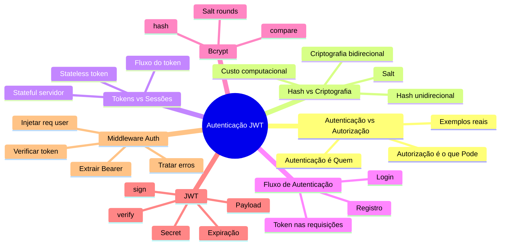
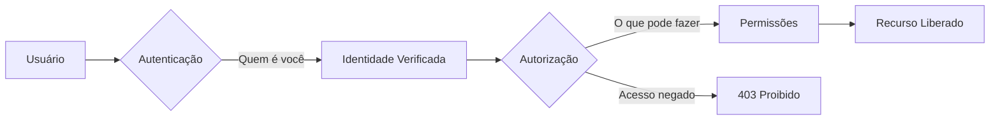
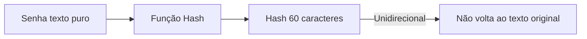
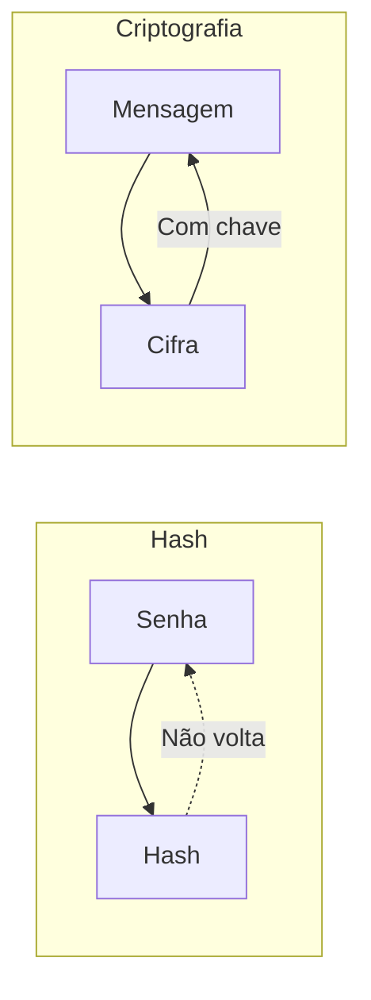
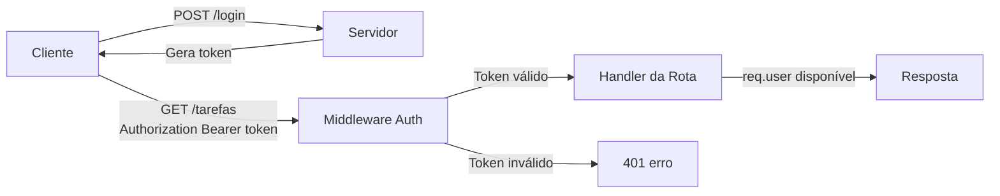

# Curso de Banco de Dados SQL — Aula 07

## Autenticação JWT — Usuários, Senhas e Tokens

**Duração estimada:** 100 minutos (40 de leitura + 60 de prática)
**Nível:** Intermediário
**Pré-requisitos:** Aula 04 (PostgreSQL via Docker), Aula 05 (Knex com PostgreSQL), Aula 06 (Consultas avançadas, transações, tabela usuarios com id/nome/email/criado_em, user_id em tarefas)

---

## Objetivos de Aprendizagem

Ao final desta aula, você será capaz de:

- [ ] **Explicar** a diferença entre autenticação e autorização com exemplos do mundo real
- [ ] **Distinguir** hash de senha de criptografia e justificar por que hash é unidirecional
- [ ] **Comparar** autenticação baseada em token versus sessão, listando vantagens de cada abordagem
- [ ] **Descrever** o fluxo completo de autenticação: registro, login, emissão de token, requisição protegida
- [ ] **Criar** uma migration para adicionar `senha_hash` à tabela `usuarios`
- [ ] **Aplicar** bcrypt para gerar hash de senha e comparar senha com hash armazenado
- [ ] **Gerar** tokens JWT com `jwt.sign()` e verificar com `jwt.verify()`
- [ ] **Implementar** o endpoint `POST /registro` com hash de senha e validação de email único
- [ ] **Implementar** o endpoint `POST /login` com verificação de senha e emissão de token
- [ ] **Construir** um middleware de autenticação que extrai, verifica e injeta o token na requisição
- [ ] **Diferenciar** erros de token — ausente, mal formatado, inválido, expirado — e responder adequadamente
- [ ] **Proteger** rotas da API com o middleware de autenticação
- [ ] **Configurar** `JWT_SECRET` como variável de ambiente no arquivo `.env`

---

## Como Usar Esta Aula

Esta aula está organizada em duas partes. A **primeira parte** constrói os fundamentos conceituais de autenticação, autorização, hash, criptografia e tokens — mecanismos universais que existem em qualquer sistema. A **segunda parte** aplica cada conceito no seu Gerenciador de Tarefas com bcrypt, JWT e middleware Express. Ao final, o arquivo separado de Questões de Aprendizagem traz as tarefas de checkpoint.

**Tempo estimado:** 40 minutos de leitura + 60 minutos de prática.

---

## Mapa Mental



> *O mapa mental acima mostra a estrutura da aula. Cada ramo representa um conceito que você vai explorar.*

---

## Recapitulação das Aulas 04 a 06

| Aula | Conceito | Onde aparece nesta aula | Como se conecta |
|---|---|---|---|
| Aula 04 | **PostgreSQL via Docker** (seções 5-7) | Seções 4-9 | O banco PostgreSQL que você configurou armazena os usuários com senha_hash |
| Aula 05 | **Knex com PostgreSQL** (knexfile.js) | Seções 4-9 | O mesmo knexfile.js com `client: 'pg'` roda a migration de senha_hash |
| Aula 06 | **Migration tabela usuarios** (seção 10) | Seção 4 | Você vai expandir a tabela usuarios existente com a coluna senha_hash |
| Aula 06 | **user_id e FK em tarefas** (seção 10) | Seções 7-9 | Cada tarefa já pertence a um usuário — a autenticação vai determinar qual |
| Aula 06 | **Repository Pattern** (seção 5) | Seções 7-8 | Você vai criar um repository de usuários com buscarPorEmail e criar |

---

**FUNDAMENTOS: Mecanismos Universais de Identificação e Acesso**

> *Os conceitos desta seção são universais — valem para qualquer sistema que precise identificar quem faz cada requisição e controlar o que cada um pode acessar. Na segunda parte, você verá como uma aplicação real implementa cada um deles.*

---

## 1. Autenticação vs Autorização

Dois conceitos que parecem sinônimos mas são completamente diferentes. Confundi-los é a fonte mais comum de falhas de segurança em aplicações.

**Autenticação** responde a pergunta "quem é você?". É o processo de verificar a identidade de um usuário. No mundo real, é como apresentar um passaporte ou carteira de identidade — você prova que é quem diz ser.

**Autorização** responde a pergunta "o que você pode fazer?". É o processo de determinar quais recursos e ações um usuário autenticado tem permissão para acessar. No mundo real, é como a chave do quarto de hotel — você já se identificou na recepção (autenticação) e agora recebe acesso apenas ao seu quarto, não aos outros.

A autenticação sempre vem primeiro. O sistema precisa saber quem você é antes de decidir o que você pode fazer. A autorização depende da autenticação — sem identidade verificada, não há base para conceder ou negar permissões.



> *Autenticação verifica identidade. Autorização verifica permissões. Um não funciona sem o outro.*

Veja um exemplo concreto: você entra em um prédio comercial. Na portaria, mostra seu crachá — isso é autenticação. O porteiro confirma que você é funcionário. Depois, seu crachá só abre a porta do seu andar, não do andar da diretoria — isso é autorização.

### Quick Check 1

**1. Qual a diferença essencial entre autenticação e autorização?**
**Resposta:** Autenticação verifica a identidade (quem é você). Autorização verifica as permissões (o que você pode fazer). Autenticação sempre precede autorização.

**2. Dê um exemplo do mundo real para cada conceito.**
**Resposta:** Autenticação: apresentar o passaporte no aeroporto. Autorização: o cartão de embarque dá acesso apenas ao seu voo, não a todos os voos do aeroporto.

---

## 2. Hash vs Criptografia — Guardando Segredos

Quando um usuário cria uma senha no seu sistema, você nunca deve armazená-la em texto puro. Se o banco for violado, todas as senhas dos seus usuários vazam. A solução é transformar a senha em algo que não possa ser revertido.

**Hash** é uma função matemática unidirecional. Ela pega uma entrada de qualquer tamanho e produz uma saída de tamanho fixo. A propriedade fundamental: **não é possível reverter**. Dado o hash, você não consegue descobrir a entrada original.



Uma função de hash para senhas tem três características especiais:

**Lentidão proposital:** hashes projetados para senhas são propositalmente lentos. Enquanto um hash comum de uso geral leva microssegundos, um hash de senha leva milissegundos — imperceptível para um usuário fazendo login, mas proibitivo para um invasor testando bilhões de senhas.

**Salt:** um valor aleatório único concatenado à senha antes do hash. Mesmo que dois usuários tenham a mesma senha, os hashes serão diferentes porque cada um tem um salt único. O salt fica armazenado junto com o hash — não é segredo, mas impede ataques de tabela pré-computada.

**Custo configurável:** você define quantas rodadas de processamento o hash executa. Mais rodadas = mais segurança (e mais lentidão). O padrão seguro atual é 10 a 12 rodadas.

**Criptografia** é diferente do hash. Criptografia é bidirecional — o que é criptografado pode ser decifrado com a chave correta. Senhas nunca devem ser criptografadas, porque se a chave vazar, todas as senhas são recuperáveis.



> *Hash é para senhas. Criptografia é para dados que precisam ser recuperados (como mensagens). Nunca troque um pelo outro.*

Veja um exemplo: quando o usuário faz login, o sistema pega a senha fornecida, aplica o mesmo hash, e compara com o hash armazenado. Se os hashes são iguais, a senha está correta. A senha original nunca é armazenada nem transmitida em texto puro.

### Quick Check 2

**1. Por que senhas devem usar hash em vez de criptografia?**
**Resposta:** Hash é unidirecional — mesmo que o banco vaze, a senha original não pode ser recuperada. Criptografia é reversível com a chave, então se a chave vazar, todas as senhas são expostas.

**2. O que é salt em um hash de senha?**
**Resposta:** Salt é um valor aleatório único adicionado à senha antes do hash, garantindo que senhas iguais produzam hashes diferentes e impedindo ataques com tabelas pré-computadas.

---

## 3. Tokens vs Sessões — Como Manter o Usuário Logado

Após autenticar, o sistema precisa lembrar que aquele usuário está logado. Cada requisição seguinte precisa provar que foi feita pelo mesmo usuário. Existem duas abordagens principais.

**Sessão (stateful):** o servidor armazena os dados da sessão em memória, banco ou cache. Quando o usuário faz login, o servidor cria um identificador de sessão e o envia ao cliente (geralmente como cookie). O cliente envia esse identificador em cada requisição, e o servidor busca os dados da sessão no armazenamento.

**Token (stateless):** o servidor não armazena nada. Quando o usuário faz login, o servidor gera um token autossuficiente que contém os dados necessários (identificador, permissões, data de expiração) e o envia ao cliente. O cliente armazena o token e o envia em cada requisição. O servidor verifica a assinatura do token para confirmar que ele é válido.

```mermaid
sequenceDiagram
    participant C as Cliente (Frontend)
    participant S as Servidor (Backend)

    C->>S: POST /login (email, senha)
    S->>S: Verifica credenciais
    S-->>C: token

    C->>S: GET /tarefas (Authorization: Bearer &lt;token&gt;)
    S->>S: Verifica assinatura do token
    S-->>C: Dados do usuário

    Note over C,S: Token é autossuficiente — servidor não armazena estado
```

Vantagens do token sobre sessão:

| Característica | Sessão (stateful) | Token (stateless) |
|---|---|---|
| Armazenamento | Servidor (memória, cache, banco) | Cliente (localStorage, cookie) |
| Escalabilidade | Precisa de sessão compartilhada entre servidores | Qualquer servidor verifica o token |
| Performance | Consulta ao armazenamento a cada requisição | Apenas verificação criptográfica |

Veja um exemplo: sua aplicação tem 10 mil usuários simultâneos. Com sessão, cada requisição acessa um cache para buscar a sessão. Com token, cada requisição apenas verifica uma assinatura criptográfica — sem acesso a banco. Para a mesma carga, o token é mais rápido e consome menos recursos.

> *Sessão = servidor lembra de você. Token = você carrega a prova de quem é.*

### Quick Check 3

**1. Qual a diferença fundamental entre autenticação stateful (sessão) e stateless (token)?**
**Resposta:** Na sessão, o servidor armazena os dados e o cliente carrega apenas um identificador. No token, o cliente carrega todos os dados necessários e o servidor apenas verifica a assinatura.

**2. Por que tokens são mais escaláveis que sessões?**
**Resposta:** Porque qualquer servidor pode verificar o token sem precisar consultar um armazenamento centralizado de sessões. Isso permite adicionar mais servidores horizontalmente sem configurar sessão compartilhada.

---

**APLICAÇÃO: Autenticação no Gerenciador de Tarefas**

> *Agora que você entende os fundamentos de autenticação, autorização, hash e tokens, vamos conectá-los à prática no seu Gerenciador de Tarefas. Você vai implementar registro, login e proteção de rotas usando bcrypt, JWT e middleware Express.*

---

## 4. Migration: Adicionando `senha_hash` à Tabela `usuarios`

Na Aula 06, você criou a tabela `usuarios` com as colunas `id`, `nome`, `email` e `criado_em`. Agora você precisa adicionar a coluna `senha_hash` para armazenar a senha de forma segura.

Crie a migration:

```bash
npx knex migrate:make adicionar_senha_hash_usuarios
```

Edite o arquivo gerado:

```javascript
exports.up = function(knex) {
  return knex.schema.alterTable('usuarios', function(table) {
    table.string('senha_hash').notNullable()
  })
}

exports.down = function(knex) {
  return knex.schema.alterTable('usuarios', function(table) {
    table.dropColumn('senha_hash')
  })
}
```

Repare no `.notNullable()`: a senha é obrigatória. Todo usuário precisa ter uma senha — não faz sentido criar um usuário sem ela.

Rode a migration:

```bash
npx knex migrate:latest
```

Verifique que a coluna foi adicionada:

```bash
npx knex migrate:status
```

Depois de rodar, conecte-se ao banco com psql ou pgAdmin e confirme:

```sql
SELECT column_name, data_type FROM information_schema.columns
WHERE table_name = 'usuarios';
```

A coluna `senha_hash` deve aparecer como `character varying`.

> *Se você já tinha usuários na tabela antes da migration, o comando falha porque usuários existentes não teriam `senha_hash` (NOT NULL). Nesse caso, você tem duas opções: ou deleta os usuários existentes e recria, ou permite NULL temporariamente com `.nullable()` e depois preenche. Para este curso, você pode rodar `DELETE FROM usuarios` antes da migration se houver dados de teste.*

### Quick Check 4

**1. Por que a coluna `senha_hash` é `string` (varchar) e não um tipo numérico?**
**Resposta:** O hash bcrypt é uma string de comprimento fixo (60 caracteres), não um número. O tipo `string` no Knex gera `VARCHAR` no PostgreSQL.

**2. O que acontece se você rodar a migration e a tabela `usuarios` já tiver registros?**
**Resposta:** A migration falha porque a nova coluna é `NOT NULL` e os registros existentes não teriam valor para preencher. É necessário deletar ou preencher os registros antes.

---

## 5. Bcrypt na Prática — Protegendo as Senhas

Bcrypt é a biblioteca mais popular para hash de senhas em Node.js. Vamos instalá-la e usá-la.

### Instalação

```bash
npm install bcrypt
```

### bcrypt.hash — Gerando o Hash

```javascript
const bcrypt = require('bcrypt')

const senha = 'minhaSenha123'
const saltRounds = 10

bcrypt.hash(senha, saltRounds)
  .then(hash => console.log('Hash gerado:', hash))
  .catch(erro => console.error('Erro:', erro))
```

O primeiro argumento é a senha em texto puro. O segundo, `saltRounds`, define o custo computacional. Cada round dobra o tempo de processamento. O valor 10 é o padrão seguro — gera um hash de 60 caracteres em aproximadamente 100ms em hardware moderno.

### bcrypt.compare — Verificando a Senha

```javascript
const hash = '$2b$10$7Q...' // hash armazenado no banco

bcrypt.compare(senha, hash)
  .then(resultado => {
    console.log('Senha correta?', resultado) // true ou false
  })
```

`bcrypt.compare` extrai o salt do próprio hash (o salt fica embutido no início do hash — 29 caracteres), aplica o hash na senha fornecida e compara com o hash armazenado.

### Exemplo Completo com Async/Await

```javascript
const bcrypt = require('bcrypt')

async function testarHash() {
  const senha = 'minhaSenha123'

  // Hash
  const hash = await bcrypt.hash(senha, 10)
  console.log('Hash:', hash)

  // Comparação correta
  const valido = await bcrypt.compare(senha, hash)
  console.log('Senha correta?', valido) // true

  // Comparação errada
  const invalido = await bcrypt.compare('senhaErrada', hash)
  console.log('Senha errada?', invalido) // false
}

testarHash().catch(console.error)
```

**Mão na Massa — Script de Teste de Hash:**

- [ ] Crie um arquivo `teste-bcrypt.js` na raiz do projeto
- [ ] Instale o bcrypt com `npm install bcrypt`
- [ ] Escreva o exemplo completo com async/await
- [ ] Execute com `node teste-bcrypt.js`
- [ ] Modifique `saltRounds` para 4 e execute novamente — observe que o hash é mais rápido mas menos seguro
- [ ] Modifique `saltRounds` para 14 e observe a diferença de tempo

### Quick Check 5

**1. O que o segundo argumento de `bcrypt.hash(senha, saltRounds)` controla?**
**Resposta:** O número de rounds de salt, que define o custo computacional do hash. Mais rounds = mais segurança e mais lentidão. O valor 10 é o padrão seguro.

**2. Como `bcrypt.compare` consegue verificar a senha se o hash inclui o salt?**
**Resposta:** O salt fica embutido nos primeiros caracteres do hash. `bcrypt.compare` extrai o salt do hash, aplica-o na senha fornecida e compara o resultado com o hash original.

---

## 6. JWT na Prática — Tokens Autossuficientes

JSON Web Token (JWT) é o formato de token mais usado em aplicações web modernas. Um JWT é composto por três partes separadas por pontos: cabeçalho, payload e assinatura.

```
cabeçalho.payload.assinatura
eyJhbGciOiJIUzI1NiIsInR5cCI6IkpXVCJ9.eyJpZCI6MX0.t8G...
```

**Cabeçalho:** contém o algoritmo de assinatura e o tipo do token.
**Payload:** contém os dados que você quer carregar (claims) — como id do usuário, email, data de expiração.
**Assinatura:** garante que o token não foi alterado. É gerada com um segredo que só o servidor conhece.

### Instalação

```bash
npm install jsonwebtoken
```

### jwt.sign — Gerando o Token

```javascript
const jwt = require('jsonwebtoken')

const payload = { id: 1, email: 'joao@email.com' }
const segredo = 'meuSegredoSuperSeguro'
const opcoes = { expiresIn: '7d' }

const token = jwt.sign(payload, segredo, opcoes)
console.log('Token:', token)
```

`jwt.sign` recebe: payload (objeto com dados), secret (string conhecida apenas pelo servidor) e opções (como `expiresIn`). O `expiresIn` aceita formatos como `'7d'` (7 dias), `'1h'` (1 hora), `'30m'` (30 minutos).

### jwt.verify — Verificando o Token

```javascript
const token = 'eyJhbGciOiJIUzI1NiIs...' // token recebido do cliente

try {
  const payload = jwt.verify(token, segredo)
  console.log('Token válido. Dados:', payload)
} catch (erro) {
  console.error('Token inválido:', erro.message)
}
```

`jwt.verify` retorna o payload original se o token é válido. Se o token expirou, foi adulterado ou o segredo não corresponde, ele lança um erro.

### Exemplo Completo

```javascript
const jwt = require('jsonwebtoken')
const segredo = 'minhaChaveSecreta'

async function testarToken() {
  // Gerar token com expiração de 1 minuto
  const payload = { id: 1, email: 'teste@teste.com' }
  const token = jwt.sign(payload, segredo, { expiresIn: '1m' })
  console.log('Token gerado:', token)

  // Verificar imediatamente — deve funcionar
  const dados = jwt.verify(token, segredo)
  console.log('Dados extraídos:', dados)

  // Simular erro: token com segredo diferente
  try {
    jwt.verify(token, 'segredoDiferente')
  } catch (erro) {
    console.log('Erro com segredo errado:', erro.message)
  }
}

testarToken().catch(console.error)
```

### Configurando o JWT_SECRET

O segredo do JWT nunca deve ficar hardcoded no código. Use variável de ambiente:

```
# .env
JWT_SECRET=seuSegredoSuperSeguroAqui
```

No código:

```javascript
const segredo = process.env.JWT_SECRET || 'fallback_dev'
```

Em produção, o segredo deve ser longo, aleatório e conhecido apenas pelo servidor.

> *Nunca coloque informações sensíveis (como senha) no payload do JWT. O payload é apenas codificado em base64, não criptografado — qualquer um que tenha o token consegue ler os dados. A assinatura impede alteração, mas não impede leitura.*

**Mão na Massa — Script de Teste de Token:**

- [ ] Crie `teste-jwt.js` na raiz do projeto
- [ ] Instale `jsonwebtoken` com `npm install jsonwebtoken`
- [ ] Escreva o exemplo completo gerando e verificando tokens
- [ ] Teste com `expiresIn: '5s'` e veja o erro ao verificar após 5 segundos
- [ ] Teste com segredo diferente na verificação — veja o erro `invalid signature`

### Quick Check 6

**1. Quais são as três partes de um JWT?**
**Resposta:** Cabeçalho (algoritmo e tipo), payload (dados do token) e assinatura (garante integridade). Exemplo: `header.payload.signature`.

**2. Por que o payload do JWT não deve conter dados sensíveis como senha?**
**Resposta:** Porque o payload é apenas codificado em base64, não criptografado. Qualquer um que tenha o token pode ler os dados com um simples `JSON.parse(atob(payload))`.

---

## 7. POST /registro — Criando Novos Usuários

O endpoint de registro recebe nome, email e senha, valida os dados, gera o hash da senha e insere o usuário no banco.

### Repository — Usuário

Crie `src/repos/usuario-repo.js`:

```javascript
const knex = require('../../knex')

function usuarioRepo() {
  return {
    async buscarPorEmail(email) {
      return await knex('usuarios').where({ email }).first()
    },

    async criar({ nome, email, senha_hash }) {
      const [usuario] = await knex('usuarios')
        .insert({ nome, email, senha_hash })
        .returning(['id', 'nome', 'email', 'criado_em'])
      return usuario
    }
  }
}

module.exports = usuarioRepo
```

Repare que o `criar` retorna apenas `id`, `nome`, `email` e `criado_em` — explicitamente excluindo o `senha_hash`. Nunca retorne o hash da senha para o cliente.

### Service — Autenticação

Crie `src/services/auth-service.js`:

```javascript
const bcrypt = require('bcrypt')

function authService(usuarioRepo) {
  return {
    async registrar({ nome, email, senha }) {
      const existente = await usuarioRepo.buscarPorEmail(email)
      if (existente) {
        throw Object.assign(new Error('Email já cadastrado'), { status: 409 })
      }

      const senha_hash = await bcrypt.hash(senha, 10)
      return await usuarioRepo.criar({ nome, email, senha_hash })
    }
  }
}

module.exports = authService
```

O service primeiro verifica se o email já existe no banco. Se existir, lança um erro com status 409 (Conflict). Só depois de confirmar que o email é único ele gera o hash e insere.

### Controller — Registro

Crie `src/controllers/auth-controller.js`:

```javascript
function authController(authService) {
  return {
    async registrar(req, res) {
      try {
        const { nome, email, senha } = req.body
        const usuario = await authService.registrar({ nome, email, senha })
        res.status(201).json(usuario)
      } catch (erro) {
        const status = erro.status || 400
        res.status(status).json({ erro: erro.message })
      }
    }
  }
}

module.exports = authController
```

### Rota

Adicione a rota no seu arquivo de rotas:

```javascript
const usuarioRepo = require('./src/repos/usuario-repo')()
const authService = require('./src/services/auth-service')(usuarioRepo)
const authController = require('./src/controllers/auth-controller')(authService)

router.post('/registro', (req, res) => authController.registrar(req, res))
```

> *Se você já tem uma estrutura de injeção de dependências, adapte a criação das instâncias conforme seu padrão. O importante é que usuarioRepo seja criado uma vez e injetado no service e controller.*

**Mão na Massa — Implementar POST /registro:**

- [ ] Crie `src/repos/usuario-repo.js` com `buscarPorEmail` e `criar`
- [ ] Crie `src/services/auth-service.js` com `registrar`
- [ ] Crie `src/controllers/auth-controller.js` com `registrar`
- [ ] Adicione a rota `POST /registro`
- [ ] Teste com curl ou Insomnia: `POST /registro` com `{ "nome": "João", "email": "joao@email.com", "senha": "123456" }`
- [ ] Teste com email duplicado — deve retornar 409
- [ ] Verifique no banco que o hash foi armazenado, não a senha em texto puro

---

## 8. POST /login — Autenticando e Gerando o Token

O endpoint de login recebe email e senha, busca o usuário no banco, compara o hash e, se válido, gera e retorna um JWT.

### Adicionando ao Service

Adicione o método `login` no `auth-service.js`:

```javascript
const jwt = require('jsonwebtoken')

async login({ email, senha }) {
  const usuario = await usuarioRepo.buscarPorEmail(email)
  if (!usuario) {
    throw Object.assign(new Error('Email ou senha inválidos'), { status: 401 })
  }

  const senhaValida = await bcrypt.compare(senha, usuario.senha_hash)
  if (!senhaValida) {
    throw Object.assign(new Error('Email ou senha inválidos'), { status: 401 })
  }

  const token = jwt.sign(
    { id: usuario.id, email: usuario.email },
    process.env.JWT_SECRET,
    { expiresIn: '7d' }
  )

  return {
    token,
    usuario: {
      id: usuario.id,
      nome: usuario.nome,
      email: usuario.email
    }
  }
}
```

Duas validações importantes: primeiro verifica se o email existe (usuário não encontrado), depois verifica se a senha confere. As duas devolvem a **mesma mensagem de erro** (`"Email ou senha inválidos"`) — isso impede que um invasor descubra quais emails estão cadastrados.

O token inclui `id` e `email` no payload. Nunca inclua `senha_hash` no token.

### Adicionando ao Controller

```javascript
async login(req, res) {
  try {
    const { email, senha } = req.body
    const resultado = await authService.login({ email, senha })
    res.json(resultado)
  } catch (erro) {
    const status = erro.status || 400
    res.status(status).json({ erro: erro.message })
  }
}
```

### Rota

```javascript
router.post('/login', (req, res) => authController.login(req, res))
```

**Mão na Massa — Implementar POST /login:**

- [ ] Adicione o método `login` no `auth-service.js`
- [ ] Adicione o método `login` no `auth-controller.js`
- [ ] Adicione a rota `POST /login`
- [ ] Teste com curl: `POST /login` com email e senha corretos — deve retornar `{ token, usuario }`
- [ ] Teste com senha errada — deve retornar 401
- [ ] Teste com email inexistente — deve retornar 401
- [ ] Decodifique o token (use [jwt.io](https://jwt.io) no navegador) e confirme que ele contém `id` e `email`

---

## 9. Middleware de Autenticação — Protegendo as Rotas

O middleware de autenticação é uma função que executa antes do handler da rota. Ele extrai o token do header `Authorization`, verifica se é válido e injeta os dados do usuário na requisição.

### Criando o Middleware

Crie `src/middlewares/auth-middleware.js`:

```javascript
const jwt = require('jsonwebtoken')

function authMiddleware(req, res, next) {
  const header = req.headers.authorization

  if (!header) {
    return res.status(401).json({ erro: 'Token ausente' })
  }

  const partes = header.split(' ')
  if (partes.length !== 2 || partes[0] !== 'Bearer') {
    return res.status(401).json({ erro: 'Token mal formatado' })
  }

  const token = partes[1]

  try {
    const payload = jwt.verify(token, process.env.JWT_SECRET)
    req.user = payload
    next()
  } catch (erro) {
    if (erro.name === 'TokenExpiredError') {
      return res.status(401).json({ erro: 'Token expirado' })
    }
    return res.status(401).json({ erro: 'Token inválido' })
  }
}

module.exports = authMiddleware
```

O middleware cuida de quatro cenários de erro:

1. **Token ausente**: o header `Authorization` não foi enviado.
2. **Token mal formatado**: o header não segue o padrão `Bearer <token>`.
3. **Token expirado**: o `expiresIn` passou — o `jwt.verify` lança `TokenExpiredError`.
4. **Token inválido**: assinatura incorreta ou token adulterado.

### Aplicando o Middleware

```javascript
const authMiddleware = require('./src/middlewares/auth-middleware')

// Em cada rota protegida
router.get('/tarefas', authMiddleware, (req, res) => {
  // req.user está disponível
  res.json({ usuario: req.user, tarefas: [] })
})

// Ou em grupo
router.use('/tarefas', authMiddleware)
```

Com o middleware aplicado, toda rota que vem depois dele tem acesso a `req.user` — um objeto com `id` e `email` do usuário autenticado.

### Fluxo Completo



**Mão na Massa — Implementar Middleware Auth:**

- [ ] Crie `src/middlewares/auth-middleware.js` com o código completo
- [ ] Adicione `authMiddleware` a uma rota de teste existente (ex: `GET /tarefas`)
- [ ] Teste sem token: deve retornar 401 "Token ausente"
- [ ] Teste com token inválido: deve retornar 401 "Token inválido"
- [ ] Teste com token expirado: gere token com `expiresIn: '1s'`, espere 2 segundos, teste
- [ ] Teste com token válido: deve passar e ter `req.user` populado

### Quick Check 7

**1. Em que formato o token JWT deve ser enviado no header HTTP?**
**Resposta:** No header `Authorization: Bearer <token>`. O middleware extrai o token após a palavra "Bearer" e um espaço.

**2. Como o middleware auth expõe os dados do usuário para o próximo handler?**
**Resposta:** Injetando `req.user = payload` após verificar o token. O handler da rota acessa `req.user.id`, `req.user.email`, etc.

---

## Autoavaliação: Quiz Rápido

**1. Qual a diferença entre autenticação e autorização?**
**Resposta:** Autenticação verifica a identidade (quem é você). Autorização verifica permissões (o que você pode fazer).

**2. Por que senhas devem ser armazenadas com hash e não com criptografia?**
**Resposta:** Hash é unidirecional — não é possível reverter ao texto original. Criptografia é reversível com a chave, então se a chave vazar, todas as senhas são expostas.

**3. Qual a vantagem de tokens stateless sobre sessões stateful para escalabilidade?**
**Resposta:** Tokens são autossuficientes — qualquer servidor pode verificar o token sem consultar um armazenamento centralizado, permitindo escalar horizontalmente sem configurar sessão compartilhada.

**4. O que o método `bcrypt.compare` faz?**
**Resposta:** Recebe uma senha em texto puro e um hash, extrai o salt do hash, aplica o hash na senha e compara com o hash armazenado. Retorna `true` se forem iguais.

**5. O que `jwt.sign` recebe como argumentos?**
**Resposta:** Recebe três argumentos: payload (dados), secret (segredo do servidor) e opções (como `expiresIn`). Retorna uma string JWT com as três partes codificadas.

**6. O que acontece se você tenta verificar um token JWT com um segredo diferente do usado para gerá-lo?**
**Resposta:** `jwt.verify` lança um erro de assinatura inválida (`invalid signature`), porque a assinatura do token não corresponde ao segredo fornecido.

**7. Por que o `POST /login` retorna a mesma mensagem para email inexistente e senha errada?**
**Resposta:** Para evitar que um invasor descubra quais emails estão cadastrados no sistema. Mensagens diferentes vazariam informação sobre a existência do email.

**8. O que o middleware de autenticação injeta em `req` após verificar o token?**
**Resposta:** Injeta `req.user` com os dados do payload do token (geralmente `id` e `email`). O handler da rota pode acessar `req.user` para identificar o usuário logado.

---

## Mão na Massa: Exercícios Graduados

### Exercício 1 (Fácil) — Migration senha_hash

**Duração estimada:** 10 minutos

Crie a migration `adicionar_senha_hash_usuarios` que adiciona a coluna `senha_hash` (string, NOT NULL) na tabela `usuarios`. Rode a migration e confirme que a coluna existe no banco.

**Gabarito:**

```bash
npx knex migrate:make adicionar_senha_hash_usuarios
```

```javascript
exports.up = function(knex) {
  return knex.schema.alterTable('usuarios', function(table) {
    table.string('senha_hash').notNullable()
  })
}

exports.down = function(knex) {
  return knex.schema.alterTable('usuarios', function(table) {
    table.dropColumn('senha_hash')
  })
}
```

```bash
npx knex migrate:latest
```

Confirme:

```bash
psql -d tarefas_db -c "\d usuarios"
```

A coluna `senha_hash` deve aparecer como `character varying(255)`.

---

### Exercício 2 (Médio) — POST /registro e POST /login Completos

**Duração estimada:** 25 minutos

Implemente os endpoints `POST /registro` e `POST /login` completos, seguindo a arquitetura do curso (controller → service → repository). O `POST /registro` deve receber `{ nome, email, senha }`, validar email único, gerar hash e retornar os dados do usuário (sem senha). O `POST /login` deve receber `{ email, senha }`, verificar as credenciais e retornar `{ token, usuario }`.

**Gabarito:**

**src/repos/usuario-repo.js:**

```javascript
const knex = require('../../knex')

function usuarioRepo() {
  return {
    async buscarPorEmail(email) {
      return await knex('usuarios').where({ email }).first()
    },

    async criar({ nome, email, senha_hash }) {
      const [usuario] = await knex('usuarios')
        .insert({ nome, email, senha_hash })
        .returning(['id', 'nome', 'email', 'criado_em'])
      return usuario
    }
  }
}

module.exports = usuarioRepo
```

**src/services/auth-service.js:**

```javascript
const bcrypt = require('bcrypt')
const jwt = require('jsonwebtoken')

function authService(usuarioRepo) {
  return {
    async registrar({ nome, email, senha }) {
      const existente = await usuarioRepo.buscarPorEmail(email)
      if (existente) {
        throw Object.assign(new Error('Email já cadastrado'), { status: 409 })
      }
      const senha_hash = await bcrypt.hash(senha, 10)
      return await usuarioRepo.criar({ nome, email, senha_hash })
    },

    async login({ email, senha }) {
      const usuario = await usuarioRepo.buscarPorEmail(email)
      if (!usuario) {
        throw Object.assign(new Error('Email ou senha inválidos'), { status: 401 })
      }
      const senhaValida = await bcrypt.compare(senha, usuario.senha_hash)
      if (!senhaValida) {
        throw Object.assign(new Error('Email ou senha inválidos'), { status: 401 })
      }
      const token = jwt.sign(
        { id: usuario.id, email: usuario.email },
        process.env.JWT_SECRET,
        { expiresIn: '7d' }
      )
      return {
        token,
        usuario: { id: usuario.id, nome: usuario.nome, email: usuario.email }
      }
    }
  }
}

module.exports = authService
```

**src/controllers/auth-controller.js:**

```javascript
function authController(authService) {
  return {
    async registrar(req, res) {
      try {
        const { nome, email, senha } = req.body
        const usuario = await authService.registrar({ nome, email, senha })
        res.status(201).json(usuario)
      } catch (erro) {
        res.status(erro.status || 400).json({ erro: erro.message })
      }
    },

    async login(req, res) {
      try {
        const { email, senha } = req.body
        const resultado = await authService.login({ email, senha })
        res.json(resultado)
      } catch (erro) {
        res.status(erro.status || 400).json({ erro: erro.message })
      }
    }
  }
}

module.exports = authController
```

**Rotas:**

```javascript
const usuarioRepo = require('./src/repos/usuario-repo')()
const authService = require('./src/services/auth-service')(usuarioRepo)
const authController = require('./src/controllers/auth-controller')(authService)

router.post('/registro', (req, res) => authController.registrar(req, res))
router.post('/login', (req, res) => authController.login(req, res))
```

Teste:

```bash
# Registro
curl -X POST http://localhost:3000/registro \
  -H "Content-Type: application/json" \
  -d '{"nome":"Maria","email":"maria@email.com","senha":"123456"}'

# Login
curl -X POST http://localhost:3000/login \
  -H "Content-Type: application/json" \
  -d '{"email":"maria@email.com","senha":"123456"}'
```

---

### Desafio (Difícil) — Middleware Auth + Rota Protegida

**Duração estimada:** 25 minutos

Implemente o middleware de autenticação que extrai o token JWT do header `Authorization: Bearer`, verifica com `jwt.verify` e injeta `req.user`. Crie também uma rota `GET /tarefas` que, além de listar as tarefas, retorna os dados do usuário logado obtidos de `req.user`.

**Gabarito:**

**src/middlewares/auth-middleware.js:**

```javascript
const jwt = require('jsonwebtoken')

function authMiddleware(req, res, next) {
  const header = req.headers.authorization

  if (!header) {
    return res.status(401).json({ erro: 'Token ausente' })
  }

  const partes = header.split(' ')
  if (partes.length !== 2 || partes[0] !== 'Bearer') {
    return res.status(401).json({ erro: 'Token mal formatado' })
  }

  const token = partes[1]

  try {
    const payload = jwt.verify(token, process.env.JWT_SECRET)
    req.user = payload
    next()
  } catch (erro) {
    if (erro.name === 'TokenExpiredError') {
      return res.status(401).json({ erro: 'Token expirado' })
    }
    return res.status(401).json({ erro: 'Token inválido' })
  }
}

module.exports = authMiddleware
```

**Rota protegida (no arquivo de rotas):**

```javascript
const authMiddleware = require('./src/middlewares/auth-middleware')

router.get('/tarefas', authMiddleware, async (req, res) => {
  try {
    const repos = require('./src/repos/tarefa-repo-knex')
    const tarefas = await repos.listar()
    res.json({
      usuario: req.user,
      tarefas
    })
  } catch (erro) {
    res.status(500).json({ erro: erro.message })
  }
})
```

Teste com e sem token:

```bash
# Sem token — deve retornar 401
curl http://localhost:3000/tarefas

# Com token inválido — deve retornar 401
curl http://localhost:3000/tarefas \
  -H "Authorization: Bearer tokenInvalido"

# Com token válido — deve retornar tarefas + dados do usuário
TOKEN=$(curl -s -X POST http://localhost:3000/login \
  -H "Content-Type: application/json" \
  -d '{"email":"maria@email.com","senha":"123456"}' | jq -r '.token')

curl http://localhost:3000/tarefas \
  -H "Authorization: Bearer $TOKEN"
```

O middleware deve lidar com todos os quatro cenários de erro: token ausente, mal formatado, inválido e expirado.

---

## Resumo da Aula

### Os 12 Conceitos Fundamentais

1. **Autenticação**: verifica a identidade do usuário. Responde "quem é você?".
2. **Autorização**: verifica as permissões do usuário. Responde "o que você pode fazer?".
3. **Hash**: função unidirecional que transforma senha em um valor irreversível. Essencial para armazenamento seguro.
4. **Salt**: valor aleatório adicionado à senha antes do hash para evitar que senhas iguais produzam hashes iguais.
5. **Token stateless**: autossuficiente, não requer armazenamento no servidor. Mais escalável que sessão.
6. **Sessão stateful**: servidor armazena os dados. Requer armazenamento compartilhado entre servidores.
7. **Bcrypt**: biblioteca de hash de senhas com salt embutido e custo configurável.
8. **JWT**: formato de token com três partes (cabeçalho, payload, assinatura) que garante integridade.
9. **bcrypt.hash()**: gera hash a partir de senha e salt rounds.
10. **bcrypt.compare()**: compara senha com hash armazenado.
11. **jwt.sign()**: gera token JWT com payload, segredo e opções de expiração.
12. **jwt.verify()**: verifica token e retorna payload original.

### O Que Você Construiu Hoje

- [x] Migration adicionando `senha_hash` à tabela `usuarios`
- [x] Script de teste de bcrypt com hash e compare
- [x] Script de teste de JWT com sign e verify
- [x] Repository de usuários (`usuario-repo.js` com `buscarPorEmail` e `criar`)
- [x] Service de autenticação (`auth-service.js` com `registrar` e `login`)
- [x] Controller de autenticação (`auth-controller.js`)
- [x] Endpoint `POST /registro` com hash de senha e validação de email único
- [x] Endpoint `POST /login` com verificação de senha e emissão de JWT
- [x] Middleware de autenticação (`auth-middleware.js`) com tratamento de erros
- [x] Rota protegida com `authMiddleware`
- [x] `JWT_SECRET` configurado como variável de ambiente

---

## Próxima Aula

**Aula 08: Autorização, Relacionamentos e Projeto Final**

Agora que os usuários podem se autenticar, você vai garantir que cada um vê apenas suas próprias tarefas. Vamos adicionar `user_id` à lógica de criação e listagem, impedir que um usuário acesse tarefas de outro, e finalizar o Gerenciador de Tarefas completo — do PostgreSQL ao JWT, passando por Knex e migrations.

---

## Referências

### Documentação Oficial

- [bcrypt — npm](https://www.npmjs.com/package/bcrypt)
- [jsonwebtoken — npm](https://www.npmjs.com/package/jsonwebtoken)
- [JWT.io — Introduction to JSON Web Tokens](https://jwt.io/introduction)
- [Knex.js — Migrations](https://knexjs.org/guide/migrations.html)

### Ferramentas

- [JWT.io Debugger](https://jwt.io/) — decodifique e verifique tokens JWT online
- [bcrypt.online](https://bcrypt.online/) — gere e verifique hashes bcrypt online

### Artigos para Aprofundamento

- [How to Store Passwords Safely](https://cheatsheetseries.owasp.org/cheatsheets/Password_Storage_Cheat_Sheet.html) — OWASP
- [JWT Best Practices](https://auth0.com/blog/a-look-at-the-latest-draft-for-jwt-bcp/) — Auth0
- [Understanding bcrypt](https://en.wikipedia.org/wiki/Bcrypt) — Wikipedia

---

## FAQ

**P: Posso usar o mesmo segredo JWT em desenvolvimento e produção?**
R: Não. Use segredos diferentes em cada ambiente. Em desenvolvimento, um segredo simples serve. Em produção, gere um segredo longo e aleatório (ex: `openssl rand -base64 32`) e armazene como variável de ambiente.

**P: O que acontece se o segredo JWT vazar?**
R: Qualquer um que tenha o segredo pode gerar tokens válidos para qualquer usuário. Se o segredo vazar, gere um novo imediatamente e force todos os usuários a fazer login novamente.

**P: Como invalidar um JWT antes da expiração (ex: usuário muda a senha)?**
R: JWTs não podem ser invalidados diretamente porque são stateless. Soluções comuns: manter uma lista negra de tokens no banco/Redis, usar um `jti` (identificador único do token) rastreável, ou fazer o token expirar em curto prazo (15-30 min) combinado com refresh tokens.

**P: Qual a diferença entre `bcrypt` e `bcryptjs`?**
R: `bcrypt` é uma binding nativa em C++ (mais rápida). `bcryptjs` é uma implementação pura em JavaScript (mais lenta mas sem dependências nativas). Para este curso, `bcrypt` funciona bem em qualquer ambiente com Node.js + compilador C++.

**P: Quantos salt rounds devo usar?**
R: 10 é o padrão seguro atual. Em hardware moderno, 10 rounds levam ~100ms. Para sistemas mais críticos, use 12 (~250ms). Acima de 14, o tempo de hash começa a ficar perceptível para o usuário.

**P: O JWT é criptografado?**
R: Não. O JWT é assinado (garantia de integridade), não criptografado. O payload é codificado em base64 — qualquer um que tenha o token pode ler os dados. Para dados sensíveis, use JWE (JSON Web Encryption) ou nunca coloque dados sensíveis no payload.

**P: Por que o `POST /registro` não retorna um token?**
R: Porque o registro geralmente exige confirmação de email ou aprovação do administrador. Login é que autentica e gera o token. Em sistemas mais simples, o registro pode retornar token junto — mas a separação conceitual é importante.

**P: Preciso instalar `dotenv` para usar variáveis de ambiente?**
R: Sim, ou use o suporte nativo do Node.js (v20+ com `--env-file`). O `dotenv` lê o arquivo `.env` e injeta as variáveis em `process.env`. Instale com `npm install dotenv` e chame `require('dotenv').config()` no início da aplicação.

**P: O middleware auth deve ser aplicado em cada rota ou globalmente?**
R: Depende. Se a maioria das rotas é protegida, aplique globalmente com `router.use(authMiddleware)` e marque as poucas rotas públicas com uma exceção. Se poucas rotas são protegidas, aplique individualmente. Não há regra absoluta.

**P: O que impede alguém de forjar um JWT?**
R: A assinatura criptográfica. O JWT é assinado com o segredo do servidor. Modificar o payload invalida a assinatura. Sem o segredo, é computacionalmente inviável criar uma assinatura válida para um payload adulterado.

---

## Glossário

| Termo | Definição |
|---|---|
| **Autenticação** | Processo de verificar a identidade de um usuário. Responde "quem é você?". (Ver seção 1) |
| **Autorização** | Processo de determinar quais recursos um usuário autenticado pode acessar. (Ver seção 1) |
| **Hash** | Função matemática unidirecional que transforma uma entrada em uma saída de tamanho fixo, impossível de reverter. (Ver seção 2) |
| **Salt** | Valor aleatório único adicionado à senha antes do hash para garantir unicidade. (Ver seção 2) |
| **Salt rounds** | Número de iterações do algoritmo bcrypt — define o custo computacional do hash. (Ver seção 2) |
| **Token** | String autossuficiente que contém dados de autenticação. O cliente armazena e envia em cada requisição. (Ver seção 3) |
| **Sessão** | Estado de autenticação armazenado no servidor, identificado por um ID enviado ao cliente. (Ver seção 3) |
| **Stateful** | Abordagem onde o servidor mantém estado da sessão do cliente. (Ver seção 3) |
| **Stateless** | Abordagem onde o servidor não armazena estado — o cliente carrega todos os dados necessários. (Ver seção 3) |
| **Bcrypt** | Biblioteca de hash de senhas com salt embutido, custo configurável e resistência a ataques de força bruta. (Ver seção 5) |
| **JWT** | *JSON Web Token* — formato de token com três partes (header, payload, signature) que garante integridade dos dados. (Ver seção 6) |
| **Payload** | Dados que o JWT carrega (claims), como id do usuário, email e expiração. (Ver seção 6) |
| **Assinatura** | Parte do JWT que garante que o token não foi adulterado. Gerada com o segredo do servidor. (Ver seção 6) |
| **Middleware** | Função que executa entre a requisição e o handler da rota. No Express, recebe `req`, `res`, `next`. (Ver seção 9) |
| **Bearer token** | Esquema de autenticação HTTP onde o token é enviado no header `Authorization: Bearer <token>`. (Ver seção 9) |
| **`bcrypt.hash()`** | Método que gera um hash bcrypt a partir de uma senha e um número de salt rounds. (Ver seção 5) |
| **`bcrypt.compare()`** | Método que compara uma senha em texto puro com um hash bcrypt. (Ver seção 5) |
| **`jwt.sign()`** | Método que gera um token JWT assinado com payload, segredo e opções. (Ver seção 6) |
| **`jwt.verify()`** | Método que verifica a assinatura de um JWT e retorna o payload original. (Ver seção 6) |
