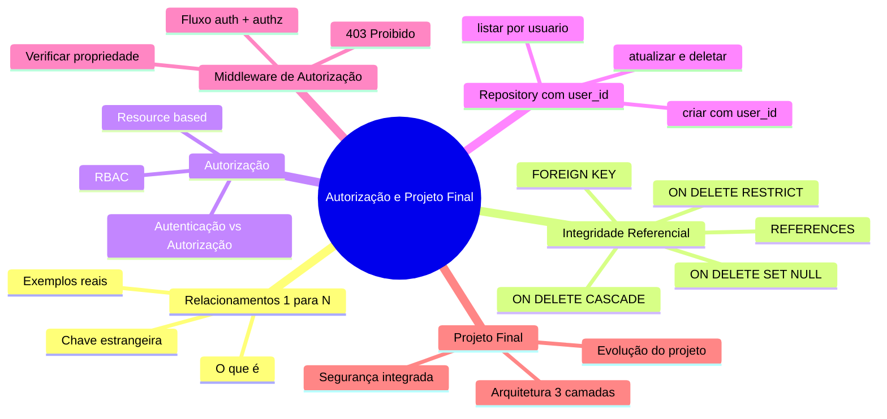
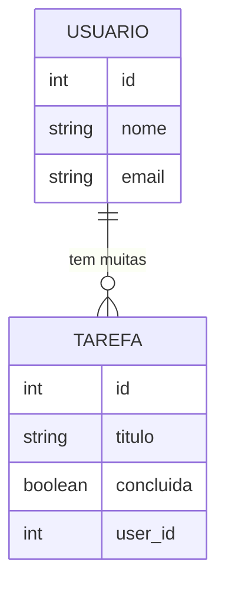
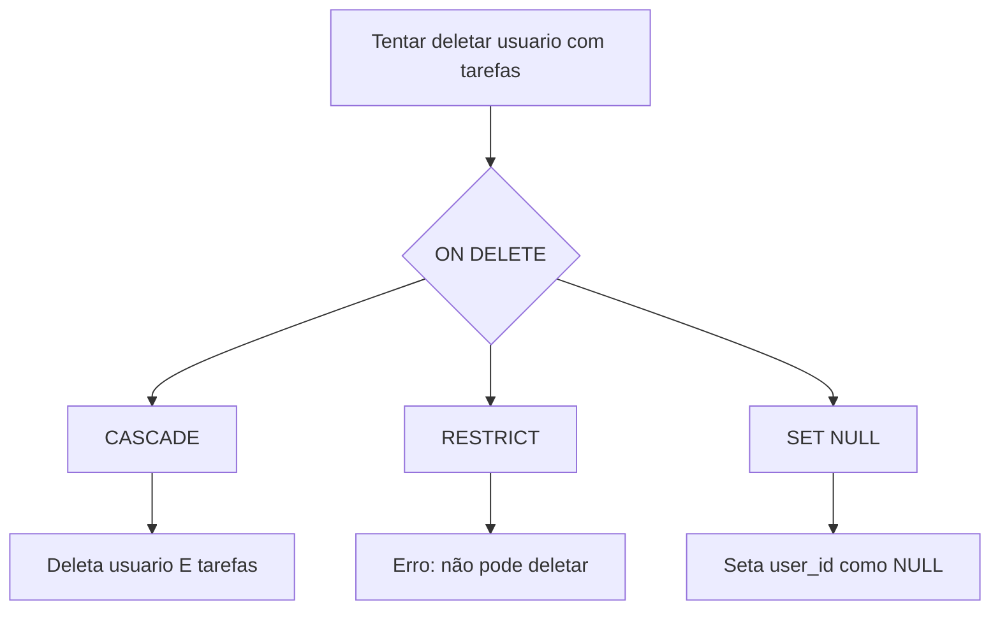
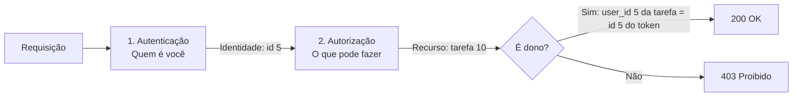
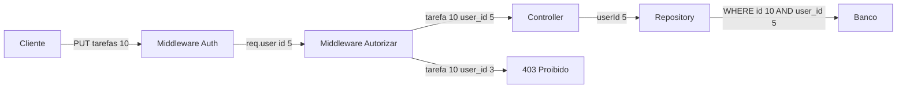

# Curso de Banco de Dados SQL — Aula 08

## Autorização, Relacionamentos e Projeto Final

**Duração estimada:** 120 minutos (40 de leitura + 80 de prática)
**Nível:** Avançado
**Pré-requisitos:** Aula 07 (Autenticação JWT, bcrypt, middleware auth, req.user, POST /registro, POST /login)

---

## Objetivos de Aprendizagem

Ao final desta aula, você será capaz de:

- [ ] **Explicar** o conceito de relacionamento 1:N entre tabelas com exemplos do mundo real
- [ ] **Definir** chave estrangeira (FOREIGN KEY) e seu papel na integridade referencial
- [ ] **Comparar** os comportamentos ON DELETE CASCADE, RESTRICT e SET NULL
- [ ] **Distinguir** autenticação de autorização com exemplos de sistemas reais
- [ ] **Descrever** autorização baseada em recursos versus RBAC
- [ ] **Aplicar** filtro `user_id` em todas as queries do repository de tarefas
- [ ] **Modificar** serviços para receber e repassar `userId` do controller
- [ ] **Construir** um middleware de autorização que verifica a propriedade do recurso
- [ ] **Atualizar** controllers e rotas para integrar autorização
- [ ] **Proteger** endpoints PUT e DELETE com middleware de autorização
- [ ] **Revisar** a arquitetura completa de 3 camadas com segurança integrada
- [ ] **Sintetizar** a evolução do projeto: JSON local → SQLite → PostgreSQL → Autenticação → Autorização
- [ ] **Verificar** que usuário A não acessa tarefas do usuário B

---

## Como Usar Esta Aula

Esta aula está organizada em duas partes. A **primeira parte** constrói os fundamentos conceituais de relacionamentos entre tabelas, integridade referencial e autorização baseada em recursos — mecanismos universais de qualquer sistema com múltiplos usuários. A **segunda parte** aplica cada conceito no seu Gerenciador de Tarefas, protegendo cada query por `user_id`, adicionando middleware de autorização e finalizando o projeto completo. Ao final, o arquivo separado de Questões de Aprendizagem traz as tarefas de checkpoint.

**Tempo estimado:** 40 minutos de leitura + 80 minutos de prática.

---

## Mapa Mental



> *O mapa mental acima mostra a estrutura da aula. Cada ramo representa um conceito que você vai explorar.*

---

## Recapitulação das Aulas 06 e 07

| Aula | Conceito | Onde aparece nesta aula | Como se conecta |
|---|---|---|---|
| Aula 06 | **Tabela usuarios e user_id** (seção 10) | Seções 4-9 | A tabela `tarefas` já tem `user_id` — você vai filtrar por ele |
| Aula 06 | **Repository Pattern** (seção 5) | Seções 5-7 | O mesmo repository que começou com JSON e SQLite agora ganha filtro de autorização |
| Aula 07 | **Autenticação JWT** (seções 7-9) | Seções 3, 7-8 | `req.user.id` vem do JWT — você vai usar para filtrar tarefas |
| Aula 07 | **Middleware auth** (seção 9) | Seção 8 | O middleware auth já identifica o usuário — autorização verifica permissão |
| Aula 07 | **POST /registro e /login** (seções 7-8) | Seções 6-7 | Usuários autenticados que agora terão dados isolados |

---

**FUNDAMENTOS: Conexões entre Dados e Controle de Acesso**

> *Os conceitos desta seção são universais — valem para qualquer sistema que precise relacionar dados entre tabelas e controlar quem acessa o quê. Na segunda parte, você verá como uma aplicação real implementa cada um deles.*

---

## 1. Relacionamentos 1:N

Bancos de dados relacionais são chamados assim porque permitem **relacionar** dados entre tabelas. O relacionamento mais comum é o 1:N (um-para-muitos).

### O que é um Relacionamento 1:N

Um relacionamento 1:N significa que **um registro em uma tabela se relaciona com muitos registros em outra**. O "1" é o lado que tem um único registro. O "N" é o lado que pode ter vários.



Veja a notação: `||--o{` significa "um e apenas um" (||) do lado do usuário para "zero ou muitos" (o{) do lado da tarefa. Um usuário pode ter zero, uma ou várias tarefas. Cada tarefa pertence a exatamente um usuário.

### Exemplos do Mundo Real

| Entidade A (1) | Entidade B (N) | Exemplo |
|---|---|---|
| Autor | Livros | Um autor escreve vários livros. Cada livro tem um autor. |
| Cliente | Pedidos | Um cliente faz vários pedidos. Cada pedido pertence a um cliente. |
| Categoria | Produtos | Uma categoria contém vários produtos. Cada produto está em uma categoria. |
| Usuário | Tarefas | Um usuário cria várias tarefas. Cada tarefa foi criada por um usuário. |

Em todos os exemplos, a entidade do lado "N" carrega uma **chave estrangeira** que referencia o identificador da entidade do lado "1". No banco, isso é uma coluna que armazena o `id` da outra tabela.

### Como se Materializa no Banco

O lado "N" (tarefas, pedidos, livros) ganha uma coluna extra que armazena o `id` do lado "1". Essa coluna é chamada de **chave estrangeira** (foreign key).

```
Tabela: usuarios          Tabela: tarefas
+----+-------+           +----+--------+---------+
| id | nome  |           | id | titulo | user_id |
+----+-------+           +----+--------+---------+
| 1  | João  |           | 1  | Comprar| 1       |
| 2  | Maria |           | 2  | Estudar| 1       |
+----+-------+           | 3  | Treinar| 2       |
                          +----+--------+---------+
```

João (id=1) tem duas tarefas (user_id=1 em ambas). Maria (id=2) tem uma tarefa (user_id=2). A coluna `user_id` conecta cada tarefa ao seu dono.

### Quick Check 1

**1. Em um relacionamento 1:N entre autor e livros, onde fica a chave estrangeira?**
**Resposta:** Na tabela `livros`. Cada livro armazena o `autor_id` que referencia o `id` do autor correspondente.

**2. Quantas tarefas um usuário pode ter no máximo? E quantos usuários uma tarefa pode ter?**
**Resposta:** Um usuário pode ter N tarefas (sem limite). Uma tarefa pertence a exatamente um usuário.

---

## 2. Integridade Referencial

Ter uma coluna com o ID de outra tabela não garante nada por si só. O banco precisa de uma regra que impeça valores orphan — referências a registros que não existem.

### FOREIGN KEY e REFERENCES

A chave estrangeira é uma **restrição** que o banco aplica:

```sql
CREATE TABLE tarefas (
    id INTEGER PRIMARY KEY AUTOINCREMENT,
    titulo TEXT NOT NULL,
    user_id INTEGER NOT NULL,
    FOREIGN KEY (user_id) REFERENCES usuarios(id)
);
```

Essa constraint diz: "todo valor em `user_id` deve existir na coluna `id` da tabela `usuarios`". O banco rejeita qualquer INSERT ou UPDATE que tente colocar um `user_id` que não exista em `usuarios`.

O mesmo vale para DELETE: se você tenta deletar um usuário que tem tarefas, o que acontece? Depende da regra definida na foreign key.

### ON DELETE — Três Comportamentos



**CASCADE:** deleta o pai e os filhos. Útil quando a existência do filho depende completamente do pai. Ex: deletar um pedido deleta os itens do pedido.

**RESTRICT:** impede a deleção do pai se houver filhos. O banco lança um erro. Útil para dados que nunca devem ser perdidos. Ex: não permitir deletar um usuário que tem tarefas.

**SET NULL:** ao deletar o pai, o `user_id` dos filhos vira NULL. O filho órfão continua existindo. Ex: deletar um vendedor, mas as vendas dele permanecem com `vendedor_id = NULL`.

No PostgreSQL, você também encontra `NO ACTION` (similar ao RESTRICT, mas difere na ordem de verificação) e `SET DEFAULT`.

### Qual Escolher?

| Cenário | Recomendado | Motivo |
|---|---|---|
| Itens de pedido dependentes | CASCADE | Se o pedido sumir, os itens não fazem sentido |
| Usuário com tarefas | RESTRICT | Tarefas não devem ser órfãs — ou reatribua antes |
| Log de auditoria | SET NULL | O registro histórico deve sobreviver ao autor |

### Quick Check 2

**1. O que acontece se você tenta inserir uma tarefa com `user_id = 999` e não existe usuário com id 999?**
**Resposta:** O banco rejeita o INSERT com erro de violação de chave estrangeira, porque `user_id` deve referenciar um `id` existente em `usuarios`.

**2. Qual a diferença prática entre ON DELETE CASCADE e ON DELETE RESTRICT?**
**Resposta:** CASCADE deleta automaticamente os registros filhos junto com o pai. RESTRICT impede a deleção do pai se existirem filhos, retornando erro.

---

## 3. Autorização Baseada em Recursos

Autenticação diz **quem** é você. Autorização diz **o que** você pode fazer. Você já viu essa distinção na Aula 07 — agora vamos aprofundar nos tipos de autorização.

### Revisão: Autenticação vs Autorização

O aeroporto é o exemplo mais claro. Apresentar o passaporte é autenticação — você prova quem é. O cartão de embarque só libera seu portão, não todos os portões — isso é autorização.

No sistema, a diferença se traduz em camadas diferentes:



### Resource-Based vs RBAC

Existem duas abordagens principais de autorização:

**Autorização baseada em recursos (Resource-Based):** a permissão depende da relação entre o usuário e o recurso específico. "Você só pode modificar um recurso que você criou." É simples, direta e independe de papéis.

**RBAC (Role-Based Access Control):** a permissão depende do papel (role) do usuário. "Administradores podem tudo. Usuários comuns só podem o próprio recurso." Requer uma tabela de papéis e um mapeamento de permissões.

| Característica | Resource-Based | RBAC |
|---|---|---|
| O que define a permissão | Quem criou o recurso | O papel do usuário |
| Complexidade | Baixa | Média a alta |
| Administração | Nenhuma — automática | Requer gerenciar papéis |
| Exemplo | Só o autor edita o post | Admin edita qualquer post |
| Ideal para | Dados pessoais de cada usuário | Sistemas com hierarquia de cargos |

Nesta aula, você vai implementar **autorização baseada em recursos** — o usuário que criou a tarefa é o único que pode vê-la, editá-la ou deletá-la. É a abordagem mais comum para dados pessoais.

O fluxo completo fica: o middleware auth identifica o usuário (etapa 1), uma verificação de autorização confirma que o recurso pertence a ele (etapa 2), e só então a operação prossegue (etapa 3).

### Quick Check 3

**1. Um usuário admin pode deletar tarefas de qualquer pessoa. Isso é resource-based ou RBAC?**
**Resposta:** RBAC — a permissão vem do papel (admin), não da relação entre o usuário e o recurso.

**2. Em resource-based, como o sistema sabe se o usuário pode modificar uma tarefa?**
**Resposta:** Comparando o `user_id` da tarefa com o `id` do usuário extraído do token JWT. Se são iguais, o recurso pertence ao usuário.

---

**APLICAÇÃO: Protegendo Recursos por Usuário no Gerenciador de Tarefas**

> *Agora que você entende relacionamentos, integridade referencial e autorização baseada em recursos, vamos conectar cada conceito ao seu código. O `user_id` já existe na sua tabela — você vai usá-lo para isolar completamente os dados de cada usuário.*

---

## 4. Revisando o Relacionamento user_id

Na Aula 06, você criou a tabela `usuarios` e adicionou `user_id` na tabela `tarefas`. Vamos confirmar como está o schema atual.

### Schema Atual da Tabela tarefas

```sql
SELECT
    column_name,
    data_type,
    is_nullable
FROM information_schema.columns
WHERE table_name = 'tarefas'
ORDER BY ordinal_position;
```

A saída deve mostrar as colunas: `id` (integer), `titulo` (character varying), `concluida` (boolean), `criada_em` (timestamp), `categoria_id` (integer, nullable), `user_id` (integer, not null).

### Migration Existente

O relacionamento foi criado com uma migration que alterou a tabela:

```javascript
exports.up = function(knex) {
  return knex.schema.alterTable('tarefas', function(table) {
    table.integer('user_id').notNullable()
    table.foreign('user_id').references('id').inTable('usuarios')
  })
}

exports.down = function(knex) {
  return knex.schema.alterTable('tarefas', function(table) {
    table.dropColumn('user_id')
  })
}
```

A constraint `FOREIGN KEY` no PostgreSQL já garante que nenhuma tarefa seja criada sem um `user_id` válido, e que deletar um usuário com tarefas é impedido (RESTRICT por padrão).

### Verificando com Consulta SQL

```sql
SELECT
    t.id,
    t.titulo,
    u.nome AS usuario
FROM tarefas t
JOIN usuarios u ON t.user_id = u.id
ORDER BY u.nome;
```

Essa consulta mostra cada tarefa com o nome do seu dono. Se você tem dados de teste de aulas anteriores, o resultado confirma que o relacionamento já está funcionando.

### Quick Check 4

**1. Qual constraint garante que um `user_id` inválido seja rejeitado?**
**Resposta:** A `FOREIGN KEY (user_id) REFERENCES usuarios(id)` — o banco rejeita INSERT ou UPDATE com `user_id` que não exista em `usuarios`.

**2. O que a query com JOIN entre `tarefas` e `usuarios` revela?**
**Resposta:** Que cada tarefa está associada a um usuário específico através do `user_id`, e é possível recuperar os dados do usuário junto com a tarefa.

---

## 5. Modificando o Repository para Filtrar por usuário

Até agora, o repository de tarefas lista TODAS as tarefas do banco. O problema: usuário A vê as tarefas do usuário B. A solução: adicionar `user_id` em TODAS as queries.

Este é o **coração da autorização no banco**. Se a query não filtra por `user_id`, a autorização não funciona — não importa quantos middlewares você coloque na frente.

### Método listar(userId)

Antes:
```javascript
async listar() {
  return await knex('tarefas').select('*')
}
```

Depois:
```javascript
async listar(userId) {
  return await knex('tarefas')
    .where('user_id', userId)
    .select('*')
}
```

Cada usuário vê apenas as tarefas onde `user_id` é igual ao seu `id`. O `userId` vem do token JWT (via `req.user.id`).

### Método buscarPorId(id, userId)

Antes:
```javascript
async buscarPorId(id) {
  return await knex('tarefas').where({ id }).first()
}
```

Depois:
```javascript
async buscarPorId(id, userId) {
  return await knex('tarefas')
    .where({ id, user_id: userId })
    .first()
}
```

Aqui a autorização é dupla: o `id` localiza a tarefa, e `user_id` garante que a tarefa pertence ao usuário. Se a tarefa existe mas pertence a outro usuário, o método retorna `undefined`.

### Método criar(dados, userId)

Antes:
```javascript
async criar(dados) {
  return await knex('tarefas').insert(dados).returning('*')
}
```

Depois:
```javascript
async criar(dados, userId) {
  return await knex('tarefas')
    .insert({ ...dados, user_id: userId })
    .returning('*')
}
```

Ao criar, o `user_id` é automaticamente associado ao usuário logado. O cliente nunca envia `user_id` no body — ele vem do token.

### Método atualizar(id, dados, userId)

Antes:
```javascript
async atualizar(id, dados) {
  return await knex('tarefas')
    .where({ id })
    .update(dados)
    .returning('*')
}
```

Depois:
```javascript
async atualizar(id, dados, userId) {
  return await knex('tarefas')
    .where({ id, user_id: userId })
    .update(dados)
    .returning('*')
}
```

O `WHERE` com `user_id` impede que o usuário A atualize uma tarefa do usuário B, mesmo que ele saiba o `id` da tarefa.

### Método deletar(id, userId)

Antes:
```javascript
async deletar(id) {
  return await knex('tarefas').where({ id }).del()
}
```

Depois:
```javascript
async deletar(id, userId) {
  return await knex('tarefas')
    .where({ id, user_id: userId })
    .del()
}
```

### Código Completo do Repository

```javascript
const knex = require('../../knex')

function tarefaRepoKnex() {
  return {
    async listar(userId) {
      return await knex('tarefas')
        .where('user_id', userId)
        .select('*')
    },

    async buscarPorId(id, userId) {
      return await knex('tarefas')
        .where({ id, user_id: userId })
        .first()
    },

    async criar(dados, userId) {
      return await knex('tarefas')
        .insert({ ...dados, user_id: userId })
        .returning('*')
    },

    async atualizar(id, dados, userId) {
      return await knex('tarefas')
        .where({ id, user_id: userId })
        .update(dados)
        .returning('*')
    },

    async deletar(id, userId) {
      return await knex('tarefas')
        .where({ id, user_id: userId })
        .del()
    }
  }
}

module.exports = tarefaRepoKnex
```

Note o padrão: **todo** método que opera em tarefas agora recebe `userId` e filtra por ele. Não há exceção — se um método não filtrar por `userId`, a autorização tem uma brecha.

**Mão na Massa — Refatorar o Repository:**

- [ ] Abra `src/repos/tarefa-repo-knex.js`
- [ ] Adicione o parâmetro `userId` a cada método
- [ ] Adicione `.where('user_id', userId)` ou `.where({ user_id: userId })` em cada query
- [ ] No `criar`, adicione `user_id: userId` ao objeto de insert
- [ ] Verifique que não sobrou nenhum método sem filtro de `user_id`
- [ ] Salve o arquivo

---

## 6. Serviços com user_id

Os services são a camada intermediária entre controllers e repositories. Eles agora precisam receber `userId` e repassar ao repository, exatamente como já fazem com outros parâmetros.

### Service de Tarefas Atualizado

```javascript
function tarefaService(tarefaRepo) {
  return {
    async listar(userId) {
      return await tarefaRepo.listar(userId)
    },

    async buscarPorId(id, userId) {
      const tarefa = await tarefaRepo.buscarPorId(id, userId)
      if (!tarefa) {
        throw Object.assign(
          new Error('Tarefa não encontrada'),
          { status: 404 }
        )
      }
      return tarefa
    },

    async criar(dados, userId) {
      return await tarefaRepo.criar(dados, userId)
    },

    async atualizar(id, dados, userId) {
      const tarefa = await tarefaRepo.buscarPorId(id, userId)
      if (!tarefa) {
        throw Object.assign(
          new Error('Tarefa não encontrada'),
          { status: 404 }
        )
      }
      return await tarefaRepo.atualizar(id, dados, userId)
    },

    async deletar(id, userId) {
      const tarefa = await tarefaRepo.buscarPorId(id, userId)
      if (!tarefa) {
        throw Object.assign(
          new Error('Tarefa não encontrada'),
          { status: 404 }
        )
      }
      return await tarefaRepo.deletar(id, userId)
    }
  }
}
```

Observe que os métodos que modificam um recurso específico (`atualizar`, `deletar`) primeiro buscam a tarefa com o `userId` — se não encontrarem, retornam 404. Isso é importante: o usuário não deve saber se a tarefa existe ou não se ela não pertence a ele. Retornar 404 em vez de 403 evita vazamento de informação.

**Mão na Massa — Atualizar Service:**

- [ ] Abra `src/services/tarefa-service.js` (ou o nome do seu service)
- [ ] Adicione o parâmetro `userId` a cada método
- [ ] Repasse `userId` para o repository em cada chamada
- [ ] Adicione verificação de existência com `buscarPorId(id, userId)` nos métodos de atualizar e deletar

---

## 7. Controllers e Rotas Atualizadas

Agora os controllers passam `req.user.id` para o service. A fonte da verdade é o token JWT validado pelo middleware auth.

### Controller de Tarefas

```javascript
function tarefaController(tarefaService) {
  return {
    async listar(req, res) {
      try {
        const tarefas = await tarefaService.listar(req.user.id)
        res.json(tarefas)
      } catch (erro) {
        res.status(500).json({ erro: erro.message })
      }
    },

    async buscarPorId(req, res) {
      try {
        const { id } = req.params
        const tarefa = await tarefaService.buscarPorId(id, req.user.id)
        res.json(tarefa)
      } catch (erro) {
        res.status(erro.status || 500).json({ erro: erro.message })
      }
    },

    async criar(req, res) {
      try {
        const tarefa = await tarefaService.criar(req.body, req.user.id)
        res.status(201).json(tarefa)
      } catch (erro) {
        res.status(400).json({ erro: erro.message })
      }
    },

    async atualizar(req, res) {
      try {
        const { id } = req.params
        const tarefa = await tarefaService.atualizar(id, req.body, req.user.id)
        res.json(tarefa)
      } catch (erro) {
        res.status(erro.status || 400).json({ erro: erro.message })
      }
    },

    async deletar(req, res) {
      try {
        const { id } = req.params
        await tarefaService.deletar(id, req.user.id)
        res.status(204).send()
      } catch (erro) {
        res.status(erro.status || 400).json({ erro: erro.message })
      }
    }
  }
}
```

Cada método do controller extrai `req.user.id` (injetado pelo middleware auth) e passa para o service.

### Rotas Atualizadas

```javascript
const authMiddleware = require('./src/middlewares/auth-middleware')

// Rotas públicas
router.post('/registro', (req, res) => authController.registrar(req, res))
router.post('/login', (req, res) => authController.login(req, res))

// Rotas protegidas (autenticação + autorização no repository)
router.get('/tarefas', authMiddleware, (req, res) => tarefaController.listar(req, res))
router.get('/tarefas/:id', authMiddleware, (req, res) => tarefaController.buscarPorId(req, res))
router.post('/tarefas', authMiddleware, (req, res) => tarefaController.criar(req, res))
router.put('/tarefas/:id', authMiddleware, (req, res) => tarefaController.atualizar(req, res))
router.delete('/tarefas/:id', authMiddleware, (req, res) => tarefaController.deletar(req, res))
```

Todas as rotas de tarefas são protegidas pelo `authMiddleware`. A autorização acontece dentro do repository, no filtro `user_id`.

**Mão na Massa — Atualizar Controller e Rotas:**

- [ ] Abra o controller de tarefas e adicione `req.user.id` em cada método
- [ ] Verifique as rotas: toda rota de tarefas tem `authMiddleware`
- [ ] Teste `GET /tarefas` autenticado — deve retornar só as tarefas do usuário logado
- [ ] Teste com dois usuários: crie tarefas com cada um e confirme o isolamento

---

## 8. Middleware de Autorização Específico

O filtro no repository já protege as queries de banco. Mas para rotas que modificam ou deletam, você pode querer uma **camada extra de verificação** — um middleware que busca a tarefa e verifica a propriedade antes de delegar ao controller.

### Middleware autorizarTarefa

Crie `src/middlewares/autorizacao-middleware.js`:

```javascript
const jwt = require('jsonwebtoken')

function autorizarTarefa(tarefaRepo) {
  return async function(req, res, next) {
    try {
      const { id } = req.params
      const tarefa = await tarefaRepo.buscarPorId(id, req.user.id)

      if (!tarefa) {
        return res.status(403).json({
          erro: 'Você não tem permissão para acessar este recurso'
        })
      }

      req.tarefa = tarefa
      next()
    } catch (erro) {
      res.status(500).json({ erro: erro.message })
    }
  }
}

module.exports = autorizarTarefa
```

O fluxo completo: o middleware auth identifica o usuário e injeta `req.user`. O middleware `autorizarTarefa` usa o `id` do usuário e o `id` da tarefa para verificar se a tarefa pertence a ele. Se não pertencer, retorna 403. Se pertencer, injeta `req.tarefa` e chama `next()`.

### Aplicando em Rotas Específicas

```javascript
const autorizarTarefa = require('./src/middlewares/autorizacao-middleware')
const autorizar = autorizarTarefa(tarefaRepo)

router.put('/tarefas/:id', authMiddleware, autorizar, (req, res) => {
  // req.tarefa já está disponível
  tarefaController.atualizar(req, res)
})

router.delete('/tarefas/:id', authMiddleware, autorizar, (req, res) => {
  tarefaController.deletar(req, res)
})
```

Por que ter dois níveis de proteção (middleware + repository)? O middleware é uma **proteção adicional** — ele falha rápido (antes de qualquer lógica de negócio) e retorna 403 explícito. O repository é a **proteção final** — mesmo que o middleware não seja aplicado por engano em alguma rota, o banco ainda filtra por `user_id`.



**Mão na Massa — Middleware de Autorização:**

- [ ] Crie `src/middlewares/autorizacao-middleware.js` com o middleware `autorizarTarefa`
- [ ] Aplique o middleware nas rotas PUT e DELETE
- [ ] Teste com token do usuário B tentando acessar tarefa do usuário A — deve retornar 403
- [ ] Teste com token do usuário A acessando própria tarefa — deve funcionar

### Quick Check 5

**1. Por que manter o filtro `user_id` no repository mesmo tendo o middleware de autorização?**
**Resposta:** O middleware é uma proteção a mais, mas o repository é a última linha de defesa. Se alguém esquecer de aplicar o middleware em uma rota, o banco ainda rejeita dados de outro usuário.

**2. O que o middleware `autorizarTarefa` retorna se a tarefa não pertence ao usuário?**
**Resposta:** Retorna 403 (Forbidden) com a mensagem "Você não tem permissão para acessar este recurso". Diferente do 404 que o service retorna quando a tarefa simplesmente não existe.

---

## 9. Projeto Final: Arquitetura Completa

Você construiu uma API REST completa com segurança em múltiplas camadas. Vamos revisar o que você tem.

### Arquitetura em 3 Camadas

```
┌─────────────────────────────────────────────────────┐
│                    ROTAS (router)                     │
│  GET / POST / PUT / DELETE /tarefas                   │
│  POST /registro, POST /login                          │
├─────────────────────────────────────────────────────┤
│               MIDDLEWARES                             │
│  auth: extrai e verifica JWT → req.user               │
│  autorizar: verifica propriedade → req.tarefa         │
├─────────────────────────────────────────────────────┤
│                CONTROLLERS                            │
│  Extrai dados da requisição (req.body, req.params)    │
│  Obtém userId de req.user.id                          │
│  Chama service e retorna resposta                     │
├─────────────────────────────────────────────────────┤
│                  SERVICES                             │
│  Lógica de negócio (validações, regras)               │
│  Repassa userId para o repository                     │
├─────────────────────────────────────────────────────┤
│                REPOSITORIES                           │
│  Queries Knex com filtro user_id                      │
│  Abstrai o banco de dados                             │
├─────────────────────────────────────────────────────┤
│               KNEX + PostgreSQL                        │
│  Query builder + driver pg                            │
│  Migrations, seeds, connection pool                   │
└─────────────────────────────────────────────────────┘
```

### Fluxo Completo

1. Cliente faz **POST /registro** com nome, email e senha
2. Servidor valida, gera hash com bcrypt, insere na tabela `usuarios`
3. Cliente faz **POST /login** com email e senha
4. Servidor verifica hash, gera JWT com `{ id, email }`, retorna token
5. Cliente armazena token e envia em **Authorization: Bearer**
6. Cliente faz **POST /tarefas** com o token
7. Middleware auth extrai e verifica token → `req.user = { id: 5, email: ... }`
8. Controller chama service com `req.body` e `req.user.id`
9. Repository insere tarefa com `user_id: 5`
10. Cliente faz **GET /tarefas** — repository filtra `WHERE user_id = 5`
11. Cliente faz **PUT /tarefas/10** — middleware autorizar verifica propriedade
12. Repository atualiza com `WHERE id = 10 AND user_id = 5`
13. Cliente B não vê nem modifica tarefas do cliente A

### Múltiplas Camadas de Segurança

| Camada | O que protege | Ferramenta |
|---|---|---|
| 1. Validação de entrada | Dados mal formatados | Joi (Aula 06 curso-nodejs) |
| 2. Autenticação | Identidade do usuário | JWT + bcrypt |
| 3. Autorização (middleware) | Propriedade do recurso | Middleware autorizarTarefa |
| 4. Autorização (repository) | Filtro na query | `WHERE user_id = ?` |
| 5. SQL Injection | Queries maliciosas | Knex bindings parametrizados |
| 6. FK constraint | Integridade referencial | FOREIGN KEY no banco |

### Estrutura de Pastas Final

```
seu-projeto/
├── knexfile.js
├── .env
├── .env.example
├── package.json
├── src/
│   ├── index.js                  # Ponto de entrada
│   ├── router.js                 # Rotas
│   ├── controllers/
│   │   ├── tarefa-controller.js
│   │   └── auth-controller.js
│   ├── services/
│   │   ├── tarefa-service.js
│   │   └── auth-service.js
│   ├── repos/
│   │   ├── tarefa-repo-knex.js
│   │   └── usuario-repo.js
│   ├── middlewares/
│   │   ├── auth-middleware.js
│   │   └── autorizacao-middleware.js
│   └── validators/
│       └── tarefa-validator.js   # Joi
├── migrations/
│   ├── ... criar_tabela_tarefas.js
│   ├── ... criar_tabela_categorias.js
│   ├── ... criar_tabela_usuarios.js
│   ├── ... adicionar_user_id_tarefas.js
│   └── ... adicionar_senha_hash_usuarios.js
└── seeds/
    └── ... tarefas_iniciais.js
```

---

## 10. O Que Aprendemos no Módulo

### Linha do Tempo Conceitual

```
Aula 01: SQL puro + better-sqlite3
   → "O que é uma tabela, SELECT, INSERT, UPDATE, DELETE"

Aula 02: Knex Query Builder
   → "Segurança contra SQL injection, queries em JS"

Aula 03: Migrations e Seeds
   → "Versionando o banco como versionamos código"

Aula 04: PostgreSQL via Docker
   → "Banco de produção, concorrência real"

Aula 05: Knex com PostgreSQL
   → "Mesmo código, banco diferente — 2 linhas de config"

Aula 06: JOINs, Transações
   → "Dados relacionados, atomicidade, user_id"

Aula 07: Autenticação JWT
   → "Hash, token, registro e login"

Aula 08: Autorização e Projeto Final
   → "Cada usuário vê só seus dados"
```

### Evolução do Repository

| Aula | Armazenamento | Autenticação | Autorização |
|---|---|---|---|
| Aula 10 curso-nodejs | JSON local | Nenhuma | Nenhuma |
| Aula 01-03 | SQLite via Knex | Nenhuma | Nenhuma |
| Aula 04-06 | PostgreSQL via Knex | Nenhuma | Nenhuma |
| Aula 07 | PostgreSQL via Knex | JWT + bcrypt | Nenhuma |
| Aula 08 | PostgreSQL via Knex | JWT + bcrypt | Filtro user_id |

O **Repository Pattern** é o fio condutor de todo o módulo. A interface que o service chama — `listar()`, `criar()`, `atualizar()`, `deletar()` — nunca mudou. O que mudou foi a implementação: JSON, SQLite, PostgreSQL, e agora com filtro de autorização. O service continua funcionando sem saber se os dados vêm de um arquivo, um banco local ou um servidor remoto.

---

## Autoavaliação: Quiz Rápido

**1. Qual a diferença entre chave primária e chave estrangeira?**
**Resposta:** Chave primária identifica unicamente cada registro na própria tabela. Chave estrangeira referencia a chave primária de outra tabela, estabelecendo o relacionamento.

**2. O que acontece com as tarefas de um usuário se você deleta o usuário com ON DELETE CASCADE?**
**Resposta:** Todas as tarefas daquele usuário são deletadas automaticamente junto com ele.

**3. Explique a diferença entre autorização baseada em recursos e RBAC em uma frase.**
**Resposta:** Resource-based: a permissão depende de quem criou o recurso. RBAC: a permissão depende do papel do usuário.

**4. Por que cada método do repository de tarefas precisa receber `userId`?**
**Resposta:** Para que o filtro `WHERE user_id = ?` seja aplicado em toda query, garantindo que o usuário só acesse suas próprias tarefas.

**5. O que o método `criar` faz com o `userId` recebido?**
**Resposta:** Adiciona `user_id: userId` ao objeto de insert, associando a nova tarefa ao usuário logado.

**6. Qual a diferença entre o 401 do middleware auth e o 403 do middleware autorizar?**
**Resposta:** 401 significa "não autenticado" (token ausente/inválido). 403 significa "autenticado mas sem permissão" (tarefa não pertence ao usuário).

**7. Por que o service retorna 404 em vez de 403 quando a tarefa não pertence ao usuário?**
**Resposta:** Para não vazar informação sobre a existência da tarefa. Se retornasse 403, o usuário saberia que a tarefa existe e pertence a outro.

**8. Qual o papel do Repository Pattern na evolução do projeto?**
**Resposta:** Ele abstrai o acesso a dados, permitindo trocar a implementação (JSON, SQLite, PostgreSQL) sem alterar services ou controllers.

---

## Mão na Massa: Exercícios Graduados

### Exercício 1 (Fácil) — Refatorar listar() para Filtrar por user_id

**Duração estimada:** 10 minutos

No arquivo `src/repos/tarefa-repo-knex.js`, modifique o método `listar` para aceitar um parâmetro `userId` e filtrar as tarefas por `user_id`.

**Gabarito:**

```javascript
async listar(userId) {
  return await knex('tarefas')
    .where('user_id', userId)
    .select('*')
}
```

Antes: `listar()` retornava todas as tarefas. Depois: `listar(userId)` retorna apenas as do usuário logado. Teste com dois usuários diferentes e confirme que cada um vê apenas suas tarefas.

---

### Exercício 2 (Médio) — Middleware de Autorização + Rota Protegida

**Duração estimada:** 20 minutos

Crie o middleware `autorizarTarefa` que verifica se a tarefa pertence ao usuário logado. Aplique-o na rota `PUT /tarefas/:id`. Teste que o usuário A não consegue editar tarefa do usuário B.

**Gabarito:**

**src/middlewares/autorizacao-middleware.js:**

```javascript
function autorizarTarefa(tarefaRepo) {
  return async function(req, res, next) {
    try {
      const { id } = req.params
      const tarefa = await tarefaRepo.buscarPorId(id, req.user.id)

      if (!tarefa) {
        return res.status(403).json({
          erro: 'Você não tem permissão para acessar este recurso'
        })
      }

      req.tarefa = tarefa
      next()
    } catch (erro) {
      res.status(500).json({ erro: erro.message })
    }
  }
}

module.exports = autorizarTarefa
```

**Rota:**

```javascript
const autorizarTarefa = require('./src/middlewares/autorizacao-middleware')
const autorizar = autorizarTarefa(tarefaRepo)

router.put('/tarefas/:id', authMiddleware, autorizar, (req, res) => {
  tarefaController.atualizar(req, res)
})
```

Teste:

```bash
# Obter token do usuário A
TOKEN_A=$(curl -s -X POST http://localhost:3000/login \
  -H "Content-Type: application/json" \
  -d '{"email":"joao@email.com","senha":"123456"}' | jq -r '.token')

# Tentar editar tarefa do usuário B (id 5 pertence a B)
curl -X PUT http://localhost:3000/tarefas/5 \
  -H "Authorization: Bearer $TOKEN_A" \
  -H "Content-Type: application/json" \
  -d '{"titulo":"Tentativa de editar"}' | jq .
# Deve retornar {"erro": "Você não tem permissão para acessar este recurso"} com status 403
```

---

### Desafio (Difícil) — Projeto Final Completo

**Duração estimada:** 50 minutos

Garanta que TODAS as queries de tarefa no repository filtram por `user_id`. Crie um script de teste que:
1. Registra dois usuários
2. Cada um cria 2 tarefas
3. Verifica que cada um vê apenas suas tarefas (GET /tarefas)
4. Verifica que um não acessa tarefa do outro (GET /tarefas/:id)
5. Verifica que um não edita tarefa do outro (PUT /tarefas/:id)
6. Verifica que um não deleta tarefa do outro (DELETE /tarefas/:id)

**Gabarito:**

Crie `teste-autorizacao.sh`:

```bash
#!/bin/bash

echo "=== Teste de Autorização ==="

# Registrar usuário A
echo "Registrando usuário A..."
curl -s -X POST http://localhost:3000/registro \
  -H "Content-Type: application/json" \
  -d '{"nome":"Usuario A","email":"a@teste.com","senha":"123"}' | jq .

# Registrar usuário B
echo "Registrando usuário B..."
curl -s -X POST http://localhost:3000/registro \
  -H "Content-Type: application/json" \
  -d '{"nome":"Usuario B","email":"b@teste.com","senha":"456"}' | jq .

# Login A
echo "Login A..."
TOKEN_A=$(curl -s -X POST http://localhost:3000/login \
  -H "Content-Type: application/json" \
  -d '{"email":"a@teste.com","senha":"123"}' | jq -r '.token')

# Login B
echo "Login B..."
TOKEN_B=$(curl -s -X POST http://localhost:3000/login \
  -H "Content-Type: application/json" \
  -d '{"email":"b@teste.com","senha":"456"}' | jq -r '.token')

# A cria 2 tarefas
echo "A criando tarefas..."
TAREFA_A1=$(curl -s -X POST http://localhost:3000/tarefas \
  -H "Authorization: Bearer $TOKEN_A" \
  -H "Content-Type: application/json" \
  -d '{"titulo":"Tarefa A1"}' | jq -r '.id')

TAREFA_A2=$(curl -s -X POST http://localhost:3000/tarefas \
  -H "Authorization: Bearer $TOKEN_A" \
  -H "Content-Type: application/json" \
  -d '{"titulo":"Tarefa A2"}' | jq -r '.id')

# B cria 2 tarefas
echo "B criando tarefas..."
curl -s -X POST http://localhost:3000/tarefas \
  -H "Authorization: Bearer $TOKEN_B" \
  -H "Content-Type: application/json" \
  -d '{"titulo":"Tarefa B1"}' | jq .
curl -s -X POST http://localhost:3000/tarefas \
  -H "Authorization: Bearer $TOKEN_B" \
  -H "Content-Type: application/json" \
  -d '{"titulo":"Tarefa B2"}' | jq .

# A lista tarefas — deve ver 2
echo "A listando tarefas..."
curl -s http://localhost:3000/tarefas \
  -H "Authorization: Bearer $TOKEN_A" | jq '. | length'
echo "(deve ser 2)"

# B lista tarefas — deve ver 2
echo "B listando tarefas..."
curl -s http://localhost:3000/tarefas \
  -H "Authorization: Bearer $TOKEN_B" | jq '. | length'
echo "(deve ser 2)"

# B tenta acessar tarefa de A — deve retornar 403
echo "B tentando acessar tarefa de A..."
STATUS=$(curl -s -o /dev/null -w "%{http_code}" \
  -X PUT http://localhost:3000/tarefas/$TAREFA_A1 \
  -H "Authorization: Bearer $TOKEN_B" \
  -H "Content-Type: application/json" \
  -d '{"titulo":"Hackeado"}')
echo "Status: $STATUS (deve ser 403)"

# A deleta própria tarefa — deve funcionar
echo "A deletando própria tarefa..."
curl -s -X DELETE http://localhost:3000/tarefas/$TAREFA_A2 \
  -H "Authorization: Bearer $TOKEN_A" -w "%{http_code}"
echo " (deve ser 204)"

# A verifica que só tem 1 tarefa agora
echo "A listando tarefas após deletar..."
curl -s http://localhost:3000/tarefas \
  -H "Authorization: Bearer $TOKEN_A" | jq '. | length'
echo "(deve ser 1)"

echo "=== Todos os testes concluídos ==="
```

O script verifica todos os cenários de autorização: criação com user_id, listagem filtrada, bloqueio de acesso cruzado e deleção protegida.

---

## Resumo da Aula

### Os 9 Conceitos Fundamentais

1. **Relacionamento 1:N**: um registro em uma tabela se relaciona com muitos em outra. A chave estrangeira fica no lado N.
2. **Chave estrangeira (FOREIGN KEY)**: coluna que referencia a chave primária de outra tabela, garantindo integridade referencial.
3. **ON DELETE**: regra que define o que acontece ao deletar o registro pai — CASCADE, RESTRICT ou SET NULL.
4. **Autorização baseada em recursos**: o criador do recurso é o único que pode acessá-lo. Comparação com o `user_id` do token.
5. **Filtro user_id no repository**: toda query de tarefa inclui `WHERE user_id = ?` — o coração da autorização no banco.
6. **userId no service**: o service recebe e repassa o `userId` do controller para o repository.
7. **req.user.id no controller**: o controller extrai o `id` do token JWT e passa para o service.
8. **Middleware de autorização**: verifica se a tarefa pertence ao usuário antes de delegar ao controller. Retorna 403.
9. **Repository Pattern**: abstração que permitiu trocar JSON → SQLite → PostgreSQL → autorizado sem mudar services ou controllers.

### O Que Você Construiu Hoje

- [x] Revisão do relacionamento `user_id` na tabela de tarefas
- [x] Método `listar(userId)` com filtro `WHERE user_id = ?`
- [x] Método `buscarPorId(id, userId)` com filtro duplo
- [x] Método `criar(dados, userId)` com `user_id` automático
- [x] Método `atualizar(id, dados, userId)` com filtro de autorização
- [x] Método `deletar(id, userId)` com filtro de autorização
- [x] Service de tarefas recebendo e repassando `userId`
- [x] Controller de tarefas usando `req.user.id`
- [x] Middleware `autorizarTarefa` com retorno 403
- [x] Rotas PUT e DELETE com dupla proteção (middleware + repository)

### O Que Você Construiu no Módulo

- [x] Aula 01: SQL puro com better-sqlite3
- [x] Aula 02: Knex Query Builder
- [x] Aula 03: Migrations e Seeds
- [x] Aula 04: PostgreSQL via Docker
- [x] Aula 05: Knex com PostgreSQL
- [x] Aula 06: JOINs, transações, SQL injection
- [x] Aula 07: Autenticação JWT com bcrypt
- [x] Aula 08: Autorização e Projeto Final

---

## Parabéns — Você Completou o Curso!

Você começou com um `tarefas.json` que perdia dados ao reiniciar o servidor. Hoje você tem uma API REST completa, segura e profissional — PostgreSQL, Knex com migrations e seeds, validação, autenticação JWT, autorização por usuário e arquitetura em 3 camadas.

Este é o mesmo padrão usado em aplicações reais. Você pode adaptar este projeto para servir de base para seus próprios sistemas — troque tarefas por posts, pedidos, clientes, o que sua aplicação precisar.

**Próximos passos sugeridos:**

- Adicione refresh tokens para renovar o acesso sem novo login
- Implemente RBAC com papéis (admin, usuário, moderador)
- Adicione testes automatizados (integração com banco de teste)
- Configure deploy com Docker Compose (app + PostgreSQL)
- Explore TypeORM ou Prisma como alternativas ao Knex
- Estude modelagem de dados com diagramas entidade-relacionamento

---

## Referências

### Documentação Oficial

- [Knex.js — Query Builder](https://knexjs.org/guide/query-builder.html)
- [PostgreSQL — Foreign Keys](https://www.postgresql.org/docs/current/ddl-constraints.html#DDL-CONSTRAINTS-FK)
- [JWT.io — Introduction](https://jwt.io/introduction)
- [bcrypt — npm](https://www.npmjs.com/package/bcrypt)

### Ferramentas

- [pgAdmin](https://www.pgadmin.org/) — gerenciamento visual do PostgreSQL
- [Docker](https://www.docker.com/) — ambiente isolado para desenvolvimento
- [jq](https://jqlang.github.io/jq/) — processador JSON de linha de comando

### Artigos para Aprofundamento

- [OWASP — Authorization Cheat Sheet](https://cheatsheetseries.owasp.org/cheatsheets/Authorization_Cheat_Sheet.html)
- [Auth0 — RBAC vs ACL](https://auth0.com/docs/manage-users/access-control)
- [PostgreSQL — Foreign Key Documentation](https://www.postgresql.org/docs/current/tutorial-fk.html)

---

## FAQ

**P: Se o filtro `user_id` já está no repository, preciso mesmo do middleware de autorização?**
R: Não é obrigatório, mas é boa prática. O middleware falha rápido e retorna 403 explícito. O repository é a proteção final. Ter ambos é defesa em profundidade.

**P: Por que o método `criar` não precisa verificar se a tarefa já existe?**
R: Porque `criar` está inserindo um novo registro, não modificando um existente. Não há conflito de propriedade — o `user_id` vem do token, não do cliente.

**P: Como garantir que o aluno não envie `user_id` no body da requisição?**
R: O controller extrai apenas os campos definidos no schema de validação (Joi) e o service ignora `user_id` no body, sobrescrevendo com o `userId` do token. Qualquer `user_id` enviado pelo cliente é ignorado.

**P: O que acontece se o método `buscarPorId` retornar `undefined`?**
R: O service verifica o retorno e lança um erro 404 "Tarefa não encontrada". Como o `WHERE` inclui `user_id`, o método retorna `undefined` tanto para tarefa inexistente quanto para tarefa de outro usuário.

**P: Como testar a autorização sem um frontend?**
R: Use curl com tokens diferentes. Registre dois usuários, pegue os tokens, e tente acessar recursos cruzados. O script de teste no Desafio mostra exatamente como fazer.

**P: Preciso recriar as migrations para adicionar `user_id`?**
R: Não — o `user_id` já foi adicionado na Aula 06. Você só precisa usar o filtro nas queries.

**P: O Repository Pattern ainda faz sentido com autorização?**
R: Mais do que nunca. A interface `listar(userId)` é a mesma para qualquer implementação. Se um dia você trocar de banco, a autorização continua funcionando porque está na camada de dados.

**P: Posso usar o mesmo padrão para autorização em outras entidades (categorias, comentários)?**
R: Sim. O padrão é universal: toda query da entidade filha recebe o `userId` e filtra por ele. O middleware de autorização se adapta a qualquer entidade.

**P: Qual a diferença entre 401 e 403 neste contexto?**
R: 401 = não autenticado (token ausente, inválido ou expirado). 403 = autenticado mas sem permissão (tentou acessar recurso de outro). O middleware auth retorna 401. O middleware autorizar retorna 403.

**P: Como lidar com deleção de usuário que tem tarefas?**
R: Com a FK atual, o PostgreSQL impede (RESTRICT padrão). Você precisa decidir: CASCADE (deleta junto), SET NULL (tarefas órfãs) ou reatribuir antes de deletar.

---

## Glossário

| Termo | Definição |
|---|---|
| **Relacionamento 1:N** | Um registro em uma tabela se relaciona com muitos em outra. Ex: um usuário tem muitas tarefas. (Ver seção 1) |
| **Chave estrangeira** | *Foreign Key (FK)* — coluna que referencia a chave primária de outra tabela. (Ver seção 2) |
| **Integridade referencial** | Garantia de que toda FK aponta para um registro existente. (Ver seção 2) |
| **ON DELETE CASCADE** | Regra que deleta registros filhos automaticamente ao deletar o pai. (Ver seção 2) |
| **ON DELETE RESTRICT** | Regra que impede a deleção do pai se existirem filhos. (Ver seção 2) |
| **ON DELETE SET NULL** | Regra que define a FK como NULL ao deletar o pai. (Ver seção 2) |
| **Autorização** | Processo que determina o que um usuário autenticado pode fazer. (Ver seção 3) |
| **Resource-based** | Autorização baseada na relação entre o usuário e o recurso específico. (Ver seção 3) |
| **RBAC** | *Role-Based Access Control* — autorização baseada em papéis do usuário. (Ver seção 3) |
| **Defesa em profundidade** | Múltiplas camadas de segurança independentes. (Ver seção 9) |
| **Repository Pattern** | Padrão que abstrai o acesso a dados atrás de uma interface consistente. (Ver seções 5, 9) |
| **`req.user`** | Objeto injetado pelo middleware auth contendo `id` e `email` do usuário logado. (Ver seção 7) |
| **403 Forbidden** | Status HTTP indicando que o cliente está autenticado mas não tem permissão. (Ver seção 8) |
