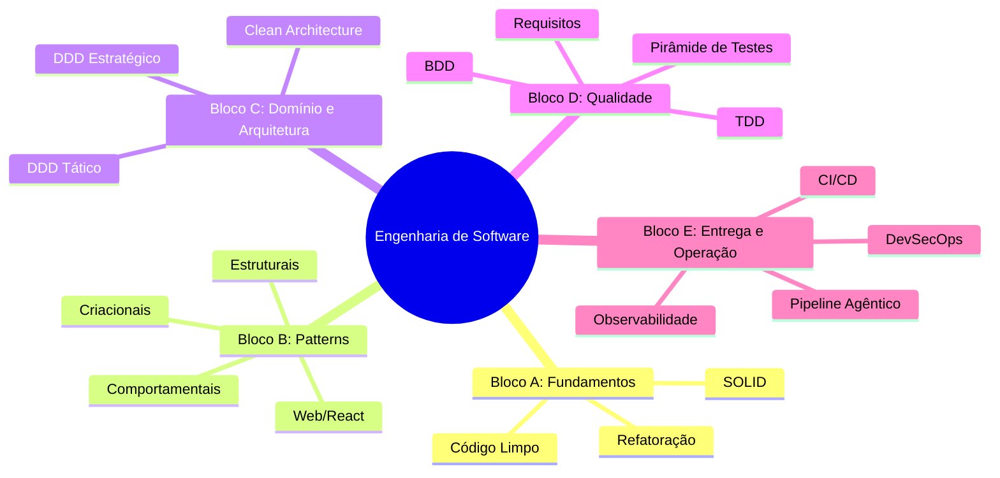
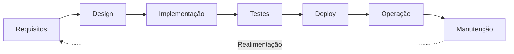
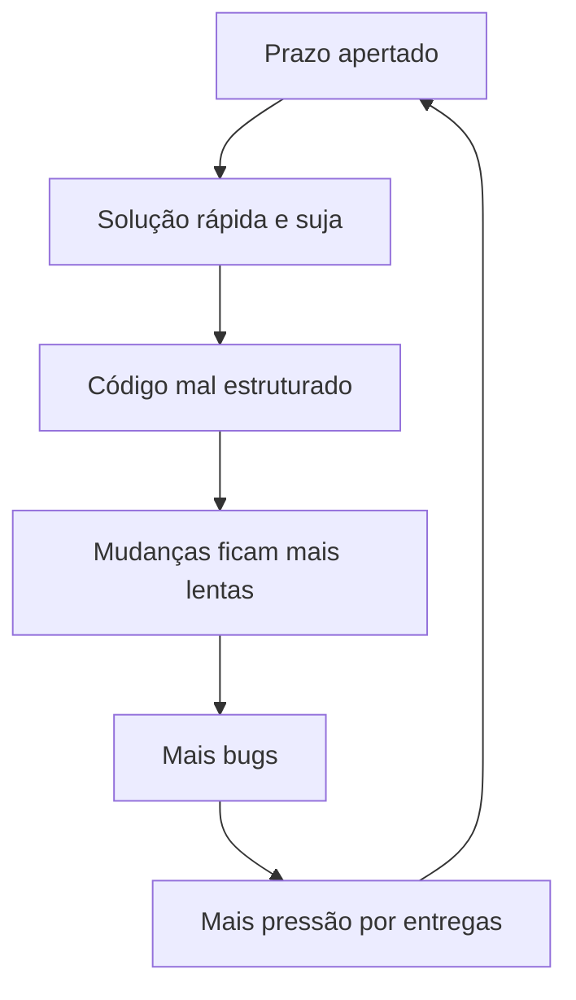

# Engenharia de Software — Aula 01

## Introdução à Engenharia de Software

**Duração estimada:** 75 minutos (40 de leitura + 35 de prática)

**Nível:** Intermediário

**Pré-requisitos:** Node.js/TypeScript, Express, git, PostgreSQL básico

---

## Objetivos de Aprendizagem

Ao final desta aula, você será capaz de:

- [ ] **Explicar** o que é engenharia de software e como ela difere da programação tradicional
- [ ] **Identificar** as fases do ciclo de vida do software e os artefatos produzidos em cada uma
- [ ] **Descrever** a relação entre o momento da descoberta de um bug e seu custo de correção
- [ ] **Definir** o conceito de dívida técnica e seus três tipos principais
- [ ] **Explicar** como a dívida técnica se acumula e impacta a velocidade de entrega do time
- [ ] **Reconhecer** o SWEBOK como referência da disciplina de engenharia de software
- [ ] **Identificar** os 5 blocos do módulo e o que será construído em cada um
- [ ] **Configurar** o repositório base do projeto progressivo com TypeScript, Express e ESLint
- [ ] **Criar** os endpoints iniciais da API de e-commerce (health check e criação de pedidos)
- [ ] **Descrever** a filosofia de aprendizado do módulo e o fluxo de 2 arquivos por aula

---

## Como Usar Esta Aula

Esta aula é a porta de entrada do módulo de Engenharia de Software. Ela constrói a base conceitual que você usará nas próximas 20 aulas: o que é engenharia de software, por que ela importa, quais são as fases do ciclo de vida, o que é dívida técnica e como evitá-la.

Na segunda metade, você conhecerá o projeto que construiremos juntos — uma API de E-commerce full-stack — e fará o setup inicial do repositório.

Ao longo do caminho, você encontrará seções **Quick Check** (para verificar se entendeu antes de avançar). Ao final, o arquivo separado **Questões de Aprendizagem** traz tarefas de checkpoint — só avance para a próxima aula quando conseguir completá-las por conta própria.

**Tempo estimado:** 40 minutos de leitura + 35 minutos de prática.

## Mapa Mental

Este diagrama mostra a estrutura completa do módulo e como esta aula se insere no contexto:




---

## 1. O que é Engenharia de Software

Engenharia de software não é sobre escrever código. É sobre **construir sistemas que evoluem sem colapsar**.

Se você já trabalhou em um projeto que começou rápido e, com o tempo, ficou cada vez mais lento para entregar novas funcionalidades — mesmo com a mesma equipe e a mesma tecnologia — você já sentiu na pele a falta de engenharia de software.

### Programador vs Engenheiro

Um **programador** escreve código que funciona. Um **engenheiro de software** projeta sistemas que podem ser modificados, testados, operados e mantidos por outras pessoas ao longo de anos.

| Programador | Engenheiro de Software |
|---|---|
| Faz funcionar hoje | Faz funcionar hoje **e** amanhã |
| Código para máquina | Código para pessoas lerem |
| Testa manualmente | Automatiza verificação |
| Entrega feature | Entrega qualidade |

A diferença não é técnica — é de **mentalidade**. O engenheiro pergunta: "alguém além de mim vai entender isso daqui a 6 meses?"

### SWEBOK como Referência

O **SWEBOK** (Software Engineering Body of Knowledge) é o guia da disciplina, mantido pelo IEEE Computer Society na versão 4. Ele organiza a área em 15 áreas de conhecimento, como requisitos, design, construção, testes, qualidade, gerência de configuração e processos de engenharia.

> *O SWEBOK não é um manual que você lê capa a capa — é um mapa do território. Cada aula deste módulo explora uma ou mais regiões desse mapa.*

### Dados da Indústria

- **85% do custo total** de um sistema está na fase de manutenção (Standish Group)
- Desenvolvedores passam **10x mais tempo lendo código** do que escrevendo
- Projetos que negligenciam engenharia de software **desaceleram com o tempo** — não porque a tecnologia envelheceu, mas porque o design não foi pensado para mudança

### Quick Check 1

**1. Qual a principal diferença entre um programador e um engenheiro de software?**
**Resposta:** O programador foca em fazer o código funcionar hoje; o engenheiro projeta o sistema para ser mantido, testado e evoluído por outros ao longo do tempo. A diferença está na mentalidade de longo prazo.

**2. O que significa a sigla SWEBOK e qual seu propósito?**
**Resposta:** Software Engineering Body of Knowledge — é o guia de referência da engenharia de software mantido pelo IEEE, que organiza a área em 15 áreas de conhecimento. Serve como mapa do território da disciplina.

---

## 2. O ciclo de vida do software

Software não nasce pronto. Ele passa por fases — e cada fase tem seu propósito, seus artefatos e seus riscos.

### As 7 fases



**Requisitos**: O que o sistema deve fazer? Entrevistas, histórias de usuário, critérios de aceitação. Artefato: documento de requisitos ou cards no backlog.

**Design**: Como o sistema será estruturado? Decisões de arquitetura, escolha de padrões, modelagem de dados. Artefato: diagramas, ADRs (Architecture Decision Records).

**Implementação**: O código propriamente dito. Aqui mora a tentação de pular as fases anteriores. Artefato: código-fonte.

**Testes**: Verificação de que o sistema faz o que deveria e não faz o que não deveria. Unitários, integração, sistema, aceitação. Artefato: suite de testes.

**Deploy**: Colocar o software em produção. Manual ou automatizado (CI/CD). Artefato: pipeline de deploy, release notes.

**Operação**: O sistema funcionando 24/7. Monitoramento, logs, métricas, resposta a incidentes. Artefato: dashboards, runbooks.

**Manutenção**: Correção de bugs, melhorias, adaptações. É a fase mais longa e mais cara — 85% do custo total.

### Custo da Correção

Uma das descobertas mais importantes da engenharia de software é a **curva exponencial do custo de correção**:

| Fase | Custo relativo |
|---|---|
| Design | 1x |
| Implementação | 10x |
| Testes | 30x |
| Produção | 100x |

> *Um bug descoberto no design é corrigido com uma canetada. O mesmo bug descoberto em produção exige reunião de guerra, rollback, hotfix, verificação e post-mortem.*

### O que você leva desta seção

Cada fase do ciclo de vida será explorada em detalhes nas aulas deste módulo. A Aula 14 foca em requisitos, a Aula 15 em BDD (especificação executável), a Aula 17 em testes, a Aula 18 em CI/CD, a Aula 20 em operação. Você não precisa decorar as fases agora — precisa internalizar que **pular fases não acelera o projeto; apenas transfere o custo para mais tarde**.

### Quick Check 2

**1. Liste as 7 fases do ciclo de vida do software.**
**Resposta:** Requisitos, Design, Implementação, Testes, Deploy, Operação, Manutenção.

**2. Por que corrigir um bug em produção custa 100x mais do que no design?**
**Resposta:** Porque no design a correção é conceitual (uma decisão revertida). Em produção, envolve rollback, hotfix urgente, verificação em múltiplos ambientes, possíveis violações de dados e post-mortem com stakeholders. Cada camada adicional (código já escrito, dados reais, usuários impactados) multiplica o esforço.

---

## 3. Dívida técnica

Dívida técnica é uma metáfora criada por Ward Cunningham para descrever o custo de **escolher uma solução mais rápida hoje em vez da solução correta**, sabendo que essa escolha precisará ser paga depois com juros.

### Como a dívida se acumula



### Os 3 tipos de dívida

**Dívida deliberada**: você sabe que está fazendo algo errado, mas decide fazer assim mesmo porque o prazo não permite a solução ideal. Exemplo: "vamos copiar e colar esse código agora e refatorar depois." O problema é que o "depois" raramente chega.

**Dívida acidental**: o design que era adequado no início do projeto deixa de ser à medida que o sistema cresce. Ninguém tomou uma decisão errada — o conhecimento evoluiu. Exemplo: uma classe `OrderService` que começou com 50 linhas e hoje tem 500 porque novas features foram adicionadas sem reestruturar.

**Bit Rot (apodrecimento digital)**: o ambiente ao redor do software muda — bibliotecas são atualizadas, versões do framework são descontinuadas, novas práticas surgem. O código que não acompanha essa evolução entra em desuso. É dívida técnica passiva.

### O ciclo vicioso

O cenário mais comum no mercado:

1. Time tem prazo para entregar uma feature
2. Pressão leva a atalhos na qualidade
3. Dívida técnica se acumula
4. A base de código fica mais difícil de modificar
5. Cada nova feature demora mais que a anterior
6. Mais pressão → mais atalhos → mais dívida

O nome disso é **juros compostos da dívida técnica**. Uma dívida pequena que não é paga vira uma bola de neve.

> *"Vamos fazer rápido e arrumar depois" é a frase mais cara da engenharia de software. O depois nunca chega porque sempre há uma nova prioridade.*

### Como pagar a dívida

O módulo inteiro é sobre isso: você aprenderá a escrever código que **minimiza a criação de dívida técnica** (Clean Code, SOLID, Design Patterns) e, quando ela inevitavelmente aparecer, a **pagar o principal com juros baixos** (Refactoring, TDD, testes de regressão).

### Quick Check 3

**1. O que é dívida técnica e por que ela é comparada a juros compostos?**
**Resposta:** Dívida técnica é o custo de escolher uma solução rápida em vez da correta, sabendo que o acerto virá depois. É comparada a juros compostos porque uma dívida pequena não paga cresce exponencialmente — cada nova feature demora mais que a anterior.

**2. Cite os 3 tipos de dívida técnica e dê um exemplo de cada.**
**Resposta:** (1) Deliberada — copiar código sabendo que deveria ser extraído. (2) Acidental — uma classe que cresceu organicamente com o projeto. (3) Bit rot — dependências que ficaram obsoletas sem atualização.

---

## 4. Apresentação do projeto

Ao longo deste módulo, você construirá uma **API de E-commerce completa** — do código procedural ao pipeline agêntico.

### Stack do projeto

| Camada | Tecnologia |
|---|---|
| Runtime | Node.js + TypeScript (strict mode) |
| API | Express |
| Banco | PostgreSQL |
| Frontend | React (a partir do Bloco B) |
| Testes | Jest + Playwright + Cucumber |
| Containerização | Docker + Docker Compose |
| CI/CD | GitHub Actions |
| Observabilidade | Pino, Prometheus, OpenTelemetry, Grafana |
| Qualidade | ESLint, SonarQube, dependency-cruiser |

### Ponto de partida vs Ponto de chegada

**Agora (ponto de partida):** um controller Express monolítico com 300 linhas, lógica de negócio misturada com código de transporte, sem testes, sem validação tipada. Funciona, mas não escala.

**Aula 21 (ponto de chegada):** Clean Architecture com 4 camadas, Use Cases injetados por DI, testes de arquitetura que garantem a regra da dependência, pipeline CI/CD com quality gates, observabilidade completa e agentes de IA colaborando no ciclo de desenvolvimento.

### Mão na Massa — Setup do Projeto

Vamos inicializar o repositório que você usará durante todo o módulo.

**Dificuldade:** Fácil | **Duração:** 20 minutos

**Passo 1: Crie a estrutura de pastas**

```bash
mkdir -p ecommerce-api/src/{controllers,routes,middlewares}
cd ecommerce-api
```

**Passo 2: Inicialize o projeto Node.js**

```bash
npm init -y
```

**Passo 3: Instale as dependências**

```bash
npm install express
npm install -D typescript @types/express @types/node
npm install -D eslint prettier @typescript-eslint/parser @typescript-eslint/eslint-plugin
```

**Passo 4: Configure o TypeScript**

```bash
npx tsc --init
```

Edite o `tsconfig.json` gerado: altere `strict` para `true` e configure `outDir` e `rootDir`:

```json
{
  "compilerOptions": {
    "target": "ES2020",
    "module": "commonjs",
    "lib": ["ES2020"],
    "outDir": "./dist",
    "rootDir": "./src",
    "strict": true,
    "esModuleInterop": true,
    "skipLibCheck": true,
    "forceConsistentCasingInFileNames": true,
    "resolveJsonModule": true,
    "declaration": true,
    "declarationMap": true,
    "sourceMap": true
  },
  "include": ["src/**/*"],
  "exclude": ["node_modules", "dist"]
}
```

**Passo 5: Configure o ESLint**

```bash
npx eslint --init
# Escolha: To check syntax and find problems
# JavaScript modules (import/export)
# TypeScript
# None (não usa framework)
# Node (não usa browser)
# Formato JSON
```

Após a configuração, crie um arquivo `.eslintrc.json` com:

```json
{
  "parser": "@typescript-eslint/parser",
  "plugins": ["@typescript-eslint"],
  "extends": [
    "eslint:recommended",
    "plugin:@typescript-eslint/recommended"
  ],
  "env": {
    "node": true,
    "es2020": true
  },
  "rules": {
    "@typescript-eslint/no-unused-vars": ["error", { "argsIgnorePattern": "^_" }],
    "@typescript-eslint/explicit-function-return-type": "warn"
  }
}
```

**Passo 6: Crie o arquivo principal da aplicação**

`src/index.ts`:

```typescript
import express from 'express';

const app = express();
const PORT = process.env.PORT || 3000;

app.use(express.json());

// Health check
app.get('/health', (_req, res) => {
  res.json({ status: 'ok', timestamp: new Date().toISOString() });
});

// POST /orders — endpoint de criação de pedido (versão inicial)
app.post('/orders', (req, res) => {
  const { customerId, items } = req.body;

  if (!customerId || !items || !items.length) {
    return res.status(400).json({ error: 'customerId e items são obrigatórios' });
  }

  const order = {
    id: Date.now().toString(),
    customerId,
    items,
    total: items.reduce((sum: number, item: { price: number; quantity: number }) =>
      sum + item.price * item.quantity, 0),
    status: 'pending',
    createdAt: new Date().toISOString(),
  };

  res.status(201).json(order);
});

app.listen(PORT, () => {
  console.log(`Server running on port ${PORT}`);
});
```

**Passo 7: Adicione scripts ao package.json**

```json
{
  "scripts": {
    "build": "tsc",
    "start": "node dist/index.js",
    "dev": "tsc --watch & node --watch dist/index.js",
    "lint": "eslint src/",
    "lint:fix": "eslint src/ --fix"
  }
}
```

**Passo 8: Teste que tudo funciona**

```bash
npx tsc           # Compila sem erros
npm start          # Inicia o servidor
```

Em outro terminal:

```bash
curl http://localhost:3000/health
# {"status":"ok","timestamp":"..."}

curl -X POST http://localhost:3000/orders \
  -H "Content-Type: application/json" \
  -d '{"customerId":"123","items":[{"productId":"p1","price":100,"quantity":2}]}'
# {"id":"...","customerId":"123","items":[...],"total":200,"status":"pending","createdAt":"..."}
```

**Verificação:** O servidor responde ao health check e aceita criação de pedidos via POST.

- [ ] `npm run build` compila sem erros
- [ ] `npm run lint` não reporta problemas
- [ ] GET /health retorna status ok
- [ ] POST /orders retorna 201 com pedido criado

### Quick Check 4

**1. Qual é o ponto de partida do projeto e qual será o ponto de chegada?**
**Resposta:** O ponto de partida é um controller Express monolítico e procedural. O ponto de chegada na Aula 21 é uma aplicação com Clean Architecture, testes completos, CI/CD, observabilidade e agentes de IA integrados.

**2. Quais tecnologias compõem a stack do projeto?**
**Resposta:** Node.js + TypeScript (strict), Express, PostgreSQL, React, Jest, Playwright, Docker, GitHub Actions, Pino, Prometheus, OpenTelemetry, Grafana, ESLint, SonarQube, dependency-cruiser.

---

## 5. Como usar este módulo

Você está prestes a embarcar em uma jornada de 21 aulas. Aqui está como navegar por ela.

### 5 blocos, 21 aulas

| Bloco | Aulas | O que você aprende |
|---|---|---|
| **A — Fundamentos** | 01-04 | Clean Code, Refactoring, SOLID |
| **B — Design Patterns** | 05-09 | GoF criacionais, estruturais, comportamentais, web/React |
| **C — Domínio & Arquitetura** | 10-13 | DDD estratégico, DDD tático, Clean Architecture |
| **D — Qualidade & Especificação** | 14-17 | Requisitos, BDD, TDD, pirâmide de testes |
| **E — Entrega, Operação & Agentes** | 18-21 | CI/CD, DevSecOps, observabilidade, pipeline agêntico |

### Dois arquivos por aula

Cada aula produz dois arquivos:

1. **Conteúdo principal** (`aula-NN-<slug>.md`): explicações, diagramas, Quick Checks, exercícios com gabarito, FAQ, glossário. Use **durante** o estudo.

2. **Questões de Aprendizagem** (`aula-NN-questoes-de-aprendizagem.md`): checkpoint de domínio. Tarefas para fazer **depois** do estudo, sem reler a aula, para provar que você entendeu. Só avance para a próxima aula quando completar todas.

### Filosofia: experiência antes da explicação

Sempre que possível, você primeiro **faz** (codifica, configura, testa) e depois **entende** o princípio por trás. Esta ordem não é acidental — ela ancora o conceito abstrato em uma experiência concreta. Você terá sentido a dor antes de receber o remédio.

### Projeto progressivo

Tudo o que você fizer se acumula. A cada aula, uma peça é adicionada ao projeto de E-commerce. Ao final, você terá um portfólio real de uma aplicação completa com engenharia de software de alto nível.

> *Não pule aulas. Cada uma se apoia na anterior. Se travar em um exercício, releia a seção indicada na questão. Se ainda assim não fluir, revise a aula anterior.*

### Quick Check 5

**1. Quais são os 5 blocos do módulo?**
**Resposta:** Fundamentos (Aulas 01-04), Design Patterns (05-09), Domínio & Arquitetura (10-13), Qualidade & Especificação (14-17), Entrega, Operação & Agentes (18-21).

**2. Qual a diferença entre o arquivo de conteúdo principal e o arquivo de questões de aprendizagem?**
**Resposta:** O conteúdo principal é usado durante o estudo (explicações, exercícios com gabarito). As questões são um checkpoint feito depois, sem reler a aula, para provar domínio — só avance quando completar todas.

---

## Autoavaliação: Quiz Rápido

**1. Qual a principal diferença entre um programador e um engenheiro de software?**
**Resposta:**

Programador foca em fazer o código funcionar. Engenheiro projeta sistemas para evoluir com segurança ao longo do tempo, considerando manutenção, testes e operação.

**2. Liste as 7 fases do ciclo de vida do software.**
**Resposta:**

Requisitos, Design, Implementação, Testes, Deploy, Operação, Manutenção.

**3. Em qual fase a correção de um bug é mais barata? E mais cara?**
**Resposta:**

Mais barata: Design (custo 1x). Mais cara: Produção (custo 100x ou mais).

**4. O que é dívida técnica e por que ela se compara a juros compostos?**
**Resposta:**

É o custo de escolher uma solução rápida em vez da correta. Compara-se a juros compostos porque o atraso no pagamento multiplica o custo — cada nova feature demora mais que a anterior.

**5. Cite dois tipos de dívida técnica com exemplos.**
**Resposta:**

(1) Deliberada: copiar e colar código por causa de prazo. (2) Acidental: classe que cresceu organicamente sem reestruturação.

**6. Quais são os 5 blocos do módulo de Engenharia de Software?**
**Resposta:**

Fundamentos, Design Patterns, Domínio & Arquitetura, Qualidade & Especificação, Entrega Operação & Agentes.

**7. Qual a finalidade do SWEBOK?**
**Resposta:**

É o guia de referência da engenharia de software (IEEE), que organiza a área em 15 áreas de conhecimento. Serve como mapa do território da disciplina.

---

## Mão na Massa: Exercícios Graduados

**Exercício 1 (Fácil) — Identificando dívida técnica no seu dia a dia**

Pense em um projeto em que você trabalhou (ou no projeto que acabou de configurar). Identifique 3 exemplos de dívida técnica, classifique cada um como deliberada, acidental ou bit rot e estime o impacto: "quanto tempo extra cada um custa por semana?"

**Gabarito:**

Exemplo de resposta (varia para cada aluno):
1. **Deliberada**: "Copiei a validação de email em 3 lugares diferentes porque o prazo era curto" — ~15 min/sempre que a validação precisar mudar.
2. **Acidental**: "O OrderController tem 200 linhas porque foi crescendo sem refatorar" — ~30 min/cada nova rota adicionada.
3. **Bit rot**: "O pacote `express` está na versão 4.17, mas a 4.18 tem correções de segurança" — risco de vulnerabilidade sem custo imediato.

**Exercício 2 (Médio) — Mapeando o ciclo de vida no E-commerce**

Para cada fase do ciclo de vida, identifique uma atividade concreta do projeto de E-commerce que se encaixa naquela fase. Use a tabela abaixo:

| Fase | Atividade no E-commerce | Artefato produzido |
|---|---|---|
| Requisitos | | |
| Design | | |
| Implementação | | |
| Testes | | |
| Deploy | | |
| Operação | | |
| Manutenção | | |

**Gabarito:**

| Fase | Atividade no E-commerce | Artefato produzido |
|---|---|---|
| Requisitos | Definir regras de cálculo de frete e desconto | User Stories no backlog |
| Design | Escolher entre Clean Architecture e Vertical Slices | Diagrama C4 + ADR |
| Implementação | Codificar o controller de pedidos e services | Código TypeScript |
| Testes | Verificar que POST /orders cria pedido com dados válidos | Suite de testes Jest |
| Deploy | Publicar nova versão no ambiente de staging | GitHub Action workflow |
| Operação | Monitorar latência do endpoint GET /products | Dashboard Grafana |
| Manutenção | Corrigir bug no cálculo de frete para CEPs do Norte | Hotfix + post-mortem |

**Desafio (Difícil) — Calculando o custo da dívida técnica**

Um time de 4 desenvolvedores mantém uma API de e-commerce. Eles estimam que 30% do tempo de cada desenvolvedor é perdido lidando com dívida técnica: código duplicado que precisa ser alterado em múltiplos lugares, testes quebrados por mudanças aparentemente não relacionadas, falta de documentação, etc.

- Salário médio por desenvolvedor: R$ 60/hora
- Horas trabalhadas por semana: 40h
- Quantas horas semanais o time perde com dívida técnica?
- Qual o custo mensal (4 semanas) dessa dívida?
- Se eles investirem 2 semanas de um desenvolvedor para refatorar e reduzir a perda para 10%, em quantos meses o investimento se paga?

**Gabarito:**

- Horas perdidas por semana: 4 devs × 40h × 30% = 48 horas/semana
- Custo mensal: 48h × R$ 60 × 4 semanas = R$ 11.520/mês
- Investimento: 2 semanas de 1 dev = 80h × R$ 60 = R$ 4.800
- Nova perda após refatoração: 4 devs × 40h × 10% = 16 horas/semana
- Economia semanal: 48h - 16h = 32 horas/semana = R$ 1.920/semana
- Payback: R$ 4.800 ÷ R$ 1.920 = 2,5 semanas

**Conclusão:** O investimento se paga em aproximadamente 2,5 semanas. Em um mês, o time economiza R$ 7.680. Em um ano, mais de R$ 90 mil.

---

## Resumo da Aula

### Os 5 Conceitos Fundamentais

1. **Engenharia de Software**: disciplina de construir sistemas que evoluem sem colapsar — não é só escrever código
2. **Ciclo de vida**: requisitos → design → implementação → testes → deploy → operação → manutenção. Pular fases transfere custo para o futuro
3. **Custo de correção exponencial**: 1x no design, 10x na implementação, 100x em produção
4. **Dívida técnica**: metáfora financeira para o custo de soluções rápidas. Tipos: deliberada, acidental, bit rot. Paga-se com juros compostos
5. **Projeto progressivo**: uma API de E-commerce evolui aula a aula — do código procedural ao pipeline agêntico

### O Que Você Construiu Hoje

- [x] Compreendeu o que é engenharia de software e por que ela importa
- [x] Conheceu as 7 fases do ciclo de vida do software
- [x] Entendeu o conceito de dívida técnica e seus tipos
- [x] Configurou o repositório base do projeto (TypeScript + Express + ESLint)
- [x] Criou os endpoints GET /health e POST /orders
- [x] Visualizou os 5 blocos do módulo e o roadmap completo

---

## Próxima Aula

**Aula 02: Clean Code — Nomes, Funções e Estrutura**

Você configurou o projeto e sentiu como é o código procedural "funciona mas não foi projetado". Na próxima aula, você vai refatorar o controller de 300 linhas em funções pequenas, nomeadas e com níveis de abstração consistentes. Vai aplicar DRY, KISS, YAGNI e SLAP — e sentir a diferença de ler código limpo.

---

## Referências

### Documentação Oficial

- [SWEBOK V4 — IEEE Computer Society](https://www.computer.org/education/bodies-of-knowledge/software-engineering)
- [TypeScript Documentation](https://www.typescriptlang.org/docs/)
- [Express.js Guide](https://expressjs.com/en/guide/routing.html)
- [ESLint User Guide](https://eslint.org/docs/user-guide/)

### Ferramentas

- [Node.js](https://nodejs.org/)
- [TypeScript](https://www.typescriptlang.org/)
- [Express](https://expressjs.com/)
- [Prettier](https://prettier.io/)
- [ESLint](https://eslint.org/)

### Artigos para Aprofundamento

- [The Cost of Software Maintenance (Standish Group)](https://www.standishgroup.com/)
- [Technical Debt — Martin Fowler](https://martinfowler.com/bliki/TechnicalDebt.html)
- [The Exponential Cost of Fixing Bugs](https://www.seguetech.com/the-exponential-cost-of-fixing-bugs/)
- [Ward Cunningham on Technical Debt (YouTube)](https://www.youtube.com/watch?v=pqeJFYwnkjE)

---

## FAQ

**P: Preciso saber tudo antes de começar o módulo?**
R: Não. Os pré-requisitos são Node.js/TypeScript básico, Express, git e PostgreSQL. Se você já construiu uma API REST simples, está pronto. Cada conceito novo é explicado do início.

**P: O que acontece se eu pular uma aula?**
R: O módulo é progressivo — cada aula se apoia na anterior. Pular uma aula pode deixar lacunas que dificultam as aulas seguintes. Se precisar pular, volte e faça as questões de aprendizagem da aula omitida antes de avançar.

**P: Posso usar outro banco de dados que não PostgreSQL?**
R: Pode, mas o módulo usa PostgreSQL em exemplos e configurações. Se optar por outro banco (MySQL, MongoDB), você precisará adaptar as queries e migrations por conta própria.

**P: Quanto tempo por semana devo dedicar ao módulo?**
R: Cada aula tem ~75 minutos de conteúdo. Com prática e exercícios, reserve 2-3 horas por aula. Em um ritmo de 2 aulas por semana, o módulo completo leva ~10 semanas.

**P: O projeto final é funcional?**
R: Sim. Ao final do módulo, você terá uma API de E-commerce completa, com frontend React, testes, pipeline CI/CD e observabilidade — um portfólio real e funcional.

**P: Preciso de conhecimentos avançados de React?**
R: Não. O frontend React entra no Bloco B (Aula 09). Os fundamentos de React (componentes, hooks) são pré-requisito, mas patterns avançados serão explicados na aula.

**P: O que fazer se travar em um exercício?**
R: Releia a seção indicada na questão. Se ainda travar, revise a aula anterior. O FAQ e o glossário também ajudam. O objetivo é entender, não decorar.

**P: Engenharia de software é só para projetos grandes?**
R: Não. Os princípios se aplicam em qualquer escala. Um script de 50 linhas também se beneficia de nomes claros e ausência de duplicação. A diferença é o nível de formalismo — projetos pequenos exigem menos cerimônia, mas os mesmos fundamentos.

**P: Existe certificado ao final do módulo?**
R: Consulte a instituição ofertante do curso. O valor real do módulo é o portfólio que você constrói — uma API completa com engenharia de software profissional.

**P: Como o SWEBOK se relaciona com este módulo?**
R: O SWEBOK mapeia a área de conhecimento. Cada aula explora uma ou mais regiões do SWEBOK na prática. Por exemplo: Aula 02 (Clean Code) → área de Construção de Software; Aula 14 (Requisitos) → área de Requisitos de Software; Aula 20 (Observabilidade) → área de Qualidade de Software + Operação.

---

## Glossário

| Termo | Definição |
|---|---|
| **SWEBOK** | *Software Engineering Body of Knowledge* — guia de referência da engenharia de software mantido pelo IEEE (Ver seção 1) |
| **Ciclo de vida do software** | Sequência de fases que um sistema percorre, da concepção ao descomissionamento (Ver seção 2) |
| **Dívida técnica** | Custo acumulado de escolher soluções rápidas em vez de soluções corretas (Ver seção 3) |
| **Dívida deliberada** | Decisão consciente de tomar um atalho sabendo que precisará ser pago depois (Ver seção 3) |
| **Dívida acidental** | Dívida que surge naturalmente à medida que o design evolui sem reestruturação (Ver seção 3) |
| **Bit rot** | Deterioração do software causada por mudanças no ambiente ao redor (Ver seção 3) |
| **Projeto progressivo** | Abordagem onde o aluno constrói um artefato incrementalmente, aula a aula (Ver seção 5) |
| **Clean Code** | Código legível, simples e sustentável — tema da Aula 02 |
| **SOLID** | 5 princípios de design orientado a objetos (SRP, OCP, LSP, ISP, DIP) — tema das Aulas 04-05 |
| **CI/CD** | *Continuous Integration / Continuous Deployment* — automação de integração e entrega — tema da Aula 18 |
