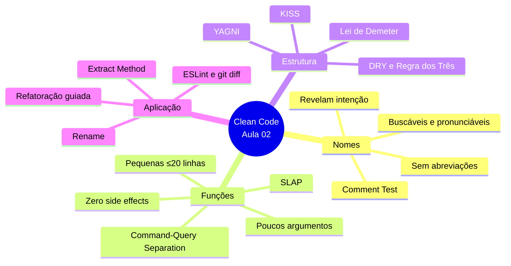

# Engenharia de Software — Aula 02

## Clean Code — Nomes, Funções e Estrutura

**Duração estimada:** 90 minutos (40 min leitura + 50 min prática)

**Nível:** Intermediário

**Pré-requisitos:** Aula 01 — Clean Code & Refactoring. Você já deve ter refatorado um controller Express com funções pequenas, nomes revelando intenção e ausência de duplicação.

---

## Objetivos de Aprendizagem

Ao final desta aula, você será capaz de:

- [ ] **Identificar** nomes que não revelam intenção em um código existente usando o "comment test"
- [ ] **Renomear** identificadores genéricos (`d`, `r`, `x`, `info`) seguindo boas práticas de nomenclatura
- [ ] **Aplicar** SLAP (Single Level of Abstraction Principle) para manter funções em um único nível de abstração
- [ ] **Extrair** métodos de validação, formatação e sanitização usando a técnica Extract Method
- [ ] **Eliminar** side effects em funções seguindo o princípio Command-Query Separation (CQS)
- [ ] **Aplicar** DRY eliminando duplicação de conhecimento (não apenas código idêntico)
- [ ] **Diferenciar** KISS de oversimplification em exemplos concretos
- [ ] **Aplicar** YAGNI removendo abstrações especulativas
- [ ] **Identificar** violações da Lei de Demeter em encadeamentos de método
- [ ] **Refatorar** um controller Express aplicando os princípios de naming, funções e estrutura

---

## Como Usar Esta Aula

Esta aula está organizada em duas partes. A **primeira parte** (seções 1 a 4) constrói os fundamentos conceituais de código limpo — nomes, funções e estrutura. A **segunda parte** (seção 5) aplica esses conceitos na prática com refatoração guiada, ESLint e git diff.

Ao longo do caminho, você encontrará seções **"Quick Check"** (para verificar se entendeu antes de avançar). Ao final, o arquivo separado **Questões de Aprendizagem** traz as tarefas de checkpoint — só avance para a próxima aula quando conseguir completá-las por conta própria.

## Mapa Mental

Este diagrama mostra todos os conceitos que você vai dominar nesta aula:



## Recapitulação da Aula 01

Na Aula 01, você refatorou um `OrderController` de 300 linhas aplicando os primeiros conceitos de clean code. Esta aula aprofunda cada princípio com um novo exemplo — o `CustomerController` — e introduz técnicas avançadas.

| Aula | Conceito | Onde aparece nesta aula | Como se conecta |
|---|---|---|---|
| Aula 01 | **Extract Method** (Seção 2) | Seções 3 e 5 | Aula 01 extraiu `validateOrderPayload`; Aula 02 extrai `validateCustomerPayload`, `sanitizeDocument`, `formatCustomerResponse` |
| Aula 01 | **Renomear variáveis** (Seção 2) | Seção 2 e 5 | Aula 01 renomeou `data` → `order`; Aula 02 renomeia `d` → `req`, `r` → `res`, `x` → `body`, `info` → `customer` |
| Aula 01 | **DRY/KISS/YAGNI** (Seção 3) | Seção 4 | Aula 01 apresentou os princípios; Aula 02 aprofunda conflitos entre eles (DRY vs YAGNI) e a Lei de Demeter |
| Aula 01 | **ESLint + git diff** (Seção 4) | Seção 5 | Aula 02 expande o ESLint com regras específicas de clean code e refatoração por etapas com git diff |

---

**FUNDAMENTOS: Os Princípios Universais do Código Limpo**

> *Os conceitos das próximas quatro seções são universais — valem para qualquer linguagem e qualquer editor, independentemente da ferramenta específica. Eles respondem a uma pergunta que todo desenvolvedor enfrenta: "como escrever código que outros humanos entendem?". Na segunda parte, você verá como aplicar esses conceitos na prática com ferramentas concretas.*

---

## 1. O Problema: Código que Ninguém Entende

Antes de falar de soluções, vamos sentir a dor. Leia o código abaixo. Respire fundo. Tente entender o que ele faz em 30 segundos.

```typescript
import { Request, Response } from 'express';
import { db } from '../database';

export function handle(d: Request, r: Response) {
  const x = d.body;
  if (!x.name || x.name.length < 2) {
    r.status(400).json({ error: 'Nome inválido' });
    return;
  }
  if (!x.email || !x.email.includes('@')) {
    r.status(400).json({ error: 'Email inválido' });
    return;
  }
  if (!x.document || x.document.length < 11) {
    r.status(400).json({ error: 'Documento inválido' });
    return;
  }
  const existing = db.query('SELECT id FROM customers WHERE email = ?', [x.email]);
  if (existing.length > 0) {
    r.status(409).json({ error: 'Email já cadastrado' });
    return;
  }
  const info = {
    name: x.name.trim(),
    email: x.email.toLowerCase().trim(),
    document: x.document.replace(/\D/g, ''),
    phone: x.phone || '',
    address: x.address || '',
    createdAt: new Date().toISOString(),
  };
  const result = db.query('INSERT INTO customers SET ?', [info]);
  const output = {
    id: result.insertId,
    name: info.name,
    email: info.email,
    document: info.document.replace(/(\d{3})(\d{3})(\d{3})(\d{2})/, '$1.$2.$3-$4'),
    createdAt: info.createdAt,
  };
  r.status(201).json(output);
}
```

Este código **funciona**. O servidor compila, a rota responde, o banco persiste. Mas ele falha em um aspecto crucial: **comunicação com humanos**.

### O que há de errado?

**1. Nomes que não revelam intenção.** O que é `d`? E `r`? E `x`? Você precisa ler o corpo inteiro da função para descobrir que `d` é o request, `r` é o response e `x` é o body. Cada nome genérico força o leitor a manter um mapeamento mental desnecessário.

**2. Múltiplos níveis de abstração misturados.** A função `handle` faz tudo ao mesmo tempo: valida campos (baixo nível), consulta o banco (médio nível), sanitiza dados (baixo nível), formata a resposta (alto nível). Saltar entre níveis de abstração quebra o fluxo de leitura.

**3. Duplicação de lógica.** As validações de `name`, `email` e `document` seguem o mesmo padrão — verifica se existe, verifica tamanho/formato, retorna erro. Mas cada uma é escrita do zero, sem reuso.

**4. Lógica de formatação inline.** A formatação do CPF (`(\d{3})(\d{3})(\d{3})(\d{2})`) está misturada com a construção da resposta. Se o formato do documento mudar, você precisa caçar essa regex no meio do handler.

**5. Side effect escondido.** A função altera o `document` (remove não-dígitos) e depois insere no banco. Mas também formata o documento na resposta de forma diferente. Há duas transformações diferentes do mesmo campo — uma para persistência, outra para exibição.

### O custo real

Pesquisas mostram que desenvolvedores passam **10x mais tempo lendo código do que escrevendo**. Cada segundo gasto decifrando nomes genéricos, rastreando side effects ou mapeando níveis de abstração é tempo que não está sendo usado para entender o que o sistema FAZ.

E o pior: esse custo é **multiplicativo**. Cinco desenvolvedores lendo o mesmo código = 5x o tempo perdido. Uma revisão de código que poderia levar 10 minutos leva 40 porque ninguém entende o handler sem percorrer cada linha.

### Quick Check

**1. Quais são os três problemas principais no handler `handle` acima?**
**Resposta:** Nomes genéricos que não revelam intenção (`d`, `r`, `x`, `info`), múltiplos níveis de abstração misturados na mesma função, e duplicação da lógica de validação.

**2. Por que a formatação do CPF inline é problemática?**
**Resposta:** Porque mistura responsabilidade de formatação com lógica de negócio. Se o formato mudar, você precisa editar dentro do handler. Além disso, não é testável isoladamente e não pode ser reutilizada em outros endpoints.

## 2. Nomenclatura — Nomes que Revelam Intenção

O nome é a documentação mais importante que existe. Um bom nome **elimina** a necessidade de ler a implementação para entender o propósito. Um nome ruim **força** o leitor a rastrear cada referência.

### A filosofia do bom nome

O nome certo responde a três perguntas:

1. **Por que existe?** (Qual problema resolve)
2. **O que faz?** (Qual seu propósito)
3. **Como é usado?** (Em que contexto)

Se você precisa de um comentário para explicar o que uma variável ou função faz, **o nome está errado**. Esse é o "comment test" — um dos critérios mais práticos de clean code.

### De ruim a bom: exemplos

**Variáveis:**

| Ruim | Bom | Motivo |
|---|---|---|
| `d` | `request` | O nome revela o tipo e o papel |
| `r` | `response` | Mesmo motivo — legibilidade imediata |
| `x` | `requestBody` | Semântica clara: é o payload da requisição |
| `info` | `customer` | `info` não diz nada; `customer` diz exatamente o que é |
| `tmp` | `sanitizedDocument` | `tmp` é um anti-padrão clássico — nunca use |
| `data` | `customerList` ou `customers` | `data` pode ser qualquer coisa |
| `flag` | `isActive` | Booleans devem começar com `is`, `has`, `should` |
| `val` | `orderTotal` | `val` obriga o leitor a buscar a atribuição anterior |

**Funções:**

| Ruim | Bom | Motivo |
|---|---|---|
| `handle` | `createCustomer` | `handle` é genérico; `createCustomer` revela ação + entidade |
| `process` | `validateOrderPayload` | `process` é vago; o nome diz o que é validado |
| `doSomething` | `calculateShippingCost` | Nome deve descrever o resultado, não o mecanismo |
| `check` | `isDocumentValid` | `check` não diz o que verifica nem o retorno |
| `get` | `findCustomerByEmail` | `get` é genérico demais |

### Regras práticas

**1. Seja buscável.** Nomes de uma letra (`d`, `r`, `x`) são impossíveis de buscar globalmente. Um `grep` por `d` encontra matches em todo o projeto.

**2. Seja pronunciável.** `genUsrTkn` é impossível de falar numa conversa. `generateUserToken` é pronunciável, buscável e memorável. A pronúncia importa porque programadores **conversam sobre código** — em pairs, reviews, meetings.

**3. Evite abreviações.** `doc` pode ser document ou doctor. `cust` pode ser customer ou custom. Abreviações são ambíguas e forçam o leitor a expandir mentalmente. A exceção são abreviações universais da linguagem (`id`, `json`, `html`).

**4. Sem encoding de tipo (Hungarian notation).** Em TypeScript, o tipo já é declarado. `strName` ou `arrCustomers` é ruído visual. O tipo está no sistema de tipos, não no nome.

**5. Booleanos: use predicados.** `isActive`, `hasPermission`, `shouldNotify`, `canDelete`. Isso torna a leitura natural: `if (isActive)` flui como uma frase.

### Antes e depois no CustomerController

Vamos aplicar essas regras ao nosso handler:

| Antes | Depois | Princípio aplicado |
|---|---|---|
| `d` | `request` | Buscável e pronunciável |
| `r` | `response` | Buscável e pronunciável |
| `x` | `requestBody` | Revela intenção |
| `info` | `customer` | Revela o que contém |
| `handle` | `createCustomer` | Verbo + entidade |

### Quick Check

**1. Qual o problema de nomear uma variável booleana como `flag`?**
**Resposta:** `flag` não comunica o que está sendo verificado. Um booleano deve usar predicados como `isActive`, `hasPermission` ou `canDelete` para que a leitura seja natural: `if (isActive)` em vez de `if (flag)`.

**2. Por que `doc` é uma abreviação problemática?**
**Resposta:** `doc` pode significar `document` (documento) ou `doctor` (doutor). Em português, `doc` pode ser confundido com "doce". Abreviações ambíguas forçam o leitor a adivinhar o significado pelo contexto — e contexto muda conforme o código evolui.

## 3. Funções — Pequenas, Focadas e Previsíveis

Funções são a **unidade de comportamento** do seu código. Cada função deve fazer uma coisa, fazer bem e fazer só ela.

### A regra do tamanho: ≤ 20 linhas

Nenhuma regra é absoluta, mas um bom heurístico é: **se uma função não cabe na sua tela sem scroll, ela é grande demais**. Funções de 80 linhas como o `handle` original misturam validação, regras de negócio, persistência e formatação — quatro responsabilidades diferentes.

**Por que tamanho importa?**

- Funções pequenas são mais fáceis de **nomear** (fica claro o que fazem)
- Funções pequenas são mais fáceis de **testar** (menos caminhos)
- Funções pequenas são mais fáceis de **compor** (reutilizar em outros contextos)
- Funções pequenas têm menos **acoplamento** (menos dependências)

### SLAP — Single Level of Abstraction Principle

O princípio SLAP diz: **uma função deve operar em um único nível de abstração**. Misturar níveis quebra o fluxo de leitura.

```typescript
// RUIM — três níveis de abstração misturados
function handleOrder(orderData: OrderData) {
  // Nível 1: verificação de negócio (alta abstração)
  if (!orderData.items || orderData.items.length === 0) {
    throw new Error('Pedido sem itens');
  }
  // Nível 2: persistência (média abstração)
  const saved = database.save(orderData);
  // Nível 3: formatação de string (baixa abstração)
  const formatted = '$ ' + saved.total.toFixed(2).replace('.', ',');
  return formatted;
}

// BOM — cada nível em sua função
function handleOrder(orderData: OrderData): string {
  validateOrderHasItems(orderData);
  const saved = persistOrder(orderData);
  return formatCurrency(saved.total);
}

function validateOrderHasItems(orderData: OrderData): void {
  if (!orderData.items || orderData.items.length === 0) {
    throw new Error('Pedido sem itens');
  }
}

function formatCurrency(value: number): string {
  return '$ ' + value.toFixed(2).replace('.', ',');
}
```

### Zero side effects — o princípio da previsibilidade

Uma função **previsível** é uma função que você pode chamar sem medo. Ela recebe entrada, produz saída e não altera o estado do sistema além do esperado.

**Função pura:** mesma entrada → mesma saída. Nenhum efeito colateral.

```typescript
function calculateDiscount(price: number, percentage: number): number {
  return price * (1 - percentage / 100);
}
```

**Função impura (controlada):** tem side effects, mas são explícitos e documentados.

```typescript
async function saveCustomer(customer: Customer): Promise<void> {
  // Side effect esperado: persistência
  await database.customers.insert(customer);
}
```

**Função impura (perigosa):** side effects ocultos que surpreendem o chamador.

```typescript
function formatAndSave(customer: Customer): string {
  customer.name = customer.name.trim(); // MODIFICA O PARÂMETRO — side effect!
  const formatted = `${customer.name} (${customer.email})`;
  database.save(customer); // Side effect escondido em função de formatação
  return formatted;
}
```

No `handle` original, a sanitização do documento (`x.document.replace(/\D/g, '')`) acontece dentro da construção do objeto `info`. Isso é um side effect disfarçado de formatação.

### Poucos argumentos

O número ideal de argumentos é **zero**. Um ou dois é aceitável. Três é borderline. Quatro ou mais exige refatoração.

| Argumentos | Legibilidade | Quando usar |
|---|---|---|
| 0 | Excelente | Funções que acessam estado interno ou constantes |
| 1-2 | Boa | A maioria dos casos: `validate(req, rules)`, `findById(id)` |
| 3 | Okay | Considere agrupar em objeto: `calculate(shipping, tax, discount)` → `calculate(params)` |
| 4+ | Ruim | Refatore: agrupe parâmetros relacionados em um objeto ou DTO |

**Por que poucos argumentos?** Cada argumento aumenta a complexidade cognitiva. Testar uma função com 6 argumentos significa testar combinações de valores para cada um — o número de casos de teste explode.

### Command-Query Separation (CQS)

O princípio CQS diz: **uma função deve ser um comando ou uma consulta, mas não ambos**.

- **Consulta** (Query): retorna um valor, não modifica estado. Ex: `findCustomerByEmail(email)`
- **Comando** (Command): modifica estado, não retorna valor. Ex: `saveCustomer(customer)`

```typescript
// VIOLA CQS — modifica e retorna
function saveAndReturn(customer: Customer): Customer {
  database.save(customer);
  return customer;
}

// CORRETO — separado
function saveCustomer(customer: Customer): void {
  database.save(customer);
}

function findCustomer(id: number): Customer | null {
  return database.findById(id);
}
```

### Extract Method no CustomerController

Aplicando tudo isso ao nosso controller, o handler de 50 linhas se decompõe em funções de 3 a 8 linhas cada:

```typescript
// Extraídas do handler original
function validateCustomerPayload(body: any): string[] {
  const errors: string[] = [];
  if (!body.name || body.name.length < 2) errors.push('Nome inválido');
  if (!body.email || !body.email.includes('@')) errors.push('Email inválido');
  if (!body.document || !isDocumentValid(body.document)) errors.push('Documento inválido');
  return errors;
}

function sanitizeDocument(raw: string): string {
  return raw.replace(/\D/g, '');
}

function formatDocument(doc: string): string {
  return doc.replace(/(\d{3})(\d{3})(\d{3})(\d{2})/, '$1.$2.$3-$4');
}

function isDocumentValid(doc: string): boolean {
  const digits = doc.replace(/\D/g, '');
  return digits.length >= 11;
}

async function isEmailDuplicated(email: string): Promise<boolean> {
  const existing = await db.query('SELECT id FROM customers WHERE email = ?', [email]);
  return existing.length > 0;
}
```

Cada função tem ≤ 8 linhas, um nível de abstração, sem side effects invisíveis, e um nome que revela exatamente o que faz.

### Quick Check

**1. O que é SLAP e por que ele melhora a legibilidade?**
**Resposta:** SLAP (Single Level of Abstraction Principle) diz que uma função deve operar em um único nível de abstração. Isso melhora a legibilidade porque o leitor não precisa alternar entre pensamento de alto nível (regras de negócio) e baixo nível (formatação de string, queries) na mesma função.

**2. Por que uma função com 5 argumentos é problemática?**
**Resposta:** Cada argumento adiciona complexidade cognitiva. Testar todas as combinações de 5 argumentos explode o número de casos de teste. Além disso, a ordem dos argumentos é fácil de confundir. A solução é agrupar parâmetros relacionados em um objeto.

## 4. Estrutura — DRY, KISS, YAGNI e Lei de Demeter

Ter nomes bons e funções pequenas é necessário, mas não suficiente. O código também precisa de **estrutura** — princípios que organizam como as partes se relacionam.

### DRY — Don't Repeat Yourself

DRY não é sobre evitar código idêntico. É sobre **evitar duplicação de conhecimento**. Cada pedaço de conhecimento deve ter uma representação única, não ambígua e com autoridade dentro do sistema.

**Duplicação de código (menos grave):**

```typescript
// DUPLICADO — mesmo padrão escrito duas vezes
function validateName(name: string): boolean {
  return name.length >= 2;
}
function validateEmail(email: string): boolean {
  return email.includes('@');
}
// Estes são padrões diferentes com implementações diferentes — não violam DRY
```

**Duplicação de conhecimento (grave):**

```typescript
// DUPLICAÇÃO DE CONHECIMENTO — a regra "documento precisa de 11 dígitos"
// está em DOIS lugares
function validateCustomer(body: any): string[] {
  // Aqui: validação
  if (body.document.replace(/\D/g, '').length < 11) {
    return ['Documento inválido'];
  }
  return [];
}

function sanitizeAndSave(body: any): void {
  // E aqui: sanitização assume a mesma regra
  const clean = body.document.replace(/\D/g, '');
  if (clean.length >= 11) {
    database.save({ document: clean });
  }
}
```

Se a regra de negócio mudar para "documento precisa de 14 dígitos", você precisa lembrar de atualizar **dois lugares**. Se esquecer um, o sistema fica inconsistente.

**A Regra dos Três:** se você escreve o mesmo código pela terceira vez, é hora de extrair. Na primeira vez, você faz funcionar. Na segunda, você tolera. Na terceira, você refatora.

### KISS — Keep It Simple, Stupid

KISS é sobre **escolher a solução mais simples que resolve o problema**. Não a mais elegante, não a mais extensível, não a mais performática — a mais simples.

```typescript
// VIOLA KISS — complexidade desnecessária
function getCustomerName(customer: Customer): string {
  return customer?.name ?? (() => { throw new Error('Sem nome') })();
}

// KISS — direto ao ponto
function getCustomerName(customer: Customer): string {
  if (!customer.name) throw new Error('Sem nome');
  return customer.name;
}
```

**Cuidado com o oversimplification:** simplificar não significa ignorar edge cases. KISS não é desculpa para não validar entrada ou não tratar erros. É sobre não adicionar complexidade que **não é necessária agora**.

### YAGNI — You Ain't Gonna Need It

YAGNI é o princípio mais difícil de seguir porque **fere o ego do desenvolvedor**. Dizer "não vamos precisar disso" é admitir que não sabemos o futuro.

```typescript
// VIOLA YAGNI — abstração especulativa
interface CustomerRepository {
  findById(id: number): Promise<Customer | null>;
  findByEmail(email: string): Promise<Customer | null>;
  findByDocument(doc: string): Promise<Customer | null>;
  findByName(name: string): Promise<Customer[]>;
  findAllPaginated(page: number, size: number): Promise<PageResult<Customer>>;
  findRecentlyActive(days: number): Promise<Customer[]>;
}

// YAGNI — só o que precisamos AGORA
interface CustomerRepository {
  findByEmail(email: string): Promise<Customer | null>;
  save(customer: Customer): Promise<void>;
}
```

**O custo da generalização precoce:** cada método extra é código para escrever, testar, documentar e manter. Se o método `findByName` nunca for usado, ele é dívida técnica — código que ninguém usa mas todo mundo precisa manter.

### Lei de Demeter — "Fale só com seus amigos imediatos"

A Lei de Demeter diz que um método deve acessar apenas:

1. O próprio objeto (métodos de `this`)
2. Os objetos recebidos como parâmetros
3. Os objetos que ele cria
4. Os objetos armazenados em seus atributos diretos

**Violação de Demeter (train wreck):**

```typescript
// RUIM — encadeamento profundo
const city = order.customer.address.city.toUpperCase();

// A função que escreveu isso sabe:
// 1. Que order tem customer
// 2. Que customer tem address
// 3. Que address tem city
// 4. Que city tem toUpperCase

// Se qualquer um desses relacionamentos mudar, essa linha quebra.
```

**Corrigindo:**

```typescript
// BOM — cada objeto fala só com seu amigo imediato
const city = order.getCustomerCity();   // order sabe o próprio customer
// ou, mais idiomático:
const city = order.customer.getCity();   // customer sabe o próprio address
```

A Lei de Demeter não proíbe encadeamentos — proíbe **conhecimento profundo** da estrutura interna de objetos que não são seus.

### Quando os princípios conflitam

Os princípios nem sempre concordam. Exemplos clássicos:

| Conflito | DRY quer | YAGNI quer | Decisão prática |
|---|---|---|---|
| Extrair função usada em 1 lugar | Extrair (DRY) | Manter inline (YAGNI) | Espere o terceiro uso (Regra dos Três) |
| Criar interface genérica | Generalizar (DRY) | Implementação direta (YAGNI) | Crie a interface quando precisar do segundo implementador |
| Adicionar parâmetro opcional | Parâmetro com default (DRY) | Função separada (KISS) | Prefira funções separadas — parâmetros opcionais escondem complexidade |

O melhor critério é: **o código atual está sofrendo com a falta dessa abstração?** Se sim, aplique DRY. Se não, YAGNI vence.

### Quick Check

**1. Qual a diferença entre duplicação de código e duplicação de conhecimento?**
**Resposta:** Duplicação de código é ter o mesmo texto em dois lugares (ex: duas validações iguais). Duplicação de conhecimento é ter a mesma regra de negócio representada em lugares diferentes (ex: a regra "CPF tem 11 dígitos" aparece na validação e na sanitização). A segunda é mais grave porque muda a semântica do sistema se esquecer de atualizar um lugar.

**2. Dê um exemplo de violação da Lei de Demeter em código Express.**
**Resposta:** `request.user.profile.address.city` acessa 4 objetos encadeados. Se `profile` mudar de nome ou `address` for removido, a expressão quebra. A correção é expor métodos nos objetos intermediários: `request.getUserCity()` ou `request.user.getProfileCity()`.

---

**APLICAÇÃO: Refatorando o Controller com Ferramentas**

> *Agora que você entende os fundamentos de nomes, funções e estrutura, vamos conectá-los à prática com ESLint, git diff e npm. Você vai refatorar o CustomerController inteiro em 4 passos, validando cada etapa.*

---

## 5. Mão na Massa: Refatoração Guiada + ESLint + git diff

Esta seção é **mão na massa**. Você vai transformar o código problemático da Seção 1 em código limpo, passo a passo.

### Passo 1: Configurar ESLint com regras de clean code

Crie ou atualize o arquivo `.eslintrc.json` na raiz do projeto:

```json
{
  "extends": ["eslint:recommended", "plugin:@typescript-eslint/recommended"],
  "plugins": ["@typescript-eslint"],
  "rules": {
    "max-lines-per-function": ["warn", { "max": 20, "skipBlankLines": true }],
    "max-params": ["warn", { "max": 3 }],
    "complexity": ["warn", { "max": 5 }],
    "max-depth": ["warn", { "max": 3 }],
    "@typescript-eslint/no-explicit-any": "warn",
    "no-var": "error",
    "prefer-const": "error"
  }
}
```

**Regras explicadas:**

- `max-lines-per-function: 20` — cada função deve ter no máximo 20 linhas
- `max-params: 3` — no máximo 3 parâmetros por função
- `complexity: 5` — complexidade ciclomática máxima de 5 (if/else/for/case)
- `max-depth: 3` — no máximo 3 níveis de aninhamento

Instale as dependências:

```bash
npm install -D eslint @typescript-eslint/parser @typescript-eslint/eslint-plugin
```

Rode o ESLint no controller:

```bash
npx eslint src/controllers/customer.controller.ts
```

Você verá dezenas de warnings — cada um é um ponto a melhorar.

### Passo 2: Extrair métodos de validação

Identifique blocos coesos no handler original e extraia:

```typescript
// O bloco de validação vira uma função
function validateCustomerPayload(body: any): string[] {
  const errors: string[] = [];
  if (!body.name || body.name.length < 2) errors.push('Nome inválido');
  if (!body.email || !body.email.includes('@')) errors.push('Email inválido');
  if (!body.document || !isDocumentValid(body.document)) errors.push('Documento inválido');
  return errors;
}

function isDocumentValid(document: string): boolean {
  return document.replace(/\D/g, '').length >= 11;
}
```

### Passo 3: Extrair sanitização e formatação

```typescript
function sanitizeDocument(rawDocument: string): string {
  return rawDocument.replace(/\D/g, '');
}

function formatCustomerResponse(customer: Customer): object {
  return {
    id: customer.id,
    name: customer.name,
    email: customer.email,
    document: customer.document.replace(/(\d{3})(\d{3})(\d{3})(\d{2})/, '$1.$2.$3-$4'),
    createdAt: customer.createdAt,
  };
}

async function isEmailDuplicated(email: string): Promise<boolean> {
  const existing = await db.query('SELECT id FROM customers WHERE email = ?', [email]);
  return existing.length > 0;
}
```

### Passo 4: git diff — validar cada etapa

Após cada extração, compare as mudanças:

```bash
git diff src/controllers/customer.controller.ts
```

Você deve ver APENAS a extração que acabou de fazer — sem mudanças acidentais em outras partes do código. Commit após cada extração:

```bash
git add src/controllers/customer.controller.ts
git commit -m "refactor: extrai validateCustomerPayload"
```

### O resultado final — AFTER

```typescript
import { Request, Response } from 'express';
import { db } from '../database';

function isDocumentValid(document: string): boolean {
  return document.replace(/\D/g, '').length >= 11;
}

function validateCustomerPayload(body: any): string[] {
  const errors: string[] = [];
  if (!body.name || body.name.length < 2) errors.push('Nome inválido');
  if (!body.email || !body.email.includes('@')) errors.push('Email inválido');
  if (!body.document || !isDocumentValid(body.document)) errors.push('Documento inválido');
  return errors;
}

function sanitizeDocument(rawDocument: string): string {
  return rawDocument.replace(/\D/g, '');
}

async function isEmailDuplicated(email: string): Promise<boolean> {
  const existing = await db.query('SELECT id FROM customers WHERE email = ?', [email]);
  return existing.length > 0;
}

function buildNewCustomer(body: any, sanitizedDocument: string): object {
  return {
    name: body.name.trim(),
    email: body.email.toLowerCase().trim(),
    document: sanitizedDocument,
    phone: body.phone || '',
    address: body.address || '',
    createdAt: new Date().toISOString(),
  };
}

function formatCustomerResponse(customer: any): object {
  return {
    id: customer.id,
    name: customer.name,
    email: customer.email,
    document: customer.document.replace(
      /(\d{3})(\d{3})(\d{3})(\d{2})/,
      '$1.$2.$3-$4'
    ),
    createdAt: customer.createdAt,
  };
}

export async function createCustomer(request: Request, response: Response): Promise<void> {
  const body = request.body;

  const errors = validateCustomerPayload(body);
  if (errors.length > 0) {
    response.status(400).json({ errors });
    return;
  }

  const emailDuplicated = await isEmailDuplicated(body.email);
  if (emailDuplicated) {
    response.status(409).json({ error: 'Email já cadastrado' });
    return;
  }

  const sanitizedDocument = sanitizeDocument(body.document);
  const newCustomer = buildNewCustomer(body, sanitizedDocument);

  const saved = await db.query('INSERT INTO customers SET ?', [newCustomer]);
  const result = formatCustomerResponse({ ...newCustomer, id: saved.insertId });

  response.status(201).json(result);
}
```

### Comparação Antes vs Depois

| Aspecto | Antes | Depois |
|---|---|---|
| Tamanho do handler | 50+ linhas | 18 linhas |
| Número de funções | 1 | 7 funções (cada uma ≤ 8 linhas) |
| Nomes genéricos | `d`, `r`, `x`, `info` | `request`, `response`, `body`, `sanitizedDocument` |
| Níveis de abstração | 3 misturados | 1 por função (SLAP) |
| Validação | Inline e duplicada | Extraída em `validateCustomerPayload` |
| Formatação | Inline | Extraída em `formatCustomerResponse` |
| Side effects | Sanitização no meio do objeto | `sanitizeDocument` explícita |
| Testabilidade | Difícil (tudo no handler) | Fácil (cada função testável isoladamente) |

### Quick Check

**1. Qual o propósito da regra `max-lines-per-function: 20` no ESLint?**
**Resposta:** Ela alerta quando uma função ultrapassa 20 linhas, forçando o desenvolvedor a extrair métodos. É um guardrail automatizado que impede a criação de funções monstro como o handler original.

**2. Por que fazer commit após CADA extração, em vez de um commit com todas as mudanças?**
**Resposta:** Commits atômicos permitem reverter uma extração específica sem perder as outras. Além disso, facilitam code review — cada commit é uma transformação clara e verificável.

## 6. Autoavaliação: Quiz Rápido

**1. Qual princípio de clean code diz que uma função deve operar em um único nível de abstração?**
**Resposta:**

SLAP (Single Level of Abstraction Principle).

**2. O que é o "comment test" para nomes de variáveis?**
**Resposta:**

Se você precisa de um comentário para explicar o que a variável ou função faz, o nome está errado. O bom nome elimina a necessidade do comentário.

**3. Quantos argumentos uma função deve idealmente ter?**
**Resposta:**

Zero. Um ou dois é aceitável. Três é borderline. Quatro ou mais exige refatoração — agrupe em um objeto.

**4. Qual a diferença entre duplicação de código e duplicação de conhecimento?**
**Resposta:**

Duplicação de código é ter o mesmo texto (ex: dois `if` idênticos). Duplicação de conhecimento é ter a mesma regra de negócio representada em lugares diferentes (ex: a regra de CPF de 11 dígitos na validação E na sanitização).

**5. O que diz a Lei de Demeter?**
**Resposta:**

Um método deve falar apenas com seus amigos imediatos: o próprio objeto, parâmetros recebidos, objetos que cria e atributos diretos. Proíbe conhecimento profundo da estrutura interna de objetos que não são seus.

**6. Quando YAGNI vence DRY?**
**Resposta:**

Quando a abstração sugerida pelo DRY é especulativa — você está criando código para um cenário que ainda não existe. A Regra dos Três é um bom termômetro: só extraia na terceira repetição.

**7. Por que `sanitizeDocument` é melhor que fazer `body.document.replace(/\D/g, '')` inline?**
**Resposta:**

Porque (1) o nome revela a intenção, (2) pode ser testada isoladamente, (3) pode ser reutilizada em outros endpoints, e (4) não polui o handler com detalhes de baixo nível.

## 7. Exercícios Graduados

**Exercício 1 (Fácil) — Renomear para Revelar Intenção**

Dado o trecho de código abaixo, renomeie todas as variáveis para seguir as boas práticas de nomenclatura. Explique o motivo de cada renomeação.

```typescript
function proc(arr: any[]) {
  const t = arr.filter((x) => x.act);
  const n = t.length;
  return n > 0 ? t[0] : null;
}
```

**Gabarito:**

```typescript
function findFirstActive(items: any[]): any | null {
  const activeItems = items.filter((item) => item.active);
  return activeItems.length > 0 ? activeItems[0] : null;
}
```

- `proc` → `findFirstActive`: revela o que a função faz: procurar o primeiro item ativo
- `arr` → `items`: plural indica que é uma coleção
- `t` → `activeItems`: revela o conteúdo (itens filtrados que estão ativos)
- `x` → `item`: cada elemento da lista é um item
- `n` → (eliminado): a variável temporária não é necessária

**Exercício 2 (Médio) — Aplicar SLAP e Extrair Métodos**

O código abaixo mistura três níveis de abstração na mesma função. Aplique SLAP extraindo métodos coesos. Cada função extraída deve ter no máximo 10 linhas.

```typescript
function processOrder(order: any): string {
  let total = 0;
  for (const item of order.items) {
    total += item.price * item.quantity;
  }
  if (total > 1000) {
    total = total * 0.9;
  }
  const formatted = 'R$ ' + total.toFixed(2).replace('.', ',');
  saveToDatabase(order);
  return formatted;
}
```

**Gabarito:**

```typescript
function processOrder(order: any): string {
  const total = calculateTotal(order.items);
  const discounted = applyDiscount(total);
  const formatted = formatCurrency(discounted);
  return formatted;
}

function calculateTotal(items: any[]): number {
  return items.reduce((sum, item) => sum + item.price * item.quantity, 0);
}

function applyDiscount(total: number): number {
  return total > 1000 ? total * 0.9 : total;
}

function formatCurrency(value: number): string {
  return 'R$ ' + value.toFixed(2).replace('.', ',');
}
```

Extraindo `calculateTotal`, `applyDiscount` e `formatCurrency`, cada função tem um nível de abstração e uma responsabilidade. A função `processOrder` agora é uma orquestração de alto nível.

**Exercício 3 (Difícil) — Refatoração Completa com Nomes + Funções + Estrutura**

Refatore o código abaixo aplicando TODOS os princípios da aula: nomes reveladores, SLAP, funções pequenas, DRY e eliminação de side effects.

```typescript
import { db } from '../database';

export function up(id: number, d: any, r: any) {
  const x = db.query('SELECT * FROM products WHERE id = ?', [id]);
  if (x.length === 0) { r.status(404).json({ error: 'Not found' }); return; }
  const p = x[0];
  if (d.name) p.name = d.name.trim();
  if (d.price) p.price = d.price;
  if (d.stock) p.stock = d.stock;
  if (!p.price || p.price <= 0) { r.status(400).json({ error: 'Preço inválido' }); return; }
  if (p.stock < 0) { r.status(400).json({ error: 'Estoque inválido' }); return; }
  db.query('UPDATE products SET name = ?, price = ?, stock = ? WHERE id = ?', [p.name, p.price, p.stock, id]);
  r.status(200).json({ id, ...p });
}
```

**Gabarito:**

```typescript
import { db } from '../database';

function findProductById(id: number): any | null {
  const rows = db.query('SELECT * FROM products WHERE id = ?', [id]);
  return rows.length > 0 ? rows[0] : null;
}

function validateProductData(price: number, stock: number): string[] {
  const errors: string[] = [];
  if (!price || price <= 0) errors.push('Preço inválido');
  if (stock < 0) errors.push('Estoque inválido');
  return errors;
}

function mergeProductData(existing: any, updates: any): any {
  return {
    name: updates.name?.trim() ?? existing.name,
    price: updates.price ?? existing.price,
    stock: updates.stock ?? existing.stock,
  };
}

function formatProductResponse(product: any): object {
  return { id: product.id, name: product.name, price: product.price, stock: product.stock };
}

export function updateProduct(id: number, requestBody: any, response: any): void {
  const existing = findProductById(id);
  if (!existing) {
    response.status(404).json({ error: 'Produto não encontrado' });
    return;
  }

  const updated = mergeProductData(existing, requestBody);
  const errors = validateProductData(updated.price, updated.stock);
  if (errors.length > 0) {
    response.status(400).json({ errors });
    return;
  }

  db.query('UPDATE products SET name = ?, price = ?, stock = ? WHERE id = ?', [
    updated.name, updated.price, updated.stock, id,
  ]);

  response.status(200).json(formatProductResponse({ ...updated, id }));
}
```

**Desafio (Opcional) — Refatorar com CQS e Lei de Demeter**

No código do Exercício 3, a função `updateProduct` viola CQS — ela modifica o banco e retorna o resultado na mesma função. Refatore para separar o comando (atualizar) da consulta (retornar o produto atualizado), aplicando também a Lei de Demeter para acessar apenas objetos imediatos.

**Gabarito (Desafio):**

Crie duas funções: `executeUpdateProduct(command)` como comando puro (retorna `void`) e `getProductById(id)` como consulta pura. O controller orquestra: consulta → comando → consulta novamente → formata resposta. A Lei de Demeter é respeitada porque o controller só acessa o `request` (parâmetro) e `response` (parâmetro), nunca navegando na estrutura interna de objetos que não recebeu.

## Resumo da Aula

### Os 4 Pilares do Código Limpo que Você Aprendeu

1. **Nomes que revelam intenção**: o nome certo elimina comentários. Use nomes buscáveis, pronunciáveis e sem abreviações. Booleanos usam predicados (`isActive`). O "comment test" revela nomes ruins.

2. **Funções pequenas e focadas**: ≤ 20 linhas, um nível de abstração (SLAP), zero side effects, poucos argumentos (ideal ≤ 2). Command-Query Separation (CQS) separa comandos de consultas.

3. **Estrutura baseada em princípios**: DRY elimina duplicação de conhecimento (não só código). KISS escolhe a solução mais simples. YAGNI evita abstrações especulativas. A Lei de Demeter limita o encadeamento a objetos imediatos.

4. **Refatoração guiada por ferramentas**: ESLint com regras de clean code (max-lines, max-params, complexity) automatiza a detecção de violações. git diff valida que cada extração é cirúrgica.

### O Que Você Construiu Hoje

- [x] Identificou nomes genéricos (`d`, `r`, `x`, `info`) e os renomeou para revelar intenção
- [x] Extraiu métodos coesos (`validateCustomerPayload`, `sanitizeDocument`, `formatCustomerResponse`)
- [x] Aplicou SLAP separando níveis de abstração
- [x] Configurou ESLint com regras de clean code
- [x] Refatorou o CustomerController de 50 linhas para 7 funções de ≤ 8 linhas cada

---

## Próxima Aula

**Aula 03: Refactoring — Catálogo e Prática**

Na Aula 03, você vai organizar o aprendizado em um catálogo completo de refactorings: Extract Method, Extract Class, Rename, Move, Decompose Conditional e mais. Vai identificar code smells no seu projeto usando 4 famílias (Bloaters, Abusers, Change Preventers, Dispensables) e aplicar cada refactoring com segurança usando testes como rede de segurança.

---

## Referências

### Livros

- **Clean Code: A Handbook of Agile Software Craftsmanship** — Robert C. Martin (2008). Os capítulos 2 (Nomes), 3 (Funções) e 4 (Comentários) são a referência definitiva.
- **The Pragmatic Programmer** — Andrew Hunt e David Thomas (2019). O capítulo sobre DRY e o princípio da "regra dos três".
- **Refactoring: Improving the Design of Existing Code** — Martin Fowler (2018). O catálogo completo de refactorings com exemplos em JavaScript.

### Artigos

- [A Lei de Demeter em TypeScript](https://dev.to/) — exemplos práticos de violações em código Express
- [YAGNI vs DRY: When to Apply Each](https://martinfowler.com/) — Martin Fowler sobre o conflito entre princípios

### Ferramentas

- ESLint (https://eslint.org/) — linter configurável com regras de clean code
- TypeScript ESLint (https://typescript-eslint.io/) — rules específicas para TypeScript

---

## FAQ

**P: O que fazer se uma função PRECISA ter mais de 20 linhas?**
R: 20 linhas é um heurístico, não uma regra absoluta. Se a função faz uma única coisa bem definida e tem 25 linhas, não force a extração. Mas questione: será que ela realmente faz uma coisa só?

**P: Devo extrair função mesmo que ela seja usada em apenas um lugar?**
R: Sim, se ela representar um conceito distinto. `sanitizeDocument` pode ser usada em um só lugar, mas isola uma lógica que pode mudar independentemente.

**P: Qual a diferença entre side effect e comando em CQS?**
R: Comando é um side effect intencional e esperado (ex: salvar no banco). Side effect perigoso é o não declarado (ex: modificar o parâmetro recebido dentro de uma função de formatação).

**P: Como lidar com validações que dependem de regras de negócio complexas?**
R: Extraia cada validação para uma função com nome descritivo (`isEmailValid`, `isDocumentValid`, `isAgeAbove18`). Depois componha no validador principal.

**P: YAGNI diz para não criar abstrações futuras. E se eu PRECISAR delas depois?**
R: Se precisar, você adiciona depois — o custo de adicionar uma abstração quando ela é necessária é muito menor que o custo de manter uma abstração que nunca foi usada.

**P: A Lei de Demeter proíbe `array.map().filter().reduce()`?**
R: Não. Encadeamento de métodos no mesmo objeto (fluent interface) não viola Demeter porque você está chamando métodos no mesmo objeto retornado. A violação é atravessar objetos diferentes: `a.getB().getC().getD()`.

**P: O que é a "Regra dos Três"?**
R: É um heurístico para DRY: se você escreve o mesmo código pela primeira vez, escreva. Na segunda, tolere. Na terceira, extraia.

**P: Como equilibrar DRY e legibilidade em consultas TypeScript?**
R: Prefira legibilidade primeiro. Se duplicar uma linha melhora a leitura do código, duplique. Aplique DRY quando a duplicação for de CONHECIMENTO, não de texto.

**P: ESLint reclama de `any`. Devo tipar tudo sempre?**
R: Sim, mas pragmáticamente. Em validações de entrada (body da request), `any` é aceitável porque você vai validar manualmente. Em funções internas, prefira tipos específicos.

**P: O que é mais importante: nomes perfeitos ou código funcionando?**
R: Ambos. Código que funciona mas ninguém entende é código morto na prática — ninguém vai mexer com medo de quebrar. Invista tempo em nomes desde o início.

---

## Glossário

| Termo | Definição |
|---|---|
| **SLAP** | Single Level of Abstraction Principle — uma função deve operar em um único nível de abstração |
| **CQS** | Command-Query Separation — uma função deve ser comando (modifica estado) ou consulta (retorna valor), nunca ambos |
| **DRY** | Don't Repeat Yourself — cada conhecimento deve ter uma representação única no sistema |
| **KISS** | Keep It Simple, Stupid — escolha a solução mais simples que funciona |
| **YAGNI** | You Ain't Gonna Need It — não adicione funcionalidade até que seja necessária |
| **Lei de Demeter** | Princípio de baixo acoplamento: um método deve falar apenas com objetos imediatos |
| **Extract Method** | Refactoring que transforma um bloco de código em uma função separada com nome descritivo |
| **Regra dos Três** | Heurístico para DRY: extraia na terceira repetição do mesmo código |
| **Comment Test** | Se você precisa de um comentário para explicar o código, o nome está errado |
| **Side Effect** | Modificação de estado além do retorno da função (ex: alterar parâmetro, escrever em arquivo) |
