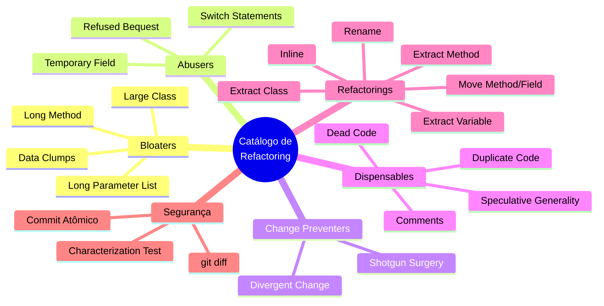
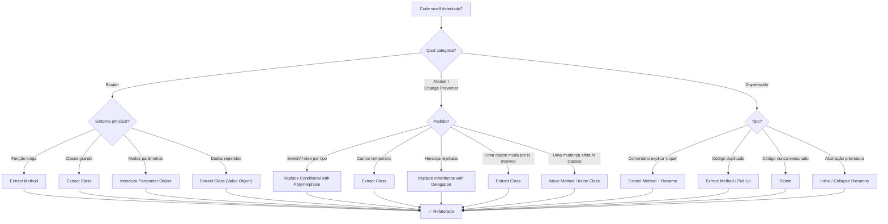
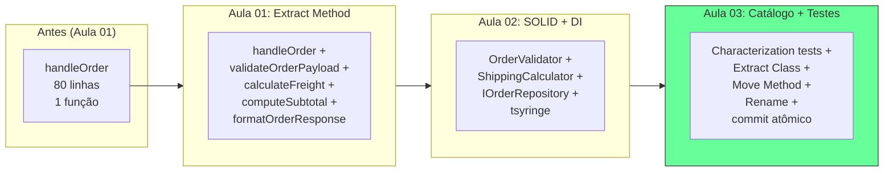

# Engenharia de Software — Aula 03

## Refactoring — Catálogo e Prática

**Duração estimada:** 90 minutos (40 min leitura + 50 min prática)

**Nível:** Intermediário

**Pré-requisitos:** Aulas 01 (Clean Code & Refactoring) e 02 (SOLID na Prática). Você deve ter o controller de e-commerce refatorado das aulas anteriores e os princípios SOLID aplicados.

---

## Objetivos de Aprendizagem

Ao final desta aula, você será capaz de:

1. **Classificar** cada code smell nas categorias Bloaters, Abusers, Change Preventers e Dispensables com exemplos práticos
2. **Diagnosticar** Long Method, Large Class e Long Parameter List em código real e aplicar os refactorings corretos
3. **Diferenciar** Divergent Change de Shotgun Surgery — dois smells opostos com o mesmo resultado
4. **Eliminar** código dispensável (comentários óbvios, código morto, duplicação, especulação) sem medo
5. **Selecionar** o refactoring adequado para cada smell usando uma árvore de decisão
6. **Aplicar** Extract Method, Extract Class, Extract Variable, Inline, Rename e Move Method com atalhos de teclado no VSCode
7. **Escrever** characterization tests como rede de segurança antes de refatorar código legado sem testes
8. **Refatorar** em passos pequenos com commit atômico, validando com `git diff` após cada passo
9. **Executar** testes a cada micro-refactoring, garantindo que o comportamento externo não mudou
10. **Combinar** múltiplos refactorings em sequência para transformar um controller de 80 linhas em funções coesas e testáveis

---

## Como Usar Esta Aula

Esta aula é seu **catálogo de referência prática**. Cada seção apresenta uma família de code smells, seguida pelo refactoring que a elimina.

O fluxo é simples:

1. **FUNDAMENTOS (Seções 1-4):** Conheça o catálogo completo de smells e refactorings com exemplos genéricos — sem distração de tecnologia específica
2. **APLICAÇÃO (Seção 5):** Aplique o catálogo no controller real de e-commerce com testes e git
3. **Exercícios:** Pratique com casos graduados

Cada seção termina com um Quick Check. Pare, responda e depois siga. No final, os exercícios consolidam o aprendizado.

---

## Mapa Mental



---

## Recapitulação das Aulas 01-02

Antes de mergulhar no catálogo, veja como o que você já sabe se conecta com o que vem a seguir:

| Conceito Anterior | Aula | Conexão com Aula 03 |
|---|---|---|
| Nomes revelam intenção | 01 | **Rename** é o refactoring que materializa esse princípio |
| Funções pequenas (SLAP) | 01 | **Extract Method** é a ferramenta para criar funções SLAP |
| DRY / Regra dos Três | 01 | **Extract Method** resolve duplicação detectada pela regra dos três |
| Code Smells (visão geral) | 01 | Aula 03 aprofunda cada categoria com exemplos sistemáticos |
| SRP — Uma classe, um motivo | 02 | **Extract Class** é o refactoring que aplica SRP a classes existentes |
| OCP — Aberto/Fechado | 02 | **Extract Interface** e polimorfismo substituem switch abusivos |
| ISP — Interfaces segregadas | 02 | **Extract Interface** + **Move Method** criam interfaces coesas |
| DIP — Inversão de dependência | 02 | **Move Method** realoca dependências para o lugar correto |

---

> **FUNDAMENTOS: O Catálogo de Code Smells e Refactorings**
>
> Esta primeira parte apresenta o catálogo completo — os 13 code smells mais comuns organizados em 4 categorias, e os 6 refactorings essenciais que os eliminam. Os exemplos são genéricos e propositalmente isolados de qualquer framework ou ORM específico. A ideia é que você aprenda o padrão, não a tecnologia.
>
> Na segunda parte (Seção 5), tudo isso será aplicado no controller real que você vem refatorando desde a Aula 01.

---

## 1. Code Smells — Bloaters

Bloaters são **inchaços**: código, classes e métodos que cresceram além do razoável. Assim como gordura no corpo, eles se acumulam aos poucos — cada nova feature adiciona mais uma linha, mais um parâmetro, mais um campo — até que o peso fica insustentável.

### 1.1 Long Method

**O que é:** Um método com mais de 20-30 linhas. Quanto mais linhas, mais difícil entender o que ele faz.

**Por que importa:** Métodos longos violam SLAP (Single Level of Abstraction Principle) — misturam alto nível (o que fazer) com baixo nível (como fazer). Ficam difíceis de testar, reutilizar e modificar sem quebrar.

**Antes:**
```typescript
function processOrder(data: any): void {
  // 50 linhas misturando validação, cálculo, persistência e formatação
  let total = 0;
  for (const item of data.items) {
    if (item.quantity < 0) throw new Error('Invalid quantity');
    total += item.price * item.quantity;
  }
  if (total < 10) throw new Error('Minimum order is 10');
  const tax = total * 0.1;
  const grandTotal = total + tax;
  console.log(`Order total: ${grandTotal}`);
  // ... mais 30 linhas
}
```

**Depois (Extract Method aplicado):**
```typescript
function processOrder(data: any): void {
  const total = calculateTotal(data.items);
  validateMinimumOrder(total);
  const grandTotal = addTax(total);
  logOrderTotal(grandTotal);
}

function calculateTotal(items: Item[]): number {
  return items.reduce((sum, item) => {
    if (item.quantity < 0) throw new Error('Invalid quantity');
    return sum + item.price * item.quantity;
  }, 0);
}

function validateMinimumOrder(total: number): void {
  if (total < 10) throw new Error('Minimum order is 10');
}

function addTax(total: number): number {
  return total + total * 0.1;
}

function logOrderTotal(total: number): void {
  console.log(`Order total: ${total}`);
}
```

**Quando aplicar:** Toda vez que você olha para um método e pensa "isso faz muita coisa" ou precisa rolar a tela para ver o método inteiro.

### 1.2 Large Class

**O que é:** Uma classe com mais de 200-300 linhas ou com muitos campos/métodos não relacionados.

**Por que importa:** Large Class é SRP violado no nível mais extremo. A classe acumula responsabilidades diferentes, o que significa que qualquer mudança em qualquer responsabilidade impacta a classe inteira.

**Sintoma clássico:** A classe tem campos que só são usados por alguns métodos, e métodos que só usam alguns campos. Isso indica que a classe deveria ser duas ou mais classes.

**Refactoring:** **Extract Class** — separe os campos e métodos relacionados em uma nova classe coesa.

**Antes:**
```typescript
class OrderManager {
  // Campos de pedido
  private orderId: string;
  private customer: Customer;
  private items: OrderItem[];
  
  // Campos de pagamento (só usados em 3 dos 20 métodos)
  private paymentMethod: string;
  private paymentStatus: string;
  private transactionId: string;
  
  // Campos de notificação (só usados em 2 métodos)
  private emailServer: string;
  private smsProvider: string;
  
  // 20 métodos misturando pedido, pagamento e notificação
}
```

**Depois:**
```typescript
class OrderManager {
  constructor(
    private order: Order,
    private payment: PaymentProcessor,
    private notification: NotificationService
  ) {}
}

class Order { /* apenas dados e regras do pedido */ }
class PaymentProcessor { /* apenas lógica de pagamento */ }
class NotificationService { /* apenas lógica de notificação */ }
```

### 1.3 Long Parameter List

**O que é:** Funções com mais de 3-4 parâmetros.

**Por que importa:** Cada parâmetro adicional aumenta a complexidade cognitiva — quem chama a função precisa lembrar a ordem e o tipo de cada um. Além disso, parâmetros em grupo (ex: `street`, `city`, `state`, `zip`) geralmente indicam que um objeto deveria existir.

**Refactoring:** **Introduce Parameter Object** — agrupe parâmetros relacionados em um objeto.

**Antes:**
```typescript
function createInvoice(
  customerName: string,
  customerEmail: string,
  customerDocument: string,
  itemDescription: string,
  itemQuantity: number,
  itemPrice: number,
  dueDate: Date
): Invoice { /* ... */ }
```

**Depois:**
```typescript
interface CustomerInfo {
  name: string;
  email: string;
  document: string;
}

interface InvoiceItem {
  description: string;
  quantity: number;
  price: number;
}

function createInvoice(
  customer: CustomerInfo,
  item: InvoiceItem,
  dueDate: Date
): Invoice { /* ... */ }
```

### 1.4 Data Clumps

**O que é:** Grupos de dados que aparecem juntos repetidamente (ex: `street`, `city`, `state`, `zip` aparecendo em 5 lugares diferentes).

**Por que importa:** Data clumps são um precursor de Long Parameter List e um indicador de que um conceito de domínio não foi modelado explicitamente.

**Refactoring:** **Extract Class** (criar um Value Object) — transforme o grupo em uma classe.

**Antes:**
```typescript
function shipTo(street: string, city: string, state: string, zip: string) { /* ... */ }
function billTo(street: string, city: string, state: string, zip: string) { /* ... */ }
```

**Depois:**
```typescript
class Address {
  constructor(
    public readonly street: string,
    public readonly city: string,
    public readonly state: string,
    public readonly zip: string
  ) {}
}

function shipTo(address: Address) { /* ... */ }
function billTo(address: Address) { /* ... */ }
```

> **Quick Check**
>
> **1. Qual a diferença entre Long Method e Large Class?**
**Resposta:** Long Method é uma função/método individual com mais de 20-30 linhas. Large Class é uma classe com mais de 200-300 linhas ou com múltiplas responsabilidades. O refactoring do primeiro é Extract Method; do segundo é Extract Class. Um pode levar ao outro — métodos longos em uma classe incham a classe.

> **2. Quando um parâmetro extra é um code smell e quando é necessário?**
**Resposta:** É smell quando passa de 3-4 parâmetros OU quando parâmetros aparecem juntos em grupo (data clump). Parâmetros extras e isolados (ex: um `options` ou `config`) são aceitáveis se cada um tem significado independente. O teste prático: se você precisa consultar a documentação para lembrar a ordem, é smell.

---

## 2. Code Smells — Abusers + Change Preventers

Esta seção reúne duas categorias: **Abusers** (código que abusa de mecanismos corretos, como switch e herança) e **Change Preventers** (código que dificulta ou impede mudanças).

### 2.1 Switch Statements (Abuser)

**O que é:** Múltiplos `switch` ou `if-else if` encadeados que testam o mesmo tipo ou valor em vários lugares do código.

**Por que importa:** Cada novo caso significa modificar todos os switches espalhados pelo sistema. É a principal violação de OCP no mundo real.

**Refactoring:** **Replace Type Code with Strategy/Polymorphism** — substitua o switch por uma interface com implementações.

**Antes:**
```typescript
function calculateShipping(method: string, weight: number): number {
  switch (method) {
    case 'pac': return weight * 0.5 + 10;
    case 'sedex': return weight * 0.8 + 15;
    case 'motoboy': return weight * 1.2 + 5;
    default: return weight * 0.5 + 10;
  }
}

function estimateDays(method: string): number {
  switch (method) {
    case 'pac': return 10;
    case 'sedex': return 3;
    case 'motoboy': return 1;
    default: return 10;
  }
}
```

**Depois:**
```typescript
interface ShippingStrategy {
  calculate(weight: number): number;
  estimatedDays: number;
}

class PacShipping implements ShippingStrategy {
  estimatedDays = 10;
  calculate(weight: number): number {
    return weight * 0.5 + 10;
  }
}

class SedexShipping implements ShippingStrategy {
  estimatedDays = 3;
  calculate(weight: number): number {
    return weight * 0.8 + 15;
  }
}

// Uso: ambas as funções agora delegam à estratégia
function calculateShipping(strategy: ShippingStrategy, weight: number): number {
  return strategy.calculate(weight);
}

function estimateDays(strategy: ShippingStrategy): number {
  return strategy.estimatedDays;
}
```

### 2.2 Temporary Field (Abuser)

**O que é:** Campos em uma classe que só são preenchidos em circunstâncias específicas, ficando `null` ou `undefined` na maior parte do tempo.

**Por que importa:** Cria complexidade condicional — todo método que usa o campo precisa verificar se ele está preenchido. É sinal de que a classe deveria ser dividida ou que o campo pertence a outra classe.

**Antes:**
```typescript
class Invoice {
  private items: InvoiceItem[];
  private discountCoupon?: string; // só usado se houver cupom
  private discountValue?: number;  // só usado se houver cupom
  
  getTotal(): number {
    let total = this.items.reduce((s, i) => s + i.price, 0);
    if (this.discountValue) {  // condicional por causa do campo temporário
      total -= this.discountValue;
    }
    return total;
  }
}
```

**Depois:**
```typescript
class Discount {
  constructor(
    public readonly coupon: string,
    public readonly value: number
  ) {}
}

class Invoice {
  constructor(
    private items: InvoiceItem[],
    private discount?: Discount
  ) {}
  
  getTotal(): number {
    const total = this.items.reduce((s, i) => s + i.price, 0);
    return this.discount ? total - this.discount.value : total;
  }
}
```

### 2.3 Refused Bequest (Abuser)

**O que é:** Uma subclasse que herda métodos e propriedades da superclasse mas não os usa — ou os rejeita lançando exceções.

**Por que importa:** Viola LSP e indica que a herança foi mal aplicada. A subclasse não é realmente um subtipo da superclasse.

**Refactoring:** **Replace Inheritance with Delegation** ou **Extract Superclass**.

**Antes:**
```typescript
abstract class Employee {
  abstract calculateSalary(): number;
  abstract calculateBonus(): number;
  abstract clockIn(): void;
}

class Contractor extends Employee {
  calculateSalary(): number { /* OK */ }
  calculateBonus(): number {
    throw new Error('Contractors do not receive bonuses');
  }
  clockIn(): void { /* OK */ }
}
```

**Depois:**
```typescript
abstract class Employee {
  abstract calculateSalary(): number;
  abstract clockIn(): void;
}

// Bonus agora é uma interface separada
interface BonusEligible {
  calculateBonus(): number;
}

class FullTimeEmployee extends Employee implements BonusEligible {
  calculateSalary(): number { /* ... */ }
  calculateBonus(): number { /* ... */ }
  clockIn(): void { /* ... */ }
}

class Contractor extends Employee {
  calculateSalary(): number { /* ... */ }
  clockIn(): void { /* ... */ }
  // Não implementa BonusEligible — sem exceção, sem problema
}
```

### 2.4 Divergent Change (Change Preventer)

**O que é:** Uma classe que muda por **múltiplos motivos diferentes**. A cada nova regra de negócio, você precisa alterar a mesma classe.

**Por que importa:** É o oposto de SRP. Se a classe `OrderService` muda quando a regra de frete muda, quando o método de pagamento muda, e quando a notificação muda — ela tem três motivos para mudar e, portanto, três responsabilidades.

**Refactoring:** **Extract Class** — separe cada motivo de mudança em sua própria classe.

### 2.5 Shotgun Surgery (Change Preventer)

**O que é:** O oposto de Divergent Change. **Uma** mudança (ex: adicionar um campo ao pedido) força alterações em **várias** classes diferentes.

**Por que importa:** Você precisa encontrar e modificar todos os lugares que tocam naquele conceito. É fácil esquecer um, criando inconsistências.

**Refactoring:** **Move Method** + **Inline Class** — centralize o comportamento que muda junto.

> **Quick Check**
>
> **1. Explique a diferença entre Divergent Change e Shotgun Surgery.**
**Resposta:** Divergent Change = UMA classe muda por MUITOS motivos (ex: `OrderService` muda por frete, pagamento e notificação). Shotgun Surgery = UMA mudança força alteração em MUITAS classes (ex: adicionar um campo `discount` exige alterar `OrderController`, `OrderService`, `OrderRepository` e `OrderReport`). Uma é o espelho da outra.

> **2. Por que Temporary Field é considerado um abuser e não um dispensible?**
**Resposta:** Porque Temporary Field não é apenas código desnecessário — ele **abusa** do mecanismo de campos de classe ao criar um campo que fica null na maior parte do tempo, forçando condicionais em todo código que o acessa. É um abuso do conceito de estado de objeto.

---

## 3. Code Smells — Dispensables

Dispensáveis são pedaços de código que **podem ser removidos sem perder funcionalidade**. São resíduos que poluem a base de código.

### 3.1 Comments

**O que é:** Comentários que explicam **o que** o código faz (em vez de **por que** faz).

**Por que importa:** Se o código precisa de um comentário para explicar o que ele faz, é porque o código não é expressivo o suficiente. O refactoring correto é tornar o código autoexplicativo — não adicionar mais comentários.

**Quando o comentário é BOM (não é smell):**
- Explica **por que** uma decisão foi tomada (contexto de negócio, limitação técnica)
- Documenta **algoritmos complexos** (ex: criptografia, parsing)
- Alerta sobre **efeitos colaterais** não óbvios
- Marca **TODO** (dívida técnica conhecida)

**Quando o comentário é SMELL (pode ser eliminado):**
- Explica **o que** o código faz (o nome da função deveria fazer isso)
- Está **obsoleto** (descreve comportamento que não existe mais)
- É um **diário** (comentários de "quem alterou")
- Repete o **nome da função ou variável**

**Antes (comentário smell):**
```typescript
// verifica se o usuário pode fazer checkout
function check(user: User): boolean {
  // retorna true se maior de idade
  return user.age >= 18;
}
```

**Depois (código autoexplicativo):**
```typescript
const MINIMUM_LEGAL_AGE = 18;

function isEligibleForCheckout(user: User): boolean {
  return user.age >= MINIMUM_LEGAL_AGE;
}
```

### 3.2 Duplicate Code

**O que é:** A mesma estrutura de código aparece em dois ou mais lugares.

**Por que importa:** Viola DRY. Se você precisa corrigir um bug ou alterar a lógica, precisa encontrar e modificar todas as cópias. É garantia de inconsistência futura.

**Refactoring:** **Extract Method** (se for no mesmo contexto) ou **Pull Up Method** (se for em classes irmãs, suba para a superclasse).

**Atenção:** Cuidado com duplicação "acidental" — código que parece igual mas muda por razões diferentes. A regra dos três ajuda: na terceira repetição, extraia.

### 3.3 Dead Code

**O que é:** Código que nunca é executado: funções não chamadas, branches inalcançáveis, variáveis não usadas, imports não referenciados.

**Por que importa:** Cada linha morta é ruído cognitivo. Quem lê o código perde tempo tentando entender algo que não tem efeito. Além disso, código morto dá falsa segurança — parece que a funcionalidade existe, mas não funciona.

**Refactoring:** **Delete** — simplesmente remova. Se precisar depois, o git tem o histórico.

**Antes:**
```typescript
function calculateTotal(items: Item[]): number {
  const OLD_TAX_RATE = 0.05; // não usado desde 2023
  return items.reduce((s, i) => s + i.price, 0);
}
```

**Depois:**
```typescript
function calculateTotal(items: Item[]): number {
  return items.reduce((s, i) => s + i.price, 0);
}
```

### 3.4 Speculative Generality

**O que é:** Abstrações criadas "para o caso de um dia precisar": interfaces com uma única implementação, classes abstratas sem uso concreto, parâmetros genéricos que só recebem um tipo.

**Por que importa:** Viola YAGNI (You Ain't Gonna Need It). Cada abstração tem custo de manutenção e complexidade cognitiva. Se você só tem uma implementação, a interface é ruído.

**Refactoring:** **Collapse Hierarchy** ou **Inline Class** — remova a abstração não utilizada.

**Antes:**
```typescript
interface ILogger {
  log(message: string): void;
}

class ConsoleLogger implements ILogger {
  log(message: string): void {
    console.log(message);
  }
}
// ILogger só tem ConsoleLogger como implementação
```

**Depois:**
```typescript
class ConsoleLogger {
  log(message: string): void {
    console.log(message);
  }
}
// Sem interface desnecessária — adicione quando houver uma segunda implementação real
```

> **Quick Check**
>
> **1. Um comentário é sempre um code smell?**
**Resposta:** Não. Comentários que explicam **por que** uma decisão foi tomada (contexto, trade-off, limitação técnica) são valiosos. O smell é o comentário que explica **o que** o código faz — isso indica que o código não é expressivo o suficiente.

> **2. Qual a diferença entre Dead Code e Speculative Generality?**
**Resposta:** Dead Code é código que já foi usado ou foi criado mas nunca executado — não tem utilidade HOJE. Speculative Generality é código criado para um cenário futuro que nunca se concretizou — nunca teve utilidade. Ambos devem ser removidos. A diferença é a intenção original: o primeiro é resíduo, o segundo é aposta perdida.

---

## 4. Refactoring Catalog

Este catálogo reúne os **6 refactorings essenciais** que você vai usar no dia a dia. Cada um vem com o atalho de teclado no VSCode (se aplicável) e um exemplo de antes/depois.

### 4.1 Extract Method

**O que faz:** Transforma um bloco de código em uma função nomeada.

**Quando usar:** Long Method, Duplicate Code, comentários que explicam "o que".

**Atalho VSCode:** Selecione o bloco → `Ctrl+Shift+R` (ou `F2` no menu contextual → "Extract to function").

**Antes:**
```typescript
function sendInvoice() {
  const total = items.reduce((s, i) => s + i.price, 0);
  const tax = total * 0.1;
  const emailBody = `Total: ${total + tax}`;
  emailService.send(emailBody);
}
```

**Depois:**
```typescript
function sendInvoice() {
  const totalWithTax = calculateTotalWithTax(items);
  const emailBody = buildInvoiceEmail(totalWithTax);
  emailService.send(emailBody);
}

function calculateTotalWithTax(items: Item[]): number {
  const subtotal = items.reduce((s, i) => s + i.price, 0);
  return subtotal + subtotal * 0.1;
}

function buildInvoiceEmail(total: number): string {
  return `Total: ${total}`;
}
```

### 4.2 Extract Class

**O que faz:** Move campos e métodos de uma classe grande para uma nova classe.

**Quando usar:** Large Class, Data Clumps, Divergent Change.

**Atalho VSCode:** Selecione os campos/métodos → `Ctrl+Shift+R` → "Extract to class".

**Antes:**
```typescript
class CustomerService {
  private name: string;
  private email: string;
  private street: string;
  private city: string;
  private state: string;
  private zip: string;
  
  getShippingAddress(): string {
    return `${this.street}, ${this.city} - ${this.state}`;
  }
}
```

**Depois:**
```typescript
class Address {
  constructor(
    public readonly street: string,
    public readonly city: string,
    public readonly state: string,
    public readonly zip: string
  ) {}
  
  format(): string {
    return `${this.street}, ${this.city} - ${this.state}`;
  }
}

class CustomerService {
  constructor(
    public readonly name: string,
    public readonly email: string,
    public readonly address: Address
  ) {}
}
```

### 4.3 Extract Variable

**O que faz:** Dá nome a uma expressão complexa ou repetida.

**Quando usar:** Expressão difícil de entender, valor calculado múltiplas vezes, Long Parameter List (preparação para Parameter Object).

**Atalho VSCode:** Selecione a expressão → `Ctrl+Shift+R` → "Extract to variable".

**Antes:**
```typescript
if (order.status === 'pending' && order.paymentStatus === 'confirmed' && order.items.length > 0) {
  processOrder(order);
}
```

**Depois:**
```typescript
const isReadyForProcessing = order.status === 'pending'
  && order.paymentStatus === 'confirmed'
  && order.items.length > 0;

if (isReadyForProcessing) {
  processOrder(order);
}
```

### 4.4 Inline Method / Inline Variable

**O que faz:** O oposto de Extract — substitui uma função/variável pelo seu conteúdo quando a abstração não agrega valor.

**Quando usar:** Função cujo nome não é mais claro que o corpo, variável temporária desnecessária, Speculative Generality.

**Antes (Inline Method):**
```typescript
function getDiscount(total: number): number {
  return total > 100 ? total * 0.1 : 0;
}

function checkout(items: Item[]): number {
  const total = calculateTotal(items);
  return total - getDiscount(total);
}
```

**Depois:**
```typescript
function checkout(items: Item[]): number {
  const total = calculateTotal(items);
  return total - (total > 100 ? total * 0.1 : 0);
  // A lógica de desconto é simples o suficiente para ficar inline
}
```

### 4.5 Rename

**O que faz:** Altera o nome de uma variável, função, classe ou arquivo.

**Quando usar:** Nome não revela intenção, nome está desatualizado, inconsistência de nomenclatura.

**Atalho VSCode:** `F2` (rename em todo o escopo — funciona para símbolos TypeScript).

**Antes:**
```typescript
function calc(a: number, b: number): number {
  const x = a * b;
  return x + x * 0.1;
}
```

**Depois:**
```typescript
function calculateTotalWithTax(subtotal: number, quantity: number): number {
  const lineTotal = subtotal * quantity;
  return lineTotal + lineTotal * 0.1;
}
```

### 4.6 Move Method / Move Field

**O que faz:** Transfere um método ou campo de uma classe para outra onde ele faz mais sentido.

**Quando usar:** Um método usa mais dados de outra classe do que da própria classe, Shotgun Surgery.

**Atalho VSCode:** Selecione o método → `F2` → refatore manualmente movendo o código (não há comando automático, mas o `F2` renomeia e atualiza referências).

**Antes:**
```typescript
class Order {
  private customer: Customer;
  
  getFullAddress(): string {
    // Método usa dados de Customer, não de Order
    return `${this.customer.street}, ${this.customer.city}`;
  }
}
```

**Depois:**
```typescript
class Customer {
  constructor(
    public readonly street: string,
    public readonly city: string
  ) {}
  
  getFullAddress(): string {
    return `${this.street}, ${this.city}`;
  }
}
```

### Árvore de Decisão



> **Quick Check**
>
> **1. Qual a diferença entre Extract Method e Extract Variable?**
**Resposta:** Extract Method transforma um bloco de código em uma função nomeada. Extract Variable transforma uma expressão em uma variável nomeada. O primeiro serve para dar nome a uma operação (verbo); o segundo para dar nome a um valor (substantivo ou predicado).

> **2. Quando usar Inline em vez de Extract?**
**Resposta:** Use Inline quando a abstração atual não agrega valor — o nome da função não é mais claro que seu corpo, ou a variável temporária é usada uma vez e seu nome não adiciona clareza. Inline é o "desfazer" de Extract: você simplifica removendo uma camada de indireção desnecessária.

---

> **APLICAÇÃO: Refatoração Completa do Controller com Testes**
>
> Agora que você conhece o catálogo completo, vamos aplicá-lo no controller real de e-commerce. Você vai escrever characterization tests, refatorar em passos atômicos e validar cada passo com git diff e testes passando.

---

## 5. Mão na Massa: Refatoração Guiada com Testes

Você já refatorou este controller nas Aulas 01 e 02. Agora vamos aplicar o catálogo completo — incluindo refactorings que não usamos antes, como Extract Class e Move Method — e fazer tudo com a segurança de testes automatizados.

### 5.1 O Estado Atual do Controller

Nas aulas anteriores, você refatorou o `handleOrder` de 80 linhas para aproximadamente 20 linhas com funções extraídas. O código atual deve se parecer com isto:

```typescript
// src/controllers/order.controller.ts
import { Request, Response } from 'express';
import { prisma } from '../database';

interface OrderPayload {
  customerId: string;
  items: Array<{ productId: string; quantity: number; price?: number }>;
  shippingAddress: string;
  paymentMethod: string;
}

function validateOrderPayload(body: any): OrderPayload | null {
  const required = ['customerId', 'items', 'shippingAddress', 'paymentMethod'];
  for (const field of required) {
    if (!body[field]) return null;
  }
  if (!Array.isArray(body.items) || body.items.length === 0) return null;
  return body as OrderPayload;
}

async function computeSubtotal(items: Array<{ productId: string; quantity: number }>): Promise<number> {
  let total = 0;
  for (const item of items) {
    const product = await prisma.product.findUnique({ where: { id: item.productId } });
    if (!product) throw new Error(`Product ${item.productId} not found`);
    total += product.price * item.quantity;
  }
  return total;
}

const FREIGHT_RATES: Record<string, number> = { SP: 0.05, RJ: 0.05, MG: 0.08, ES: 0.08 };

function calculateFreight(subtotal: number, state: string): number {
  const rate = FREIGHT_RATES[state] ?? 0.12;
  return subtotal * rate;
}

interface OrderResponse {
  id: string;
  customerId: string;
  items: Array<{ productId: string; quantity: number; price: number }>;
  total: number;
  freight: number;
  status: string;
}

function formatOrderResponse(order: any, freight: number): OrderResponse {
  return {
    id: order.id,
    customerId: order.customerId,
    items: order.items.map((i: any) => ({ productId: i.productId, quantity: i.quantity, price: i.price })),
    total: order.total,
    freight,
    status: order.status,
  };
}

export async function handleOrder(req: Request, res: Response) {
  try {
    const payload = validateOrderPayload(req.body);
    if (!payload) {
      res.status(400).json({ error: 'Dados obrigatórios ausentes' });
      return;
    }

    const subtotal = await computeSubtotal(payload.items);
    const address = await prisma.address.findUnique({ where: { id: payload.shippingAddress } });
    const freight = address ? calculateFreight(subtotal, address.state) : 0;
    const orderTotal = subtotal + freight;

    const order = await prisma.order.create({
      data: {
        customerId: payload.customerId,
        shippingAddressId: payload.shippingAddress,
        paymentMethod: payload.paymentMethod,
        total: orderTotal,
        items: { create: payload.items.map(i => ({ productId: i.productId, quantity: i.quantity, price: i.price || 0 })) },
      },
    });

    res.json(formatOrderResponse(order, freight));
  } catch (error) {
    console.error('Error creating order:', error);
    res.status(500).json({ error: 'Erro interno' });
  }
}
```

### 5.2 Passo 1: Caracterização — Antes de Refatorar, Teste

O controller acima **não tem testes**. Refatorar sem testes é perigoso. Vamos criar um **characterization test** — um teste que captura o comportamento atual do código, bom ou ruim, para servirem de rede de segurança.

```typescript
// src/controllers/__tests__/order.controller.test.ts
import request from 'supertest';
import app from '../../app';

describe('POST /orders — Characterization Tests', () => {
  it('deve criar pedido com dados válidos e retornar 200', async () => {
    const response = await request(app)
      .post('/orders')
      .send({
        customerId: 'cust-1',
        items: [{ productId: 'prod-1', quantity: 2, price: 50 }],
        shippingAddress: 'addr-1',
        paymentMethod: 'credit_card',
      });

    expect(response.status).toBe(200);
    expect(response.body).toHaveProperty('id');
    expect(response.body).toHaveProperty('total');
    expect(response.body.freight).toBeGreaterThanOrEqual(0);
  });

  it('deve rejeitar pedido sem customerId com 400', async () => {
    const response = await request(app)
      .post('/orders')
      .send({ items: [], shippingAddress: 'addr-1', paymentMethod: 'credit_card' });
    expect(response.status).toBe(400);
  });

  it('deve rejeitar pedido sem items com 400', async () => {
    const response = await request(app)
      .post('/orders')
      .send({ customerId: 'cust-1', shippingAddress: 'addr-1', paymentMethod: 'credit_card' });
    expect(response.status).toBe(400);
  });
});
```

**O que são characterization tests:** Testes que você escreve **depois** que o código já existe, observando o comportamento atual. Eles não testam "o que deveria ser", mas "o que é". Se o código atual tem um bug, o characterization test captura o bug — e você decide depois se corrige ou mantém.

**Comando para rodar:**
```bash
npx jest src/controllers/__tests__/order.controller.test.ts
```

### 5.3 Passo 2: Extract Class — Isolar Regras de Frete

O cálculo de frete está em uma função solta com constantes. Vamos extrair para uma classe:

```typescript
// src/domain/shipping/ShippingCalculator.ts
export type StateCode = string;

const FREIGHT_RATES: Record<string, number> = {
  SP: 0.05, RJ: 0.05, MG: 0.08, ES: 0.08,
};

const DEFAULT_RATE = 0.12;

export class ShippingCalculator {
  calculate(subtotal: number, state: StateCode): number {
    const rate = FREIGHT_RATES[state] ?? DEFAULT_RATE;
    return subtotal * rate;
  }

  static readonly DEFAULT_RATE = DEFAULT_RATE;
  static readonly FREIGHT_RATES = FREIGHT_RATES;
}
```

**Por que Extract Class aqui?** A função `calculateFreight` tem dados (taxas) e comportamento (cálculo). Juntar ambos em uma classe torna o conceito de "Calculadora de Frete" explícito. Além disso, prepara o terreno para o princípio OCP — novos estados? Nova implementação da interface. Novas regras de frete? Nova classe.

**Commit:**
```bash
git add src/domain/shipping/ShippingCalculator.ts
git commit -m "refactor: extract ShippingCalculator class from inline function"
```

**Rode os testes:** `npx jest` — todos devem passar.

### 5.4 Passo 3: Extract Class — Isolar Validação

A função `validateOrderPayload` e sua interface fazem parte do domínio de validação:

```typescript
// src/domain/orders/OrderValidator.ts
export interface OrderPayload {
  customerId: string;
  items: Array<{ productId: string; quantity: number; price?: number }>;
  shippingAddress: string;
  paymentMethod: string;
}

export class OrderValidator {
  validate(body: any): OrderPayload | null {
    const required: (keyof OrderPayload)[] = ['customerId', 'items', 'shippingAddress', 'paymentMethod'];
    for (const field of required) {
      if (!body[field]) return null;
    }
    if (!Array.isArray(body.items) || body.items.length === 0) return null;
    return body as OrderPayload;
  }
}
```

**Commit:**
```bash
git add src/domain/orders/OrderValidator.ts
git commit -m "refactor: extract OrderValidator class from inline function"
```

### 5.5 Passo 4: Move Method — Reposicionar Formatação

A função `formatOrderResponse` está no controller, mas pertence à camada de apresentação. Vamos movê-la para um arquivo dedicado:

```typescript
// src/presentation/orders/OrderResponseFormatter.ts
export interface OrderResponse {
  id: string;
  customerId: string;
  items: Array<{ productId: string; quantity: number; price: number }>;
  total: number;
  freight: number;
  status: string;
}

export class OrderResponseFormatter {
  format(order: any, freight: number): OrderResponse {
    return {
      id: order.id,
      customerId: order.customerId,
      items: order.items.map((i: any) => ({
        productId: i.productId, quantity: i.quantity, price: i.price,
      })),
      total: order.total,
      freight,
      status: order.status,
    };
  }
}
```

**Commit:**
```bash
git add src/presentation/orders/OrderResponseFormatter.ts
git commit -m "refactor: move OrderResponseFormatter to presentation layer"
```

### 5.6 Passo 5: Rename no Controller

Com as classes extraídas e movidas, vamos atualizar o controller para usar as novas classes. Aproveite para renomear variáveis e métodos com nomes mais reveladores:

```typescript
import { Request, Response } from 'express';
import { prisma } from '../database';
import { OrderValidator } from '../domain/orders/OrderValidator';
import { ShippingCalculator } from '../domain/shipping/ShippingCalculator';
import { OrderResponseFormatter } from '../presentation/orders/OrderResponseFormatter';

const orderValidator = new OrderValidator();
const shippingCalculator = new ShippingCalculator();
const orderFormatter = new OrderResponseFormatter();

export async function handleOrder(req: Request, res: Response) {
  try {
    const orderPayload = orderValidator.validate(req.body);
    if (!orderPayload) {
      res.status(400).json({ error: 'Dados obrigatórios ausentes' });
      return;
    }

    const subtotal = await computeSubtotal(orderPayload.items);
    const shippingAddress = await prisma.address.findUnique({
      where: { id: orderPayload.shippingAddress },
    });
    const freight = shippingAddress
      ? shippingCalculator.calculate(subtotal, shippingAddress.state)
      : 0;
    const orderTotal = subtotal + freight;

    const order = await prisma.order.create({
      data: {
        customerId: orderPayload.customerId,
        shippingAddressId: orderPayload.shippingAddress,
        paymentMethod: orderPayload.paymentMethod,
        total: orderTotal,
        items: {
          create: orderPayload.items.map(item => ({
            productId: item.productId,
            quantity: item.quantity,
            price: item.price || 0,
          })),
        },
      },
    });

    const orderResponse = orderFormatter.format(order, freight);
    res.json(orderResponse);
  } catch (error) {
    console.error('Error creating order:', error);
    res.status(500).json({ error: 'Erro interno' });
  }
}
```

**Mudanças de Rename aplicadas:**
- `payload` → `orderPayload` (revela que é payload de pedido)
- `address` → `shippingAddress` (revela que é endereço de entrega)
- `orderTotal` (já estava bom)
- `response` → `orderResponse` (revela que é a resposta do pedido)
- `i` → `item` (no map, mais descritivo)

**Commit:**
```bash
git add src/controllers/order.controller.ts
git commit -m "refactor: rename variables for clarity and update to use extracted classes"
```

### 5.7 O Fluxo Completo



> **Quick Check**
>
> **1. Por que escrever characterization tests antes de refatorar código existente?**
**Resposta:** Characterization tests capturam o comportamento atual do sistema, bom ou ruim. Eles servem como rede de segurança — se os testes passam antes e depois da refatoração, você sabe que não alterou o comportamento externo. Sem eles, qualquer refatoração em código legado é uma aposta.

---

## Autoavaliação: Quiz Rápido

Responda às 7 perguntas para verificar se os conceitos fixaram.

**1. Qual code smell descreve uma classe que muda por múltiplos motivos diferentes (frete, pagamento, notificação)?**

**Gabarito:** Divergent Change. É o oposto de SRP — uma classe com múltiplas responsabilidades que muda por múltiplos motivos.

**2. Qual a diferença entre Extract Method e Extract Class?**

**Gabarito:** Extract Method transforma um bloco de código em uma função (verbo). Extract Class cria uma nova classe a partir de campos e métodos relacionados (substantivo). O primeiro resolve Long Method; o segundo resolve Large Class.

**3. Você encontra um switch com 6 cases testando o mesmo campo `shippingMethod`. Qual refactoring aplicar?**

**Gabarito:** Replace Conditional with Polymorphism (ou Replace Type Code with Strategy). Crie uma interface `ShippingStrategy` com implementações para cada método de envio.

**4. Verdadeiro ou falso: "Comentários que explicam o que o código faz são sempre bem-vindos."**

**Gabarito:** Falso. Comentários que explicam **o que** o código faz são um code smell (Dispensable) — o código deveria ser autoexplicativo. Comentários que explicam **por que** uma decisão foi tomada são bons e devem ser mantidos.

**5. Você precisa alterar o formato da resposta do pedido e descobre que precisa modificar `OrderController`, `OrderService`, `OrderRepository` e `OrderReport`. Qual smell? E qual refactoring?**

**Gabarito:** Shotgun Surgery. Uma mudança força alterações em várias classes. Refactoring: Move Method + Inline Class para centralizar o comportamento de formatação em um único lugar.

**6. Qual atalho do VSCode é usado para Rename de símbolos em TypeScript?**

**Gabarito:** `F2`. Ele renomeia o símbolo em todo o escopo do projeto, atualizando todas as referências automaticamente.

**7. O que são characterization tests e por que são importantes na refatoração?**

**Gabarito:** São testes escritos **depois** que o código existe, que capturam o comportamento atual do sistema. São importantes porque servem de rede de segurança durante a refatoração — se passam antes e depois, o comportamento não mudou.

---

## Mão na Massa: Exercícios Graduados

### Exercício 1 (Fácil) — Classificação de Code Smells

Classifique cada trecho abaixo no code smell correspondente (use o catálogo: Bloaters, Abusers, Change Preventers, Dispensables):

```typescript
// Trecho A
function process(a: string, b: string, c: number, d: Date, e: boolean, f: string) { /* ... */ }

// Trecho B
class ProductService {
  calculatePrice() { /* ... */ }
  validateStock() { /* ... */ }
  sendEmail() { /* ... */ }
  generateReport() { /* ... */ }
}

// Trecho C
if (type === 'pdf') { generatePDF(); }
else if (type === 'csv') { generateCSV(); }
else if (type === 'xlsx') { generateXLSX(); }
else if (type === 'html') { generateHTML(); }
```

**Gabarito:**

- **Trecho A:** Long Parameter List (Bloater) — 6 parâmetros, alguns claramente agrupáveis (ex: `a` e `b` podem ser um objeto)
- **Trecho B:** Large Class (Bloater) — `ProductService` mistura preço, estoque, email e relatório. Pelo menos 4 responsabilidades diferentes
- **Trecho C:** Switch Statements (Abuser) — múltiplos `if-else if` testando o mesmo campo `type`. Deveria ser substituído por polimorfismo/strategy

---

### Exercício 2 (Médio) — Árvore de Decisão de Refactoring

Você está revisando o código abaixo. Para cada problema identificado, aplique o refactoring correto do catálogo:

```typescript
function finalizePurchase(
  customerName: string,
  customerEmail: string,
  customerDocument: string,
  items: Item[],
  couponCode?: string,
  zipCode?: string,
  paymentType?: string,
  cardNumber?: string
) {
  // 1. valida dados
  if (!customerName) throw new Error('Name required');
  if (!customerEmail) throw new Error('Email required');
  if (!customerEmail.includes('@')) throw new Error('Invalid email');

  // 2. calcula total
  let total = 0;
  for (const item of items) {
    total += item.price * item.quantity;
  }

  // 3. aplica cupom
  if (couponCode) {
    if (couponCode === 'WELCOME10') total *= 0.9;
    else if (couponCode === 'BLACKFRIDAY') total *= 0.5;
    else if (couponCode === 'FREESHIP') { /* não faz nada */ }
  }

  // 4. log
  console.log(`Purchase by ${customerName}: ${total}`);
  return total;
}
```

**Gabarito:**

1. **Long Parameter List** → Extract Parameter Object: Agrupe `customerName`, `customerEmail`, `customerDocument` em um objeto `CustomerInfo`. Agrupe `zipCode`, `paymentType`, `cardNumber` em um objeto `PaymentInfo`.

2. **Long Method** → Extract Method: Extraia validação para `validateCustomerData`, extraia cálculo de total para `calculateItemsTotal`, extraia aplicação de cupom para `applyCouponDiscount`.

3. **Switch Statements (couponCode)** → Replace Conditional with Strategy: Crie um mapa de cupons com funções de desconto.

4. **Dead Code** → Delete: O cupom `FREESHIP` não altera o total — a branch `else if (couponCode === 'FREESHIP')` é inócua.

---

### Exercício 3 (Difícil) — Refatoração Completa com Testes

Abaixo está um controller de busca de produtos com múltiplos code smells. Refatore aplicando o catálogo completo:

```typescript
import { Request, Response } from 'express';

// TODO: adicionar busca por preço
// TODO: adicionar paginação
// TODO: adicionar cache

export async function searchProducts(req: Request, res: Response) {
  const q = req.query.q;
  const c = req.query.category;
  const s = req.query.sort;
  const p = req.query.page;
  const l = req.query.limit;

  let query = 'SELECT * FROM products WHERE 1=1';
  const params: any[] = [];

  if (q) {
    query += ' AND name ILIKE $' + (params.length + 1);
    params.push(`%${q}%`);
  }

  if (c) {
    query += ' AND category = $' + (params.length + 1);
    params.push(c);
  }

  if (s === 'price_asc') query += ' ORDER BY price ASC';
  else if (s === 'price_desc') query += ' ORDER BY price DESC';
  else if (s === 'name') query += ' ORDER BY name ASC';
  else if (s === 'newest') query += ' ORDER BY created_at DESC';

  const limit = parseInt(l as string) || 10;
  const offset = ((parseInt(p as string) || 1) - 1) * limit;
  query += ' LIMIT $' + (params.length + 1) + ' OFFSET $' + (params.length + 2);
  params.push(limit, offset);

  try {
    const result = await db.query(query, params);
    res.json({ data: result.rows, total: result.rows.length, page: p || 1 });
  } catch (err) {
    res.status(500).json({ error: 'Erro ao buscar produtos' });
  }
}
```

Problemas identificados: nomes genéricos (`q`, `c`, `s`, `p`, `l`), SQL inline no controller (mistura de camadas), duplicação de string interpolation, comentários TODO que são dívida técnica documentada (comentário BOM), falta de tipos, Long Method.

**Gabarito:**

```typescript
// ===== 1. Extract Interface para parâmetros de busca =====
interface SearchProductsParams {
  query?: string;
  category?: string;
  sort?: 'price_asc' | 'price_desc' | 'name' | 'newest';
  page: number;
  limit: number;
}

// ===== 2. Extract Class para construção de query =====
class ProductQueryBuilder {
  private query = 'SELECT * FROM products WHERE 1=1';
  private params: any[] = [];
  private paramIndex = 1;

  addNameFilter(name?: string): this {
    if (!name) return this;
    this.query += ` AND name ILIKE $${this.paramIndex++}`;
    this.params.push(`%${name}%`);
    return this;
  }

  addCategoryFilter(category?: string): this {
    if (!category) return this;
    this.query += ` AND category = $${this.paramIndex++}`;
    this.params.push(category);
    return this;
  }

  addSorting(sort?: string): this {
    const sortMap: Record<string, string> = {
      price_asc: 'ORDER BY price ASC',
      price_desc: 'ORDER BY price DESC',
      name: 'ORDER BY name ASC',
      newest: 'ORDER BY created_at DESC',
    };
    if (sort && sortMap[sort]) {
      this.query += ` ${sortMap[sort]}`;
    }
    return this;
  }

  addPagination(page: number, limit: number): this {
    this.query += ` LIMIT $${this.paramIndex++} OFFSET $${this.paramIndex++}`;
    this.params.push(limit, (page - 1) * limit);
    return this;
  }

  build(): { query: string; params: any[] } {
    return { query: this.query, params: this.params };
  }
}

// ===== 3. Extrair parsing de query params =====
function parseSearchParams(req: Request): SearchProductsParams {
  return {
    query: req.query.q as string | undefined,
    category: req.query.category as string | undefined,
    sort: req.query.sort as SearchProductsParams['sort'],
    page: parseInt(req.query.page as string) || 1,
    limit: Math.min(parseInt(req.query.limit as string) || 10, 100), //上限
  };
}

// ===== 4. Controller refatorado =====
export async function searchProducts(req: Request, res: Response) {
  try {
    const params = parseSearchParams(req);
    const queryBuilder = new ProductQueryBuilder();

    const { query, params: queryParams } = queryBuilder
      .addNameFilter(params.query)
      .addCategoryFilter(params.category)
      .addSorting(params.sort)
      .addPagination(params.page, params.limit)
      .build();

    const result = await db.query(query, queryParams);
    res.json({
      data: result.rows,
      total: result.rows.length,
      page: params.page,
      limit: params.limit,
    });
  } catch (error) {
    console.error('Erro ao buscar produtos:', error);
    res.status(500).json({ error: 'Erro ao buscar produtos' });
  }
}
```

**Refactorings aplicados:**
1. **Rename** — `q` → `query`, `c` → `category`, `s` → `sort`, `p` → `page`, `l` → `limit`, `params` → `queryParams`
2. **Extract Method** — `parseSearchParams` extrai o parsing dos query params
3. **Extract Class** — `ProductQueryBuilder` encapsula toda a lógica de construção de SQL
4. **Replace Conditional with Strategy** — `sortMap` substitui a cadeia de `if-else if`
5. **Introduce Parameter Object** — `SearchProductsParams` agrupa todos os parâmetros de busca
6. **Dead Code removido** — os TODOs foram avaliados. O TODO de paginação foi implementado; o de preço e cache são dívida técnica mantida (comentários BOM)

---

## Resumo da Aula

- **Bloaters** (Long Method, Large Class, Long Parameter List, Data Clumps) são inchaços que crescem com o tempo — resolva com Extract Method, Extract Class e Introduce Parameter Object
- **Abusers** (Switch Statements, Temporary Field, Refused Bequest) são mecanismos corretos usados de forma inadequada — resolva com polimorfismo, Extract Class e Replace Inheritance with Delegation
- **Change Preventers** (Divergent Change, Shotgun Surgery) dificultam modificações — resolva com Extract Class, Move Method e Inline Class
- **Dispensables** (Comments, Duplicate Code, Dead Code, Speculative Generality) são resíduos removíveis — resolva com Delete, Extract Method e Inline
- **Extract Method** é o refactoring mais seguro e de maior retorno — atalho VSCode `Ctrl+Shift+R`
- **Rename** é o refactoring mais simples e subestimado — atalho VSCode `F2`
- **Caracterização com testes** antes de refatorar é a única rede de segurança confiável em código legado
- **Cada refactoring = um commit atômico** com `git diff` validando o escopo

---

## Próxima Aula

**Aula 04: SOLID SRP/OCP/LSP — Aprofundamento e Casos Reais**

Você aprendeu o catálogo de refactorings e aplicou no controller. Na próxima aula, vamos aprofundar os três primeiros princípios SOLID com foco em refatorações guiadas por testes. Você vai aplicar Extract Class para atingir SRP, substituir switches por polimorfismo para atingir OCP e garantir substituibilidade com LSP em cenários complexos de e-commerce.

---

## Referências

- FOWLER, Martin. **Refactoring: Improving the Design of Existing Code**. 2nd ed. Addison-Wesley, 2018. — O catálogo definitivo
- FOWLER, Martin. **Refactoring: Como Melhorar o Design de Código Existente**. 1ª ed. Bookman, 2020. (Tradução brasileira)
- KERIEVSKY, Joshua. **Refactoring to Patterns**. Addison-Wesley, 2004.
- FEATHERS, Michael. **Working Effectively with Legacy Code**. Prentice Hall, 2004. — Characterization tests e estratégias para código legado
- MARTIN, Robert C. **Clean Code: A Handbook of Agile Software Craftsmanship**. Prentice Hall, 2008.
- [Refactoring Guru — Code Smells](https://refactoring.guru/refactoring/smells) — Catálogo visual interativo
- [Refactoring Guru — Refactorings](https://refactoring.guru/refactoring/techniques) — Técnicas com exemplos
- [VSCode Refactoring — Documentação Oficial](https://code.visualstudio.com/docs/editor/refactoring)
- [Martin Fowler — Refactoring (site oficial)](https://refactoring.com/)

---

## FAQ

**1. Preciso decorar todos os code smells e refactorings?**
Não. O objetivo é reconhecer os padrões. Com a prática, você identifica smells naturalmente durante a leitura do código. O catálogo é para consulta, não para memorização.

**2. Quantos refactorings devo aplicar por commit?**
Um. Cada commit deve conter exatamente um refactoring atômico. Isso facilita o review (o diff mostra apenas uma transformação) e o rollback (se algo quebrar, apenas um refactoring é revertido).

**3. Extract Method vs Extract Class: como decide?**
Extract Method é para **comportamento** — um bloco de código vira uma função. Extract Class é para **estado + comportamento** — um grupo de campos e métodos vira uma nova classe. Se você tem apenas lógica sem estado, use Extract Method. Se tem dados que andam juntos, use Extract Class.

**4. Quando um switch é aceitável mesmo sendo um code smell?**
Quando ele tem poucos cases (2-3), não se repete em outros lugares, e não há expectativa de novos cases no futuro. Nesse cenário, substituir por polimorfismo adiciona complexidade sem benefício. YAGNI se aplica aqui.

**5. Qual a diferença entre refatoração e reescrita?**
Refatoração altera a estrutura interna sem mudar o comportamento externo — passo a passo, com testes. Reescrita descarta o código existente e começa do zero. Refatore quando o código tem valor de negócio; reescreva quando o custo de refatorar supera o de recomeçar (raro).

**6. Como lidar com código legado sem testes?**
Escreva characterization tests primeiro (Passo 5.2 desta aula). Depois refatore em passos pequenos. Cada passo: refatore → rode testes → commit. Se os testes passam, o comportamento não mudou.

**7. Posso refatorar e adicionar funcionalidade ao mesmo tempo?**
Não. Refatoração não adiciona funcionalidade. Faça em ciclos separados: (1) refatore, (2) commit, (3) adicione feature, (4) commit. Misturar os dois torna o diff confuso e o rollback arriscado.

**8. Atalhos de teclado são importantes para refatoração?**
Sim. `F2` (Rename), `Ctrl+Shift+R` (Extract), `Ctrl+.` (quick actions) no VSCode tornam a refatoração rápida e segura. A ferramenta lida com a atualização de referências automaticamente.

**9. O que fazer quando um refactoring quebra os testes?**
Pare imediatamente. Reverta a última alteração (`git checkout .`). O teste quebrou porque você alterou comportamento sem querer. Refaça o refactoring em passos menores até que os testes passem.

**10. Como sei que refatorei o suficiente?**
Quando o código conta uma história clara em alto nível (o controller) e cada detalhe está em seu lugar adequado (classes de domínio, serviço, apresentação). Não existe "perfeito" — refatore até que o próximo desenvolvedor entenda o fluxo em 30 segundos.

---

## Glossário

| Termo | Definição |
|---|---|
| **Bloater** | Code smell caracterizado por inchaço — código, método ou classe que cresceu além do razoável |
| **Abuser** | Code smell onde um mecanismo correto (switch, herança) é usado de forma inadequada |
| **Change Preventer** | Code smell que dificulta modificar o código — mudanças em um lugar forçam mudanças em cascata |
| **Dispensable** | Code smell que pode ser removido sem perda de funcionalidade — comentário, código morto, duplicação |
| **Characterization Test** | Teste escrito depois do código existir, capturando o comportamento atual como rede de segurança para refatoração |
| **Extract Method** | Refactoring que transforma um bloco de código em uma função nomeada |
| **Extract Class** | Refactoring que cria uma nova classe a partir de campos e métodos relacionados |
| **Extract Variable** | Refactoring que dá nome a uma expressão complexa |
| **Inline** | Refactoring que substitui uma função ou variável pelo seu conteúdo quando a abstração não agrega valor |
| **Introduce Parameter Object** | Refactoring que agrupa parâmetros relacionados em um objeto |
| **Replace Conditional with Polymorphism** | Refactoring que substitui switches/ifs por uma interface com implementações |
| **Shotgun Surgery** | Smell onde uma única mudança força alterações em várias classes |
| **Divergent Change** | Smell onde uma única classe muda por múltiplos motivos diferentes |
| **Commit Atômico** | Prática de fazer um commit por refactoring, com mensagem descritiva e testes passando |
| **git diff** | Comando que mostra as diferenças entre versões do código — usado para validar o escopo da refatoração |
