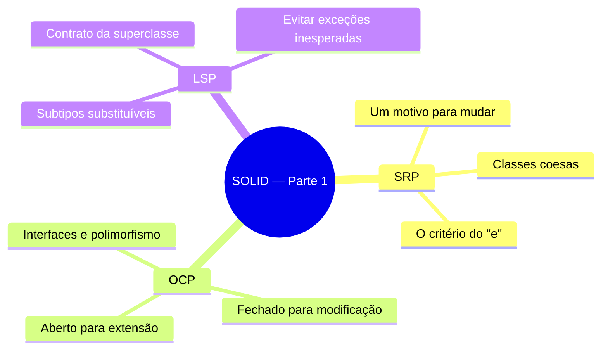
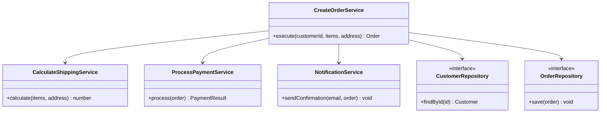
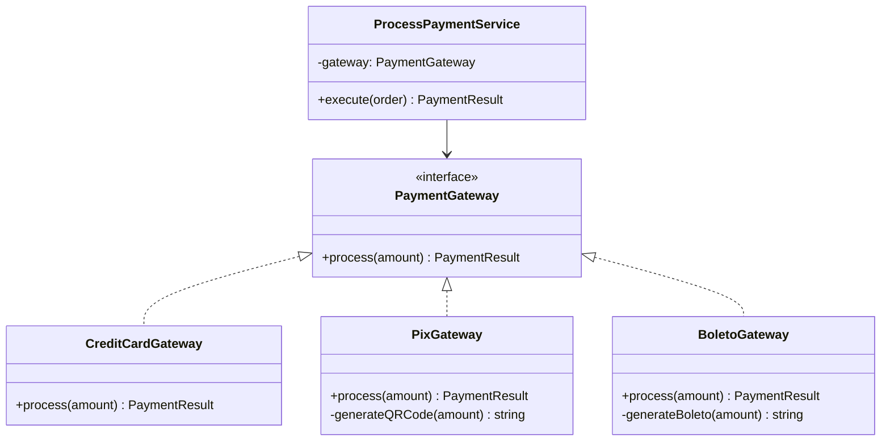
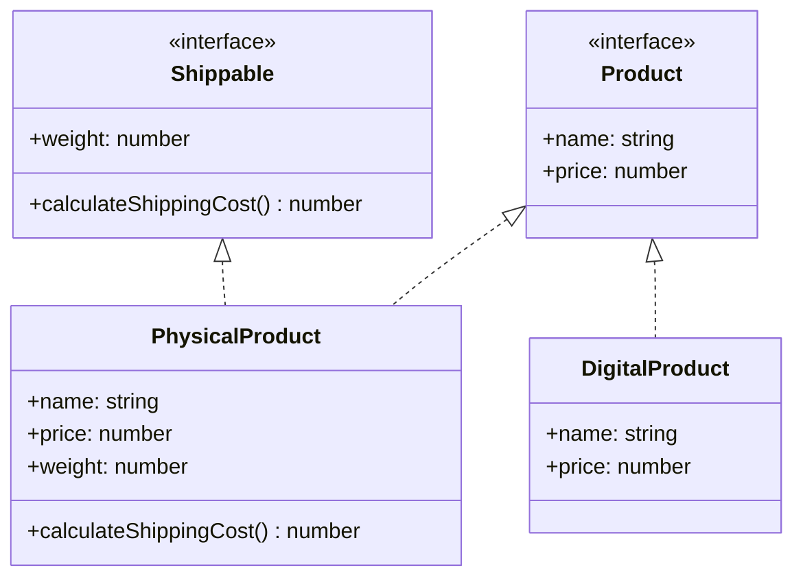

# Engenharia de Software — Aula 04

## SOLID — Single Responsibility, Open/Closed e Liskov Substitution

**Duração estimada:** 90 minutos (40 de leitura + 50 de prática)
**Nível:** Intermediário
**Pré-requisitos:** Aulas 01 (Clean Code & Refactoring), 02 (SOLID na Prática) e 03 (Design Patterns)

---

## Objetivos de Aprendizagem

Ao final desta aula, você será capaz de:

- [ ] **Explicar** o que diz o Single Responsibility Principle (SRP) e por que uma classe deve ter apenas um motivo para mudar
- [ ] **Identificar** classes que violam o SRP usando o critério da "descrição em uma frase sem usar 'e' ou 'ou'"
- [ ] **Refatorar** uma classe monolítica em múltiplas classes coesas, cada uma com responsabilidade única
- [ ] **Descrever** o Open/Closed Principle (OCP): aberto para extensão, fechado para modificação
- [ ] **Aplicar** OCP usando interfaces e polimorfismo para suportar novos comportamentos sem alterar código existente
- [ ] **Diferenciar** a violação clássica do Liskov Substitution Principle (LSP) — subtipos que quebram o contrato da superclasse
- [ ] **Construir** hierarquias de classes que respeitem o LSP, garantindo substituibilidade segura
- [ ] **Projetar** um sistema de pagamentos extensível usando OCP com múltiplos gateways
- [ ] **Distinguir** casos reais de violação de LSP (exceções inesperadas, condicionais de tipo) e corrigi-los com design adequado
- [ ] **Aplicar** os três princípios em conjunto no código do e-commerce, eliminando acoplamento e efeitos colaterais em cascata

---

## Como Usar Esta Aula

Esta aula está organizada em duas partes. A **primeira parte** constrói a base conceitual dos três primeiros princípios SOLID — SRP, OCP e LSP — com exemplos universais, independentes de domínio. A **segunda parte** aplica cada princípio na prática da API de e-commerce que você vem construindo.

Ao longo do caminho, você encontrará seções **Mão na Massa** (para implementar no editor, não só ler) e **Quick Check** (para verificar se entendeu antes de avançar). Ao final, o arquivo separado **Questões de Aprendizagem** traz as tarefas de checkpoint — só avance para a Aula 05 quando conseguir completá-las por conta própria.

**Tempo estimado:** 90 minutos (40 de leitura + 50 de prática).

## Mapa Mental

Este diagrama mostra todos os conceitos que você vai dominar nesta aula:




## Recapitulação das Aulas 01-03

| Aula | Conceito | Onde aparece nesta aula | Como se conecta |
|---|---|---|---|
| Aula 01 | Clean Code: funções pequenas, nomes significativos | Refatoração de classes grandes em serviços coesos | SRP é a versão estrutural do que Clean Code faz em nível de função |
| Aula 02 | SOLID na Prática (visão geral) | Cada princípio é aprofundado individualmente | Aula 02 deu o mapa; Aula 04 explora o território |
| Aula 03 | Design Patterns: Strategy, Factory Method | OCP leva naturalmente a Strategy e Factory Method | Patterns são a materialização concreta dos princípios SOLID |

---

**FUNDAMENTOS: Os Três Primeiros Pilares do Design de Classes**

> *Os conceitos desta seção são universais — valem para qualquer linguagem orientada a objetos, framework ou domínio. Cada princípio é apresentado com um exemplo clássico independente. Na segunda parte, você verá como cada um se aplica ao código do e-commerce.*

---

## 1. Single Responsibility Principle (SRP)

### O que é

O **Single Responsibility Principle** — princípio da responsabilidade única — diz: *uma classe deve ter um, e apenas um, motivo para mudar.*

Traduzindo: cada classe deve ter **uma única responsabilidade** bem definida. Se você consegue descrever o que a classe faz em uma frase usando "e" ou "ou", provavelmente ela tem mais de uma responsabilidade e viola o SRP.

### Por que importa

Quando uma classe acumula múltiplas responsabilidades, uma mudança em qualquer uma delas afeta a classe inteira — e todas as outras classes que dependem dela. É o efeito dominó: você altera o cálculo de frete e, sem querer, quebra o envio de e-mail porque ambos estão na mesma classe.

**Consequências da violação:**
- Dificuldade de testar (você precisa mockar 3 responsabilidades para testar 1)
- Acoplamento espúrio (responsabilidades não relacionadas viram dependentes)
- Baixa coesão (a classe faz "um monte de coisas")

### Exemplo: Antes (violação)

Considere uma classe que gera relatórios, salva em disco e envia por e-mail:

```typescript
class Report {
  constructor(private data: any[]) {}

  generateHTML(): string {
    return `<table>${this.data.map(d => `<tr><td>${d}</td></tr>`).join('')}</table>`;
  }

  saveToDisk(filename: string): void {
    const fs = require('fs');
    fs.writeFileSync(filename, this.generateHTML());
  }

  sendByEmail(recipient: string): void {
    // lógica SMTP
    console.log(`Enviando relatório para ${recipient}...`);
  }
}
```

**Problema:** três responsabilidades — gerar HTML, persistir em arquivo, enviar e-mail — na mesma classe. Se o formato de saída mudar para PDF, três métodos precisam ser alterados. Se a API de e-mail mudar, a classe `Report` é modificada.

### Exemplo: Depois (corrigido)

```typescript
interface ReportRenderer {
  render(data: any[]): string;
}

class HTMLRenderer implements ReportRenderer {
  render(data: any[]): string {
    return `<table>${data.map(d => `<tr><td>${d}</td></tr>`).join('')}</table>`;
  }
}

interface ReportPersistence {
  save(content: string, filename: string): void;
}

class DiskPersistence implements ReportPersistence {
  save(content: string, filename: string): void {
    const fs = require('fs');
    fs.writeFileSync(filename, content);
  }
}

interface Notifier {
  send(recipient: string, message: string): void;
}

class EmailNotifier implements Notifier {
  send(recipient: string, message: string): void {
    console.log(`Enviando e-mail para ${recipient}...`);
  }
}
```

Agora cada classe tem **um** motivo para mudar. Trocar o formato de saída? Crio um `PDFRenderer`. Trocar o mecanismo de persistência? Crio um `S3Persistence`. Cada mudança é local, isolada e segura.

### O critério prático do "e"

Descreva o que a classe faz em voz alta. Se você disser "A classe X faz **Y** e **Z**", violou SRP. Se disser "A classe X faz **Y**", está OK.

### Quick Check 1

**1. Quantos motivos para mudar uma classe deve ter segundo o SRP?**
**Resposta:** Apenas um. Cada classe deve ter uma única responsabilidade bem definida.

**2. Qual é o critério prático mais rápido para detectar violação de SRP?**
**Resposta:** Tentar descrever a responsabilidade da classe em uma frase. Se a frase precisar de "e" ou "ou", há mais de uma responsabilidade.

---

## 2. Open/Closed Principle (OCP)

### O que é

O **Open/Closed Principle** — princípio do aberto/fechado — diz: *entidades de software (classes, módulos, funções) devem estar abertas para extensão, mas fechadas para modificação.*

Em outras palavras: você deve poder **adicionar** novos comportamentos **sem modificar** o código existente. Se toda nova feature exige alterar uma classe que já funciona, o OCP foi violado.

### Por que importa

Cada vez que você modifica código que já funciona, corre o risco de introduzir bugs em funcionalidades que nada têm a ver com a mudança. O OCP protege o que já está funcionando: o novo comportamento vem em uma **nova classe**, não em uma alteração na classe existente.

**Consequências da violação:**
- `switch` / `if-else` que crescem infinitamente
- Testes existentes precisam ser reexecutados e ajustados
- Acoplamento entre o que varia e o que é estável

### Exemplo: Antes (violação)

```typescript
function sendNotification(type: string, message: string, recipient: string): void {
  switch (type) {
    case 'email':
      // configura SMTP, conecta servidor, envia
      console.log(`Email para ${recipient}: ${message}`);
      break;
    case 'sms':
      // conecta API de SMS, envia
      console.log(`SMS para ${recipient}: ${message}`);
      break;
    case 'push':
      // conecta Firebase, envia push
      console.log(`Push para ${recipient}: ${message}`);
      break;
    default:
      throw new Error(`Tipo desconhecido: ${type}`);
  }
}
```

**Problema:** adicionar um novo canal (ex: WhatsApp) exige **modificar** a função — adicionar um novo `case` no `switch`. Cada nova adição aumenta o risco de quebrar os canais existentes.

### Exemplo: Depois (corrigido)

```typescript
interface NotificationChannel {
  send(message: string, recipient: string): void;
}

class EmailChannel implements NotificationChannel {
  send(message: string, recipient: string): void {
    console.log(`Email para ${recipient}: ${message}`);
  }
}

class SMSChannel implements NotificationChannel {
  send(message: string, recipient: string): void {
    console.log(`SMS para ${recipient}: ${message}`);
  }
}

class PushChannel implements NotificationChannel {
  send(message: string, recipient: string): void {
    console.log(`Push para ${recipient}: ${message}`);
  }
}

class NotificationService {
  constructor(private channels: NotificationChannel[]) {}

  notify(message: string, recipient: string): void {
    for (const channel of this.channels) {
      channel.send(message, recipient);
    }
  }
}
```

Agora, adicionar WhatsApp é **criar uma classe** `WhatsAppChannel` que implementa `NotificationChannel` — **zero alterações** no código existente. O código está fechado para modificação e aberto para extensão.

### A relação com Strategy Pattern

O OCP leva naturalmente ao **Strategy Pattern**: encapsular comportamentos variáveis em classes separadas com uma interface comum. Toda vez que você vê `switch(type)` ou `if (tipo === 'x')` pensando em comportamento variante, é um candidato a OCP + Strategy.

### Quick Check 2

**1. O que significa "aberto para extensão, fechado para modificação"?**
**Resposta:** Você pode adicionar novos comportamentos criando novas classes (extensão), sem alterar o código existente que já funciona (modificação).

**2. Que padrão de design é a aplicação natural do OCP?**
**Resposta:** Strategy Pattern — encapsular algoritmos/behaviors variantes em classes separadas com interface comum, eliminando condicionais de tipo.

---

## 3. Liskov Substitution Principle (LSP)

### O que é

O **Liskov Substitution Principle** — princípio da substituição de Liskov — diz: *se S é um subtipo de T, então objetos de tipo T podem ser substituídos por objetos de tipo S sem alterar as propriedades desejáveis do programa.*

Em português claro: **onde seu código espera um tipo base, qualquer subtipo deve funcionar** — sem lançar exceções inesperadas, sem produzir resultados incorretos, sem exigir condicionais especiais.

### Por que importa

O LSP é o princípio que garante que herança e polimorfismo funcionem de verdade. Se um subtipo quebra o contrato da superclasse, todo código que usa a superclasse genérica fica vulnerável. Você acaba tendo que escrever `if (obj instanceof Subtipo)` por toda parte — o que anula os benefícios do polimorfismo.

**Consequências da violação:**
- `instanceof` ou `typeof` espalhados pelo código para tratar casos especiais
- Exceções inesperadas em tempo de execução
- Funções que deveriam ser genéricas precisam conhecer subtipos específicos

### Exemplo clássico: Retângulo vs Quadrado

**Antes (violação):**

```typescript
class Rectangle {
  constructor(protected width: number, protected height: number) {}

  setWidth(width: number): void {
    this.width = width;
  }

  setHeight(height: number): void {
    this.height = height;
  }

  getArea(): number {
    return this.width * this.height;
  }
}

class Square extends Rectangle {
  setWidth(width: number): void {
    this.width = width;
    this.height = width; // mantém proporção
  }

  setHeight(height: number): void {
    this.width = height;  // mantém proporção
    this.height = height;
  }
}

function resizeAndPrintArea(rect: Rectangle): void {
  rect.setWidth(5);
  rect.setHeight(10);
  // Cliente espera 5 * 10 = 50
  console.log(rect.getArea());
  // Com Rectangle: 50 ✅
  // Com Square: 100 ❌ (quadrado ignorou a intenção do cliente)
}
```

**Problema:** `Square` viola o LSP porque muda o comportamento esperado de `setWidth` e `setHeight`. O código cliente que espera um `Rectangle` recebe um `Square` e obtém um resultado incorreto sem qualquer erro visível — o pior tipo de bug.

**Depois (corrigido com design adequado):**

```typescript
interface Shape {
  getArea(): number;
}

class Rectangle implements Shape {
  constructor(private width: number, private height: number) {}

  getArea(): number {
    return this.width * this.height;
  }
}

class Square implements Shape {
  constructor(private side: number) {}

  getArea(): number {
    return this.side * this.side;
  }
}
```

Aqui, `Rectangle` e `Square` são tipos separados que implementam `Shape`. Ambos são perfeitamente substituíveis onde `Shape` é esperado, porque cada um respeita o contrato: "me pergunte qual é sua área, eu te respondo".

### A regra de ouro do LSP

> **Não faça o subtipo lançar exceções que o tipo base não lança. Não faça o subtipo produzir resultados que contradizem o contrato do tipo base.**

### Quick Check 3

**1. Qual é a essência do LSP em uma frase?**
**Resposta:** Subtipos devem ser substituíveis por seus tipos base sem quebrar o programa — sem exceções inesperadas ou resultados incorretos.

**2. Por que o exemplo Rectangle/Square viola o LSP?**
**Resposta:** Porque Square altera o comportamento de setWidth/setHeight (mantém quadrado igual), quebrando a expectativa do código cliente que chama setWidth(5) + setHeight(10) e espera largura=5, altura=10.

---

**APLICAÇÃO: SRP, OCP e LSP no E-commerce**

> *Agora que você entende os fundamentos de SRP, OCP e LSP, vamos conectá-los à prática na API de e-commerce. Cada princípio será aplicado a um problema real do seu projeto — refatorando código que você já tem ou que é típico de sistemas de e-commerce.*

---

## 4. Aplicando SRP: Refatorando o OrderService

### Conexão com os fundamentos

Assim como a classe `Report` do exemplo conceitual acumulava geração HTML + persistência + e-mail, o `OrderService` do e-commerce acumula criação de pedido + cálculo de frete + processamento de pagamento + notificação. Vamos aplicar o mesmo princípio: separar cada responsabilidade em seu próprio serviço.

### Antes: OrderService monolítico

```typescript
class OrderService {
  constructor(private db: Database) {}

  async createOrder(customerId: string, items: OrderItem[], address: Address): Promise<Order> {
    // 1. Valida cliente
    const customer = await this.db.findCustomer(customerId);
    if (!customer) throw new Error('Cliente não encontrado');

    // 2. Calcula frete
    const shippingCost = this.calculateShipping(items, address);

    // 3. Calcula total
    const subtotal = items.reduce((sum, item) => sum + item.price * item.quantity, 0);
    const total = subtotal + shippingCost;

    // 4. Cria pedido
    const order = {
      id: generateId(), customerId, items, shippingAddress: address,
      shippingCost, total, status: 'pending', createdAt: new Date()
    };

    await this.db.save('orders', order);

    // 5. Processa pagamento
    const paymentResult = await this.processPayment(order);
    if (!paymentResult.success) throw new Error('Pagamento recusado');

    // 6. Envia e-mail
    await this.sendConfirmationEmail(customer.email, order);

    return order;
  }

  private calculateShipping(items: OrderItem[], address: Address): number {
    let totalWeight = items.reduce((sum, i) => sum + i.weight * i.quantity, 0);
    let distance = this.estimateDistance(address);
    return totalWeight * distance * 0.05 + 10;
  }

  private processPayment(order: Order): Promise<PaymentResult> {
    return this.db.call('payment-api', { amount: order.total });
  }

  private sendConfirmationEmail(email: string, order: Order): void {
    console.log(`Enviando confirmação do pedido ${order.id} para ${email}`);
  }
}
```

**Problemas:**
- `OrderService` tem pelo menos 4 responsabilidades (criação, frete, pagamento, notificação)
- Testar o fluxo de criação exige mockar frete, pagamento e e-mail
- Mudar a regra de frete obriga modificar `OrderService`
- Trocar de gateway de pagamento obriga modificar `OrderService`

### Depois: Serviços coesos

```typescript
// ---------- 1. CalculateShippingService ----------
class CalculateShippingService {
  calculate(items: OrderItem[], address: Address): number {
    let totalWeight = items.reduce((sum, i) => sum + i.weight * i.quantity, 0);
    let distance = this.estimateDistance(address);
    return totalWeight * distance * 0.05 + 10;
  }

  private estimateDistance(address: Address): number {
    return 100; // simplificação
  }
}

// ---------- 2. ProcessPaymentService ----------
class ProcessPaymentService {
  async process(order: Order): Promise<PaymentResult> {
    // Chama gateway de pagamento
    return { success: true, transactionId: generateId() };
  }
}

// ---------- 3. NotificationService ----------
class NotificationService {
  async sendConfirmation(email: string, order: Order): Promise<void> {
    console.log(`Confirmação do pedido ${order.id} enviada para ${email}`);
  }
}

// ---------- 4. CreateOrderService (orquestrador) ----------
class CreateOrderService {
  constructor(
    private customerRepo: CustomerRepository,
    private orderRepo: OrderRepository,
    private shippingService: CalculateShippingService,
    private paymentService: ProcessPaymentService,
    private notificationService: NotificationService
  ) {}

  async execute(customerId: string, items: OrderItem[], address: Address): Promise<Order> {
    const customer = await this.customerRepo.findById(customerId);
    if (!customer) throw new Error('Cliente não encontrado');

    const shippingCost = this.shippingService.calculate(items, address);
    const subtotal = items.reduce((sum, i) => sum + i.price * i.quantity, 0);
    const total = subtotal + shippingCost;

    const order = new Order(generateId(), customerId, items, address, shippingCost, total, 'pending');
    await this.orderRepo.save(order);

    await this.paymentService.process(order);
    await this.notificationService.sendConfirmation(customer.email, order);

    return order;
  }
}
```



A tabela abaixo mostra o ANTES vs DEPOIS do SRP:

| Aspecto | Antes (monolítico) | Depois (SRP) |
|---|---|---|
| Responsabilidades | 4 na mesma classe | 4 classes, 1 responsabilidade cada |
| Impacto de mudar frete | Modifica `OrderService` | Modifica `CalculateShippingService` |
| Testar criação | Exige mock de 4 coisas | Mock só o que `CreateOrderService` usa |
| Coesão | Baixa — classe faz de tudo | Alta — cada classe faz uma coisa |

### Mão na Massa — SRP

**Objetivo:** Aplicar SRP separando as responsabilidades do `OrderService` no seu projeto.

- [ ] Identifique 3 responsabilidades no `OrderService` do seu projeto (criação, frete, pagamento, e-mail, validação, etc.)
- [ ] Crie uma classe separada para cada responsabilidade (ex: `CalculateShippingService`, `ProcessPaymentService`)
- [ ] Refatore `CreateOrderService` para depender dessas classes via construtor (injeção manual, sem container)
- [ ] Verifique: descreva cada nova classe em uma frase sem usar "e" ou "ou"

**Verificação:** Ao final, `CreateOrderService` é um orquestrador que delega — não executa lógica de frete, pagamento ou notificação.

---

## 5. Aplicando OCP: Gateways de Pagamento

### Conexão com os fundamentos

Assim como o `NotificationChannel` do exemplo conceitual permitia adicionar novos canais sem modificar o código existente, o sistema de pagamentos do e-commerce deve permitir adicionar novos meios de pagamento sem alterar `ProcessPaymentService`.

### Antes: switch gigante

```typescript
class PaymentProcessor {
  async process(amount: number, method: string): Promise<PaymentResult> {
    switch (method) {
      case 'credit_card':
        // Validar cartão, chamar adquirente
        if (!this.validateCardNumber()) throw new Error('Cartão inválido');
        return await this.chargeCreditCard(amount);

      case 'pix':
        // Gerar QR Code, chamar API do banco
        const qrCode = this.generateQRCode(amount);
        return { success: true, qrCode };

      case 'boleto':
        // Gerar boleto registrado
        const boletoUrl = this.generateBoleto(amount);
        return { success: true, boletoUrl };

      default:
        throw new Error(`Método não suportado: ${method}`);
    }
  }

  private validateCardNumber(): boolean { /* ... */ }
  private chargeCreditCard(amount: number): Promise<PaymentResult> { /* ... */ }
  private generateQRCode(amount: number): string { /* ... */ }
  private generateBoleto(amount: number): string { /* ... */ }
}
```

**Problema:** Cada novo método de pagamento exige **modificar** `PaymentProcessor` — adicionar um `case`, possivelmente novos métodos privados. O switch cresce linearmente com o número de métodos. Testar o processor exige cobrir todos os casos.

### Depois: Interface + implementações

```typescript
interface PaymentGateway {
  process(amount: number): Promise<PaymentResult>;
}

class CreditCardGateway implements PaymentGateway {
  async process(amount: number): Promise<PaymentResult> {
    // Validação específica de cartão
    return { success: true, transactionId: generateId() };
  }
}

class PixGateway implements PaymentGateway {
  async process(amount: number): Promise<PaymentResult> {
    const qrCode = this.generateQRCode(amount);
    return { success: true, qrCode };
  }

  private generateQRCode(amount: number): string {
    return `QR-${amount}-${Date.now()}`;
  }
}

class BoletoGateway implements PaymentGateway {
  async process(amount: number): Promise<PaymentResult> {
    const boletoUrl = this.generateBoleto(amount);
    return { success: true, boletoUrl };
  }

  private generateBoleto(amount: number): string {
    return `https://boleto.example.com/${amount}-${Date.now()}`;
  }
}
```



Agora, adicionar um novo método — `CryptoGateway`, `ApplePayGateway` — é apenas **criar uma nova classe**. O `ProcessPaymentService` nunca precisa ser modificado. O código cliente decide qual gateway usar no momento da composição:

```typescript
// O cliente escolhe o gateway no momento da construção
const service = new ProcessPaymentService(new PixGateway());
await service.execute(order);
```

### Mão na Massa — OCP

**Objetivo:** Implementar gateways de pagamento extensíveis no projeto.

- [ ] Defina a interface `PaymentGateway` com `process(amount: number): Promise<PaymentResult>`
- [ ] Implemente `CreditCardGateway`, `PixGateway` e `BoletoGateway` (simulações simples)
- [ ] Refatore `ProcessPaymentService` para receber `PaymentGateway` via construtor
- [ ] Verifique: adicione um quarto gateway (ex: `ApplePayGateway`) sem modificar `ProcessPaymentService` — isso prova que o OCP foi aplicado

**Verificação:** O `ProcessPaymentService` não contém `switch`, `if-else` de tipo, nem `instanceof`. Adicionar um novo gateway = criar uma classe, zero alterações no service.

---

## 6. Aplicando LSP: Produtos Físicos e Digitais

### Conexão com os fundamentos

Assim como `Square` quebra o contrato de `Rectangle` ao alterar o comportamento de `setWidth`/`setHeight`, uma classe `DigitalProduct` que herda de `Product` e lança exceção em `calculateWeight()` viola o LSP. Produtos digitais não têm peso — e está tudo bem, desde que o design não os force a fingir que têm.

### Antes: violação de LSP

```typescript
class Product {
  constructor(
    public name: string,
    public price: number,
    public weight: number
  ) {}

  calculateShippingCost(): number {
    return this.weight * 5; // R$5 por kg
  }
}

class DigitalProduct extends Product {
  constructor(name: string, price: number) {
    super(name, price, 0); // peso zero como "gambiarra"
  }

  calculateShippingCost(): number {
    throw new Error('Produto digital não tem frete!'); // VIOLAÇÃO!
  }
}

function processCheckout(products: Product[]): void {
  let totalShipping = 0;
  for (const product of products) {
    totalShipping += product.calculateShippingCost();
    // Se um DigitalProduct estiver no array, QUEBRA AQUI!
  }
}
```

**Problema:** `DigitalProduct` lança uma exceção que `Product` não lança. Qualquer código que itere sobre `Product[]` chamando `calculateShippingCost()` vai quebrar ao encontrar um produto digital. O polimorfismo se torna uma armadilha.

**Solução errada (que você já deve ter visto):**

```typescript
function processCheckout(products: Product[]): void {
  let totalShipping = 0;
  for (const product of products) {
    if (product instanceof DigitalProduct) continue; // GAMBIARRA!
    totalShipping += product.calculateShippingCost();
  }
}
```

Um `instanceof` no meio do código é o sintoma mais claro de que o LSP foi violado.

### Depois: design que respeita o LSP

```typescript
// Contrato base para qualquer produto
interface Product {
  name: string;
  price: number;
}

// Interface separada para o que é transportável
interface Shippable {
  weight: number;
  calculateShippingCost(): number;
}

class PhysicalProduct implements Product, Shippable {
  constructor(
    public name: string,
    public price: number,
    public weight: number
  ) {}

  calculateShippingCost(): number {
    return this.weight * 5;
  }
}

class DigitalProduct implements Product {
  constructor(
    public name: string,
    public price: number
  ) {}
  // Não implementa Shippable — não tem frete, não precisa fingir
}
```



Agora o código que calcula frete só aceita `Shippable`:

```typescript
function calculateTotalShipping(shippables: Shippable[]): number {
  return shippables.reduce((total, item) => total + item.calculateShippingCost(), 0);
}
```

E o checkout que lida com qualquer produto pode tratar cada interface separadamente:

```typescript
class CheckoutService {
  calculateTotal(products: Product[], shippables: Shippable[]): number {
    const productsTotal = products.reduce((sum, p) => sum + p.price, 0);
    const shippingTotal = this.calculateTotalShipping(shippables);
    return productsTotal + shippingTotal;
  }
}
```

**Princípio:** crie interfaces coesas e específicas. Uma classe implementa apenas as interfaces que fazem sentido para ela. Nunca force um subtipo a implementar métodos que não fazem sentido em seu contexto.

### Mão na Massa — LSP

**Objetivo:** Garantir que o sistema de produtos do e-commerce respeite o LSP.

- [ ] Identifique se sua `Product` atual força produtos digitais a terem `weight` ou `calculateShipping()`
- [ ] Crie interfaces segregadas: `Product` (base) e `Shippable` (com peso e frete)
- [ ] Faça `PhysicalProduct` implementar ambas; `DigitalProduct` implementar só `Product`
- [ ] Refatore o `CalculateShippingService` para operar apenas sobre `Shippable[]`
- [ ] Varra seu código em busca de `instanceof` — cada ocorrência é um candidato a violação de LSP

**Verificação:** Nenhum código pergunta "é físico ou digital?" com `if`/`switch`/`instanceof`. O tipo do produto determina por si só quais operações são válidas.

---

## Autoavaliação: Quiz Rápido

**1. O que diz o Single Responsibility Principle (SRP)?**
**Resposta:** Uma classe deve ter um, e apenas um, motivo para mudar — ou seja, uma única responsabilidade bem definida.

**2. Qual é o sinal mais comum de violação do SRP em uma classe?**
**Resposta:** A classe tem métodos que operam em domínios diferentes (ex: calcular frete e enviar e-mail na mesma classe). O critério prático é descrever a classe em uma frase: se precisar de "e", violou SRP.

**3. O que significa "aberto para extensão, fechado para modificação" no OCP?**
**Resposta:** Você pode adicionar novos comportamentos criando novas classes (extensão), mas nunca deve precisar alterar código existente que já funciona (modificação).

**4. Que pattern de design implementa naturalmente o OCP?**
**Resposta:** Strategy Pattern — encapsula algoritmos variantes em classes separadas com interface comum, eliminando switches e condicionais de tipo.

**5. Qual é a essência do Liskov Substitution Principle?**
**Resposta:** Subtipos devem ser substituíveis por seus tipos base sem alterar o comportamento esperado do programa — sem exceções inesperadas, resultados incorretos ou necessidade de instanceof.

**6. Dê um exemplo de violação de LSP no contexto de e-commerce.**
**Resposta:** `DigitalProduct` herdar de `Product` e lançar exceção em `calculateWeight()` — qualquer código que itere sobre `Product[]` chamando este método vai quebrar.

**7. Qual a relação entre SRP, OCP e LSP?**
**Resposta:** SRP mantém as classes coesas (uma responsabilidade cada). OCP permite estender comportamento sem modificar o que já funciona — natural quando as classes já têm responsabilidades únicas (SRP). LSP garante que as substituições polimórficas funcionem sem quebrar o contrato — prevenindo que a extensão (OCP) introduza comportamentos inesperados. Os três trabalham juntos: classes coesas que podem ser estendidas com segurança.

---

## Mão na Massa: Exercícios Graduados

**Exercício 1 (Fácil) — Detecte a Violação**

Para cada classe abaixo, identifique se viola SRP, OCP ou LSP e explique por quê:

a) `InvoiceService` que gera a nota fiscal, salva no banco de dados, envia por e-mail e registra no sistema contábil.
b) `ShippingCalculator` com um `switch (method)` que calcula frete para Correios e Transportadora — e toda nova transportadora exige modificar o switch.
c) `PremiumDiscount` que estende `Discount` e retorna valor negativo no `calculate()` — quebrando a premissa de que descontos são valores não-negativos.

**Gabarito:**

a) **SRP** — quatro responsabilidades (gerar nota, salvar, enviar, registrar) na mesma classe. Cada uma merece sua própria classe.
b) **OCP** — o switch viola OCP porque adicionar nova transportadora exige modificar o código existente. Solução: interface `FreightStrategy` com implementações separadas.
c) **LSP** — `PremiumDiscount` quebra o contrato da superclasse ao retornar valor negativo onde não-negativo é esperado. Qualquer código que soma descontos vai produzir resultado incorreto.

**Exercício 2 (Médio) — Refatore com SRP**

O código abaixo tem um serviço que viola SRP. Refatore-o em classes coesas, cada uma com responsabilidade única.

```typescript
class UserService {
  constructor(private db: Database) {}

  async registerUser(name: string, email: string, password: string): Promise<User> {
    // Valida
    if (!email.includes('@')) throw new Error('Email inválido');
    if (password.length < 6) throw new Error('Senha muito curta');

    // Persiste
    const user = { id: generateId(), name, email, password: this.hashPassword(password) };
    await this.db.save('users', user);

    // Notifica
    await this.sendWelcomeEmail(email, name);

    return user;
  }

  private hashPassword(password: string): string {
    return crypto.createHash('sha256').update(password).digest('hex');
  }

  private async sendWelcomeEmail(email: string, name: string): Promise<void> {
    console.log(`Bem-vindo(a), ${name}! E-mail enviado para ${email}`);
  }
}
```

**Gabarito:**

```typescript
// 1. Validação
class UserValidator {
  validate(email: string, password: string): void {
    if (!email.includes('@')) throw new Error('Email inválido');
    if (password.length < 6) throw new Error('Senha muito curta');
  }
}

// 2. Persistência
class UserRepository {
  constructor(private db: Database) {}

  async save(name: string, email: string, password: string): Promise<User> {
    const user = { id: generateId(), name, email, password: this.hashPassword(password) };
    await this.db.save('users', user);
    return user;
  }

  private hashPassword(password: string): string {
    return crypto.createHash('sha256').update(password).digest('hex');
  }
}

// 3. Notificação
class WelcomeEmailService {
  async send(email: string, name: string): Promise<void> {
    console.log(`Bem-vindo(a), ${name}! E-mail enviado para ${email}`);
  }
}

// 4. Orquestrador
class RegisterUserService {
  constructor(
    private validator: UserValidator,
    private userRepo: UserRepository,
    private welcomeEmail: WelcomeEmailService
  ) {}

  async execute(name: string, email: string, password: string): Promise<User> {
    this.validator.validate(email, password);
    const user = await this.userRepo.save(name, email, password);
    await this.welcomeEmail.send(email, name);
    return user;
  }
}
```

**Desafio (Difícil) — Sistema de Notificações com OCP + LSP**

Você precisa construir um sistema de notificações para o e-commerce que:

1. Suporte múltiplos canais: e-mail, SMS, push notification
2. Permita adicionar novos canais sem modificar o notificador central
3. Cada canal pode ter configurações específicas (ex: remetente do e-mail, número de origem do SMS)
4. Se um canal falhar, o notificador deve tentar o próximo, não explodir
5. Nenhum canal deve lançar exceção não tratada para o cliente

Implemente:

- Interface `NotificationChannel` com `send(message: string, recipient: string): Promise<boolean>` (retorna boolean indicando sucesso)
- `EmailChannel`, `SMSChannel`, `PushChannel` implementando a interface
- `NotificationOrchestrator` que recebe uma lista de canais e tenta cada um até um deles funcionar (failover)
- Um canal `LoggingChannel` que **decora** qualquer outro canal registrando tentativas (dica: use composição, não herança)

**Gabarito:**

```typescript
// Interface base — OCP: novos canais implementam esta interface
interface NotificationChannel {
  send(message: string, recipient: string): Promise<boolean>;
}

// Canais concretos
class EmailChannel implements NotificationChannel {
  constructor(private sender: string = 'noreply@store.com') {}

  async send(message: string, recipient: string): Promise<boolean> {
    console.log(`[Email] De: ${this.sender} Para: ${recipient} Msg: ${message}`);
    return true; // simula sucesso
  }
}

class SMSChannel implements NotificationChannel {
  constructor(private origin: string = '5511999999999') {}

  async send(message: string, recipient: string): Promise<boolean> {
    console.log(`[SMS] De: ${this.origin} Para: ${recipient} Msg: ${message}`);
    return true;
  }
}

class PushChannel implements NotificationChannel {
  async send(message: string, recipient: string): Promise<boolean> {
    console.log(`[Push] Para dispositivo ${recipient}: ${message}`);
    return true;
  }
}

// Decorator com LSP: LoggingChannel É UM NotificationChannel
class LoggingChannel implements NotificationChannel {
  constructor(private inner: NotificationChannel) {}

  async send(message: string, recipient: string): Promise<boolean> {
    console.log(`[LOG] Tentando enviar para ${recipient}...`);
    const result = await this.inner.send(message, recipient);
    console.log(`[LOG] Resultado: ${result ? 'sucesso' : 'falha'}`);
    return result;
  }
}

// Orquestrador com failover — LSP: qualquer channel pode substituir outro
class NotificationOrchestrator {
  constructor(private channels: NotificationChannel[]) {}

  async send(message: string, recipient: string): Promise<boolean> {
    for (const channel of this.channels) {
      try {
        if (await channel.send(message, recipient)) {
          return true; // um canal funcionou
        }
      } catch {
        console.warn('Canal falhou, tentando próximo...');
      }
    }
    return false; // todos falharam
  }
}

// Uso:
const orchestrator = new NotificationOrchestrator([
  new LoggingChannel(new EmailChannel()),
  new LoggingChannel(new SMSChannel()),
  new PushChannel()
]);

await orchestrator.send('Seu pedido foi enviado!', 'cliente@email.com');
```

---

## Resumo da Aula

### Os Três Pilares — SRP, OCP e LSP

1. **SRP (Single Responsibility Principle)**: cada classe tem uma única responsabilidade — um único motivo para mudar. Detecte violações com o "teste do 'e'": se a descrição da classe usa 'e', ela faz coisas demais.

2. **OCP (Open/Closed Principle)**: código aberto para extensão (novas classes) e fechado para modificação (código existente intacto). Elimine switches de tipo com interfaces polimórficas.

3. **LSP (Liskov Substitution Principle)**: subtipos devem ser substituíveis por seus tipos base — sem exceções inesperadas, sem `instanceof`, sem resultados incorretos. Crie interfaces coesas que cada classe implementa apenas se fizer sentido.

### O Que Você Aplicou Hoje

- [x] Refatorou `OrderService` monolítico em serviços coesos com SRP
- [x] Implementou gateways de pagamento extensíveis com OCP
- [x] Separou interfaces de produto (Product / Shippable) respeitando LSP
- [x] Reconheceu violações de cada princípio e sabe corrigi-las

---

## Próxima Aula

**Aula 05: SOLID — ISP, DIP + Dependency Injection**

Você aplicou SRP (classes coesas), OCP (comportamento extensível) e LSP (substituibilidade segura). Falta fechar o SOLID: na Aula 05 você vai segregar interfaces inchadas (ISP), inverter dependências para contratos (DIP) e configurar o contêiner de injeção tsyringe para orquestrar todo o grafo de dependências do e-commerce.

---

## Referências

### Documentação e Artigos

- [Martin, Robert C. — The Single Responsibility Principle](https://blog.cleancoder.com/uncle-bob/2014/05/08/SingleReponsibilityPrinciple.html) — Artigo original de Uncle Bob
- [Martin, Robert C. — The Open/Closed Principle](https://blog.cleancoder.com/uncle-bob/2014/05/12/TheOpenClosedPrinciple.html) — O princípio que mudou a forma de projetar extensões
- [Liskov, Barbara — Data Abstraction and Hierarchy](https://www.cs.cmu.edu/~wing/publications/LiskovWing94.pdf) — O paper original que formalizou o LSP

### Livros

- MARTIN, Robert C. **Clean Architecture: A Craftsman's Guide to Software Structure and Design**. Prentice Hall, 2017. Capítulos 7-9 sobre SOLID.
- MARTIN, Robert C. **Agile Software Development, Principles, Patterns, and Practices**. Prentice Hall, 2002. — A referência canônica dos princípios SOLID.
- FREEMAN, Eric; ROBSON, Elisabeth. **Head First Design Patterns**. 2nd ed. O'Reilly, 2020. — Cada pattern conectado a princípios SOLID.

### Vídeos Recomendados

- [Bob Martin SOLID Principles (Clean Coders)](https://cleancoders.com/episode/clean-code-episode-6) — O próprio Uncle Bob explicando cada princípio (~50 min total)
- [Fireship — SOLID Principles in 10 Minutes](https://www.youtube.com/watch?v=UQqY3_3Epk8) — Visão geral rápida e prática

---

## FAQ

**P: SRP significa que cada classe deve ter apenas um método?**
R: Não. Uma classe pode ter dezenas de métodos, desde que todos sirvam à **mesma responsabilidade**. O `OrderRepository`, por exemplo, pode ter `findById`, `save`, `delete`, `findByCustomer` — todos relacionados à persistência de pedidos. SRP é sobre coesão, não sobre quantidade de métodos.

**P: OCP parece óbvio — por que todo mundo viola?**
R: Porque o OCP exige **antecipação** de que algo vai variar. Quando você escreve um `switch` de 2 cases, parece mais rápido que criar uma interface. O problema é que quando o 3º case chega, o switch já está poluído e ninguém quer refatorar. A disciplina é: sempre que você escreve um `switch` / `if-else` baseado em tipo, pergunte-se "isso vai variar?".

**P: LSP vale apenas para herança de classes ou também para interfaces?**
R: Para ambos. Sempre que uma classe implementa uma interface, ela assume o contrato daquela interface. Se a implementação lança exceções que a interface não prevê, o LSP foi violado — mesmo sem herança de classes.

**P: Como aplicar SRP no frontend React?**
R: Os mesmos princípios valem. Um componente que busca dados, renderiza HTML e gerencia estado de formulário provavelmente viola SRP. Separe em: container (lógica/estado) + presentational (renderização) + hooks customizados (busca de dados).

**P: E se uma classe viola LSP mas é interna e ninguém usa polimorfismo com ela?**
R: O problema existe mesmo que não seja detectado imediatamente. Violações de LSP são bombas-relógio: o dia em que alguém usar polimorfismo (e vai usar), o código quebra. Corrija o design assim que identificar a violação.

**P: OCP se aplica a funções ou só a classes?**
R: Aplica-se a funções também. Uma função não deve precisar ser modificada para suportar um novo caso. Estratégias como higher-order functions (passar callback como parâmetro) são uma forma de OCP em nível de função.

**P: O que acontece se eu ignorar o LSP?**
R: Você terá `instanceof` e `typeof` espalhados pelo código, condicionais de tipo em todo lugar, e testes frágeis que precisam conhecer a hierarquia de classes. O polimorfismo — um dos principais benefícios da OO — se perde.

**P: Os princípios SOLID são absolutos ou existem exceções?**
R: São **guias**, não leis absolutas. Em código protótipo, scripts rápidos ou contextos onde a variação é improvável, violar SOLID pode ser aceitável. O custo-benefício decide. Mas em código de produção que evolui, SOLID paga dividendos.

**P: SRP e OCP parecem conflitar — se uma classe tem uma responsabilidade, como pode ser estendida sem modificação?**
R: Não conflitam. SRP fala de **responsabilidade interna** (coesão). OCP fala de **extensão externa** (polimorfismo). Uma classe SRP-compliant é mais fácil de estender via OCP porque sua interface é focada. O `ProcessPaymentService` (SRP: só processa pagamentos) pode ser estendido com novos gateways (OCP) sem modificar seu código.

**P: Como sei se estou aplicando SOLID demais?**
R: Se você tem mais interfaces que implementações concretas, provavelmente está abstraindo demais. Se cada classe tem 2 linhas e você precisa navegar por 15 arquivos para entender um fluxo simples, o design está fragmentado. SOLID existe para simplificar, não para burocratizar.

---

## Glossário

| Termo | Definição |
|---|---|
| **Coesão** | Medida de quão fortemente relacionados são os elementos de uma classe. Alta coesão = SRP respeitado. |
| **DIP** | Dependency Inversion Principle — o 5º princípio SOLID, coberto na Aula 05. Módulos de alto nível não dependem de módulos de baixo nível; ambos dependem de abstrações. |
| **ISP** | Interface Segregation Principle — o 4º princípio SOLID, coberto na Aula 05. Clientes não devem depender de interfaces que não usam. |
| **LSP** | Liskov Substitution Principle — princípio de substituibilidade de subtipos. (Ver seção 3) |
| **OCP** | Open/Closed Principle — princípio de extensão sem modificação. (Ver seção 2) |
| **Polimorfismo** | Capacidade de objetos de tipos diferentes responderem à mesma mensagem (método) de formas específicas, determinado em tempo de execução. |
| **Responsabilidade** | No contexto SRP, um "motivo para mudar". Uma classe com uma responsabilidade tem exatamente um motivo pelo qual alguém precisaria alterá-la. |
| **SOLID** | Acrônimo de 5 princípios de design: SRP, OCP, LSP, ISP, DIP. (Ver seções 1-3 e Aula 05) |
| **SRP** | Single Responsibility Principle — princípio da responsabilidade única. (Ver seção 1) |
| **Substituibilidade** | Propriedade de um subtipo poder ser usado onde o tipo base é esperado sem alterar o comportamento do programa. É o que o LSP garante. |
