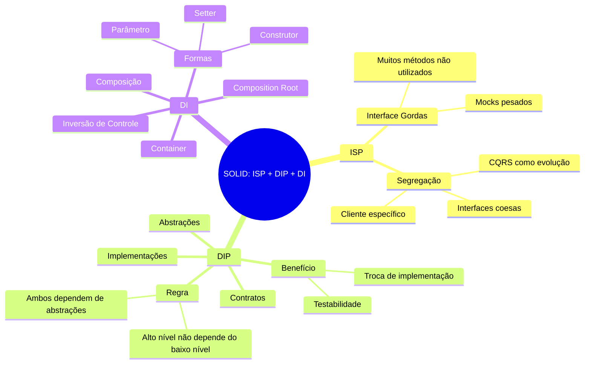
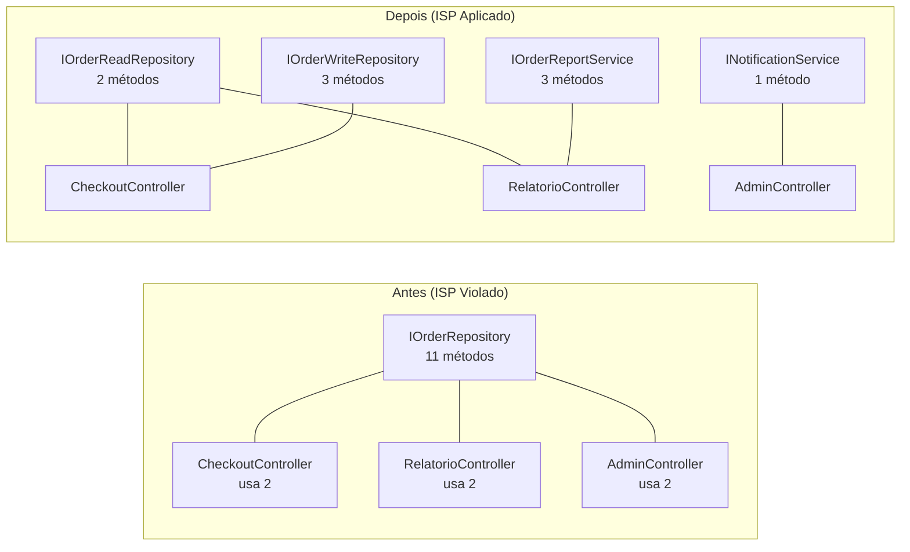
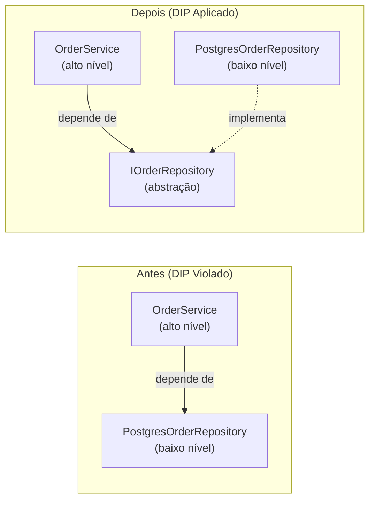
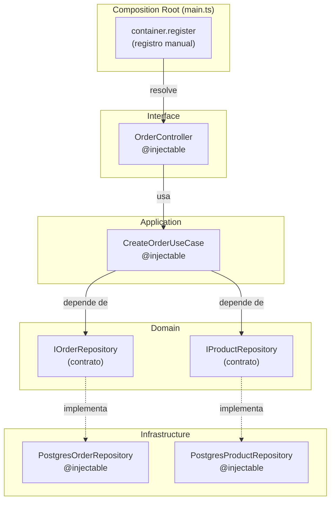

# Engenharia de Software — Aula 05

## SOLID: Interface Segregation, Dependency Inversion e Injeção de Dependência

**Duração estimada:** 100 minutos (45 leitura + 55 prática)
**Nível:** Intermediário
**Pré-requisitos:** Introdução ao Projeto (Aula 01), Clean Code (Aula 02), Refactoring (Aula 03), SOLID — SRP/OCP/LSP (Aula 04)

---

## Objetivos de Aprendizagem

Ao concluir esta aula, você será capaz de:

- [ ] **Explicar** o princípio ISP (Interface Segregation Principle) e por que interfaces "gordas" violam o desacoplamento
- [ ] **Identificar** sinais de interfaces inchadas que forçam implementações a depender de métodos que não usam
- [ ] **Aplicar** ISP para segregar interfaces grandes em contratos coesos e específicos
- [ ] **Explicar** o princípio DIP (Dependency Inversion Principle) e por que depender de implementações concretas acopla o sistema
- [ ] **Distinguir** abstrações (interfaces/contratos) de implementações concretas em um design orientado a DIP
- [ ] **Implementar** injeção de dependência com tsyringe usando decorators `@injectable()` e `@inject()`
- [ ] **Configurar** o Composition Root como o ponto único de registro e resolução de dependências
- [ ] **Diferenciar** Dependency Inversion (princípio) de Dependency Injection (padrão de implementação)
- [ ] **Refatorar** código acoplado onde classes instanciam suas dependências diretamente para um design com injeção
- [ ] **Testar** serviços de negócio usando mocks de interfaces, sem depender de infraestrutura real

---

## Como Usar Esta Aula

Esta aula está dividida em duas grandes partes. A **primeira parte** (Fundamentos) constrói a base conceitual do ISP, DIP e Inversão de Controle — sem nomes de ferramentas ou bibliotecas. A **segunda parte** (Aplicação) conecta esses conceitos à prática com TypeScript e o contêiner de injeção tsyringe no projeto de e-commerce.

Ao longo do caminho, você encontrará seções **"Mão na Massa"** (para codificar junto) e **"Quick Check"** (para verificar se entendeu antes de avançar). Ao final, o arquivo separado **Questões de Aprendizagem** traz as tarefas de checkpoint.

**Tempo estimado:** 45 minutos de leitura + 55 minutos de prática.

---

## Mapa Mental

Este diagrama mostra todos os conceitos que você vai dominar nesta aula:




---

## Recapitulação das Aulas 01-04

Antes de mergulhar nos dois últimos princípios do SOLID, vejamos como as aulas anteriores constroem a base.

| Aula | Conceito | Conexão com ISP/DIP |
|---|---|---|
| **01 — Introdução + Projeto Progressivo** | Setup do repositório, Express + TypeScript, estrutura inicial | O projeto de e-commerce que vamos tratar com ISP e DIP nasce aqui — código funcional mas acoplado, pronto para ser desacoplado |
| **02 — Clean Code** | Nomes significativos, funções pequenas, DRY, KISS, YAGNI | Código limpo revela responsabilidades que ajudam a segregar interfaces e identificar dependências |
| **03 — Refactoring** | Catálogo de refatorações, code smells, ESLint como segurança | Refatorar para ISP e DIP usa Extract Interface, Extract Class e Move Method — todos do catálogo |
| **04 — SOLID (SRP, OCP, LSP)** | Responsabilidade única, extensão sem modificação, substituibilidade | ISP é SRP aplicado a interfaces; DIP é o mecanismo que viabiliza OCP na prática |

A linha que conecta as quatro aulas: **código legível → identificação de problemas → primeiros princípios SOLID → base concreta para aplicar ISP e DIP**.

---

**FUNDAMENTOS: Os Dois Últimos Princípios SOLID e a Inversão de Controle**

> *Os conceitos desta seção são universais — valem para qualquer linguagem, framework ou container de DI. Entenda primeiro o "por quê" e o "o quê"; o "como" com ferramentas específicas vem na segunda parte.*

---

## 1. ISP — Interface Segregation Principle

### O Problema da Interface Gordurenta

Imagine uma interface de repositório de pedidos que cresceu organicamente ao longo do projeto:

```typescript
// Interface gorda — viola ISP
interface IOrderRepository {
  // Operações básicas de CRUD
  findById(id: string): Promise<Order | null>;
  findAll(): Promise<Order[]>;
  create(order: Order): Promise<void>;
  update(order: Order): Promise<void>;
  delete(id: string): Promise<void>;

  // Relatórios e consultas específicas
  findByCustomer(customerId: string): Promise<Order[]>;
  findByStatus(status: OrderStatus): Promise<Order[]>;
  countByStatus(status: OrderStatus): Promise<number>;
  getTotalRevenue(startDate: Date, endDate: Date): Promise<Money>;

  // Operações administrativas
  exportCSV(filter: OrderFilter): Promise<string>;
  generateInvoice(orderId: string): Promise<Invoice>;
  sendEmailNotification(orderId: string): Promise<void>;
}
```

Pare familiar? Esta interface tem **11 métodos**. Agora considere dois clientes diferentes:

- **CheckoutController**: só precisa de `findById` e `create`
- **RelatorioController**: só precisa de `getTotalRevenue` e `exportCSV`
- **AdminController**: só precisa de `generateInvoice` e `sendEmailNotification`

Cada um desses controllers, ao depender de `IOrderRepository`, herda a obrigação de conhecer **todos os 11 métodos**. Para testar o `CheckoutController`, você precisaria mockar 11 métodos — mesmo usando apenas 2.

> *"Clientes não devem ser forçados a depender de interfaces que não usam."* — Robert C. Martin

### A Solução: Interfaces Coesas e Específicas

O ISP diz: **segregue** a interface grande em interfaces menores, cada uma com um propósito coeso.

```typescript
// Cada interface tem UMA responsabilidade

// Apenas leitura de pedidos
interface IOrderReadRepository {
  findById(id: string): Promise<Order | null>;
  findByCustomer(customerId: string): Promise<Order[]>;
}

// Apenas escrita de pedidos
interface IOrderWriteRepository {
  create(order: Order): Promise<void>;
  update(order: Order): Promise<void>;
  delete(id: string): Promise<void>;
}

// Relatórios — responsabilidade separada
interface IOrderReportService {
  getTotalRevenue(startDate: Date, endDate: Date): Promise<Money>;
  exportCSV(filter: OrderFilter): Promise<string>;
  countByStatus(status: OrderStatus): Promise<number>;
}

// Notificações — outro domínio
interface INotificationService {
  sendEmailNotification(orderId: string): Promise<void>;
}
```



Agora cada controller depende **apenas** do que precisa:

```typescript
// CheckoutController — depende só de leitura e escrita
class CheckoutController {
  constructor(
    private readonly readRepo: IOrderReadRepository,
    private readonly writeRepo: IOrderWriteRepository
  ) {}
}

// RelatorioController — depende só de relatórios
class RelatorioController {
  constructor(
    private readonly reportService: IOrderReportService
  ) {}
}
```

### Benefícios Imediatos do ISP

1. **Mocks enxutos** — mockar 2 métodos em vez de 11
2. **Acoplamento reduzido** — mudar `exportCSV` não afeta quem só usa `findById`
3. **Coesão aumentada** — cada interface tem um propósito claro
4. **Implementações mais simples** — uma classe pode implementar várias interfaces pequenas

### Como Reconhecer uma Interface Gorda

Faça estas perguntas para cada interface no seu código:

- Esta interface tem métodos que **não são usados** por algum cliente?
- Os métodos poderiam ser agrupados em **categorias com propósito único**?
- Um mock desta interface exige implementar **métodos irrelevantes** para o teste?
- A descrição da interface usa "e" ou "ou"? (ex: "lida com pedidos **e** relatórios")

Se qualquer resposta for "sim", o ISP está pedindo para ser aplicado.

### Quick Check

**1. Qual o principal sintoma de uma interface que viola o ISP?**
**Resposta:** Clientes que dependem dela precisam conhecer (e mockar) métodos que não usam. Uma interface com 11 métodos usados por controllers diferentes — cada controller só usa 2 ou 3 — é sinal clássico de violação de ISP.

**2. Por que interfaces segregadas facilitam os testes unitários?**
**Resposta:** Porque cada mock se torna enxuto — você só precisa implementar os métodos que aquele cliente realmente usa. Com uma interface gorda de 11 métodos, o teste de um controller que usa 2 deles ainda precisa mockar os 9 restantes. Com interfaces segregadas, cada mock tem exatamente os métodos necessários.

---

## 2. DIP — Dependency Inversion Principle

### O Princípio Mais Importante do SOLID

Robert C. Martin considera o DIP o princípio mais poderoso do SOLID — e com razão. Ele é o motor que viabiliza arquiteturas desacopladas, testáveis e flexíveis.

> *"Módulos de alto nível não devem depender de módulos de baixo nível. Ambos devem depender de abstrações."*
> *"Abstrações não devem depender de detalhes. Detalhes devem depender de abstrações."*

### O Problema: Dependência Direta de Implementações

Considere o código típico antes do DIP:

```typescript
// OrderService — versão acoplada (viola DIP)
import { PostgresOrderRepository } from '../repositories/PostgresOrderRepository';
import { CorreiosShippingProvider } from '../providers/CorreiosShippingProvider';
import { PagarmePaymentGateway } from '../gateways/PagarmePaymentGateway';

class OrderService {
  private orderRepo = new PostgresOrderRepository();
  private shippingProvider = new CorreiosShippingProvider();
  private paymentGateway = new PagarmePaymentGateway();

  async createOrder(data: CreateOrderDTO): Promise<Order> {
    // Lógica de negócio...
    const order = await this.orderRepo.save(new Order(data));
    const shipping = await this.shippingProvider.calculate(order);
    const payment = await this.paymentGateway.charge(order.total);
    return order;
  }
}
```

O que há de errado aqui?

1. **`OrderService` (alto nível)** depende diretamente de **`PostgresOrderRepository` (baixo nível)**
2. Para testar `OrderService`, você precisa de PostgreSQL rodando
3. Trocar PostgreSQL por MongoDB exige alterar `OrderService`
4. Trocar a transportadora exige alterar `OrderService`

A seta da dependência aponta **para baixo** — do alto nível para o baixo nível. O DIP diz: **inverta essa seta**.

### A Solução: Dependa de Abstrações

```typescript
// Ambos dependem de abstrações

// Contrato (abstração) — definido no domínio
interface IOrderRepository {
  findById(id: string): Promise<Order | null>;
  save(order: Order): Promise<void>;
  update(order: Order): Promise<void>;
}

// Implementação concreta (baixo nível) — na infraestrutura
class PostgresOrderRepository implements IOrderRepository {
  constructor(private db: Pool) {}
  async findById(id: string): Promise<Order | null> { /* SQL */ }
  async save(order: Order): Promise<void> { /* SQL */ }
  async update(order: Order): Promise<void> { /* SQL */ }
}

// Serviço (alto nível) — na camada de aplicação
class OrderService {
  constructor(
    private readonly orderRepo: IOrderRepository  // ← Abstração!
  ) {}

  async createOrder(data: CreateOrderDTO): Promise<Order> {
    const order = new Order(data);
    return this.orderRepo.save(order);
  }
}
```



Observe a transformação:

- **Antes**: `OrderService` → `PostgresOrderRepository` (seta para baixo)
- **Depois**: `OrderService` → `IOrderRepository` ← `PostgresOrderRepository` (ambos apontam para a abstração)

A **direção da dependência foi invertida**. `OrderService` já não sabe que `PostgresOrderRepository` existe. Ele só conhece `IOrderRepository`.

### Benefícios Imediatos do DIP

1. **Testabilidade total** — testar `OrderService` não exige banco de dados:

```typescript
// Teste limpo — sem PostgreSQL, sem gateway real
const mockRepo: IOrderRepository = {
  findById: jest.fn().mockResolvedValue(null),
  save: jest.fn().mockResolvedValue(undefined),
  update: jest.fn().mockResolvedValue(undefined),
};

const service = new OrderService(mockRepo);
const order = await service.createOrder(mockDTO);
expect(order.status).toBe(OrderStatus.PENDING);
```

2. **Substituibilidade** — trocar de banco ou provedor sem alterar a lógica de negócio:

```typescript
// No Composition Root (único lugar que muda)
container.register('IOrderRepository', PostgresOrderRepository);
// Para trocar:
// container.register('IOrderRepository', MongoOrderRepository);
```

3. **Isolamento do domínio** — a lógica de negócio (`OrderService`) fica pura, sem importações de infraestrutura.

### Analogia: O Protocolo HTTP

Pense no DIP como o protocolo HTTP. Seu navegador (cliente de alto nível) não depende de um servidor específico (baixo nível) — ele depende do **protocolo HTTP** (abstração). Qualquer servidor que implemente HTTP pode atender. Você troca de servidor (Apache → Nginx) sem modificar o navegador.

Da mesma forma, seu `OrderService` não deve depender de `PostgresOrderRepository` — deve depender de `IOrderRepository`. Qualquer implementação que respeite o contrato pode ser usada.

### O Padrão: Inversão de Controle (IoC)

O DIP cria uma situação interessante: quem **cria** as dependências? O `OrderService` não faz `new PostgresOrderRepository()` — então quem faz?

Essa responsabilidade é transferida para **fora** da classe. O controle de criação é **invertido**: em vez de a classe controlar suas dependências, algo externo as fornece. Isso se chama **Inversão de Controle** (IoC), e o padrão mais comum para implementá-la é a **Injeção de Dependência** (DI).

### Quick Check

**3. Qual a diferença entre uma dependência concreta e uma abstração no contexto do DIP?**
**Resposta:** Dependência concreta é uma classe específica com implementação (ex: `PostgresOrderRepository`). Abstração é um contrato/interface (ex: `IOrderRepository`). O DIP diz que módulos de alto nível devem depender da abstração, não da concreta. Isso permite trocar implementações sem alterar o cliente.

**4. Por que o DIP é considerado o princípio mais importante do SOLID?**
**Resposta:** Porque ele viabiliza todos os outros. OCP exige extensão sem modificação — DIP permite injetar novas implementações. SRP separa responsabilidades — DIP conecta essas responsabilidades via contratos. Testabilidade, substituibilidade e isolamento do domínio dependem de depender de abstrações, não de concretas.

---

## 3. Inversão de Controle e Injeção de Dependência

### O Padrão que Torna o DIP Praticável

O DIP define **o quê** fazer (depender de abstrações). A Inversão de Controle (IoC) define **quem** faz (não a classe — algo externo). E a Injeção de Dependência (DI) define **como** fazer (passar as dependências prontas).

Vamos entender cada um:

### Inversão de Controle (IoC)

No código procedural tradicional, o fluxo de controle é determinado pelo programador: a classe A chama a classe B, que chama a classe C. Com IoC, o **controle é invertido**: um framework ou contêiner chama seu código, injetando o que ele precisa.

A diferença prática:

```typescript
// Sem IoC: a classe controla a criação
class OrderService {
  private repo = new PostgresOrderRepository(); // OrderService decide
}

// Com IoC: algo externo fornece a dependência
class OrderService {
  constructor(private repo: IOrderRepository) {} // Alguém fornece
}
```

### Injeção de Dependência (DI)

É o padrão de implementação do IoC. Existem três formas principais:

**1. Injeção por Construtor** (a mais comum e recomendada):

```typescript
class OrderService {
  constructor(
    private readonly orderRepo: IOrderRepository,
    private readonly shippingProvider: IShippingProvider,
    private readonly paymentGateway: IPaymentGateway
  ) {}
}
```

**2. Injeção por Setter** (útil para dependências opcionais):

```typescript
class OrderService {
  setShippingProvider(provider: IShippingProvider) {
    this.shippingProvider = provider;
  }
}
```

**3. Injeção por Parâmetro de Método** (rara, para contextos específicos):

```typescript
class OrderService {
  async calculateShipping(order: Order, provider: IShippingProvider) {
    return provider.calculate(order);
  }
}
```

### Container de DI

Gerenciar manualmente as dependências de dezenas de classes é trabalhoso. Um **container de DI** automatiza isso: você registra "para esta abstração, use esta implementação", e o container resolve automaticamente a cadeia inteira.

```typescript
// Registro no container
container.register('IOrderRepository', PostgresOrderRepository);
container.register('IShippingProvider', CorreiosShippingProvider);

// Resolução automática — container constrói OrderService com todas as dependências
const service = container.resolve(OrderService);
```

### Por que Separar o Container da Lógica de Negócio?

O container de DI é um **detalhe de infraestrutura**. A decisão de qual implementação usar para cada abstração deve estar **na borda do sistema** — no que chamamos de **Composition Root**. A lógica de negócio não deve saber que existe um container.

Essa separação é o que torna o design verdadeiramente flexível: você pode trocar o container (tsyringe, InversifyJS, Awilix) sem alterar uma linha de código de negócio.

### Quick Check

**5. Qual a diferença entre Inversão de Controle (IoC) e Injeção de Dependência (DI)?**
**Resposta:** IoC é o princípio mais amplo — transferir o controle de criação/fluxo para algo externo. DI é um padrão específico para implementar IoC — fornecer as dependências prontas para a classe, em vez de ela mesma criá-las. DI é uma forma de IoC.

**6. Por que o container de DI não deve ser usado dentro das classes de negócio?**
**Resposta:** Porque isso reintroduziria o acoplamento que o DIP elimina. Se uma classe de negócio importa e chama o container, ela depende de uma biblioteca específica de DI. O container deve ser usado apenas no Composition Root (borda do sistema). As classes de negócio recebem suas dependências por injeção — não sabem de onde vêm.

---

**APLICAÇÃO: ISP, DIP e tsyringe no Projeto**

> *Agora que você entende os fundamentos do ISP, DIP e IoC, vamos conectá-los à prática com TypeScript e o contêiner tsyringe. As interfaces segregadas e a inversão de dependência que você aprendeu teoricamente vão se materializar em código real no projeto de e-commerce.*

---

## 4. Segregando Interfaces no Projeto

Vamos aplicar o ISP ao repositório de pedidos do e-commerce. Começamos com a interface gorda e a segregamos em contratos coesos.

### Antes: Interface Monolítica

```typescript
// infrastructure/repositories/IOrderRepository.ts — ANTES
// Esta interface viola ISP: 8 métodos para responsabilidades diferentes
export interface IOrderRepository {
  findById(id: string): Promise<Order | null>;
  findAll(filters?: OrderFilters): Promise<Order[]>;
  save(order: Order): Promise<void>;
  update(order: Order): Promise<void>;
  delete(id: string): Promise<void>;
  findByCustomer(customerId: string): Promise<Order[]>;
  countByStatus(status: OrderStatus): Promise<number>;
  findPendingOrders(since: Date): Promise<Order[]>;
}
```

### Depois: Interfaces Segregadas

```typescript
// domain/repositories/IOrderRepository.ts — DEPOIS
// Responsabilidade: operações básicas de pedido
export interface IOrderRepository {
  findById(id: string): Promise<Order | null>;
  save(order: Order): Promise<void>;
  update(order: Order): Promise<void>;
  delete(id: string): Promise<void>;
}
```

```typescript
// domain/repositories/IOrderQueryRepository.ts — DEPOIS
// Responsabilidade: consultas específicas e buscas
export interface IOrderQueryRepository {
  findAll(filters?: OrderFilters): Promise<Order[]>;
  findByCustomer(customerId: string): Promise<Order[]>;
  countByStatus(status: OrderStatus): Promise<number>;
  findPendingOrders(since: Date): Promise<Order[]>;
}
```

Note que **ambas as interfaces estão no domínio** (`domain/repositories/`). Elas são contratos que o domínio define. A implementação concreta (que unifica as duas) fica na infraestrutura:

```typescript
// infrastructure/repositories/PostgresOrderRepository.ts
import { IOrderRepository } from '../../domain/repositories/IOrderRepository';
import { IOrderQueryRepository } from '../../domain/repositories/IOrderQueryRepository';

export class PostgresOrderRepository
  implements IOrderRepository, IOrderQueryRepository {
  // Implementa todos os métodos das duas interfaces
  async findById(id: string): Promise<Order | null> { /* SQL */ }
  async save(order: Order): Promise<void> { /* SQL */ }
  async findAll(filters?: OrderFilters): Promise<Order[]> { /* SQL */ }
  async findByCustomer(customerId: string): Promise<Order[]> { /* SQL */ }
  // ... demais métodos
}
```

Agora cada service depende **apenas** da interface que precisa:

```typescript
// CheckoutService — só precisa escrever pedidos
class CheckoutService {
  constructor(private readonly orderRepo: IOrderRepository) {}
}

// DashboardService — só precisa consultar
class DashboardService {
  constructor(private readonly queryRepo: IOrderQueryRepository) {}
}
```

### Mão na Massa — Segregando IProductRepository

Seguindo o mesmo padrão, vamos segregar o repositório de produtos:

```typescript
// domain/repositories/IProductRepository.ts
export interface IProductRepository {
  findById(id: string): Promise<Product | null>;
  save(product: Product): Promise<void>;
  update(product: Product): Promise<void>;
}

// domain/repositories/IProductQueryRepository.ts
export interface IProductQueryRepository {
  findByCategory(categoryId: string): Promise<Product[]>;
  search(query: string): Promise<Product[]>;
  findByPriceRange(min: number, max: number): Promise<Product[]>;
}
```

**Verificação:** O `CreateOrderUseCase` precisa de `findById` (do `IProductRepository`) e `save` + `update` (do `IOrderRepository`). O `CatalogController` precisa de `findByCategory` e `search` (do `IProductQueryRepository`). Cada um recebe exatamente o que precisa.

---

## 5. Inversão de Dependência com tsyringe

Agora vamos implementar o DIP na prática com **tsyringe** — um contêiner de injeção de dependência leve e TypeScript-friendly, mantido pela Microsoft.

### Instalação

```bash
npm install tsyringe reflect-metadata
```

`reflect-metadata` é necessário para que os decorators do TypeScript funcionem com a API de reflection que o tsyringe usa internamente.

### Configuração do tsconfig.json

O tsyringe depende de decorators experimentais do TypeScript:

```json
{
  "compilerOptions": {
    "experimentalDecorators": true,
    "emitDecoratorMetadata": true,
    "target": "ES2020",
    "module": "commonjs",
    "strict": true
  }
}
```

### Importação Global do reflect-metadata

No ponto de entrada da aplicação (`main.ts` ou `index.ts`), importe `reflect-metadata` antes de qualquer outra coisa:

```typescript
// main.ts — PRIMEIRA linha
import 'reflect-metadata';
```

### Registrando Implementações no Container

O container do tsyringe é um dicionário que mapeia abstrações para implementações concretas:

```typescript
import { container } from 'tsyringe';
import { IOrderRepository } from './domain/repositories/IOrderRepository';
import { IProductRepository } from './domain/repositories/IProductRepository';
import { PostgresOrderRepository } from './infrastructure/repositories/PostgresOrderRepository';
import { PostgresProductRepository } from './infrastructure/repositories/PostgresProductRepository';

// Registro: "para esta abstração, use esta implementação concreta"
container.registerSingleton<IOrderRepository>(
  'IOrderRepository',
  PostgresOrderRepository
);

container.registerSingleton<IProductRepository>(
  'IProductRepository',
  PostgresProductRepository
);
```

### @injectable() e @inject()

Toda classe que será gerenciada pelo container precisa do decorator `@injectable()`. Para indicar qual implementação usar para uma abstração, use `@inject(token)`:

```typescript
import { injectable, inject } from 'tsyringe';

@injectable()
export class CreateOrderUseCase {
  constructor(
    @inject('IOrderRepository')
    private readonly orderRepo: IOrderRepository,

    @inject('IProductRepository')
    private readonly productRepo: IProductRepository
  ) {}

  async execute(dto: CreateOrderDTO): Promise<Order> {
    const product = await this.productRepo.findById(dto.productId);
    if (!product) throw new Error('Product not found');

    const order = new Order(uuid(), dto.customerId, [dto.productId], product.price, new Date());
    await this.orderRepo.save(order);
    return order;
  }
}
```

```typescript
@injectable()
export class OrderController {
  constructor(
    @inject(CreateOrderUseCase)
    private readonly createOrder: CreateOrderUseCase
  ) {}

  async create(req: Request, res: Response): Promise<void> {
    const order = await this.createOrder.execute(req.body);
    res.status(201).json(order);
  }
}
```

### Resolvendo o Grafo de Dependências

O container resolve automaticamente toda a cadeia:

```typescript
const controller = container.resolve(OrderController);
// tsyringe vê que OrderController precisa de CreateOrderUseCase,
// que precisa de IOrderRepository e IProductRepository,
// que estão registrados como PostgresOrderRepository e PostgresProductRepository
// O container instancia tudo na ordem correta
```

### Ciclos de Vida (Scopes)

O tsyringe oferece dois ciclos de vida principais:

| Escopo | Comportamento | Quando usar |
|---|---|---|
| `registerSingleton` | Uma única instância para toda a aplicação | Repositórios, serviços stateless, conexões de banco |
| `registerTransient` | Nova instância a cada resolução | Controllers (se quiser estado por requisição), VOs |

```typescript
// Singleton — uma instância, reutilizada sempre
container.registerSingleton('IOrderRepository', PostgresOrderRepository);

// Transient — nova instância a cada container.resolve()
container.registerTransient('IEmailService', SmtpEmailService);
```

### Quick Check

**7. Qual a função do decorator `@injectable()` no tsyringe?**
**Resposta:** Ele marca a classe como gerenciável pelo container — o tsyringe pode analisar seus metadados de construtor para resolver automaticamente as dependências. Sem `@injectable()`, o container não consegue instanciar a classe.

**8. O que acontece se uma dependência registrada no container for resolvida mas não tiver `@injectable()`?**
**Resposta:** O tsyringe lançará um erro informando que a classe não é registrada ou não tem o decorator `@injectable()`. O decorator é obrigatório para que o container possa inspecionar os parâmetros do construtor e resolver as dependências automaticamente.

---

## 6. Composition Root — O Ponto Único de Conexão

O Composition Root é o **único lugar no sistema** onde as implementações concretas são conhecidas e registradas. Depois dele, nenhuma classe faz `new` de dependências — tudo é injetado.

### O Arquivo main.ts Completo

```typescript
// main.ts — Composition Root do e-commerce
import 'reflect-metadata';
import express from 'express';
import { container } from 'tsyringe';
import { Pool } from 'pg';

// ==========================================
// 1. Registro de dependências
// ==========================================

// Camada de infraestrutura
import { PostgresOrderRepository } from './infrastructure/repositories/PostgresOrderRepository';
import { PostgresProductRepository } from './infrastructure/repositories/PostgresProductRepository';
import { CorreiosShippingProvider } from './infrastructure/providers/CorreiosShippingProvider';
import { PagarmePaymentGateway } from './infrastructure/gateways/PagarmePaymentGateway';

// Interfaces do domínio
import { IOrderRepository } from './domain/repositories/IOrderRepository';
import { IProductRepository } from './domain/repositories/IProductRepository';
import { IShippingProvider } from './domain/services/IShippingProvider';
import { IPaymentGateway } from './domain/services/IPaymentGateway';

// Repositórios
container.registerSingleton<IOrderRepository>('IOrderRepository', PostgresOrderRepository);
container.registerSingleton<IProductRepository>('IProductRepository', PostgresProductRepository);

// Serviços externos
container.registerSingleton<IShippingProvider>('IShippingProvider', CorreiosShippingProvider);
container.registerSingleton<IPaymentGateway>('IPaymentGateway', PagarmePaymentGateway);

// Pool de conexão — instância concreta
const pool = new Pool({ connectionString: process.env.DATABASE_URL });
container.registerInstance(Pool, pool);

// ==========================================
// 2. Inicialização do servidor
// ==========================================

import { OrderController } from './interface/controllers/OrderController';

const app = express();
app.use(express.json());

// Resolve o controller — tsyringe constrói toda a árvore de dependências
const orderController = container.resolve(OrderController);

app.post('/orders', (req, res) => orderController.create(req, res));
app.get('/orders/:id', (req, res) => orderController.findById(req, res));

app.listen(3000, () => {
  console.log('E-commerce API running on port 3000');
});
```

### Diagrama de Dependências



### Por que o Composition Root é Importante?

1. **Mudança localizada** — para trocar PostgreSQL por MongoDB, você altera **uma linha** no Composition Root
2. **Visibilidade do grafo** — dá para ver, em um só lugar, todas as dependências do sistema
3. **Zero vazamento de infraestrutura** — nenhuma classe importa implementação concreta
4. **Configurável por ambiente** — você pode ter Composition Roots diferentes para dev, test e produção

### Mão na Massa — Seu Primeiro Composition Root

1. Crie ou modifique `src/main.ts` no seu projeto
2. Adicione `import 'reflect-metadata'` como primeira linha
3. Importe o container: `import { container } from 'tsyringe'`
4. Registre `IOrderRepository` → `PostgresOrderRepository`
5. Registre `IProductRepository` → `PostgresProductRepository`
6. Resolva `OrderController` e use nas rotas do Express
7. Execute `npm start` e verifique se o servidor sobe sem erros

**Verificação:** Se o servidor subir na porta 3000 e responder a `POST /orders`, a injeção de dependência está funcionando.

---

## Autoavaliação: Quiz Rápido

**1. O ISP (Interface Segregation Principle) diz que:**
**Resposta:** Clientes não devem ser forçados a depender de interfaces que não usam. Interfaces devem ser coesas e específicas para cada cliente.

**2. Qual o principal sintoma de violação do ISP?**
**Resposta:** Uma interface com muitos métodos onde diferentes clientes usam subconjuntos diferentes. Cada cliente precisa conhecer e mockar métodos que não utiliza.

**3. O DIP (Dependency Inversion Principle) afirma que:**
**Resposta:** Módulos de alto nível não devem depender de módulos de baixo nível. Ambos devem depender de abstrações. Abstrações não devem depender de detalhes; detalhes devem depender de abstrações.

**4. Qual a diferença prática entre depender de `PostgresOrderRepository` e depender de `IOrderRepository`?**
**Resposta:** Depender de `PostgresOrderRepository` acopla o cliente ao PostgreSQL — testar exige banco real, trocar de banco exige alterar o cliente. Depender de `IOrderRepository` (abstração) permite trocar implementações e testar com mocks sem alterar o cliente.

**5. O que é Inversão de Controle (IoC)?**
**Resposta:** É o princípio de transferir o controle de criação e fluxo da própria classe para um orquestrador externo. A classe não cria suas dependências — algo externo as fornece.

**6. Qual a função do decorator `@inject()` no tsyringe?**
**Resposta:** Ele indica ao container qual implementação concreta deve ser injetada para um determinado parâmetro do construtor. O argumento de `@inject()` é o token usado no registro (ex: `'IOrderRepository'`).

**7. Por que o Composition Root deve estar na borda do sistema?**
**Resposta:** Porque ele é o ponto onde abstrações são ligadas a implementações concretas — um detalhe de infraestrutura. Se estiver dentro do domínio ou da aplicação, essas camadas passariam a conhecer implementações concretas, violando o DIP. Manter o Composition Root na borda (main.ts) isola o resto do sistema dessa decisão.

---

## Mão na Massa: Exercícios Graduados

**Exercício 1 (Fácil) — Identifique Violações de ISP**

Analise a interface abaixo e identifique quais métodos violam o ISP para os clientes listados.

```typescript
interface IUserService {
  findById(id: string): Promise<User | null>;
  create(data: CreateUserDTO): Promise<User>;
  update(id: string, data: UpdateUserDTO): Promise<User>;
  delete(id: string): Promise<void>;
  changePassword(id: string, oldPwd: string, newPwd: string): Promise<void>;
  sendWelcomeEmail(userId: string): Promise<void>;
  generatePasswordResetToken(email: string): Promise<string>;
  validatePasswordResetToken(token: string): Promise<boolean>;
  getLoginHistory(userId: string, days: number): Promise<LoginEntry[]>;
  exportUsersCSV(): Promise<string>;
}
```

**Clientes:**
- `ProfileController`: `findById`, `update`, `changePassword`
- `AdminController`: `findById`, `create`, `delete`, `exportUsersCSV`
- `AuthService`: `findById`, `generatePasswordResetToken`, `validatePasswordResetToken`
- `EmailService`: `sendWelcomeEmail`
- `AuditService`: `getLoginHistory`

**Gabarito:**

Segregue em interfaces menores:

```typescript
interface IUserReadRepository {
  findById(id: string): Promise<User | null>;
}

interface IUserWriteRepository {
  create(data: CreateUserDTO): Promise<User>;
  update(id: string, data: UpdateUserDTO): Promise<User>;
  delete(id: string): Promise<void>;
}

interface IUserPasswordManagement {
  changePassword(id: string, oldPwd: string, newPwd: string): Promise<void>;
  generatePasswordResetToken(email: string): Promise<string>;
  validatePasswordResetToken(token: string): Promise<boolean>;
}

interface INotificationService {
  sendWelcomeEmail(userId: string): Promise<void>;
}

interface IAuditService {
  getLoginHistory(userId: string, days: number): Promise<LoginEntry[]>;
}

interface IAdminService {
  exportUsersCSV(): Promise<string>;
}
```

Cada cliente agora depende apenas da interface que precisa. `ProfileController` depende de `IUserReadRepository`, `IUserWriteRepository` e `IUserPasswordManagement`. `EmailService` depende apenas de `INotificationService`.

---

**Exercício 2 (Médio) — Refatore para DIP**

O código abaixo viola o DIP. Refatore-o para depender de abstrações.

```typescript
// ANTES — viola DIP
import { Pool } from 'pg';
import { createTransport } from 'nodemailer';

export class UserService {
  private db = new Pool({ connectionString: process.env.DB_URL });
  private mailer = createTransport({ host: process.env.SMTP_HOST });

  async createUser(data: CreateUserDTO): Promise<User> {
    const result = await this.db.query(
      'INSERT INTO users (name, email) VALUES ($1, $2) RETURNING *',
      [data.name, data.email]
    );
    const user = result.rows[0];

    await this.mailer.sendMail({
      to: user.email,
      subject: 'Welcome',
      text: 'Account created',
    });

    return user;
  }
}
```

**Gabarito:**

```typescript
// domain/repositories/IUserRepository.ts
export interface IUserRepository {
  create(data: CreateUserDTO): Promise<User>;
}

// domain/services/IEmailService.ts
export interface IEmailService {
  sendWelcomeEmail(to: string): Promise<void>;
}

// application/use-cases/CreateUserUseCase.ts — DEPOIS (DIP aplicado)
import { injectable, inject } from 'tsyringe';
import { IUserRepository } from '../../domain/repositories/IUserRepository';
import { IEmailService } from '../../domain/services/IEmailService';

@injectable()
export class CreateUserUseCase {
  constructor(
    @inject('IUserRepository')
    private readonly userRepo: IUserRepository,
    @inject('IEmailService')
    private readonly emailService: IEmailService
  ) {}

  async execute(data: CreateUserDTO): Promise<User> {
    const user = await this.userRepo.create(data);
    await this.emailService.sendWelcomeEmail(user.email);
    return user;
  }
}
```

```typescript
// infrastructure/repositories/PostgresUserRepository.ts
import { Pool } from 'pg';
import { IUserRepository } from '../../domain/repositories/IUserRepository';

export class PostgresUserRepository implements IUserRepository {
  constructor(private readonly db: Pool) {}

  async create(data: CreateUserDTO): Promise<User> {
    const result = await this.db.query(
      'INSERT INTO users (name, email) VALUES ($1, $2) RETURNING *',
      [data.name, data.email]
    );
    return result.rows[0];
  }
}
```

```typescript
// infrastructure/services/SmtpEmailService.ts
import { createTransport } from 'nodemailer';
import { IEmailService } from '../../domain/services/IEmailService';

export class SmtpEmailService implements IEmailService {
  private mailer = createTransport({ host: process.env.SMTP_HOST });

  async sendWelcomeEmail(to: string): Promise<void> {
    await this.mailer.sendMail({
      to,
      subject: 'Welcome',
      text: 'Account created',
    });
  }
}
```

```typescript
// main.ts — Composition Root com os novos registros
import 'reflect-metadata';
import { container } from 'tsyringe';

container.registerSingleton<IUserRepository>('IUserRepository', PostgresUserRepository);
container.registerSingleton<IEmailService>('IEmailService', SmtpEmailService);
```

O `CreateUserUseCase` agora depende apenas de abstrações. Testá-lo exige apenas mocks do `IUserRepository` e `IEmailService` — sem banco, sem SMTP.

---

**Exercício 3 (Difícil) — Implemente um Use Case com DI Completa**

Implemente o `CancelOrderUseCase` seguindo DIP + ISP, com tsyringe. O Use Case deve:

1. Receber `CancelOrderDTO` com `orderId`
2. Usar `IOrderRepository` para buscar o pedido
3. Validar que o pedido existe
4. Chamar `order.cancel()` (método que muda status e valida regras)
5. Salvar a alteração
6. Retornar o pedido cancelado

Além disso, atualize o `OrderController` e o `main.ts` para incluir a rota `DELETE /orders/:id`.

**Gabarito:**

```typescript
// application/use-cases/CancelOrderUseCase.ts
import { injectable, inject } from 'tsyringe';
import { IOrderRepository } from '../../domain/repositories/IOrderRepository';
import { Order } from '../../domain/entities/Order';

export interface CancelOrderDTO {
  orderId: string;
}

@injectable()
export class CancelOrderUseCase {
  constructor(
    @inject('IOrderRepository')
    private readonly orderRepo: IOrderRepository
  ) {}

  async execute(dto: CancelOrderDTO): Promise<Order> {
    const order = await this.orderRepo.findById(dto.orderId);
    if (!order) {
      throw new Error(`Order ${dto.orderId} not found`);
    }
    order.cancel(); // Regra de negócio: valida se pode cancelar
    await this.orderRepo.update(order);
    return order;
  }
}
```

```typescript
// interface/controllers/OrderController.ts — atualizado
import { Request, Response } from 'express';
import { injectable, inject } from 'tsyringe';
import { CreateOrderUseCase } from '../../application/use-cases/CreateOrderUseCase';
import { CancelOrderUseCase } from '../../application/use-cases/CancelOrderUseCase';

@injectable()
export class OrderController {
  constructor(
    @inject(CreateOrderUseCase)
    private readonly createOrder: CreateOrderUseCase,
    @inject(CancelOrderUseCase)
    private readonly cancelOrder: CancelOrderUseCase
  ) {}

  async create(req: Request, res: Response): Promise<void> {
    const order = await this.createOrder.execute(req.body);
    res.status(201).json(order);
  }

  async cancel(req: Request, res: Response): Promise<void> {
    try {
      const order = await this.cancelOrder.execute({
        orderId: req.params.id,
      });
      res.json({ id: order.id, status: order.status });
    } catch (error) {
      const message = (error as Error).message;
      if (message.includes('not found')) {
        res.status(404).json({ error: message });
      } else {
        res.status(400).json({ error: message });
      }
    }
  }
}
```

```typescript
// main.ts — Composition Root atualizado com rota de cancelamento
import 'reflect-metadata';
import express from 'express';
import { container } from 'tsyringe';
import { Pool } from 'pg';
import { IOrderRepository } from './domain/repositories/IOrderRepository';
import { IProductRepository } from './domain/repositories/IProductRepository';
import { PostgresOrderRepository } from './infrastructure/repositories/PostgresOrderRepository';
import { PostgresProductRepository } from './infrastructure/repositories/PostgresProductRepository';
import { OrderController } from './interface/controllers/OrderController';

container.registerSingleton<IOrderRepository>('IOrderRepository', PostgresOrderRepository);
container.registerSingleton<IProductRepository>('IProductRepository', PostgresProductRepository);

const pool = new Pool({ connectionString: process.env.DATABASE_URL });
container.registerInstance(Pool, pool);

const app = express();
app.use(express.json());

const orderController = container.resolve(OrderController);

app.post('/orders', (req, res) => orderController.create(req, res));
app.delete('/orders/:id', (req, res) => orderController.cancel(req, res));

app.listen(3000, () => {
  console.log('E-commerce API running on port 3000');
});
```

**Desafio opcional:** Extraia uma interface `IOrderCancellationValidator` que o `CancelOrderUseCase` recebe por injeção. Implemente-a para validar regras como "pedidos com frete já calculado não podem ser cancelados". Teste com um mock que sempre permite cancelar e outro que sempre recusa.

---

## Resumo da Aula

### Os Três Conceitos Fundamentais

1. **ISP (Interface Segregation Principle)**: Interfaces devem ser coesas e específicas para cada cliente. Uma interface gorda com métodos que diferentes clientes usam em subconjuntos separados deve ser segregada em interfaces menores. O benefício imediato é acoplamento reduzido e mocks enxutos.

2. **DIP (Dependency Inversion Principle)**: Módulos de alto nível (lógica de negócio) não devem depender de módulos de baixo nível (infraestrutura). Ambos devem depender de abstrações (interfaces/contratos). A seta da dependência aponta para a abstração, não para a implementação.

3. **Injeção de Dependência (DI)**: O padrão que implementa o DIP na prática. Um container (tsyringe) gerencia a criação e o ciclo de vida das dependências. O Composition Root é o único lugar que conhece as implementações concretas e as registra contra os contratos.

### O Que Você Construiu Hoje

- [x] Segreguei a interface `IOrderRepository` em contratos coesos (leitura vs escrita vs consultas)
- [x] Refatorei `OrderService` para depender de `IOrderRepository` (abstração), não de `PostgresOrderRepository`
- [x] Instalei e configurei o tsyringe com `reflect-metadata`, `experimentalDecorators` e `emitDecoratorMetadata`
- [x] Marquei classes com `@injectable()` e parâmetros com `@inject()`
- [x] Criei o Composition Root em `main.ts` registrando implementações concretas
- [x] Resolvi `OrderController` com o container e usei nas rotas do Express

---

## Próxima Aula

**Aula 06: Padrões Criacionais**

Agora que você completou o SOLID, está pronto para aprender os padrões de criação de objetos. Na Aula 06, você vai:

- **Implementar** Factory Method, Abstract Factory e Builder no e-commerce
- **Dominar** o Object Literal pattern — o padrão criacional mais importante do JavaScript/TypeScript
- **Aplicar** Singleton para casos legítimos (connection pool, container de DI)
- **Eliminar** `new` espalhado pelo código, centralizando a criação em pontos únicos

Os princípios de ISP, DIP e DI que você aprendeu hoje são os alicerces para aplicar padrões criacionais sem acoplamento. Prepare-se: a criação de objetos nunca mais será a mesma.

---

## Referências

### Livros

- MARTIN, Robert C. **Clean Architecture: A Craftsman's Guide to Software Structure and Design**. Prentice Hall, 2017. — *Capítulos 10-12 sobre ISP e DIP; o livro que define os princípios*
- MARTIN, Robert C. **Agile Software Development: Principles, Patterns, and Practices**. Pearson, 2002. — *O capítulo original sobre os princípios SOLID*
- FREEMAN, Eric; ROBSON, Elisabeth. **Head First Design Patterns**. 2nd ed. O'Reilly, 2021. — *Padrões com foco em DI e composição*
- SEEMANN, Mark. **Dependency Injection in .NET**. Manning, 2011. — *O livro mais completo sobre DI, conceitos e implementação*

### Documentação Oficial

- [tsyringe — Microsoft GitHub](https://github.com/microsoft/tsyringe) — Repositório oficial com exemplos e documentação
- [reflect-metadata — TypeScript](https://www.typescriptlang.org/docs/handbook/decorators.html) — Documentação de decorators e metadados
- [TypeScript Decorators Guide](https://www.typescriptlang.org/docs/handbook/decorators.html) — Guia oficial de decorators no TypeScript

### Artigos e Recursos

- [ISP — The Interface Segregation Principle (Robert C. Martin)](https://web.archive.org/web/20150906125800/http://www.objectmentor.com/resources/articles/isp.pdf) — Artigo original
- [DIP — The Dependency Inversion Principle (Robert C. Martin)](https://web.archive.org/web/20150905081103/http://www.objectmentor.com/resources/articles/dip.pdf) — Artigo original
- [Inversion of Control Containers and the Dependency Injection Pattern (Martin Fowler)](https://martinfowler.com/articles/injection.html) — O artigo seminal de Fowler sobre IoC e DI
- [SOLID em TypeScript — Refatorando na Prática](https://dev.to/marvin/fundamentos-do-solid-em-typescript-2e4g) — Exemplos práticos em TypeScript

---

## FAQ

**1. ISP é a mesma coisa que SRP aplicado a interfaces?**
R: Sim, conceitualmente. O SRP diz que uma classe deve ter um motivo para mudar. O ISP diz que uma interface deve ter um motivo para mudar. Ambos apontam para coesão — mas ISP é específico para contratos entre cliente e implementação.

**2. Quantas interfaces devo criar? Não vai virar um monte de arquivo inútil?**
R: Crie interfaces na medida em que surgirem clientes com necessidades diferentes. Não segregue preventivamente — espere o código mostrar que uma interface está gorda. O número de interfaces não é problema se cada uma tiver um propósito claro.

**3. DIP e DI são a mesma coisa?**
R: Não. DIP é um princípio (o que fazer — depender de abstrações). DI é um padrão de implementação (como fazer — passar as dependências prontas). Depender de interfaces é DIP; receber essas interfaces por construtor é DI.

**4. Posso fazer DI sem um container?**
R: Sim, e inclusive é recomendado para projetos pequenos. A DI manual (também chamada de "poor man's DI") consiste em criar as dependências no Composition Root usando `new` e passá-las manualmente. O container só automatiza esse processo quando o grafo de dependências cresce.

**5. tsyringe vs InversifyJS vs Awilix: qual escolher?**
R: tsyringe é o mais leve (~3KB), com API minimalista e integração direta com TypeScript. InversifyJS é mais completo (decorators, interceptors, contexto de resolução). Awilix é o mais flexível (registro por nome, injeção automática sem decorators). Para projetos TypeScript médios, tsyringe é o suficiente e o mais simples de configurar.

**6. O `@inject()` é obrigatório se eu usar `@injectable()`?**
R: Depende. Se o TypeScript estiver configurado com `emitDecoratorMetadata: true`, o tsyringe consegue inferir o tipo dos parâmetros do construtor pela reflection. Nesse caso, `@inject()` é opcional para dependências registradas por classe (não por string token). Mas se você usa tokens string (ex: `'IOrderRepository'`), `@inject()` é obrigatório.

**7. O que acontece se eu esquecer de registrar uma dependência?**
R: O tsyringe lançará um erro `Cannot inject the dependency at position #0 of "ClassName" constructor` na primeira tentativa de resolver a classe. O erro é claro e indica qual token está faltando.

**8. Como testar um Use Case que usa `@injectable()` sem o container?**
R: Você não precisa do container para testar — a injeção por construtor permite passar mocks diretamente. Crie o Use Case com `new CancelOrderUseCase(mockRepo)` e ignore o tsyringe completamente. O container só é usado em produção (e em testes de integração do container).

**9. A ordem dos registros no container importa?**
R: Não. O tsyringe resolve as dependências lazy (sob demanda), então a ordem de registro não importa. O importante é que todos os registros estejam completos antes de qualquer resolução.

**10. ISP e DIP se aplicam a código JavaScript sem TypeScript?**
R: Sim, embora sem interfaces formais. Em JavaScript puro, você aplica ISP mantendo objetos de configuração enxutos e não passando objetos inteiros quando só precisa de algumas propriedades. O DIP se aplica aceitando dependências no construtor (Duck Typing — não importa o tipo, importa se tem os métodos esperados). TypeScript apenas torna os contratos explícitos.

---

## Glossário

| Termo | Definição |
|---|---|
| **ISP** | Interface Segregation Principle — clientes não devem depender de métodos que não usam |
| **DIP** | Dependency Inversion Principle — módulos de alto nível não devem depender de módulos de baixo nível; ambos devem depender de abstrações |
| **DI** | Dependency Injection — padrão onde as dependências são fornecidas externamente a uma classe, em vez de ela mesma criá-las |
| **IoC** | Inversion of Control — princípio de transferir o controle de fluxo ou criação para um orquestrador externo |
| **Interface Gorda** | Interface com muitos métodos, onde diferentes clientes usam subconjuntos diferentes — sintoma de violação de ISP |
| **Abstração** | Contrato ou interface que define o comportamento esperado sem especificar a implementação |
| **Implementação Concreta** | Classe que implementa uma abstração com código real (ex: banco de dados, API externa) |
| **Container de DI** | Biblioteca que gerencia a criação e o ciclo de vida das dependências (ex: tsyringe) |
| **Composition Root** | Ponto único no sistema onde as implementações concretas são registradas contra abstrações |
| **`@injectable()`** | Decorator do tsyringe que marca uma classe como gerenciável pelo container |
| **`@inject()`** | Decorator do tsyringe que indica qual implementação usar para um parâmetro do construtor |
| **Singleton** | Escopo onde uma única instância é criada e reutilizada em toda a aplicação |
| **Transient** | Escopo onde uma nova instância é criada a cada resolução |
