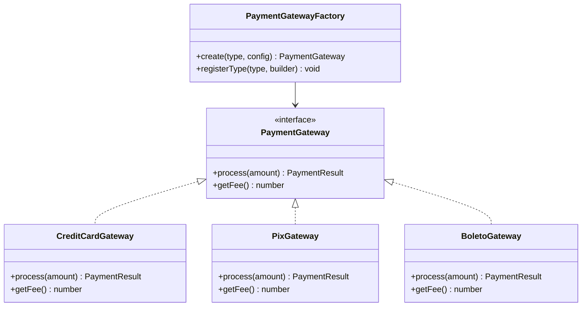
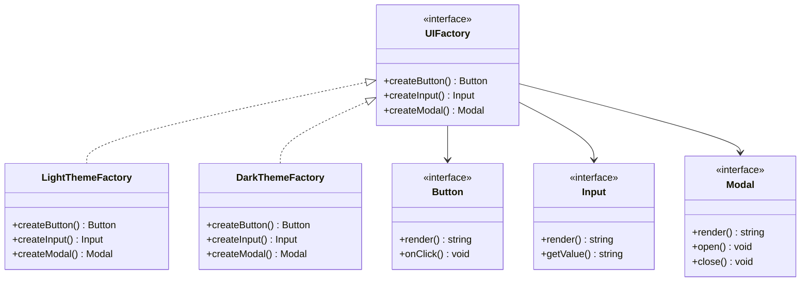
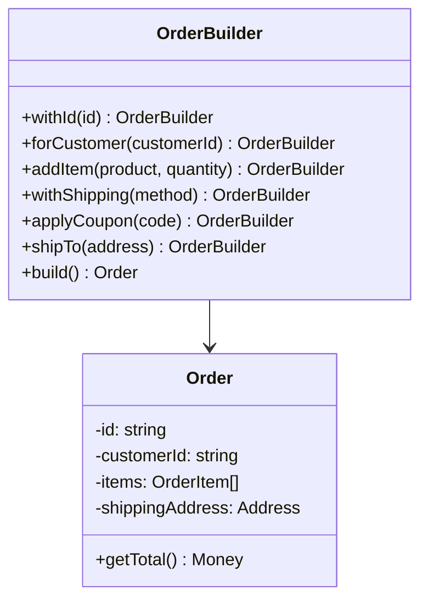
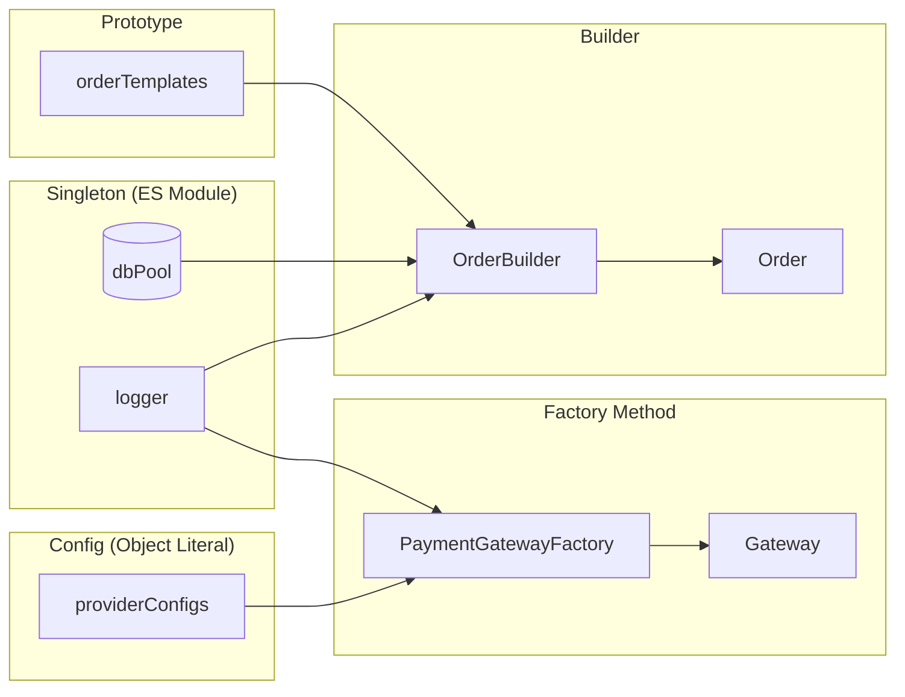

# Engenharia de Software — Aula 06

## Padrões Criacionais — Factory, Builder, Singleton, Object Literal e Prototype

**Duração estimada:** 100 minutos (40 de leitura + 60 de prática)
**Nível:** Intermediário
**Pré-requisitos:** Aulas 01-05 (Clean Code, SOLID, Design Patterns visão geral, DDD, Clean Architecture com tsyringe)

---

## Objetivos de Aprendizagem

Ao final desta aula, você será capaz de:

- [ ] **Reconhecer** o problema fundamental que os padrões criacionais resolvem — o acoplamento causado pelo uso direto de `new` espalhado pelo código
- [ ] **Utilizar** Object Literal com shorthand properties, destructuring e spread operator como alternativa leve a classes para configurações e dados simples
- [ ] **Distinguir** quando usar um objeto literal e quando usar uma classe, com base na complexidade e necessidade de comportamento
- [ ] **Implementar** Factory Method para encapsular a criação de famílias de objetos relacionadas (gateways de pagamento) com um ponto único de variação
- [ ] **Construir** uma Abstract Factory para criar famílias completas de objetos que variam juntos (temas de interface)
- [ ] **Projetar** um Builder com fluent API para construir objetos complexos passo a passo com validação final
- [ ] **Aplicar** Singleton com consciência dos trade-offs, especialmente o impacto em testabilidade
- [ ] **Clonar** objetos existentes com Prototype usando `Object.create()` e spread operator, evitando mutação acidental
- [ ] **Combinar** múltiplos padrões criacionais no mesmo projeto, cada um resolvendo um aspecto diferente da criação de objetos

---

## Como Usar Esta Aula

Esta aula está dividida em duas partes. A **primeira parte** (seções 1 a 7) constrói a base conceitual sobre padrões criacionais — cada padrão é apresentado com motivação, estrutura e código. A **segunda parte** (seção 8) aplica todos os padrões juntos no contexto do e-commerce que você vem construindo.

Cada seção termina com um **Quick Check** para verificar a compreensão antes de avançar. Os **Mão na Massa** são exercícios práticos para implementar no editor. Ao final, os **Exercícios Graduados** consolidam o aprendizado com três níveis de dificuldade.

---

## Mapa Mental

```mermaid
mindmap
  root((Padrões Criacionais))
    Object Literal
      Shorthand properties
      Destructuring
      Spread operator
      Payment config
    Factory Method
      PaymentGatewayFactory
      CreditCard
      Pix
      Boleto
    Abstract Factory
      UIFactory
      Temas Light e Dark
      Button Input Modal
    Builder
      OrderBuilder
      Fluent API
      Validação final
    Singleton
      Database pool
      Logger
      ES Modules
    Prototype
      Object.create()
      Spread clone
      Order templates
```


---

## Recapitulação das Aulas 01-05

| Aula | Conceito | Conexão com Padrões Criacionais |
|---|---|---|
| Aula 01 — Clean Code | Nomes significativos, funções pequenas, DRY | Padrões criacionais eliminam duplicação de lógica de criação (DRY aplicado à instanciação) |
| Aula 02 — SOLID | SRP, OCP, DIP | Factory Method respeita OCP (novos produtos sem modificar fábrica); Singleton viola SRP (gerencia instância + lógica) |
| Aula 03 — Design Patterns | Factory Method (visão geral), Repository, Adapter | Aula 03 introduziu Factory Method; aqui aprofundamos com Abstract Factory, Builder e Prototype |
| Aula 04 — DDD | Entities, VOs, Aggregates, Repository interfaces | VOs são ótimos candidatos para Object Literal; Aggregates frequentemente usam Builder |
| Aula 05 — Clean Architecture | 4 camadas, Composition Root, tsyringe | Composition Root substitui `new` espalhado; DI container é uma forma avançada de Singleton |

---

**FUNDAMENTOS: Controlando a Criação de Objetos**

> *Padrões criacionais tratam do processo de criação de objetos. Eles existem porque o uso direto de `new` acopla código a classes concretas, espalha lógica de instanciação e dificulta testes. Os conceitos desta seção são universais — valem para qualquer linguagem ou framework. Na segunda parte, você verá como cada um se materializa no código do e-commerce.*

---

## 1. O Problema do `new` Direto

### O que há de errado com `new`?

Nada, em princípio. `new` é a forma nativa de instanciar objetos em linguagens orientadas a objetos. O problema não é o `new` em si, mas **onde** e **como** ele é usado.

```typescript
// O problema: new espalhado pelo código
class OrderService {
  async create(data: CreateOrderDTO): Promise<Order> {
    const logger = new ConsoleLogger();
    const gateway = new CreditCardGateway();
    const repo = new OrderRepository();
    // ...
  }
}
```

Cada `new` cria um **acoplamento direto** entre a classe que chama e a classe concreta sendo instanciada. Se amanhã `ConsoleLogger` for substituído por `CloudLogger`, você precisa caçar e modificar cada `new ConsoleLogger()` no sistema.

### Os 4 problemas do `new` espalhado

1. **Acoplamento concreto** — o código cliente depende de uma implementação específica, não de uma abstração
2. **Duplicação de lógica de criação** — se criar um gateway requer 3 passos de configuração, cada `new` repete esses 3 passos
3. **Testabilidade reduzida** — não é possível substituir o objeto real por um mock sem modificar o código que faz o `new`
4. **Violação do OCP** — adicionar um novo tipo (ex: novo gateway de pagamento) exige modificar todos os pontos que usam `new`

### O que os padrões criacionais propõem

Cada padrão criacional ataca um aspecto diferente desse problema:

| Padrão | O que resolve |
|---|---|
| **Object Literal** | Dados simples de configuração não precisam de classe — um objeto direto basta |
| **Factory Method** | Um único método decide qual classe concreta instanciar, centralizando a variação |
| **Abstract Factory** | Famílias de objetos relacionados precisam ser criadas juntas para manter consistência |
| **Builder** | Objetos complexos com muitos parâmetros opcionais exigem construção passo a passo |
| **Singleton** | Certos recursos (conexão de banco, logger) precisam de exatamente uma instância |
| **Prototype** | Criar um objeto do zero é caro ou complexo — clonar um existente é mais eficiente |

### Quick Check 1

**1. Qual o principal problema de ter `new ClasseConcreta()` espalhado por 10 arquivos diferentes?**
**Resposta:** Acoplamento concreto e violação do OCP — trocar a implementação ou adicionar uma nova exige modificar todos os 10 arquivos, em vez de um único ponto centralizado.

**2. Como os padrões criacionais se relacionam com o DIP (Dependency Inversion Principle)?**
**Resposta:** Eles permitem que o código cliente dependa de abstrações (interfaces) em vez de classes concretas, encapsulando a decisão de qual concreto instanciar. O código nunca mais precisa saber o nome da classe concreta.

---

## 2. Object Literal — O Pattern Mais Fundamental do JavaScript/TypeScript

### O que é

**Object Literal** é a sintaxe mais direta para criar objetos em JavaScript: `{ chave: valor }`. Diferente de classes que exigem `new`, o objeto literal existe no momento em que você escreve as chaves. É o padrão criacional mais antigo e mais fundamental da linguagem — anterior a classes, anterior a `new`, anterior ao próprio conceito de "design pattern".

### Por que importa

Nem todo dado precisa de uma classe. Objetos de **configuração**, **DTOs**, **estado imutável** e **mapeamentos** são mais simples, mais legíveis e mais performáticos como literais. TypeScript ainda fornece tipos completos para literais via `interface` ou `type`, combinando a segurança de tipos com a simplicidade da sintaxe literal.

### Shorthand Properties

Quando o nome da propriedade é igual ao nome da variável, você pode省略 (omitir) o valor:

```typescript
// Sem shorthand
const name = 'Pix';
const fee = 0;
const active = true;
const config = { name: name, fee: fee, active: active };

// Com shorthand — muito mais limpo
const config = { name, fee, active };
```

Isso é especialmente útil ao construir objetos a partir de parâmetros de função:

```typescript
function createProvider(name: string, fee: number, active: boolean) {
  return { name, fee, active };
  // Equivalente a { name: name, fee: fee, active: active }
}
```

### Destructuring

**Destructuring** extrai propriedades de um objeto em variáveis individuais — é o inverso do shorthand:

```typescript
const provider = { name: 'Pix', fee: 0, maxInstallments: 1 };

// Destructuring básico
const { name, fee } = provider;
console.log(name); // 'Pix'
console.log(fee);  // 0

// Renomeando ao extrair
const { name: providerName, maxInstallments: parcels } = provider;
console.log(providerName); // 'Pix'
console.log(parcels);      // 1

// Valor padrão
const { discount = 0 } = provider;
console.log(discount); // 0 (não existia no objeto original)

// Destructuring aninhado
const paymentConfig = { creditCard: { fee: 0.0399, parcels: 12 } };
const { creditCard: { fee: ccFee } } = paymentConfig;
console.log(ccFee); // 0.0399

// Destructuring em parâmetros de função
function processPayment({ type, amount, installments }: PaymentRequest) {
  console.log(`Processing ${type}: ${amount} in ${installments}x`);
}
```

### Spread Operator

O **spread operator** (`...`) copia propriedades de um objeto para outro. É a ferramenta mais versátil para composição de objetos:

```typescript
// Clonagem simples
const defaults = { fee: 0.0399, maxInstallments: 12, active: true };
const customConfig = { ...defaults };
// { fee: 0.0399, maxInstallments: 12, active: true }

// Sobrescrita parcial (override)
const promoConfig = { ...defaults, fee: 0.0199 };
// { fee: 0.0199, maxInstallments: 12, active: true }
// A ordem importa: propriedades posteriores sobrescrevem anteriores

// Composição de múltiplos objetos
const base = { name: 'Premium' };
const pricing = { fee: 0.0299, minAmount: 100 };
const flags = { allowInstallments: true, allowDiscount: true };
const fullConfig = { ...base, ...pricing, ...flags };
// { name: 'Premium', fee: 0.0299, minAmount: 100, allowInstallments: true, allowDiscount: true }

// Remoção via destructuring + rest
const config = { name: 'Pix', fee: 0, active: true, discount: 0.05 };
const { discount, ...rest } = config;
console.log(rest); // { name: 'Pix', fee: 0, active: true }
```

### Object Literal vs Class

Quando usar cada um?

| Critério | Object Literal | Class |
|---|---|---|
| Dados simples (config, DTO) | ✅ Ideal | ❌ Overhead desnecessário |
| Comportamento (métodos) | ✅ Possível com arrow functions | ✅ Natural |
| Herança / polimorfismo | ❌ Não suporta | ✅ Suporta |
| Validação no construtor | ❌ Precisa de factory function | ✅ Construtor valida |
| Performance (criação) | ✅ Mais rápido | ⚠️ Levemente mais lento |
| Tipo fechado (exact object) | ✅ `type` ou `interface` | ✅ Classe como tipo |

```typescript
// Quando usar Object Literal — dados de configuração
interface PaymentProviderConfig {
  name: string;
  fee: number;
  maxInstallments: number;
  active: boolean;
}

const providers: Record<string, PaymentProviderConfig> = {
  pix: { name: 'Pix', fee: 0, maxInstallments: 1, active: true },
  creditCard: { name: 'Cartão de Crédito', fee: 0.0399, maxInstallments: 12, active: true },
};

// Quando usar Class — comportamento + validação
class Money {
  constructor(
    readonly amount: number,
    readonly currency: string
  ) {
    if (amount < 0) throw new Error('Amount must be positive');
    if (!currency) throw new Error('Currency is required');
  }
}
```

A regra prática: **se tem validação no construtor, use classe. Se é só dados, use literal.**

### Mão na Massa: Configuração de Pagamento

**Objetivo:** Criar um sistema de configuração de provedores de pagamento usando Object Literal com shorthand, destructuring e spread.

```typescript
// 1. Definição dos provedores como objeto literal
const paymentProviders = {
  creditCard: {
    name: 'Cartão de Crédito',
    maxInstallments: 12,
    minAmount: 5,
    fee: 0.0399,
    requiresDocument: false,
  },
  pix: {
    name: 'Pix',
    maxInstallments: 1,
    minAmount: 0.01,
    fee: 0,
    discount: 0.05,
    requiresDocument: false,
  },
  boleto: {
    name: 'Boleto Bancário',
    maxInstallments: 1,
    minAmount: 10,
    fee: 2.5,
    expiresInDays: 3,
    requiresDocument: true,
  },
};

// 2. Função que usa shorthand + destructuring
function getProviderSummary(type: keyof typeof paymentProviders) {
  const provider = paymentProviders[type];
  const { name, maxInstallments, minAmount } = provider;
  return { name, maxInstallments, minAmount };
}

// 3. Criação de configuração promocional com spread
function createPromoConfig(type: keyof typeof paymentProviders) {
  const base = paymentProviders[type];
  return {
    ...base,
    fee: base.fee * 0.5, // 50% de desconto na taxa
    promoExpiresAt: new Date(Date.now() + 7 * 24 * 60 * 60 * 1000),
  };
}

// 4. Verificação
const summary = getProviderSummary('creditCard');
console.log(summary);
// { name: 'Cartão de Crédito', maxInstallments: 12, minAmount: 5 }

const promo = createPromoConfig('pix');
console.log(promo.fee === 0); // true (0 * 0.5 = 0, ainda grátis)
```

### Quick Check 2

**1. O que o shorthand properties faz?**
**Resposta:** Permite omitir o valor quando o nome da propriedade é igual ao nome da variável: `{ name }` em vez de `{ name: name }`.

**2. Como o spread operator se comporta com propriedades conflitantes?**
**Resposta:** A ordem importa — propriedades de objetos posteriores sobrescrevem propriedades de objetos anteriores com o mesmo nome.

**3. Quando você deve preferir uma classe a um objeto literal?**
**Resposta:** Quando há validação no construtor, comportamento complexo, herança ou polimorfismo envolvidos.

---

## 3. Factory Method — Fábrica de Gateways de Pagamento

### O que é

**Factory Method** é um padrão **criacional** que define uma interface para criar objetos, mas permite que subclasses ou um método central decidam qual classe concreta instanciar. Você já viu uma introdução na Aula 03. Aqui vamos **aprofundar**: em vez de apenas substituir `new`, vamos construir uma fábrica com configuração, logging e tratamento de erro.

### Por que importa (além do que já vimos)

Na Aula 03, você aprendeu que Factory Method substitui `switch (tipo)` por um método encapsulado. Mas o padrão vai além: a fábrica pode **configurar** o objeto antes de retorná-lo, **validar** se o tipo é suportado e **centralizar** lógica de criação que se repete.

### Estrutura



### Exemplo: PaymentGatewayFactory

```typescript
interface PaymentResult {
  success: boolean;
  transactionId: string;
  processedAt: Date;
}

interface PaymentGateway {
  process(amount: number): Promise<PaymentResult>;
  getFee(): number;
  getMaxInstallments(): number;
}

type GatewayType = 'creditCard' | 'pix' | 'boleto';
type GatewayBuilder = (config: PaymentProviderConfig) => PaymentGateway;

class PaymentGatewayFactory {
  private static builders = new Map<GatewayType, GatewayBuilder>();

  static register(type: GatewayType, builder: GatewayBuilder): void {
    PaymentGatewayFactory.builders.set(type, builder);
  }

  static create(type: GatewayType, config: PaymentProviderConfig): PaymentGateway {
    const builder = PaymentGatewayFactory.builders.get(type);
    if (!builder) {
      throw new Error(`Unsupported payment gateway: ${type}`);
    }
    const gateway = builder(config);
    return gateway;
  }

  static getAvailableTypes(): GatewayType[] {
    return Array.from(PaymentGatewayFactory.builders.keys());
  }
}

// Registro dos builders (uma vez, na inicialização)
PaymentGatewayFactory.register('creditCard', (config) => new CreditCardGateway(config));
PaymentGatewayFactory.register('pix', (config) => new PixGateway(config));
PaymentGatewayFactory.register('boleto', (config) => new BoletoGateway(config));

// Uso — o código cliente nunca chama `new` diretamente
const config = paymentProviders.creditCard;
const gateway = PaymentGatewayFactory.create('creditCard', config);
const result = await gateway.process(299.90);
```

**Vantagens adicionais deste design:**

- **Registro desacoplado:** novos gateways são adicionados com `register()` sem modificar a fábrica
- **Configuração injetada:** a fábrica passa o config para o builder, que pode configurar o gateway
- **Falha rápida:** se o tipo não existe, o erro acontece na criação, não na execução

### Mão na Massa: Gateway de Pagamento

**Objetivo:** Implementar a `PaymentGatewayFactory` com dois gateways concretos e uma função que escolhe o gateway com base no valor da compra.

```typescript
// Implementação dos gateways
class CreditCardGateway implements PaymentGateway {
  constructor(private config: PaymentProviderConfig) {}

  async process(amount: number): Promise<PaymentResult> {
    // Simula processamento com cartão de crédito
    const fee = amount * this.config.fee;
    return {
      success: true,
      transactionId: crypto.randomUUID(),
      processedAt: new Date(),
    };
  }

  getFee(): number { return this.config.fee; }
  getMaxInstallments(): number { return this.config.maxInstallments; }
}

class PixGateway implements PaymentGateway {
  constructor(private config: PaymentProviderConfig) {}

  async process(amount: number): Promise<PaymentResult> {
    const discount = (this.config as any).discount ?? 0;
    const finalAmount = amount * (1 - discount);
    return {
      success: true,
      transactionId: crypto.randomUUID(),
      processedAt: new Date(),
    };
  }

  getFee(): number { return 0; }
  getMaxInstallments(): number { return 1; }
}

// Função que decide o gateway ideal com base no valor
function selectGateway(amount: number): GatewayType {
  if (amount < 0.01) throw new Error('Invalid amount');
  if (amount > 5000) return 'creditCard';
  if (amount <= 5000) return 'pix';
  return 'creditCard';
}

// Uso integrado com Object Literal
const amount = 150.00;
const type = selectGateway(amount);
const config = paymentProviders[type];
const gateway = PaymentGatewayFactory.create(type, config);
const result = await gateway.process(amount);
console.log(`Pagamento via ${type}: ${result.transactionId}`);
```

### Quick Check 3

**1. Além de substituir `new`, que outra responsabilidade a fábrica pode assumir?**
**Resposta:** Configurar o objeto antes de retorná-lo, validar se o tipo é suportado, registrar builders dinamicamente e aplicar lógica de seleção.

**2. Qual a vantagem de usar `Map<GatewayType, GatewayBuilder>` em vez de um `switch`?**
**Resposta:** Novos tipos podem ser registrados externamente sem modificar a classe `PaymentGatewayFactory` — violação zero do OCP. Com `switch`, cada novo tipo exige um novo `case`.

---

## 4. Abstract Factory — Famílias de Objetos Relacionados

### O que é

**Abstract Factory** é um padrão **criacional** que fornece uma interface para criar **famílias de objetos relacionados** sem especificar suas classes concretas. Enquanto o Factory Method cria **um** objeto, o Abstract Factory cria **uma família inteira** que varia junto.

### Por que importa

Certos objetos precisam ser usados em conjunto para fazer sentido. Um botão "light" com um modal "dark" fica inconsistente. Temas (light/dark), sistemas operacionais (Windows/Mac/Linux) e bancos de dados (SQL/NoSQL) são exemplos de famílias: você quer que todos os objetos venham da mesma família.

### Estrutura



### Exemplo: UIFactory

```typescript
// Interfaces dos produtos
interface Button {
  render(): string;
  onClick(callback: () => void): void;
}

interface Input {
  render(): string;
  getValue(): string;
  setValue(value: string): void;
}

interface Modal {
  render(): string;
  open(): void;
  close(): void;
}

// Abstract Factory
interface UIFactory {
  createButton(label: string): Button;
  createInput(placeholder: string): Input;
  createModal(title: string, content: string): Modal;
}

// Família Light
class LightButton implements Button {
  constructor(private label: string) {}
  render(): string { return `<button class="btn btn-light">${this.label}</button>`; }
  onClick(callback: () => void): void { callback(); }
}

class LightInput implements Input {
  private value = '';
  constructor(private placeholder: string) {}
  render(): string { return `<input class="input input-light" placeholder="${this.placeholder}" />`; }
  getValue(): string { return this.value; }
  setValue(value: string): void { this.value = value; }
}

class LightModal implements Modal {
  constructor(private title: string, private content: string) {}
  render(): string { return `<div class="modal modal-light"><h2>${this.title}</h2><p>${this.content}</p></div>`; }
  open(): void { console.log('Light modal opened'); }
  close(): void { console.log('Light modal closed'); }
}

class LightThemeFactory implements UIFactory {
  createButton(label: string): Button { return new LightButton(label); }
  createInput(placeholder: string): Input { return new LightInput(placeholder); }
  createModal(title: string, content: string): Modal { return new LightModal(title, content); }
}

// Família Dark
class DarkButton implements Button {
  constructor(private label: string) {}
  render(): string { return `<button class="btn btn-dark">${this.label}</button>`; }
  onClick(callback: () => void): void { callback(); }
}

class DarkInput implements Input {
  private value = '';
  constructor(private placeholder: string) {}
  render(): string { return `<input class="input input-dark" placeholder="${this.placeholder}" />`; }
  getValue(): string { return this.value; }
  setValue(value: string): void { this.value = value; }
}

class DarkModal implements Modal {
  constructor(private title: string, private content: string) {}
  render(): string { return `<div class="modal modal-dark"><h2>${this.title}</h2><p>${this.content}</p></div>`; }
  open(): void { console.log('Dark modal opened'); }
  close(): void { console.log('Dark modal closed'); }
}

class DarkThemeFactory implements UIFactory {
  createButton(label: string): Button { return new DarkButton(label); }
  createInput(placeholder: string): Input { return new DarkInput(placeholder); }
  createModal(title: string, content: string): Modal { return new DarkModal(title, content); }
}
```

### Mão na Massa: Criando Temas

**Objetivo:** Usar a `UIFactory` para renderizar uma página que muda de tema completamente com uma só troca de fábrica.

```typescript
// Cliente que usa a fábrica sem conhecer os tipos concretos
class CheckoutPage {
  constructor(private ui: UIFactory) {}

  render(): string {
    const button = this.ui.createButton('Finalizar Compra');
    const input = this.ui.createInput('Digite seu cupom');
    const modal = this.ui.createModal('Confirmação', 'Deseja finalizar?');
    return [button.render(), input.render(), modal.render()].join('\n');
  }
}

// Trocar tema = trocar a fábrica
const theme: 'light' | 'dark' = 'dark'; // Vem de configuração ou preferência do usuário
const factory: UIFactory = theme === 'light'
  ? new LightThemeFactory()
  : new DarkThemeFactory();

const page = new CheckoutPage(factory);
console.log(page.render());
// Todos os elementos são dark — consistência garantida

// Adicionar um terceiro tema (ex: High Contrast) exige:
// 1. Criar HighContrastButton, HighContrastInput, HighContrastModal
// 2. Criar HighContrastThemeFactory
// 3. Nenhuma modificação no CheckoutPage
```

**Diferença fundamental do Factory Method:** Factory Method cria **um** produto por chamada. Abstract Factory cria **famílias** de produtos que compartilham uma variante. Se você só precisa criar um gateway, use Factory Method. Se precisa criar botão + input + modal que combinam visualmente, use Abstract Factory.

### Quick Check 4

**1. Qual problema o Abstract Factory resolve que o Factory Method não resolve?**
**Resposta:** Garantir que objetos de uma mesma família sejam criados juntos, mantendo consistência entre eles. Factory Method cria um objeto por vez sem relação entre os tipos.

**2. Como adicionar um novo tema (ex: HighContrast) em uma Abstract Factory?**
**Resposta:** Cria-se uma nova fábrica concreta `HighContrastThemeFactory` que implementa `UIFactory`, sem modificar o código cliente que usa a interface `UIFactory`.

---

## 5. Builder — Construção Passo a Passo de Objetos Complexos

### O que é

**Builder** é um padrão **criacional** que separa a construção de um objeto complexo de sua representação final. O mesmo processo de construção pode criar diferentes representações. Em vez de um construtor gigante com 15 parâmetros opcionais, você constrói o objeto passo a passo, chamando métodos que configuram cada parte.

### Por que importa

Construtores com muitos parâmetros são ilegíveis e propensos a erro:

```typescript
// O problema: construtor telescópico
const order = new Order('id-123', 'cust-456', [], null, null, 'STANDARD', null, 0, new Date());
```

Qual parâmetro é o quê? É impossível saber sem contar posições. O Builder substitui isso por chamadas nomeadas:

```typescript
// Muito mais legível
const order = new OrderBuilder()
  .withId('id-123')
  .forCustomer('cust-456')
  .withShipping('express')
  .addItem(product, 2)
  .build();
```

### Estrutura



### Fluent API

O Builder ganha ainda mais potência com a **Fluent API** (ou **Method Chaining**): cada método retorna `this`, permitindo encadear chamadas.

```typescript
const builder = new OrderBuilder();
builder
  .withId('ORD-001')
  .forCustomer('CUST-456')
  .addItem(productA, 2)
  .addItem(productB, 1)
  .withShipping('express')
  .shipTo(address);
```

O segredo: cada método termina com `return this;`.

### Exemplo: OrderBuilder

```typescript
interface Address {
  street: string;
  city: string;
  state: string;
  zipCode: string;
}

interface OrderItem {
  productId: string;
  productName: string;
  quantity: number;
  unitPrice: number;
}

interface BuildOrder {
  id: string;
  customerId: string;
  items: OrderItem[];
  shippingAddress: Address | null;
  shippingMethod: string;
  couponCode: string | null;
  createdAt: Date;
}

class OrderBuilder {
  private id = '';
  private customerId = '';
  private items: OrderItem[] = [];
  private shippingAddress: Address | null = null;
  private shippingMethod = 'standard';
  private couponCode: string | null = null;

  withId(id: string): this {
    this.id = id;
    return this;
  }

  forCustomer(customerId: string): this {
    this.customerId = customerId;
    return this;
  }

  addItem(productId: string, productName: string, quantity: number, unitPrice: number): this {
    this.items.push({ productId, productName, quantity, unitPrice });
    return this;
  }

  withShipping(method: string): this {
    this.shippingMethod = method;
    return this;
  }

  shipTo(address: Address): this {
    this.shippingAddress = address;
    return this;
  }

  applyCoupon(code: string): this {
    this.couponCode = code;
    return this;
  }

  build(): BuildOrder {
    if (!this.id) throw new Error('Order ID is required');
    if (!this.customerId) throw new Error('Customer ID is required');
    if (this.items.length === 0) throw new Error('Order must have at least one item');

    return {
      id: this.id,
      customerId: this.customerId,
      items: [...this.items],
      shippingAddress: this.shippingAddress,
      shippingMethod: this.shippingMethod,
      couponCode: this.couponCode,
      createdAt: new Date(),
    };
  }
}
```

### Mão na Massa: Builder de Pedido

**Objetivo:** Usar o `OrderBuilder` para construir pedidos complexos com validação final.

```typescript
// Criando um pedido simples
const simpleOrder = new OrderBuilder()
  .withId('ORD-001')
  .forCustomer('CUST-456')
  .addItem('PROD-001', 'Notebook', 1, 4500)
  .build();
console.log(simpleOrder);
// { id: 'ORD-001', customerId: 'CUST-456', items: [{ ... }], shippingMethod: 'standard', ... }

// Criando um pedido completo
const fullOrder = new OrderBuilder()
  .withId('ORD-002')
  .forCustomer('CUST-789')
  .addItem('PROD-002', 'Mouse', 2, 150)
  .addItem('PROD-003', 'Teclado', 1, 350)
  .withShipping('express')
  .shipTo({ street: 'Rua A, 123', city: 'São Paulo', state: 'SP', zipCode: '01001-000' })
  .applyCoupon('FRETEGRATIS')
  .build();

// Tentativa inválida — lança erro no build()
try {
  new OrderBuilder().build();
} catch (err) {
  console.error((err as Error).message); // 'Order ID is required'
}
```

**Variação: Director.** Em alguns cenários, você pode criar um **Director** que pré-configura builders para cenários comuns:

```typescript
class OrderDirector {
  static expressOrder(builder: OrderBuilder, customerId: string): OrderBuilder {
    return builder
      .forCustomer(customerId)
      .withShipping('express');
  }

  static internationalOrder(builder: OrderBuilder, customerId: string): OrderBuilder {
    return builder
      .forCustomer(customerId)
      .withShipping('international');
  }
}

const expressOrder = OrderDirector.expressOrder(
  new OrderBuilder().withId('ORD-003'),
  'CUST-111'
)
  .addItem('PROD-001', 'Notebook', 1, 4500)
  .build();
```

### Quick Check 5

**1. Qual problema o Builder resolve que um construtor com parâmetros opcionais não resolve?**
**Resposta:** Legibilidade — um construtor com 10 parâmetros opcionais é impossível de ler sem contar posições. O Builder nomeia cada passo e valida no final, não no meio da construção.

**2. O que é Fluent API e como se implementa?**
**Resposta:** É o encadeamento de métodos onde cada método retorna `this`. Implementa-se com `return this;` no final de cada método setter.

---

## 6. Singleton — Instância Única

### O que é

**Singleton** é um padrão **criacional** que garante que uma classe tenha **exatamente uma instância** e fornece um ponto global de acesso a ela.

### Por que importa

Certos recursos do sistema não fazem sentido ter múltiplas instâncias:
- **Pool de conexão de banco de dados** — você quer uma única pool, não uma por requisição
- **Logger** — todas as partes do sistema devem logar no mesmo destino
- **Cache** — um único cache evita dados inconsistentes

```typescript
// Singleton clássico
class DatabasePool {
  private static instance: DatabasePool;
  private connections: number = 0;

  private constructor() {
    // Construtor privado — ninguém pode chamar `new DatabasePool()`
    this.connections = 10; // abre 10 conexões
    console.log('Database pool initialized');
  }

  static getInstance(): DatabasePool {
    if (!DatabasePool.instance) {
      DatabasePool.instance = new DatabasePool();
    }
    return DatabasePool.instance;
  }

  query(sql: string): void {
    console.log(`Executing: ${sql}`);
  }
}

// Uso
const pool1 = DatabasePool.getInstance();
const pool2 = DatabasePool.getInstance();
console.log(pool1 === pool2); // true — mesma instância
```

### ES Modules como Singleton Natural

No ecossistema Node.js/TypeScript, o sistema de **ES Modules** já se comporta como Singleton: o módulo é executado uma única vez e o resultado é cacheado. Qualquer arquivo que importe o mesmo módulo recebe a **mesma referência**.

```typescript
// logger.ts
export const logger = {
  info(message: string): void {
    console.log(`[INFO] ${new Date().toISOString()} ${message}`);
  },
  error(message: string): void {
    console.error(`[ERROR] ${new Date().toISOString()} ${message}`);
  },
};

// orderService.ts
import { logger } from './logger';
logger.info('Order created');

// paymentService.ts
import { logger } from './logger';
logger.info('Payment processed');
// Mesmo objeto logger — mesma referência
```

Isso torna o Singleton explícito em classes e **implícito** (e mais seguro) em módulos. Prefira módulos para Singletons de serviço (logger, config) e use classes apenas quando precisar de inicialização lazy.

### Quando Usar e Quando Evitar

**Use Singleton quando:**
- Um recurso precisa ser compartilhado globalmente (pool de conexão, logger, cache)
- Você quer lazy initialization (só cria quando alguém pede)
- A criação é cara (conexão de banco, cliente HTTP)

**Evite Singleton quando:**
- O objeto precisa ser trocado em testes (Singleton dificulta mocks)
- Você quer múltiplas instâncias com configurações diferentes no futuro
- A instância única mantém estado mutável que causa acoplamento global

### O Problema dos Testes

```typescript
// Teste com Singleton — difícil de isolar
function testOrderService() {
  const pool = DatabasePool.getInstance();
  // Pool real — teste depende de banco de dados
  // Não é possível substituir por um mock
}

// Solução 1: Injeção de dependência (mesmo para Singleton)
class OrderService {
  constructor(private db: DatabasePool) {} // Agora testável
}

// Solução 2: Factory para criar/resetar o Singleton em testes
class DatabasePool {
  static instance: DatabasePool | null = null;

  static resetForTesting(): void {
    DatabasePool.instance = null;
  }
}

// No teste
beforeEach(() => DatabasePool.resetForTesting());
```

A melhor prática: **não use Singleton para objetos que você precisa mockar em testes.** Use DI container (tsyringe) com registro singleton — você obtém o mesmo benefício (uma instância) sem o acoplamento global.

### Quick Check 6

**1. Como ES Modules se comportam como Singletons naturais?**
**Resposta:** O módulo é executado uma única vez e o resultado é cacheado pelo runtime. Qualquer importador recebe a mesma referência do objeto exportado.

**2. Qual o principal problema de testabilidade do Singleton clássico?**
**Resposta:** O construtor privado impede substituir a instância por um mock em testes. A instância real é usada sempre, acoplando o teste a recursos externos (banco, API, etc.).

---

## 7. Prototype — Clone de Objetos Existentes

### O que é

**Prototype** é um padrão **criacional** que permite criar novos objetos **copiando** um objeto existente (o protótipo) em vez de instanciar uma classe do zero. O novo objeto herda as propriedades do protótipo e pode sobrescrevê-las.

### Por que importa

Criar um objeto complexo do zero pode ser caro ou verboso. Se você já tem um objeto "modelo" com valores padrão, cloná-lo e modificar só o que difere é mais rápido, mais limpo e menos repetitivo.

### Object.create()

`Object.create(proto)` cria um novo objeto cujo protótipo (`__proto__`) é o objeto passado como argumento. O novo objeto **herda** as propriedades do protótipo:

```typescript
const orderTemplate = {
  status: 'pending',
  items: [] as string[],
  shippingMethod: 'standard',
  createdAt: new Date(),
};

// Cria um novo objeto que HERDA de orderTemplate
const order1 = Object.create(orderTemplate);
order1.items.push('Notebook');
console.log(order1.status); // 'pending' — herdado do protótipo
console.log(order1.items);  // ['Notebook']

// Cuidado: propriedades mutáveis são compartilhadas!
const order2 = Object.create(orderTemplate);
console.log(order2.items);  // ['Notebook'] — mesmo array! Mutação inesperada
```

`Object.create()` cria uma **cadeia de protótipos** — o novo objeto delega para o protótipo. Isso é diferente de copiar: propriedades são compartilhadas até serem sobrescritas.

### Spread Operator como Prototype Moderno

O spread operator cria uma **cópia rasa** (shallow copy) do objeto, resolvendo o problema de compartilhamento de referências do `Object.create()`:

```typescript
const orderTemplate = {
  status: 'pending',
  items: [] as string[],
  shippingMethod: 'standard',
  createdAt: new Date(),
};

// Shallow copy — cada pedido tem seu próprio array
const order1 = { ...orderTemplate, items: ['Notebook'] };
const order2 = { ...orderTemplate, items: ['Mouse'] };

console.log(order1.items); // ['Notebook']
console.log(order2.items); // ['Mouse'] — independente!

// Sobrescrita de propriedades
const expressOrder = {
  ...orderTemplate,
  shippingMethod: 'express',
  priority: true, // nova propriedade só neste clone
};
```

**Regra prática:** prefira spread operator para clonagem de objetos literais. Use `Object.create()` apenas quando precisar de delegação de protótipo (herança dinâmica).

### Mão na Massa: Clonando Configurações

**Objetivo:** Usar Prototype para criar variações de configuração de pedido a partir de um template base.

```typescript
// Template base — o "protótipo" de todas as ordens
const baseOrder = {
  status: 'pending',
  items: [],
  shippingMethod: 'standard',
  currency: 'BRL',
  paymentMethod: '',
  discount: 0,
};

// Função que cria variações a partir do protótipo
function createOrderTemplate(overrides: Partial<typeof baseOrder>) {
  return { ...baseOrder, ...overrides };
}

// Variações — cada uma é uma cópia independente
const rushOrder = createOrderTemplate({
  shippingMethod: 'express',
  paymentMethod: 'creditCard',
});

const wholesaleOrder = createOrderTemplate({
  shippingMethod: 'standard',
  paymentMethod: 'boleto',
  discount: 0.15,
});

const internationalOrder = createOrderTemplate({
  shippingMethod: 'international',
  currency: 'USD',
  paymentMethod: 'creditCard',
});

// Prototype com classes
class OrderTemplate {
  constructor(
    public status = 'pending',
    public shippingMethod = 'standard',
    public currency = 'BRL'
  ) {}

  clone(overrides: Partial<OrderTemplate>): OrderTemplate {
    const cloned = Object.create(Object.getPrototypeOf(this));
    return Object.assign(cloned, this, overrides);
  }
}

const base = new OrderTemplate();
const rush = base.clone({ shippingMethod: 'express' });
console.log(rush instanceof OrderTemplate); // true
console.log(rush.shippingMethod); // 'express'
console.log(rush.status); // 'pending' — herdado do clone
```

### Quick Check 7

**1. Qual a diferença entre `Object.create(proto)` e `{ ...proto }`?**
**Resposta:** `Object.create(proto)` cria um novo objeto com proto na cadeia de protótipos — propriedades são delegadas, não copiadas. `{ ...proto }` cria uma shallow copy independente — propriedades primitivas são copiadas, objetos aninhados ainda são compartilhados.

**2. Por que o spread operator é geralmente preferível ao `Object.create()` para clonagem?**
**Resposta:** Porque evita o compartilhamento inesperado de referências mutáveis (arrays, objetos) através da cadeia de protótipos, dando a cada clone seu próprio conjunto de propriedades.

---

**APLICAÇÃO: Padrões Criacionais no E-commerce**

> *Agora que você entende os fundamentos de cada padrão criacional, vamos conectá-los à prática no projeto de e-commerce. Cada seção abaixo implementa um padrão no contexto real da API que você vem construindo.*

---

## 8. Implementação Integrada no E-commerce

Nesta seção, todos os padrões criacionais trabalham juntos no mesmo projeto. Cada um resolve uma parte específica do problema de criação de objetos.

### Object Literal: Configuração de Provedores de Pagamento

Os provedores de pagamento são configurações fixas — dados puros, sem comportamento. Object Literal + TypeScript interface é a escolha ideal:

```typescript
// infrastructure/payment/provider-configs.ts
export interface PaymentProviderConfig {
  name: string;
  type: 'creditCard' | 'pix' | 'boleto';
  fee: number;
  maxInstallments: number;
  minAmount: number;
  maxAmount: number;
  active: boolean;
}

export const providerConfigs: Record<string, PaymentProviderConfig> = {
  creditCard: {
    name: 'Cartão de Crédito',
    type: 'creditCard',
    fee: 0.0399,
    maxInstallments: 12,
    minAmount: 5,
    maxAmount: 50000,
    active: true,
  },
  pix: {
    name: 'Pix',
    type: 'pix',
    fee: 0,
    maxInstallments: 1,
    minAmount: 0.01,
    maxAmount: 10000,
    active: true,
  },
  boleto: {
    name: 'Boleto Bancário',
    type: 'boleto',
    fee: 2.5,
    maxInstallments: 1,
    minAmount: 10,
    maxAmount: 5000,
    active: true,
  },
};
```

### Factory Method: Criação de Gateways de Pagamento

O Factory Method usa as configurações acima para criar gateways dinamicamente:

```typescript
// infrastructure/payment/payment-gateway-factory.ts
import { providerConfigs, PaymentProviderConfig } from './provider-configs';
import { container } from 'tsyringe';

type GatewayConstructor = new (config: PaymentProviderConfig) => PaymentGateway;

export class PaymentGatewayFactory {
  private static registry = new Map<string, GatewayConstructor>();

  static register(type: string, ctor: GatewayConstructor): void {
    PaymentGatewayFactory.registry.set(type, ctor);
  }

  static create(type: string): PaymentGateway {
    const config = providerConfigs[type];
    if (!config || !config.active) {
      throw new Error(`Payment provider '${type}' is not available`);
    }
    const ctor = PaymentGatewayFactory.registry.get(type);
    if (!ctor) {
      throw new Error(`No gateway implementation for '${type}'`);
    }
    return new ctor(config);
  }
}

// Registro na inicialização (main.ts ou módulo de configuração)
PaymentGatewayFactory.register('creditCard', CreditCardGateway);
PaymentGatewayFactory.register('pix', PixGateway);
PaymentGatewayFactory.register('boleto', BoletoGateway);
```

### Builder: Construção de Pedidos com Validação

O Use Case de criação de pedido no e-commerce usa o Builder para construir o `Order` complexo:

```typescript
// application/builders/OrderBuilder.ts
import { Order, OrderStatus, OrderItem } from '../../domain/entities/Order';

export class OrderBuilder {
  private id = crypto.randomUUID();
  private customerId = '';
  private items: OrderItem[] = [];
  private shippingAddress: Address | null = null;
  private shippingMethod = 'standard';

  forCustomer(customerId: string): this {
    this.customerId = customerId;
    return this;
  }

  addItem(productId: string, productName: string, quantity: number, unitPrice: number): this {
    this.items.push({ productId, productName, quantity, unitPrice });
    return this;
  }

  withShipping(method: string): this {
    this.shippingMethod = method;
    return this;
  }

  shipTo(address: Address): this {
    this.shippingAddress = address;
    return this;
  }

  build(): Order {
    if (!this.customerId) throw new Error('Customer ID is required');
    if (this.items.length === 0) throw new Error('Order must have at least one item');

    return new Order(
      this.id,
      this.customerId,
      OrderStatus.PENDING,
      [...this.items],
      this.shippingAddress,
      this.shippingMethod,
      new Date()
    );
  }
}
```

### Singleton: Pool de Conexão e Logger

Usando ES Modules como Singleton natural:

```typescript
// infrastructure/database/connection.ts
import { Pool } from 'pg';

export const dbPool = new Pool({
  connectionString: process.env.DATABASE_URL,
  max: 20,
});

// infrastructure/logging/logger.ts
export const logger = {
  info: (message: string, context?: Record<string, unknown>) => {
    console.log(JSON.stringify({ level: 'INFO', message, context, timestamp: new Date().toISOString() }));
  },
  error: (message: string, error?: Error) => {
    console.error(JSON.stringify({ level: 'ERROR', message, error: error?.message, timestamp: new Date().toISOString() }));
  },
};
```

### Prototype: Templates de Pedido

Para pedidos recorrentes (assinaturas, pedidos em lote), clonamos um template:

```typescript
// domain/templates/order-templates.ts
export const orderTemplates = {
  standard: {
    shippingMethod: 'standard',
    paymentMethod: 'creditCard',
  },
  express: {
    shippingMethod: 'express',
    paymentMethod: 'pix',
  },
  wholesale: {
    shippingMethod: 'standard',
    paymentMethod: 'boleto',
    discount: 0.10,
  },
};

// Função que cria um pedido a partir de um template
function createFromTemplate(
  template: typeof orderTemplates.standard,
  customerId: string,
  items: OrderItem[]
): Order {
  return new OrderBuilder()
    .forCustomer(customerId)
    .withShipping(template.shippingMethod)
    .build();
  // Sobrescreve itens depois
}
```

### Diagrama de Integração



Cada padrão cuida de um aspecto: Object Literal carrega dados estáticos, Factory Method cria gateways, Builder constrói pedidos, Singleton compartilha recursos, Prototype gera variações de template.

---

## Autoavaliação: Quiz Rápido

**1. Qual a diferença fundamental entre Factory Method e Abstract Factory?**
**Resposta:** Factory Method cria um único produto por chamada. Abstract Factory cria famílias inteiras de produtos relacionados que compartilham uma variante (tema, SO, banco).

**2. Em que cenário um Object Literal é superior a uma classe?**
**Resposta:** Quando o objeto contém apenas dados (configurações, DTOs, mapeamentos) sem validação no construtor ou comportamento complexo.

**3. O que diferencia o Builder do Factory Method?**
**Resposta:** Factory Method cria o objeto em uma única chamada. Builder constrói passo a passo, permitindo configuração incremental e validação final.

**4. Por que Singletons baseados em ES Modules são preferíveis ao Singleton clássico com construtor privado?**
**Resposta:** Porque o sistema de módulos já garante instância única naturalmente, sem precisar de construtor privado, método getInstance ou trava de inicialização.

**5. Qual o principal risco de usar `Object.create(proto)` para clonar objetos com arrays aninhados?**
**Resposta:** O array é compartilhado entre protótipo e clones via cadeia de protótipos — mutações em um clone afetam todos os outros.

**6. Como o spread operator resolve o problema de compartilhamento do `Object.create()`?**
**Resposta:** Spread operator cria uma shallow copy independente — propriedades primitivas são copiadas por valor, e cada clone tem seu próprio conjunto de propriedades.

**7. Qual padrão criacional você usaria para garantir que uma UI tenha botões, inputs e modals todos do mesmo tema?**
**Resposta:** Abstract Factory — a fábrica de tema (LightThemeFactory, DarkThemeFactory) cria todos os elementos da família de uma vez, garantindo consistência visual.

---

## Mão na Massa: Exercícios Graduados

### Exercício 1 (Fácil) — Identifique o Padrão Criacional

Para cada descrição, identifique qual padrão criacional é a solução mais adequada:

a) "Precisamos representar a configuração de 5 meios de pagamento com nome, taxa e parcelas máximas. São dados puros, sem métodos ou validação."
b) "O sistema precisa criar conexões de banco de dados, mas queremos exatamente uma pool compartilhada por toda a aplicação."
c) "Uma tela de checkout pode ser light ou dark. Quando o usuário troca o tema, botões, inputs e modals devem trocar todos juntos."
d) "Criar um pedido completo exige 8 campos, sendo 5 opcionais. Queremos uma API fluente que valide tudo no final."
e) "Toda segunda-feira, geramos 50 pedidos iguais mudando só o cliente e a data de entrega."

**Gabarito:** a) Object Literal — dados puros sem comportamento. b) Singleton (ES Module) — pool compartilhada. c) Abstract Factory — família de objetos que varia junto. d) Builder — construção passo a passo com validação final. e) Prototype — clonar template e sobrescrever variações.

### Exercício 2 (Médio) — Refatore para Factory Method

O código abaixo está acoplado a classes concretas e repete lógica de criação. Refatore para usar Factory Method.

```typescript
class NotificationService {
  async send(type: string, message: string, recipient: string): Promise<void> {
    if (type === 'email') {
      const config = { host: 'smtp.example.com', port: 587 };
      const email = new EmailService(config);
      await email.send(recipient, 'Notificação', message);
    } else if (type === 'sms') {
      const config = { provider: 'twilio', apiKey: process.env.SMS_KEY };
      const sms = new SMSService(config);
      await sms.send(recipient, message);
    } else if (type === 'push') {
      const config = { appId: 'com.example.app' };
      const push = new PushService(config);
      await push.notify(recipient, message);
    } else {
      throw new Error('Unknown notification type');
    }
  }
}

// Uso
const notifier = new NotificationService();
await notifier.send('email', 'Bem-vindo!', 'user@example.com');
```

**Gabarito:**

```typescript
interface NotificationChannel {
  send(recipient: string, message: string): Promise<void>;
}

class EmailService implements NotificationChannel {
  async send(recipient: string, message: string): Promise<void> {
    const config = { host: 'smtp.example.com', port: 587 };
    console.log(`Email sent to ${recipient}: ${message}`);
  }
}

class SMSService implements NotificationChannel {
  async send(recipient: string, message: string): Promise<void> {
    console.log(`SMS sent to ${recipient}: ${message}`);
  }
}

class PushService implements NotificationChannel {
  async send(recipient: string, message: string): Promise<void> {
    console.log(`Push notification to ${recipient}: ${message}`);
  }
}

type ChannelType = 'email' | 'sms' | 'push';
type ChannelBuilder = () => NotificationChannel;

class NotificationFactory {
  private static builders = new Map<ChannelType, ChannelBuilder>();

  static register(type: ChannelType, builder: ChannelBuilder): void {
    NotificationFactory.builders.set(type, builder);
  }

  static create(type: ChannelType): NotificationChannel {
    const builder = NotificationFactory.builders.get(type);
    if (!builder) throw new Error(`Unknown channel: ${type}`);
    return builder();
  }
}

// Registro
NotificationFactory.register('email', () => new EmailService());
NotificationFactory.register('sms', () => new SMSService());
NotificationFactory.register('push', () => new PushService());

class NotificationService {
  async send(type: ChannelType, message: string, recipient: string): Promise<void> {
    const channel = NotificationFactory.create(type);
    await channel.send(recipient, message);
  }
}
```

**Gabarito:** A refatoração elimina o `if/else if` encadeado, substitui por um `Map` de builders registrados, e cada canal implementa a interface `NotificationChannel`. Novo canal = novo `register()` sem modificar `NotificationService`.

### Exercício 3 (Difícil) — Builder com Validação

Crie um `OrderBuilder` completo para o e-commerce com as seguintes regras de validação no `build()`:

1. `id` é obrigatório (gerado automaticamente se não fornecido)
2. `customerId` é obrigatório
3. `items` deve ter pelo menos 1 item
4. Cada item deve ter `quantity > 0` e `unitPrice >= 0`
5. `shippingMethod` deve ser um dos valores: 'standard', 'express', 'international'
6. Se `shippingMethod` for 'express', o `shippingAddress` é obrigatório
7. Se o total do pedido (soma de quantity * unitPrice) exceder 50000, o `shippingMethod` deve ser 'international' ou lançar erro

Implemente usando fluent API com todas as validações no `build()`.

**Gabarito:**

```typescript
interface Address {
  street: string;
  city: string;
  state: string;
  zipCode: string;
}

interface OrderItem {
  productId: string;
  productName: string;
  quantity: number;
  unitPrice: number;
}

interface BuiltOrder {
  id: string;
  customerId: string;
  items: OrderItem[];
  shippingAddress: Address | null;
  shippingMethod: string;
  createdAt: Date;
}

type ShippingMethod = 'standard' | 'express' | 'international';

class OrderBuilder {
  private id: string | null = null;
  private customerId = '';
  private items: OrderItem[] = [];
  private shippingAddress: Address | null = null;
  private shippingMethod: ShippingMethod = 'standard';
  private validShippingMethods: ShippingMethod[] = ['standard', 'express', 'international'];

  withId(id: string): this {
    this.id = id;
    return this;
  }

  forCustomer(customerId: string): this {
    this.customerId = customerId;
    return this;
  }

  addItem(productId: string, productName: string, quantity: number, unitPrice: number): this {
    this.items.push({ productId, productName, quantity, unitPrice });
    return this;
  }

  withShipping(method: string): this {
    if (!this.validShippingMethods.includes(method as ShippingMethod)) {
      throw new Error(`Invalid shipping method: ${method}. Allowed: ${this.validShippingMethods.join(', ')}`);
    }
    this.shippingMethod = method as ShippingMethod;
    return this;
  }

  shipTo(address: Address): this {
    this.shippingAddress = address;
    return this;
  }

  private calculateTotal(): number {
    return this.items.reduce((sum, item) => sum + item.quantity * item.unitPrice, 0);
  }

  build(): BuiltOrder {
    if (!this.customerId) throw new Error('Customer ID is required');
    if (this.items.length === 0) throw new Error('Order must have at least one item');

    for (const item of this.items) {
      if (item.quantity <= 0) throw new Error(`Invalid quantity for ${item.productId}: must be > 0`);
      if (item.unitPrice < 0) throw new Error(`Invalid price for ${item.productId}: must be >= 0`);
    }

    if (this.shippingMethod === 'express' && !this.shippingAddress) {
      throw new Error('Shipping address is required for express shipping');
    }

    const total = this.calculateTotal();
    if (total > 50000 && this.shippingMethod !== 'international') {
      throw new Error(`Orders over 50000 must use international shipping (current total: ${total})`);
    }

    return {
      id: this.id ?? crypto.randomUUID(),
      customerId: this.customerId,
      items: [...this.items],
      shippingAddress: this.shippingAddress,
      shippingMethod: this.shippingMethod,
      createdAt: new Date(),
    };
  }
}
```

### Desafio Opcional

Implemente um **Director** que combina o Builder com Prototype. O `OrderDirector` deve manter um catálogo de templates (standard, express, wholesale). Cada template é um protótipo que pré-configura o builder. O director deve aceitar um template por nome e permitir sobrescrever qualquer propriedade via spread:

```typescript
// Exemplo de uso esperado
const director = new OrderDirector();
const order = director
  .useTemplate('express')
  .forCustomer('CUST-001')
  .addItem('PROD-001', 'Notebook', 1, 4500)
  .build();
// shippingMethod já vem preenchido como 'express' pelo template
```

---

## Resumo da Aula

### Padrões Criacionais

| Padrão | Quando usar | Exemplo no E-commerce |
|---|---|---|
| **Object Literal** | Dados simples sem comportamento ou validação | Configuração de provedores de pagamento |
| **Factory Method** | Um método central decide qual classe concreta instanciar | Criação de gateways de pagamento por tipo |
| **Abstract Factory** | Famílias de objetos relacionados que variam juntos | UI components que mudam por tema (light/dark) |
| **Builder** | Objeto complexo com muitos parâmetros opcionais e validação final | Construção de pedidos com itens, frete, endereço |
| **Singleton** | Exatamente uma instância de um recurso compartilhado | Pool de banco de dados, logger |
| **Prototype** | Clonar objeto existente em vez de criar do zero | Templates de pedido para variações rápidas |

### O Que Você Construiu Hoje

- [x] Reconheceu o `new` como fonte de acoplamento e quando delegar a criação a patterns
- [x] Usou Object Literal com shorthand, destructuring e spread para configurações
- [x] Implementou Factory Method com registro dinâmico de builders
- [x] Construiu Abstract Factory para famílias de objetos de UI por tema
- [x] Projetou um Builder com fluent API e validação final em lote
- [x] Aplicou Singleton via ES Modules para logger e pool de banco
- [x] Clonou objetos com spread operator e `Object.create()` como Prototype

---

## Próxima Aula

**Aula 07: Padrões Estruturais — Adapter, Decorator, Facade, Composite e Proxy**

Você domina a criação de objetos. Agora, na Aula 07, vai aprender a compor objetos e classes em estruturas maiores usando Adapter, Decorator, Facade, Composite e Proxy — os padrões que definem **como** os objetos se relacionam.

---

## Referências

### Livros

- GAMMA, Erich; HELM, Richard; JOHNSON, Ralph; VLISSIDES, John. **Design Patterns: Elements of Reusable Object-Oriented Software**. Addison-Wesley, 1994. (Catálogo GoF original — capítulo de padrões criacionais)
- MARTIN, Robert C. **Clean Code: A Handbook of Agile Software Craftsmanship**. Prentice Hall, 2008.

### Catálogos Online

- [Refactoring Guru — Creational Design Patterns](https://refactoring.guru/design-patterns/creational-patterns) — Catálogo visual com exemplos em TypeScript
- [SourceMaking — Creational Patterns](https://sourcemaking.com/design_patterns/creational_patterns) — Explicações complementares
- [TypeScript Design Patterns (Refactoring Guru)](https://refactoring.guru/design-patterns/typescript) — Código de todos os patterns em TypeScript

### Recursos da Linguagem

- [MDN — Object Literal](https://developer.mozilla.org/en-US/docs/Web/JavaScript/Reference/Operators/Object_initializer) — Documentação oficial sobre shorthand, destructuring e spread
- [MDN — Object.create()](https://developer.mozilla.org/en-US/docs/Web/JavaScript/Reference/Global_Objects/Object/create) — Documentação oficial do método
- [TypeScript Handbook — Object Types](https://www.typescriptlang.org/docs/handbook/2/objects.html)

---

## FAQ

**P: Object Literal é realmente um design pattern?**
R: O GoF não o catalogou porque JavaScript não existia como linguagem mainstream em 1994. Mas sim — é o padrão criacional mais fundamental do JavaScript/TypeScript. Martin Fowler chama isso de "Self-Encapsulated Data" em Patterns of Enterprise Application Architecture.

**P: Factory Method vs Abstract Factory — quando usar cada um?**
R: Factory Method quando você tem um tipo de objeto que varia (gateways de pagamento). Abstract Factory quando tem múltiplos tipos de objetos que variam juntos (botões + inputs + modals do mesmo tema).

**P: Builder é a mesma coisa que construtor com objeto de parâmetro?**
R: Não. Um construtor que recebe `{ a?, b?, c?, d? }` ainda valida tudo de uma vez e não permite encadeamento. O Builder constrói passo a passo com métodos nomeados, valida no final e suporta Fluent API.

**P: Singleton é considerado anti-pattern?**
R: Depende. O Singleton clássico (construtor privado + getInstance) é criticado por dificultar testes e criar acoplamento global. O Singleton via ES Module (objeto exportado) é mais aceito porque é natural do runtime e não exige código especial. Use com moderação.

**P: Como o Prototype se diferencia de simplesmente copiar um objeto?**
R: No Prototype clássico (GoF), o novo objeto **herda** do protótipo — mudanças no protótipo refletem nos clones. No JavaScript moderno, usamos spread operator (cópia) em vez de `Object.create()` (herança), mas a intenção é a mesma: criar variações a partir de um modelo.

**P: Posso usar mais de um padrão criacional no mesmo objeto?**
R: Sim, e é comum. No e-commerce, o `PaymentGatewayFactory` usa Factory Method, mas as configurações dos provedores vêm de Object Literals, e o logger usado pela fábrica é um Singleton. Padrões se complementam.

**P: Qual o padrão criacional mais usado no TypeScript/Node.js do dia a dia?**
R: Object Literal, de longe. A maioria dos objetos em uma aplicação TypeScript são literais — configurações, DTOs, respostas de API, mapeamentos. Classes são usadas para entidades de domínio e serviços.

**P: Vale a pena implementar todos esses patterns em um projeto pequeno?**
R: Não. Object Literal é zero-overhead (use sempre). Factory Method e Builder são úteis mesmo em projetos pequenos. Abstract Factory e Prototype são para quando você sente a dor que eles resolvem (múltiplas famílias ou clonagem frequente).

**P: Qual a relação entre o Composition Root da Aula 05 e os padrões criacionais?**
R: O Composition Root é um **Factory Method** em escala de sistema — ele decide quais implementações concretas injetar em cada interface. A diferença: Composition Root usa um DI container (tsyringe) em vez de um `switch` manual.

---

## Glossário

| Termo | Definição |
|---|---|
| **Abstract Factory** | Padrão criacional que cria famílias de objetos relacionados sem especificar classes concretas. (Ver seção 4) |
| **Builder** | Padrão criacional que constrói objetos complexos passo a passo, separando construção da representação final. (Ver seção 5) |
| **Criacional** | Categoria de design patterns que abstrai o processo de criação de objetos, controlando como e quando são instanciados |
| **Destructuring** | Sintaxe que extrai propriedades de objetos em variáveis individuais |
| **Fluent API** | Técnica de encadeamento de métodos onde cada método retorna `this` |
| **Factory Method** | Padrão criacional que define uma interface para criar um objeto, mas delega a decisão a subclasses. (Ver seção 3) |
| **Gang of Four (GoF)** | Grupo de autores que catalogou 23 design patterns no livro de 1994 |
| **Method Chaining** | Sinônimo de Fluent API — chamadas encadeadas via retorno de `this` |
| **Object Literal** | Sintaxe `{ chave: valor }` para criação direta de objetos. (Ver seção 2) |
| **Prototype** | Padrão criacional que cria novos objetos clonando um objeto existente (o protótipo). (Ver seção 7) |
| **Shallow Copy** | Cópia rasa onde objetos aninhados ainda compartilham a mesma referência |
| **Shorthand Properties** | Sintaxe que omite o valor quando nome da propriedade = nome da variável |
| **Singleton** | Padrão criacional que garante exatamente uma instância de uma classe. (Ver seção 6) |
| **Spread Operator** | Operador `...` que copia propriedades de um objeto para outro |
