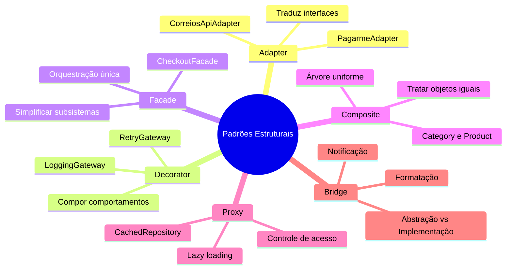
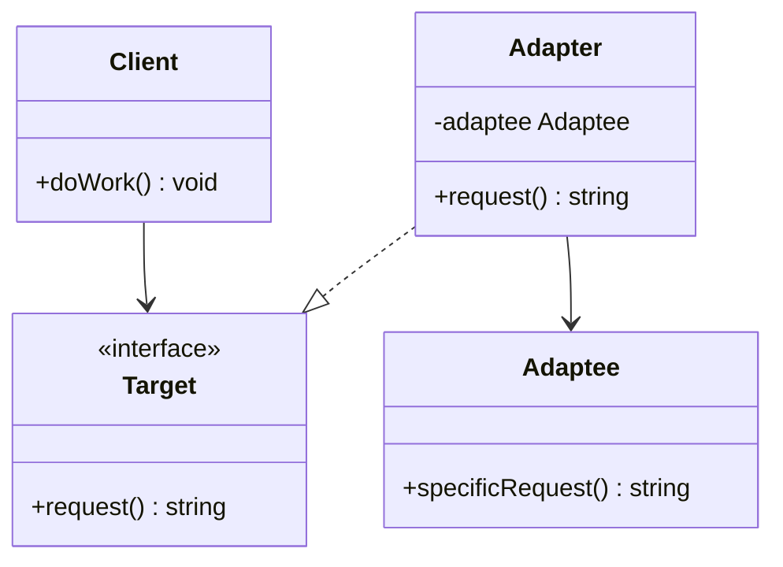
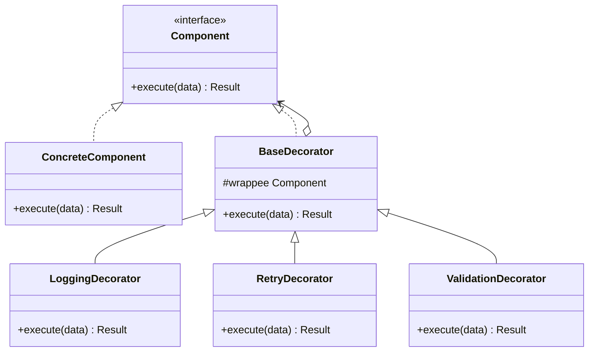
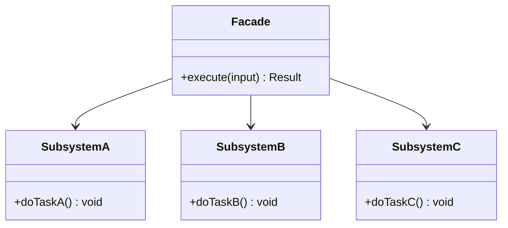
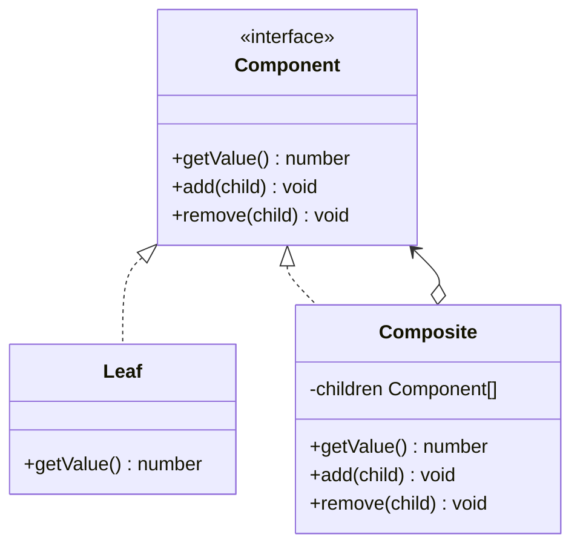
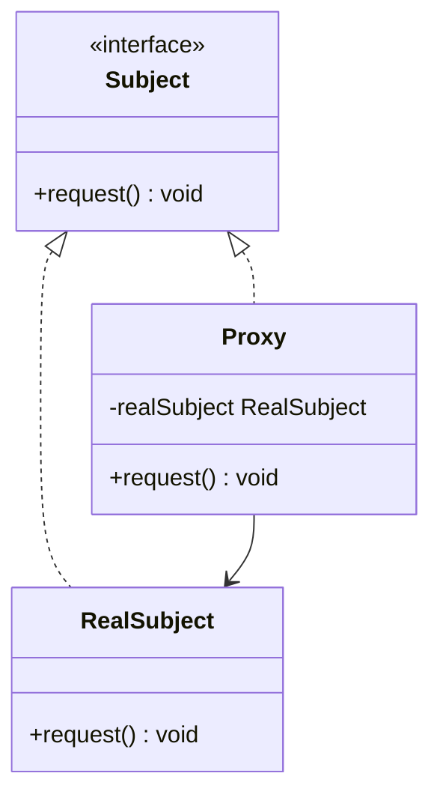
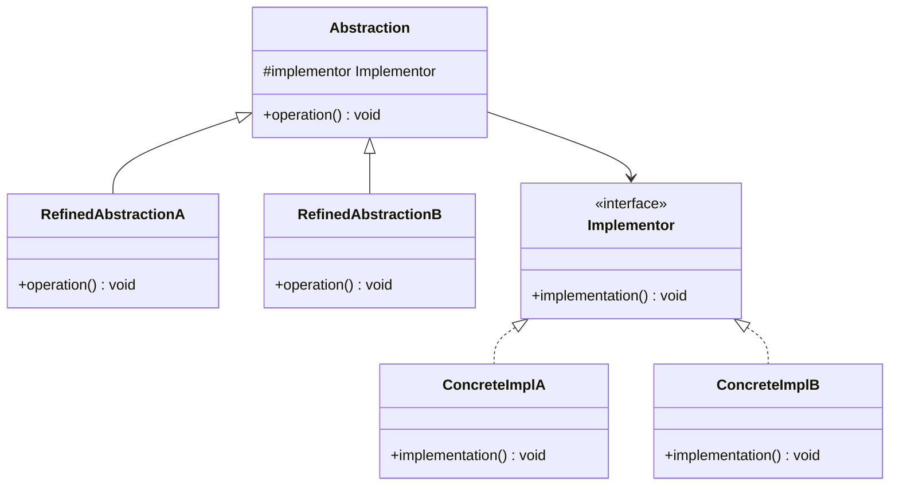

# Engenharia de Software — Aula 07

## Padrões Estruturais — Adapter, Decorator, Facade, Composite, Proxy e Bridge

**Duração estimada:** 100 minutos (45 de leitura + 55 de prática)
**Nível:** Intermediário
**Pré-requisitos:** Aulas 01-06 (Clean Code, SOLID, DDD, Clean Architecture, Padrões Criacionais)

---

## Objetivos de Aprendizagem

Ao final desta aula, você será capaz de:

- [ ] **Explicar** o problema fundamental que os padrões estruturais resolvem — compor objetos em estruturas maiores sem acoplamento rígido
- [ ] **Construir** um Adapter que traduz interfaces incompatíveis sem modificar o código existente
- [ ] **Compor** comportamentos dinamicamente usando Decorator, empilhando responsabilidades sem herança
- [ ] **Simplificar** subsistemas complexos com Facade, expondo uma única interface de alto nível
- [ ] **Aplicar** Composite para tratar objetos individuais e composições de forma uniforme
- [ ] **Interceptar** acesso a objetos com Proxy para lazy loading, cache e controle de permissões
- [ ] **Distinguir** Bridge de outros padrões estruturais — separar abstração de implementação
- [ ] **Comparar** os 6 padrões e selecionar o adequado para cada cenário de acoplamento estrutural
- [ ] **Integrar** Adapter + Decorator + Facade em um mesmo fluxo (checkout do e-commerce)
- [ ] **Reconhecer** qual pattern estrutural cada problema de design exige (diagnóstico de código)

---

## Como Usar Esta Aula

Esta aula está dividida em duas partes. A **primeira parte** (seções 1 a 7) constrói a base conceitual sobre padrões estruturais — cada padrão é apresentado com problema, solução, diagrama e código. A **segunda parte** (seções 8 a 13) aplica todos os padrões juntos no contexto do e-commerce que você vem construindo.

Cada seção termina com um **Quick Check** para verificar a compreensão antes de avançar. Os **Exercícios Graduados** ao final consolidam o aprendizado com três níveis de dificuldade. O arquivo **Questões de Aprendizagem** traz tarefas de checkpoint para provar domínio.

---

## Mapa Mental




---

## Recapitulação das Aulas 01-06

| Aula | Conceito | Conexão com Padrões Estruturais |
|---|---|---|
| Aula 01 — Clean Code | Nomes significativos, funções pequenas | Adapter e Facade revelam intenção através de nomes claros de interface |
| Aula 02 — SOLID | OCP, DIP — abstrações sobre implementações | Adapter usa DIP (depende de interface, não de API concreta); Proxy e Decorator usam OCP |
| Aula 03 — Refactoring | Extract Method, Extract Class | Adapter é essencialmente Extract Class + Move Method aplicados à interface |
| Aula 04 — DDD | Entities, VOs, Repository interfaces | Repository é um Adapter natural; Composite modela árvores de domínio |
| Aula 05 — Clean Architecture | 4 camadas, Composition Root, DI | Adapters vivem na camada de infraestrutura; Facade pertence à camada de aplicação |
| Aula 06 — Padrões Criacionais | Factory, Builder, Singleton | Decorator usa Factory para criar cadeias; Facade frequentemente usa Builder internamente |

---

**FUNDAMENTOS: Compondo Objetos para Formar Estruturas Maiores**

> *Padrões estruturais tratam de como classes e objetos são compostos para formar estruturas maiores. Diferente dos padrões criacionais (que controlam a criação), os estruturais definem **relacionamentos** — como objetos se conectam, se envolvem e se delegam. Os conceitos desta seção são universais — valem para qualquer linguagem. Na segunda parte, você verá cada um aplicado no e-commerce.*

---

## 1. O Problema do Acoplamento Estrutural

### O que são padrões estruturais

Padrões estruturais são receitas de design que definem **como compor objetos e classes**. Enquanto padrões criacionais respondem a "quem cria esse objeto?", os estruturais respondem a "como esses objetos se conectam sem se acoplar?"

### O problema que eles resolvem

Sistemas de software crescem. O que começa com 3 classes vira 30, depois 300. Conforme o número de classes aumenta, a **estrutura** — o grafo de conexões entre elas — se torna o principal determinante da complexidade.

```typescript
// Cenário: sistema de vendas sem padrões estruturais
class OrderService {
  async checkout(cart: Cart): Promise<Order> {
    // Acoplamento direto a 3 APIs externas
    const shippingResponse = await fetch('https://shipping-provider.example.com/quote', { ... });
    const shippingData = await shippingResponse.xml(); // XML!
    
    const paymentResponse = await fetch('https://payment-gateway.example.com/transactions', { ... });
    const paymentData = await paymentResponse.json();
    
    const emailResponse = await fetch('https://email-service.example.com/mail/send', { ... });
    
    // Lógica de negócio misturada com chamadas de infraestrutura
    if (correiosData.Valor > 100) { /* ... */ }
    if (pagarmeData.status === 'refused') { /* ... */ }
  }
}
```

Este código tem **três problemas estruturais**:
1. **Acoplamento a formatos externos** — shipping API retorna XML, sistema espera JSON
2. **Mistura de responsabilidades** — lógica de negócio e chamadas de API no mesmo método
3. **Dificuldade de teste** — cada `fetch` exige mock de servidor HTTP real

### O que os padrões estruturais propõem

Cada pattern estrutural ataca uma dimensão diferente do acoplamento:

| Padrão | O que resolve | Metáfora |
|---|---|---|
| **Adapter** | Interfaces incompatíveis | Tomada adaptadora (2 pinos → 3 pinos) |
| **Decorator** | Adicionar comportamento sem modificar | Empilhar camadas (cebola) |
| **Facade** | Subsistema complexo demais | Balcão único de atendimento |
| **Composite** | Tratar objeto individual e grupo igualmente | Arquivo e pasta |
| **Proxy** | Controle de acesso a um objeto | Assistente pessoal (filtra chamadas) |
| **Bridge** | Duas dimensões de variação | Controle remoto + TV (independentes) |

### Quick Check 1

**1. Qual a diferença fundamental entre padrões criacionais e estruturais?**
**Resposta:** Criacionais controlam **como** objetos são criados (o `new`). Estruturais definem **como** objetos se conectam e se compõem (o relacionamento).

**2. Cite dois problemas estruturais que o exemplo do `OrderService.checkout` apresenta.**
**Resposta:** Acoplamento a formatos externos (XML da API de frete) e mistura de lógica de negócio com chamadas de infraestrutura (violação de SRP).

---

## 2. Adapter — Traduzindo Interfaces Incompatíveis

### O que é

O **Adapter** é um padrão estrutural que permite que objetos com interfaces incompatíveis colaborem. Ele atua como uma **camada de tradução**: recebe chamadas no formato esperado pelo cliente, traduz para o formato do serviço externo e devolve a resposta no formato esperado.

### Por que importa

Toda integração com sistema externo envolve uma interface que **não foi projetada por você**. Uma API de frete retorna XML, mas seu sistema usa objetos TypeScript. O gateway de pagamento espera campos em snake_case, mas seu domínio usa camelCase. Sem o Adapter, cada integração contamina seu código com detalhes de formato externo.

### Estrutura



### Exemplo: PaymentApiAdapter

```typescript
// ANTES — código acoplado ao formato externo
async function processPayment(amount: number, token: string) {
  // Chamada direta à API externa com formato específico
  const response = await fetch('https://api.external-pay.com/v1/charge', {
    method: 'POST',
    body: JSON.stringify({
      valor: amount,           // campo em português
      card_token: token,       // snake_case
      moeda: 'BRL',
    }),
  });
  const result = await response.json();
  // Formato de retorno diferente do esperado
  return {
    id: result.transacao_id,
    status: result.aprovado ? 'approved' : 'refused',
    // ...
  };
}
```

**Problema:** cada chamada à API externa exige conhecer o formato específico. Trocar de provedor significa reescrever todo o código que faz a chamada.

```typescript
// DEPOIS — Adapter isola o formato externo
interface PaymentProvider {
  charge(amount: number, cardToken: string): Promise<PaymentResult>;
}

interface PaymentResult {
  transactionId: string;
  status: 'approved' | 'refused';
  processedAt: Date;
}

class ExternalPaymentAdapter implements PaymentProvider {
  private apiUrl = 'https://api.external-pay.com/v1';

  async charge(amount: number, cardToken: string): Promise<PaymentResult> {
    // O adapter centraliza o formato externo AQUI
    const response = await fetch(`${this.apiUrl}/charge`, {
      method: 'POST',
      body: JSON.stringify({
        valor: amount,
        card_token: cardToken,
        moeda: 'BRL',
      }),
    });
    const result = await response.json();

    // Tradução do formato externo para o contrato esperado
    return {
      transactionId: result.transacao_id,
      status: result.aprovado ? 'approved' : 'refused',
      processedAt: new Date(result.processado_em),
    };
  }
}

// Uso — o código cliente nunca vê o formato externo
async function createPayment(provider: PaymentProvider, amount: number, token: string) {
  const result = await provider.charge(amount, token);
  return result;
}
```

**Vantagens do Adapter:**
1. Trocar de provedor = criar novo adapter, zero alteração no código de negócio
2. Testar = mockar a interface `PaymentProvider`, não a API externa
3. Formato externo fica isolado em UM arquivo, não espalhado pelo sistema

### Quick Check 2

**1. O que o Adapter faz com a interface incompatível?**
**Resposta:** Traduz — recebe chamadas no formato esperado pelo cliente, converte para o formato do serviço externo e devolve a resposta traduzida.

**2. Qual o impacto de não usar Adapter ao integrar com uma API externa?**
**Resposta:** O formato externo (XML, snake_case, campos específicos) vaza para todo o código que chama a API. Trocar de provedor exige modificar N arquivos em vez de um.

---

## 3. Decorator — Adicionando Comportamento sem Modificar

### O que é

O **Decorator** é um padrão estrutural que permite adicionar comportamentos a um objeto sem modificar sua classe. Ele faz isso **envolvendo** o objeto original em outro objeto (o decorator) que implementa a mesma interface.

### Por que importa

Você precisa adicionar logging a um processador de pagamento, mas não quer modificar a classe `CreditCardGateway`. Depois precisa adicionar retry (3 tentativas). Depois validação. Se você modificar a classe original a cada nova responsabilidade, ela vira uma god class. Se usar herança, precisa de `LoggingCreditCardGateway`, `RetryCreditCardGateway`, `LoggingRetryCreditCardGateway` — explosão combinatória.

### Estrutura



### Exemplo: Decorator de Processamento

```typescript
// Interface que todos implementam
interface Processor {
  process(input: any): Promise<any>;
}

// Componente concreto — o objeto original
class CoreProcessor implements Processor {
  async process(input: any): Promise<any> {
    console.log('CoreProcessor: executando lógica principal');
    return { status: 'ok', result: input };
  }
}

// Decorator base — mantém referência ao wrappee
abstract class ProcessorDecorator implements Processor {
  constructor(protected wrappee: Processor) {}

  async process(input: any): Promise<any> {
    return this.wrappee.process(input);
  }
}

// Decorator concreto: Logging
class LoggingDecorator extends ProcessorDecorator {
  async process(input: any): Promise<any> {
    console.log(`[LOG] Iniciando processamento com input:`, input);
    const start = Date.now();
    try {
      const result = await this.wrappee.process(input);
      console.log(`[LOG] Processamento concluído em ${Date.now() - start}ms`);
      return result;
    } catch (error) {
      console.error(`[LOG] Processamento falhou após ${Date.now() - start}ms:`, error);
      throw error;
    }
  }
}

// Decorator concreto: Retry
class RetryDecorator extends ProcessorDecorator {
  constructor(wrappee: Processor, private maxRetries: number = 3) {
    super(wrappee);
  }

  async process(input: any): Promise<any> {
    let lastError: Error | null = null;
    for (let attempt = 1; attempt <= this.maxRetries; attempt++) {
      try {
        return await this.wrappee.process(input);
      } catch (error) {
        lastError = error as Error;
        console.log(`[RETRY] Tentativa ${attempt}/${this.maxRetries} falhou`);
        if (attempt < this.maxRetries) {
          const delay = Math.pow(2, attempt) * 100; // backoff exponencial
          await new Promise(resolve => setTimeout(resolve, delay));
        }
      }
    }
    throw lastError;
  }
}

// Decorator concreto: Validação
class ValidationDecorator extends ProcessorDecorator {
  async process(input: any): Promise<any> {
    if (!input) throw new Error('Input is required');
    if (typeof input.amount !== 'number' || input.amount <= 0) {
      throw new Error('Amount must be a positive number');
    }
    return this.wrappee.process(input);
  }
}

// Uso — composição via empilhamento
const processor = new LoggingDecorator(
  new RetryDecorator(
    new ValidationDecorator(
      new CoreProcessor()
    )
  )
);

await processor.process({ amount: 150 });
// [LOG] Iniciando processamento com input: { amount: 150 }
// CoreProcessor: executando lógica principal
// [LOG] Processamento concluído em Xms

// Ordem alternativa — validação antes de logging
const processor2 = new ValidationDecorator(
  new LoggingDecorator(
    new CoreProcessor()
  )
);
```

**Princípio:** a ordem dos decorators importa. Cada camada adiciona uma responsabilidade. A pilha executa de fora para dentro: Logging → Retry → Validation → Core.

### Quick Check 3

**1. Por que Decorator é melhor que herança para adicionar comportamentos?**
**Resposta:** Herança cria explosão combinatória (N comportamentos = 2^N classes). Decorator compõe linearmente (N decorators = N classes + 1 componente).

**2. O que determina a ordem de execução em uma cadeia de decorators?**
**Resposta:** A ordem de empilhamento — o decorator mais externo executa primeiro, depois delega para o interno, até chegar ao componente concreto.

---

## 4. Facade — Interface Simplificada para Subsistemas Complexos

### O que é

O **Facade** é um padrão estrutural que fornece uma **interface simplificada** para um subsistema complexo. O cliente chama um único método no Facade, que internamente orquestra múltiplos componentes.

### Por que importa

Orquestrar 4 serviços (validar estoque, calcular frete, processar pagamento, criar pedido) exige conhecer a interface de cada um, a ordem correta de chamadas e o tratamento de erros de cada etapa. Se cada controller repete essa orquestração, você tem duplicação em N lugares. O Facade centraliza essa coreografia em um lugar só.

### Estrutura



### Exemplo: OrderWorkflowFacade

```typescript
// Subsistemas (simplificados)
class InventoryService {
  async checkAvailability(productId: string, quantity: number): Promise<boolean> {
    console.log(`Verificando estoque: ${productId} x${quantity}`);
    return true;
  }
}

class PricingService {
  async calculateTotal(items: any[]): Promise<number> {
    const total = items.reduce((sum, item) => sum + item.price * item.quantity, 0);
    console.log(`Total calculado: ${total}`);
    return total;
  }
}

class NotificationService {
  async sendEmail(to: string, subject: string, body: string): Promise<void> {
    console.log(`Email enviado para ${to}: ${subject}`);
  }
}

class AuditService {
  async log(event: string, data: any): Promise<void> {
    console.log(`Audit: ${event}`, data);
  }
}

// ANTES — cliente orquestra tudo manualmente
async function checkoutWithoutFacade(cart: any, customer: any) {
  // 15 linhas de orquestração
  const inventory = new InventoryService();
  for (const item of cart.items) {
    const available = await inventory.checkAvailability(item.productId, item.quantity);
    if (!available) throw new Error(`Item ${item.productId} sem estoque`);
  }

  const pricing = new PricingService();
  const total = await pricing.calculateTotal(cart.items);

  // ... processar pagamento ...
  // ... criar pedido ...
  // ... notificar cliente ...
  // ... auditar ...

  return { total };
}

// DEPOIS — Facade centraliza a orquestração
class OrderWorkflowFacade {
  constructor(
    private inventory: InventoryService,
    private pricing: PricingService,
    private notification: NotificationService,
    private audit: AuditService
  ) {}

  async execute(cart: any, customer: any): Promise<WorkflowResult> {
    // 1. Validar estoque
    for (const item of cart.items) {
      const available = await this.inventory.checkAvailability(item.productId, item.quantity);
      if (!available) {
        throw new WorkflowError(`Item sem estoque: ${item.productId}`);
      }
    }

    // 2. Calcular totais
    const total = await this.pricing.calculateTotal(cart.items);

    // 3. Processar pagamento (simplificado)
    const paymentResult = { id: 'tx-123', status: 'approved' as const };

    // 4. Criar pedido
    const order = { id: 'ord-123', total, items: cart.items };

    // 5. Notificar
    await this.notification.sendEmail(customer.email, 'Pedido confirmado', `Pedido ${order.id}`);

    // 6. Auditar
    await this.audit.log('ORDER_CREATED', { orderId: order.id });

    return { orderId: order.id, paymentId: paymentResult.id, total };
  }
}

// Uso — o cliente chama UMA linha
const facade = new OrderWorkflowFacade(
  new InventoryService(),
  new PricingService(),
  new NotificationService(),
  new AuditService()
);

const result = await facade.execute(cart, customer);
console.log(`Pedido ${result.orderId} criado com sucesso`);
```

**Quando usar Facade:**
- Um subsistema tem muitos componentes que o cliente precisa orquestrar
- A ordem de chamadas entre componentes é importante e deve ser padronizada
- Você quer esconder a complexidade do subsistema do cliente

### Quick Check 4

**1. Qual a diferença entre Facade e apenas criar um método auxiliar?**
**Resposta:** Um Facade é um **objeto dedicado** com seu próprio ciclo de vida, dependências injetadas e responsabilidade definida (orquestração). Um método auxiliar é uma função solta sem esses atributos.

**2. O Facade viola o SRP (Single Responsibility Principle)?**
**Resposta:** Não — a responsabilidade do Facade é **orquestrar** o subsistema. "Orquestrar" é uma responsabilidade única, diferente de "processar pagamento" ou "calcular frete".

---

## 5. Composite — Tratando Árvores Uniformemente

### O que é

O **Composite** é um padrão estrutural que permite tratar objetos individuais e composições de objetos de forma **uniforme**. O cliente não precisa saber se está lidando com um objeto simples (leaf) ou com uma estrutura complexa (composite).

### Por que importa

Sistemas frequentemente modelam hierarquias parte-todo: arquivos e pastas, produtos e categorias, itens e bundles. Sem Composite, o código precisa de `if (item instanceof Bundle)` para tratar agrupamentos — cada nova regra de negócio precisa saber a diferença entre leaf e composite.

### Estrutura



### Exemplo: FileSystemComponent

```typescript
// Interface comum — trata leaf e composite igualmente
interface FileSystemComponent {
  getName(): string;
  getSize(): number;  // Funciona para arquivo individual OU pasta
}

// Leaf — objeto individual
class File implements FileSystemComponent {
  constructor(private name: string, private size: number) {}

  getName(): string { return this.name; }

  getSize(): number {
    return this.size;
  }
}

// Composite — objeto que contém outros componentes
class Folder implements FileSystemComponent {
  private children: FileSystemComponent[] = [];

  constructor(private name: string) {}

  getName(): string { return this.name; }

  add(component: FileSystemComponent): void {
    this.children.push(component);
  }

  remove(component: FileSystemComponent): void {
    this.children = this.children.filter(c => c !== component);
  }

  getSize(): number {
    // Delega o cálculo para os filhos — recursão natural
    return this.children.reduce((total, child) => total + child.getSize(), 0);
  }

  listContents(indent: string = ''): void {
    console.log(`${indent}📁 ${this.name}/ (${this.getSize()} bytes)`);
    for (const child of this.children) {
      if (child instanceof Folder) {
        (child as Folder).listContents(indent + '  ');
      } else {
        console.log(`${indent}  📄 ${child.getName()} (${child.getSize()} bytes)`);
      }
    }
  }
}

// Uso — cliente trata tudo como FileSystemComponent
function calculateTotalSize(components: FileSystemComponent[]): number {
  return components.reduce((sum, c) => sum + c.getSize(), 0);
}

// Construindo a estrutura
const file1 = new File('index.ts', 2048);
const file2 = new File('style.css', 1024);
const file3 = new File('main.ts', 4096);

const srcFolder = new Folder('src');
srcFolder.add(file1);
srcFolder.add(file2);

const distFolder = new Folder('dist');
distFolder.add(file3);

const root = new Folder('project');
root.add(srcFolder);
root.add(distFolder);

// Cliente trata tudo uniformemente
console.log(`Tamanho total: ${root.getSize()} bytes`);
// Chama recursivamente: project → src (file1 + file2) + dist (file3)
// Resultado: 2048 + 1024 + 4096 = 7168 bytes

console.log(`Tamanho do src: ${srcFolder.getSize()} bytes`); // 3072
console.log(`Tamanho do index.ts: ${file1.getSize()} bytes`); // 2048
```

**O truque do Composite:** não há `if` para verificar se é File ou Folder. `getSize()` funciona em ambos porque ambos implementam a mesma interface. O Folder delega para os filhos recursivamente.

### Quick Check 5

**1. Qual a principal vantagem do Composite sobre tratar leaf e composite separadamente?**
**Resposta:** O cliente não precisa saber com qual tipo está lidando — trata todos os objetos uniformemente via interface comum. Não há `if (instanceof)` para distinguir leaf de composite.

**2. Como o Composite calcula o valor total de uma estrutura aninhada?**
**Resposta:** Recursivamente — o composite itera sobre seus filhos e chama `getValue()` em cada um. Se o filho é leaf, retorna seu valor. Se é composite, chama `getValue()` dos netos, e assim por diante.

---

## 6. Proxy — Controle de Acesso a Objetos

### O que é

O **Proxy** é um padrão estrutural que fornece um **substituto** para outro objeto, controlando o acesso a ele. O proxy implementa a mesma interface do objeto real e pode adicionar comportamentos antes, depois ou no lugar da chamada real.

### Por que importa

Acessar um objeto pode ser caro (consulta ao banco), lento (download de imagem) ou perigoso (operação sem permissão). O Proxy resolve isso interceptando a chamada e decidindo: "vou passar para o objeto real" ou "vou responder do cache" ou "vou negar o acesso".

### Tipos comuns de Proxy

1. **Lazy Proxy** — só cria o objeto real quando ele for realmente necessário
2. **Cache Proxy** — armazena resultados para evitar consultas repetidas
3. **Protection Proxy** — verifica permissões antes de delegar
4. **Remote Proxy** — encapsula comunicação com objeto remoto

### Estrutura



### Exemplo: CachedDataRepository

```typescript
// Interface do repositório
interface DataRepository {
  findById(id: string): Promise<Data | null>;
}

// Objeto real — consulta a fonte de dados
class DatabaseRepository implements DataRepository {
  async findById(id: string): Promise<Data | null> {
    console.log(`[DB] Consultando dados para id: ${id}`);
    // Simula consulta lenta ao banco
    await new Promise(resolve => setTimeout(resolve, 1000));
    return { id, name: `Item ${id}`, timestamp: new Date() };
  }
}

// Proxy de cache — intercepta e cacheia resultados
class CachedRepository implements DataRepository {
  private cache = new Map<string, { data: Data; cachedAt: Date }>();

  constructor(private realRepository: DataRepository) {}

  async findById(id: string): Promise<Data | null> {
    const cached = this.cache.get(id);

    if (cached) {
      // Cache hit — retorna sem consultar o banco
      console.log(`[CACHE] Hit para id: ${id}`);
      return cached.data;
    }

    // Cache miss — consulta o banco e armazena
    console.log(`[CACHE] Miss para id: ${id}`);
    const data = await this.realRepository.findById(id);

    if (data) {
      this.cache.set(id, { data, cachedAt: new Date() });
    }

    return data;
  }

  clearCache(): void {
    this.cache.clear();
    console.log('[CACHE] Cache limpo');
  }
}

// Uso
const realRepo = new DatabaseRepository();
const cachedRepo = new CachedRepository(realRepo);

// Primeira chamada — cache miss, consulta o banco
const data1 = await cachedRepo.findById('123');
// [CACHE] Miss para id: 123
// [DB] Consultando dados para id: 123

// Segunda chamada — cache hit, resposta imediata
const data2 = await cachedRepo.findById('123');
// [CACHE] Hit para id: 123
// (sem consulta ao banco)
```

### Proxy de Proteção

```typescript
// Proxy que verifica permissões
class ProtectedRepository implements DataRepository {
  constructor(
    private realRepository: DataRepository,
    private allowedRoles: string[]
  ) {}

  async findById(id: string, userRole?: string): Promise<Data | null> {
    if (!userRole || !this.allowedRoles.includes(userRole)) {
      throw new Error(`Acesso negado: role ${userRole} não autorizada`);
    }
    return this.realRepository.findById(id);
  }
}
```

**Proxy vs Decorator:** Ambos envolvem um objeto real. A diferença é de **intenção**: o Decorator **adiciona** comportamento; o Proxy **controla** acesso. O Decorator pode empilhar N camadas; o Proxy normalmente é uma única camada de controle.

### Quick Check 6

**1. Qual a diferença entre Proxy e Decorator?**
**Resposta:** Proxy **controla acesso** ao objeto real (cache, lazy loading, segurança). Decorator **adiciona comportamento** ao objeto real. Proxy é uma única camada de controle; Decorator permite empilhamento infinito.

**2. O que um Cache Proxy faz quando encontra um cache hit?**
**Resposta:** Retorna o dado armazenado sem chamar o objeto real — evitando a operação custosa (consulta ao banco, chamada de rede, etc.).

---

## 7. Bridge — Separando Abstração de Implementação

### O que é

O **Bridge** é um padrão estrutural que **separa uma abstração de sua implementação** para que ambas possam variar independentemente. Em vez de uma hierarquia fixa de classes, você tem duas hierarquias paralelas conectadas por uma ponte.

### Por que importa

Quando um objeto varia em **duas dimensões** (ex: tipo de notificação × formato da mensagem), a abordagem ingênua cria uma classe para cada combinação. Se você tem 3 tipos de notificação e 2 formatos, são 6 classes (`EmailHTMLNotifier`, `EmailPlainTextNotifier`, `SMSHTMLNotifier`, ...). Com Bridge, são 3 + 2 = 5 classes — e adicionar uma nova dimensão não explode combinatorialmente.

### Estrutura



### Exemplo: Notifier × Formatter

```typescript
// === DIMENSÃO 1: Implementação (o "como") ===
interface MessageFormatter {
  format(title: string, body: string): string;
}

class HTMLFormatter implements MessageFormatter {
  format(title: string, body: string): string {
    return `<html><h1>${title}</h1><p>${body}</p></html>`;
  }
}

class PlainTextFormatter implements MessageFormatter {
  format(title: string, body: string): string {
    return `${title}\n\n${body}`;
  }
}

// === DIMENSÃO 2: Abstração (o "o quê") ===
abstract class Notifier {
  constructor(protected formatter: MessageFormatter) {}

  abstract send(to: string, title: string, body: string): Promise<void>;
}

class EmailNotifier extends Notifier {
  async send(to: string, title: string, body: string): Promise<void> {
    const formatted = this.formatter.format(title, body);
    console.log(`📧 Email para ${to}:\n${formatted}`);
  }
}

class SMSNotifier extends Notifier {
  async send(to: string, title: string, body: string): Promise<void> {
    const formatted = this.formatter.format(title, body);
    console.log(`📱 SMS para ${to}:\n${formatted}`);
  }
}

class PushNotifier extends Notifier {
  async send(to: string, title: string, body: string): Promise<void> {
    const formatted = this.formatter.format(title, body);
    console.log(`🔔 Push para ${to}:\n${formatted}`);
  }
}

// === USO — combinações sem explosão de classes ===
const htmlEmail = new EmailNotifier(new HTMLFormatter());
await htmlEmail.send('user@example.com', 'Olá!', 'Bem-vindo ao sistema');

const plainSMS = new SMSNotifier(new PlainTextFormatter());
await plainSMS.send('+551199999999', 'Código', 'Seu código é 1234');

const htmlPush = new PushNotifier(new HTMLFormatter());
await htmlPush.send('device-token-xyz', 'Notificação', 'Você tem uma nova mensagem');

// Adicionar novo formato = criar classe que implementa MessageFormatter
// Adicionar novo canal = criar classe que estende Notifier
// Sempre OCP — nunca modificar existente
```

**Sem Bridge (explosão combinatória):** 3 canais × 2 formatos = 6 classes. Se adicionar Markdown como formato: 3 × 3 = 9 classes.

**Com Bridge:** 3 canais + 2 formatos = 5 classes. Adicionar Markdown: 3 + 3 = 6 classes.

### Quick Check 7

**1. Que problema o Bridge resolve que herança não resolve?**
**Resposta:** Explosão combinatória de classes. Com duas dimensões de variação (canais × formatos), herança cria N×M classes. Bridge cria N + M classes.

**2. Como se adiciona um novo formato de mensagem (ex: Markdown) sem modificar código existente?**
**Resposta:** Cria-se uma nova classe `MarkdownFormatter` que implementa `MessageFormatter`. Nenhum notifier existente precisa ser modificado (OCP).

---

**APLICAÇÃO: Padrões Estruturais no E-commerce**

> *Agora que você entende os fundamentos de cada padrão estrutural, vamos conectá-los à prática no projeto de e-commerce. Cada seção implementa um padrão no contexto real da API que você vem construindo — isolando APIs externas, compondo gateways de pagamento e simplificando o checkout.*

---

## 8. Adapter: Isolando APIs Externas

No e-commerce, dois adapters são essenciais: um para o serviço de frete dos Correios e outro para gateways de pagamento.

### CorreiosApiAdapter

```typescript
// domain/interfaces/shipping-provider.ts
export interface IShippingProvider {
  calculateFreight(cep: string, weight: number): Promise<FreightQuote>;
}

export interface FreightQuote {
  provider: string;
  cost: number;
  deliveryDays: number;
  serviceType: string;
}

// infrastructure/shipping/correios-adapter.ts
export class CorreiosApiAdapter implements IShippingProvider {
  private apiUrl = 'https://api.correios.com.br/calc/v1';

  async calculateFreight(cep: string, weight: number): Promise<FreightQuote> {
    // 1. Traduz parâmetros para o formato dos Correios
    const params = new URLSearchParams({
      cep_destino: cep.replace(/\D/g, ''),
      peso: weight.toString(),
      formato: 'caixa',
    });

    // 2. Chama a API externa
    const response = await fetch(`${this.apiUrl}?${params}`);
    const xml = await response.text();

    // 3. Parseia XML retornado
    const cost = this.extractFromXML(xml, 'Valor');
    const days = parseInt(this.extractFromXML(xml, 'PrazoEntrega'), 10);

    // 4. Retorna no formato esperado pelo sistema
    return {
      provider: 'Correios',
      cost: parseFloat(cost),
      deliveryDays: days,
      serviceType: 'SEDEX',
    };
  }

  private extractFromXML(xml: string, tag: string): string {
    const match = xml.match(new RegExp(`<${tag}>(.*?)<\/${tag}>`));
    return match ? match[1] : '0';
  }
}

// Uso — o sistema nunca vê XML
const shippingProvider: IShippingProvider = new CorreiosApiAdapter();
const quote = await shippingProvider.calculateFreight('01001-000', 1.5);
console.log(quote.cost); // number — não string do XML
```

### PagarmeAdapter (gateway de pagamento)

```typescript
// infrastructure/payment/pagarme-adapter.ts
export class PagarmeAdapter implements IPaymentGateway {
  private apiKey = process.env.PAGARME_API_KEY;

  async process(amount: number, cardData: CardInfo): Promise<PaymentResult> {
    const response = await fetch('https://api.pagar.me/1/transactions', {
      method: 'POST',
      headers: {
        'Authorization': `Basic ${Buffer.from(`${this.apiKey}:x`).toString('base64')}`,
        'Content-Type': 'application/json',
      },
      body: JSON.stringify({
        amount: Math.round(amount * 100), // PagarMe espera centavos
        card_number: cardData.number,
        card_holder_name: cardData.holderName,
        card_expiration_date: cardData.expiry,
        card_cvv: cardData.cvv,
      }),
    });

    const result = await response.json();

    return {
      transactionId: result.id,
      status: result.status === 'paid' ? 'approved' : 'refused',
      processedAt: new Date(result.date_created),
      gatewayRef: result.tid,
    };
  }
}
```

**Trocar de gateway?** Crie `StripeAdapter`, `StoneAdapter`, ou `MercadoPagoAdapter` — todos implementam `IPaymentGateway`. O sistema de e-commerce nunca sabe qual gateway está sendo usado.

---

## 9. Decorator: Compondo Comportamentos de Pagamento

O gateway de pagamento do e-commerce precisa de logging, retry e validação. Em vez de modificar o `CreditCardGateway`, aplicamos Decorator.

```typescript
// infrastructure/payment/decorators/gateway-decorators.ts

// Decorator base
abstract class PaymentGatewayDecorator implements IPaymentGateway {
  constructor(protected wrappee: IPaymentGateway) {}

  async process(amount: number, cardData: CardInfo): Promise<PaymentResult> {
    return this.wrappee.process(amount, cardData);
  }
}

// Logging decorator
class LoggingPaymentGateway extends PaymentGatewayDecorator {
  async process(amount: number, cardData: CardInfo): Promise<PaymentResult> {
    console.log(`[PAYMENT] Processando pagamento de R$${amount}`);
    const start = Date.now();
    try {
      const result = await this.wrappee.process(amount, cardData);
      console.log(`[PAYMENT] Concluído em ${Date.now() - start}ms. Status: ${result.status}`);
      return result;
    } catch (error) {
      console.error(`[PAYMENT] Falha após ${Date.now() - start}ms:`, error);
      throw error;
    }
  }
}

// Retry decorator
class RetryPaymentGateway extends PaymentGatewayDecorator {
  constructor(wrappee: IPaymentGateway, private maxRetries = 3) {
    super(wrappee);
  }

  async process(amount: number, cardData: CardInfo): Promise<PaymentResult> {
    let lastError: Error | null = null;
    for (let attempt = 1; attempt <= this.maxRetries; attempt++) {
      try {
        return await this.wrappee.process(amount, cardData);
      } catch (error) {
        lastError = error as Error;
        if (attempt < this.maxRetries) {
          const delay = Math.min(100 * Math.pow(2, attempt), 2000);
          await new Promise(resolve => setTimeout(resolve, delay));
        }
      }
    }
    throw lastError;
  }
}

// Validation decorator
class ValidationPaymentGateway extends PaymentGatewayDecorator {
  async process(amount: number, cardData: CardInfo): Promise<PaymentResult> {
    if (amount <= 0) throw new Error('Amount must be positive');
    if (!cardData.number || cardData.number.length < 13) {
      throw new Error('Invalid card number');
    }
    if (!cardData.cvv || cardData.cvv.length < 3) {
      throw new Error('Invalid CVV');
    }
    return this.wrappee.process(amount, cardData);
  }
}

// Composição — checkout com todos os decorators
function createPaymentGateway(): IPaymentGateway {
  const baseGateway = container.resolve('CreditCardGateway');

  return new LoggingPaymentGateway(
    new RetryPaymentGateway(
      new ValidationPaymentGateway(
        baseGateway
      )
    )
  );
}

// Uso
const gateway = createPaymentGateway();
const result = await gateway.process(299.90, cardInfo);
// Passeia por: Logging → Retry → Validation → CreditCardGateway
// Retorna: Validation → Retry → Logging
```

**Ordem importa:** validação deve ser a primeira a executar (mais interna na cadeia? Não — na verdade a validação deve ser a primeira a rodar na entrada, então fica externa). Revisão: `Logging(Retry(Validation(Core)))` executa Logging → Retry → Validation → Core na entrada. Se validação falha, o retry nem tenta de novo. Se a validação estiver interna ao retry, cada retry executaria validação de novo (desnecessário). A melhor ordem é `Validation(Logging(Retry(Core)))` — valida primeiro, falha rápido.

---

## 10. Facade: Simplificando o Checkout

O fluxo de checkout do e-commerce orquestra 5 serviços. Sem Facade, cada controller precisava conhecer todos eles.

```typescript
// application/facades/checkout-facade.ts
export interface CheckoutInput {
  customerId: string;
  items: CheckoutItem[];
  shippingCep: string;
  paymentMethod: string;
  cardData?: CardInfo;
  couponCode?: string;
}

export interface CheckoutResult {
  orderId: string;
  paymentId: string;
  total: number;
  freight: number;
  estimatedDelivery: Date;
}

export class CheckoutFacade {
  constructor(
    private inventoryService: IInventoryService,
    private shippingService: IShippingService,
    private paymentService: IPaymentService,
    private orderService: IOrderService,
    private notificationService: INotificationService
  ) {}

  async checkout(input: CheckoutInput): Promise<CheckoutResult> {
    // 1. Validar estoque
    for (const item of input.items) {
      const available = await this.inventoryService.checkStock(item.productId, item.quantity);
      if (!available) {
        throw new CheckoutError(`Produto ${item.productId} sem estoque suficiente`);
      }
    }

    // 2. Calcular frete
    const weight = input.items.reduce((sum, i) => sum + i.weight * i.quantity, 0);
    const freight = await this.shippingService.calculateFreight(input.shippingCep, weight);

    // 3. Aplicar cupom se houver
    let discount = 0;
    if (input.couponCode) {
      const coupon = await this.orderService.validateCoupon(input.couponCode);
      discount = coupon ? coupon.discountPercent / 100 : 0;
    }

    // 4. Calcular total
    const subtotal = input.items.reduce((sum, i) => sum + i.price * i.quantity, 0);
    const total = subtotal * (1 - discount) + freight.cost;

    // 5. Processar pagamento
    const payment = await this.paymentService.process({
      amount: total,
      method: input.paymentMethod,
      cardData: input.cardData,
    });

    // 6. Criar pedido
    const order = await this.orderService.create({
      customerId: input.customerId,
      items: input.items,
      total,
      freight: freight.cost,
      paymentId: payment.transactionId,
    });

    // 7. Notificar cliente
    await this.notificationService.sendOrderConfirmation(input.customerId, order.id);

    return {
      orderId: order.id,
      paymentId: payment.transactionId,
      total,
      freight: freight.cost,
      estimatedDelivery: freight.estimatedDate,
    };
  }
}

// Controller — 1 linha vs 20
@injectable()
class CheckoutController {
  constructor(private checkoutFacade: CheckoutFacade) {}

  async handle(req: Request, res: Response): Promise<void> {
    const result = await this.checkoutFacade.checkout(req.body);
    res.status(201).json(result);
  }
}
```

---

## 11. Composite: Categorias de Produtos

O e-commerce tem categorias de produtos que formam uma árvore: "Eletrônicos" contém "Computadores" e "Acessórios", que contêm produtos individuais.

```typescript
// domain/interfaces/product-category.ts
export interface CategoryComponent {
  getId(): string;
  getName(): string;
  getAveragePrice(): number;
  getProductCount(): number;
}

// Leaf — produto individual
export class Product implements CategoryComponent {
  constructor(
    private id: string,
    private name: string,
    private price: number
  ) {}

  getId(): string { return this.id; }
  getName(): string { return this.name; }
  getAveragePrice(): number { return this.price; }
  getProductCount(): number { return 1; }
}

// Composite — categoria que contém produtos e subcategorias
export class Category implements CategoryComponent {
  private children: CategoryComponent[] = [];

  constructor(
    private id: string,
    private name: string
  ) {}

  getId(): string { return this.id; }
  getName(): string { return this.name; }

  add(component: CategoryComponent): void {
    this.children.push(component);
  }

  remove(component: CategoryComponent): void {
    this.children = this.children.filter(c => c.getId() !== component.getId());
  }

  getProductCount(): number {
    return this.children.reduce((sum, child) => sum + child.getProductCount(), 0);
  }

  getAveragePrice(): number {
    const total = this.children.reduce((sum, child) => sum + child.getAveragePrice(), 0);
    const count = this.children.length;
    return count > 0 ? total / count : 0;
  }

  listTree(indent: string = ''): string {
    let result = `${indent}📂 ${this.name} (preço médio: R$${this.getAveragePrice().toFixed(2)})\n`;
    for (const child of this.children) {
      if (child instanceof Category) {
        result += (child as Category).listTree(indent + '  ');
      } else {
        result += `${indent}  📦 ${child.getName()} - R$${(child as Product).getAveragePrice().toFixed(2)}\n`;
      }
    }
    return result;
  }
}

// Uso — construir árvore de categorias
const notebook = new Product('PROD-001', 'Notebook Ultra', 4500);
const mouse = new Product('PROD-002', 'Mouse Wireless', 150);
const keyboard = new Product('PROD-003', 'Teclado Mecânico', 350);

const computers = new Category('CAT-001', 'Computadores');
computers.add(notebook);

const accessories = new Category('CAT-002', 'Acessórios');
accessories.add(mouse);
accessories.add(keyboard);

const electronics = new Category('CAT-000', 'Eletrônicos');
electronics.add(computers);
electronics.add(accessories);

console.log(`Total de produtos: ${electronics.getProductCount()}`); // 3
console.log(`Preço médio: R$${electronics.getAveragePrice().toFixed(2)}`);
// (4500 + (150+350)/2) / 2 = (4500 + 250) / 2 = 2375

console.log(electronics.listTree());
// 📂 Eletrônicos (preço médio: R$2375.00)
//   📂 Computadores (preço médio: R$4500.00)
//     📦 Notebook Ultra - R$4500.00
//   📂 Acessórios (preço médio: R$250.00)
//     📦 Mouse Wireless - R$150.00
//     📦 Teclado Mecânico - R$350.00
```

**Benefício:** o relatório de vendas pode calcular preço médio sem saber se está lidando com uma categoria ou um produto. Adicionar um novo tipo de componente (ex: `Bundle`) exige apenas implementar `CategoryComponent`.

---

## 12. Proxy: Cache de Produtos

O catálogo de produtos é consultado centenas de vezes por minuto. Cada consulta ao PostgreSQL é cara. Um Cache Proxy resolve.

```typescript
// infrastructure/persistence/cached-product-repository.ts
export class CachedProductRepository implements IProductRepository {
  private cache = new Map<string, { product: Product; cachedAt: Date }>();
  private readonly TTL_MS = 5 * 60 * 1000; // 5 minutos

  constructor(
    private realRepository: IProductRepository
  ) {}

  async findById(id: string): Promise<Product | null> {
    const cached = this.cache.get(id);

    if (cached && (Date.now() - cached.cachedAt.getTime()) < this.TTL_MS) {
      console.log(`[Cache] Hit: ${id}`);
      return cached.product;
    }

    console.log(`[Cache] Miss: ${id} — consultando banco`);
    const product = await this.realRepository.findById(id);

    if (product) {
      this.cache.set(id, { product, cachedAt: new Date() });
    }

    return product;
  }

  async findByCategory(categoryId: string): Promise<Product[]> {
    const cacheKey = `cat:${categoryId}`;
    const cached = this.cache.get(cacheKey);

    if (cached && (Date.now() - cached.cachedAt.getTime()) < this.TTL_MS) {
      return [cached.product as any]; // simplificado
    }

    const products = await this.realRepository.findByCategory(categoryId);
    // Cacheia o primeiro produto como referência
    if (products.length > 0) {
      this.cache.set(cacheKey, { product: products[0] as any, cachedAt: new Date() });
    }
    return products;
  }

  async invalidate(id: string): Promise<void> {
    this.cache.delete(id);
    console.log(`[Cache] Invalidado: ${id}`);
  }

  async save(product: Product): Promise<void> {
    await this.realRepository.save(product);
    this.cache.set(product.id, { product, cachedAt: new Date() });
    // Cache write-through — atualiza cache ao salvar
  }
}

// Configuração no Composition Root
container.register('IProductRepository', {
  useFactory: () => {
    const realRepo = new PostgresProductRepository();
    return new CachedProductRepository(realRepo);
  },
});
```

**Lazy Loading:** carregar itens do pedido sob demanda:

```typescript
class LazyOrderLoader {
  private items: OrderItem[] | null = null;

  constructor(private orderId: string, private itemRepository: IItemRepository) {}

  async getItems(): Promise<OrderItem[]> {
    if (this.items === null) {
      console.log(`[Lazy] Carregando itens do pedido ${this.orderId}`);
      this.items = await this.itemRepository.findByOrderId(this.orderId);
    }
    return this.items;
  }
}
```

---

## 13. Bridge: Notificações Multi-canal

O e-commerce precisa notificar clientes por email, SMS e push, com diferentes formatos de mensagem.

```typescript
// === IMPLEMENTAÇÃO: formatadores ===
export interface INotificationFormatter {
  formatOrderConfirmation(order: Order): string;
  formatShippingUpdate(order: Order): string;
  formatPromotional(message: string, discount: number): string;
}

export class HTMLFormatter implements INotificationFormatter {
  formatOrderConfirmation(order: Order): string {
    return \`
      <div style="font-family: Arial, sans-serif;">
        <h1>Pedido Confirmado!</h1>
        <p>Seu pedido <strong>#${order.id}</strong> foi confirmado.</p>
        <p>Total: <strong>R$${order.total.toFixed(2)}</strong></p>
      </div>\`;
  }

  formatShippingUpdate(order: Order): string {
    return `<p>Seu pedido #${order.id} foi enviado!</p>`;
  }

  formatPromotional(message: string, discount: number): string {
    return `<div><h2>${message}</h2><p>Desconto de ${discount}%</p></div>`;
  }
}

export class PlainTextFormatter implements INotificationFormatter {
  formatOrderConfirmation(order: Order): string {
    return `Pedido Confirmado!\n\nSeu pedido #${order.id} foi confirmado.\nTotal: R$${order.total.toFixed(2)}`;
  }

  formatShippingUpdate(order: Order): string {
    return `Seu pedido #${order.id} foi enviado!`;
  }

  formatPromotional(message: string, discount: number): string {
    return `${message} — Desconto de ${discount}%`;
  }
}

// === ABSTRAÇÃO: canais de notificação ===
export abstract class NotificationChannel {
  constructor(protected formatter: INotificationFormatter) {}

  abstract send(to: string, subject: string, content: string): Promise<void>;

  async sendOrderConfirmation(to: string, order: Order): Promise<void> {
    const content = this.formatter.formatOrderConfirmation(order);
    await this.send(to, 'Pedido Confirmado', content);
  }

  async sendShippingUpdate(to: string, order: Order): Promise<void> {
    const content = this.formatter.formatShippingUpdate(order);
    await this.send(to, 'Atualização de Entrega', content);
  }
}

export class EmailChannel extends NotificationChannel {
  async send(to: string, subject: string, content: string): Promise<void> {
    console.log(`[Email] Para: ${to} | Assunto: ${subject}\n${content}`);
    // Aqui iria a integração real com SendGrid, SES, etc.
  }
}

export class SMSChannel extends NotificationChannel {
  async send(to: string, subject: string, content: string): Promise<void> {
    console.log(`[SMS] Para: ${to}\n${content}`);
    // Aqui iria a integração real com Twilio, etc.
  }
}

export class PushChannel extends NotificationChannel {
  async send(to: string, subject: string, content: string): Promise<void> {
    console.log(`[Push] Device: ${to} | Título: ${subject}\n${content}`);
    // Aqui iria a integração real com Firebase, etc.
  }
}

// === USO ===
const formatter = new HTMLFormatter();
const channel = new EmailChannel(formatter);
await channel.sendOrderConfirmation('cliente@example.com', order);

// Trocar formato sem trocar canal
const plainFormatter = new PlainTextFormatter();
const smsChannel = new SMSChannel(plainFormatter);
await smsChannel.sendShippingUpdate('+551199999999', order);

// Combinações: 3 canais × 2 formatos = 6 opções com 5 classes
// Adicionar MarkdownFormatter: +1 classe, 6 combinações novas
// Adicionar WhatsAppChannel: +1 classe, 4 combinações novas
```

---

## Autoavaliação: Quiz Rápido

**1. Qual padrão estrutural você usaria para que um sistema que espera JSON possa consumir uma API que só retorna XML?**
**Resposta:** Adapter — traduz o formato XML para JSON sem modificar nem o cliente nem a API.

**2. Você precisa adicionar logging, retry e validação a um gateway de pagamento sem modificar seu código. Qual padrão usar?**
**Resposta:** Decorator — empilha comportamentos sem modificar o gateway original.

**3. Um controller de checkout precisa orquestrar 5 serviços diferentes. Que padrão simplifica isso?**
**Resposta:** Facade — centraliza a orquestração em um método `checkout()` único.

**4. Como calcular o preço médio de uma categoria que contém subcategorias e produtos sem usar `if (instanceof)`?**
**Resposta:** Composite — `Category` e `Product` implementam a mesma interface `getAveragePrice()`, e o composite delega para os filhos recursivamente.

**5. Qual a diferença entre Proxy e Decorator?**
**Resposta:** Proxy controla acesso (cache, lazy loading, segurança). Decorator adiciona comportamento. Proxy é geralmente uma única camada; Decorator permite empilhamento infinito.

**6. Você tem 3 canais de notificação e 2 formatos de mensagem. Sem Bridge, quantas classes seriam necessárias? Com Bridge?**
**Resposta:** Sem Bridge: 3 × 2 = 6 classes (EmailHTML, EmailPlainText, SMSHTML...). Com Bridge: 3 + 2 = 5 classes (Email, SMS, Push + HTML, PlainText).

**7. Em que situação o Proxy de Cache é mais indicado que o Decorator de Cache?**
**Resposta:** Quando o objetivo principal é controlar o acesso (evitar consulta repetida) — Proxy. Quando o objetivo é adicionar cache como um comportamento entre outros (logging, validação) — Decorator.

---

## Mão na Massa: Exercícios Graduados

### Exercício 1 (Fácil) — Identifique o Padrão Estrutural

Para cada descrição, identifique qual padrão estrutural é a solução mais adequada:

a) "Minha classe `RelatorioService` tem 200 linhas só de orquestração — validar dados, consultar banco, formatar saída, enviar email. Quero simplificar a interface para o controller."
b) "Preciso que toda consulta a produto passe por um cache Redis antes de ir ao PostgreSQL. Se o cache tiver o dado, retorna imediato."
c) "O sistema de pagamento da empresa A espera `{ amount, card_token }` em snake_case. O sistema B espera `{ valor, cartao }` em português. Ambos precisam ser suportados."
d) "Quero adicionar medição de performance a todos os chamadas do repositório sem modificar o repositório."
e) "Física e Digital são tipos de produto. Promocional e Normal são tipos de preço. Preciso de todas as combinações sem criar 4 classes."

**Gabarito:** a) Facade — simplifica a interface do subsistema de relatórios. b) Proxy (Cache) — controla acesso ao banco com cache. c) Adapter — traduz interfaces diferentes para o contrato esperado. d) Decorator — adiciona comportamento de medição sem modificar o repositório. e) Bridge — separa produto (abstração) de preço (implementação) para variarem independentemente.

### Exercício 2 (Médio) — Refatore com Adapter

O código abaixo está acoplado à API do MercadoPago. Refatore para usar Adapter seguindo a interface `IPaymentGateway`.

```typescript
// Código original — acoplado ao MercadoPago
class CheckoutService {
  async finalize(cart: any, cardInfo: any) {
    const response = await fetch('https://api.mercadopago.com/v1/payments', {
      method: 'POST',
      headers: { Authorization: `Bearer ${process.env.MP_TOKEN}` },
      body: JSON.stringify({
        transaction_amount: cart.total,
        token: cardInfo.token,
        description: 'Compra no e-commerce',
        installments: cardInfo.installments,
        payment_method_id: 'visa',
        payer: { email: cardInfo.email },
      }),
    });
    const result = await response.json();
    if (result.status === 'approved') {
      await this.createOrder(cart, result.id);
    } else {
      throw new Error(`Pagamento recusado: ${result.status_detail}`);
    }
  }

  private async createOrder(cart: any, paymentId: string) {
    // ...
  }
}
```

**Gabarito:**

```typescript
// Interface do domínio
interface IPaymentGateway {
  charge(amount: number, cardData: CardInfo): Promise<PaymentResult>;
}

interface PaymentResult {
  transactionId: string;
  status: 'approved' | 'refused';
  gatewayRef: string;
}

// Adapter para MercadoPago
class MercadoPagoAdapter implements IPaymentGateway {
  private apiUrl = 'https://api.mercadopago.com/v1/payments';
  private token = process.env.MP_TOKEN;

  async charge(amount: number, cardData: CardInfo): Promise<PaymentResult> {
    const response = await fetch(this.apiUrl, {
      method: 'POST',
      headers: { Authorization: `Bearer ${this.token}` },
      body: JSON.stringify({
        transaction_amount: amount,
        token: cardData.token,
        description: 'Compra no e-commerce',
        installments: cardData.installments,
        payment_method_id: cardData.methodId,
        payer: { email: cardData.email },
      }),
    });
    const result = await response.json();
    return {
      transactionId: result.id,
      status: result.status === 'approved' ? 'approved' : 'refused',
      gatewayRef: result.id,
    };
  }
}

// CheckoutService desacoplado
class CheckoutService {
  constructor(private paymentGateway: IPaymentGateway) {}

  async finalize(cart: any, cardInfo: CardInfo) {
    const result = await this.paymentGateway.charge(cart.total, cardInfo);
    if (result.status === 'approved') {
      await this.createOrder(cart, result.transactionId);
    } else {
      throw new Error('Pagamento recusado');
    }
  }

  private async createOrder(cart: any, paymentId: string) {
    // ...
  }
}
```

### Exercício 3 (Difícil) — Composite + Decorator para Relatórios

Implemente um sistema de relatórios que usa Composite para estruturar seções e Decorator para adicionar formatação.

**Requisitos:**

1. Crie uma interface `ReportComponent` com `render(): string`
2. `ReportSection` (Composite) — contém outros componentes e renderiza todos
3. `ReportItem` (Leaf) — renderiza uma linha de texto
4. `BoldDecorator` — envolve o texto em **bold** (Markdown)
5. `ItalicDecorator` — envolve o texto em *itálico*
6. `BorderDecorator` — adiciona bordas ao redor do conteúdo

**Exemplo de uso esperado:**
```typescript
const report = new ReportSection('Relatório de Vendas');
report.add(new ReportItem('Total: R$ 15.000'));
report.add(new BoldDecorator(new ReportItem('Meta atingida!')));
report.add(new BorderDecorator(
  new ReportSection('Detalhamento')
    .add(new ReportItem('Janeiro: R$ 5.000'))
    .add(new ItalicDecorator(new ReportItem('Fevereiro: R$ 10.000')))
));
console.log(report.render());
```

**Gabarito:**

```typescript
interface ReportComponent {
  render(): string;
}

// Leaf
class ReportItem implements ReportComponent {
  constructor(private text: string) {}
  render(): string { return this.text; }
}

// Composite
class ReportSection implements ReportComponent {
  private children: ReportComponent[] = [];

  constructor(private title: string) {}

  add(component: ReportComponent): this {
    this.children.push(component);
    return this;
  }

  render(): string {
    const content = this.children.map(c => c.render()).join('\n');
    return `## ${this.title}\n\n${content}`;
  }
}

// Decorator Base
abstract class ReportDecorator implements ReportComponent {
  constructor(protected wrappee: ReportComponent) {}
  abstract render(): string;
}

class BoldDecorator extends ReportDecorator {
  render(): string {
    return `**${this.wrappee.render()}**`;
  }
}

class ItalicDecorator extends ReportDecorator {
  render(): string {
    return `*${this.wrappee.render()}*`;
  }
}

class BorderDecorator extends ReportDecorator {
  render(): string {
    return `---\n${this.wrappee.render()}\n---`;
  }
}

// Uso
const report = new ReportSection('Relatório de Vendas');
report.add(new ReportItem('Total: R$ 15.000'));
report.add(new BoldDecorator(new ReportItem('Meta atingida!')));
report.add(new BorderDecorator(
  new ReportSection('Detalhamento')
    .add(new ReportItem('Janeiro: R$ 5.000'))
    .add(new ItalicDecorator(new ReportItem('Fevereiro: R$ 10.000')))
));
console.log(report.render());
// ## Relatório de Vendas
//
// Total: R$ 15.000
// **Meta atingida!**
// ---
// ## Detalhamento
//
// Janeiro: R$ 5.000
// *Fevereiro: R$ 10.000*
// ---
```

### Desafio Opcional

Implemente um **Cache Proxy** com TTL configurável que funcione como Decorator (para ser empilhado com outros decorators). Use `Map` para o cache e `setTimeout` para expiração automática. O proxy deve suportar fallback: se o cache expirou mas o repository real está indisponível, retorna o dado expirado com um aviso.

---

## Resumo da Aula

### Os 6 Padrões Estruturais

| Padrão | Problema que resolve | Metáfora | Exemplo no E-commerce |
|---|---|---|---|
| **Adapter** | Interfaces incompatíveis | Tomada adaptadora | CorreiosApiAdapter (XML → JSON) |
| **Decorator** | Adicionar comportamento sem modificar | Cebola (camadas) | LoggingPaymentGateway, RetryPaymentGateway |
| **Facade** | Subsistema complexo demais | Balcão único | CheckoutFacade (1 chamada → 5 serviços) |
| **Composite** | Tratar indivíduo e grupo uniformemente | Arquivo e pasta | Categorias e produtos de e-commerce |
| **Proxy** | Controle de acesso a objeto | Assistente pessoal | CachedProductRepository (cache) |
| **Bridge** | Duas dimensões de variação | Controle + TV | Notificação (canal × formato) |

### O Que Você Construiu Hoje

- [x] Explicou o problema do acoplamento estrutural e como cada pattern o resolve
- [x] Construiu um Adapter que traduz API externa para o contrato do domínio
- [x] Empilhou comportamentos com Decorator (logging, retry, validação)
- [x] Simplificou a orquestração do checkout com Facade
- [x] Modelou categorias de produtos como Composite (árvore uniforme)
- [x] Implementou Cache Proxy para o repositório de produtos
- [x] Separou canais de notificação de formatos com Bridge

---

## Próxima Aula

**Aula 08: Padrões Comportamentais — Strategy, Observer, Command, State, Chain of Responsibility e Template Method**

Você domina a criação (criacionais) e a composição (estruturais) de objetos. Na Aula 08, vai aprender os padrões que definem **como os objetos se comunicam e se comportam** — algoritmos intercambiáveis (Strategy), notificações automáticas (Observer), operações encapsuladas (Command), máquinas de estado (State), pipelines de validação (Chain) e esqueletos de algoritmo (Template Method).

---

## Referências

### Livros

- GAMMA, Erich; HELM, Richard; JOHNSON, Ralph; VLISSIDES, John. **Design Patterns: Elements of Reusable Object-Oriented Software**. Addison-Wesley, 1994. (Catálogo GoF original — capítulo de padrões estruturais: Adapter, Decorator, Facade, Composite, Proxy, Bridge)
- FREEMAN, Eric; FREEMAN, Elisabeth. **Head First Design Patterns**. O'Reilly, 2004. (Abordagem visual e acessível — especialmente bom para Decorator e Composite)

### Catálogos Online

- [Refactoring Guru — Structural Design Patterns](https://refactoring.guru/design-patterns/structural-patterns) — Catálogo visual com exemplos em TypeScript
- [SourceMaking — Structural Patterns](https://sourcemaking.com/design_patterns/structural_patterns) — Explicações complementares
- [TypeScript Design Patterns (Refactoring Guru)](https://refactoring.guru/design-patterns/typescript) — Código de todos os patterns em TypeScript

### Artigos Recomendados

- [Proxy vs Decorator: Qual a Diferença?](https://stackoverflow.com/questions/18618779/differences-between-proxy-and-decorator-pattern) — Discussão no StackOverflow sobre as diferenças sutis entre os dois patterns

---

## FAQ

**P: Adapter e Bridge são parecidos — qual a diferença?**
R: Ambos "conectam" interfaces, mas com intenções opostas. Adapter **traduz** uma interface existente (que você não controla) para outra que você precisa. Bridge **separa** abstração de implementação para que ambas variem independentemente — você controla os dois lados.

**P: Decorator vs Proxy — quando usar cada um?**
R: Use Decorator quando quiser **adicionar** comportamento (logging, validação, formatação). Use Proxy quando quiser **controlar** acesso (cache, lazy loading, segurança). O Decorator pode empilhar N camadas; o Proxy normalmente é uma única camada.

**P: Facade vs Adapter — ambos simplificam interfaces, certo?**
R: Não exatamente. Adapter simplifica **tornando uma interface compatível** com outra. Facade simplifica **escondendo a complexidade** de um subsistema. Adapter geralmente envolve um único objeto; Facade envolve vários.

**P: O Decorator não é a mesma coisa que usar herança com sobrescrita?**
R: Herança é estática (você decide em tempo de compilação qual classe usar). Decorator é dinâmico (você compõe em tempo de execução). Com herança, `LoggingCreditCardGateway` é uma classe fixa. Com Decorator, `new LoggingGateway(new CreditCardGateway())` pode ser montado sob demanda.

**P: Composite exige que leaf e composite tenham os mesmos métodos?**
R: Sim — essa é a essência do padrão. Leaf e composite implementam a mesma interface. O composite pode ter métodos extras (`add`, `remove`), mas a interface base deve ser comum para que o cliente trate ambos uniformemente.

**P: Qual padrão estrutural é mais usado no TypeScript/Node.js do dia a dia?**
R: Adapter e Facade, de longe. Adapter aparece em toda integração externa (APIs, bancos, serviços). Facade aparece em toda camada de aplicação (use cases, serviços de orquestração). Decorator é comum em frameworks (middlewares Express são decorators conceitualmente).

**P: O Facade não viola o SRP se ele orquestra muitos serviços?**
R: Não — a responsabilidade do Facade é **orquestrar**. É uma única responsabilidade, desde que o Facade não misture lógica de negócio com orquestração. Se o Facade começar a validar regras de negócio, aí sim viola SRP.

**P: Posso usar mais de um padrão estrutural no mesmo objeto?**
R: Sim, e é comum. O checkout do e-commerce usa Facade (orquestração), que internamente usa Adapter (gateway de pagamento) e Decorator (logging + retry no gateway). Padrões estruturais se complementam naturalmente.

**P: Bridge ou Strategy — qual a diferença?**
R: Bridge é estrutural (define a **estrutura** de duas hierarquias paralelas). Strategy é comportamental (define **algoritmos** intercambiáveis). O Bridge usa Strategy internamente: a implementação (formatador) é uma estratégia que o notifier usa.

**P: Qual o maior erro ao implementar Composite?**
R: Esquecer que o cliente deve tratar leaf e composite uniformemente. Se você coloca `if (component instanceof Category)` no cliente, perdeu o benefício do padrão. A interface comum deve ser rica o suficiente para o cliente não precisar saber o tipo concreto.

---

## Glossário

| Termo | Definição |
|---|---|
| **Adapter** | Padrão estrutural que traduz uma interface em outra, permitindo que classes incompatíveis colaborem. (Ver seção 2) |
| **Bridge** | Padrão estrutural que separa abstração de implementação para que ambas variem independentemente. (Ver seção 7) |
| **Cache Proxy** | Tipo de Proxy que armazena resultados de operações custosas para reutilização futura. (Ver seção 6) |
| **Composite** | Padrão estrutural que compõe objetos em estruturas de árvore para representar hierarquias parte-todo. (Ver seção 5) |
| **Decorator** | Padrão estrutural que adiciona responsabilidades a objetos dinamicamente, sem modificar sua classe. (Ver seção 3) |
| **Estrutural** | Categoria de design patterns que define como classes e objetos são compostos para formar estruturas maiores |
| **Facade** | Padrão estrutural que fornece uma interface simplificada para um subsistema complexo. (Ver seção 4) |
| **Gang of Four (GoF)** | Grupo de autores que catalogou 23 design patterns no livro de 1994 |
| **Lazy Loading** | Técnica de adiar a criação ou carregamento de um objeto até que ele seja realmente necessário |
| **Method Chaining** | Técnica onde métodos retornam `this` para permitir encadeamento de chamadas |
| **Proxy** | Padrão estrutural que fornece um substituto para controlar acesso a outro objeto. (Ver seção 6) |
| **TTL** | Time-to-Live — tempo máximo que um dado permanece válido no cache antes de ser considerado expirado |
