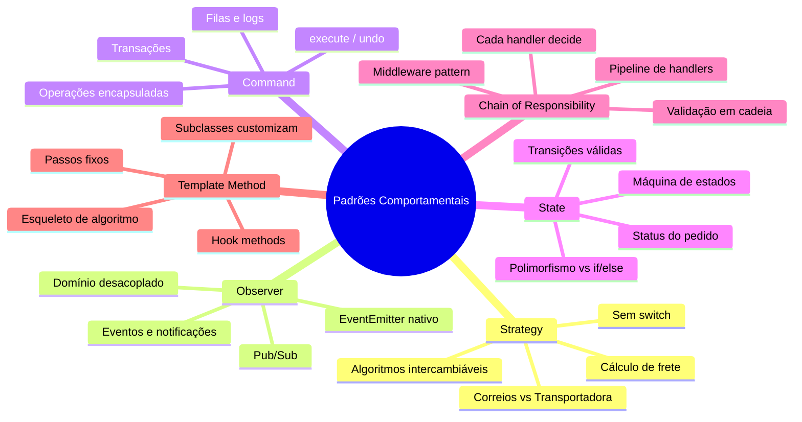
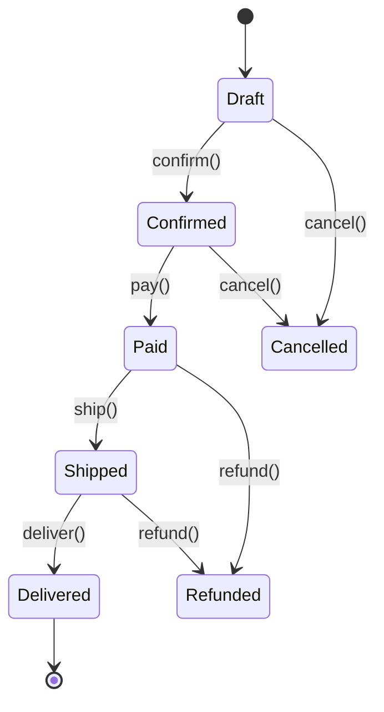

# Engenharia de Software — Aula 08

## Padrões Comportamentais — Strategy, Observer, Command, State, Chain of Responsibility e Template Method

**Duração estimada:** 100 minutos (45 de leitura + 55 de prática)
**Nível:** Intermediário
**Pré-requisitos:** Aulas 01-07 (Clean Code, SOLID, Design Patterns visão geral, DDD, Clean Architecture, Padrões Criacionais, Padrões Estruturais, TDD e Pirâmide de Testes)

---

## Objetivos de Aprendizagem

Ao final desta aula, você será capaz de:

- [ ] **Explicar** o problema fundamental que os padrões comportamentais resolvem — algoritmos acoplados, comunicação rígida entre objetos e condicionais que crescem sem controle
- [ ] **Implementar** o padrão Strategy para encapsular algoritmos intercambiáveis (cálculo de frete) eliminando `switch` e `if/else` gigantes
- [ ] **Projetar** um sistema de eventos com Observer usando o EventEmitter nativo do Node.js, desacoplando emissores de receptores
- [ ] **Encapsular** operações como objetos usando o padrão Command, com suporte a `execute()` e `undo()`, filas e logs
- [ ] **Modelar** máquinas de estado com o padrão State, onde cada estado é uma classe que define transições válidas — eliminando condicionais aninhados de status
- [ ] **Construir** pipelines de validação com Chain of Responsibility, onde cada handler decide processar ou passar adiante
- [ ] **Aplicar** Template Method para definir esqueletos de algoritmos com passos customizáveis em subclasses
- [ ] **Diferenciar** os 6 padrões comportamentais e decidir qual usar em cada cenário do e-commerce
- [ ] **Integrar** múltiplos padrões comportamentais no mesmo código — Strategy no cálculo, Observer nos eventos, State nos status, Chain na validação
- [ ] **Reconhecer** quando um `switch` ou `if/else` crescendo é um sinal de que um padrão comportamental é necessário

---

## Como Usar Esta Aula

Esta aula está dividida em duas partes. A **primeira parte** (seções 1 a 7) constrói a base conceitual — cada padrão comportamental é apresentado com motivação, estrutura e exemplos genéricos. A **segunda parte** (seção 8) aplica todos os padrões no contexto do e-commerce que você vem construindo, com código TypeScript executável.

Cada seção termina com um **Quick Check** para verificar a compreensão antes de avançar. Os **Mão na Massa** são exercícios práticos. Ao final, os **Exercícios Graduados** consolidam o aprendizado com três níveis de dificuldade.

| Seção | Conteúdo | Tempo |
|---|---|---|
| 1. O Problema | Comportamentos acoplados e condicionais | 3 min |
| 2. Strategy | Algoritmos intercambiáveis | 12 min |
| 3. Observer | Notificação desacoplada | 12 min |
| 4. Command | Operações como objetos | 12 min |
| 5. State | Máquina de estados | 12 min |
| 6. Chain of Responsibility | Pipeline de processamento | 8 min |
| 7. Template Method | Esqueleto de algoritmo | 8 min |
| 8. Aplicação no E-commerce | Código completo + integração | 23 min |
| Exercícios + Quiz | Prática | 20 min |

---

## Mapa Mental



---

## Recapitulação das Aulas 01-07

| Aula | Conceito | Conexão com Padrões Comportamentais |
|---|---|---|
| Aula 01 — Clean Code | Nomes, funções, DRY, KISS | Padrões comportamentais são a aplicação máxima de DRY — em vez de repetir `switch` em 10 lugares, encapsule o algoritmo uma vez |
| Aula 02 — SOLID | SRP, OCP, LSP, ISP, DIP | OCP é a base do Strategy (extensível sem modificar). DIP é a base do Observer (ambos dependem de abstrações). SRP é violado por `switch` gigantes |
| Aula 03 — Design Patterns | Factory Method, Repository, Adapter | Strategy e Factory Method são complementares — a Factory cria a estratégia certa |
| Aula 04 — DDD | Entities, VOs, Aggregates, Domain Events | Observer é a implementação natural de Domain Events — OrderPlacedEvent notifica bounded contexts |
| Aula 05 — Clean Architecture | 4 camadas, Composition Root, DI | Use Cases orquestram estratégias. Eventos atravessam camadas sem acoplamento |
| Aula 06 — Padrões Criacionais | Factory, Builder, Singleton, Object Literal | Factory Method cria estratégias concretas. Builder prepara comandos complexos |
| Aula 07 — Padrões Estruturais | Adapter, Decorator, Facade, Composite, Proxy | Decorator envolve comandos com logging/retry. Facade pode orquestrar uma chain de handlers |

---

**FUNDAMENTOS: Gerenciando Comportamentos e Comunicação**

> *Padrões comportamentais tratam de **como** os objetos colaboram e se comunicam. Eles existem porque algoritmos, responsabilidades e notificações tendem a se espalhar pelo código — gerando condicionais gigantes, acoplamento rígido entre emissores e receptores, e lógica de negócio que é difícil de modificar sem quebrar outras partes. Os conceitos desta seção são universais — valem para qualquer linguagem. Na segunda parte, você verá como cada um se materializa no código do e-commerce.*

---

## 1. O Problema dos Comportamentos Acoplados

### O que há de errado com `switch` e `if/else`?

Nada, em pequena escala. Um `switch` de 2 cases ou um `if` simples são perfeitamente legíveis. O problema surge quando eles **crescem sem controle**. Veja o padrão que você provavelmente já escreveu:

```typescript
// O problema: switch que só cresce
function calcularFrete(tipo: string, peso: number, cep: string): number {
  switch (tipo) {
    case 'correios':
      // 20 linhas de lógica dos Correios
      return peso * 0.5 + 10;
    case 'transportadora':
      // 20 linhas de lógica da transportadora
      return peso * 0.3 + 25;
    case 'retirada':
      return 0;
    default:
      throw new Error('Tipo de frete desconhecido');
  }
}
```

Este código funciona. Mas quando chega o terceiro, quarto ou quinto tipo de frete — cada um com regras próprias (CEP, peso, dimensões, prazo) — o `switch` explode para 200 linhas. E pior: **cada novo tipo exige modificar a função existente**, violando o OCP.

### O padrão que se repete

O mesmo problema ocorre em várias situações:

| Situação | O que varia | Sintoma |
|---|---|---|
| Cálculo de frete | Algorithmo por transportadora | `switch (tipoFrete)` |
| Notificação | Canais de envio | `if (canal === 'email') ... else if (canal === 'sms')` |
| Processamento de pagamento | Meio de pagamento | `switch (metodoPagamento)` |
| Validação de pedido | Regras de validação | Cadeia de `if` aninhados |
| Status do pedido | Comportamento por estado | `if (status === 'pending') ... else if (status === 'confirmed')` |

Cada padrão comportamental ataca uma dessas variações:

| Padrão | O que resolve |
|---|---|
| **Strategy** | Algoritmos que variam por contexto, trocados em runtime |
| **Observer** | Notificação entre objetos sem acoplamento direto |
| **Command** | Operações encapsuladas como objetos (execute, undo, fila) |
| **State** | Comportamento que muda conforme o estado interno |
| **Chain of Responsibility** | Pipeline de processamento onde cada etapa decide seu papel |
| **Template Method** | Esqueleto fixo com partes customizáveis |

---

## 2. Strategy — Algoritmos Intercambiáveis

### O que é

O **Strategy** encapsula uma família de algoritmos relacionados em classes separadas que implementam uma interface comum. O cliente (contexto) delega a execução para a estratégia ativa, que pode ser trocada em **tempo de execução**.

### Por que importa

Sem Strategy, cada algoritmo é um novo `case` em um `switch` gigante. Com Strategy, cada algoritmo é uma classe própria, testável isoladamente, e novos algoritmos são adicionados sem modificar o código existente.

### Como se faz

A estrutura tem três partes:

1. **Interface Strategy**: define o contrato que todos os algoritmos seguem
2. **Concrete Strategies**: cada uma implementa o contrato com seu próprio algoritmo
3. **Context**: mantém uma referência para a Strategy e a usa quando precisa

```
Context ──▶ Strategy (interface)
                │
        ┌───────┼───────┐
        ▼       ▼       ▼
   Concrete  Concrete  Concrete
   StrategyA StrategyB StrategyC
```

```typescript
// Interface (o contrato)
interface FreightStrategy {
  calculate(peso: number, cep: string): number;
}

// Estratégias concretas
class CorreiosStrategy implements FreightStrategy {
  calculate(peso: number, cep: string): number {
    return peso * 0.5 + 10;
  }
}

class TransportadoraStrategy implements FreightStrategy {
  calculate(peso: number, cep: string): number {
    return peso * 0.3 + 25;
  }
}

class RetiradaStrategy implements FreightStrategy {
  calculate(peso: number, cep: string): number {
    return 0; // Cliente retira na loja
  }
}

// Contexto — usa a estratégia sem saber os detalhes
class ShippingCalculator {
  constructor(private strategy: FreightStrategy) {}

  setStrategy(strategy: FreightStrategy): void {
    this.strategy = strategy;
  }

  calculate(peso: number, cep: string): number {
    return this.strategy.calculate(peso, cep);
  }
}
```

O cliente decide qual estratégia usar e a injeta no contexto:

```typescript
const calculator = new ShippingCalculator(new CorreiosStrategy());
console.log(calculator.calculate(5, '01310-000')); // 12.5

calculator.setStrategy(new TransportadoraStrategy());
console.log(calculator.calculate(5, '01310-000')); // 26.5
```

**A diferença fundamental:** sem Strategy, adicionar um novo tipo de frete exige modificar `calcularFrete()`. Com Strategy, você cria uma nova classe — zero alterações no código existente.

### Quick Check 2

**1. O Strategy substitui o quê?**
**Resposta:** Substitui `switch`/`if/else` que decidem qual algoritmo executar com base em um tipo ou condição — encapsulando cada algoritmo em sua própria classe.

**2. Qual princípio SOLID o Strategy respeita?**
**Resposta:** OCP (Open/Closed Principle) — novos algoritmos são adicionados via novas classes, sem modificar o contexto ou as estratégias existentes.

---

## 3. Observer — Notificação Desacoplada

### O que é

O **Observer** define uma dependência um-para-muitos entre objetos: quando um objeto (o **subject**) muda de estado, todos os seus dependentes (os **observers**) são notificados automaticamente. O subject não precisa saber quem são os observers — apenas que eles implementam um contrato.

### Por que importa

Sem Observer, cada evento exige chamar explicitamente todos os interessados. Se o `OrderService` precisa notificar `EmailService`, `InventoryService` e `InvoiceService` quando um pedido é criado, o código fica acoplado:

```typescript
// Acoplamento direto
class OrderService {
  async createOrder(data: CreateOrderDTO) {
    const order = await this.repository.save(data);
    await this.emailService.sendConfirmation(order);
    await this.inventoryService.reserveItems(order);
    await this.invoiceService.emitInvoice(order);
  }
}
```

Cada novo interessado exige modificar `OrderService`. Observer inverte isso: o serviço que gera o evento não conhece quem reage a ele.

### Como se faz

```
Subject (Observable)          Observer (interface)
      │                              │
      │  notifyAll(event)            │ update(event)
      │                              │
      │         ┌───────┬───────┐    │
      │         │       │       │    │
      ▼         ▼       ▼       ▼    │
   Concrete   Concrete  Concrete     │
   Subject    ObserverA ObserverB    │
      │                              │
      └──────────────────────────────┘
           Observers registrados
```

```typescript
// Interface do observer
interface Observer {
  update(event: string, data: unknown): void;
}

// Subject — gerencia observers e os notifica
class EventEmitter {
  private observers: Map<string, Observer[]> = new Map();

  on(event: string, observer: Observer): void {
    if (!this.observers.has(event)) {
      this.observers.set(event, []);
    }
    this.observers.get(event)!.push(observer);
  }

  off(event: string, observer: Observer): void {
    const list = this.observers.get(event);
    if (list) {
      this.observers.set(event, list.filter(o => o !== observer));
    }
  }

  emit(event: string, data: unknown): void {
    const list = this.observers.get(event);
    if (list) {
      for (const observer of list) {
        observer.update(event, data);
      }
    }
  }
}
```

### Quick Check 3

**1. Qual o principal benefício do Observer?**
**Resposta:** Desacoplamento total entre o emissor do evento e os receptores. O emissor não sabe quem está ouvindo; os receptores não dependem do emissor.

**2. O que acontece quando um novo serviço precisa reagir a um evento?**
**Resposta:** Basta registrar um novo observer — nenhuma modificação no emissor existente é necessária. Respeita OCP.

---

## 4. Command — Operações como Objetos

### O que é

O **Command** transforma uma solicitação (ou operação) em um objeto independente. Isso permite parametrizar métodos com diferentes requisições, enfileirar operações, registrar logs, e implementar desfazer/refazer.

### Por que importa

Sem Command, uma operação como "processar pagamento" é uma função solta, sem capacidade de ser serializada, enfileirada ou desfeita. Com Command, cada operação vira um **objeto** com `execute()` e opcionalmente `undo()`.

### Como se faz

```typescript
// Interface do comando
interface Command {
  execute(): Promise<void>;
  undo(): Promise<void>;
}

// Comandos concretos
class ProcessPaymentCommand implements Command {
  constructor(
    private orderId: string,
    private amount: number,
    private paymentService: PaymentService
  ) {}

  async execute(): Promise<void> {
    await this.paymentService.charge(this.orderId, this.amount);
  }

  async undo(): Promise<void> {
    await this.paymentService.refund(this.orderId);
  }
}

class ShipOrderCommand implements Command {
  constructor(
    private orderId: string,
    private shippingService: ShippingService
  ) {}

  async execute(): Promise<void> {
    await this.shippingService.ship(this.orderId);
  }

  async undo(): Promise<void> {
    await this.shippingService.cancelShipping(this.orderId);
  }
}

// Invoker — executa comandos com suporte a fila e log
class CommandQueue {
  private history: Command[] = [];

  async execute(command: Command): Promise<void> {
    await command.execute();
    this.history.push(command);
    console.log(`Command executed: ${command.constructor.name}`);
  }

  async undo(): Promise<void> {
    const command = this.history.pop();
    if (command) {
      await command.undo();
      console.log(`Command undone: ${command.constructor.name}`);
    }
  }
}
```

### Quick Check 4

**1. Qual a diferença entre Command e Strategy?**
**Resposta:** Strategy encapsula **como** fazer algo (algoritmo). Command encapsula **o que** fazer (operação completa). Command tem `execute()` e pode ter `undo()`; Strategy tem um método de cálculo.

**2. Que capacidades o Command adiciona que uma função normal não tem?**
**Resposta:** Serialização (pode ser salvo em fila), histórico (undo/redo), log de operações, transações (rollback com undo).

---

## 5. State — Comportamento que Varia com Estado

### O que é

O **State** permite que um objeto altere seu comportamento quando seu estado interno muda. Parece uma máquina de estados — e é exatamente isso. Cada estado é uma classe que implementa as transições possíveis a partir dele.

### Por que importa

Sem State, o controle de status de um pedido vira uma floresta de `if/else`:

```typescript
if (status === 'pending' && action === 'confirm') {
  // valida estoque
  // altera para confirmed
} else if (status === 'confirmed' && action === 'pay') {
  // processa pagamento
  // altera para paid
} else if (status === 'paid' && action === 'ship') {
  // altera para shipped
}
```

Cada novo estado ou transição modifica este bloco central. Com State, as transições são distribuídas entre as classes de estado — cada uma sabe quais transições são válidas a partir dela.

### Como se faz



```typescript
interface OrderState {
  confirm(): OrderState;
  pay(): OrderState;
  ship(): OrderState;
  deliver(): OrderState;
  cancel(): OrderState;
  refund(): OrderState;
  status: string;
}

class DraftState implements OrderState {
  status = 'draft';

  confirm(): OrderState { return new ConfirmedState(); }
  pay(): OrderState { throw new Error('Cannot pay a draft order'); }
  ship(): OrderState { throw new Error('Cannot ship a draft order'); }
  deliver(): OrderState { throw new Error('Cannot deliver a draft order'); }
  cancel(): OrderState { return new CancelledState(); }
  refund(): OrderState { throw new Error('Cannot refund a draft order'); }
}

class ConfirmedState implements OrderState {
  status = 'confirmed';

  confirm(): OrderState { throw new Error('Order already confirmed'); }
  pay(): OrderState { return new PaidState(); }
  ship(): OrderState { throw new Error('Order not paid yet'); }
  deliver(): OrderState { throw new Error('Order not shipped yet'); }
  cancel(): OrderState { return new CancelledState(); }
  refund(): OrderState { throw new Error('Order not paid yet'); }
}
```

### Quick Check 5

**1. O padrão State substitui o quê?**
**Resposta:** Substitui `if (status === 'x')` aninhados por classes polimórficas — cada estado sabe quais transições são válidas.

**2. O que acontece se alguém tenta uma transição inválida?**
**Resposta:** O estado atual lança uma exceção no método correspondente — a transição simplesmente não é permitida pela classe de estado atual.

---

## 6. Chain of Responsibility — Pipeline de Processamento

### O que é

O **Chain of Responsibility** transforma um pedido em uma cadeia de handlers. Cada handler decide: processa a requisição ou passa para o próximo da cadeia. É o padrão por trás de middlewares HTTP, pipelines de validação e filtros.

### Por que importa

Sem Chain, validações complexas viram um métodos `validateOrder` com 15 `if` aninhados. Cada nova regra exige modificar o método. Com Chain, cada regra é um handler independente, e a cadeia é montada por composição.

### Como se faz

```typescript
interface Handler {
  setNext(handler: Handler): Handler;
  handle(request: unknown): Promise<void>;
}

abstract class BaseHandler implements Handler {
  private next: Handler | null = null;

  setNext(handler: Handler): Handler {
    this.next = handler;
    return handler;
  }

  async handle(request: unknown): Promise<void> {
    await this.process(request);
    if (this.next) {
      await this.next.handle(request);
    }
  }

  protected abstract process(request: unknown): Promise<void>;
}

class ValidateStockHandler extends BaseHandler {
  protected async process(request: unknown): Promise<void> {
    console.log('Validando estoque...');
    // Valida se os itens estão disponíveis
  }
}

class ValidatePaymentHandler extends BaseHandler {
  protected async process(request: unknown): Promise<void> {
    console.log('Validando pagamento...');
    // Verifica se o pagamento foi autorizado
  }
}

class FraudCheckHandler extends BaseHandler {
  protected async process(request: unknown): Promise<void> {
    console.log('Verificando fraude...');
    // Análise de risco
  }
}
```

### Quick Check 6

**1. Qual a diferença entre Chain of Responsibility e uma lista de funções executadas em sequência?**
**Resposta:** Na Chain, cada handler **decide** se processa ou passa adiante — pode interromper a cadeia. Numa lista simples, todos executam sempre.

**2. Onde mais você vê esse padrão no dia a dia?**
**Resposta:** Middlewares do Express (cada middleware decide se chama `next()` ou retorna resposta), pipelines de CI/CD (cada job tem gates), filtros de autenticação.

---

## 7. Template Method — Esqueleto de Algoritmo

### O que é

O **Template Method** define o esqueleto de um algoritmo em um método, postergando a implementação de alguns passos para subclasses. O esqueleto é fixo; os detalhes variam.

### Por que importa

Sem Template Method, cada variante de um algoritmo repete a estrutura comum. Com Template Method, a estrutura fica na classe base (e não pode ser alterada) e as subclasses implementam apenas os passos que variam.

### Como se faz

```typescript
abstract class ReportGenerator {
  // Template Method — define o esqueleto
  async generate(): Promise<void> {
    const data = await this.fetchData();
    const formatted = this.formatData(data);
    await this.exportFile(formatted);
  }

  // Passos que variam — implementados pelas subclasses
  protected abstract fetchData(): Promise<unknown[]>;
  protected abstract formatData(data: unknown[]): string;
  protected abstract exportFile(content: string): Promise<void>;
}

class PDFReportGenerator extends ReportGenerator {
  protected async fetchData(): Promise<unknown[]> {
    return await this.repository.findAll();
  }

  protected formatData(data: unknown[]): string {
    return data.map(item => JSON.stringify(item)).join('\n');
  }

  protected async exportFile(content: string): Promise<void> {
    console.log('Exportando PDF...');
    // Lógica de geração de PDF
  }
}

class CSVReportGenerator extends ReportGenerator {
  protected async fetchData(): Promise<unknown[]> {
    return await this.repository.findAll();
  }

  protected formatData(data: unknown[]): string {
    return data.map(item => Object.values(item!).join(',')).join('\n');
  }

  protected async exportFile(content: string): Promise<void> {
    console.log('Exportando CSV...');
    // Lógica de geração de CSV
  }
}
```

### Quick Check 7

**1. O Template Method é sobre herança ou composição?**
**Resposta:** É sobre herança — a classe base define a estrutura, as subclasses preenchem os detalhes. É um dos poucos casos onde herança é a solução correta.

**2. Qual a diferença entre Template Method e Strategy?**
**Resposta:** Template Method usa herança para fixar a estrutura do algoritmo (o template). Strategy usa composição para trocar o algoritmo inteiro. Template Method é mais rígido; Strategy é mais flexível.

---

**APLICAÇÃO: Padrões Comportamentais no E-commerce**

> *Agora que você entende os conceitos de cada padrão comportamental, vamos aplicá-los no código do e-commerce. Os exemplos abaixo usam TypeScript com Node.js e assumem que você tem o projeto configurado com a estrutura de camadas (domain, application, infrastructure, interface) construída nas aulas anteriores.*

---

## 8. Aplicando no Projeto do E-commerce

### 8.1 Strategy — ShippingCalculator com Injeção de Estratégias

Vamos refatorar o cálculo de frete que, provavelmente, ainda está com `switch` no seu projeto.

**Antes (código acoplado):**

```typescript
// infrastructure/shipping/shipping-calculator.ts
class ShippingCalculator {
  async calculate(tipo: string, peso: number, cep: string): Promise<number> {
    switch (tipo) {
      case 'correios':
        const taxaCorreios = peso * 0.5 + 10;
        return taxaCorreios;
      case 'transportadora':
        const taxaTransportadora = peso * 0.3 + 25;
        if (cep.startsWith('01')) taxaTransportadora += 5;
        return taxaTransportadora;
      case 'retirada':
        return 0;
      default:
        throw new Error('Tipo de frete inválido');
    }
  }
}
```

**Depois (com Strategy):**

```typescript
// domain/shipping/freight-strategy.ts
export interface FreightStrategy {
  calculate(peso: number, cep: string): number;
  nome(): string;
}

// domain/shipping/strategies/correios-strategy.ts
export class CorreiosStrategy implements FreightStrategy {
  calculate(peso: number, cep: string): number {
    return peso * 0.5 + 10;
  }
  nome(): string { return 'Correios'; }
}

// domain/shipping/strategies/transportadora-strategy.ts
export class TransportadoraStrategy implements FreightStrategy {
  calculate(peso: number, cep: string): number {
    let total = peso * 0.3 + 25;
    if (cep.startsWith('01')) total += 5;
    return total;
  }
  nome(): string { return 'Transportadora'; }
}

// domain/shipping/strategies/retirada-strategy.ts
export class RetiradaStrategy implements FreightStrategy {
  calculate(peso: number, cep: string): number {
    return 0;
  }
  nome(): string { return 'Retirada na Loja'; }
}

// application/services/shipping-calculator.ts
import { FreightStrategy } from '../../domain/shipping/freight-strategy';

export class ShippingCalculator {
  constructor(private strategy: FreightStrategy) {}

  setStrategy(strategy: FreightStrategy): void {
    this.strategy = strategy;
  }

  calculate(peso: number, cep: string): { valor: number; metodo: string } {
    const valor = this.strategy.calculate(peso, cep);
    return { valor, metodo: this.strategy.nome() };
  }
}
```

**Mão na Massa:** Substitua o `switch` do `ShippingCalculator` no seu projeto pelas estratégias acima. Crie uma pasta `domain/shipping/strategies/` com cada estratégia em seu próprio arquivo.

### 8.2 Observer — EventEmitter para Eventos de Domínio

Vamos usar o **EventEmitter nativo do Node.js** para notificar serviços quando um pedido é criado.

```typescript
// domain/events/order-event-bus.ts
import { EventEmitter } from 'events';

export class OrderEventBus extends EventEmitter {
  static readonly ORDER_PLACED = 'order:placed';
  static readonly PAYMENT_CONFIRMED = 'payment:confirmed';
  static readonly ORDER_SHIPPED = 'order:shipped';
  static readonly ORDER_DELIVERED = 'order:delivered';
}

// infrastructure/observers/inventory-observer.ts
export class InventoryObserver {
  constructor(private eventBus: OrderEventBus) {
    this.eventBus.on(OrderEventBus.ORDER_PLACED, this.handleOrderPlaced.bind(this));
  }

  private async handleOrderPlaced(order: Order): Promise<void> {
    console.log(`[Inventory] Reservando estoque para pedido ${order.id}`);
    // Lógica de reserva de estoque
    for (const item of order.items) {
      await this.inventoryService.reserve(item.productId, item.quantity);
    }
  }
}

// infrastructure/observers/email-observer.ts
export class EmailObserver {
  constructor(private eventBus: OrderEventBus) {
    this.eventBus.on(OrderEventBus.ORDER_PLACED, this.handleOrderPlaced.bind(this));
    this.eventBus.on(OrderEventBus.ORDER_SHIPPED, this.handleOrderShipped.bind(this));
  }

  private async handleOrderPlaced(order: Order): Promise<void> {
    console.log(`[Email] Enviando confirmação para ${order.customerEmail}`);
    // Lógica de envio de email
  }

  private async handleOrderShipped(order: Order): Promise<void> {
    console.log(`[Email] Enviando rastreio para ${order.customerEmail}`);
  }
}

// infrastructure/observers/invoice-observer.ts
export class InvoiceObserver {
  constructor(private eventBus: OrderEventBus) {
    this.eventBus.on(OrderEventBus.PAYMENT_CONFIRMED, this.handlePaymentConfirmed.bind(this));
  }

  private async handlePaymentConfirmed(order: Order): Promise<void> {
    console.log(`[Invoice] Emitindo nota fiscal para pedido ${order.id}`);
    // Lógica de emissão de NF
  }
}
```

**Mão na Massa:** Crie o `OrderEventBus` como uma extensão do `EventEmitter` do Node.js. Registre os observers no Composition Root (tsyringe) — lembre-se de que eles precisam ser instanciados para começar a ouvir.

### 8.3 Command — ProcessPaymentCommand com Undo

Comandos permitem encapsular operações de pagamento, cancelamento e reembolso como objetos.

```typescript
// application/commands/command.ts
export interface Command {
  execute(): Promise<void>;
  undo(): Promise<void>;
}

// application/commands/process-payment-command.ts
export class ProcessPaymentCommand implements Command {
  private transactionId: string | null = null;

  constructor(
    private orderId: string,
    private amount: number,
    private paymentGateway: PaymentGateway
  ) {}

  async execute(): Promise<void> {
    const result = await this.paymentGateway.charge(this.orderId, this.amount);
    this.transactionId = result.transactionId;
    console.log(`[Command] Pagamento processado: ${this.transactionId}`);
  }

  async undo(): Promise<void> {
    if (this.transactionId) {
      await this.paymentGateway.refund(this.transactionId);
      console.log(`[Command] Pagamento estornado: ${this.transactionId}`);
    }
  }
}

// application/commands/ship-order-command.ts
export class ShipOrderCommand implements Command {
  private shipped = false;

  constructor(
    private orderId: string,
    private shippingService: ShippingService
  ) {}

  async execute(): Promise<void> {
    await this.shippingService.ship(this.orderId);
    this.shipped = true;
    console.log(`[Command] Pedido ${this.orderId} enviado`);
  }

  async undo(): Promise<void> {
    if (this.shipped) {
      await this.shippingService.cancelShipping(this.orderId);
      this.shipped = false;
      console.log(`[Command] Envio do pedido ${this.orderId} cancelado`);
    }
  }
}

// application/services/command-invoker.ts
export class CommandInvoker {
  private history: Command[] = [];
  private queue: Command[] = [];

  async execute(command: Command): Promise<void> {
    try {
      await command.execute();
      this.history.push(command);
    } catch (error) {
      console.error(`[Command] Falha ao executar: ${error}`);
      throw error;
    }
  }

  async undo(): Promise<void> {
    const command = this.history.pop();
    if (command) {
      await command.undo();
    }
  }

  enqueue(command: Command): void {
    this.queue.push(command);
    console.log(`[Command] Comando enfileirado: ${command.constructor.name}`);
  }

  async processQueue(): Promise<void> {
    while (this.queue.length > 0) {
      const command = this.queue.shift()!;
      await this.execute(command);
    }
  }
}
```

**Mão na Massa:** Implemente o `ProcessPaymentCommand` e o `ShipOrderCommand` no seu projeto. Adicione o `CommandInvoker` para gerenciar a fila de operações.

### 8.4 State — Máquina de Estados do Pedido

Vamos implementar a máquina de estados do pedido usando o padrão State.

```typescript
// domain/order/order-state.ts
export interface OrderState {
  readonly status: string;
  confirm(): OrderState;
  pay(): OrderState;
  ship(): OrderState;
  deliver(): OrderState;
  cancel(): OrderState;
  refund(): OrderState;
}

// domain/order/states/draft-state.ts
export class DraftState implements OrderState {
  readonly status = 'draft';
  confirm(): OrderState { return new ConfirmedState(); }
  pay(): OrderState { throw new Error('Pedido rascunho não pode ser pago'); }
  ship(): OrderState { throw new Error('Pedido rascunho não pode ser enviado'); }
  deliver(): OrderState { throw new Error('Pedido rascunho não pode ser entregue'); }
  cancel(): OrderState { return new CancelledState(); }
  refund(): OrderState { throw new Error('Pedido rascunho não pode ser reembolsado'); }
}

// domain/order/states/confirmed-state.ts
export class ConfirmedState implements OrderState {
  readonly status = 'confirmed';
  confirm(): OrderState { throw new Error('Pedido já confirmado'); }
  pay(): OrderState { return new PaidState(); }
  ship(): OrderState { throw new Error('Pedido não foi pago'); }
  deliver(): OrderState { throw new Error('Pedido não foi enviado'); }
  cancel(): OrderState { return new CancelledState(); }
  refund(): OrderState { throw new Error('Pedido não foi pago'); }
}

// domain/order/states/paid-state.ts
export class PaidState implements OrderState {
  readonly status = 'paid';
  confirm(): OrderState { throw new Error('Pedido já confirmado'); }
  pay(): OrderState { throw new Error('Pedido já foi pago'); }
  ship(): OrderState { return new ShippedState(); }
  deliver(): OrderState { throw new Error('Pedido não foi enviado'); }
  cancel(): OrderState { throw new Error('Pedido pago não pode ser cancelado'); }
  refund(): OrderState { return new RefundedState(); }
}

// domain/order/states/shipped-state.ts
export class ShippedState implements OrderState {
  readonly status = 'shipped';
  confirm(): OrderState { throw new Error('Pedido já confirmado'); }
  pay(): OrderState { throw new Error('Pedido já foi pago'); }
  ship(): OrderState { throw new Error('Pedido já foi enviado'); }
  deliver(): OrderState { return new DeliveredState(); }
  cancel(): OrderState { throw new Error('Pedido enviado não pode ser cancelado'); }
  refund(): OrderState { return new RefundedState(); }
}

// domain/order/states/delivered-state.ts
export class DeliveredState implements OrderState {
  readonly status = 'delivered';
  confirm(): OrderState { throw new Error('Pedido já entregue'); }
  pay(): OrderState { throw new Error('Pedido já foi pago'); }
  ship(): OrderState { throw new Error('Pedido já foi entregue'); }
  deliver(): OrderState { throw new Error('Pedido já foi entregue'); }
  cancel(): OrderState { throw new Error('Pedido entregue não pode ser cancelado'); }
  refund(): OrderState { throw new Error('Entre em contato com o suporte para reembolso'); }
}

// domain/order/states/cancelled-state.ts
export class CancelledState implements OrderState {
  readonly status = 'cancelled';
  confirm(): OrderState { throw new Error('Pedido cancelado não pode ser confirmado'); }
  pay(): OrderState { throw new Error('Pedido cancelado não pode ser pago'); }
  ship(): OrderState { throw new Error('Pedido cancelado não pode ser enviado'); }
  deliver(): OrderState { throw new Error('Pedido cancelado não pode ser entregue'); }
  cancel(): OrderState { throw new Error('Pedido já está cancelado'); }
  refund(): OrderState { throw new Error('Pedido cancelado não requer reembolso'); }
}

// domain/order/states/refunded-state.ts
export class RefundedState implements OrderState {
  readonly status = 'refunded';
  confirm(): OrderState { throw new Error('Pedido reembolsado'); }
  pay(): OrderState { throw new Error('Pedido reembolsado'); }
  ship(): OrderState { throw new Error('Pedido reembolsado'); }
  deliver(): OrderState { throw new Error('Pedido reembolsado'); }
  cancel(): OrderState { throw new Error('Pedido reembolsado'); }
  refund(): OrderState { throw new Error('Pedido já foi reembolsado'); }
}

// domain/order/order.ts — usando o State
export class Order {
  private state: OrderState;

  constructor(
    readonly id: string,
    readonly customerId: string,
    readonly items: OrderItem[],
    initialState?: OrderState
  ) {
    this.state = initialState ?? new DraftState();
  }

  get status(): string {
    return this.state.status;
  }

  confirm(): void {
    this.state = this.state.confirm();
  }

  pay(): void {
    this.state = this.state.pay();
  }

  ship(): void {
    this.state = this.state.ship();
  }

  deliver(): void {
    this.state = this.state.deliver();
  }

  cancel(): void {
    this.state = this.state.cancel();
  }

  refund(): void {
    this.state = this.state.refund();
  }
}
```

**Mão na Massa:** Substitua o `status: string` do seu `Order` pelo padrão State. Cada estado é uma classe, e a entidade `Order` delega as transições para o estado atual.

### 8.5 Chain of Responsibility — Pipeline de Validação de Pedido

Vamos construir uma cadeia de validação para o checkout do e-commerce.

```typescript
// application/validation/order-handler.ts
export interface OrderHandler {
  setNext(handler: OrderHandler): OrderHandler;
  handle(order: OrderInput): Promise<void>;
}

export abstract class BaseOrderHandler implements OrderHandler {
  private next: OrderHandler | null = null;

  setNext(handler: OrderHandler): OrderHandler {
    this.next = handler;
    return handler;
  }

  async handle(order: OrderInput): Promise<void> {
    await this.process(order);
    if (this.next) {
      await this.next.handle(order);
    }
  }

  protected abstract process(order: OrderInput): Promise<void>;
}

// application/validation/handlers/stock-validation-handler.ts
export class StockValidationHandler extends BaseOrderHandler {
  constructor(private inventoryService: InventoryService) {
    super();
  }

  protected async process(order: OrderInput): Promise<void> {
    for (const item of order.items) {
      const available = await this.inventoryService.checkAvailability(item.productId, item.quantity);
      if (!available) {
        throw new Error(`Produto ${item.productId} sem estoque suficiente`);
      }
    }
    console.log(`[Chain] Estoque validado para ${order.items.length} itens`);
  }
}

// application/validation/handlers/payment-validation-handler.ts
export class PaymentValidationHandler extends BaseOrderHandler {
  constructor(private paymentGateway: PaymentGateway) {
    super();
  }

  protected async process(order: OrderInput): Promise<void> {
    const authorized = await this.paymentGateway.authorize(order.payment);
    if (!authorized) {
      throw new Error('Pagamento não autorizado');
    }
    console.log('[Chain] Pagamento autorizado');
  }
}

// application/validation/handlers/fraud-check-handler.ts
export class FraudCheckHandler extends BaseOrderHandler {
  protected async process(order: OrderInput): Promise<void> {
    const isFraudulent = order.items.length > 50 || order.totalAmount > 50000;
    if (isFraudulent) {
      throw new Error('Pedido sinalizado para revisão manual');
    }
    console.log('[Chain] Verificação antifraude ok');
  }
}

// application/validation/order-validation-pipeline.ts
export class OrderValidationPipeline {
  constructor(
    private stockHandler: StockValidationHandler,
    private paymentHandler: PaymentValidationHandler,
    private fraudHandler: FraudCheckHandler
  ) {}

  build(): OrderHandler {
    this.stockHandler
      .setNext(this.paymentHandler)
      .setNext(this.fraudHandler);
    return this.stockHandler;
  }
}
```

**Mão na Massa:** Monte a `OrderValidationPipeline` no Composition Root. Quando um pedido é criado, execute `pipeline.build().handle(orderInput)`.

### 8.6 Template Method — Relatórios do E-commerce

Vamos gerar relatórios de vendas em diferentes formatos usando Template Method.

```typescript
// domain/reports/report-generator.ts
export abstract class ReportGenerator {
  async generate(): Promise<ReportResult> {
    const data = await this.fetchData();
    const formatted = this.formatData(data);
    const filePath = await this.exportFile(formatted);
    return { format: this.formatName(), path: filePath, records: data.length };
  }

  // Template Method components
  protected abstract fetchData(): Promise<unknown[]>;
  protected abstract formatData(data: unknown[]): string;
  protected abstract exportFile(content: string): Promise<string>;
  protected abstract formatName(): string;

  // Hook method — opcional para subclasses
  protected beforeGenerate?(): Promise<void>;
  protected afterGenerate?(result: ReportResult): Promise<void>;
}

// application/reports/pdf-report-generator.ts
export class PDFReportGenerator extends ReportGenerator {
  constructor(private orderRepository: OrderRepository) {
    super();
  }

  protected async fetchData(): Promise<unknown[]> {
    return this.orderRepository.findAll();
  }

  protected formatData(data: unknown[]): string {
    return data.map(order => JSON.stringify(order, null, 2)).join('\n---\n');
  }

  protected async exportFile(content: string): Promise<string> {
    const path = `reports/vendas-${Date.now()}.pdf`;
    console.log(`[PDF] Relatório gerado: ${path}`);
    return path;
  }

  protected formatName(): string { return 'PDF'; }
}

// application/reports/csv-report-generator.ts
export class CSVReportGenerator extends ReportGenerator {
  constructor(private orderRepository: OrderRepository) {
    super();
  }

  protected async fetchData(): Promise<unknown[]> {
    return this.orderRepository.findAll();
  }

  protected formatData(data: unknown[]): string {
    if (data.length === 0) return 'Sem dados';
    const headers = Object.keys(data[0] as Record<string, unknown>).join(',');
    const rows = data.map(item => Object.values(item as Record<string, unknown>).join(','));
    return [headers, ...rows].join('\n');
  }

  protected async exportFile(content: string): Promise<string> {
    const path = `reports/vendas-${Date.now()}.csv`;
    console.log(`[CSV] Relatório gerado: ${path}`);
    return path;
  }

  protected formatName(): string { return 'CSV'; }
}
```

**Mão na Massa:** Crie um endpoint `GET /reports/vendas?formato=pdf|csv` que usa `ReportGenerator` para gerar o relatório no formato solicitado.

---

## Autoavaliação: Quiz Rápido

**1. Qual padrão comportamental você usaria para permitir que o usuário escolha entre Correios, Transportadora ou Retirada na hora do checkout?**
**Resposta:** Strategy — encapsula cada algoritmo de frete em uma classe separada que implementa a mesma interface, permitindo troca em runtime.

**2. Um novo serviço de cupons precisa ser notificado quando um pedido é criado. Qual padrão evita modificar o OrderService?**
**Resposta:** Observer — o CupomObserver se registra no EventBus e reage ao evento `order:placed` sem que o OrderService precise saber de sua existência.

**3. Qual a diferença fundamental entre Command e Strategy?**
**Resposta:** Command encapsula uma operação completa (execute/undo) como objeto; Strategy encapsula um algoritmo (cálculo). Command tem estado interno e suporte a histórico.

**4. No padrão State, o que acontece se você tenta cancelar um pedido que já foi entregue?**
**Resposta:** O método `cancel()` no `DeliveredState` lança uma exceção — a transição não é permitida pela máquina de estados.

**5. Qual padrão comportamental é a base dos middlewares do Express (cada middleware decide se chama `next()`)?**
**Resposta:** Chain of Responsibility — cada handler processa ou passa adiante, formando uma cadeia.

**6. Em que cenário Template Method é preferível a Strategy?**
**Resposta:** Quando a estrutura do algoritmo é fixa (sequência de passos imutável) e apenas os detalhes de implementação variam — como geração de relatórios com fetchData → formatData → exportFile.

**7. Qual padrão comportamental melhor representa a transição Draft → Confirmed → Paid → Shipped → Delivered de um pedido?**
**Resposta:** State — cada status é uma classe que sabe quais transições são válidas, eliminando `if (status === 'x')` aninhados.

---

## Mão na Massa: Exercícios Graduados

### Exercício 1 (Fácil) — Identifique o Padrão Comportamental

Para cada descrição, identifique qual padrão comportamental é a solução mais adequada:

a) "O sistema precisa calcular imposto de diferentes formas dependendo do estado de destino do cliente — SP tem uma regra, RJ tem outra, MG tem outra."
b) "Quando um pagamento é confirmado, três sistemas precisam ser avisados: contabilidade, estoque e logística."
c) "Um editor de texto precisa permitir desfazer/refazer as últimas 50 operações do usuário."
d) "O status de um chamado de suporte muda conforme as ações do atendente: Aberto → Em Andamento → Resolvido → Fechado."
e) "Uma requisição HTTP passa por uma cadeia de middlewares onde cada um decide processar ou chamar o próximo."

**Gabarito:** a) Strategy — algoritmo de imposto varia por estado. b) Observer — notificação desacoplada para múltiplos interessados. c) Command — operações como objetos com execute/undo. d) State — máquina de estados com transições válidas. e) Chain of Responsibility — cadeia de middlewares.

### Exercício 2 (Médio) — Refatore para Command

O código abaixo mistura lógica de negócio com operações que deveriam ser encapsuladas como comandos. Refatore usando o padrão Command.

```typescript
class OrderController {
  async processPayment(req: Request, res: Response) {
    const { orderId } = req.params;
    const order = await orderRepository.findById(orderId);
    const result = await paymentGateway.charge(orderId, order.total);
    await orderRepository.updateStatus(orderId, 'paid');
    await emailService.sendPaymentConfirmation(order.customerEmail);
    await inventoryService.reserveItems(order.items);
    res.json({ success: true, transactionId: result.transactionId });
  }
}
```

**Gabarito:**

```typescript
// application/commands/process-payment-command.ts
export class ProcessPaymentCommand implements Command {
  private transactionId: string | null = null;

  constructor(
    private orderId: string,
    private orderRepository: OrderRepository,
    private paymentGateway: PaymentGateway,
    private emailService: EmailService,
    private inventoryService: InventoryService
  ) {}

  async execute(): Promise<void> {
    const order = await this.orderRepository.findById(this.orderId);
    const result = await this.paymentGateway.charge(this.orderId, order.total);
    this.transactionId = result.transactionId;
    await this.orderRepository.updateStatus(this.orderId, 'paid');
    await this.emailService.sendPaymentConfirmation(order.customerEmail);
    await this.inventoryService.reserveItems(order.items);
  }

  async undo(): Promise<void> {
    if (this.transactionId) {
      await this.paymentGateway.refund(this.transactionId);
      await this.orderRepository.updateStatus(this.orderId, 'pending');
    }
  }
}

// interface/controllers/order-controller.ts
class OrderController {
  constructor(private commandInvoker: CommandInvoker) {}

  async processPayment(req: Request, res: Response) {
    const command = new ProcessPaymentCommand(
      req.params.orderId,
      this.orderRepository,
      this.paymentGateway,
      this.emailService,
      this.inventoryService
    );
    await this.commandInvoker.execute(command);
    res.json({ success: true });
  }
}
```

### Exercício 3 (Difícil) — State + Chain + Observer Integrados

Implemente um fluxo completo de checkout que integra três padrões comportamentais:

1. **Chain of Responsibility** para validar o pedido (estoque, pagamento, fraude)
2. **State** para gerenciar o status do pedido durante o fluxo
3. **Observer (EventBus)** para notificar serviços externos

O fluxo deve ser: `validar pedido → criar pedido (Draft) → confirmar → pagar → notificar`

```typescript
class CheckoutUseCase {
  constructor(
    private validationPipeline: OrderHandler,
    private eventBus: OrderEventBus
  ) {}

  async execute(input: CheckoutInput): Promise<Order> {
    // 1. Validação via Chain of Responsibility
    await this.validationPipeline.handle(input);

    // 2. Cria o pedido em estado Draft
    const order = new Order(
      crypto.randomUUID(),
      input.customerId,
      input.items
    );
    await this.orderRepository.save(order);

    // 3. Confirma → State muda para Confirmed
    order.confirm();

    // 4. Processa pagamento → State muda para Paid
    order.pay();

    // 5. Emite evento → Observer notifica serviços
    this.eventBus.emit(OrderEventBus.ORDER_PLACED, order);

    return order;
  }
}
```

**Gabarito:** A implementação esperada deve:
- Usar `OrderHandler` (Chain) para validar o input antes de criar o pedido
- Usar `OrderState` (State) para garantir que o pedido só transite por estados válidos
- Usar `OrderEventBus` (Observer) para notificar `InventoryObserver`, `EmailObserver` e `InvoiceObserver`
- Garantir que transições inválidas (ex: pagar sem confirmar) lancem erro

### Desafio Opcional

Implemente um **sistema de checkout completo** que integre **todos os 6 padrões** desta aula:

- **Strategy**: cálculo de frete selecionável pelo cliente
- **Observer**: EventBus notificando estoque, email e nota fiscal
- **Command**: ProcessPaymentCommand e ShipOrderCommand enfileirados no CommandInvoker
- **State**: Order com máquina de estados Draft → Confirmed → Paid → Shipped → Delivered
- **Chain of Responsibility**: pipeline de validação com StockHandler, PaymentHandler, FraudHandler
- **Template Method**: relatório de confirmação gerado em PDF ou CSV

---

## Resumo da Aula

### Padrões Comportamentais

| Padrão | Quando usar | Exemplo no E-commerce |
|---|---|---|
| **Strategy** | Algoritmos intercambiáveis que variam por contexto | Cálculo de frete: Correios, Transportadora, Retirada |
| **Observer** | Notificação desacoplada entre emissor e múltiplos receptores | EventBus para OrderPlaced → estoque, email, nota fiscal |
| **Command** | Operações encapsuladas como objetos com execute/undo | ProcessPayment, ShipOrder — com fila e histórico |
| **State** | Comportamento que varia conforme o estado interno | Máquina de estados do pedido: Draft → Confirmed → Paid → Shipped |
| **Chain of Responsibility** | Pipeline onde cada etapa decide processar ou passar adiante | Validação de checkout: estoque → pagamento → fraude |
| **Template Method** | Esqueleto fixo com partes customizáveis por subclasses | Relatórios: fetchData → formatData → exportFile em PDF ou CSV |

### O Que Você Construiu Hoje

- [x] Substituiu `switch` de frete por **Strategy** com injeção de estratégias
- [x] Implementou **Observer** com EventEmitter para notificações desacopladas
- [x] Encapsulou operações como **Command** com execute/undo e fila
- [x] Modelou máquina de estados do pedido com **State** — cada estado é uma classe
- [x] Construiu pipeline de validação com **Chain of Responsibility**
- [x] Criou geradores de relatório com **Template Method**

---

## Próxima Aula

**Aula 09: Module Pattern, Composição & Patterns Web/React**

Você domina os 23 padrões GoF (criacionais, estruturais e comportamentais). Agora, na Aula 09, vai aprender os padrões específicos do ecossistema JavaScript/TypeScript: Module Pattern (IIFE, ES Modules, barrel exports), Composição vs Herança, e patterns React como HOC, Render Props, Hooks Pattern, Compound Components e Context + Provider — aplicando tudo ao frontend do e-commerce.

---

## Referências

### Livros

- GAMMA, Erich; HELM, Richard; JOHNSON, Ralph; VLISSIDES, John. **Design Patterns: Elements of Reusable Object-Oriented Software**. Addison-Wesley, 1994. (Catálogo GoF original — capítulo de padrões comportamentais)
- MARTIN, Robert C. **Clean Code: A Handbook of Agile Software Craftsmanship**. Prentice Hall, 2008.
- FREEMAN, Eric; FREEMAN, Elisabeth. **Head First Design Patterns**. O'Reilly, 2004.

### Catálogos Online

- [Refactoring Guru — Behavioral Design Patterns](https://refactoring.guru/design-patterns/behavioral-patterns) — Catálogo visual com exemplos em TypeScript
- [SourceMaking — Behavioral Patterns](https://sourcemaking.com/design_patterns/behavioral_patterns) — Explicações complementares
- [TypeScript Design Patterns (Refactoring Guru)](https://refactoring.guru/design-patterns/typescript) — Código de todos os patterns em TypeScript

### Node.js e TypeScript

- [Node.js EventEmitter Documentation](https://nodejs.org/api/events.html) — Documentação oficial do EventEmitter
- [TypeScript Handbook](https://www.typescriptlang.org/docs/handbook/2/classes.html) — Classes e interfaces

---

## FAQ

**P: Strategy e State são parecidos — qual a diferença?**

R: Ambos usam delegação para objetos que implementam uma interface comum, mas a intenção é diferente. **Strategy** é sobre **como** fazer algo (algoritmos intercambiáveis). **State** é sobre **o que** pode acontecer (transições entre estados). No State, o próprio objeto muda de estado ao longo do tempo; no Strategy, o contexto mantém a mesma estratégia até que alguém a troque explicitamente.

**P: Observer e Command não são a mesma coisa?**

R: São complementares, não iguais. **Observer** notifica múltiplos interessados sobre um evento — é um padrão de **comunicação**. **Command** encapsula uma operação como objeto — é um padrão de **execução**. Você pode usar Command dentro de Observer: o evento dispara a execução de um comando.

**P: O EventEmitter do Node.js já implementa Observer — preciso implementar o meu?**

R: Não! O `EventEmitter` nativo do Node.js é a implementação canônica do Observer em JavaScript/TypeScript. Use-o diretamente. A única razão para criar uma classe própria seria adicionar comportamento específico (tipagem forte nos eventos, validação, etc.).

**P: Chain of Responsibility vs lista de funções — qual a diferença prática?**

R: Numa lista, todas as funções executam sempre. Na Chain, cada handler pode **interromper** a cadeia (ex: validação falha → para a execução) ou **transformar** a requisição antes de passar adiante. A Chain também permite montar a cadeia dinamicamente.

**P: Template Method usa herança — não é melhor usar composição com Strategy?**

R: Depende. Template Method é adequado quando a estrutura do algoritmo é fixa e não vai mudar — você quer garantir que os passos sejam executados em ordem. Strategy é mais flexível e testável. Uma regra prática: se você precisa variar a **ordem** dos passos, use Strategy. Se a ordem é fixa e só os detalhes variam, Template Method é mais simples.

**P: Posso misturar State com Command?**

R: Sim, e é comum. O Command executa uma operação que pode mudar o estado do pedido. Por exemplo, `ProcessPaymentCommand.execute()` chama `order.pay()`, que por sua vez usa o State para transitar de Confirmed para Paid.

**P: Qual padrão comportamental é mais usado no dia a dia do Node.js?**

R: Observer (via EventEmitter) e Chain of Responsibility (middlewares Express) são onipresentes. Strategy é muito usado para regras de negócio que variam (frete, imposto, desconto). Command aparece em sistemas que precisam de filas e undo.

**P: O State pattern não adiciona muitas classes para algo que poderia ser um enum?**

R: Para 3 estados com transições simples, um enum com `switch` pode ser suficiente. O State pattern se paga quando você tem 5+ estados, cada um com regras de transição específicas, e quando novas transições são adicionadas frequentemente. Avalie o custo-benefício.

**P: Os padrões comportamentais são mutuamente exclusivos?**

R: Não. Eles se complementam. No e-commerce desta aula, você usa Strategy (frete), State (pedido), Observer (eventos), Command (operações), Chain (validação) e Template Method (relatórios) — todos no mesmo sistema, cada um resolvendo um aspecto diferente.

**P: Como testar classes que usam State?**

R: Teste cada estado isoladamente: crie o estado, chame os métodos de transição e verifique se o novo estado é o esperado. Teste transições inválidas (devem lançar erro). Teste a entidade `Order` integrada com os estados. Como cada estado é uma classe separada, os testes são simples e isolados.

---

## Glossário

| Termo | Definição |
|---|---|
| **Chain of Responsibility** | Padrão comportamental que constrói uma cadeia de handlers onde cada um decide processar ou passar adiante. (Ver seção 6) |
| **Command** | Padrão comportamental que encapsula uma operação como objeto, com suporte a execute, undo, fila e log. (Ver seção 4) |
| **EventEmitter** | Classe nativa do Node.js que implementa o padrão Observer — emite eventos e notifica listeners registrados |
| **GoF (Gang of Four)** | Grupo que catalogou 23 design patterns no livro de 1994, incluindo 11 padrões comportamentais |
| **Handler** | Elemento individual de uma Chain of Responsibility que processa uma requisição ou a passa adiante |
| **Hook Method** | Método opcional em Template Method que subclasses podem sobrescrever para adicionar comportamento sem alterar o esqueleto |
| **Invoker** | Classe que dispara a execução de um Command, geralmente com suporte a histórico e fila |
| **Observer** | Padrão comportamental que define dependência um-para-muitos entre objetos — quando um muda, todos são notificados. (Ver seção 3) |
| **State** | Padrão comportamental que permite a um objeto alterar seu comportamento quando seu estado interno muda. (Ver seção 5) |
| **Strategy** | Padrão comportamental que encapsula uma família de algoritmos intercambiáveis. (Ver seção 2) |
| **Subject** | Objeto observado no padrão Observer — mantém a lista de observers e os notifica quando muda |
| **Template Method** | Padrão comportamental que define o esqueleto de um algoritmo em um método, postergando passos para subclasses. (Ver seção 7) |
