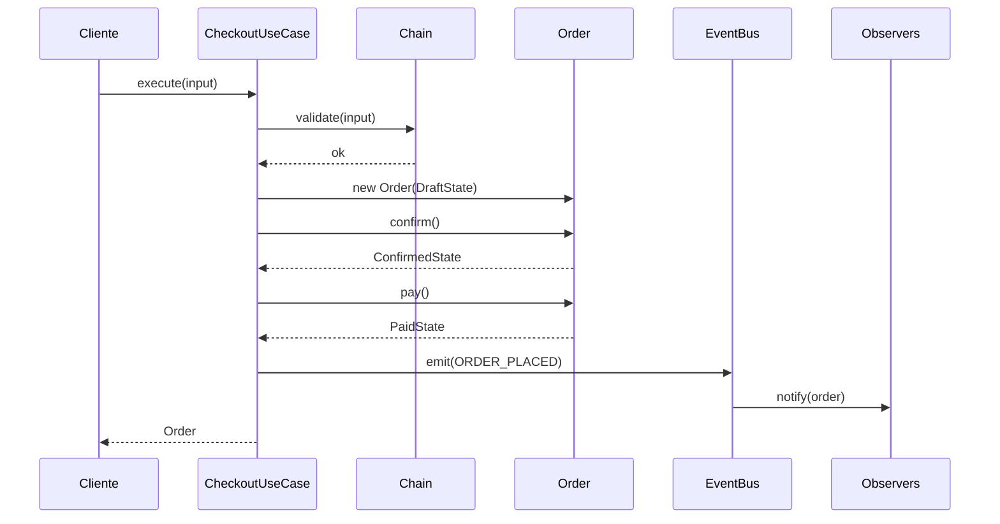

## Como Usar Este Arquivo

Este arquivo contém **questões práticas** que funcionam como checkpoint de domínio. O objetivo é verificar se você realmente sabe aplicar os 6 padrões comportamentais (Strategy, Observer, Command, State, Chain of Responsibility e Template Method) no código do e-commerce — não apenas entender a teoria, mas implementar cada um no seu projeto.

**Instruções:**
1. Complete cada questão por conta própria, sem reler a aula a cada passo
2. Crie uma pasta `entregas-aula-08/` no seu projeto para salvar os arquivos
3. Cada questão tem um template para você preencher e salvar
4. Só avance para a Aula 09 quando conseguir completar todas as questões

---

## Questão 1: Strategy — Calculadora de Frete com Injeção

**Conceito-chave:** Aula 08, Seção 2 — Strategy

**Objetivo:** Demonstrar que você sabe implementar o padrão Strategy para substituir um `switch` de cálculo de frete por classes intercambiáveis.

**Passos de Execução:**

1. Crie a interface `FreightStrategy` no diretório `domain/shipping/` com um método `calculate(peso: number, cep: string): number`
2. Implemente três estratégias concretas: `CorreiosStrategy`, `TransportadoraStrategy`, `RetiradaStrategy`
3. Crie a classe `ShippingCalculator` que recebe uma `FreightStrategy` por construtor e tem um método `setStrategy()`
4. Escreva um teste unitário que verifica se `ShippingCalculator` usa a estratégia correta e se a troca de estratégia funciona

**Entrega:**

Crie o arquivo `questao01-strategy.md` com o seguinte template preenchido:

```markdown
# Questão 01 — Strategy

## Interface FreightStrategy

```typescript
// Cole aqui a interface criada
```

## Estratégias Concretas

```typescript
// Cole as 3 estratégias implementadas
```

## ShippingCalculator (Context)

```typescript
// Cole a classe ShippingCalculator
```

## Teste Unitário

```typescript
// Cole o teste que verifica o Strategy
```

## Pergunta de Reflexão

Por que o ShippingCalculator não precisa ser modificado quando adicionamos uma nova estratégia de frete? Que princípio SOLID isso respeita?

**Resposta:**
```

---

## Questão 2: Observer — EventBus com EventEmitter

**Conceito-chave:** Aula 08, Seção 3 — Observer

**Objetivo:** Demonstrar que você sabe implementar o padrão Observer usando o EventEmitter nativo do Node.js para desacoplar eventos de domínio.

**Passos de Execução:**

1. Crie a classe `OrderEventBus` que estende `EventEmitter` e define constantes para os eventos: `ORDER_PLACED`, `PAYMENT_CONFIRMED`, `ORDER_SHIPPED`, `ORDER_DELIVERED`
2. Crie um observer `InventoryObserver` que escuta `ORDER_PLACED` e reserva estoque
3. Crie um observer `EmailObserver` que escuta `ORDER_PLACED` e `ORDER_SHIPPED` para enviar emails
4. Crie um observer `InvoiceObserver` que escuta `PAYMENT_CONFIRMED` para emitir nota fiscal

**Entrega:**

```markdown
# Questão 02 — Observer

## OrderEventBus

```typescript
// Cole a classe OrderEventBus
```

## InventoryObserver

```typescript
// Cole o InventoryObserver
```

## EmailObserver

```typescript
// Cole o EmailObserver
```

## InvoiceObserver

```typescript
// Cole o InvoiceObserver
```

## Pergunta de Reflexão

O que acontece se adicionarmos um novo serviço (ex: serviço de cupons) que precisa reagir a `ORDER_PLACED`? Quantas linhas do `OrderService` precisamos modificar?

**Resposta:**
```

---

## Questão 3: Command — ProcessPaymentCommand com Undo

**Conceito-chave:** Aula 08, Seção 4 — Command

**Objetivo:** Demonstrar que você sabe encapsular uma operação de pagamento como um Command com suporte a execute e undo.

**Passos de Execução:**

1. Crie a interface `Command` com métodos `execute(): Promise<void>` e `undo(): Promise<void>`
2. Implemente `ProcessPaymentCommand` que recebe `orderId`, `amount` e `paymentGateway`
3. No `execute()`, chame `paymentGateway.charge()` e armazene o `transactionId`
4. No `undo()`, chame `paymentGateway.refund()` com o `transactionId` armazenado
5. Implemente `CommandInvoker` que mantém um array `history` e métodos `execute()` e `undo()`

**Entrega:**

```markdown
# Questão 03 — Command

## Interface Command

```typescript
// Cole a interface Command
```

## ProcessPaymentCommand

```typescript
// Cole a implementação do comando
```

## CommandInvoker

```typescript
// Cole o CommandInvoker
```

## Exemplo de Uso

```typescript
// Mostre um trecho que usa CommandInvoker com ProcessPaymentCommand
// e depois chama undo()
```

## Pergunta de Reflexão

Como o padrão Command facilita a implementação de filas de operações e logs de auditoria?

**Resposta:**
```

---

## Questão 4: State — Máquina de Estados do Pedido

**Conceito-chave:** Aula 08, Seção 5 — State

**Objetivo:** Demonstrar que você sabe modelar uma máquina de estados usando o padrão State, onde cada status é uma classe independente.

**Passos de Execução:**

1. Crie a interface `OrderState` com métodos `confirm()`, `pay()`, `ship()`, `deliver()`, `cancel()`, `refund()` — todos retornando `OrderState`
2. Implemente as classes de estado: `DraftState`, `ConfirmedState`, `PaidState`, `ShippedState`, `DeliveredState`, `CancelledState`, `RefundedState`
3. Na entidade `Order`, substitua o campo `status: string` por `state: OrderState`
4. Os métodos da `Order` delegam para o `state` atual: `this.state = this.state.pay()`

**Entrega:**

```markdown
# Questão 04 — State

## Interface OrderState

```typescript
// Cole a interface
```

## Estados Concretos (pelo menos 3)

```typescript
// Cole DraftState, ConfirmedState e PaidState
```

## Entidade Order refatorada

```typescript
// Cole a Order modificada
```

## Pergunta de Reflexão

O que acontece se alguém tentar chamar `order.ship()` enquanto o pedido está em estado `Draft`? Como o padrão State torna esse comportamento explícito?

**Resposta:**
```

---

## Questão 5: Chain of Responsibility — Pipeline de Validação

**Conceito-chave:** Aula 08, Seção 6 — Chain of Responsibility

**Objetivo:** Demonstrar que você sabe construir uma cadeia de validação onde cada handler decide processar ou passar adiante.

**Passos de Execução:**

1. Crie a interface `OrderHandler` com métodos `setNext(handler)` e `handle(order)`
2. Implemente a classe abstrata `BaseOrderHandler` com a lógica de encadeamento
3. Crie `StockValidationHandler` que verifica disponibilidade de estoque
4. Crie `FraudCheckHandler` que rejeita pedidos com mais de 50 itens ou valor acima de R$ 50.000
5. Monte a cadeia no `OrderValidationPipeline`

**Entrega:**

```markdown
# Questão 05 — Chain of Responsibility

## Interface OrderHandler e BaseOrderHandler

```typescript
// Cole a interface e a classe abstrata
```

## Handlers Concretos

```typescript
// Cole StockValidationHandler e FraudCheckHandler
```

## OrderValidationPipeline

```typescript
// Cole a pipeline que monta a cadeia
```

## Pergunta de Reflexão

Como a Chain of Responsibility permite que cada validação seja testada isoladamente? Como isso se compara a um método `validateOrder()` único com 3 validações?

**Resposta:**
```

---

## Questão 6: Template Method — Gerador de Relatórios

**Conceito-chave:** Aula 08, Seção 7 — Template Method

**Objetivo:** Demonstrar que você sabe usar Template Method para definir um esqueleto fixo de algoritmo com partes customizáveis.

**Passos de Execução:**

1. Crie a classe abstrata `ReportGenerator` com o template method `generate()` que chama `fetchData()` → `formatData()` → `exportFile()` em sequência
2. Implemente `PDFReportGenerator` que gera um relatório em formato PDF
3. Implemente `CSVReportGenerator` que gera um relatório em formato CSV
4. Adicione um hook method opcional `beforeGenerate()` que pode ser sobrescrito

**Entrega:**

```markdown
# Questão 06 — Template Method

## ReportGenerator (classe abstrata)

```typescript
// Cole a classe abstrata com o template method
```

## PDFReportGenerator

```typescript
// Cole a implementação PDF
```

## CSVReportGenerator

```typescript
// Cole a implementação CSV
```

## Pergunta de Reflexão

Qual a diferença entre Template Method e Strategy? Em que cenário cada um é mais adequado?

**Resposta:**
```

---

## Questão 7: Integração — Checkout Completo com 3 Padrões

**Conceito-chave:** Aula 08, Seção 8.1 a 8.5 — E-commerce Application

**Objetivo:** Demonstrar que você sabe integrar Chain of Responsibility (validação), State (status do pedido) e Observer (notificação) em um único fluxo de checkout.

**Passos de Execução:**

1. Crie um `CheckoutUseCase` com método `execute(input: CheckoutInput): Promise<Order>`
2. No método, execute:
   a. Pipeline de validação (Chain) — valida estoque, pagamento e fraude
   b. Criação do pedido em estado Draft (State) — `new Order(..., new DraftState())`
   c. Confirmação: `order.confirm()` → transita para Confirmed
   d. Pagamento: `order.pay()` → transita para Paid
   e. Emissão de evento: `eventBus.emit(ORDER_PLACED, order)` → Observer notifica serviços
3. Garanta que transições inválidas lancem erro

**Entrega:**

```markdown
# Questão 07 — Checkout Integrado

## CheckoutUseCase

```typescript
// Cole o caso de uso completo
```

## Diagrama do Fluxo



## Pergunta de Reflexão

Por que separar validação (Chain), estado (State) e notificação (Observer) em padrões diferentes em vez de colocar tudo em um único método? Como cada padrão contribui para a manutenibilidade do código?

**Resposta:**
```

---

## Questão 8: Diagnóstico — Qual Padrão Usar?

**Conceito-chave:** Aula 08, Seções 1-8 — Todos os Padrões

**Objetivo:** Demonstrar que você sabe diagnosticar qual padrão comportamental é mais adequado para cada cenário.

**Passos de Execução:**

1. Leia cada cenário abaixo
2. Identifique o padrão comportamental mais adequado
3. Justifique sua escolha em 2-3 frases

**Cenários:**

A. "O sistema precisa calcular o valor do cashback para cada cliente. Clientes VIP têm 5%, clientes normais têm 2%, e clientes novos têm 10% na primeira compra."
B. "Quando um produto é cadastrado, o catálogo precisa ser atualizado, os parceiros notificados, e o cache invalidado."
C. "O admin do e-commerce pode desfazer as últimas 10 operações: criar produto, alterar preço, remover categoria."
D. "O fluxo de aprovação de um pedido especial passa por: gerente → supervisor → diretor. Cada um pode aprovar ou encaminhar."
E. "O cálculo de bônus de vendedores segue a mesma estrutura: buscar vendas do mês, calcular metas, aplicar regras de bônus, gerar relatório. Mas as regras de bônus variam por departamento."

**Entrega:**

```markdown
# Questão 08 — Diagnóstico

| Cenário | Padrão | Justificativa |
|---|---|---|
| A | ... | ... |
| B | ... | ... |
| C | ... | ... |
| D | ... | ... |
| E | ... | ... |
```

---

## Checklist Final: Pronto para a Aula 09?

Antes de avançar para a **Aula 09 — Module Pattern, Composição & Patterns Web/React**, verifique se você consegue fazer cada item abaixo sem consultar a aula:

- [ ] **Questão 1:** Criei a interface `FreightStrategy`, implementei 3 estratégias concretas e o `ShippingCalculator` com injeção — sem usar `switch`
- [ ] **Questão 2:** Criei o `OrderEventBus` estendendo `EventEmitter` e implementei 3 observers que escutam eventos de domínio
- [ ] **Questão 3:** Encapsulei o processamento de pagamento como `Command` com `execute()` e `undo()`, com `CommandInvoker` para histórico
- [ ] **Questão 4:** Modelei cada estado do pedido como uma classe `OrderState` com transições válidas e inválidas
- [ ] **Questão 5:** Construí uma `OrderHandler` chain com `BaseOrderHandler`, `StockValidationHandler` e `FraudCheckHandler`
- [ ] **Questão 6:** Criei o `ReportGenerator` abstrato com template method e implementei `PDFReportGenerator` e `CSVReportGenerator`
- [ ] **Questão 7:** Integrei Chain + State + Observer em um `CheckoutUseCase` completo
- [ ] **Questão 8:** Diagnostiquei corretamente qual padrão usar em 5 cenários diferentes

**Teaser da Aula 09:** Você domina os 23 patterns GoF. A Aula 09 vai além — Module Pattern, Composição vs Herança, e os patterns específicos do ecossistema React: HOC, Render Props, Hooks Pattern, Compound Components e Context + Provider. Vamos aplicar tudo ao frontend do e-commerce.
