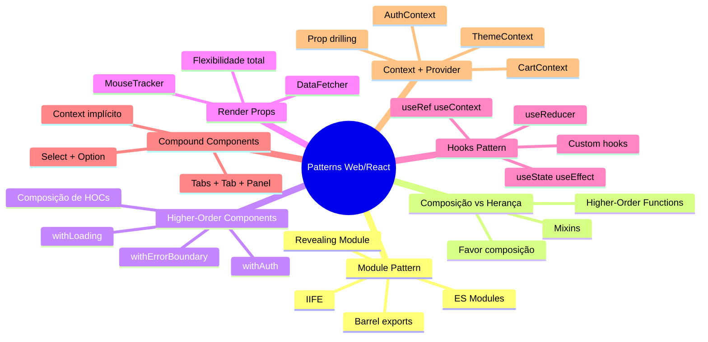

# Engenharia de Software — Aula 09

## Module Pattern, Composição & Patterns Web/React

**Duração estimada:** 100 minutos (60 leitura + 40 prática)
**Nível:** Intermediário
**Pré-requisitos:** Clean Code (Aula 01), SOLID (Aula 02), Design Patterns (Aula 03), DDD (Aula 04), Clean Architecture (Aula 05), SDD (Aula 06), TDD (Aula 07), CI/CD (Aula 08)

---

## Objetivos de Aprendizagem

Ao concluir esta aula, você será capaz de:

- [ ] **Explicar** o que torna um pattern "idiomático" na web e como eles diferem dos padrões GoF clássicos
- [ ] **Implementar** o Module Pattern com IIFE, Revealing Module e ES Modules, distinguindo encapsulamento real de convenção
- [ ] **Diferenciar** composição de herança, demonstrando com exemplos práticos por que "favoreça composição sobre herança" é uma regra valiosa
- [ ] **Construir** Higher-Order Components (HOCs) com TypeScript generics para reutilização de lógica em React
- [ ] **Aplicar** o padrão Render Props para controlar o que um componente renderiza a partir de dados obtidos externamente
- [ ] **Criar** custom hooks React que encapsulam estado e efeitos colaterais seguindo as regras dos hooks
- [ ] **Projetar** Compound Components que compartilham estado implícito via Context API
- [ ] **Implementar** o padrão Provider/Context para substituir prop drilling em árvores de componentes profundas
- [ ] **Compor** múltiplos patterns (HOC + Hooks + Context) no frontend de um e-commerce real com catálogo, carrinho e checkout

---

## Como Usar Esta Aula

Esta aula está organizada em duas grandes partes. A **primeira parte** cobre os fundamentos conceituais — Module Pattern e Composição vs Herança — que são anteriores a qualquer framework e valem para qualquer linguagem. A **segunda parte** aplica esses conceitos no ecossistema React, explorando os patterns que dominam o desenvolvimento frontend moderno: HOCs, Render Props, Hooks, Compound Components e Context.

Ao longo do caminho, você encontrará seções **"Mão na Massa"** (para fazer, não só ler) e **"Quick Check"** (para verificar se entendeu antes de avançar). Ao final, o arquivo separado **Questões de Aprendizagem** traz as tarefas de checkpoint — só avance para a Aula 10 quando conseguir completá-las por conta própria.

**Tempo estimado:** 60 minutos de leitura + 40 minutos de prática.

---

## Mapa Mental



---

## Recapitulação das Aulas 01-08

Antes de mergulhar nos patterns web, vejamos como as aulas anteriores se conectam com o que vem a seguir.

| Aula | O que aprendemos | Conexão com Patterns Web |
|---|---|---|
| **01 — Clean Code** | Nomes significativos, funções pequenas, DRY, KISS, YAGNI | Custom hooks são a materialização do DRY no frontend |
| **02 — SOLID** | SRP, OCP, LSP, ISP, DIP | HOCs seguem OCP (aberto para extensão); Context segue DIP (abstração do estado) |
| **03 — Design Patterns** | Factory, Strategy, Observer, Adapter | Hooks são uma forma de Strategy; Observer está no coração do useEffect |
| **04 — Domain-Driven Design** | Entities, Value Objects, Bounded Contexts | Cada Context no React pode representar um Bounded Context do domínio |
| **05 — Clean Architecture** | 4 camadas, regra da dependência, inversão de controle | Custom hooks são a ponte entre a camada de domínio e a camada de apresentação |
| **06 — SDD + Gherkin** | User stories, Given-When-Then | Compound Components permitem uma DSL declarativa no JSX |
| **07 — TDD + Pirâmide de Testes** | Red-Green-Refactor, testes unitários, integração, E2E | Custom hooks são testáveis isoladamente com renderHook |
| **08 — CI/CD + DevSecOps** | Pipeline, quality gates, deploy automatizado | O build do React verifica regras dos hooks; testes de hooks entram no pipeline |

A linha que une as oito aulas: **código limpo → princípios → padrões → domínio → arquitetura → especificação → testes → entrega**. Patterns web/React são o próximo degrau — o elo entre a engenharia de software clássica e o desenvolvimento frontend moderno.

---

> **FUNDAMENTOS: Patterns Idiomáticos da Web e do JavaScript**
> Os conceitos desta seção são universais — valem para qualquer linguagem ou framework. Entender Module Pattern e Composição antes de mergulhar em React é como entender variáveis antes de funções: a base sobre a qual tudo o mais se constrói.

---

## 1. Module Pattern

### O Problema do Escopo Global

Imagine que você está escrevendo JavaScript no navegador. Você cria uma variável `carrinho` para guardar os itens do e-commerce. Funciona. Depois você importa um script de terceiros que também usa `carrinho` para outra finalidade. O que acontece? **Colisão de nomes.** A segunda declaração sobrescreve a primeira, e seu carrinho simplesmente desaparece.

Esse é o problema fundamental que o Module Pattern resolve: **encapsulamento**. Antes de existirem classes e módulos nativos no JavaScript, os desenvolvedores precisavam de uma forma de isolar código e evitar vazamento para o escopo global.

### A Solução Clássica: IIFE (Immediately Invoked Function Expression)

Uma IIFE é uma função que é definida e executada imediatamente. Como funções criam seu próprio escopo, tudo o que está dentro da IIFE fica isolado do mundo exterior.

```typescript
// Antes do Module Pattern — vazamento global
let carrinho = [];
function adicionarItem(item) { carrinho.push(item); }
// Qualquer script pode sobrescrever `carrinho` ou `adicionarItem`

// Com IIFE — encapsulamento
const ModuloCarrinho = (function () {
  // Escopo privado — ninguém de fora acessa
  const itens: Array<{ id: string; nome: string; preco: number }> = [];

  function adicionar(item: { id: string; nome: string; preco: number }) {
    itens.push(item);
  }

  function listar() {
    return [...itens]; // Retorna cópia para evitar mutação externa
  }

  function total() {
    return itens.reduce((acc, item) => acc + item.preco, 0);
  }

  // Apenas o que é retornado fica acessível
  return { adicionar, listar, total };
})();

// Uso:
ModuloCarrinho.adicionar({ id: "1", nome: "Camiseta", preco: 49.90 });
console.log(ModuloCarrinho.total()); // 49.9
// ModuloCarrinho.itens — undefined (privado!)
```

**O que acontece aqui:** A função é executada uma única vez, no momento da definição. O objeto retornado é atribuído a `ModuloCarrinho`. As variáveis `itens`, `adicionar`, `listar` e `total` existem dentro do closure da IIFE — ninguém de fora consegue acessá-las diretamente.

### Revealing Module Pattern

Uma variação popular é o **Revealing Module Pattern**, onde você declara todas as funções e variáveis primeiro, e no final "revela" apenas o que deve ser público:

```typescript
const ModuloPagamento = (function () {
  // Tudo é privado inicialmente
  const taxas: Record<string, number> = { credito: 0.05, debito: 0.02 };
  const transacoes: Array<{ valor: number; tipo: string }> = [];

  function calcularTaxa(valor: number, tipo: string): number {
    return valor * (taxas[tipo] ?? 0.03);
  }

  function processar(valor: number, tipo: string): string {
    const taxa = calcularTaxa(valor, tipo);
    transacoes.push({ valor, tipo });
    return `Transação de R$${valor} processada. Taxa: R$${taxa}`;
  }

  function extrato() {
    return [...transacoes];
  }

  // Revela apenas o necessário
  return { processar, extrato };
})();
```

A vantagem do Revealing Module é que a sintaxe é mais limpa: você vê todas as implementações de uma vez e o `return` no final deixa explícito o que é público.

### A Evolução: ES Modules (import / export)

Com o ES6 (ECMAScript 2015), o JavaScript ganhou módulos nativos. Hoje você não precisa mais de IIFE para encapsular — o próprio sistema de módulos cuida disso.

```typescript
// modules/carrinho.ts
export interface Item {
  id: string;
  nome: string;
  preco: number;
  quantidade: number;
}

// Estado privado do módulo
const itens: Item[] = [];

export function adicionar(item: Item): void {
  itens.push(item);
}

export function remover(id: string): void {
  const index = itens.findIndex(i => i.id === id);
  if (index !== -1) itens.splice(index, 1);
}

export function listar(): Item[] {
  return [...itens];
}

export function total(): number {
  return itens.reduce((acc, i) => acc + i.preco * i.quantidade, 0);
}
```

```typescript
// Uso em outro arquivo
import { adicionar, listar, total, type Item } from "./modules/carrinho";

const camiseta: Item = { id: "1", nome: "Camiseta", preco: 49.9, quantidade: 2 };
adicionar(camiseta);
console.log(total()); // 99.8
```

Observe como o padrão é o mesmo da IIFE: as variáveis declaradas no nível do módulo (`const itens`) são **privadas** do módulo. Apenas o que é exportado fica visível. O ES Module é, essencialmente, o Module Pattern tornado nativo.

### Barrel Exports

Um pattern organizacional complementar é o **barrel export** (ou arquivo `index.ts`). Ele agrupa exports de vários submódulos em um único ponto de entrada:

```typescript
// modules/index.ts
export { adicionar, remover, listar, total } from "./carrinho";
export { processar, extrato } from "./pagamento";
export type { Item } from "./carrinho";
```

```typescript
// Uso com barrel
import { adicionar, processar, type Item } from "./modules";
```

Isso cria uma superfície de API limpa para seu domínio: quem importa não precisa saber como os módulos internos estão organizados.

### Quick Check

**1. Qual a diferença fundamental entre uma IIFE e um ES Module em termos de encapsulamento?**
**Resposta:** Ambos criam um escopo isolado onde variáveis internas são privadas. A diferença é que a IIFE é um padrão manual (você cria a função, executa e retorna o que é público), enquanto o ES Module é nativo da linguagem — o próprio runtime trata o arquivo como um módulo, e apenas o que é exportado fica visível. Além disso, ES Modules têm resolução de dependências, carregamento assíncrono e tree-shaking.

**2. Por que o Revealing Module Pattern retorna uma cópia do array (`[...itens]`) em vez do array original?**
**Resposta:** Para evitar que o código externo modifique o estado interno do módulo. Se retornássemos a referência direta ao array `itens`, o código externo poderia fazer `carrinho.listar().push({...})` e violar o encapsulamento. A cópia defensiva garante que o módulo mantém controle total sobre seus dados.

---

## 2. Composition vs Inheritance

### O Dilema Clássico

"Favoreça composição sobre herança" é uma das frases mais citadas da engenharia de software. Mas o que isso significa na prática?

**Herança** é um relacionamento "é um": um `Cachorro` é um `Animal`, um `CarroElétrico` é um `Carro`. Você cria uma hierarquia de classes onde a filha herda comportamentos da mãe.

**Composição** é um relacionamento "tem um" ou "usa um": um `Carro` tem um `Motor`, um `Pedido` tem uma lista de `Itens`. Você monta comportamentos combinando objetos menores.

O problema da herança é que ela é **rígida**: uma vez que você define a árvore de classes, mudar a hierarquia no meio do projeto quebra tudo. Composição é **flexível**: você troca peças sem mexer no resto.

### Exemplo Concreto: Sistema de Pagamento

Vamos comparar as duas abordagens em um cenário real:

**Abordagem com herança:**

```typescript
class Pagamento {
  processar(valor: number): string {
    return `Processando R$${valor}`;
  }
}

class PagamentoComLog extends Pagamento {
  processar(valor: number): string {
    console.log(`Iniciando pagamento de R$${valor}`);
    const resultado = super.processar(valor);
    console.log(`Pagamento concluído: ${resultado}`);
    return resultado;
  }
}

class PagamentoComRetry extends PagamentoComLog {
  processar(valor: number): string {
    let tentativas = 0;
    while (tentativas < 3) {
      try { return super.processar(valor); }
      catch { tentativas++; }
    }
    throw new Error("Falha após 3 tentativas");
  }
}

// E se eu quiser retry SEM log? Preciso de outra classe...
// E se eu quiser log + retry + cache? A hierarquia explode!
```

Essa abordagem rapidamente leva ao que chamamos de **herança profunda** — uma árvore de classes que multiplica combinações. Para 3 comportamentos (log, retry, cache), você precisaria de 8 classes diferentes.

**Abordagem com composição (Higher-Order Functions):**

```typescript
type ProcessadorPagamento = (valor: number) => string;

function processadorBase(valor: number): string {
  return `Processando R$${valor}`;
}

function comLog(processador: ProcessadorPagamento): ProcessadorPagamento {
  return (valor: number) => {
    console.log(`Iniciando pagamento de R$${valor}`);
    const resultado = processador(valor);
    console.log(`Pagamento concluído: ${resultado}`);
    return resultado;
  };
}

function comRetry(processador: ProcessadorPagamento): ProcessadorPagamento {
  return (valor: number) => {
    let tentativas = 0;
    while (tentativas < 3) {
      try { return processador(valor); }
      catch { tentativas++; }
    }
    throw new Error("Falha após 3 tentativas");
  };
}

// Composição simples: escolho exatamente o que quero
const pagamentoSimples = comLog(processadorBase);
const pagamentoResiliente = comRetry(processadorBase);
const pagamentoCompleto = comLog(comRetry(processadorBase));
```

Pare um momento e compare. Na composição, cada função **envolve** a anterior. A ordem importa: `comLog(comRetry(base))` significa "crie um processador com retry e então adicione log em volta dele". Se eu quiser inverter, é só trocar a ordem.

### Mixin Pattern: Composição de Comportamentos

Outra forma de composição no JavaScript são os **mixins** — objetos que agrupam comportamentos e são combinados em um alvo:

```typescript
// Mixins de comportamento
const LoggerMixin = {
  log(mensagem: string) {
    console.log(`[${new Date().toISOString()}] ${mensagem}`);
  }
};

const ValidacaoMixin = {
  validar(valor: number): boolean {
    return valor > 0 && !isNaN(valor);
  }
};

// Composição via Object.assign
const servicoPagamento = Object.assign(
  {},
  LoggerMixin,
  ValidacaoMixin,
  {
    processar(valor: number) {
      if (!this.validar(valor)) throw new Error("Valor inválido");
      this.log(`Processando R$${valor}`);
      return `Sucesso: R$${valor}`;
    }
  }
);
```

### Composição no Design de Componentes

O princípio da composição vai além de funções. Ele é uma **mentalidade de design**: em vez de criar hierarquias complexas, construa partes pequenas e independentes que se combinam.

```typescript
// Ruim: herança profunda
class ComponenteBase { render() { return "<div />"; } }
class ComponenteComLoading extends ComponenteBase { /* ... */ }
class ComponenteComLoadingEAuth extends ComponenteComLoading { /* ... */ }

// Bom: composição de comportamentos
function withLoading(renderFn: () => string): () => string {
  return () => `<div class="loading">${renderFn()}</div>`;
}

function withAuth(renderFn: () => string): () => string {
  return () => `<div class="auth">${renderFn()}</div>`;
}

const componenteFinal = withAuth(withLoading(() => "<h1>Dashboard</h1>"));
```

A diferença fundamental: na herança você está preso à hierarquia que definiu no início. Na composição, você monta exatamente o que precisa, quando precisa.

### Quick Check

**1. Por que a composição com Higher-Order Functions resolve o problema da "explosão de classes" que vimos no exemplo de herança?**
**Resposta:** Porque cada comportamento (log, retry, cache) é uma função independente que pode ser combinada em qualquer ordem. Em vez de criar uma classe para cada combinação possível (3 comportamentos = 8 classes), você tem 3 funções que compõem como Lego. A complexidade cresce linearmente com o número de comportamentos, não exponencialmente.

**2. Qual a diferença entre um Mixin e uma Higher-Order Function como estratégia de composição?**
**Resposta:** Um Mixin é um objeto com métodos que é copiado para o alvo via `Object.assign` — é composição de estado e comportamento no mesmo objeto. Uma Higher-Order Function é uma função que recebe e retorna funções — é composição de transformações, sem acoplamento de estado. HOFs são mais comuns em React (HOCs), enquanto mixins foram populares no início do React mas caíram em desuso por causarem colisões de nomes.

---

> **APLICAÇÃO: Frontend do E-commerce com React Patterns**
> Agora que você entende os fundamentos (Module Pattern e Composição), vamos ver como eles se materializam no ecossistema React. Cada pattern a seguir resolve um problema específico no frontend do nosso e-commerce: catálogo, carrinho e checkout.

---

## 3. HOC — Higher-Order Components

Um **Higher-Order Component (HOC)** é a aplicação direta do padrão de Higher-Order Function no React: uma função que recebe um componente e retorna um novo componente com funcionalidades adicionais.

```typescript
// Definição genérica de um HOC
type HOC<PropsIn, PropsOut = PropsIn> = (Component: React.ComponentType<PropsIn>) => React.ComponentType<PropsOut>;
```

### withAuth: Protegendo o Checkout

O checkout do nosso e-commerce só deve ser acessível por usuários logados. Em vez de colocar lógica de autenticação dentro do `CheckoutPage`, criamos um HOC que envolve o componente:

```typescript
import React, { useEffect } from "react";
import { useNavigate } from "react-router-dom";

// Interface que o HOC injeta
interface WithAuthProps {
  usuario: { id: string; nome: string; email: string };
}

function withAuth<Props extends object>(
  WrappedComponent: React.ComponentType<Props & WithAuthProps>
): React.ComponentType<Omit<Props, keyof WithAuthProps>> {
  return function AuthenticatedComponent(props: Props) {
    const navigate = useNavigate();
    const [usuario, setUsuario] = React.useState<WithAuthProps["usuario"] | null>(null);

    useEffect(() => {
      // Simula verificação de autenticação
      const token = localStorage.getItem("auth_token");
      if (!token) {
        navigate("/login");
        return;
      }
      // Busca dados do usuário
      fetch("/api/me", { headers: { Authorization: `Bearer ${token}` } })
        .then(res => res.json())
        .then(data => setUsuario(data))
        .catch(() => navigate("/login"));
    }, [navigate]);

    if (!usuario) return <div>Verificando autenticação...</div>;

    return <WrappedComponent {...(props as Props)} usuario={usuario} />;
  };
}

// Uso: componente protegido sem saber que está protegido
const CheckoutPage = ({ usuario }: { usuario: { id: string; nome: string; email: string } }) => {
  return (
    <div>
      <h1>Checkout</h1>
      <p>Usuário: {usuario.nome}</p>
      {/* Formulário de checkout */}
    </div>
  );
};

const ProtectedCheckout = withAuth(CheckoutPage);
```

Observe: o `CheckoutPage` não sabe que está sendo "envolvido" por um HOC. Ele simplesmente recebe `usuario` como prop. O HOC cuida de toda a lógica de autenticação.

### withLoading: Estados de Carregamento

Outro HOC extremamente comum é o `withLoading`. Ele exibe um spinner enquanto os dados não chegam e só renderiza o componente quando estão prontos:

```typescript
interface WithLoadingProps {
  loading: boolean;
}

function withLoading<P extends object>(
  WrappedComponent: React.ComponentType<P>
): React.ComponentType<P & WithLoadingProps> {
  return function LoadingWrapper({ loading, ...props }: P & WithLoadingProps) {
    if (loading) {
      return (
        <div className="spinner-container">
          <div className="spinner" />
          <p>Carregando...</p>
        </div>
      );
    }
    return <WrappedComponent {...(props as P)} />;
  };
}
```

### Composição de HOCs

O poder real dos HOCs aparece quando você os compõe:

```typescript
// Protegido + loading
const ProtectedCheckoutWithLoading = withAuth(withLoading(CheckoutPage));

// Uso no App
function App() {
  const [carregando, setCarregando] = useState(true);

  useEffect(() => {
    fetch("/api/init").then(() => setCarregando(false));
  }, []);

  return <ProtectedCheckoutWithLoading loading={carregando} />;
}
```

**Ordem importa.** `withAuth(withLoading(Componente))` significa: primeiro adiciono loading, depois adiciono autenticação em volta. O componente resultante primeiro verifica autenticação e, se passar, mostra o loading.

### Quick Check

**1. Qual a diferença entre um HOC e uma Higher-Order Function comum?**
**Resposta:** Conceitualmente são a mesma coisa — ambas recebem um valor e retornam outro valor transformado. A diferença é que o HOC opera especificamente no domínio de componentes React: recebe um componente (React.ComponentType) e retorna um novo componente com props adicionais ou comportamento estendido.

**2. Por que o HOC `withAuth` usa `Omit<Props, keyof WithAuthProps>` no tipo de retorno?**
**Resposta:** Para que quem for usar o HOC não precise passar `usuario` como prop — o HOC injeta essa prop automaticamente. Se o tipo de retorno exigisse `usuario`, o usuário do HOC teria que passar manualmente, o que anularia o propósito do HOC. O `Omit` remove `usuario` das props esperadas.

---

## 4. Render Props

O padrão **Render Props** é outra forma de composição: um componente recebe uma função como `render` (ou `children`) e delega a ela o controle sobre o que renderizar.

### O Problema: Lógica Compartilhada, Renderização Variável

Imagine que você quer rastrear a posição do mouse em vários componentes da página. Você poderia duplicar o código de rastreamento em cada um — ou criar um componente que encapsula a lógica e deixa cada consumidor decidir como renderizar.

### DataFetcher: Busca de Dados Genérica

```typescript
interface DataFetcherProps<T> {
  url: string;
  render: (dados: { data: T | null; loading: boolean; error: Error | null }) => React.ReactNode;
}

function DataFetcher<T>({ url, render }: DataFetcherProps<T>) {
  const [data, setData] = useState<T | null>(null);
  const [loading, setLoading] = useState(true);
  const [error, setError] = useState<Error | null>(null);

  useEffect(() => {
    setLoading(true);
    fetch(url)
      .then(res => res.json())
      .then((dados: T) => { setData(dados); setLoading(false); })
      .catch((err: Error) => { setError(err); setLoading(false); });
  }, [url]);

  return <>{render({ data, loading, error })}</>;
}

// Uso 1: Lista de produtos no catálogo
function Catalogo() {
  return (
    <DataFetcher<Produto[]>
      url="/api/produtos"
      render={({ data, loading, error }) => {
        if (loading) return <SkeletonGrid />;
        if (error) return <ErrorBanner mensagem={error.message} />;
        return <ProductGrid produtos={data!} />;
      }}
    />
  );
}

// Uso 2: Detalhes de um produto específico
function DetalheProduto({ id }: { id: string }) {
  return (
    <DataFetcher<Produto>
      url={`/api/produtos/${id}`}
      render={({ data, loading }) => {
        if (loading) return <Spinner />;
        return <ProductCard produto={data!} />;
      }}
    />
  );
}
```

Perceba a flexibilidade: o mesmo `DataFetcher` serve para listar produtos no catálogo e mostrar detalhes — a busca é a mesma, o que muda é como cada consumidor renderiza os estados (loading, erro, dados).

### Variação: children como Função

Uma variação comum é usar `children` em vez de `render`:

```typescript
interface MouseTrackerProps {
  children: (posicao: { x: number; y: number }) => React.ReactNode;
}

function MouseTracker({ children }: MouseTrackerProps) {
  const [posicao, setPosicao] = useState({ x: 0, y: 0 });

  useEffect(() => {
    const handler = (e: MouseEvent) => setPosicao({ x: e.clientX, y: e.clientY });
    window.addEventListener("mousemove", handler);
    return () => window.removeEventListener("mousemove", handler);
  }, []);

  return <>{children(posicao)}</>;
}

// Uso
function App() {
  return (
    <MouseTracker>
      {({ x, y }) => (
        <div style={{ height: "100vh" }}>
          <h1>Mouse position: {x}, {y}</h1>
          <div
            style={{
              position: "absolute",
              left: x - 25, top: y - 25,
              width: 50, height: 50,
              background: "blue", borderRadius: "50%"
            }}
          />
        </div>
      )}
    </MouseTracker>
  );
}
```

Render Props foi o padrão dominante antes dos Hooks. Hoje muitos casos de Render Props foram substituídos por custom hooks, mas o padrão ainda é útil quando você quer que **o componente controle o ciclo de vida** e apenas delegue a renderização.

### HOC vs Render Props vs Hooks: Quando Usar Cada Um

| Critério | HOC | Render Props | Hooks |
|---|---|---|---|
| **Injeção de props** | Automática, mas esconde a origem | Explícita via função | Explícita via retorno |
| **Colisão de nomes** | Pode acontecer (props injetadas) | Não acontece (variável nomeada na função) | Não acontece (variável nomeada) |
| **Testabilidade** | Média (precisa do componente mockado) | Boa | Excelente (teste isolado) |
| **Composição** | Encadeamento de HOCs | Aninhamento de funções | Chamada de hooks |
| **Legibilidade** | Pior com muitos HOCs | Melhor, mas aninha | Melhor, sequencial |

### Quick Check

**1. Qual a diferença prática entre HOC e Render Props?**
**Resposta:** No HOC, a lógica é injetada automaticamente como props no componente envolto. No Render Props, o componente consumidor recebe uma função e decide explicitamente como usar os dados no JSX. Render Props dão mais controle visual, enquanto HOCs são melhores para adicionar comportamentos transversais (autenticação, loading).

**2. Em que cenário Render Props ainda é preferível a custom hooks?**
**Resposta:** Quando o componente precisa controlar o ciclo de vida da lógica compartilhada. Por exemplo, um `DataFetcher` com Render Props pode ser montado/desmontado e o fetching acompanha o ciclo de vida do componente. Com hooks, o fetching está no componente consumidor — ambos funcionam, mas Render Props separam mais claramente a responsabilidade de buscar dados da responsabilidade de exibi-los.

---

## 5. Hooks Pattern

Os **Hooks** (React 16.8+) são o pattern dominante no ecossistema React. Eles resolvem problemas que HOCs e Render Props tratavam de forma indireta: reutilização de lógica com estado, sem aninhamento excessivo e sem prop drilling.

### Os Hooks Fundamentais

```typescript
import React, { useState, useEffect, useRef, useContext, useReducer } from "react";

// useState — estado local
const [contador, setContador] = useState(0);

// useEffect — efeitos colaterais
useEffect(() => {
  document.title = `Você clicou ${contador} vezes`;
}, [contador]);

// useRef — referência mutável que não causa re-render
const inputRef = useRef<HTMLInputElement>(null);
inputRef.current?.focus();

// useContext — acesso a contexto
const theme = useContext(ThemeContext);
```

### Custom Hooks: Composição de Lógica

O verdadeiro poder dos hooks está em criar os seus próprios. Custom hooks são a forma mais pura de **composição**: você combina hooks nativos em uma função que encapsula lógica reutilizável.

```typescript
// useFetch — busca de dados genérica
function useFetch<T>(url: string) {
  const [data, setData] = useState<T | null>(null);
  const [loading, setLoading] = useState(true);
  const [error, setError] = useState<Error | null>(null);

  useEffect(() => {
    let abortado = false;
    setLoading(true);

    fetch(url)
      .then(res => {
        if (!res.ok) throw new Error(`HTTP ${res.status}`);
        return res.json();
      })
      .then((dados: T) => {
        if (!abortado) { setData(dados); setLoading(false); }
      })
      .catch((err: Error) => {
        if (!abortado) { setError(err); setLoading(false); }
      });

    return () => { abortado = true; };
  }, [url]);

  return { data, loading, error };
}
```

**O que torna este hook especial:** Ele usa a flag `abortado` para evitar **memory leaks** — se o componente desmontar antes da requisição terminar, o `setState` não é chamado. Isso era um problema comum em componentes de classe que o hook resolve naturalmente.

### Hooks do E-commerce

Vamos criar hooks específicos para nosso domínio:

```typescript
// useAuth — autenticação
function useAuth() {
  const [usuario, setUsuario] = useState<{ id: string; nome: string } | null>(null);

  useEffect(() => {
    const token = localStorage.getItem("auth_token");
    if (token) {
      fetch("/api/me", { headers: { Authorization: `Bearer ${token}` } })
        .then(res => res.json())
        .then(setUsuario);
    }
  }, []);

  const login = async (email: string, senha: string) => {
    const res = await fetch("/api/login", {
      method: "POST",
      body: JSON.stringify({ email, senha }),
    });
    const data = await res.json();
    localStorage.setItem("auth_token", data.token);
    setUsuario(data.usuario);
  };

  const logout = () => {
    localStorage.removeItem("auth_token");
    setUsuario(null);
  };

  return { usuario, login, logout, isAutenticado: usuario !== null };
}

// useCarrinho — estado do carrinho
function useCarrinho() {
  const [itens, setItens] = useState<ItemCarrinho[]>([]);

  const adicionar = (produto: Produto, quantidade = 1) => {
    setItens(prev => {
      const existente = prev.find(i => i.id === produto.id);
      if (existente) {
        return prev.map(i =>
          i.id === produto.id
            ? { ...i, quantidade: i.quantidade + quantidade }
            : i
        );
      }
      return [...prev, { ...produto, quantidade }];
    });
  };

  const remover = (id: string) => {
    setItens(prev => prev.filter(i => i.id !== id));
  };

  const total = itens.reduce((acc, i) => acc + i.preco * i.quantidade, 0);
  const quantidadeTotal = itens.reduce((acc, i) => acc + i.quantidade, 0);

  return { itens, adicionar, remover, total, quantidadeTotal };
}
```

### Regras dos Hooks

React impõe duas regras que **não podem ser quebradas**:

1. **Não chame hooks dentro de condicionais, loops ou funções aninhadas.** Hooks devem ser chamados no nível mais alto do componente/hook, na mesma ordem a cada render.
2. **Não chame hooks fora de componentes React ou custom hooks.**

```typescript
// ERRADO: hook dentro de condicional
function Produto({ id }: { id: string }) {
  if (!id) return null;
  const { data } = useFetch(`/api/produtos/${id}`); // VIOLOU REGRA 1
  return <div>{data?.nome}</div>;
}

// CERTO: hook sempre no topo, validação depois
function Produto({ id }: { id: string }) {
  const { data } = useFetch(`/api/produtos/${id}`);
  if (!id) return null;
  return <div>{data?.nome}</div>;
}
```

A razão: o React usa a **ordem de chamada** dos hooks para associar cada hook ao seu estado. Se um hook é chamado condicionalmente, a ordem muda entre renders e o React perde o controle.

### Quick Check

**1. Por que custom hooks são considerados a forma mais pura de composição no React?**
**Resposta:** Porque um custom hook compõe hooks nativos (useState, useEffect, etc.) dentro de uma função que encapsula lógica com estado. Diferente de HOCs (que precisam de um componente wrapper) e Render Props (que precisam de aninhamento no JSX), custom hooks são funções puras que podem ser chamadas em qualquer componente sem alterar a árvore de componentes.

**2. O que acontece se um hook for chamado dentro de um `if`?**
**Resposta:** O ESLint (plugin react-hooks) vai acusar erro. Em tempo de execução, o React pode retornar estado incorreto ou lançar exceção porque a ordem de chamada dos hooks mudou entre renders. O React mantém um array interno de estados associados à posição de cada chamada — se um hook "pula" porque o `if` é falso, todos os hooks seguintes se desalinham.

---

## 6. Compound Components

**Compound Components** (Componentes Compostos) são componentes que trabalham juntos compartilhando estado implícito, geralmente via Context API. O exemplo clássico é `<select>` e `<option>` no HTML: o `<option>` não funciona sozinho — ele precisa de um `<select>` por perto.

### Select Composto

```typescript
// Context compartilhado entre Select e Option
interface SelectContextType {
  valor: string;
  onChange: (valor: string) => void;
  aberto: boolean;
  toggle: () => void;
}

const SelectContext = React.createContext<SelectContextType | null>(null);

// Select principal — provedor do contexto
function Select({ children, valor, onChange }: {
  children: React.ReactNode;
  valor: string;
  onChange: (valor: string) => void;
}) {
  const [aberto, setAberto] = useState(false);

  return (
    <SelectContext.Provider value={{ valor, onChange, aberto, toggle: () => setAberto(!aberto) }}>
      <div className="select-container">
        <Trigger />
        {aberto && <Dropdown>{children}</Dropdown>}
      </div>
    </SelectContext.Provider>
  );
}

// Option — consumidor do contexto
function Option({ value, children }: { value: string; children: React.ReactNode }) {
  const ctx = useContext(SelectContext);
  if (!ctx) throw new Error("Option deve estar dentro de Select");

  const selecionado = ctx.valor === value;
  return (
    <div
      className={`select-option ${selecionado ? "selected" : ""}`}
      onClick={() => { ctx.onChange(value); ctx.toggle(); }}
    >
      {children}
    </div>
  );
}

// Componente interno Trigger
function Trigger() {
  const ctx = useContext(SelectContext);
  if (!ctx) throw new Error("Trigger deve estar dentro de Select");

  return (
    <div className="select-trigger" onClick={ctx.toggle}>
      {ctx.valor || "Selecione..."}
      <span className="arrow">{ctx.aberto ? "▲" : "▼"}</span>
    </div>
  );
}

// Vincular Option como propriedade estática de Select
Select.Option = Option;

// Uso
function FormularioEndereco() {
  const [estado, setEstado] = useState("sp");

  return (
    <Select valor={estado} onChange={setEstado}>
      <Select.Option value="sp">São Paulo</Select.Option>
      <Select.Option value="rj">Rio de Janeiro</Select.Option>
      <Select.Option value="mg">Minas Gerais</Select.Option>
    </Select>
  );
}
```

### Tabs Composto

Outro exemplo clássico: abas com tabs e painéis:

```typescript
interface TabsContextType {
  ativo: string;
  setAtivo: (tab: string) => void;
}

const TabsContext = createContext<TabsContextType | null>(null);

function Tabs({ children, defaultTab }: { children: React.ReactNode; defaultTab: string }) {
  const [ativo, setAtivo] = useState(defaultTab);
  return (
    <TabsContext.Provider value={{ ativo, setAtivo }}>
      <div className="tabs-container">{children}</div>
    </TabsContext.Provider>
  );
}

function Tab({ id, children }: { id: string; children: React.ReactNode }) {
  const ctx = useContext(TabsContext)!;
  return (
    <button
      className={`tab ${ctx.ativo === id ? "active" : ""}`}
      onClick={() => ctx.setAtivo(id)}
    >
      {children}
    </button>
  );
}

function Panel({ id, children }: { id: string; children: React.ReactNode }) {
  const ctx = useContext(TabsContext)!;
  if (ctx.ativo !== id) return null;
  return <div className="tab-panel">{children}</div>;
}

Tabs.Tab = Tab;
Tabs.Panel = Panel;
```

```typescript
// Uso no catálogo
function CatalogoComAbas() {
  return (
    <Tabs defaultTab="mais-vendidos">
      <div className="tabs-header">
        <Tabs.Tab id="mais-vendidos">Mais Vendidos</Tabs.Tab>
        <Tabs.Tab id="lancamentos">Lançamentos</Tabs.Tab>
        <Tabs.Tab id="promocoes">Promoções</Tabs.Tab>
      </div>
      <Tabs.Panel id="mais-vendidos">
        <ProductGrid filtro="mais-vendidos" />
      </Tabs.Panel>
      <Tabs.Panel id="lancamentos">
        <ProductGrid filtro="lancamentos" />
      </Tabs.Panel>
      <Tabs.Panel id="promocoes">
        <ProductGrid filtro="promocoes" />
      </Tabs.Panel>
    </Tabs>
  );
}
```

**Por que isso é poderoso:** O `Tab` e `Panel` não recebem props de estado (`ativo`, `setAtivo`) explicitamente. O estado está no `TabsContext`, e cada componente filho consome apenas o que precisa. A API fica limpa e declarativa.

### Compound Components vs Configuração por Props

Compare com a abordagem alternativa (um único componente com props de configuração):

```typescript
// Abordagem não-composta
<Tabs
  tabs={[
    { id: "mais-vendidos", label: "Mais Vendidos", content: <ProductGrid filtro="mais-vendidos" /> },
    { id: "lancamentos", label: "Lançamentos", content: <ProductGrid filtro="lancamentos" /> },
  ]}
/>
```

A versão composta é **mais flexível** porque o consumidor controla a estrutura do JSX (pode adicionar elementos entre as tabs, estilizar cada uma individualmente, etc.). A versão configurável é mais restritiva mas mais fácil de usar em casos simples.

### Quick Check

**1. Qual o papel do Context em Compound Components?**
**Resposta:** O Context é o "canal de comunicação implícito" entre o componente pai e os filhos. O componente pai (Select) coloca estado no Context; os filhos (Option) consomem esse estado sem recebê-lo via props. Isso elimina a necessidade de prop drilling e permite que os filhos estejam em qualquer profundidade na árvore.

**2. Por que `Select.Option` é uma propriedade estática e não um componente independente?**
**Resposta:** Por razões de API e documentação. Ao colocar `Option` como propriedade de `Select`, fica claro na syntaxe do JSX que `Option` só funciona dentro de `Select`. É uma forma de namespacing visual: `Select.Option`, `Tabs.Tab`, `Tabs.Panel`. Isso guia o desenvolvedor que está usando o componente.

---

## 7. Context + Provider

O padrão **Context + Provider** resolve um dos problemas mais comuns em aplicações React: o **prop drilling** — passar props por vários níveis de componentes que não usam a prop, apenas a repassam.

### O Problema do Prop Drilling

```typescript
// Sem Context — prop drilling
function App() {
  const [usuario, setUsuario] = useState(null);
  return <Header usuario={usuario} />
}

function Header({ usuario }: { usuario: User | null }) {
  return <nav><UserMenu usuario={usuario} /></nav>;
}

function UserMenu({ usuario }: { usuario: User | null }) {
  return <span>{usuario?.nome ?? "Visitante"}</span>;
  // Header só existe para repassar usuario para UserMenu!
}
```

Com 3 níveis o problema já aparece. Imagine com 5 ou 6 — e com múltiplos dados (carrinho, tema, idioma, etc.). O prop drilling torna o código verboso, difícil de refatorar e fácil de quebrar.

### Solução: Context + Provider

```typescript
// contexts/AuthContext.tsx
interface AuthContextType {
  usuario: { id: string; nome: string; email: string } | null;
  login: (email: string, senha: string) => Promise<void>;
  logout: () => void;
  isAutenticado: boolean;
}

const AuthContext = createContext<AuthContextType | undefined>(undefined);

function AuthProvider({ children }: { children: React.ReactNode }) {
  const [usuario, setUsuario] = useState<AuthContextType["usuario"] | null>(null);

  const login = async (email: string, senha: string) => {
    const res = await fetch("/api/login", {
      method: "POST", headers: { "Content-Type": "application/json" },
      body: JSON.stringify({ email, senha }),
    });
    const data = await res.json();
    localStorage.setItem("auth_token", data.token);
    setUsuario(data.usuario);
  };

  const logout = () => {
    localStorage.removeItem("auth_token");
    setUsuario(null);
  };

  return (
    <AuthContext.Provider value={{ usuario, login, logout, isAutenticado: usuario !== null }}>
      {children}
    </AuthContext.Provider>
  );
}

// Hook de acesso ao contexto
function useAuth(): AuthContextType {
  const ctx = useContext(AuthContext);
  if (!ctx) throw new Error("useAuth deve ser usado dentro de AuthProvider");
  return ctx;
}
```

### Context do Carrinho

No e-commerce, o carrinho precisa ser acessível de qualquer página (header com contador, página do carrinho, checkout):

```typescript
// contexts/CartContext.tsx
interface CartItem {
  id: string;
  nome: string;
  preco: number;
  quantidade: number;
  imagem: string;
}

interface CartContextType {
  itens: CartItem[];
  adicionar: (produto: Omit<CartItem, "quantidade">) => void;
  remover: (id: string) => void;
  alterarQuantidade: (id: string, quantidade: number) => void;
  total: number;
  quantidadeTotal: number;
  limpar: () => void;
}

const CartContext = createContext<CartContextType | undefined>(undefined);

function CartProvider({ children }: { children: React.ReactNode }) {
  const [itens, setItens] = useState<CartItem[]>(() => {
    // Hydration inicial do localStorage
    const saved = localStorage.getItem("@ecommerce/cart");
    return saved ? JSON.parse(saved) : [];
  });

  // Persistir no localStorage sempre que o carrinho mudar
  useEffect(() => {
    localStorage.setItem("@ecommerce/cart", JSON.stringify(itens));
  }, [itens]);

  const adicionar = (produto: Omit<CartItem, "quantidade">) => {
    setItens(prev => {
      const existente = prev.find(i => i.id === produto.id);
      if (existente) {
        return prev.map(i =>
          i.id === produto.id ? { ...i, quantidade: i.quantidade + 1 } : i
        );
      }
      return [...prev, { ...produto, quantidade: 1 }];
    });
  };

  const remover = (id: string) => setItens(prev => prev.filter(i => i.id !== id));
  const alterarQuantidade = (id: string, quantidade: number) => {
    if (quantidade <= 0) { remover(id); return; }
    setItens(prev => prev.map(i => i.id === id ? { ...i, quantidade } : i));
  };
  const limpar = () => setItens([]);

  const total = itens.reduce((acc, i) => acc + i.preco * i.quantidade, 0);
  const quantidadeTotal = itens.reduce((acc, i) => acc + i.quantidade, 0);

  return (
    <CartContext.Provider value={{ itens, adicionar, remover, alterarQuantidade, total, quantidadeTotal, limpar }}>
      {children}
    </CartContext.Provider>
  );
}

function useCart(): CartContextType {
  const ctx = useContext(CartContext);
  if (!ctx) throw new Error("useCart deve ser usado dentro de CartProvider");
  return ctx;
}
```

### Composição de Providers

No App principal, os providers podem ser compostos:

```typescript
function App() {
  return (
    <AuthProvider>
      <CartProvider>
        <ThemeProvider>
          <Router>
            <Routes>
              <Route path="/" element={<Catalogo />} />
              <Route path="/checkout" element={<ProtectedCheckout />} />
            </Routes>
          </Router>
        </ThemeProvider>
      </CartProvider>
    </AuthProvider>
  );
}
```

**Dica importante:** A ordem dos providers importa. `AuthProvider` deve estar por fora porque `CartProvider` pode depender de `useAuth()` para associar o carrinho ao usuário logado. Se a ordem fosse invertida, o carrinho não teria acesso ao usuário.

### Context vs Estado Global (Redux/Zustand)

| Característica | Context API | Redux / Zustand |
|---|---|---|
| **Setup** | Nativo do React, zero dependências | Biblioteca externa |
| **Performance** | Re-renderiza todos os consumidores | Seletor evita re-renders desnecessários |
| **Middleware** | Manual (useEffect) | Suporte nativo (Redux Saga, Thunk) |
| **Quando usar** | Estado global pequeno/médio, tema, autenticação | Estado global grande, lógica complexa, múltiplos reducers |
| **Boilerplate** | Mínimo | Significativo (actions, reducers, dispatch) |

**Regra prática:** Use Context para estado global que muda com pouca frequência (autenticação, tema, idioma). Use Redux/Zustand para estado que muda com frequência e é acessado por muitos componentes (carrinho com 50+ itens, timeline em tempo real).

### Quick Check

**1. Qual o problema que o Context + Provider resolve que HOCs e Render Props não resolvem?**
**Resposta:** O prop drilling — passar dados por vários níveis de componentes intermediários que não usam o dado. HOCs e Render Props exigem que cada nível intermediário "passe adiante" as props ou componentes, o que polui o código. Context permite que qualquer componente na árvore acesse o dado sem que os intermediários precisem saber dele.

**2. Por que o hook `useCart` verifica se o contexto existe e lança um erro se não existir?**
**Resposta:** Para garantir que o hook só seja chamado dentro de um `CartProvider`. Se alguém tentar usar `useCart()` em um componente fora do provider, o erro é imediato e claro: "useCart deve ser usado dentro de CartProvider". Isso evita bugs silenciosos onde o hook retornaria `undefined` e o componente quebraria sem mensagem clara.

---

## Quiz de Verificação

Teste seu conhecimento com estas 7 perguntas rápidas:

**1. Qual das alternativas abaixo é a principal motivação para o Module Pattern em JavaScript?**
- a) Organizar código em múltiplos arquivos
- b) Evitar poluição do escopo global com encapsulamento
- c) Melhorar performance de execução
- d) Habilitar herança entre módulos

**Gabarito:** b) Evitar poluição do escopo global com encapsulamento. O Module Pattern (IIFE ou ES Module) cria um escopo isolado onde variáveis internas ficam protegidas. A organização em arquivos é consequência, não motivação principal.

**2. O que significa "favoreça composição sobre herança"?**
- a) Use classes em vez de funções
- b) Prefira combinar comportamentos pequenos e independentes a criar hierarquias de classes
- c) Nunca use herança em hipótese alguma
- d) Use interfaces em vez de classes abstratas

**Gabarito:** b) Prefira combinar comportamentos pequenos e independentes a criar hierarquias de classes. Composição é mais flexível porque você monta exatamente o que precisa, na ordem que precisa, sem ficar preso a uma árvore de classes.

**3. Um HOC (Higher-Order Component) é:**
- a) Um componente que renderiza outros componentes
- b) Uma função que recebe um componente e retorna um novo componente com funcionalidades adicionais
- c) Um componente que usa hooks avançados
- d) Uma função que retorna JSX

**Gabarito:** b) Uma função que recebe um componente e retorna um novo componente com funcionalidades adicionais. É a aplicação do padrão Higher-Order Function no React.

**4. No padrão Render Props, o controle sobre o que renderizar é delegado para:**
- a) O próprio componente, que decide internamente
- b) Um HOC externo
- c) Uma função recebida via prop (render ou children)
- d) Um Context Provider

**Gabarito:** c) Uma função recebida via prop (render ou children). O componente encapsula a lógica e a função determina a renderização.

**5. Qual das seguintes NÃO é uma regra dos hooks do React?**
- a) Hooks devem ser chamados no nível mais alto do componente
- b) Hooks não podem ser chamados dentro de condicionais
- c) Hooks podem ser chamados fora de componentes React, desde que dentro de funções
- d) A ordem de chamada dos hooks deve ser consistente entre renders

**Gabarito:** c) Hooks não podem ser chamados fora de componentes React ou custom hooks. A regra 2 diz: "Não chame hooks fora de componentes React ou custom hooks".

**6. Compound Components compartilham estado implícito através de:**
- a) Props passadas manualmente para cada filho
- b) Context API
- c) Estado global (Redux)
- d) Refs

**Gabarito:** b) Context API. O componente pai coloca estado no Context e os filhos consomem sem receber props explicitamente.

**7. O padrão Context + Provider substitui principalmente:**
- a) Render Props
- b) HOCs
- c) Custom hooks
- d) Prop drilling

**Gabarito:** d) Prop drilling. Context resolve o problema de passar dados por múltiplos níveis de componentes que não usam o dado, apenas o repassam.

---

## Exercícios

### Exercício 1: Module Pattern — Refatorar para ES Modules (Fácil)

**Enunciado:** O código abaixo usa uma IIFE para encapsular a lógica de um carrinho de compras. Refatore-o para usar ES Modules (arquivo `carrinho.ts`) com exports nomeados. Mantenha a mesma funcionalidade.

```typescript
const Carrinho = (function () {
  const itens: Array<{ nome: string; preco: number }> = [];

  function adicionar(item: { nome: string; preco: number }) {
    itens.push(item);
  }

  function remover(nome: string) {
    const idx = itens.findIndex(i => i.nome === nome);
    if (idx !== -1) itens.splice(idx, 1);
  }

  function total() {
    return itens.reduce((acc, i) => acc + i.preco, 0);
  }

  return { adicionar, remover, total };
})();
```

**Gabarito:** O exercício espera que você crie um arquivo `carrinho.ts` com `export` em cada função e `const itens` fora dos exports. O gabarito completo:

```typescript
// carrinho.ts
export interface Item {
  nome: string;
  preco: number;
}

const itens: Item[] = [];

export function adicionar(item: Item): void {
  itens.push(item);
}

export function remover(nome: string): void {
  const idx = itens.findIndex(i => i.nome === nome);
  if (idx !== -1) itens.splice(idx, 1);
}

export function total(): number {
  return itens.reduce((acc, i) => acc + i.preco, 0);
}
```

### Exercício 2: Compor HOCs com TypeScript (Médio)

**Enunciado:** Implemente um HOC `withLogging` que recebe um componente e retorna um novo componente que loga no console toda vez que o componente é montado e desmontado. Depois, componha `withLogging` com `withAuth` para criar um `ProtectedCheckoutWithLogging`. Use TypeScript com generics.

**Gabarito:**

```typescript
// withLogging.tsx
import React, { useEffect } from "react";

function withLogging<P extends object>(
  WrappedComponent: React.ComponentType<P>,
  nomeComponente?: string
): React.ComponentType<P> {
  const displayName = nomeComponente || WrappedComponent.displayName || WrappedComponent.name || "Component";

  return function LoggingWrapper(props: P) {
    useEffect(() => {
      console.log(`[${displayName}] Montado`);
      return () => console.log(`[${displayName}] Desmontado`);
    }, []);

    return <WrappedComponent {...props} />;
  };
}

// Composição
const ProtectedCheckoutWithLogging = withLogging(withAuth(CheckoutPage), "Checkout");
```

### Exercício 3: Custom Hook + Context — Carrinho Persistente (Difícil)

**Enunciado:** Crie um hook `useCarrinhoPersistente` que:
1. Mantém o estado do carrinho em memória (useState)
2. Persiste automaticamente no localStorage a cada mudança (useEffect)
3. Hidrata o estado inicial a partir do localStorage
4. Retorna as funções: `adicionar`, `remover`, `alterarQuantidade`, `limpar`, `itens`, `total`
5. Permite prefixo de chave no localStorage configurável

**Gabarito:**

```typescript
// hooks/useCarrinhoPersistente.ts
import { useState, useEffect, useCallback } from "react";

interface ItemCarrinho {
  id: string;
  nome: string;
  preco: number;
  quantidade: number;
}

interface UseCarrinhoPersistenteOptions {
  storageKey?: string;
}

interface UseCarrinhoPersistenteReturn {
  itens: ItemCarrinho[];
  adicionar: (item: Omit<ItemCarrinho, "quantidade">) => void;
  remover: (id: string) => void;
  alterarQuantidade: (id: string, quantidade: number) => void;
  limpar: () => void;
  total: number;
  quantidadeTotal: number;
}

function useCarrinhoPersistente(
  options: UseCarrinhoPersistenteOptions = {}
): UseCarrinhoPersistenteReturn {
  const { storageKey = "@app/carrinho" } = options;

  const [itens, setItens] = useState<ItemCarrinho[]>(() => {
    try {
      const saved = localStorage.getItem(storageKey);
      return saved ? JSON.parse(saved) : [];
    } catch {
      return [];
    }
  });

  useEffect(() => {
    try {
      localStorage.setItem(storageKey, JSON.stringify(itens));
    } catch {
      console.warn("Falha ao persistir carrinho no localStorage");
    }
  }, [itens, storageKey]);

  const adicionar = useCallback((produto: Omit<ItemCarrinho, "quantidade">) => {
    setItens(prev => {
      const existente = prev.find(i => i.id === produto.id);
      if (existente) {
        return prev.map(i =>
          i.id === produto.id ? { ...i, quantidade: i.quantidade + 1 } : i
        );
      }
      return [...prev, { ...produto, quantidade: 1 }];
    });
  }, []);

  const remover = useCallback((id: string) => {
    setItens(prev => prev.filter(i => i.id !== id));
  }, []);

  const alterarQuantidade = useCallback((id: string, quantidade: number) => {
    if (quantidade <= 0) {
      setItens(prev => prev.filter(i => i.id !== id));
      return;
    }
    setItens(prev => prev.map(i => i.id === id ? { ...i, quantidade } : i));
  }, []);

  const limpar = useCallback(() => setItens([]), []);

  const total = itens.reduce((acc, i) => acc + i.preco * i.quantidade, 0);
  const quantidadeTotal = itens.reduce((acc, i) => acc + i.quantidade, 0);

  return { itens, adicionar, remover, alterarQuantidade, limpar, total, quantidadeTotal };
}
```

---

## Resumo

- **Module Pattern** é a base do encapsulamento em JavaScript: IIFE criava escopo privado antes de ES Modules tornarem isso nativo. Todo módulo é uma fronteira de encapsulamento.
- **Composição > Herança** não é dogma — é pragmatismo. Compor funções (HOFs), objetos (Mixins) ou componentes (HOCs) é mais flexível que criar hierarquias de classes.
- **HOCs** são funções que recebem um componente e retornam outro com capacidades extras. São ideais para comportamentos transversais (autenticação, loading).
- **Render Props** delegam o controle de renderização para o consumidor via função. São flexíveis, mas geram aninhamento.
- **Hooks** são o pattern dominante do React moderno. Custom hooks compõem hooks nativos em lógica reutilizável, testável e sem aninhamento.
- **Compound Components** usam Context para compartilhar estado implícito entre componentes que trabalham juntos (Select + Option, Tabs + Tab + Panel).
- **Context + Provider** resolve prop drilling e é a base para estado global em aplicações React. Use com moderação: Context re-renderiza todos os consumidores.

---

## Próxima Aula: DDD — Modelagem Estratégica

Na Aula 10, vamos mergulhar fundo em **Domain-Driven Design**. Você vai aprender a mapear o domínio do e-commerce em Bounded Contexts, identificar Entidades e Value Objects, e modelar Agregados que preservam invariantes de negócio. Os patterns de composição que você aprendeu aqui serão a base para construir uma arquitetura de frontend alinhada com o domínio.

---

## Referências

1. **Addy Osmani — Learning JavaScript Design Patterns** (cap. Module Pattern). O texto clássico sobre padrões JS, incluindo Module e Revealing Module.
2. **React Docs — Composição vs Herança** (https://react.dev/learn/thinking-in-react). A documentação oficial explica por que o React prefere composição.
3. **React Docs — Higher-Order Components** (https://react.dev/reference/react/createElement). Contexto histórico e exemplos de HOCs.
4. **React Docs — Render Props** (https://react.dev/learn/passing-props-to-a-component). Como o padrão evoluiu para hooks.
5. **React Docs — Hooks** (https://react.dev/reference/react/hooks). Referência completa de todos os hooks nativos.
6. **React Docs — useContext** (https://react.dev/reference/react/useContext). Context API em detalhes.
7. **Kent C. Dodds — How to use React Context effectively** (blog). Dicas práticas de quando usar Context vs Redux.
8. **Patterns.dev — React Patterns** (https://www.patterns.dev/react/). Catálogo visual de patterns React com exemplos interativos.

---

## FAQ

**1. Module Pattern ainda é relevante com ES Modules nativos?**
Sim. O ES Module é a evolução natural do Module Pattern. Entender a IIFE ajuda a compreender o que os módulos nativos fazem internamente e por que encapsulamento é importante.

**2. Quando uso HOC vs Hook vs Render Props?**
Use Hooks para 90% dos casos de reutilização de lógica. Use HOCs para comportamentos transversais que precisam envolver o componente (ex: autenticação que redireciona). Use Render Props quando o componente pai precisa controlar a renderização.

**3. HOCs ainda são usados no React moderno?**
Sim, mas em papel reduzido. A maioria dos casos de HOCs foi substituída por hooks, mas bibliotecas como `connect` do Redux, `withRouter` e `withStyles` (MUI) ainda usam HOCs.

**4. Compound Components vs um componente único com props — qual é melhor?**
Depende. Compound Components são melhores quando você quer que o consumidor controle o layout e a estrutura do JSX. Um componente único com props é mais simples e suficiente para casos onde o layout é fixo.

**5. Context API substitui Redux?**
Não completamente. Context é nativo, simples e suficiente para estado global pequeno/médio. Redux (ou Zustand) oferece performance melhor para estado que muda com frequência, middlewares para efeitos colaterais e devtools.

**6. Por que o React proíbe hooks dentro de condicionais?**
Porque o React usa a ordem de chamada dos hooks para associar cada hook ao seu estado. Se um hook "pula" porque a condição é falsa, todos os hooks seguintes perdem o alinhamento.

**7. Compound Components funcionam com TypeScript?**
Sim, e são ainda melhores: você pode tipar o contexto e os componentes filhos, garantindo que `Option` só aceite `value` se estiver dentro de `Select`.

**8. Posso misturar HOCs, Render Props e Hooks no mesmo componente?**
Sim, e isso é comum. Um componente pode usar hooks internamente, ser exportado com um HOC de autenticação, e receber uma render prop para customizar a exibição.

**9. O que significa "prop drilling" e por que é problemático?**
Prop drilling é passar props por componentes intermediários que não usam a prop, apenas a repassam. É problemático porque cria acoplamento, dificulta refatoração e polui as interfaces dos componentes intermediários.

**10. O padrão Provider cria um acoplamento forte?**
Cria um acoplamento **implícito**: o componente consumidor depende de um provider existir em algum nível acima na árvore. Não é acoplamento de importação direta, mas é uma dependência de contexto. Por isso é boa prática documentar quais providers cada componente espera.

---

## Glossário

- **Module Pattern**: Padrão de design que encapsula código em escopos isolados, expondo apenas uma interface pública.
- **IIFE**: Immediately Invoked Function Expression — função executada imediatamente após definida, usada para criar escopo isolado.
- **ES Module**: Sistema de módulos nativo do JavaScript (ES6+), usando `import` e `export`.
- **Barrel Export**: Arquivo `index.ts` que re-exporta módulos de um diretório, criando um ponto de entrada único.
- **Composição**: Técnica de design onde objetos/funções combinam comportamentos menores para formar comportamentos complexos.
- **Herança**: Mecanismo onde uma classe deriva comportamento de uma classe pai.
- **Higher-Order Function (HOF)**: Função que recebe uma ou mais funções como argumento e/ou retorna uma função.
- **Higher-Order Component (HOC)**: Função que recebe um componente React e retorna um novo componente com funcionalidades adicionais.
- **Render Props**: Padrão onde um componente recebe uma função como prop para controlar o que renderizar.
- **Hook**: Função especial do React que permite usar estado e outros recursos em componentes funcionais.
- **Custom Hook**: Função JavaScript que utiliza hooks nativos do React para encapsular lógica reutilizável.
- **Compound Component**: Padrão onde múltiplos componentes trabalham juntos compartilhando estado implícito, geralmente via Context.
- **Context API**: Mecanismo do React para compartilhar dados globalmente sem prop drilling.
- **Provider**: Componente React que fornece dados através da Context API para seus descendentes.
- **Prop Drilling**: Passagem de props por múltiplos níveis de componentes intermediários que não utilizam a prop.
- **Encapsulamento**: Princípio de esconder detalhes internos de implementação e expor apenas interfaces bem definidas.
