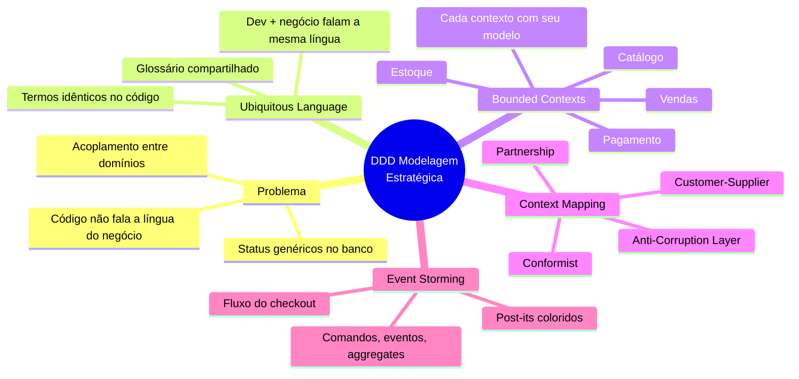
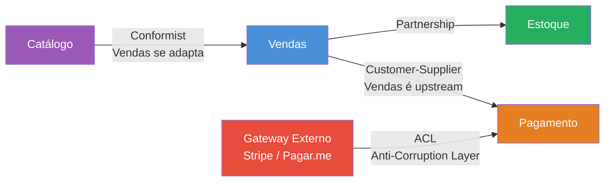
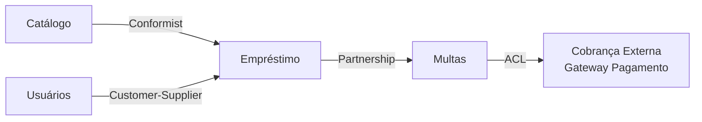
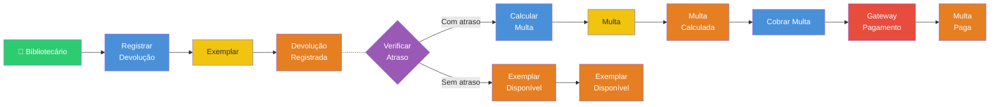

# Engenharia de Software — Aula 10

## DDD — Modelagem Estratégica

**Duração estimada:** 100 minutos (55 de leitura + 45 de prática)
**Nível:** Intermediário-Avançado
**Pré-requisitos:** Introdução (Aula 01), Clean Code (Aula 02), Refactoring (Aula 03), SOLID (Aulas 04-05), Design Patterns Criacionais (Aula 06), Estruturais (Aula 07), Comportamentais (Aula 08), Module Pattern & Patterns Web (Aula 09)

---

## Objetivos de Aprendizagem

Ao concluir esta aula, você será capaz de:

- [ ] **Identificar** o problema de modelos de dados que não refletem a linguagem do negócio e o custo do desalinhamento entre devs e especialistas de domínio
- [ ] **Definir** o conceito de Ubiquitous Language e construir um glossário compartilhado entre desenvolvedores e negócio
- [ ] **Distinguir** Bounded Contexts como fronteiras explícitas de modelos e justificar sua separação em domínios complexos
- [ ] **Identificar** os 4 Bounded Contexts do e-commerce (Vendas, Estoque, Pagamento, Catálogo) e suas responsabilidades
- [ ] **Explicar** cada padrão de Context Mapping (Partnership, Customer-Supplier, Conformist, Anti-Corruption Layer)
- [ ] **Aplicar** Context Mapping para modelar as relações entre os contexts do e-commerce
- [ ] **Descrever** o processo de Event Storming como workshop colaborativo de modelagem estratégica
- [ ] **Executar** um Event Storming completo para o fluxo de checkout, identificando comandos, eventos, aggregates e políticas
- [ ] **Reconhecer** a diferença entre modelagem estratégica (bounded contexts, context mapping) e modelagem tática (entities, value objects, aggregates)
- [ ] **Analisar** um cenário de integração e decidir qual padrão de context mapping aplicar

---

## Como Usar Esta Aula

Esta aula está organizada em duas partes. A **primeira parte** constrói os fundamentos da modelagem estratégica de domínios — Ubiquitous Language, Bounded Contexts e Context Mapping — conceitos universais que valem para qualquer domínio de software, independentemente de tecnologia ou framework. A **segunda parte** aplica esses conceitos na prática com Event Storming, modelando o fluxo de checkout do e-commerce.

Ao longo do caminho, você encontrará seções **"Mão na Massa"** (para fazer, não só ler) e **"Quick Check"** (para verificar se entendeu antes de avançar). Ao final, o arquivo separado **Questões de Aprendizagem** traz as tarefas de checkpoint — só avance para a próxima aula quando conseguir completá-las por conta própria.

**Tempo estimado:** 55 minutos de leitura + 45 minutos de prática.

---

## Mapa Mental

Este diagrama mostra todos os conceitos que você vai dominar nesta aula:




---

## Recapitulação das Aulas 01-09

Antes de mergulhar na modelagem estratégica, vejamos como as aulas anteriores se conectam com o que vem a seguir.

| Aula | O que aprendemos | Conexão com DDD Estratégico |
|---|---|---|
| **01 — Introdução** | Setup do projeto, ciclo de vida do software, dívida técnica | Dívida técnica começa quando o modelo não reflete o negócio — DDD resolve na raiz |
| **02 — Clean Code** | Nomes significativos, funções pequenas, DRY, KISS, YAGNI | Ubiquitous Language é Clean Code aplicado ao domínio: nomes que revelam intenção do negócio |
| **03 — Refactoring** | Catálogo de refactorings, code smells, ESLint como segurança | Refactoring para Ubiquitous Language: renomear classes e métodos para refletir o domínio |
| **04 — SOLID (SRP, OCP, LSP)** | Responsabilidade única, extensão sem modificação, substituibilidade | SRP aplicado a Bounded Contexts: cada contexto tem um motivo para mudar |
| **05 — SOLID (ISP, DIP) + DI** | Interfaces segregadas, inversão de dependência, contêiner DI | DIP entre contexts: contextos dependem de contratos, não de implementações concretas |
| **06 — Patterns Criacionais** | Factory, Builder, Singleton, Object Literal, Prototype | Fábricas de aggregates e value objects no domínio |
| **07 — Patterns Estruturais** | Adapter, Decorator, Facade, Composite, Proxy, Bridge | Anti-Corruption Layer usa Adapter para isolar modelos externos |
| **08 — Patterns Comportamentais** | Strategy, Observer, Command, State, Chain of Responsibility | Event Storming produz eventos de domínio que o Observer e Command patterns implementam |
| **09 — Module Pattern & Patterns Web** | ES Modules, Composição vs Herança, HOC, Hooks, Compound Components, Context | Organização de código por Bounded Context em vez de camada técnica |

A linha que une as nove aulas: **código limpo → princípios → patterns → domínio**. Modelagem estratégica é o ponto de virada — onde o design do software passa a ser guiado pelo negócio, não pela tecnologia.

---

> **FUNDAMENTOS: A Linguagem do Negócio como Fundação do Software**
>
> Os conceitos desta seção são universais — valem para qualquer domínio de software, independentemente da tecnologia, framework ou linguagem específicos. Na segunda parte, você verá como aplicar cada um deles no e-commerce através do Event Storming.

---

## 1. O Problema: O Modelo de Dados Não Reflete o Negócio

### O Cenário Familiar

Você abre o banco de dados e encontra uma tabela `orders` com uma coluna `status` do tipo `varchar`. Os valores possíveis são `'P'`, `'A'`, `'C'` e `'S'`. Você pergunta para o desenvolvedor ao lado: "o que significa `'P'`?" Ele responde: "acho que é pendente, mas pode ser processando". O Product Owner diz: "pendente para nós é quando o cliente ainda não finalizou o carrinho".

Três pessoas — três interpretações diferentes para o mesmo dado.

Esse é o sintoma clássico de um modelo de dados que **não reflete a linguagem do negócio**. O que deveria ser um conceito rico (`OrderStatus: Pending | Confirmed | Shipped | Delivered | Cancelled`) se reduziu a uma letra genérica num campo de banco.

### O Custo do Desalinhamento

Quando o código e o negócio falam línguas diferentes, o custo aparece em várias frentes:

- **Reuniões intermináveis**: 20 minutos discutindo o que significa "pedido confirmado" porque o sistema chama de `status = 'A'` e o negócio chama de "fechado"
- **Bugs de interpretação**: uma regra implementada com base no significado errado do campo
- **Dificuldade de onboarding**: cada novo desenvolvedor precisa aprender o "dialeto local" — `'P'` é pendente, `'F'` é faturado, `'C'` é cancelado, mas `'C'` também pode ser "concluído" em outra tabela
- **Acoplamento acidental**: lógicas de negócio diferentes (pedido, pagamento, estoque) misturadas no mesmo service porque "é tudo sobre o pedido"

### O Antídoto: Domain-Driven Design

**Domain-Driven Design (DDD)** é uma abordagem de desenvolvimento de software que coloca o **domínio do negócio** no centro do design. Em vez de começar pelas tabelas do banco ou pelas rotas da API, você começa pela **linguagem que o negócio usa** para descrever seus problemas.

O DDD opera em duas camadas:

1. **Modelagem Estratégica** (esta aula): define o território — quais conceitos existem, como se relacionam, onde estão as fronteiras
2. **Padrões Táticos** (próxima aula): implementa os conceitos — entities, value objects, aggregates, domain events

A modelagem estratégica responde: "o que é este sistema?" A modelagem tática responde: "como construímos este sistema?"

### Quick Check

**1. Por que colunas `varchar` com códigos como `'P'`, `'A'`, `'C'` são um problema?**
**Resposta:** Porque elas perdem o significado do negócio. Três pessoas diferentes (dev, PO, suporte) podem interpretar o mesmo código de três maneiras diferentes. O código deveria usar tipos expressivos como `OrderStatus.Pending` — o mesmo nome que o negócio usa.

**2. Qual a diferença entre modelagem estratégica e tática no DDD?**
**Resposta:** A modelagem estratégica define as fronteiras do domínio — bounded contexts, linguagem compartilhada, relações entre contexts. A modelagem tática implementa os conceitos dentro dessas fronteiras — entities, value objects, aggregates, domain events. Estratégia é o "o quê"; tática é o "como".

---

## 2. Ubiquitous Language — A Linguagem Onipresente

### O que é Ubiquitous Language?

**Ubiquitous Language** (Linguagem Onipresente) é um dos pilares fundamentais do DDD. É um **glossário compartilhado** entre desenvolvedores, especialistas de domínio, Product Owners, QAs — todos os envolvidos no projeto.

Cada termo do glossário tem **exatamente um significado** e é usado **com o mesmo nome** no código, nas discussões, na documentação, nos testes e nos quadros de tarefas.

Se o negócio chama de "Pedido", o código tem uma classe `Order`. Se o negócio chama de "Item de Linha", o código tem `LineItem`. Se o negócio diz "o cliente fez um pedido com 3 itens", o código não diz `insert into orders values (...) com 3 rows em order_items` — ele diz `order.addItem(product, 3)`.

### Por que Isso Importa?

Sem Ubiquitous Language, cada conversa exige uma **tradução mental**:

| Pessoa | Diz | Tradução mental |
|---|---|---|
| PO | "O pedido foi fechado" | dev pensa: `status = 'confirmed'`? |
| Suporte | "O cliente quer cancelar a compra" | dev pensa: `DELETE FROM orders WHERE id = X`? Ou `UPDATE status = 'cancelled'`? |
| Dev | "A transação foi commitada" | PO pensa: "que transação? o pagamento?" |

Cada tradução é uma **oportunidade de erro**. Ubiquitous Language elimina a tradução — todos falam a mesma língua.

### Construindo o Glossário: Exemplo do E-commerce

Vamos extrair os termos centrais do domínio de e-commerce. Cada termo tem definição precisa, usada igualmente no código e na conversa:

| Termo | Definição | Aparece como |
|---|---|---|
| **Order** | Pedido realizado por um cliente contendo itens | `class Order {}` |
| **LineItem** | Um item individual dentro do pedido, com produto e quantidade | `class LineItem {}` |
| **Product** | Um item do catálogo que pode ser comprado | `class Product {}` |
| **Money** | Valor monetário com quantidade e moeda, imutável | `class Money { amount: number; currency: string }` |
| **Payment** | Transação financeira para quitar um pedido | `class Payment {}` |
| **ShippingAddress** | Endereço de entrega do pedido | `class ShippingAddress {}` |
| **Stock** | Quantidade disponível de um produto no estoque | `class Stock {}` |
| **Coupon** | Código promocional que altera o valor do pedido | `class Coupon {}` |

Observe que **Money** não é um `number` — é um tipo próprio com `amount` e `currency`. **ShippingAddress** não é uma string — é um objeto com `street`, `city`, `state`, `zip`, `country`. Isso é a **Ubiquitous Language em ação**: o código fala a mesma língua que o negócio.

### Como Construir a Linguagem na Prática

O glossário não nasce pronto. Ele emerge de conversas entre devs e especialistas de domínio:

1. **Escute o especialista**: anote os termos que ele usa naturalmente ("pedido", "item", "estoque", "pagamento")
2. **Pergunte pelos sinônimos**: "cancelado" e "estornado" são a mesma coisa? Se não, são termos diferentes
3. **Desafie ambiguidades**: "cliente" é a pessoa que compra ou a empresa? Se for os dois, talvez sejam dois conceitos separados (`Customer` vs `ClientCompany`)
4. **Registre no código**: assim que um termo se estabilizar, crie a classe ou type no código — mesmo vazia
5. **Refatore quando descobrir**: se o termo mudar de significado, mude o código para refletir — não deixe o código ficar para trás

### Quick Check

**3. O que é Ubiquitous Language e por que ela elimina a necessidade de tradução mental?**
**Resposta:** É um glossário compartilhado entre todos os envolvidos no projeto (devs, PO, QAs, especialistas de domínio). Cada termo tem um significado único e é usado com o mesmo nome no código e nas conversas. Isso elimina a tradução mental porque todos usam as mesmas palavras para os mesmos conceitos.

**4. Por que `Money` deve ser um tipo próprio em vez de um `number`?**
**Resposta:** Porque `number` não carrega contexto — não diz qual é a moeda, não impede somar reais com dólares, não tem operações como `add`, `subtract`, `multiply`. No negócio, "dinheiro" não é um número solto — é um valor com moeda. A classe `Money` expressa exatamente isso, com validações e operações que refletem o comportamento real do dinheiro.

---

## 3. Bounded Contexts — Fronteiras do Domínio

### O Problema que os Bounded Contexts Resolvem

Imagine que você está modelando um e-commerce. O termo **Product** (Produto) aparece em vários lugares:

- No **catálogo**: produto tem nome, descrição, fotos, avaliações, categoria
- Nas **vendas**: produto tem SKU, preço corrente, peso, dimensões
- No **estoque**: produto tem quantidade disponível, localização no depósito, lote

É o mesmo "Product"? Se você usar a mesma classe `Product` para os três contextos, vai acabar com um modelo genérico que serve para tudo mas não serve bem para nada. O `Product` do catálogo carrega foto e descrição que o estoque não precisa. O `Product` do estoque tem lote e localização que o catálogo desconhece.

**Bounded Context** é a solução: uma **fronteira explícita** dentro da qual um modelo de domínio é definido e consistente. Cada contexto tem seu próprio modelo, sua própria linguagem e suas próprias regras. Dentro do contexto, tudo é consistente. Fora dele, outros contextos podem ter modelos diferentes — e está tudo bem.

### Os 4 Bounded Contexts do E-commerce

No nosso e-commerce, identificamos quatro Bounded Contexts:

```mermaid
flowchart TB
    subgraph Vendas[Vendas / Sales]
        direction TB
        V1[Criar Pedido]
        V2[Gerenciar Checkout]
        V3[Aplicar Cupom]
        V4[Calcular Frete]
    end

    subgraph Estoque[Estoque / Inventory]
        direction TB
        E1[Reservar Itens]
        E2[Repor Estoque]
        E3[Consultar Disponibilidade]
    end

    subgraph Pagamento[Pagamento / Payment]
        direction TB
        P1[Processar Transação]
        P2[Conciliar Pagamentos]
        P3[Realizar Reembolso]
    end

    subgraph Catalogo[Catálogo / Catalog]
        direction TB
        C1[Gerenciar Produtos]
        C2[Definir Preços]
        C3[Organizar Categorias]
    end
```




Cada contexto tem **responsabilidades distintas** e **seu próprio modelo**:

| Contexto | Responsabilidade | Modelo próprio |
|---|---|---|
| **Vendas** | Gerenciar pedidos, checkout, carrinho, cupons | `Order`, `LineItem`, `Coupon`, `ShoppingCart` |
| **Estoque** | Controlar disponibilidade, reservas, reposição | `StockItem`, `WarehouseLocation`, `Reservation` |
| **Pagamento** | Processar, conciliar e reembolsar transações | `PaymentTransaction`, `Invoice`, `Refund` |
| **Catálogo** | Gerenciar produtos, preços, categorias, fotos | `Product` (com descrição, fotos, specs), `Category`, `Price` |

### O Mesmo Conceito em Contextos Diferentes

O exemplo mais claro é **Product**:

**Product no Catálogo:**
```typescript
class Product {
  constructor(
    readonly productId: ProductId,
    readonly name: string,
    readonly description: string,
    readonly photos: Photo[],
    readonly category: Category,
    readonly specifications: Specification[],
    readonly price: Money,
    readonly createdAt: Date
  ) {}
}
```

**Product em Vendas (onde é chamado de `OrderItem` ou referenciado por SKU):**
```typescript
class ProductReference {
  constructor(
    readonly sku: Sku,
    readonly name: string,
    readonly currentPrice: Money,
    readonly weight: Weight,
    readonly dimensions: Dimensions
  ) {}
}
```

Percebe a diferença? O `Product` do catálogo tem fotos, descrição longa, categorias. O `Product` das vendas tem SKU, peso e dimensões (para cálculo de frete). São dois modelos diferentes para o mesmo conceito real — cada um serve ao seu contexto.

### Como Identificar Bounded Contexts

Não existe fórmula mágica, mas alguns sinais ajudam:

- **Linguagem diferente**: o mesmo termo tem significados diferentes em partes do sistema
- **Time diferente**: times diferentes cuidam de partes diferentes — cada time tende a desenvolver sua própria linguagem
- **Frequência de mudança diferente**: o catálogo muda quando o marketing decide; o pagamento muda quando o compliance exige. Ritmos diferentes sugerem contexts diferentes
- **Domínio subjetivo**: se pergunte "esta regra de negócio mudaria se mudássemos de segmento?" — sim? É outro contexto

### Quick Check

**5. O que é um Bounded Context e por que Product no Catálogo é diferente de Product em Vendas?**
**Resposta:** Bounded Context é uma fronteira explícita dentro da qual um modelo de domínio é consistente. Product no Catálogo tem fotos, descrição, especificações (para exibição). Product em Vendas tem SKU, peso, preço corrente (para venda). São modelos diferentes porque servem a propósitos diferentes — forçá-los na mesma classe criaria um modelo genérico que não serve bem a nenhum dos dois.

**6. Quantos Bounded Contexts identificamos no e-commerce e quais são?**
**Resposta:** Quatro: Vendas (pedidos, checkout, cupons), Estoque (reservas, disponibilidade), Pagamento (transações, conciliação) e Catálogo (produtos, preços, categorias).

---

## 4. Context Mapping — Relações entre Contextos

### O Problema que o Context Mapping Resolve

Bounded Contexts não vivem isolados — eles precisam se comunicar. O checkout (Vendas) precisa saber se o produto tem estoque (Estoque). O pagamento (Pagamento) precisa saber quanto o pedido totalizou (Vendas).

**Context Mapping** é a prática de definir **como** esses contexts se relacionam. Cada tipo de relação resolve um tipo diferente de necessidade de integração.

### Os Quatro Padrões de Context Mapping




#### 1. Partnership — Parceria (Vendas ↔ Estoque)

**Relação**: dois contexts colaboram para entregar um fluxo. Se um falha, o outro se adapta. Ambos evoluem juntos.

**No e-commerce**: Vendas e Estoque trabalham juntos no checkout. Quando um pedido é criado, o estoque é reservado. Se o estoque não tem disponibilidade, o pedido não avança — os dois contexts precisam estar alinhados.

**Quando usar**: quando dois contexts evoluem em conjunto, com mudanças coordenadas. O sucesso de um depende do sucesso do outro.

#### 2. Customer-Supplier — Cliente-Fornecedor (Vendas → Pagamento)

**Relação**: um contexto (supplier/upstream) provê dados ou serviços para outro (customer/downstream). O upstream pode ditar o contrato; o downstream se adapta.

**No e-commerce**: Vendas envia dados de pedido para Pagamento processar a transação. O Pagamento define qual formato de dados aceita — Vendas se adapta a esse formato. Vendas é o upstream (fornece os dados), Pagamento é o downstream (consome).

**Quando usar**: quando um contexto claramente serve ao outro, e o contrato é definido pelo fornecedor.

#### 3. Conformist — Conformista (Catálogo → Vendas)

**Relação**: um contexto adota o modelo de outro sem resistência, porque o custo de traduzir é maior que o benefício.

**No e-commerce**: Vendas usa o modelo de Product que o Catálogo define. Em vez de criar sua própria tradução, Vendas simplesmente usa o `Product` do Catálogo como ele é, adicionando apenas os campos que precisa (preço corrente, SKU). Não há camada de tradução — Vendas se conforma ao modelo do Catálogo.

**Quando usar**: quando o upstream tem um modelo maduro e estável, e o downstream não precisa de adaptação significativa.

#### 4. Anti-Corruption Layer — Camada Anticorrupção (Gateway Externo → Pagamento)

**Relação**: uma camada de tradução isola o modelo do domínio do modelo externo, impedindo que conceitos externos contaminem o domínio.

**No e-commerce**: o gateway de pagamento (Stripe, Pagar.me) tem seu próprio modelo — transações com `charge_id`, `status` como `succeeded`/`failed`, webhooks com formato específico. Sem a ACL, esses termos vazariam para o domínio: `Pagamento` teria campos como `stripeChargeId`, `pagarmeTransactionId`. Com a ACL, uma camada de adaptação traduz o modelo externo para o modelo do domínio.

```typescript
// ACL — Anti-Corruption Layer
class StripePaymentAdapter implements PaymentGateway {
  async process(payment: Payment): Promise<PaymentResult> {
    const stripeCharge = await this.stripeClient.charges.create({
      amount: payment.total.amountInCents(),
      currency: payment.total.currency.toLowerCase(),
      source: payment.token,
    });

    // Traduz o modelo do Stripe para o modelo do domínio
    return new PaymentResult(
      PaymentStatus.fromStripeStatus(stripeCharge.status),
      new TransactionId(stripeCharge.id),
      payment.total
    );
  }
}
```

**Quando usar**: sempre que um contexto externo (biblioteca, API, sistema legado) tem um modelo diferente do seu domínio. A ACL é o Adapter pattern aplicado ao nível de Bounded Contexts.

### Como Escolher o Padrão

| Situação | Padrão |
|---|---|
| Dois contexts evoluem juntos, mudanças coordenadas | **Partnership** |
| Um contexto fornece dados para outro, contrato definido pelo fornecedor | **Customer-Supplier** |
| Um contexto usa o modelo de outro sem adaptação | **Conformist** |
| Precisa isolar o domínio de um modelo externo | **Anti-Corruption Layer** |
| Contextos não têm relação direta, evoluem independentemente | **Shared Kernel** (pouco usado) ou **Separate Ways** |

### Quick Check

**7. Qual a diferença entre Partnership e Customer-Supplier no Context Mapping?**
**Resposta:** Partnership é uma relação simétrica — dois contexts colaboram e evoluem juntos, com mudanças coordenadas. Customer-Supplier é assimétrica — um contexto (upstream/supplier) provê dados e o outro (downstream/customer) consome, se adaptando ao contrato do fornecedor.

**8. Quando usar uma Anti-Corruption Layer (ACL)?**
**Resposta:** Sempre que um sistema externo (API de terceiros, biblioteca, sistema legado) tem um modelo de domínio diferente do seu. A ACL traduz o modelo externo para o seu modelo de domínio, impedindo que conceitos externos (como `stripeChargeId` ou `pagarmeTransactionId`) contaminem o seu Bounded Context.

---

> **APLICAÇÃO: Event Storming e Bounded Contexts no E-commerce**
>
> Agora que você entende os fundamentos da modelagem estratégica — Ubiquitous Language, Bounded Contexts e Context Mapping — vamos aplicá-los na prática com Event Storming para modelar o fluxo de checkout do e-commerce.

---

## 5. Event Storming — Workshop Visual de Modelagem

### O que é Event Storming?

**Event Storming** é uma técnica de workshop colaborativo inventada por Alberto Brandolini para modelar domínios complexos de forma rápida e visual. Em vez de diagramas UML ou documentos de especificação, o Event Storming usa **post-its coloridos** em uma parede (física ou virtual), onde cada cor representa um tipo de elemento do domínio.

A beleza do Event Storming está na sua **acessibilidade**: especialistas de negócio, devs, QAs e designers participam juntos, usando a mesma ferramenta (post-its) e a mesma linguagem (Ubiquitous Language). Não é necessário saber programar para participar — você só precisa entender o negócio.

### Os Elementos do Event Storming

| Cor | Elemento | O que representa | Exemplo |
|---|---|---|---|
| 🟦 **Azul** | **Comando** | Ação que alguém (ator) executa | "Cliente faz pedido" |
| 🟧 **Laranja** | **Evento** | Algo que aconteceu no passado | "Pedido Realizado" |
| 🟨 **Amarelo** | **Aggregate** | Entidade que recebe comandos e produz eventos | "Order" |
| 🟪 **Roxo** | **Política** | Regra automática: "Quando X acontecer, faça Y" | "Quando Pedido Realizado, Reservar Estoque" |
| 🩷 **Rosa** | **Sistema Externo** | Sistema fora do nosso controle | "Gateway de Pagamento" |
| 🟩 **Verde** | **Ator** | Pessoa ou papel que executa comandos | "Cliente", "Admin" |

### O Fluxo do Checkout — Event Storming na Prática

Vamos modelar o fluxo de checkout do e-commerce usando Event Storming. A sequência abaixo mostra os post-its organizados em ordem cronológica:


### O Fluxo Explicado Passo a Passo

**1. Comando — "Fazer Pedido" (Azul)**
O ator (Cliente) executa o comando "Fazer Pedido". Este comando é uma intenção — algo que alguém quer que aconteça.

**2. Evento — "Pedido Realizado" (Laranja)**
O comando, quando executado com sucesso, produz um evento: "Pedido Realizado". O evento está no passado — aconteceu, não pode ser desfeito, apenas compensado.

**3. Aggregate — "Order" (Amarelo)**
O aggregate **Order** recebe o comando, valida as regras (itens existem? cupom válido?) e produz o evento. O aggregate é a guardiã da consistência — ela garante que as regras de negócio sejam respeitadas.

**4. Política — "Reservar Estoque" (Roxo)**
Uma política é uma regra automática: "Quando **Pedido Realizado**, então **Reservar Estoque**". A política reage ao evento e dispara um novo comando.

**5. Evento — "Estoque Reservado" (Laranja)**
O estoque confirma a reserva. Se não houver estoque, um evento diferente seria produzido ("Estoque Insuficiente").

**6. Comando — "Processar Pagamento" (Azul)**
Com o estoque reservado, o próximo passo é processar o pagamento.

**7. Sistema Externo — "Gateway de Pagamento" (Rosa)**
O pagamento é processado por um sistema externo (Stripe, Pagar.me, etc.). Este sistema está fora do nosso controle — só podemos enviar dados e aguardar a resposta.

**8. Evento — "Pagamento Confirmado" (Laranja)**
O gateway responde com sucesso. O pagamento foi confirmado.

**9. Política — "Enviar Pedido" (Roxo)**
Com pagamento confirmado, a política dispara o envio do pedido.

**10. Evento — "Pedido Enviado" (Laranja)**
O fluxo se completa com o pedido enviado ao cliente.

### O Que o Event Storming nos Dá?

Ao final do workshop, você tem:

1. **Visão do big picture**: o fluxo completo do checkout, visível em uma parede
2. **Eventos de domínio**: a base para implementar Domain Events (padrão tático da Aula 11)
3. **Políticas explícitas**: regras de negócio que antes estavam implícitas no código
4. **Fronteiras de Bounded Contexts**: claro onde termina a responsabilidade de Vendas e começa a de Pagamento
5. **Linguagem compartilhada**: todos usaram os mesmos termos durante o workshop

### Mão na Massa — Execute seu Próprio Event Storming

**Dificuldade: Médio | Duração: 20 minutos**

Você vai simular um Event Storming para o fluxo de **cancelamento de pedido**. Siga os passos:

- [ ] **Passo 1**: Liste os eventos (laranja) que acontecem quando um cliente cancela um pedido. Exemplo: "Cancelamento Solicitado"
- [ ] **Passo 2**: Identifique os comandos (azul) que geram esses eventos. Quem executa? O cliente? O sistema?
- [ ] **Passo 3**: Adicione os aggregates (amarelo) que recebem os comandos e produzem os eventos
- [ ] **Passo 4**: Identifique as políticas (roxo): "Quando evento X acontecer, então disparar comando Y"
- [ ] **Passo 5**: Adicione sistemas externos (rosa) envolvidos (ex: gateway de pagamento para estorno)
- [ ] **Passo 6**: Organize tudo em ordem cronológica em um fluxo sequencial

**Verificação:** Ao final, você deve ter um fluxo que cobre: solicitação de cancelamento → verificação de elegibilidade → estorno de pagamento → liberação de estoque → confirmação de cancelamento. Se algum passo parece faltando (ex: "o que acontece se o pedido já foi enviado?"), você identificou uma policy que precisa de tratamento especial.

### Quick Check

**9. Qual a diferença entre um Comando e um Evento no Event Storming?**
**Resposta:** Um comando (azul) é uma intenção — algo que alguém quer que aconteça ("Fazer Pedido", "Processar Pagamento"). Um evento (laranja) é um fato consumado — algo que já aconteceu no passado ("Pedido Realizado", "Pagamento Confirmado"). Comandos podem falhar; eventos são registros imutáveis do que ocorreu.

**10. O que é uma Política no Event Storming e como ela conecta eventos a comandos?**
**Resposta:** Uma política (roxo) é uma regra automática do tipo "Quando X acontecer, faça Y". Ela conecta um evento a um novo comando — por exemplo, "Quando Pedido Realizado, então Reservar Estoque". Políticas revelam regras de negócio que muitas vezes estão implícitas no código.

---

## Autoavaliação: Quiz Rápido

**1. Qual o principal sintoma de que o modelo de dados não reflete a linguagem do negócio?**
**Resposta:**

Colunas genéricas como `status varchar` com códigos arbitrários (`'P'`, `'A'`, `'C'`) que diferentes pessoas interpretam de formas diferentes. O código usa uma linguagem técnica, não a linguagem que o negócio usa para descrever seus conceitos.

**2. O que é Ubiquitous Language e qual seu benefício principal?**
**Resposta:**

É um glossário compartilhado entre todos os envolvidos no projeto, onde cada termo tem um significado único e aparece com o mesmo nome no código, nas conversas e na documentação. O benefício principal é eliminar a tradução mental entre o que o negócio diz e o que o código faz.

**3. Por que Product no Catálogo e Product em Vendas são modelos diferentes?**
**Resposta:**

Porque servem a propósitos diferentes. Product no Catálogo precisa de fotos, descrição longa, especificações e categorias (para exibição e busca). Product em Vendas precisa de SKU, preço corrente, peso e dimensões (para venda e cálculo de frete). Forçá-los na mesma classe criaria um modelo genérico que não serve bem a nenhum contexto.

**4. Qual a diferença entre Partnership e Customer-Supplier?**
**Resposta:**

Partnership é colaboração simétrica — dois contexts evoluem juntos com mudanças coordenadas. Customer-Supplier é relação assimétrica — um contexto (upstream) fornece dados e define o contrato; o outro (downstream) se adapta a esse contrato.

**5. Quando usar Anti-Corruption Layer?**
**Resposta:**

Sempre que um sistema externo (API de terceiros, biblioteca, sistema legado) tem um modelo de domínio diferente do seu. A ACL traduz o modelo externo para o seu modelo, impedindo que conceitos como `stripeChargeId` ou `pagarme_status` contaminem o seu Bounded Context.

**6. Qual a diferença entre um Comando e um Evento no Event Storming?**
**Resposta:**

Comando (azul) é intenção — "quero que algo aconteça". Evento (laranja) é fato — "algo aconteceu". Comandos podem ser rejeitados (validação falhou); eventos são registros imutáveis do passado.

**7. O que o Event Storming produz que alimenta diretamente a modelagem tática (Aula 11)?**
**Resposta:**

Os eventos de domínio (laranja) viram Domain Events. Os aggregates (amarelo) viram Aggregates no padrão tático. As políticas (roxo) viram regras em Domain Services ou Sagas. O Event Storming é o blueprint para a implementação tática.

---

## Mão na Massa: Exercícios Graduados

**Exercício 1 (Fácil) — Construir o Glossário Ubiquitous Language**

O trecho de código abaixo viola a Ubiquitous Language em vários pontos. Identifique pelo menos 3 violações e proponha as correções:

```typescript
// Código atual
function saveOrder(data: any) {
  const st = data.st === 1 ? "A" : "P";
  const total = data.items.reduce((acc: number, it: any) => acc + it.pr * it.qt, 0);
  db.run("INSERT INTO orders (status, total, cust_id) VALUES (?, ?, ?)", [st, total, data.cid]);
}
```

**Gabarito:**

Violações identificadas:
1. `status` como `"A"` / `"P"` em vez de `OrderStatus.Confirmed` / `OrderStatus.Pending` — nomes opacos
2. `data` e `it` como parâmetros genéricos — deveriam ser `orderData` e `item`
3. `st`, `pr`, `qt`, `cid` como abreviações — deveriam ser `status`, `price`, `quantity`, `customerId`
4. `total` como `number` em vez de `Money` — perde a moeda e operações de valor

Código corrigido seguindo Ubiquitous Language:

```typescript
function createOrder(orderData: OrderData): Order {
  const status = OrderStatus.Pending;
  const total = orderData.items.reduce(
    (acc: Money, item: LineItemData) => acc.add(item.price.multiply(item.quantity)),
    Money.zero("BRL")
  );
  return new Order(status, total, new CustomerId(orderData.customerId));
}
```

**Exercício 2 (Médio) — Mapear Contextos e Relações**

Você está modelando um sistema de **biblioteca**. Identifique os Bounded Contexts candidatos e proponha o Context Mapping entre eles. Considere: empréstimo de livros, catálogo de obras, multas por atraso, cadastro de usuários, e integração com um sistema externo de cobrança (gateway de pagamento para multas).

**Gabarito:**

Bounded Contexts candidatos:

| Contexto | Responsabilidade |
|---|---|
| **Empréstimo** | Gerenciar retirada e devolução de livros |
| **Catálogo** | Gerenciar acervo, obras, exemplares |
| **Usuários** | Cadastro de membros, histórico |
| **Multas** | Cálculo e cobrança de multas por atraso |
| **Cobrança Externa** | Gateway de pagamento (fora do nosso domínio) |

Context Mapping:



Justificativa:
- **Catálogo → Empréstimo (Conformist)**: Empréstimo usa o modelo de obra do Catálogo como ele é
- **Usuários → Empréstimo (Customer-Supplier)**: Usuários fornece dados de membro; Empréstimo se adapta
- **Empréstimo ↔ Multas (Partnership)**: evolução coordenada — quando um livro é devolvido com atraso, a multa é calculada e vice-versa
- **Multas → Cobrança Externa (ACL)**: isola o modelo do gateway de pagamento

**Desafio (Difícil) — Modelar o Fluxo de Devolução com Event Storming**

Modele o fluxo de **devolução de livro na biblioteca** usando Event Storming. Considere:

- O usuário devolve o livro no balcão
- O sistema verifica se há atraso
- Se houver atraso, calcula multa e dispara cobrança
- O sistema atualiza o acervo (exemplar disponível novamente)
- Se o usuário tem multas pendentes, não pode pegar novos livros emprestados

Produza o fluxo completo com: atores, comandos, eventos, aggregates, políticas e sistemas externos. Organize em ordem cronológica.

**Gabarito:**

Fluxo de Event Storming para Devolução de Livro:



Políticas adicionais:
- **"Quando Multa Calculada e não paga em 30 dias → Bloquear Usuário"**
- **"Quando Devolução Registrada → Atualizar Disponibilidade no Catálogo"**
- **"Quando Usuário Bloqueado → Rejeitar novo empréstimo"**

Estas políticas revelam regras de negócio que podem não estar explícitas no código atual — o Event Storming as traz à superfície.

---

## Resumo da Aula

### Os 10 Conceitos Fundamentais

1. **Domain-Driven Design**: abordagem que coloca o domínio do negócio no centro do design do software
2. **Modelagem Estratégica**: define o território — bounded contexts, linguagem compartilhada, relações entre contexts
3. **Modelagem Tática**: implementa os conceitos — entities, value objects, aggregates, domain events
4. **Ubiquitous Language**: glossário compartilhado entre devs e negócio, com termos idênticos no código e na conversa
5. **Bounded Context**: fronteira explícita onde um modelo de domínio é consistente e autônomo
6. **Context Mapping**: definição das relações entre bounded contexts
7. **Partnership**: colaboração simétrica entre contexts que evoluem juntos
8. **Customer-Supplier**: relação assimétrica onde um contexto fornece dados e o outro se adapta
9. **Conformist**: um contexto adota o modelo de outro sem tradução
10. **Anti-Corruption Layer**: camada de tradução que isola o domínio de modelos externos

### O Que Você Construiu Hoje

- [x] Glossário Ubiquitous Language com 8 termos do e-commerce (Order, LineItem, Product, Money, Payment, ShippingAddress, Stock, Coupon)
- [x] Identificação dos 4 Bounded Contexts do e-commerce (Vendas, Estoque, Pagamento, Catálogo)
- [x] Mapeamento das relações entre contexts (Partnership, Customer-Supplier, Conformist, ACL)
- [x] Fluxo de Event Storming completo para o checkout
- [x] Exercício prático de Event Storming para cancelamento de pedido
- [x] Modelagem de cenário completo de biblioteca com contexts e relations

---

## Próxima Aula

**Aula 11: DDD — Padrões Táticos**

Na próxima aula, você vai implementar os conceitos que modelou aqui. Cada Bounded Context ganhará Entities, Value Objects, Aggregates com invariantes, Domain Events e Repositories. A Ubiquitous Language vai se materializar em classes TypeScript, e o Event Storming vai virar código — começando pelos eventos de domínio e aggregates que identificamos hoje.

---

## Referências

### Livros

- EVANS, Eric. **Domain-Driven Design: Tackling Complexity in the Heart of Software**. Addison-Wesley, 2003.
- VERNON, Vaughn. **Implementing Domain-Driven Design**. Addison-Wesley, 2013.
- BRANDOLINI, Alberto. **Introducing EventStorming**. Leanpub, 2019.
- FOWLER, Martin. **Patterns of Enterprise Application Architecture**. Addison-Wesley, 2002.

### Artigos Online

- [Domain-Driven Design — Martin Fowler](https://martinfowler.com/tags/domain%20driven%20design.html)
- [Bounded Context — Martin Fowler](https://martinfowler.com/bliki/BoundedContext.html)
- [Event Storming — Alberto Brandolini](https://eventstorming.com/)
- [Context Mapping — DDD Community](https://www.dddcommunity.org/learning-ddd/what_is_ddd/)

### Vídeos Recomendados

- [DDD Strategic Design — Eric Evans (DCI Course)](https://www.youtube.com/) — Eric Evans explica os fundamentos do DDD estratégico (~45 min)
- [Event Storming Quick Start — Alberto Brandolini](https://www.youtube.com/) — O criador do Event Storming demonstra a técnica (~30 min)

### Ferramentas

- [Miro](https://miro.com/) — Quadro colaborativo para Event Storming remoto (post-its digitais)
- [Lucidchart](https://www.lucidchart.com/) — Diagramas de Context Mapping e Bounded Contexts

---

## FAQ

**P: DDD é só para microsserviços?**
R: Não. DDD é sobre modelagem de domínio, independente da arquitetura. Bounded Contexts podem ser implementados como microsserviços, mas também como módulos dentro de um monolito bem estruturado. A modelagem estratégica funciona em qualquer escala.

**P: Ubiquitous Language precisa ser documentada em um glossário formal?**
R: O glossário deve existir, mas não precisa ser um documento formal que ninguém lê. O melhor lugar para a Ubiquitous Language é o código — classes, métodos e variáveis com os nomes do negócio. Um README ou `GLOSSARY.md` no repositório ajuda no onboarding de novos devs.

**P: Quantos Bounded Contexts devo ter?**
R: Não existe número mágico. Um erro comum é criar contexts demais (cada entidade vira um contexto) ou de menos (tudo em um contexto só). Um bom ponto de partida: se duas partes do sistema têm linguagens diferentes, times diferentes ou frequências de mudança diferentes, provavelmente são contexts diferentes.

**P: Meu time é pequeno — DDD ainda vale a pena?**
R: Sim. DDD não é sobre tamanho de time — é sobre clareza de modelo. Um time pequeno se beneficia ainda mais de Ubiquitous Language porque reduz retrabalho causado por mal-entendidos. Bounded Contexts evitam que uma mudança no pagamento quebre o catálogo, mesmo que o mesmo dev cuide dos dois.

**P: O que acontece se dois contexts usam a mesma entidade com nomes diferentes?**
R: Isso é esperado e aceitável. O `Product` do Catálogo e o `ProductReference` (ou `Sku`) de Vendas representam o mesmo conceito real em contexts diferentes. O importante é que dentro de cada contexto o nome seja consistente. A tradução entre contexts é responsabilidade do Context Mapping.

**P: Event Storming funciona para times remotos?**
R: Sim. Ferramentas como Miro, MURAL e Lucidchart têm post-its digitais coloridos que substituem a parede física. O importante é manter a dinâmica colaborativa — todos participando ao mesmo tempo, com um facilitador guiando o fluxo.

**P: Como identificar os Bounded Contexts na prática?**
R: Três técnicas ajudam: (1) ouça a linguagem — when o mesmo termo tem significados diferentes em conversas diferentes, há uma fronteira; (2) veja a frequência de mudança — partes que mudam em ritmos diferentes provavelmente são contexts diferentes; (3) veja o time — cada time tende a desenvolver sua própria linguagem e modelo.

**P: Qual a diferença entre modelagem estratégica e tática?**
R: Estratégica define **o quê** — quais conceitos existem, onde estão as fronteiras, como se relacionam. Tática define **como** — entities, value objects, aggregates, domain events. Você primeiro modela o território (estratégico), depois implementa (tático). A Aula 10 é estratégica; a Aula 11 é tática.

**P: Preciso de ferramentas especiais para Event Storming?**
R: Não. Uma parede, post-its de 5 cores e um facilitador são suficientes. Para times remotos, ferramentas de quadro branco digital (Miro, MURAL) funcionam bem. O mais importante não é a ferramenta — é ter especialistas de negócio e devs na mesma sala (física ou virtual) modelando juntos.

**P: E se um contexto precisar de dados de outro contexto?**
R: Isso é normal e é exatamente o que o Context Mapping resolve. A comunicação pode ser síncrona (API call) ou assíncrona (eventos). A regra de ouro: um contexto nunca acessa diretamente o banco de dados de outro contexto. Toda comunicação passa por uma interface explícita — seja API, mensageria ou ACL.

---

## Glossário

| Termo | Definição |
|---|---|
| **Aggregate** | Cluster de entidades e value objects tratados como unidade de consistência, com uma raiz que controla acesso |
| **Anti-Corruption Layer (ACL)** | Camada de tradução que isola o modelo do domínio do modelo de sistemas externos |
| **Bounded Context** | Fronteira explícita dentro da qual um modelo de domínio é consistente e autônomo |
| **Comando (Event Storming)** | Ação que um ator executa para produzir uma mudança no sistema (post-it azul) |
| **Conformist** | Padrão de Context Mapping onde um contexto adota o modelo de outro sem adaptação |
| **Context Mapping** | Prática de definir as relações entre Bounded Contexts |
| **Customer-Supplier** | Padrão onde um contexto (supplier) fornece dados e o outro (customer) se adapta |
| **Domain-Driven Design** | Abordagem de desenvolvimento que coloca o domínio do negócio no centro do design |
| **Event Storming** | Workshop colaborativo que usa post-its coloridos para modelar fluxos de domínio |
| **Evento (Event Storming)** | Algo que aconteceu no passado, registrado como fato imutável (post-it laranja) |
| **Modelagem Estratégica** | Camada do DDD que define bounded contexts, linguagem compartilhada e relações entre contexts |
| **Modelagem Tática** | Camada do DDD que implementa entities, value objects, aggregates e domain events |
| **Partnership** | Padrão de Context Mapping onde dois contexts evoluem juntos com mudanças coordenadas |
| **Política (Event Storming)** | Regra automática do tipo "Quando X acontecer, faça Y" (post-it roxo) |
| **Ubiquitous Language** | Glossário compartilhado entre todos os envolvidos, com termos idênticos no código e na conversa |
