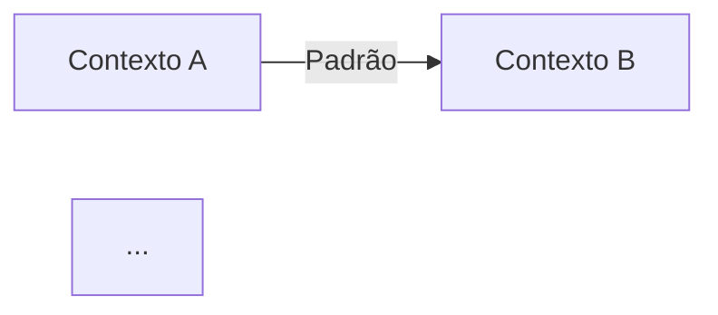
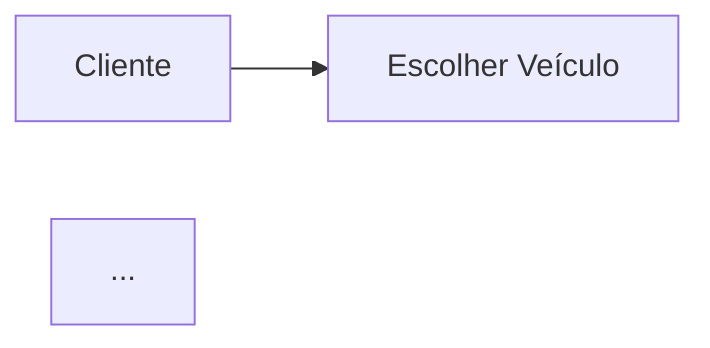

# Aula 10 — Questões de Aprendizagem

## Como Usar Este Arquivo

Este arquivo é o **checkpoint de aprendizagem** da Aula 10. A pergunta central é: *"eu realmente entendi modelagem estratégica com DDD?"*

Cada questão abaixo verifica um conceito-chave da aula. Você deve conseguir completar **todas as questões por conta própria**, sem reler a aula principal. Se travar em alguma, a seção de referência está indicada no campo **Conceito-chave** — releia aquela seção específica antes de tentar novamente.

**Instruções:**

1. Crie uma pasta `entregas-aula-10/` no seu repositório do curso
2. Para cada questão, crie um arquivo `10-01-nome-do-arquivo.md`, `10-02-nome-do-arquivo.md`, etc.
3. Preencha o template de cada questão com suas respostas
4. Ao final, revise o **Checklist Final** para confirmar se está pronto para a Aula 11

---

## Questão 1: Identificando o Problema do Desalinhamento

**Conceito-chave:** Problema do modelo de dados que não reflete o negócio (Aula 10, Seção 1).

**Objetivo:** Demonstrar que você reconhece os sintomas de um modelo desalinhado com a linguagem do negócio.

**Passos de Execução:**

1. Analise o trecho de código abaixo
2. Identifique pelo menos 4 problemas que indicam desalinhamento entre o código e a linguagem do negócio
3. Proponha uma correção para cada problema

```typescript
// Trecho para análise
function procPed(d: any) {
  const s = d.st;
  const t = d.it.reduce((a: number, i: any) => a + i.v * i.q, 0);
  if (s === 1) {
    db.run("INSERT INTO ped (status, total, cli) VALUES ('P', ?, ?)", [t, d.c]);
  }
}
```

**Entrega:** crie `entregas-aula-10/10-01-desalinhamento.md`:

```markdown
# Questão 1 — Identificando o Problema do Desalinhamento

## Problemas Identificados

| # | Problema | Localização | Correção Proposta |
|---|---|---|---|
| 1 | | | |
| 2 | | | |
| 3 | | | |
| 4 | | | |

## Código Corrigido

```typescript
// Sua versão corrigida aqui

```

## Conclusão

Em 2-3 frases, explique como a correção aproxima o código da linguagem do negócio.
```

---

## Questão 2: Construindo o Glossário Ubiquitous Language

**Conceito-chave:** Ubiquitous Language (Aula 10, Seção 2).

**Objetivo:** Demonstrar que você sabe construir e aplicar um glossário Ubiquitous Language para um domínio.

**Passos de Execução:**

1. Escolha um domínio diferente do e-commerce (ex: clínica médica, locadora de veículos, sistema escolar, delivery de comida)
2. Liste 6-8 termos centrais do domínio com definições precisas
3. Para cada termo, mostre como ele apareceria no código (classe, type, enum, etc.)
4. Identifique um termo que poderia ser ambíguo e explique como resolver a ambiguidade

**Entrega:** crie `entregas-aula-10/10-02-glossario-ubiquitous.md`:

```markdown
# Questão 2 — Glossário Ubiquitous Language

**Domínio escolhido:** [seu domínio]

## Glossário

| Termo | Definição Precisa | Representação no Código |
|---|---|---|
| | | |
| | | |
| | | |
| | | |
| | | |
| | | |

## Termo Ambíguo

**Termo:** [termo que pode ter múltiplos significados]

**Contextos onde aparece:** [ex: no contexto X significa Y, no contexto Z significa W]

**Como resolver a ambiguidade:** [sua abordagem]
```

---

## Questão 3: Identificando Bounded Contexts

**Conceito-chave:** Bounded Contexts (Aula 10, Seção 3).

**Objetivo:** Demonstrar que você sabe identificar Bounded Contexts em um domínio real.

**Passos de Execução:**

1. Leia a descrição do sistema abaixo
2. Identifique pelo menos 3 Bounded Contexts candidatos
3. Para cada contexto, liste suas responsabilidades e um modelo próprio que ele conteria
4. Justifique por que cada contexto merece ser separado

**Cenário — Sistema de Locadora de Veículos:** A locadora aluga carros para clientes. Precisa gerenciar a frota (manutenção, disponibilidade), as reservas (datas, veículo reservado), os contratos de aluguel (retirada, devolução, quilometragem), o cadastro de clientes (habilitação, histórico), o faturamento (diárias, multas, seguros), e a integração com seguradoras externas para apólices temporárias.

**Entrega:** crie `entregas-aula-10/10-03-bounded-contexts.md`:

```markdown
# Questão 3 — Bounded Contexts da Locadora

## Contextos Identificados

### Contexto 1: [nome]
- **Responsabilidades:** ...
- **Modelo próprio:** ...
- **Justificativa para separação:** ...

### Contexto 2: [nome]
- **Responsabilidades:** ...
- **Modelo próprio:** ...
- **Justificativa para separação:** ...

### Contexto 3: [nome]
- **Responsabilidades:** ...
- **Modelo próprio:** ...
- **Justificativa para separação:** ...

### Contexto 4: [nome] (opcional)
- **Responsabilidades:** ...
- **Modelo próprio:** ...
- **Justificativa para separação:** ...

## Tabela Resumo

| Contexto | Responsabilidade Principal | Modelo Chave |
|---|---|---|
| | | |
| | | |
| | | |
```

---

## Questão 4: Modelando Context Mapping

**Conceito-chave:** Context Mapping (Aula 10, Seção 4).

**Objetivo:** Demonstrar que você sabe aplicar os padrões de Context Mapping para modelar relações entre contexts.

**Passos de Execução:**

1. Use os Bounded Contexts que você identificou na Questão 3
2. Para cada par de contexts que se comunicam, identifique o padrão de Context Mapping mais adequado
3. Justifique sua escolha com base nas características do padrão
4. Descreva como a comunicação acontece na prática (API síncrona, eventos, ACL, etc.)

**Entrega:** crie `entregas-aula-10/10-04-context-mapping.md`:

```markdown
# Questão 4 — Context Mapping da Locadora

## Mapa de Relações

### Relação 1: [Contexto A] ↔ [Contexto B]
- **Padrão:** [Partnership / Customer-Supplier / Conformist / ACL]
- **Justificativa:** ...
- **Mecanismo de comunicação:** [API / Eventos / ACL / etc.]

### Relação 2: [Contexto C] → [Contexto D]
- **Padrão:** ...
- **Justificativa:** ...
- **Mecanismo de comunicação:** ...

### Relação 3: [Contexto E] ↔ [Contexto F]
- **Padrão:** ...
- **Justificativa:** ...
- **Mecanismo de comunicação:** ...

## Diagrama Context Mapping

Descreva textualmente ou desenhe em Mermaid (se quiser, inclua o código):



## Análise

Em 3-5 frases, analise se alguma relação poderia ser problemática e como mitigaria.
```

---

## Questão 5: Planejando um Event Storming

**Conceito-chave:** Event Storming (Aula 10, Seção 5).

**Objetivo:** Demonstrar que você sabe planejar e estruturar um workshop de Event Storming.

**Passos de Execução:**

1. Escolha um fluxo dentro do sistema de locadora (ex: "cliente retira veículo" ou "cliente devolve veículo")
2. Liste os participantes ideais para o workshop e seus papéis
3. Identifique os eventos (laranja) que ocorrem no fluxo, em ordem cronológica
4. Identifique os comandos (azul) que geram esses eventos
5. Identifique os aggregates (amarelo) envolvidos
6. Identifique as políticas (roxo) que conectam eventos a novos comandos
7. Identifique sistemas externos (rosa) envolvidos

**Entrega:** crie `entregas-aula-10/10-05-event-storming.md`:

```markdown
# Questão 5 — Planejamento de Event Storming

**Fluxo escolhido:** [descrição]

## Participantes

| Papel | Participante | Por que é essencial |
|---|---|---|
| | | |
| | | |
| | | |

## Fluxo de Event Storming

### Eventos (ordem cronológica)
1. [evento 1]
2. [evento 2]
3. ...

### Comandos (que geram os eventos)
1. [comando 1] → [evento que gera]
2. [comando 2] → [evento que gera]
3. ...

### Aggregates
1. [aggregate 1] — responsável por...
2. [aggregate 2] — responsável por...

### Políticas
1. **Quando** [evento X] **então** [comando Y] — [descrição da regra]
2. **Quando** [evento W] **então** [comando Z] — [descrição da regra]

### Sistemas Externos
1. [sistema] — [papel no fluxo]

## Reflexão

Em 3-5 frases, explique como este Event Storming ajuda a identificar regras de negócio que poderiam estar implícitas ou esquecidas.
```

---

## Questão 6: Anti-Corruption Layer na Prática

**Conceito-chave:** Anti-Corruption Layer (Aula 10, Seção 4).

**Objetivo:** Demonstrar que você sabe projetar uma ACL para isolar o domínio de um modelo externo.

**Passos de Execução:**

1. Considere que a locadora de veículos precisa se integrar ao sistema **DETRAN** para verificar situação da habilitação do cliente
2. O DETRAN retorna dados no formato: `{ "cpf": "123.456.789-00", "status": "regular", "categoria": "B", "pontos": 3, "validade": "2028-05-10" }`
3. Projete uma ACL que traduza esse modelo externo para o modelo do domínio da locadora
4. Mostre: (a) a interface que o domínio espera, (b) o adapter que implementa a ACL, (c) o mapeamento dos campos

**Entrega:** crie `entregas-aula-10/10-06-acl.md`:

```markdown
# Questão 6 — Anti-Corruption Layer para DETRAN

## Interface do Domínio

```typescript
// Interface que o domínio espera
interface HabilitationVerifier {
  check(driverId: DriverId): Promise<HabilitationStatus>;
}

// Value Object do domínio
class HabilitationStatus {
  // ...
}
```

## Adapter / ACL

```typescript
// ACL que traduz o modelo do DETRAN para o domínio
class DetranHabilitationAdapter implements HabilitationVerifier {
  // ...
}
```

## Mapeamento de Campos

| Campo DETRAN | Campo Domínio | Transformação |
|---|---|---|
| | | |
| | | |
| | | |

## Reflexão

Em 2-3 frases, explique que tipo de problema a ACL evita neste cenário.
```

---

## Questão 7: Analisando um Contexto Mal Definido

**Conceito-chave:** Bounded Contexts e Linguagem (Aula 10, Seções 2 e 3).

**Objetivo:** Demonstrar que você sabe diagnosticar quando um Bounded Context está mal definido e propor a correção.

**Passos de Execução:**

1. Analise a descrição abaixo de um sistema de **clínica médica**
2. Identifique por que o contexto único "Paciente" é problemático
3. Proponha a separação em Bounded Contexts adequados
4. Explique como a Ubiquitous Language muda entre os contexts

**Cenário — Clínica Médica (modelo atual):** A clínica tem um "contexto" único chamado Paciente que inclui: dados cadastrais (nome, CPF, plano de saúde), agendamento de consultas, prontuário médico (diagnósticos, receitas, exames), faturamento (valores de consultas, coparticipação), e prescrição de medicamentos. Tudo no mesmo modelo. O termo "Paciente" é usado para tudo — "paciente agendou", "paciente foi diagnosticado", "paciente pagou".

**Entrega:** crie `entregas-aula-10/10-07-contexto-mal-definido.md`:

```markdown
# Questão 7 — Diagnóstico de Contexto Mal Definido

## Problemas Identificados

| Problema | Consequência |
|---|---|
| | |
| | |
| | |

## Proposta de Separação

### Contexto 1: [nome]
- **Conceitos:** ...
- **Termos da Ubiquitous Language:** ...

### Contexto 2: [nome]
- **Conceitos:** ...
- **Termos da Ubiquitous Language:** ...

### Contexto 3: [nome]
- **Conceitos:** ...
- **Termos da Ubiquitous Language:** ...

## Como a Linguagem Muda

**Termo "Paciente" no Contexto [nome]:** [significado]
**Termo "Paciente" no Contexto [nome]:** [significado]

## Conclusão

Em 3-5 frases, explique como a separação melhora a clareza do modelo e reduz o acoplamento.
```

---

## Questão 8: Modelando com Event Storming — Fluxo de Reserva

**Conceito-chave:** Event Storming aplicado (Aula 10, Seção 5).

**Objetivo:** Demonstrar que você sabe executar um Event Storming completo para um fluxo real.

**Passos de Execução:**

1. Modele o fluxo de **reserva de veículo na locadora** usando Event Storming
2. Considere: cliente escolhe veículo, verifica disponibilidade, faz reserva, sistema bloqueia o veículo, envia confirmação
3. Se o veículo não estiver disponível na data, o sistema sugere alternativas
4. Se o cliente não retirar o veículo em até 2 horas após o horário agendado, a reserva é cancelada automaticamente
5. Produza o fluxo completo com todos os elementos do Event Storming

**Entrega:** crie `entregas-aula-10/10-08-event-storming-reserva.md`:

```markdown
# Questão 8 — Event Storming: Fluxo de Reserva

## Fluxo Completo

```
(ordem cronológica, use post-its textuais)

[ATOR] Cliente
[COMANDO] Escolher Veículo
[EVENTO] Veículo Selecionado
[POLÍTICA] Quando Veículo Selecionado → Verificar Disponibilidade
...
```

## Código Mermaid (opcional)



## Políticas Identificadas

| Política | Evento Gatilho | Comando Disparado | Regra de Negócio |
|---|---|---|---|
| | | | |
| | | | |

## Análise de Exceções

**O que acontece se...**

- O veículo escolhido não está disponível na data?
  R: ...
- O cliente não retira o veículo no horário?
  R: ...
- O pagamento da reserva falha?
  R: ...
```

---

## Checklist Final: Pronto para a Aula 11?

Marque cada item só quando conseguir fazê-lo **sem consultar a aula**:

- [ ] **Identificar** os sintomas de um modelo desalinhado com a linguagem do negócio (ex: colunas genéricas, abreviações sem significado)
- [ ] **Definir** o conceito de Ubiquitous Language e dar exemplos de termos de um domínio real
- [ ] **Distinguir** Bounded Contexts e explicar por que o mesmo conceito pode ter modelos diferentes em contexts diferentes
- [ ] **Identificar** os 4 Bounded Contexts do e-commerce (Vendas, Estoque, Pagamento, Catálogo) e os contexts de um domínio novo
- [ ] **Explicar** os 4 padrões de Context Mapping (Partnership, Customer-Supplier, Conformist, ACL) com exemplos
- [ ] **Aplicar** Context Mapping para modelar relações entre contexts de um cenário novo
- [ ] **Descrever** o processo de Event Storming, seus elementos (comandos, eventos, aggregates, políticas) e as cores de cada post-it
- [ ] **Executar** um Event Storming completo para um fluxo de domínio, organizando elementos em ordem cronológica
- [ ] **Projetar** uma Anti-Corruption Layer para isolar o domínio de um sistema externo
- [ ] **Reconhecer** a diferença entre modelagem estratégica e tática, sabendo que a Aula 11 implementa entities, value objects e aggregates

> *Acertou todos? Você está pronto para a Aula 11: DDD — Padrões Táticos, onde cada conceito modelado aqui vai virar código TypeScript concreto. Travou em algum? Releia a seção indicada na questão correspondente antes de avançar.*
