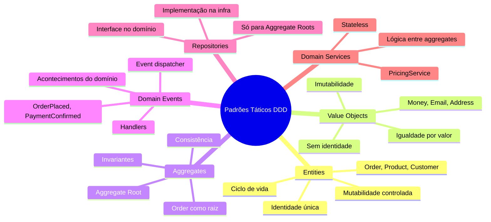
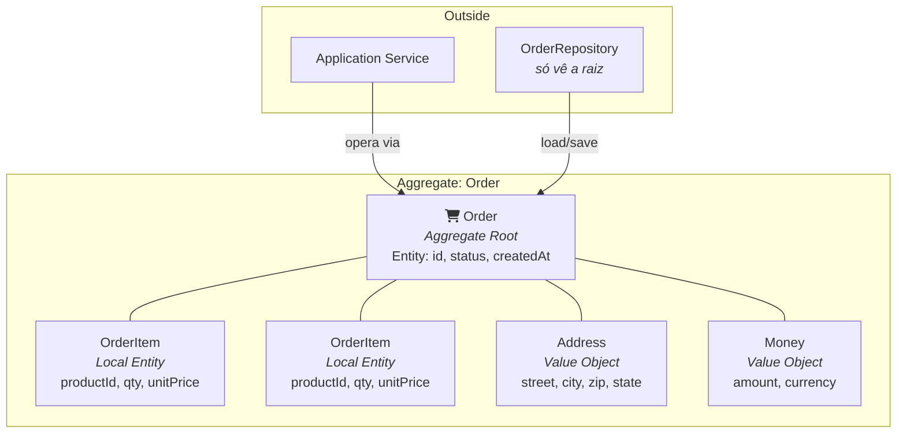
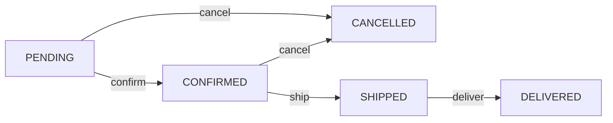

# Engenharia de Software — Aula 11

## Domain-Driven Design — Padrões Táticos

**Duração estimada:** 100 minutos (55 leitura + 45 prática)
**Nível:** Intermediário-Avançado
**Pré-requisitos:** Clean Code (Aula 01), SOLID (Aula 02), Design Patterns (Aula 03), DDD (Aula 04), Clean Architecture (Aula 05), SDD (Aula 06), TDD (Aula 07), CI/CD (Aula 08), Observabilidade (Aula 09), Qualidade e Code Review (Aula 10)

---

## Objetivos de Aprendizagem

Ao concluir esta aula, você será capaz de:

- [ ] **Distinguir** Entity de Value Object pelo critério fundamental de identidade versus valor estrutural
- [ ] **Implementar** Value Objects imutáveis em TypeScript usando constructor privado + factory method
- [ ] **Projetar** Aggregates com raiz, invariantes de negócio e transações consistentes
- [ ] **Modelar** Domain Events com interface genérica e dispatter para comunicação entre contextos
- [ ] **Estruturar** Repositories como interface no domínio e implementação na infraestrutura
- [ ] **Decidir** quando usar Domain Service versus método na Entity com base na responsabilidade
- [ ] **Aplicar** validacão de invariantes no Aggregate Root para proteger regras de negócio
- [ ] **Diferenciar** identidade global (Aggregate Root) de identidade local (entidades internas)
- [ ] **Conectar** os padrões táticos DDD com os princípios de Clean Architecture e SOLID
- [ ] **Refatorar** código baseado em tipos primitivos para modelos ricos com Value Objects

---

## Como Usar Esta Aula

Esta aula está organizada em duas grandes partes. A **primeira parte — FUNDAMENTOS** constrói os modelos mentais dos padrões táticos do DDD sem mencionar linguagens, frameworks ou ferramentas. É pura arquitetura conceitual. A **segunda parte — APLICAÇÃO** implementa cada padrão em TypeScript no contexto do projeto de e-commerce que acompanhamos desde a Aula 01.

Ao longo do caminho, você encontrará **Quick Checks** (para verificar se entendeu antes de avançar) e **Mão na Massa** (para codificar junto). Ao final, o arquivo separado **Questões de Aprendizagem** traz as tarefas de checkpoint — só avance para a Aula 12 quando conseguir completá-las por conta própria.

**Tempo estimado:** 55 minutos de leitura + 45 minutos de prática.

---

## Mapa Mental



---

## Recapitulação das Aulas 01-10

Todas as aulas anteriores convergem para este momento — onde o código não apenas é limpo e bem estruturado, mas **fala a linguagem do negócio** através de padrões táticos.

| Aula | O que aprendemos | Conexão com Padrões Táticos |
|---|---|---|
| **01 — Clean Code** | Nomes significativos, funções pequenas | Ubiquitous Language começa com nomes que revelam intenção |
| **02 — SOLID** | SRP, OCP, DIP, DI | Cada padrão tático respeita SRP; DIP isola o domínio da infra |
| **03 — Design Patterns** | Repository, Factory, Observer | São os mesmos padrões, agora com semântica de domínio |
| **04 — DDD (Strategic)** | Bounded Contexts, Context Mapping, Ubiquitous Language | O "o quê" — estratégia que define os limites onde os padrões táticos operam |
| **05 — Clean Architecture** | 4 camadas, regra da dependência | Padrões táticos vivem na camada de domínio; repositórios são interfaces |
| **06 — SDD + Gherkin** | User stories, Given-When-Then | Cenários descrevem o comportamento esperado das Entities |
| **07 — TDD** | Red-Green-Refactor, pirâmide de testes | Value Objects e Entities são a unidade mais testável do sistema |
| **08 — CI/CD** | Workflows, quality gates, CodeQL | Repositórios concretos são testados em integração contínua |
| **09 — Observabilidade** | Logs, métricas, tracing | Domain Events geram logs estruturados para auditoria |
| **10 — Qualidade** | Métricas, code review, dívida técnica | Tipos primitivos no lugar de VOs são dívida técnica disfarçada |

A Aula 04 introduziu DDD com foco estratégico — Bounded Contexts, Ubiquitous Language, Event Storming. Esta Aula 11 aprofunda o que a Aula 04 apenas começou: a **implementação tática** de cada padrão no código.

---

> **FUNDAMENTOS: Entities, Value Objects e a Lei da Consistência**  
> As próximas três seções são puramente conceituais. Nenhuma menção a linguagens, bibliotecas ou ferramentas — apenas os modelos mentais que fundamentam os padrões táticos do DDD. O objetivo é entender o *que* cada padrão resolve e *por que* ele existe antes de pensar no *como* implementar.

---

## 1. Entities — O Pilar da Identidade

### O Problema da Identidade

Em todo sistema, existem objetos que **persistem no tempo** — eles nascem, mudam de estado e eventualmente deixam de ser relevantes, mas continuam sendo "a mesma coisa" durante todo esse ciclo. Pense em um pedido: quando ele é criado, está pendente. Depois é confirmado, enviado, entregue. Em cada etapa, seus atributos mudam — mas continua sendo **o mesmo pedido**.

O que define essa continuidade? A **identidade**. Um pedido com ID `ORD-123` é o mesmo pedido de ontem, hoje e amanhã, independente de quantas vezes seu status ou endereço de entrega mudem.

### Entity: Definição

Uma **Entity** é um objeto com identidade própria. Dois objetos são a mesma Entity se e somente se compartilham o mesmo identificador — mesmo que todos os seus atributos sejam diferentes.

Imagine dois formulários de pedido em papel. Se ambos tiverem o número `ORD-123` carimbado, eles representam o mesmo pedido, mesmo que um deles tenha sido preenchido com caneta azul e o outro com lápis. O número é a identidade; o resto é estado mutável.

### Características de uma Entity

- **Identificador único**: um ID que nunca muda (UUID, sequencial, chave natural)
- **Mutabilidade controlada**: atributos podem mudar, mas sempre através de métodos que validam regras de negócio
- **Igualdade por identidade**: `entityA === entityB` se `entityA.id === entityB.id`
- **Ciclo de vida**: a Entity é criada, persiste, pode ser alterada e eventualmente removida

### Entity vs Value Object: A Diferença Fundamental

A pergunta decisiva é: *"Se eu trocar este objeto por outro com os mesmos dados, o significado muda?"*

Se a resposta for **sim**, você tem uma Entity. Trocar o pedido `ORD-123` por `ORD-456` muda completamente o significado — são pedidos diferentes de clientes diferentes.

Se a resposta for **não**, você tem um Value Object. Trocar uma nota de R$100 por outra nota de R$100 não muda nada — o valor é o mesmo.

### Quando Criar uma Entity

Crie uma Entity quando o objeto precisar ser **rastreado ao longo do tempo**. Exemplos típicos:

- **Order**: nasce pendente, é confirmada, enviada, entregue, cancelada
- **Customer**: cadastra-se, atualiza dados, muda de plano, é desativado
- **Product**: é criado, precificado, descontinuado
- **Payment**: inicia como pendente, é aprovado ou recusado, estornado

Cada um desses objetos tem um **ciclo de vida** e precisa ser **identificado individualmente**.

### Quick Check

**1. Em um sistema de locadora, `Rental` (locacão) é Entity ou Value Object? Por quê?**
**Resposta:** Entity. Cada locação tem um identificador único (rentalId), nasce como "aberta", depois "fechada", e pode ser rastreada ao longo do tempo — quem alugou, quando, qual filme. Duas locações com os mesmos atributos (mesmo filme, mesmo cliente, mesma data) mas IDs diferentes são locações diferentes.

**2. Se uma classe `Person` tem apenas `name` e `birthDate` e nunca é persistida, ela deveria ser Entity?**
**Resposta:** Não. Se não há necessidade de rastrear a identidade ao longo do tempo — se duas pessoas com o mesmo nome e data de nascimento são consideradas iguais — então `Person` é um Value Object, não uma Entity. O erro comum é modelar como Entity tudo que "parece uma coisa do mundo real", sem considerar se a identidade importa no contexto do sistema.

---

## 2. Value Objects — O Valor da Imutabilidade

Se Entities são sobre **identidade**, Value Objects são sobre **o que são**, não **quem são**.

### O Problema dos Tipos Primitivos

Grande parte dos bugs em sistemas de e-commerce vem do uso de tipos primitivos para conceitos ricos:

- Um `string` para email pode ser `"invalido"` — não há validação
- Um `number` para dinheiro pode ser `-50` — não há restrição de moeda
- Um `string` para endereço pode estar incompleto — não há estrutura

Value Objects resolvem isso **encapsulando validação e comportamento** em tipos específicos do domínio.

### Value Object: Definição

Um **Value Object** é um objeto sem identidade própria — dois VOs são iguais se todos os seus atributos são iguais. Eles são **imutáveis**: uma vez criados, seu estado nunca muda.

Pense em uma nota de R$100. Você não pergunta "qual é o número de série desta nota?" para saber seu valor. Qualquer nota de R$100 vale R$100. Se você tem duas notas, trocar uma pela outra não faz diferença.

### Características de um Value Object

- **Sem identidade**: nenhum campo funciona como ID
- **Imutável**: todos os campos são `readonly`; operações retornam **novos** objetos
- **Igualdade estrutural**: dois VOs são iguais se todos os campos são iguais
- **Autovalidação**: o construtor rejeita estados inválidos
- **Comportamento rico**: o VO não é um mero DTO — ele tem métodos de domínio

### O Teste da Substitutibilidade

O teste definitivo para saber se algo deve ser Value Object:

> *"Se eu substituir este objeto por outro com os mesmos valores em todos os lugares onde ele é usado, o comportamento do sistema muda?"*

Se a resposta é **não** — se a única coisa que importa são os valores — então é Value Object.

- `Money(100, 'BRL')` substituível por `Money(100, 'BRL')` → VO
- `Email('joao@empresa.com')` substituível por `Email('joao@empresa.com')` → VO
- `Address('Rua A', '100', 'São Paulo')` substituível → VO

### Imutabilidade não é Opcional

A imutabilidade é o que torna VOs seguros. Se um `Address` pudesse ser alterado depois de criado, duas partes do sistema que compartilham a mesma referência poderiam ver endereços diferentes no mesmo objeto — um pesadelo de debugging.

A regra é: **operações em VOs sempre retornam novos VOs**.

### Quick Check

**3. Em um sistema de biblioteca, `ISBN` é Entity ou Value Object?**
**Resposta:** Value Object. Dois livros com o mesmo ISBN representam a mesma edição — o valor é o que importa, não a identidade. ISBN é imutável, tem validação própria (dígito verificador) e igualdade estrutural.

**4. Qual o perigo de usar `string` para representar email em vez de um Value Object `Email`?**
**Resposta:** (1) Qualquer string inválida pode ser armazenada — não há validação. (2) A lógica de extração de domínio (ex: `joao@empresa.com` → `empresa.com`) fica espalhada em serviços. (3) O tipo `string` não comunica intenção — "este parâmetro é um email ou um nome?" Ambos são `string`. (4) Mudanças na definição de "email válido" exigem caça em todo o código.

---

## 3. Aggregates — A Lei da Consistência

### O Problema da Consistência Espalhada

Em um sistema de pedidos, algumas regras são **invariantes** — devem ser verdadeiras **sempre**:

- O total do pedido é a soma dos subtotais dos itens
- Um pedido confirmado tem pelo menos um item
- O status de um pedido nunca volta de "enviado" para "pendente"

Se essas regras forem verificadas em serviços separados, em controllers, em validadores de banco — cada um com sua própria lógica — eventualmente alguma inconsistência escapa. Um item é adicionado sem atualizar o total. Um pedido é confirmado sem itens.

O Aggregate resolve isso: **agrupa objetos que devem ser consistentes entre si** sob uma única raiz que é a guardiã das invariantes.

### Aggregate: Definição

Um **Aggregate** é um cluster de objetos (Entities e Value Objects) que formam uma unidade de consistência. O aggregate tem uma **raiz** (Aggregate Root) — uma Entity que é a única porta de entrada para todas as operações.

Pense em uma família que mora em uma casa. A casa tem endereço (VO), cada membro tem sua identidade (Entity local), mas ninguém entra ou sai sem passar pela porta principal — a raiz.

### Regras do Aggregate

1. **A raiz é uma Entity com identidade global**: fora do aggregate, só a raiz é referenciável
2. **Objetos internos têm identidade local**: um `OrderItem` só existe dentro do `Order` que o contém
3. **Referências externas apontam só para a raiz**: código fora do aggregate nunca manipula `OrderItem` diretamente
4. **A raiz garante todas as invariantes**: antes e depois de cada operação
5. **Repositórios operam apenas sobre a raiz**: não existe `OrderItemRepository`

### Invariantes de Negócio

**Invariante** é uma condição que deve ser sempre verdadeira para o aggregate. Exemplos:

- `Order.total === sum(Order.items.subtotal)`
- `Order.items.length > 0` no momento da confirmacão
- `Order.status` só avança: PENDING → CONFIRMED → SHIPPED → DELIVERED
- `StockItem.reservedQuantity <= StockItem.availableQuantity`
- `Payment.amount === Order.total` (entre aggregates)

A raiz **valida cada operação** que pode violar uma invariante e **lança erro** se a condição não for satisfeita.

### Tamanho do Aggregate

Um erro comum é criar aggregates gigantes ("coloque tudo no Order"). Isso gera contenção — duas operações no mesmo aggregate não podem ser paralelizadas. A regra prática: **comece pequeno e cresça conforme a necessidade**.

Se um aggregate tem mais de 5-7 entidades internas, pergunte-se: "estas entidades precisam ser consistentes entre si em toda operação?" Se a resposta for não, talvez sejam aggregates separados.

### Quick Check

**5. O que acontece se código externo modificar `OrderItem.subtotal` diretamente sem passar pelo `Order`?**
**Resposta:** A invariante `order.total = soma dos subtotais dos itens` é violada. O total do pedido fica inconsistente com os itens. O Aggregate Root existe justamente para impedir esse tipo de acesso — toda operação em itens passa pelo `Order`, que recalcula o total e valida as regras.

**6. Por que `OrderItem` não deve ter seu próprio repositório?**
**Resposta:** Porque `OrderItem` só existe dentro de um `Order`. Se houver um `OrderItemRepository`, código externo pode manipular itens sem passar pela raiz, violando invariantes. O `OrderRepository` salva e carrega o `Order` completo com todos os seus itens.

---

> **APLICAÇÃO: Implementando os Padrões Táticos no E-commerce**  
> Agora que entendemos os fundamentos conceituais — identidade, valor, consistência — vamos implementar cada padrão tático em TypeScript, conectando-os ao projeto de e-commerce que construímos desde a Aula 01. Cada seção começa com um conceito e termina com código real.

---

## 4. Implementando Entities

### Order — Identidade e Ciclo de Vida

Comecemos por `Order`, a Entity central do Bounded Context de Vendas. Toda operação no ciclo de vida de um pedido passa por ela:

```typescript
type OrderStatus = 'PENDING' | 'CONFIRMED' | 'SHIPPED' | 'DELIVERED' | 'CANCELLED';

export class Order {
  private _status: OrderStatus = 'PENDING';
  private _items: OrderItem[] = [];
  private _total: Money;
  private _cancelledAt?: Date;

  constructor(
    public readonly id: string,
    public readonly customerId: string,
    private _shippingAddress: Address,
    private readonly _createdAt: Date = new Date()
  ) {
    this._total = Money.of(0, 'BRL');
  }

  get status(): OrderStatus { return this._status; }
  get items(): ReadonlyArray<OrderItem> { return [...this._items]; }
  get total(): Money { return this._total; }
  get shippingAddress(): Address { return this._shippingAddress; }

  public addItem(productId: string, productName: string, quantity: number, unitPrice: Money): void {
    if (this._status !== 'PENDING') {
      throw new Error('Cannot modify a non-pending order');
    }
    const item = new OrderItem(productId, productName, quantity, unitPrice);
    this._items.push(item);
    this._total = this.recalculateTotal();
  }

  public confirm(): void {
    if (this._status !== 'PENDING') {
      throw new Error('Only pending orders can be confirmed');
    }
    if (this._items.length === 0) {
      throw new Error('Cannot confirm an order with no items');
    }
    if (this._total.amount <= 0) {
      throw new Error('Cannot confirm an order with zero total');
    }
    this._status = 'CONFIRMED';
  }

  public ship(): void {
    if (this._status !== 'CONFIRMED') {
      throw new Error('Only confirmed orders can be shipped');
    }
    this._status = 'SHIPPED';
  }

  public cancel(): void {
    if (this._status === 'SHIPPED' || this._status === 'DELIVERED') {
      throw new Error('Cannot cancel a shipped or delivered order');
    }
    this._status = 'CANCELLED';
    this._cancelledAt = new Date();
  }

  public updateAddress(newAddress: Address): void {
    if (this._status !== 'PENDING') {
      throw new Error('Cannot change address after confirmation');
    }
    this._shippingAddress = newAddress;
  }

  private recalculateTotal(): Money {
    return this._items.reduce(
      (sum, item) => sum.add(item.subtotal),
      Money.of(0, 'BRL')
    );
  }
}
```

Observe os padrões:
- O construtor recebe apenas dados essenciais e define padrões sensatos
- `addItem`, `confirm`, `ship`, `cancel` expressam intenção de negócio — não são setters genéricos
- Cada método valida se a operação é permitida no status atual
- `_total` nunca é settado diretamente — é sempre recalculado a partir dos itens

### Product — Identidade e Imutabilidade no Contexto

Diferente de `Order`, alguns objetos com identidade são **imutáveis** dentro de um contexto específico. `Product` no Bounded Context de Vendas é apenas uma referência ao catálogo — seu preço e nome podem mudar no Catálogo, mas em Vendas usamos uma "foto" do momento da compra:

```typescript
export class Product {
  constructor(
    public readonly id: string,
    public readonly name: string,
    public readonly price: Money,
    public readonly sku: string
  ) {}
}
```

Aqui `Product` é Entity (tem `id`) mas não tem métodos de mutação — no contexto de Vendas, um `Product` não muda; se o preço mudar no catálogo, a Order guarda o `unitPrice` no `OrderItem`, não no `Product`.

### Entity Equality

Em TypeScript, a igualdade de referência (`===`) não funciona para Entities; precisamos de um método explícito:

```typescript
abstract class Entity<TId> {
  constructor(public readonly id: TId) {}

  public equals(other: Entity<TId>): boolean {
    if (other === null || other === undefined) return false;
    if (other.constructor !== this.constructor) return false;
    return this.id === other.id;
  }
}

class Order extends Entity<string> {
  // ...
}

const o1 = new Order('abc', 'c1', address);
const o2 = new Order('abc', 'c2', address);
console.log(o1.equals(o2)); // true — mesmo id, mesmo que customerId difira
```

### Quick Check

**7. Por que `Product` no contexto de Vendas é imutável enquanto `Order` é mutável?**
**Resposta:** Porque no contexto de Vendas, `Product` é uma referência ao catálogo no momento da compra. Mudanças de preço depois da compra não afetam pedidos já realizados. Já `Order` precisa ser mutável porque seu ciclo de vida (PENDING → CONFIRMED → SHIPPED → DELIVERED) exige mudanças de estado.

---

## 5. Implementando Value Objects

### Money — A Base de Todo Valor Monetário

`Money` é o Value Object mais fundamental do e-commerce. Ele merece um design cuidadoso:

```typescript
export class Money {
  private constructor(
    public readonly amount: number,
    public readonly currency: string
  ) {
    if (!Number.isFinite(amount)) {
      throw new Error('Amount must be a finite number');
    }
    if (amount < 0) {
      throw new Error('Amount cannot be negative');
    }
    if (currency.length !== 3 || currency !== currency.toUpperCase()) {
      throw new Error('Currency must be ISO 4217 (3 uppercase letters)');
    }
  }

  // Factory method — a única forma de criar um Money
  public static of(amount: number, currency: string = 'BRL'): Money {
    return new Money(amount, currency);
  }

  public static zero(currency: string = 'BRL'): Money {
    return new Money(0, currency);
  }

  public add(other: Money): Money {
    this.ensureSameCurrency(other);
    return new Money(this.amount + other.amount, this.currency);
  }

  public subtract(other: Money): Money {
    this.ensureSameCurrency(other);
    return new Money(this.amount - other.amount, this.currency);
  }

  public multiply(factor: number): Money {
    return new Money(this.amount * factor, this.currency);
  }

  public equals(other: Money): boolean {
    return this.amount === other.amount && this.currency === other.currency;
  }

  public toString(): string {
    return `${this.currency} ${this.amount.toFixed(2)}`;
  }

  private ensureSameCurrency(other: Money): void {
    if (this.currency !== other.currency) {
      throw new Error(`Currency mismatch: ${this.currency} vs ${other.currency}`);
    }
  }
}
```

Destaques de design:
- **Construtor privado**: ninguém cria `Money` sem passar pela factory, que valida
- **`Money.of(100, 'BRL')`**: expressivo e seguro
- **`Money.zero()`**: evita `Money.of(0, 'BRL')` repetido
- **Operações retornam novos VOs**: `add`, `subtract`, `multiply` nunca alteram o original
- **Proteção de moeda**: `ensureSameCurrency` prevê o clássico bug de somar dólar com real

### Email — Validação na Origem

```typescript
export class Email {
  private readonly _value: string;

  private constructor(value: string) {
    const normalized = value.trim().toLowerCase();
    this.validate(normalized);
    this._value = normalized;
  }

  public static of(value: string): Email {
    return new Email(value);
  }

  private validate(value: string): void {
    if (!value || value.length === 0) {
      throw new Error('Email cannot be empty');
    }
    const emailRegex = /^[^\s@]+@[^\s@]+\.[^\s@]{2,}$/;
    if (!emailRegex.test(value)) {
      throw new Error(`Invalid email format: ${value}`);
    }
    if (value.length > 254) {
      throw new Error('Email exceeds maximum length of 254 characters');
    }
  }

  public get value(): string { return this._value; }
  public get domain(): string { return this._value.split('@')[1]; }
  public get localPart(): string { return this._value.split('@')[0]; }

  public equals(other: Email): boolean {
    return this._value === other._value;
  }

  public toString(): string { return this._value; }
}
```

### Address — Composição sem Identidade

```typescript
export class Address {
  private constructor(
    public readonly street: string,
    public readonly number: string,
    public readonly neighborhood: string,
    public readonly city: string,
    public readonly state: string,
    public readonly zipCode: string,
    public readonly country: string,
    public readonly complement?: string
  ) {
    this.validate();
  }

  public static of(
    street: string, number: string, neighborhood: string,
    city: string, state: string, zipCode: string,
    country: string = 'Brasil', complement?: string
  ): Address {
    return new Address(street, number, neighborhood, city, state, zipCode, country, complement);
  }

  private validate(): void {
    if (!this.zipCode || this.zipCode.length < 8) {
      throw new Error('Invalid zip code');
    }
    if (!this.city || !this.state) {
      throw new Error('City and state are required');
    }
  }

  public equals(other: Address): boolean {
    return this.street === other.street
      && this.number === other.number
      && this.city === other.city
      && this.zipCode === other.zipCode;
  }

  public format(): string {
    const base = `${this.street}, ${this.number} - ${this.city}/${this.state}`;
    return this.complement ? `${base} (${this.complement})` : base;
  }
}
```

### Factory Methods vs Construtor Público

Por que usar `private constructor` + `static of`?

1. **Validação centralizada**: o construtor valida, e ninguém pode contorná-lo
2. **Nomes expressivos**: `Money.of(100, 'BRL')` é mais claro que `new Money(100, 'BRL')`
3. **Múltiplas factories**: `Money.zero()`, `Money.fromDecimal(1.99)` — sem overloads confusos
4. **Futuras mudanças**: se a validação mudar, só o factory method precisa ser alterado

### Quick Check

**8. O que `Money.subtract()` deve fazer se o resultado for negativo?**
**Resposta:** Depende da regra de negócio. Se `subtract` for usado apenas em contextos onde o minuendo é sempre maior ou igual ao subtraendo, o construtor privado já lançará erro (amount < 0). Se houver contextos onde dinheiro negativo é válido (extornos, ajustes), o `Money` precisaria de um factory alternativo — mas idealmente evita-se essa complexidade.

**9. `Email.equals(new Email('Joao@Exemplo.com'))` retorna `true` para qual email?**
**Resposta:** Retorna `true` para `Email.of('joao@exemplo.com')` porque o construtor normaliza para lowercase. Isso evita o bug clássico de "Joao" e "joao" serem considerados emails diferentes.

---

## 6. Implementando Aggregates

### Order como Aggregate Root

Nosso `Order` da Seção 4 já é um Aggregate Root, mas vamos reforçá-lo com invariantes mais explícitas e um método de validação:

```typescript
export class Order extends Entity<string> {
  private _items: OrderItem[] = [];
  private _status: OrderStatus = 'PENDING';
  private _total: Money;
  private _cancelledAt?: Date;

  constructor(
    id: string,
    public readonly customerId: string,
    private _shippingAddress: Address,
    private readonly _createdAt: Date = new Date()
  ) {
    super(id);
    this._total = Money.zero('BRL');
  }

  // Os métodos addItem, confirm, ship, cancel (como na Seção 4)...

  public checkInvariants(): void {
    // Invariante 1: total = soma dos subtotais
    const calculated = this.recalculateTotal();
    if (!this._total.equals(calculated)) {
      throw new Error(`Invariant violation: stored total ${this._total} !== calculated ${calculated}`);
    }

    // Invariante 2: status não pode ser CONFIRMED se não há itens
    if (this._status === 'CONFIRMED' && this._items.length === 0) {
      throw new Error('Invariant violation: confirmed order has no items');
    }

    // Invariante 3: total não pode ser negativo ou zero após confirmação
    if (this._status === 'CONFIRMED' && this._total.amount <= 0) {
      throw new Error('Invariant violation: confirmed order has non-positive total');
    }
  }

  private recalculateTotal(): Money {
    return this._items.reduce(
      (total, item) => total.add(item.subtotal),
      Money.zero('BRL')
    );
  }
}
```

### OrderItem — Entidade Local

`OrderItem` é uma **entidade local** — tem identidade dentro do aggregate, mas não é referenciável de fora:

```typescript
class OrderItem {
  private readonly _id: string; // identidade local (UUID opcional)
  private readonly _productId: string;
  private readonly _productName: string;
  private readonly _quantity: number;
  private readonly _unitPrice: Money;

  constructor(
    productId: string,
    productName: string,
    quantity: number,
    unitPrice: Money
  ) {
    if (quantity <= 0) throw new Error('Quantity must be positive');
    this._id = crypto.randomUUID();
    this._productId = productId;
    this._productName = productName;
    this._quantity = quantity;
    this._unitPrice = unitPrice;
  }

  get id(): string { return this._id; }
  get productId(): string { return this._productId; }
  get productName(): string { return this._productName; }
  get quantity(): number { return this._quantity; }
  get unitPrice(): Money { return this._unitPrice; }
  get subtotal(): Money { return this._unitPrice.multiply(this._quantity); }
}
```

### Diagrama do Aggregate



### Invariante: Máquina de Estados

O fluxo de status do pedido é uma invariante por si só:



Cada transição é validada pelo método correspondente na raiz. Se alguém tentar `ship` em um pedido `PENDING`, o método lança erro.

### Quick Check

**10. Por que `OrderItem` é uma Entity (tem identidade local) e não um Value Object?**
**Resposta:** Porque dois `OrderItem` podem ter os mesmos valores (mesmo produto, mesma quantidade, mesmo preço) mas serem itens distintos no mesmo pedido — cada um ocupa uma posição diferente. A identidade local (`_id`) permite distingui-los. Se o requisito de negócio disser que itens duplicados devem ser mesclados, aí `OrderItem` poderia ser um VO.

---

## 7. Domain Events

Domain Events são a ponte entre Aggregates e entre Bounded Contexts. Eles representam algo que **já aconteceu** e é imutável.

```typescript
// Interface base para todos os Domain Events
export interface DomainEvent {
  readonly eventId: string;
  readonly occurredAt: Date;
  readonly eventName: string;
}

// Evento concreto
export class OrderPlaced implements DomainEvent {
  public readonly eventId: string;
  public readonly occurredAt: Date;
  public readonly eventName: string;

  constructor(
    public readonly orderId: string,
    public readonly customerId: string,
    public readonly total: Money,
    public readonly items: ReadonlyArray<{ productId: string; quantity: number; unitPrice: Money }>
  ) {
    this.eventId = crypto.randomUUID();
    this.occurredAt = new Date();
    this.eventName = 'order.placed';
  }
}

export class OrderConfirmed implements DomainEvent {
  public readonly eventId: string;
  public readonly occurredAt: Date;
  public readonly eventName: string;

  constructor(
    public readonly orderId: string,
    public readonly confirmedAt: Date
  ) {
    this.eventId = crypto.randomUUID();
    this.occurredAt = new Date();
    this.eventName = 'order.confirmed';
  }
}
```

### Event Dispatcher

```typescript
type EventHandler<T extends DomainEvent> = (event: T) => Promise<void>;

export class EventDispatcher {
  private handlers: Map<string, EventHandler<any>[]> = new Map();

  public register<T extends DomainEvent>(
    eventName: string,
    handler: EventHandler<T>
  ): void {
    const handlers = this.handlers.get(eventName) || [];
    handlers.push(handler);
    this.handlers.set(eventName, handlers);
  }

  public async dispatch<T extends DomainEvent>(event: T): Promise<void> {
    const handlers = this.handlers.get(event.eventName) || [];
    for (const handler of handlers) {
      await handler(event);
    }
  }
}
```

### Disparando Eventos a partir do Aggregate

O Aggregate Root pode armazenar eventos internamente e publicá-los após a operação:

```typescript
export class Order extends Entity<string> {
  private _domainEvents: DomainEvent[] = [];

  // ... outros métodos ...

  public confirm(): void {
    if (this._status !== 'PENDING') throw new Error('Only pending orders can be confirmed');
    if (this._items.length === 0) throw new Error('Cannot confirm an empty order');
    this._status = 'CONFIRMED';

    // Registra o evento para ser disparado após a persistência
    this._domainEvents.push(
      new OrderConfirmed(this.id, new Date())
    );
  }

  public pullDomainEvents(): DomainEvent[] {
    const events = [...this._domainEvents];
    this._domainEvents = [];
    return events;
  }
}
```

### Aplicação

```typescript
class PlaceOrderUseCase {
  constructor(
    private orderRepo: OrderRepository,
    private eventDispatcher: EventDispatcher
  ) {}

  async execute(input: PlaceOrderInput): Promise<void> {
    const order = new Order(input.customerId, input.address);
    for (const item of input.items) {
      order.addItem(item.productId, item.productName, item.quantity, item.unitPrice);
    }
    order.confirm();

    // Dispara eventos APÓS a persistência
    const events = order.pullDomainEvents();
    for (const event of events) {
      await this.eventDispatcher.dispatch(event);
    }
  }
}
```

### Quick Check

**11. Por que os eventos são disparados DEPOIS da persistência e não antes?**
**Resposta:** Para evitar inconsistências — se o handler falhar, a transação já foi salva. Se o evento for disparado antes da persistência e o handler executar com sucesso, mas o save falhar, teremos um efeito colateral sem o dado correspondente. A ordem é: (1) validar, (2) persistir, (3) disparar eventos.

---

## 8. Repositories

O Repository é o padrão que **media o acesso aos Aggregates**, respeitando a regra da dependência da Clean Architecture: o domínio define a interface; a infraestrutura implementa.

### Interface no Domínio

```typescript
// domain/repositories/IOrderRepository.ts
export interface IOrderRepository {
  findById(id: string): Promise<Order | null>;
  findByCustomerId(customerId: string): Promise<Order[]>;
  save(order: Order): Promise<void>;
  delete(id: string): Promise<void>;
}
```

### Implementação na Infraestrutura

```typescript
// infrastructure/persistence/PostgresOrderRepository.ts
export class PostgresOrderRepository implements IOrderRepository {
  constructor(private readonly db: Database) {}

  async findById(id: string): Promise<Order | null> {
    const row = await this.db.query(
      'SELECT * FROM orders WHERE id = $1', [id]
    );
    if (!row) return null;
    return this.toDomain(row);
  }

  async save(order: Order): Promise<void> {
    await this.db.transaction(async (tx) => {
      // 1. Salva ou atualiza a raiz
      await tx.query(
        `INSERT INTO orders (id, customer_id, status, total_amount, total_currency,
          shipping_street, shipping_number, shipping_city, shipping_state,
          shipping_zip, shipping_country, created_at)
         VALUES ($1, $2, $3, $4, $5, $6, $7, $8, $9, $10, $11, $12)
         ON CONFLICT (id) DO UPDATE SET
           status = $3, total_amount = $4, total_currency = $5`,
        [order.id, order.customerId, order.status,
         order.total.amount, order.total.currency,
         order.shippingAddress.street, order.shippingAddress.number,
         order.shippingAddress.city, order.shippingAddress.state,
         order.shippingAddress.zipCode, order.shippingAddress.country,
         order.createdAt]
      );

      // 2. Substitui os itens (identidade local)
      await tx.query('DELETE FROM order_items WHERE order_id = $1', [order.id]);
      for (const item of order.items) {
        await tx.query(
          `INSERT INTO order_items (id, order_id, product_id, product_name,
            quantity, unit_amount, unit_currency)
           VALUES ($1, $2, $3, $4, $5, $6, $7)`,
          [item.id, order.id, item.productId, item.productName,
           item.quantity, item.unitPrice.amount, item.unitPrice.currency]
        );
      }
    });
  }

  private toDomain(row: any): Order {
    const address = Address.of(
      row.shipping_street, row.shipping_number, '', // neighborhood
      row.shipping_city, row.shipping_state, row.shipping_zip,
      row.shipping_country
    );
    const order = new Order(row.id, row.customer_id, address, row.created_at);
    // Recria o estado interno — métodos como `addItem` podem não ser adequados
    // para reconstituicão. Uma abordagem melhor: método estático `reconstitute`.
    return order;
  }
}
```

### Collection-Oriented vs Persistence-Oriented

| Aspecto | Collection-Oriented | Persistence-Oriented |
|---|---|---|
| Foco | O aggregate como entidade na memória | O aggregate como dados no banco |
| Save | Salva o aggregate inteiro | Faz merge seletivo (dirty checking) |
| Load | Carrega o aggregate completo | Carrega apenas o necessário |
| Exemplo | `orderRepo.save(order)` | `orderRepo.updateTotal(order.id, order.total)` |

No DDD, o Repository é **collection-oriented**: você pega o aggregate, trabalha nele em memória e salva de volta. O repository resolve o mapa objeto-relacional.

### Quick Check

**12. Por que o Repository só existe para Aggregate Roots?**
**Resposta:** Porque objetos internos do aggregate são acessados apenas através da raiz. Se houver `OrderItemRepository`, o `OrderItem` pode ser manipulado sem validação do `Order`, violando invariantes. O `OrderRepository` salva o aggregate completo — raiz e objetos internos juntos.

---

## 9. Domain Services

### Quando Usar

Domain Services existem para comportamentos que **não pertencem naturalmente a uma Entity ou Value Object**. Critérios:

1. A operação envolve **múltiplos aggregates**
2. A operação é um **cálculo complexo** que não depende de estado interno
3. A operação **coordena** vários objetos de domínio sem ser caso de uso (application service)

### PricingService

```typescript
export class PricingService {
  constructor(
    private readonly discountPolicy: DiscountPolicy
  ) {}

  public calculateTotal(
    items: ReadonlyArray<{ unitPrice: Money; quantity: number }>,
    customerTier: CustomerTier
  ): Money {
    const subtotal = items.reduce(
      (sum, item) => sum.add(item.unitPrice.multiply(item.quantity)),
      Money.zero('BRL')
    );

    const discount = this.discountPolicy.calculateFor(subtotal, customerTier);
    return subtotal.subtract(discount);
  }

  public canApplyCoupon(orderTotal: Money, couponMinimumValue: Money): boolean {
    return orderTotal.amount >= couponMinimumValue.amount;
  }
}

// Política de desconto — outro Domain Service ou Strategy
export interface DiscountPolicy {
  calculateFor(total: Money, customerTier: CustomerTier): Money;
}

export class TieredDiscountPolicy implements DiscountPolicy {
  calculateFor(total: Money, tier: CustomerTier): Money {
    const rates: Record<CustomerTier, number> = {
      BRONZE: 0,
      SILVER: 0.05,
      GOLD: 0.10,
      PLATINUM: 0.15,
    };
    return total.multiply(rates[tier] || 0);
  }
}
```

### Domain Service vs Método na Entity

| Critério | Método na Entity | Domain Service |
|---|---|---|
| Envolve estado da Entity? | Sim | Pode envolver ou não |
| Precisa de dependências externas? | Não (evitar) | Sim (repositórios, políticas) |
| Opera sobre múltiplos aggregates? | Raramente | Frequentemente |
| Exemplo | `order.confirm()` | `PricingService.calculateTotal()` |

A regra é: **se o comportamento depende apenas do estado de uma Entity, coloque na Entity. Se envolve múltiplos objetos, coordenação ou dependências externas, crie um Domain Service.**

### Quick Check

**13. `Order.confirm()` é Domain Service ou método na Entity?**
**Resposta:** Método na Entity, porque depende apenas do estado interno do `Order` (status, items, total) e não de dependências externas. A confirmação é uma responsabilidade intrínseca do pedido.

**14. `PricingService.calculateTotal()` poderia ser um método em `Order`?**
**Resposta:** Tecnicamente sim, mas conceitualmente não. Se o cálculo de desconto envolver uma política externa (tier do cliente, regras sazonais), o `Order` precisaria depender de `DiscountPolicy`, o que violaria SRP e tornaria a Entity menos coesa. O Domain Service é o lugar certo para essa lógica.

---

## Autoavaliação: Quiz Rápido

Teste seu entendimento dos padrões táticos DDD:

**1. Qual a diferença fundamental entre Entity e Value Object?**
**Resposta:** Entity tem identidade própria — dois objetos são a mesma Entity se têm o mesmo id, independente dos atributos. Value Object não tem identidade — dois VOs são iguais se todos os atributos são iguais. Entities podem ser mutáveis; VOs são imutáveis.

**2. Por que usar construtor privado + factory method em Value Objects?**
**Resposta:** (1) Garante que toda criação passa pela validação. (2) Permite nomes expressivos (`Money.of(100, 'BRL')` vs `new Money(100, 'BRL')`). (3) Permite múltiplas factories sem overloads confusos (`Money.zero()`, `Money.fromDecimal()`). (4) Futuras mudanças na validação afetam apenas os factories.

**3. O que é um Aggregate Root?**
**Resposta:** É a Entity-raiz de um aggregate que controla o acesso a todos os objetos internos. Toda operação no aggregate passa pela raiz, que garante as invariantes. Repositórios operam apenas sobre a raiz.

**4. Como saber se um comportamento deve ser Domain Service ou método na Entity?**
**Resposta:** Se o comportamento depende apenas do estado interno da Entity e não requer dependências externas, é método na Entity. Se envolve múltiplos aggregates, dependências externas (repositórios, APIs) ou políticas de negócio, é Domain Service.

**5. Por que Domain Events são imutáveis?**
**Resposta:** Porque representam algo que já aconteceu no passado. O passado não muda. Se um evento pudesse ser alterado depois de criado, perderia seu valor como registro de auditoria e fonte da verdade.

**6. Um Repository de DDD pode ter métodos como `findByStatus`?**
**Resposta:** Sim, desde que seja uma consulta útil para o domínio. DDD não proíbe métodos de consulta no Repository — o que ele proíbe é que o Repository exponha detalhes de persistência. `findByStatus('PENDING')` é uma consulta de domínio válida.

**7. `OrderItem` deveria ser Value Object ou Entity local?**
**Resposta:** Entity local, porque pode haver dois itens idênticos (mesmo produto, mesmo preço) em posições diferentes no mesmo pedido. Cada um precisa de identidade local para ser distinto. Se o domínio disser que itens duplicados são mesclados, aí poderia ser VO.

---

## Mão na Massa: Exercícios Graduados

### Exercício 1 (Fácil): Classificar Padrões Táticos

Para cada conceito abaixo, classifique como Entity, Value Object, Aggregate Root, Domain Event, Repository ou Domain Service:

`CPF`, `Payment`, `OrderRepository`, `OrderPlaced`, `PricingService`, `Address`, `Customer`, `OrderItem`

**Gabarito:**

| Conceito | Classificação | Justificativa |
|---|---|---|
| CPF | Value Object | Imutável, igualdade por valor, sem identidade |
| Payment | Entity | Tem identidade (paymentId), ciclo de vida (pending → approved → refunded) |
| OrderRepository | Repository | Interface de persistência para o Aggregate Root Order |
| OrderPlaced | Domain Event | Representa algo que já aconteceu, imutável |
| PricingService | Domain Service | Lógica que envolve múltiplos objetos, sem estado próprio |
| Address | Value Object | Imutável, igualdade estrutural, sem identidade |
| Customer | Entity | Tem identidade (customerId), ciclo de vida |
| OrderItem | Entity (local) | Tem identidade local dentro do aggregate Order; existe em posições distintas |

---

### Exercício 2 (Médio): Implementar Value Object CPF

Implemente um Value Object `CPF` para o domínio de e-commerce com:
1. Construtor privado + factory method `CPF.of(value)`
2. Validação de formato (11 dígitos, com ou sem pontuação)
3. Método `equals()` e `toString()`
4. Propriedade `isValid` que retorna boolean
5. Formatação: `123.456.789-00`

**Gabarito:**

```typescript
export class CPF {
  private readonly _value: string;

  private constructor(value: string) {
    const digits = value.replace(/\D/g, '');
    if (!this.validateCPF(digits)) {
      throw new Error(`Invalid CPF: ${value}`);
    }
    this._value = digits;
  }

  public static of(value: string): CPF {
    return new CPF(value);
  }

  private validateCPF(digits: string): boolean {
    if (digits.length !== 11) return false;
    if (/^(\d)\1{10}$/.test(digits)) return false; // todos iguais

    // Validação dos dígitos verificadores
    const calcDigit = (base: string, factor: number): number => {
      let sum = 0;
      for (let i = 0; i < base.length; i++) {
        sum += parseInt(base[i]) * factor--;
      }
      const remainder = (sum * 10) % 11;
      return remainder === 10 ? 0 : remainder;
    };

    const digit1 = calcDigit(digits.slice(0, 9), 10);
    if (digit1 !== parseInt(digits[9])) return false;

    const digit2 = calcDigit(digits.slice(0, 10), 11);
    if (digit2 !== parseInt(digits[10])) return false;

    return true;
  }

  public equals(other: CPF): boolean {
    return this._value === other._value;
  }

  public toString(): string {
    return `${this._value.slice(0,3)}.${this._value.slice(3,6)}.${this._value.slice(6,9)}-${this._value.slice(9)}`;
  }

  get isValid(): boolean {
    return this.validateCPF(this._value);
  }

  get value(): string {
    return this._value;
  }
}
```

---

### Exercício 3 (Difícil): Aggregate de Pagamento com Domain Events

Implemente o aggregate `Payment` para o Bounded Context de Pagamento com:

1. Entity `Payment` com `id`, `orderId`, `amount`, `status`, `method`
2. Invariantes: `amount > 0`, status transitions válidas (PENDING → APPROVED | DECLINED → REFUNDED)
3. Domain Event `PaymentApproved` disparado quando o pagamento é aprovado
4. Domain Event `PaymentDeclined` disparado quando o pagamento é recusado
5. Método `pullDomainEvents()` para coletar e limpar eventos

**Gabarito:**

```typescript
type PaymentStatus = 'PENDING' | 'APPROVED' | 'DECLINED' | 'REFUNDED';
type PaymentMethod = 'CREDIT_CARD' | 'DEBIT_CARD' | 'PIX' | 'BOLETO';

// Domain Events
export class PaymentApproved implements DomainEvent {
  readonly eventId = crypto.randomUUID();
  readonly occurredAt = new Date();
  readonly eventName = 'payment.approved';
  constructor(
    public readonly paymentId: string,
    public readonly orderId: string,
    public readonly amount: Money
  ) {}
}

export class PaymentDeclined implements DomainEvent {
  readonly eventId = crypto.randomUUID();
  readonly occurredAt = new Date();
  readonly eventName = 'payment.declined';
  constructor(
    public readonly paymentId: string,
    public readonly orderId: string,
    public readonly reason: string
  ) {}
}

// Aggregate Root
export class Payment extends Entity<string> {
  private _status: PaymentStatus = 'PENDING';
  private _domainEvents: DomainEvent[] = [];

  constructor(
    id: string,
    public readonly orderId: string,
    public readonly amount: Money,
    public readonly method: PaymentMethod,
    private readonly _processedAt?: Date
  ) {
    super(id);
    if (amount.amount <= 0) throw new Error('Payment amount must be positive');
  }

  get status(): PaymentStatus { return this._status; }

  public approve(): void {
    if (this._status !== 'PENDING') {
      throw new Error('Only pending payments can be approved');
    }
    this._status = 'APPROVED';
    this._domainEvents.push(
      new PaymentApproved(this.id, this.orderId, this.amount)
    );
  }

  public decline(reason: string): void {
    if (this._status !== 'PENDING') {
      throw new Error('Only pending payments can be declined');
    }
    this._status = 'DECLINED';
    this._domainEvents.push(
      new PaymentDeclined(this.id, this.orderId, reason)
    );
  }

  public refund(): void {
    if (this._status !== 'APPROVED') {
      throw new Error('Only approved payments can be refunded');
    }
    this._status = 'REFUNDED';
  }

  public pullDomainEvents(): DomainEvent[] {
    const events = [...this._domainEvents];
    this._domainEvents = [];
    return events;
  }
}
```

---

## Resumo — Pontos-Chave

- **Entity**: objeto com identidade única; igualdade por ID; ciclo de vida; mutabilidade controlada
- **Value Object**: objeto sem identidade; imutável; igualdade estrutural; autovalidação na criação; operações retornam novos objetos
- **Aggregate**: cluster de objetos consistentes; raiz (Aggregate Root) como única porta de entrada; invariantes protegidas pela raiz
- **Domain Event**: representa algo que já aconteceu; imutável; acopla handlers desacoplados via dispatcher
- **Repository**: interface no domínio, implementação na infra; apenas para Aggregate Roots; collection-oriented
- **Domain Service**: lógica que não cabe em Entity ou VO; opera sobre múltiplos aggregates; sem estado próprio
- **Constructor privado + factory method**: padrão para Value Objects em TypeScript; garante validação e expressividade
- **Invariantes**: condições sempre verdadeiras; validadas antes e depois de cada operação na raiz

---

## Próximos Passos

Na **Aula 12 — Arquitetura de Software** você vai:

- Conectar os padrões táticos DDD com estilos arquiteturais (Clean Architecture, Hexagonal, Onion)
- Organizar as camadas do projeto (domain, application, infrastructure, interface)
- Implementar o padrão Ports & Adapters com injeção de dependência
- Estruturar módulos do e-commerce respeitando Bounded Contexts

Os `Order`, `Money`, `Payment` e demais classes que implementamos aqui são o **núcleo do domínio** que será isolado na camada central de qualquer arquitetura que escolhermos.

---

## Referências

- Evans, Eric. *Domain-Driven Design: Tackling Complexity in the Heart of Software*. Addison-Wesley, 2003. Capítulos 5-10 (os padrões táticos).
- Vernon, Vaughn. *Implementing Domain-Driven Design*. Addison-Wesley, 2013. Capítulos 7-12 (implementação prática dos padrões).
- Vernon, Vaughn. *Domain-Driven Design Distilled*. Addison-Wesley, 2016. Capítulos 4-7 (visão resumida dos padrões táticos).
- Fowler, Martin. *Patterns of Enterprise Application Architecture*. Addison-Wesley, 2002. Capítulo sobre Repository.
- Millett, Scott; Tune, Nick. *Patterns, Principles, and Practices of Domain-Driven Design*. Wrox, 2015.

---

## FAQ — Perguntas Frequentes

**1. Value Objects podem ter métodos que retornam void?**
Não. Se um método retorna `void`, ele está alterando o estado interno, o que viola a imutabilidade. Todo método em um VO deve retornar um novo VO ou um valor derivado (como `equals()` ou `toString()`).

**2. E se eu precisar de um Money com valor negativo (extorno, ajuste)?**
Depende do domínio. Se valores negativos são válidos, o construtor deve permitir `amount < 0`. Mas avalie: é mais seguro criar um `Money.negative(amount)` explícito que um construtor genérico sem validação, para evitar bugs de valor acidentalmente negativo.

**3. Qual a diferença entre Application Service e Domain Service?**
Application Service orquestra casos de uso (transações, autorização, chamadas a repositórios). Domain Service contém lógica de negócio pura, sem conhecimento de infraestrutura. Application Service usa Domain Services; Domain Service nunca conhece Application Service.

**4. Repository sempre precisa ser interface + implementação separada?**
Sim. A interface vive no domínio; a implementação concreta, na infraestrutura. Isso respeita a Regra da Dependência da Clean Architecture: o domínio não depende de nada externo.

**5. Qual o tamanho ideal de um Aggregate?**
O menor possível. Comece com 1 Entity raiz + VOs. Adicione entidades locais apenas quando houver invariantes que as unam. Se o aggregate tem mais de 5-7 objetos, pergunte-se se parte deles não deveria ser um aggregate separado.

**6. Domain Events são síncronos ou assíncronos?**
No nível do domínio, são síncronos (in-process). O domain event é disparado e os handlers executam na mesma transação (ou logo após). A decisão de tornar assíncrono (fila, mensageria) é uma preocupação de infraestrutura.

**7. Devo usar UUID ou ID sequencial como identidade de Entity?**
UUID é preferível em DDD porque: (1) pode ser gerado no domínio sem depender do banco; (2) não expõe informação (ex: número de pedidos); (3) facilita distributed systems. IDs sequenciais são aceitáveis para entidades internas com escopo local.

**8. Value Objects podem conter Entities?**
Sim, mas é raro e exige cuidado. Um VO que contém uma Entity não deve expor métodos que mutem a Entity, senão o VO perde a imutabilidade. Prefira composição de VOs.

**9. Como evitar que o `OrderRepository.save()` recrie todos os itens a cada save?**
Use dirty tracking: o aggregate mantém uma lista de itens adicionados, removidos e modificados. O repository consulta essas listas para fazer apenas as operações necessárias no banco.

**10. Posso usar classes Entity e Value Object de bibliotecas externas?**
Pode, mas evite depender de frameworks para seus conceitos de domínio. A classe `Entity` abstrata com poucas linhas que implementamos aqui é mais simples e não cria acoplamento externo.

**11. Métodos de consulta no Repository (findByStatus, findByDate) violam DDD?**
Não. DDD apenas determina que o Repository seja orientado ao aggregate. Métodos de consulta que retornam aggregates completos são válidos. O que se evita são consultas que retornam dados parciais ou expõem detalhes de persistência.

**12. Um Domain Service pode chamar outro Domain Service?**
Sim, desde que ambos estejam no mesmo Bounded Context e a composição faça sentido de negócio. Ex: `PricingService` usa `TaxCalculatorService` para calcular impostos.

---

## Glossário

| Termo | Definição |
|---|---|
| **Aggregate** | Cluster de objetos (Entities e VOs) tratados como unidade de consistência, com uma raiz que controla o acesso |
| **Aggregate Root** | Entity raiz do aggregate; única porta de entrada para operações no cluster |
| **Collection-Oriented Repository** | Abordagem onde o repository trata o aggregate como uma entidade na memória, salvando e carregando o objeto completo |
| **Domain Event** | Objeto imutável que representa algo que aconteceu no domínio, usado para comunicação entre aggregates ou contextos |
| **Domain Service** | Serviço sem estado que coordena lógica de negócio envolvendo múltiplos objects ou dependências externas |
| **Entity** | Objeto com identidade única e ciclo de vida; igualdade por identificador |
| **Event Dispatcher** | Mecanismo que armazena handlers e os executa quando um domain event é disparado |
| **Factory Method** | Método estático que substitui o construtor público, permitindo validação e nomes expressivos |
| **Identidade Local** | Identificador válido apenas dentro do aggregate, usado para distinguir entidades internas |
| **Imutabilidade** | Propriedade de um objeto cujo estado não pode ser alterado após a criação |
| **Invariante** | Condição de negócio que deve ser sempre verdadeira para o aggregate |
| **Repository** | Padrão que media o acesso a Aggregates, com interface no domínio e implementação na infraestrutura |
| **Ubiquitous Language** | Linguagem compartilhada entre time técnico e de negócio, refletida no código |
| **Value Object** | Objeto imutável sem identidade, definido por seus atributos; igualdade estrutural |
