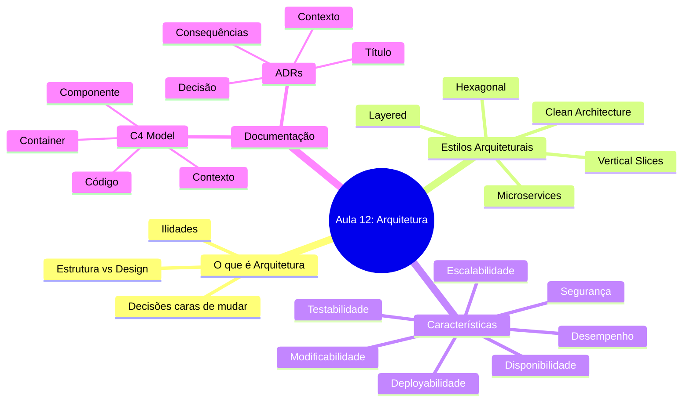
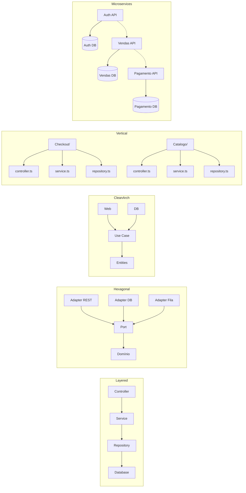
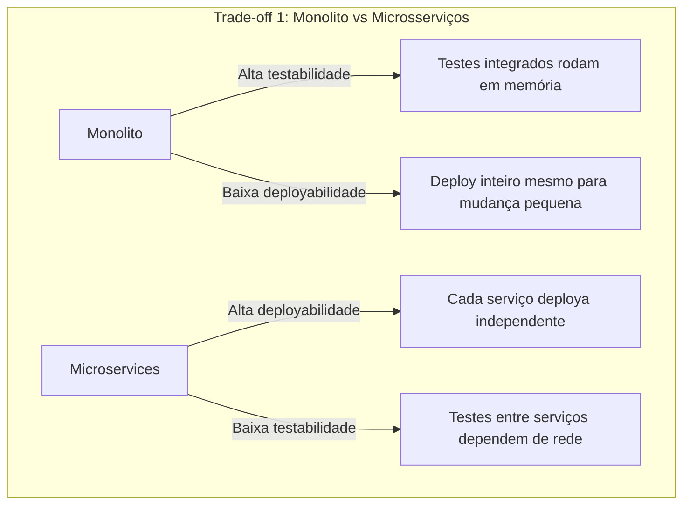
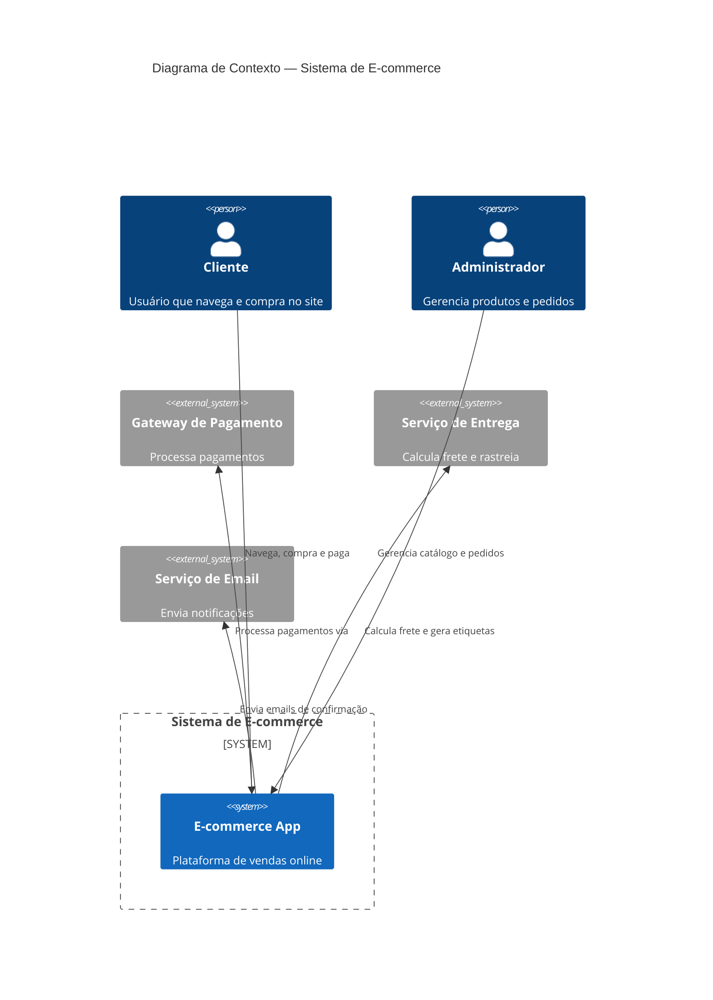
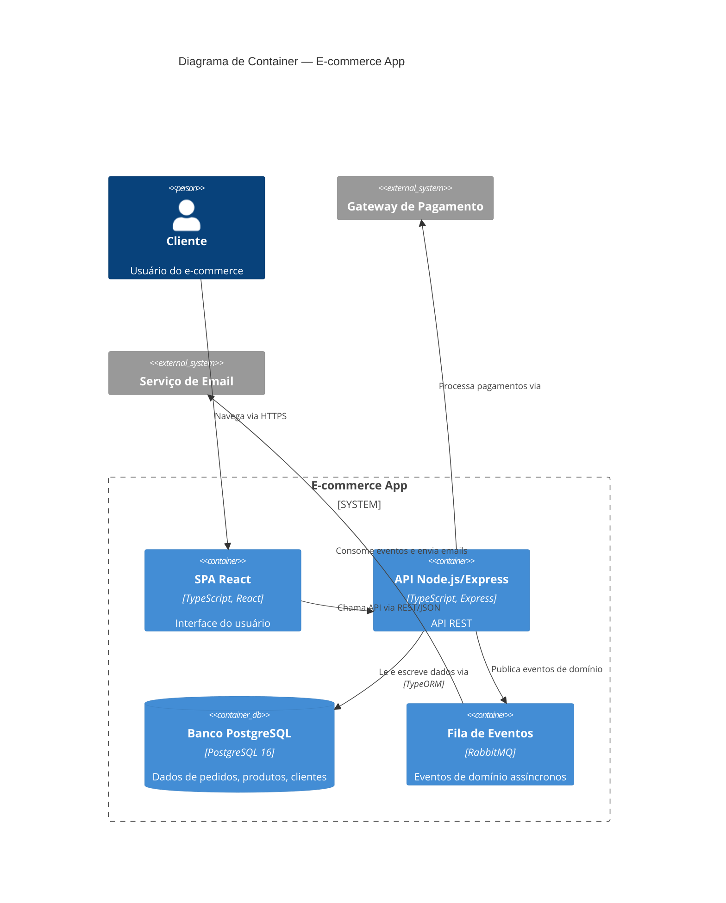
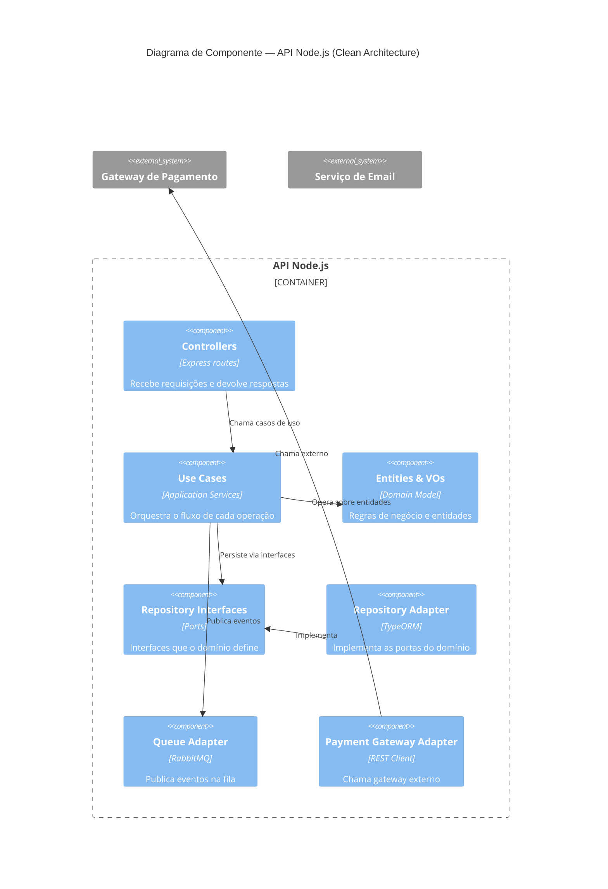

# Engenharia de Software — Aula 12

## Arquitetura de Software: Estilos, Padrões e Decisões

**Duração estimada:** 100 minutos (50 de leitura + 50 de prática)

**Nível:** Intermediário-Avançado

**Pré-requisitos:** Aulas 01 a 11 (Clean Code, Refatoração, SOLID, Design Patterns, DDD Estratégico, DDD Tático)

---

## Objetivos de Aprendizagem

Ao final desta aula, você será capaz de:

- [ ] **Definir** o que é arquitetura de software e por que decisões arquiteturais são caras de mudar
- [ ] **Diferenciar** arquitetura de design de baixo nível com base no custo da mudança
- [ ] **Descrever** os 5 estilos arquiteturais principais: Layered, Hexagonal, Clean Architecture, Vertical Slices e Microservices
- [ ] **Comparar** os estilos arquiteturais em termos de trade-offs e contexto de uso
- [ ] **Listar** as principais características arquiteturais (ilidades) e seus trade-offs
- [ ] **Explicar** os 4 níveis do C4 Model e o propósito de cada um
- [ ] **Documentar** a arquitetura do e-commerce usando C4 nos níveis 1, 2 e 3
- [ ] **Criar** Architecture Decision Records (ADRs) com o template título-contexto-decisão-consequências
- [ ] **Justificar** decisões arquiteturais comparando alternativas e registrando trade-offs
- [ ] **Aplicar** o processo de avaliação de estilos para um contexto real de e-commerce

---

## Como Usar Esta Aula

Esta aula marca a transição do **design tático** (DDT, Aula 11) para o **design estratégico**: a arquitetura de software. Você vai conhecer os principais estilos arquiteturais, entender como avaliá-los com base nas características que seu sistema precisa, e aprender a documentar decisões usando C4 Model e ADRs.

A primeira metade é conceitual: estilos, características e trade-offs. A segunda metade é aplicada: você vai documentar a arquitetura do e-commerce com diagramas C4 e redigir ADRs reais que registram suas decisões.

**Como proceder:**

1. Leia as seções em ordem — cada uma constrói vocabulário para a seguinte
2. Faça os Quick Checks antes de avançar (as respostas estão logo abaixo)
3. Na segunda metade, abra seu editor e acompanhe criando os arquivos
4. Ao final, faça os exercícios e o arquivo de questões de aprendizagem

**Tempo estimado:** 50 minutos de leitura + 50 minutos de prática.

---

## Mapa Mental




---

## Recapitulação: Aulas 01 a 11

Antes de mergulhar em arquitetura, veja o caminho percorrido até aqui:

| Aula | Tema | O que você construiu |
|---|---|---|
| 01 | Introdução à Engenharia de Software | Setup do projeto e endpoints iniciais |
| 02 | Clean Code: Nomes, Funções, Estrutura | Refatoração do controller com nomes expressivos e funções pequenas |
| 03 | Refatoração: Cheiros e Técnicas | Extração de métodos, eliminação de duplicação |
| 04 | SOLID: SRP, OCP | Separação de responsabilidades no OrderController |
| 05 | SOLID: LSP, ISP, DIP | Interfaces segregadas e injeção de dependência |
| 06 | GoF Criacionais | Factory, Builder, Singleton para criação de pedidos |
| 07 | GoF Estruturais | Adapter, Facade para integração com gateways |
| 08 | GoF Comportamentais | Strategy, Observer para regras de frete e notificações |
| 09 | Design Patterns Web/React | Componentes, hooks patterns, API service layer |
| 10 | DDD Estratégico | Linguagem ubíqua, bounded contexts, eventos de domínio |
| 11 | DDD Tático | Entidades, Value Objects, Agregados, Repositórios |
| **12** | **Arquitetura: Estilos e Decisões** | **C4 diagrams + ADRs** |

O projeto de e-commerce tem hoje um modelo de domínio rico (Aulas 10-11), com bounded contexts, entidades e agregados. Falta definir **como esses elementos se organizam** no sistema — é disso que esta aula trata.

---

## FUNDAMENTOS: Estilos, Características e o Custo das Decisões

> *"Arquitetura não é sobre diagramas bonitos. É sobre decisões que, se tomadas erradas, custam meses de retrabalho."*

As próximas três seções são o alicerce conceitual. Elas respondem três perguntas:

1. **O que é** arquitetura de software e por que ela importa?
2. **Quais estilos** existem e como escolher entre eles?
3. **Que características** (ilidades) seu sistema precisa e quais os trade-offs?

Nenhuma marca, ferramenta ou tecnologia específica será mencionada aqui — apenas conceitos. A aplicação concreta vem na segunda metade.

---

## 1. O que é Arquitetura de Software

Arquitetura de software é o conjunto de **decisões estruturais** que definem como um sistema é organizado: seus componentes, as relações entre eles e as propriedades externas (ilidades) que emergem dessas relações.

### Decisões caras de mudar

A diferença fundamental entre arquitetura e design de baixo nível é o **custo da mudança**.

No design de baixo nível (Aulas 02-09), você extrai um método, renomeia uma classe, troca um padrão por outro — mudanças que custam horas ou dias. Na arquitetura, mudar a forma como os componentes se comunicam (de REST para filas, de monolito para microsserviços) custa **semanas ou meses**.

> **Arquitetura**: decisões que você gostaria de ter acertado na primeira vez.

### Estrutura, Características e Decisões

O SWEBOK V4 (IEEE) elevou a Arquitetura de Software a uma **Área de Conhecimento própria** (KA), com três pilares:

1. **Estrutura**: componentes e conectores — o esqueleto do sistema
2. **Características** (ilidades): desempenho, segurança, testabilidade, escalabilidade — as propriedades que emergem da estrutura
3. **Decisões**: o registro do *porquê* cada escolha foi feita e quais alternativas foram descartadas

### Arquitetura não é sobre ferramentas

Um erro comum é confundir arquitetura com tecnologias: "vou fazer uma arquitetura Node.js" ou "a arquitetura é React + PostgreSQL". Ferramentas são detalhes de implementação. Arquitetura é sobre **como as partes se conectam**, não sobre qual tecnologia cada parte usa.


**O que é:** O fluxo do problema à implementação, passando por decisões arquiteturais.

**Por que importa:** Sem esse ciclo, você pula direto para a implementação e descobre tarde demais que a arquitetura não suporta a carga ou não é testável.

**Como se faz:** Comece pelos requisitos não-funcionais (ilidades), escolha o estilo que maximiza as mais críticas, projete os componentes, valide se as características emergentes atendem aos requisitos.

### Quick Check 1

**1. Qual a diferença entre uma decisão de arquitetura e uma decisão de design de baixo nível?**
**Resposta:** O custo da mudança. Decisões de arquitetura são caras de reverter (semanas/meses), enquanto decisões de design de baixo nível custam horas ou dias.

**2. Quais são os três pilares da arquitetura de software segundo o SWEBOK V4?**
**Resposta:** Estrutura (componentes e conectores), Características (ilidades) e Decisões (registro do porquê).

**3. Por que "arquitetura Node.js" ou "arquitetura React" são expressões incorretas?**
**Resposta:** Porque arquitetura é sobre como os componentes se conectam, não sobre qual tecnologia cada um usa. Ferramentas são detalhes de implementação, não definem a arquitetura.

---

## 2. Estilos Arquiteturais

Um **estilo arquitetural** é uma família de sistemas que compartilham um mesmo padrão de organização. Cada estilo impõe regras sobre como os componentes se conectam, se comunicam e evoluem.

Você precisa conhecer os estilos não para usar sempre o "mais moderno", mas para ter vocabulário e critérios para escolher **o adequado ao seu contexto**.

### 2.1 Layered Architecture (Arquitetura em Camadas)

**O que é:** Organiza o sistema em camadas horizontais, onde cada camada depende apenas da camada imediatamente inferior. A camada superior (apresentação) chama a de aplicação, que chama a de domínio, que chama a de infraestrutura.

**Quando usar:** Sistemas simples com pouca complexidade de negócio, CRUDs, protótipos, times pequenos.

**Quando NÃO usar:** Sistemas com regras de negócio complexas, onde o domínio precisa ser testado independentemente da infraestrutura. A tendência é a camada de domínio vazar para a de infraestrutura, criando acoplamento.

**Trade-offs:**
- ✅ Simples de entender, curva de aprendizado baixa
- ✅ Frameworks web (Express, Spring, Django) incentivam esse estilo
- ❌ Viola SRP com frequência — "God classes" no controller
- ❌ Dificuldade de testar o domínio sem a infraestrutura
- ❌ Acoplamento ao framework — difícil trocar de ORM ou banco

### 2.2 Hexagonal Architecture (Ports & Adapters)

**O que é:** Coloca o **domínio no centro** e define portas (interfaces) nas bordas. Adaptadores concretos (REST, banco, fila) se plugam nas portas. O domínio nunca depende de infraestrutura — a infraestrutura depende do domínio.

**Quando usar:** Sistemas com regras de negócio ricas (e-commerce, fintech, healthcare), onde o domínio precisa ser testado sem banco, sem HTTP, sem file system.

**Quando NÃO usar:** CRUDs simples onde o custo das abstrações não se justifica. Scripts de uso único.

**Trade-offs:**
- ✅ Domínio puro e testável sem infraestrutura
- ✅ Baixo acoplamento — troca de banco, ORM ou fila sem alterar o negócio
- ❌ Mais arquivos e interfaces que a abordagem em camadas
- ❌ Overhead inicial em projetos pequenos

### 2.3 Clean Architecture

**O que é:** Variação da Hexagonal com **círculos concêntricos**. No centro: entidades e regras de negócio. No círculo intermediário: casos de uso (application services). No círculo externo: delivery mechanisms (web, banco, UI). A **Regra da Dependência** dita que dependências sempre apontam para dentro — nunca para fora.

**Quando usar:** Sistemas complexos com expectativa de vida longa (5+ anos), múltiplas interfaces de entrada (API, CLI, fila), onde a testabilidade do núcleo de negócio é crítica.

**Quando NÃO usar:** Projetos pequenos, protótipos descartáveis, times sem familiaridade com os conceitos.

**Trade-offs:**
- ✅ Independência total de frameworks, bancos e UI
- ✅ Testabilidade máxima do núcleo de negócio
- ✅ A regra da dependência é clara e enforceável (dependency-cruiser, ArchUnit)
- ❌ Curva de aprendizado alta para times juniores
- ❌ Overhead de mapeamento entre camadas (presenters, controllers, gateways)

### 2.4 Vertical Slices

**O que é:** Em vez de organizar por camada técnica (controller, service, repository), organiza por **feature**. Cada slice vertical contém tudo o que precisa para implementar um caso de uso — do request ao banco.

**Quando usar:** Sistemas onde as features são relativamente independentes entre si, times que praticam DDD e querem evitar o acoplamento horizontal das camadas.

**Quando NÃO usar:** Features com alto grau de compartilhamento (muitas queries cross-slice) — você acaba duplicando lógica entre slices.

**Trade-offs:**
- ✅ Coesão por feature — o código de um caso de uso está junto
- ✅ Fácil de navegar — "onde está o código de checkout?" → um diretório só
- ❌ Duplicação potencial de lógica entre slices
- ❌ Pode ser combinado com outros estilos (ex: Hexagonal internamente)
- ❌ Menos difundido — menos referências e exemplos na comunidade

### 2.5 Microservices

**O que é:** Cada serviço é um sistema independente com seu próprio banco de dados, ciclos de deploy e equipe. Serviços se comunicam via API (REST/gRPC) ou mensageria (RabbitMQ, Kafka, SQS).

**Quando usar:** Sistemas grandes (10+ squads), onde times precisam de autonomia total para deploy e escala. Organizações grandes com estruturas de time que refletem bounded contexts.

**Quando NÃO usar:** Times pequenos (1-5 pessoas), sistemas com domínio fortemente acoplado, onde transações distribuídas seriam frequentes. **A regra de ouro:** se você não sabe por que precisa de microsserviços, não precisa.

**Trade-offs:**
- ✅ Independência total de deploy — cada serviço evolui no seu ritmo
- ✅ Escala independente — só escalar o serviço que demanda mais recursos
- ✅ Isolamento de falhas — um crash não derruba o sistema inteiro
- ❌ Complexidade de rede — latência, fallbacks, resiliência, service discovery
- ❌ Transações distribuídas — consistência eventual e sagas são mais complexas que ACID
- ❌ Observabilidade muito mais cara — tracing, logging e métricas distribuídas
- ❌ Testes integrados entre serviços são lentos e frágeis

### Diagrama Comparativo



**O que é:** Comparação visual dos 5 estilos arquiteturais.

**Por que importa:** Cada estilo impõe um trade-off diferente entre simplicidade, testabilidade, autonomia e complexidade. O diagrama mostra como a estrutura muda.

### Quick Check 2

**1. Qual a principal diferença entre Layered e Hexagonal?**
**Resposta:** Na Layered o domínio depende da infraestrutura (camada de dados). Na Hexagonal o domínio está no centro e define portas (interfaces) — a infraestrutura depende do domínio, não o contrário.

**2. Em que situação Microservices é uma escolha inadequada?**
**Resposta:** Times pequenos (1-5 pessoas) ou domínios fortemente acoplados onde transações distribuídas seriam frequentes. Se você não sabe por que precisa, não precisa.

**3. O que significa "Regra da Dependência" na Clean Architecture?**
**Resposta:** Dependências sempre apontam para dentro — dos círculos externos para os internos. O círculo mais interno (entidades) não sabe nada sobre web, banco ou UI.

---

## 3. Características Arquiteturais (Ilidades)

Características arquiteturais são **propriedades não-funcionais** que emergem da estrutura do sistema. São também chamadas de **ilidades** (do sufixo "-idade"): disponibilidade, confiabilidade, testabilidade, etc.

### As principais ilidades

| Característica | O que significa | Pergunta-chave |
|---|---|---|
| **Desempenho** | Capacidade de resposta em tempo hábil | A resposta volta em quanto tempo? |
| **Escalabilidade** | Capacidade de crescer sob carga maior | O sistema aguenta 10x mais usuários? |
| **Disponibilidade** | Percentual de tempo que o sistema está operacional | Qual o SLA? 99.9% ou 99.999%? |
| **Confiabilidade** | Probabilidade de operar sem falhas por um período | Queda de um nó derruba o sistema? |
| **Segurança** | Proteção contra acesso ou ataques não autorizados | Dados sensíveis estão protegidos? |
| **Testabilidade** | Facilidade de verificar o comportamento do sistema | Consigo testar o domínio sem banco? |
| **Deployabilidade** | Facilidade e frequência com que o sistema é implantado | Quanto tempo leva um deploy? |
| **Modificabilidade** | Facilidade de alterar o sistema sem quebrar outras partes | Mudar uma regra afeta quantos arquivos? |
| **Observabilidade** | Capacidade de entender o estado interno pelo output externo | Sem olhar o código, sei o que aconteceu? |

### O Trade-off Fundamental

**Você não pode maximizar todas as ilidades ao mesmo tempo.**

Elas competem entre si. Melhorar uma quase sempre piora outra. Veja exemplos concretos:



**Exemplo 1:** Microsserviços melhoram **deployabilidade** (cada serviço deploya independente) mas pioram **desempenho** (latência de rede entre serviços) e **testabilidade** (testes integrados dependem de comunicação via rede).

**Exemplo 2:** Arquitetura Hexagonal melhora **testabilidade** (domínio puro sem infraestrutura) mas piora **simplicidade** (mais arquivos, interfaces e mapeamentos).

**Exemplo 3:** Adicionar cache melhora **desempenho** mas piora **confiabilidade** (dados podem ficar obsoletos) e **modificabilidade** (cache invalidation é complexo).

### Como decidir: o Modelo de Forças

Para cada ilidade, atribua um peso ao contexto do seu sistema:

| Ilidade | E-commerce | Peso |
|---|---|---|
| Desempenho | Crítico (carrinho, checkout) | 5 |
| Disponibilidade | Crítico (vendendo 24/7) | 5 |
| Segurança | Crítico (dados financeiros) | 5 |
| Modificabilidade | Alto (mudanças de regra frequentes) | 4 |
| Testabilidade | Alto (muitos cenários de negócio) | 4 |
| Deployabilidade | Médio (deploys semanais) | 3 |
| Escalabilidade | Médio (picos em Black Friday) | 3 |
| Observabilidade | Alto (diagnóstico rápido) | 4 |

**O que fazer:** Escolha o estilo arquitetural que maximiza as ilidades com maior peso. Para o e-commerce: desempenho + disponibilidade + segurança + testabilidade sugerem uma abordagem **Hexagonal ou Clean Architecture**, com boundaries bem definidos para deployabilidade futura.

### Quick Check 3

**1. Por que não é possível maximizar todas as ilidades ao mesmo tempo?**
**Resposta:** Porque elas competem entre si. Melhorar deployabilidade (microsserviços) piora desempenho e testabilidade. Melhorar testabilidade (Hexagonal) piora simplicidade. É um jogo de soma zero entre pares de ilidades.

**2. Para um sistema de e-commerce, quais ilidades você priorizaria?**
**Resposta:** Desempenho, disponibilidade e segurança como críticas (peso 5). Modificabilidade, testabilidade e observabilidade como altas (peso 4).

---

## APLICAÇÃO: Documentando a Arquitetura do E-commerce com C4 e ADRs

> *"Arquitetura não documentada é arquitetura perdida. Quando o autor sai do time, as decisões somem junto."*

Agora você vai aplicar os conceitos da primeira metade em algo concreto: documentar a arquitetura do e-commerce que você vem construindo desde a Aula 01.

Vamos usar duas técnicas:
- **C4 Model** para visualizar a arquitetura em 4 níveis de abstração
- **ADRs** (Architecture Decision Records) para registrar o *porquê* de cada decisão

---

## 4. C4 Model

O C4 Model foi criado por Simon Brown para documentar arquitetura de software em **4 níveis de abstração**, cada um com seu público e propósito:

| Nível | Nome | Público | O que mostra |
|---|---|---|---|
| 1 | Contexto | Todos (incluindo não-técnicos) | O sistema e seus usuários/sistemas externos |
| 2 | Container | Desenvolvedores e DevOps | API, banco, fila, frontend — os "containers" executáveis |
| 3 | Componente | Desenvolvedores | Os componentes internos de cada container |
| 4 | Código | Desenvolvedores (sob demanda) | Classes específicas, pacotes, relacionamentos |

### Nível 1: Diagrama de Contexto

Mostra o sistema de e-commerce como uma caixa preta, seus atores e os sistemas externos com que se comunica.



**O que é:** Visão geral do sistema e seus relacionamentos externos.

**Por que importa:** Qualquer pessoa (incluindo product managers e stakeholders não-técnicos) entende o que o sistema faz e com quem se comunica.

### Nível 2: Diagrama de Container

Mostra os containers executáveis que compõem o sistema: aplicações, bancos de dados, filas, etc.



**O que é:** Os blocos executáveis do sistema.

**Por que importa:** DevOps e desenvolvedores entendem o que precisa ser deployado, quais tecnologias estão em jogo e como a comunicação acontece.

### Nível 3: Diagrama de Componente

Vamos focar no container **API** e mostrar seus componentes internos organizados em Clean Architecture:



**O que é:** Os componentes internos da API, organizados por camada.

**Por que importa:** Desenvolvedores entendem onde cada peça de código mora, quais as regras de dependência e como testar cada camada isoladamente.

### Nível 4: Código

O nível 4 é sob demanda — você não diagrama todas as classes, apenas as mais importantes ou as que revelam um padrão relevante. Exemplo: a estrutura de pacotes/diretórios do projeto:

```
src/
  domain/
    entities/
      Order.ts
      Product.ts
      Customer.ts
    value-objects/
      Money.ts
      Email.ts
      CPF.ts
    repositories/
      IOrderRepository.ts
      IProductRepository.ts
  application/
    services/
      CreateOrderUseCase.ts
      ProcessPaymentUseCase.ts
      CalculateShippingUseCase.ts
    ports/
      IPaymentGateway.ts
      IEmailService.ts
      IQueueService.ts
  infra/
    adapters/
      postgres/
        OrderRepositoryPostgres.ts
        ProductRepositoryPostgres.ts
      payment/
        PaymentGatewayAdapter.ts
      queue/
        RabbitMQAdapter.ts
    http/
      controllers/
        OrderController.ts
        ProductController.ts
      routes.ts
      app.ts
  main.ts
```

**O que é:** A estrutura de diretórios reflete a arquitetura — domínio no centro, aplicação orquestrando, infraestrutura nas bordas.

**Por que importa:** Novos desenvolvedores olham a estrutura e entendem imediatamente o estilo arquitetural e onde cada tipo de código pertence.

### Quick Check 4

**1. Quais são os 4 níveis do C4 Model?**
**Resposta:** Contexto (nível 1), Container (nível 2), Componente (nível 3), Código (nível 4).

**2. Qual nível é mais adequado para conversar com product managers e stakeholders não-técnicos?**
**Resposta:** Nível 1 (Contexto), que mostra o sistema, atores e sistemas externos sem detalhes técnicos.

**3. No nível 3 (Componente) da nossa API, qual estilo arquitetural a estrutura de pacotes revela?**
**Resposta:** Clean Architecture / Hexagonal — domínio no centro, application services orquestrando, infraestrutura nas bordas com adaptadores implementando portas.

---

## 5. Architecture Decision Records (ADRs)

ADR é um documento que registra uma **decisão arquitetural importante**, seu contexto, as alternativas consideradas e as consequências. O formato foi popularizado por Michael Nygard e se consolidou como prática padrão na indústria.

### Quando criar um ADR

- Quando uma decisão tem impacto arquitetural (muda estilo, componente, tecnologia ou comunicação)
- Quando há mais de uma alternativa viável
- Quando a decisão vai ser difícil de reverter

### Template

Cada ADR segue esta estrutura:

```markdown
# ADR-NNN: Título da Decisão

**Status:** [Proposto | Aceito | Depreciado | Substituído]

**Data:** YYYY-MM-DD

## Contexto

Qual problema estamos resolvendo? Quais as forças em jogo? O que foi considerado?

## Decisão

Qual foi a escolha? Por que esta e não outra?

## Consequências

O que ganhamos? O que perdemos? Quais riscos assumimos?
```

### ADR-001: Clean Architecture em vez de Layered

```markdown
# ADR-001: Adotar Clean Architecture como estilo arquitetural

**Status:** Aceito

**Data:** 2026-06-21

## Contexto

O e-commerce começou com um controller Express monolítico (Aula 01). Refatorações sucessivas nas aulas seguintes melhoraram o código, mas a estrutura ainda é essencialmente Layered: controllers chamam services que chamam repositories.

Com a introdução de DDD (Aulas 10-11), o modelo de domínio cresceu: temos entidades, value objects, agregados e eventos de domínio. O estilo Layered atual não protege o domínio da infraestrutura — os services têm dependências diretas de TypeORM e Express.

Precisamos de um estilo que:
- Coloque o domínio no centro, independente de banco, HTTP ou fila
- Permita testar regras de negócio sem infraestrutura
- Suporte múltiplas interfaces de entrada (API REST, fila de eventos, CLI)

## Decisão

Adotar Clean Architecture (círculos concêntricos + Regra da Dependência):

- **Domínio** (centro): entidades, value objects, interfaces de repositório — zero dependências externas
- **Application** (círculo médio): use cases, serviços de aplicação — orquestram o fluxo, dependem apenas do domínio
- **Infraestrutura** (círculo externo): adaptadores de banco, HTTP, fila — implementam as portas do domínio

Alternativas consideradas:
1. **Layered**: rejeitada — não protege o domínio da infraestrutura
2. **Hexagonal pura**: viável, mas a Clean Architecture oferece vocabulário mais rico (use cases, presenters) que o time já conhece
3. **Vertical Slices**: rejeitada — o time ainda está consolidando DDD e a estrutura por feature tornaria mais difícil enxergar as regras cross-cutting

## Consequências

- **Positivas:** domínio testável sem banco, independência de framework, estrutura clara para novos devs
- **Negativas:** mais arquivos e interfaces, overhead de mapeamento entre camadas, curva de aprendizado para juniores
- **Risco:** devs podem criar "use cases anêmicos" que só delegam para o repositório — mitigação: code review focado em riqueza dos use cases
```

### ADR-002: PostgreSQL como banco principal

```markdown
# ADR-002: PostgreSQL como banco de dados relacional principal

**Status:** Aceito

**Data:** 2026-06-21

## Contexto

Precisamos de um banco de dados para persistir dados transacionais do e-commerce: pedidos, produtos, clientes, pagamentos. Os requisitos incluem:
- Transações ACID (essencial para pedidos e pagamentos)
- Suporte a consultas complexas (relatórios, dashboard admin)
- Consistência forte (não podemos aceitar consistência eventual para dados financeiros)
- Maturidade e ecossistema

Alternativas consideradas:
1. **MongoDB**: document-based, esquema flexível — bom para prototipagem, mas consultas complexas exigem agregações complicadas
2. **MySQL**: relacional maduro, mas o ecossistema de extensões do PostgreSQL é superior (PostGIS, extensões de tipo)
3. **SQLite**: simples, mas não suporta concorrência de escrita necessária para um e-commerce

## Decisão

Usar PostgreSQL 16 como banco de dados principal.

Critérios de decisão:
- Suporte nativo a JSONB para dados semi-estruturados (metadados de produtos)
- Transações ACID com isolamento serializável quando necessário
- Extensões como `uuid-ossp` e `pgcrypto`
- Maturidade comprovada em sistemas transacionais de alta criticidade
- TypeORM (já no projeto) tem suporte de primeira classe

## Consequências

- **Positivas:** consistência forte, queries complexas eficientes, ecossistema maduro
- **Negativas:** escalabilidade vertical é mais cara que horizontal (mas schema bem projetado posterga isso)
- **Risco:** modelagem relacional pode conflitar com agregados DDD — mitigação: repositórios fazem o mapeamento ORM, o domínio nunca vê SQL
```

### ADR-003: REST síncrono entre Vendas e Pagamento

```markdown
# ADR-003: Comunicação síncrona (REST) entre os contextos de Vendas e Pagamento

**Status:** Aceito

**Data:** 2026-06-21

## Contexto

O fluxo de checkout do e-commerce envolve dois bounded contexts: **Vendas** (cria o pedido) e **Pagamento** (processa a transação). O pedido só pode ser confirmado após o pagamento ser aprovado.

Opções de comunicação:
1. **REST síncrono**: Vendas chama Pagamento e aguarda a resposta
2. **Fila assíncrona**: Vendas publica evento "PedidoCriado", Pagamento consome e processa
3. **Eventual com callback**: Vendas publica evento, Pagamento responde via webhook

## Decisão

Usar comunicação síncrona (REST) entre Vendas e Pagamento para o fluxo de checkout.

Justificativa:
- O checkout precisa de resposta imediata para o cliente (aprova/rejeita na hora)
- O fluxo é transacional por natureza — não faz sentido criar pedido sem pagamento aprovado
- Comunicação assíncrona adicionaria complexidade (sagas, compensações, estados intermediários) sem benefício claro neste fluxo específico
- Contextos Vendas e Pagamento são fortemente acoplados no tempo — a decisão de pagamento é parte do fluxo de vendas

Para fluxos não-transacionais (ex: notificação de pedido confirmado para o serviço de Email), usaremos fila assíncrona (RabbitMQ).

## Consequências

- **Positivas:** simplicidade, resposta em tempo real, transação garantida no fluxo principal
- **Negativas:** Vendas fica bloqueado enquanto Pagamento processa (latência), se Pagamento cai, Vendas também falha
- **Mitigação de risco:** timeout configurado (5s), circuit breaker, fallback para fila se o pagamento estiver fora do ar
```

### Quick Check 5

**1. O que significa a sigla ADR e qual seu propósito?**
**Resposta:** Architecture Decision Record. Documenta uma decisão arquitetural importante — contexto, alternativas, decisão e consequências — para que o conhecimento não se perca quando o autor sai do time.

**2. Quais são as 4 seções principais de um ADR?**
**Resposta:** Contexto (problema e forças), Decisão (escolha e justificativa), Consequências (ganhos, perdas e riscos), Status (proposto/aceito/depreciado/substituído).

**3. Por que o ADR-003 escolheu REST síncrono em vez de fila para a comunicação Vendas-Pagamento?**
**Resposta:** Porque o checkout precisa de resposta imediata e o fluxo é transacional por natureza — não faz sentido criar pedido sem pagamento aprovado. Fila adicionaria complexidade (sagas, compensações) sem benefício.

---

## Autoavaliação: Quiz Rápido

**1. O que diferencia uma decisão de arquitetura de uma decisão de design de baixo nível?**
**Resposta:** O custo da mudança. Decisões de arquitetura são caras de reverter (semanas/meses), decisões de design custam horas/dias.

**2. Qual estilo arquitetural coloca o domínio no centro e define portas (interfaces) nas bordas?**
**Resposta:** Hexagonal Architecture (Ports & Adapters). Clean Architecture é uma variação que adiciona a Regra da Dependência.

**3. Cite duas ilidades que competem entre si e um exemplo concreto.**
**Resposta:** Deployabilidade vs Desempenho: microsserviços melhoram deployabilidade (deploys independentes) mas pioram desempenho (latência de rede entre serviços).

**4. Quais são os 4 níveis do C4 Model?**
**Resposta:** Contexto (nível 1), Container (nível 2), Componente (nível 3), Código (nível 4).

**5. Em que situação a Vertical Slices é preferível à Layered?**
**Resposta:** Quando as features do sistema são relativamente independentes entre si e o time quer evitar que uma mudança em uma camada técnica (ex: service) afete múltiplas features não relacionadas.

**6. Quais são as quatro seções principais de um ADR?**
**Resposta:** Contexto, Decisão, Consequências e Status.

**7. Por que o ADR-001 rejeitou a Vertical Slices como alternativa?**
**Resposta:** Porque o time ainda está consolidando DDD e a estrutura por feature tornaria mais difícil enxergar regras cross-cutting entre features.

---

## Mão na Massa: Exercícios Graduados

**Exercício 1 (Fácil) — Identificando o estilo arquitetural do seu projeto**

Analise a estrutura atual do seu projeto de e-commerce (das aulas anteriores) e identifique qual estilo arquitetural ele mais se aproxima hoje. Justifique com base na organização de diretórios, nas dependências e no acoplamento.

**Gabarito:**

Resposta esperada (varia para cada aluno):
> "O projeto atual está mais próximo de **Layered Architecture** porque:
> - `src/routes/` → camada de apresentação
> - `src/controllers/` → camada de controle
> - `src/services/` → camada de aplicação
> - `src/repositories/` → camada de dados
> Os services dependem diretamente de TypeORM, o que acopla o domínio à infraestrutura. Não há portas/interfaces separando o domínio da implementação concreta."

**Exercício 2 (Médio) — Criando um ADR para o banco de dados**

Imagine que você precisa escolher entre PostgreSQL e MongoDB para o módulo de **Catálogo de Produtos** do e-commerce. Crie um ADR completo (Contexto, Decisão, Consequências) documentando essa escolha. Inclua pelo menos 3 critérios de avaliação.

**Gabarito:**

```markdown
# ADR-004: PostgreSQL para o módulo de Catálogo de Produtos

**Status:** Aceito

**Data:** 2026-06-21

## Contexto

O módulo de Catálogo precisa armazenar produtos com estrutura semi-estruturada (atributos variáveis por categoria) e suportar buscas por múltiplos critérios (preço, categoria, avaliação). Os requisitos incluem consultas complexas e integridade referencial com pedidos.

Alternativas: PostgreSQL (relacional + JSONB) e MongoDB (document-based).

## Decisão

PostgreSQL com colunas JSONB para atributos variáveis.

Critérios:
1. Integridade referencial: produtos referenciados em pedidos — PostgreSQL garante FK
2. Consultas complexas: JOINs entre produtos, categorias e avaliações são mais eficientes em SQL
3. Maturidade: ecossistema de ferramentas e extensões maduro

## Consequências

- Positivas: consistência forte, queries complexas eficientes, JSONB para flexibilidade
- Negativas: schema migrations requerem mais cuidado que MongoDB
- Risco: JSONB pode tentar devs a colocar lógica no banco — mitigation: modelagem no domínio, não no banco
```

**Desafio (Difícil) — Avaliação de estilos para o módulo de Pagamentos**

O módulo de **Pagamentos** do e-commerce precisa processar transações com alta disponibilidade (não pode rejeitar pagamento por instabilidade), consistência forte (não pode haver duplicidade) e suporte a múltiplos gateways (Stripe, Mercado Pago, PayPal).

Avalie os 5 estilos arquiteturais para este módulo específico. Para cada estilo, atribua uma nota de 1 a 5 para cada ilidade relevante e justifique qual estilo você recomenda.

| Ilidade | Peso | Layered | Hexagonal | Clean Arch | Vertical | Microservices |
|---|---|---|---|---|---|---|
| Disponibilidade | 5 | 3 | 4 | 4 | 3 | 5 |
| Consistência | 5 | 4 | 4 | 4 | 4 | 3 |
| Testabilidade | 4 | 2 | 5 | 5 | 4 | 3 |
| Modificabilidade | 3 | 2 | 4 | 4 | 3 | 4 |
| Deployabilidade | 2 | 2 | 2 | 2 | 2 | 4 |

**Gabarito:**

Cálculo da pontuação ponderada:

- **Layered:** (5×3) + (5×4) + (4×2) + (3×2) + (2×2) = 15+20+8+6+4 = **53**
- **Hexagonal:** (5×4) + (5×4) + (4×5) + (3×4) + (2×2) = 20+20+20+12+4 = **76**
- **Clean Arch:** (5×4) + (5×4) + (4×5) + (3×4) + (2×2) = 20+20+20+12+4 = **76**
- **Vertical:** (5×3) + (5×4) + (4×4) + (3×3) + (2×2) = 15+20+16+9+4 = **64**
- **Microservices:** (5×5) + (5×3) + (4×3) + (3×4) + (2×4) = 25+15+12+12+8 = **72**

**Recomendação:** Hexagonal ou Clean Architecture (empatadas com 76). Ambas maximizam testabilidade (crítica para validar regras de pagamento) e disponibilidade (domínio desacoplado permite diferentes estratégias de deploy). Microservices perde em consistência (transações distribuídas são complexas para um módulo que não pode aceitar duplicidade).

---

## Resumo da Aula

### Os 5 Conceitos Fundamentais

1. **Arquitetura de software**: decisões estruturais que são caras de mudar — não é sobre diagramas ou ferramentas, mas sobre componentes, conectores e ilidades
2. **5 estilos arquiteturais**: Layered (simples, acoplada), Hexagonal (domínio no centro), Clean Architecture (círculos + Regra da Dependência), Vertical Slices (por feature), Microservices (serviços independentes)
3. **Ilidades competem entre si**: melhorar uma quase sempre piora outra — o trabalho do arquiteto é priorizar com base no contexto
4. **C4 Model**: documentação em 4 níveis — Contexto, Container, Componente, Código — cada um com seu público
5. **ADRs**: Architecture Decision Records registram o porquê das decisões — contexto, alternativas, decisão, consequências

### O Que Você Construiu Hoje

- [ ] Compreendeu o que é arquitetura de software e como ela difere do design de baixo nível
- [ ] Conheceu 5 estilos arquiteturais e seus trade-offs
- [ ] Entendeu as ilidades e como priorizá-las com base no contexto
- [ ] Documentou a arquitetura do e-commerce com diagramas C4 (níveis 1, 2 e 3)
- [ ] Criou 3 ADRs reais registrando decisões arquiteturais do projeto
- [ ] Aprendeu o processo de avaliação de estilos com o modelo de forças

---

## Próxima Aula

**Aula 13: Clean Architecture na Prática**

Você aprendeu os conceitos e documentou a arquitetura. Agora vai **implementar**: refatorar o controller Express monolítico para Clean Architecture, extrair entidades, use cases e adaptadores, e ver na prática como a Regra da Dependência transforma a testabilidade do sistema.

---

## Referências

### Documentação Oficial

- [C4 Model — Simon Brown](https://c4model.com/)
- [Architecture Decision Records — Michael Nygard](https://cognitect.com/blog/2011/11/15/documenting-architecture-decisions)
- [SWEBOK V4 — IEEE Computer Society](https://www.computer.org/education/bodies-of-knowledge/software-engineering)
- [Clean Architecture — Robert C. Martin](https://blog.cleancoder.com/uncle-bob/2012/08/13/the-clean-architecture.html)

### Artigos para Aprofundamento

- [The C4 model for visualising software architecture (Dev.to)](https://dev.to/simonbrown/the-c4-model-for-visualising-software-architecture-1j9j)
- [Documenting Architecture Decisions (Michael Nygard)](https://cognitect.com/blog/2011/11/15/documenting-architecture-decisions)
- [Hexagonal Architecture (Alistair Cockburn)](https://alistair.cockburn.us/hexagonal-architecture/)
- [Vertical Slice Architecture (Jimmy Bogard)](https://jimmybogard.com/vertical-slice-architecture/)
- [ADR GitHub organization — examples and tools](https://adr.github.io/)

### Ferramentas

- [Structurizr — tooling for C4 Model](https://structurizr.com/)
- [adr-tools — command-line ADR management](https://github.com/npryce/adr-tools)
- [log4brains — ADR management with web UI](https://github.com/thomvaill/log4brains)
- [dependency-cruiser — enforce dependency rules](https://github.com/sverweij/dependency-cruiser)

---

## FAQ

**P: Arquitetura de software é só para projetos grandes?**
R: Não. Sistemas pequenos também têm arquitetura — mesmo que não documentada. A diferença é o nível de formalismo. Um script de 500 linhas ainda tem componentes (funções) e conectores (chamadas de função). A arquitetura está lá, só não está explicitada.

**P: Posso misturar estilos arquiteturais?**
R: Sim, e é comum. Um sistema pode usar Clean Architecture no núcleo e Vertical Slices para organizar features. Microsserviços podem ter internamente Hexagonal. O importante é que a decisão seja consciente e documentada.

**P: C4 Model substitui diagramas UML?**
R: Não. C4 e UML têm propósitos diferentes. C4 é para comunicar arquitetura em diferentes níveis de abstração para diferentes públicos. UML é para modelar detalhes de design (classes, sequência, estados). Eles se complementam.

**P: Quantos ADRs um projeto deve ter?**
R: Não há número certo. Projetos pequenos podem ter 5-10 ADRs. Projetos grandes podem ter centenas. A regra é: crie ADR para toda decisão que você gostaria de ter documentada se um novo desenvolvedor perguntar "por que fizemos assim?".

**P: O que fazer quando um ADR é substituído?**
R: Marque o ADR antigo como "Substituído por ADR-NNN" e crie um novo ADR com a nova decisão. O histórico é importante — ele mostra a evolução do pensamento do time.

**P: Preciso de ferramentas específicas para criar ADRs?**
R: Não. Um arquivo de texto markdown em um diretório `docs/adrs/` já serve. Ferramentas como `adr-tools` e `log4brains` ajudam a gerenciar o ciclo de vida, mas não são obrigatórias.

**P: C4 Model funciona para sistemas legados?**
R: Funciona muito bem. Documentar um sistema legado com C4 é uma das formas mais eficientes de entender sua arquitetura antes de refatorar. Comece pelo nível 1 (Contexto) e vá descendo conforme necessário.

**P: Como apresentar ADRs para stakeholders não-técnicos?**
R: Foque no Contexto e nas Consequências. A seção de Decisão pode ser resumida. O valor para stakeholders é entender o impacto no prazo, no custo e no risco — não o detalhe técnico.

**P: O que é mais importante: a documentação ou a arquitetura em si?**
R: A arquitetura em si. Documentação mal escrita pode ser melhorada. Arquitetura mal projetada custa caro para mudar. Mas documentação boa evita que a arquitetura se degrade sem ninguém perceber.

**P: Existe um estilo arquitetural "melhor"?**
R: Não. Cada estilo otimiza um conjunto diferente de ilidades. O "melhor" é o que melhor equilibra as ilidades que seu sistema precisa. Para um e-commerce, Clean Architecture ou Hexagonal costumam ser boas escolhas, mas um protótipo pode começar com Layered e evoluir.

---

## Glossário

| Termo | Definição |
|---|---|
| **Arquitetura de software** | Conjunto de decisões estruturais que definem componentes, conectores e propriedades emergentes do sistema (Ver seção 1) |
| **Estilo arquitetural** | Família de sistemas que compartilham um padrão de organização (Ver seção 2) |
| **Layered Architecture** | Organização em camadas horizontais onde cada camada depende da inferior (Ver seção 2.1) |
| **Hexagonal Architecture** | Domínio no centro com portas (interfaces) e adaptadores nas bordas (Ver seção 2.2) |
| **Clean Architecture** | Variação da Hexagonal com círculos concêntricos e Regra da Dependência (Ver seção 2.3) |
| **Vertical Slices** | Organização por feature, não por camada técnica (Ver seção 2.4) |
| **Microservices** | Serviços independentes com banco próprio, comunicando-se via rede (Ver seção 2.5) |
| **Ilidades** | Propriedades não-funcionais do sistema: desempenho, escalabilidade, disponibilidade, etc. (Ver seção 3) |
| **Regra da Dependência** | Dependências apontam para dentro, dos círculos externos para o centro (Ver seção 2.3) |
| **C4 Model** | Modelo de documentação arquitetural em 4 níveis (Ver seção 4) |
| **ADR** | Architecture Decision Record — documento que registra uma decisão arquitetural (Ver seção 5) |
| **Ports & Adapters** | Sinônimo de Hexagonal Architecture (Ver seção 2.2) |
| **SWEBOK** | Software Engineering Body of Knowledge — guia de referência IEEE (Ver seção 1) |
```
