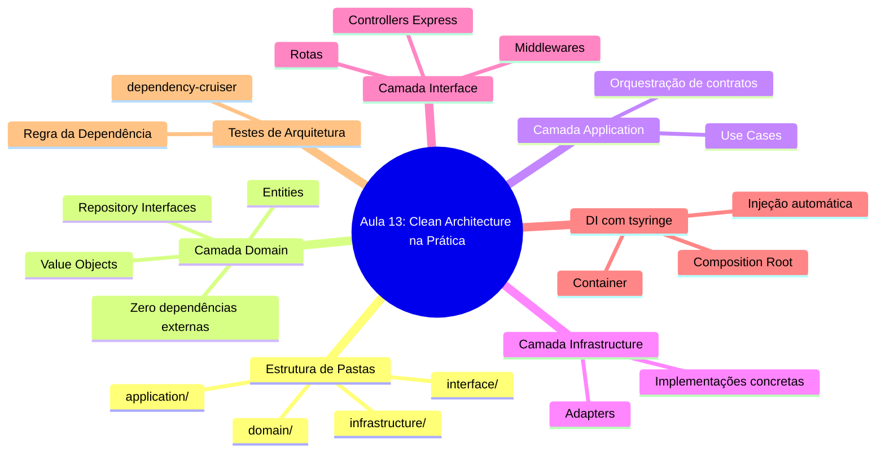
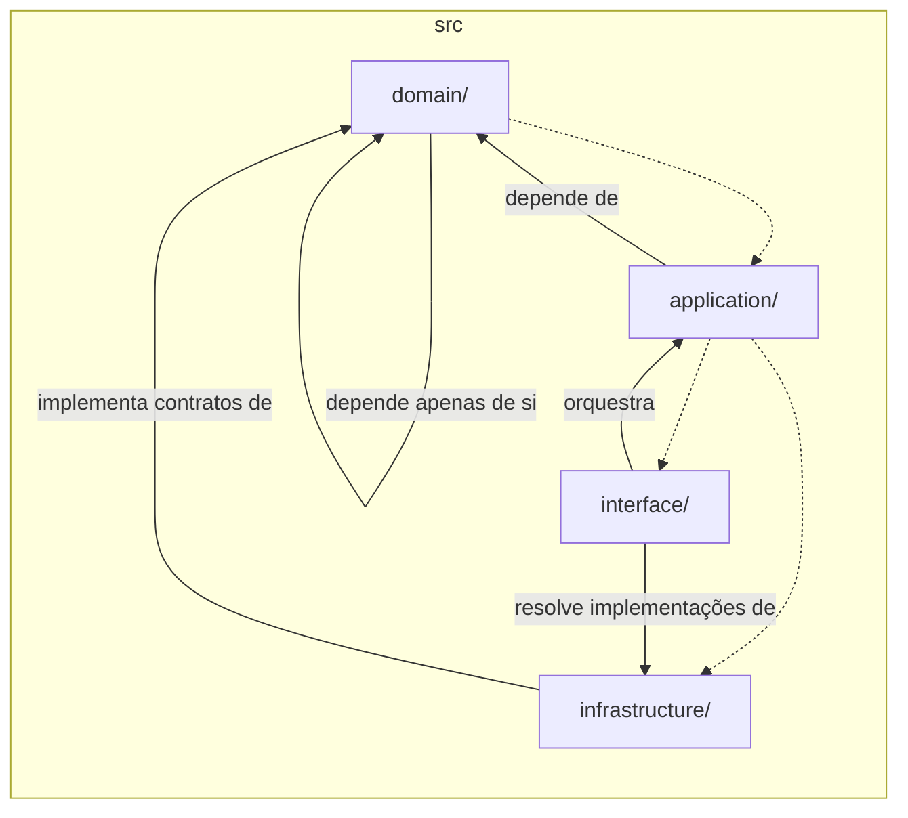
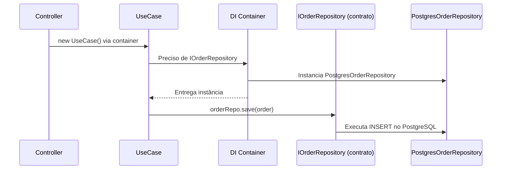

# Engenharia de Software — Aula 13

## Clean Architecture na Prática

**Duração estimada:** 100 minutos (20 de leitura + 80 de prática)

**Nível:** Intermediário-Avançado

**Pré-requisitos:** Aulas 01 a 12 (Clean Code, SOLID, Design Patterns, DDD Estratégico e Tático, Arquitetura de Software — Estilos e Decisões)

---

## Objetivos de Aprendizagem

Ao final desta aula, você será capaz de:

- [ ] **Estruturar** o projeto em 4 camadas (domain, application, infrastructure, interface) com regras de importação claras
- [ ] **Implementar** entidades e value objects puros na camada domain, sem dependências externas
- [ ] **Definir** interfaces de repositório e gateway na camada domain como contratos
- [ ] **Criar** use cases na camada application que orquestram entidades via contratos
- [ ] **Implementar** adaptadores concretos na camada infrastructure (Postgres, Stripe, APIs externas)
- [ ] **Construir** controllers Express na camada interface, a única que conhece o framework
- [ ] **Configurar** o Composition Root com tsyringe para injeção de dependências
- [ ] **Validar** a Regra da Dependência com dependency-cruiser em testes de arquitetura automatizados
- [ ] **Aplicar** DTOs e Mappers para separar modelo de domínio de modelo de API

---

## Como Usar Esta Aula

Esta aula é **inteiramente prática**. Você vai migrar o projeto de e-commerce que vem construindo desde a Aula 01 para Clean Architecture com 4 camadas.

Ao longo do caminho, você encontrará seções **"Mão na Massa"** (para fazer, não só ler) e **"Quick Check"** (para verificar se entendeu antes de avançar). Ao final, o arquivo separado **Questões de Aprendizagem** traz as tarefas de checkpoint.

**Tempo estimado:** 20 minutos de leitura + 80 minutos de prática.

---

## Mapa Mental

Este diagrama mostra todos os conceitos que você vai dominar nesta aula:



---

## Recapitulação: Aulas 01 a 12

Antes de mergulhar na implementação, veja o caminho percorrido até aqui:

| Aula | Tema | O que você construiu |
|---|---|---|
| 01 | Introdução à Engenharia de Software | Setup do projeto e endpoints iniciais |
| 02 | Clean Code | Refatoração com nomes expressivos e funções pequenas |
| 03 | Refactoring Catalog | Extração de métodos, eliminação de duplicação |
| 04 | SOLID: SRP, OCP, LSP | Separação de responsabilidades no controller |
| 05 | SOLID: ISP, DIP + DI | Interfaces segregadas e injeção de dependência |
| 06 | GoF Criacionais | Factory, Builder para criação de pedidos |
| 07 | GoF Estruturais | Adapter, Facade para gateways |
| 08 | GoF Comportamentais | Strategy, Observer para frete e notificações |
| 09 | Design Patterns Web/React | Componentes, hooks patterns |
| 10 | DDD Estratégico | Linguagem ubíqua, bounded contexts |
| 11 | DDD Tático | Entidades, Value Objects, Repositórios |
| 12 | Arquitetura de Software | C4 diagrams + ADRs + 5 estilos arquiteturais |

> *Na Aula 12 você comparou Layered, Hexagonal, Clean, Vertical Slices e Microservices, e documentou a arquitetura com C4 Model. Hoje você **aplica** Clean Architecture no projeto real — do conceito ao código.*

---

**APLICAÇÃO: Implementando Clean Architecture no E-commerce**

> *Chegou o momento de colocar a mão no código. Você vai migrar o projeto de e-commerce das aulas anteriores para uma arquitetura de 4 camadas, aplicar a Regra da Dependência, configurar injeção de dependência com tsyringe e validar tudo com testes de arquitetura.*

---

## 1. Estrutura de Pastas

A primeira decisão concreta é a **estrutura de diretórios**. Cada camada ganha seu próprio diretório raiz dentro de `src/`, com regras de importação claras:

```
src/
├── domain/          # Entidades, Value Objects, Interfaces de repositório
│   ├── entities/
│   ├── value-objects/
│   └── repositories/
├── application/     # Use Cases / Interactors
│   └── use-cases/
├── infrastructure/  # Implementações concretas (banco, gateways, APIs externas)
│   ├── repositories/
│   ├── gateways/
│   └── adapters/
└── interface/       # Controllers HTTP, Presenters, Middlewares
    ├── controllers/
    ├── middlewares/
    ├── routes/
    └── di/           # Composition Root
```



**Regra de importação por camada:**

| Camada | Pode importar | Não pode importar |
|---|---|---|
| `domain/` | Nada externo (zero dependências) | NPM packages, frameworks, outras camadas |
| `application/` | `domain/` | `infrastructure/`, `interface/` |
| `infrastructure/` | `domain/` | `interface/` |
| `interface/` | `application/`, `infrastructure/` | N/A (é a borda) |

> *A regra de ouro: **dependências sempre apontam para dentro**. `domain` está no centro e nada sabe sobre ele — ele sabe sobre nada externo.*

### Mão na Massa — Criar Estrutura de Pastas

- [ ] No diretório `src/` do seu projeto, crie as pastas: `domain/entities`, `domain/value-objects`, `domain/repositories`, `application/use-cases`, `infrastructure/repositories`, `infrastructure/gateways`, `interface/controllers`, `interface/middlewares`, `interface/routes`, `interface/di`
- [ ] Crie arquivos `index.ts` vazios em cada diretório para exportar os módulos
- [ ] Verifique com `tree src/` (ou `ls -R src/` no Windows) que a estrutura está no lugar

**Verificação:** Sua estrutura deve refletir exatamente o diagrama de pastas acima.

### Quick Check 1

**1. Qual camada nunca deve importar nada de fora, nem mesmo outras camadas?**
**Resposta:** `domain/`. Ela contém entidades e regras de negócio puras, sem dependências externas — nem NPM packages, nem frameworks, nem outras camadas do projeto.

**2. Se um use case precisa acessar o banco de dados, ele importa diretamente o repositório concreto?**
**Resposta:** Não. O use case (em `application/`) importa apenas a **interface** do repositório (em `domain/repositories/`). A implementação concreta fica em `infrastructure/` e é injetada via DI.

---

## 2. Camada Domain — Entidades e Contratos Puros

A camada **domain** é o centro do sistema. Ela contém:

1. **Entidades**: objetos com identidade e ciclo de vida (`Order`, `Customer`, `Product`)
2. **Value Objects**: objetos imutáveis sem identidade própria (`Money`, `OrderItem`, `Email`)
3. **Interfaces de repositório**: contratos que o mundo externo deve implementar (`IOrderRepository`, `ICustomerRepository`)

**Regra fundamental:** Nenhum arquivo em `domain/` pode importar nada de fora — nem `fs`, nem `http`, nem `express`, nem `pg`, nem `tsyringe`. Apenas TypeScript puro.

### Value Objects

```typescript
// src/domain/value-objects/money.ts
export class Money {
  constructor(public readonly amount: number, public readonly currency: string) {
    if (amount < 0) throw new Error('Amount cannot be negative');
  }

  static zero(currency = 'BRL'): Money {
    return new Money(0, currency);
  }

  add(other: Money): Money {
    if (other.currency !== this.currency) {
      throw new Error('Currency mismatch');
    }
    return new Money(this.amount + other.amount, this.currency);
  }

  multiply(factor: number): Money {
    return new Money(this.amount * factor, this.currency);
  }
}
```

```typescript
// src/domain/value-objects/order-item.ts
import { Money } from './money';

export class OrderItem {
  constructor(
    public readonly id: string,
    public readonly productId: string,
    private readonly unitPrice: Money,
    public readonly quantity: number,
  ) {
    if (quantity <= 0) throw new Error('Quantity must be positive');
  }

  get subtotal(): Money {
    return this.unitPrice.multiply(this.quantity);
  }
}
```

```typescript
// src/domain/value-objects/order-status.ts
export enum OrderStatus {
  PENDING = 'PENDING',
  PAID = 'PAID',
  SHIPPED = 'SHIPPED',
  DELIVERED = 'DELIVERED',
  CANCELLED = 'CANCELLED',
}
```

### Entidade

```typescript
// src/domain/entities/order.ts
import { OrderItem } from '../value-objects/order-item';
import { Money } from '../value-objects/money';
import { OrderStatus } from '../value-objects/order-status';

export class Order {
  constructor(
    public readonly id: string,
    public readonly customerId: string,
    private _items: OrderItem[],
    private _status: OrderStatus,
    public readonly createdAt: Date,
    public readonly updatedAt: Date,
  ) {}

  get items(): ReadonlyArray<OrderItem> {
    return this._items;
  }

  get status(): OrderStatus {
    return this._status;
  }

  get total(): Money {
    return this._items.reduce(
      (acc, item) => acc.add(item.subtotal),
      Money.zero(),
    );
  }

  addItem(item: OrderItem): void {
    if (this._status !== OrderStatus.PENDING) {
      throw new Error('Cannot add items to a non-pending order');
    }
    this._items = [...this._items, item];
  }

  pay(): void {
    if (this._status !== OrderStatus.PENDING) {
      throw new Error('Only pending orders can be paid');
    }
    this._status = OrderStatus.PAID;
  }
}
```

### Interfaces de Repositório

```typescript
// src/domain/repositories/order-repository.ts
import { Order } from '../entities/order';

export interface IOrderRepository {
  findById(id: string): Promise<Order | null>;
  save(order: Order): Promise<void>;
  findByCustomerId(customerId: string): Promise<Order[]>;
}
```

```typescript
// src/domain/repositories/payment-gateway.ts
import { Money } from '../value-objects/money';

export interface IPaymentGateway {
  processPayment(orderId: string, amount: Money): Promise<PaymentResult>;
  refund(transactionId: string): Promise<void>;
}

export interface PaymentResult {
  transactionId: string;
  status: 'approved' | 'declined';
}
```

> *Observe: as interfaces usam apenas tipos do domínio (`Order`, `Money`). Nunca mencionam `pg`, `axios`, `stripe` ou qualquer tecnologia externa.*

### Quick Check 2

**1. Por que a entidade `Order` tem métodos como `pay()` e `addItem()` em vez de setters públicos?**
**Resposta:** Para **encapsular invariantes**. `pay()` verifica se o pedido está `PENDING` antes de mudar o status. `addItem()` impede adicionar itens em pedidos já pagos. Isso mantém o domínio consistente — ninguém pode colocar o objeto em estado inválido.

**2. O que acontece se a camada `domain` importar `express` ou `pg`?**
**Resposta:** Viola a Regra da Dependência. O domínio perde sua pureza e se acopla a tecnologias externas, dificultando testes e troca de implementações. O dependency-cruiser vai apontar o erro.

---

## 3. Camada Application — Use Cases

A camada **application** orquestra o domínio. Cada **use case** é uma classe com um único método `execute()` que coordena entidades e contratos.

Regras:
- Importa apenas `domain/` (entidades, value objects e interfaces)
- **Nunca** importa `infrastructure/` ou `interface/`
- **Nunca** usa Express, PostgreSQL, Stripe ou qualquer framework
- Lança exceções de domínio, nunca `Response` HTTP

```typescript
// src/application/use-cases/create-order-use-case.ts
import { injectable, inject } from 'tsyringe';
import { IOrderRepository } from '../../domain/repositories/order-repository';
import { IInventoryService } from '../../domain/repositories/inventory-service';
import { Order } from '../../domain/entities/order';
import { OrderItem } from '../../domain/value-objects/order-item';
import { Money } from '../../domain/value-objects/money';
import { OrderStatus } from '../../domain/value-objects/order-status';
import { randomUUID } from 'crypto';

export interface CreateOrderInput {
  customerId: string;
  items: Array<{ productId: string; quantity: number }>;
}

export interface CreateOrderOutput {
  orderId: string;
  total: number;
  currency: string;
}

@injectable()
export class CreateOrderUseCase {
  constructor(
    @inject('IOrderRepository') private orderRepo: IOrderRepository,
    @inject('IInventoryService') private inventory: IInventoryService,
  ) {}

  async execute(input: CreateOrderInput): Promise<CreateOrderOutput> {
    // 1. Validar disponibilidade de estoque
    for (const item of input.items) {
      const available = await this.inventory.checkAvailability(
        item.productId,
        item.quantity,
      );
      if (!available) {
        throw new Error(`Product ${item.productId} out of stock`);
      }
    }

    // 2. Construir itens e pedido
    const orderItems = input.items.map(
      (item) =>
        new OrderItem(
          randomUUID(),
          item.productId,
          new Money(100, 'BRL'), // preço viria do catálogo
          item.quantity,
        ),
    );

    const order = new Order(
      randomUUID(),
      input.customerId,
      orderItems,
      OrderStatus.PENDING,
      new Date(),
      new Date(),
    );

    // 3. Persistir
    await this.orderRepo.save(order);

    // 4. Reservar estoque
    for (const item of input.items) {
      await this.inventory.reserve(item.productId, item.quantity);
    }

    return {
      orderId: order.id,
      total: order.total.amount,
      currency: order.total.currency,
    };
  }
}
```

```typescript
// src/application/use-cases/process-payment-use-case.ts
import { injectable, inject } from 'tsyringe';
import { IOrderRepository } from '../../domain/repositories/order-repository';
import { IPaymentGateway } from '../../domain/repositories/payment-gateway';

export interface ProcessPaymentInput {
  orderId: string;
}

export interface ProcessPaymentOutput {
  transactionId: string;
  status: 'approved' | 'declined';
}

@injectable()
export class ProcessPaymentUseCase {
  constructor(
    @inject('IOrderRepository') private orderRepo: IOrderRepository,
    @inject('IPaymentGateway') private paymentGateway: IPaymentGateway,
  ) {}

  async execute(input: ProcessPaymentInput): Promise<ProcessPaymentOutput> {
    const order = await this.orderRepo.findById(input.orderId);
    if (!order) throw new Error('Order not found');

    order.pay(); // valida invariante de domínio

    const result = await this.paymentGateway.processPayment(
      order.id,
      order.total,
    );

    if (result.status === 'approved') {
      await this.orderRepo.save(order);
    }

    return {
      transactionId: result.transactionId,
      status: result.status,
    };
  }
}
```

### Quick Check 3

**1. O `CreateOrderUseCase` sabe se o banco de dados é PostgreSQL, MySQL ou MongoDB?**
**Resposta:** Não. Ele só conhece a interface `IOrderRepository`. A implementação concreta é resolvida em tempo de execução pelo container de DI. Isso é **Inversão de Dependência** (DIP) do SOLID em ação.

**2. Por que `ProcessPaymentUseCase` chama `order.pay()` antes de chamar o gateway de pagamento?**
**Resposta:** Porque `order.pay()` valida o invariante de domínio (só pedidos `PENDING` podem ser pagos). Se o pedido já estiver pago ou cancelado, a exceção impede a transação — mesmo que o gateway aceitasse.

---

## 4. Camada Infrastructure — Implementações Concretas

A camada **infrastructure** implementa as interfaces definidas no domínio. Aqui moram os detalhes: conexão com banco, chamadas HTTP para APIs externas, envio de emails, etc.

```typescript
// src/infrastructure/repositories/postgres-order-repository.ts
import { injectable } from 'tsyringe';
import { Pool } from 'pg';
import { IOrderRepository } from '../../domain/repositories/order-repository';
import { Order } from '../../domain/entities/order';
import { OrderStatus } from '../../domain/value-objects/order-status';

@injectable()
export class PostgresOrderRepository implements IOrderRepository {
  constructor(private pool: Pool) {}

  async findById(id: string): Promise<Order | null> {
    const result = await this.pool.query(
      'SELECT * FROM orders WHERE id = $1', [id],
    );
    if (result.rows.length === 0) return null;
    return this.mapToOrder(result.rows[0]);
  }

  async save(order: Order): Promise<void> {
    const client = await this.pool.connect();
    try {
      await client.query('BEGIN');
      await client.query(
        `INSERT INTO orders (id, customer_id, status, created_at, updated_at)
         VALUES ($1, $2, $3, $4, $5)
         ON CONFLICT (id) DO UPDATE SET status = $3, updated_at = $5`,
        [order.id, order.customerId, order.status, order.createdAt, new Date()],
      );
      await client.query('COMMIT');
    } catch (error) {
      await client.query('ROLLBACK');
      throw error;
    } finally {
      client.release();
    }
  }

  async findByCustomerId(customerId: string): Promise<Order[]> {
    const result = await this.pool.query(
      'SELECT * FROM orders WHERE customer_id = $1 ORDER BY created_at DESC',
      [customerId],
    );
    return result.rows.map(this.mapToOrder);
  }

  private mapToOrder(row: any): Order {
    return new Order(
      row.id,
      row.customer_id,
      [],
      row.status as OrderStatus,
      row.created_at,
      row.updated_at,
    );
  }
}
```

```typescript
// src/infrastructure/gateways/stripe-payment-gateway.ts
import { injectable } from 'tsyringe';
import Stripe from 'stripe';
import { IPaymentGateway, PaymentResult } from '../../domain/repositories/payment-gateway';
import { Money } from '../../domain/value-objects/money';

@injectable()
export class StripePaymentGateway implements IPaymentGateway {
  private client: Stripe;

  constructor() {
    this.client = new Stripe(process.env.STRIPE_SECRET_KEY!, {
      apiVersion: '2023-10-16',
    });
  }

  async processPayment(orderId: string, amount: Money): Promise<PaymentResult> {
    const paymentIntent = await this.client.paymentIntents.create({
      amount: Math.round(amount.amount * 100),
      currency: amount.currency.toLowerCase(),
      metadata: { orderId },
    });

    return {
      transactionId: paymentIntent.id,
      status: paymentIntent.status === 'succeeded' ? 'approved' : 'declined',
    };
  }

  async refund(transactionId: string): Promise<void> {
    await this.client.refunds.create({ payment_intent: transactionId });
  }
}
```

### Quick Check 4

**1. Se a empresa trocar de Stripe para PagSeguro, quantas camadas precisam ser alteradas?**
**Resposta:** Apenas `infrastructure/`. Cria-se um `PagSeguroPaymentGateway` implementando `IPaymentGateway` e registra-se no container. O use case e o domínio não mudam — eles só conhecem a interface.

**2. Por que `PostgresOrderRepository` usa `@injectable()` do tsyringe?**
**Resposta:** Para que o container de DI possa gerenciar seu ciclo de vida e injetar dependências (como o `Pool` do PostgreSQL) automaticamente via construtor.

---

## 5. Camada Interface — Controllers e Rotas

A camada **interface** (também chamada de "delivery mechanism") é a única que conhece o framework web. Aqui vivem os controllers Express, os middlewares e as rotas.

```typescript
// src/interface/controllers/order-controller.ts
import { Request, Response } from 'express';
import { container } from 'tsyringe';
import { CreateOrderUseCase } from '../../application/use-cases/create-order-use-case';
import { ProcessPaymentUseCase } from '../../application/use-cases/process-payment-use-case';

export class OrderController {
  async create(req: Request, res: Response): Promise<void> {
    try {
      const useCase = container.resolve(CreateOrderUseCase);
      const output = await useCase.execute({
        customerId: req.body.customerId,
        items: req.body.items,
      });
      res.status(201).json(output);
    } catch (error) {
      const message = error instanceof Error ? error.message : 'Unknown error';
      res.status(400).json({ error: message });
    }
  }

  async processPayment(req: Request, res: Response): Promise<void> {
    try {
      const useCase = container.resolve(ProcessPaymentUseCase);
      const output = await useCase.execute({
        orderId: req.params.orderId,
      });
      res.json(output);
    } catch (error) {
      const message = error instanceof Error ? error.message : 'Unknown error';
      res.status(400).json({ error: message });
    }
  }
}
```

```typescript
// src/interface/middlewares/error-handler.ts
import { Request, Response, NextFunction } from 'express';

export function errorHandler(
  err: Error,
  _req: Request,
  res: Response,
  _next: NextFunction,
): void {
  console.error('[ErrorHandler]', err.message);
  res.status(500).json({ error: 'Internal server error' });
}
```

```typescript
// src/interface/routes/order-routes.ts
import { Router } from 'express';
import { OrderController } from '../controllers/order-controller';

const router = Router();
const controller = new OrderController();

router.post('/orders', (req, res) => controller.create(req, res));
router.post('/orders/:orderId/pay', (req, res) => controller.processPayment(req, res));

export { router as orderRoutes };
```

```typescript
// src/interface/app.ts
import express from 'express';
import { orderRoutes } from './routes/order-routes';
import { errorHandler } from './middlewares/error-handler';

const app = express();

app.use(express.json());
app.use('/api', orderRoutes);
app.use(errorHandler);

export { app };
```

### DTOs e Mappers

Para evitar vazamento do modelo de domínio para a API, crie **DTOs** na camada de interface:

```typescript
// src/interface/dtos/order-response.ts
export interface OrderResponseDTO {
  id: string;
  customerId: string;
  status: string;
  total: number;
  currency: string;
  items: Array<{
    productId: string;
    quantity: number;
    subtotal: number;
  }>;
  createdAt: string;
}
```

```typescript
// src/interface/mappers/order-mapper.ts
import { Order } from '../../domain/entities/order';
import { OrderResponseDTO } from '../dtos/order-response';

export function orderToResponse(order: Order): OrderResponseDTO {
  return {
    id: order.id,
    customerId: order.customerId,
    status: order.status,
    total: order.total.amount,
    currency: order.total.currency,
    items: order.items.map((item) => ({
      productId: item.productId,
      quantity: item.quantity,
      subtotal: item.subtotal.amount,
    })),
    createdAt: order.createdAt.toISOString(),
  };
}
```

### Quick Check 5

**1. O controller `OrderController` resolve o use case diretamente do container. Por que isso é aceitável na camada interface?**
**Resposta:** Porque a camada **interface** é a borda do sistema — ela conhece o framework (Express) e o container de DI. Isso não viola a Regra da Dependência desde que `interface` possa importar `application` (seta aponta para dentro).

**2. Qual o propósito do `OrderMapper`?**
**Resposta:** Isolar o modelo de domínio do formato da API. Se a API mudar (ex: adicionar `_links` HATEOAS), apenas o mapper muda — a entidade `Order` permanece intacta.

---

## 6. Dependency Injection com tsyringe

Agora que todas as camadas estão implementadas, precisamos **conectar** os contratos às implementações concretas. Isso acontece no **Composition Root** — o ponto mais externo da aplicação onde o grafo de dependências é montado.

```typescript
// src/interface/di/container.ts
import { container } from 'tsyringe';
import { Pool } from 'pg';
import { IOrderRepository } from '../../domain/repositories/order-repository';
import { IPaymentGateway } from '../../domain/repositories/payment-gateway';
import { IInventoryService } from '../../domain/repositories/inventory-service';
import { PostgresOrderRepository } from '../../infrastructure/repositories/postgres-order-repository';
import { StripePaymentGateway } from '../../infrastructure/gateways/stripe-payment-gateway';

const pool = new Pool({
  connectionString: process.env.DATABASE_URL,
});

container.registerInstance(Pool, pool);
container.registerSingleton<IOrderRepository>('IOrderRepository', PostgresOrderRepository);
container.registerSingleton<IPaymentGateway>('IPaymentGateway', StripePaymentGateway);
```

```typescript
// src/interface/server.ts
import 'reflect-metadata';
import './di/container'; // Composition Root
import { app } from './app';

const PORT = process.env.PORT || 3000;

app.listen(PORT, () => {
  console.log(`Server running on port ${PORT}`);
});
```

```json
// tsconfig.json (trecho relevante)
{
  "compilerOptions": {
    "experimentalDecorators": true,
    "emitDecoratorMetadata": true
  }
}
```

### Diagrama do Fluxo de DI



### Quick Check 6

**1. O que é o Composition Root e por que ele fica na camada interface?**
**Resposta:** O Composition Root é o ponto único onde todas as dependências são registradas e resolvidas. Ele fica na camada `interface` porque é a borda do sistema — o local onde o grafo de dependências é montado antes da aplicação começar a executar.

**2. Se você quiser trocar o banco de PostgreSQL para MongoDB, o que muda?**
**Resposta:** Cria-se `MongoOrderRepository` em `infrastructure/` e altera-se apenas o registro no container: `container.registerSingleton<IOrderRepository>('IOrderRepository', MongoOrderRepository)`. Nenhum use case ou entidade muda.

---

## 7. Testes de Arquitetura com dependency-cruiser

A **Regra da Dependência** é o pilar da Clean Architecture. Para garantir que ninguém a viole, usamos **dependency-cruiser** — uma ferramenta que analisa as importações do projeto e valida regras customizadas.

### Instalação e Configuração

```bash
npm install --save-dev dependency-cruiser
```

```json
// .dependency-cruiser.json
{
  "forbidden": [
    {
      "name": "domain-no-external-deps",
      "comment": "Domain must not import external packages",
      "severity": "error",
      "from": { "path": "^src/domain" },
      "to": { "path": "node_modules", "pathNot": "^src" }
    },
    {
      "name": "domain-cannot-import-other-layers",
      "comment": "Domain must not depend on application, infrastructure or interface",
      "severity": "error",
      "from": { "path": "^src/domain" },
      "to": { "path": "^(src/application|src/infrastructure|src/interface)" }
    },
    {
      "name": "application-cannot-import-infrastructure-or-interface",
      "comment": "Application layer may only depend on domain",
      "severity": "error",
      "from": { "path": "^src/application" },
      "to": { "path": "^(src/infrastructure|src/interface)" }
    },
    {
      "name": "infrastructure-cannot-import-interface",
      "comment": "Infrastructure must not depend on interface layer",
      "severity": "error",
      "from": { "path": "^src/infrastructure" },
      "to": { "path": "^src/interface" }
    }
  ]
}
```

### Teste Automatizado

Adicione o script ao `package.json`:

```json
{
  "scripts": {
    "test:arch": "depcruise --ts-config tsconfig.json --output-type err src",
    "test": "jest && npm run test:arch"
  }
}
```

Para integrar com Jest:

```typescript
// test/architecture/dependency-rules.spec.ts
import { execSync } from 'child_process';
import { resolve } from 'path';

describe('Clean Architecture — Dependency Rules', () => {
  it('must not violate the Dependency Rule', () => {
    const result = execSync(
      'npx depcruise --ts-config tsconfig.json --output-type err src',
      { encoding: 'utf-8', cwd: resolve(__dirname, '../..') },
    );
    expect(result.trim()).toBe('');
  });
});
```

### Executando

```bash
npm run test:arch
```

Se alguém importar algo indevido, a saída será:

```
error domain-cannot-import-other-layers: src/domain/entities/order.ts → src/infrastructure/repositories/postgres-order-repository.ts
```

### Quick Check 7

**1. O que acontece se um desenvolvedor novato importar `pg` diretamente no `ProcessPaymentUseCase`?**
**Resposta:** O dependency-cruiser detecta a violação e o teste `test:arch` falha, impedindo o merge. A regra `application-cannot-import-infrastructure-or-interface` bloqueia qualquer importação de `infrastructure` para `application`.

**2. Por que usar dependency-cruiser em vez de confiar na disciplina do time?**
**Resposta:** Porque **disciplina não escala**. Em projetos com múltiplos desenvolvedores, é questão de tempo até alguém fazer um `import` errado. Testes de arquitetura automatizados são a única garantia de que a regra será mantida.

---

## Autoavaliação: Quiz Rápido

**1. Qual camada da Clean Architecture contém entidades e value objects puros?**
**Resposta:** `domain`. É o centro do sistema, sem dependências externas.

**2. O que são use cases e em qual camada eles vivem?**
**Resposta:** Use cases orquestram entidades e contratos para executar uma operação de negócio. Vivem na camada `application`.

**3. Qual a diferença entre `IOrderRepository` (em domain) e `PostgresOrderRepository` (em infrastructure)?**
**Resposta:** `IOrderRepository` é o **contrato** (interface); `PostgresOrderRepository` é a **implementação concreta**. O contrato está no domínio; a implementação, na infraestrutura.

**4. Por que o controller não deve conter regras de negócio?**
**Resposta:** Porque o controller é um detalhe de delivery mechanism (Express). Regras de negócio pertencem ao domínio e à aplicação. Se o controller tiver regras, trocar de framework exige reimplementá-las.

**5. O que é o Composition Root?**
**Resposta:** O ponto único onde todas as dependências são registradas no container de DI. Fica na borda da aplicação (camada interface).

**6. Qual ferramenta valida a Regra da Dependência automaticamente?**
**Resposta:** dependency-cruiser. Analisa as importações do projeto e reporta violações às regras configuradas.

**7. O que acontece se `domain/` importar um módulo `node_modules`?**
**Resposta:** O dependency-cruiser reporta erro (regra `domain-no-external-deps`). O domínio deve ser TypeScript puro, sem dependências externas.

---

## Mão na Massa: Exercícios Graduados

**Exercício 1 (Fácil) — Adicionar um Novo Repositório no Domínio**

Você precisa adicionar suporte ao repositório de clientes. Crie a interface `ICustomerRepository` na camada `domain/repositories/` com métodos `findById`, `save` e `findByEmail`.

**Gabarito:**

```typescript
// src/domain/repositories/customer-repository.ts
import { Customer } from '../entities/customer';

export interface ICustomerRepository {
  findById(id: string): Promise<Customer | null>;
  save(customer: Customer): Promise<void>;
  findByEmail(email: string): Promise<Customer | null>;
}
```

A interface usa apenas tipos do domínio (`Customer`). Nenhuma importação externa.

---

**Exercício 2 (Médio) — Implementar Use Case de Cancelamento de Pedido**

Crie um `CancelOrderUseCase` na camada `application/use-cases/` que:
1. Busca o pedido pelo ID
2. Verifica se o pedido pode ser cancelado (status `PENDING` ou `PAID`)
3. Se foi pago, aciona o gateway de pagamento para reembolso
4. Muda o status para `CANCELLED`

**Gabarito:**

```typescript
// src/application/use-cases/cancel-order-use-case.ts
import { injectable, inject } from 'tsyringe';
import { IOrderRepository } from '../../domain/repositories/order-repository';
import { IPaymentGateway } from '../../domain/repositories/payment-gateway';
import { OrderStatus } from '../../domain/value-objects/order-status';

export interface CancelOrderInput {
  orderId: string;
  reason: string;
}

@injectable()
export class CancelOrderUseCase {
  constructor(
    @inject('IOrderRepository') private orderRepo: IOrderRepository,
    @inject('IPaymentGateway') private paymentGateway: IPaymentGateway,
  ) {}

  async execute(input: CancelOrderInput): Promise<void> {
    const order = await this.orderRepo.findById(input.orderId);
    if (!order) throw new Error('Order not found');

    if (
      order.status === OrderStatus.SHIPPED ||
      order.status === OrderStatus.DELIVERED
    ) {
      throw new Error('Cannot cancel shipped or delivered orders');
    }

    if (order.status === OrderStatus.PAID) {
      await this.paymentGateway.refund(input.orderId);
    }

    // Para simplificar, assumimos que o repositório tem método updateStatus
    // await this.orderRepo.updateStatus(order.id, OrderStatus.CANCELLED);
  }
}
```

---

**Desafio (Difícil) — Pipeline de Testes de Arquitetura + CI**

Configure o `package.json` para que `npm test` execute tanto o Jest quanto o dependency-cruiser sequencialmente. Crie um script que, se houver violação, exiba uma tabela formatada com os erros.

Demonstre a falha: crie temporariamente um arquivo `src/domain/temp-violation.ts` que importe algo de `infrastructure/` e execute o teste.

**Gabarito:**

```json
// package.json (scripts)
{
  "scripts": {
    "test:arch": "depcruise --ts-config tsconfig.json --output-type err src",
    "test:unit": "jest --passWithNoTests",
    "test": "npm run test:arch && npm run test:unit"
  }
}
```

Teste de violação:

```bash
# Adicione uma importação proibida (depois remova)
echo "import { PostgresOrderRepository } from '../../infrastructure/repositories/postgres-order-repository';" > src/domain/temp-violation.ts

# Execute o teste — deve falhar
npm run test:arch

# Saída esperada:
# error domain-cannot-import-other-layers: src/domain/temp-violation.ts → src/infrastructure/...

# Remova o arquivo de teste
rm src/domain/temp-violation.ts
```

---

## Resumo da Aula

### Os 7 Passos da Implementação

1. **Estrutura de pastas**: 4 diretórios raiz — `domain`, `application`, `infrastructure`, `interface`
2. **Domain**: entidades e value objects puros, interfaces de repositório — zero dependências externas
3. **Application**: use cases que orquestram contratos via DI — zero framework
4. **Infrastructure**: implementações concretas de banco (Postgres), gateways (Stripe), APIs externas
5. **Interface**: controllers Express, middlewares, rotas, mappers
6. **Composition Root**: tsyringe conecta contratos a implementações na borda do sistema
7. **Testes de arquitetura**: dependency-cruiser valida a Regra da Dependência automaticamente

### O Que Você Construiu Hoje

- [x] Estrutura de 4 camadas com regras de importação
- [x] Entidade `Order` pura com invariantes de domínio
- [x] Value Objects `Money`, `OrderItem`, `OrderStatus`
- [x] Interfaces `IOrderRepository`, `IPaymentGateway`
- [x] Use cases `CreateOrderUseCase`, `ProcessPaymentUseCase`
- [x] Implementações `PostgresOrderRepository`, `StripePaymentGateway`
- [x] Composition Root com tsyringe
- [x] Configuração de dependency-cruiser com regras de arquitetura
- [x] Teste automatizado que valida a Regra da Dependência

---

## Próxima Aula

**Aula 14: Engenharia de Requisitos**

Agora que seu projeto tem uma arquitetura limpa e testável, você vai aprender a **especificar o que construir**. A Aula 14 cobre técnicas de elicitação, User Stories, Casos de Uso, critérios de aceitação e priorização — e você vai experimentar um agente de IA extraindo requisitos de descrições informais.

---

## Referências

### Leitura Obrigatória

- [Clean Architecture: A Craftsman's Guide](https://www.oreilly.com/library/view/clean-architecture-a/9780134494272/) — Robert C. Martin, capítulos 16-22

### Documentação

- [tsyringe — GitHub](https://github.com/microsoft/tsyringe)
- [dependency-cruiser](https://github.com/sverweij/dependency-cruiser)
- [Reflect Metadata — TypeScript](https://www.typescriptlang.org/docs/handbook/decorators.html#metadata)

### Vídeos Recomendados

- [Clean Architecture — Robert C. Martin (Agile Brazil)](https://www.youtube.com/watch?v=Nsjsiz2A9mg) — Explicação do autor sobre a regra da dependência (~50 min)

### Artigos para Aprofundamento

- [The Clean Architecture — Robert C. Martin](https://blog.cleancoder.com/uncle-bob/2012/08/13/the-clean-architecture.html) — Post original
- [Enforce Architecture with dependency-cruiser](https://dev.to/slikts/enforcing-architecture-rules-with-dependency-cruiser-4f6k)

---

## FAQ

**P: Posso usar 3 camadas em vez de 4?**
R: Sim. Muitos projetos fundem `application` e `interface` em uma única camada. Mas a separação explícita facilita trocar de framework sem tocar nos use cases.

**P: O que fazer com validações de entrada?**
R: Validação de formato (ex: "email tem @") fica no controller ou middlewares. Validação de regra de negócio (ex: "cliente não pode ter mais de 5 pedidos pendentes") fica no domínio ou no use case.

**P: E se meu ORM exige decorators nas entidades? (TypeORM, MikroORM)**
R: Idealmente, a entidade de domínio é limpa e o ORM mapeia uma projeção separada. Na prática, muitas equipes aceitam decorators no domínio como compromisso. Prefira ORMs que não exijam anotações (ex: Kysely, Drizzle).

**P: Preciso instalar reflect-metadata para usar tsyringe?**
R: Sim. `tsyringe` depende de `reflect-metadata` e `experimentalDecorators: true` no `tsconfig.json`.

**P: Como testar um use case sem banco de dados?**
R: Injete um mock de `IOrderRepository`. Durante o teste, registre uma implementação falsa no container ou use o construtor diretamente.

**P: dependency-cruiser funciona com JavaScript puro?**
R: Sim. Basta configurar `--ts-config` apontando para seu `tsconfig.json` ou usar `--webpack-config` para projetos JS.

**P: Qual a diferença entre `registerSingleton` e `registerTransient` no tsyringe?**
R: `registerSingleton` cria uma única instância compartilhada. `registerTransient` cria uma nova instância a cada resolução. Use singleton para conexões de banco e serviços sem estado.

**P: O Composition Root pode ficar em um arquivo separado do server?**
R: Sim, e é recomendado. Separe o registro em `di/container.ts` e importe no `server.ts`. Isso permite reutilizar o container em testes.

**P: Posso usar `@injectable()` em entidades de domínio?**
R: **Evite**. Entidades devem ser criadas com `new`, não resolvidas pelo container. Use `@injectable()` apenas em use cases e implementações concretas.

**P: Clean Architecture funciona no frontend React?**
R: Sim. `domain/` com modelos e regras, `application/` com hooks/services, `infrastructure/` com API calls, `interface/` com componentes React.

---

## Glossário

| Termo | Definição |
|---|---|
| **Clean Architecture** | Estilo arquitetural com círculos concêntricos onde dependências apontam para dentro. (Ver seções 1-7) |
| **Composition Root** | Ponto único onde todas as dependências são registradas no container de DI. (Ver seção 6) |
| **dependency-cruiser** | Ferramenta que analisa importações e valida regras de arquitetura. (Ver seção 7) |
| **Domain** | Camada central com entidades, value objects e interfaces — sem dependências externas. (Ver seção 2) |
| **DTO** | *Data Transfer Object* — Objeto que carrega dados entre camadas sem expor o modelo de domínio. (Ver seção 5) |
| **Inversão de Dependência** | Princípio SOLID (DIP) onde módulos de alto nível dependem de abstrações, não de implementações. (Ver seções 2-3) |
| **IOrderRepository** | Interface que define o contrato para persistência de pedidos. (Ver seção 2) |
| **Regra da Dependência** | Princípio da Clean Architecture: dependências de código-fonte sempre apontam para o centro. (Ver seções 1-7) |
| **tsyringe** | Container de Injeção de Dependência para TypeScript, desenvolvido pela Microsoft. (Ver seção 6) |
| **Use Case** | Classe na camada `application` que orquestra entidades e contratos. (Ver seção 3) |
| **Value Object** | Objeto imutável sem identidade própria, definido por seus atributos. (Ver seção 2) |
