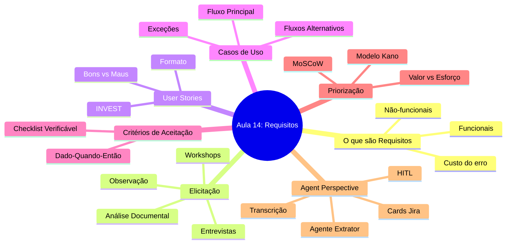
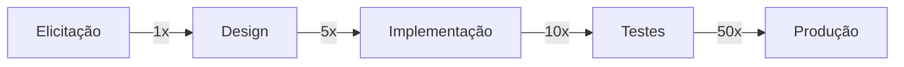
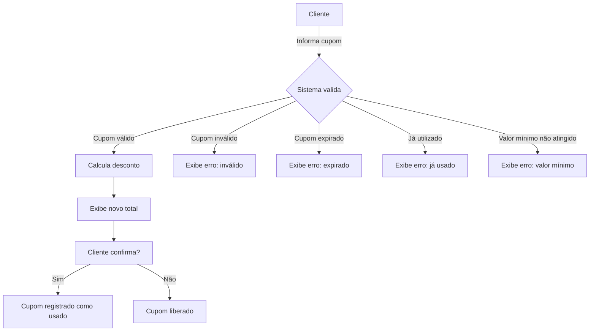
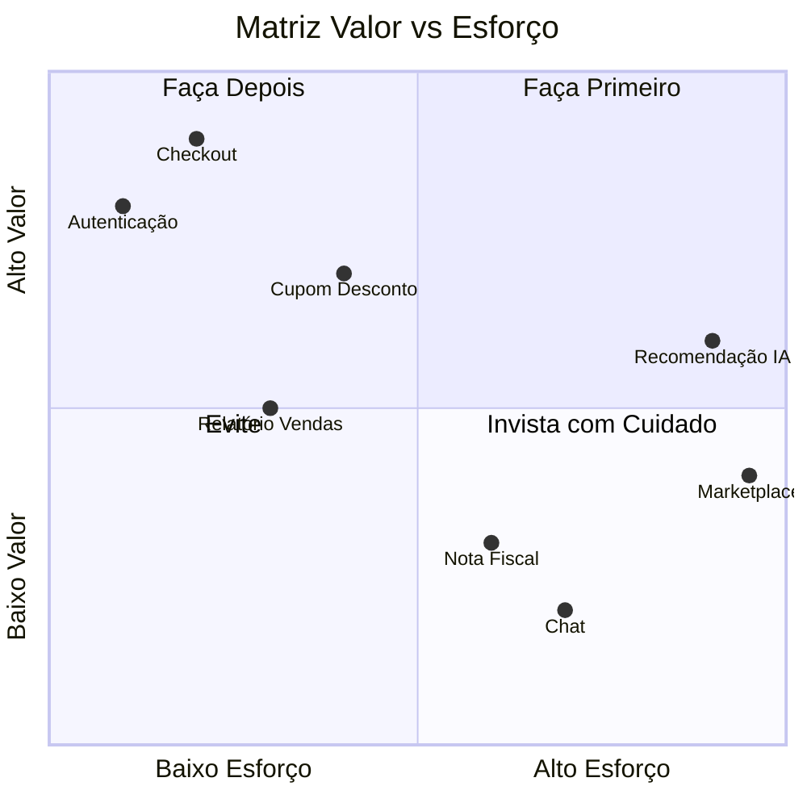
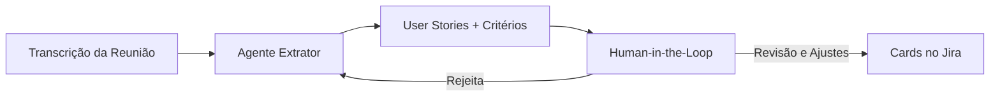

# Engenharia de Software — Aula 14

## Engenharia de Requisitos: Elicitação, User Stories e o Pipeline Agêntico

**Duração estimada:** 95 minutos (50 de leitura + 45 de prática)

**Nível:** Intermediário

**Pré-requisitos:** Aulas 01 a 13 (Clean Code, SOLID, Design Patterns, DDD, Clean Architecture)

---

## Objetivos de Aprendizagem

Ao final desta aula, você será capaz de:

- [ ] **Distinguir** requisitos funcionais de não-funcionais com exemplos concretos do e-commerce
- [ ] **Explicar** por que o custo de corrigir um requisito errado cresce exponencialmente ao longo do ciclo de vida
- [ ] **Aplicar** pelo menos 3 técnicas de elicitação de requisitos (entrevista, workshop, análise documental)
- [ ] **Escrever** User Stories no formato "Como [ator], quero [ação] para [benefício]" seguindo o critério INVEST
- [ ] **Modelar** Casos de Uso com fluxo principal, fluxos alternativos e exceções
- [ ] **Definir** critérios de aceitação no formato Dado-Quando-Então para cada User Story
- [ ] **Priorizar** requisitos usando MoSCoW e uma matriz valor vs esforço
- [ ] **Extrair** requisitos de uma transcrição de reunião usando um agente de IA
- [ ] **Revisar** e ajustar cards de requisitos gerados por agente (HITL — Human-in-the-Loop)
- [ ] **Documentar** 5 User Stories para o módulo de checkout do e-commerce com critérios de aceitação

---

## Como Usar Esta Aula

Esta aula marca a transição da **arquitetura** (Aula 13) para a **especificação**: como descobrir, documentar e priorizar o que o sistema deve fazer — antes de escrever uma linha de código.

A primeira metade é conceitual: o que são requisitos, como eliciá-los, como escrever User Stories e modelar Casos de Uso. A segunda metade é aplicada: você vai escrever critérios de aceitação, priorizar features do e-commerce e experimentar um pipeline onde um agente de IA extrai requisitos de uma conversa e gera cards prontos.

Ao longo do caminho, você encontrará seções **Quick Check** (para verificar se entendeu antes de avançar). Ao final, o arquivo separado **Questões de Aprendizagem** traz as tarefas de checkpoint — só avance para a próxima aula quando conseguir completá-las por conta própria.

**Tempo estimado:** 50 minutos de leitura + 45 minutos de prática.

---

## Mapa Mental




---

## Recapitulação: Aulas 01 a 13

Antes de mergulhar em requisitos, veja o caminho percorrido até aqui:

| Aula | Tema | O que você construiu |
|---|---|---|
| 01 | Introdução à Engenharia de Software | Setup do projeto e endpoints iniciais |
| 02 | Clean Code: Nomes, Funções, Estrutura | Refatoração do controller com nomes expressivos |
| 03 | Refatoração: Cheiros e Técnicas | Extração de métodos, eliminação de duplicação |
| 04 | SOLID: SRP, OCP | Separação de responsabilidades no OrderController |
| 05 | SOLID: LSP, ISP, DIP | Interfaces segregadas e injeção de dependência |
| 06 | GoF Criacionais | Factory, Builder, Singleton para criação de pedidos |
| 07 | GoF Estruturais | Adapter, Facade para integração com gateways |
| 08 | GoF Comportamentais | Strategy, Observer para regras de frete |
| 09 | Design Patterns Web/React | Componentes, hooks patterns, API service layer |
| 10 | DDD Estratégico | Linguagem ubíqua, bounded contexts, eventos |
| 11 | DDD Tático | Entidades, Value Objects, Agregados, Repositórios |
| 12 | Arquitetura: Estilos e Decisões | C4 diagrams + ADRs |
| 13 | Clean Architecture na Prática | 4 camadas (domain/application/infrastructure/interface) |

O projeto de e-commerce tem hoje uma **Clean Architecture funcional** com 4 camadas, injeção de dependência e testes de arquitetura. O que falta é a **especificação precisa** do que cada parte do sistema deve fazer — e é exatamente isso que esta aula entrega.

---

## FUNDAMENTOS: Elicitação, Análise e Especificação de Requisitos

> *"O bug mais caro não está no código — está no requisito que ninguém entendeu direito."*

As próximas quatro seções formam o alicerce conceitual da engenharia de requisitos. Você vai aprender o que são requisitos, como descobri-los, como documentá-los no formato certo e como escolher entre User Stories e Casos de Uso.

Nenhum nome de produto, ferramenta ou tecnologia específica será mencionado aqui — apenas conceitos universais. A aplicação concreta vem na segunda metade.

---

## 1. O que são Requisitos

Um **requisito** é uma capacidade ou condição que o sistema deve atender. Pode ser uma funcionalidade ("o sistema deve permitir pagamento com cartão de crédito") ou uma restrição ("o sistema deve processar 100 transações por segundo").

### Funcionais vs Não-Funcionais

| Tipo | O que descreve | Exemplo no e-commerce |
|---|---|---|
| **Funcional** | O que o sistema FAZ | "O cliente pode aplicar um cupom de desconto no checkout" |
| **Não-funcional** | COMO o sistema faz | "O checkout deve responder em menos de 2 segundos com 1000 usuários simultâneos" |

Requisitos não-funcionais também são chamados de **atributos de qualidade** ou *ilidades* — você viu eles na Aula 12: desempenho, segurança, disponibilidade, testabilidade.

### O Custo de um Requisito Ruim

O custo de corrigir um requisito errado cresce **exponencialmente** ao longo do ciclo de vida:



**O que é:** A curva de amplificação do custo de correção de um requisito. Quanto mais tarde o erro é descoberto, mais caro fica.

**Por que importa:** Um requisito mal interpretado na elicitação custa 1 unidade para corrigir ali. Se descoberto em produção, custa 50x mais — porque você já implementou, testou e deployou a feature errada.

**Como se faz:** Invista tempo na especificação antes de implementar. Uma hora de revisão de requisitos pode economizar semanas de retrabalho.

> *"Construir a coisa certa" (requirements) é diferente de "construir certo a coisa" (engineering). O primeiro erro é o mais caro.*

### Exemplo: Feature "Checkout com Cupom de Desconto"

Imagine que o Product Owner diz: "Quero que o cliente possa usar um cupom de desconto".

**Sem engenharia de requisitos:**
- O desenvolvedor implementa um campo de texto "Cupom" no checkout
- O cliente digita "BLACK20" e o sistema aplica 20% de desconto
- **Problema:** cupom expirado? Já usado? Valor mínimo? Acumula com outras promoções? Nada disso foi especificado

**Com engenharia de requisitos:**
- Requisito funcional: "O sistema deve permitir que o cliente aplique um cupom de desconto no checkout, desde que o cupom seja válido, não expirado e não tenha sido usado anteriormente"
- Requisito não-funcional: "A validação do cupom deve ocorrer em menos de 500ms"

Percebe a diferença? A segunda versão elimina ambiguidade antes de uma linha de código ser escrita.

### Quick Check 1

**1. Qual a diferença entre requisito funcional e não-funcional?**
**Resposta:** Funcional descreve o que o sistema faz (uma ação, um comportamento). Não-funcional descreve como o sistema faz — restrições de desempenho, segurança, disponibilidade.

**2. Por que um requisito mal interpretado na elicitação custa mais caro se descoberto em produção?**
**Resposta:** Porque você já implementou, testou e deployou a feature errada. Corrigir o requisito exige refazer todo o ciclo — o custo multiplica a cada etapa.

---

## 2. Técnicas de Elicitação

Elicitação é o processo de **descobrir** os requisitos — não de "coletar" como se fossem objetos prontos. Os stakeholders raramente sabem exatamente o que querem, e o que dizem nem sempre é o que precisam.

### O Triângulo da Elicitação

```
          [O que o cliente DIZ]
                /\
               /  \
              /    \
             /______\
[O que ele QUER]    [O que ele PRECISA]
```

**O que é:** Os três vértices raramente coincidem. O cliente diz "quero um botão de exportar", quer "ver os dados no Excel" e precisa de "um relatório agendado que chega por email toda semana".

**Por que importa:** Se você implementar o que o cliente diz sem investigar, entrega a ferramenta errada.

**Como se faz:** Use múltiplas técnicas de elicitação para cruzar perspectivas e chegar mais perto do que o cliente realmente precisa.

### Técnicas Principais

**1. Entrevistas com Stakeholders**

Conversas estruturadas (ou semi-estruturadas) com perguntas abertas: "Conte-me como você faz isso hoje?", "O que te frustra no processo atual?", "Se você pudesse mudar uma coisa, o que seria?".

No e-commerce: entrevistar o gerente de operações sobre como o cálculo de frete funciona hoje — "Você consulta uma tabela? Um site? Uma planilha?".

**2. Workshops de Requisitos**

Sessões com múltiplos stakeholders simultaneamente. O conflito é produtivo — quando o financeiro diz "desconto máximo 10%" e o marketing diz "promoção de 50%", o workshop força o alinhamento.

Exemplo: workshop para a feature "Checkout com Cupom" com participação de:
- **Product Owner:** define regras de negócio
- **Financeiro:** define limites de desconto e impacto fiscal
- **Marketing:** define campanhas e prazos promocionais
- **Desenvolvedor:** aponta restrições técnicas e viabilidade

**3. Observação e Etnografia**

Observar o usuário executando a tarefa no ambiente real. O que ele faz, quais atalhos usa, onde ele erra.

No e-commerce: observar um operador de logística processando devoluções — "ele abre 3 sistemas diferentes e copia dados manualmente de um para outro".

**4. Análise de Documentos e Sistemas Legados**

Estudar documentação existente, relatórios, planilhas, sistemas antigos. O sistema legado contém regras de negócio que ninguém mais lembra.

No e-commerce: a planilha de "regras de frete" que o analista mantém há 5 anos — é a especificação real, mesmo que não esteja formalizada em nenhum documento oficial.

### Dica Prática

Nunca use **uma** técnica só. Entrevista sem observação perde o contexto real. Workshop sem análise documental repete erros do passado. O ideal é combinar pelo menos 3 técnicas para cada feature crítica.

### Quick Check 2

**1. Por que o triângulo da elicitação mostra que o que o cliente DIZ, QUER e PRECISA raramente são a mesma coisa?**
**Resposta:** Porque o cliente expressa soluções intuitivas (DIZ), deseja resultados (QUER) e precisa de necessidades reais que ele mesmo não mapeou (PRECISA). A elicitação investiga os três vértices.

**2. Cite 3 técnicas de elicitação e quando usar cada uma.**
**Resposta:** Entrevistas (descobrir expectativas individuais), Workshops (alinhar múltiplos stakeholders com visões conflitantes), Observação (entender o que o usuário realmente faz vs o que ele diz que faz).

---

## 3. User Stories

Uma **User Story** é a menor unidade de valor que pode ser entregue ao usuário. Não é um documento detalhado — é um **lembrete para conversa** entre o time de desenvolvimento e o stakeholder.

### Formato "Como... Quero... Para..."

```
Como [ator ou papel do usuário],
quero [ação ou funcionalidade],
para [benefício ou motivo].
```

**Exemplo:**

*"Como **cliente**, quero **aplicar um cupom de desconto no checkout** para **obter abatimento no valor total do pedido**."*

Cada parte do formato responde uma pergunta:
- **ATOR:** quem se beneficia? (cliente, admin, operador logístico)
- **AÇÃO:** o que o sistema deve permitir? (aplicar cupom, cancelar pedido, emitir nota)
- **BENEFÍCIO:** qual o valor entregue? (economizar dinheiro, corrigir erro, cumprir obrigação fiscal)

### Bons vs Maus Exemplos

| ❌ Mau Exemplo | Problema | ✅ Bom Exemplo |
|---|---|---|
| "O sistema deve ter validação de cupom" | Genérico, sem ator ou benefício | "Como cliente, quero validar meu cupom antes de finalizar a compra para saber se o desconto foi aplicado corretamente" |
| "Como admin, quero gerenciar cupons" | "Gerenciar" é vago — CRUD? Importar? Desativar? | "Como admin, quero criar cupons de desconto com prazo de validade e limite de usos para controlar campanhas promocionais" |
| "Como sistema, quero processar pagamento" | Ator não é o sistema — o sistema é o meio | "Como cliente, quero pagar com cartão de crédito no checkout para concluir minha compra" |

### Critério INVEST

Uma boa User Story deve ser:

| Letra | Critério | Significado |
|---|---|---|
| **I** | *Independent* | Pode ser desenvolvida em qualquer ordem |
| **N** | *Negotiable* | Detalhes podem ser ajustados na conversa |
| **V** | *Valuable* | Entrega valor real ao usuário |
| **E** | *Estimable* | Dá para estimar esforço com confiança |
| **S** | *Small* | Cabe em uma sprint (ou menos) |
| **T** | *Testable* | Critérios de aceitação verificáveis |

**Pegadinha comum:** "Como cliente, quero um sistema rápido" — isso não é uma User Story. É um requisito não-funcional. Não é testável no formato de story. Vá para os critérios de aceitação ou para o backlog técnico.

### User Stories não são especificações completas

Uma User Story é o **título** de uma conversa. Os detalhes — regras, validações, exceções — são capturados nos **critérios de aceitação** (seção 5). A história é pequena de propósito: força o time a conversar com o stakeholder em vez de tentar documentar tudo antecipadamente.

### Quick Check 3

**1. Quais são as três partes do formato "Como... Quero... Para..." e o que cada uma responde?**
**Resposta:** Ator (quem se beneficia?), Ação (o que o sistema permite fazer?), Benefício (qual o valor entregue?).

**2. Por que "Como admin, quero gerenciar cupons" é uma User Story mal escrita?**
**Resposta:** "Gerenciar" é genérico demais — pode significar criar, editar, listar, desativar, importar. Não é Small nem Testable (critérios INVEST). Deve ser decomposta em histórias específicas como "criar cupom", "listar cupons ativos", "desativar cupom expirado".

**3. User Story substitui documentação de requisitos?**
**Resposta:** Não. User Story é um lembrete para conversa. Os detalhes ficam nos critérios de aceitação e nos Casos de Uso quando necessário. A história é pequena justamente para forçar o diálogo contínuo.

---

## 4. Casos de Uso

**Casos de Uso** descrevem uma interação completa entre um ator (humano ou sistema) e o sistema sob análise. São mais detalhados que User Stories e descrevem fluxos completos, incluindo variações e erros.

### Quando Usar User Stories vs Casos de Uso

| Cenário | Melhor Formato |
|---|---|
| Feature simples, bem compreendida | User Story |
| Feature com múltiplos fluxos e exceções | Caso de Uso |
| Time precisa estimar rapidamente | User Story |
| Especificação formal para compliance ou contrato | Caso de Uso |
| Descoberta inicial, ainda incerta | User Story |
| Documentação para auditoria | Caso de Uso |

**Regra prática:** User Stories para planejamento e priorização. Casos de Uso para detalhamento de features complexas. Ambos coexistem.

### Estrutura de um Caso de Uso

**Nome:** Aplicar Cupom de Desconto

**Ator Principal:** Cliente

**Pré-condições:**
- Cliente está autenticado
- Cliente tem itens no carrinho
- Carrinho ainda não foi finalizado

**Fluxo Principal:**
1. Cliente informa o código do cupom no campo "Cupom de Desconto"
2. Sistema valida o formato do código (alfanumérico, 5-20 caracteres)
3. Sistema verifica se o cupom existe e está ativo
4. Sistema verifica se o cupom não expirou
5. Sistema verifica se o cupom não foi usado pelo cliente anteriormente
6. Sistema verifica se o valor mínimo do pedido foi atingido
7. Sistema calcula o desconto (percentual ou valor fixo)
8. Sistema exibe o novo total com desconto aplicado
9. Sistema registra o cupom como "utilizado" para este cliente

**Pós-condições:**
- O total do pedido é recalculado com o desconto
- O cupom fica marcado como utilizado para o cliente

**Fluxo Alternativo (A): cupom inválido ou expirado**
- A1. No passo 3, se o cupom não existe ou está inativo: exibir "Cupom inválido"
- A2. No passo 4, se o cupom expirou: exibir "Cupom expirado"
- A3. No passo 5, se o cupom já foi usado: exibir "Cupom já utilizado"
- A4. No passo 6, se valor mínimo não foi atingido: exibir "Valor mínimo não atingido"

**Fluxo de Exceção (E): falha na validação do formato**
- E1. Se o código tem caracteres inválidos: exibir "Formato de cupom inválido"
- E2. Se o código é muito curto (<5 caracteres): exibir "Código muito curto"

### Diagrama de Caso de Uso



**O que é:** Diagrama de decisão do caso de uso "Aplicar Cupom de Desconto". Cada ramo representa um fluxo — principal, alternativo ou exceção.

**Por que importa:** Visualizar os fluxos revela caminhos que o texto pode esconder. Reparou que o fluxo 9 (registrar cupom) só ocorre se o cliente CONFIRMAR o pedido? Esse detalhe não estava no fluxo principal inicial.

**Como se faz:** Mapeie o fluxo principal primeiro. Depois adicione cada variação como um ramo. O diagrama não substitui o texto — complementa.

### Quick Check 4

**1. Quando usar Caso de Uso em vez de User Story?**
**Resposta:** Quando a feature tem múltiplos fluxos alternativos, exceções complexas ou precisa de especificação formal para compliance/contrato. User Stories são melhores para planejamento e features simples.

**2. Quais são as partes principais de um Caso de Uso?**
**Resposta:** Nome, Ator Principal, Pré-condições, Fluxo Principal, Fluxos Alternativos, Fluxos de Exceção, Pós-condições.

**3. Por que o diagrama de fluxo revelou um detalhe que o texto não capturou?**
**Resposta:** Porque visualizar os ramos mostra que o cupom só deve ser registrado como "utilizado" quando o cliente CONFIRMA o pedido — se ele desistir, o cupom deve ser liberado. No fluxo principal textual, o passo 9 ("registra como utilizado") estava antes da confirmação final.

---

## APLICAÇÃO: Workshop de Requisitos do E-commerce + Pipeline Agêntico

> *Agora que você entende os fundamentos — requisitos, elicitação, User Stories e Casos de Uso — vamos aplicá-los ao projeto de e-commerce e experimentar um pipeline onde um agente de IA acelera a extração de requisitos.*

**Nesta parte, nomes de ferramentas e produtos são permitidos.** Vamos usar o contexto real do e-commerce e demonstrar o fluxo com agentes de IA.

---

## 5. Critérios de Aceitação

Critérios de aceitação são uma **lista de verificação** que define quando uma User Story está "pronta". Eles transformam a conversa (a User Story) em condições objetivas e testáveis.

### Formato Dado-Quando-Então

O formato mais comum é baseado em **BDD** (Behavior-Driven Development), que você vai aprofundar na Aula 15:

```
Dado [contexto inicial],
Quando [ação do ator],
Então [resultado esperado].
```

### Exemplo: 5 Critérios para "Aplicar Cupom de Desconto"

**User Story:** "Como cliente, quero aplicar um cupom de desconto no checkout para obter abatimento no valor total do pedido."

**Critério 1 — Cupom válido:**
- **Dado** que o carrinho tem 3 itens totalizando R$ 300
- **E** que o cupom "BLACK20" é válido, não expirou e desconta 20%
- **Quando** o cliente informa "BLACK20" no campo de cupom
- **Então** o total do pedido é recalculado para R$ 240
- **E** a mensagem "Cupom aplicado: -R$ 60,00" é exibida

**Critério 2 — Cupom expirado:**
- **Dado** que o cupom "BLACK20" está expirado
- **Quando** o cliente informa "BLACK20"
- **Então** o sistema exibe a mensagem "Cupom expirado"
- **E** o total do pedido permanece inalterado

**Critério 3 — Cupom já utilizado:**
- **Dado** que o cliente já utilizou o cupom "BLACK20" em um pedido anterior
- **Quando** o cliente informa "BLACK20"
- **Então** o sistema exibe "Cupom já utilizado neste pedido ou em pedido anterior"
- **E** o total permanece inalterado

**Critério 4 — Valor mínimo não atingido:**
- **Dado** que o cupom "FRETE10" exige valor mínimo de R$ 100
- **E** que o carrinho totaliza R$ 50
- **Quando** o cliente informa "FRETE10"
- **Então** o sistema exibe "Valor mínimo de R$ 100 não atingido"
- **E** o total permanece inalterado

**Critério 5 — Cupom percentual com teto:**
- **Dado** que o cupom "MAX50" tem desconto de 20% com teto de R$ 50
- **E** que o carrinho totaliza R$ 500 (20% = R$ 100, teto = R$ 50)
- **Quando** o cliente informa "MAX50"
- **Então** o desconto aplicado é R$ 50 (limitado pelo teto)
- **E** o total é recalculado para R$ 450

### O que torna um bom critério de aceitação

- **Verificável:** qualquer pessoa (PO, dev, QA) consegue executar o teste mental
- **Automatizável:** pode ser transformado em um teste automatizado (Aula 15-16)
- **Sem ambiguidade:** "desconto de 20%" não é "desconto generoso"
- **Específico:** valores concretos, não faixas abstratas

> *Critério de aceitação não é documento morto. É o contrato entre o PO e o time: "se passar nestes testes, a story está pronta".*

### Quick Check 5

**1. Qual o formato recomendado para critérios de aceitação e quais são suas três partes?**
**Resposta:** Dado-Quando-Então. Dado = contexto inicial. Quando = ação do ator. Então = resultado esperado.

**2. Por que o critério 5 (teto de desconto) é importante mesmo sendo um caso de borda?**
**Resposta:** Porque sem ele, o sistema aplicaria 20% sobre R$ 500 = R$ 100 de desconto, ultrapassando o teto de R$ 50 definido pela campanha. O critério explicita uma regra de negócio que, se não documentada, geraria prejuízo.

---

## 6. Priorização de Requisitos

Você jamais vai implementar tudo o que foi elicitado. Recursos são finitos. Priorização é a arte de decidir **o que fazer primeiro** com base em critérios objetivos, não na opinião de quem grita mais alto.

### Técnica MoSCoW

| Categoria | Significado | Exemplo no MVP do e-commerce |
|---|---|---|
| **M** — *Must have* | Essencial para o lançamento | Checkout, pagamento, carrinho |
| **S** — *Should have* | Importante, mas não crítico | Cupom de desconto, histórico de pedidos |
| **C** — *Could have* | Desejável, valor adicional | Recomendação de produtos, lista de desejos |
| **W** — *Won't have* | Explicitamente fora do escopo agora | Marketplace, programa de fidelidade |

### Matriz Valor vs Esforço

Outra forma de priorizar é cruzar o **valor de negócio** com o **esforço técnico**:



**O que é:** Matriz 2x2 que posiciona cada feature pelo binômio valor-esforço.

**Por que importa:** Features no quadrante "Faça Primeiro" (alto valor, baixo esforço) são óbvias — checkout, autenticação. Features no quadrante "Invista com Cuidado" (alto valor, alto esforço) precisam de validação antes de começar — recomendação com IA. Features em "Evite" (baixo valor, alto esforço) são armadilhas — chat, relatórios complexos.

**Como se faz:** Reúna o time, liste features, vote em valor (1-5) e esforço (1-5), calcule a média, plote no gráfico.

### Modelo Kano

O modelo Kano classifica requisitos em três categorias:

| Categoria | Descrição | Exemplo |
|---|---|---|
| **Básico** | O cliente nem menciona, mas se faltar, ele fica insatisfeito | Segurança no pagamento, tempo de resposta aceitável |
| **Performance** | Quanto mais, melhor | Velocidade do checkout, número de meios de pagamento |
| **Encantador** | O cliente não espera, mas se tiver, ele encanta | Sugestão inteligente de cupom no momento certo |

> *Não invista em encantadores enquanto os básicos não estiverem resolvidos. Um checkout que demora 10 segundos não é compensado por uma sugestão inteligente de cupom.*

### Quick Check 6

**1. O que significa cada letra do MoSCoW?**
**Resposta:** Must have (essencial), Should have (importante), Could have (desejável), Won't have (fora do escopo agora).

**2. Em qual quadrante da matriz valor vs esforço uma feature de alto valor e baixo esforço se encontra?**
**Resposta:** "Faça Primeiro" (quadrante superior esquerdo — alto valor, baixo esforço).

**3. Por que, segundo o modelo Kano, você não deve investir em features encantadoras antes de resolver as básicas?**
**Resposta:** Porque features básicas são a expectativa mínima. Um sistema que falha no básico gera insatisfação que nenhum encantador compensa.

---

## 7. 🤖 Agent Perspective: Pipeline Agêntico de Extração de Requisitos

Até aqui, você fez tudo manualmente: elicitou, escreveu User Stories, definiu critérios. Agora vamos adicionar um **amplificador**: um agente de IA que recebe uma transcrição de reunião e extrai requisitos estruturados.

> *O agente não substitui o Product Owner nem o analista de requisitos. Ele acelera a etapa de detalhamento — transformando uma conversa informal em cards prontos para revisão.*

### O Pipeline



**O que é:** Fluxo de 4 etapas: (1) gravação da conversa com o PO, (2) agente extrai requisitos da transcrição, (3) gera User Stories com critérios de aceitação, (4) humano revisa, ajusta e aprova antes de criar os cards.

**Por que importa:** A etapa de "transcrever conversa → estruturar requisitos" é mecânica e repetitiva. O agente faz em segundos o que levaria horas de análise manual. O humano mantém o poder de decisão.

**Como se faz:** Grave a reunião, transcreva (ou use uma ferramenta de transcrição automática), passe o texto para o agente com um prompt bem estruturado, revise o output.

### Exemplo Concreto: Transcrição do PO sobre Checkout

**Contexto:** O Product Owner do e-commerce participou de um workshop de elicitação. Abaixo está um trecho da transcrição:

```
PO: "A gente precisa de um sistema de cashback. O cliente compra, e 
volta um percentual do valor como crédito para a próxima compra."

DEV: "Qual percentual?"
PO: "5% padrão, mas em campanhas pode ser mais. A Black Friday pode 
ter cashback de 10% em categorias selecionadas."

DEV: "E como o cliente usa esse crédito?"
PO: "No checkout, ele vê o saldo de cashback disponível e pode optar 
por usar. Pode usar parcial ou total. Mas não acumula com cupom de 
desconto — é um ou outro."

DEV: "O cashback expira?"
PO: "60 dias após a compra. Se não usar, perde. E precisa de um valor 
mínimo de pedido de R$ 50 para gerar cashback."

DEV: "E se o pedido for cancelado?"
PO: "Aí o cashback gerado naquele pedido é estornado também. Óbvio."
```

### Prompt do Agente

```markdown
Você é um analista de requisitos especializado em e-commerce.
A partir da transcrição abaixo, extraia:

1. User Stories no formato "Como [ator], quero [ação] para [benefício]"
2. Critérios de aceitação no formato Dado-Quando-Então para cada story
3. Regras de negócio identificadas
4. Perguntas pendentes que precisam de esclarecimento do PO

Use INVEST como critério de qualidade. Se uma story for grande demais,
decomponha em stories menores.

TRANSCRIÇÃO:
[texto da transcrição acima]
```

### Output do Agente

```markdown
## User Stories Extraídas

### US-01: Acumular cashback na compra
**Como** cliente,
**quero** acumular cashback de 5% sobre o valor dos meus pedidos,
**para** obter crédito para compras futuras.

**Critérios de Aceitação:**

**C1 — Cashback padrão:**
- Dado que o pedido totaliza R$ 200 em produtos elegíveis
- E que a taxa de cashback padrão é 5%
- Quando o pedido é confirmado e pago
- Então o cliente recebe R$ 10 em crédito cashback

**C2 — Cashback promocional (categoria selecionada):**
- Dado que o pedido contém apenas itens da categoria "Eletrônicos"
- E que a campanha Black Friday define cashback de 10% para esta categoria
- Quando o pedido é confirmado
- Então o cashback é calculado a 10% em vez de 5%

**C3 — Valor mínimo não atingido:**
- Dado que o pedido totaliza R$ 30
- Quando o pedido é finalizado
- Então nenhum cashback é gerado
- E o cliente é informado que o valor mínimo é R$ 50

### US-02: Utilizar cashback no checkout
**Como** cliente,
**quero** usar meu saldo de cashback como forma de pagamento no checkout,
**para** reduzir o valor a pagar.

**Critérios de Aceitação:**

**C1 — Uso parcial do saldo:**
- Dado que o cliente tem R$ 50 de cashback disponível
- E que o pedido totaliza R$ 200
- Quando o cliente opta por usar R$ 30 de cashback
- Então o total a pagar é R$ 170
- E o saldo restante é R$ 20

**C2 — Cashback não acumula com cupom:**
- Dado que o cliente tem R$ 50 de cashback
- E que já aplicou um cupom de 10% no pedido
- Quando o cliente tenta adicionar cashback
- Então o sistema exige remover o cupom primeiro
- E vice-versa: se cashback já foi aplicado, não permite cupom

### US-03: Consultar saldo e expiração de cashback
**Como** cliente,
**quero** consultar meu saldo de cashback e saber quando expira,
**para** planejar minhas próximas compras.

**Critérios de Aceitação:**

**C1 — Exibição de saldo:**
- Dado que o cliente tem cashback ativo
- Quando ele acessa a página "Meus Créditos"
- Então o saldo total, o histórico de transações e as datas de expiração são exibidos

**C2 — Cashback expirado:**
- Dado que o cashback tem validade de 60 dias
- E que 61 dias se passaram desde a compra que gerou o crédito
- Quando o cliente consulta o saldo
- Então aquele crédito não aparece mais no saldo disponível

## Regras de Negócio Identificadas

1. Taxa padrão de cashback: 5%
2. Campanhas podem definir taxas maiores para categorias específicas
3. Cashback não acumula com cupom de desconto (exclusão mútua)
4. Valor mínimo do pedido para gerar cashback: R$ 50
5. Validade do cashback: 60 dias após a compra
6. Cancelamento do pedido estorna o cashback gerado

## Perguntas Pendentes

1. O cashback incide sobre o valor total ou sobre o valor líquido (após descontos)?
2. O cashback é gerado na confirmação do pagamento ou na finalização do pedido?
3. Produtos digitais geram cashback?
4. Existe limite máximo de cashback por pedido?
```

### Human-in-the-Loop (HITL)

O desenvolvedor ou analista de requisitos **revisa** o output do agente e:

1. **Ajusta** stories mal escritas (o agente às vezes inventa detalhes)
2. **Completa** critérios faltantes (o agente não conhece regras implícitas)
3. **Remove** duplicações ou stories desnecessárias
4. **Prioriza** usando MoSCoW (ex: US-02 é Must have, US-03 é Should have)
5. **Cria os cards** no Jira (ou na ferramenta de gestão)

No exemplo acima, o revisor humano notaria que:
- O critério "cashback não acumula com cupom" é uma **regra de negócio importante** que merece destaque
- A pergunta 1 ("cashback incide sobre valor total ou líquido?") precisa ser respondida antes de implementar
- Faltou um critério sobre **estorno de cashback em pedido cancelado** (a última fala do PO)

### Cards no Formato Jira

Após revisão, os cards no Jira teriam este formato:

**Card 1: US-02 — Utilizar cashback no checkout**
- Tipo: História
- Prioridade: Must have (MVP)
- Story Points: 8
- Descrição: "Como cliente, quero usar meu saldo de cashback como forma de pagamento..."
- Critérios de aceitação: [C1, C2, C3 revisados]
- Regras de negócio: [regras 1-6]
- Bloqueadores: [depende de US-01, depende de resposta do PO sobre pergunta 1]

**Card 2: US-01 — Acumular cashback**
- Tipo: História
- Prioridade: Must have (MVP)
- Story Points: 5
- Descrição: "Como cliente, quero acumular cashback..."

**Card 3: US-03 — Consultar saldo**
- Tipo: História
- Prioridade: Should have
- Story Points: 3
- Descrição: "Como cliente, quero consultar meu saldo..."

### Quick Check 7

**1. Qual o papel do humano no pipeline agêntico de requisitos?**
**Resposta:** Revisar, ajustar e aprovar o que o agente gerou. O agente acelera a extração, mas o humano mantém o poder de decisão — corrige imprecisões, adiciona regras implícitas, prioriza e cria os cards finais.

**2. Que pergunta pendente na transcrição do PO sobre cashback poderia bloquear a implementação?**
**Resposta:** "O cashback incide sobre o valor total ou líquido?" — se isso não for esclarecido, o desenvolvedor pode assumir uma regra diferente da esperada pelo negócio.

**3. Por que "cashback não acumula com cupom" apareceu como critério de aceitação e não como User Story separada?**
**Resposta:** Porque é uma regra que modifica o comportamento de duas stories existentes (US-01 e US-02), não uma funcionalidade independente. Faz sentido como critério dentro das stories afetadas.

---

## Autoavaliação: Quiz Rápido

**1. Qual a diferença entre requisito funcional e não-funcional?**
**Resposta:** Funcional descreve o que o sistema faz; não-funcional descreve como ele faz (desempenho, segurança, disponibilidade).

**2. O que significa o triângulo da elicitação?**
**Resposta:** O que o cliente DIZ, o que ele QUER e o que ele PRECISA raramente coincidem. A elicitação investiga os três vértices para chegar ao requisito real.

**3. Quais são as três partes do formato "Como... Quero... Para..."?**
**Resposta:** Ator (quem), Ação (o que), Benefício (por que).

**4. Quando usar Caso de Uso em vez de User Story?**
**Resposta:** Quando a feature tem fluxos alternativos complexos ou precisa de especificação formal para compliance. User Stories são para planejamento e features simples.

**5. Quais são as três partes do formato Dado-Quando-Então?**
**Resposta:** Dado (contexto), Quando (ação), Então (resultado esperado).

**6. O que significa cada letra do MoSCoW?**
**Resposta:** Must have, Should have, Could have, Won't have.

**7. Qual o papel do humano no pipeline agêntico de requisitos?**
**Resposta:** Revisar e aprovar o output do agente — ajustar imprecisões, adicionar regras implícitas e priorizar os cards gerados.

---

## Mão na Massa: Exercícios Graduados

**Exercício 1 (Fácil) — Classificando Requisitos**

Classifique cada item abaixo como **RF** (requisito funcional) ou **RNF** (requisito não-funcional):

a) "O sistema deve permitir pagamento via Pix"
b) "O checkout deve responder em menos de 2 segundos"
c) "O cliente pode cancelar o pedido em até 24h após a confirmação"
d) "O sistema deve suportar 1000 requisições simultâneas"
e) "O sistema deve registrar logs de todas as transações financeiras"

**Gabarito:**

a) RF — descreve uma ação que o sistema permite
b) RNF — descreve uma restrição de desempenho
c) RF — descreve uma ação permitida ao cliente
d) RNF — descreve uma restrição de capacidade
e) RF — descreve uma funcionalidade de registro (o que o sistema faz)

**Exercício 2 (Médio) — Escrevendo User Stories e Critérios**

Para a feature "Carrinho de Compras Persistente" (o carrinho do cliente não deve ser perdido se ele fechar o navegador), escreva:

a) Uma User Story no formato correto
b) Pelo menos 3 critérios de aceitação no formato Dado-Quando-Então

**Gabarito:**

**a) User Story:**
"Como cliente, quero que meu carrinho de compras seja salvo automaticamente para não perder os itens selecionados se eu fechar o navegador ou trocar de dispositivo."

**b) Critérios de aceitação:**

**C1 — Carrinho preservado ao fechar navegador:**
- Dado que o cliente adicionou 3 itens ao carrinho
- E que ele fechou o navegador sem finalizar a compra
- Quando ele abre o site novamente e faz login
- Então os 3 itens ainda estão no carrinho

**C2 — Carrinho sincronizado entre dispositivos:**
- Dado que o cliente adicionou itens ao carrinho no celular
- Quando ele faz login no computador
- Então os mesmos itens estão no carrinho

**C3 — Exclusão de itens fora de estoque:**
- Dado que o carrinho persistente contém um item que ficou indisponível
- Quando o cliente visualiza o carrinho
- Então o item é exibido como "indisponível"
- E o cliente pode removê-lo

**Desafio (Difícil) — Pipeline Agêntico: Extração de Requisitos de uma Conversa**

Você participou de uma reunião com o PO do e-commerce. Abaixo está a transcrição:

```
PO: "A gente precisa urgentemente de um sistema de avaliação de 
produtos. O cliente compra e pode avaliar o produto com nota de 1 a 
5 estrelas e um comentário opcional."

DEV: "Quanto tempo depois da compra?"
PO: "Até 30 dias após a entrega. Depois disso, não pode mais avaliar."

DEV: "E precisa ter comprado o produto para avaliar?"
PO: "Sim. Só comprou pode avaliar. E cada compra dá direito a uma 
avaliação — não pode avaliar o mesmo produto duas vezes na mesma 
compra."

DEV: "E as avaliações aparecem onde?"
PO: "Na página do produto. E a nota média calculada automaticamente. 
Ah, e o admin pode moderar: remover avaliação com conteúdo impróprio."

DEV: "Ordem de exibição?"
PO: "Mais recentes primeiro. E as avaliações com mais votos de 
'útil' aparecem destacadas."
```

Sua tarefa:

1. Extraia **2 User Stories** bem-formadas da transcrição
2. Escreva **pelo menos 2 critérios de aceitação** para cada story
3. Identifique **pelo menos 2 regras de negócio** implícitas
4. Liste **2 perguntas pendentes** que você faria ao PO antes de implementar

**Gabarito:**

**User Stories:**

**US-01: Avaliar produto comprado**
"Como cliente, quero avaliar produtos que comprei com nota e comentário para ajudar outros clientes a decidirem."

**US-02: Visualizar avaliações na página do produto**
"Como cliente, quero ver as avaliações de um produto na sua página para decidir se compro."

**Critérios de Aceitação:**

**US-01, C1 — Avaliação dentro do prazo:**
- Dado que o cliente comprou o produto e ele foi entregue há 15 dias
- Quando o cliente acessa a página do produto e clica em "Avaliar"
- Então o sistema permite registrar nota e comentário

**US-01, C2 — Prazo expirado:**
- Dado que o cliente comprou o produto e ele foi entregue há 45 dias
- Quando o cliente tenta avaliar
- Então o sistema exibe "Prazo de avaliação expirado (limite: 30 dias)"

**US-01, C3 — Uma avaliação por compra:**
- Dado que o cliente já avaliou este produto nesta compra
- Quando ele tenta avaliar novamente
- Então o sistema exibe "Você já avaliou este produto nesta compra"

**US-02, C1 — Ordenação por data:**
- Dado que um produto tem 10 avaliações
- Quando a página do produto é carregada
- Então as avaliações são exibidas da mais recente para a mais antiga

**US-02, C2 — Avaliação removida por moderação:**
- Dado que uma avaliação foi removida pelo admin
- Quando a página do produto é carregada
- Então aquela avaliação não aparece mais na listagem

**Regras de Negócio:**

1. Apenas clientes que compraram o produto podem avaliá-lo (autenticação + verificação de compra)
2. Cada compra dá direito a uma única avaliação por produto (controle de duplicidade)
3. Prazo máximo de 30 dias corridos após a entrega (não dias úteis)

**Perguntas Pendentes:**

1. A avaliação com nota 1 estrela sem comentário é permitida, ou comentário é obrigatório abaixo de uma certa nota?
2. O cliente pode editar ou remover a própria avaliação depois de publicada?

---

## Resumo da Aula

### Os 6 Conceitos Fundamentais

1. **Requisitos**: capacidades ou condições que o sistema deve atender — funcionais (o que faz) e não-funcionais (como faz)
2. **Elicitação**: descobrir requisitos usando múltiplas técnicas (entrevistas, workshops, observação, análise documental) — nunca uma só
3. **User Stories**: formato "Como [ator], quero [ação] para [benefício]" — lembretes para conversa, não especificações completas
4. **Casos de Uso**: descrição completa de interação com fluxos principal, alternativos e exceções — ideal para features complexas
5. **Critérios de Aceitação**: formato Dado-Quando-Então — checklist verificável que define quando uma story está pronta
6. **Priorização**: MoSCoW (Must/Should/Could/Won't), matriz valor vs esforço, modelo Kano

### O Que Você Construiu Hoje

- [ ] Distinguiu requisitos funcionais de não-funcionais com exemplos do e-commerce
- [ ] Conheceu 4 técnicas de elicitação e como combiná-las
- [ ] Escreveu User Stories no formato INVEST
- [ ] Modelou um Caso de Uso completo para aplicação de cupom
- [ ] Definiu 5 critérios de aceitação no formato Dado-Quando-Então
- [ ] Priorizou features do e-commerce usando MoSCoW e matriz valor vs esforço
- [ ] Experimentou o pipeline agêntico: transcrição → agente → User Stories → revisão HITL

---

## Próxima Aula

**Aula 15: SDD + BDD com Gherkin**

Você especificou requisitos com User Stories e critérios de aceitação. Agora vai transformá-los em **especificações executáveis**: cenários Gherkin (Given-When-Then) automatizados com Cucumber.js. E o agente vai gerar os step definitions para você.

---

## Referências

### Documentação Oficial

- [User Stories — Agile Alliance](https://www.agilealliance.org/glossary/user-stories/)
- [INVEST Criteria — XP Wiki](https://xp123.com/articles/invest-in-good-stories-and-story-tasks/)
- [Gherkin Reference — Cucumber](https://cucumber.io/docs/gherkin/reference/)
- [MoSCoW Prioritization — Agile Business](https://www.agilebusiness.org/page/ProjectFramework_10_MoSCoWPrioritisation)

### Livros

- COHN, Mike. **User Stories Applied: For Agile Software Development**. Addison-Wesley, 2004.
- COCKBURN, Alistair. **Writing Effective Use Cases**. Addison-Wesley, 2000.
- LEFTINGWELL, Dean; WIDRIG, Don. **Managing Software Requirements: A Use Case Approach**. 2nd ed. Addison-Wesley, 2003.
- ROBERTSON, Suzanne; ROBERTSON, James. **Mastering the Requirements Process**. 2nd ed. Addison-Wesley, 2006.

### Artigos para Aprofundamento

- [The Three Amigos (BDD) — Agile Alliance](https://www.agilealliance.org/glossary/three-amigos/)
- [Kano Model — ProductPlan](https://www.productplan.com/glossary/kano-model/)
- [User Stories vs Use Cases — Mountain Goat Software](https://www.mountaingoatsoftware.com/blog/advantages-of-user-stories-for-requirements)

### Ferramentas

- [Cucumber.js](https://github.com/cucumber/cucumber-js) — BDD framework para JavaScript
- [Jira](https://www.atlassian.com/software/jira) — gestão de projetos e cards
- [Miro](https://miro.com/) — workshops e mapas mentais colaborativos

---

## FAQ

**P: Engenharia de requisitos é papel só do analista de negócios?**
R: Não. Em times ágeis, todo mundo participa — o desenvolvedor ajuda a identificar inviabilidade técnica, o QA ajuda a pensar em cenários de borda, o PO define valor de negócio. Requisitos são responsabilidade do time, não de uma pessoa.

**P: User Story substitui documento de requisitos?**
R: Não. User Story é um lembrete para conversa. Os detalhes (regras, validações, exceções) ficam nos critérios de aceitação. Ambos coexistem com documentação mais formal quando necessário (compliance, contratos).

**P: Quantos critérios de aceitação uma User Story deve ter?**
R: Não há número mágico. Uma story simples pode ter 3-5 critérios. Uma story complexa pode ter 10+. O sinal de alerta é quando uma story precisa de mais de 10 critérios — talvez ela seja grande demais e precise ser decomposta.

**P: Devo escrever User Stories ou Casos de Uso?**
R: Ambos, em momentos diferentes. Use User Stories para planejamento (backlog, sprints) e Casos de Uso para detalhamento de features complexas. Stories são "o quê"; Casos de Uso são "como exatamente".

**P: O modelo Kano é subjetivo demais para usar na prática?**
R: Ele é qualitativo, mas útil como provocação. Se todo requisito for tratado como "performance", você nunca vai investingir em encantadores. Se todo requisito for "básico", você nunca sai do lugar. O valor do Kano é forçar a classificação consciente.

**P: O agente de IA pode substituir o Product Owner?**
R: Não. O agente acelera a extração e estruturação, mas não conhece o negócio, os stakeholders, as restrições políticas e o contexto organizacional. O PO continua sendo a autoridade sobre o que deve ser construído.

**P: Como saber se usei a técnica de elicitação certa?**
R: Você nunca sabe antes — por isso combina múltiplas técnicas. Se fizer entrevista + workshop + observação, o cruzamento das três perspectivas revela inconsistências que uma técnica isolada não revelaria.

**P: User Stories em português ou inglês?**
R: O idioma do time. Se o time fala português, as histórias devem estar em português — o benefício da história é a comunicação, e comunicação eficiente é no idioma nativo. O código (critérios automatizados) pode ficar em inglês por convenção técnica.

**P: O que fazer com histórias que não cabem em uma sprint?**
R: Decomponha. Uma história grande demais é um épico. Use os critérios INVEST como guia: se não é Small, divida em histórias menores que entreguem valor incremental. Exemplo: "Sistema de cashback" pode virar "acumular cashback", "usar cashback", "consultar saldo".

**P: RICE é melhor que MoSCoW?**
R: São complementares. MoSCoW é categórico (Must/Should/Could), RICE é numérico (Reach × Impact × Confidence / Effort). MoSCoW é mais rápido para usar em workshop. RICE é mais preciso para comparar itens de valor similar. Use os dois.

---

## Glossário

| Termo | Definição |
|---|---|
| **Requisito Funcional** | Capacidade ou ação que o sistema deve executar (Ver seção 1) |
| **Requisito Não-Funcional** | Restrição de qualidade ou desempenho do sistema (Ver seção 1) |
| **Elicitação** | Processo de descobrir requisitos através de técnicas como entrevistas e workshops (Ver seção 2) |
| **User Story** | Descrição concisa de uma funcionalidade no formato "Como..., quero..., para..." (Ver seção 3) |
| **INVEST** | Critério de qualidade para User Stories: *Independent, Negotiable, Valuable, Estimable, Small, Testable* (Ver seção 3) |
| **Caso de Uso** | Descrição completa de uma interação entre ator e sistema com fluxos e exceções (Ver seção 4) |
| **Critério de Aceitação** | Condição verificável no formato Dado-Quando-Então que define quando uma story está pronta (Ver seção 5) |
| **MoSCoW** | Técnica de priorização: *Must have, Should have, Could have, Won't have* (Ver seção 6) |
| **Modelo Kano** | Classificação de requisitos em Básicos, Performance e Encantadores (Ver seção 6) |
| **HITL** | *Human-in-the-Loop* — processo onde o humano revisa e valida a saída do agente antes de executar (Ver seção 7) |
| **Épico** | User Story grande demais para caber em uma sprint, precisa ser decomposta (Ver FAQ) |
