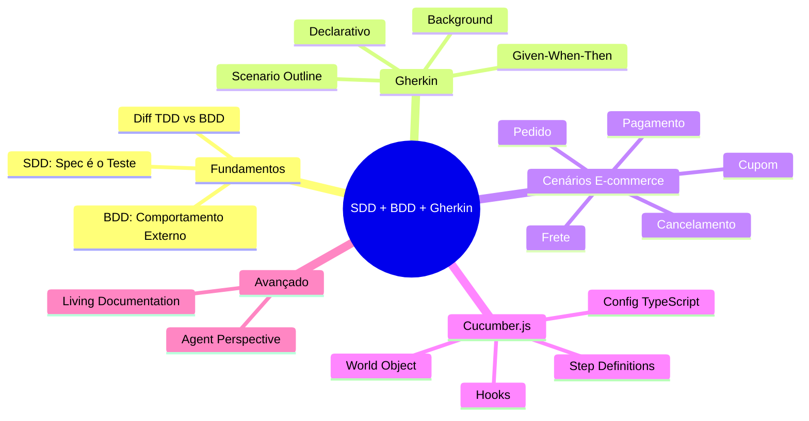

# Engenharia de Software — Aula 15

## SDD + BDD com Gherkin

**Duração estimada:** 100 minutos (55 de leitura + 45 de prática)

**Nível:** Intermediário

**Pré-requisitos:** Aulas 01 a 14 (especialmente Aula 14 — Engenharia de Requisitos)

---

## Objetivos de Aprendizagem

Ao final desta aula, você será capaz de:

- [ ] **Explicar** o que é Specification-Driven Development (SDD) e como ela difere de documentação tradicional
- [ ] **Distinguir** BDD de TDD: comportamento externo vs unidades internas
- [ ] **Escrever** cenários Gherkin usando as keywords Given, When, Then, And, But, Background e Scenario Outline
- [ ] **Aplicar** boas práticas de cenários declarativos (não imperativos) com um comportamento por cenário
- [ ] **Criar** 10 cenários Gherkin reais para as features do e-commerce
- [ ] **Configurar** Cucumber.js com TypeScript em um projeto Node.js
- [ ] **Implementar** step definitions que traduzem Gherkin para chamadas à API
- [ ] **Utilizar** World e Hooks (Before, After) para gerenciar estado compartilhado entre steps
- [ ] **Explicar** o conceito de Living Documentation e por que Gherkin é melhor que documentação estática
- [ ] **Descrever** como agentes de IA podem interpretar cenários Gherkin e gerar step definitions automaticamente

---

## Como Usar Esta Aula

Esta aula está organizada em duas partes. A **primeira parte** constrói a base conceitual de SDD, BDD e a linguagem Gherkin — entendendo por que especificação executável é mais confiável que documentação estática. A **segunda parte** aplica esses conceitos na prática com 10 cenários reais para o e-commerce, automação com Cucumber.js e geração de step definitions com auxílio de agentes.

Ao longo do caminho, você encontrará seções **"Mão na Massa"** (para fazer, não só ler) e **"Quick Check"** (para verificar se entendeu antes de avançar). Ao final, o arquivo separado **Questões de Aprendizagem** traz as tarefas de checkpoint — só avance para a próxima aula quando conseguir completá-las por conta própria.

**Tempo estimado:** 55 minutos de leitura + 45 minutos de prática.

## Mapa Mental

Este diagrama mostra todos os conceitos que você vai dominar nesta aula:




## Recapitulação da Aula 14

| Aula | Conceito | Onde aparece nesta aula | Como se conecta |
|---|---|---|---|
| Aula 14 | **User Stories e Critérios de Aceitação** (Seção 3) | Seções 1, 3 | Critérios de aceitação são a matéria-prima dos cenários Gherkin |
| Aula 14 | **Elicitação de Requisitos** (Seção 2) | Seção 1 | SDD formaliza a especificação como contrato executável |
| Aula 14 | **Casos de Uso** (Seção 4) | Seção 3 | Cenários Gherkin são casos de uso concretos e executáveis |
| Aula 14 | **🤖 Agent Perspective** (Seção 7) | Seção 7 | Agora o agente não só extrai requisitos — ele gera step definitions |

---

**FUNDAMENTOS: Especificação Executável como Contrato**

> *Os conceitos desta seção são universais — valem para qualquer linguagem, framework ou ferramenta de automação de testes. Aqui você vai entender por que uma especificação que executa vale mais que mil páginas de documentação. Na segunda parte, você verá como Cucumber.js materializa cada um desses conceitos.*

---

## 1. SDD — Specification-Driven Development

O que acontece quando a especificação do seu software **é** o teste?

Essa é a premissa do **Specification-Driven Development (SDD)**. Em vez de escrever documentos que descrevem o que o sistema deve fazer e depois escrever testes separados que verificam se ele faz, você **unifica os dois**: a especificação é executável.

### Por que SDD importa

Documentos de especificação tradicionais têm um problema fundamental: eles **mentem**. Não intencionalmente — mas porque descrevem um estado ideal do sistema que, na prática, já mudou. O código foi alterado, o comportamento mudou, mas o documento nunca foi atualizado.

Com SDD, a especificação **quebra** se o comportamento mudar. Isso força a equipe a mantê-la sempre sincronizada com o código.

```
Documentação tradicional:
  [Escrita] → [Lida] → [Desatualizada] → [Ignorada]

Especificação executável (SDD):
  [Escrita] → [Automatizada] → [Executa a cada mudança] → [Sempre atualizada]
```

### A tríade da especificação executável

SDD se apoia em três pilares:

1. **Exemplos concretos**: em vez de "o sistema deve aplicar desconto", escreva "Dado um carrinho com R$ 300, Quando aplico o cupom BLACK20, Então o total é R$ 240"
2. **Automação**: esses exemplos são executados automaticamente contra o sistema real
3. **Contrato vivo**: se o comportamento mudar, o exemplo quebra — não tem like, não tem "vou atualizar depois"

### Quick Check 1

**1. Qual a diferença entre documentação tradicional e especificação executável?**
**Resposta:** Documentação tradicional descreve o que o sistema deveria fazer, mas fica desatualizada. Especificação executável é o teste em si — se o comportamento muda, ela quebra, forçando a atualização.

**2. Por que exemplos concretos são melhores que descrições abstratas em uma especificação?**
**Resposta:** Exemplos concretos eliminam ambiguidade. "Aplicar desconto" pode significar 10% ou 20%, percentual ou fixo, cumulativo ou não. "Dado um carrinho de R$ 300 com cupom BLACK20 de 20%, Então total é R$ 240" é inequívoco — todos entendem exatamente o mesmo comportamento.

---

## 2. BDD — Behavior-Driven Development

**Behavior-Driven Development (BDD)** é uma metodologia ágil que incentiva a colaboração entre desenvolvedores, QA e stakeholders de negócio para definir o comportamento do sistema antes de implementá-lo.

BDD não é sobre testes — é sobre **comunicação**. A ideia central é: se todos falam a mesma língua (exemplos concretos de comportamento), o entendimento compartilhado elimina retrabalho.

### Os Três Amigos

BDD introduz o conceito dos **Três Amigos** — três perspectivas que colaboram para definir cada cenário:

| Papel | O que pergunta | Exemplifica |
|---|---|---|
| **Negócio/PO** | "O que o sistema faz para gerar valor?" | O objetivo do cenário |
| **Desenvolvedor** | "Como isso será implementado?" | O funcionamento interno |
| **QA** | "O que pode quebrar?" | Edge cases e exceções |

Quando esses três sentam juntos para escrever cenários, o resultado elimina ambiguidades antes de uma linha de código ser escrita.

### BDD vs TDD

Uma confusão comum é achar que BDD e TDD são a mesma coisa. Eles são complementares, mas operam em níveis diferentes:

| Aspecto | TDD | BDD |
|---|---|---|
| **Foco** | Unidades internas (funções, classes, métodos) | Comportamento externo (features, cenários) |
| **Linguagem** | Linguagem de programação (assert, expect) | Linguagem natural (Given, When, Then) |
| **Público** | Desenvolvedores | Devs + QA + Negócio |
| **Cobertura** | Micro (testa a implementação) | Macro (testa o comportamento) |
| **Ciclo** | Red → Green → Refactor | Cenário → Step Definition → Implementação |

Pense assim: **TDD** garante que você construiu a coisa **do jeito certo**. **BDD** garante que você construiu **a coisa certa**.

```
TDD: "O método calculateDiscount retorna 20% quando o cupom é válido?"
BDD: "O cliente consegue aplicar um cupom de desconto ao finalizar a compra?"
```

### Quick Check 2

**1. Quem são os Três Amigos no BDD e qual o papel de cada um?**
**Resposta:** Negócio/PO (define o valor e objetivo do cenário), Desenvolvedor (pensa na implementação), QA (identifica edge cases e exceções). Juntos, eliminam ambiguidades antes da implementação.

**2. Qual a diferença fundamental entre BDD e TDD?**
**Resposta:** TDD testa unidades internas (funções, métodos) e é focado no desenvolvedor. BDD testa comportamento externo (features, cenários) e é escrito em linguagem natural para comunicação entre dev, QA e negócio. BDD responde "fizemos a coisa certa?"; TDD responde "fizemos do jeito certo?".

---

## 3. Gherkin — A Linguagem dos Cenários

**Gherkin** é a linguagem que o BDD usa para escrever cenários. Ela é estruturada mas legível por humanos — um PO consegue ler Gherkin sem saber programar, e o computador consegue executá-lo.

### Sintaxe Given-When-Then

A estrutura básica é simples:

```gherkin
Feature: Aplicação de Cupom de Desconto
  Como cliente do e-commerce
  Quero aplicar cupons de desconto ao meu pedido
  Para obter abatimento no valor total

  Scenario: Aplicar cupom percentual válido
    Given que o carrinho tem 3 itens totalizando R$ 300
    And o cupom "BLACK20" é um cupom percentual de 20% válido
    When o cliente aplica o cupom "BLACK20" ao carrinho
    Then o total do pedido deve ser R$ 240
    And o desconto aplicado deve ser R$ 60
```

Cada keyword tem um propósito específico:

| Keyword | Propósito |
|---|---|
| `Feature` | Agrupa cenários relacionados. Inclui descrição em formato livre |
| `Scenario` | Um exemplo concreto de comportamento |
| `Given` | Contexto inicial — o estado do sistema antes da ação |
| `When` | A ação do ator — o evento que dispara o comportamento |
| `Then` | O resultado esperado — o que deve ser verdade após a ação |
| `And` / `But` | Conectivos — adicionam mais condições ao Given, When ou Then |

### Keywords Avançadas

**Background**: contexto comum a todos os cenários de uma Feature.

```gherkin
Feature: Gestão de Pedidos

  Background:
    Given que o cliente "João" está logado
    And que o catálogo tem os produtos "Camiseta" (R$ 50) e "Calça" (R$ 100)

  Scenario: Criar pedido com sucesso
    When o cliente adiciona 2 "Camiseta" ao carrinho
    Then o carrinho deve ter 2 itens totalizando R$ 100
```

**Scenario Outline**: executa o mesmo cenário com múltiplos exemplos.

```gherkin
Scenario Outline: Aplicar cupom de desconto
  Given que o carrinho tem <quantidade> itens totalizando <subtotal>
  When o cliente aplica o cupom "<cupom>"
  Then o total do pedido deve ser <total_esperado>

  Examples:
    | quantidade | subtotal | cupom     | total_esperado |
    | 3          | 300      | BLACK20   | 240            |
    | 1          | 100      | FRETEGRATIS | 0              |
    | 5          | 500      | VEM10     | 450            |
```

### Boas Práticas

**Cenários declarativos (não imperativos):** descreva O QUE acontece, não COMO.

```gherkin
// ❌ Imperativo (como):
Scenario: Aplicar desconto
  Given que o usuário acessa a página do carrinho
  And que o usuário clica no campo "Cupom"
  And que o usuário digita "BLACK20"
  And que o usuário clica no botão "Aplicar"
  Then o texto "Desconto de R$ 60" deve aparecer na tela

// ✅ Declarativo (o quê):
Scenario: Aplicar desconto
  Given que o carrinho tem 3 itens totalizando R$ 300
  When o cliente aplica o cupom "BLACK20" ao carrinho
  Then o total do pedido deve ser R$ 240
```

**Um comportamento por cenário:** cada cenário testa exatamente uma regra de negócio. Se um cenário tem múltiplos `When` com `Then` independentes, divida em cenários separados.

### Quick Check 3

**1. Qual a diferença entre Scenario e Scenario Outline?**
**Resposta:** Scenario é um exemplo fixo. Scenario Outline é um template parametrizado que executa o mesmo cenário com diferentes valores definidos na tabela Examples.

**2. Por que cenários declarativos são preferíveis a cenários imperativos?**
**Resposta:** Cenários declarativos descrevem o comportamento (o quê), não a implementação (como). Eles são mais estáveis — mudanças na UI não quebram o cenário — e mais legíveis para stakeholders de negócio.

---

**APLICAÇÃO: Cenários Gherkin no E-commerce + 🤖 Geração Automática de Step Definitions**

> *Agora que você entende os fundamentos de SDD, BDD e a sintaxe Gherkin, vamos conectá-los à prática com cenários reais do e-commerce, automação com Cucumber.js e geração de step definitions com auxílio de agentes de IA.*

---

## 4. 10 Cenários Gherkin para o E-commerce

Vamos escrever cenários Gherkin para as principais features do nosso projeto progressivo. Cada cenário é um exemplo concreto que o PO pode ler e o computador pode executar.

### Feature: Gestão de Pedidos

```gherkin
Feature: Gestão de Pedidos
  Como cliente do e-commerce
  Quero criar, cancelar e consultar meus pedidos
  Para gerenciar minhas compras

  Background:
    Given que o cliente "Maria Silva" está autenticado
    And que o catálogo tem os seguintes produtos:
      | nome       | preço | estoque |
      | Camiseta   | 50    | 100     |
      | Calça      | 100   | 50      |
      | Tênis      | 200   | 30      |

  Scenario 1: Criar pedido com sucesso
    Given que o carrinho tem 2 "Camiseta" e 1 "Calça"
    When o cliente finaliza a compra
    Then o pedido deve ser criado com status "Pendente"
    And o total do pedido deve ser R$ 200
    And o estoque deve ser reduzido: Camiseta (-2), Calça (-1)

  Scenario 2: Cancelar pedido pendente
    Given que o cliente tem um pedido pendente #123
    When o cliente solicita o cancelamento do pedido #123
    Then o pedido #123 deve ter status "Cancelado"
    And o estoque deve ser restaurado para os itens do pedido
```

### Feature: Aplicação de Cupons

```gherkin
Feature: Aplicação de Cupons de Desconto
  Como cliente do e-commerce
  Quero aplicar cupons de desconto ao meu pedido
  Para pagar menos pelas minhas compras

  Background:
    Given que o carrinho tem 3 itens totalizando R$ 300

  Scenario 3: Aplicar cupom percentual válido
    Given que o cupom "BLACK20" é percentual de 20% e válido até amanhã
    When o cliente aplica o cupom "BLACK20" ao carrinho
    Then o total do pedido deve ser R$ 240
    And o desconto aplicado deve ser R$ 60

  Scenario 4: Aplicar cupom de valor fixo
    Given que o cupom "VEM10" é de R$ 10 fixos e válido
    When o cliente aplica o cupom "VEM10" ao carrinho
    Then o total do pedido deve ser R$ 290
    And o desconto aplicado deve ser R$ 10

  Scenario 5: Rejeitar cupom expirado
    Given que o cupom "EXPIROU" expirou ontem
    When o cliente tenta aplicar o cupom "EXPIROU" ao carrinho
    Then deve retornar erro "Cupom expirado"
    And o total do pedido deve permanecer R$ 300

  Scenario 6: Rejeitar cupom já utilizado
    Given que o cliente já utilizou o cupom "UNICO" em um pedido anterior
    When o cliente tenta aplicar o cupom "UNICO" ao carrinho
    Then deve retornar erro "Cupom já utilizado neste CPF"
    And o total do pedido deve permanecer R$ 300
```

### Feature: Cálculo de Frete

```gherkin
Feature: Cálculo de Frete
  Como cliente do e-commerce
  Quero calcular o frete do meu pedido
  Para saber quanto pagarei pelo envio

  Background:
    Given que o carrinho tem 2 "Camiseta" (peso: 0.3kg cada)

  Scenario 7: Frete grátis acima do valor mínimo
    Given que o carrinho totaliza R$ 350
    When o cliente calcula o frete para o CEP "01310-100"
    Then o frete deve ser "Grátis" (R$ 0)

  Scenario 8: Frete calculado por distância e peso
    Given que o carrinho totaliza R$ 100
    And que o peso total do carrinho é 0.6kg
    When o cliente calcula o frete para o CEP "68900-000"
    Then o frete deve ser calculado com base na distância entre "01310-100" e "68900-000"
    And o valor do frete deve ser exibido antes da finalização
```

### Feature: Processamento de Pagamento

```gherkin
Feature: Processamento de Pagamento
  Como cliente do e-commerce
  Quero pagar meu pedido
  Para concluir a compra

  Background:
    Given que o cliente tem um pedido pendente #456 no valor de R$ 200

  Scenario 9: Pagamento aprovado
    Given que o cartão de crédito é válido com limite disponível
    When o cliente confirma o pagamento do pedido #456
    Then o pedido #456 deve ter status "Pago"
    And uma confirmação deve ser enviada para o email do cliente

  Scenario 10: Pagamento recusado
    Given que o cartão de crédito não tem limite suficiente
    When o cliente tenta confirmar o pagamento do pedido #456
    Then o pedido #456 deve permanecer com status "Pendente"
    And deve retornar erro "Pagamento recusado: cartão sem limite"
    And o cliente deve poder tentar outro método de pagamento
```

### Mão na Massa — Criar o Arquivo .feature:

- [ ] Crie a pasta `features/` na raiz do projeto
- [ ] Crie `features/pedidos.feature` com os cenários 1 e 2
- [ ] Crie `features/cupons.feature` com os cenários 3 a 6
- [ ] Crie `features/frete.feature` com os cenários 7 e 8
- [ ] Crie `features/pagamento.feature` com os cenários 9 e 10

**Verificação:** cada arquivo .feature deve ser legível como texto puro. Peça para um colega (ou para você mesmo no dia seguinte) ler o cenário e descrever o comportamento esperado — se a descrição bater, o cenário está claro.

---

## 5. Cucumber.js — Automatizando os Cenários

Cenários Gherkin são documentação viva — mas só se você **executá-los**. **Cucumber.js** é a ferramenta que lê arquivos `.feature` e executa step definitions que traduzem o Gherkin para código.

### Instalação e Configuração

```bash
npm install --save-dev @cucumber/cucumber ts-node typescript
npm install --save-dev @types/node
```

Configure o Cucumber no `package.json`:

```json
{
  "scripts": {
    "test:features": "cucumber-js features/**/*.feature --require step-definitions/**/*.ts --require-module ts-node/register --format json:reports/cucumber-report.json --format summary"
  }
}
```

Ou crie um arquivo `.cucumber.js` na raiz:

```javascript
module.exports = {
  default: {
    paths: ['features/**/*.feature'],
    requireModule: ['ts-node/register'],
    require: ['step-definitions/**/*.ts'],
    format: ['summary', 'json:reports/cucumber-report.json'],
    publishQuiet: true
  }
};
```

### Step Definitions

Step definitions ligam o Gherkin ao código real. Cada `Given`, `When` ou `Then` no .feature mapeia para uma função.

```typescript
// step-definitions/pedidos.steps.ts
import { Given, When, Then } from '@cucumber/cucumber';
import assert from 'assert';

// World contém o estado compartilhado entre steps
// Definido em support/world.ts

Given('que o carrinho tem {int} {string} e {int} {string}', 
  async function (qty1: number, product1: string, qty2: number, product2: string) {
    // Adiciona itens ao carrinho via API
    const response = await this.api.post('/cart/items', {
      items: [
        { productName: product1, quantity: qty1 },
        { productName: product2, quantity: qty2 }
      ]
    });
    assert.strictEqual(response.status, 200);
    this.cartTotal = response.data.total;
});

When('o cliente finaliza a compra', async function () {
  const response = await this.api.post('/orders', {
    cartId: this.cartId,
    customerId: this.customerId
  });
  this.order = response.data;
  this.orderStatus = response.data.status;
});

Then('o pedido deve ser criado com status {string}', function (status: string) {
  assert.strictEqual(this.orderStatus, status);
});
```

### World — Estado Compartilhado

O **World** é o objeto que mantém estado entre steps de um mesmo cenário. Sem ele, cada step seria isolado e não saberia o que os steps anteriores fizeram.

```typescript
// step-definitions/support/world.ts
import { setWorldConstructor } from '@cucumber/cucumber';
import axios, { AxiosInstance } from 'axios';

export interface ICustomWorld {
  api: AxiosInstance;
  cartId: string;
  cartTotal: number;
  order: any;
  orderStatus: string;
  customerId: string;
  errorMessage: string;
}

export class CustomWorld implements ICustomWorld {
  api: AxiosInstance;
  cartId = '';
  cartTotal = 0;
  order: any = null;
  orderStatus = '';
  customerId = '';
  errorMessage = '';

  constructor() {
    this.api = axios.create({
      baseURL: process.env.API_URL || 'http://localhost:3000',
      headers: { 'Content-Type': 'application/json' }
    });
  }
}

setWorldConstructor(CustomWorld);
```

### Hooks — Before e After

Hooks executam código antes ou depois de cenários ou features.

```typescript
// step-definitions/support/hooks.ts
import { Before, After, BeforeAll, AfterAll } from '@cucumber/cucumber';
import { CustomWorld } from './world';

BeforeAll(async function () {
  // Executa uma vez antes de todos os cenários
  console.log('Iniciando testes de features...');
  // Aqui você pode subir o servidor, resetar o banco, etc.
});

Before(async function (this: CustomWorld, scenario) {
  // Executa antes de cada cenário
  console.log(`Executando: ${scenario.pickle.name}`);
  // Reseta estado para cada cenário
  this.cartTotal = 0;
  this.order = null;
  this.errorMessage = '';
});

After(async function (this: CustomWorld, scenario) {
  // Executa depois de cada cenário
  if (scenario.result?.status === 'FAILED') {
    console.log(`Cenário falhou: ${scenario.pickle.name}`);
  }
});

AfterAll(async function () {
  // Executa uma vez depois de todos os cenários
  console.log('Testes de features concluídos.');
});
```

### Mão na Massa — Configurar Cucumber.js:

- [ ] Instale as dependências: `npm install --save-dev @cucumber/cucumber ts-node`
- [ ] Crie a pasta `step-definitions/support/`
- [ ] Crie `step-definitions/support/world.ts` com a classe CustomWorld
- [ ] Crie `step-definitions/support/hooks.ts` com Before e After
- [ ] Crie `step-definitions/pedidos.steps.ts` com os steps dos cenários 1 e 2
- [ ] Adicione o script `"test:features"` no `package.json`
- [ ] Execute: `npm run test:features`

**Verificação:** o Cucumber deve ler os arquivos .feature, encontrar as step definitions e executar os cenários. Os cenários vão falhar (porque as features ainda não estão implementadas com os endpoints exatos) — mas a estrutura está montada.

---

## 6. Living Documentation

**Living Documentation** é documentação que está sempre atualizada porque é parte do pipeline de entrega, não um artefato separado.

Com Gherkin e Cucumber, você obtém Living Documentation automaticamente:

```
Ciclo tradicional:
  [Requisitos] → [Implementação] → [Testes] → [Documentação] → [Desatualização]
                                                                    ↓
                                                            [Ninguém confia]

Ciclo com Living Documentation:
  [Cenários Gherkin] → [Step Definitions] → [Execução contínua no CI]
                            ↓                                    ↓
                  [Implementação]                    [Relatório vivo]
```

Os cenários Gherkin são:
- **Legíveis** por humanos (PO, QA, dev)
- **Executáveis** por máquinas (Cucumber)
- **Sempre atuais**  (quebram se o comportamento mudar)
- **Rastreáveis** (cada cenário mapeia para uma regra de negócio)

Relatórios Cucumber em formato HTML ou JSON podem ser publicados como documentação do sistema — qualquer pessoa no time consulta e vê o estado atual de cada funcionalidade.

---

## 7. 🤖 Agent Perspective — Geração Automática de Step Definitions

Agora vamos conectar o que aprendemos com o poder dos agentes de IA. Em vez de escrever step definitions manualmente, você pode usar um agente para **interpretar os cenários Gherkin e gerar o boilerplate automaticamente**.

### O Fluxo

```
[Cenário Gherkin (.feature)]
        ↓
[🤖 Agente interpreta o cenário]
        ↓
[🤖 Agente gera step definitions]  ← 80% do código pronto
        ↓
[👨‍💻 Desenvolvedor revisa e ajusta] ← valida lógica e edge cases
        ↓
[🤖 Agente sugere cenários adicionais] ← edge cases que o humano não pensou
```

### Exemplo Real: Prompt do Agente

**Input (prompt para o agente):**

```
Com base no seguinte cenário Gherkin, gere as step definitions em TypeScript para Cucumber.js:

```gherkin
Scenario: Aplicar cupom percentual válido
  Given que o carrinho tem 3 itens totalizando R$ 300
  And que o cupom "BLACK20" é um cupom percentual de 20% válido até amanhã
  When o cliente aplica o cupom "BLACK20" ao carrinho
  Then o total do pedido deve ser R$ 240
  And o desconto aplicado deve ser R$ 60
```

O projeto usa uma API REST em http://localhost:3000.
O World tem um campo `this.api` (AxiosInstance) já configurado.
Use assert.strictEqual para as asserções.
```

**Output do agente:**

```typescript
import { Given, When, Then } from '@cucumber/cucumber';
import assert from 'assert';

Given('que o carrinho tem {int} itens totalizando R$ {float}', 
  async function (quantidade: number, total: number) {
    const response = await this.api.post('/cart/setup', {
      customerId: this.customerId,
      itemCount: quantidade,
      totalValue: total
    });
    assert.strictEqual(response.status, 200);
    this.cartTotal = total;
    this.cartId = response.data.cartId;
});

Given('que o cupom {string} é um cupom percentual de {int}% válido até amanhã', 
  async function (codigo: string, percentual: number) {
    const response = await this.api.post('/coupons', {
      code: codigo,
      type: 'percentage',
      value: percentual,
      expiresAt: 'tomorrow'
    });
    assert.strictEqual(response.status, 201, `Falha ao criar cupom ${codigo}`);
});

When('o cliente aplica o cupom {string} ao carrinho', 
  async function (codigo: string) {
    const response = await this.api.post('/cart/apply-coupon', {
      cartId: this.cartId,
      couponCode: codigo
    });
    if (response.status === 200) {
      this.cartTotal = response.data.total;
      this.discountAmount = response.data.discount;
    } else {
      this.errorMessage = response.data.error;
    }
});

Then('o total do pedido deve ser R$ {float}', 
  function (totalEsperado: number) {
    assert.strictEqual(this.cartTotal, totalEsperado);
});

Then('o desconto aplicado deve ser R$ {float}', 
  function (descontoEsperado: number) {
    assert.strictEqual(this.discountAmount, descontoEsperado);
});
```

O desenvolvedor revisa e ajusta: corrige o endpoint (talvez `/cart/coupon` em vez de `/cart/apply-coupon`), adiciona tratamento de erro que o agente não previu, ajusta tipos. Mas 80% do código — a estrutura, os parâmetros regex, as asserções básicas — já está pronto.

### Sugestão de Cenários Adicionais pelo Agente

Após gerar as step definitions, o agente pode sugerir cenários de borda:

> **Sugestões do agente para cenários adicionais:**
>
> 1. **Cupom mínimo**: E se o carrinho não atingir o valor mínimo para o cupom? Ex: cupom BLACK20 exige mínimo de R$ 200, mas carrinho tem R$ 50.
> 2. **Cupom cumulativo**: O sistema permite aplicar dois cupons no mesmo carrinho? Se sim, qual a regra de acumulação?
> 3. **Cupom de frete grátis**: E se o cupom for de frete grátis em vez de desconto no total?
> 4. **Cupom expirado durante o checkout**: O cupom era válido quando adicionado, mas expirou antes da finalização — o que acontece?

Cada sugestão inclui um esboço de cenário Gherkin que o desenvolvedor pode aceitar ou refinar.

### Mão na Massa — Usar o Agente:

- [ ] Escolha um dos 10 cenários (ex: cenário 3 — cupom percentual)
- [ ] Escreva um prompt para o agente seguindo o modelo acima
- [ ] Execute o prompt no seu agente de IA preferido
- [ ] Compare o output gerado com as step definitions manuais que você escreveria
- [ ] Identifique: o que o agente acertou? O que ele errou? O que ele não previu?

**Verificação:** você deve conseguir identificar melhorias no output do agente e ajustá-las — o agente acelera, mas o desenvolvedor é responsável pela qualidade.

---

## Autoavaliação: Quiz Rápido

**1. Qual a principal diferença entre SDD e documentação tradicional?**
**Resposta:** SDD torna a especificação executável — ela é o teste. Documentação tradicional descreve o comportamento esperado mas não executa, então fica desatualizada sem ninguém perceber.

**2. O que é um cenário declarativo em Gherkin?**
**Resposta:** Um cenário que descreve O QUE o sistema faz (comportamento), não COMO ele faz (implementação). Ex: "Dado que o carrinho tem 2 itens" em vez de "Dado que o usuário clica no botão Adicionar ao Carrinho".

**3. Para que serve o Scenario Outline no Gherkin?**
**Resposta:** Para executar o mesmo cenário com múltiplos conjuntos de dados, definidos em uma tabela Examples. Evita duplicação de cenários que só mudam os valores.

**4. Qual o papel do World no Cucumber.js?**
**Resposta:** O World é o objeto que mantém estado compartilhado entre os steps de um cenário. Cada cenário ganha uma nova instância do World, garantindo isolamento entre cenários.

**5. Por que Gherkin é considerado Living Documentation?**
**Resposta:** Porque os cenários são legíveis por humanos, executáveis por máquinas e quebram se o comportamento mudar — estão sempre sincronizados com o código real.

**6. O que os Três Amigos (PO, Dev, QA) fazem juntos no BDD?**
**Resposta:** Colaboram para escrever cenários Gherkin que capturam o comportamento esperado do sistema, cada um contribuindo com sua perspectiva: valor de negócio (PO), viabilidade técnica (Dev), edge cases (QA).

**7. Como um agente de IA pode acelerar a escrita de step definitions?**
**Resposta:** O agente recebe o cenário Gherkin e gera o código TypeScript correspondente com os parâmetros regex, chamadas à API e asserções básicas. O desenvolvedor revisa e ajusta — o agente entrega ~80% do boilerplate.

---

## Mão na Massa 15: Exercícios Graduados

**Exercício 1 (Fácil) — Converter Critério em Gherkin**

Dado o seguinte critério de aceitação da Aula 14, escreva o cenário Gherkin correspondente:

> "Um cliente pode cancelar um pedido que ainda está pendente. Após o cancelamento, o estoque dos itens deve ser restaurado. Se o pedido já foi pago, o cancelamento não é permitido."

**Gabarito:**

```gherkin
Scenario: Cancelar pedido pendente com sucesso
  Given que o cliente tem um pedido pendente #789
  When o cliente cancela o pedido #789
  Then o pedido #789 deve ter status "Cancelado"
  And o estoque deve ser restaurado para os itens do pedido

Scenario: Tentar cancelar pedido já pago
  Given que o cliente tem um pedido pago #790
  When o cliente tenta cancelar o pedido #790
  Then deve retornar erro "Cancelamento não permitido: pedido já pago"
```

**Exercício 2 (Médio) — Step Definition com Scenario Outline**

Escreva uma step definition em TypeScript para o seguinte step, usando o World já configurado:

```gherkin
Given que o carrinho tem os seguintes itens:
  | produto  | quantidade | preco_unitario |
  | Camiseta | 2          | 50             |
  | Calça    | 1          | 100            |
```

A step definition deve chamar `POST /cart/items` para cada item e calcular o total.

**Gabarito:**

```typescript
import { Given } from '@cucumber/cucumber';
import assert from 'assert';

Given('que o carrinho tem os seguintes itens:', async function (dataTable: any) {
  const items = dataTable.hashes(); // [{produto, quantidade, preco_unitario}]
  let totalCalculado = 0;

  for (const item of items) {
    const response = await this.api.post('/cart/items', {
      productName: item.produto,
      quantity: parseInt(item.quantidade),
      unitPrice: parseFloat(item.preco_unitario)
    });
    assert.strictEqual(response.status, 200);
    totalCalculado += parseInt(item.quantidade) * parseFloat(item.preco_unitario);
  }

  this.cartTotal = totalCalculado;
  this.cartItems = items;
});
```

**Desafio (Difícil) — Agente + Revisão Crítica**

Execute o seguinte prompt em um agente de IA: "Gere step definitions TypeScript para Cucumber.js a partir deste cenário Gherkin: [escolha um dos 10 cenários da Seção 4]". Copie o output do agente. Agora:

1. Identifique pelo menos 2 problemas no output do agente (ex: endpoint errado, asserção faltando, tratamento de erro inexistente)
2. Corrija os problemas manualmente
3. Escreva um parágrafo explicando por que um desenvolvedor humano ainda é necessário no processo

**Gabarito:**

Problemas comuns no output do agente:
- **Endpoint incorreto**: o agente pode inventar rotas que não existem na API real. Ex: gerar `/cart/setup` quando a rota real é `/cart/items`
- **Asserções genéricas**: o agente verifica apenas `response.status === 200`, mas não valida o conteúdo da resposta
- **Tratamento de erro ausente**: o agente assume caminho feliz — não trata erros 4xx/5xx
- **Tipos incorretos**: o agente pode usar `int` em vez de `float` para valores monetários

Por que o humano ainda é necessário: o agente não conhece a implementação real da API (nomes de endpoints, formato dos payloads, regras de validação). Ele gera código estruturalmente correto mas semanticamente impreciso. O desenvolvedor precisa conhecer o sistema para ajustar cada chamada. Além disso, edge cases de negócio (ex: "e se o produto estiver fora de estoque?") exigem julgamento humano que o agente não tem.

---

## Resumo da Aula

### Os 7 Conceitos Fundamentais

1. **SDD (Specification-Driven Development)**: a especificação é o teste — unifica documentação e verificação em um único artefato executável
2. **BDD (Behavior-Driven Development)**: metodologia que foca no comportamento externo do sistema, com colaboração entre PO, Dev e QA (Três Amigos)
3. **Gherkin**: linguagem Given-When-Then para escrever cenários executáveis e legíveis por humanos
4. **Scenario Outline**: template parametrizado para executar o mesmo cenário com múltiplos exemplos
5. **Cucumber.js**: ferramenta que lê .feature files e executa step definitions em JavaScript/TypeScript
6. **Living Documentation**: cenários Gherkin como documentação sempre atualizada porque quebram se o comportamento mudar
7. **🤖 Agent Perspective**: agentes de IA interpretam Gherkin e geram step definitions automaticamente — o desenvolvedor revisa e ajusta

### O Que Você Construiu Hoje

- [x] Escreveu 10 cenários Gherkin reais para as features do e-commerce (pedidos, cupons, frete, pagamento)
- [x] Configurou Cucumber.js com TypeScript no projeto
- [x] Criou World, Hooks e step definitions
- [x] Experimentou a geração automática de step definitions via agente de IA

---

## Próxima Aula

**Aula 16: TDD — Red-Green-Refactor**

Na próxima aula, você vai descer um nível na pirâmide de testes. Enquanto BDD/ Gherkin testam comportamento externo (macro), TDD testa unidades internas (micro). Você vai executar o ciclo Red-Green-Refactor para 3 features reais do e-commerce, aplicar FIRST principles e dominar mocks, stubs e fakes com Jest.

---

## Referências

### Documentação Oficial

- [Cucumber.js Documentation](https://github.com/cucumber/cucumber-js) — Documentação oficial do Cucumber.js
- [Gherkin Reference](https://cucumber.io/docs/gherkin/reference/) — Referência completa da sintaxe Gherkin
- [Cucumber World](https://github.com/cucumber/cucumber-js/blob/main/docs/support_files/world.md) — Documentação do World object

### Artigos e Livros

- **"Specification by Example"** — Gojko Adzic (livro fundamental sobre SDD)
- **"BDD in Action"** — John Ferguson Smart (guia prático de BDD)
- **"The Cucumber Book"** — Matt Wynne e Aslak Hellesøy (referência completa)

### Ferramentas

- [Cucumber.js](https://cucumber.io/docs/installation/javascript/) — Automação de cenários Gherkin para JavaScript/TypeScript
- [Ts.ED Cucumber](https://tsed.io/) — Integração Cucumber + TypeScript

### Vídeos Recomendados

- [BDD & Cucumber Crash Course](https://www.youtube.com/results?search_query=bdd+cucumber+crash+course) — Visão geral de BDD com exemplos práticos (~30 min)
- [Specification by Example — Gojko Adzic](https://www.youtube.com/results?search_query=gojko+adzic+specification+by+example) — Palestra do autor do livro (~45 min)

---

## FAQ

**P: SDD e BDD são a mesma coisa?**
R: Não. SDD é o princípio de que a especificação deve ser executável. BDD é uma metodologia que aplica esse princípio com foco em comportamento colaborativo entre PO, Dev e QA. Gherkin é a ferramenta que o BDD usa.

**P: Preciso escrever cenários Gherkin para TUDO?**
R: Não. Gherkin brilha para regras de negócio e fluxos complexos. Para validações simples (ex: "campo obrigatório") e testes de unidade, TDD clássico é mais adequado. Regra prática: se um PO consegue ler e validar, é um bom candidato a Gherkin.

**P: Como manter cenários Gherkin atualizados?**
R: A execução automática no CI cuida disso — se um cenário quebra, o pipeline falha. O time é forçado a atualizar o cenário ou corrigir o código. Isso é Living Documentation.

**P: Cucumber.js funciona com APIs REST ou só com navegador?**
R: Cucumber.js é agnóstico — funciona com APIs REST, bancos de dados, filas, qualquer sistema. As step definitions chamam o que você precisar (axios, Playwright, SQL direto).

**P: Posso usar Gherkin sem Cucumber?**
R: Pode, mas perde a automação. Gherkin sem execução é só documentação — volta ao problema original da especificação desatualizada.

**P: O que é um cenário imperativo e por que evitá-lo?**
R: Cenário imperativo descreve passos de interação com a UI (cliques, navegação). Ele quebra quando a UI muda. Cenário declarativo descreve o comportamento — a UI pode mudar completamente que o cenário continua válido.

**P: Qual o limite ideal de steps por cenário?**
R: 5-7 steps (Given + When + Then + And/But). Cenários muito longos indicam que estão testando múltiplos comportamentos. Divida em cenários menores.

**P: O agente substitui o desenvolvedor na escrita de step definitions?**
R: Não. O agente gera boilerplate (~80%), mas o desenvolvedor precisa revisar e ajustar: endpoints reais, tratamento de erro, edge cases de negócio, tipos corretos. O agente acelera; o desenvolvedor garante qualidade.

**P: Como integrar Cucumber no CI/CD?**
R: Adicione `npm run test:features` ao pipeline. Gere relatório HTML com `@cucumber/pretty-formatter` e publique como artefato. O relatório vira a documentação viva do sistema.

**P: Scenario Outline vs cenários separados — qual escolher?**
R: Scenario Outline quando a estrutura do cenário é idêntica e só os dados mudam. Quando as pré-condições ou fluxos diferem significativamente, cenários separados são mais claros.

---

## Glossário

| Termo | Definição |
|---|---|
| **SDD** | Specification-Driven Development — a especificação é executável e funciona como teste (Ver seção 1) |
| **BDD** | Behavior-Driven Development — metodologia ágil para definir comportamento do sistema via colaboração entre PO, Dev e QA (Ver seção 2) |
| **Gherkin** | Linguagem estruturada Given-When-Then para escrever cenários executáveis e legíveis por humanos (Ver seção 3) |
| **Given** | Keyword Gherkin que define o contexto inicial do cenário (Ver seção 3) |
| **When** | Keyword Gherkin que define a ação do ator (Ver seção 3) |
| **Then** | Keyword Gherkin que define o resultado esperado (Ver seção 3) |
| **Scenario Outline** | Template parametrizado de cenário executado com múltiplos exemplos via tabela Examples (Ver seção 3) |
| **Background** | Contexto comum executado antes de cada cenário em uma Feature (Ver seção 3) |
| **Cucumber.js** | Ferramenta que executa cenários Gherkin em JavaScript/TypeScript via step definitions (Ver seção 5) |
| **Step Definition** | Função que liga uma frase Gherkin ao código real (Ver seção 5) |
| **World** | Objeto que mantém estado compartilhado entre steps de um cenário (Ver seção 5) |
| **Hooks** | Funções Before/After executadas antes/depois de cenários ou features (Ver seção 5) |
| **Living Documentation** | Documentação que está sempre atualizada porque é executada a cada mudança (Ver seção 6) |
| **Três Amigos** | Colaboração entre PO, Dev e QA para escrever cenários BDD (Ver seção 2) |
| **Cenário Declarativo** | Cenário que descreve o comportamento (o quê), não a implementação (como) (Ver seção 3) |
