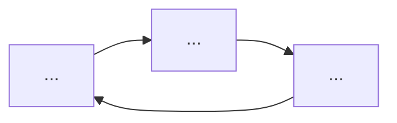

# Aula 16 — Questões de Aprendizagem

## Como Usar Este Arquivo

Este arquivo contém **questões práticas** que funcionam como checkpoint de domínio. O objetivo é verificar se você realmente sabe executar o ciclo TDD (Red → Green → Refactor) por conta própria, não apenas entender a teoria.

**Instruções:**

1. Complete cada questão por conta própria, sem reler a aula a cada passo
2. Crie uma pasta `entregas-aula-16/` no seu projeto para salvar os arquivos
3. Cada questão tem um template para você preencher e salvar
4. Só avance para a **Aula 17 — Pirâmide de Testes & Testes Avançados** quando conseguir completar todas as questões

---

## Questão 1: Desenhe o Ciclo TDD

**Conceito-chave:** Ciclo TDD (Aula 16, Seção 1 — O Ciclo Red-Green-Refactor).

**Objetivo:** Demonstrar que você sabe explicar cada fase do ciclo TDD com suas palavras e com um diagrama.

**Passos de Execução:**

1. Crie uma tabela com 3 colunas: Fase, O que fazer, O que NÃO fazer
2. Para cada fase (Red, Green, Refactor), escreva 2 ações corretas e 1 anti-padrão
3. Desenhe um diagrama Mermaid do ciclo em formato flowchart

**Entrega:** crie `entregas-aula-16/questao01-ciclo-tdd.md`:

```markdown
# Questão 1 — O Ciclo TDD

## Tabela das Fases

| Fase | O que fazer | O que NÃO fazer |
|---|---|---|
| 🔴 Red | 1. ... | ... |
| | 2. ... | |
| 🟢 Green | 1. ... | ... |
| | 2. ... | |
| 🔵 Refactor | 1. ... | ... |
| | 2. ... | |

## Diagrama Mermaid



## Pergunta de Reflexão

Por que a fase Refactor é tão importante quanto as fases Red e Green? O que acontece se você pular o Refactor sistematicamente?

**Resposta:**
```

---

## Questão 2: Classifique os Test Doubles

**Conceito-chave:** Mocks, Stubs e Spies (Aula 16, Seção 2 — Mocks, Stubs e Spies).

**Objetivo:** Demonstrar que você sabe diferenciar mock, stub e spy e decidir qual usar em cada cenário.

**Passos de Execução:**

1. Defina cada tipo de test double (mock, stub, spy, fake) em uma frase
2. Para cada cenário abaixo, indique qual test double usar e por quê
3. Escreva o código Jest correspondente para cada cenário

**Cenários:**
- A: Verificar que `emailService.send()` foi chamado com o destinatário correto
- B: Fazer `orderRepo.findById()` retornar um pedido específico para teste
- C: Contar quantas vezes `logger.info()` foi chamado durante uma operação
- D: Substituir PostgreSQL por um banco funcional em memória

**Entrega:** crie `entregas-aula-16/questao02-test-doubles.md`:

```markdown
# Questão 2 — Classificação dos Test Doubles

## Definições

| Tipo | Definição (1 frase) |
|---|---|
| **Mock** | ... |
| **Stub** | ... |
| **Spy** | ... |
| **Fake** | ... |

## Cenários

| Cenário | Test Double | Por quê? | Código Jest |
|---|---|---|---|
| A | ... | ... | ```typescript ... ``` |
| B | ... | ... | ```typescript ... ``` |
| C | ... | ... | ```typescript ... ``` |
| D | ... | ... | ```typescript ... ``` |
```

---

## Questão 3: Execute o Ciclo TDD para Validação de Email

**Conceito-chave:** Feature 1 — Criar Pedido (Aula 16, Seção 3).

**Objetivo:** Demonstrar que você sabe executar um ciclo TDD completo (Red → Green → Refactor) para uma regra de validação.

**Passos de Execução:**

1. Escreva um teste (Red) que verifique se o email do cliente tem formato válido no `CreateOrderUseCase`
2. Regra: email deve conter "@" e um domínio com pelo menos um "."
3. Implemente o mínimo para passar (Green)
4. Refatore extraindo a validação para um método separado (Refactor)
5. Execute `npx jest` e confirme que todos os testes passam

**Cenários de borda para testar:**
- Email sem @ → inválido
- Email sem domínio (ex: "user@") → inválido
- Email sem ponto no domínio (ex: "user@dominio") → inválido
- Email válido (ex: "usuario@dominio.com") → aceito

**Entrega:** crie `entregas-aula-16/questao03-validacao-email.md`:

```markdown
# Questão 3 — TDD para Validação de Email

## Ciclo Red — Teste

```typescript
// Código do teste que FALHA
```

## Ciclo Green — Implementação Mínima

```typescript
// Código que faz o teste passar
```

## Ciclo Refactor — Versão Melhorada

```typescript
// Código refatorado
```

## Verificação

- [ ] `npx jest` passou com todos os testes verdes
- [ ] Cenário "email sem @" testado
- [ ] Cenário "email sem domínio" testado
- [ ] Cenário "email sem ponto no domínio" testado
- [ ] Cenário "email válido" testado
```

---

## Questão 4: TDD para Cálculo de Frete com nock

**Conceito-chave:** Feature 2 — Calcular Frete (Aula 16, Seção 4).

**Objetivo:** Demonstrar que você sabe usar nock para simular uma API externa de frete em um teste TDD.

**Passos de Execução:**

1. Consulte a documentação da API fictícia:
   - Endpoint: `POST https://api.rapidfrete.com/v2/estimate`
   - Payload: `{ cep: string, weight: number, service: 'sedex' | 'pac' }`
   - Resposta sucesso (200): `{ cost: number, days: number, carrier: string }`
   - Resposta erro (400): `{ error: string }`

2. Escreva um teste com nock que simule uma resposta de sucesso
3. Escreva um teste com nock que simule uma resposta de erro (400)
4. Implemente o `RapidFreteProvider` seguindo TDD
5. Verifique se o nock foi chamado corretamente com `nock.isDone()`

**Entrega:** crie `entregas-aula-16/questao04-frete-nock.md`:

```markdown
# Questão 4 — TDD com nock para API de Frete

## Teste de Sucesso (Red → Green)

```typescript
// Teste com nock simulando resposta 200
```

```typescript
// Implementação que faz o teste passar
```

## Teste de Erro (Red → Green)

```typescript
// Teste com nock simulando resposta 400
```

```typescript
// Implementação que trata o erro
```

## Refatoração

Quais melhorias você aplicou na fase Refactor?

**Resposta:**

## Verificação

- [ ] Teste de sucesso passa com nock interceptando
- [ ] Teste de erro passa com nock interceptando
- [ ] `nock.isDone()` retorna true após cada teste
- [ ] Nenhuma requisição HTTP real foi feita
```

---

## Questão 5: TDD para Gateway de Pagamento com Timeout

**Conceito-chave:** Feature 3 — Processar Pagamento (Aula 16, Seção 5).

**Objetivo:** Demonstrar que você sabe modelar cenários de erro (recusa e timeout) usando TDD com um gateway mockado.

**Passos de Execução:**

1. Implemente o `ProcessPaymentUseCase` seguindo TDD para estes cenários:
   - Pagamento aprovado → retorna `{ status: 'completed', transactionId }`
   - Cartão recusado → lança `PaymentDeclinedError`
   - Gateway fora do ar (timeout) → lança `GatewayTimeoutError`

2. Crie classes de erro específicas em vez de usar `Error` genérico
3. Use um mock para simular cada cenário do gateway
4. Verifique com spy que o método `charge` foi chamado com os argumentos corretos

**Entrega:** crie `entregas-aula-16/questao05-gateway-pagamento.md`:

```markdown
# Questão 5 — TDD para Gateway de Pagamento

## Classes de Erro

```typescript
export class PaymentDeclinedError extends Error { ... }
export class GatewayTimeoutError extends Error { ... }
```

## Ciclo 1: Pagamento Aprovado

```typescript
// Teste (Red)
```

```typescript
// Implementação (Green)
```

## Ciclo 2: Cartão Recusado

```typescript
// Teste (Red)
```

```typescript
// Implementação (Green)
```

## Ciclo 3: Timeout do Gateway

```typescript
// Teste (Red)
```

```typescript
// Implementação (Green)
```

## Refatoração Final

```typescript
// Versão refatorada com métodos extraídos
```

## Verificação

- [ ] Todas as 3 classes de erro são específicas (não `Error` genérico)
- [ ] Spy verifica que `gateway.charge` foi chamado com argumentos corretos
- [ ] Teste de timeout não demora mais de 100ms (mock síncrono)
```

---

## Questão 6: Organize a Suíte de Testes

**Conceito-chave:** Organização de Testes (Aula 16, Seção 6).

**Objetivo:** Demonstrar que você sabe estruturar uma suíte de testes profissional com describe/it, fixtures e factories.

**Passos de Execução:**

1. Crie a estrutura de pastas `__tests__/application/` para o `CreateOrderUseCase`
2. Extraia as fixtures para `__tests__/fixtures/order.fixture.ts`
3. Crie uma factory `buildOrderInput()` com valores padrão e suporte a `overrides`
4. Reorganize os testes em blocos `describe` aninhados: por cenário (cliente existe, não existe, etc.)

**Entrega:** crie `entregas-aula-16/questao06-organizacao.md`:

```markdown
# Questão 6 — Organização da Suíte de Testes

## Estrutura de Pastas

```
__tests__/
├── ...
```

## Fixtures (`order.fixture.ts`)

```typescript
// Código das fixtures e factories
```

## Testes Reorganizados

```typescript
describe('CreateOrderUseCase', () => {
  describe('when customer exists', () => {
    // ...
  });
  describe('when customer does not exist', () => {
    // ...
  });
  describe('when items are invalid', () => {
    // ...
  });
});
```

## Reflexão

Qual a vantagem de organizar testes com describe aninhados em vez de describes planos?

**Resposta:**
```

---

## Questão 7: Pipeline TDD — Feature Completa do Zero

**Conceito-chave:** Todas as seções da Aula 16.

**Objetivo:** Demonstrar domínio completo do TDD implementando uma feature do zero com múltiplos ciclos.

**Passos de Execução:**

Você é o desenvolvedor responsável pela feature **"Cliente fiel"** do e-commerce:

1. **Regra:** clientes que gastaram mais de R$ 1000 em pedidos anteriores recebem **frete grátis vitalício** e **5% de desconto** em todos os pedidos
2. Implemente `LoyaltyService` com método `isLoyalCustomer(customerId): Promise<boolean>` que consulta o histórico de pedidos
3. Implemente `ApplyLoyaltyBenefitsUseCase` que aplica frete grátis e desconto se o cliente for fiel
4. Siga TDD estrito: cada funcionalidade começa com teste vermelho
5. Use `__tests__/fixtures/` para dados de teste

**Requisitos de teste:**
- Cliente fiel (gastou R$ 1500) → frete grátis + 5% desconto
- Cliente não fiel (gastou R$ 500) → sem benefícios
- Cliente sem pedidos → sem benefícios
- `LoyaltyService` com mock de `OrderRepository` para consultar histórico

**Entrega:** crie `entregas-aula-16/questao07-loyalty.md`:

```markdown
# Questão 7 — Feature "Cliente Fiel" com TDD Completo

## Ciclo 1: LoyaltyService

### Red

```typescript
// Teste
```

### Green

```typescript
// Implementação
```

### Refactor

```typescript
// Versão melhorada
```

## Ciclo 2: ApplyLoyaltyBenefitsUseCase

### Red

```typescript
// Teste
```

### Green

```typescript
// Implementação
```

### Refactor

```typescript
// Versão melhorada
```

## Checklist

- [ ] Ciclo 1 completo (Red → Green → Refactor)
- [ ] Ciclo 2 completo (Red → Green → Refactor)
- [ ] Cliente fiel recebe frete grátis + desconto
- [ ] Cliente não fiel não recebe benefícios
- [ ] Cliente sem pedidos não recebe benefícios
- [ ] Todos os testes passam com `npx jest`
- [ ] Nenhum teste depende de outro (cada um é autocontido)

## Reflexão Final

Descreva em 3-4 frases como o TDD influenciou o design da sua implementação. Você teria chegado ao mesmo design se tivesse escrito o código primeiro?

**Resposta:**
```

---

## Questão 8: Refatore um Teste Problemático

**Conceito-chave:** Teste Comportamental vs Teste de Implementação (Aula 16, Seção 1 e 6).

**Objetivo:** Demonstrar que você sabe identificar e corrigir testes acoplados à implementação.

**Passos de Execução:**

O teste abaixo está mal escrito — ele verifica detalhes internos em vez de comportamento público.

```typescript
// BAD TEST — identifique os problemas
describe('ProcessPaymentUseCase', () => {
  it('should call gateway.charge', async () => {
    const gateway = { charge: jest.fn() };
    const useCase = new ProcessPaymentUseCase(gateway);
    (useCase as any).retryCount = 3; // acessa detalhe privado

    await useCase.execute({ orderId: '1', amount: 100, method: 'credit' });

    expect((useCase as any).gateway).toBeDefined(); // testa implementação
    expect(gateway.charge).toHaveBeenCalled();
    expect((useCase as any).retryCount).toBe(3); // testa detalhe interno
  });
});
```

1. Liste todos os problemas deste teste
2. Reescreva o teste para verificar apenas comportamento público observável
3. Explique por que cada problema é um anti-padrão

**Entrega:** crie `entregas-aula-16/questao08-teste-problematico.md`:

```markdown
# Questão 8 — Refatoração de Teste Problemático

## Problemas Identificados

| Problema | Por que é um anti-padrão |
|---|---|
| 1. ... | ... |
| 2. ... | ... |
| 3. ... | ... |

## Teste Refatorado

```typescript
// Versão corrigida — testa apenas comportamento público
```

## Reflexão

Como você identificaria um teste de implementação durante um code review? Quais sinais vermelhos procurar?

**Resposta:**
```

---

## Checklist Final: Pronto para a Aula 17?

Marque cada item só quando conseguir fazê-lo **sem consultar a aula**:

- [ ] **Explico** o ciclo TDD (Red → Green → Refactor) e sei o propósito de cada fase
- [ ] **Aplico** os princípios FIRST em cada teste que escrevo (Fast, Independent, Repeatable, Self-Validating, Timely)
- [ ] **Diferencio** mock, stub e spy e escolho o test double correto para cada cenário
- [ ] **Executo** um ciclo TDD completo para uma feature com validações e regras de negócio
- [ ] **Simulo** APIs HTTP externas com nock sem fazer requisições reais
- [ ] **Modelo** cenários de erro (recusa, timeout) com classes de erro específicas usando TDD
- [ ] **Organizo** testes no padrão `__tests__/` espelhando `src/` com describe/it, fixtures e factories
- [ ] **Escrevo** testes de comportamento (o que o código faz), não de implementação (como ele faz)
- [ ] **Uso** spies do Jest para verificar chamadas sem substituir a implementação completa
- [ ] **Relaciono** a prática de TDD com SOLID, Clean Architecture e os demais princípios do curso

> *Acertou todos? Você está pronto para a **Aula 17: Pirâmide de Testes & Testes Avançados**, onde vamos expandir dos testes unitários para testes de integração, E2E, contrato e performance. Travou em algum? Releia a seção indicada na questão correspondente antes de avançar.*
