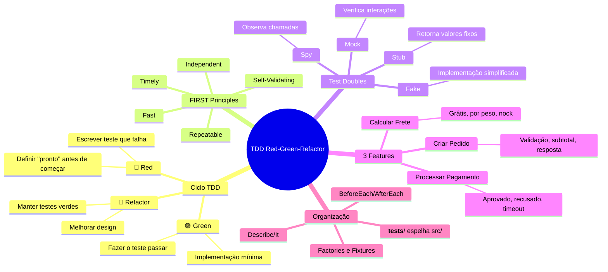
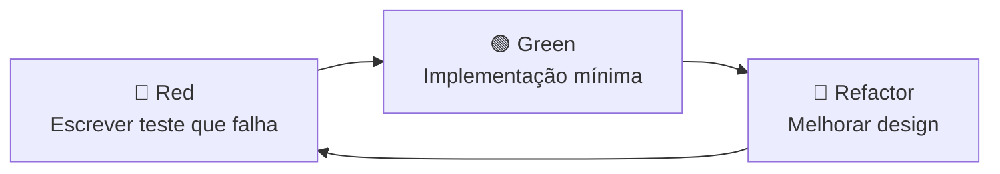

# Engenharia de Software — Aula 16

## TDD — Red-Green-Refactor

**Duração estimada:** 100 minutos (40 min leitura + 60 min prática)
**Nível:** Intermediário
**Pré-requisitos:** Aulas 01-15 — Clean Code, SOLID, Design Patterns, DDD, Arquitetura, Documentação de Requisitos, BDD com Gherkin. Você deve ter o projeto de e-commerce com Jest, TypeScript e nock configurados.

---

## Objetivos de Aprendizagem

Ao concluir esta aula, você será capaz de:

1. **Executar** o ciclo TDD completo (Red → Green → Refactor) para uma feature real, escrevendo o teste que falha antes do código de produção
2. **Aplicar** os princípios FIRST (Fast, Independent, Repeatable, Self-Validating, Timely) em cada teste que escrever
3. **Diferenciar** mock, stub e spy — e decidir qual usar em cada cenário de teste
4. **Implementar** um ciclo Red→Green→Refactor para criar pedidos com validação de payload, cálculo de subtotal e formatação de resposta usando Jest
5. **Simular** APIs HTTP externas com nock para testar cálculo de frete sem chamadas de rede reais
6. **Modelar** cenários de erro (pagamento recusado, timeout) usando TDD com um gateway de pagamento simulado
7. **Organizar** testes no padrão `__tests__/` espelhando `src/`, com describe/it, beforeEach/afterEach e fixtures reutilizáveis
8. **Escrever** testes que validam comportamento público, não detalhes de implementação — garantindo que refatorações não quebrem a suíte
9. **Usar** spies do Jest para verificar chamadas a dependências sem substituir implementações completas
10. **Relacionar** o ritmo TDD com os princípios SOLID e Clean Architecture já estudados — como a testabilidade emerge do bom design

---

## Como Usar Esta Aula

Esta aula é **intensiva de prática**. Você vai executar o ciclo TDD do início ao fim para 3 features reais do e-commerce. Cada feature é apresentada como uma sequência de ciclos Red→Green→Refactor documentados.

| Seção | Tipo | Tempo |
|---|---|---|
| 1. O Ciclo TDD e FIRST | Conceitual | 15 min |
| 2. Mocks, Stubs e Spies | Conceitual | 10 min |
| 3. Feature 1 — Criar Pedido | Prática (TDD) | 25 min |
| 4. Feature 2 — Calcular Frete | Prática (TDD + nock) | 20 min |
| 5. Feature 3 — Processar Pagamento | Prática (TDD + gateway) | 15 min |
| 6. Organização de Testes | Prática | 10 min |
| Exercícios + Quiz | Autoavaliação | 35 min |

Leia na ordem. Pare nos Quick Checks. Rode cada teste no seu projeto. Só avance quando o teste estiver verde.

---

## Mapa Mental



---

## Recapitulação das Aulas 01-15

Antes de mergulhar na prática de TDD, vejamos como cada aula anterior preparou o terreno para testabilidade.

| Aula | O que aprendemos | Conexão com TDD |
|---|---|---|
| **01 — Introdução** | Setup do projeto, dívida técnica, ciclo de vida | Projeto base onde aplicaremos TDD |
| **02 — Clean Code** | Nomes, funções pequenas, DRY, KISS, YAGNI | Código limpo é mais fácil de testar |
| **03 — Refactoring** | Catálogo de refactorings, ESLint como segurança | Refactor é a terceira fase do TDD |
| **04-05 — SOLID** | SRP, OCP, LSP, ISP, DIP + DI com tsyringe | DIP permite injetar mocks; SRP gera unidades testáveis |
| **06 — Criacionais** | Factory, Builder, Singleton, Object Literal | Builders criam dados de teste complexos |
| **07 — Estruturais** | Adapter, Decorator, Facade, Proxy | Adapter permite mockar APIs externas |
| **08 — Comportamentais** | Strategy, Observer, Command, State | Strategy é facilmente substituível em testes |
| **09 — Web/React** | HOC, Hooks, Compound Components, Context | Custom hooks são testáveis com TDD |
| **10-11 — DDD** | Bounded Contexts, Entities, VOs, Aggregates | VOs imutáveis simplificam testes |
| **12-13 — Arquitetura** | Clean Architecture, 4 camadas, regra da dependência | Use Cases com dependências injetadas = testáveis |
| **14 — Requisitos** | User Stories, critérios de aceitação | Critérios viram casos de teste |
| **15 — SDD/BDD** | Gherkin, Cucumber.js, Specification by Example | Cenários Gherkin alimentam os testes TDD |

A linha que une as 15 aulas: **cada conceito contribui para a testabilidade**. Se o código é difícil de testar, é sinal de que algo na cadeia precisa ser melhorado.

---

> **FUNDAMENTOS: O Ciclo TDD e a Mentalidade de Teste Primeiro**
>
> *As próximas duas seções estabelecem a base conceitual — o ciclo canônico Red-Green-Refactor e os tipos de test doubles. Leia com atenção: eles formam o vocabulário que usaremos nas 3 features práticas.*

---

## 1. O Ciclo Red-Green-Refactor

### O que é TDD?

**Test-Driven Development** (TDD) é uma prática onde você escreve o teste **antes** do código de produção. O ciclo tem três fases:



### Fase Red: Teste Falha

Escreva um teste que **descreva o comportamento desejado**. Como a funcionalidade não existe, o teste **falha**. Isso prova que o teste é válido — ele detecta a ausência da feature.

**O que NÃO fazer:** escrever muitos testes de uma vez. Um ciclo TDD = um teste por vez. O teste vermelho é seu checkpoint: *"provei que a feature não existe. Agora vou fazê-la existir."*

### Fase Green: Implementação Mínima

Escreva o **mínimo necessário** para o teste passar. Nada de código extra, antecipação de requisitos futuros ou abstrações prematuras. Código feio? Duplicado? Sem problema — você vai refatorar na próxima fase.

**O que NÃO fazer:** escrever a implementação completa e elegante de uma vez. Green não é sobre código bonito — é sobre código que **passa no teste**. O resto vem depois.

### Fase Refactor: Melhoria com Segurança

Com o teste verde como **rede de segurança**, você melhora o design: extrai funções, remove duplicação, renomeia variáveis, aplica patterns. O teste continua passando — você prova que o comportamento não mudou.

**O que NÃO fazer:** pular a fase Refactor. É aqui que o design emerge. Sem Refactor, TDD vira apenas "testar primeiro" — você perde o benefício do design evolucionário.

### Os Princípios FIRST

O acrônimo **FIRST** define as características de um bom teste:

| Princípio | Significado | Sinal de Alerta |
|---|---|---|
| **F**ast | Executa em milissegundos | Teste que faz requisição HTTP real |
| **I**ndependent | Não depende de outros testes | Teste que precisa de ordem específica |
| **R**epeatable | Mesmo resultado sempre | Teste que usa data/hora atual sem controle |
| **S**elf-Validating | Passa ou falha, sem interpretação | Teste que só imprime resultado no console |
| **T**imely | Escrito antes do código | Teste criado depois da implementação |

### Mentalidade: Teste Comportamental, Não Estrutural

Um bom teste verifica **comportamento observável** — não detalhes internos. Pergunte-se: *"se eu refatorar o código sem mudar o resultado, este teste continua passando?"* Se a resposta é não, o teste está acoplado à implementação.

### Quick Check

**1. Por que o ciclo TDD começa com um teste que falha?**
**Resposta:** Porque o teste que falha prova que a feature não existe ainda. Se o teste passasse antes da implementação, ele não estaria testando nada — seria um falso positivo. A fase Red também força você a definir "o que é sucesso" antes de começar a codificar.

**2. Qual a diferença entre a fase Green e a fase Refactor no que diz respeito à qualidade do código?**
**Resposta:** Na fase Green, a qualidade do código não importa — o objetivo é fazer o teste passar com a implementação mais simples possível, mesmo que o código seja feio ou duplicado. Na fase Refactor, com o teste verde como segurança, você melhora a qualidade do código (extrai funções, remove duplicação, renomeia) sem alterar o comportamento verificado pelo teste.

---

## 2. Mocks, Stubs e Spies — Test Doubles em Jest

### O Problema

Testes unitários precisam isolar a unidade de código. Mas o código real depende de bancos, APIs, serviços de email e outros componentes. Solução: **test doubles** — objetos que substituem dependências reais por versões controladas.

### Os Três Tipos Principais

**Mock (`jest.fn()` com `toHaveBeenCalled`):** Objeto que **verifica interações**. Você mocka para confirmar que um método foi chamado com certos argumentos. Exemplo: "garantir que `orderRepo.save` foi chamado com o pedido correto."

```typescript
const mockRepo = { save: jest.fn() };
await useCase.execute(input);
expect(mockRepo.save).toHaveBeenCalledWith(expect.objectContaining({
  status: 'pending'
}));
```

**Stub (`jest.fn().mockReturnValue()`):** Objeto que **retorna valores fixos** para controlar o ambiente do teste. Exemplo: "fazer o `customerRepo.findById` retornar um cliente específico."

```typescript
mockCustomerRepo.findById.mockResolvedValue({ id: '123', name: 'João' });
```

**Spy (`jest.spyOn()`):** Função que **observa** chamadas sem substituir a implementação original (a menos que você queira). Exemplo: "verificar quantas vezes `console.log` foi chamado."

```typescript
const logSpy = jest.spyOn(console, 'log');
// executa código que chama console.log
expect(logSpy).toHaveBeenCalledTimes(1);
logSpy.mockRestore();
```

### Fake: O Quarto Tipo

**Fake** é uma implementação simplificada mas funcional. Exemplo clássico: `InMemoryOrderRepository` que usa um `Map` em vez de PostgreSQL.

```typescript
class InMemoryOrderRepository {
  private orders = new Map<string, Order>();

  async save(order: Order): Promise<void> {
    this.orders.set(order.id, order);
  }

  async findById(id: string): Promise<Order | null> {
    return this.orders.get(id) ?? null;
  }
}
```

### Quando Usar Cada Um

| Cenário | Test Double | Exemplo |
|---|---|---|
| Preciso verificar se um método foi chamado | Mock / Spy | `expect(repo.save).toHaveBeenCalled()` |
| Preciso controlar o retorno de uma dependência | Stub | `mockRepo.findById.mockResolvedValue(order)` |
| Preciso contar quantas vezes algo foi chamado | Spy | `jest.spyOn(service, 'method')` |
| Preciso de um banco funcional sem banco real | Fake | `InMemoryOrderRepository` |
| Preciso substituir uma API HTTP externa | nock | `nock('https://api.exemplo.com').post(...)` |

### Quick Check

**3. Qual a diferença entre mock e stub?**
**Resposta:** Mock verifica interações — você usa `expect(mock.save).toHaveBeenCalled()` para confirmar que um método foi chamado. Stub retorna valores controlados — você usa `mockRepo.findById.mockResolvedValue(data)` para simular o comportamento de uma dependência. Em Jest, `jest.fn()` pode atuar como ambos, mas conceitualmente são propósitos diferentes.

**4. Quando usar um Fake em vez de um Mock?**
**Resposta:** Use Fake quando você precisa de comportamento funcional, não apenas de verificação. Um `InMemoryOrderRepository` permite testar fluxos completos (salvar, buscar, listar) sem mockar cada método individualmente. Fake é mais realista que mock, mas exige implementação adicional. É ideal para repositórios, caches e filas em memória.

---

> **APLICAÇÃO: TDD nas 3 Features do E-commerce**
>
> *Agora vamos aplicar o ciclo TDD em 3 features reais do projeto. Cada feature começa com o teste vermelho, passa pela implementação mínima e termina com a refatoração. Siga o código no seu projeto — execute cada ciclo antes de avançar.*

---

## 3. Feature 1 — Criar Pedido (TDD Completo)

### Contexto

Vamos implementar o caso de uso `CreateOrder` que:
1. Recebe `customerId`, `items` (productId, quantity, price)
2. Valida o payload (cliente existe, itens não vazios)
3. Calcula o subtotal (soma de price × quantity)
4. Cria o pedido com status "pending"
5. Retorna o pedido formatado

### Ciclo 1: Red — Teste de Validação de Payload

```typescript
// __tests__/application/CreateOrderUseCase.test.ts
import { CreateOrderUseCase } from '../../src/application/CreateOrderUseCase';

describe('CreateOrderUseCase', () => {
  const mockOrderRepo = { save: jest.fn(), findById: jest.fn() };
  const mockCustomerRepo = { findById: jest.fn() };

  beforeEach(() => {
    jest.clearAllMocks();
  });

  it('should throw if items array is empty', async () => {
    mockCustomerRepo.findById.mockResolvedValue({ id: 'cust-1', name: 'João' });
    const useCase = new CreateOrderUseCase(mockOrderRepo, mockCustomerRepo);

    await expect(
      useCase.execute({ customerId: 'cust-1', items: [] })
    ).rejects.toThrow('Order must have at least one item');
  });
});
```

`npx jest` → 🔴 **RED** — `CreateOrderUseCase` não existe. Perfeito, o teste provou que a feature não existe.

### Ciclo 1: Green — Implementação Mínima

```typescript
// src/application/CreateOrderUseCase.ts
export class CreateOrderUseCase {
  constructor(
    private orderRepo: any,
    private customerRepo: any
  ) {}

  async execute(input: { customerId: string; items: any[] }) {
    if (input.items.length === 0) {
      throw new Error('Order must have at least one item');
    }
    return { id: 'temp', status: 'pending' };
  }
}
```

`npx jest` → 🟢 **GREEN**. A implementação mínima passou. Código feio? Sim. Serve? Sim — o próximo ciclo vai expandir.

### Ciclo 1: Refactor — Extrair Validação

```typescript
// src/application/CreateOrderUseCase.ts
export class CreateOrderUseCase {
  constructor(
    private orderRepo: any,
    private customerRepo: any
  ) {}

  async execute(input: { customerId: string; items: any[] }) {
    this.validateInput(input);
    // continua...
  }

  private validateInput(input: { customerId: string; items: any[] }): void {
    if (!input.items.length) {
      throw new Error('Order must have at least one item');
    }
  }
}
```

`npx jest` → 🟢 **GREEN** (ainda). Refatoração segura.

### Ciclo 2: Red — Teste de Cliente Inexistente

```typescript
it('should throw if customer does not exist', async () => {
  mockCustomerRepo.findById.mockResolvedValue(null);
  const useCase = new CreateOrderUseCase(mockOrderRepo, mockCustomerRepo);

  await expect(
    useCase.execute({ customerId: 'invalid', items: [{ productId: 'p1', quantity: 1, price: 10 }] })
  ).rejects.toThrow('Customer not found');
});
```

`npx jest` → 🔴 **RED** — a implementação atual não valida cliente.

### Ciclo 2: Green — Adicionar Validação de Cliente

```typescript
async execute(input: { customerId: string; items: any[] }) {
  this.validateInput(input);
  const customer = await this.customerRepo.findById(input.customerId);
  if (!customer) {
    throw new Error('Customer not found');
  }
  // continua...
}
```

`npx jest` → 🟢 **GREEN**.

### Ciclo 3: Red — Teste de Cálculo de Subtotal

```typescript
it('should calculate subtotal correctly', async () => {
  mockCustomerRepo.findById.mockResolvedValue({ id: 'cust-1', name: 'João' });
  const useCase = new CreateOrderUseCase(mockOrderRepo, mockCustomerRepo);

  const result = await useCase.execute({
    customerId: 'cust-1',
    items: [
      { productId: 'p1', quantity: 2, price: 50 },
      { productId: 'p2', quantity: 1, price: 30 },
    ],
  });

  expect(result.total).toBe(130); // 2*50 + 1*30
});
```

`npx jest` → 🔴 **RED** — `result.total` é `undefined`.

### Ciclo 3: Green — Calcular Subtotal

```typescript
async execute(input: { customerId: string; items: any[] }) {
  this.validateInput(input);
  await this.ensureCustomerExists(input.customerId);
  const total = input.items.reduce(
    (sum: number, item: any) => sum + item.price * item.quantity, 0
  );
  const order = {
    id: crypto.randomUUID(),
    customerId: input.customerId,
    items: input.items,
    total,
    status: 'pending' as const,
    createdAt: new Date(),
  };
  await this.orderRepo.save(order);
  return order;
}
```

`npx jest` → 🟢 **GREEN**.

### Ciclo 3: Refactor — Versão Final Refatorada

```typescript
// src/application/CreateOrderUseCase.ts — Refatorado
import { randomUUID } from 'node:crypto';
import { Order, OrderRepository, CustomerRepository } from '../domain/repositories';

export interface CreateOrderInput {
  customerId: string;
  items: Array<{ productId: string; quantity: number; price: number }>;
}

export class CreateOrderUseCase {
  constructor(
    private readonly orderRepo: OrderRepository,
    private readonly customerRepo: CustomerRepository
  ) {}

  async execute(input: CreateOrderInput): Promise<Order> {
    this.validateInput(input);
    await this.ensureCustomerExists(input.customerId);
    const order = this.buildOrder(input);
    await this.orderRepo.save(order);
    return order;
  }

  private validateInput(input: CreateOrderInput): void {
    if (!input.items.length) {
      throw new Error('Order must have at least one item');
    }
  }

  private async ensureCustomerExists(customerId: string): Promise<void> {
    const customer = await this.customerRepo.findById(customerId);
    if (!customer) throw new Error('Customer not found');
  }

  private buildOrder(input: CreateOrderInput): Order {
    const total = input.items.reduce(
      (sum, item) => sum + item.price * item.quantity, 0
    );
    return {
      id: randomUUID(),
      customerId: input.customerId,
      items: input.items.map(item => ({ ...item })),
      total,
      status: 'pending' as const,
      createdAt: new Date(),
    };
  }
}
```

```typescript
// src/domain/repositories.ts — Interfaces Refatoradas
export interface OrderItem {
  productId: string;
  quantity: number;
  price: number;
}

export interface Order {
  id: string;
  customerId: string;
  items: OrderItem[];
  total: number;
  status: 'pending' | 'confirmed' | 'cancelled';
  createdAt: Date;
}

export interface OrderRepository {
  save(order: Order): Promise<void>;
  findById(id: string): Promise<Order | null>;
}

export interface CustomerRepository {
  findById(id: string): Promise<{ id: string; name: string } | null>;
}
```

`npx jest` → 🟢 **GREEN**. Três ciclos TDD completos, cada um com Red→Green→Refactor.

### Verificação Final — Todos os Testes

```typescript
// __tests__/application/CreateOrderUseCase.test.ts — Completo
import { CreateOrderUseCase } from '../../src/application/CreateOrderUseCase';

describe('CreateOrderUseCase', () => {
  const mockOrderRepo = { save: jest.fn(), findById: jest.fn() };
  const mockCustomerRepo = { findById: jest.fn() };

  beforeEach(() => { jest.clearAllMocks(); });

  it('should throw if items array is empty', async () => {
    mockCustomerRepo.findById.mockResolvedValue({ id: 'cust-1', name: 'João' });
    const useCase = new CreateOrderUseCase(mockOrderRepo, mockCustomerRepo);
    await expect(useCase.execute({ customerId: 'cust-1', items: [] }))
      .rejects.toThrow('Order must have at least one item');
  });

  it('should throw if customer does not exist', async () => {
    mockCustomerRepo.findById.mockResolvedValue(null);
    const useCase = new CreateOrderUseCase(mockOrderRepo, mockCustomerRepo);
    await expect(useCase.execute({ customerId: 'invalid', items: [{ productId: 'p1', quantity: 1, price: 10 }] }))
      .rejects.toThrow('Customer not found');
  });

  it('should calculate subtotal correctly', async () => {
    mockCustomerRepo.findById.mockResolvedValue({ id: 'cust-1', name: 'João' });
    const useCase = new CreateOrderUseCase(mockOrderRepo, mockCustomerRepo);
    const result = await useCase.execute({
      customerId: 'cust-1',
      items: [
        { productId: 'p1', quantity: 2, price: 50 },
        { productId: 'p2', quantity: 1, price: 30 },
      ],
    });
    expect(result.total).toBe(130);
    expect(result.status).toBe('pending');
    expect(result.id).toBeDefined();
    expect(mockOrderRepo.save).toHaveBeenCalledTimes(1);
  });
});
```

---

## 4. Feature 2 — Calcular Frete (TDD com Mock de API)

### Contexto

Vamos implementar `CalculateShippingUseCase` que:
1. Recebe CEP, peso e valor total do pedido
2. Frete grátis se valor total >= R$ 100
3. Caso contrário, consulta API externa de frete por peso e CEP
4. Retorna valor do frete e prazo de entrega

### Ciclo 1: Red — Frete Grátis Acima de R$ 100

```typescript
// __tests__/application/CalculateShippingUseCase.test.ts
import { CalculateShippingUseCase } from '../../src/application/CalculateShippingUseCase';

describe('CalculateShippingUseCase', () => {
  it('should return free shipping when total is 100 or more', async () => {
    const useCase = new CalculateShippingUseCase();
    const result = await useCase.execute({
      cep: '01001000',
      weightKg: 2,
      orderTotal: 100,
    });
    expect(result.cost).toBe(0);
    expect(result.deliveryDays).toBe(0);
    expect(result.method).toBe('free');
  });
});
```

`npx jest` → 🔴 **RED**.

### Ciclo 1: Green — Implementação Mínima

```typescript
// src/application/CalculateShippingUseCase.ts
export class CalculateShippingUseCase {
  async execute(input: { cep: string; weightKg: number; orderTotal: number }) {
    if (input.orderTotal >= 100) {
      return { cost: 0, deliveryDays: 0, method: 'free' };
    }
    // TODO: integrar com API externa
    throw new Error('Not implemented');
  }
}
```

`npx jest` → 🟢 **GREEN**.

### Ciclo 2: Red — Frete por Peso com nock

Agora vamos testar o caso em que o frete NÃO é grátis e a API externa é consultada. Usamos **nock** para interceptar a requisição HTTP.

```typescript
// __tests__/application/CalculateShippingUseCase.test.ts
import nock from 'nock';

it('should calculate shipping cost by weight via external API', async () => {
  nock('https://api.frete.com')
    .post('/v1/quote', { cep: '01001000', weight_kg: 2 })
    .reply(200, { cost: 25.50, delivery_days: 3, provider: 'Correios' });

  const useCase = new CalculateShippingUseCase();
  const result = await useCase.execute({
    cep: '01001000',
    weightKg: 2,
    orderTotal: 50, // abaixo de 100, frete NÃO é grátis
  });

  expect(result.cost).toBe(25.50);
  expect(result.deliveryDays).toBe(3);
});
```

`npx jest` → 🔴 **RED** — o teste espera que a API seja chamada, mas a implementação atual lança "Not implemented".

### Ciclo 2: Green — Integração com API via HTTP

```typescript
// src/application/CalculateShippingUseCase.ts
export class CalculateShippingUseCase {
  async execute(input: { cep: string; weightKg: number; orderTotal: number }) {
    if (input.orderTotal >= 100) {
      return { cost: 0, deliveryDays: 0, method: 'free' };
    }
    const response = await fetch('https://api.frete.com/v1/quote', {
      method: 'POST',
      headers: { 'Content-Type': 'application/json' },
      body: JSON.stringify({ cep: input.cep, weight_kg: input.weightKg }),
    });
    const data = await response.json();
    return {
      cost: data.cost,
      deliveryDays: data.delivery_days,
      method: data.provider,
    };
  }
}
```

`npx jest` → 🟢 **GREEN**. O nock interceptou a chamada HTTP e devolveu a resposta simulada — nenhuma requisição real foi feita.

### Ciclo 3: Refactor — Extrair Provider e Injetar Dependência

O código atual tem `fetch` hardcoded — difícil de testar e viola DIP. Vamos refatorar.

```typescript
// src/domain/repositories.ts
export interface ShippingProvider {
  quote(cep: string, weightKg: number): Promise<{
    cost: number;
    deliveryDays: number;
    provider: string;
  }>;
}
```

```typescript
// src/application/CalculateShippingUseCase.ts — Refatorado
import { ShippingProvider } from '../domain/repositories';

export class CalculateShippingUseCase {
  constructor(private readonly shippingProvider: ShippingProvider) {}

  async execute(input: { cep: string; weightKg: number; orderTotal: number }) {
    if (input.orderTotal >= 100) {
      return { cost: 0, deliveryDays: 0, method: 'free' };
    }
    const quote = await this.shippingProvider.quote(input.cep, input.weightKg);
    return {
      cost: quote.cost,
      deliveryDays: quote.deliveryDays,
      method: quote.provider,
    };
  }
}
```

Agora o teste refatorado com mock da interface, não mais nock direto:

```typescript
it('should calculate shipping cost via provider interface', async () => {
  const mockProvider = {
    quote: jest.fn().mockResolvedValue({
      cost: 25.50, deliveryDays: 3, provider: 'Correios'
    }),
  };
  const useCase = new CalculateShippingUseCase(mockProvider);
  const result = await useCase.execute({
    cep: '01001000', weightKg: 2, orderTotal: 50,
  });
  expect(result.cost).toBe(25.50);
  expect(mockProvider.quote).toHaveBeenCalledWith('01001000', 2);
});
```

`npx jest` → 🟢 **GREEN**. O teste agora usa um stub para o provider — mais rápido e isolado que nock.

### Spies: Verificando Chamadas

Para testar que o método `quote` do provider foi chamado **exatamente uma vez** com os parâmetros corretos, usamos um **spy**:

```typescript
it('should call provider.quote with correct params', async () => {
  const mockProvider = { quote: jest.fn().mockResolvedValue({ cost: 10, deliveryDays: 2, provider: 'Test' }) };
  const useCase = new CalculateShippingUseCase(mockProvider);
  await useCase.execute({ cep: '01001000', weightKg: 5, orderTotal: 50 });

  expect(mockProvider.quote).toHaveBeenCalledTimes(1);
  expect(mockProvider.quote).toHaveBeenCalledWith('01001000', 5);
});
```

---

## 5. Feature 3 — Processar Pagamento (TDD com Gateway)

### Contexto

Vamos implementar `ProcessPaymentUseCase` que:
1. Recebe `orderId`, `amount` e `paymentMethod`
2. Envia cobrança para o gateway de pagamento
3. Retorna transação aprovada ou lança erro específico
4. Trata timeout do gateway

### Ciclo 1: Red — Pagamento Aprovado

```typescript
// __tests__/application/ProcessPaymentUseCase.test.ts
import { ProcessPaymentUseCase } from '../../src/application/ProcessPaymentUseCase';

describe('ProcessPaymentUseCase', () => {
  it('should process approved payment', async () => {
    const mockGateway = {
      charge: jest.fn().mockResolvedValue({
        transactionId: 'tx-123',
        status: 'approved',
        amount: 150,
      }),
    };
    const useCase = new ProcessPaymentUseCase(mockGateway);
    const result = await useCase.execute({
      orderId: 'order-1',
      amount: 150,
      paymentMethod: 'credit_card',
    });

    expect(result.transactionId).toBe('tx-123');
    expect(result.status).toBe('completed');
    expect(mockGateway.charge).toHaveBeenCalledWith('order-1', 150, 'credit_card');
  });
});
```

`npx jest` → 🔴 **RED**.

### Ciclo 1: Green — Implementação Mínima

```typescript
// src/application/ProcessPaymentUseCase.ts
export class ProcessPaymentUseCase {
  constructor(private readonly gateway: any) {}

  async execute(input: { orderId: string; amount: number; paymentMethod: string }) {
    const transaction = await this.gateway.charge(input.orderId, input.amount, input.paymentMethod);
    return { transactionId: transaction.transactionId, status: 'completed', amount: transaction.amount };
  }
}
```

`npx jest` → 🟢 **GREEN**.

### Ciclo 2: Red — Pagamento Recusado

```typescript
it('should throw on declined payment', async () => {
  const mockGateway = {
    charge: jest.fn().mockRejectedValue(new Error('Card declined')),
  };
  const useCase = new ProcessPaymentUseCase(mockGateway);

  await expect(useCase.execute({
    orderId: 'order-1', amount: 150, paymentMethod: 'credit_card',
  })).rejects.toThrow('Payment declined: Card declined');
});
```

`npx jest` → 🔴 **RED** — o erro atual não inclui "Payment declined:".

### Ciclo 2: Green — Tratar Recusa

```typescript
export class ProcessPaymentUseCase {
  constructor(private readonly gateway: any) {}

  async execute(input: { orderId: string; amount: number; paymentMethod: string }) {
    try {
      const transaction = await this.gateway.charge(input.orderId, input.amount, input.paymentMethod);
      return { transactionId: transaction.transactionId, status: 'completed', amount: transaction.amount };
    } catch (error: any) {
      throw new Error(`Payment declined: ${error.message}`);
    }
  }
}
```

`npx jest` → 🟢 **GREEN**.

### Ciclo 3: Red — Timeout do Gateway

```typescript
it('should handle gateway timeout', async () => {
  const mockGateway = {
    charge: jest.fn().mockRejectedValue(new Error('timeout')),
  };
  const useCase = new ProcessPaymentUseCase(mockGateway);

  await expect(useCase.execute({
    orderId: 'order-1', amount: 150, paymentMethod: 'credit_card',
  })).rejects.toThrow('Payment gateway timeout');
});
```

`npx jest` → 🔴 **RED** — a mensagem atual é "Payment declined: timeout", não "Payment gateway timeout".

### Ciclo 3: Green — Diferenciar Timeout de Recusa

```typescript
export class ProcessPaymentUseCase {
  constructor(private readonly gateway: any) {}

  async execute(input: { orderId: string; amount: number; paymentMethod: string }) {
    try {
      const transaction = await this.gateway.charge(input.orderId, input.amount, input.paymentMethod);
      return { transactionId: transaction.transactionId, status: 'completed', amount: transaction.amount };
    } catch (error: any) {
      if (error.message === 'timeout') {
        throw new Error('Payment gateway timeout');
      }
      throw new Error(`Payment declined: ${error.message}`);
    }
  }
}
```

`npx jest` → 🟢 **GREEN**.

### Ciclo 4: Refactor — Extrair Lógica de Erro

```typescript
// src/application/ProcessPaymentUseCase.ts — Refatorado
import { PaymentGateway } from '../domain/repositories';

export interface ProcessPaymentInput {
  orderId: string;
  amount: number;
  paymentMethod: string;
}

export interface PaymentResult {
  transactionId: string;
  status: 'completed' | 'failed';
  amount: number;
}

export class ProcessPaymentUseCase {
  constructor(private readonly gateway: PaymentGateway) {}

  async execute(input: ProcessPaymentInput): Promise<PaymentResult> {
    try {
      const transaction = await this.gateway.charge(input.orderId, input.amount, input.paymentMethod);
      return this.mapToResult(transaction);
    } catch (error: any) {
      this.handleGatewayError(error);
    }
  }

  private mapToResult(transaction: any): PaymentResult {
    return {
      transactionId: transaction.transactionId,
      status: 'completed',
      amount: transaction.amount,
    };
  }

  private handleGatewayError(error: Error): never {
    if (error.message === 'timeout') {
      throw new Error('Payment gateway timeout');
    }
    throw new Error(`Payment declined: ${error.message}`);
  }
}
```

```typescript
// src/domain/repositories.ts — Adicionar interface
export interface PaymentGateway {
  charge(orderId: string, amount: number, method: string): Promise<{
    transactionId: string;
    status: string;
    amount: number;
  }>;
}
```

`npx jest` → 🟢 **GREEN**. Três features completas com TDD.

---

## 6. Organização de Testes

### Estrutura `__tests__/` Espelhando `src/`

A convenção é simples: cada arquivo em `src/` tem um arquivo de teste correspondente em `__tests__/` na mesma estrutura de pastas.

```
src/
├── domain/
│   └── repositories.ts
├── application/
│   ├── CreateOrderUseCase.ts
│   ├── CalculateShippingUseCase.ts
│   └── ProcessPaymentUseCase.ts
└── interface/
    └── controllers/

__tests__/
├── domain/
│   └── repositories.test.ts
├── application/
│   ├── CreateOrderUseCase.test.ts
│   ├── CalculateShippingUseCase.test.ts
│   └── ProcessPaymentUseCase.test.ts
└── interface/
    └── controllers/
```

**Vantagens:** localização imediata do teste de qualquer arquivo, espelha a estrutura de imports, não mistura código de produção com teste.

### Describe/It — A Linguagem dos Testes

Use `describe` para agrupar cenários e `it` para descrever comportamentos:

```typescript
describe('CreateOrderUseCase', () => {
  describe('when customer exists', () => {
    it('should create order with pending status', () => { /* ... */ });
    it('should calculate total from items', () => { /* ... */ });
    it('should save order to repository', () => { /* ... */ });
  });

  describe('when customer does not exist', () => {
    it('should throw CustomerNotFound error', () => { /* ... */ });
  });

  describe('when items are empty', () => {
    it('should throw EmptyOrder error', () => { /* ... */ });
  });
});
```

**Regra de ouro:** o nome do teste deve completar a frase "It should...". Se o nome não fizer sentido nessa frase, o teste está mal nomeado.

### BeforeEach/AfterEach — Setup e Teardown

Use `beforeEach` para resetar mocks e preparar estado. Use `afterEach` para limpar recursos.

```typescript
describe('CalculateShippingUseCase', () => {
  let mockProvider: jest.Mocked<ShippingProvider>;
  let useCase: CalculateShippingUseCase;

  beforeEach(() => {
    mockProvider = { quote: jest.fn() };
    useCase = new CalculateShippingUseCase(mockProvider);
  });

  afterEach(() => {
    nock.cleanAll(); // limpa interceptações do nock
  });

  // testes aqui...
});
```

### Fixtures e Factories — Dados de Teste Reutilizáveis

**Fixture:** dados fixos pré-definidos. **Factory:** função que cria dados dinâmicos.

```typescript
// __tests__/fixtures/order.fixture.ts
export const validCustomer = { id: 'cust-1', name: 'João Silva' };

export const validItems = [
  { productId: 'p1', quantity: 2, price: 50 },
  { productId: 'p2', quantity: 1, price: 30 },
];

// Factory com valores padrão que podem ser sobrescritos
export function buildOrderInput(overrides: Partial<{
  customerId: string;
  items: Array<{ productId: string; quantity: number; price: number }>;
}> = {}) {
  return {
    customerId: 'cust-1',
    items: [{ productId: 'p1', quantity: 1, price: 100 }],
    ...overrides,
  };
}
```

Uso nos testes:

```typescript
it('should create order with custom items', async () => {
  mockCustomerRepo.findById.mockResolvedValue(validCustomer);
  const input = buildOrderInput({ items: validItems });
  const result = await useCase.execute(input);
  expect(result.total).toBe(130);
});

it('should throw for empty items', async () => {
  mockCustomerRepo.findById.mockResolvedValue(validCustomer);
  const input = buildOrderInput({ items: [] });
  await expect(useCase.execute(input)).rejects.toThrow('must have at least one item');
});
```

### Quick Check

**5. Por que os testes devem ser Independentes (princípio I do FIRST)?**
**Resposta:** Testes independentes podem ser executados em qualquer ordem, em paralelo, e isoladamente. Se um teste depende do resultado de outro (ex: teste B precisa que o teste A tenha inserido dados), a suíte é frágil — falhas em cascata e impossibilidade de rodar testes específicos. Cada teste deve configurar seu próprio estado.

**6. Qual a vantagem de usar factories em vez de dados fixos nos testes?**
**Resposta:** Factories permitem criar variações do mesmo dado sem repetição. Com `buildOrderInput({ items: [] })`, você testa o caso de borda sem precisar reescrever todo o objeto. Factories também tornam os testes mais legíveis — o `overrides` revela exatamente o que é diferente no cenário testado.

---

## Autoavaliação: Quiz Rápido

**1. Qual a primeira coisa que você faz em um ciclo TDD?**
**Resposta:**

Escrever um teste que falha (Red). Antes de qualquer código de produção, você define o comportamento esperado na forma de um teste que, inicialmente, não passa.

**2. O que você deve fazer se, na fase Green, o teste passar mas o código estiver duplicado?**
**Resposta:**

Nada — por enquanto. A fase Green aceita código feio, duplicado ou ineficiente. A melhoria vem na fase Refactor, quando o teste verde serve como rede de segurança.

**3. Qual test double você usa para verificar que um método foi chamado com argumentos específicos?**
**Resposta:**

Mock (ou Spy). Em Jest, `jest.fn()` + `expect(fn).toHaveBeenCalledWith(args)`.

**4. Como testar uma chamada HTTP sem fazer uma requisição real?**
**Resposta:**

Usando nock para interceptar a requisição no nível HTTP, ou injetando um provider mockado que substitui a chamada de rede.

**5. Qual a diferença entre um Fake e um Mock?**
**Resposta:**

Fake é uma implementação simplificada mas funcional (ex: `InMemoryOrderRepository`). Mock é um objeto que registra e verifica interações. Fake tem comportamento real; Mock tem comportamento simulado.

**6. Por que testes que dependem da ordem de execução violam o FIRST?**
**Resposta:**

Porque violam o princípio **Independent** (I). Testes não devem depender de estado deixado por outros testes. Cada teste deve configurar seu próprio contexto.

**7. O que significa "testar comportamento, não implementação"?**
**Resposta:**

Significa verificar o que o código FAZ (saída, efeitos colaterais observáveis), não como ele FAZ (métodos internos, estrutura privada). Testes de implementação quebram durante refatorações que não mudam o comportamento.

---

## Mão na Massa: Exercícios Graduados

**Exercício 1 (Fácil) — Testar Validação de CPF no Pedido**

Adicione um novo teste ao `CreateOrderUseCase` que valide o formato do CPF do cliente. O pedido deve conter um campo `customerCpf`. Se o CPF não tiver 11 dígitos, o teste deve esperar um erro.

**Regras:**
- O CPF deve ter exatamente 11 dígitos numéricos
- CPFs com formatação (ex: "123.456.789-00") devem ser aceitos — remova não-dígitos antes de validar
- CPF inválido → erro `Invalid CPF: X`

**Gabarito:**

```typescript
it('should throw if customer CPF is invalid', async () => {
  mockCustomerRepo.findById.mockResolvedValue({ id: 'cust-1', name: 'João' });
  const useCase = new CreateOrderUseCase(mockOrderRepo, mockCustomerRepo);

  await expect(useCase.execute({
    customerId: 'cust-1',
    customerCpf: '123', // inválido
    items: [{ productId: 'p1', quantity: 1, price: 100 }],
  })).rejects.toThrow('Invalid CPF: 123');
});

it('should accept CPF with formatting', async () => {
  mockCustomerRepo.findById.mockResolvedValue({ id: 'cust-1', name: 'João' });
  const useCase = new CreateOrderUseCase(mockOrderRepo, mockCustomerRepo);

  const result = await useCase.execute({
    customerId: 'cust-1',
    customerCpf: '123.456.789-00',
    items: [{ productId: 'p1', quantity: 1, price: 100 }],
  });

  expect(result.customerCpf).toBe('12345678900');
});
```

Implementação mínima para passar:

```typescript
private validateCpf(cpf: string): string {
  const digits = cpf.replace(/\D/g, '');
  if (digits.length !== 11) {
    throw new Error(`Invalid CPF: ${cpf}`);
  }
  return digits;
}
```

**Exercício 2 (Médio) — Testar Aplicação de Cupom de Desconto**

Implemente `ApplyCouponUseCase` usando TDD completo (Red → Green → Refactor). O caso de uso deve:

1. Receber `orderId` e `couponCode`
2. Verificar se o cupom existe (mock de `CouponRepository`)
3. Verificar se o cupom não expirou
4. Aplicar o desconto ao pedido (percentual ou fixo)
5. Retornar o pedido com o total atualizado

**Gabarito:**

Ciclo Red:

```typescript
// __tests__/application/ApplyCouponUseCase.test.ts
import { ApplyCouponUseCase } from '../../src/application/ApplyCouponUseCase';

describe('ApplyCouponUseCase', () => {
  const mockOrderRepo = { findById: jest.fn(), save: jest.fn() };
  const mockCouponRepo = { findByCode: jest.fn() };

  beforeEach(() => { jest.clearAllMocks(); });

  it('should apply percentage coupon to order', async () => {
    mockOrderRepo.findById.mockResolvedValue({
      id: 'order-1', total: 200, status: 'pending',
    });
    mockCouponRepo.findByCode.mockResolvedValue({
      code: 'PROMO10', type: 'percentage', value: 10, expiresAt: new Date('2099-12-31'),
    });

    const useCase = new ApplyCouponUseCase(mockOrderRepo, mockCouponRepo);
    const result = await useCase.execute({ orderId: 'order-1', couponCode: 'PROMO10' });

    expect(result.total).toBe(180); // 200 - 10%
    expect(result.discount).toBe(20);
  });
});
```

Ciclo Green:

```typescript
// src/application/ApplyCouponUseCase.ts
export class ApplyCouponUseCase {
  constructor(
    private orderRepo: any,
    private couponRepo: any,
  ) {}

  async execute(input: { orderId: string; couponCode: string }) {
    const order = await this.orderRepo.findById(input.orderId);
    const coupon = await this.couponRepo.findByCode(input.couponCode);

    const discount = coupon.type === 'percentage'
      ? order.total * (coupon.value / 100)
      : coupon.value;

    order.total -= discount;
    order.discount = discount;
    await this.orderRepo.save(order);
    return order;
  }
}
```

Ciclo Refactor: extrair validação de expiração, tipar repositórios, extrair cálculo de desconto.

**Desafio (Difícil) — Ciclo TDD Completo para Cancelamento de Pedido**

Implemente `CancelOrderUseCase` com TDD completo cobrindo os seguintes cenários:

1. Pedido existente é cancelado com sucesso → status muda para "cancelled"
2. Pedido já foi enviado → não pode ser cancelado → erro específico
3. Pedido já foi cancelado → erro "Order already cancelled"
4. Pedido não existe → erro "Order not found"
5. Ao cancelar, o estoque deve ser restaurado (mock de `InventoryService.restock`)

**Requisitos extras:**
- Use um spy para verificar que `inventoryService.restock` foi chamado
- Use um Fake (`InMemoryOrderRepository`) em vez de mock
- Documente cada ciclo Red→Green→Refactor em comentários

**Gabarito:**

```typescript
// __tests__/application/CancelOrderUseCase.test.ts
class InMemoryOrderRepo {
  private orders = new Map<string, any>();
  async save(o: any) { this.orders.set(o.id, o); }
  async findById(id: string) { return this.orders.get(id) ?? null; }
}

describe('CancelOrderUseCase', () => {
  let orderRepo: InMemoryOrderRepo;
  let mockInventory: { restock: jest.Mock };

  beforeEach(() => {
    orderRepo = new InMemoryOrderRepo();
    mockInventory = { restock: jest.fn() };
  });

  it('should cancel a pending order', async () => {
    const order = { id: 'order-1', status: 'pending', items: [{ productId: 'p1', quantity: 2 }] };
    await orderRepo.save(order);

    const useCase = new CancelOrderUseCase(orderRepo, mockInventory);
    const result = await useCase.execute({ orderId: 'order-1' });

    expect(result.status).toBe('cancelled');
    expect(mockInventory.restock).toHaveBeenCalledWith('p1', 2);
  });

  it('should throw if order is already shipped', async () => {
    await orderRepo.save({ id: 'order-2', status: 'shipped' });
    const useCase = new CancelOrderUseCase(orderRepo, mockInventory);

    await expect(useCase.execute({ orderId: 'order-2' }))
      .rejects.toThrow('Cannot cancel shipped order');
  });

  it('should throw if order is already cancelled', async () => {
    await orderRepo.save({ id: 'order-3', status: 'cancelled' });
    const useCase = new CancelOrderUseCase(orderRepo, mockInventory);

    await expect(useCase.execute({ orderId: 'order-3' }))
      .rejects.toThrow('Order already cancelled');
  });

  it('should throw if order does not exist', async () => {
    const useCase = new CancelOrderUseCase(orderRepo, mockInventory);
    await expect(useCase.execute({ orderId: 'nonexistent' }))
      .rejects.toThrow('Order not found');
  });
});
```

```typescript
// src/application/CancelOrderUseCase.ts
import { OrderRepository, InventoryService } from '../domain/repositories';

const ALLOWED_TRANSITIONS: Record<string, string[]> = {
  pending: ['cancelled'],
  confirmed: ['cancelled'],
  shipped: [],
  delivered: [],
  cancelled: [],
};

export class CancelOrderUseCase {
  constructor(
    private readonly orderRepo: OrderRepository,
    private readonly inventory: InventoryService,
  ) {}

  async execute(input: { orderId: string }) {
    const order = await this.orderRepo.findById(input.orderId);
    if (!order) throw new Error('Order not found');
    if (order.status === 'cancelled') throw new Error('Order already cancelled');
    if (!ALLOWED_TRANSITIONS[order.status]?.includes('cancelled')) {
      throw new Error('Cannot cancel shipped order');
    }
    order.status = 'cancelled';
    await this.orderRepo.save(order);
    for (const item of order.items || []) {
      await this.inventory.restock(item.productId, item.quantity);
    }
    return order;
  }
}
```

---

## Resumo da Aula

### Os 6 Conceitos Fundamentais

1. **Ciclo TDD (Red → Green → Refactor):** Escreva o teste que falha, implemente o mínimo para passar, refatore mantendo o teste verde. Cada ciclo é um passo incremental de design.
2. **FIRST Principles:** Fast, Independent, Repeatable, Self-Validating, Timely — o padrão de qualidade de todo teste.
3. **Test Doubles:** Mock (verifica interações), Stub (retorna valores), Spy (observa chamadas), Fake (implementação simplificada).
4. **nock:** Intercepta chamadas HTTP em Node.js para simular APIs externas sem rede real.
5. **Teste comportamental:** Valide o que o código faz (saída observável), não como ele faz (detalhes internos).
6. **Organização:** `__tests__/` espelha `src/`, describe/it nomeia cenários, beforeEach/afterEach preparam e limpam, factories criam dados de teste.

### O Que Você Construiu Hoje

- [x] Feature 1 — Criar Pedido com 3 ciclos TDD completos (validação, cliente, subtotal)
- [x] Feature 2 — Calcular Frete com frete grátis, nock e provider mockado
- [x] Feature 3 — Processar Pagamento com aprovado, recusado e timeout
- [x] Organização de testes com estrutura `__tests__/`, describe/it, fixtures e factories
- [x] Diferenciação prática entre mock, stub e spy

---

## Próxima Aula

**Aula 17: Pirâmide de Testes & Testes Avançados**

Na próxima aula, vamos além dos testes unitários. Você vai implementar:

- **Testes de integração** com banco em memória (SQLite)
- **Testes E2E** com Playwright para o frontend
- **Testes de contrato** com Pact
- **Testes de performance** com k6
- **Property-based testing** com fast-check

Prepare-se para completar a pirâmide — dos testes unitários de hoje até os testes E2E de amanhã.

---

## Referências

### Livros

- BECK, Kent. **Test-Driven Development: By Example**. Addison-Wesley, 2002. — *O livro original do TDD pelo criador da prática*
- FOWLER, Martin. **Refactoring: Improving the Design of Existing Code**. 2ª ed. Addison-Wesley, 2018. — *Refatoração segura com testes*
- MESZAROS, Gerard. **xUnit Test Patterns**. Addison-Wesley, 2007. — *Catálogo completo de padrões de teste e test doubles*
- OSEROFF, Steve. **Modern Testing: An Introduction**. 2020. — *Visão moderna de qualidade de software*

### Artigos e Recursos

- [Jest Documentation — Getting Started](https://jestjs.io/docs/getting-started) — Configuração e API completa
- [Jest Documentation — Mock Functions](https://jestjs.io/docs/mock-functions) — Mocks, stubs e spies no Jest
- [nock — HTTP mocking library](https://github.com/nock/nock) — Repositório oficial
- [Martin Fowler: Test-Driven Development](https://martinfowler.com/bliki/TestDrivenDevelopment.html) — Definição e reflexões
- [Martin Fowler: Mocks Aren't Stubs](https://martinfowler.com/articles/mocksArentStubs.html) — A distinção clássica
- [Kent Beck: TDD Manifesto](https://www.testdiven.com/blog/the-tdd-manifesto/) — Os valores do TDD

### Vídeos Recomendados

- [Ian Cooper: TDD, Where Did It All Go Wrong](https://www.youtube.com/watch?v=EZ05e7AKOL4) — Palestra sobre os equívocos comuns do TDD (~40 min)
- [Robert C. Martin: TDD and Clean Architecture](https://www.youtube.com/watch?v=H5i1aWb1IFs) — Como TDD se relaciona com Clean Architecture (~60 min)

---

## FAQ

**P: TDD diminui a produtividade?**
R: No curto prazo, sim — escrever o teste antes do código parece mais lento. No médio prazo, TDD acelera porque reduz drasticamente o tempo de debugging. Estudos mostram redução de 40-80% na densidade de bugs em projetos que usam TDD.

**P: Devo escrever testes para tudo com TDD?**
R: Não. TDD é mais valioso em lógica de negócio com regras, validações, cálculos e fluxos de erro. Em código de infraestrutura (configuração, roteamento, boilerplate), o custo do TDD pode superar o benefício. Use seu julgamento.

**P: Como lidar com datas e timestamps nos testes?**
R: Injete um `Clock` ou `DateProvider` que pode ser substituído por um stub. Em vez de `new Date()` no código, use `this.clock.now()`. No teste, o clock stub retorna `new Date('2026-06-21T12:00:00Z')`.

**P: Qual a diferença entre `jest.fn()` e `jest.spyOn()`?**
R: `jest.fn()` cria uma nova função mock do zero. `jest.spyOn()` envolve um método existente para observar chamadas — por padrão ele chama a implementação original, mas você pode usar `.mockImplementation()` para substituí-la.

**P: Testes com nock são testes unitários ou de integração?**
R: São testes de integração — mesmo que o nock simule a API, o código está exercitando o caminho HTTP (fetch, parsing, tratamento de resposta). Se você substituir a chamada HTTP por um provider mockado (injetado via construtor), o teste se torna unitário.

**P: Como garantir que meus testes não dependem de ordem de execução?**
R: Use `beforeEach` para resetar todo o estado a cada teste. Em Jest, configure `resetMocks: true` ou `clearMocks: true` no `jest.config.ts`. Cada teste deve ser autocontido — ele cria o que precisa e não assume nada do ambiente.

**P: O que é um teste "flaky"?**
R: Um teste que passa às vezes e falha às vezes sem mudança no código. Causas comuns: dependência de tempo (timers, datas), ordem de execução, recursos compartilhados (banco, arquivos), chamadas de rede reais. Flaky tests destroem a confiança na suíte.

**P: Devo testar exceções específicas ou usar Error genérico?**
R: Use classes de erro específicas (ex: `EmptyOrderError`, `CustomerNotFoundError`) em vez de `Error` genérico. Isso permite que o teste verifique não apenas a ocorrência do erro, mas o tipo — evitando falsos positivos onde um erro inesperado é confundido com o esperado.

**P: Como testar código que usa `crypto.randomUUID()`?**
R: Duas abordagens: (1) não mockar — apenas verifique que o `id` está definido (`expect(result.id).toBeDefined()`); (2) injete um `IdGenerator` que pode ser substituído por um stub que retorna um UUID fixo nos testes.

**P: Vale a pena TDD para frontend React?**
R: Sim, para lógica de estado (hooks, reducers, contextos). Para componentes visuais, o TDD é mais fluido — você define o comportamento esperado (ex: "quando o botão é clicado, o contador incrementa") e depois implementa o componente. Testing Library é a ferramenta recomendada.

---

## Glossário

| Termo | Definição |
|---|---|
| **Fake** | Implementação simplificada mas funcional de uma dependência (ex: banco em memória) |
| **FIRST** | Acrônimo para Fast, Independent, Repeatable, Self-Validating, Timely — princípios de bons testes |
| **Fixture** | Dados pré-definidos usados como entrada para testes |
| **Flaky Test** | Teste que falha inconsistentemente sem mudança no código |
| **Mock** | Objeto que registra e verifica interações (métodos chamados, argumentos usados) |
| **nock** | Biblioteca Node.js para interceptar requisições HTTP e simular respostas |
| **Red-Green-Refactor** | Ciclo do TDD: escrever teste que falha (Red), implementar mínimo (Green), melhorar design (Refactor) |
| **Spy** | Função que observa chamadas a um método existente sem necessariamente substituí-lo |
| **Stub** | Objeto que retorna valores pré-determinados para controlar o ambiente do teste |
| **TDD** | Test-Driven Development — desenvolvimento orientado a testes, onde o teste é escrito antes do código |
| **Test Double** | Termo genérico para qualquer objeto que substitui uma dependência real em testes (mock, stub, spy, fake) |
| **Teste de Comportamento** | Teste que verifica o que o código faz (saída, efeitos), não como ele faz (implementação) |
| **Teste Unitário** | Teste que verifica uma unidade isolada de código, sem dependências externas |
