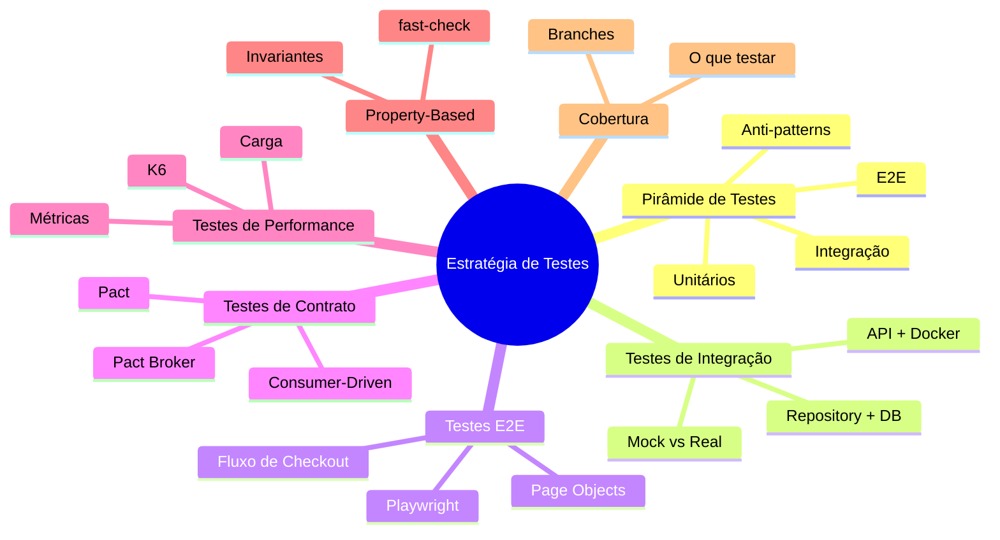
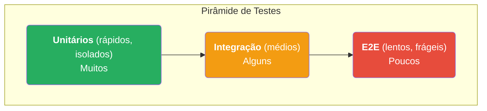
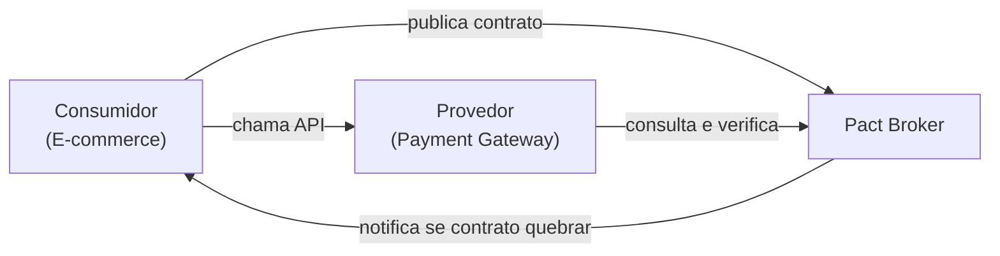

# Engenharia de Software — Aula 17

## Pirâmide de Testes & Testes Avançados

**Duração:** 100 minutos  
**Nível:** Intermediário-Avançado  
**Pré-requisitos:** Aulas 01–16 (especialmente Aula 16 — Testes Unitários)

---

## Objetivos de Aprendizagem

Ao final desta aula, você será capaz de:

1. Explicar a pirâmide de testes e seus três níveis principais, identificando anti-patterns comuns
2. Implementar testes de integração entre componentes reais (repositório + banco, API + banco)
3. Decidir quando usar um componente real vs. um mock em testes de integração
4. Escrever um teste E2E completo com Playwright simulando um fluxo de checkout
5. Compreender o modelo de Consumer-Driven Contracts com Pact
6. Escrever um teste de carga simples com k6 e interpretar métricas p95/p99
7. Aplicar property-based testing com fast-check para validar invariantes
8. Analisar cobertura de branches e identificar o que vale a pena testar
9. Projetar uma estratégia de testes equilibrada para um sistema real
10. Diferenciar os papéis de cada nível de teste na prevenção de regressões

---

## Como Usar Esta Aula

Esta aula combina **fundamentos teóricos** com **aplicação prática** em um cenário de e-commerce. Recomendamos:

- Leia a seção **Fundamentos** primeiro para entender a estratégia geral
- Depois acompanhe os **exemplos práticos** na seção de Aplicação
- Execute os códigos no seu ambiente local (Playwright, Pact, k6, fast-check)
- Responda ao **quiz** e aos **exercícios** antes de consultar os gabaritos
- Para dúvidas rápidas, consulte o **FAQ** e o **Glossário** no final

---

## Mapa Mental da Aula



---

## Recapitulação: Aulas 01–16

Nas aulas anteriores você construiu a base da engenharia de software moderna:

- **Aulas 01–08:** Fundamentos de engenharia de requisitos, modelagem, arquitetura e design de software
- **Aulas 09–12:** Padrões de projeto, SOLID, refatoração e dívida técnica
- **Aulas 13–14:** Git, versionamento, code review e integração contínua
- **Aulas 15–16:** Fundamentos de qualidade, TDD e testes unitários com Jest

**Aula 16** foi especialmente importante: você aprendeu a escrever testes unitários isolados com Jest, mocking de dependências, teste de bordas e TDD. Agora vamos **subir um nível** na pirâmide e testar componentes inteiros interagindo entre si.

---

> **FUNDAMENTOS:** A Estratégia Completa de Testes  
> Antes de escrever um único teste de integração, você precisa entender *por que* cada nível existe, qual problema resolve e como eles se equilibram. Esta seção cobre a teoria essencial.

---

## 1. Pirâmide de Testes

A **pirâmide de testes** é um modelo visual que descreve a proporção ideal entre diferentes tipos de teste automatizado. Criada por Mike Cohn, ela responde a uma pergunta prática: *quanto de cada tipo de teste devo escrever?*

A ideia central é simples: **escreva muitos testes baratos e rápidos, e poucos testes caros e lentos**.



### Por que a pirâmide?

Cada nível responde a uma pergunta diferente:

| Nível | Pergunta | Velocidade | Custo |
|---|---|---|---|
| **Unitário** | "Meu método faz o que deveria?" | Milissegundos | Muito baixo |
| **Integração** | "Meus componentes conversam direito?" | Segundos | Médio |
| **E2E** | "O sistema funciona do ponto de vista do usuário?" | Minutos | Alto |

### Anti-patterns

Três desvios comuns que você precisa reconhecer:

1. **Pirâmide Invertida** — muitos testes E2E, poucos unitários. Lentidão extrema, testes frágeis que quebram por qualquer mudança na UI.

2. **Cone de Sorvete** — muitos testes de integração, mas quase nenhum teste unitário. Você perde a precisão do diagnóstico: um teste de integração que falha pode ter 10 causas possíveis.

3. **Cupcake** — muitos testes E2E *e* muitos unitários, mas integração negligenciada. O pior dos dois mundos: você tem testes lentos *e* buracos nos contratos entre componentes.

> **Regra prática:** para cada teste E2E, tenha ~10 testes de integração e ~100 testes unitários. Essa proporção não é exata, mas dá uma direção.

**Quick Check**

**1. Qual o principal benefício de ter muitos testes unitários e poucos E2E?**  
**Resposta:** Velocidade de feedback e isolamento de falhas. Testes unitários rodam em milissegundos e apontam exatamente onde o erro está. Testes E2E lentos mascaram a causa raiz.

**2. Uma equipe tem 50 testes E2E, 20 de integração e 10 unitários. Que anti-pattern é esse?**  
**Resposta:** Pirâmide invertida. A base (unitários) é a menor parte, o que torna a suíte lenta e frágil.

---

> **APLICAÇÃO:** Testes de Integração, E2E, Contrato e Performance no E-commerce  
> Agora que você entende a estratégia, vamos aplicar cada nível no cenário de um e-commerce. O código é real e executável.

---

## 2. Testes de Integração

Testes de integração verificam se dois ou mais componentes funcionam corretamente *juntos*. Diferente dos unitários, aqui usamos componentes reais (ou quase reais).

### 2.1 Repositório + Banco em Memória

```javascript
// src/repositories/orderRepository.js
const Database = require('better-sqlite3');

class OrderRepository {
  constructor(db) {
    this.db = db;
  }

  save(order) {
    const stmt = this.db.prepare(
      'INSERT INTO orders (id, customer, total, status) VALUES (?, ?, ?, ?)'
    );
    stmt.run(order.id, order.customer, order.total, order.status);
  }

  findById(id) {
    return this.db.prepare('SELECT * FROM orders WHERE id = ?').get(id);
  }
}
```

```javascript
// tests/integration/orderRepository.test.js
const Database = require('better-sqlite3');
const OrderRepository = require('../../src/repositories/orderRepository');

describe('OrderRepository', () => {
  let db;
  let repo;

  beforeEach(() => {
    db = new Database(':memory:');
    db.exec(`
      CREATE TABLE orders (
        id TEXT PRIMARY KEY,
        customer TEXT NOT NULL,
        total REAL NOT NULL,
        status TEXT NOT NULL
      )
    `);
    repo = new OrderRepository(db);
  });

  afterEach(() => {
    db.close();
  });

  test('deve salvar e recuperar um pedido', () => {
    const order = { id: '1', customer: 'João', total: 250.0, status: 'pending' };
    repo.save(order);
    const result = repo.findById('1');
    expect(result).toMatchObject(order);
  });

  test('deve retornar undefined para pedido inexistente', () => {
    const result = repo.findById('999');
    expect(result).toBeUndefined();
  });
});
```

**Por que usar `:memory:`?** Banco efêmero, zero configuração, rápido. Cada teste começa limpo — sem poluição entre casos.

### 2.2 API + Banco Real (Docker)

Quando você precisa testar a API real contra um banco real, use Docker para subir uma instância limpa:

```yaml
# docker-compose.test.yml
services:
  postgres-test:
    image: postgres:16-alpine
    environment:
      POSTGRES_DB: ecommerce_test
      POSTGRES_USER: test
      POSTGRES_PASSWORD: test
    ports:
      - "5433:5432"
```

```javascript
// tests/integration/api.test.js
const axios = require('axios');

const API_URL = 'http://localhost:3000';

describe('API de Pedidos (integração real)', () => {
  test('POST /orders deve criar pedido com status 201', async () => {
    const response = await axios.post(`${API_URL}/orders`, {
      customer: 'Maria',
      items: [{ product: 'Camiseta', price: 49.9, qty: 2 }]
    });
    expect(response.status).toBe(201);
    expect(response.data.status).toBe('pending');
  });

  test('GET /orders/:id deve retornar 404 para pedido inexistente', async () => {
    await expect(
      axios.get(`${API_URL}/orders/999`)
    ).rejects.toThrow('Request failed with status code 404');
  });
});
```

### Mock vs. Componente Real: quando usar cada um?

| Situação | Recomendação |
|---|---|
| Testar regra de negócio isolada | Mock do repositório |
| Testar consulta SQL complexa | Banco real (ou `:memory:`) |
| Testar cache (Redis) | Redis real em Docker |
| Testar envio de e-mail | Mock do serviço de e-mail |
| Testar integração com gateway de pagamento | Sandbox real do gateway |

**Regra de ouro:** mock o que está *fora* do seu controle (APIs externas, sistemas legados). Use real para o que está *dentro* (seu banco, seu cache, seus serviços internos).

## 3. Testes E2E com Playwright

Testes **End-to-End** simulam o usuário real: cliques, preenchimento de formulários, navegação entre páginas. Usamos **Playwright** por sua velocidade e confiabilidade.

### 3.1 Configuração

```javascript
// playwright.config.js
const { defineConfig } = require('@playwright/test');

module.exports = defineConfig({
  testDir: './tests/e2e',
  timeout: 30000,
  retries: 1,
  use: {
    baseURL: 'http://localhost:5173',
    screenshot: 'only-on-failure',
    trace: 'retain-on-failure',
  },
});
```

### 3.2 Page Objects

```javascript
// tests/e2e/pages/CheckoutPage.js
class CheckoutPage {
  constructor(page) {
    this.page = page;
  }

  async addToCart(productId) {
    await this.page.click(`[data-testid="add-to-cart-${productId}"]`);
  }

  async fillAddress(address) {
    await this.page.fill('[data-testid="address-street"]', address.street);
    await this.page.fill('[data-testid="address-city"]', address.city);
    await this.page.fill('[data-testid="address-zip"]', address.zip);
  }

  async selectPayment(method) {
    await this.page.click(`[data-testid="payment-${method}"]`);
  }

  async confirmOrder() {
    await this.page.click('[data-testid="confirm-order"]');
  }

  async getOrderConfirmationId() {
    return this.page.textContent('[data-testid="order-id"]');
  }
}
```

### 3.3 Fluxo de Checkout Completo

```javascript
// tests/e2e/checkout.spec.js
const { test, expect } = require('@playwright/test');
const CheckoutPage = require('./pages/CheckoutPage');

test('fluxo completo de checkout', async ({ page }) => {
  const checkout = new CheckoutPage(page);

  // 1. Acessar loja e adicionar produto
  await page.goto('/');
  await checkout.addToCart('prod-001');
  await expect(page.locator('[data-testid="cart-count"]')).toHaveText('1');

  // 2. Ir para o checkout
  await page.click('[data-testid="go-to-checkout"]');

  // 3. Preencher endereço
  await checkout.fillAddress({
    street: 'Rua Exemplo, 123',
    city: 'São Paulo',
    zip: '01234-567'
  });

  // 4. Selecionar forma de pagamento
  await checkout.selectPayment('credit-card');

  // 5. Confirmar pedido
  await checkout.confirmOrder();

  // 6. Verificar confirmação
  const orderId = await checkout.getOrderConfirmationId();
  expect(orderId).toBeTruthy();
  await expect(page.locator('[data-testid="success-message"]')).toBeVisible();
  await expect(page).toHaveURL(/\/order\/confirm\//);
});
```

**Dica:** use `data-testid` atributos em vez de classes CSS ou seletores aninhados. Eles não mudam com o redesign e são explícitos sobre a intenção do teste.

**Quick Check**

**3. Por que usar `data-testid` em vez de classes CSS nos seletores do Playwright?**  
**Resposta:** `data-testid` é um contrato explícito entre desenvolvedores e testes. Classes CSS mudam com frequência (refatoração de estilo), enquanto `data-testid` só muda quando a funcionalidade muda, reduzindo falsos positivos.

---

## 4. Testes de Contrato com Pact

Testes de contrato garantem que dois serviços que se comunicam (via HTTP, mensageria, etc.) concordam com a mesma **interface**. O modelo **Consumer-Driven Contracts (CDC)** coloca o consumidor no centro: é ele quem define o contrato.

### 4.1 Consumidor (E-commerce) define o contrato

```javascript
// tests/contract/consumer.spec.js
const { Pact } = require('@pact-foundation/pact');
const axios = require('axios');

const provider = new Pact({
  consumer: 'EcommerceAPI',
  provider: 'PaymentGateway',
  port: 1234,
});

describe('Contrato: Ecommerce → PaymentGateway', () => {
  beforeAll(() => provider.setup());
  afterAll(() => provider.finalize());

  test('deve processar pagamento com cartão de crédito', async () => {
    await provider.addInteraction({
      state: 'cliente com saldo suficiente',
      uponReceiving: 'uma requisição de pagamento',
      withRequest: {
        method: 'POST',
        path: '/payments',
        headers: { 'Content-Type': 'application/json' },
        body: {
          orderId: 'ord-001',
          amount: 250.0,
          method: 'credit_card',
          cardToken: 'tok_abc123'
        }
      },
      willRespondWith: {
        status: 200,
        headers: { 'Content-Type': 'application/json' },
        body: {
          paymentId: 'pay_xyz789',
          status: 'approved'
        }
      }
    });

    const response = await axios.post('http://localhost:1234/payments', {
      orderId: 'ord-001',
      amount: 250.0,
      method: 'credit_card',
      cardToken: 'tok_abc123'
    });

    expect(response.status).toBe(200);
    expect(response.data.status).toBe('approved');
  });
});
```

### 4.2 Provedor (Payment Gateway) verifica o contrato

```javascript
// tests/contract/provider.spec.js
const { Verifier } = require('@pact-foundation/pact');

describe('Verificação do contrato (Provider)', () => {
  test('deve cumprir o contrato do consumidor', async () => {
    const verifier = new Verifier({
      providerBaseUrl: 'http://localhost:3001',
      pactBrokerUrl: 'http://localhost:9292',
      provider: 'PaymentGateway',
    });

    return verifier.verifyProvider().then(output => {
      console.log('Resultado:', output);
    });
  });
});
```

### Pact Broker

O **Pact Broker** é o repositório central de contratos. O consumidor publica o contrato; o provider consulta e verifica se ainda atende. Se quebrar, o broker avisa antes do deploy.



**Quick Check**

**4. O que acontece se o provedor mudar a API sem atualizar o contrato no Pact Broker?**  
**Resposta:** A verificação de contrato falha. O provider descobre o problema antes do deploy, e o broker notifica o consumidor sobre a mudança.

---

## 5. Testes de Performance com k6

Testes de performance verificam se o sistema aguenta a carga esperada. Usamos **k6**, uma ferramenta open-source de teste de carga.

### 5.1 Script de carga — 100 usuários simultâneos

```javascript
// tests/performance/checkout.scenario.js
import http from 'k6/http';
import { check, sleep } from 'k6';

export const options = {
  stages: [
    { duration: '30s', target: 100 },  // Rampa de 0 a 100 usuários
    { duration: '1m', target: 100 },   // Mantém 100 usuários
    { duration: '30s', target: 0 },    // Reduz gradualmente
  ],
  thresholds: {
    http_req_duration: ['p(95)<2000', 'p(99)<5000'],  // 95% em <2s, 99% em <5s
    http_req_failed: ['rate<0.01'],                    // Menos de 1% de erro
  },
};

export default function () {
  // 1. Adicionar ao carrinho
  const addRes = http.post('http://localhost:3000/cart', {
    productId: 'prod-001',
    qty: 1,
  });
  check(addRes, { 'carrinho OK': (r) => r.status === 200 });

  // 2. Finalizar checkout
  const checkoutRes = http.post('http://localhost:3000/checkout', {
    address: 'Rua ABC, 123',
    payment: 'credit_card',
  });
  check(checkoutRes, { 'checkout OK': (r) => r.status === 201 });

  sleep(1);
}
```

### 5.2 Executando e interpretando

```bash
k6 run tests/performance/checkout.scenario.js
```

Saída típica:
```
http_req_duration......: avg=450ms  p95=1800ms  p99=4200ms
http_req_failed........: 0.3% ✓ 4883 ✗ 17
```

**O que significam p95 e p99?**
- **p95:** 95% das requisições foram mais rápidas que 1.8s. Se estourar o threshold, 5% dos usuários estão com experiência ruim.
- **p99:** 99% foram abaixo de 4.2s. É o "teto" aceitável.

Se p95 > threshold, você tem um gargalo. Investigação comum: consulta SQL lenta, falta de cache, concorrência no banco.

**Quick Check**

**5. Por que usar p95/p99 em vez de média para thresholds de performance?**  
**Resposta:** A média esconde outliers. p95 e p99 revelam a experiência dos usuários no percentil superior — os que estão tendo a pior experiência. Um sistema com média 200ms pode ter p95 de 5s, inaceitável.

---

## 6. Property-Based Testing

No testing tradicional, você escolhe inputs e verifica outputs específicos. No **property-based testing**, você define **propriedades** que devem ser verdadeiras para *qualquer* input, e a ferramenta gera centenas de casos automaticamente.

### Exemplo com fast-check

```javascript
const fc = require('fast-check');

// Propriedade: "qualquer lista de itens com preços positivos produz subtotal > 0"
describe('Cálculo de subtotal', () => {
  test('subtotal deve ser sempre positivo para itens com preço > 0', () => {
    fc.assert(
      fc.property(
        fc.array(
          fc.record({
            price: fc.float({ min: 0.01, max: 10000 }),
            qty: fc.integer({ min: 1, max: 100 })
          }),
          { minLength: 1, maxLength: 50 }
        ),
        (items) => {
          const subtotal = items.reduce((sum, item) => sum + item.price * item.qty, 0);
          return subtotal > 0;
        }
      )
    );
  });

  test('desconto não pode tornar subtotal negativo', () => {
    fc.assert(
      fc.property(
        fc.float({ min: 0, max: 1 }),
        fc.integer({ min: 1, max: 100 }),
        (discountPercent, originalPrice) => {
          const discount = originalPrice * discountPercent;
          const final = originalPrice - discount;
          return final >= 0;
        }
      )
    );
  });
});
```

**Quando usar?** Algoritmos, validações, cálculos financeiros — qualquer coisa com invariantes claras. Evite para IO, UI ou lógica com muitos efeitos colaterais.

**Quick Check**

**6. Que tipo de bug o property-based testing pega que testes tradicionais (exemplo-a-exemplo) não pegam?**  
**Resposta:** Casos de borda que o desenvolvedor não imaginou. Testes tradicionais testam o que você *lembrou* de testar; property-based testa o que você *esqueceu*.

---

## 7. Cobertura Significativa

"90% de cobertura" não significa nada se os 10% não cobertos são justamente a lógica crítica. O que importa é **cobertura de branches**, não de linhas.

### Branch Coverage vs. Line Coverage

```javascript
function calcularFrete(tipo, distancia) {
  let valor = 0;                              // linha 1
  if (tipo === 'expresso' && distancia < 50) { // linha 2
    valor = 20;                                // linha 3
  } else if (tipo === 'normal') {              // linha 4
    valor = distancia * 0.5;                   // linha 5
  } else {                                     // linha 6
    valor = distancia * 0.8;                   // linha 7
  }
  return valor;                                // linha 8
}
```

- **Line coverage 100%** — basta um teste que passe por todas as linhas
- **Branch coverage 100%** — precisa testar: `tipo==='expresso' && distancia<50`, `tipo==='expresso' && distancia>=50`, `tipo==='normal'`, e o `else` (outros tipos)

### O que NÃO testar

| Não teste | Por quê |
|---|---|
| **Getters e setters puros** | São boilerplate, não têm lógica |
| **Código de configuração** | URLs, portas, timeouts |
| **Constantes e enums** | Não mudam |
| **Código de terceiros** | Bibliotecas têm seus próprios testes |
| **Código morto/legado sem mudanças** | Testar agora não traz valor |

### Foco real

Teste:
- Lógica de negócio (cálculos, regras, validações)
- Condicionais (branches)
- Tratamento de erros
- Casos de borda (0, negativo, vazio, nulo)
- Integrações com sistemas externos

> **Regra: teste o que pode quebrar.** Se uma linha tem `if` com lógica condicional, ela merece teste. Se é uma atribuição direta, provavelmente não.

---

## Quiz de Verificação

**1. Qual o propósito principal dos testes de integração na pirâmide?**  
a) Testar a UI do usuário final  
b) Verificar se componentes conversam entre si corretamente  
c) Substituir testes unitários  
d) Garantir performance da aplicação  

**Resposta:** b) Verificar se componentes conversam entre si corretamente.

---

**2. No Playwright, qual a melhor prática para selecionar elementos na página?**  
a) Usar classes CSS  
b) Usar seletores XPath complexos  
c) Usar atributos `data-testid`  
d) Usar tags HTML  

**Resposta:** c) Usar atributos `data-testid`.

---

**3. No Pact, quem define o contrato?**  
a) O provedor da API  
b) O consumidor da API  
c) O Pact Broker  
d) O DevOps  

**Resposta:** b) O consumidor da API. No modelo Consumer-Driven Contracts, o consumidor define o contrato.

---

**4. O que significa p95 = 2s em um teste de carga?**  
a) 95% das requisições falharam  
b) 5% das requisições levaram mais de 2s  
c) 95% dos usuários estão satisfeitos  
d) A média é de 2s  

**Resposta:** b) 5% das requisições levaram mais de 2s. p95 indica o limite onde 95% estão abaixo.

---

**5. Qual anti-pattern tem muitos testes E2E e poucos unitários?**  
a) Cone de sorvete  
b) Cupcake  
c) Pirâmide invertida  
d) Pirâmide ideal  

**Resposta:** c) Pirâmide invertida.

---

**6. Property-based testing é mais indicado para:**  
a) Testar UI  
b) Testar cálculos e invariantes  
c) Testar integração com banco  
d) Testar performance  

**Resposta:** b) Testar cálculos e invariantes.

---

**7. Qual tipo de cobertura é mais significativo para qualidade?**  
a) Line coverage  
b) Branch coverage  
c) Function coverage  
d) File coverage  

**Resposta:** b) Branch coverage. Cobertura de branches garante que todos os caminhos condicionais foram exercitados.

---

## Exercícios

### Exercício 1 (Fácil): Identifique anti-patterns

Dado o seguinte relatório de testes de um projeto:

- 200 testes E2E (30 min para rodar)
- 50 testes de integração (2 min)
- 30 testes unitários (5s)

Que anti-pattern está presente? Como você redistribuiria os esforços?

**Gabarito:** Pirâmide invertida. A base (unitários) é a menor camada. Redistribuição ideal: ~200 unitários, ~50 integração, ~20 E2E.

---

### Exercício 2 (Médio): Teste de integração com banco

Dado o repositório abaixo, escreva um teste de integração que:
1. Crie um banco SQLite em memória
2. Salve um produto
3. Busque por ID
4. Verifique que o produto salvo corresponde ao original

```javascript
class ProductRepository {
  constructor(db) { this.db = db; }
  save(product) {
    this.db.prepare('INSERT INTO products (id, name, price) VALUES (?, ?, ?)')
      .run(product.id, product.name, product.price);
  }
  findById(id) {
    return this.db.prepare('SELECT * FROM products WHERE id = ?').get(id);
  }
}
```

**Gabarito:**

```javascript
const Database = require('better-sqlite3');
const ProductRepository = require('./ProductRepository');

test('deve salvar e recuperar produto', () => {
  const db = new Database(':memory:');
  db.exec('CREATE TABLE products (id TEXT PRIMARY KEY, name TEXT, price REAL)');
  const repo = new ProductRepository(db);

  const product = { id: 'p1', name: 'Teclado', price: 199.9 };
  repo.save(product);

  const result = repo.findById('p1');
  expect(result).toMatchObject(product);
  db.close();
});
```

---

### Exercício 3 (Difícil): Estratégia de testes para microsserviço

Você é o engenheiro de qualidade de um time que está construindo um microsserviço de **recomendação de produtos**. O serviço:

- Recebe um `customerId` e retorna 5 produtos recomendados
- Consulta um banco PostgreSQL com histórico de compras
- Chama uma API externa de machine learning para gerar scores
- Faz cache dos resultados em Redis por 1 hora

**Pergunta:** Para cada nível da pirâmide (unitário, integração, E2E, contrato, performance), descreva **um** teste específico que você escreveria, dizendo o que testar, com qual ferramenta e o que mockar.

**Gabarito:**

| Nível | Teste | Ferramenta | Mocks |
|---|---|---|---|
| **Unitário** | Testar algoritmo de ordenação dos scores | Jest | Repositório, API ML, cache |
| **Integração** | Testar consulta SQL no PostgreSQL real | Jest + Docker | API ML (mockada) |
| **Contrato** | Garantir que resposta do endpoint bate com o contrato | Pact | — |
| **E2E** | Fluxo completo: chamar API → consultar banco → cachear → retornar | Playwright | API ML (sandbox) |
| **Performance** | 50 req/s concorrentes, p95 < 500ms | k6 | API ML (mockada) |

---

## Resumo

- A **pirâmide de testes** organiza os testes em camadas: muitos unitários (base), alguns de integração (meio), poucos E2E (topo)
- **Testes de integração** usam componentes reais (banco em memória, Docker) para verificar contratos entre componentes
- **Testes E2E** com Playwright simulam o usuário real; use `data-testid` para seletores robustos
- **Testes de contrato** (Pact) garantem que consumidor e provedor concordam com a mesma interface
- **Testes de performance** com k6 usam p95/p99 para medir experiência real do usuário
- **Property-based testing** (fast-check) gera inputs aleatórios e verifica invariantes
- **Cobertura significativa** prioriza branches sobre linhas, e foca em lógica de negócio, condicionais e bordas

---

## Próxima Aula — Aula 18: CI/CD Pipeline

Na Aula 18 você vai aprender a **automatizar toda essa estratégia de testes** dentro de um pipeline de Integração Contínua. Vamos configurar GitHub Actions para rodar testes unitários, de integração e E2E em cada pull request, e adicionar gates de qualidade (cobertura, performance) antes do merge.

---

## Referências

- **Pirâmide de Testes** — Mike Cohn, "Succeeding with Agile" (2009)
- **Playwright Documentation** — https://playwright.dev/docs/intro
- **Pact Documentation** — https://docs.pact.io
- **k6 Documentation** — https://k6.io/docs
- **fast-check Documentation** — https://fast-check.dev
- **better-sqlite3** — https://github.com/WiseLibs/better-sqlite3
- Martin Fowler, "TestPyramid" — https://martinfowler.com/bliki/TestPyramid.html

---

## FAQ

**1. O que é a pirâmide de testes?**  
É um modelo visual que descreve a proporção ideal entre testes unitários (base), integração (meio) e E2E (topo).

**2. Quantos testes de cada tipo devo ter?**  
Não existe número fixo, mas a proporção orientativa é ~70% unitários, ~20% integração, ~10% E2E.

**3. Teste de integração substitui teste unitário?**  
Não. Eles testam coisas diferentes. Unitário testa uma unidade isolada; integração testa a interação entre unidades.

**4. Playwright vs. Cypress: qual escolher?**  
Ambos são excelentes. Playwright é mais rápido e tem suporte nativo a múltiplos navegadores e mobile.

**5. Pact funciona apenas para APIs REST?**  
Não. Pact também suporta mensageria (RabbitMQ, Kafka) e GraphQL.

**6. Preciso de um Pact Broker?**  
Não obrigatoriamente, mas ele facilita o gerenciamento de múltiplos contratos entre times.

**7. k6 vs. JMeter: qual usar?**  
k6 é mais moderno, usa JavaScript, tem integração nativa com CI/CD e é mais leve. JMeter tem mais plugins mas é mais pesado.

**8. Property-based testing substitui testes tradicionais?**  
Não. Ele complementa. Use para validar invariantes e gerar casos de borda, mas mantenha testes exemplo-a-exemplo para cenários conhecidos.

**9. O que é cobertura de branches?**  
Percentual de caminhos condicionais (`if/else`, `switch`, operadores ternários) que foram executados pelos testes.

**10. Devo testar código de terceiros?**  
Não. Confie que a biblioteca testa o próprio código. Teste apenas a integração do seu código com ela.

---

## Glossário

| Termo | Definição |
|---|---|
| **Pirâmide de Testes** | Modelo de proporção entre tipos de teste |
| **Teste Unitário** | Testa uma unidade isolada do sistema |
| **Teste de Integração** | Testa a interação entre componentes |
| **Teste E2E** | Testa o fluxo completo do usuário |
| **Pact** | Framework de Consumer-Driven Contracts |
| **k6** | Ferramenta de teste de carga |
| **Playwright** | Framework de automação de navegador |
| **p95/p99** | Percentis 95 e 99 para latência |
| **Property-Based Testing** | Teste que valida invariantes com inputs aleatórios |
| **Branch Coverage** | Cobertura de caminhos condicionais |
| **fast-check** | Biblioteca JS de property-based testing |
| **Consumer-Driven Contract** | Contrato definido pelo consumidor do serviço |
| **Pact Broker** | Repositório central de contratos Pact |
| **Threshold** | Limite aceitável para métrica (ex: p95 < 2s) |
