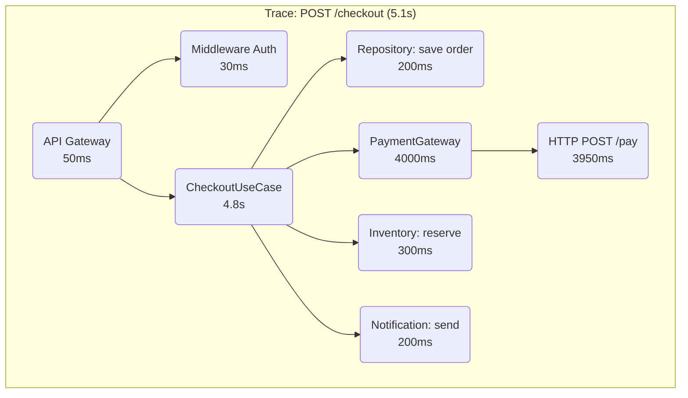

## Como Usar Este Arquivo

Este arquivo contém **questões de checkpoint** para você validar seu domínio da Aula 20. Cada questão testa um conceito específico da aula.

**Instruções:**

1. Crie uma pasta `entregas/aula20/` no seu repositório de estudos
2. Para cada questão, crie um arquivo separado: `Q1.md`, `Q2.md`, etc.
3. Preencha os templates abaixo com suas respostas
4. Ao final, revise o **Checklist Final** para confirmar que está pronto para a Aula 21

---

## Questão 1: DevOps na Prática — Identifique o Anti-pattern

**Conceito-chave:** Aula 20, Seção 1 (DevOps: Cultura, não Ferramenta)

**Objetivo:** Identificar desvios de cultura DevOps em cenários reais e propor a abordagem correta.

**Passos de Execução:**

1. Leia cada cenário abaixo
2. Identifique se ele segue ou viola o princípio "You build it, you run it"
3. Se viola, proponha como deveria ser

**Cenários:**

| # | Cenário | DevOps? (Sim/Não) | Correção |
|---|---|---|---|
| A | O time de desenvolvimento entrega o código para o time de operações fazer deploy | | |
| B | Os desenvolvedores monitoram os alertas em produção e participam do plantão | | |
| C | A empresa contratou um "time de DevOps" que gerencia toda a infraestrutura | | |
| D | Cada sprint inclui tempo para melhorar a observabilidade e reduzir dívida técnica | | |

**Entrega:**

```markdown
# Questão 1: DevOps Anti-patterns

## Análise dos cenários

| Cenário | DevOps? | Correção |
|---|---|---|
| A | | |
| B | | |
| C | | |
| D | | |

## Reflexão

Em uma frase, qual o maior benefício de adotar "You build it, you run it" no seu time atual?
```

---

## Questão 2: Docker Compose — Stack de Observabilidade

**Conceito-chave:** Aula 20, Seção 6 (Docker Compose — Stack Completa)

**Objetivo:** Demonstrar capacidade de montar e verificar a stack de observabilidade.

**Passos de Execução:**

1. Crie um `docker-compose.yml` com os serviços: API, PostgreSQL, Redis, Prometheus, Grafana, Jaeger e Alertmanager
2. Adicione healthchecks no PostgreSQL e no Redis
3. Configure o Prometheus para fazer scraping da API a cada 15s
4. Execute `docker compose up -d` e verifique com `docker compose ps`

**Entrega:**

```markdown
# Questão 2: Stack de Observabilidade

## docker-compose.yml

\`\`\`yaml
# Cole aqui seu docker-compose.yml (versão simplificada, apenas os serviços essenciais)
\`\`\`

## Serviços e portas

| Serviço | Porta | Função |
|---|---|---|
| API | | |
| PostgreSQL | | |
| Prometheus | | |
| Grafana | | |
| Jaeger | | |
| Alertmanager | | |

## Verificação

- Comando usado: `________________`
- Resultado: `________________`
```

---

## Questão 3: Logs Estruturados com Pino

**Conceito-chave:** Aula 20, Seção 2 (Logs Estruturados)

**Objetivo:** Configurar logs estruturados com pino e implementar um middleware com requestId.

**Passos de Execução:**

1. Instale pino e pino-pretty
2. Crie `src/infrastructure/logger.ts` com configuração básica e `redact` para senha e token
3. Crie um middleware que adiciona requestId a cada requisição
4. Emita um log info e um log error com contexto

**Entrega:**

```markdown
# Questão 3: Logs Estruturados

## Configuração do logger

\`\`\`typescript
// logger.ts
\`\`\`

## Middleware requestLogger

\`\`\`typescript
// requestLogger.ts
\`\`\`

## Exemplo de log gerado

\`\`\`json
// Cole aqui o JSON de log que o pino produziria para uma requisição GET /products com status 200
\`\`\`

## O que NUNCA logar

Liste 3 tipos de informação que nunca devem aparecer em logs e explique por quê.
```

---

## Questão 4: Métricas RED com prom-client

**Conceito-chave:** Aula 20, Seção 3 (Métricas — O Segundo Pilar)

**Objetivo:** Implementar métricas RED para um endpoint e expô-las via /metrics.

**Passos de Execução:**

1. Instale prom-client
2. Crie métricas: `http_requests_total`, `http_requests_errors_total`, `http_request_duration_seconds`
3. Crie um middleware que registra RED automaticamente
4. Exponha o endpoint /metrics

**Entrega:**

```markdown
# Questão 4: Métricas RED

## Configuração das métricas

\`\`\`typescript
// metrics.ts
\`\`\`

## Middleware RED

\`\`\`typescript
// metricsMiddleware.ts
\`\`\`

## Endpoint /metrics

\`\`\`typescript
app.get("/metrics", ...
\`\`\`

## Pergunta

Qual a diferença entre Counter e Histogram no Prometheus, e quando usar cada um?
```

---

## Questão 5: Tracing com OpenTelemetry

**Conceito-chave:** Aula 20, Seção 4 (Tracing Distribuído) e Seção 9 (Tracing com OpenTelemetry)

**Objetivo:** Instrumentar a API com OpenTelemetry e analisar um trace no Jaeger.

**Passos de Execução:**

1. Instale os pacotes OpenTelemetry necessários
2. Configure o SDK no `src/infrastructure/tracing.ts`
3. Crie um span manual para uma operação de negócio (ex: cálculo de frete)
4. Analise o trace abaixo e identifique o gargalo

**Trace para análise:**



**Entrega:**

```markdown
# Questão 5: Tracing

## Setup do OpenTelemetry

\`\`\`typescript
// tracing.ts
\`\`\`

## Span customizado

\`\`\`typescript
// Código do span manual
\`\`\`

## Análise do trace

- Tempo total: ________________
- Gargalo identificado: ________________
- Esse gargalo representa _____% do tempo total
- Ação recomendada: ________________

## Por que o tracing deve ser importado antes do Express?
```

---

## Questão 6: Dashboard e Alertas

**Conceito-chave:** Aula 20, Seção 10 (Dashboards no Grafana e Alertas)

**Objetivo:** Criar um dashboard Grafana com painéis RED e configurar alertas no Prometheus.

**Passos de Execução:**

1. Crie um dashboard JSON com 3 painéis: Rate, Errors, Latência p95
2. Crie uma regra de alerta que dispare se a taxa de erro ultrapassar 2% por 5 minutos
3. Configure o Alertmanager para notificar um canal Slack

**Entrega:**

```markdown
# Questão 6: Dashboard e Alertas

## Dashboard RED (JSON simplificado)

\`\`\`json
{
  "title": "Meu Dashboard",
  "panels": [
    // Cole aqui a configuração dos painéis
  ]
}
\`\`\`

## Regra de alerta

\`\`\`yaml
# alerts.yml
\`\`\`

## Configuração do Alertmanager

\`\`\`yaml
# alertmanager.yml
\`\`\`

## Pergunta

Qual a diferença entre um alerta disparar e ele ser resolvido? Como o Alertmanager lida com isso?
```

---

## Questão 7: SLI/SLO/Error Budget

**Conceito-chave:** Aula 20, Seção 5 (SLI, SLO e SLA)

**Objetivo:** Calcular error budget e tomar decisões baseadas em SLO.

**Passos de Execução:**

1. Considere: API de catálogo tem SLO de 99% de requisições em < 300ms (p95)
2. Em um mês de 30 dias, a API recebe ~5M de requisições
3. Até o dia 20, já ocorreram 35.000 requisições com latência > 300ms
4. Responda: o error budget ainda está disponível? Pode fazer deploy arriscado?

**Entrega:**

```markdown
# Questão 7: SLI/SLO/Error Budget

## Cálculos

- SLO: ______%
- Error budget total (mês): ______ requisições (______% de 5M)
- Falhas até o dia 20: ______ requisições
- Error budget restante: ______ requisições
- Porcentagem restante: ______%

## Decisão

- Pode fazer deploy arriscado? [Sim/Não]
- Justificativa: [explique em 2-3 frases]

## Sua sugestão

Que SLI você adicionaria para o endpoint de busca de produtos, e qual SLO proporia?
```

---

## Questão 8: Debug de Incidente Real

**Conceito-chave:** Aula 20, Seções 2-5 (Integração dos três pilares)

**Objetivo:** Usar logs, métricas e tracing em conjunto para debugar um incidente.

**Passos de Execução:**

1. Analise o cenário abaixo
2. Use as pistas de logs, métricas e tracing para identificar a causa raiz
3. Proponha uma correção e uma prevenção

**Cenário:** Clientes reportam que o checkout está lento. O dashboard Grafana mostra latência p95 do POST /orders em 4.2s (normal: <500ms). O log mostra:

```json
{"level":"error","requestId":"req-789","msg":"Payment timeout","orderId":456,"gateway":"CreditCard","durationMs":9500}
```

O tracing no Jaeger mostra que o span `PaymentGateway.process` está levando 9.5s, com timeout configurado em 10s.

**Entrega:**

```markdown
# Questão 8: Debug de Incidente

## Diagnóstico

- Logs indicam: ________________
- Métricas indicam: ________________
- Tracing indica: ________________
- Causa raiz: ________________

## Correção imediata

[O que fazer agora para resolver?]

## Prevenção

[O que fazer para não acontecer de novo? Inclua mudanças em: timeout, alerta, SLO]
```

---

## Checklist Final: Pronto para a Aula 21?

Revise os itens abaixo. Marque `[x]` para cada conceito que você domina.

- [ ] Entendo que DevOps é cultura, não ferramenta ou cargo
- [ ] Sei explicar o princípio "You build it, you run it"
- [ ] Consigo subir a stack completa de observabilidade com Docker Compose
- [ ] Sei configurar logs estruturados com pino e o que NUNCA logar
- [ ] Consigo implementar métricas RED com prom-client
- [ ] Sei a diferença entre métricas RED e métricas de negócio
- [ ] Consigo instrumentar a API com OpenTelemetry e visualizar spans no Jaeger
- [ ] Sei identificar gargalos usando a waterfall view
- [ ] Consigo montar um dashboard Grafana com painéis RED
- [ ] Sei configurar alertas no Prometheus e rotear com Alertmanager
- [ ] Consigo calcular error budget a partir de um SLO
- [ ] Sei tomar decisões de deploy baseadas em error budget
- [ ] Consigo usar logs, métricas e tracing em conjunto para debugar incidentes

**Teaser da Aula 21:** Na próxima aula, você vai conectar tudo que aprendeu em um pipeline agêntico inteligente — gates de qualidade automatizados, análise de impacto baseada em tracing, rollout progressivo com feature flags, e um pipeline que decide autonomamente se uma release pode ir para produção com base em métricas de observabilidade em tempo real. Prepare sua stack!
