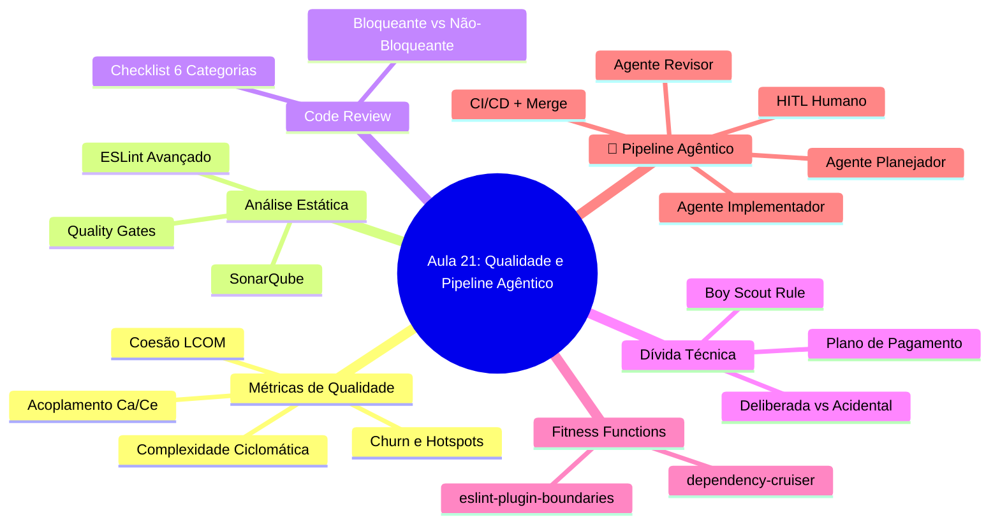
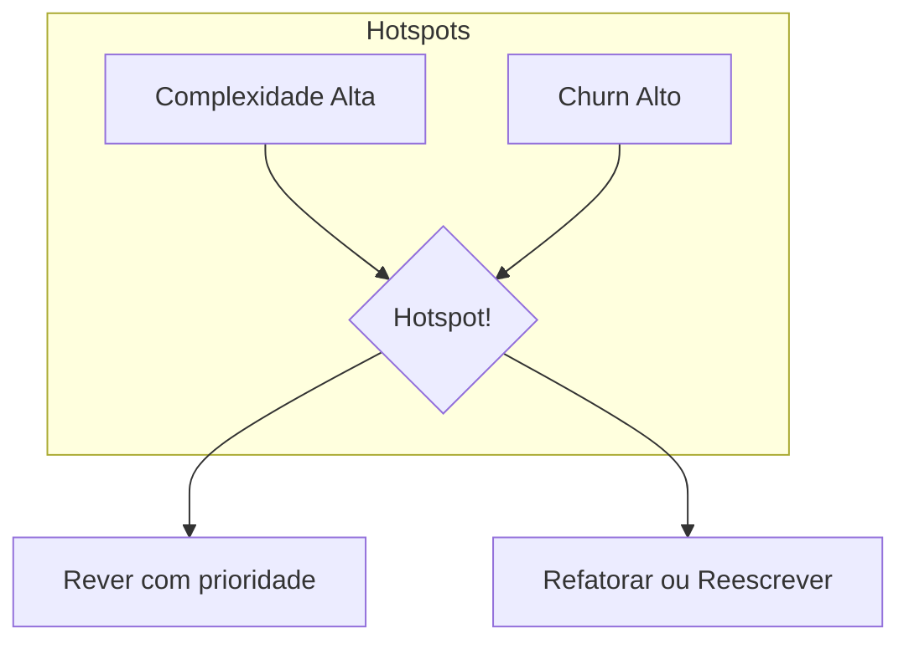
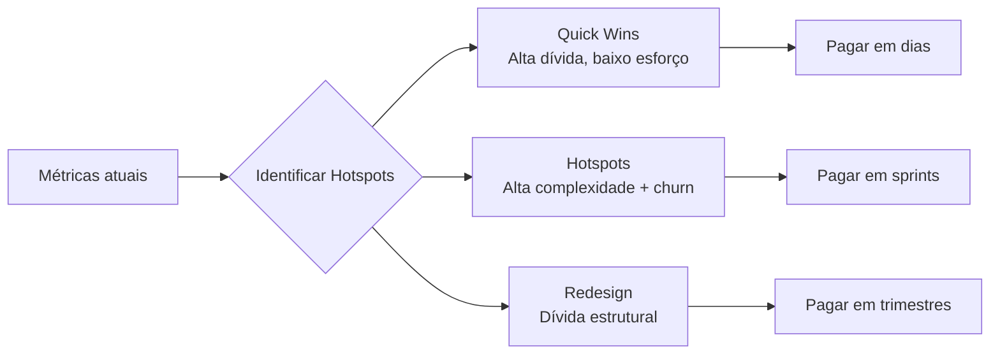
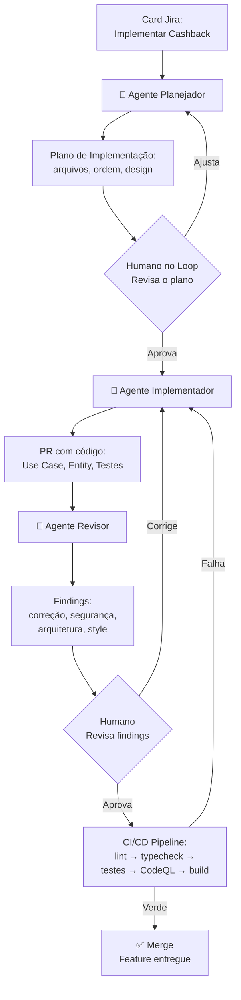

# Engenharia de Software — Aula 21

## Qualidade, Code Review & Pipeline Agêntico

**Duração estimada:** 100 minutos (45 de leitura + 55 de prática)

**Nível:** Avançado

**Pré-requisitos:** Aulas 01 a 20 completas — todo o módulo de Engenharia de Software

---

## Objetivos de Aprendizagem

Ao final desta aula, você será capaz de:

- [ ] **Interpretar** métricas de qualidade de código (complexidade ciclomática, LCOM, acoplamento, churn) para identificar hotspots
- [ ] **Configurar** o SonarQube via Docker Compose para análise contínua de qualidade
- [ ] **Aplicar** um code review checklist de 6 categorias em pull requests reais
- [ ] **Diferenciar** tipos de dívida técnica e priorizar seu pagamento com base em impacto
- [ ] **Implementar** fitness functions arquiteturais com dependency-cruiser
- [ ] **Descrever** o fluxo completo de um pipeline agêntico: card → planejador → HITL → implementador → revisor → CI/CD → merge
- [ ] **Analisar** o papel do humano como ponto de decisão e dos agentes como amplificadores de capacidade
- [ ] **Sintetizar** os aprendizados das 21 aulas e conectar cada peça construída
- [ ] **Avaliar** a maturidade do seu projeto com base nas métricas e checklists apresentados
- [ ] **Planejar** os próximos passos de evolução do seu sistema além deste módulo

---

## Como Usar Esta Aula

Esta é a **aula de fechamento** do módulo de Engenharia de Software. Ela tem duas metades bem distintas.

A **primeira metade** (Parte 1) constrói a base conceitual sobre qualidade de software: métricas, análise estática, code review, dívida técnica e fitness functions. São conceitos universais que se aplicam a qualquer linguagem ou framework.

A **segunda metade** (Parte 2) coloca a mão na massa: você vai configurar SonarQube, aplicar um checklist de code review real, implementar fitness functions e, no GRANDE FINALE, orquestrar o pipeline agêntico completo — do card no Jira ao merge, com agentes de IA em cada etapa.

Ao final, você encontra o **Resumo do Módulo** — uma tabela completa das 21 aulas com o que foi construído em cada uma. É o fechamento do ciclo.

**Tempo estimado:** 45 minutos de leitura + 55 minutos de prática.

## Mapa Mental

Este diagrama mostra todos os conceitos que você vai dominar nesta aula:



## Recapitulação das Aulas 01 a 20

Antes de fechar o módulo, vamos revisar o que você percorreu até aqui:

| Aula | Conceito Principal | Conexão com esta aula |
|---|---|---|
| 01 | Introdução, ciclo de vida, dívida técnica | As métricas que veremos aqui quantificam a dívida técnica |
| 02 | Clean Code — nomes, funções, estrutura | O code review verifica exatamente esses princípios |
| 03 | Refactoring — catálogo e prática | Refactoring paga dívida técnica; métricas indicam onde |
| 04 | SOLID — SRP, OCP, LSP | Fitness functions garantem que SOLID não seja violado |
| 05 | SOLID — ISP, DIP + DI | Coesão (LCOM) detecta interfaces inchadas |
| 06 | Padrões Criacionais | Complexidade ciclomática detecta switches que deveriam ser factories |
| 07 | Padrões Estruturais | Acoplamento mede se Adapter/Decorator estão isolando mudanças |
| 08 | Padrões Comportamentais | State/Strategy reduzem complexidade ciclomática |
| 09 | Module Pattern & Web/React Patterns | Organização de módulos impacta acoplamento |
| 10 | DDD — Modelagem Estratégica | Bounded Contexts devem ter acoplamento baixo entre si |
| 11 | DDD — Padrões Táticos | LCOM mede coesão de Aggregates e Entities |
| 12 | Arquitetura — Estilos e Decisões | Fitness functions validam regras arquiteturais |
| 13 | Clean Architecture na Prática | dependency-cruiser valida regra da dependência |
| 14 | Engenharia de Requisitos | Code review verifica se a implementação atende os critérios |
| 15 | SDD + BDD com Gherkin | Qualidade também é especificação clara e testável |
| 16 | TDD — Red-Green-Refactor | Cobertura de testes é métrica do Quality Gate |
| 17 | Pirâmide de Testes | Quality Gate exige cobertura ≥ 80% |
| 18 | CI/CD Pipeline | Pipeline agêntico se integra ao CI/CD |
| 19 | DevSecOps | Code review inclui checklist de segurança |
| 20 | DevOps & Observabilidade | Métricas de qualidade complementam métricas de operação |

---

**FUNDAMENTOS: Medindo e Mantendo a Qualidade**

> *Os conceitos desta seção são universais — valem para qualquer linguagem, framework ou equipe. Eles respondem a perguntas como: "meu código é bom?", "onde estão os pontos fracos?", "como evitar que a qualidade degrade com o tempo?". Na segunda parte, você verá como ferramentas concretas implementam cada um desses conceitos.*

---

## 1. Métricas de Qualidade

Como saber se seu código é bom? "Bom" é subjetivo — métricas tornam objetivo. Elas não substituem o julgamento humano, mas apontam onde olhar.

### Complexidade Ciclomática (McCabe)

Mede o número de caminhos linearmente independentes em uma função. Cada `if`, `else`, `switch case`, `while`, `for` e operador lógico (`&&`, `||`) adiciona um caminho.

**Regra prática:** complexidade > 10 merece atenção. > 20 precisa ser refatorada. > 50 é código que ninguém entende.

```typescript
// Complexidade 1 — reto, sem bifurcações
function getTotal(items: OrderItem[]): number {
  return items.reduce((sum, item) => sum + item.price * item.quantity, 0);
}

// Complexidade 5 — quatro caminhos diferentes
function applyDiscount(order: Order, coupon?: Coupon): number {
  let total = getTotal(order.items);
  if (!coupon) return total;                // caminho 1
  if (coupon.isExpired()) return total;     // caminho 2
  if (coupon.type === 'percentage') {       // caminho 3
    total = total * (1 - coupon.value / 100);
  } else if (coupon.type === 'fixed') {     // caminho 4
    total = Math.max(0, total - coupon.value);
  }
  return total;
}
```

### Coesão — LCOM (Lack of Cohesion of Methods)

Mede o quanto os métodos de uma classe compartilham seus campos. LCOM alto significa que a classe faz coisas demais — candidata a split.

```typescript
// LCOM baixo — todos os métodos usam `items` e `total`
class Order {
  private items: OrderItem[];
  private total: number;
  addItem(item: OrderItem) { /* usa items e total */ }
  removeItem(id: string) { /* usa items e total */ }
  calculateTotal() { /* usa items e total */ }
}
```

Se uma classe tem métodos que não compartilham campos, ela deveria ser duas classes.

### Acoplamento — Ca (Afferent) / Ce (Efferent)

**Ca (Afferent Coupling):** quantas classes de FORA dependem desta classe. Alto Ca = muitos dependentes. Mudar esta classe quebra várias.

**Ce (Efferent Coupling):** quantas classes FORA esta classe usa. Alto Ce = esta classe depende de muitas coisas. Mudanças externas a afetam.

**Instabilidade:** `I = Ce / (Ca + Ce)`. I = 1 significa máxima instabilidade (só depende, não é dependido). I = 0 significa máxima estabilidade (só é dependido, não depende).

### Churn e Hotspots

**Churn** é a frequência de modificações em um arquivo. **Hotspots** são arquivos com alta complexidade + alto churn — onde bugs acontecem.



O padrão é claro: arquivos que mudam muito (churn) e são complexos concentram a maior parte dos bugs. A regra 80/20 se aplica: 80% dos bugs estão em 20% dos arquivos.

### Quick Check 1

**1. Qual a diferença entre complexidade ciclomática e churn?**
**Resposta:** Complexidade ciclomática mede quantos caminhos lógicos uma função tem (estrutura estática). Churn mede frequência de modificações (dinâmica). O hotspot está na interseção: alta complexidade + alto churn.

**2. O que significa LCOM alto e o que você deve fazer?**
**Resposta:** LCOM alto significa que os métodos da classe compartilham pouco ou nenhum campo — a classe faz coisas demais. A ação recomendada é dividi-la em duas ou mais classes coesas.

---

## 2. Static Analysis e Quality Gates

Análise estática examina o código sem executá-lo — como um revisor que lê o código e aponta problemas antes de rodar.

### O que a análise estática detecta

- **Bugs potenciais:** null pointer, variável não usada, condicional sempre verdadeira
- **Code smells:** método muito longo, parâmetros demais, duplicação
- **Violações de estilo:** formatação, nomenclatura, imports não utilizados
- **Vulnerabilidades:** SQL injection, XSS, path traversal (quando configurada para segurança)
- **Complexidade:** funções acima do limite, classes muito acopladas

### Quality Gates

Um **Quality Gate** é um conjunto de thresholds que o código deve respeitar para ser considerado "saudável". Exemplo típico:

- **Duplicação:** < 3% de linhas duplicadas
- **Cobertura:** ≥ 80% de cobertura de testes (branches + lines)
- **Bugs:** zero bugs bloqueadores (Blocker/Critical)
- **Vulnerabilidades:** zero vulnerabilidades
- **Code Smells:** débito técnico < 5% do esforço total

O Quality Gate funciona como um semáforo: **verde** (passou, pode merge), **amarelo** (alerta, requer atenção), **vermelho** (bloqueado, precisa corrigir).

### ESLint com Regras de Complexidade

Você já viu ESLint nas aulas 01-03. Agora vamos estendê-lo com plugins que vão além de estilo:

```jsonc
// .eslintrc.json — configurações avançadas de complexidade
{
  "rules": {
    "complexity": ["warn", 10],              // complexidade ciclomática máxima
    "max-lines-per-function": ["warn", 40],  // linhas por função
    "max-params": ["warn", 3],              // parâmetros máximos
    "max-depth": ["warn", 3],               // aninhamento máximo
    "max-nested-callbacks": ["warn", 3],    // callbacks aninhados
    "sonarjs/cognitive-complexity": ["warn", 15] // complexidade cognitiva
  }
}
```

### Quick Check 2

**1. O que acontece se um código não passa no Quality Gate?**
**Resposta:** O merge é bloqueado. O pipeline falha e o PR não pode ser mesclado até que as violações sejam corrigidas ou o gate seja ajustado (o que é uma decisão do time, não do indivíduo).

**2. Qual a diferença entre complexidade ciclomática e complexidade cognitiva?**
**Resposta:** Complexidade ciclomática mede caminhos lógicos (estrutural). Complexidade cognitiva mede o esforço mental para entender o código — considera aninhamento, quebra de fluxo linear e agrupamento lógico.

---

## 3. Code Review Estruturado

Code review não é caça à bruxa — é aprendizado compartilhado. O objetivo não é "pegar erros", mas **construir conhecimento coletivo** sobre o código e o domínio.

### Revisão Bloqueante vs Não-Bloqueante

| Tipo | O que impede o merge | Exemplo |
|---|---|---|
| **Bloqueante** | Bug, segurança quebrada, arquitetura violada | "Senha em texto plano no log" |
| **Não-bloqueante** | Sugestão, estilo, melhoria futura | "Que tal extrair essa validação?" |

Comentários bloqueantes devem ser resolvidos antes do merge. Não-bloqueantes podem virar tarefa separada.

### As 6 Categorias do Checklist

**1. Correção funcional** — O código faz o que a task pede?
- Os critérios de aceitação estão cobertos?
- Trata o fluxo feliz e os fluxos de exceção?
- Os edge cases estão cobertos (valores nulos, listas vazias, limites)?

**2. Testes** — A funcionalidade está testada?
- Testes unitários cobrem a lógica de negócio?
- Testes de integração cobrem a interação com dependências reais?
- Os testes falham de forma útil? (mensagens de erro descritivas)

**3. Nomes e legibilidade** — O código é fácil de entender?
- Nomes de variáveis, funções e classes revelam intenção?
- Funções pequenas com um nível de abstração (SLAP)?
- Comentários necessários ou o código se explica?

**4. Duplicação** — Há repetição que deveria ser abstraída?
- Lógica idêntica ou similar aparece em mais de um lugar?
- A abstração proposta é adequada (não over-engineering)?
- Código copiado de outro lugar foi adaptado?

**5. Arquitetura** — A estrutura do sistema foi respeitada?
- Respeita a Clean Architecture (camadas, regra da dependência)?
- Segue os padrões do projeto (SOLID, Design Patterns)?
- Nova funcionalidade se encaixa nos Bounded Contexts existentes?

**6. Segurança** — O código é seguro?
- Inputs do usuário são validados e sanitizados?
- Queries usam parâmetros ou concatenação? (SQL injection)
- Dados sensíveis estão expostos em logs ou respostas?

### Quick Check 3

**1. Um comentário "sugerindo extrair uma função" é bloqueante ou não-bloqueante?**
**Resposta:** Não-bloqueante. É uma sugestão de melhoria — o código funciona sem ela. O autor pode aplicar em um PR seguinte.

**2. Quais das 6 categorias você NUNCA deve ignorar mesmo em PRs urgentes?**
**Resposta:** Correção funcional (se não faz o que deveria, não adianta merge) e Segurança (vulnerabilidade em produção é inaceitável). Testes também são essenciais — código sem teste é código quebrado que ainda não descobrimos.

---

## 4. Technical Debt

Dívida técnica é a metáfora financeira aplicada ao software: você adquire uma "dívida" ao tomar um atalho agora, e paga "juros" na forma de manutenção mais cara no futuro.

### Três Tipos de Dívida

| Tipo | Causa | Exemplo | Juros |
|---|---|---|---|
| **Deliberada** | Decisão consciente por prazo | "Vamos sem testes agora, fazemos depois" | Correção de bugs em produção |
| **Acidental** | Falta de conhecimento ou design inadequado | Herança onde composição seria melhor | Refactoring custoso |
| **Bit Rot** | Entropia natural do software | Dependência desatualizada quebra o build | Migração forçada |

### Boy Scout Rule

> *"Deixe o acampamento mais limpo do que você encontrou."* — Robert C. Martin

A cada alteração que você faz em um arquivo, deixe-o um pouco melhor: renomeie uma variável confusa, extraia uma função, adicione um teste que faltava. Pequenas melhorias contínuas evitam que a dívida técnica acumule.

### Estratégias de Pagamento

1. **Quick Wins** — Alta dívida, baixo esforço. Remover código morto, consolidar duplicação simples. Faça agora.
2. **Hotspots** — Alta complexidade + alto churn. Refatore com prioridade — são onde os bugs acontecem.
3. **Redesign** — Dívida estrutural que exige replanejamento. Migração de arquitetura, substituição de biblioteca. Planeje em sprints.

### Plano de Pagamento Priorizado



### Quick Check 4

**1. Qual a diferença entre dívida técnica deliberada e acidental?**
**Resposta:** Deliberada é uma decisão consciente (prazo vs qualidade). Acidental é resultado de falta de conhecimento ou design inadequado — você não sabia que estava criando dívida.

**2. O que diz a Boy Scout Rule e como ela se aplica a code review?**
**Resposta:** "Deixe o acampamento mais limpo do que encontrou." Ao revisar um PR, se você encontrar um trecho que pode ser melhorado (mesmo que não faça parte da mudança), sugira a melhoria. O código como um todo melhora gradualmente.

---

## 5. Fitness Functions

Fitness functions são testes que verificam **propriedades arquiteturais** do sistema. O termo vem da evolução genética — assim como um organismo precisa passar por testes de aptidão para sobreviver, seu código precisa passar por testes arquiteturais para ser aceito.

### O que uma Fitness Function valida

- **Regra da dependência:** `domain` não importa `infrastructure`
- **Limite de tamanho:** nenhum arquivo > 300 linhas
- **Complexidade máxima:** nenhuma função com complexidade > 10
- **Acoplamento máximo:** módulo X não depende de Y
- **Naming conventions:** nomes seguem o padrão do projeto
- **Não uso de APIs deprecadas:** proibir `any`, `require`, etc.

### Exemplo Universal

Em TypeScript, uma fitness function pode ser tão simples quanto um script que varre imports:

```typescript
// verify-architecture.ts — conceito, não execução
// Verifica que domain/ não importa infrastructure/
import { readFileSync } from 'fs';
import { globSync } from 'glob';

const domainFiles = globSync('src/**/domain/**/*.ts');
for (const file of domainFiles) {
  const content = readFileSync(file, 'utf-8');
  if (content.includes('../infrastructure/') || content.includes('from "..')) {
    console.error(`Violação: ${file} importa de infrastructure/`);
    process.exit(1);
  }
}
```

### Quick Check 5

**1. Qual a diferença entre um teste unitário e uma fitness function?**
**Resposta:** Teste unitário verifica o comportamento de uma unidade de código. Fitness function verifica propriedades estruturais ou arquiteturais do sistema como um todo — não o que o código faz, mas como ele é organizado.

**2. Quando uma fitness function deve executar?**
**Resposta:** Idealmente em cada commit (pre-commit hook) e obrigatoriamente no pipeline de CI/CD, como um quality gate. Se a fitness function falha, o merge é bloqueado.

---

**APLICAÇÃO: SonarQube, Code Review e o Pipeline Agêntico**

> *Agora que você entende os conceitos universais de qualidade, vamos conectá-los à prática com ferramentas concretas. Você vai configurar o SonarQube, aplicar o checklist de code review em um PR real, implementar fitness functions e orquestrar o pipeline agêntico completo — o GRANDE FINALE do módulo.*

---

## 6. SonarQube na Prática

**SonarQube** é a ferramenta mais popular de análise contínua de qualidade. Ela executa análise estática, calcula as métricas que vimos na Parte 1 (complexidade, duplicação, cobertura, code smells, vulnerabilidades) e aplica Quality Gates.

### Setup com Docker Compose

Adicione ao seu `docker-compose.yml` existente:

```yaml
version: '3.8'
services:
  sonarqube:
    image: sonarqube:community-10.6
    container_name: sonarqube
    ports:
      - "9000:9000"
    environment:
      - SONAR_ES_BOOTSTRAP_CHECKS_DISABLE=true
    volumes:
      - sonarqube_data:/opt/sonarqube/data
      - sonarqube_extensions:/opt/sonarqube/extensions
      - sonarqube_logs:/opt/sonarqube/logs
    networks:
      - app-network

  # ... seus serviços existentes (api, postgres, redis, etc.)

volumes:
  sonarqube_data:
  sonarqube_extensions:
  sonarqube_logs:
```

### sonar-project.properties

```properties
# sonar-project.properties — raiz do projeto
sonar.projectKey=ecommerce-api
sonar.projectName=API E-commerce
sonar.projectVersion=1.0
sonar.sources=src/
sonar.tests=src/
sonar.test.inclusions=**/*.test.ts,**/*.spec.ts,**/__tests__/**
sonar.typescript.lcov.reportPaths=coverage/lcov.info
sonar.coverage.exclusions=**/*.config.ts,**/*.d.ts,**/__tests__/**
sonar.exclusions=node_modules/**,dist/**,coverage/**
sonar.sourceEncoding=UTF-8
sonar.javascript.maxFileSize=500
```

### Quality Gate Configurado

No SonarQube, crie ou modifique o Quality Gate com os thresholds:

| Métrica | Threshold |
|---|---|
| Linhas duplicadas (%) | < 3.0 |
| Cobertura (%) | ≥ 80.0 |
| Bugs (Blocker) | 0 |
| Vulnerabilidades (Critical) | 0 |
| Security Hotspots Reviewed | 100% |
| Code Smells (débito técnico %) | < 5 |
| Complexidade por função | ≤ 10 |

### Integração com GitHub Actions

```yaml
# .github/workflows/sonarqube.yml
name: SonarQube Analysis
on:
  pull_request:
    branches: [main]
jobs:
  sonarqube:
    runs-on: ubuntu-latest
    steps:
      - uses: actions/checkout@v4
      - uses: actions/setup-node@v4
        with:
          node-version: 22
      - run: npm ci
      - run: npm test -- --coverage
      - name: SonarQube Scan
        uses: sonarsource/sonarqube-scan-action@master
        env:
          SONAR_TOKEN: ${{ secrets.SONAR_TOKEN }}
          SONAR_HOST_URL: ${{ secrets.SONAR_HOST_URL }}
```

### Quick Check 6

**1. Quais são os thresholds do Quality Gate que bloqueiam um merge?**
**Resposta:** Duplicação < 3%, Cobertura ≥ 80%, zero bugs bloqueadores, zero vulnerabilidades críticas, security hotspots 100% revisados, débito técnico < 5%.

**2. Por que o SonarQube precisa de acesso ao relatório de cobertura (lcov.info)?**
**Resposta:** Para calcular a métrica de cobertura do Quality Gate. Sem o relatório de cobertura, o SonarQube não sabe se o código está testado e não pode aplicar a regra "cobertura ≥ 80%".

---

## 7. Code Review Checklist na Prática

Vamos aplicar o checklist em um PR real. Suponha que você recebeu um PR chamado "Implementa sistema de cashback".

### O PR (Resumo)

- **Arquivos modificados:** `src/domain/Customer.ts`, `src/application/CashbackService.ts`, `src/infrastructure/CashbackRepository.ts`, `src/interface/CashbackController.ts`
- **Descrição:** Quando um cliente finaliza um pedido, 5% do valor retorna como crédito de cashback.

### Aplicação do Checklist

**1. Correção funcional**
- ✅ O código cria cashback ao finalizar pedido
- ❌ Não trata o caso de cashback < R$ 1,00 (pedidos muito pequenos)
- ❌ O cálculo de 5% usa `orderTotal * 0.05` mas deveria ser sobre o valor líquido (após descontos)

**2. Testes**
- ✅ Teste unitário para `CashbackService.calculate`
- ❌ Falta teste de integração com o repositório
- ❌ Edge case: cashback com valor zero não testado

**3. Nomes e legibilidade**
- ✅ `CashbackService`, `addCashback`, `calculateCashback` — nomes claros
- ⚠️ Método `apply` no controller faz 3 coisas: valida, calcula e persiste — sugestão de extrair

**4. Duplicação**
- ⚠️ Lógica de validação de cliente (`if !customer.isActive()`) duplicada em outros services — candidata a extração

**5. Arquitetura**
- ✅ Segue Clean Architecture: domínio → application → infrastructure → interface
- ❌ `CashbackService` chama diretamente `CashbackRepository` sem passar por interface de contrato (violação de DIP)

**6. Segurança**
- ✅ Valida `customerId` do token JWT, não do corpo da requisição
- ✅ Queries com parâmetros (sem SQL injection)

### Resumo do Review

| Categoria | Bloqueantes | Não-bloqueantes |
|---|---|---|
| Correção | 2 | 0 |
| Testes | 1 | 1 |
| Nomes | 0 | 1 |
| Duplicação | 0 | 1 |
| Arquitetura | 1 | 0 |
| Segurança | 0 | 0 |
| **Total** | **4** | **3** |

4 bloqueantes precisam ser resolvidos antes do merge. O revisor explica cada um, o autor corrige, e o PR avança.

### Quick Check 7

**1. Qual a primeira categoria que você deve verificar em um code review?**
**Resposta:** Correção funcional — de nada adianta código bonito, testado e seguro se ele não faz o que a task pede. Sempre comece por "o código resolve o problema certo?"

**2. Se o código tem um bloqueante de segurança, o que acontece com o merge?**
**Resposta:** É imediatamente bloqueado. Vulnerabilidades de segurança devem ser corrigidas antes de qualquer outro comentário — nem testes ou arquitetura são prioridade maior que segurança.

---

## 8. Fitness Functions com dependency-cruiser

**dependency-cruiser** valida e visualiza as dependências entre módulos. Vamos usá-lo para implementar fitness functions que garantem a Clean Architecture.

### Instalação

```bash
npm install --save-dev dependency-cruiser
```

### Configuração

```javascript
// .dependency-cruiser.js
module.exports = {
  forbidden: [
    {
      name: 'domain-no-infra',
      comment: 'Domínio não pode importar infraestrutura',
      severity: 'error',
      from: { path: 'src/domain' },
      to: { path: 'src/infrastructure' }
    },
    {
      name: 'application-no-interface',
      comment: 'Application não pode importar interface (controllers, etc.)',
      severity: 'error',
      from: { path: 'src/application' },
      to: { path: 'src/interface' }
    },
    {
      name: 'no-circular',
      comment: 'Dependências circulares não são permitidas',
      severity: 'error',
      from: {},
      to: { circular: true }
    },
    {
      name: 'no-external-from-domain',
      comment: 'Domínio não pode depender de pacotes externos',
      severity: 'error',
      from: { path: 'src/domain' },
      to: { dependencyTypes: ['npm'] }
    }
  ],
  options: {
    doNotFollow: { path: 'node_modules' },
    tsPreCompilationDeps: true,
    tsConfig: { fileName: 'tsconfig.json' }
  }
};
```

### Execução no Pipeline

Adicione ao seu workflow do GitHub Actions:

```yaml
- name: Check Architecture
  run: npx depcruise --validate .dependency-cruiser.js src/
```

Se alguém violar a regra da dependência (ex: `domain/Entity.ts` importando de `infrastructure/`), o pipeline falha.

### eslint-plugin-boundaries

Complementar ao dependency-cruiser, o **eslint-plugin-boundaries** verifica regras de dependência no nível do ESLint:

```jsonc
// .eslintrc.json (adicional)
{
  "plugins": ["boundaries"],
  "settings": {
    "boundaries/elements": [
      { "type": "domain", "pattern": "src/domain/**/*.ts" },
      { "type": "application", "pattern": "src/application/**/*.ts" },
      { "type": "infrastructure", "pattern": "src/infrastructure/**/*.ts" },
      { "type": "interface", "pattern": "src/interface/**/*.ts" }
    ]
  },
  "rules": {
    "boundaries/element-types": ["error", {
      "default": "disallow",
      "allow": [
        { "from": "domain", "to": ["domain"] },
        { "from": "application", "to": ["domain", "application"] },
        { "from": "infrastructure", "to": ["domain", "application", "infrastructure"] },
        { "from": "interface", "to": ["application", "domain", "interface"] }
      ]
    }]
  }
}
```

### Quick Check 8

**1. O que acontece se um desenvolvedor criar um import de `domain/` para `infrastructure/`?**
**Resposta:** A fitness function (dependency-cruiser ou eslint-plugin-boundaries) detecta a violação e o pipeline falha. O merge é bloqueado. A arquitetura é protegida automaticamente.

**2. Qual a diferença entre dependency-cruiser e eslint-plugin-boundaries?**
**Resposta:** dependency-cruiser gera um grafo de dependências e permite validação declarativa. eslint-plugin-boundaries integra as mesmas regras ao ESLint, rodando durante o lint já existente. Ambos fazem a mesma coisa — a escolha é de preferência da equipe.

---

## 9. 🤖 Pipeline Agêntico Completo

Este é o GRANDE FINALE do módulo — o fluxo completo onde agentes de IA colaboram com o desenvolvedor em cada etapa do ciclo de vida do software, do card no Jira ao merge no GitHub.

### O Problema

Implementar uma feature de médio porte (ex: "Sistema de cashback") envolve múltiplas etapas: entender o requisito, planejar a implementação, escrever código, testar, revisar, integrar. Cada etapa é um contexto diferente — e alternar entre elas custa tempo cognitivo.

### A Solução: Pipeline Agêntico

Uma cadeia de agentes especializados, cada um responsável por uma etapa, com o **humano como ponto de decisão** em cada transição crítica.



### Etapa 1: Card no Jira

```markdown
# Título: Implementar sistema de cashback

## Descrição
Como cliente, quero receber 5% do valor do pedido como crédito de cashback
para usar em compras futuras.

## Critérios de Aceitação
- Dado um pedido confirmado de R$ 200, Quando o cashback é calculado,
  Então o crédito gerado é R$ 10
- Dado um valor de cashback < R$ 1,00, Quando o cálculo termina,
  Então nenhum crédito é gerado (valor mínimo)
- Dado um cliente com R$ 50 de cashback acumulado, Quando ele faz um novo pedido,
  Então ele pode usar até 100% do cashback como forma de pagamento
```

### Etapa 2: Agente Planejador

O agente recebe o card e produz o plano de implementação:

```markdown
## 🤖 Plano Gerado pelo Agente Planejador

### Arquivos a criar
1. `src/domain/Cashback.ts` — Value Object: { amount: Money, minAmount: Money }
2. `src/domain/ICashbackRepository.ts` — Contrato
3. `src/application/CashbackService.ts` — Use Case: calcula e persiste
4. `src/infrastructure/PostgresCashbackRepository.ts` — Implementação
5. `src/interface/CashbackController.ts` — Endpoint REST
6. `src/__tests__/CashbackService.test.ts` — Testes

### Ordem de implementação
1. Domain (VO + contrato) → Application (Use Case) → Infrastructure (Repository) → Interface (Controller)

### Dependências
- CashbackService depende de ICashbackRepository
- CashbackController depende de CashbackService

### Design
- Cashback é Value Object imutável
- Cálculo: orderTotal * 0.05, com mínimo de R$ 1,00
- Persistência: tabela `customer_cashback` no PostgreSQL
```

### Etapa 3: HITL — Humano Revisa o Plano

O desenvolvedor analisa o plano:

- ✅ Estrutura de arquivos correta (Clean Architecture)
- ✅ Ordem de implementação lógica
- ⚠️ Esqueceu do caso de uso do cliente usar cashback como pagamento — adicionar `UseCashbackService`
- ✅ Design do VO está correto

O humano ajusta e **aprova** o plano.

### Etapa 4: Agente Implementador

O agente produz o código seguindo o plano. Exemplo do Use Case gerado:

```typescript
// src/application/CashbackService.ts
import { inject, injectable } from 'tsyringe';
import { ICashbackRepository } from '../domain/ICashbackRepository';
import { Cashback } from '../domain/Cashback';
import { Order } from '../domain/Order';

@injectable()
export class CashbackService {
  constructor(
    @inject('ICashbackRepository')
    private readonly repository: ICashbackRepository
  ) {}

  async calculateAndSave(order: Order): Promise<Cashback> {
    const rawAmount = order.getTotal() * 0.05;
    const cashback = new Cashback({
      customerId: order.customerId,
      orderId: order.id,
      amount: rawAmount,
      minAmount: 1.00
    });

    if (!cashback.isValid()) {
      return Cashback.zero(order.customerId, order.id);
    }

    await this.repository.save(cashback);
    return cashback;
  }
}
```

### Etapa 5: Agente Revisor

O agente analisa o PR gerado:

```markdown
## 🤖 Revisão do PR: Implementar Cashback

### 🔴 Bloqueantes
1. **Segurança:** `CashbackController` usa `customerId` do corpo da requisição
   — deveria vir do token JWT (veja aula 19: DevSecOps)
2. **Arquitetura:** `CashbackService` falta interface de contrato
   — dependência direta do repositório (violação DIP)

### 🟡 Não-bloqueantes
1. **Testes:** falta edge case para cashback zero
2. **Nomes:** método `apply` no controller faz validação + cálculo + persistência
   — sugestão: extrair para métodos separados

### 🟢 Aprovado
- ✅ Clean Architecture respeitada (exceto ponto acima)
- ✅ Queries parametrizadas (sem SQL injection)
- ✅ Testes unitários presentes
```

### Etapa 6: CI/CD Pipeline

O pipeline roda e valida:

- ✅ Lint (ESLint avançado com regras de complexidade)
- ✅ TypeScript (typecheck, strict mode)
- ✅ Testes unitários (Jest, coverage ≥ 80%)
- ✅ Testes de integração
- ✅ CodeQL (SAST)
- ✅ SonarQube (Quality Gate)
- ✅ dependency-cruiser (fitness functions)
- ✅ Build (tsc + Docker)

### Etapa 7: Merge

Pipeline verde + bloqueantes resolvidos + humano aprova → merge.

### Quick Check 9

**1. Qual o papel do humano no pipeline agêntico?**
**Resposta:** O humano é o ponto de decisão e qualidade. Ele revisa o plano (HITL), revisa os findings do agente revisor, e aprova o merge. Os agentes amplificam a capacidade do humano — eles não o substituem.

**2. O que acontece se o pipeline CI/CD falhar depois que o agente implementador gerou o código?**
**Resposta:** O merge é bloqueado. O desenvolvedor (ou o agente implementador, com supervisão humana) corrige a falha e o ciclo se repete. Pipeline falhando = feature não entregue.

---

## Autoavaliação: Quiz Rápido

**1. Qual métrica mede quantos caminhos lógicos uma função possui?**
**Resposta:** Complexidade ciclomática (McCabe).

**2. O que é um hotspot em termos de qualidade de código?**
**Resposta:** Um arquivo com alta complexidade ciclomática + alto churn (frequência de modificação) — alta probabilidade de conter bugs.

**3. Em um code review, qual a diferença entre um comentário bloqueante e um não-bloqueante?**
**Resposta:** Bloqueante impede o merge (bug, segurança, arquitetura). Não-bloqueante é sugestão que pode virar tarefa separada.

**4. Qual o propósito de uma fitness function arquitetural?**
**Resposta:** Validar propriedades da arquitetura automaticamente (ex: "domain não importa infrastructure") de forma verificável no pipeline.

**5. O que significa a sigla HITL no contexto do pipeline agêntico?**
**Resposta:** Human-in-the-Loop — o humano revisa e aprova decisões críticas do agente (neste caso, o plano de implementação).

**6. Quais são as 6 categorias do checklist de code review apresentado?**
**Resposta:** Correção funcional, Testes, Nomes/legibilidade, Duplicação, Arquitetura, Segurança.

**7. Qual a relação entre a Aula 21 e o restante do módulo?**
**Resposta:** A Aula 21 fecha o ciclo — aplica métricas de qualidade para medir o que foi construído, code review para garantir consistência, fitness functions para proteger a arquitetura, e o pipeline agêntico para integrar agentes como parceiros em todo o ciclo de desenvolvimento.

---

## Mão na Massa: Exercícios Graduados

**Exercício 1 (Fácil) — Identificar Hotspots no Projeto**

Analise o repositório do seu projeto progressivo e identifique os 3 principais hotspots (arquivos com maior probabilidade de conter bugs).

**Gabarito:**

1. Execute `npx eslint --format compact src/` e observe warnings de complexidade
2. Use `git log --name-only --pretty=format: | sort | uniq -c | sort -nr | head -20` para ver churn
3. Cruze os dados: arquivos com complexidade alta + alto churn = hotspots
4. Exemplo típico: `OrderService.ts` (muitas regras, modificado frequentemente) e `PaymentGateway.ts` (vários meios de pagamento, complexidade alta)

**Exercício 2 (Médio) — Configurar Quality Gate Local**

Configure o SonarQube localmente com Docker Compose e execute uma análise no seu projeto.

**Gabarito:**

1. Adicione o serviço `sonarqube` ao `docker-compose.yml` conforme a seção 6
2. Crie `sonar-project.properties` na raiz
3. Execute `docker compose up -d sonarqube` e aguarde (2-3 minutos)
4. Acesse `http://localhost:9000`, login `admin` / `admin`, troque a senha
5. Crie um projeto manualmente (ou use `sonar-scanner`)
6. Execute a análise: `npx sonar-scanner` (ou use a action do GitHub)
7. Verifique o Quality Gate no dashboard

**Exercício 3 (Difícil) — Pipeline Agêntico Simulado**

Simule o pipeline agêntico completo para a feature "Adicionar campo `discountPercent` no pedido". Sem usar agentes reais, escreva o output esperado de cada etapa: card Jira → plano do agente planejador → sua revisão → código do agente implementador → revisão do agente revisor → CI/CD.

**Gabarito:**

**Card Jira:** "Adicionar campo discountPercent no pedido — ao criar pedido, o frontend pode enviar um percentual de desconto que será aplicado ao total."

**Plano do Agente Planejador:**
- Modificar `Order.ts` (domain) — adicionar campo `discountPercent: number` com validação 0-100
- Modificar `CreateOrderUseCase.ts` — receber e aplicar desconto
- Modificar `OrderResponseDTO.ts` — incluir no response
- Adicionar teste: desconto 0%, 50%, 100%, < 0% (erro), > 100% (erro)

**Revisão Humana:** Aprovado. Adicionar edge case: desconto combinado com cupom (qual tem prioridade?).

**Código do Agente Implementador:** Adiciona `discountPercent` ao Order aggregate, aplica no cálculo do total, valida range 0-100.

**Revisão do Agente Revisor:** ✅ Correção funcional. ✅ Testes. ✅ Nomes. ✅ Arquitetura. ⚠️ Segurança: validar que `discountPercent` não pode ser negativo no controller também (defense in depth).

**CI/CD:** ✅ Lint ✅ Typecheck ✅ Testes (coverage 85%) ✅ CodeQL ✅ SonarQube ✅ dependency-cruiser

**Merge autorizado.**

---

## Resumo da Aula

### Os 5 Conceitos Fundamentais

1. **Métricas de qualidade** transformam "código bom" de subjetivo para objetivo: complexidade ciclomática, LCOM, acoplamento, churn
2. **Static Analysis** (SonarQube, ESLint) aplica Quality Gates automaticamente: duplicação < 3%, cobertura ≥ 80%, zero bugs/vulnerabilidades
3. **Code Review checklist** de 6 categorias estrutura a revisão: correção, testes, nomes, duplicação, arquitetura, segurança
4. **Fitness functions** protegem a arquitetura com testes automatizados: dependency-cruiser, eslint-plugin-boundaries
5. **Pipeline agêntico** integra agentes de IA como amplificadores do desenvolvedor: planejador → HITL → implementador → revisor → CI/CD → merge

### O Que Você Construiu Hoje

- [x] Interpretou métricas de qualidade e identificou hotspots
- [x] Configurou SonarQube com Quality Gate
- [x] Aplicou checklist de code review em um PR real
- [x] Diferenciou tipos de dívida técnica e estratégias de pagamento
- [x] Implementou fitness functions com dependency-cruiser
- [x] Compreendeu o fluxo completo do pipeline agêntico
- [x] Simulou o pipeline completo com um exercício prático

## Resumo do Módulo — 21 Aulas de Engenharia de Software

| Aula | Tópico | Peça Construída no Projeto |
|---|---|---|
| 01 | Introdução à Engenharia de Software | Setup TypeScript + Express + ESLint |
| 02 | Clean Code — Nomes, Funções, Estrutura | Controller refatorado (funções pequenas, nomes claros) |
| 03 | Refactoring — Catálogo e Prática | Code smells eliminados, ESLint com regras de complexidade |
| 04 | SOLID — SRP, OCP, LSP | Services com responsabilidade única, gateways extensíveis |
| 05 | SOLID — ISP, DIP + DI | tsyringe, interfaces segregadas, injeção de dependências |
| 06 | Padrões Criacionais | Factory Method, Builder, Object Literal |
| 07 | Padrões Estruturais | Adapter, Decorator, Facade, Composite, Proxy, Bridge |
| 08 | Padrões Comportamentais | Strategy, Observer, Command, State, Chain, Template Method |
| 09 | Module Pattern & Patterns Web/React | Frontend React: HOC, Hooks, Compound Components, Context |
| 10 | DDD — Modelagem Estratégica | 4 Bounded Contexts (Vendas, Estoque, Pagamento, Catálogo) |
| 11 | DDD — Padrões Táticos | Entities, VOs, Aggregates, Domain Events, Repositories |
| 12 | Arquitetura — Estilos e Decisões | C4 Model diagrams, ADRs documentados |
| 13 | Clean Architecture na Prática | 4 camadas: domain/application/infrastructure/interface |
| 14 | Engenharia de Requisitos | User Stories, critérios de aceitação, MoSCoW |
| 15 | SDD + BDD com Gherkin | 10 cenários .feature automatizados com Cucumber.js |
| 16 | TDD — Red-Green-Refactor | Testes unitários para 3 features (ciclo TDD completo) |
| 17 | Pirâmide de Testes | Testes de integração, E2E (Playwright), contrato, performance |
| 18 | CI/CD Pipeline | GitHub Actions: 6 jobs, quality gates, cache, matrix |
| 19 | DevSecOps | CodeQL, Dependabot, secrets management |
| 20 | DevOps & Observabilidade | pino, prom-client, OpenTelemetry, Grafana, Docker Compose |
| 21 | **Qualidade, Code Review & Pipeline Agêntico** | **SonarQube, fitness functions, code review checklist, 🤖 pipeline agêntico** |

---

## Próximos Passos

Este módulo cobriu o ciclo completo de maturidade do software — do código limpo ao pipeline agêntico. Você construiu uma API de e-commerce full-stack com arquitetura limpa, testes completos, pipeline automatizado, observabilidade e agentes de IA integrados.

Mas a jornada não termina aqui. Os próximos módulos expandem seu repertório em outras dimensões:

**Módulo de Docker & Containers** — Aprofunde-se em Docker multi-stage builds, Kubernetes, orquestração de containers e deploy em cloud.

**Módulo de LangChain & Agentes** — Construa agentes de IA mais sofisticados: chains, RAG, ferramentas customizadas, memória de longo prazo e multi-agentes colaborando.

**Módulo de Microsserviços** — Transforme os Bounded Contexts do seu e-commerce em serviços independentes, com comunicação via eventos (Kafka/RabbitMQ), API Gateway e deploy independente.

**Módulo de QA & Testes Avançados** — Mutant testing, chaos engineering, fuzzing, testes de segurança ofensiva.

O que você aprendeu aqui — pensar como engenheiro de software — é a base para todos eles.

---

## Referências

### Documentação Oficial

- [SonarQube Documentation](https://docs.sonarsource.com/sonarqube/latest/)
- [ESLint — Complexity Rule](https://eslint.org/docs/latest/rules/complexity)
- [dependency-cruiser](https://github.com/sverweij/dependency-cruiser)
- [eslint-plugin-boundaries](https://github.com/javierbrea/eslint-plugin-boundaries)

### Ferramentas

- [SonarQube Community Edition](https://www.sonarsource.com/products/sonarqube/downloads/)
- [Code Climate](https://codeclimate.com/) — alternativa SaaS
- [Codacy](https://www.codacy.com/) — alternativa SaaS

### Artigos para Aprofundamento

- McCabe, T. "A Complexity Measure." IEEE Transactions on Software Engineering, 1976 — o paper original da complexidade ciclomática
- Fowler, M. "Technical Debt Quadrant." martinfowler.com, 2009 — os 4 quadrantes da dívida técnica
- Ford, N. et al. "Building Evolutionary Architectures." O'Reilly, 2017 — o livro que popularizou fitness functions

### Vídeos Recomendados

- "Continuous Delivery: Fitness Functions" — Dave Farley (~15 min)
- "SonarQube na prática: Quality Gates" — canal dev.to (~20 min)
- "Code Review Best Practices" — Google Engineering (~30 min)

---

## FAQ

**P: Complexidade ciclomática alta sempre significa código ruim?**
R: Não. Alguns domínios (ex: análise sintática, motores de regras) naturalmente têm complexidade alta. A métrica é um alerta para olhar — não uma sentença. Use o bom senso.

**P: SonarQube substitui o code review humano?**
R: Absolutamente não. SonarQube detecta problemas rastreáveis (duplicação, complexidade, bugs potenciais). Code review humano detecta problemas de design, semântica de negócio e legibilidade que nenhuma ferramenta captura.

**P: Devo pagar toda a dívida técnica antes de entregar novas features?**
R: Não — priorize. Quick wins (alta dívida, baixo esforço) faça agora. Hotspots (alta complexidade + churn) faça em breve. Redesign estrutural planeje. Dívida zero é inalcançável e indesejável — o custo de pagar toda dívida supera o benefício.

**P: O pipeline agêntico substitui o desenvolvedor?**
R: Não. O pipeline agêntico amplifica a capacidade do desenvolvedor — ele não o substitui. O humano é o ponto de decisão em cada etapa crítica (HITL). Os agentes fazem o trabalho pesado de planejamento detalhado, geração de código e revisão; o humano decide, ajusta e aprova.

**P: Qual a diferença entre fitness function e teste unitário?**
R: Teste unitário verifica comportamento: "dado input X, o output é Y?". Fitness function verifica propriedade estrutural: "a camada domain importa infrastructure?". São complementares.

**P: Quantas pessoas devem revisar um PR?**
R: Idealmente 2: uma pessoa do time (conhecimento do domínio) e uma pessoa de fora (olhar fresco). Mas 1 revisor atento é melhor que 2 revisores que só apertam "approve".

**P: Como medir churn sem git?**
R: Não tem como — churn é uma métrica inerentemente ligada ao histórico de versionamento. Use `git log` ou ferramentas como gitinspector, gitstats ou o próprio dashboard do GitHub.

**P: Preciso configurar SonarQube ou posso usar uma alternativa SaaS?**
R: SonarQube Community é auto-hospedado e gratuito. Code Climate e Codacy oferecem SaaS com planos gratuitos para projetos open source. A escolha depende da sua política de dados.

**P: O que fazer com um PR que tem 4 bloqueantes e 10 não-bloqueantes?**
R: Peça ao autor para corrigir os 4 bloqueantes primeiro. Os não-bloqueantes podem ser resolvidos em um PR separado ou criados como issues. Não acumule críticas — isso desmotiva o autor e atrasa a entrega.

**P: Posso usar o pipeline agêntico sem agentes reais?**
R: Sim. O fluxo funciona como um guia de processo mesmo sem IA: o desenvolvedor faz o papel do planejador (escreve o plano), do implementador (codifica) e do revisor (revisa o próprio trabalho). Ter o processo documentado já é um ganho enorme.

---

## Glossário

| Termo | Definição |
|---|---|
| **Complexidade Ciclomática** | Medida de caminhos lógicos independentes em uma função. McCabe, 1976. (Ver seção 1) |
| **LCOM** | Lack of Cohesion of Methods — métrica que mede o quanto os métodos de uma classe compartilham seus campos. (Ver seção 1) |
| **Ca/Ce** | Afferent/Efferent Coupling — métricas de acoplamento. Ca = quantos dependem de você; Ce = de quantos você depende. (Ver seção 1) |
| **Churn** | Frequência de modificações em um arquivo ao longo do tempo. (Ver seção 1) |
| **Hotspot** | Arquivo com alta complexidade + alto churn — alta probabilidade de bugs. (Ver seção 1) |
| **Quality Gate** | Conjunto de thresholds que o código deve respeitar para ser aprovado. (Ver seção 2) |
| **Bloqueante** | Comentário de code review que impede o merge até ser resolvido. (Ver seção 3) |
| **Não-bloqueante** | Sugestão de melhoria que não bloqueia o merge. (Ver seção 3) |
| **Boy Scout Rule** | "Deixe o acampamento mais limpo do que encontrou" — melhore o código a cada alteração. (Ver seção 4) |
| **Fitness Function** | Teste automatizado que valida uma propriedade arquitetural do sistema. (Ver seção 5) |
| **HITL** | Human-in-the-Loop — humano revisa e aprova decisões de um agente automatizado. (Ver seção 9) |
| **Pipeline Agêntico** | Fluxo de desenvolvimento onde múltiplos agentes de IA colaboram em etapas especializadas, com o humano como decisor. (Ver seção 9) |
| **SonarQube** | Plataforma open source de análise contínua de qualidade de código. (Ver seção 6) |
| **dependency-cruiser** | Ferramenta que valida e visualiza dependências entre módulos. (Ver seção 8) |
