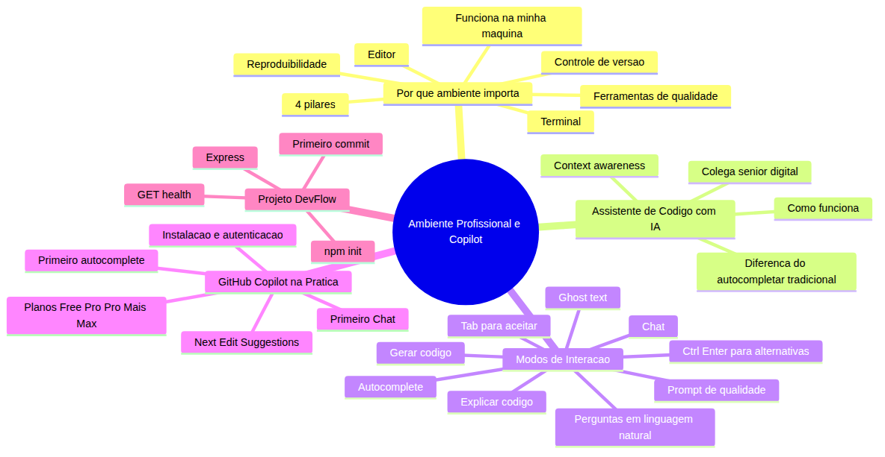

# Programador Profissional com Agentes — Aula 01

## Ambiente Profissional — Setup, Git e Primeiros Passos com Copilot

**Duração estimada:** 45 minutos (25 de leitura + 20 de prática)
**Nível:** Iniciante
**Pré-requisitos:** VS Code instalado, Node.js 20+, conta GitHub ativa, Git configurado, conhecimento básico de JavaScript, HTML, CSS e Git (clone, commit, push)

---

## Objetivos de Aprendizagem

Ao final desta aula, você será capaz de:

- [ ] **Explicar** por que um ambiente de desenvolvimento padronizado é essencial para trabalho profissional em equipe e como ele resolve o problema "funciona na minha máquina"
- [ ] **Identificar** os componentes fundamentais de um ambiente profissional: editor, terminal, controle de versão e ferramentas de qualidade
- [ ] **Definir** o que é um assistente de código com IA e como ele se diferencia de um autocompletar tradicional baseado em padrões
- [ ] **Explicar** o conceito de "context awareness" — como um assistente de IA usa o contexto do projeto para gerar sugestões relevantes
- [ ] **Distinguir** os dois modos principais de interação: sugestões inline (autocomplete) e conversação (chat)
- [ ] **Instalar** a extensão Copilot no VS Code e autenticar com uma conta GitHub
- [ ] **Comparar** os planos do Copilot (Free, Pro, Pro+, Max) e identificar qual atende cada perfil de uso
- [ ] **Executar** autocompletes com inline suggestions e Next Edit Suggestions em cenários práticos de JavaScript
- [ ] **Utilizar** o Chat do Copilot para gerar, explicar e modificar código por meio de prompts em linguagem natural
- [ ] **Criar** um servidor Express mínimo com endpoint GET /health funcional, inicializar o repositório DevFlow e fazer o primeiro commit usando o Copilot como assistente

---

## Como Usar Esta Aula

Esta aula está organizada em duas partes bem distintas.

A **primeira parte** é puramente conceitual. Você vai entender por que um ambiente profissional importa, o que é um assistente de código com IA, e como ele se diferencia de ferramentas que você já conhece. Você não verá nomes de produto ou marca aqui — os conceitos são universais e valem para qualquer ferramenta.

A **segunda parte** é mão na massa. Você vai instalar o GitHub Copilot, explorar os planos disponíveis, executar seus primeiros autocompletes, conversar com o Chat e criar o alicerce do projeto que vai te acompanhar pelo curso inteiro: o DevFlow.

Ao longo do caminho, você encontrará:
- **Quick Checks** — perguntas rápidas para verificar se entendeu antes de avançar
- **Mão na Massa** — tutoriais passo a passo para fazer, não só ler
- **Exercícios Graduados** — prática extra no final com 3 níveis de dificuldade

Ao final da aula, o arquivo separado **Questões de Aprendizagem** traz as tarefas de checkpoint. Só avance para a Aula 02 quando conseguir completá-las por conta própria, sem reler a aula a cada passo.

**Tempo estimado:** 25 minutos de leitura + 20 minutos de prática.

---

## Mapa Mental

Este diagrama mostra todos os conceitos que você vai dominar nesta aula:



> *O mapa mental acima mostra a estrutura da aula. Cada ramo representa um conceito que você vai explorar. Repare como tudo se conecta: dos fundamentos conceituais à prática com o projeto DevFlow.*
---

**FUNDAMENTOS: Por que Ambiente e Assistentes de IA Transformam seu Trabalho**

> *Os conceitos desta seção são universais — valem para qualquer ecossistema de desenvolvimento, independentemente do editor ou ferramenta específica. Na segunda parte, você verá como um assistente de código com IA em um editor moderno implementa cada um deles. Por enquanto, foque em entender o "por que" antes do "como".*
---

## 1. Por que um Ambiente de Desenvolvimento Profissional Importa

### O problema "funciona na minha máquina"

Imagine o seguinte: você passa a tarde inteira desenvolvendo uma funcionalidade. Tudo funciona perfeitamente no seu computador. Você faz commit, push e avisa o time. Seu colega faz pull, tenta rodar… e nada funciona. Erros estranhos, bibliotecas com versões diferentes, configurações que não batem.

Esse cenário tem até nome: **"funciona na minha máquina"** — e é um dos problemas mais comuns (e frustrantes) em times de desenvolvimento.

Dois problemas reais que ele causa:
1. **Bugs que só aparecem em máquinas específicas** — um desenvolvedor não consegue rodar o código do colega porque as versões do runtime, das bibliotecas ou do sistema operacional são diferentes. O bug existe, mas só se manifesta em certos ambientes.
2. **Onboarding lento** — um novo membro do time leva dias ou semanas configurando o ambiente manualmente, encontrando erros que ninguém documentou, pedindo ajuda no chat a cada esquina.

Você pode estar pensando: "mas isso não é culpa minha, o código funciona aqui!". E você tem razão — o código funciona. O problema é que o **ambiente** não é o mesmo. É como preparar uma receita que exige forno a 180 graus, mas cada pessoa usa um forno diferente com temperaturas imprevisíveis.

### Os 4 pilares de um ambiente profissional

Um ambiente de desenvolvimento profissional se apoia em quatro pilares:

**1. Editor configurado** — não é qualquer editor, é um editor com extensões, atalhos, temas e configurações que aceleram seu trabalho. Um editor bem configurado evita erros de sintaxe antes mesmo de você salvar o arquivo.

**2. Terminal integrado** — o terminal dentro do editor não é um detalhe. É onde você executa comandos, roda testes, instala dependências e depura problemas sem sair do fluxo. Ter o terminal integrado ao editor reduz o vai-e-vem entre janelas.

**3. Controle de versão** — histórico de alterações, branches, pull requests. Controle de versão não é "backup". É a memória do projeto, o registro de quem fez o que, quando e por que. É o que permite que duas pessoas editem o mesmo arquivo sem conflitos destrutivos.

**4. Ferramentas de qualidade** — linters, formatadores, analisadores de código. Ferramentas que pegam erros antes do revisor humano ver o código. Que garantem que todo mundo no time escreve código no mesmo estilo.

> *Até aqui, você já entendeu o problema central (funciona na minha máquina) e os 4 pilares que resolvem ele. Isso já é MUITO. Respire. Se algo não ficou claro, releia o parágrafo dos 4 pilares — não tem problema nenhum voltar. Programação se aprende por camadas, não de uma vez.*

### Analogia: cozinha profissional vs cozinha caseira

Pense em uma cozinha profissional de restaurante. Todos os chefs usam os mesmos ingredientes, os mesmos utensílios, os mesmos fornos. Quando um novo chef chega, ele sabe exatamente onde encontrar cada coisa. O resultado é previsível: qualquer chef consegue preparar o prato do cardápio.

Agora pense em cozinhar na sua casa — cada um tem ingredientes diferentes, panelas diferentes, um fogão que esquenta diferente. Se você pedir para um amigo reproduzir sua receita, o resultado nunca é igual.

Um **ambiente de desenvolvimento padronizado** faz a mesma coisa: todos no time têm o mesmo editor, as mesmas ferramentas, as mesmas configurações. O resultado é **reprodutibilidade** — o código funciona igual na máquina de qualquer pessoa. E **onboarding rápido** — um novo desenvolvedor produz em horas, não em dias.

### Quick Check 1

**1. Cite dois problemas reais que o paradigma "funciona na minha máquina" causa em um time de desenvolvimento.**
**Resposta:** (1) Um desenvolvedor não consegue rodar o código do colega porque as versões das ferramentas são diferentes, gerando bugs que só aparecem em máquinas específicas. (2) O onboarding de novos membros leva dias ou semanas porque cada um precisa configurar manualmente seu ambiente, frequentemente encontrando erros que ninguém documentou.

**2. Dos 4 pilares de um ambiente profissional (editor, terminal, controle de versão, ferramentas de qualidade), qual você considera o mais subestimado por iniciantes? Justifique.**
**Resposta:** Controle de versão. Iniciantes frequentemente usam um sistema de controle de versão (como o Git) apenas como "backup" (commit e push), sem explorar branches, histórico, blame e revisão de código — que são as funcionalidades que realmente tornam o trabalho em equipe viável. O controle de versão é o que permite que duas pessoas editem o mesmo arquivo sem conflitos destrutivos.

---

## 2. O que é um Assistente de Código com IA

### Do autocompletar tradicional ao assistente inteligente

Se você já usa um editor de código moderno, conhece o **autocompletar tradicional** — aquela sugestão automática de nomes de variáveis, funções e métodos enquanto você digita. Ele funciona analisando o que já existe no seu código: se você digitou `console.`, ele sugere `.log()`, `.error()`, `.warn()`.

O **assistente de código com IA** é algo radicalmente diferente.

Em vez de apenas sugerir palavras baseadas em padrões de texto, o assistente de IA entende o **significado** do seu código. Ele não lê apenas a linha atual — ele analisa os arquivos abertos, os imports que você fez, as convenções que você está seguindo, e o código ao redor para gerar sugestões contextualizadas.

Veja um exemplo: você começa a digitar `// funcao que inverte uma string` e o assistente gera a função completa:

```javascript
// funcao que inverte uma string
function inverterString(str) {
  return str.split('').reverse().join('');
}
```

Percebeu? Ele leu o comentário (linguagem natural), entendeu o que você quer fazer, e escreveu o código. O autocompletar tradicional jamais faria isso — ele não "entende" comentários.

Outro exemplo: você está criando um array de objetos e digita `// array de usuarios com nome, email e idade`. O assistente gera:

```javascript
// array de usuarios com nome, email e idade
const usuarios = [
  { nome: 'Joao', email: 'joao@email.com', idade: 28 },
  { nome: 'Maria', email: 'maria@email.com', idade: 32 },
  { nome: 'Pedro', email: 'pedro@email.com', idade: 25 }
];
```

E agora com números: você digita `// funcao que filtra pessoas maiores de idade` e o assistente completa com:

```javascript
// funcao que filtra pessoas maiores de idade
function filtrarMaioresDeIdade(pessoas) {
  return pessoas.filter(pessoa => pessoa.idade >= 18);
}
```

### Context awareness — o segredo das sugestões relevantes

Talvez você tenha tentado usar um assistente e pensou: "como ele sabe exatamente o que eu queria?". A resposta é **context awareness**.

Context awareness é a capacidade do assistente de analisar não apenas a linha atual, mas:
- **Arquivos abertos** no editor — ele vê o que você está editando agora e os arquivos ao lado
- **Imports** do arquivo atual — ele sabe quais bibliotecas e módulos estão disponíveis
- **Convenções** do projeto — ele percebe se você usa `require` ou `import`, camelCase ou snake_case
- **Código ao redor** — ele entende a estrutura do que você está construindo

Sem context awareness, o assistente geraria código genérico que não se integraria ao seu projeto. Por exemplo, sugerindo `require` em um projeto que usa `import`, ou usando nomes de variáveis inconsistentes com o resto do código.

### Analogia: o colega sênior digital

A melhor analogia para entender o assistente de IA é imaginar um **colega sênior sentado ao seu lado**, olhando por cima do seu ombro.

Esse colega:
- Vê o que você está digitando e antecipa seus próximos passos
- Sugere código completo quando você descreve o que quer em linguagem natural
- Explica o código existente quando você pergunta
- Ajuda a corrigir erros e refatorar

Mas atenção: como um bom colega sênior, ele **não escreve por você**. Ele sugere, explica, revisa. Você mantém o controle. Antes de aceitar uma sugestão, leia o código. Entendeu o que ele faz? Se não, pergunte: "explique este código para mim".

> *Até aqui, você já entendeu o que é um assistente de código com IA, como ele se diferencia do autocompletar tradicional e o que é context awareness. Três conceitos fundamentais que vão mudar sua forma de programar. Se algum deles ainda parece nebuloso, releia os exemplos com calma.*

### Quick Check 2

**1. Qual a diferença fundamental entre um autocompletar tradicional e um assistente de código com IA?**
**Resposta:** O autocompletar tradicional funciona por padrões de texto e análise sintática — ele sugere nomes de métodos e variáveis que já existem no escopo. O assistente de IA entende a semântica do código: ele compreende o que você está tentando fazer e sugere blocos inteiros de código que resolvem o problema, não apenas palavras soltas.

**2. O que significa "context awareness" e por que ele é importante para a qualidade das sugestões?**
**Resposta:** Context awareness é a capacidade do assistente de analisar não apenas a linha atual, mas os arquivos abertos, imports, convenções do projeto e o código ao redor para gerar sugestões que fazem sentido naquele contexto específico. Sem isso, o assistente geraria código genérico que não se integraria ao projeto.

---

## 3. Os Dois Modos de Interação — Autocomplete e Chat

### Sugestões Inline (Autocomplete)

O primeiro modo de interação é o **autocomplete** — também chamado de sugestões inline. É quando o assistente prevê o que você vai escrever e mostra a sugestão em texto cinza (ghost text), dentro do próprio arquivo.

Funciona assim:
1. Você começa a digitar código ou um comentário descritivo
2. Pausa por meio segundo
3. O assistente mostra uma sugestão em texto cinza
4. Você aperta **Tab** para aceitar, **Esc** para ignorar, ou **Ctrl+Enter** para ver outras alternativas

O autocomplete é ideal para:
- Código repetitivo e boilerplate (estruturas que se repetem)
- Padrões previsíveis (loops, condicionais, filtros)
- Completar arrays, objetos e funções a partir de descrições

### Chat (Conversação)

O segundo modo é o **Chat** — uma janela de conversa onde você faz perguntas em linguagem natural e o assistente responde.

O Chat é ideal para:
- Explorar novas bibliotecas ou APIs
- Pedir explicações sobre código existente
- Gerar código novo com estrutura complexa
- Refatorar e modificar código
- Depurar erros

| Situação | Autocomplete | Chat |
|---|---|---|
| Completar uma função que filtra array | ✅ Ideal | ✅ Funciona, mas é mais lento |
| Criar um servidor web completo do zero | ❌ Muito complexo | ✅ Ideal |
| Explicar o que um código faz | ❌ Não faz | ✅ Ideal |
| Corrigir um erro de sintaxe | ✅ Pode sugerir | ✅ Ideal |
| Gerar 50 itens de um array repetitivo | ✅ Ideal | ❌ Demorado |
| Entender por que um erro de CORS acontece | ❌ Não faz | ✅ Ideal |

### O poder do prompt

No Chat, a qualidade da sua pergunta determina a qualidade da resposta. Uma boa pergunta, chamada de **prompt**, deve ser específica e descritiva.

Prompt vago: "faça um servidor"
Prompt específico: "Crie um servidor HTTP na porta 3000 com um endpoint GET /health que retorna JSON com status e timestamp"

O prompt específico produz exatamente o que você precisa com menos iterações. Gaste 30 segundos a mais escrevendo um bom prompt — você economizará minutos de ajustes.

### Quick Check 3

**1. Em qual das seguintes situações o Chat é MAIS adequado que o autocomplete? (a) Fechar parênteses automaticamente, (b) Gerar um servidor HTTP completo a partir de uma descrição, (c) Completar o nome de uma função que você já começou a digitar, (d) Adicionar ponto e vírgula no final da linha. Justifique.**
**Resposta:** (b) Gerar um servidor HTTP completo a partir de uma descrição. O Chat é adequado para tarefas que exigem raciocínio e geração de múltiplas linhas de código com estrutura — você descreve O QUE quer e ele gera O CÓDIGO. As demais opções são tarefas mecânicas e previsíveis, mais adequadas para autocomplete.

**2. O que é um "prompt" e por que a qualidade do prompt afeta a qualidade da resposta?**
**Resposta:** Prompt é a pergunta ou instrução que você dá ao assistente no Chat. A qualidade do prompt afeta a resposta porque o assistente usa o prompt como ponto de partida para raciocinar — um prompt vago produz código genérico; um prompt específico produz exatamente o que você precisa, com menos iterações.

---

**APLICAÇÃO: Setup e Primeiros Passos com GitHub Copilot**

> *Agora que você entende por que um ambiente profissional importa e como funciona um assistente de código com IA, vamos colocar a mão no código. Você vai instalar o GitHub Copilot no VS Code, explorar os planos disponíveis, executar seus primeiros autocompletes e conversar com o Chat — tudo isso enquanto cria a estrutura inicial do projeto que nos acompanhará pelo curso inteiro: o DevFlow.*
---

## 4. Instalando e Configurando o Ambiente

### Verificação de pré-requisitos

Antes de começar, abra o terminal integrado (Ctrl+`) e execute estes comandos para verificar se tudo está instalado:

```bash
node --version
```

Deve mostrar v20.x ou superior (ex: v20.11.0). Se não retornar nada, instale o Node.js em nodejs.org antes de prosseguir.

```bash
git --version
```

Deve mostrar git version 2.x ou superior.

```bash
code --version
```

Deve mostrar a versão do VS Code (ex: 1.90.0).

Se algum comando falhar, instale a ferramenta antes de prosseguir. Entre no site oficial de cada uma (nodejs.org, git-scm.com, code.visualstudio.com). O download e instalação são simples — apenas próximo, próximo, concluir.

### Instalação da extensão GitHub Copilot

Com os pré-requisitos verificados, vamos instalar o Copilot:

1. Abra o VS Code
2. Clique no ícone de **Extensões** na barra lateral esquerda (ícone de 4 quadrados) ou pressione Ctrl+Shift+X
3. Na barra de pesquisa do marketplace, digite "**GitHub Copilot**"
4. Identifique a extensão oficial — publicada por "GitHub", com um badge azul de verificado
5. Clique no botão **Install**

### Autenticação

Após a instalação, o VS Code exibe um pop-up pedindo para fazer login:

1. Clique em "**Sign in with GitHub**" (no pop-up ou no ícone do Copilot na barra inferior)
2. O navegador abre automaticamente
3. Faça login na sua conta GitHub (se não estiver logado)
4. Autorize o GitHub Copilot a acessar sua conta
5. Volte ao VS Code — a autenticação está completa

### Verificação de sucesso

Para confirmar que tudo funcionou:
- **Ícone do Copilot** aparece na barra inferior do VS Code (canto inferior direito)
- Ao abrir um arquivo `.js` e começar a digitar, sugestões em cinza (ghost text) aparecem após cerca de 1 segundo
- No menu Settings (Ctrl+,) → busque "GitHub Copilot" → o status mostra "Signed in"

### Troubleshooting comum

| Problema | Causa provável | Solução |
|---|---|---|
| Extensão não aparece no marketplace | Internet lenta ou cache | Recarregar a página de extensões (Ctrl+Shift+X) |
| Erro de autenticação | Token expirado ou sessão do GitHub | Sair e logar novamente |
| Conta sem acesso ao Copilot | Plano Free não ativado | Acessar github.com/settings/copilot e ativar o Free |
| Sugestões inline não aparecem | Copilot pausado | Clicar no ícone do Copilot na barra inferior e reativar |

**Mão na Massa — Instalar e Autenticar:**

- [ ] Abrir VS Code
- [ ] Clicar no ícone de Extensões (barra lateral esquerda) ou pressionar Ctrl+Shift+X
- [ ] Buscar por "GitHub Copilot"
- [ ] Identificar a extensão oficial (publicada por "GitHub", badge azul verificado)
- [ ] Clicar em "Install"
- [ ] Clicar em "Sign in with GitHub" no pop-up
- [ ] Autorizar no navegador
- [ ] Voltar ao VS Code

**Verificação:**
- [ ] Ícone do Copilot aparece na barra inferior do VS Code
- [ ] Ao abrir um arquivo `.js`, sugestões em cinza aparecem após 1 segundo
- [ ] Settings → "GitHub Copilot" → status "Signed in"

---

## 5. Planos do Copilot — Qual Escolher?

O GitHub Copilot tem 4 planos principais. Entender as diferenças ajuda a escolher o que atende seu momento.

### Visão geral dos planos

| Característica | Free | Pro | Pro+ | Max |
|---|---|---|---|---|
| Autocompletes/mês | 2.000 | Ilimitados | Ilimitados | Ilimitados |
| Chats/mês | 50 | 300 | 1.500 | Ilimitados |
| Modelos | Básicos | Básicos + Claude | Todos premium | Todos + preview |
| Agent Mode | Limitado | Completo | Completo | Completo + Avançado |
| Preço | R$ 0 | ~$10/mês | ~$39/mês | ~$100/mês |

### Qual escolher?

**Free** — suficiente para este curso. Os 2.000 autocompletes e 50 chats por mês cobrem tranquilamente os exercícios de todas as 14 aulas do módulo. Se você é estudante ou faz projetos pessoais, comece pelo Free.

**Pro** — para quem bate o limite do Free todo mês. Desenvolvedores freelancers que usam o Copilot diariamente como ferramenta principal de trabalho. Autocompletes ilimitados e 300 chats/mês.

**Pro+** — uso profissional intensivo. Desenvolvedores que trabalham o dia inteiro com o Chat como ferramenta principal. Acesso a todos os modelos premium.

**Max** — Agent Mode avançado e preview features. Para quem quer as novidades antes de todo mundo e precisa de chats ilimitados.

### Como verificar seu plano

Acesse github.com/settings/copilot no navegador. Lá você vê seu plano atual, quanto usou no mês e pode fazer upgrade se quiser.

### Quick Check 4

**1. Se você é um estudante fazendo projetos pessoais open source, qual plano do Copilot é suficiente? Por quê?**
**Resposta:** O plano Free. Ele oferece 2000 autocompletes por mês e 50 chats por mês — mais que suficiente para projetos pessoais de estudo. O upgrade para Pro só se justifica quando você atinge os limites consistentemente.

**2. Qual a principal diferença entre o plano Pro e o Pro+?**
**Resposta:** A principal diferença está no número de chats: Pro oferece 300 chats/mês, Pro+ oferece 1500 chats/mês. Além disso, o Pro+ inclui acesso a todos os modelos premium e features experimentais.

---

## 6. Primeiro Autocomplete — Deixando o Copilot Escrever com Você

### Como funcionam as sugestões inline

A mecânica é simples: comece a escrever código ou um comentário descritivo, pause por meio segundo, e o Copilot exibe uma sugestão em texto cinza (ghost text).

- **Tab** — aceita a sugestão
- **Esc** — ignora a sugestão
- **Ctrl+Enter** — abre o painel de alternativas (outras sugestões que o Copilot gerou)

Se o autocomplete não apareceu nas primeiras tentativas, não se preocupe — é normal. Tente digitar mais devagar ou adicione um comentário descritivo. Quanto mais descritivo o comentário, melhor a sugestão.

### Next Edit Suggestions (NES)

O Next Edit Suggestions é uma funcionalidade onde o Copilot sugere edições em múltiplos locais do arquivo simultaneamente. Imagine que você renomeou uma variável e o Copilot percebe que precisa atualizar todas as referências a ela — ele sugere as correções em cascata.

### Demonstração guiada — 3 cenários

Você vai criar um arquivo `teste-autocomplete.js` e executar 3 cenários.

**Cenário 1 — Função para inverter string:**

- [ ] Digitar o comentário: `// funcao que inverte uma string`
- [ ] Pressionar Enter
- [ ] O Copilot sugere a implementação em ghost text
- [ ] Pressionar Tab para aceitar
- [ ] **Verificação:** a função gerada recebe uma string e retorna a string invertida

**Cenário 2 — Função para filtrar array:**

- [ ] Digitar o comentário: `// funcao que filtra pessoas maiores de idade`
- [ ] Pressionar Enter
- [ ] Aceitar a sugestão com Tab
- [ ] Pressionar Ctrl+Enter para abrir o painel de alternativas
- [ ] **Verificação:** a função usa `.filter()` e verifica `pessoa.idade >= 18`

**Cenário 3 — Array a partir de comentário:**

- [ ] Digitar o comentário: `// array de usuarios com nome, email e idade`
- [ ] Pressionar Enter
- [ ] Aceitar a sugestão com Tab
- [ ] Observar se o Copilot sugere edições em outros locais (NES)
- [ ] **Verificação:** pelo menos uma das funções foi gerada com sucesso e está sintaticamente correta

**Mão na Massa — 3 Cenários de Autocomplete:**

- [ ] Criar arquivo `teste-autocomplete.js`
- [ ] Cenário 1: comentário → função de inverter string
- [ ] Cenário 2: comentário → função de filtrar maiores de idade
- [ ] Cenário 3: comentário → array de usuários

**Verificação:** os 3 blocos de código gerados estão sintaticamente corretos e funcionais.

> *Parabéns! Você acabou de experimentar o poder do autocomplete com IA. Repare como os comentários em linguagem natural viraram código funcional. Isso é context awareness em ação.*

---

## 7. Primeiro Chat — Conversando com o Copilot

### Abrindo o Chat

Você pode abrir o Chat de duas formas:
- **Atalho:** Ctrl+Shift+I (Windows/Linux) ou Cmd+Shift+I (Mac)
- **Ícone:** clicar no ícone do Copilot na barra lateral esquerda

O Chat abre como uma janela de conversa no lado direito do VS Code.

### Tipos de prompt que você pode usar

- "Explique este código" — selecione um trecho e peça explicação
- "Crie uma função que..." — descreva o que quer em linguagem natural
- "Como faço para..." — tire dúvidas sobre bibliotecas e APIs
- "Corrija este erro" — cole o erro e peça ajuda para corrigir

### Participantes do Chat

O Chat do Copilot tem acesso a diferentes fontes de contexto:

- **@workspace** — contexto de todo o projeto (todos os arquivos)
- **@file** — contexto de um arquivo específico
- **@terminal** — contexto do último comando executado e sua saída

Use @workspace quando precisar de sugestões que consideram o projeto inteiro. Use @file quando a pergunta é sobre um arquivo específico.

### Demonstração guiada — Criar GET /health

Vamos usar o Chat para criar o primeiro endpoint do DevFlow.

No campo de mensagem do Chat, digite:

```
Crie um servidor HTTP na porta 3000 com um endpoint GET /health
que retorna um JSON: { status: 'ok', timestamp: new Date().toISOString(), uptime: process.uptime() }
```

Pressione Enter. O Copilot vai gerar algo como:

```javascript
const express = require('express');
const app = express();
const PORT = 3000;

app.get('/health', (req, res) => {
  res.json({
    status: 'ok',
    timestamp: new Date().toISOString(),
    uptime: process.uptime()
  });
});

app.listen(PORT, () => {
  console.log(`Servidor rodando na porta ${PORT}`);
});
```

O Copilot também explica o código e sugere como testar.

Clique em **"Apply"** no Chat para inserir o código em um novo arquivo ou copie manualmente para `index.js`.

**Mão na Massa — Criar GET /health com o Chat:**

- [ ] Abrir o Chat: Ctrl+Shift+I
- [ ] Digitar o prompt completo do GET /health
- [ ] Pressionar Enter e aguardar a resposta
- [ ] Clicar em "Apply" para criar `index.js`
- [ ] No terminal integrado (Ctrl+`), executar: `node index.js`
- [ ] Abrir o navegador e acessar: `http://localhost:3000/health`

**Verificação:**
- [ ] O terminal mostra "Servidor rodando na porta 3000" (ou similar)
- [ ] O navegador exibe um JSON com os campos `status`, `timestamp` e `uptime`
- [ ] O campo `status` é exatamente `"ok"`
- [ ] O campo `timestamp` é uma string ISO 8601 válida
- [ ] O campo `uptime` é um número (segundos desde que o servidor iniciou)

---

## 8. Estrutura Inicial do Projeto DevFlow

### O que é o DevFlow

**DevFlow** é o projeto que você vai construir ao longo das 14 aulas deste curso. É um dashboard de gerenciamento de projetos de desenvolvimento — completo, do backend ao frontend, com testes e deploy automático.

> *Ao final do curso, você terá um projeto de portfólio profissional que demonstra todas as habilidades de um desenvolvedor full-stack moderno que domina ferramentas de IA.*

Nesta aula, você cria o **alicerce**: um repositório GitHub com um servidor Express mínimo e um endpoint de saúde (health check).

### Passo a passo completo

**1. Criar repositório no GitHub**

Acesse github.com/new e crie um repositório chamado `devflow` (público ou privado — você escolhe). Não marque "Add a README", "Add .gitignore" ou "Choose a license" — vamos criar tudo localmente.

**2. Clonar localmente**

No terminal integrado do VS Code:

```bash
git clone https://github.com/seu-usuario/devflow.git
cd devflow
```

Substitua `seu-usuario` pelo seu nome de usuário do GitHub.

**3. Inicializar o Node.js**

```bash
npm init -y
```

Isso gera o arquivo `package.json` com as configurações padrão do projeto. O `-y` (yes) aceita todas as opções padrão sem perguntar.

**4. Instalar o Express**

```bash
npm install express
```

Isso baixa a biblioteca Express para a pasta `node_modules/` e adiciona a dependência no `package.json`.

**5. Criar o arquivo principal**

Crie o arquivo `index.js` com o código gerado pelo Chat na Seção 7 (ou peça ao Chat para gerar novamente). Use o método que preferir — digitar manualmente, copiar do Chat, ou clicar em "Apply".

**6. Criar .gitignore**

Crie um arquivo `.gitignore` na raiz do projeto com:

```
node_modules/
```

Isso impede que a pasta `node_modules/` (que é enorme) seja versionada no Git.

**7. Testar o servidor**

```bash
node index.js
```

Abra o navegador em `http://localhost:3000/health`. Você deve ver o JSON com `status: "ok"`, `timestamp` e `uptime`.

> *Se você está se sentindo "não acredito que funcionou de primeira" — calma, é assim mesmo. O Copilot fez o trabalho pesado. Mas lembre-se: leia o código gerado antes de aceitar. Entenda o que cada linha faz.*

**8. Primeiro commit com Copilot**

```bash
git add .
git status  # verifique o que vai ser commitado
```

Agora, no VS Code, vá para a aba Source Control (Ctrl+Shift+G). Na caixa de mensagem de commit, você verá uma sugestão do Copilot para a mensagem. Aceite com Tab ou escreva algo como:

```
feat: inicializa projeto DevFlow com servidor Express e GET /health
```

Depois:

```bash
git commit -m "feat: inicializa projeto DevFlow com servidor Express e GET /health"
git push origin main
```

### Estrutura final do projeto

```
devflow/
├── .gitignore        # Ignora node_modules/
├── package.json      # Configuração do Node.js e dependências
├── index.js          # Servidor Express com GET /health
├── node_modules/     # Dependências (não versionada)
└── (pasta .git/)     # Histórico Git
```

### Verificação final

- [ ] O repositório `devflow` existe no GitHub
- [ ] O arquivo `package.json` contém a dependência `express`
- [ ] O arquivo `index.js` contém o servidor com GET /health
- [ ] O arquivo `.gitignore` contém `node_modules/`
- [ ] O servidor roda e retorna JSON em `http://localhost:3000/health`
- [ ] O repositório no GitHub tem o primeiro commit com o código inicial

---

## Autoavaliação: Quiz Rápido

**1. O que significa o paradigma "funciona na minha máquina"?**
**Resposta:** É um problema onde o código funciona no computador de um desenvolvedor mas não funciona no de outro, porque os ambientes (versões de ferramentas, configurações, dependências) são diferentes.

**2. Quais são os 4 pilares de um ambiente profissional de desenvolvimento?**
**Resposta:** Editor configurado, terminal integrado, controle de versão (Git) e ferramentas de qualidade (linters, formatadores).

**3. Qual a principal diferença entre um autocompletar tradicional e um assistente de código com IA?**
**Resposta:** O autocompletar tradicional sugere palavras baseadas em padrões de texto. O assistente de IA entende a semântica do código e gera blocos inteiros contextualizados.

**4. O que é context awareness?**
**Resposta:** É a capacidade do assistente de analisar arquivos abertos, imports, convenções do projeto e código ao redor para gerar sugestões relevantes para o contexto específico.

**5. Em que situação o Chat é mais adequado que o autocomplete?**
**Resposta:** Quando a tarefa exige raciocínio, geração de múltiplas linhas de código com estrutura, explicação de código existente ou refatoração.

**6. O plano Free do Copilot é suficiente para este curso?**
**Resposta:** Sim. Oferece 2000 autocompletes e 50 chats por mês, mais que suficiente para os exercícios de todas as 14 aulas.

**7. Qual a tecla para aceitar uma sugestão inline do Copilot? E para ver alternativas?**
**Resposta:** Tab para aceitar, Ctrl+Enter para abrir o painel de alternativas.

**8. O que o comando `npm install express` faz?**
**Resposta:** Instala a biblioteca Express no projeto, adicionando-a como dependência no `package.json` e baixando os arquivos para `node_modules/`.

---

## Mão na Massa N: Exercícios Graduados

**Exercício 1 (Fácil) — Servidor Express Manual**

Crie um arquivo `ola-devflow.js` com um servidor Express que tenha uma rota `GET /` retornando uma string "Hello, DevFlow!". Desta vez, faça sem usar o Chat — escreva manualmente, consultando o código gerado na Seção 7 como referência.

```javascript
const express = require('express');
const app = express();
const PORT = 3000;

app.get('/', (req, res) => {
  res.send('Hello, DevFlow!');
});

app.listen(PORT, () => {
  console.log(`Servidor rodando na porta ${PORT}`);
});
```

> *Tente escrever o código sozinho antes de olhar o gabarito abaixo. Consulte o código da Seção 7 como referência, mas digite cada linha — a memória muscular importa.*
**Gabarito:** O código acima. Execute com `node ola-devflow.js` e acesse `http://localhost:3000/`. Deve exibir "Hello, DevFlow!" no navegador.

---

**Exercício 2 (Médio) — GET /status com Chat**

Use o Chat do Copilot para criar um endpoint `GET /status` que retorna um JSON com:
- `version`: `process.version` (versão do Node.js)
- `platform`: `process.platform` (sistema operacional)
- `uptime`: `process.uptime()` (tempo de atividade)
- `message`: "DevFlow is running"

Adicione esta rota ao arquivo `index.js` do DevFlow (ao lado do `GET /health` existente). Teste no navegador.

**Gabarito:** O prompt ideal: "Adicione um endpoint GET /status ao servidor Express que retorna um JSON com version (process.version), platform (process.platform), uptime (process.uptime()) e message: 'DevFlow is running'". O código resultante deve ser adicionado ao `index.js`. Teste em `http://localhost:3000/status`.

---

**Desafio (Difícil) — POST /echo com Validação**

Crie um endpoint `POST /echo` que:
1. Recebe um JSON no corpo da requisição
2. Adiciona um campo `receivedAt` com o timestamp atual
3. Retorna o JSON modificado
4. Se o corpo estiver vazio, retorna status 400 com `{ error: "Corpo da requisicao vazio" }`

Dica: para ler o corpo de uma requisição POST, o Express precisa do middleware `express.json()`, que converte o corpo JSON da requisição em um objeto JavaScript acessível via `req.body`. Sem esse middleware, `req.body` será `undefined`. Adicione `app.use(express.json())` ANTES das suas rotas.

**Gabarito:**

```javascript
app.use(express.json());

app.post('/echo', (req, res) => {
  const body = req.body;
  
  if (!body || Object.keys(body).length === 0) {
    return res.status(400).json({ error: 'Corpo da requisicao vazio' });
  }
  
  body.receivedAt = new Date().toISOString();
  res.json(body);
});
```

Teste com curl:
```bash
curl -X POST http://localhost:3000/echo \
  -H "Content-Type: application/json" \
  -d '{"mensagem": "teste"}'
```

Deve retornar `{"mensagem":"teste","receivedAt":"2026-06-30T..."}`.

---

## Resumo da Aula

### Os 2 Conceitos Fundamentais

1. **Ambiente de desenvolvimento padronizado**: resolve o problema "funciona na minha máquina" através de 4 pilares (editor, terminal, controle de versão, ferramentas de qualidade). Garante reprodutibilidade e onboarding rápido.

2. **Assistente de código com IA**: ferramenta que entende a semântica do seu código (context awareness) e oferece dois modos de interação — autocomplete (sugestões inline para código repetitivo) e Chat (conversação para raciocínio e geração de código).

### O Que Você Construiu Hoje

- [x] Instalou e autenticou o GitHub Copilot no VS Code
- [x] Executou 3 cenários de autocomplete com inline suggestions
- [x] Criou um servidor Express com GET /health usando o Chat
- [x] Criou o repositório GitHub do DevFlow
- [x] Inicializou o projeto com npm init e install express
- [x] Configurou .gitignore para ignorar node_modules/
- [x] Fez o primeiro commit e push do DevFlow

---

## Próxima Aula

**Aula 02: Custom Instructions e Convenções do Time**

Agora que seu ambiente está pronto e você já conversa com o Copilot, vai aprender a ensinar suas convenções para ele — criando regras permanentes que guiam todo o comportamento do assistente no projeto DevFlow. Isso significa que o Copilot vai gerar código no estilo do seu time, seguir suas convenções de nomenclatura e respeitar suas restrições, sempre, sem você precisar repetir.

---

## Referências

### Documentação Oficial

- [GitHub Copilot — Getting Started](https://docs.github.com/en/copilot/getting-started-with-github-copilot) — guia oficial de primeiros passos
- [VS Code Copilot Setup Guide](https://code.visualstudio.com/docs/copilot/setup) — instalação e configuração
- [GitHub Copilot Plans](https://github.com/features/copilot/plans) — comparação de planos atualizada
- [Next Edit Suggestions (NES)](https://code.visualstudio.com/docs/copilot/ai-powered-suggestions) — documentação do NES
- [Express.js Hello World](https://expressjs.com/en/starter/hello-world.html) — exemplo mínimo de servidor Express

### Ferramentas

- [VS Code](https://code.visualstudio.com/) — editor de código
- [Node.js](https://nodejs.org/) — runtime JavaScript
- [Git](https://git-scm.com/) — controle de versão
- [npm](https://www.npmjs.com/) — gerenciador de pacotes

### Artigos para Aprofundamento

- [O que é "funciona na minha máquina" e como evitar](https://www.hanselman.com/blog/its-not-its-not-just-the-code-thats-important) — Scott Hanselman
- [Reproducible Builds](https://reproducible-builds.org/) — por que ambientes reprodutíveis importam para segurança e confiabilidade

---

## FAQ

**P: O Copilot funciona offline?**
R: Não. O Copilot precisa de conexão com a internet para processar as sugestões nos servidores do GitHub. O código é enviado de forma segura e criptografada.

**P: Posso usar o Copilot em outro editor que não o VS Code?**
R: Sim! O GitHub Copilot tem extensões oficiais para JetBrains, Neovim, Visual Studio e outros. Os conceitos que você aprendeu nesta aula (autocomplete, Chat, context awareness) funcionam em todos eles.

**P: O plano Free é suficiente para projetos reais?**
R: Para projetos pessoais e estudo, sim. Os 2000 autocompletes e 50 chats por mês são suficientes. Para uso profissional intensivo (8 horas/dia), o plano Pro é mais adequado.

**P: O Copilot vai substituir programadores?**
R: Não. O Copilot é uma ferramenta de produtividade, como um corretor ortográfico avançado ou uma calculadora científica. Ele acelera tarefas mecânicas e repetitivas, mas as decisões de arquitetura, design, segurança e adequação ao negócio continuam sendo humanas. O programador que usa IA substitui o programador que não usa — mas a profissão não desaparece, ela evolui.

**P: Como o Copilot lida com código proprietário da empresa?**
R: O GitHub Copilot Business e Enterprise oferecem garantias de que seu código não será usado para treinar modelos. No plano Free e Pro, o código enviado pode ser usado para melhorar o serviço. Para código sensível, consulte as políticas de privacidade do GitHub.

**P: Preciso saber Node.js para este curso?**
R: Você precisa de JavaScript básico (variáveis, funções, arrays, objetos). Node.js e Express serão introduzidos gradualmente, começando do mínimo necessário — como fizemos nesta aula com o GET /health.

**P: O que é Express e por que começamos com ele?**
R: Express é o framework web mais popular para Node.js. Começamos com ele porque é simples, direto e você pode criar um servidor funcional com 5 linhas de código. É a base sobre a qual construiremos o backend do DevFlow.

**P: Se algo deu errado na instalação, o que faço?**
R: A seção 4 tem uma tabela de troubleshooting com os problemas mais comuns. Se não resolver, verifique se o Node.js 20+ está instalado, se sua conta GitHub está ativa e se o Git está configurado (git config --global user.name e user.email).

---

## Glossário

| Termo | Definição |
|---|---|
| **Assistente de Código com IA** | Ferramenta que utiliza inteligência artificial para gerar, explicar e modificar código com base no contexto do projeto (Seção 2) |
| **Autocomplete** | Modo de interação onde o assistente sugere código inline em ghost text, ativado ao pausar a digitação (Seção 3) |
| **Chat** | Modo de interação onde o desenvolvedor conversa com o assistente em linguagem natural para gerar ou explicar código (Seção 3) |
| **Context Awareness** | Capacidade do assistente de analisar arquivos abertos, imports e código ao redor para gerar sugestões relevantes (Seção 2) |
| **Ghost Text** | Texto cinza exibido inline no editor indicando uma sugestão do assistente (Seção 6) |
| **Prompt** | Instrução ou pergunta em linguagem natural dada ao assistente no Chat (Seção 3) |
| **Next Edit Suggestions (NES)** | Funcionalidade que sugere edições em múltiplos locais do arquivo simultaneamente (Seção 6) |
| **GitHub Copilot** | Assistente de código com IA da GitHub, integrado ao VS Code (Seção 4) |
| **Express** | Framework web minimalista para Node.js, usado para criar servidores HTTP (Seção 7) |
| **Endpoint** | URL específica de uma API que responde a requisições (ex: GET /health) (Seção 7) |
| **Health Check** | Endpoint que indica se o servidor está funcionando, geralmente retornando status e métricas básicas (Seção 7) |
| **DevFlow** | Projeto do curso: dashboard de gerenciamento de projetos de desenvolvimento, construído ao longo de 14 aulas (Seção 8) |
