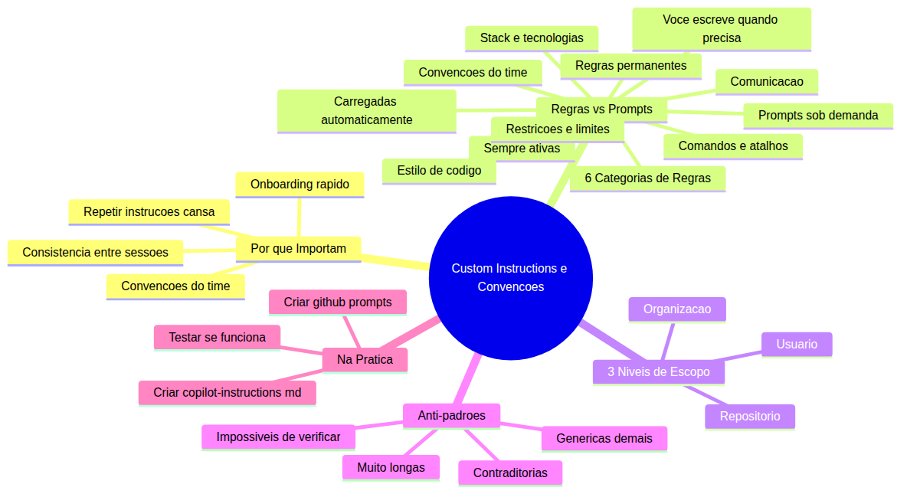
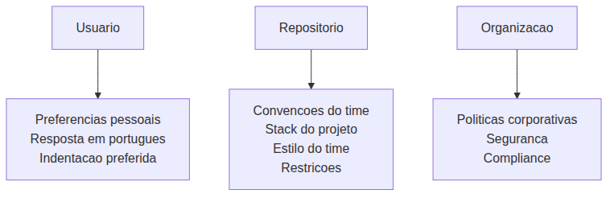

# Programador Profissional com Agentes — Aula 02

## Custom Instructions e Convenções do Time

**Duração estimada:** 50 minutos (25 de leitura + 25 de prática)
**Nível:** Iniciante
**Pré-requisitos:** Aula 01 concluída — VS Code com GitHub Copilot instalados e autenticados, projeto DevFlow com GET /health funcional

---

## Objetivos de Aprendizagem

Ao final desta aula, você será capaz de:

- [ ] **Explicar** por que instruções permanentes são essenciais para consistência entre sessões e convenções do time
- [ ] **Distinguir** entre regras permanentes e prompts sob demanda, identificando quando usar cada um
- [ ] **Listar** as 6 categorias de regras que um conjunto de instruções pode conter
- [ ] **Diferenciar** os 3 níveis de escopo disponíveis para instruções (usuário, repositório, organização)
- [ ] **Criar** um arquivo `.github/copilot-instructions.md` completo com regras para stack, estilo, commits e restrições
- [ ] **Identificar** anti-padrões comuns em instruções e evitar cada um deles
- [ ] **Criar** templates reutilizáveis em `.github/prompts/` para tarefas frequentes
- [ ] **Testar** se as instruções estão sendo aplicadas corretamente pelo assistente

---

## Como Usar Esta Aula

Esta aula está organizada em duas partes. A **primeira parte** constrói os conceitos universais de por que e como ensinar um assistente de código a seguir as regras do seu time — sem depender de produto ou ferramenta específica. A **segunda parte** aplica esses conceitos na prática com GitHub Copilot, criando o arquivo de instruções do DevFlow e templates reutilizáveis.

Ao longo do caminho, você encontrará seções **"Mão na Massa"** para fazer junto, **"Quick Check"** para verificar se entendeu antes de avançar. Ao final, o arquivo separado **Questões de Aprendizagem** traz tarefas de checkpoint — só avance para a Aula 03 quando conseguir completá-las por conta própria.

**Tempo estimado:** 25 minutos de leitura + 25 minutos de prática.

---

## Mapa Mental

Este diagrama mostra todos os conceitos que você vai dominar nesta aula:



> *O mapa mental acima mostra a estrutura da aula. Cada ramo representa um conceito que você vai explorar. Repare como os fundamentos conceituais alimentam a aplicação prática.*

---

## Recapitulação da Aula 01

| Aula | Conceito | Onde aparece nesta aula | Como se conecta |
|---|---|---|---|
| 01 | **Assistente de código com IA** (Seção 2) | Seções 1-2 | Você aprendeu que o assistente usa contexto. Agora vai ENSINAR seu contexto para ele |
| 01 | **Context Awareness** (Seção 2) | Seção 3 | As instruções permanentes são a principal fonte de contexto sobre seu projeto |
| 01 | **Autocomplete e Chat** (Seção 3) | Seções 5-6 | Você vai testar se as instruções funcionam tanto no autocomplete quanto no Chat |
| 01 | **DevFlow com GET /health** (Seção 8) | Seções 3, 5 | As instruções descrevem as convenções do DevFlow, e os prompts automatizam tarefas do projeto |
| 01 | **Prompt de qualidade** (Seção 3) | Seção 5 | Os templates de prompt são a materialização do "prompt específico" que você aprendeu |

---

**FUNDAMENTOS: Ensinando o Assistente a Seguir as Regras do Time**

> *Os conceitos desta seção são universais — valem para qualquer assistente de código com IA, independentemente da ferramenta específica. Na segunda parte, você verá como um assistente de código em um editor moderno implementa cada um deles. Por enquanto, foque em entender o "por que" antes do "como".*

---

## 1. Por que Instruções Permanentes Importam

### O problema de repetir instruções

Imagine que você está trabalhando em um projeto com mais duas pessoas. Vocês decidiram que:

- Todas as funções usam camelCase
- Strings usam aspas simples, não duplas
- Comentários são em português
- Toda função precisa de um comentário JSDoc explicando parâmetros e retorno

Toda vez que você pede para o assistente de código gerar algo, você precisa repetir essas regras: "use camelCase", "aspas simples", "comente em português", "adicione JSDoc". Funciona na hora, mas é cansativo. E se você esquecer de falar uma regra? O assistente gera no estilo padrão dele, e você perde tempo corrigindo.

Veja um exemplo. Você pede para o assistente "crie uma função que valida email". Sem instruções, ele pode gerar:

```javascript
function validateEmail(email) {
    const emailRegex = /^[^\s@]+@[^\s@]+\.[^\s@]+$/;
    return emailRegex.test(email);
}
```

O nome está em inglês, usa 4 espaços de indentação, sem comentários. Não está errado — mas não segue as convenções do seu time.

Você gostaria que ele gerasse:

```javascript
/**
 * Valida se uma string é um email válido
 * @param {string} email - O email a ser validado
 * @returns {boolean} true se for válido, false caso contrário
 */
function validarEmail(email) {
  const regexEmail = /^[^\s@]+@[^\s@]+\.[^\s@]+$/;
  return regexEmail.test(email);
}
```

Nome em português, 2 espaços de indentação, JSDoc explicando tudo. Parece mágica? Não — é o poder das **instruções permanentes**.

Outro exemplo. Seu time usa a ferramenta nativa do runtime para chamadas HTTP, não uma biblioteca externa. Mas o assistente, por padrão, pode sugerir a biblioteca mais comum na base de treinamento dele. Com instruções, você diz de uma vez: "use a ferramenta nativa, não bibliotecas externas para HTTP" — e pronto, ele nunca mais vai sugerir a biblioteca errada.

E agora com um terceiro exemplo. Seu time tem uma convenção de que variáveis booleanas sempre começam com `is`, `has` ou `should`. Você coloca isso nas instruções, e o assistente passa a gerar `isAtivo`, `hasPermissao`, `shouldExibir` em vez de `ativo`, `permissao`, `exibir`.

### Consistência entre sessões

Talvez o maior benefício das instruções permanentes é que elas funcionam entre **sessões**. Você fecha o editor hoje, abre amanhã, e o assistente continua sabendo das regras. Não precisa reexplicar nada.

Sem instruções permanentes, cada nova sessão é um recomeço:

```
Sessão 1: "Use camelCase, aspas simples, 2 espaços"
  → Assistente segue na Sessão 1
Sessão 2 (amanhã): "Use camelCase, aspas simples, 2 espaços"
  → Repetiu tudo. E se você só falou 3 das 5 regras?
Sessão 3 (semana que vem): "Use camelCase, aspas simples..."
  → De novo. Cansativo, inconsistente, propenso a erro.
```

Com instruções permanentes:

```
Sessão 1: Instruções carregadas automaticamente → OK
Sessão 2: Instruções carregadas automaticamente → OK
Sessão 3: Instruções carregadas automaticamente → OK
```

Toda sessão começa com as mesmas regras. Zero repetição. Zero esquecimento.

> *Você pode estar pensando: "mas o assistente não deveria aprender com o tempo?" Boa pergunta. Mas o assistente não tem memória entre sessões. Cada sessão é uma página em branco — a menos que você forneça instruções permanentes.*

### Analogia: o manual do funcionário

Pense em uma empresa que contrata um novo desenvolvedor. Se não houver manual, o desenvolvedor aprende perguntando a cada esquina: "qual estilo de código vocês usam?", "como nomeiam branches?", "qual o padrão de commit?". Cada pergunta toma tempo de quem responde.

Agora pense na empresa que tem um **manual do funcionário**. O novo desenvolvedor lê o manual e já sabe tudo: horário, código de vestimenta, ferramentas que usa, processos que segue. Em vez de perguntar a cada passo, ele consulta o manual.

As instruções permanentes são o manual do funcionário para o assistente de código. Você escreve uma vez, e ele consulta sempre.

> *Até aqui, você já entendeu o problema central (repetir instruções toda vez cansa e gera inconsistência) e a solução (instruções permanentes que funcionam entre sessões). Isso já é MUITO. Respire. Se algo não ficou claro, releia os exemplos com calma.*

### Quick Check 1

**1. Qual o problema de depender apenas de prompts verbais (instruções ditas na hora) para guiar o assistente de código?**
**Resposta:** Você precisa repetir as mesmas regras toda vez que usa o assistente, o que é cansativo e propenso a erro — se esquecer de mencionar uma regra, o assistente gera fora do padrão do time. Além disso, entre sessões diferentes as regras se perdem completamente.

**2. Cite dois benefícios de ter instruções permanentes carregadas automaticamente.**
**Resposta:** (1) Consistência entre sessões — o assistente segue as mesmas regras hoje, amanhã e na semana que vem, sem ninguém precisar repetir. (2) Onboarding mais rápido — um novo membro do time configura o projeto e o assistente já sabe as convenções, sem precisar aprender todas de cor.

---

## 2. Regras Permanentes vs Prompts Sob Demanda

### Dois tipos de instrução

Nem toda instrução precisa ser permanente. Existem dois tipos, e saber quando usar cada um é essencial.

**Regras permanentes** ficam salvas em um arquivo e são carregadas automaticamente sempre que você inicia uma nova interação com o assistente. São para convenções que valem para **todo o projeto**, **sempre**: estilo de código, tecnologias do projeto, padrões de commit, restrições.

**Prompts sob demanda** são instruções que você escreve na hora, no Chat, quando precisa de algo específico para aquela tarefa. São para comandos que valem **só para aquela conversa**: "crie uma rota POST nesta API", "explique o que este código faz", "refatore esta função".

| Característica | Regras Permanentes | Prompts Sob Demanda |
|---|---|---|
| Quando é carregado | Automaticamente, toda sessão | Você digita na hora |
| Para que serve | Convenções do time, stack, restrições | Tarefa específica da conversa |
| Onde fica salvo | Arquivo de instruções do projeto | No seu prompt do Chat |
| Exemplo | "Use 2 espaços para indentação" | "Crie uma função que soma dois números" |

### As 6 categorias de regras

Quando você for criar suas instruções permanentes, é útil pensar em 6 categorias. Cada uma cobre um aspecto diferente do que o assistente precisa saber:

**1. Stack e tecnologias** — quais linguagens, frameworks, bibliotecas e ferramentas o projeto usa. Ex: "O projeto usa um framework web no backend e uma biblioteca de componentes no frontend."

**2. Estilo de código** — formatação, nomenclatura, padrões de código. Ex: "Use camelCase para variáveis e funções. Use 2 espaços para indentação. Strings em aspas simples."

**3. Convenções do time** — padrões de comunicação, revisão, documentação. Ex: "Comentários em português. Toda função pública documentada com JSDoc."

**4. Comandos e atalhos** — scripts, comandos de terminal, atalhos do projeto. Ex: "Para rodar testes: o comando definido no projeto. Para iniciar servidor: o comando de inicialização."

**5. Comunicação** — como o assistente deve se comunicar com você. Ex: "Responda em português. Explique o código gerado em 1-2 frases."

**6. Restrições e limites** — o que o assistente NÃO deve fazer. Ex: "NÃO use bibliotecas externas para HTTP. NÃO instale dependências sem perguntar."

### Os 3 níveis de escopo

As instruções permanentes podem existir em três níveis. O escopo determina onde elas valem.

**Nível 1 — Usuário:** Vale para VOCÊ, em TODO projeto que você abrir. Configurado nas configurações do seu editor. Ideal para preferências pessoais: "responda em português", "use 2 espaços".

**Nível 2 — Repositório:** Vale para TODAS as pessoas que abrirem aquele repositório. Configurado em um arquivo de instruções dentro do repositório. Ideal para convenções do time: stack do projeto, estilo do time, restrições.

**Nível 3 — Organização:** Vale para TODOS os repositórios da sua organização na plataforma de hospedagem. Configurado nas configurações da organização. Ideal para políticas corporativas: padrões de segurança, compliance, tecnologias aprovadas.

A imagem abaixo mostra como os três níveis se relacionam:



Cada nível complementa o anterior. Seu usuário define preferências pessoais, o repositório define as regras do time, e a organização define políticas globais. O assistente combina todos os níveis automaticamente.

### Quick Check 2

**1. Qual a diferença fundamental entre uma regra permanente e um prompt sob demanda?**
**Resposta:** A regra permanente fica salva em um arquivo e é carregada automaticamente em toda sessão — vale sempre. O prompt sob demanda é digitado na hora e vale apenas para aquela conversa específica.

**2. Você está desenvolvendo um projeto pessoal e quer que o assistente sempre responda em português, independentemente do projeto. Em qual nível de escopo você deve configurar isso? E as regras específicas do projeto (stack, estilo) devem ficar em qual nível?**
**Resposta:** A preferência "responda em português" deve ficar no nível de **usuário** (configuração pessoal). As regras específicas do projeto devem ficar no nível de **repositório** (arquivo de instruções do repositório), para que todos que contribuírem com o projeto usem as mesmas convenções.

---

**APLICAÇÃO: Custom Instructions no GitHub Copilot**

> *Agora que você entende por que instruções permanentes importam e como se organizam em categorias e níveis de escopo, vamos aplicar tudo isso no GitHub Copilot. Você vai criar o arquivo de instruções do DevFlow, aprender o que NÃO colocar, criar templates reutilizáveis e verificar se tudo está funcionando.*

---

## 3. Criando o copilot-instructions.md do DevFlow

### Estrutura do arquivo

O GitHub Copilot lê instruções do arquivo `.github/copilot-instructions.md` na raiz do repositório. Simples assim: um arquivo Markdown dentro da pasta `.github/`.

O formato é Markdown puro. Você escreve em seções, com títulos, listas e parágrafos — exatamente como está lendo esta aula. O Copilot lê o arquivo inteiro e usa como contexto permanente.

Não existe "sintaxe especial". Você não precisa aprender uma linguagem nova. Apenas escreva as regras em linguagem natural, de forma clara e direta.

### Seções recomendadas

Aqui estão as seções que todo bom arquivo de instruções deve ter:

1. **Stack do projeto** — Quais tecnologias o projeto usa
2. **Estilo de código** — Formatação e nomenclatura
3. **Convenções de commit** — Como escrever mensagens de commit
4. **Convenções de Git** — Nomenclatura de branches, tags
5. **Pull Requests** — Template e critérios de revisão
6. **Restrições** — O que o assistente NÃO deve fazer

> *Talvez você pense: "mas meu projeto não tem frontend nem banco de dados ainda". Não tem problema — as instruções evoluem com o projeto. Comece com o que você sabe hoje e adicione conforme o DevFlow cresce.*

### Exemplo completo para o DevFlow

Aqui está o arquivo de instruções que o DevFlow vai usar. Leia com atenção:

````markdown
# DevFlow — Custom Instructions

## Stack do Projeto
- Backend: Node.js com Express
- Frontend: React com componentes funcionais
- Testes: Jest (backend), Vitest (frontend)
- CI/CD: GitHub Actions

## Estilo de Código
- Use 2 espaços para indentação, não tabs
- Strings em aspas simples, não duplas
- Ponto e vírgula OBRIGATÓRIO ao final de cada statement
- Nomes de variáveis e funções em camelCase
- Nomes de classes em PascalCase
- Nomes de arquivos em kebab-case (ex: user-service.js)
- Constantes em UPPER_SNAKE_CASE
- Comentários em português
- Toda função pública documentada com JSDoc

## Convenções de Commit
- Commits no formato conventional commits: tipo(escopo): descrição
- Tipos: feat, fix, refactor, test, docs, chore
- Descrição em português, no imperativo
- Exemplo: feat(api): adiciona rota POST /projects

## Convenções de Git
- Branches: tipo/descricao-em-kebab-case
  - Ex: feat/adiciona-rota-projetos, fix/corrige-valor-null
- Manter branches curtas (máximo 1 semana de trabalho)

## Pull Requests
- Template automático via .github/PULL_REQUEST_TEMPLATE.md
- PR description em português
- Incluir: objetivo, mudanças principais, como testar
- Toda PR deve passar no CI antes de merge

## Restrições
- NÃO use bibliotecas externas para chamadas HTTP — use fetch nativo
- NÃO instale dependências sem permissão explícita
- NÃO use any ou tipos implícitos no TypeScript
- NÃO crie arquivos acima de 300 linhas — refatore em módulos
````

Perceba como cada regra é **específica** e **verificável**. "Strings em aspas simples" é claro — não tem interpretação dúbia. "NÃO instale dependências sem permissão explícita" é direto. "Toda função pública documentada com JSDoc" é uma regra que você pode verificar olhando o código gerado.

### Mão na Massa — Criar .github/copilot-instructions.md

Agora é sua vez:

- [ ] Abra o VS Code e navegue até a pasta do DevFlow
- [ ] Crie a pasta `.github/` na raiz do projeto: `mkdir -p .github`
- [ ] Crie o arquivo `.github/copilot-instructions.md`
- [ ] Copie o exemplo completo acima, adaptando as regras para o momento atual do DevFlow (backend Express com GET /health apenas)
- [ ] Salve o arquivo

**Verificação:** O arquivo existe em `.github/copilot-instructions.md` e contém pelo menos as seções de stack, estilo, commits e restrições.

> *Parabéns! Você acabou de criar o manual do funcionário do DevFlow. Agora, sempre que usar o Copilot no projeto, ele vai seguir essas regras automaticamente. Sem repetir, sem esquecer.*

> *Antes de salvar, releia cada regra que você escreveu e pergunte-se: "se eu lesse esta regra pela primeira vez, saberia exatamente o que fazer?" Regras ambíguas produzem código ambíguo. Reescreva as que não passarem neste teste.*

### Quick Check 3

**1. Em qual pasta e com qual nome o Copilot procura pelas instruções do repositório?**
**Resposta:** Na pasta `.github/` na raiz do repositório, com o nome `copilot-instructions.md` — ou seja, `.github/copilot-instructions.md`.

**2. Por que as regras devem ser específicas e verificáveis, em vez de genéricas como "escreva código limpo"?**
**Resposta:** Regras genéricas como "escreva código limpo" são subjetivas — o assistente não sabe o que você considera "limpo". Regras específicas como "use 2 espaços de indentação" ou "toda função pública precisa de JSDoc" são claras, objetivas e você pode verificar se foram seguidas.

---

## 4. Anti-padrões — O que NÃO Colocar nas Instruções

Criar instruções é fácil. Criar instruções BOAS é uma arte. Aqui estão os erros mais comuns e como evitá-los.

### Anti-padrão 1: Regras contraditórias

O pior erro: duas regras que dizem a mesma coisa de formas opostas.

Regra A: "Use aspas simples"
Regra B: "Use aspas duplas para strings"

O assistente não sabe qual seguir. Em alguns lugares ele usa uma, em outros a outra. Resultado: inconsistência pior do que se não houvesse regra nenhuma.

**Como evitar:** Revise as regras como um conjunto. Pergunte-se: "se eu aplicar todas ao mesmo tempo, alguma conflita com outra?". Se sim, remova a conflitante ou unifique.

### Anti-padrão 2: Regras genéricas demais

"Escreva código de qualidade"
"Siga boas práticas"
"O código deve ser eficiente"

Essas regras são inúteis porque não têm significado objetivo. O que é "código de qualidade" para você pode ser diferente para o assistente. O que é "eficiente" depende do contexto.

**Como evitar:** Seja mensurável. Em vez de "código de qualidade", diga "funções com no máximo 30 linhas". Em vez de "siga boas práticas", diga "use async/await em vez de callbacks".

### Anti-padrão 3: Instruções muito longas

Um documento de 50 páginas com histórico do projeto, specs de produto, análises de mercado e 200 regras de código.

O assistente tem um limite de contexto. Se suas instruções forem muito longas, ele pode "esquecer" partes — especialmente as regras do final do documento.

**Como evitar:** Limite a 50-80 regras no máximo. Cada regra deve ser uma linha ou duas. Priorize as regras mais importantes no início.

### Anti-padrão 4: Regras impossíveis de verificar

"Nunca introduza bugs"
"O código deve ser perfeito"
"Sempre acerte de primeira"

O assistente não consegue garantir isso. Ninguém consegue. Essas regras só ocupam espaço e não mudam o comportamento.

**Como evitar:** Regras devem ser sobre COMPORTAMENTO, não sobre RESULTADO. "Sempre valide parâmetros de entrada" é uma regra de comportamento verificável. "Nunca introduza bugs" é um resultado impossível de garantir.

### Anti-padrão 5: Regras que competem com o código

"Se o ESLint discordar, ignore e use seu julgamento"

Nunca peça para o assistente ignorar ferramentas de qualidade do projeto. Se o ESLint diz uma coisa e suas instruções dizem outra, o assistente pode ficar confuso. Suas instruções devem REFORÇAR as ferramentas de qualidade, não competir com elas.

**Como evitar:** Alinhe suas instruções com as ferramentas de qualidade do projeto. Se o ESLint exige aspas simples, suas instruções também devem exigir aspas simples.

> *Talvez você tenha tentado adicionar muitas regras de uma vez e percebeu que o assistente ficou confuso. Isso é completamente normal. Acontece porque cada regra ocupa espaço no contexto. Menos é mais — comece com 10-15 regras e adicione conforme necessário.*

### Quick Check 4

**1. Qual o problema de ter regras contraditórias no arquivo de instruções?**
**Resposta:** O assistente não sabe qual regra seguir, gerando inconsistência — em alguns lugares aplica uma regra, em outros aplica a contraditória. É pior do que não ter regra nenhuma.

**2. Por que "escreva código de qualidade" é um mau exemplo de regra? Como melhorá-la?**
**Resposta:** É genérica demais — "qualidade" é subjetiva e não diz nada objetivo. Uma versão melhor seria mensurável, como "funções com no máximo 30 linhas" ou "toda função deve ter um único nível de abstração".

---

## 5. .github/prompts/ — Comandos Rápidos Reutilizáveis

### Slash commands de projeto

Além das instruções permanentes, o Copilot também permite criar **prompts reutilizáveis** na pasta `.github/prompts/`. São como "comandos de barra" (slash commands) que você pode invocar no Chat.

A diferença das instruções permanentes: os prompts em `.github/prompts/` **não são carregados automaticamente**. Você os invoca quando precisa. Eles são como "macros" — blocos de prompt prontos para tarefas específicas.

Pense assim:

- **`copilot-instructions.md`**: o manual do funcionário (sempre ativo)
- **`prompts/*.md`**: receitas de bolo (você pega da gaveta quando vai fazer aquele prato específico)

### Template 1: Criar Componente

Crie o arquivo `.github/prompts/criar-componente.md`:

````markdown
# Prompt: Criar Componente React

Crie um componente React funcional seguindo estas especificações:

- Nome do componente: [NOME]
- Props esperadas: [PROPS]
- Funcionalidade: [DESCRICAO]

Regras de implementação:
- Componente funcional com arrow function
- Props tipadas com PropTypes
- CSS modules para estilização
- Teste unitário em __tests__/
- Comentários em português (apenas lógica complexa)
````

### Template 2: Gerar Teste

Crie o arquivo `.github/prompts/gerar-teste.md`:

````markdown
# Prompt: Gerar Teste Unitário

Gere testes unitários para o arquivo [ARQUIVO].

Framework: Jest (backend) / Vitest (frontend)

Regras:
- Um describe para o módulo, um it para cada cenário
- Testes independentes (sem ordem de execução)
- Mock de dependências externas
- Cobertura mínima de 80% no arquivo testado
- Nomes de teste em português, descritivos
- Teste: cenário feliz, bordas, erros
````

### Template 3: Revisar PR

Crie o arquivo `.github/prompts/revisar-pr.md`:

````markdown
# Prompt: Revisar Pull Request

Revise este Pull Request.

Checklist:
- [ ] Código segue as convenções do time
- [ ] Funções pequenas (máximo 30 linhas)
- [ ] Nomes revelam intenção
- [ ] Tratamento de erros implementado
- [ ] Testes unitários para novos cenários
- [ ] Nenhuma dependência nova sem justificativa
- [ ] Documentação atualizada

Formato:
1. Resumo do PR (2-3 frases)
2. Pontos fortes
3. Pontos de atenção
4. Veredito: Aprovado / Aprovado com ressalvas / Precisa de ajustes
````

### Mão na Massa — Criar .github/prompts/

Vamos criar os 3 templates:

- [ ] Crie a pasta `.github/prompts/`: `mkdir -p .github/prompts`
- [ ] Crie o arquivo `.github/prompts/criar-componente.md`
- [ ] Crie o arquivo `.github/prompts/gerar-teste.md`
- [ ] Crie o arquivo `.github/prompts/revisar-pr.md`

**Verificação:** A pasta `.github/prompts/` existe com os 3 arquivos. Cada arquivo é um Markdown válido com placeholders identificáveis (como `[NOME]`, `[PROPS]`).

> *Cada template que você criou tem placeholders como [NOME] e [PROPS]. Pergunte-se: "este placeholder é autoexplicativo? Alguém que nunca usou este template saberia o que colocar no lugar?" Se não, refine a descrição do placeholder.*

### Quick Check 5

**1. Qual a diferença entre o arquivo `.github/copilot-instructions.md` e os arquivos em `.github/prompts/`?**
**Resposta:** O `copilot-instructions.md` é carregado automaticamente em toda sessão — contém regras permanentes. Os arquivos em `prompts/` são invocados sob demanda — você escolhe quando usar, como macros para tarefas específicas.

**2. Por que os templates usam placeholders como `[NOME]` e `[PROPS]` em vez de valores fixos?**
**Resposta:** Para serem reutilizáveis em diferentes contextos. O template é uma estrutura genérica; o placeholder é substituído pelo valor específico de cada uso. Assim você não precisa criar um template para cada componente — um template serve para todos.

---

## 6. Testando se as Regras Funcionam

Criar as instruções é o primeiro passo. Verificar se elas estão sendo seguidas é o segundo — e igualmente importante.

### Verificando se o Copilot carregou as instructions

O Copilot não mostra explicitamente "instruções carregadas!" — mas você pode verificar indiretamente:

1. **Abra o Chat do Copilot** (Ctrl+Shift+I)
2. **Faça uma pergunta sobre o projeto**: "Qual a stack do DevFlow?"
3. **Observe a resposta**: se ele mencionar Express, React, Jest — as instruções estão ativas. Se ele der uma resposta genérica ou incorreta, algo está errado.

### Teste prático — validação de estilo

Vamos fazer um teste mais objetivo:

1. No Chat, peça: "Crie uma funcao que valida se um numero e par"
2. Observe o código gerado:
   - Usa aspas simples? (regra de estilo)
   - Usa 2 espaços de indentação?
   - Tem comentário JSDoc em português?
   - Nome da função em camelCase?
   - Ponto e vírgula no final?
3. Se todas as regras foram seguidas, as instruções estão funcionando

### Teste prático — validação de restrições

1. No Chat, peça: "Crie uma chamada HTTP para buscar dados de uma API"
2. Observe se ele usa `fetch` (porque a regra diz NÃO use bibliotecas externas)

### Iteração e refinamento

Instruções não são escritas em pedra. Conforme o projeto evolui, as regras devem evoluir também:

- Novo framework entrou no projeto? Atualize a seção de stack.
- O time decidiu mudar de 2 para 4 espaços? Atualize o estilo.
- Uma regra está causando confusão? Remova ou reformule.

O ciclo é simples:

1. **Crie** as instruções
2. **Teste** se funcionam
3. **Observe** onde o assistente erra
4. **Refine** as instruções para cobrir esses erros
5. **Repita**

> *As instruções são um documento vivo. Não existe "pronto" — existe "melhor que ontem".*

### Mão na Massa — Testar as Instruções

- [ ] Abra o Chat do Copilot (Ctrl+Shift+I)
- [ ] Pergunte: "Qual a stack do DevFlow?"
- [ ] Verifique se a resposta menciona as tecnologias que você configurou
- [ ] Peça: "Crie uma funcao que valida email"
- [ ] Verifique se o código gerado segue as regras que você definiu (aspas simples, 2 espaços, camelCase, JSDoc)
- [ ] Se algo não seguir, revise o arquivo de instruções

**Verificação:** As respostas do Copilot no Chat refletem as regras definidas em `copilot-instructions.md`.

> *Se o Copilot não seguiu alguma regra, NÃO adicione mais regras ainda. Pergunte-se primeiro: "a regra que ele ignorou é específica e verificável?" Regras vagas são ignoradas porque o assistente não sabe interpretá-las. Refine a regra problemática antes de adicionar novas.*

### Quick Check 6

**1. Como você pode verificar rapidamente se o Copilot carregou as instruções do repositório?**
**Resposta:** Pergunte no Chat sobre a stack do projeto, por exemplo "Qual a stack do DevFlow?". Se a resposta mencionar as tecnologias que você configurou nas instruções, o Copilot carregou o arquivo.

**2. Por que as instruções devem ser tratadas como um documento vivo em vez de algo pronto e imutável?**
**Resposta:** Porque o projeto evolui — novas tecnologias entram, o time muda convenções, e você descobre regras que funcionam melhor na prática. O refinamento contínuo é essencial para que as instruções continuem úteis e precisas.

---

## Autoavaliação: Quiz Rápido

**1. O que são instruções permanentes (custom instructions) em um assistente de código?**
**Resposta:** São regras salvas em um arquivo que o assistente carrega automaticamente em toda sessão, definindo como ele deve se comportar no projeto: estilo de código, tecnologias, restrições.

**2. Qual a diferença entre regras permanentes e prompts sob demanda?**
**Resposta:** Regras permanentes são carregadas automaticamente e valem para todas as sessões. Prompts sob demanda são escritos na hora e valem apenas para aquela conversa.

**3. Liste 3 das 6 categorias de regras que um arquivo de instruções pode conter.**
**Resposta:** Stack e tecnologias, Estilo de código, Convenções do time (ou: Comandos e atalhos, Comunicação, Restrições e limites).

**4. Quais são os 3 níveis de escopo para instruções e qual a diferença entre eles?**
**Resposta:** Usuário (vale para todo projeto que o usuário abrir), Repositório (vale para todos que contribuem naquele repositório), Organização (vale para todos os repositórios da organização).

**5. Em qual pasta e arquivo o GitHub Copilot espera encontrar as instruções do repositório?**
**Resposta:** `.github/copilot-instructions.md` na raiz do repositório.

**6. Cite dois anti-padrões ao escrever instruções.**
**Resposta:** Regras contraditórias (ex: "use aspas simples" e "use aspas duplas") e regras genéricas demais (ex: "escreva código de qualidade").

---

## Mão na Massa N: Exercícios Graduados

**Exercício 1 (Fácil) — Adicionar uma Regra de Restrição**

O time do DevFlow decidiu que o Copilot NÃO deve usar `var` em hipótese alguma — apenas `let` e `const`. Adicione essa regra ao arquivo `.github/copilot-instructions.md` na seção de Restrições.

**Gabarito:** Adicione a linha `- NÃO use var — use let ou const` na seção `## Restrições`. Teste no Chat pedindo: "Crie uma funcao que calcula o fatorial de um numero". Verifique se o código gerado usa `let` ou `const`, nunca `var`.

---

**Exercício 2 (Médio) — Criar um Template de Prompt para Debug**

O time do DevFlow precisa de um prompt reutilizável para ajudar a depurar erros. Crie o arquivo `.github/prompts/debug-error.md` com um template que peça para o Copilot analisar um erro, explicar a causa raiz e sugerir uma correção.

**Gabarito:**

````markdown
# Prompt: Depurar Erro

Analise o erro abaixo e me ajude a corrigi-lo:

Erro:
[COLE O ERRO AQUI]

Contexto:
[DESCREVA O QUE ESTAVA TENTANDO FAZER]

Formato da resposta:
1. Causa raiz do erro (2-3 frases)
2. Correção proposta (com código)
3. Checklist de verificação
   - [ ] O erro não aparece mais
   - [ ] A funcionalidade continua funcionando
   - [ ] Nenhum efeito colateral introduzido
````

---

**Desafio (Difícil) — Refatorar Instruções com Base em Observação**

Você trabalhou com o DevFlow por alguns dias e percebeu que:

1. O Copilot às vezes gera `function nome() {}` em vez de `const nome = () => {}`
2. Ele ocasionalmente esquece de tratar erros em funções assíncronas
3. Ele usa `console.log()` para depuração em vez de remover os logs

Refatore o `.github/copilot-instructions.md` para adicionar regras que resolvam esses três problemas.

**Gabarito:** Na seção `## Estilo de Código`, adicione:
```
- Prefira arrow functions `const fn = () => {}` em vez de `function fn() {}`
- Toda função async DEVE ter bloco try/catch
- Remova console.log antes de commit — use logger apropriado
```
Na seção `## Restrições`, adicione:
```
- NÃO use console.log para depuração em código de produção
```

---

## Resumo da Aula

### Os 4 Conceitos Fundamentais

1. **Instruções permanentes**: regras que o assistente carrega automaticamente em toda sessão, garantindo consistência e eliminando a necessidade de repetir instruções a cada conversa.

2. **6 categorias de regras**: stack/tecnologias, estilo de código, convenções do time, comandos/atalhos, comunicação e restrições.

3. **3 níveis de escopo**: usuário (preferências pessoais), repositório (convenções do time), organização (políticas corporativas).

4. **Anti-padrões**: regras contraditórias, genéricas demais, muito longas, impossíveis de verificar, ou que competem com ferramentas de qualidade.

### O Que Você Construiu Hoje

- [x] Criou o arquivo `.github/copilot-instructions.md` com regras de stack, estilo, commits e restrições para o DevFlow
- [x] Criou a pasta `.github/prompts/` com 3 templates reutilizáveis
- [x] Testou se as instruções estão sendo carregadas e aplicadas pelo Copilot

---

## Próxima Aula

**Aula 03: Agent Mode e Autopilot — Programando sem as Mãos**

Agora que você ensinou ao Copilot as convenções do DevFlow, vai aprender a deixá-lo trabalhar sozinho. O Agent Mode transforma o assistente de um "ajudante que sugere" para um "agente que executa": ele lê o código, decide o que fazer, edita os arquivos e valida o resultado — tudo com supervisão mínima. Você vai implementar o CRUD de Projetos do DevFlow 100% pelo Agent Mode.

---

## Referências

### Documentação Oficial

- [GitHub Copilot — Custom Instructions](https://docs.github.com/en/copilot/customizing-copilot/adding-custom-instructions-for-github-copilot)
- [VS Code — Custom Instructions](https://code.visualstudio.com/docs/copilot/customizing-copilot)
- [.github/prompts/ Directory](https://docs.github.com/en/copilot/using-github-copilot/creating-reusable-prompts)

### Artigos para Aprofundamento

- [Effective Custom Instructions](https://github.blog/engineering/user-experience/effective-custom-instructions-for-github-copilot/)
- [Conventional Commits](https://www.conventionalcommits.org/)

---

## FAQ

**P: As instruções funcionam tanto no autocomplete quanto no Chat?**
R: Sim. O arquivo de instruções é carregado no contexto geral do Copilot, influenciando tanto as sugestões inline quanto as respostas no Chat. Porém, o efeito é mais perceptível no Chat.

**P: Posso ter mais de um arquivo de instruções?**
R: O Copilot reconhece apenas um arquivo por repositório: `.github/copilot-instructions.md`. Mas você pode colocar muita informação dentro dele — até 50-80 regras.

**P: As instruções de usuário e de repositório entram em conflito. Qual vence?**
R: O Copilot combina os dois níveis. Se houver conflito direto, o comportamento pode ser imprevisível. Mantenha regras pessoais no nível de usuário e regras do time no repositório.

**P: Preciso reiniciar o VS Code depois de criar as instruções?**
R: Não. O Copilot lê o arquivo na próxima interação (próximo autocomplete ou mensagem no Chat).

**P: Como sei se o Copilot está realmente usando minhas instruções?**
R: Faça uma pergunta no Chat que suas instruções deveriam responder, como "Qual a stack do projeto?". Se ele responder corretamente, as instruções foram carregadas.

**P: As instruções são compartilhadas com outras pessoas quando faço push?**
R: Sim. O arquivo `.github/copilot-instructions.md` faz parte do repositório. Outras pessoas com Copilot também se beneficiam.

**P: Posso usar emojis ou formatação especial no arquivo de instruções?**
R: Pode, mas não é recomendado. O Copilot processa o arquivo como texto. Prefira texto simples e direto para não ocupar contexto desnecessário.

**P: Minhas instruções são muito longas. O que acontece?**
R: O Copilot tem limite de contexto. Priorize as regras mais importantes no início e mantenha o total em no máximo 50-80 regras efetivas.

---

## Glossário

| Termo | Definição |
|---|---|
| **Custom Instructions** | Arquivo de regras permanentes que guiam o comportamento do assistente de código, carregado automaticamente (Seção 3) |
| **Prompts sob demanda** | Instruções escritas na hora no Chat, válidas apenas para aquela conversa (Seção 2) |
| **Slash commands** | Prompts reutilizáveis salvos em `.github/prompts/`, invocados quando necessário (Seção 5) |
| **Escopo de instruções** | Nível onde as instruções valem: usuário, repositório ou organização (Seção 2) |
| **Anti-padrão** | Padrão que parece útil mas causa problemas na prática (Seção 4) |
| **Stack do projeto** | Conjunto de tecnologias que o projeto utiliza (Seção 3) |
| **JSDoc** | Formato de documentação inline de código com comentários anotados (Seção 3) |
| **Conventional Commits** | Especificação de formato para mensagens de commit: `tipo(escopo): descrição` (Seção 3) |
| **Contexto do assistente** | Conjunto de informações que o assistente recebe para gerar respostas (Seção 1) |
| **Onboarding** | Processo de integrar um novo membro ao time ou projeto (Seção 1) |
| **Placeholder** | Texto entre colchetes como `[NOME]` usado em templates para valor real (Seção 5) |
| **Documento vivo** | Documento atualizado continuamente conforme o projeto evolui (Seção 6) |
