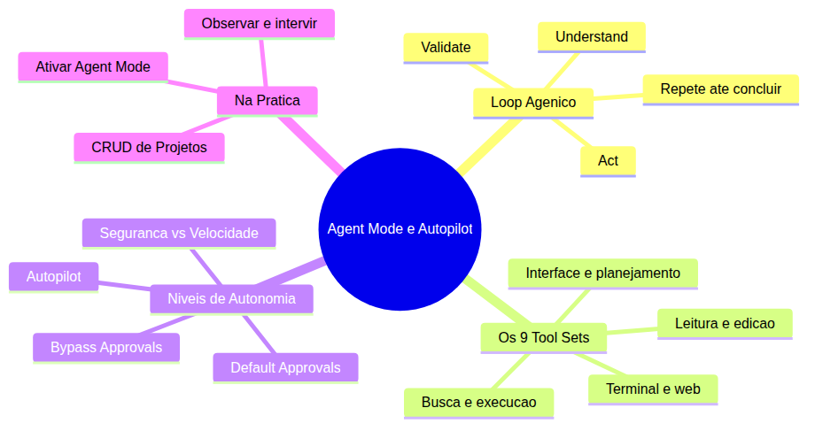
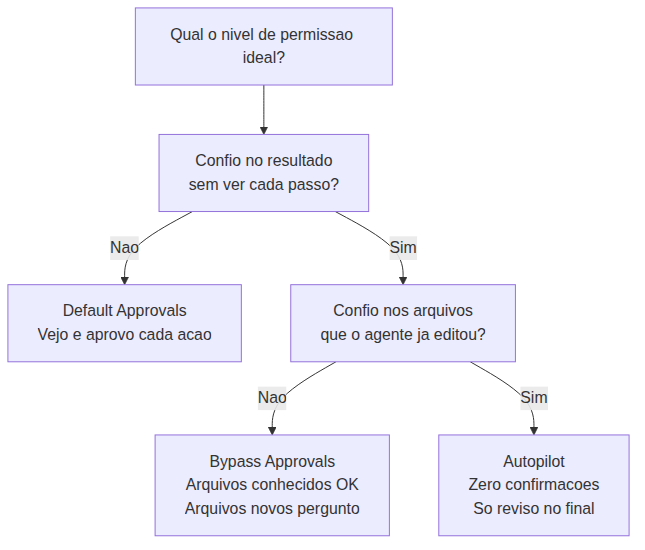
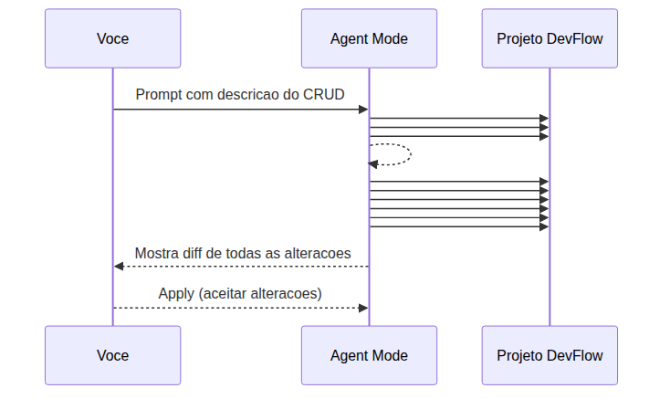

# Programador Profissional com Agentes — Aula 03

## Agent Mode e Autopilot — Programando sem as Mãos

**Duração estimada:** 50 minutos (25 de leitura + 25 de prática)
**Nível:** Iniciante
**Pré-requisitos:** Aula 02 concluída — `.github/copilot-instructions.md` com regras de stack, estilo, commits e restrições, `.github/prompts/` com 3 templates reutilizáveis, projeto DevFlow com `GET /health` funcional

---

## Objetivos de Aprendizagem

Ao final desta aula, você será capaz de:

- [ ] **Explicar** o loop Understand→Act→Validate e como ele transforma um assistente passivo em um agente autônomo
- [ ] **Distinguir** os três modos de interação com assistentes de código: autocomplete, chat e modo agente
- [ ] **Listar** os 9 tool sets universais e descrever o propósito de cada um
- [ ] **Descrever** os 3 níveis de permissão (Default Approvals, Bypass Approvals, Autopilot) e os riscos de cada um
- [ ] **Identificar** quando usar cada nível de permissão baseado na confiança na tarefa e no agente
- [ ] **Ativar** o Agent Mode e configurar o nível de permissão apropriado
- [ ] **Executar** uma feature completa (CRUD de Projetos) de forma autônoma, observando o agente trabalhar
- [ ] **Monitorar** a execução autônoma — sabendo quando intervir e quando deixar o agente terminar
- [ ] **Validar** o resultado da execução autônoma com testes manuais e verificação de código

---

## Como Usar Esta Aula

Esta aula está organizada em duas partes. A **primeira parte** constrói os fundamentos universais de como agentes de código funcionam: o ciclo de execução autônoma, as ferramentas que eles usam e os níveis de autonomia disponíveis. A **segunda parte** aplica esses conceitos na prática com GitHub Copilot, ativando o Agent Mode e executando sua primeira feature 100% autônoma no DevFlow.

Ao longo do caminho, você encontrará seções **"Mão na Massa"** para fazer junto e **"Quick Check"** para verificar se entendeu antes de avançar. Ao final, o arquivo separado **Questões de Aprendizagem** traz tarefas de checkpoint — só avance para a Aula 04 quando conseguir completá-las por conta própria.

**Tempo estimado:** 25 minutos de leitura + 25 minutos de prática.

---

## Mapa Mental

Este diagrama mostra todos os conceitos que você vai dominar nesta aula:



> *O mapa mental acima mostra a estrutura da aula. Note como o loop agêntico e os tool sets formam a base conceitual, os níveis de autonomia determinam o ritmo de trabalho, e a aplicação prática conecta tudo ao seu projeto DevFlow.*

---

## Recapitulação das Aulas 01 e 02

| Aula | Conceito | Onde aparece nesta aula | Como se conecta |
|---|---|---|---|
| 01 | **Assistente de código com IA** (Seção 2) | Seções 1-2 | Você aprendeu que um assistente pode gerar código. Agora vai deixá-lo executar tarefas completas do início ao fim |
| 01 | **Chat vs Autocomplete** (Seção 3) | Seção 1 | O Agent Mode é o próximo passo: do chat de turno único para execução autônoma com múltiplos passos |
| 01 | **Prompt de qualidade** (Seção 3) | Seções 4-5 | O prompt de Agent Mode precisa ser ainda mais específico que o prompt de Chat — inclui contexto da tarefa e critérios de aceitação |
| 01 | **DevFlow com GET /health** (Seção 8) | Seções 4-5 | O DevFlow está pronto para receber features — o Agent Mode vai implementar o CRUD de Projetos |
| 02 | **Instructions permanentes** (Seções 1-3) | Seções 2, 5 | As instructions são a bússola do Agent Mode: ele consulta stack, estilo e restrições antes de escrever código |
| 02 | **6 categorias de regras** (Seção 3) | Seção 5 | O Agent Mode usa as regras de stack, estilo e restrições para gerar código consistente com o projeto |
| 02 | **Anti-padrões** (Seção 4) | Seção 5 | O Agent Mode só funciona bem quando as instructions são específicas e verificáveis — regras genéricas produzem código genérico |
| 02 | **Prompts reutilizáveis** (Seção 5) | Seção 4 | Os templates em `.github/prompts/` podem ser usados como parte do prompt de Agent Mode para tarefas recorrentes |

---

**FUNDAMENTOS: Mecanismos Universais de Agentes Autônomos**

> *Os conceitos desta seção são universais — valem para qualquer agente de código, independentemente da ferramenta específica. Na segunda parte, você verá como a ferramenta específica implementa cada um deles. Por enquanto, foque em entender o "por que" antes do "como". Zero nomes de produto ou marca nesta parte.*

---

## 1. O Loop Agêntico: Understand → Act → Validate

### Do autocomplete ao agente

Até agora você usou um assistente de código de duas formas:

- **Autocomplete**: você digita e ele sugere a próxima linha ou bloco. Você decide se aceita ou não. É reativo — ele reage ao que você está fazendo.
- **Chat**: você pergunta e ele responde. Um turno único: pergunta → resposta. Você lê, copia, cola, testa.

Ambos são modos **passivos**. O assistente sugere ou responde, mas quem executa é você.

O **modo agente** é diferente. Em vez de você pedir e ele sugerir, você **entrega uma tarefa** e ele **executa do início ao fim**: lê o código do projeto, planeja os passos, edita os arquivos, testa o resultado e corrige se algo falhar. Tudo isso sem você precisar dizer "agora faça isso, agora faça aquilo".

Veja um exemplo. Você quer criar uma rota que lista todos os itens do banco. No Chat, você pede: "crie uma rota GET /items". Ele gera o código. Você copia, cola no arquivo certo, ajusta o nome da variável, testa. São 4-5 passos manuais seus.

No modo agente, você diz: "No projeto atual, crie uma rota GET /items que retorna todos os itens do array em memória. Siga o estilo do projeto." E o agente: abre o arquivo de rotas, lê a estrutura existente, adiciona o novo endpoint no lugar certo, testa com uma requisição, e volta com "pronto, testado e funcionando".

### As três fases do loop

Um agente autônomo executa um ciclo de três fases que se repete até a tarefa estar concluída:

**1. Understand (Entender)** — O agente lê o contexto antes de agir. Ele abre arquivos do projeto, analisa a estrutura de diretórios, interpreta as instruções que você deu. Nesta fase, ele está construindo um modelo mental do que existe e do que precisa ser feito.

**2. Act (Agir)** — Com o contexto entendido, o agente executa ações: cria arquivos, edita código, executa comandos no terminal, busca informações na internet. Cada ação é uma ferramenta que ele invoca — como se fossem "mãos" diferentes que ele usa para interagir com o projeto.

**3. Validate (Validar)** — Após agir, o agente verifica se o resultado está correto. Ele roda o projeto para ver se não quebrou, confere se os testes passam, analisa se o código gerado segue as regras. Se algo falha, ele volta para a fase Understand, descobre o que deu errado, e tenta de novo.

O ciclo se repete até a tarefa estar concluída ou até o agente encontrar um problema que não consegue resolver sozinho — quando então pede sua ajuda.

Outro exemplo: você pede "adicione validação para evitar nomes duplicados na rota POST /items". O agente lê o código da rota (Understand), adiciona uma verificação de duplicidade (Act), e testa enviando um nome repetido (Validate). Se o teste falha, ele ajusta e tenta de novo.

E agora com um terceiro exemplo: "refatore a rota GET /items para usar paginação com query params". O agente lê a rota atual (Understand), modifica para aceitar ?page e ?limit (Act), e testa com diferentes valores para garantir que a paginação funciona (Validate). Se o teste mostra que page=0 retorna erro, ele corrige e valida novamente.

### A diferença fundamental: single-turn vs multi-turn

No Chat, o fluxo é linear: você pergunta → ele responde → acabou. É **single-turn**. Se a resposta não ficou boa, você faz outra pergunta.

No Agent Mode, o fluxo é um **loop multi-turn autônomo**: o agente planeja, executa, valida, e decide sozinho se precisa de mais uma iteração ou se a tarefa está concluída. Cada iteração pode envolver múltiplas ferramentas e múltiplos arquivos.

### Analogia: estagiário proativo vs bibliotecário consultivo

Pense no Chat como um **bibliotecário consultivo**. Você pergunta "onde fica o livro X?" e ele responde "na prateleira Y, terceira estante". Você vai lá e pega. Ele não sai do lugar dele.

O Agent Mode é como um **estagiário proativo**. Você diz "preciso de todos os livros sobre padrões de projeto publicados depois de 2020". Ele vai até a estante, consulta o catálogo, separa os livros, verifica se algum está emprestado, e volta com a pilha. Se encontrar um livro danificado, ele anota e avisa. Se perceber que tem um livro sobre o tema numa estante diferente, ele vai buscar também.

O bibliotecário responde. O estagiário **executa**.

> *Até aqui, você já entendeu o conceito central: um agente não é um "Chat que fala mais" — é um executor autônomo que cicla entre entender, agir e validar até completar a tarefa. Isso já é MUITO. Respire. Se algo não ficou claro, releia a analogia do estagiário.*

### Quick Check 1

**1. Qual é a diferença fundamental entre o Chat (single-turn) e o Agent Mode (multi-turn)?**
**Resposta:** No Chat, o fluxo é pergunta → resposta — um turno único. No Agent Mode, o agente itera autonomamente: planeja, executa, valida e decide se precisa de mais passos até a tarefa estar concluída.

**2. Na fase "Validate", o que o agente verifica antes de considerar a tarefa concluída?**
**Resposta:** O agente verifica se o código gerado está correto — testa a funcionalidade, confere se não quebrou nada existente, analisa se o resultado segue as regras do projeto. Se algo falha, ele volta para a fase Understand e tenta de novo.

---

## 2. As Ferramentas do Agente: Os 9 Tool Sets Universais

### O que é um tool set

Um agente autônomo não "pensa" apenas — ele **age** através de tool sets. Tool sets são conjuntos de capacidades relacionadas que o agente pode invocar para interagir com o projeto. Cada tool set é como uma "mão" diferente que o agente usa para fazer coisas específicas.

Sem tool sets, o agente seria apenas um gerador de texto — ele "falaria" o código mas não poderia tocar nos arquivos, executar comandos ou buscar informações. Os tool sets são o que transformam um gerador de texto em um **agente que executa**.

### Os 9 tool sets

Um agente de código moderno tem acesso a 9 tool sets principais. Cada um cobre um tipo de ação que o agente pode executar:

| Tool Set | Propósito | Exemplo de uso | O que NÃO faz |
|---|---|---|---|
| **#read** | Ler arquivos e diretórios do projeto | Abrir `index.js` para entender a estrutura existente | Não edita nem executa |
| **#edit** | Criar, modificar e deletar arquivos | Adicionar uma nova rota em `routes/projects.js` | Não executa comandos |
| **#search** | Buscar padrões no código | Encontrar todas as ocorrências de `app.get` | Não modifica arquivos |
| **#execute** | Executar comandos no terminal | Rodar os testes do projeto para verificar se passam | Não interage com o editor visual |
| **#terminal** | Interagir com o terminal integrado | Executar `curl` para testar um endpoint | Não acessa a internet |
| **#web** | Buscar informações na internet | Pesquisar a documentação de uma biblioteca | Não edita código |
| **#vscode** | Interagir com a interface do editor | Abrir um arquivo em uma aba específica | Não executa comandos |
| **#todos** | Criar e gerenciar listas de tarefas | Planejar os 5 passos para implementar uma feature | Não modifica código |
| **#browser** | Abrir e interagir com páginas web | Navegar até o frontend em dev para verificar o resultado | Não acessa o sistema de arquivos |

### Como o agente decide qual ferramenta usar

A decisão é baseada no contexto e no objetivo da tarefa. O agente analisa o que precisa fazer e escolhe a ferramenta mais adequada:

- "Preciso entender como o projeto está estruturado" → **#read**
- "Preciso criar um arquivo novo com as rotas" → **#edit**
- "Onde está definida a função `validateProject`?" → **#search**
- "Vou testar se o servidor inicia sem erros" → **#execute**
- "Qual a sintaxe correta dessa biblioteca?" → **#web**

Veja um exemplo concreto. Um agente recebe a tarefa "adicione uma rota DELETE /items/:id". O fluxo provável seria:

1. **#read** — abre o arquivo de rotas para entender a estrutura
2. **#search** — procura como as outras rotas tratam parâmetros `:id`
3. **#edit** — adiciona a nova rota seguindo o padrão existente
4. **#execute** — roda o servidor e testa com `curl -X DELETE`

Outro exemplo. Um agente precisa corrigir um erro de módulo ausente. Ele:

1. **#execute** — roda o programa e vê o erro
2. **#read** — abre o arquivo de configuração para verificar dependências
3. **#execute** — instala o módulo faltante
4. **#execute** — roda o programa novamente para confirmar que funcionou

E agora com uma tarefa de análise. "Por que este teste está falhando?":

1. **#read** — abre o arquivo de teste e o código testado
2. **#execute** — roda o teste para ver a mensagem de erro exata
3. **#web** — pesquisa a mensagem de erro na documentação
4. **#edit** — corrige o código com base no que aprendeu
5. **#execute** — roda o teste de novo para confirmar a correção

### Limitações naturais das ferramentas

Cada tool set tem limites claros:
- **#edit** não executa comandos — você não pode editar um arquivo e esperar que o agente "também rode o teste" sem usar #execute
- **#browser** não edita arquivos — ele navega em páginas web, não no seu código
- **#execute** não interage com o editor visual — comandos de terminal são texto puro
- **#web** não modifica seu projeto — ele só busca informação externa

Conhecer essas limitações ajuda você a entender por que o agente às vezes parece "dar voltas" — ele está usando as ferramentas certas para cada parte da tarefa.

> *Talvez você esteja pensando: "mas eu nunca vi esses #read, #edit no Chat". Isso é porque antes do Agent Mode, você era quem usava essas ferramentas mentalmente. Você lia o arquivo, editava, rodava o teste. O Agent Mode faz isso por você — e mostra cada passo.*

### Quick Check 2

**1. Qual tool set você usaria para entender por que um teste está falhando? Justifique.**
**Resposta:** Você começaria com **#execute** para rodar o teste e ver a mensagem de erro. Depois **#read** para inspecionar o código testado e o teste em si. Se a mensagem de erro for desconhecida, **#web** para pesquisar na documentação. A combinação de execute + read + web cobre diagnóstico, inspeção e pesquisa.

**2. Um agente precisa criar 5 arquivos e depois rodar os testes. Quais tool sets ele usará e em que ordem?**
**Resposta:** Primeiro **#read** para entender a estrutura existente do projeto. Depois **#edit** para criar os 5 arquivos. Na sequência **#execute** para rodar os testes. Se os testes falharem, ele volta para **#read** e **#edit** para corrigir, seguido de **#execute** novamente para validar.

---

## 3. Níveis de Autonomia: Default → Bypass → Autopilot

### Autonomia não é binária

Autonomia não é "ligado ou desligado" — é um espectro. Você pode definir o **nível de permissão** que o agente tem para agir por conta própria. Cada nível oferece um trade-off diferente entre velocidade e segurança.

A escolha do nível depende de quanto você confia na tarefa e no agente. Uma tarefa simples em um arquivo que você conhece bem merece mais autonomia. Uma tarefa crítica em produção merece menos.

### Os 3 níveis de permissão

**Default Approvals:** O agente executa mas **toda ação exige sua confirmação explícita**. Cada #edit, #execute ou #write gera um "diff" (diferença do antes e depois) que você precisa aprovar. Máxima segurança, mínima velocidade.

- Ideal para: primeiras tarefas com o agente, código crítico (autenticação, pagamentos), ambientes de produção
- Você vê cada alteração antes de ela acontecer
- O ritmo é mais lento, mas você nunca é surpreendido

**Bypass Approvals:** Ações em **arquivos que o agente já editou** durante a sessão são aprovadas automaticamente. Ações em arquivos novos ou comandos de terminal ainda exigem confirmação. Equilíbrio entre segurança e velocidade.

- Ideal para: tarefas médias, refatoração em arquivos conhecidos, features que mexem em 2-3 arquivos
- O agente ganha velocidade depois do primeiro ciclo de aprovação
- Arquivos novos ainda passam pelo seu crivo

**Autopilot:** **Zero confirmações** — o agente edita qualquer arquivo, executa qualquer comando e acessa a internet sem perguntar. Máxima velocidade, mínimo atrito.

- Ideal para: tarefas bem definidas em projetos com testes automatizados, instructions sólidas e baixo risco
- O agente trabalha sem interrupções
- Risco: ele pode fazer alterações inesperadas que você só descobre depois

### Heurística de decisão

Como escolher o nível certo? Use esta heurística simples:



A pergunta central é sempre: **"Confio no resultado final sem ver cada passo?"**

Se a resposta for **não**, use Default Approvals. Se for **sim**, pergunte: "Confio nos arquivos que o agente já conhece?" Se não, use Bypass. Se sim, use Autopilot.

### A rede de segurança do Autopilot

Autopilot não é "largar e torcer". É "largar e verificar depois". Para isso funcionar, você precisa de duas redes de segurança:

1. **Instructions sólidas** (da Aula 02): o agente sabe a stack, o estilo e as restrições do projeto. Instruções genéricas produzem resultados imprevisíveis
2. **Testes automatizados**: se o agente quebrar algo, os testes falham e você descobre antes de subir para produção

Sem essas duas redes, Autopilot é risco puro. O agente pode gerar código que funciona mas não segue suas convenções, ou pior, quebrar algo existente sem você perceber.

### Quick Check 3

**1. Por que o Autopilot não é recomendado para um projeto sem testes automatizados?**
**Resposta:** Porque sem testes, não há como saber se o agente quebrou algo ao fazer alterações. O Autopilot permite que o agente edite qualquer arquivo sem confirmação — se não houver testes para validar o resultado, você só descobre o problema quando o projeto falha em execução, o que pode ser tarde demais.

**2. Em qual nível de permissão você executaria uma refatoração que mexe em 3 arquivos que você já editou antes? Justifique.**
**Resposta:** **Bypass Approvals**. Os arquivos já são conhecidos do agente (ele editou antes), então as alterações neles seriam aprovadas automaticamente. Mas se a refatoração criar arquivos auxiliares novos, você ainda verá essas criações antes de aprovar. É o equilíbrio ideal entre velocidade e segurança para este cenário.

---

**APLICAÇÃO: Agent Mode no GitHub Copilot**

> *Agora que você entende o loop agêntico, os tool sets e os níveis de autonomia, vamos conectá-los à prática com GitHub Copilot. Você vai ativar o Agent Mode, configurar permissões e executar sua primeira feature 100% autônoma no DevFlow.*

---

## 4. Ativando e Configurando o Agent Mode no GitHub Copilot

### Como ativar o Agent Mode

O Agent Mode está disponível no Chat do GitHub Copilot dentro do VS Code. A ativação é simples:

1. Abra o Chat do Copilot (`Ctrl+Shift+I` ou `Cmd+Shift+I` no Mac)
2. No campo de texto do Chat, você verá um seletor de modo: **Ask** (perguntar) e **Agent** (agente)
3. Selecione **Agent**

Quando você ativa o Agent Mode, a interface muda:
- O campo de texto ganha um indicador "Agent mode ativo"
- O agente mostra **tool calls** em tempo real — você vê cada #read, #edit, #execute que ele executa
- As alterações propostas aparecem como **diff** no editor — verde para adições, vermelho para remoções

### O prompt do Agent Mode

Escrever um prompt para Agent Mode é diferente de escrever para o Chat. No Chat, você pode ser vago porque vai refinando com perguntas seguintes. No Agent Mode, o prompt precisa ser **completo** porque o agente vai executar sem pedir esclarecimentos.

Um bom prompt de Agent Mode inclui:

1. **Contexto**: qual projeto, qual arquivo, qual área do código
2. **Objetivo**: o que precisa ser feito (em 1-2 frases)
3. **Critérios de aceitação**: como saber se a tarefa foi concluída
4. **Restrições**: o que NÃO fazer (se aplicável)

Exemplo: em vez de "cria uma rota pra listar projetos", escreva:

> "No projeto DevFlow, crie uma rota GET /api/projects que retorna um array de projetos em memória. Use Express Router. Siga o estilo definido em copilot-instructions.md. O endpoint deve retornar 200 com o array mesmo que vazio."

Percebe a diferença? O prompt do Agent Mode diz **onde**, **o quê**, **como** e **critérios de sucesso**.

### Configurando permissões

No VS Code, você pode ajustar os níveis de aprovação:

1. Abra as configurações: `Ctrl+,` (ou `Cmd+,` no Mac)
2. Pesquise por "Copilot: Agent Mode"
3. Você verá opções para:
   - **Approval Level**: Default, Bypass, Autopilot
   - **Terminal Approval**: se comandos de terminal exigem aprovação
   - **Network Approval**: se operações de rede exigem aprovação

Para começar, deixe em **Default Approvals** — você verá cada passo do agente antes de aprovar.

### O que muda na interface

Com o Agent Mode ativo:
- O agente **mostra o que está fazendo**: "📖 Reading index.js...", "✏️ Editing routes/projects.js...", "▶️ Running npm test..."
- Você vê o **diff** de cada alteração proposta
- Pode **aceitar** (Apply), **rejeitar** (Discard) ou **modificar** (Edit) cada alteração
- O agente **volta** para o ciclo de validação automaticamente

### Mão na Massa 1 — Primeiro Agent Mode

Vamos fazer o primeiro teste:

- [ ] Abra o VS Code na pasta do DevFlow
- [ ] Abra o Chat do Copilot (`Ctrl+Shift+I`)
- [ ] Mude o seletor de modo para **Agent**
- [ ] Escreva o prompt: "No projeto DevFlow, crie uma rota GET /api/status que retorna { status: 'ok', timestamp: Date.now() }"
- [ ] Observe o agente: ele vai ler o `package.json`, ler o `index.js`, planejar, criar/editar o arquivo
- [ ] Quando o agente mostrar o diff, revise e clique em **Apply** para aceitar
- [ ] No terminal, teste: `curl http://localhost:3000/api/status`

**Verificação:** A resposta deve ser um JSON com `status: 'ok'` e um timestamp atual.

> *Talvez você tenha pensado: "mas eu poderia fazer isso no Chat e colar manualmente". Sim, mas reparou como o agente leu o projeto antes de editar? Ele não assumiu nada — ele verificou o arquivo existente e adicionou a rota no lugar certo, seguindo o estilo do projeto. Isso é o que faz o Agent Mode ser mais que "Chat com permissão de editar".*

### Quick Check 4

**1. O que você deve incluir em um prompt de Agent Mode que não incluiria em um prompt de Chat comum?**
**Resposta:** Contexto explícito (qual projeto/arquivo), critérios de aceitação (como saber se funcionou) e restrições (o que NÃO fazer). No Chat você pode refinar com perguntas seguintes; no Agent Mode o prompt precisa ser completo porque o agente executa sem pedir esclarecimentos.

**2. Durante a execução do Mão na Massa 1, quais tool sets você observou o agente usando?**
**Resposta:** **#read** (para ler `package.json` e `index.js`), **#edit** (para adicionar a nova rota no arquivo), e possivelmente **#execute** (para testar o endpoint com `curl` ou iniciar o servidor).

---

## 5. Demonstração Guiada: CRUD de Projetos do DevFlow

### A feature: CRUD completo de Projetos

Agora vamos ao evento principal. O Agent Mode vai implementar um CRUD completo de Projetos no DevFlow — cinco endpoints REST:

- `POST /api/projects` — criar um novo projeto
- `GET /api/projects` — listar todos os projetos
- `GET /api/projects/:id` — buscar um projeto pelo ID
- `PUT /api/projects/:id` — atualizar um projeto existente
- `DELETE /api/projects/:id` — deletar um projeto

Cada projeto terá os campos: `name` (string, obrigatório), `description` (string, opcional), `status` (enum: `planejado`, `em_andamento`, `concluído`).

O armazenamento será em memória (um array) — banco de dados virá em aulas futuras.

### Como o agente trabalha

Veja a sequência de interações que o agente vai executar:



Perceba que o agente **começa lendo as instructions** (Aula 02). É lá que ele descobre que o projeto usa Express, camelCase, aspas simples — e segue tudo automaticamente. Sem as instructions, o código gerado seria genérico, possivelmente em inglês, com aspas duplas e 4 espaços.

### O prompt para o Agent Mode

Copie e cole este prompt no Agent Mode:

> "No projeto DevFlow, implemente um CRUD completo de Projetos com os seguintes endpoints:
>
> POST /api/projects - criar projeto
> GET /api/projects - listar todos
> GET /api/projects/:id - buscar por ID
> PUT /api/projects/:id - atualizar
> DELETE /api/projects/:id - deletar
>
> Cada projeto tem: name (string, obrigatorio), description (string, opcional), status (enum: planejado, em_andamento, concluido, default: planejado).
>
> Validacoes: name nao pode ser vazio. Status deve ser um dos valores do enum. Se a validacao falhar, retorne 400 com mensagem de erro clara. Se o projeto nao existir, retorne 404.
>
> Armazenamento em memoria (array). Siga as convencoes do copilot-instructions.md. Use Express Router para as rotas. Tratamento de erros com try/catch."

Este prompt funciona porque:
- Diz **onde** (projeto DevFlow)
- Diz **o quê** (5 endpoints com especificações)
- Diz **como** (seguir instructions, Express Router, try/catch)
- Diz **critérios de aceitação** (validações, código de erro, armazenamento em memória)

> *Se você está se sentindo ansioso para ver o agente trabalhar, ótimo — essa é a reação certa. A primeira vez que você vê um agente implementando uma feature completa do zero é quase mágica. Mas lembre: não é mágica, é engenharia. Cada passo que ele dá foi programado e configurado por você (nas instructions).*

### Mão na Massa 2 — Executando o CRUD com Agent Mode

- [ ] Certifique-se de que o Agent Mode está ativo e em **Default Approvals**
- [ ] Cole o prompt completo da feature (acima)
- [ ] Observe as tool calls do agente: #read, #todos, #edit, #execute
- [ ] Aprove cada alteração após revisar o diff
- [ ] Após o agente concluir, teste cada endpoint manualmente:

```bash
# POST - criar projeto
curl -X POST http://localhost:3000/api/projects \
  -H "Content-Type: application/json" \
  -d '{"name":"DevFlow","description":"Dashboard de gerenciamento"}'

# GET - listar projetos
curl http://localhost:3000/api/projects

# GET - buscar por ID
curl http://localhost:3000/api/projects/0

# PUT - atualizar projeto
curl -X PUT http://localhost:3000/api/projects/0 \
  -H "Content-Type: application/json" \
  -d '{"status":"em_andamento"}'

# DELETE - deletar projeto
curl -X DELETE http://localhost:3000/api/projects/0
```

- [ ] Teste as validações: POST sem name (deve retornar 400), POST com status inválido (deve retornar 400), GET de ID inexistente (deve retornar 404)

**Verificação:** Todos os 5 endpoints retornam respostas corretas. Validações rejeitam dados inválidos com mensagens claras de erro.

### O papel das instructions da Aula 02

Observe como o código gerado reflete as regras que você definiu na Aula 02:

- **Stack**: o agente usou Express Router porque as instructions dizem "Node.js com Express"
- **Estilo**: variáveis em camelCase, aspas simples, 2 espaços, JSDoc (se você incluiu)
- **Restrições**: sem dependências externas desnecessárias
- **Commits**: quando você fizer o commit, o agente pode sugerir a mensagem no formato conventional commits

Sem as instructions, o agente geraria código genérico que "funciona" mas não parece parte do seu projeto. Com as instructions, o código parece que foi escrito por um membro do seu time.

### Quick Check 5

**1. Por que o agente começou lendo as instructions do projeto antes de escrever código?**
**Resposta:** Para entender as regras do projeto — stack, estilo, restrições — antes de gerar qualquer código. As instructions garantem que o código gerado siga as mesmas convenções que você já estabeleceu, como se fosse escrito por um membro do time.

**2. O que aconteceria se as instructions da Aula 02 não existissem? Como o código gerado seria diferente?**
**Resposta:** O agente geraria código no estilo padrão dele — provavelmente em inglês, com aspas duplas, 4 espaços de indentação, e sem JSDoc. O código "funcionaria" mas pareceria estranho ao lado do código existente do projeto.

---

## 6. Observabilidade: O Que Acontece Durante a Execução Autônoma

### Os sinais vitais do agente

Autonomia não significa "largar e torcer". O desenvolvedor profissional observa o agente trabalhar, entende cada tool call, e sabe o momento exato de intervir.

Aqui estão os sinais vitais que você deve monitorar:

| Tool call observada | O que significa | Ação recomendada |
|---|---|---|
| **#todos** aparecendo | O agente está planejando | Bom sinal — deixe continuar |
| **#read** seguido de **#edit** | O agente entendeu e está agindo | Deixe continuar |
| **#edit** seguido de **#execute** | O agente está validando o que criou | Excelente sinal — ele não está só gerando código, está testando |
| **#read** em arquivos que não existem | O agente está confuso | Sinal de alerta — verifique o prompt |
| **#edit** → erro → **#edit** → mesmo erro | O agente está preso em loop | Momento de intervir |
| **#web** para pesquisar sintaxe | O agente está aprendendo sobre a marcha | Normal para tarefas complexas |
| Múltiplos **#execute** com falha | Algo no ambiente não está funcionando | Verifique se o servidor está rodando |

### Quando intervir

Saber quando intervir é uma habilidade que se desenvolve com a prática. Aqui estão heurísticas para decidir:

**Intervenha quando:**
- O agente repete o **mesmo erro 3 vezes** sem mudar de abordagem
- Ele edita um **arquivo que não deveria** (ex: node_modules, .env)
- Ele propõe uma **abordagem que você sabe que não funciona** para o seu contexto
- O agente está **claramente perdido**, lendo arquivos aleatórios

**Não intervenha quando:**
- O agente está no ciclo de **Validate** — testando, corrigindo, testando de novo
- Ele está fazendo algo que **você não faria mas pode funcionar** (às vezes ele encontra soluções criativas)
- Ele está **explorando alternativas** — lendo vários arquivos para entender o contexto
- O agente está **instalando dependências** que você permitiu nas instructions

### Como intervir corretamente

Quando precisar intervir, **não cancele e comece do zero**. Em vez disso:

1. **Pause** o agente (botão de pausa na interface)
2. **Ajuste o prompt** com instruções adicionais: "Ignore a abordagem X, use Y"
3. **Retome** o agente — ele continua de onde parou com as novas instruções

Interromper o agente bruscamente e recomeçar do zero joga fora todo o contexto que ele já construiu. Um ajuste no prompt é mais rápido e preserva o progresso.

### O log como ferramenta de aprendizado

Após a execução, revise o log de tool calls. Ele mostra o **raciocínio do agente**: o que ele leu, o que decidiu, como testou. Isso é valioso porque:

- Você entende **como** o agente pensa (e pode melhorar seus prompts)
- Identifica **lacunas nas instructions** — se o agente fez algo fora do padrão, talvez falte uma regra
- Aprende **padrões de uso** — quais tool sets são mais usados para cada tipo de tarefa

> *Talvez você tenha notado que o agente fez algo inesperado durante o Mão na Massa 2. Isso é completamente normal. Cada agente tem seu próprio "estilo" de resolver problemas. Parte do seu trabalho como desenvolvedor profissional é aprender o estilo do seu agente e guiá-lo quando necessário.*

### Mão na Massa 3 — Executando com Autopilot (com supervisão)

Agora vamos experimentar o Autopilot — o nível máximo de autonomia. Mas com supervisão:

- [ ] Mude a permissão para **Autopilot** nas configurações do Copilot
- [ ] Escreva este prompt: "Adicione um endpoint GET /api/projects/search?name=termo que busca projetos por nome no DevFlow. A busca deve ser case insensitive e retornar array vazio se nao encontrar nada."
- [ ] **Observe sem intervir** — o agente vai trabalhar sem pedir confirmação
- [ ] Ao final, revise TODO o código gerado (não confie cegamente)
- [ ] Teste: `curl "http://localhost:3000/api/projects/search?name=dev"`
- [ ] Teste com termo inexistente: `curl "http://localhost:3000/api/projects/search?name=zzz"`

**Verificação:** O endpoint de busca funciona, é case insensitive (`dev` encontra `DevFlow`), e retorna `[]` quando não encontra nada.

**Importante:** Após o teste, volte a permissão para **Default Approvals** ou **Bypass Approvals**. Autopilot é para momentos específicos, não para uso contínuo sem supervisão.

### Quick Check 6

**1. Durante o Mão na Massa 3, você observou algum momento em que teria intervindo se estivesse em Default Approvals? Qual?**
**Resposta:** (Resposta pessoal, mas exemplos comuns incluem: quando o agente começou a ler arquivos não relacionados, quando ele propôs uma estrutura diferente da esperada, ou quando executou comandos sem você ver o diff. O importante é perceber que em Default Approvals você teria pausado para questionar.)

**2. Por que o Autopilot exige mais disciplina do desenvolvedor (revisão pós-execução) do que os outros níveis?**
**Resposta:** Porque não há confirmação durante a execução — o agente faz tudo sem perguntar. Se você não revisar o código depois, pode não perceber alterações incorretas ou inesperadas. A disciplina de revisão pós-execução é a rede de segurança do Autopilot.

---

## Autoavaliação: Quiz Rápido

**1. Qual a diferença fundamental entre Chat (single-turn) e Agent Mode (multi-turn)?**
**Resposta:** No Chat você pergunta e ele responde — um turno único. No Agent Mode você entrega uma tarefa e o agente itera autonomamente (planeja, executa, valida) até completar.

**2. Cite 3 dos 9 tool sets de um agente autônomo e o propósito de cada um.**
**Resposta:** #read (ler arquivos do projeto), #edit (criar/modificar/deletar arquivos), #execute (executar comandos no terminal). Outras combinações válidas: #search (buscar padrões), #web (buscar info na internet), #terminal (interagir com terminal integrado), #vscode (interagir com interface do editor), #todos (planejar tarefas), #browser (navegar em páginas web).

**3. Qual a diferença entre Default Approvals e Bypass Approvals?**
**Resposta:** Default Approvals exige confirmação para TODA ação do agente. Bypass Approvals aprova automaticamente ações em arquivos que o agente já editou antes, mas ainda pergunta para arquivos novos e comandos de terminal.

**4. Por que o Autopilot exige instructions sólidas e testes automatizados como rede de segurança?**
**Resposta:** Porque sem instructions, o agente gera código fora do padrão do projeto. Sem testes, não há como saber se o agente quebrou algo ao editar arquivos sem confirmação.

**5. O que você deve incluir em um prompt de Agent Mode que não incluiria em um prompt de Chat?**
**Resposta:** Contexto explícito (qual projeto/arquivo), critérios de aceitação (como verificar se funcionou), e restrições (o que NÃO fazer). O Chat permite refinar com perguntas seguintes; o Agent Mode precisa de um prompt completo.

**6. Cite dois sinais de que você deve intervir na execução de um agente autônomo.**
**Resposta:** (1) O agente repete o mesmo erro 3 vezes sem mudar de abordagem. (2) O agente edita um arquivo que não deveria (ex: node_modules, .env). Outros sinais válidos: ele está claramente perdido lendo arquivos aleatórios, ou propõe uma abordagem que você sabe que não funciona.

---

## Mão na Massa N: Exercícios Graduados

**Exercício 1 (Fácil) — Feature Simples com Agent Mode**

Adicione um endpoint `GET /api/projects/count` que retorna `{ total: N }` onde N é o número de projetos cadastrados.

Use **Default Approvals** e revise cada passo do agente. Observe especialmente como ele lê o código existente antes de editar.

**Gabarito:**

1. Ative o Agent Mode e mantenha em Default Approvals
2. Escreva o prompt: "No DevFlow, adicione um endpoint GET /api/projects/count que retorna { total: numeroDeProjetos }. Use o array de projetos existente."
3. Aprove as tool calls: #read (para ler o arquivo de rotas), #edit (para adicionar o endpoint)
4. Teste: `curl http://localhost:3000/api/projects/count`
5. O retorno deve ser `{"total": 0}` se não houver projetos, ou o número correto após criar alguns

O agente provavelmente vai ler o `routes/projects.js` existente e adicionar o novo endpoint seguindo o mesmo padrão das outras rotas — sem precisar de explicação extra sobre estrutura.

---

**Exercício 2 (Médio) — Feature com Validações**

Adicione um endpoint `PATCH /api/projects/:id/status` que atualiza apenas o campo `status` de um projeto. Regras:

- Status deve ser um dos valores do enum (`planejado`, `em_andamento`, `concluído`)
- Se o status for inválido, retorne 400 com mensagem clara
- Se o projeto não existir, retorne 404
- Se o status for igual ao atual, retorne 200 sem modificar (operação idempotente)

Use **Default Approvals** e observe como o agente lida com validações.

**Gabarito:**

1. Prompt: "No DevFlow, adicione um endpoint PATCH /api/projects/:id/status que atualiza apenas o status do projeto. Valide se o status e um dos valores: planejado, em_andamento, concluido. Se for invalido retorne 400. Se o projeto nao existir retorne 404. Se o status for o mesmo, retorne 200 sem modificar."
2. O agente vai ler as rotas existentes (especialmente a PUT, que já tem lógica de atualização e validação) e criar a nova rota
3. Teste:
   - `curl -X PATCH http://localhost:3000/api/projects/0 -H "Content-Type: application/json" -d '{"status":"em_andamento"}'` — deve retornar 200 com o projeto atualizado
   - `curl -X PATCH http://localhost:3000/api/projects/99 -H "Content-Type: application/json" -d '{"status":"em_andamento"}'` — deve retornar 404
   - `curl -X PATCH http://localhost:3000/api/projects/0 -H "Content-Type: application/json" -d '{"status":"invalido"}'` — deve retornar 400

---

**Desafio (Difícil) — Feature Completa com Autopilot**

Crie um CRUD completo de **Tarefas (Tasks)** para o DevFlow. Campos:

- `title` (string, obrigatório) — título da tarefa
- `projectId` (número, obrigatório) — identificador do projeto ao qual a tarefa pertence. Um `projectId` é um ID numérico que conecta cada tarefa ao projeto que a contém, como uma chave que referencia o projeto pai
- `completed` (boolean, default: false) — se a tarefa foi concluída

Endpoints:

- `POST /api/tasks` — criar tarefa (title e projectId obrigatórios)
- `GET /api/tasks` — listar tarefas (com filtro opcional `?projectId=N`)
- `GET /api/tasks/:id` — buscar tarefa por ID
- `PUT /api/tasks/:id` — atualizar tarefa
- `DELETE /api/tasks/:id` — deletar tarefa

Use **Autopilot** para executar. Depois, revise TODO o código gerado e teste todos os endpoints.

**Gabarito:**

1. Mude a permissão para Autopilot
2. Prompt: "No DevFlow, crie um CRUD completo de Tasks. Campos: title (string, obrigatorio), projectId (number, obrigatorio, referencia ao projeto), completed (boolean, default false). Endpoints: POST /api/tasks (criar, validar title e projectId obrigatorios), GET /api/tasks (listar, com filtro opcional ?projectId=N), GET /api/tasks/:id (buscar por ID), PUT /api/tasks/:id (atualizar), DELETE /api/tasks/:id (deletar). Armazenamento em memoria em array separado do array de projetos. Siga o estilo do copilot-instructions.md."
3. Observe o agente trabalhar sem intervir
4. Após conclusão, revise o código criado
5. Teste todos os endpoints:
   ```bash
   # POST
   curl -X POST http://localhost:3000/api/tasks -H "Content-Type: application/json" -d '{"title":"Implementar login","projectId":0}'
   
   # GET all
   curl http://localhost:3000/api/tasks
   
   # GET by projectId
   curl "http://localhost:3000/api/tasks?projectId=0"
   
   # GET by id
   curl http://localhost:3000/api/tasks/0
   
   # PUT
   curl -X PUT http://localhost:3000/api/tasks/0 -H "Content-Type: application/json" -d '{"completed":true}'
   
   # DELETE
   curl -X DELETE http://localhost:3000/api/tasks/0
   
   # Validação: POST sem title
   curl -X POST http://localhost:3000/api/tasks -H "Content-Type: application/json" -d '{"projectId":0}'  # 400 esperado
   ```
6. Volte a permissão para Default ou Bypass após o teste

---

## Resumo da Aula

### Os 6 Conceitos Fundamentais

1. **Loop Understand→Act→Validate**: o ciclo de três fases que um agente autônomo executa: entende o contexto, age com ferramentas e valida o resultado, repetindo até a tarefa estar concluída.

2. **9 tool sets universais**: #read, #edit, #search, #execute, #terminal, #web, #vscode, #todos, #browser — cada um cobre uma capacidade específica que o agente pode invocar.

3. **Default Approvals**: toda ação exige confirmação. Máxima segurança, mínima velocidade.

4. **Bypass Approvals**: ações em arquivos conhecidos são automáticas; arquivos novos exigem confirmação. Equilíbrio.

5. **Autopilot**: zero confirmações. Máxima velocidade, exige instructions sólidas e testes como rede de segurança.

6. **Observabilidade**: monitorar tool calls, saber quando intervir (erro repetido, arquivo errado) e como intervir (pausar, ajustar prompt, retomar).

### O Que Você Construiu Hoje

- [x] Ativou o Agent Mode no GitHub Copilot e executou sua primeira tarefa autônoma
- [x] Implementou o CRUD completo de Projetos do DevFlow via Agent Mode (5 endpoints)
- [x] Executou uma tarefa em Autopilot e revisou o código gerado
- [x] Aprendeu a interpretar os tool calls do agente e decidir quando intervir

---

## Próxima Aula

**Aula 04: Handoff com Artefatos Auditáveis — O Protocolo de Ralph Wigguns**

Você acabou de ver o agente implementar uma feature completa de forma autônoma. Mas e quando a sessão termina e você precisa continuar depois? Ou passar a tarefa para outro desenvolvedor? A Aula 04 apresenta o protocolo de handoff com ADRs (Architecture Decision Records) — artefatos auditáveis que preservam decisões de arquitetura e permitem que um novo agente retome o trabalho com contexto limpo, sem carregar histórico de sessões anteriores.

---

## Referências

### Documentação Oficial

- [GitHub Copilot — Agent Mode](https://docs.github.com/en/copilot/using-github-copilot/ai-agents)
- [GitHub Copilot — Custom Instructions](https://docs.github.com/en/copilot/customizing-copilot/adding-custom-instructions-for-github-copilot)
- [VS Code Docs — Agents Overview](https://code.visualstudio.com/docs/agents/overview)

### Ferramentas

- [curl](https://curl.se/) — cliente HTTP de linha de comando para testes de API
- [Express.js](https://expressjs.com/) — framework web usado no DevFlow

### Artigos para Aprofundamento

- [Effective Custom Instructions](https://github.blog/engineering/user-experience/effective-custom-instructions-for-github-copilot/)
- [AI Agents: A Comprehensive Guide](https://www.deeplearning.ai/the-batch/ai-agents-a-comprehensive-guide/)

---

## FAQ

**P: O Agent Mode está disponível no plano Free do Copilot?**
R: Sim. O Agent Mode está disponível em todos os planos do GitHub Copilot (Free, Pro, Pro+, Max).

**P: O Agent Mode funciona para qualquer linguagem?**
R: Sim. O Agent Mode usa o modelo de IA subjacente do Copilot, que suporta dezenas de linguagens. As tool calls (#read, #edit, #execute) funcionam independentemente da linguagem do projeto.

**P: Posso usar o Agent Mode sem o VS Code?**
R: O Agent Mode está disponível no Chat do Copilot dentro do VS Code e também no GitHub.com (Copilot Chat na web). A experiência completa com tool calls e diff é melhor no VS Code.

**P: O Autopilot pode fazer alterações perigosas?**
R: Sim — por isso ele não é recomendado sem instructions sólidas e testes automatizados. Sempre revise o código após uma execução em Autopilot.

**P: O que acontece se o agente ficar preso em um loop infinito?**
R: O agente tem limites de iteração. Se atingir o limite, ele para e informa que não conseguiu completar a tarefa. Você pode ajustar o prompt e tentar novamente.

**P: Preciso aprovar cada tool call individualmente no Default Approvals?**
R: Sim — cada #edit, #execute e #write gera uma notificação com diff para você revisar e aprovar ou rejeitar.

**P: As tool calls consomem meus limites de uso do Copilot?**
R: Cada tool call conta como uma requisição ao modelo, então sim, múltiplas tool calls consomem mais do seu limite do que uma única pergunta no Chat.

**P: Posso ver o histórico de tool calls de uma sessão anterior?**
R: O histórico da conversa do Agent Mode é preservado enquanto a sessão do VS Code estiver aberta. Ao fechar e reabrir, o histórico da sessão anterior não é mantido — uma das razões pelas quais a Aula 04 (Handoff) é importante.

**P: O Agent Mode funciona com MCPs (Model Context Protocol)?**
R: Sim. O Agent Mode pode usar ferramentas externas configuradas no editor. Isso será abordado em aulas futuras do módulo.

**P: Como sei se o agente está usando as instructions do projeto?**
R: Observe as tool calls iniciais: se ele fizer #read no `copilot-instructions.md`, está consultando as instructions ativamente. O código gerado também reflete as regras — aspas simples, camelCase, etc.

---

## Glossário

| Termo | Definição |
|---|---|
| **Agent Mode** | Modo de operação onde o assistente executa tarefas completas de forma autônoma, ciclando entre entender, agir e validar (Seção 1) |
| **Loop Understand→Act→Validate** | Ciclo de três fases que o agente executa até completar uma tarefa: entender o contexto, agir com ferramentas, validar o resultado (Seção 1) |
| **Tool set** | Conjunto de capacidades relacionadas que o agente pode invocar para interagir com o projeto, como #read, #edit, #execute (Seção 2) |
| **Default Approvals** | Nível de permissão onde toda ação do agente exige confirmação explícita (Seção 3) |
| **Bypass Approvals** | Nível onde ações em arquivos já editados são automáticas; ações em arquivos novos exigem confirmação (Seção 3) |
| **Autopilot** | Nível máximo de autonomia onde o agente executa sem nenhuma confirmação (Seção 3) |
| **Diff** | Visualização das diferenças entre o código antes e depois de uma alteração proposta pelo agente (Seção 4) |
| **Tool call** | Chamada que o agente faz a uma ferramenta específica, como #read para ler um arquivo ou #edit para modificar (Seção 4) |
| **CRUD** | Acrônimo para Create, Read, Update, Delete — as quatro operações básicas de persistência (Seção 5) |
| **Enum** | Tipo de dado que restringe um valor a um conjunto pré-definido de opções (Seção 5) |
| **Observabilidade** | Capacidade de monitorar e entender o que o agente está fazendo durante a execução autônoma (Seção 6) |
