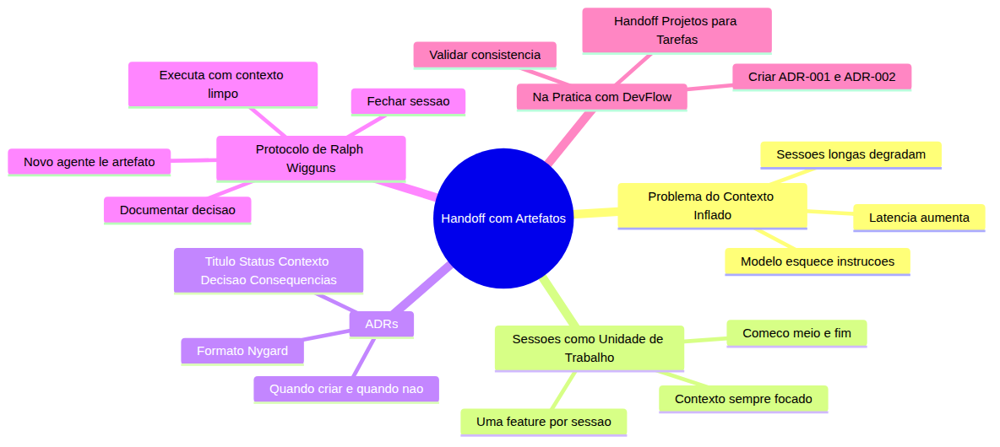
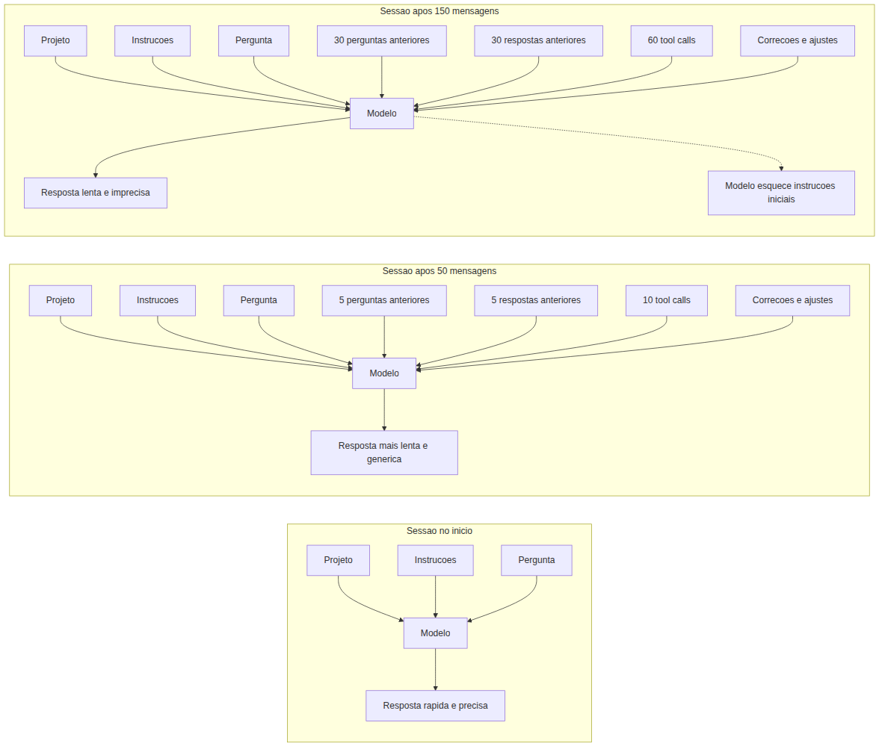
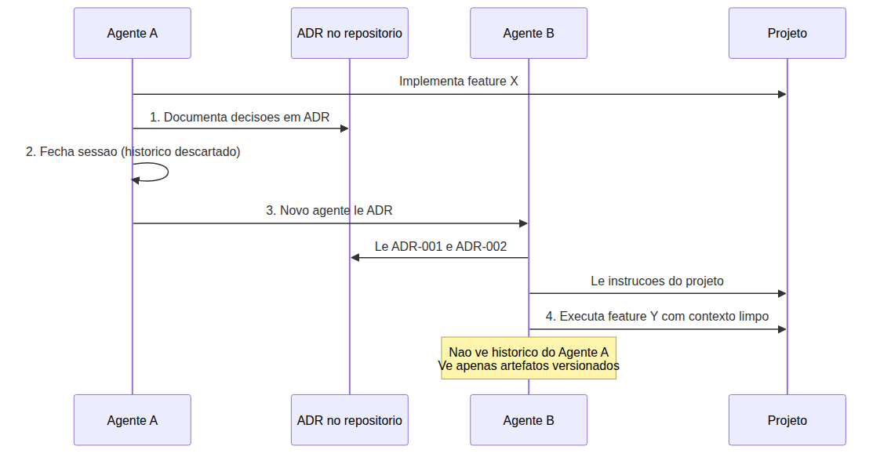
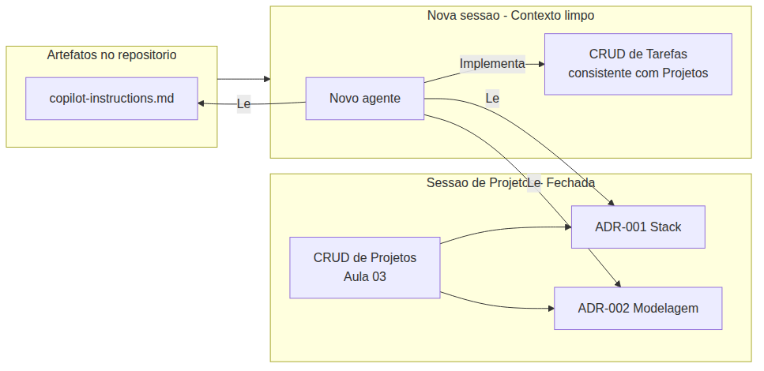

# Programador Profissional com Agentes — Aula 04

## Handoff com Artefatos Auditáveis — O Protocolo de Ralph Wigguns

**Duração estimada:** 50 minutos (25 de leitura + 25 de prática)
**Nível:** Intermediário
**Pré-requisitos:** Aula 03 concluída — Agent Mode com CRUD de Projetos implementado no DevFlow, `.github/copilot-instructions.md` com regras de stack e estilo, Git versionando o projeto

---

## Objetivos de Aprendizagem

Ao final desta aula, você será capaz de:

- [ ] **Explicar** o problema do contexto inflado — por que sessões longas degradam a qualidade das respostas e como isso afeta a produtividade
- [ ] **Definir** o conceito de sessão como unidade de trabalho atômica e justificar por que uma sessão = uma feature ou tarefa
- [ ] **Descrever** o formato ADR (*Architecture Decision Record*) — template Nygard de 5 campos (Título, Status, Contexto, Decisão, Consequências)
- [ ] **Identificar** decisões de arquitetura que merecem um ADR, distinguindo-as de detalhes de implementação que não precisam de documentação formal
- [ ] **Explicar** o protocolo de Ralph Wigguns: documentar decisão → fechar sessão → novo agente lê artefato → executa com contexto limpo
- [ ] **Distinguir** entre contexto de sessão (efêmero, inflável) e contexto de artefato (versionado, auditável, focado)
- [ ] **Criar** ADRs versionados no diretório `docs/adr/` do DevFlow documentando decisões reais de arquitetura
- [ ] **Executar** um handoff completo: encerrar sessão da feature de Projetos, documentar decisões em ADRs, iniciar novo agente com contexto limpo e implementar feature de Tarefas
- [ ] **Iniciar** um novo agente de código fornecendo apenas artefatos como contexto, sem histórico de conversa anterior
- [ ] **Aplicar** o protocolo de handoff ao projeto DevFlow, conectando a feature de Projetos (Aula 03) à feature de Tarefas com artefatos auditáveis

---

## Como Usar Esta Aula

Esta aula está organizada em duas partes. A **primeira parte** constrói os fundamentos universais sobre por que o contexto inflado é o inimigo da produtividade, como sessões atômicas resolvem o problema, o que são ADRs (Architecture Decision Records) e como o protocolo de Ralph Wigguns integra tudo em um fluxo profissional de handoff. A **segunda parte** aplica esses conceitos na prática com GitHub Copilot no DevFlow, criando ADRs reais e executando o handoff completo da feature de Projetos para a feature de Tarefas.

Ao longo do caminho, você encontrará seções **"Mão na Massa"** para fazer junto e **"Quick Check"** para verificar se entendeu antes de avançar. Ao final, o arquivo separado **Questões de Aprendizagem** traz tarefas de checkpoint — só avance para a próxima aula quando conseguir completá-las por conta própria.

**Tempo estimado:** 25 minutos de leitura + 25 minutos de prática.

---

## Mapa Mental

Este diagrama mostra todos os conceitos que você vai dominar nesta aula:



> *O mapa mental acima mostra a estrutura da aula. Cada ramo representa um conceito que você vai explorar: do diagnóstico do problema à aplicação prática no DevFlow.*

---

## Recapitulação das Aulas 01, 02 e 03

| Aula | Conceito | Onde aparece nesta aula | Como se conecta |
|---|---|---|---|
| Aula 01 | **Ambiente profissional** (Seções 1-8) | Seções 5-6 | Você configurou o DevFlow com Express e Git. Agora vai documentar decisões de stack em ADRs |
| Aula 01 | **Chat vs Autocomplete** (Seção 3) | Seções 1, 4 | Você aprendeu o básico de sessões de chat. Agora vai aprender por que sessões curtas são profissionais |
| Aula 02 | **Instructions permanentes** (Seções 1-3) | Seções 5-6 | As instructions são o contexto permanente. Os ADRs complementam com decisões de arquitetura versionadas |
| Aula 02 | **Prompts reutilizáveis** (Seção 5) | Seção 6 | Você pode criar um prompt de handoff reutilizável em `.github/prompts/` |
| Aula 03 | **Agent Mode e Autopilot** (Seções 1-5) | Seções 5-7 | Você viu o agente implementar features completas. Agora vai aprender a orquestrar múltiplas sessões de agente |
| Aula 03 | **CRUD de Projetos** (Seção 5) | Seções 5-6 | O DevFlow tem Projetos implementados. Vamos documentar as decisões daquela implementação em ADRs e fazer handoff para Tarefas |
| Aula 03 | **Tool calls e observabilidade** (Seções 2, 6) | Seção 7 | Você aprendeu a observar tool calls. Vai verificar se o novo agente leu os ADRs antes de agir |
| Aula 03 | **Desafio (Difícil) — CRUD de Tarefas** | Seção 6 | *Nota:* se você completou o Desafio da Aula 03, já tem código de Tarefas. A Seção 6 explica como lidar com isso |

---

**FUNDAMENTOS: O Problema do Contexto Inflado e o Protocolo de Handoff**

> *Os conceitos desta seção são universais — valem para qualquer assistente de código com IA, independentemente da ferramenta específica. Na segunda parte, você verá como sua ferramenta implementa cada um deles no contexto do seu projeto. Por enquanto, zero nomes de produto — foque em entender o "por que" antes do "como".*

---

## 1. O Problema do Contexto Inflado

### Como uma sessão cresce até se tornar insustentável

Você já deve ter vivido esta situação: começa uma conversa com um assistente de código. Nas primeiras mensagens, ele entende perfeitamente o que você quer. As respostas são precisas, o código gerado é relevante, as sugestões fazem sentido.

Cem mensagens depois, algo muda. As respostas ficam mais genéricas. O assistente "esquece" instruções que você deu no início da conversa. Ele repete soluções que já foram descartadas. A latência aumenta — cada resposta demora mais para chegar. Você tem a sensação de que está conversando com uma versão mais cansada e menos capaz do mesmo assistente.

Isso não é impressão sua. É um fenômeno real chamado **contexto inflado**.

### O que é a janela de contexto

Um assistente de código com IA funciona dentro de uma **janela de contexto** — um espaço de memória temporária onde cabe toda a informação que ele pode "ver" para responder a uma pergunta. Pense na janela de contexto como uma **mesa de trabalho física**.

Quando você começa uma tarefa, a mesa está vazia. Você coloca o projeto (o arquivo que vai editar), as instruções (as regras do projeto), e a pergunta. O assistente olha para a mesa e responde com base no que está ali. Tudo é rápido e preciso.

A cada mensagem, porém, mais itens são colocados na mesa: suas perguntas anteriores, as respostas anteriores, edições de código, resultados de ferramentas que o assistente executou. Depois de dezenas de interações, a mesa está **lotada**. O assistente precisa vasculhar uma pilha de informações para encontrar o que é relevante. É mais lento. Mais propenso a erros. Mais genérico.

Veja um exemplo. Imagine uma conversa de 30 mensagens sobre um CRUD de projetos. A janela de contexto contém:

- O prompt inicial com a descrição completa da feature
- 5 tool calls de #read em arquivos do projeto
- 15 tool calls de #edit criando e modificando arquivos
- 8 tool calls de #execute testando endpoints
- Suas correções e ajustes ao longo do caminho ("não, usa arrow function", "o nome do campo é name, não title")
- 1 consulta ao `copilot-instructions.md`

Em cada nova pergunta, o assistente precisa "revirar" toda essa pilha para encontrar o que é relevante.

Outro exemplo: após implementar a feature de Projetos, você decide adicionar um campo `priority`. Mas isso já são 50 mensagens de conversa. O assistente agora demora mais para responder porque precisa processar todo o histórico — incluindo discussões sobre validação de status, tratamento de erros, e ajustes de formatação que já foram resolvidos.

E agora com um terceiro exemplo: você volta ao projeto depois de uma semana, reabre a mesma conversa (se o editor preservar o histórico) ou inicia uma nova. Se for uma nova, o assistente não sabe nada sobre o projeto — ele precisa "reaprender" as decisões que já foram tomadas. Se for a mesma conversa antiga, ela está inflada com o histórico completo.



### Os três sintomas do contexto inflado

Quando a janela de contexto está saturada, três sintomas aparecem:

**1. Degradação da precisão.** O modelo tem mais informação para processar antes de responder. Com mais "ruído" na mesa de trabalho, fica mais difícil encontrar o "sinal" — a informação realmente relevante para sua pergunta. O assistente pode responder com código que usa uma abordagem que você já descartou 20 mensagens atrás.

**2. Aumento da latência.** Cada mensagem adicional na conversa aumenta o volume de tokens que o modelo precisa processar. Mais tokens = mais tempo para gerar cada resposta. O que era instantâneo vira uma espera de segundos. O que levava segundos vira dezenas de segundos.

**3. "Esquecimento" de instruções iniciais.** As instruções que você deu no início da conversa — "use camelCase", "siga o estilo do projeto", "não use dependências externas" — competem por atenção com dezenas de mensagens posteriores. O modelo pode "perder" essas instruções no meio do volume de informação. Ele continua seguindo o que foi dito no início, mas com menos ênfase, menos precisão.

### Não é o modelo — é a estratégia de uso

Aqui está a virada de chave desta aula: **contexto inflado não é um problema do modelo — é um problema de estratégia de uso.**

O modelo não é "burro" ou "limitado". Ele tem uma janela de contexto grande o suficiente para tarefas complexas. O problema é que nós, desenvolvedores, tratamos a sessão de conversa como um "container infinito" onde colocamos tarefa após tarefa, decisão após decisão, sem nunca "limpar a mesa".

A solução não é tecnológica — é metodológica. Não existe uma configuração mágica ou um modelo melhor que resolva o contexto inflado. A solução é **mudar a forma como você usa as sessões**: sessões curtas, focadas em uma tarefa, com artefatos que preservam decisões importantes entre sessões.

> *Até aqui, você já entendeu o problema central: uma sessão de chat não é um "projeto inteiro" — é uma unidade de trabalho que, quando usada além da conta, se degrada. Respire. Isso já é MUITO. Se algo não ficou claro, releia a analogia da mesa de trabalho: cada mensagem coloca um novo item na mesa; depois de 100 itens, a mesa fica impossível de trabalhar.*

### Quick Check 1

**1. Cite três sintomas de uma sessão de conversa com contexto inflado.**
**Resposta:** (1) Degradação da precisão — o assistente gera respostas genéricas ou repete abordagens já descartadas. (2) Aumento da latência — cada resposta demora mais porque o modelo processa mais tokens. (3) "Esquecimento" de instruções iniciais — o modelo perde ênfase nas regras definidas no início da conversa.

**2. Por que "fechar a conversa e abrir uma nova" resolve o problema do contexto inflado?**
**Resposta:** Porque fechar a conversa limpa a mesa de trabalho — descarta todo o histórico de mensagens, tool calls e correções acumuladas. O novo agente começa com a janela de contexto vazia, processando apenas o estado atual do projeto e as instruções que você der no novo prompt. A latência volta ao normal e as instruções iniciais voltam a ter peso total.

---

## 2. Sessões como Unidade de Trabalho

### Sessão não é "o período em que o editor está aberto"

Agora que você entende o problema do contexto inflado, a pergunta natural é: **como evitar que a mesa de trabalho fique lotada?**

A resposta é simples no conceito, mas exige disciplina na prática: **trate cada sessão como uma unidade de trabalho atômica.**

Uma **sessão** é um contêiner com começo, meio e fim. Ela começa quando você inicia uma tarefa e termina quando a tarefa é concluída. Entre uma sessão e outra, o histórico é descartado — a mesa é limpa.

Isso parece óbvio, mas não é o que a maioria dos desenvolvedores faz. O padrão comum é: abrir uma conversa com o assistente de código pela manhã e mantê-la aberta o dia inteiro, acumulando perguntas sobre features diferentes, correções de bugs, dúvidas de sintaxe e decisões de arquitetura — tudo na mesma sessão.

Veja um exemplo do que NÃO fazer. Um desenvolvedor abre uma sessão e:

- Pede para criar a rota GET /api/projects
- Depois pede para corrigir um bug no frontend
- Depois pergunta sobre sintaxe de arrow functions
- Depois decide refatorar o controller
- Depois pergunta sobre deploy

Tudo na mesma sessão. O contexto infla com informações não relacionadas. Quando ele volta para o CRUD de Projetos depois de 20 mensagens sobre deploy, o assistente está "confuso" — ele tem na memória discussões sobre servidores, portas e ambientes que nada têm a ver com o código de Projetos.

A abordagem profissional é **uma sessão por tarefa**:

| Tarefa | Sessão | Duração típica |
|---|---|---|
| Implementar CRUD de Projetos | Sessão exclusiva | 30-60 min |
| Corrigir bug #42 | Sessão exclusiva | 5-15 min |
| Decidir stack do projeto | Sessão exclusiva | 10-20 min |
| "Trabalhar no projeto a tarde toda" | NÃO é uma sessão — são 3-4 tarefas | Deveriam ser 3-4 sessões |

### Os benefícios de sessões curtas e focadas

Sessões curtas não são apenas sobre "não encher a mesa". Elas trazem benefícios concretos:

**1. Contexto sempre focado.** O assistente só tem informação relevante para a tarefa atual. Nenhum ruído de tarefas anteriores. As respostas são mais precisas desde a primeira mensagem.

**2. Resultados mais previsíveis.** Com o contexto limpo, o comportamento do assistente é mais consistente. Você sabe o que esperar. Não há "efeitos colaterais" de conversas anteriores influenciando a resposta.

**3. Handoff natural.** Quando a sessão termina, as decisões tomadas precisam ser registradas em algum lugar que não seja o histórico da conversa — porque esse histórico vai desaparecer. Isso naturalmente leva à prática de documentar decisões em artefatos versionados, que é o tema das próximas seções.

**4. Custo de tokens mais baixo (quando aplicável).** Menos tokens processados por sessão = menos consumo.

Outro exemplo: você vai implementar a funcionalidade de busca de projetos. Em vez de adicionar isso na mesma sessão do CRUD (que já tem 40 mensagens), você abre uma nova sessão. O assistente não sabe nada sobre as decisões de validação ou tratamento de erros que foram discutidas — mas isso é proposital: ele vai ler o código existente para entender o padrão, e o que ele produzir será baseado no código real, não na memória da conversa.

E agora com um terceiro exemplo: você precisa corrigir um bug no endpoint DELETE. É uma tarefa de 5 minutos. Você abre uma sessão só para isso, corrige, testa, fecha. A sessão de correção de bug não contamina a sessão da próxima feature.

### Como delimitar uma sessão

Uma sessão termina quando:

1. A tarefa foi concluída (código escrito, testado e commitado)
2. As decisões importantes foram registradas (em artefatos — ADRs, specs, notas)
3. A conversa com o assistente é encerrada

O ato de **fechar a sessão** é literal: você encerra a conversa no chat. O histórico some. A mesa fica limpa. O próximo agente começa do zero.

### Quick Check 2

**1. Um desenvolvedor passa 4 horas implementando 3 features diferentes na mesma sessão de chat. Isso é uma boa prática? Justifique.**
**Resposta:** Não. Três features diferentes deveriam ser três sessões diferentes. Na mesma sessão, o contexto infla com informações não relacionadas entre as features — decisões e discussões da Feature A poluem o contexto quando ele trabalha na Feature B. Isso degrada a precisão e a latência. Cada feature merece uma sessão limpa.

**2. Como você delimitaria o fim de uma sessão de trabalho?**
**Resposta:** A sessão termina quando a tarefa é concluída (código escrito, testado e commitado) E as decisões importantes foram registradas em artefatos versionados. O ato de fechar a conversa no chat é a delimitação física — o histórico é descartado, a mesa é limpa.

---

## 3. ADRs — Architecture Decision Records

### Decisões de arquitetura precisam de documentação, não de memória de conversa

Quando você toma uma decisão importante durante uma sessão — "vamos usar um framework web consolidado em vez de um mais recente", "o armazenamento será em memória por enquanto", "os controllers seguem o padrão de camadas" — onde essa decisão fica registrada?

Se a resposta for "no histórico da conversa", você tem um problema. Porque quando a sessão termina, o histórico desaparece. E quando um novo agente (ou um novo desenvolvedor) precisar entender **por que** a stack foi escolhida, ele não vai encontrar a resposta.

É aqui que entram os **ADRs — Architecture Decision Records.**

### O que é um ADR

Um ADR é um documento curto (~1 página) que registra uma decisão de arquitetura, o contexto que levou a ela e as consequências esperadas. Pense em um ADR como uma **ata de reunião** para decisões técnicas.

Quando um time se reúne e decide algo importante, alguém escreve a ata: "Decidimos X porque Y, e o impacto é Z." Alguém que não estava na reunião pode ler a ata e entender o racional. O ADR faz o mesmo para decisões de arquitetura — ele preserva o "por que" para quem não participou da decisão.

### O formato Nygard (5 campos)

O formato mais popular de ADR foi definido por Michael Nygard em 2011. São 5 campos obrigatórios:

```markdown
# ADR-NNN: Título Descritivo no Gerúndio

## Status

[Proposto | Aceito | Depreciado | Superado]

## Contexto

Por que esta decisão é necessária? Qual problema estamos resolvendo?
Quais as alternativas consideradas? Qual o cenário atual?

## Decisão

O que foi decidido, em detalhes. Qual caminho foi escolhido e por quê.
Inclua detalhes técnicos relevantes.

## Consequências

O que fica mais fácil? O que fica mais difícil?
Quais os trade-offs? O que muda no projeto?
```

Vamos detalhar cada campo:

**Título:** Uma frase no gerúndio que descreve a decisão. Exemplos: "Escolhendo o framework web para o backend", "Adotando armazenamento em memória para prototipagem", "Definindo a estrutura de camadas do controller". O título deve ser autoexplicativo.

**Status:** O estado atual do ADR. Os valores possíveis são:
- **Proposto** — a decisão está em discussão, ainda não foi implementada
- **Aceito** — a decisão foi aceita e implementada (ou está em implementação)
- **Depreciado** — a decisão ainda é válida mas não é mais recomendada para novos projetos
- **Superado** — a decisão foi substituída por uma nova (um ADR mais recente a substitui)

**Contexto:** O cenário que motivou a decisão. Inclua: o problema a resolver, as alternativas consideradas, restrições do projeto, premissas assumidas. O contexto é crucial porque permite que alguém no futuro entenda se a decisão ainda faz sentido.

**Decisão:** A escolha feita, com detalhes técnicos. Seja específico: não "escolhemos um framework moderno" — escreva "escolhemos o framework X versão Y porque suporta Z, tem comunidade ativa de N contribuidores, e atende aos requisitos de performance de A ms por requisição".

**Consequências:** Os impactos da decisão. Nenhuma decisão de arquitetura é perfeita — toda escolha tem trade-offs. Documente o que fica melhor, o que fica pior, e o que o time precisa fazer para mitigar os pontos negativos.

### Quando criar um ADR

Crie um ADR quando a decisão:
- Afeta a estrutura do projeto (stack, arquitetura, organização de diretórios)
- Define padrões que serão seguidos por múltiplas features (modelagem de dados, padrão de controllers)
- Envolve integração com sistemas externos (bancos, APIs, serviços)
- Tem trade-offs que precisam ser lembrados no futuro

Não crie um ADR quando a decisão:
- É um detalhe de implementação (nomes de variáveis, formatação de código)
- É uma tarefa operacional (instalar dependência, configurar ferramenta)
- É uma correção de bug pontual

### Numeração e versionamento

ADRs são numerados sequencialmente: ADR-001, ADR-002, ADR-003...

Eles vivem no diretório `docs/adr/` do repositório e são **versionados com o sistema de controle de versao**. Isso significa que:
- O histórico de decisões fica preservado pelo sistema de versionamento
- Um ADR pode ser alterado via novo commit (com status "Superado")
- Qualquer pessoa pode ver quem criou cada ADR e quando

Exemplo conceitual de ADR (sem produto específico):

```markdown
# ADR-001: Escolhendo o framework web para o backend

## Status

Aceito

## Contexto

Precisamos escolher um framework web para o backend do novo projeto. A equipe tem experiência na linguagem principal, o projeto precisa de uma API REST, e o prazo de entrega é curto.

As alternativas consideradas foram:
- Framework A: mais rápido, menos opinião, ecossistema maduro
- Framework B: mais opinado, entrega mais rápida para APIs REST, mas equipe teria que aprender
- Framework C: moderno, tipado, mas ecossistema ainda pequeno

Requisitos: suporte a middlewares, roteamento flexível, boa documentação, comunidade ativa.

## Decisão

Escolhemos o Framework A versão 4.x. A decisão foi baseada em:
1. Experiência prévia da equipe (menor curva de aprendizado)
2. Ecossistema maduro de middlewares para autenticação, logging e validação
3. Documentação extensa e comunidade grande (mais de 50k stars no repositório)
4. Performance adequada para o volume esperado de requisições

## Consequências

Positivas:
- Equipe produz mais rápido por já conhecer a ferramenta
- Middlewares prontos para requisitos comuns (CORS, body parsing, logging)
- Fácil contratar desenvolvedores que conhecem o Framework A

Negativas:
- Performance single-threaded pode ser limitante para operações intensivas de CPU
- Callback hell em versões anteriores (mitigado com async/await da linguagem)

Neutras:
- A escolha do framework influencia a estrutura de diretórios e a organização do código
- Decisões futuras de middleware e bibliotecas devem ser compatíveis com o Framework A
```

### Quick Check 3

**1. Qual a diferença entre o campo "Contexto" e o campo "Decisão" em um ADR no formato Nygard?**
**Resposta:** O "Contexto" descreve o problema que motivou a decisão, o cenário atual e as alternativas consideradas — é o "por que" e "quais as opções". A "Decisão" descreve a escolha feita, com detalhes técnicos — é o "o quê" e "como". Contexto é o diagnóstico da situação; Decisão é o tratamento escolhido.

**2. Um desenvolvedor quer criar um ADR para documentar a convenção de nomenclatura de arquivos do projeto. Isso merece um ADR? Justifique.**
**Resposta:** Não. Convenções de nomenclatura de arquivos são detalhes de implementação ou estilo, não decisões de arquitetura. ADRs são para decisões que afetam a estrutura do projeto, a stack, a modelagem de dados ou padrões que múltiplas features seguem. Uma convenção de nomenclatura pode ser documentada em uma regra de estilo no arquivo de instruções do projeto, não em um ADR.

---

## 4. O Protocolo de Ralph Wigguns

### Unindo tudo: problema + disciplina + ferramenta

Até aqui você aprendeu três peças:

1. **O problema**: contexto inflado degrada a qualidade das sessões (Seção 1)
2. **A disciplina**: sessões curtas e focadas em uma tarefa (Seção 2)
3. **A ferramenta**: ADRs para documentar decisões de arquitetura (Seção 3)

Agora vamos juntar tudo em um **protocolo** que transforma essas peças em um fluxo de trabalho completo.

### A origem do nome

Ralph Wigguns é um personagem fictício — um marceneiro metódico que trabalha em uma oficina de móveis sob medida. Ralph tem uma regra de ouro: ao terminar uma peça de mobília, ele:

1. **Anota** as medidas, técnicas e decisões em um caderno
2. **Limpa** completamente a bancada — guarda ferramentas, joga fora sobras
3. **Guarda** o caderno na estante
4. **Começa** a próxima peça com a bancada vazia

Ralph nunca começa uma peça nova com a bancada suja da peça anterior. Ele sabe que serragem misturada com tinta fresca estraga o trabalho novo.

### As 4 etapas do protocolo

O protocolo adapta a disciplina de Ralph para o trabalho com assistentes de código:



**Etapa 1 — Documentar:** Ao final de uma sessão, registre as decisões tomadas em artefatos versionados. Isso pode ser um ADR (para decisões de arquitetura), uma spec (para definição de features), um checklist (para tarefas operacionais), ou qualquer formato que preserve o conhecimento gerado durante a sessão. O importante é que o artefato viva no repositório, não no histórico da conversa.

**Etapa 2 — Fechar:** Encerre a sessão. Feche a conversa com o assistente. O histórico da conversa some — e é proposital. A mesa precisa ficar limpa para a próxima tarefa.

**Etapa 3 — Novo agente lê o artefato:** Inicie um novo agente em uma nova sessão. Forneça a ele apenas os artefatos relevantes: ADRs do diretório, instruções do projeto, e o prompt da nova tarefa. O agente não vê o histórico da sessão anterior — ele só conhece o que está documentado nos artefatos.

**Etapa 4 — Executar com contexto limpo:** O agente trabalha com contexto focado e atualizado. Ele leu os ADRs, entendeu as decisões de arquitetura, e implementa a nova feature de forma consistente com as anteriores — sem precisar "conversar" com o agente que implementou a feature anterior.

### Por que o artefato é a ponte entre agentes

O artefato (ADR, spec, checklist) é o que permite que um agente entenda decisões tomadas por outro agente sem que os dois tenham interagido. É o **prontuário médico** da passagem de plantão.

Pense em um hospital. O médico do plantão noturno atende um paciente, diagnostica, prescreve tratamento. Pela manhã, o médico do plantão diurno chega. Ele não pergunta "o que você fez ontem?" — ele **lê o prontuário**. O prontuário documenta o diagnóstico, as decisões e o tratamento. O médico diurno não precisa conversar com o noturno; ele só precisa do prontuário.

No nosso contexto:
- **Agente A** = médico do plantão noturno (implementou a feature de Projetos)
- **ADR** = prontuário (documentou as decisões de stack, modelagem e padrões)
- **Agente B** = médico do plantão diurno (vai implementar a feature de Tarefas)
- **Histórico da conversa** = memória oral que se perde quando o plantão termina

Sem o ADR, o Agente B precisaria "adivinhar" as decisões do Agente A — ou pior, tomar decisões inconsistentes. Com o ADR, o Agente B entende o racional e age de forma consistente.

Veja um exemplo concreto sem o protocolo. Um desenvolvedor termina o CRUD de Projetos em uma sessão de 60 mensagens. No dia seguinte, ele abre uma nova sessão para implementar Tarefas. O novo agente não sabe nada sobre a estrutura de Projetos — ele precisa ler o código para entender. Se o código de Projetos usa `{ success, data, error }` nas respostas, mas o código de Tarefas for gerado com `res.json(data)` porque o novo agente não viu o padrão, você cria inconsistência.

Com o protocolo, o desenvolvedor documenta a decisão do formato de resposta em um ADR, fecha a sessão, abre um novo agente, passa o ADR como contexto. O agente lê: "respostas no formato `{ success, data, error }`" e implementa Tarefas com o mesmo padrão.

### A diferença entre "abrir uma nova conversa" e o protocolo

Você pode estar pensando: "mas eu já abria novas conversas quando a atual ficava lenta. Não é a mesma coisa?"

Quase, mas não. A diferença crucial são os **artefatos**.

Abrir uma nova conversa sem artefatos resolve o problema do contexto inflado, mas **não resolve o problema da continuidade**. O novo agente não sabe nada sobre as decisões da sessão anterior. Ele pode (e vai) tomar decisões inconsistentes com o que já foi estabelecido.

O protocolo de Ralph Wigguns resolve **ambos os problemas**:
1. Contexto inflado → sessões curtas resolvem
2. Continuidade entre sessões → artefatos versionados resolvem

### Quick Check 4

**1. Se você pular a etapa "Documentar" e for direto para "Novo agente" (Etapa 3), o que o novo agente não terá?**
**Resposta:** O novo agente não terá conhecimento das decisões de arquitetura tomadas na sessão anterior. Ele vai ler o código existente para inferir padrões, mas não saberá o "por que" das escolhas — o contexto, as alternativas descartadas e os trade-offs. Isso pode levar a decisões inconsistentes (usar um formato de resposta diferente, assumir uma estrutura de dados que não existe, ou escolher uma biblioteca incompatível com a stack definida).

**2. Qual a diferença entre o protocolo de Ralph Wigguns e simplesmente abrir uma nova conversa sem artefatos?**
**Resposta:** Abrir uma nova conversa resolve apenas o problema do contexto inflado (sessão curta). O protocolo resolve também o problema da continuidade — os artefatos (ADRs) preservam as decisões da sessão anterior para o novo agente. Sem artefatos, o novo agente "começa do zero" e pode tomar decisões inconsistentes com o que já foi estabelecido. O protocolo garante que cada novo agente herde o conhecimento das sessões anteriores através dos artefatos.

---

**APLICAÇÃO: Handoff com ADRs no DevFlow usando GitHub Copilot**

> *Agora que você entende o problema do contexto inflado, a disciplina de sessões atômicas, o formato ADR e o protocolo de Ralph Wigguns, vamos conectar cada conceito à prática com o GitHub Copilot no seu projeto DevFlow. Você vai criar ADRs reais, executar o handoff completo da feature de Projetos para a feature de Tarefas, e validar que o novo agente trabalhou de forma consistente com as decisões documentadas.*

---

## 5. Criando ADRs no DevFlow

### Seu projeto já tem decisões — agora você vai documentá-las

O DevFlow que você construiu nas Aulas 01, 02 e 03 já contém dezenas de decisões implícitas: a escolha do framework, a estrutura de diretórios, o padrão de controllers, o formato das respostas JSON, a organização de rotas.

Nesta seção, você vai tornar essas decisões **explícitas** criando ADRs no diretório `docs/adr/` do seu projeto. Este é o passo "Documentar" do protocolo de Ralph Wigguns.

### ADR-001: Decisão de Stack

O primeiro ADR documenta a escolha da stack do DevFlow: Node.js com Express. Esta decisão foi tomada na Aula 01 e seguida em todas as aulas subsequentes. Agora você vai registrar o racional.

Crie o diretório e o arquivo:

```bash
mkdir -p docs/adr
```

Crie `docs/adr/ADR-001-escolha-de-stack.md` com o seguinte conteúdo:

```markdown
# ADR-001: Escolhendo Node.js com Express para o backend do DevFlow

## Status

Aceito

## Contexto

O DevFlow precisa de um backend para servir uma API REST. O time (um desenvolvedor) domina JavaScript, o prazo é curto e o foco inicial é prototipagem rápida.

Alternativas consideradas:
- **Node.js com Express**: equipe já conhece, ecossistema maduro de middlewares, documentação extensa, mais de 50k dependências compatíveis
- **Python com Django**: mais opinado, entrega rápida para CRUD, mas equipe não domina Python
- **Go com Gin**: performance superior, mas curva de aprendizado alta e ecossistema de middleware menor

Requisitos: suporte a middlewares, roteamento flexível, body parsing integrado, deploy simples.

## Decisão

Escolhemos Node.js 20+ com Express 4.x pelos seguintes motivos:
1. Experiência prévia do desenvolvedor com JavaScript e Node.js
2. Ecossistema maduro de middlewares (cors, helmet, morgan, express-validator)
3. Roteamento flexível com Express Router para organização modular
4. Body parsing integrado (express.json, express.urlencoded)
5. Facilidade de deploy em plataformas como Render, Railway e Fly.io
6. Comunidade grande e documentação abundante

## Consequências

Positivas:
- Curva de aprendizado zero para o desenvolvedor
- Prototipagem rápida com middlewares prontos
- Fácil contratar ou obter ajuda (ecossistema vasto)

Negativas:
- Performance single-threaded para operações CPU-bound
- Ausência de tipos nativos (mitigado com JSDoc nas regras do projeto)

Neutras:
- Decisões futuras de dependências devem priorizar compatibilidade com Express
- A estrutura de diretórios reflete a organização do Express Router
```

### ADR-002: Decisão de Modelagem de Dados

O segundo ADR documenta a decisão de armazenamento em memória — uma escolha consciente para prototipagem que será revisada em aulas futuras.

Crie `docs/adr/ADR-002-armazenamento-em-memoria.md`:

```markdown
# ADR-002: Usando armazenamento em memória para prototipagem

## Status

Aceito

## Contexto

O DevFlow precisa armazenar dados de projetos e tarefas. Na fase inicial, o foco é validar a arquitetura da API e os fluxos de interação. A persistência de dados não é um requisito imediato.

Alternativas consideradas:
- **Array em memória**: simples, zero configuração, dados voláteis, ideal para prototipagem
- **SQLite**: persistente, zero configuração de servidor, mas adiciona complexidade de migrações
- **PostgreSQL**: robusto e escalável, mas requer servidor, configuração de conexão e gerenciamento de schema

Requisitos: simplicidade máxima, sem dependências externas de infraestrutura, foco em velocidade de iteração.

## Decisão

Usamos arrays em JavaScript para armazenamento em memória, com IDs numéricos sequenciais (baseados no índice do array ou contador incremental).

Estrutura adotada:
- Projetos: array de objetos com `{ id, name, description, status, createdAt }`
- Tarefas: array separado com `{ id, title, projectId, completed, createdAt }`
- Operações CRUD via métodos de array (push, find, filter, map, splice)
- IDs atribuídos via contador incremental (projectIdCounter, taskIdCounter)

## Consequências

Positivas:
- Máxima simplicidade — zero configuração de banco
- Prototipagem extremamente rápida
- Fácil resetar estado (reiniciar o servidor)
- Ideal para aprendizado e experimentação

Negativas:
- Dados voláteis — perdidos ao reiniciar o servidor
- Sem consultas complexas (joins, agregações, índices)
- Sem concorrência — dois requests simultâneos podem corromper o estado
- Inadequado para produção

Neutras:
- A migração para um banco de dados real é esperada em versões futuras
- O código dos models precisará ser refatorado quando a persistência for introduzida
```

### Mão na Massa 1 — Criando ADRs no DevFlow

Agora é sua vez. Siga os passos:

- [ ] Abra o terminal na raiz do projeto DevFlow
- [ ] Crie o diretório: `mkdir -p docs/adr`
- [ ] Crie `docs/adr/ADR-001-escolha-de-stack.md` com o conteúdo do exemplo acima
- [ ] Crie `docs/adr/ADR-002-armazenamento-em-memoria.md` com o conteúdo do exemplo acima
- [ ] Verifique a estrutura: `ls -la docs/adr/` — deve mostrar os dois arquivos
- [ ] Faça o commit seguindo o padrão do projeto:

```bash
git add docs/adr/
git commit -m "docs: add ADR-001 (stack) and ADR-002 (storage)"
```

**Verificação:** O diretório `docs/adr/` existe na raiz do DevFlow, contém os dois arquivos ADR em Markdown, e o commit foi feito com sucesso seguindo as convenções do projeto.

### Quick Check 5

**1. Por que o campo "Consequências" em um ADR é importante, especialmente em ADR-002?**
**Resposta:** Porque documenta explicitamente os trade-offs da decisão. No ADR-002, as consequências negativas (dados voláteis, sem concorrência, inadequado para produção) lembram o time de que o armazenamento em memória é uma solução temporária. Sem isso, alguém poderia assumir que "funciona" e tentar colocar em produção. ADR-002 já prepara o terreno para a migração futura para um banco real.

**2. Se o time decidir migrar para um banco de dados relacional no futuro, o que acontece com o ADR-002?**
**Resposta:** O ADR-002 muda seu status para "Superado". Um novo ADR (ex: ADR-003) é criado documentando a decisão de migrar para PostgreSQL, com seu próprio contexto, decisão e consequências. O ADR-002 não é apagado — ele permanece no histórico do Git como registro da decisão anterior. Isso permite rastrear a evolução das decisões de arquitetura ao longo do tempo.

---

## 6. Handoff de Projetos para Tarefas

### O momento do handoff

Você terminou a feature de Projetos (Aula 03). Os ADRs foram criados (Seção 5). Agora vem o momento central desta aula: **executar o handoff completo** entre a feature de Projetos e a feature de Tarefas.

O cenário é:
- **Sessão atual**: contém todo o histórico da criação dos ADRs e possivelmente resquícios da sessão de Projetos da Aula 03
- **Próxima feature**: CRUD de Tarefas, que precisa ser consistente com a estrutura de Projetos
- **Artefatos disponíveis**: `copilot-instructions.md`, `ADR-001`, `ADR-002`
- **Protocolo**: Documentar → Fechar → Novo agente lê artefato → Executar

### Nota importante sobre o Desafio da Aula 03

Se você completou o Desafio (Difícil) da Aula 03, já tem um CRUD de Tarefas implementado via Autopilot. Isso é ótimo — você já viu o agente criar código. **Mas o objetivo desta aula não é o código de Tarefas em si — é o protocolo de handoff.**

Você tem duas opções:
1. **Apagar** os arquivos de Tarefas (`routes/tasks.js`, `models/task.js`, `controllers/taskController.js` se existirem) e recriá-los seguindo o protocolo
2. **Manter** o código existente em uma branch separada como "protótipo" e criar uma nova branch para a implementação com handoff

Escolha a opção que te der mais conforto. O importante é que você execute o protocolo completo.

### O fluxo do handoff



### Mão na Massa 2 — Executando o Handoff

Siga cada passo rigorosamente. Este é o momento mais importante da aula.

**Passo 1: Revisar o código de Projetos**

Antes de fechar a sessão, abra os arquivos de Projetos e anote os padrões usados:

- [ ] Abra `models/project.js` — qual a estrutura do model?
- [ ] Abra `routes/projects.js` — como as rotas são organizadas?
- [ ] Abra `controllers/projectController.js` — qual o padrão dos controllers?
- [ ] Anote: o formato de resposta usa `{ success, data, error }`?
- [ ] Anote: as validações são manuais ou usam biblioteca?
- [ ] Anote: o tratamento de erros usa try/catch?

**Passo 2: Fechar a sessão atual**

- [ ] Feche a aba do Copilot Chat no VS Code
- [ ] Opcional: feche e reabra o VS Code para garantir contexto zerado
- [ ] Confirme que a sessão anterior não está mais disponível no histórico

**Passo 3: Iniciar NOVA sessão com contexto limpo**

- [ ] Abra uma nova sessão do Copilot Chat no VS Code
- [ ] Verifique que o chat está vazio — nenhum histórico anterior
- [ ] Mude para o **Agent Mode**
- [ ] Configure como **Default Approvals** (você quer ver cada passo)

**Passo 4: Alimentar o novo agente com os artefatos**

Copie e cole este prompt no novo Agent Mode:

> "Leia os arquivos docs/adr/ADR-001-escolha-de-stack.md e docs/adr/ADR-002-armazenamento-em-memoria.md.
>
> Depois, implemente um CRUD completo de Tarefas no DevFlow seguindo o MESMO padrao de Projetos.
>
> Campos da Task: title (string, obrigatorio), projectId (number, obrigatorio, referencia ao projeto), completed (boolean, default false).
>
> Endpoints: POST /api/tasks (criar, validar title e projectId obrigatorios), GET /api/tasks (listar, com filtro opcional ?projectId=N), GET /api/tasks/:id (buscar), PUT /api/tasks/:id (atualizar), DELETE /api/tasks/:id (deletar).
>
> Armazenamento em array separado do array de projetos. Siga as convencoes do copilot-instructions.md para estilo de codigo. Use a mesma estrutura de resposta de Projetos. Validacoes manuais com mensagens de erro claras."

**Passo 5: Observar o agente trabalhar**

- [ ] Observe as primeiras tool calls: o agente deve LER os ADRs antes de escrever código
- [ ] Confirme que ele faz #read em `ADR-001` e `ADR-002`
- [ ] Confirme que ele faz #read em `copilot-instructions.md`
- [ ] Observe a sequência: #read → #todos → #edit (criar model) → #edit (criar routes) → #edit (criar controller) → #read → #edit (atualizar index.js) → #execute (testar)
- [ ] Aprove cada alteração após revisar o diff

> *Talvez você note que o agente lê os ADRs primeiro. Isso é o protocolo funcionando. Ele está entendendo as decisões de stack e modelagem antes de escrever uma linha de código. Compare com uma sessão sem ADRs, onde o agente começaria a escrever código imediatamente baseado em suposições.*

**Passo 6: Testar a feature de Tarefas**

```bash
# POST - criar tarefa
curl -X POST http://localhost:3000/api/tasks \
  -H "Content-Type: application/json" \
  -d '{"title":"Implementar autenticacao","projectId":0}'

# GET - listar tarefas
curl http://localhost:3000/api/tasks

# GET - filtrar por projeto
curl "http://localhost:3000/api/tasks?projectId=0"

# GET - buscar por ID
curl http://localhost:3000/api/tasks/0

# PUT - atualizar
curl -X PUT http://localhost:3000/api/tasks/0 \
  -H "Content-Type: application/json" \
  -d '{"completed":true}'

# DELETE - deletar
curl -X DELETE http://localhost:3000/api/tasks/0

# Validacoes
curl -X POST http://localhost:3000/api/tasks \
  -H "Content-Type: application/json" \
  -d '{"projectId":0}'  # 400 - title obrigatorio

curl -X POST http://localhost:3000/api/tasks \
  -H "Content-Type: application/json" \
  -d '{"title":"Teste"}'  # 400 - projectId obrigatorio

curl http://localhost:3000/api/tasks/999  # 404
```

**Passo 7: Commitar o resultado**

```bash
git add .
git commit -m "feat: add CRUD de Tarefas via handoff com ADRs"
```

### Quick Check 6

**1. O que o agente leu primeiro ao receber o prompt de handoff? Por que isso é importante?**
**Resposta:** O agente leu os ADRs (ADR-001 e ADR-002) primeiro, antes de escrever qualquer código. Isso é importante porque os ADRs contêm as decisões de arquitetura que o novo agente precisa entender para implementar Tarefas de forma consistente com Projetos — a stack (Express), a modelagem (arrays em memória), o formato de respostas e os padrões de código. Sem os ADRs, o agente começaria a escrever baseado em suposições.

**2. Sem os ADRs, qual seria o risco de implementar Tarefas em uma nova sessão?**
**Resposta:** O novo agente não saberia as decisões de arquitetura da sessão anterior. Ele poderia: (a) usar um formato de resposta diferente de Projetos, (b) assumir uma estrutura de dados diferente, (c) escolher uma biblioteca de validação diferente, ou (d) organizar os arquivos em uma estrutura diferente. O resultado seria código funcional, mas inconsistente com o código existente — como se dois desenvolvedores diferentes tivessem trabalhado sem se comunicar.

---

## 7. Novo Agente, Contexto Limpo — O Que Observar

### A auditoria pós-handoff

Você executou o handoff. O novo agente recebeu os ADRs, leu as instructions e implementou Tarefas. Agora vem a etapa mais importante: **validar que o protocolo funcionou.**

### Checklist de validação em 5 dimensões

**1. Consistência estrutural**
- [ ] Tarefas segue a mesma organização de diretórios que Projetos? (`models/task.js`, `routes/tasks.js`, `controllers/taskController.js`)
- [ ] O arquivo de rotas usa `express.Router()` no mesmo padrão?
- [ ] O controller exporta funções nomeadas no mesmo estilo?

**2. Consistência de API**
- [ ] As respostas JSON usam a mesma estrutura? (`{ success: true, data: task }` ou o formato que Projetos usa)
- [ ] Os códigos HTTP são os mesmos? (200 para listar/buscar, 201 para criar, 400 para validação, 404 para não encontrado)
- [ ] As mensagens de erro seguem o mesmo padrão?

**3. Consistência de validações**
- [ ] As validações de campos obrigatórios seguem o mesmo estilo?
- [ ] As mensagens de erro de validação usam o mesmo formato?
- [ ] O tratamento de campos inválidos é consistente?

**4. Consistência de código**
- [ ] O código segue as regras do `copilot-instructions.md`? (camelCase, aspas simples, 2 espaços, JSDoc)
- [ ] Os nomes de variáveis e funções seguem o mesmo padrão de Projetos?
- [ ] Não há dependências externas não autorizadas?

**5. Integridade dos artefatos**
- [ ] Os ADRs foram efetivamente lidos pelo agente? (verifique tool calls iniciais)
- [ ] O código de Tarefas reflete as decisões dos ADRs? (Express Router, array em memória)
- [ ] Os ADRs precisam de atualização após a implementação de Tarefas?

### Anti-padrões que você deve evitar

**Anti-padrão 1: Novo agente sem ADRs.** Iniciar um novo agente para a próxima feature sem fornecer os ADRs como contexto. O agente "inventa" padrões que podem ser inconsistentes com o código existente.

**Anti-padrão 2: Reutilizar a sessão antiga.** Continuar na mesma sessão da Aula 03 para implementar a Aula 04. O contexto inflado com 100+ mensagens da feature de Projetos degrada a qualidade. Você já sabe disso da Seção 1.

**Anti-padrão 3: ADRs não versionados.** Criar ADRs na sua máquina local sem commitar. Se outro desenvolvedor (ou outro agente) precisar deles, não vai encontrar. ADRs só são úteis se estiverem no repositório, versionados com Git.

**Anti-padrão 4: ADRs desatualizados.** Deixar um ADR com status "Aceito" quando a decisão já mudou. Se a stack mudar de Express para Fastify, o ADR-001 deve ser atualizado para "Superado" e um novo ADR criado.

### E se algo ficou inconsistente?

Se você identificou inconsistências entre Tarefas e Projetos, não se preocupe — isso é material de aprendizado. Duas ações possíveis:

1. **Ajuste manualmente**: corrija o código inconsistente para seguir o padrão de Projetos
2. **Refine os ADRs**: se a inconsistência mostra que uma decisão não foi bem documentada, adicione mais detalhes ao ADR correspondente

Lembre-se: o protocolo não é sobre perfeição — é sobre **melhoria contínua**. Cada handoff expõe lacunas nos artefatos, e cada lacuna corrigida torna o próximo handoff melhor.

### Mão na Massa 3 — Validando o Resultado do Handoff

- [ ] Abra `models/task.js` e compare com `models/project.js` — a estrutura é consistente?
- [ ] Abra `routes/tasks.js` e compare com `routes/projects.js` — o padrão de rotas é o mesmo?
- [ ] Abra `controllers/taskController.js` e compare com `controllers/projectController.js` — as funções seguem o mesmo estilo?
- [ ] Teste um endpoint de Tarefas e um de Projetos — as respostas JSON têm a mesma estrutura?
- [ ] Verifique se as mensagens de erro seguem o mesmo formato
- [ ] Teste uma validação inválida em Tarefas e em Projetos — o comportamento é o mesmo?
- [ ] Se encontrou inconsistências, corrija o código OU atualize os ADRs

**Verificação:** Todos os 5 endpoints de Tarefas funcionam, seguem o mesmo padrão estrutural de Projetos, e as respostas são consistentes em formato e código HTTP.

### Quick Check 7

**1. Se o código de Tarefas usa `res.json(data)` e Projetos usa `res.json({ success: true, data })`, isso indica o quê?**
**Resposta:** Indica que o handoff não funcionou completamente — o novo agente não seguiu o padrão de resposta documentado (ou implicitamente estabelecido) por Projetos. Uma possível causa: o ADR não documentou explicitamente o formato de resposta, ou o agente não leu o código de Projetos com atenção suficiente. A correção é: (a) padronizar o formato de Tarefas para seguir Projetos, e (b) adicionar uma nota no ADR-001 ou criar um ADR específico sobre formato de resposta.

**2. O que fazer quando uma decisão documentada em ADR é alterada?**
**Resposta:** (1) O ADR existente muda seu status de "Aceito" para "Superado". (2) Um novo ADR é criado com a nova decisão, seu próprio contexto e consequências. (3) Ambos os ADRs permanecem no repositório — o histórico de decisões fica preservado no Git. Nunca se deve alterar o conteúdo de um ADR aceito para refletir uma decisão diferente; isso quebraria o histórico de decisões.
---

## Autoavaliação: Quiz Rápido

**1. O que é contexto inflado e como ele afeta a qualidade das respostas de um assistente de código?**
**Resposta:**

Contexto inflado é o acúmulo excessivo de mensagens, tool calls e informações na janela de contexto. À medida que o contexto cresce, o modelo tem mais dificuldade de encontrar informações relevantes, resultando em respostas mais lentas, menos precisas e mais genéricas. Instruções do início da sessão podem ser "esquecidas" no meio do volume de informação.

**2. Qual a diferença entre uma sessão de trabalho profissional e uma sessão casual?**
**Resposta:**

Uma sessão profissional é atômica: uma feature, uma tarefa ou uma decisão por sessão. Tem começo meio e fim. Quando a tarefa termina, a sessão termina. Uma sessão casual é aberta pela manhã e fechada no final do dia, acumulando tarefas diferentes, bugs, dúvidas e decisões na mesma conversa.

**3. Quais são os 5 campos de um ADR no formato Nygard?**
**Resposta:**

(1) Título — frase no gerúndio descrevendo a decisão. (2) Status — Proposto, Aceito, Depreciado ou Superado. (3) Contexto — o problema que motivou a decisão e alternativas consideradas. (4) Decisão — o que foi decidido, com detalhes técnicos. (5) Consequências — impactos, trade-offs e o que muda no projeto.

**4. Quando um desenvolvedor DEVE criar um ADR? Dê um exemplo.**
**Resposta:**

Deve criar um ADR quando a decisão afeta a estrutura do projeto, a stack, a modelagem de dados ou padrões que serão seguidos por múltiplas features. Exemplo: escolha do framework web, definição do formato de respostas da API, decisão de armazenamento em memória vs banco de dados.

**5. Quais são as 4 etapas do protocolo de Ralph Wigguns?**
**Resposta:**

(1) Documentar — registrar decisões em artefatos versionados (ADRs). (2) Fechar — encerrar a sessão, descartar o histórico. (3) Novo agente lê artefato — iniciar nova sessão fornecendo apenas os artefatos como contexto. (4) Executar com contexto limpo — o agente trabalha com contexto focado, sem ruído de sessões anteriores.

**6. Qual a diferença entre "abrir uma nova conversa" e o protocolo de Ralph Wigguns?**
**Resposta:**

Abrir uma nova conversa resolve apenas o problema do contexto inflado. O protocolo resolve também o problema da continuidade: os artefatos (ADRs) preservam as decisões entre sessões. Sem artefatos, o novo agente começa do zero e pode tomar decisões inconsistentes com o que já foi estabelecido.

---

## Mão na Massa N: Exercícios Graduados

**Exercício 1 (Facil) — Criando ADR-003 a partir de Template**

Crie um ADR-003 documentando a decisão de usar GitHub Copilot como ferramenta de desenvolvimento principal do DevFlow. Use o template Nygard completo. Contexto: o time decidiu adotar o Copilot após testar por 2 semanas; as alternativas consideradas foram não usar IA e usar ChatGPT sem integração ao editor.

**Gabarito:**

```markdown
# ADR-003: Adotando GitHub Copilot como ferramenta de desenvolvimento

## Status

Aceito

## Contexto

O DevFlow é desenvolvido por um único desenvolvedor. Para aumentar a produtividade, o time avaliou ferramentas de assistência de código com IA.

Alternativas consideradas:
- Não usar IA: produtividade mais baixa, código manual, sem assistência em tempo real
- ChatGPT (web): assistência disponível mas sem integração com o editor, necessário copiar e colar código, sem awareness do contexto do projeto
- GitHub Copilot: integrado ao VS Code, awareness do projeto, Agent Mode para execução autônoma

Requisitos: integração com o editor, suporte a commands do terminal, awareness do projeto.

## Decisão

Adotamos GitHub Copilot como ferramenta de desenvolvimento principal. A decisão foi baseada em:
1. Integração nativa com VS Code (sem copiar e colar código)
2. Agent Mode com tool sets para execução autônoma
3. Awareness do projeto (lê arquivos, entende a estrutura)
4. Custom instructions para alinhamento com convenções do time
5. Plano gratuito disponível para começar

## Consequências

Positivas:
- Maior produtividade no desenvolvimento de features
- Código consistente com as instruções do projeto
- Capacidade de execução autônoma (Agent Mode)

Negativas:
- Dependência de ferramenta externa (se o serviço ficar indisponível)
- Custo de tokens para sessões longas (mitigado com o protocolo desta aula)
- Curva de aprendizado para usar todos os recursos

Neutras:
- A ferramenta influencia o fluxo de trabalho (prompts, sessões, handoff)
- Decisões futuras de ferramentas devem considerar compatibilidade com Copilot
```

---

**Exercício 2 (Medio) — Handoff Simplificado: Adicionar Campo Priority**

Execute um handoff completo para adicionar um campo `priority` (enum: baixa, media, alta) ao model de Tarefas.

Passos:
1. Documente a decisão em um novo ADR (ADR-004) ou atualize o ADR-002 com um novo ADR
2. Feche a sessão atual
3. Inicie um novo agente com contexto limpo
4. Forneça os ADRs e o prompt para adicionar o campo `priority` ao model, rotas e controller de Tarefas
5. Valide que o novo campo funciona nos endpoints de criação, listagem e atualização

**Gabarito:**

1. Crie `docs/adr/ADR-004-campo-priority-tarefas.md` (ou reutilize ADR-003) documentando a decisão de adicionar o campo `priority` com enum de 3 valores, default `baixa`, validação no controller

2. Feche a sessão do Copilot

3. Abra nova sessão e use o prompt:
   "Leia docs/adr/ADR-002-armazenamento-em-memória.md e docs/adr/ADR-003-campo-priority-tarefas.md (ou ADR-004).
   Depois, adicione o campo priority (enum: baixa, media, alta, default: baixa) ao model, controller e rotas de Tasks. Valide que priority é um dos valores válidos. Retorne 400 se for inválido. Siga o estilo do copilot-instructions.md."

4. Teste:
   ```bash
   # Criar tarefa com priority
   curl -X POST http://localhost:3000/api/tasks \
     -H "Content-Type: application/json" \
     -d '{"title":"Urgente","projectId":0,"priority":"alta"}'

   # Validação: priority invalida
   curl -X POST http://localhost:3000/api/tasks \
     -H "Content-Type: application/json" \
     -d '{"title":"Teste","projectId":0,"priority":"urgentissima"}'  # 400

   # Atualizar priority
   curl -X PUT http://localhost:3000/api/tasks/0 \
     -H "Content-Type: application/json" \
     -d '{"priority":"media"}'
   ```

5. Commit: `git commit -m "feat: add priority field to Tasks model"`

---

**Desafio (Dificil) — Projetar 2 ADRs e Handoff para Feature de Comentários**

Projete 2 ADRs para decisões de arquitetura reais do DevFlow e execute um handoff completo para uma terceira feature: **Comentários por Projeto**.

Requisitos da feature de Comentários:
- Um comentário pertence a uma tarefa (`taskId`)
- Campos: `id`, `taskId`, `author`, `text`, `createdAt`
- Endpoints: POST, GET (por taskId), DELETE
- Armazenamento em array separado

O que você precisa fazer:
1. Crie 2 ADRs (novos números) documentando:
   - ADR-N: decisão de estrutura de resposta padrão da API (`{ success, data, error }`)
   - ADR-N+1: decisão de validação de dados (manual, sem biblioteca externa)
2. Execute o handoff completo para a feature de Comentários
3. Use APENAS os ADRs + `copilot-instructions.md` como contexto do novo agente
4. Valide que Comentários segue os mesmos padrões de Projetos e Tarefas

**Gabarito:**

1. Crie os ADRs:

`docs/adr/ADR-005-estrutura-resposta-api.md`:
```markdown
# ADR-005: Estrutura padrão de resposta da API

## Status

Aceito

## Contexto

A API do DevFlow precisa de um formato consistente de resposta para que o frontend possa tratar respostas de forma previsível.

Alternativas consideradas:
- Retornar apenas o dado bruto (ex: `res.json(task)`) — simples mas sem metadata de erro/sucesso
- Formato padrão com `{ success, data, error }` — consistente, frontend trata sempre o mesmo formato
- Formato JSON:API — muito complexo para o escopo do projeto

## Decisão

Todas as respostas da API seguem o formato `{ success: Boolean, data: any, error: String | null }`.
Respostas de sucesso: `{ success: true, data: { ... } }` ou `{ success: true, data: [ ... ] }`.
Respostas de erro: `{ success: false, data: null, error: "mensagem" }`.

## Consequências

Positivas: frontend trata respostas de forma consistente, erro sempre no mesmo campo, fácil de fazer middleware de tratamento.
Negativas: cada resposta inclui campos adicionais, ligeiro aumento no tamanho do payload.
```

`docs/adr/ADR-006-validação-manual.md`:
```markdown
# ADR-006: Validação manual sem biblioteca externa

## Status

Aceito

## Contexto

O DevFlow precisa validar dados de entrada nos endpoints. As opções são usar uma biblioteca de validação ou fazer manualmente.

Alternativas consideradas:
- express-validator: middleware pronto, muitas validações, mas mais uma dependência
- Joi: schema definitions, poderosa, mas pesada para o escopo
- Validação manual: if/else simples, zero dependências, controle total

Decisão: como o projeto tem poucos campos e validações simples (campos obrigatórios, enum values), a validação manual é suficiente.

## Decisão

Validação manual com if/else em cada controller. Campos obrigatórios verificados com `if (!req.body.campo)`. Enum values verificados com arrays `.includes()`. Mensagens de erro claras: "Campo X é obrigatório".

## Consequências

Positivas: zero dependências externas, controle total sobre mensagens de erro, fácil de entender.
Negativas: verboso para muitos campos, não escala para formulários complexos, duplicação de lógica entre controllers.
```

2. Feche a sessão, abra nova, execute o prompt:
   "Leia todos os arquivos em docs/adr/. Depois, implemente CRUD de Comentários no DevFlow. Cada comentário pertence a uma tarefa (taskId). Campos: taskId (number, obrigatório), author (string, obrigatório), text (string, obrigatório). Endpoints: POST /api/comments, GET /api/comments?taskId=N, DELETE /api/comments/:id. Siga os padrões definidos nos ADRs: estrutura de resposta { success, data, error }, validação manual, armazenamento em array separado."

3. Teste:
   ```bash
   # Criar comentário
   curl -X POST http://localhost:3000/api/comments \
     -H "Content-Type: application/json" \
     -d '{"taskId":0,"author":"Dev","text":"Preciso revisar isso"}'

   # Listar por taskId
   curl "http://localhost:3000/api/comments?taskId=0"

   # Validação: campos obrigatórios
   curl -X POST http://localhost:3000/api/comments \
     -H "Content-Type: application/json" \
     -d '{"taskId":0}'  # 400
   ```

4. Verifique: comentários usam `{ success, data, error }`, validação manual com if/else, mensagens de erro claras, array separado em memória.

5. Commit: `git add . && git commit -m "feat: add Comments feature via ADR-driven handoff"`

---

## Resumo da Aula

### Os 7 Conceitos Fundamentais

1. **Contexto inflado**: o acúmulo excessivo de mensagens na janela de contexto degrada a precisão, aumenta a latência e faz o modelo "esquecer" instruções iniciais. Não é um problema do modelo — é um problema de estratégia de uso.

2. **Sessão como unidade de trabalho**: uma sessão atômica com uma feature, tarefa ou decisão. Sessão não é "o dia inteiro" — é um container com começo, meio e fim.

3. **ADR (Architecture Decision Record)**: documento curto que registra uma decisão de arquitetura, seu contexto e consequências. Formato Nygard de 5 campos: Título, Status, Contexto, Decisão, Consequências.

4. **Protocolo de Ralph Wigguns**: ciclo de 4 etapas — Documentar decisão, Fechar sessão, Novo agente lê artefato, Executar com contexto limpo. Resolve os problemas de contexto inflado E continuidade entre sessões.

5. **Artefato como ponte**: o ADR é o que permite que um agente entenda decisões de outro agente sem que os dois tenham interagido. É o prontuário médico da passagem de plantão.

6. **Contexto de sessão vs contexto de artefato**: contexto de sessão é efêmero e inflável; contexto de artefato é versionado, auditável e focado.

7. **Validação pos-handoff**: os 5 critérios de consistência (estrutural, API, validações, código, integridade dos artefatos) que garantem que o handoff funcionou.

### O Que Você Construiu Hoje

- [x] Criou o diretório `docs/adr/` no DevFlow com ADR-001 (stack) e ADR-002 (armazenamento)
- [x] Executou o handoff completo da feature de Projetos para Tarefas com novo agente e contexto limpo
- [x] Validou que Tarefas seguiu os mesmos padrões de Projetos (modelagem, rotas, controllers, respostas)
- [x] Criou ADR-003 e ADR-004 como exercícios de documentação de decisões
- [x] Aprendeu a auditar o resultado de um handoff e identificar inconsistências

---

## Próxima Aula

**Aula 05: Código Limpo e Refatoração Assistida**

Nesta aula, você aprendeu a orquestrar sessões de agentes com handoff e artefatos auditáveis. Seu DevFlow agora tem projetos e tarefas — mas o código dos controllers pode estar duplicado e verboso. A Aula 05 aplica princípios de clean code para refatorar o DevFlow: nomes que revelam intenção, funções pequenas, extração de services e eliminação de duplicação entre Projetos e Tarefas.

---

## Referências

### Documentação Oficial

- [Michael Nygard — Documenting Architecture Decisions](https://cognitect.com/blog/2011/11/15/documenting-architecture-decisions) — artigo original que definiu o formato ADR
- [ADR GitHub Organization](https://adr.github.io/) — exemplos, ferramentas e melhores práticas
- [Joel Parker Henderson — ADR Templates](https://github.com/joelparkerhenderson/architecture-decision-record) — templates e variações do formato Nygard

### Ferramentas

- [GitHub Copilot — Agent Mode](https://docs.github.com/en/copilot/using-github-copilot/ai-agents)
- [GitHub Copilot — Custom Instructions](https://docs.github.com/en/copilot/customizing-copilot/adding-custom-instructions-for-github-copilot)
- [VS Code Docs — Copilot Context](https://code.visualstudio.com/docs/copilot/concepts/context) — como o contexto é montado

### Artigos para Aprofundamento

- [Why Context Windows Matter for AI Assistants](https://www.deeplearning.ai/the-batch/context-windows-explained/)
- [Effective Custom Instructions for GitHub Copilot](https://github.blog/engineering/user-experience/effective-custom-instructions-for-github-copilot/)

---

## FAQ

**P: Quantas mensagens são "muitas" em uma sessão antes de sofrer contexto inflado?**
R: Depende do modelo e da complexidade, mas como regra prática: acima de 50-70 mensagens você já começa a ver degradação. Acima de 100 mensagens é quase certo. A disciplina de sessão atômica evita chegar a esse ponto.

**P: Posso reutilizar um ADR de outro projeto?**
R: Sim, desde que você adapte o contexto e as consequências para a realidade do novo projeto. Copiar um ADR sem entender o contexto dele é perigoso — as decisões podem não se aplicar.

**P: Preciso criar um ADR para cada decisão?**
R: Não. ADRs são para decisões de arquitetura que afetam a estrutura do projeto. Decisões do dia a dia (nomes de variáveis, formato de console.log) não merecem ADR. Use o bom senso: se a decisão impacta como outras pessoas (ou outros agentes) vão trabalhar, merece ADR.

**P: O que acontece se eu esquecer de documentar uma decisão e fechar a sessão?**
R: A decisão se perde. O novo agente não terá acesso ao racional. O código implementado ainda existe, mas o "por que" da escolha desapareceu com o histórico da conversa. Por isso a documentação deve ser feita ANTES de fechar a sessão.

**P: E se o agente não ler os ADRs quando eu fornecer o prompt?**
R: Verifique o prompt: ele deve EXPLICITAMENTE pedir para ler os ADRs antes de implementar. Um prompt como "Leia docs/adr/ADR-001.md e depois implemente..." deixa claro o que o agente deve fazer primeiro.

**P: Posso usar o protocolo de Ralph Wigguns com ferramentas que não são assistentes de código?**
R: Sim. O protocolo é universal: qualquer ferramenta que use sessões com contexto pode se beneficiar. O princípio é o mesmo: documente decisões em artefatos, feche a sessão, comece a próxima com contexto limpo e artefatos como ponte.

**P: Os ADRs devem ser escritos em português ou inglês?**
R: Siga a convenção definida no `copilot-instructions.md` do seu projeto. Se as instructions dizem "código e documentação em português", escreva os ADRs em português. Se dizem "em inglês", escreva em inglês. Consistência é mais importante que o idioma escolhido.

**P: Como sei se meu handoff foi bem-sucedido?**
R: Use o checklist de 5 dimensões da Seção 7: consistência estrutural, de API, de validações, de código e integridade dos artefatos. Se tudo passa, o handoff foi bem-sucedido. Se algo falha, corrija e refine os ADRs.

**P: Posso ter múltiplos ADRs no mesmo commit?**
R: Sim. É comum criar vários ADRs de uma vez no início do projeto (como fizemos com ADR-001 e ADR-002). O importante é que cada ADR tenha seu próprio contexto e justificativa.

---

## Glossário

| Termo | Definição |
|---|---|
| **ADR** | Architecture Decision Record — documento curto que registra uma decisão de arquitetura, seu contexto e consequências (Seção 3) |
| **Contexto inflado** | Fenômeno onde o acúmulo excessivo de mensagens na janela de contexto degrada a precisão e a latência das respostas (Seção 1) |
| **Contexto de artefato** | Conhecimento preservado em arquivos versionados (ADRs, docs) que sobrevive entre sessões (Seção 4) |
| **Contexto de sessão** | Conhecimento temporário dentro de uma conversa que é descartado ao fechar a sessão (Seção 1) |
| **Handoff** | Transição entre sessões de trabalho usando artefatos como ponte de conhecimento (Seção 6) |
| **Protocolo de Ralph Wigguns** | Ciclo de 4 etapas para handoff profissional: Documentar, Fechar, Novo agente lê artefato, Executar (Seção 4) |
| **Sessão atômica** | Unidade de trabalho com uma única feature, tarefa ou decisão, com começo meio e fim (Seção 2) |
| **Template Nygard** | Formato de ADR com 5 campos: Título, Status, Contexto, Decisão, Consequências (Seção 3) |

