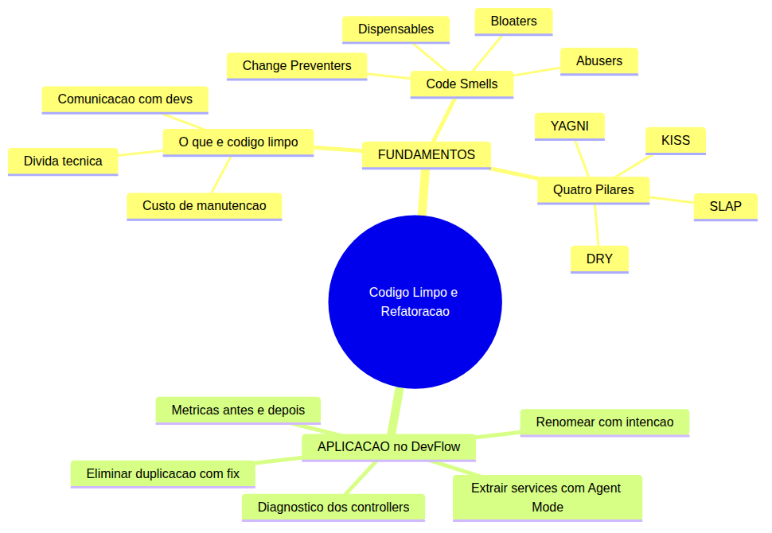
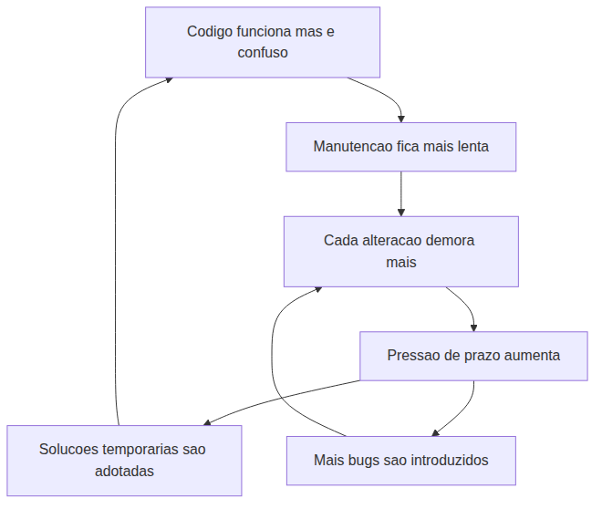
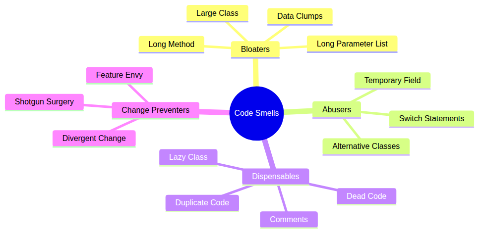
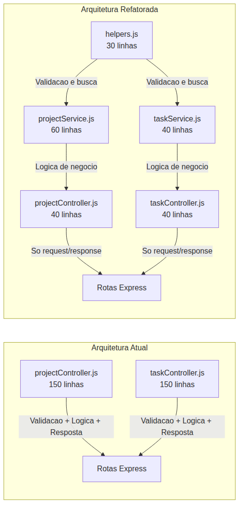

# Programador Profissional com Agentes — Aula 05

## Código Limpo e Refatoração Assistida

**Duração estimada:** 50 minutos (25 de leitura + 25 de prática)
**Nível:** Intermediário
**Pré-requisitos:** Aula 04 concluída — handoff com ADRs entre features de Projetos e Tarefas, CRUD de Projetos e Tarefas implementados no DevFlow, `.github/copilot-instructions.md` ativo, Git versionando o projeto, VS Code com GitHub Copilot autenticado

---

## Objetivos de Aprendizagem

Ao final desta aula, você será capaz de:

- [ ] **Identificar** os sintomas de código que precisa de refatoração (code smells) nos controllers do DevFlow
- [ ] **Explicar** os princípios SLAP, DRY, KISS e YAGNI e como cada um melhora a evolutibilidade do código
- [ ] **Classificar** code smells nas quatro categorias (bloaters, abusers, dispensables, change preventers) com exemplos concretos
- [ ] **Diagnosticar** a duplicação de código entre as features de Projetos e Tarefas do DevFlow
- [ ] **Aplicar** o princípio SLAP para extrair funções com um único nível de abstração dos controllers
- [ ] **Extrair** a lógica de negócio dos controllers para uma camada de services, eliminando duplicação entre Projetos e Tarefas
- [ ] **Renomear** identificadores para nomes que revelam intenção (variáveis, funções, parâmetros) nos controllers e services
- [ ] **Utilizar** o comando `/fix` e o Agent Mode do GitHub Copilot para refatorar código de forma segura e verificável
- [ ] **Comparar** o estado antes e depois da refatoração usando métricas objetivas (linhas por controller, duplicação eliminada, legibilidade)
- [ ] **Validar** que a refatoração não quebrou o comportamento existente testando os 10 endpoints manualmente

---

## Como Usar Esta Aula

Esta aula está organizada em duas partes. A **primeira parte** constrói os fundamentos universais de código limpo — code smells, princípios SLAP/DRY/KISS/YAGNI — usando pseudocódigo genérico e exemplos conceituais, sem depender de ferramenta específica. A **segunda parte** aplica esses conceitos na prática com GitHub Copilot no seu projeto DevFlow, refatorando os controllers e extraindo services com o comando `/fix` e Agent Mode.

Ao longo do caminho, você encontrará seções **"Mão na Massa"** para fazer junto e **"Quick Check"** para verificar se entendeu antes de avançar. Ao final, o arquivo separado **Questões de Aprendizagem** traz tarefas de checkpoint — só avance para a próxima aula quando conseguir completá-las por conta própria.

**Tempo estimado:** 25 minutos de leitura + 25 minutos de prática.

---

## Mapa Mental

Este diagrama mostra todos os conceitos que você vai dominar nesta aula:



> *O mapa mental acima mostra a estrutura da aula. Cada ramo representa um conceito que você vai explorar: dos fundamentos teóricos à aplicação prática com refatoração do DevFlow.*

---

## Recapitulação das Aulas 01, 02, 03 e 04

| Aula | Conceito | Onde aparece nesta aula | Como se conecta |
|---|---|---|---|
| Aula 01 | **Ambiente profissional** (Seções 1-8) | Seções 4-6 | Você configurou o DevFlow e criou o GET /health. Agora vai refatorar os controllers |
| Aula 02 | **Instructions permanentes** (Seções 1-3) | Seções 5-6 | As rules do copilot-instructions.md guiam o estilo. A refatoracao deve seguir as convencoes |
| Aula 02 | **Prompts reutilizaveis** (Secao 5) | Secao 5 | Os prompts de refatoracao podem ser salvos em `.github/prompts/` |
| Aula 03 | **Agent Mode** (Secoes 1-5) | Seções 5-6 | Agora voce usa Agent Mode nao para criar, mas para REFATORAR codigo existente |
| Aula 03 | **CRUD de Projetos** (Secao 5) | Seções 4-5 | O controller de Projetos com 150+ linhas e o candidato principal a refatoracao |
| Aula 04 | **Handoff com ADRs** (Secoes 5-6) | Seções 4-5 | Os ADRs documentam as decisoes de arquitetura que a refatoracao NAO deve quebrar |
| Aula 04 | **Feature de Tarefas** (Secao 6) | Seções 4-5 | O controller de Tarefas tem duplicacao com o de Projetos — DRY vai eliminar isso |

---

**FUNDAMENTOS: Os Princípios do Código que Evolui**

> *Os conceitos desta seção são universais — valem para qualquer linguagem de programação, framework ou assistente de código. Use exemplos conceituais e pseudocódigo genérico. Na segunda parte, você verá como sua ferramenta específica implementa cada um deles no seu projeto. Por enquanto, zero nomes de produto — foque em entender o "por que" antes do "como".*
---
## 1. O Que Torna o Código "Limpo"?

### Código que funciona não é código que evolui

Você já deve ter vivido esta situação: abre um arquivo de código que você mesmo escreveu há três meses e não entende nada. As variáveis têm nomes de uma letra, a função tem 200 linhas, e você precisa ler o arquivo inteiro para descobrir onde uma lógica começa e termina.

O código *funciona* — os testes passam, o sistema entrega o resultado esperado — mas qualquer alteração exige um esforço mental enorme. Você tem medo de mudar uma linha porque não sabe o que pode quebrar.

Esse código tem **dívida técnica**. E dívida técnica é como dívida financeira: ela acumula juros.

### O ciclo vicioso da dívida técnica



O ciclo acima é cruel. Quanto mais sujo o código, mais lenta a manutenção. Quanto mais lenta, maior a pressão para entregar rápido. Quanto mais pressão, mais soluções temporárias são adotadas — e mais sujo o código fica.

**Código limpo não é questão de estética. É questão de custo.**

### O custo de manutenção domina o custo de criação

Veja um exemplo concreto. Um sistema tem 10 mil linhas de código. Criar esse sistema levou 3 meses. Manter esse sistema pelos próximos 2 anos vai levar muito mais tempo — porque cada bug, cada feature nova, cada alteração de requisito exige que um desenvolvedor **leia** o código existente antes de escrever código novo.

Estudos mostram que um desenvolvedor profissional passa **70% do tempo lendo código** e apenas 30% escrevendo. Se o código é difícil de ler, os 70% viram 85%. O custo de manutenção explode.

Outro exemplo: dois trechos de código que fazem exatamente a mesma coisa:

```
Versao A:
funcao c(n) {
    para i ate n:
        para j ate n-i-1:
            se a[j] > a[j+1]:
                t = a[j]; a[j] = a[j+1]; a[j+1] = t
    retorna a
}

Versao B:
funcao ordenarLista(lista) {
    para indiceAtual ate tamanho(lista):
        para indiceComparador ate tamanho(lista) - indiceAtual - 1:
            se lista[indiceComparador] > lista[indiceComparador + 1]:
                trocarElementos(lista, indiceComparador, indiceComparador + 1)
    retorna lista
}
```

Ambos implementam o mesmo algoritmo de ordenação. A Versão A é mais curta, mas você precisa ler com atenção para entender o que faz. A Versão B — mesmo sendo mais longa — comunica a intenção: ordenar, comparar, trocar. O nome da função diz o propósito. Os nomes das variáveis dizem qual o papel de cada uma.

E agora com um terceiro exemplo: você precisa alterar a ordenação para ordem decrescente. Na Versão A, você identifica a comparação `a[j] > a[j+1]` e troca para `<` — mas e se houver outras comparações no mesmo trecho? Na Versão B, a função `trocarElementos` encapsula a troca, e a condição `lista[indiceComparador] > lista[indiceComparador + 1]` está claramente isolada.

Código limpo não é sobre linhas curtas. É sobre **comunicar intenção**.

**Código limpo é código que seu eu futuro (e seus colegas) conseguem ler e modificar sem medo.**

### Código como comunicação com outros desenvolvedores

Você pode estar pensando: "mas o computador executa o código, não importa se está bonito ou feio". Verdade parcial. O computador executa qualquer código que seja sintaticamente válido. Mas **código é lido por humanos** muito mais vezes do que por computadores.

Cada linha de código que você escreve é uma mensagem para:
- Seu eu do futuro (daqui a 3 meses, 6 meses, 1 ano)
- Seus colegas de equipe (que precisam entender seu código para mantê-lo)
- Novos desenvolvedores que entram no projeto (que vão ler seu código para aprender os padrões)

Se essa mensagem for confusa, o custo de comunicação é alto. Se for clara, o custo é baixo.

> *Até aqui, você já entendeu o problema central: código que funciona mas é confuso gera dívida técnica que cresce com o tempo. Código limpo reduz o custo de manutenção porque comunica intenção claramente. Respire. Isso já é MUITO. Se algo não ficou claro, releia o exemplo das duas versões de ordenação — a diferença entre código que "funciona" e código que "comunica".*

### Quick Check 1

**1. Cite a diferença fundamental entre código que "funciona" e código "limpo".**
**Resposta:** Código que funciona produz o resultado esperado, mas pode ser difícil de entender e modificar. Código limpo também funciona, mas adicionalmente comunica intenção claramente — qualquer desenvolvedor consegue lê-lo e alterá-lo sem medo de quebrar algo. Código limpo reduz o custo de manutenção, não apenas o custo de criação.

**2. Um desenvolvedor diz: "O computador não liga se o código é bonito, então não perco tempo com nomes descritivos." Por que essa afirmação ignora o principal custo do desenvolvimento?**
**Resposta:** Porque o custo de MANUTENÇÃO domina o custo de CRIAÇÃO. Um desenvolvedor passa ~70% do tempo lendo código. Nomes descritivos reduzem o tempo de leitura e entendimento, acelerando alterações futuras. O computador executa qualquer código válido, mas o HUMANO que precisa manter o código se beneficia imensamente de clareza e intenção explícita.

---

## 2. Code Smells — As Quatro Famílias

### Cheiro de código não é erro — é sinal de alerta

Assim como um cheiro estranho na cozinha não significa necessariamente que a comida queimou — pode ser apenas um alerta para verificar o fogão — um **code smell** é um sintoma no código que *pode* indicar um problema mais profundo.

Code smells não são bugs. O código funciona. Mas ele tem características que tornam a manutenção mais difícil, mais propensa a erros, mais lenta.

Os pesquisadores Martin Fowler e Kent Beck catalogaram dezenas de code smells no livro *Refactoring* (1999). Eles organizaram os smells em quatro famílias, cada uma com um padrão de alerta diferente.

### As quatro famílias de smells

| Família | O que indica | Smells principais |
|---|---|---|
| **Bloaters** | Algo cresceu demais e precisa ser dividido | Long Method, Large Class, Long Parameter List, Data Clumps |
| **Abusers** | Orientação a objetos usada de forma errada | Switch Statements, Temporary Field, Alternative Classes |
| **Dispensables** | Algo desnecessário que pode ser removido | Comments, Duplicate Code, Dead Code, Lazy Class |
| **Change Preventers** | Mudar uma coisa exige mudar muitas outras | Divergent Change, Shotgun Surgery, Feature Envy |

Vamos explorar cada família com exemplos concretos.

### Bloaters — quando o código cresce sem controle

**Long Method (Função Longa):** Uma função com muitas linhas que faz várias coisas diferentes. O sinal de alerta: você olha para uma função e percebe que ela tem "partes" — validação, lógica de negócio, formatação de resposta — tudo no mesmo bloco.

Veja um exemplo conceitual:

```
funcao processarPedido(pedido, usuario) {
    // validar dados do pedido — 15 linhas
    se pedido.vazio: retornar erro
    se usuario.semCredito: retornar erro
    // ... mais validacoes ...
    
    // calcular totais — 20 linhas
    total = 0
    para cada item em pedido.itens:
        aplicarDescontos(item)
        calcularImpostos(item)
        total = total + item.preco
    // ... mais calculos ...
    
    // atualizar estoque — 15 linhas
    para cada item em pedido.itens:
        buscarProduto(item.id)
        reduzirEstoque(item.id, item.quantidade)
    // ... mais atualizacoes ...
    
    // gerar resposta — 10 linhas
    resposta = criarResposta(pedido, total)
    retornar resposta
}
```

Esta função tem **60 linhas** e faz **quatro coisas diferentes**. Cada bloco de código dentro dela poderia ser uma função separada. O nome `processarPedido` não diz quais etapas estão incluídas.

**Large Class (Classe Grande):** Quando uma classe acumula responsabilidades demais. O sinal: você descreve a classe e usa "e" várias vezes. "A classe Gerencia faz validação e cálculo e persistência e notificação."

**Long Parameter List (Lista Longa de Parâmetros):** Quando uma função recebe mais de 3-4 parâmetros. O sinal: você precisa pular linhas para declarar a função.

### Abusers — orientação a objetos mal aplicada

**Switch Statements (Múltiplos Condicionais):** Quando você tem blocos `se-senao` ou `escolha-caso` que verificam o tipo de um objeto. O sinal de alerta: sempre que um novo tipo aparece, você precisa adicionar um novo `caso` em TODOS os lugares que usam aquele `escolha`.

Veja um exemplo:

```
funcao calcularDesconto(tipoCliente, valor) {
    se tipoCliente == "ouro":
        retornar valor * 0.2
    senao se tipoCliente == "prata":
        retornar valor * 0.1
    senao se tipoCliente == "bronze":
        retornar valor * 0.05
    senao:
        retornar 0
}
```

Aqui, cada novo tipo de cliente exige adicionar um novo `se-senao`. Se houver 10 lugares no código que fazem essa verificação, você precisa alterar 10 arquivos diferentes para adicionar um tipo novo.

### Dispensables — o que pode ser removido

**Comments (Comentários como Muleta):** Comentários explicando *o que* o código faz (em vez de *por que* faz) geralmente indicam que o próprio código não está claro. O sinal de alerta: você escreveu "// aqui estamos validando o campo email" porque a linha abaixo não comunica isso por si só.

Código limpo raramente precisa de comentários que explicam *o que* está acontecendo. O código deve ser autoexplicativo. Comentários devem ser reservados para *por que* uma abordagem foi escolhida.

```
// Codigo com comentario-muleta
// Verifica se o usuario tem permissao
se usuario.nivelAcesso > 5 E usuario.departamento == "TI":
    concederAcesso()

// Codigo autoexplicativo (sem comentario)
se usuario.ehAdministrador() E usuario.ehDoDepartamentoTI():
    concederAcesso()
```

**Duplicate Code (Código Duplicado):** O mesmo bloco de lógica aparece em dois ou mais lugares. O sinal: você copiou e colou código de um arquivo para outro. O problema: quando um bug é encontrado, você precisa corrigir em N lugares.

### Change Preventers — o custo de mudar

**Shotgun Surgery (Cirurgia com Espingarda):** Uma única mudança exige alterar vários arquivos diferentes. O sinal: para adicionar uma feature simples, você abre 5 arquivos. Se esquecer um deles, o sistema quebra.

Veja um exemplo. Para adicionar um campo `telefone` em um sistema de cadastro, você precisa:
- Alterar a função de validação (arquivo A)
- Alterar a função de formatação (arquivo B)
- Alterar a função de salvamento (arquivo C)
- Alterar a função de exibição (arquivo D)

Quatro arquivos para uma mudança trivial. Isso é um **change preventer**.

### Diagnosticando smells no seu código

A habilidade mais importante que você vai desenvolver nesta aula é o **olhar clínico** para code smells. Não se trata de decorar definições — trata-se de olhar para um trecho de código e sentir: "aqui tem algo errado".

Pergunte-se ao revisar seu código:
- Esta função claramente faz mais de uma coisa? → **Long Method**
- Este bloco de código aparece em mais de um lugar? → **Duplicate Code**
- Eu preciso ler 3 arquivos para entender uma lógica? → **Shotgun Surgery**
- Esta função precisa de muitos argumentos? → **Long Parameter List**
- Tem um comentário explicando o que a linha abaixo faz? → **Comments (muleta)**
- Eu tenho medo de alterar esta linha porque não sei o que quebra? → **Change Preventer**



> *O mindmap acima mostra as quatro famílias de code smells. Cada uma tem um padrão de alerta diferente: Bloaters = "cresceu demais", Abusers = "usou errado", Dispensables = "pode remover", Change Preventers = "mudar custa caro".*

### Quick Check 2

**1. Um trecho de código tem uma função de 80 linhas que valida dados, calcula totais, formata resposta e registra log. Qual família de smells está sendo violada e qual o smell específico?**
**Resposta:** Família **Bloaters**, smell **Long Method**. A função tem múltiplas responsabilidades misturadas em um único bloco, o que a torna difícil de ler, testar e modificar. Cada responsabilidade (validar, calcular, formatar, logar) deveria ser uma função separada.

**2. Um bloco de validação de campos obrigatórios aparece copiado em 3 controllers diferentes. Se o formato das mensagens de erro mudar, você precisa alterar os 3 arquivos. Qual família e qual smell?**
**Resposta:** Família **Dispensables**, smell **Duplicate Code** (código duplicado). A duplicação também causa um **Change Preventer** secundário, pois a mudança exige alterar múltiplos arquivos (Shotgun Surgery). A correção é extrair a validação para um local único (função auxiliar) e referenciá-la nos 3 controllers.

---

## 3. SLAP, DRY, KISS, YAGNI — Os Quatro Pilares

### Os princípios que guiam a refatoração

Você aprendeu a identificar code smells — os sintomas. Agora vamos aprender os **princípios** que orientam a correção. Eles não são regras rígidas: são lentes para avaliar o código e decidir o que fazer.

| Pilar | Significado | Pergunta que faz |
|---|---|---|
| **SLAP** | Single Level of Abstraction Principle | Todas as linhas desta função estão no mesmo nível de abstração? |
| **DRY** | Don't Repeat Yourself | Existe duplicação de conhecimento em dois lugares? |
| **KISS** | Keep It Simple, Stupid | Existe uma solução mais simples que resolve o mesmo problema? |
| **YAGNI** | You Ain't Gonna Need It | Este código existe para um problema que ainda não existe? |

### SLAP — Single Level of Abstraction Principle

**O que é:** Cada função deve operar em um único nível de abstração. Dentro de uma função, todas as linhas devem estar no mesmo "patamar" de detalhamento.

**Por que importa:** Quando uma função mistura níveis de abstração, você pula do "macro" para o "micro" sem aviso. Isso força o leitor a alternar entre visão geral e detalhes de implementação — um esforço cognitivo enorme.

**Exemplo ANTES:**

```
funcao gerarRelatorioVendas(dados) {
    // Nivel alto: abrir conexao com banco
    conectarAoBanco()
    
    // Nivel alto: buscar dados
    vendas = buscarVendasDoMes(dados.mes, dados.ano)
    
    // Nivel BAIXO: iterar e formatar manualmente
    linhasRelatorio = []
    para cada venda em vendas:
        linha = venda.produto + " | " + venda.quantidade + " | R$" + venda.valor
        linhasRelatorio.adicionar(linha)
    
    // Nivel alto: exportar relatorio
    exportarRelatorio(linhasRelatorio, "relatorio.txt")
}
```

O problema: a iteração e formatação manual está no nível de abstração errado. Ela é um detalhe de implementação que deveria estar encapsulado em uma função separada.

**Exemplo DEPOIS:**

```
funcao gerarRelatorioVendas(dados) {
    conectarAoBanco()
    vendas = buscarVendasDoMes(dados.mes, dados.ano)
    linhasRelatorio = formatarLinhasRelatorio(vendas)
    exportarRelatorio(linhasRelatorio, "relatorio.txt")
}

funcao formatarLinhasRelatorio(vendas) {
    linhas = []
    para cada venda em vendas:
        linha = venda.produto + " | " + venda.quantidade + " | R$" + venda.valor
        linhas.adicionar(linha)
    retornar linhas
}
```

Agora `gerarRelatorioVendas` tem apenas operações de alto nível (conectar, buscar, formatar, exportar). Cada operação está encapsulada em sua própria função com um nome descritivo.

### DRY — Don't Repeat Yourself

**O que é:** Conhecimento (não código) deve aparecer em um único lugar. Se uma regra de negócio ou lógica precisa ser alterada, ela deve ser alterada em UM lugar.

**Por que importa:** Código duplicado dobra o trabalho de manutenção. Quando um bug é encontrado em lógica duplicada, você precisa corrigir em N lugares. Quando uma regra de negócio muda, você precisa alterar N lugares.

**Exemplo ANTES (duplicação em dois arquivos):**

```
// Arquivo: validacaoProdutos.funcao
funcao validarProduto(dados) {
    erros = []
    se dados.nome vazio: erros.adicionar("Nome obrigatorio")
    se dados.preco vazio OU dados.preco <= 0: erros.adicionar("Preco invalido")
    se dados.categoria vazio: erros.adicionar("Categoria obrigatoria")
    retornar erros
}

// Arquivo: validacaoServicos.funcao
funcao validarServico(dados) {
    erros = []
    se dados.nome vazio: erros.adicionar("Nome obrigatorio")
    se dados.preco vazio OU dados.preco <= 0: erros.adicionar("Preco invalido")
    se dados.categoria vazio: erros.adicionar("Categoria obrigatoria")
    retornar erros
}
```

As duas funções são IDÊNTICAS. Se o formato da mensagem de erro mudar de "Nome obrigatorio" para "O campo nome é obrigatório", você precisa alterar os dois arquivos. Se houver 5 funções iguais, são 5 alterações.

**Exemplo DEPOIS (DRY aplicado):**

```
// Arquivo: validacaoComum.funcao
funcao validarCamposObrigatorios(dados, campos) {
    erros = []
    para cada campo em campos:
        se dados[campo] vazio:
            erros.adicionar(campo + " obrigatorio")
    retornar erros
}

// Arquivo: validacaoProdutos.funcao
funcao validarProduto(dados) {
    retornar validarCamposObrigatorios(dados, ["nome", "preco", "categoria"])
}

// Arquivo: validacaoServicos.funcao
funcao validarServico(dados) {
    retornar validarCamposObrigatorios(dados, ["nome", "preco", "categoria"])
}
```

A lógica de validação existe em UM lugar. A formatação das mensagens de erro existe em UM lugar. Produtos e Serviços apenas declaram quais campos validar.

### KISS — Keep It Simple, Stupid

**O que é:** A solução mais simples que resolve o problema é a melhor. Complexidade só se justifica quando a simplicidade não atende aos requisitos.

**Por que importa:** Código complexo é mais difícil de entender, testar, debugar e manter. Cada camada de abstração, cada design pattern, cada biblioteca adiciona custo cognitivo. Só adicione complexidade quando houver um benefício claro.

**Exemplo ANTES (complexidade desnecessária):**

```
funcao calcularTotal(itens) {
    // Design pattern Factory + Strategy + Observer... para somar precos?
    processadorDePrecos = new ProcessadorDePrecos()
    processadorDePrecos.aplicarEstrategia(new EstrategiaCalculoTotal())
    processadorDePrecos.adicionarObservador(new LoggingObservador())
    resultado = processadorDePrecos.executar(itens.map(item => item.preco))
    retornar resultado
}
```

**Exemplo DEPOIS (simples):**

```
funcao calcularTotal(itens) {
    total = 0
    para cada item em itens:
        total = total + item.preco
    retornar total
}
```

O código simples ocupa 3 linhas, não depende de classes especializadas, e qualquer pessoa entende o que faz instantaneamente.

### YAGNI — You Ain't Gonna Need It

**O que é:** Não construa funcionalidades baseado no que você *acha* que vai precisar no futuro. Construa apenas o que você precisa AGORA.

**Por que importa:** Código especulativo — código escrito para um cenário futuro que pode nunca acontecer — é código não testado, não usado, e que precisa ser mantido até que alguém tenha coragem de removê-lo.

**Exemplo ANTES (especulação):**

```
funcao buscarUsuario(id) {
    // Por enquanto só temos banco local, mas no futuro talvez
    // a gente precise de cache distribuido, entao ja vou deixar preparado
    usuario = buscarNoCacheLocal(id)
    se usuario nulo:
        usuario = buscarNoCacheDistribuido(id)  // nao existe ainda
        se usuario nulo:
            usuario = buscarNoBanco(id)
            salvarNoCacheLocal(usuario)
            salvarNoCacheDistribuido(usuario)  // nao existe ainda
    retornar usuario
}
```

**Exemplo DEPOIS (o que você precisa AGORA):**

```
funcao buscarUsuario(id) {
    usuario = buscarNoCacheLocal(id)
    se usuario nulo:
        usuario = buscarNoBanco(id)
        salvarNoCacheLocal(usuario)
    retornar usuario
}
```

O cache distribuído não existe, não está nos requisitos, e pode nunca virar requisito. O código especulativo sobre ele — 4 linhas — polui a função e cria falsas expectativas.

### Os quatro pilares em ação

Quando você estiver em dúvida sobre como refatorar um trecho de código, faça estas quatro perguntas:

1. **SLAP:** Esta função tem linhas em níveis de abstração diferentes? → Extraia os detalhes para funções separadas.
2. **DRY:** Este conhecimento aparece em mais de um lugar? → Extraia para um local único.
3. **KISS:** Existe uma solução mais simples? → Remova complexidade desnecessária.
4. **YAGNI:** Este código existe para um problema que ainda não temos? → Remova.

> *Até aqui, você já entendeu os quatro pilares da refatoração. SLAP organiza o nível de abstração. DRY elimina duplicação. KISS combate complexidade. YAGNI combate especulação. Respire. Se algo não ficou claro, compare os pares ANTES/DEPOIS de cada pilar — a diferença é visual e imediata.*

### Quick Check 3

**1. Analise o trecho abaixo e identifique qual(is) pilar(es) está(ão) sendo violado(s). Justifique.**

```
funcao salvarUsuario(dados) {
    // Conectar ao banco
    conexao = criarConexao("localhost", 5432)
    // Validar dados
    erros = []
    se dados.nome vazio: erros.adicionar("Nome obrigatorio")
    // Criptografar senha
    senhaCripto = ""
    para cada caractere em dados.senha:
        senhaCripto = senhaCripto + (codigo(caractere) + 5).paraTexto()
    // Inserir
    sql = "INSERT INTO usuarios (nome, senha) VALUES ('" + dados.nome + "', '" + senhaCripto + "')"
    executar(conexao, sql)
}
```

**Resposta:** Violação de **SLAP** — a função mistura níveis de abstração: conectar ao banco (alto nível), validar dados (médio), criptografar senha manualmente (baixo nível), montar SQL (baixo nível). Cada operação deveria ser uma função separada. Também há indício de **KISS** — a criptografia manual com adição de código é uma solução complexa e insegura para um problema simples (usar uma função hash pronta).

**2. Um desenvolvedor cria uma classe "GerenciadorDeCache" com métodos para cache local, cache distribuído, cache em disco e cache em nuvem — mesmo que o projeto atualmente só use cache local. Qual pilar está sendo violado?**
**Resposta:** **YAGNI** (You Ain't Gonna Need It). O código para cache distribuído, em disco e em nuvem foi escrito para cenários futuros que podem nunca acontecer. Esse código especulativo precisa ser mantido, testado e documentado sem trazer benefício atual. A regra é: construa o que você precisa AGORA.

---

**APLICAÇÃO: Refatoração do DevFlow com GitHub Copilot**

> *Agora que você entende os code smells e os princípios de refatoração, vamos conectar cada conceito à prática com GitHub Copilot no seu projeto DevFlow. Você vai diagnosticar os controllers, extrair services, eliminar duplicação e medir o impacto — tudo com o Copilot como parceiro de refatoração.*
---
## 4. Diagnóstico — Os Controllers do DevFlow Antes da Refatoração

### Colocando as lentes nos controllers reais

Você aprendeu as quatro famílias de code smells e os quatro pilares da refatoração. Agora é hora de aplicar essas lentes aos controllers do DevFlow.

O DevFlow tem dois controllers que você construiu nas aulas anteriores:

- `controllers/projectController.js` — CRUD de Projetos (Aula 03)
- `controllers/taskController.js` — CRUD de Tarefas (Aula 04)

Vamos diagnosticar os smells presentes em cada um.

### Abra os controllers e observe

Abra `controllers/projectController.js` no VS Code. O que você vê? Provavelmente uma função para cada operação CRUD, mais de 150 linhas no total, validações manuais dentro dos handlers, e nomes de variáveis como `p`, `t`, `result`, `data`.

Agora abra `controllers/taskController.js`. Compare com o controller de Projetos. O que você nota? As validações são quase idênticas — verificar campo obrigatório, verificar se o recurso existe, retornar 400 ou 404. O tratamento de erros é o mesmo. A estrutura das funções é a mesma.

### Checklist de diagnóstico guiado

Percorra cada controller e marque os smells que encontrar:

**No `projectController.js`:**

- [ ] **Long Method:** Alguma função tem mais de 20 linhas misturando validação, lógica e resposta?
- [ ] **Long Parameter List:** Alguma função recebe mais de 3 parâmetros?
- [ ] **Comments como muleta:** Existem comentários explicando o que a linha abaixo faz?
- [ ] **Nomes pouco reveladores:** Variáveis como `p`, `t`, `result`, `data`, `err`?
- [ ] **Duplicate Code:** Blocos de validação que aparecem em mais de um lugar no mesmo arquivo?

**No `taskController.js`:**

- [ ] **Duplicate Code:** Blocos de validação idênticos aos de `projectController.js`?
- [ ] **Long Method:** Estrutura longa igual ao controller de Projetos?
- [ ] **Feature Envy:** O controller faz lógica de negócio que deveria estar no model?
- [ ] **Nomes pouco reveladores:** Mesmos padrões de nomes genéricos?

**Entre os dois controllers:**

- [ ] **Duplicate Code:** A validação de campos obrigatórios aparece nos dois controllers?
- [ ] **Duplicate Code:** A busca por ID e tratamento de "não encontrado" aparece nos dois?
- [ ] **Duplicate Code:** O formato de resposta `{ success, data, error }` é montado manualmente nos dois?

### Tabela comparativa

| Característica | projectController.js | taskController.js |
|---|---|---|
| Linhas estimadas | ~150 | ~150 |
| Funções CRUD | 5 (list, get, create, update, delete) | 5 (list, get, create, update, delete) |
| Validação manual duplicada | Sim | Sim (idêntica) |
| Busca por ID duplicada | Sim | Sim (idêntica) |
| Nomes genéricos (1-2 chars) | Provavelmente | Provavelmente |
| Responsabilidades por função | Validação + lógica + resposta | Validação + lógica + resposta |

### O diagnóstico revela três problemas principais

1. **Duplicação entre Projetos e Tarefas:** As validações e buscas são cópia uma da outra. Se o formato de validação mudar, você altera 2 arquivos.
2. **Mistura de responsabilidades:** Cada função do controller faz validação, lógica de negócio E formatação de resposta. Violação clara de SLAP.
3. **Nomes genéricos:** Variáveis de 1-2 caracteres (`p`, `t`) não comunicam intenção.

### Quick Check 4

**1. Qual o smell mais evidente ao comparar `projectController.js` com `taskController.js`?**
**Resposta:** **Duplicate Code** — os blocos de validação e busca por ID são idênticos entre os dois controllers. Isso viola DRY e causa Shotgun Surgery: qualquer alteração no formato de validação exige modificar ambos os arquivos.

**2. Por que a mistura de validação, lógica de negócio e resposta HTTP na mesma função é um problema (além de violar SLAP)?**
**Resposta:** Três razões: (1) a função é difícil de testar — você não consegue testar a lógica de negócio sem passar pelo HTTP; (2) a função é difícil de reutilizar — se outro controller precisar da mesma validação, ela está "trancada" dentro do handler; (3) a função viola o princípio de responsabilidade única, acumulando razões para mudar (mudou a validação? mudou a lógica? mudou o formato de resposta? tudo exige alterar a mesma função).

---

## 5. Refatoração Guiada com `/fix` e Agent Mode

### O Copilot como parceiro de refatoração

Agora que você diagnosticou os problemas, vamos corrigi-los com GitHub Copilot. Você vai usar dois modos do Copilot:

- **`/fix`**: Para correções pontuais e localizadas. Ideal para renomear variáveis, extrair funções pequenas, eliminar smells específicos.
- **Agent Mode**: Para transformações estruturais. Ideal para extrair camadas inteiras (services) e reorganizar arquivos.

O fluxo geral é **Isolar → Delegar → Verificar**:

1. **Isolar**: Identifique exatamente o que precisa ser refatorado (qual função, qual bloco, qual arquivo)
2. **Delegar**: Dê um comando claro ao Copilot com o resultado esperado
3. **Verificar**: Teste que o comportamento não mudou (os endpoints continuam funcionando)



### 5.1 Extraindo o Service de Projetos

O primeiro passo da refatoração é aplicar SLAP ao `projectController.js`: extrair toda a lógica de negócio para um service, deixando o controller apenas com request/response.

**Mão na Massa 1 — Extrair `projectService.js`**

**Dificuldade: Médio | Duração: 8 minutos**

Siga os passos:

- [ ] Abra o VS Code no projeto DevFlow
- [ ] Verifique que o servidor Express está rodando (ou inicie com `node src/index.js`)
- [ ] Abra o `controllers/projectController.js` e identifique qual lógica deve ir para o service:
  - A criação, busca, atualização e remoção no array em memória
  - As validações de campos obrigatórios
  - A lógica de verificação de existência do projeto
- [ ] Abra o **Agent Mode** no Copilot Chat
- [ ] Configure como **Default Approvals** (você quer revisar cada diff)
- [ ] Cole o seguinte prompt:

> "Extraia a lógica de negócio de controllers/projectController.js para services/projectService.js. O controller deve ficar apenas com request e response (req, res). Mantenha os nomes de função existentes. Crie services/ se não existir. Siga as convenções do .github/copilot-instructions.md."

- [ ] **Observe o agente trabalhar:** Ele deve ler o controller, criar `services/projectService.js`, e reescrever `controllers/projectController.js` para delegar ao service
- [ ] **Revise o diff de cada arquivo** antes de aprovar
- [ ] Teste os endpoints de Projetos após a extração:

```bash
# GET - listar projetos
curl http://localhost:3000/api/projects

# POST - criar projeto
curl -X POST http://localhost:3000/api/projects \
  -H "Content-Type: application/json" \
  -d '{"name":"Projeto Refatorado","description":"Teste"}'

# GET - buscar por ID
curl http://localhost:3000/api/projects/0

# PUT - atualizar
curl -X PUT http://localhost:3000/api/projects/0 \
  -H "Content-Type: application/json" \
  -d '{"description":"Atualizado"}'

# DELETE
curl -X DELETE http://localhost:3000/api/projects/0
```

**Verificação:** `projectController.js` agora tem menos de 40 linhas. Cada função do controller apenas extrai dados da requisição, chama o service e retorna a resposta. O service contém toda a lógica de negócio (validação, manipulação do array, tratamento de erros).

### 5.2 Eliminando Duplicação entre Projetos e Tarefas

Agora que você extraiu o service de Projetos, o `taskController.js` ainda está com o mesmo padrão antigo. Vamos eliminar a duplicação entre os dois controllers.

**Mão na Massa 2 — Criar `taskService.js` com Helpers Compartilhados**

**Dificuldade: Médio | Duração: 6 minutos**

- [ ] Primeiro, extraia o service de Tarefas seguindo o MESMO padrão que você fez para Projetos. Use Agent Mode com este prompt:

> "Extraia a lógica de negócio de controllers/taskController.js para services/taskService.js. O controller deve ficar apenas com request e response. Mantenha os nomes de função. Use o mesmo padrão de projectService.js."

- [ ] Agora, identifique a duplicação entre `projectService.js` e `taskService.js`:
  - A validação de campos obrigatórios existe nos dois?
  - A busca por ID e tratamento de erro 404 existe nos dois?
  - O formato de resposta `{ success, data, error }` é montado nos dois?

- [ ] Use o comando **`/fix`** para eliminar a duplicação. Selecione um bloco de validação no `projectService.js` e use:

> `/fix Extraia esta validacao de campos obrigatorios para services/helpers.js. Crie uma funcao validarCamposObrigatorios(dados, campos) que retorna um array de erros.`

- [ ] Repita para a função de busca por ID:

> `/fix Extraia a logica de buscar por ID e retornar 404 para services/helpers.js. Crie uma funcao buscarPorId(array, id) que retorna o item ou null.`

- [ ] Agora atualize `projectService.js` e `taskService.js` para usar os helpers:

> `Atualize projectService.js para usar validarCamposObrigatorios e buscarPorId de services/helpers.js.`

```bash
# Verificacao: as funcoes de validacao e busca existem em UM so lugar
grep -n "funcao validarCamposObrigatorios" services/helpers.js  # Deve encontrar
grep -n "funcao validarCamposObrigatorios" services/projectService.js  # Nao deve encontrar
grep -n "funcao validarCamposObrigatorios" services/taskService.js  # Nao deve encontrar
```

- [ ] Teste os endpoints de Tarefas:

```bash
curl http://localhost:3000/api/tasks
curl -X POST http://localhost:3000/api/tasks \
  -H "Content-Type: application/json" \
  -d '{"title":"Nova tarefa","projectId":0}'
```

**Verificação:** As funções de validação e busca por ID existem APENAS em `services/helpers.js`. Ambos os services importam e usam essas funções. Os controllers continuam funcionando com o mesmo comportamento.

> *Talvez você tenha notado: o comando `/fix` é ótimo para extrações localizadas (uma função, um bloco), enquanto o Agent Mode é melhor para transformações estruturais (criar um arquivo novo, reorganizar um controller inteiro). Compare: no Mão na Massa 1, você usou Agent Mode para criar o service do zero. Aqui, você usou `/fix` para extrair funções específicas.*

### 5.3 Renomeando com Intenção

O último passo da refatoração é eliminar nomes genéricos. Agora que você tem services e controllers separados, é o momento ideal para revisar os nomes.

Percorra cada arquivo e identifique nomes que não comunicam intenção:

| Nome atual | Nome sugerido | Onde aparece |
|---|---|---|
| `p` | `project` | projectController.js, projectService.js |
| `t` | `task` | taskController.js, taskService.js |
| `result` | `foundProject` / `foundTask` | projectService.js, taskService.js |
| `data` | `projectData` / `taskData` | projectController.js, taskController.js |
| `err` | `validationError` / `dbError` | services/helpers.js |

Use o comando `/fix` para renomear de forma segura. O Copilot rastreia todas as referências e atualiza todas as ocorrências:

Selecione a variável `p` no `projectService.js` e use:

> `/fix Renomeie a variavel p para project em todo o arquivo projectService.js`

Repita para cada nome genérico em cada arquivo.

```bash
# Verificacao: zero variaveis com 1-2 caracteres
grep -nP '\b[p|t]\b' services/projectService.js | grep "="
# A saida deve ser vazia (ou apenas usos legitimos, nao atribuicoes de variaveis)
```

**Verificação:** Zero variáveis com nome de 1-2 caracteres nos controllers e services. Todos os nomes comunicam o propósito da variável.

### Quick Check 5

**1. Qual a diferença entre usar o comando `/fix` e o Agent Mode para refatoração?**
**Resposta:** `/fix` é para refatoração **pontual e localizada** — renomear uma variável, extrair uma função específica, eliminar um smell em um bloco de código. Agent Mode é para refatoração **estrutural e abrangente** — criar um arquivo novo (service), reorganizar um controller inteiro, extrair uma camada completa. Agent Mode executa múltiplas etapas (ler, planejar, editar, verificar); `/fix` executa uma edição única e localizada.

**2. O que acontece com as rotas do Express quando você extrai a lógica para um service?**
**Resposta:** As rotas não mudam. Os controllers continuam expondo as mesmas funções com os mesmos nomes (`list`, `get`, `create`, `update`, `delete`) que as rotas importam. A diferença é que o controller agora apenas extrai dados da requisição, chama o service e retorna a resposta — a lógica de negócio foi movida para o service, mas a interface pública (as funções exportadas) permanece idêntica. Isso é uma refatoração segura: comportamento inalterado, estrutura interna melhorada.

---

## 6. Métricas de Refatoração — Antes e Depois

### Refatoração sem métricas é achismo

Você refatorou os controllers, extraiu services, eliminou duplicação, renomeou variáveis. Mas **quanto** melhorou? Números concretos transformam "ficou melhor" em "reduzimos 60% das linhas dos controllers".

Vamos comparar o estado antes e depois da refatoração usando métricas objetivas.

### Mão na Massa 3 — Validar e Medir

**Dificuldade: Fácil | Duração: 6 minutos**

**Passo 1: Meça as linhas por arquivo**

```bash
# Antes da refatoracao (se voce ainda nao comitou, veja os arquivos atuais)
wc -l controllers/projectController.js
wc -l controllers/taskController.js
wc -l services/projectService.js 2>/dev/null || echo "Ainda nao existe"
wc -l services/taskService.js 2>/dev/null || echo "Ainda nao existe"
wc -l services/helpers.js 2>/dev/null || echo "Ainda nao existe"
```

**Passo 2: Preencha a tabela de métricas**

| Métrica | Antes | Depois | Redução |
|---|---|---|---|
| Linhas em projectController.js | | | % |
| Linhas em taskController.js | | | % |
| Linhas duplicadas (validação) | 2x | 1 (helpers) | 50% |
| Linhas duplicadas (busca por ID) | 2x | 1 (helpers) | 50% |
| Variáveis 1-2 caracteres | | 0 | 100% |
| Total de arquivos na camada | 2 controllers | controllers + services + helpers | - |

**Passo 3: Valide todos os endpoints**

Execute os 10 endpoints do DevFlow e confirme que todos respondem corretamente:

```bash
# Projetos (5 endpoints)
echo "=== Endpoints de Projetos ==="
curl -s http://localhost:3000/api/projects | head -c 100
echo ""
curl -s -X POST http://localhost:3000/api/projects -H "Content-Type: application/json" -d '{"name":"Teste"}' | head -c 100
echo ""
curl -s http://localhost:3000/api/projects/0 | head -c 100
echo ""
curl -s -X PUT http://localhost:3000/api/projects/0 -H "Content-Type: application/json" -d '{"name":"Editado"}' | head -c 100
echo ""
curl -s -X DELETE http://localhost:3000/api/projects/0 | head -c 100

echo ""
# Tarefas (5 endpoints)
echo "=== Endpoints de Tarefas ==="
curl -s http://localhost:3000/api/tasks | head -c 100
echo ""
curl -s -X POST http://localhost:3000/api/tasks -H "Content-Type: application/json" -d '{"title":"Tarefa","projectId":0}' | head -c 100
echo ""
curl -s http://localhost:3000/api/tasks/0 | head -c 100
echo ""
curl -s -X PUT http://localhost:3000/api/tasks/0 -H "Content-Type: application/json" -d '{"completed":true}' | head -c 100
echo ""
curl -s -X DELETE http://localhost:3000/api/tasks/0 | head -c 100
```

**Verificação:** Todos os 10 endpoints respondem com sucesso (código 2xx). A estrutura da resposta mantém o formato `{ success, data, error }`.

**Passo 4: Faça o commit**

```bash
git add .
git commit -m "refactor: extract services, eliminate duplication, rename variables"
```

### Quick Check 6

**1. Por que é importante medir o antes e depois da refatoração (em vez de apenas "sentir" que melhorou)?**
**Resposta:** Métricas objetivas transformam percepção subjetiva em evidência concreta. "O código está melhor" não é verificável; "reduzimos o controller de 150 para 40 linhas e eliminamos 30 linhas duplicadas" é verificável e comunicável. Métricas também ajudam a justificar o esforço de refatoração para o time e a identificar onde concentrar os próximos esforços.

**2. Além das linhas por arquivo, que outras métricas poderiam ser usadas para avaliar o impacto da refatoração?**
**Resposta:** (1) Complexidade ciclomática — quantos caminhos de execução cada função tem (menos = melhor). (2) Acoplamento — quantos arquivos precisam ser alterados para uma mudança típica. (3) Tempo médio de manutenção — quanto tempo leva para implementar uma alteração no código refatorado vs. original. (4) Cobertura de testes — refatoração permite testar services isoladamente, o que antes era impossível.

---

## Autoavaliação: Quiz Rápido

**1. Qual a diferença entre "código que funciona" e "código limpo"?**
**Resposta:**

Código que funciona produz o resultado esperado, mas pode ser difícil de modificar. Código limpo também funciona e adicionalmente comunica intenção claramente, reduzindo o custo de manutenção. O computador executa qualquer código válido; humanos é que precisam de clareza.

**2. Cite as quatro famílias de code smells e dê um exemplo de smell para cada uma.**
**Resposta:**

(1) **Bloaters** — Long Method (função com muitas responsabilidades). (2) **Abusers** — Switch Statements (múltiplos condicionais por tipo). (3) **Dispensables** — Duplicate Code (mesmo bloco em vários lugares). (4) **Change Preventers** — Shotgun Surgery (uma mudança exige alterar muitos arquivos).

**3. Qual a diferença entre SLAP e DRY?**
**Resposta:**

SLAP (Single Level of Abstraction Principle) organiza uma função para que todas as suas linhas estejam no mesmo nível de abstração — sem misturar "o quê" com "como". DRY (Don't Repeat Yourself) elimina duplicação de conhecimento entre funções/arquivos — cada regra existe em um só lugar. SLAP é sobre hierarquia dentro de uma função; DRY é sobre unicidade entre funções.

**4. O comando `/fix` do Copilot é mais adequado para que tipo de refatoração?**
**Resposta:**

`/fix` é mais adequado para refatoração pontual e localizada: renomear variáveis, extrair uma função específica, eliminar um bloco duplicado. Para transformações estruturais (criar services, reorganizar controllers), o Agent Mode é mais adequado.

**5. O que acontece com os endpoints do DevFlow após a extração dos services — eles mudam?**
**Resposta:**

Não. Os endpoints permanecem exatamente os mesmos. As rotas continuam importando as mesmas funções dos controllers com os mesmos nomes. A diferença é que os controllers agora delegam a lógica de negócio para os services. Refatoração segura = comportamento externo inalterado, estrutura interna melhorada.

**6. Qual métrica concreta você pode usar para provar que a refatoração reduziu a duplicação de código?**
**Resposta:**

Comparar o número de linhas duplicadas antes e depois. Por exemplo: "Antes, as validações de campos obrigatórios existiam em 2 arquivos (30 linhas cada = 60 linhas duplicadas). Depois, existem em 1 arquivo (helpers.js, 20 linhas). Redução de 67% em linhas de validação duplicadas."

---

## Mão na Massa Final: Exercícios Graduados

**Exercício 1 (Fácil) — Classificador de Code Smells**

Analise o trecho de código hipotético abaixo e liste todos os code smells presentes. Classifique cada um por família e justifique em uma frase.

```
funcao processarPedido(p, u) {
    // Logica de processamento
    se p.status == "pendente" E u.tipo == "vip":
        p.desconto = 0.2
    senao:
        p.desconto = 0.1
    
    // Buscar no banco
    r = buscarProdutos(p.itens)
    
    // Calcular frete
    if p.endereco.tipo == "internacional":
        frete = 50
    elif p.endereco.tipo == "nacional":
        frete = 10
    else:
        frete = 0
    
    // Gerar relatorio
    gerarRelatorio(p)
    enviarEmail(u, p)
}
```

**Gabarito:**

- **Long Method** (Bloaters): A função faz pelo menos 4 coisas: processar desconto, buscar produtos, calcular frete, gerar relatório. Cada uma deveria ser uma função separada.
- **Nomes pouco reveladores** (Dispensables): Variáveis `p`, `u`, `r` não comunicam intenção. Deveriam ser `pedido`, `usuario`, `resultadoBusca`.
- **Comments como muleta** (Dispensables): Comentários "// Logica de processamento", "// Buscar no banco", "// Calcular frete" indicam que o código não é autoexplicativo — os blocos deveriam ser funções nomeadas.
- **Switch Statements** (Abusers): Os condicionais `se p.tipo == "vip"` e `if p.endereco.tipo == "internacional"/"nacional"` poderiam ser substituídos por polimorfismo (ou estratégias).
- **Violação de SLAP**: A função mistura validação de desconto (nível de negócio), busca no banco (nível de infraestrutura) e cálculo de frete (nível de utilidade).

---

**Exercício 2 (Médio) — Aplicando SLAP e DRY**

Dado o controller hipotético abaixo (60 linhas), aplique SLAP e DRY: extraia validações para funções separadas, extraia lógica de negócio para um service, elimine duplicação. Entregue o código refatorado.

```javascript
// controllers/userController.js
const users = []

function create(req, res) {
    const { name, email, password } = req.body
    if (!name) return res.status(400).json({ success: false, data: null, error: "Name is required" })
    if (!email) return res.status(400).json({ success: false, data: null, error: "Email is required" })
    if (!password || password.length < 6) return res.status(400).json({ success: false, data: null, error: "Password must be at least 6 chars" })
    
    const existing = users.find(u => u.email === email)
    if (existing) return res.status(409).json({ success: false, data: null, error: "Email already in use" })
    
    const user = { id: users.length, name, email, password, createdAt: new Date() }
    users.push(user)
    res.status(201).json({ success: true, data: user, error: null })
}

function update(req, res) {
    const { id } = req.params
    const { name, email } = req.body
    const user = users[parseInt(id)]
    if (!user) return res.status(404).json({ success: false, data: null, error: "User not found" })
    
    if (name) user.name = name
    if (email) user.email = email
    res.json({ success: true, data: user, error: null })
}
```

**Gabarito:**

```javascript
// services/helpers.js
function validateRequiredFields(data, fields) {
    const errors = []
    for (const field of fields) {
        if (!data[field]) errors.push(`${field} is required`)
    }
    return errors
}

function findById(array, id) {
    return array[parseInt(id)] || null
}

function findUserByEmail(users, email) {
    return users.find(u => u.email === email)
}

// services/userService.js
const users = []

function createUser(data) {
    const errors = validateRequiredFields(data, ["name", "email"])
    if (data.password && data.password.length < 6) errors.push("Password must be at least 6 chars")
    if (errors.length > 0) return { success: false, error: errors[0] }
    
    const existing = findUserByEmail(users, data.email)
    if (existing) return { success: false, error: "Email already in use" }
    
    const user = { id: users.length, ...data, createdAt: new Date() }
    users.push(user)
    return { success: true, data: user }
}

function updateUser(id, data) {
    const user = findById(users, id)
    if (!user) return { success: false, error: "User not found" }
    
    if (data.name) user.name = data.name
    if (data.email) user.email = data.email
    return { success: true, data: user }
}

// controllers/userController.js
function create(req, res) {
    const result = createUser(req.body)
    if (!result.success) return res.status(400).json({ success: false, data: null, error: result.error })
    res.status(201).json({ success: true, data: result.data, error: null })
}

function update(req, res) {
    const result = updateUser(req.params.id, req.body)
    if (!result.success) return res.status(404).json({ success: false, data: null, error: result.error })
    res.json({ success: true, data: result.data, error: null })
}
```

---

**Desafio (Difícil) — Refatoração Autônoma com Agent Mode**

Refatore o endpoint `PATCH /api/projects/:id/status` do DevFlow completamente com Agent Mode, sem guia passo a passo.

Requisitos do desafio:
1. Implemente a lógica de transições de status válidas (ex: "em_andamento" não pode voltar para "pendente", "concluido" não pode voltar para "em_andamento")
2. Extraia a validação de transições para `services/helpers.js` como uma função reutilizável
3. Mantenha consistência com o padrão dos outros endpoints (formato de resposta, tratamento de erros)
4. Teste com `curl` antes e depois — o comportamento deve ser o mesmo para requisições válidas, e deve retornar erro 400 para transições inválidas

**Dica de prompt para Agent Mode:**

> "Adicione o endpoint PATCH /api/projects/:id/status no DevFlow. Ele permite alterar o status de um projeto, mas apenas com transicoes validas: pendente -> em_andamento, em_andamento -> concluido. Transicoes invalidas retornam 400. Extraia a logica de validacao de transicoes para services/helpers.js. Siga o padrao dos endpoints existentes (formato de resposta, tratamento de erros)."

**Gabarito:**

O Agent Mode deve:
1. Ler a estrutura existente de Projetos (model, controller, service)
2. Criar um mapa de transições válidas em `helpers.js` ou no service
3. Adicionar o endpoint `PATCH /api/projects/:id/status` nas rotas
4. Implementar a função no controller que valida a transição antes de aplicá-la
5. Testar automaticamente com requisições de exemplo

Testes manuais após a implementação:

```bash
# Transicao valida: pendente -> em_andamento
curl -X PATCH http://localhost:3000/api/projects/0/status \
  -H "Content-Type: application/json" \
  -d '{"status":"em_andamento"}'  # 200

# Transicao invalida: concluido -> em_andamento
curl -X PATCH http://localhost:3000/api/projects/0/status \
  -H "Content-Type: application/json" \
  -d '{"status":"em_andamento"}'  # 400 (se ja estiver concluido)

# Status inexistente
curl -X PATCH http://localhost:3000/api/projects/0/status \
  -H "Content-Type: application/json" \
  -d '{"status":"inexistente"}'  # 400
```

**Verificação:** Transições válidas funcionam (200), transições inválidas retornam erro (400), validação extraída para helpers.js, código segue o padrão do DevFlow.

---

## Resumo da Aula

### Os 8 Conceitos Fundamentais

1. **Código limpo**: código que comunica intenção claramente, reduzindo o custo de manutenção. Não é sobre estética — é sobre custo.
2. **Dívida técnica**: o acúmulo de decisões de código que priorizam velocidade sobre clareza, gerando juros na forma de manutenção mais lenta.
3. **Code smells**: sintomas no código que indicam problemas potenciais. As quatro famílias: Bloaters, Abusers, Dispensables, Change Preventers.
4. **SLAP**: Single Level of Abstraction Principle — cada função opera em um único nível de abstração, sem misturar macro com micro.
5. **DRY**: Don't Repeat Yourself — cada conhecimento existe em um único lugar. Duplicação = manutenção dobrada.
6. **KISS**: Keep It Simple — a solução mais simples que resolve o problema é a melhor.
7. **YAGNI**: You Ain't Gonna Need It — não construa para cenários futuros que podem nunca acontecer.
8. **Refatoração guiada**: fluxo Isolar → Delegar → Verificar, usando `/fix` para correções pontuais e Agent Mode para transformações estruturais.

### O Que Você Construiu Hoje

- [x] Diagnosticou code smells nos controllers do DevFlow (Long Method, Duplicate Code, nomes genéricos)
- [x] Extraiu `services/projectService.js` com Agent Mode (SLAP aplicado)
- [x] Extraiu `services/taskService.js` seguindo o mesmo padrão
- [x] Criou `services/helpers.js` com funções compartilhadas (DRY aplicado)
- [x] Renomeou variáveis genéricas para nomes que revelam intenção
- [x] Comparou métricas ANTES e DEPOIS da refatoração
- [x] Validou os 10 endpoints do DevFlow com curl
- [x] Comitou o código refatorado seguindo as convenções do projeto

---

## Próxima Aula

**Aula 06: TDD com Copilot — Testes Que Provam que Funciona**

Nesta aula, você refatorou os controllers e extraiu services, deixando o código mais limpo e organizado. Agora que o código está mais testável (services separados dos controllers), a Aula 06 aplica TDD com Jest e supertest para garantir que o DevFlow funcione corretamente — e continue funcionando após cada alteração. Você vai escrever testes primeiro, implementar o mínimo para passar, e refatorar com segurança.

---

## Referências

### Documentação Oficial

- [Fowler, M. — Refactoring: Improving the Design of Existing Code](https://martinfowler.com/books/refactoring.html) — catálogo original de code smells
- [Martin, R. C. — Clean Code: A Handbook of Agile Software Craftsmanship](https://www.oreilly.com/library/view/clean-code-a/9780136083238/) — capítulos 2 (nomes) e 3 (funções)
- [GitHub Copilot — /fix command](https://docs.github.com/en/copilot/using-github-copilot/asking-github-copilot-questions-in-your-ide)
- [GitHub Copilot — Agent Mode](https://docs.github.com/en/copilot/using-github-copilot/ai-agents)

### Artigos para Aprofundamento

- [Code Smells — Fowler](https://martinfowler.com/bliki/CodeSmell.html) — definição original do termo
- [SLAP — Single Level of Abstraction Principle](https://www.codurance.com/publications/2020/01/27/single-level-of-abstraction/) — explicação detalhada com exemplos
- [DRY vs Duplication](https://en.wikipedia.org/wiki/Don%27t_repeat_yourself) — nuances do princípio DRY
- [YAGNI — You Ain't Gonna Need It](https://www.martinfowler.com/bliki/Yagni.html) — artigo de Martin Fowler

### Ferramentas

- [GitHub Copilot — setup guide](https://docs.github.com/en/copilot/setting-up-github-copilot)
- [VS Code — Refactoring with Copilot](https://code.visualstudio.com/docs/copilot/refactoring)

---

## FAQ

**P: Refatorar sempre vale a pena?**
R: Não. Refatoração tem custo (tempo, risco de introduzir bugs). Ela vale a pena quando o código vai ser mantido ativamente nos próximos meses. Para código descartável (provas de conceito, scripts únicos), refatorar pode ser desperdício. Use YAGNI para decidir.

**P: Qual a diferença entre refatorar e reescrever?**
R: Refatorar altera a estrutura interna sem mudar o comportamento externo. Reescrever joga o código fora e começa do zero. Refatoração é incremental e segura; reescrita é radical e arriscada. Prefira refatoração sempre que possível.

**P: Como garantir que a refatoração não quebrou nada?**
R: Testes. Se você tem testes automatizados, execute-os antes e depois. Se não tem (como no DevFlow), teste manualmente todos os endpoints com curl. Na Aula 06 você vai aprender TDD — e aí a resposta fica mais robusta.

**P: O Copilot entende code smells?**
R: Sim. O Copilot foi treinado em milhões de repositórios e reconhece padrões de código limpo e sujo. Quando você pede `/fix` em um bloco com cheiro, ele geralmente sugere a correção correta. Mas ele não substitui seu julgamento — você decide o que refatorar e quando.

**P: Posso extrair services sem o Agent Mode?**
R: Sim, você pode fazer manualmente. Agent Mode acelera o processo. O importante é entender o conceito: separar responsabilidades (controller = request/response, service = lógica de negócio).

**P: Quantas funções devo ter em um controller ideal?**
R: Uma função por endpoint. Se você tem 5 endpoints CRUD, o controller tem 5 funções. Cada função deve ter no máximo 5-10 linhas, apenas extraindo dados da requisição, chamando o service e retornando a resposta.

**P: O que fazer se o service ficar muito grande?**
R: Services também podem ser divididos. Se `projectService.js` tiver mais de 200 linhas, extraia responsabilidades em services especializados: `projectValidation.js`, `projectCalculation.js`, etc. O princípio se aplica em cascata.

**P: Quando usar `/fix` vs Agent Mode para refatoração?**
R: `/fix` para o que cabe em 1-2 funções (renomear, extrair bloco). Agent Mode para o que envolve múltiplos arquivos (criar service novo, reorganizar camada inteira). Se o escopo da refatoração é um arquivo, prefira `/fix`. Se envolve criar ou mover lógica entre arquivos, prefira Agent Mode.

---

## Glossário

| Termo | Definição |
|---|---|
| **Código limpo** | Código que comunica intenção claramente e é fácil de modificar. (Seção 1) |
| **Dívida técnica** | Custo implícito de manutenção causado por decisões de código que priorizam velocidade sobre clareza. (Seção 1) |
| **Code smell** | Sintoma no código que pode indicar um problema mais profundo de design. (Seção 2) |
| **Bloaters** | Família de smells onde algo (função, classe, parâmetro) cresceu demais. (Seção 2) |
| **Dispensables** | Família de smells onde algo é desnecessário e pode ser removido. (Seção 2) |
| **Change Preventers** | Família de smells onde mudar uma coisa exige mudar muitas outras. (Seção 2) |
| **SLAP** | Single Level of Abstraction Principle — cada função opera em um único nível de abstração. (Seção 3) |
| **DRY** | Don't Repeat Yourself — cada conhecimento existe em um único lugar no sistema. (Seção 3) |
| **KISS** | Keep It Simple — a solução mais simples que resolve o problema é a melhor. (Seção 3) |
| **YAGNI** | You Ain't Gonna Need It — não construa para cenários futuros especulativos. (Seção 3) |
| **Refatoração** | Alteração na estrutura interna do código sem mudança no comportamento externo. (Seção 5) |
| **Service** | Camada que contém a lógica de negócio, separada do controller que lida com request/response. (Seção 5) |
