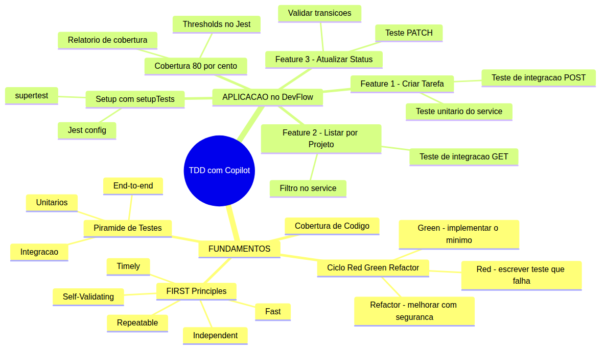
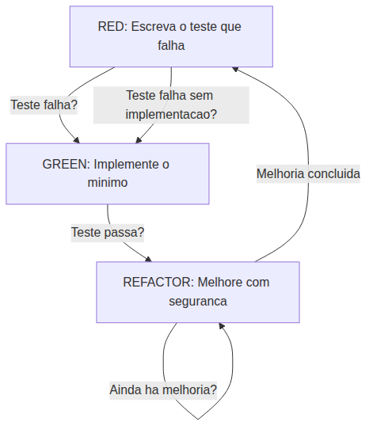
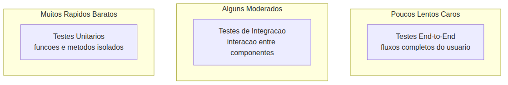

# Programador Profissional com Agentes — Aula 06

## TDD com Copilot — Testes Que Provam que Funciona

**Duração estimada:** 55 minutos (28 de leitura + 27 de prática)
**Nível:** Intermediário
**Pré-requisitos:** Aula 05 concluída — DevFlow com controllers refatorados, services extraídos (`projectService.js`, `taskService.js`, `helpers.js`), CRUD de Projetos e Tarefas funcionando, `.github/copilot-instructions.md` ativo, VS Code com GitHub Copilot autenticado, Node.js 20+

---

## Objetivos de Aprendizagem

Ao final desta aula, você será capaz de:

- [ ] **Explicar** por que TDD não é sobre "passar testes" — é sobre provar que o código funciona corretamente e prevenir regressões
- [ ] **Descrever** cada fase do ciclo Red → Green → Refactor e o propósito específico de cada uma
- [ ] **Aplicar** os princípios FIRST (Fast, Independent, Repeatable, Self-Validating, Timely) para avaliar se um teste é confiável
- [ ] **Distinguir** testes unitários, de integração e end-to-end usando a pirâmide de testes como modelo mental
- [ ] **Configurar** Jest e supertest no projeto DevFlow utilizando o comando `/setupTests` do Copilot
- [ ] **Escrever** testes unitários para services do DevFlow usando Jest (describe, it, expect, matchers) e o comando `/tests`
- [ ] **Escrever** testes de integração para endpoints da API usando supertest, validando status HTTP, corpo da resposta e efeitos colaterais
- [ ] **Executar** o ciclo TDD completo (Red → Green → Refactor) com o Copilot como parceiro para 3 features do DevFlow
- [ ] **Medir** a cobertura de código com `npx jest --coverage` e interpretar o relatório
- [ ] **Validar** que a cobertura de testes do DevFlow atingiu ≥ 80% nos services e rotas

---

## Como Usar Esta Aula

Esta aula está organizada em duas partes. A **primeira parte** constrói os fundamentos universais de teste de software — o ciclo Red→Green→Refactor, os princípios FIRST e a pirâmide de testes — usando pseudocódigo genérico e exemplos conceituais, sem depender de ferramenta específica. A **segunda parte** aplica esses conceitos na prática com GitHub Copilot no seu projeto DevFlow, escrevendo testes com Jest, supertest e os comandos `/setupTests` e `/tests`.

Ao longo do caminho, você encontrará seções **"Mão na Massa"** para fazer junto e **"Quick Check"** para verificar se entendeu antes de avançar. Ao final, o arquivo separado **Questões de Aprendizagem** traz tarefas de checkpoint — só avance para a próxima aula quando conseguir completá-las por conta própria.

**Tempo estimado:** 28 minutos de leitura + 27 minutos de prática.

---

## Mapa Mental

Este diagrama mostra todos os conceitos que você vai dominar nesta aula:



> *O mapa mental acima mostra a estrutura da aula. Cada ramo representa um conceito que você vai explorar: dos fundamentos teóricos à aplicação prática com testes automatizados no DevFlow.*

---

## Recapitulação das Aulas 01, 02, 03, 04 e 05

| Aula | Conceito | Onde aparece nesta aula | Como se conecta |
|---|---|---|---|
| Aula 01 | **Ambiente profissional** (Seções 1-8) | Seções 4-7 | Você configurou o DevFlow e criou o GET /health. Agora vai escrever os primeiros testes |
| Aula 02 | **Instructions permanentes** (Seções 1-3) | Seções 4-7 | As rules do copilot-instructions.md guiam o estilo dos testes que o Copilot gera |
| Aula 03 | **Agent Mode** (Seções 1-5) | Seções 5-7 | Agent Mode agora executa o ciclo TDD com prompts específicos para testes |
| Aula 04 | **ADRs e Handoff** (Seções 5-6) | Seções 5-6 | As decisões de arquitetura documentadas nos ADRs guiam o que testar |
| Aula 05 | **Refatoração e Services** (Seções 4-6) | Seções 4-7 | Os services extraídos na Aula 05 são exatamente as unidades que você vai testar com TDD |

---

**FUNDAMENTOS: Mecanismos Universais de Teste Automatizado**

> *Os conceitos desta seção são universais — valem para qualquer linguagem de programação, framework ou assistente de código. Use exemplos conceituais e pseudocódigo genérico. Na segunda parte, você verá como sua ferramenta específica implementa cada um deles no seu projeto. Por enquanto, zero nomes de produto — foque em entender o "por que" antes do "como".*

---

## 1. Por que TDD e o Ciclo Red → Green → Refactor

### O problema que TDD resolve

Você já teve medo de alterar uma linha de código porque não sabia o que poderia quebrar? Já passou horas debugando um erro que um teste automatizado teria pego em 2 segundos?

Código sem testes não é código — é um castelo de areia. Ele existe, parece sólido, mas qualquer onda (alteração) pode derrubar tudo.

**Testes automatizados são a rede de segurança que permite evoluir sem medo.** Eles documentam o comportamento esperado do sistema e avisam imediatamente quando algo quebra. Mas tem um detalhe: o jeito como você escreve os testes importa tanto quanto os testes em si.

É aí que entra o TDD — Test-Driven Development.

### O que é TDD (e o que NÃO é)

TDD não é uma técnica de teste. É uma **disciplina de design**. A ideia central é simples: você escreve o teste ANTES do código de produção. Não depois. Nunca junto. **Primeiro o teste, depois a implementação.**

Isso força você a pensar na interface antes da implementação. O que a função deve receber? O que ela deve retornar? Como ela deve se comportar em caso de erro?

Veja um exemplo. Queremos uma função `calculaDesconto(valor, tipoCliente)` que aplica 10% de desconto para clientes VIP. Com TDD, você NÃO começa escrevendo a função. Você começa escrevendo o teste:

```
Teste: calculaDesconto(100, "vip") deve retornar 90
```

Depois que o teste está escrito, você implementa a função:

```
funcao calculaDesconto(valor, tipoCliente) {
    se tipoCliente == "vip":
        retornar valor * 0.9
    retornar valor
}
```

Parece um passo extra desnecessário? Aí está o pulo do gato: o teste força você a decidir O QUE a função faz antes de decidir COMO ela faz. Isso muda a qualidade do design.

### O ciclo Red → Green → Refactor

O TDD opera em um ciclo de três fases. Cada fase tem um objetivo claro e um critério de parada:



**Fase 1 — Red (Escrever o teste que falha):** Você escreve um teste que descreve o comportamento esperado. O teste deve FALHAR porque a implementação ainda não existe (ou ainda não cobre aquele caso). Um teste que passa na fase Red é um **falso positivo** — ou você escreveu o teste errado, ou já existe código que faz o que o teste pede.

**Fase 2 — Green (Implementar o mínimo para passar):** Você escreve APENAS o código necessário para o teste passar. Nada mais. Nada de "já vou aproveitar e extrair uma função auxiliar". Nada de "vou adicionar validação extra". O objetivo é um só: fazer o LED vermelho virar verde.

**Fase 3 — Refactor (Melhorar com segurança):** Agora que os testes passam, você pode melhorar o código: extrair funções, renomear variáveis, eliminar duplicação. E o melhor: os testes garantem que você não quebrou nada durante a refatoração.

### Anti-padrões do ciclo

| Anti-padrão | O que acontece | Por que é problema |
|---|---|---|
| **Pular o Red** | Escrever o código primeiro e depois o teste | O teste é moldado para caber no código, não para validar o comportamento esperado |
| **Green + Refactor juntos** | Implementar código complexo e já refatorar | Você não sabe se a refatoração quebrou algo porque nunca viu o teste verde na implementação simples |
| **Pular o Refactor** | Acumular dívida técnica mesmo com testes | O código fica cada vez mais difícil de manter — os testes só provam que código ruim funciona |
| **Teste que passa sem implementação** | Escrever um teste que retorna true sem verificar nada | Falsa confiança — o teste "passa" mas não prova comportamento nenhum |

### Exemplo completo em pseudocódigo

Vamos aplicar o ciclo a uma função real (conceitual). Queremos uma função `validaEmail(email)` que retorna verdadeiro se o email tem `@` e `.` depois do `@`.

**Red:** Escrevemos o teste primeiro:

```
Teste: validaEmail("usuario@exemplo.com") deve retornar verdadeiro
Teste: validaEmail("usuarioinvalido") deve retornar falso
```

Executamos o teste. Ele falha porque `validaEmail` nem existe ainda. Perfeito — é o resultado esperado. Vemos a mensagem de erro: "funcao nao definida".

**Green:** Implementamos o mínimo:

```
funcao validaEmail(email) {
    contemArroba = email.contem("@")
    se contemArroba:
        partes = email.dividir("@")
        retornar partes[1].contem(".")
    retornar falso
}
```

Executamos o teste. Agora passa. Mas o código está longe de ser ideal — não valida posição do ponto, não trata emails com múltiplos arrobas, etc. Não importa. O teste passou.

**Refactor:** Agora melhoramos:

```
funcao validaEmail(email) {
    posicaoArroba = email.encontrar("@")
    se posicaoArroba == -1: retornar falso
    
    dominio = email.extrair(posicaoArroba + 1)
    posicaoPonto = dominio.encontrar(".")
    
    retornar posicaoPonto > 0
}
```

Executamos o teste novamente. Continua passando. A refatoração não quebrou nada.

> *Até aqui, você já entendeu o ciclo TDD: Red (escrever teste que falha), Green (implementar o mínimo), Refactor (melhorar com segurança). Isso já é MUITO. Respire. Se algo não ficou claro, releia o exemplo do `validaEmail` — cada fase tem um propósito distinto e não deve ser pulada.*

### Quick Check 1

**1. Dado um cenário: "Escrevi um teste para uma função que ainda não existe, mas o teste passou de primeira." O que pode ter acontecido e qual fase do ciclo foi comprometida?**
**Resposta:** O teste é um falso positivo. Pode ter acontecido: (a) o teste não tem nenhuma asserção real (teste vazio), (b) o teste verifica algo que já existe por acaso, (c) o teste está chamando uma função existente em vez da nova. A fase **Red** foi comprometida — o objetivo do Red é ver o teste falhar para confirmar que ele está testando algo que AINDA não existe. Se o teste passa no Red, você perdeu a confirmação de que o teste é válido.

**2. Por que a fase Refactor só acontece DEPOIS do Green — o que acontece se você refatorar antes de ter o teste passando?**
**Resposta:** Se você refatorar antes do Green, não tem como saber se a refatoração quebrou algum comportamento. O teste ainda não passava, então você não tem uma "baseline" de que o código funciona. A refatoração pode introduzir bugs que se misturam com o código que ainda não estava funcionando. A sequência é: primeiro faça funcionar (Green), depois faça ficar bonito (Refactor).

---

## 2. FIRST Principles — O que Torna um Teste Confiável

### Nem todo teste que passa é um bom teste

Você aprendeu o ciclo TDD. Agora vamos falar sobre **qualidade** dos testes. Porque um teste pode passar e ainda assim não provar nada.

Os princípios FIRST, cunhados por Robert C. Martin no livro *Clean Code*, fornecem cinco critérios para avaliar se um teste automatizado é confiável. Cada letra de FIRST representa um atributo que um bom teste deve ter.

| Princípio | Significado | Anti-padrão |
|---|---|---|
| **F — Fast** | O teste executa em milissegundos, não em segundos | Teste que lê arquivo do disco ou espera timeout de rede |
| **I — Independent** | Cada teste não depende de outro para funcionar. A ordem de execução não importa | Teste B só passa se Teste A rodou antes e populou o banco |
| **R — Repeatable** | O teste produz o mesmo resultado em qualquer ambiente | Teste que depende da data atual (`new Date()`) sem controle |
| **S — Self-Validating** | O teste tem uma asserção clara de sucesso/fracasso | Teste que imprime no console e você "confere visualmente" |
| **T — Timely** | O teste é escrito no momento certo: ANTES do código (TDD) | Teste escrito uma semana depois do código — design já congelado |

Vamos explorar cada um com exemplos de violação e correção.

### Fast — rápido

Um teste que demora 5 segundos para executar não é um problema isolado. Mas quando você tem 200 testes, cada um levando 5 segundos, são 17 minutos de espera. Ninguém espera 17 minutos. Os testes deixam de ser executados.

**Violação:**

```
// Teste que lê arquivo do disco
teste: "calcular total a partir de arquivo"
    dados = lerArquivo("dados_vendas.csv")  // 2 segundos
    total = calcularTotal(dados)
    verificar(total == 1500)
```

**Correção:**

```
// Teste com dados inline
teste: "calcular total a partir de dados"
    dados = [{preco: 500}, {preco: 500}, {preco: 500}]
    total = calcularTotal(dados)
    verificar(total == 1500)
```

A diferença: o primeiro teste depende de I/O (disco). O segundo testa a MESMA lógica com dados fornecidos diretamente.

### Independent — independente

Testes independentes podem ser executados em qualquer ordem, em paralelo, isoladamente. Testes dependentes criam acoplamento frágil.

**Violação:**

```
// Teste A: insere usuario
teste: "inserir usuario valido"
    usuario = inserirUsuario("joao", "joao@email.com")
    verificar(usuario.id != nulo)  // id = 1

// Teste B: busca usuario (depende do Teste A ter rodado)
teste: "buscar usuario por email"
    usuario = buscarPorEmail("joao@email.com")
    verificar(usuario.nome == "joao")
```

Se o Teste A não rodar antes do Teste B, o Teste B falha. Se você executar só o Teste B, ele falha. Se a ordem de execução mudar, o Teste B falha.

**Correção:**

```
// Teste B autocontido (cria seus próprios dados)
teste: "buscar usuario por email"
    inserirUsuario("joao", "joao@email.com")
    usuario = buscarPorEmail("joao@email.com")
    verificar(usuario.nome == "joao")
```

### Repeatable — repetível

Um teste repeatable produz o mesmo resultado em qualquer máquina, em qualquer horário, em qualquer fuso horário.

**Violação:**

```
// Teste que depende do dia atual
teste: "calcular prazo de entrega"
    prazo = calcularPrazo()  // usa new Date() internamente
    verificar(prazo.dias == 5)  // falha se for domingo
```

**Correção:**

```
// Teste que injeta a data
teste: "calcular prazo de entrega para quarta-feira"
    prazo = calcularPrazo(Data(2026, 6, 3))  // quarta-feira
    verificar(prazo.dias == 5)  // sempre 5, independente do dia real
```

### Self-Validating — auto-verificável

Um teste self-validating tem uma asserção que retorna passou/falhou. Não depende de um humano interpretar o resultado.

**Violação:**

```
teste: "formatar relatorio"
    resultado = formatarRelatorio(dados)
    imprimir(resultado)  // humano precisa olhar e dizer se está certo
```

**Correção:**

```
teste: "formatar relatorio"
    resultado = formatarRelatorio(dados)
    verificar(resultado.contem("Total: R$ 1500"))
    verificar(resultado.contem("Data: 01/01/2026"))
```

### Timely — oportuno

Um teste timely é escrito no momento certo: junto com o código ou, idealmente, antes dele (TDD).

**Violação:** Um desenvolvedor implementa uma feature completa na sexta-feira. Na segunda-feira seguinte, ele escreve "os testes". O design já está congelado. Os testes são moldados para caber no código existente, não para validar comportamento esperado.

**Correção:** O teste é escrito antes da implementação. O design emerge do que o teste exige.

> *Até aqui, você já entendeu os cinco princípios FIRST. Fast, Independent, Repeatable, Self-Validating, Timely. Um teste que viola qualquer um desses princípios gera falsa confiança — ele passa mas não prova nada. Respire. Se algo não ficou claro, releia os pares violação/correção de cada princípio.*

### Quick Check 2

**1. Um teste de unidade que faz uma chamada HTTP real para uma API externa está violando quais princípios FIRST? Justifique cada um.**
**Resposta:** Viola **Fast** (chamada HTTP leva segundos, não milissegundos), **Independent** (depende da API externa estar no ar e responder), **Repeatable** (a API pode retornar dados diferentes ou estar fora do ar). Um teste de unidade deve isolar a unidade testada — a chamada HTTP deveria ser substituída por um mock ou a lógica da API deveria ser testada em um teste de integração separado.

**2. Você tem dois testes: Teste A insere um registro e Teste B verifica se o registro existe. Isso viola qual princípio? Como corrigir?**
**Resposta:** Viola **Independent** — Teste B só funciona se Teste A rodou antes e populou o dado. A correção é fazer cada teste criar seus próprios dados (setup) e limpá-los depois (teardown), garantindo que qualquer teste pode rodar isoladamente em qualquer ordem.

---

## 3. Tipos de Teste e Cobertura de Código

### A pirâmide de testes

Nem todo teste precisa ser escrito da mesma forma. Testes diferentes têm custos, velocidades e propósitos diferentes. A **pirâmide de testes**, popularizada por Mike Cohn, organiza os tipos de teste em camadas:



**Base da pirâmide — Testes Unitários:** Testam uma unidade isolada (uma função, um método). São rápidos (milissegundos), baratos de escrever e manter, e você deve ter MUITOS deles. Eles verificam lógica pura — sem I/O, sem rede, sem banco de dados. Ex: testar que `calculaDesconto(100, "vip")` retorna 90.

**Meio da pirâmide — Testes de Integração:** Testam a interação entre duas ou mais unidades. Sua função realmente salva no banco? Sua API realmente retorna o JSON esperado? São mais lentos que unitários (envolvem I/O), mais caros para manter, e você deve ter menos deles. Ex: testar que `POST /api/projects` com um corpo válido retorna status 201 e o projeto criado.

**Topo da pirâmide — Testes End-to-End (E2E):** Testam o sistema inteiro, da interface ao banco. Simulam o usuário real clicando em botões e preenchendo formulários. São lentos (segundos ou minutos), frágeis (qualquer mudança no frontend pode quebrá-los), e você deve ter POUCOS deles — apenas os fluxos mais críticos.

### O que testar em cada camada

| Camada | O que testar | O que NÃO testar | Velocidade |
|---|---|---|---|
| **Unitário** | Lógica de negócio pura, validações, cálculos, transformações de dados | I/O (banco, arquivos, rede), integração entre módulos, interface do usuário | ms |
| **Integração** | Endpoints da API, interação com banco, comunicação entre services e controllers | Lógica pura (já testada nos unitários), detalhes de UI | s |
| **E2E** | Fluxos completos: criar usuário → fazer login → criar recurso → ver resultado | Lógica interna, casos de borda isolados | min |

### Cobertura de código

Cobertura de código é uma métrica que diz **quanto do seu código foi executado durante os testes**. Ela é gerada automaticamente por ferramentas que instrumentam o código e registram quais linhas, branches e funções foram executadas.

**O que a cobertura mede:**

| Métrica | O que significa | Exemplo |
|---|---|---|
| **% Stmts (Statements)** | Porcentagem de linhas de código executadas | 85% = 85 de cada 100 linhas foram executadas |
| **% Branch** | Porcentagem de caminhos condicionais percorridos (if/else, switch) | 75% = 3 de 4 branches foram testados |
| **% Funcs (Functions)** | Porcentagem de funções que foram chamadas | 90% = 9 de 10 funções foram invocadas |
| **% Lines** | Porcentagem de linhas executadas (similar a Stmts) | 85% = 85 de cada 100 linhas executadas |

**O que a cobertura NÃO mede:**

- **Qualidade das asserções:** Um teste pode executar uma linha sem verificar nada. A linha está "coberta" mas não está "testada".
- **Cenários de borda:** Cobertura de linha não significa cobertura de comportamento. Uma função pode ter 100% de cobertura de linhas mas 0% de cobertura de casos de erro.
- **Lógica de negócio correta:** O teste pode executar todas as linhas e o resultado estar errado.
- **Segurança:** Um buffer overflow ou vulnerabilidade de injeção não é detectado por cobertura.

**Armadilhas da cobertura:**

Perseguir 100% de cobertura é contraproducente. Leva a testes frágeis e sem valor — testar getters/setters, testar o framework, testar código gerado. O objetivo não é "100%", é "cobertura significativa".

**O que ignorar na cobertura:**

- Código gerado automaticamente
- Arquivos de configuração
- Constantes e enums simples
- Declarações de schema/model sem lógica
- Imports e exports

### Thresholds realistas

Para a maioria dos projetos, um threshold de **80%** é um bom ponto de partida. Significa que 80% das linhas, branches e funções são cobertas por testes. Os 20% restantes são configuração, código gerado ou lógica trivial que não vale a pena testar isoladamente.

> *Até aqui, você já entendeu a pirâmide de testes (unitários na base, integração no meio, E2E no topo) e o que a cobertura de código realmente mede (e não mede). Respire. Cobertura é uma ferramenta de diagnóstico, não um objetivo em si.*

### Quick Check 3

**1. Um endpoint que salva no banco e envia email: que tipo de teste(s) você escreveria para cada responsabilidade? Justifique usando a pirâmide.**
**Resposta:** Para o **salvar no banco**, um teste de **integração** — você quer verificar se os dados realmente persistiram e se o endpoint retorna o status e corpo corretos. Para o **envio de email**, um teste **unitário** com mock do serviço de email — você quer verificar que a função de envio foi chamada com os parâmetros certos, não testar o servidor SMTP. A lógica de validação dos dados de entrada seria testada unitariamente, e o fluxo completo (requisição → salvar → email → resposta) seria um teste de integração.

**2. Você tem 95% de cobertura mas 0 asserções nos testes (todos são `verificar(1 == 1)`). A cobertura está "provando" alguma coisa? Explique.**
**Resposta:** Não. Cobertura mede apenas **quais linhas foram executadas**, não **se o comportamento está correto**. Um teste sem asserção ou com asserção trivial "passa" sem verificar nada — ele executou a linha mas não provou que o resultado está certo. Isso é um exemplo clássico de cobertura que gera **falsa confiança**: o relatório mostra 95% mas o código pode estar completamente quebrado.

---

**APLICAÇÃO: TDD com Jest, supertest e Copilot no DevFlow**

> *Agora que você entende os fundamentos do TDD, os princípios FIRST e a pirâmide de testes, vamos conectar cada conceito à prática com GitHub Copilot no seu projeto DevFlow. Você vai configurar o ambiente de testes, implementar 3 features com TDD completo e garantir cobertura ≥ 80%.*

---

## 4. Setup do Ambiente de Testes com /setupTests

### Antes de escrever o primeiro teste

O ambiente de testes precisa estar configurado. No DevFlow, isso significa instalar o Jest (runner de testes), instalar o supertest (biblioteca para testar APIs HTTP), criar arquivos de configuração e preparar a estrutura de diretórios.

O comando `/setupTests` do GitHub Copilot automatiza todo esse processo. Ele detecta a stack do projeto (Node.js + Express), sugere as bibliotecas adequadas, instala as dependências e cria os arquivos de configuração.

### Mão na Massa 1 — Configurar Jest + supertest no DevFlow

**Dificuldade: Fácil | Duração: 5 minutos**

Siga os passos:

- [ ] Abra o VS Code no projeto DevFlow
- [ ] Abra o **Chat do Copilot** (Ctrl+Shift+I ou Cmd+Shift+I)
- [ ] Digite o comando:

> `/setupTests`

- [ ] Observe o Copilot analisar o projeto. Ele deve detectar que é um projeto Node.js/Express e sugerir Jest + supertest
- [ ] **Revise as alterações propostas** antes de aceitar

**O que o `/setupTests` faz:**

1. **Instala dependências:** `jest`, `supertest` como devDependencies
2. **Cria `jest.config.js`** com configurações adequadas para Node.js
3. **Adiciona scripts no `package.json`:** `"test": "jest"`, `"test:coverage": "jest --coverage"`
4. **Cria diretórios de teste:** `__tests__/unit/` e `__tests__/integration/`

Após executar, verifique o `jest.config.js` criado:

```javascript
// jest.config.js
module.exports = {
  testEnvironment: 'node',
  testMatch: ['**/__tests__/**/*.test.js'],
  collectCoverageFrom: [
    'services/**/*.js',
    'controllers/**/*.js',
    'routes/**/*.js',
    '!**/node_modules/**'
  ],
  coverageThreshold: {
    global: {
      branches: 0,
      functions: 0,
      lines: 0,
      statements: 0
    }
  }
};
```

Veja que o `coverageThreshold` começa em 0. Vamos ajustá-lo para 80% na Seção 7.

**Verificação pós-setup:**

```bash
# Confirmar que o Jest está instalado e funcionando
npx jest --passWithNoTests
```

A saída deve ser algo como:

```
PASS  (no tests)
  ✓ No tests found (0ms)

No tests found, exiting with code 0
```

Isso confirma que o Jest está configurado corretamente, mesmo sem testes ainda.

**Verificação complementar:**

- [ ] `package.json` tem os scripts `test` e `test:coverage`?
- [ ] `jest.config.js` existe na raiz do projeto?
- [ ] As pastas `__tests__/unit/` e `__tests__/integration/` foram criadas?
- [ ] `npx jest --passWithNoTests` executa sem erros?

### Estrutura de diretórios de teste

```
devflow/
├── __tests__/
│   ├── unit/
│   │   ├── taskService.test.js
│   │   └── helpers.test.js
│   └── integration/
│       ├── tasks.test.js
│       └── projects-tasks.test.js
├── services/
│   ├── projectService.js
│   ├── taskService.js
│   └── helpers.js
├── controllers/
│   ├── projectController.js
│   └── taskController.js
└── jest.config.js
```

Os testes unitários ficam em `__tests__/unit/` e testam services isoladamente. Os testes de integração ficam em `__tests__/integration/` e testam os endpoints completos.

### Quick Check 4

**1. Por que o `testEnvironment` do Jest para o DevFlow deve ser `node` e não `jsdom`?**
**Resposta:** `node` é o ambiente para projetos backend (Node.js). `jsdom` simula um navegador e é usado para testes de frontend (React, DOM). Como o DevFlow é uma API Express (backend), o ambiente correto é `node` — não há navegador, DOM ou window para simular.

**2. O que acontece se você executar `/setupTests` em um projeto que já tem Jest configurado — o Copilot sobrescreve ou avisa?**
**Resposta:** O Copilot geralmente detecta a configuração existente e pergunta como proceder: sobrescrever, mesclar ou cancelar. Ele não sobrescreve automaticamente sem confirmação. Se houver um `jest.config.js` existente, ele pode sugerir atualizações específicas em vez de recriar o arquivo do zero.

---

## 5. Feature 1 — Criar Tarefa com TDD

A primeira feature com TDD completo: o endpoint `POST /api/tasks` com validações. O ciclo completo aplicado na prática, com o Copilot gerando testes via `/tests` e implementando o código mínimo.

### Passo 1 — Red: Escrever o teste de integração que falha

Crie o arquivo `__tests__/integration/tasks.test.js`:

```javascript
const request = require('supertest');
const app = require('../../app');

describe('POST /api/tasks', () => {
  it('deve criar tarefa com dados válidos e retornar 201', async () => {
    const res = await request(app)
      .post('/api/tasks')
      .send({ title: 'Nova tarefa', projectId: 0 })
      .expect('Content-Type', /json/);

    expect(res.status).toBe(201);
    expect(res.body.success).toBe(true);
    expect(res.body.data).toHaveProperty('id');
    expect(res.body.data.title).toBe('Nova tarefa');
  });

  it('deve retornar 400 quando title está vazio', async () => {
    const res = await request(app)
      .post('/api/tasks')
      .send({ title: '', projectId: 0 });

    expect(res.status).toBe(400);
    expect(res.body.success).toBe(false);
    expect(res.body.error).toBeTruthy();
  });
});
```

Execute o teste:

```bash
npx jest __tests__/integration/tasks.test.js
```

**A saída deve mostrar FALHA (Red).** O endpoint `POST /api/tasks` existe (Aula 04), mas as validações de campos obrigatórios ainda não estão no service. O teste espera 400 com title vazio, mas o código atual pode estar criando a tarefa independente da validação.

### Passo 2 — Red: Escrever o teste unitário que falha

Crie o arquivo `__tests__/unit/taskService.test.js`:

```javascript
const taskService = require('../../services/taskService');

describe('taskService.createTask', () => {
  it('deve criar tarefa com dados válidos', () => {
    const task = taskService.createTask({ title: 'Minha tarefa', projectId: 0 });
    expect(task).toHaveProperty('id');
    expect(task.title).toBe('Minha tarefa');
    expect(task.projectId).toBe(0);
    expect(task.status).toBe('pendente');
  });

  it('deve rejeitar título vazio', () => {
    expect(() => {
      taskService.createTask({ title: '', projectId: 0 });
    }).toThrow();
  });

  it('deve rejeitar projectId inexistente', () => {
    expect(() => {
      taskService.createTask({ title: 'Tarefa', projectId: 999 });
    }).toThrow();
  });
});
```

Execute o teste:

```bash
npx jest __tests__/unit/taskService.test.js
```

**A saída deve mostrar FALHA (Red).** A validação ainda não existe no `taskService.createTask()`. O teste espera exceções que o service atual não lança.

### Passo 3 — Green: Implementar o mínimo

Agora use o Agent Mode para adicionar as validações. Abra o Agent Mode e use o prompt:

> "Add input validation to taskService.createTask: title is required (non-empty string), projectId must reference an existing project. Return descriptive error messages. Add validation in the controller too — return 400 with the error message."

O Agent Mode deve:

1. Adicionar validação de `title` obrigatório no `taskService.createTask()`
2. Adicionar verificação de `projectId` existente (consultar o array de projetos)
3. Lançar erros descritivos quando a validação falhar
4. Atualizar o controller para capturar os erros e retornar 400

Após o Agent Mode concluir, execute TODOS os testes:

```bash
npx jest
```

**A saída deve mostrar TODOS os testes PASSANDO (Green).** Tanto os testes de integração quanto os unitários devem passar.

### Passo 4 — Refactor: Melhorar com segurança

Agora que os testes passam, vamos melhorar o código. A validação de campos obrigatórios que você acabou de adicionar em `taskService.createTask()` provavelmente é muito similar à validação que já existe em `projectService`. Vamos extraí-la para o `helpers.js`.

Use o comando `/fix` no bloco de validação do `taskService.js`:

> `/fix Extract the required field validation from taskService.createTask to services/helpers.js. Create a reusable function validateRequired(data, fields) that returns an array of errors. Update taskService to use it.`

Execute os testes novamente:

```bash
npx jest
```

**Todos os testes devem continuar passando.** A rede de segurança funciona — você refatorou sem medo.

### Mão na Massa 2 — Ciclo TDD completo para Criar Tarefa

**Dificuldade: Médio | Duração: 10 minutos**

- [ ] **Red:** Crie `__tests__/integration/tasks.test.js` com testes para `POST /api/tasks`
- [ ] **Red:** Crie `__tests__/unit/taskService.test.js` com testes para `taskService.createTask()`
- [ ] **Execute os testes:** Confirme que FALHAM (verifique a saída vermelha do Jest)
- [ ] **Green:** Use Agent Mode para adicionar validações no service e controller
- [ ] **Execute os testes:** Confirme que PASSAM (verifique a saída verde do Jest)
- [ ] **Refactor:** Extraia a validação para `services/helpers.js` com `/fix`
- [ ] **Execute os testes:** Confirme que CONTINUAM PASSANDO

**Verificação:** 6+ testes passando (2 de integração + 4 unitários), cobertura ≥ 80% no taskService e routes/tasks.

### Quick Check 5

**1. Na fase Red, por que você executa o teste mesmo SABENDO que ele vai falhar? O que você está validando ao ver o teste falhar?**
**Resposta:** Você está validando que o teste está **realmente testando algo que não existe ainda**. Se o teste passasse no Red, seria um falso positivo — o teste não está testando o que você pensa. Ver o teste falhar confirma que (a) o teste está correto, (b) o comportamento esperado ainda não está implementado, (c) quando o teste passar no Green, você saberá que foi sua implementação que o fez passar.

**2. Depois do Green, você muda a assinatura de `createTask()` para aceitar um objeto em vez de parâmetros soltos. Isso é Red, Green ou Refactor? Por quê?**
**Resposta:** É **Refactor**. Você já tem o teste passando (Green foi alcançado). Mudar a assinatura é uma melhoria na estrutura interna (como a função recebe os dados) sem mudar o comportamento externo (o que a função faz). A regra é: depois do Green, tudo é Refactor — desde que os testes continuem passando.

---

## 6. Feature 2 — Listar Tarefas por Projeto com TDD

A segunda feature aplica TDD com foco em testes de integração: o endpoint `GET /api/projects/:id/tasks` que retorna apenas tarefas de um projeto específico. O ciclo é o mesmo, mas com menos orientação — você já conhece o fluxo.

### Passo 1 — Red: Teste de integração

Crie `__tests__/integration/projects-tasks.test.js`:

```javascript
const request = require('supertest');
const app = require('../../app');

describe('GET /api/projects/:id/tasks', () => {
  it('deve retornar tarefas do projeto quando o projeto existe', async () => {
    // Primeiro cria uma tarefa no projeto 0
    await request(app)
      .post('/api/tasks')
      .send({ title: 'Tarefa do Projeto 0', projectId: 0 });

    const res = await request(app).get('/api/projects/0/tasks');

    expect(res.status).toBe(200);
    expect(res.body.success).toBe(true);
    expect(Array.isArray(res.body.data)).toBe(true);
    expect(res.body.data.length).toBeGreaterThanOrEqual(1);
    res.body.data.forEach(task => {
      expect(task.projectId).toBe(0);
    });
  });

  it('deve retornar array vazio para projeto sem tarefas', async () => {
    const res = await request(app).get('/api/projects/999/tasks');

    expect(res.status).toBe(200);
    expect(res.body.data).toEqual([]);
  });
});
```

Use o comando `/tests` do Copilot para gerar os testes:

> `/tests Generate integration tests for GET /api/projects/:id/tasks — return tasks for that project only`

Execute:

```bash
npx jest __tests__/integration/projects-tasks.test.js
```

**Deve falhar (Red).** A rota `GET /api/projects/:id/tasks` ainda não existe.

### Passo 2 — Red: Teste unitário

Adicione ao `__tests__/unit/taskService.test.js`:

```javascript
describe('taskService.getTasksByProject', () => {
  it('deve retornar apenas tarefas do projeto especificado', () => {
    const tasks = taskService.getTasksByProject(0);
    expect(Array.isArray(tasks)).toBe(true);
    tasks.forEach(task => {
      expect(task.projectId).toBe(0);
    });
  });

  it('deve retornar array vazio para projeto sem tarefas', () => {
    const tasks = taskService.getTasksByProject(999);
    expect(tasks).toEqual([]);
  });
});
```

Execute:

```bash
npx jest __tests__/unit/taskService.test.js
```

**Deve falhar (Red).** A função `getTasksByProject` ainda não existe no service.

### Passo 3 — Green: Implementar o mínimo

Use o Agent Mode:

> "Add getTasksByProject(projectId) to taskService that filters tasks by projectId. Add the route GET /api/projects/:id/tasks in routes/projects.js. Add the controller handler that calls the service and returns the result."

Execute TODOS os testes:

```bash
npx jest
```

**Todos devem passar (Green).** Feature 1 continua funcionando, Feature 2 agora também passa.

### Passo 4 — Refactor

Verifique se há duplicação entre `getTasksByProject` e outras funções de filtro. Se o filtro por ID está inline, extraia para um helper.

Execute os testes novamente:

```bash
npx jest
```

**Todos devem continuar passando.**

### Quick Check 6

**1. O teste de integração do `GET /api/projects/:id/tasks` precisa de dados de setup (criar projetos e tarefas antes do teste). Isso viola o princípio FIRST "Independent"? Como resolver?**
**Resposta:** Não viola, desde que o setup seja feito dentro do próprio teste (ou em `beforeEach`). O princípio "Independent" diz que o teste não deve depender de OUTROS testes para funcionar. Criar dados dentro do próprio teste é perfeitamente válido — o teste é autocontido. A violação seria se o Teste A criasse os dados e o Teste B esperasse que eles existissem sem criar os próprios.

**2. Por que o endpoint de listar tarefas por projeto é um bom candidato para TDD — o que o teste força você a decidir ANTES de implementar?**
**Resposta:** O teste força você a decidir: (a) qual deve ser o formato da URL (`/api/projects/:id/tasks` vs `/api/tasks?projectId=X`), (b) qual o comportamento quando o projeto não existe (array vazio, 404, ou 200 com array vazio), (c) se o endpoint deve retornar apenas tarefas daquele projeto ou incluir dados do projeto também. Essas decisões de design são tomadas antes de escrever o código, guiadas pelo teste.

---

## 7. Feature 3 — Atualizar Status da Tarefa + Cobertura >= 80%

A terceira feature consolida o TDD e introduz cobertura como ferramenta de qualidade. O endpoint `PATCH /api/tasks/:id/status` com validação de transições de status. Ao final, você verifica a cobertura global do DevFlow e garante ≥ 80%.

### Feature 3 — Atualizar Status da Tarefa (TDD)

Siga o ciclo que você já conhece. Desta vez, faça com mais autonomia.

**Red — Teste de integração:**

Adicione ao `__tests__/integration/tasks.test.js`:

```javascript
describe('PATCH /api/tasks/:id/status', () => {
  it('deve atualizar status com transicao valida (pendente -> em_andamento)', async () => {
    const res = await request(app)
      .patch('/api/tasks/0/status')
      .send({ status: 'em_andamento' });

    expect(res.status).toBe(200);
    expect(res.body.data.status).toBe('em_andamento');
  });

  it('deve retornar 400 para transicao invalida (concluido -> pendente)', async () => {
    // Primeiro marca como concluido
    await request(app)
      .patch('/api/tasks/0/status')
      .send({ status: 'concluido' });

    // Agora tenta voltar para pendente
    const res = await request(app)
      .patch('/api/tasks/0/status')
      .send({ status: 'pendente' });

    expect(res.status).toBe(400);
    expect(res.body.success).toBe(false);
    expect(res.body.error).toContain('invalida');
  });

  it('deve retornar 404 para tarefa inexistente', async () => {
    const res = await request(app)
      .patch('/api/tasks/999/status')
      .send({ status: 'em_andamento' });

    expect(res.status).toBe(404);
  });
});
```

**Red — Teste unitário:**

Adicione ao `__tests__/unit/taskService.test.js`:

```javascript
describe('taskService.updateTaskStatus', () => {
  const transicoesValidas = {
    'pendente': 'em_andamento',
    'em_andamento': 'concluido'
  };

  it('deve permitir transicao valida', () => {
    const task = taskService.updateTaskStatus(0, 'em_andamento');
    expect(task.status).toBe('em_andamento');
  });

  it('deve rejeitar transicao invalida', () => {
    expect(() => {
      taskService.updateTaskStatus(0, 'pendente'); // se ja estiver em_andamento
    }).toThrow();
  });

  it('deve rejeitar status inexistente', () => {
    expect(() => {
      taskService.updateTaskStatus(0, 'status_inexistente');
    }).toThrow();
  });
});
```

**Green:** Implemente a função `taskService.updateTaskStatus(id, newStatus)` com o mapa de transições e validação. Adicione a rota `PATCH /api/tasks/:id/status` e o handler no controller.

**Refactor:** Reutilize o helper de validação de status que já existe em `helpers.js` para Projetos (da Aula 05). Generalize a função para atender tanto Projetos quanto Tarefas.

### Cobertura Global do DevFlow

Agora que você tem 3 features testadas, vamos medir a cobertura geral do projeto.

**Passo 1: Execute a cobertura**

```bash
npx jest --coverage
```

**Passo 2: Interprete o relatório**

A saída será uma tabela como esta:

```
-----------------------|---------|----------|---------|---------|-------------------
File                   | % Stmts | % Branch | % Funcs | % Lines | Uncovered Line #s
-----------------------|---------|----------|---------|---------|-------------------
All files              |   75.0  |   60.0   |   80.0  |   75.0  |
 services/             |   85.0  |   75.0   |   90.0  |   85.0  |
  taskService.js       |   90.0  |   80.0   |  100.0  |   90.0  | 25-28
  projectService.js    |   80.0  |   70.0   |   85.0  |   80.0  | 30-35
  helpers.js           |   85.0  |   75.0   |   85.0  |   85.0  |
 controllers/          |   70.0  |   55.0   |   75.0  |   70.0  |
  taskController.js    |   75.0  |   60.0   |   80.0  |   75.0  | 10-15,40-45
  projectController.js |   65.0  |   50.0   |   70.0  |   65.0  | 12-18
 routes/               |   80.0  |   75.0   |   85.0  |   80.0  |
  tasks.js             |   85.0  |   80.0   |   90.0  |   85.0  |
  projects.js          |   75.0  |   70.0   |   80.0  |   75.0  |
-----------------------|---------|----------|---------|---------|-------------------
```

**Passo 3: Decida o que testar mais**

| Cenário | Decisão |
|---|---|
| `services/` com 85% | ✅ OK — os services são o foco principal dos testes |
| `controllers/` com 70% | ✅ OK — controllers têm cobertura indireta pelos testes de integração |
| `models/` (se existir) | ⏸️ Modelos são schemas sem lógica — não vale a pena forçar cobertura |
| `app.js` / `server.js` | ⏸️ Código de configuração — não vale a pena testar isoladamente |

**Passo 4: Ajuste os thresholds no `jest.config.js`**

```javascript
coverageThreshold: {
  global: {
    branches: 80,
    functions: 80,
    lines: 80,
    statements: 80
  }
}
```

**Passo 5: Verifique que o build passa**

```bash
npx jest --coverage
```

Agora, se a cobertura cair abaixo de 80% em qualquer métrica, o Jest retorna código de erro. O build/CI quebra. Isso é um **quality gate** automatizado.

### Mão na Massa 3 — Feature 3 + Cobertura >= 80%

**Dificuldade: Médio | Duração: 10 minutos**

- [ ] **Red:** Escreva testes para `PATCH /api/tasks/:id/status` (integração + unitário)
- [ ] **Execute:** Confirme que os testes FALHAM
- [ ] **Green:** Implemente `updateTaskStatus` no service, rota e controller
- [ ] **Execute:** Confirme que TODOS os testes PASSAM (incluindo Features 1 e 2)
- [ ] **Refactor:** Generalize o helper de validação de status para Projetos e Tarefas
- [ ] **Execute:** `npx jest --coverage` — verifique o relatório
- [ ] **Ajuste thresholds:** Atualize `jest.config.js` com `coverageThreshold` global de 80%
- [ ] **Execute:** `npx jest --coverage` — confirme que o build passa (≥ 80%)

**Verificação:** 12+ testes passando (acumulado das 3 features), cobertura global ≥ 80%, `jest.config.js` com thresholds configurados.

### Quick Check 7

**1. O relatório de cobertura mostra `models/task.js` com 50% de cobertura. Você deveria escrever testes para este arquivo? Justifique usando os critérios de "o que testar" da Seção 3.**
**Resposta:** **Não** necessariamente. Models costumam ser apenas definições de schema — estrutura de dados, não lógica de negócio. Se o model não tem validações customizadas, métodos ou lógica (apenas declaração de campos), 50% de cobertura pode ser simplesmente porque alguns campos não foram acessados nos testes. Vale mais a pena focar nos services (onde a lógica de negócio está) do que forçar cobertura em models, constantes ou configuração.

**2. Por que configurar `coverageThreshold` no `jest.config.js` em vez de só "olhar" o relatório? O que o threshold automatiza?**
**Resposta:** O threshold automatiza a **validação no build**. Quando configurado no `jest.config.js`, o Jest falha (exit code 1) se a cobertura cair abaixo do threshold — o que quebra o CI/CD e impede o merge. "Olhar" o relatório manualmente depende de disciplina humana, que falha. O threshold é um **quality gate** programático: não precisa de revisão humana para detectar que a cobertura caiu.

---

## Autoavaliação: Quiz Rápido

**1. Ciclo TDD: "Escrevi o código primeiro e depois o teste. O teste passou. Isso é TDD?"**
**Resposta:**

Não. TDD exige que o teste seja escrito PRIMEIRO (Red) e que ele FALHE porque a implementação não existe. Escrever o código primeiro e depois o teste quebra a disciplina de design do TDD. Você perdeu a oportunidade de deixar o teste guiar o design.

**2. FIRST: "Um teste que depende do fuso horário da máquina viola qual princípio?"**
**Resposta:**

**Repeatable.** O teste produz resultado diferente dependendo do ambiente (fuso horário da máquina onde executa). Um teste repeatable deve dar o mesmo resultado em qualquer máquina, em qualquer horário.

**3. Pirâmide: "Testar que o controller chama o service com os parâmetros certos — é unitário ou integração?"**
**Resposta:**

**Unitário**, com mock do service. Você está testando o comportamento ISOLADO do controller, não a integração entre controller e service real. Se você testar sem mock e verificar se os dados fluem do controller para o service, isso seria integração.

**4. Cobertura: "100% de cobertura de linhas garante que o código está correto?"**
**Resposta:**

Não. Cobertura de linhas mede APENAS quais linhas foram executadas, não se o comportamento está correto. Um teste pode executar 100% das linhas e ter zero asserções que verifiquem o resultado. Cobertura não mede qualidade das asserções.

**5. /setupTests: "Qual arquivo o comando /setupTests cria ou modifica?"**
**Resposta:**

Cria `jest.config.js` (configuração do Jest) e modifica `package.json` (adiciona scripts `test` e `test:coverage`, e dependências `jest` e `supertest` em devDependencies).

**6. supertest: "No supertest, como você passa um body JSON na requisição?"**
**Resposta:**

Usando o método `.send({ ... })` com o objeto JavaScript. O supertest serializa automaticamente para JSON. Opcionalmente, pode-se usar `.set('Content-Type', 'application/json')`, mas o `.send()` já define o Content-Type automaticamente para objetos.

**7. TDD DevFlow: "Depois do Green, você extrai uma função de validação. Precisa rodar os testes de novo?"**
**Resposta:**

Sim, essa é a fase **Refactor**: melhorar o código com segurança. Os testes existentes garantem que a refatoração não quebrou nada. Execute TODOS os testes — não apenas os da feature que você refatorou — para confirmar que a rede de segurança continua funcionando.

**8. Coverage threshold: "O que acontece quando `npx jest --coverage` detecta cobertura abaixo do threshold configurado?"**
**Resposta:**

O Jest retorna código de erro (process.exit(1)), quebrando o build/CI. Isso impede que código com cobertura insuficiente seja mesclado. O threshold é um quality gate automatizado — não depende de revisão humana.

---

## Mão na Massa Final: Exercícios Graduados

**Exercício 1 (Fácil) — Setup e Primeiro Teste Unitário**

Configure Jest + supertest em um projeto limpo (não o DevFlow) usando `/setupTests`. Escreva um teste unitário para uma função `soma(a, b)` usando TDD: Red (teste falha porque a função não existe) → Green (criar a função) → Refactor (extrair validação de tipos).

**Gabarito:**

Passo 1 — Crie um diretório `exemplo-soma/` e inicialize o projeto:

```bash
mkdir exemplo-soma
cd exemplo-soma
npm init -y
```

Passo 2 — Execute `/setupTests` no Chat do Copilot.

Passo 3 — **Red:** Crie `soma.test.js`:

```javascript
const soma = require('./soma');

describe('soma', () => {
  it('deve somar dois numeros positivos', () => {
    expect(soma(2, 3)).toBe(5);
  });

  it('deve somar numeros negativos', () => {
    expect(soma(-1, -2)).toBe(-3);
  });
});
```

Execute `npx jest` — deve falhar porque `soma.js` não existe. ✅ Red confirmado.

Passo 4 — **Green:** Crie `soma.js`:

```javascript
function soma(a, b) {
  return a + b;
}

module.exports = soma;
```

Execute `npx jest` — deve passar. ✅ Green confirmado.

Passo 5 — **Refactor:** Adicione validação de tipos (opcional, mas didático):

```javascript
function soma(a, b) {
  if (typeof a !== 'number' || typeof b !== 'number') {
    throw new Error('Ambos os parametros devem ser numeros');
  }
  return a + b;
}
```

Execute `npx jest` — continua passando. ✅ Refactor seguro.

Saída esperada:

```
 PASS  ./soma.test.js
  soma
    ✓ deve somar dois numeros positivos (2 ms)
    ✓ deve somar numeros negativos (1 ms)
```

---

**Exercício 2 (Médio) — Teste de Integração com Dados de Setup**

No DevFlow, escreva um teste de integração para `GET /api/projects/:id` que:
1. Cria um projeto via `POST /api/projects` no setup do teste
2. Faz `GET /api/projects/:id` com o ID retornado
3. Verifica status 200 e corpo com os dados do projeto
4. O setup não deve poluir outros testes — use `beforeEach`/`afterEach`

**Gabarito:**

Crie `__tests__/integration/projects.test.js`:

```javascript
const request = require('supertest');
const app = require('../../app');

describe('GET /api/projects/:id', () => {
  let createdProjectId;

  beforeEach(async () => {
    // Setup: cria um projeto para usar no teste
    const res = await request(app)
      .post('/api/projects')
      .send({ name: 'Projeto de Teste', description: 'Criado no setup' });
    createdProjectId = res.body.data.id;
  });

  it('deve retornar projeto por ID com status 200', async () => {
    const res = await request(app)
      .get(`/api/projects/${createdProjectId}`);

    expect(res.status).toBe(200);
    expect(res.body.success).toBe(true);
    expect(res.body.data.name).toBe('Projeto de Teste');
  });

  it('deve retornar 404 para ID inexistente', async () => {
    const res = await request(app)
      .get('/api/projects/99999');

    expect(res.status).toBe(404);
    expect(res.body.success).toBe(false);
  });
});
```

Respeitando o princípio **Independent**: cada teste que precisa de dados cria os próprios dados via `beforeEach`. A ordem de execução não importa — cada teste é autocontido.

Saída esperada:

```
 PASS  __tests__/integration/projects.test.js
  GET /api/projects/:id
    ✓ deve retornar projeto por ID com status 200 (15 ms)
    ✓ deve retornar 404 para ID inexistente (3 ms)
```

---

**Desafio (Difícil) — TDD Autônomo com Agent Mode**

Peça ao Copilot (Agent Mode) para implementar uma feature NOVA no DevFlow usando TDD, sem guia passo a passo. Feature sugerida: `DELETE /api/tasks/:id` com validação (não permitir deletar tarefa "em_andamento").

O prompt deve instruir o agente a: (1) escrever os testes primeiro (Red), (2) implementar o mínimo para passar (Green), (3) refatorar se necessário. O aluno observa o ciclo e documenta cada fase.

**Gabarito:**

**Prompt para Agent Mode:**

> "Implement DELETE /api/tasks/:id in DevFlow using TDD. Follow this sequence: 1) RED — write unit tests for taskService.deleteTask(id) including validation (cannot delete task with status 'em_andamento') and integration tests for DELETE /api/tasks/:id. Execute tests and confirm they fail. 2) GREEN — implement the minimum code in taskService, controller and routes to pass the tests. 3) REFACTOR — improve if needed. Execute all tests and confirm they pass with coverage."

**Documentação esperada do ciclo observado:**

| Fase | O que o Agent Mode fez | Arquivos criados/modificados |
|---|---|---|
| **Red** | Criou `__tests__/unit/taskService.test.js` (teste deleteTask) e `__tests__/integration/tasks.test.js` (teste DELETE) | tasks.test.js, taskService.test.js |
| **Green** | Adicionou `deleteTask(id)` em taskService.js, rota DELETE e handler no controller | taskService.js, tasks.js (routes), taskController.js |
| **Refactor** | Extraiu validação de transição para helpers.js (se ainda não existia) | helpers.js |

**Verificação final:**

```bash
npx jest --coverage
```

14+ testes passando, cobertura ≥ 80%.

---

## Resumo da Aula

### Os 8 Conceitos Fundamentais

1. **TDD (Test-Driven Development)**: disciplina de design onde o teste é escrito antes do código. Força você a pensar na interface antes da implementação.
2. **Ciclo Red → Green → Refactor**: Red (escrever teste que falha), Green (implementar o mínimo para passar), Refactor (melhorar com segurança).
3. **Princípios FIRST**: Fast (milissegundos), Independent (autocontido), Repeatable (mesmo resultado em qualquer ambiente), Self-Validating (asserção clara), Timely (escrito no momento certo).
4. **Pirâmide de testes**: Unitários (base — muitos, rápidos, baratos), Integração (meio — alguns, moderados), E2E (topo — poucos, lentos, caros).
5. **Cobertura de código**: métrica que mostra quanto do código foi executado. Mede linhas, branches, funções e statements. Não mede qualidade das asserções.
6. **Jest**: runner de testes para Node.js. Oferece describe/it/expect, matchers, cobertura integrada.
7. **supertest**: biblioteca para testar APIs HTTP. Permite fazer requisições ao Express sem precisar subir o servidor.
8. **Quality gates**: thresholds de cobertura configurados no Jest. Abaixo do mínimo, o build quebra — não depende de revisão humana.

### O Que Você Construiu Hoje

- [x] Configurou Jest + supertest no DevFlow com `/setupTests`
- [x] Escreveu testes unitários para `taskService.createTask()`, `getTasksByProject()`, `updateTaskStatus()`
- [x] Escreveu testes de integração para `POST /api/tasks`, `GET /api/projects/:id/tasks`, `PATCH /api/tasks/:id/status`
- [x] Executou o ciclo TDD completo 3 vezes (3 features)
- [x] Extraiu validação de campos obrigatórios para `helpers.js` (Refactor)
- [x] Mediu a cobertura com `npx jest --coverage`
- [x] Configurou thresholds de cobertura no `jest.config.js`
- [x] Validou que a cobertura do DevFlow atingiu ≥ 80%
- [x] Comitou o código com os testes passando

---

## Próxima Aula

**Aula 07: CI/CD com GitHub Actions — O Pipeline Que Não Deixa Passar Erro**

Nesta aula, você transformou o DevFlow em um projeto testado com TDD — 3 features cobertas por testes unitários e de integração, cobertura ≥ 80%. Agora que os testes existem, a Aula 07 constrói um pipeline CI/CD com GitHub Actions que executa automaticamente: lint, typecheck, testes, cobertura e build a cada push. Quality gates garantem que código com cobertura baixa ou lint sujo nunca chega em produção.

---

## Referências

### Documentação Oficial

- [Jest — Getting Started](https://jestjs.io/docs/getting-started) — documentação oficial do Jest
- [Jest — Expect / Matchers](https://jestjs.io/docs/expect) — referência completa de matchers
- [supertest — npm](https://www.npmjs.com/package/supertest) — documentação da biblioteca supertest
- [GitHub Copilot — /tests command](https://docs.github.com/en/copilot/using-github-copilot/asking-github-copilot-questions-in-your-ide)
- [GitHub Copilot — /setupTests command](https://docs.github.com/en/copilot/using-github-copilot/asking-github-copilot-questions-in-your-ide)

### Livros

- Beck, K. — *Test-Driven Development: By Example* (2002) — livro canônico de TDD
- Martin, R. C. — *Clean Code*, Capítulo 9 (Unit Tests) — FIRST principles e boas práticas

### Artigos para Aprofundamento

- [Fowler, M. — TestPyramid](https://martinfowler.com/bliki/TestPyramid.html) — artigo original sobre a pirâmide de testes
- [Martin Fowler — SelfTestingCode](https://martinfowler.com/bliki/SelfTestingCode.html) — por que código auto-testável importa

### Ferramentas

- [GitHub Copilot — setup guide](https://docs.github.com/en/copilot/setting-up-github-copilot)

---

## FAQ

**P: TDD sempre vale a pena?**
R: Não. TDD tem custo — escrever testes primeiro geralmente leva mais tempo que escrever código primeiro. Ele vale a pena quando o código vai ser mantido por meses/anos, quando há múltiplos desenvolvedores, ou quando a correção é crítica (finanças, saúde, segurança). Para scripts descartáveis ou provas de conceito, TDD é overkill.

**P: Qual a diferença entre teste unitário e teste de integração no DevFlow?**
R: Teste unitário testa uma função isolada do service (ex: `taskService.createTask()`) sem HTTP, sem banco, sem dependências externas. Teste de integração testa o endpoint completo (ex: `POST /api/tasks` com supertest) — passa pelo roteador, controller, service e valida a resposta HTTP completa.

**P: Preciso testar os controllers separadamente?**
R: Não necessariamente. Os controllers são testados INDIRETAMENTE pelos testes de integração — quando você testa `POST /api/tasks` com supertest, o controller é executado como parte do fluxo. Testar o controller isoladamente exigiria mockar o service e a resposta HTTP, o que adiciona complexidade sem benefício claro.

**P: O que o comando `/tests` do Copilot faz exatamente?**
R: O `/tests` analisa o arquivo ou função que você selecionou e gera testes com base no contexto. Ele sugere cenários, matchers e estrutura describe/it. Você pode refinar com "teste unitário" ou "teste de integração". Ele não substitui seu julgamento sobre o que testar — mas acelera a escrita.

**P: Devo commitar o `jest.config.js`?**
R: Sim. O `jest.config.js` é parte da configuração do projeto e deve ser versionado. Isso garante que todos os desenvolvedores e o CI usem as mesmas configurações de teste e cobertura.

**P: E se um teste de integração depender de dados que outro teste criou?**
R: Isso viola o princípio **Independent**. Cada teste deve criar seus próprios dados (no `beforeEach` ou no corpo do teste) e, se possível, limpá-los depois (`afterEach`). Testes que dependem de outros testes são frágeis e quebram quando a ordem de execução muda ou quando um teste é removido.

**P: Cobertura de 80% é suficiente?**
R: 80% é um bom ponto de partida para a maioria dos projetos. O importante não é o número exato, mas que os 20% não cobertos sejam código de configuração, constantes ou código gerado — não lógica de negócio crítica. A regra: cobertura significativa > cobertura cega.

**P: O Copilot entende TDD?**
R: Sim. O Copilot foi treinado em milhões de repositórios e reconhece o padrão Red→Green→Refactor. Quando você usa `/tests`, ele geralmente gera testes bem estruturados. Em Agent Mode, você pode pedir explicitamente "use TDD: write tests first" e ele segue o ciclo.

---

## Glossário

| Termo | Definição |
|---|---|
| **TDD** | Test-Driven Development — disciplina de design onde o teste é escrito antes do código de produção. (Seção 1) |
| **Red** | Primeira fase do TDD: escrever um teste que falha porque a funcionalidade não existe. (Seção 1) |
| **Green** | Segunda fase do TDD: implementar o mínimo de código para fazer o teste passar. (Seção 1) |
| **Refactor** | Terceira fase do TDD: melhorar a estrutura do código com os testes como rede de segurança. (Seção 1) |
| **FIRST** | Conjunto de cinco princípios para avaliar a qualidade de testes: Fast, Independent, Repeatable, Self-Validating, Timely. (Seção 2) |
| **Teste unitário** | Teste que verifica uma unidade isolada (função, método) sem dependências externas. (Seção 3) |
| **Teste de integração** | Teste que verifica a interação entre duas ou mais unidades (ex: endpoint HTTP completo). (Seção 3) |
| **Pirâmide de testes** | Modelo que organiza testes por tipo, quantidade e custo: unitários na base, integração no meio, E2E no topo. (Seção 3) |
| **Cobertura de código** | Métrica que indica quanto do código fonte foi executado durante os testes. (Seção 3) |
| **Jest** | Runner de testes para JavaScript/Node.js com suporte nativo a cobertura. (Seção 4) |
| **supertest** | Biblioteca para testar APIs HTTP em Node.js. (Seção 4) |
| **Quality gate** | Limiar automatizado (ex: cobertura mínima) que impede que código de baixa qualidade seja integrado. (Seção 7) |
