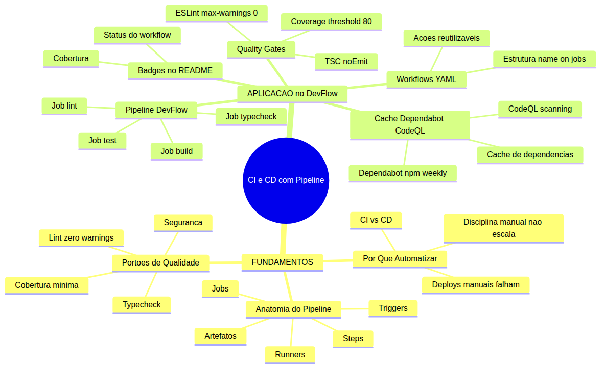
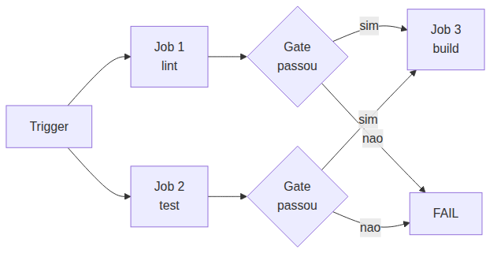
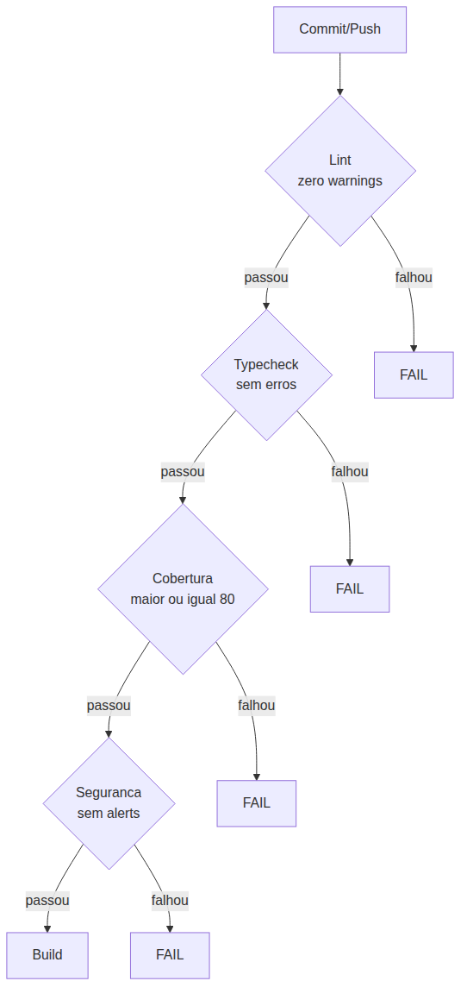
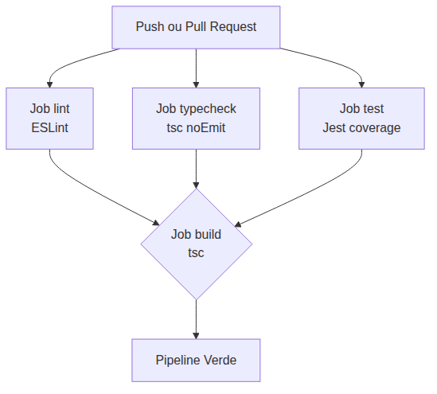
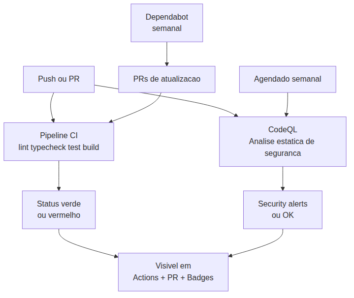

# Programador Profissional com Agentes — Aula 07

## CI/CD com GitHub Actions — O Pipeline Que Não Deixa Passar Erro

**Duração estimada:** 50 minutos (25 de leitura + 25 de prática)

**Nível:** Intermediário

**Pré-requisitos:** Aula 06 concluída — DevFlow com testes Jest e supertest, cobertura >= 80%, scripts `npm test` e `npm run lint` funcionais, TypeScript strict ativo, ESLint configurado, `.github/copilot-instructions.md` ativo, Node.js 20+, Git configurado, repositório DevFlow versionado no GitHub

---

## Objetivos de Aprendizagem

Ao final desta aula, você será capaz de:

- [ ] **Explicar** o problema que CI/CD resolve — por que deploys manuais falham e como a automação previne regressões
- [ ] **Descrever** a anatomia de um pipeline de integração contínua: triggers, jobs, steps, artefatos e quality gates
- [ ] **Definir** o que são portões de qualidade e como eles protegem a base de código (cobertura mínima, lint, typecheck, análise de segurança)
- [ ] **Distinguir** integração contínua (CI) de entrega contínua (CD) — onde uma termina e a outra começa
- [ ] **Criar** um workflow completo no GitHub Actions com jobs de lint, typecheck, teste e build
- [ ] **Configurar** quality gates no pipeline: threshold de cobertura >= 80%, ESLint zero warnings, TypeScript strict
- [ ] **Habilitar** Dependabot para atualização automática de dependências e CodeQL para análise de segurança
- [ ] **Adicionar** badges de status ao README do DevFlow — visibilidade instantânea da saúde do pipeline
- [ ] **Diagnosticar** falhas de pipeline — interpretar logs, identificar a causa raiz e corrigir

---

## Como Usar Está Aula

Esta aula está organizada em duas partes. A **primeira parte** constrói os fundamentos universais de pipelines de integração contínua — o problema que resolvem, a anatomia de um pipeline e os portões de qualidade — sem depender de plataforma específica. A **segunda parte** aplica esses conceitos na prática com GitHub Actions no seu projeto DevFlow, construindo um pipeline completo de lint, typecheck, teste, build, com Dependabot, CodeQL e badges.

Ao longo do caminho, você encontrará seções **"Mão na Massa"** para fazer junto e **"Quick Check"** para verificar se entendeu antes de avançar. Ao final, o arquivo separado **Questões de Aprendizagem** traz as tarefas de checkpoint — só avance para a próxima aula quando conseguir completá-las por conta própria.

**Tempo estimado:** 25 minutos de leitura + 25 minutos de prática.

---

## Mapa Mental

Este diagrama mostra todos os conceitos que você vai dominar nesta aula:



> *O mapa mental acima mostra a estrutura da aula. Cada ramo representa um conceito que você vai explorar: dos fundamentos teóricos à aplicação prática com pipeline automatizado no DevFlow.*

---

## Recapitulação das Aulas 01, 02, 03, 04, 05 e 06

| Aula | Conceito | Onde aparece nesta aula | Como se conecta |
|---|---|---|---|
| Aula 01 | **Ambiente profissional** (Seções 1-8) | Seções 4-7 | O repositório DevFlow que você criou é onde o pipeline vai operar |
| Aula 02 | **Instructions permanentes** (Seções 1-3) | Seções 5-6 | As regras do copilot-instructions.md guiam a qualidade que o pipeline vai verificar |
| Aula 03 | **Agent Mode** (Seções 1-5) | Seções 5-6 | O pipeline automatiza a verificação que antes você fazia manualmente |
| Aula 04 | **ADRs e Handoff** (Seções 5-6) | Seções 6-7 | O pipeline protege as decisões documentadas — código quebrado não passa |
| Aula 05 | **Refatoração e Services** (Seções 4-6) | Seções 5-6 | A qualidade conquistada na refatoração é protegida pelos quality gates |
| Aula 06 | **TDD e Testes** (Seções 1-7) | Seções 5-7 | Os testes que você escreveu agora são executados automaticamente a cada push |

---

**FUNDAMENTOS: Pipeline de Integração e Entrega Contínua**

> *Os conceitos desta seção são universais — valem para qualquer plataforma de integração contínua, independentemente da ferramenta específica. Você aprenderá por que pipelines automatizados existem, como são estruturados e o que são portões de qualidade. Na segunda parte, você verá como uma plataforma de código implementa cada um desses mecanismos no seu projeto DevFlow.*

---

## 1. Por Que Automatizar? — O Problema da Integração Manual

### O problema que CI/CD resolve

Você tem testes automatizados. Você provou que seu código funciona (Aula 06). Mas quem garante que você — ou um colega de time — rodou os testes antes de fazer merge? E se o código funciona na sua máquina mas quebra em outra?

**Testes sem pipeline são testes que dependem de disciplina manual.** E disciplina manual não escala. Hoje você lembra de rodar os testes antes de commitar. Semana que vem, com pressa, você faz aquele "esqueci de rodar o lint". Passa uma semana, alguém faz uma alteração que quebra um teste, mas ninguém percebe porque ninguém executou a suíte completa.

O código entra em produção. O bug aparece. "Funciona na minha máquina."

### O que é Integração Contínua (CI)

Integração Contínua (CI) é a prática de integrar código ao repositório central com frequência — múltiplas vezes ao dia — e, a cada integração, uma verificação automatizada é executada para confirmar que o código novo não quebrou nada.

O objetivo é detectar problemas o mais cedo possível. Quanto mais cedo um bug é encontrado, mais barato é corrigi-lo.

**Exemplo:** Você faz um commit com uma alteração no service de tarefas. Automaticamente, o serviço de CI baixa seu código, instala as dependências, executa o lint, roda os testes, verifica a cobertura e informa se tudo passou. Tudo isso sem você precisar fazer nada.

### O que é Entrega Contínua (CD)

Entrega Contínua (CD) é a extensão natural da CI. Depois que o pipeline de CI valida que o código está saudável, o código fica pronto para ser entregue para produção.

A diferença entre CI e CD é sutil mas importante:

| Aspecto | CI (Integração Contínua) | CD (Entrega Contínua) |
|---|---|---|
| **Objetivo** | Validar que o código integrado funciona | Manter o código sempre pronto para produção |
| **Gatilho** | A cada push ou pull request | Após CI passar, manualmente ou automaticamente |
| **Resultado** | Pipeline verde ou vermelho | Artefato pronto para deploy |
| **Decisão humana** | Não — é automático | Sim ou não — depende se é Continuous Delivery ou Continuous Deployment |

**CI = "o código está saudável." CD = "o código está saudável E pronto para ir para produção."**

Nesta aula, você vai construir a CI — o pipeline que verifica se o código está saudável. O deploy automatizado (CD) será abordado em aulas futuras.

### O que o pipeline resolve

| Problema | Como o pipeline resolve |
|---|---|
| "Esqueci de rodar os testes" | O pipeline roda automaticamente a cada push |
| "Funciona na minha máquina" | O pipeline roda em um ambiente limpo e padronizado |
| "Um warning de lint foi para produção" | O pipeline bloqueia se houver warnings |
| "Não sabia que meu código quebrou o teste de outro dev" | O pipeline executa TODOS os testes a cada push |
| "A cobertura caiu e ninguém percebeu" | O pipeline verifica o threshold de cobertura |
| "Recebi um PR com código quebrado e só vi depois de revisar" | O pipeline mostra o status vermelho antes de alguém revisar |

> *Até aqui, você já entendeu por que CI/CD existe: automatizar a verificação que humanos esquecem de fazer, detectar problemas cedo e padronizar o ambiente de validação. Isso já é MUITO. Respire. Se algo não ficou claro, releia a tabela de problemas resolvidos — cada linha é um cenário que você já viveu ou vai viver.*

### Quick Check 1

**1. Qual a diferença entre CI e CD?**
**Resposta:** CI (Integração Contínua) verifica automaticamente se o código integrado está saudável a cada push — rodando lint, testes e build. CD (Entrega Contínua) vai além: após a CI passar, o código fica pronto para ser entregue em produção. CI diz "o código funciona", CD diz "o código está pronto para ir ao ar".

**2. Cite dois problemas que um pipeline automatizado resolve que o deploy manual não resolve.**
**Resposta:** (1) A disciplina manual — o pipeline roda SEMPRE, independente de pressa ou esquecimento; (2) O ambiente padronizado — o pipeline roda em um ambiente limpo, não na máquina do desenvolvedor, eliminando "funciona na minha máquina". Um terceiro seria a detecção precoce: o pipeline descobre problemas minutos após o commit, não dias depois em produção.

---

## 2. Anatomia de um Pipeline de Integração Contínua

### A estrutura universal

Todo pipeline de CI, independente da plataforma, segue a mesma estrutura básica. Entender essa anatomia é o que diferencia um pipeline bem projetado de uma sequência qualquer de comandos.



Os elementos fundamentais:

**1. Triggers — o que dispara o pipeline**

Triggers são eventos que iniciam a execução do pipeline. Os mais comuns:

- **Push:** qualquer commit enviado ao repositório dispara o pipeline
- **Pull Request:** quando um PR e aberto ou atualizado, o pipeline roda
- **Agendado (cron):** executa em horarios predeterminados (ex: toda noite as 3h)
- **Manual:** um desenvolvedor dispara o pipeline sob demanda

Um pipeline bem configurado usa múltiplos triggers: push para branches de feature, pull request para revisão, agendado para varreduras de segurança.

**2. Jobs — as unidades de trabalho**

Jobs agrupam comandos relacionados. Cada job executa em um ambiente isolado e pode rodar em paralelo com outros jobs. As características principais:

- **Paralelismo:** jobs independentes rodam ao mesmo tempo (ex: lint e test rodam juntos)
- **Sequência:** jobs podem declarar dependências (job B só roda se job A passou)
- **Isolamento:** cada job tem seu próprio ambiente, sem interferência
- **Logs independentes:** logs separados para cada job fácilitam o debug

**3. Steps — os comandos atômicos**

Steps são os comandos individuais dentro de um job. Cada step é uma operação: instalar dependências, rodar um comando, fazer upload de artefato. Steps são executados em ordem dentro do job.

**Exemplo de estrutura:**
```
Job "test":
  Step 1: fazer checkout do codigo
  Step 2: instalar dependencias
  Step 3: executar testes
  Step 4: gerar relatorio de cobertura
```

**4. Artefatos — o output dos jobs**

Artefatos são arquivos produzidos por um job que podem ser compartilhados com jobs posteriores ou baixados pelo desenvolvedor. Exemplos: relatório de cobertura, binário compilado, pacote de dependências.

**5. Runners — quem executa**

Runners são as máquinas (fisicas ou virtuais) que executam os jobs. Podem ser fornecidas pela plataforma (gerenciadas) ou máquinas próprias.

### Analogia da linha de montagem

Pense em uma fábrica de carros. A linha de montagem tem várias estações:

1. **Estação 1 (Lint):** verifica se todas as pecas tem o formato correto
2. **Estação 2 (Teste):** testa se o motor funciona
3. **Estação 3 (Verificação de tipos):** confirma que todas as conexões são compativeis
4. **Estação 4 (Montagem):** monta o carro completo

Se a Estação 2 descobre que o motor falhou, a linha para. Não adianta montar o carro com um motor quebrado.

O pipeline funciona igual: cada job é uma estação. Jobs independentes rodam em paralelo (como estações que trabalham em partes diferentes do carro simultaneamente). Jobs dependentes rodam em sequência (só monta o motor depois que as pecas foram validadas).

### O que diferencia um pipeline bem projetado

| Característica | Pipeline bem projetado | Pipeline ruim |
|---|---|---|
| **Jobs** | Separados por responsabilidade (lint, test, build) | Um job monolitico com tudo junto |
| **Paralelismo** | Jobs independentes rodam em paralelo | Tudo em sequência, mesmo o que poderia ser paralelo |
| **Dependências** | Build depende de test; lint e test rodam juntos | Build roda antes de test |
| **Artefatos** | Gerados é compartilhados entre jobs | Cada job refaz o mesmo trabalho |
| **Logs** | Logs separados por job e step | Log único misturando tudo |
| **Feedback** | Pipeline falha rápido (fail fast) | Pipeline contínua executando após falha |

> *Até aqui, você já entendeu a anatomia universal: triggers disparam, jobs executam trabalho, steps são os comandos, artefatos são outputs, runners são as máquinas. Isso já é MUITO. Respire. Se algo não ficou claro, volte a analogia da linha de montagem — cada estação é um job.*

### Quick Check 2

**1. Se um pipeline tem 3 jobs (lint, test, build) e o job test falha, o job build executa?**
**Resposta:** Depende da configuração. Se build declarar dependência de test (`needs: test`), então build NÃO executa porque a dependência falhou. Se build não declarar dependência, ele executa mesmo com test falhando — mas isso é um anti-padrão: por que buildar código que falhou nos testes?

**2. Qual a diferença entre um trigger push é um trigger pull request?**
**Resposta:** Push dispara o pipeline quando commits são enviados diretamente a um branch. Pull request dispara quando um PR e aberto, atualizado ou sincronizado. O trigger de PR é importante porque permite que o pipeline valide o código ANTES do merge, dando feedback no próprio PR. Um pipeline bem configurado usa ambos: push para branches principais e pull request para revisão.

---

## 3. Portões de Qualidade e Segurança Automatizada

### Quality gates — a linha entre "rodou" e "passou"

Um pipeline pode executar sem erros técnicos e ainda assim aprovar código de baixa qualidade. Testes passam, mas a cobertura caiu de 80% para 50%. O lint rodou, mas com 47 warnings. O código compilou, mas tem vulnerabilidades conhecidas.

Portões de qualidade (quality gates) são as regras que bloqueiam o pipeline quando critérios predefinidos não são atendidos. Eles transformam "o pipeline executou" em "o pipeline aprovou o código".

### Os quatro portões essenciais



**1. Portão de lint — zero warnings**

O lint verifica estilo, boas práticas e erros óbvios. Um warning de lint pode ser "variavel declarada mas nunca usada". Não quebra o código, mas é um indício de código descuidado.

O portão de qualidade configurado como "zero warnings" significa que até mesmo avisos (warnings) bloqueiam o pipeline. Isso é mais rigoroso que o comportamento padrão, que aceita warnings e só bloqueia em erros.

**Por que zero warnings:** Um warning hoje é um bug amanha. "Declarou uma variavel e não usou" hoje, amanha e "esqueceu de passar o parametro". Zero tolerância a warnings cria disciplina de código limpo.

**2. Portão de typecheck — tipos corretos**

O typecheck (verificação de tipos) confirma que todas as operacoes respeitam os tipos definidos. Se uma função espera um número e recebe uma string, o typecheck detecta.

Com configuração rigorosa (strict mode), o typecheck bloqueia: variaveis null não verificadas, retornos inconsistentes, propriedades que podem não existir.

**Por que typecheck:** Erros de tipo são responsaveis por uma parcela significativa de bugs em produção. O typecheck automatizado elimina essa categoria inteirá de erros.

**3. Portão de cobertura — mínimo de 80%**

Testes passarem não significa que código suficiente foi testado. E possível ter 100% dos testes passando mas apenas 10% do código coberto.

O portão de cobertura exige que uma porcentagem mínima do código seja executada pelos testes:

| Métrica | O que mede | Threshold recomendado |
|---|---|---|
| **Branches** | Caminhos condicionais percorridos (if/else, switch) | 80% |
| **Functions** | Funções invocadas durante os testes | 80% |
| **Lines** | Linhas de código executadas | 80% |
| **Statements** | Instruções executadas | 80% |

Se qualquer métrica ficar abaixo do threshold, o pipeline falha. Não importa se todos os testes passarám.

**Por que 80%:** E um equilibrio prático entre rigor e realismo. Cobrir 100% do código e caro e frequentemente sem valor (testar getters, configuração, código gerado). 80% cobre a maioria dos cenários críticos sem burocracia excessiva.

**4. Portão de segurança**

A segurança automatizada opera em duas frentes:

- **Varredura de dependências:** verifica se as bibliotecas que seu projeto usa tem vulnerabilidades conhecidas. Se uma versão do pacote X tem uma falha de segurança, o pipeline alerta e bloqueta.
- **Análise estática de código:** varre o código em busca de padrões inseguros — ssenhas hardcoded, injecao de SQL, vazamento de dados sensiveis.

### Analogia do aeroporto

Pense no embarque de um voo. Antes de entrar no avião, você passa por:

1. **Raio-X (lint):** verificam se você não está carregando algo obviamente perigoso
2. **Detector de metais (typecheck):** verificam se tudo está no lugar certo
3. **Validação de documento (cobertura):** conferem se você tem autorização para embarcar
4. **Vistoria de segurança (segurança):** verificam se sua bagagem não tem itens suspeitos

Nenhum passageiro pula essas etapas. Não importa se o voo está atrasado ou se você é um viajante frequente. As regras são para todos. O pipeline funciona igual.

### Cache — acelerando o pipeline

Sem cache, cada execução do pipeline instala todas as dependências do zero. Para um projeto com 500MB de diretório de dependências, isso significa 2-3 minutos a cada push só para instalar dependências.

Com cache, as dependências são armazenadas após a primeira execução e reutilizadas nas execuções seguintes. O tempo cai de minutos para segundos.

### Badges — visibilidade instantânea

Badges são indicadores visuais que mostram o estado do pipeline diretamente no README do repositório. Qualquer pessoa que abre o repositório vê instantaneamente:

- Pipeline verde: o código está saudável
- Pipeline vermelho: algo quebrou
- Cobertura X%: quanto do código é testado

Badges não são decoração — são comunicação. Um badge vermelho no README diz "preste atenção, este projeto precisa de manutenção" sem ninguém precisar abrir a aba de pipelines.

> *Até aqui, você já entendeu os quatro portões de qualidade essenciais (lint, typecheck, cobertura e segurança), o papel do cache e o valor dos badges. Isso já é MUITO. Respire. Portões de qualidade são o que separa "o código rodou" de "o código é seguro para entregar".*

### Quick Check 3

**1. Por que um portão de qualidade de cobertura abaixo de 80% deve bloquear o pipeline em vez de apenas emitir um aviso?**
**Resposta:** Se o portão apenas avisa, ele depende de disciplina manual para ser respeitado — exatamente o problema que o pipeline resolve. Um aviso é ignorável; uma barreira não. O pipeline existe para automatizar a disciplina que humanos falham em manter. Cobertura abaixo de 80% bloqueia porque significa que código novo foi adicionado sem testes correspondentes, aumentando o risco de regressões.

**2. Cite um exemplo de análise de segurança que pode ser automatizada no pipeline.**
**Resposta:** Varredura de dependências com vulnerabilidades conhecidas. Se o projeto usa uma biblioteca X na versão 1.2 e essa versão tem uma vulnerabilidade CVE (Common Vulnerability and Exposure) cadastrada, o pipeline detecta e alerta. Outro exemplo: análise estática que detecta ssenhas hardcoded no código, tokens de API expostos ou uso de funções inseguras como `eval()`.

---

**APLICACAO: Pipeline CI e CD com GitHub Actions no DevFlow**

> *Agora que você entende os fundamentos universais de pipelines — triggers disparando jobs, quality gates bloqueando código de baixa qualidade, cache acelerando execuções e badges dando visibilidade — vamos conectar cada conceito a prática com GitHub Actions no seu projeto DevFlow.*

---

## 4. Workflows Automatizados com YAML

### A linguagem dos pipelines

Toda plataforma de CI/CD precisa de uma maneirá de descrever o pipeline: quais eventos disparam, quais jobs executar, quais comandos rodar. O formato padrão para isso é **YAML** (Yet Another Markup Language) — um formato de serialização de dados legível por humanos.

A estrutura básica de um workflow YAML é:

```yaml
name: Nome do Workflow
on: [evento1, evento2]

jobs:
  nome-do-job:
    runs-on: ubuntu-latest
    steps:
      - uses: acao-checkout
      - uses: acao-setup-node
      - run: comando
```

O GitHub Actions é a ferramenta de CI/CD da plataforma de código GitHub. Ela permite que você defina workflows automatizados que são disparados por eventos no repositório.

### Anatomia de um workflow

Cada workflow é um arquivo YAML dentro do diretório `.github/workflows/` do repositório. A estrutura segue exatamente os conceitos universais da Seção 2:

**name:** O nome do workflow. Aparece na interface da plataforma.

**on:** Os triggers que disparam o workflow. Mapeia diretamente para os triggers universais. Exemplos:

```yaml
# Dispara em qualquer push
on: [push]

# Dispara em push E pull request
on: [push, pull_request]

# Dispara em push apenas no branch main
on:
  push:
    branches: [main]

# Dispara em pull request para main
on:
  pull_request:
    branches: [main]
```

**jobs:** Os jobs do workflow. Mapeia para os jobs universais. Cada job tem:

- `runs-on`: o runner (máquina) onde o job executa (`ubuntu-latest`, `windows-latest`, `macos-latest`)
- `steps`: os passos do job
- `needs`: dependências entre jobs (opcional)

**steps:** Os comandos atômicos dentro de um job. Cada step pode ser:

- Um comando raw: `run: npm test`
- Uma ação reutilizavel: `uses: actions/checkout@v4`

### Ações reutilizaveis

Uma das características mais poderosas do ecossistema de GitHub Actions são as **ações reutilizaveis**. Em vez de escrever comandos raw para operacoes comuns (checkout, setup de linguagem, upload de artefatos), você usa ações prontas do marketplace.

**Por que usar ações em vez de comandos raw:**

| Ação raw | Ação reutilizavel |
|---|---|
| `git clone url` | `uses: actions/checkout@v4` |
| Instalar Node manualmente | `uses: actions/setup-node@v4` |
| Compactar e fazer upload manual | `uses: actions/upload-artifact@v4` |

Vantagens: manutenção delegada (a comunidade mantem), segurança auditada, funcionalidades extras (cache automático, logging padrão), menos código no workflow.

### Exemplo mínimo de workflow

```yaml
name: CI Basico

on: [push]

jobs:
  test:
    runs-on: ubuntu-latest
    steps:
      - uses: actions/checkout@v4
      - uses: actions/setup-node@v4
        with:
          node-version: '20'
      - run: npm ci
      - run: npm test
```

Este workflow:

1. Dispara em qualquer push (`on: [push]`)
2. Executa um job chamado `test` no runner Linux (`runs-on: ubuntu-latest`)
3. Faz checkout do código (`actions/checkout@v4`)
4. Configura Node.js 20 (`actions/setup-node@v4`)
5. Instala dependências (`npm ci`)
6. Executa testes (`npm test`)

E só isso. Um pipeline funcional em 10 linhas.

**Por que `npm ci` e não `npm install`:**

| Comando | `npm install` | `npm ci` |
|---|---|---|
| Leitura | package.json | package-lock.json |
| Instalação | Pode atualizar versões | Instala exatamente o que está no lock |
| Velocidade | Mais lento | Mais rápido |
| Determinismo | Não determinístico | Completamente determinístico |
| Uso ideal | Desenvolvimento local | CI/CD |

`npm ci` é o comando correto para pipelines porque garante que a instalação e identica em todas as execuções.

### Quick Check 4

**1. O que a chave `on: [push, pull_request]` faz em um workflow?**
**Resposta:** Configura o workflow para ser disparado por dois eventos diferentes: (1) quando commits são enviados a qualquer branch do repositório (push), e (2) quando um pull request e aberto, sincronizado ou atualizado (pull_request). Isso garante que o pipeline valide tanto código em branches de trabalho quanto código proposto para merge.

**2. Por que usar uma ação reutilizavel em vez de escrever comandos raw nos steps?**
**Resposta:** Ações reutilizaveis abstraem complexidade (ex: `actions/setup-node` gerencia download, instalação, path e caching do Node.js), são mantidas pela comunidade (correções de segurança e compatibilidade são aplicadas automaticamente), oferecem funcionalidades extras (cache integrado, logging padrão) e reduzem o tamanho do workflow. Escrever comandos raw seria reinventar a roda para cada operação comum.

---

## 5. Construindo o Pipeline do DevFlow

### O workflow completo

Agora você vai construir o pipeline do DevFlow. O workflow terá 4 jobs:

1. **lint:** executa o ESLint com zero warnings
2. **typecheck:** executa o TypeScript compiler em modo de validação
3. **test:** executa os testes Jest com cobertura
4. **build:** compila o TypeScript para JavaScript

A ordem e as dependências:



Note que `lint`, `typecheck` e `test` rodam em PARALELO (não dependem um do outro). O job `build` depende de todos os três — só compila se as três validacoes passarem.

**Por que jobs separados em vez de um job único:**

| Um job único | Jobs separados |
|---|---|
| Tudo em sequência — lint espera test, test espera typecheck | Lint, typecheck e test rodam AO MESMO TEMPO |
| Se o lint falha no minuto 3, test começa só no minuto 5 | Jobs independentes não se bloqueiam |
| Log gigante misturando tudo | Logs separados — cada job tem seu log |
| Não sabe se o test passaria se o lint não tivesse falhado | Sabe exatamente qual job quebrou |

### O arquivo ci.yml

Crie o diretório `.github/workflows/` na raiz do DevFlow e o arquivo `ci.yml` com o conteudo abaixo:

```yaml
name: CI DevFlow

on:
  push:
    branches: [main, develop]
  pull_request:
    branches: [main]

jobs:
  lint:
    name: Lint
    runs-on: ubuntu-latest
    steps:
      - uses: actions/checkout@v4
      - uses: actions/setup-node@v4
        with:
          node-version: '20'
          cache: 'npm'
      - run: npm ci
      - run: npm run lint -- --max-warnings 0

  typecheck:
    name: Typecheck
    runs-on: ubuntu-latest
    steps:
      - uses: actions/checkout@v4
      - uses: actions/setup-node@v4
        with:
          node-version: '20'
          cache: 'npm'
      - run: npm ci
      - run: npx tsc --noEmit

  test:
    name: Test
    runs-on: ubuntu-latest
    steps:
      - uses: actions/checkout@v4
      - uses: actions/setup-node@v4
        with:
          node-version: '20'
          cache: 'npm'
      - run: npm ci
      - run: npm test -- --coverage --coverageThreshold='{"global":{"branches":80,"functions":80,"lines":80,"statements":80}}'

  build:
    name: Build
    runs-on: ubuntu-latest
    needs: [lint, typecheck, test]
    steps:
      - uses: actions/checkout@v4
      - uses: actions/setup-node@v4
        with:
          node-version: '20'
          cache: 'npm'
      - run: npm ci
      - run: npm run build
```

Vamos entender cada parte:

**Trigger:** O workflow dispara em push para `main` e `develop`, e em pull request para `main`. Isso cobre tanto o trabalho em branches de feature (push develop) quanto a revisão (PR para main).

**Job lint:** Faz checkout, configura Node com cache, instala dependências e executa o lint com `--max-warnings 0`. Esse último argumento é o portão de qualidade: até warnings bloqueiam o pipeline.

**Job typecheck:** Faz checkout, configura Node, instala e executa `npx tsc --noEmit`. O `--noEmit` faz o TypeScript compiler validar os tipos sem gerar arquivos JavaScript. Se houver qualquer erro de tipo, o job falha.

**Job test:** Executa os testes com `--coverage` e passa o threshold diretamente na linha de comando. Na Seção 6, você vai aprender a configurar isso no `jest.config.js` permanentemente.

**Job build:** Depende de `lint`, `typecheck` e `test` (`needs: [lint, typecheck, test]`). Só executa se todos os três passarám. Compila o TypeScript com `npm run build`.

### Mão na Massa 1 — Criar o Workflow Base

**Dificuldade: Fácil | Duracao: 8 minutos**

- [ ] Crie o diretório `.github/workflows/` na raiz do DevFlow
- [ ] Crie o arquivo `ci.yml` com o conteudo completo acima
- [ ] Faca commit e push para o branch main ou develop:

```bash
git add .github/
git commit -m "feat: adiciona pipeline CI com lint, typecheck, test e build"
git push origin main
```

- [ ] Abra a aba "Actions" do seu repositório no GitHub
- [ ] Observe o workflow sendo executado — o nome "CI DevFlow" deve aparecer

**Verificação:** Os 4 jobs (`lint`, `typecheck`, `test`, `build`) devem aparecer na interface. Cada job começará a executar. Jobs em paralelo (`lint`, `typecheck`, `test`) começam juntos. O job `build` aguarda todos terminarem.

Após alguns minutos (depende da velocidade de instalação das dependências), todos os jobs devem ficar **verdes** (checkmark). Se algum ficar vermelho, clique no job para ver os logs — o erro indica o que precisa ser corrigido.

### Quick Check 5

**1. Por que o job `typecheck` NÃO depende do job `lint` passar? Eles não poderiam rodar em paralelo mesmo?**
**Resposta:** Exato — eles rodam em paralelo. `lint` e `typecheck` são independentes: um verifica estilo de código, o outro verifica tipos. Não há razao para um esperar o outro. O único job que precisa esperar todos e o `build`, que só faz sentido se o código passou pelo lint, tem tipos corretos E os testes estão verdes.

**2. Qual a vantagem de ter jobs separados para lint, typecheck e test em vez de um job único?**
**Resposta:** (1) Paralelismo — os três rodam ao mesmo tempo, reduzindo o tempo total do pipeline. (2) Isolamento de falha — se apenas o lint quebrou, você sabe exatamente onde olhar, sem precisar vasculhar um log gigante. (3) Feedback rápido — o lint termina em 30 segundos e já da feedback, enquanto o test (que leva 2 minutos) ainda está rodando. (4) Reexecucao seletiva — se só o typecheck falhou, você pode reexecutar apenas aquele job.

---

## 6. Portões de Qualidade no Pipeline

### Configurando os portões

Os portões de qualidade universais da Seção 3 agora serão configurados com ferramentas concretas. Você já viu `--max-warnings 0` no lint e `--coverageThreshold` inline no job test. Agora vamos tornar essas configurações permanentes no projeto.

### Cobertura mínima via jest.config.js

Em vez de passar o threshold na linha de comando (como fizemos no job test), configure-o diretamente no `jest.config.js` do DevFlow. Assim, o threshold vale para execuções locais E no pipeline.

Abra o `jest.config.js` e adicione (ou atualize) a seção `coverageThreshold`:

```javascript
module.exports = {
  testEnvironment: 'node',
  testMatch: ['**/__tests__/**/*.test.js'],
  collectCoverageFrom: [
    'services/**/*.js',
    'controllers/**/*.js',
    'routes/**/*.js',
    '!**/node_modules/**'
  ],
  coverageThreshold: {
    global: {
      branches: 80,
      functions: 80,
      lines: 80,
      statements: 80
    }
  }
};
```

Agora, sempre que `npm test -- --coverage` for executado, o Jest verifica as 4 métricas. Se qualquer uma estiver abaixo de 80%, o Jest retorna exit code 1 — e o job test falha.

### ESLint zero warnings no package.json

Adicione a flag `--max-warnings 0` ao script `lint` no `package.json`:

```json
{
  "scripts": {
    "test": "jest",
    "test:coverage": "jest --coverage",
    "lint": "eslint . --max-warnings 0",
    "build": "tsc"
  }
}
```

Agora, `npm run lint` sempre executa com zero warnings. Se houver qualquer warning, o ESLint retorna exit code 1.

### TypeScript strict no tsconfig.json

O `--noEmit` no job typecheck garante que o TypeScript compiler valide tipos sem gerar arquivos. Mas a configuração `strict: true` no `tsconfig.json` e o que torna essa validação rigorosa.

Verifique seu `tsconfig.json`:

```json
{
  "compilerOptions": {
    "target": "ES2020",
    "module": "commonjs",
    "strict": true,
    "esModuleInterop": true,
    "outDir": "./dist",
    "rootDir": "./src",
    "skipLibCheck": true,
    "forceConsistentCasingInFileNames": true
  },
  "include": ["src/**/*"],
  "exclude": ["node_modules", "dist", "__tests__"]
}
```

O campo `strict: true` habilita várias verificações rigorosas: `noImplicitAny` (não permite `any` implicito), `strictNullChecks` (variaveis podem ser null a menos que explicitamente tipadas), `noUnusedLocals` (variaveis não usadas são erro).

### O que acontece quando um gate falha

Vamos simular. Suponha que você adiciona uma linha de código que viola o lint:

```javascript
const x = 1;  // variavel declarada mas nunca usada
```

**Fluxo da falha:**

1. Você faz commit e push
2. O pipeline dispara automaticamente
3. O job `lint` executa e encontra o warning: `'x' is assigned a value but never used`
4. Como a configuração e `--max-warnings 0`, o ESLint retorna exit code 1
5. O job `lint` fica **vermelho** no GitHub Actions
6. O job `build` não executa (depende de `lint`)
7. O workflow inteiro é marcado como **failure**
8. Se for um pull request, o PR mostra o status vermelho — impedindo o merge

**O que você vê:**

Na aba "Actions", o workflow aparece com fundo vermelho. Clicando no workflow, você vê quais jobs falharam. Clicando no job `lint`, você vê os logs com o erro exato: arquivo, linha, coluna e a regra do ESLint violada.

> *Até aqui, você já configurou os três portões de qualidade principais: coverage threshold no Jest, zero warnings no ESLint e TypeScript strict. Respire. Cada portão é uma camada de proteção que você não precisa mais verificar manualmente.*

### Mão na Massa 2 — Adicionar Quality Gates

**Dificuldade: Fácil | Duracao: 8 minutos**

- [ ] Abra o arquivo `jest.config.js` do DevFlow
- [ ] Adicione (ou atualize) a seção `coverageThreshold` com os valores: `branches: 80, functions: 80, lines: 80, statements: 80`
- [ ] Abra o `package.json` e atualize o script `lint` para: `"lint": "eslint . --max-warnings 0"`
- [ ] Abra o arquivo `ci.yml` e atualize o job `test` para usar `npm test -- --coverage` (sem o threshold inline, já que agora está no jest.config.js):

```yaml
  test:
    name: Test
    runs-on: ubuntu-latest
    needs: [lint, typecheck]
    steps:
      - uses: actions/checkout@v4
      - uses: actions/setup-node@v4
        with:
          node-version: '20'
          cache: 'npm'
      - run: npm ci
      - run: npm test -- --coverage
```

- [ ] Faca commit e push:

```bash
git add jest.config.js package.json .github/workflows/ci.yml
git commit -m "feat: configura quality gates - coverage 80, lint zero warnings"
git push origin main
```

- [ ] Verifique na aba "Actions" que todos os jobs contínuam verdes
- [ ] Clique no job `lint` e confirme que o log mostra "0 warnings" no final
- [ ] Clique no job `test` e confirme que o relatório mostra cobertura de pelo menos 80% em todas as métricas

**Verificação:** Pipeline contínua verde. Log do lint mostra "0 warnings". Log do test mostra coverage >= 80% em branches, functions, lines e statements.

### Quick Check 6

**1. O que acontece se a cobertura de testes cair para 75% em um novo commit?**
**Resposta:** O job `test` executa, os testes passam (todos verdes), mas o Jest detecta que o threshold não foi atingido. O Jest retorna exit code 1 (falha) e o job fica vermelho. O workflow é marcado como falha. O job `build` não executa porque depende de `test`. O commit que reduziu a cobertura está sinalizado como problematico.

**2. Por que `--max-warnings 0` é mais rigoroso que o comportamento padrão do ESLint?**
**Resposta:** O comportamento padrão do ESLint diferencia entre erros (violações que quebram o código) e warnings (violações que não quebram mas indicam problemas potenciais). Por padrão, só erros retornam exit code 1 — warnings apenas aparecem no log. Com `--max-warnings 0`, QUALQUER warning, mesmo que seja estilo ou convenção, é tratado como erro e faz o ESLint retornar exit code 1. Isso cria disciplina de código limpo: zero tolerância a warnings.

---

## 7. Cache, Dependabot, CodeQL e Badges

### Cache de dependências no pipeline

Toda vez que o pipeline executa, ele instala as dependências do zero (`npm ci`). Para um projeto com muitas dependências, isso leva tempo. O cache armazena o `node_modules` entre execuções.

No GitHub Actions, o `actions/setup-node` já tem suporte nativo a cache. Basta adicionar `cache: 'npm'` na configuração:

```yaml
- uses: actions/setup-node@v4
  with:
    node-version: '20'
    cache: 'npm'
```

**O que acontece:**

- **Primeirá execução:** Sem cache. `npm ci` baixa e instala tudo (~2 minutos). Ao final, o `node_modules` é armazenado em cache.
- **Execuções seguintes:** Com cache. O `node_modules` e restaurado do cache (~5 segundos). `npm ci` verifica que o cache e valido e não reinstala.
- **Quando o cache e invalidado:** Se o `package-lock.json` muda (nova dependência adicionada), o cache anterior é descartado é um novo é criado.

O resultado prático: um pipeline que levava 3 minutos para instalar dependências passa a levar 15 segundos.

### Dependabot — atualização automática de dependências

Dependências desatualizadas são a principal fonte de vulnerabilidades de segurança em projetos de software. O Dependabot automatiza a atualização: ele verifica periodicamente se há novas versões das dependências e, se houver, cria pull requests automáticos com a atualização.

**O arquivo `.github/dependabot.yml`:**

```yaml
version: 2
updates:
  - package-ecosystem: 'npm'
    directory: '/'
    schedule:
      interval: 'weekly'
    open-pull-requests-limit: 10
```

**O que cada campo faz:**

| Campo | Valor | Significado |
|---|---|---|
| `version` | `2` | Versão do schema do Dependabot (sempre 2) |
| `package-ecosystem` | `npm` | Gerenciador de pacotes a monitorar |
| `directory` | `/` | Diretorio do `package.json` (raiz do projeto) |
| `schedule.interval` | `weekly` | Frequência da verificação (daily, weekly, monthly) |
| `open-pull-requests-limit` | `10` | Máximo de PRs abertos simultaneamente |

**Como funciona na prática:**

- Toda semana, o Dependabot varre as dependências do `package.json`
- Para cada dependência com versão nova, ele cria um Pull Request com:
  - O nome da dependência e a mudança de versão
  - O changelog da nova versão (se disponível)
  - Notas de segurança (se a atualização corrige vulnerabilidades)
- O PR dispara o pipeline CI automaticamente
- Se o pipeline passar, você pode fazer merge com confiança
- Se o pipeline falhar, você sabe que a atualização quebrou algo

### CodeQL — análise de segurança contínua

CodeQL é a ferramenta de análise estática de segurança do GitHub. Ela varre o código em busca de padrões inseguros: injecao de SQL, cross-site scripting (XSS), ssenhas hardcoded, uso de funções inseguras e muito mais.

O CodeQL é configurado como um workflow separado. Crie o arquivo `.github/workflows/codeql.yml`:

```yaml
name: CodeQL

on:
  push:
    branches: [main]
  pull_request:
    branches: [main]
  schedule:
    - cron: '0 3 * * 1'

jobs:
  analyze:
    name: Analyze
    runs-on: ubuntu-latest
    permissions:
      actions: read
      contents: read
      security-events: write

    strategy:
      fail-fast: false
      matrix:
        language: ['javascript-typescript']

    steps:
      - uses: actions/checkout@v4
      - uses: github/codeql-action/init@v3
        with:
          languages: ${{ matrix.language }}
      - uses: github/codeql-action/analyze@v3
```

**Destaques:**

- Além dos triggers de push e pull request, tem um trigger **agendado** (`cron: '0 3 * * 1'`) — toda segunda-feirá as 3h da manha
- Usa a action oficial `github/codeql-action` com duas fases: `init` (prepara a análise) e `analyze` (executa a varredura)
- `fail-fast: false` garante que a análise contínua mesmo se uma linguagem falhar
- Resultados aparecem na aba "Security" do repositório



### Badges no README

Badges são imagens SVG que refletem o estado atual do pipeline. Colocados no README, eles dão visibilidade instantânea.

**Badge de status do workflow:**

```markdown

```

Substitua `SEU_USUARIO` pelo seu nome de usuário no GitHub e `devflow` pelo nome do seu repositório.

**Badge de cobertura:**

Para badge de cobertura, você precisa de um serviço externo que publique o relatório. O mais simples é usar o Codecov com a action `codecov/codecov-action`:

```yaml
# Adicione este step ao final do job test:
      - uses: codecov/codecov-action@v4
        with:
          token: ${{ secrets.CODECOV_TOKEN }}
          flags: unittests
```

Após configurar, o Codecov gera um badge:

```markdown
[](https://codecov.io/gh/SEU_USUARIO/devflow)
```

> *Este passo é opcional — o badge de status do workflow funciona sem serviço externo. Se quiser o badge de cobertura, crie conta gratuita no codecov.io e adicione o token como secret no repositório.*

**Onde colocar os badges no README:**

O padrão da comunidade é colocar os badges logo após o título do projeto, antes da descrição:

```markdown
# DevFlow

[](https://github.com/SEU_USUARIO/devflow/actions)
[](https://codecov.io/gh/SEU_USUARIO/devflow)

Dashboard de gerenciamento de projetos dev.
```

Qualquer pessoa que abre o repositório ve imediatamente: o pipeline está verde? A cobertura está boa?

### Mão na Massa 3 — Dependabot, CodeQL e Badges

**Dificuldade: Medio | Duracao: 10 minutos**

- [ ] Crie o arquivo `.github/dependabot.yml` com a configuração semanal para npm:

```yaml
version: 2
updates:
  - package-ecosystem: 'npm'
    directory: '/'
    schedule:
      interval: 'weekly'
    open-pull-requests-limit: 10
```

- [ ] Crie o arquivo `.github/workflows/codeql.yml` com o conteudo completo da seção anterior
- [ ] Abra o `README.md` do DevFlow e adicione os badges depois do título
- [ ] Faca commit e push:

```bash
git add .github/dependabot.yml .github/workflows/codeql.yml README.md
git commit -m "feat: configura Dependabot, CodeQL e badges no README"
git push origin main
```

**Verificação:**

- [ ] O README mostra os badges — inicialmente podem aparecer como "loading" até o pipeline executar
- [ ] Aba "Security" do repositório: mostra "Dependabot alerts" configurado
- [ ] Aba "Security > Code scanning": mostra CodeQL configurado
- [ ] Aba "Actions": CodeQL workflow aparece e executa
- [ ] Após primeira execução, os badges no README devem mostrar status verde

### Quick Check 7

**1. Qual a diferença entre Dependabot é CodeQL - o que cada um protege?**
**Resposta:** Dependabot protege contra vulnerabilidades em dependências — ele monitora as bibliotecas que seu projeto usa e cria PRs automáticos quando versões mais recentes (com correções de segurança) estão disponíveis. CodeQL protege contra vulnerabilidades no SEU código — ele faz análise estática para detectar padrões inseguros como injecao de SQL, XSS ou ssenhas hardcoded. Um e focado em dependências externas (Dependabot), o outro no código que você escreve (CodeQL). Ambos são complementares.

**2. Onde no README você colocaria badges de CI/CD e por que?**
**Resposta:** Logo após o título do projeto, antes da descrição ou seção de instalação. E o padrão da comunidade porque é a primeira coisa que alguém ve ao abrir o repositório: o estado de saúde do projeto. Se o badge estiver no final do README, a pessoa precisa rolar tudo para saber se o projeto está saudável. No topo, a informação é instantânea: badge verde = "projeto ativo e bem cuidado", badge vermelho = "algo precisa de atenção".

---

## Autoavaliação: Quiz Rápido

**1. Qual a diferença entre CI e CD? De um exemplo de cada.**
**Resposta:**

CI (Integração Contínua) verifica automaticamente o código a cada push — exemplo: pipeline que roda lint, testes e build. CD (Entrega Contínua) mantem o código pronto para produção após a CI passar — exemplo: após o pipeline CI verde, o binário compilado e disponibilizado para deploy. CI diz "o código funciona", CD diz "o código está pronto para ir ao ar".

**2. Descreva (em texto) a anatomia de um pipeline: trigger, jobs, steps, artefatos, quality gates.**
**Resposta:**

Um pipeline começa com um **trigger** (push, pull request, agendamento) que dispara um ou mais **jobs**. Jobs independentes rodam em paralelo; jobs com dependência (`needs`) rodam em sequência. Cada job contém **steps** — comandos atômicos como checkout, instalação de dependências, execução de testes. Jobs produzem **artefatos** (relatórios, binários) compartilhados entre si ou baixáveis. Entre jobs, **quality gates** (portões de qualidade) bloqueiam o pipeline se critérios como cobertura mínima ou zero warnings não forem atendidos.

**3. Cite 3 tipos de portões de qualidade e o que cada um verifica.**
**Resposta:**

(1) **Lint zero warnings** — verifica estilo, boas práticas e erros óbvios; qualquer warning bloqueia o pipeline. (2) **Cobertura mínima** — verifica se a porcentagem de código executada pelos testes atinge o threshold configurado (ex: 80%). (3) **Typecheck** — verifica se todas as operacoes respeitam os tipos definidos; erros de tipo bloqueiam o pipeline.

**4. O que significam as chaves `on`, `jobs` e `steps` em um workflow YAML?**
**Resposta:**

`on` define os triggers que disparam o workflow (ex: `push`, `pull_request`). `jobs` define as unidades de trabalho — cada job executa em um runner isolado e pode ter dependências de outros jobs. `steps` define os comandos atômicos dentro de cada job — ações reutilizaveis (`uses`) ou comandos diretos (`run`).

**5. Por que o job `build` deve depender do job `test` no pipeline do DevFlow?**
**Resposta:**

Por que não faz sentido compilar (build) um código que não passou nos testes. O build gera os artefatos JavaScript compilados a partir do TypeScript. Se os testes falharam, o código tem problemas — compila-lo geraria um artefato quebrado. A dependência `needs: [lint, typecheck, test]` garante que o build só executa se as três validacoes passarám.

**6. O que acontece quando um commit reduz a cobertura de testes abaixo do threshold configurado?**
**Resposta:**

O job `test` executa, os testes passam (todos verdes), mas o Jest detecta que o threshold não foi atingido. O Jest retorna exit code 1 e o job fica vermelho. O workflow é marcado como failure. O job `build` não executa porque depende de `test`. O autor do commit ve o pipeline vermelho e sabe que precisa adicionar testes para a nova funcionalidade.

**7. Qual a diferença entre o que o Dependabot faz e o que o CodeQL faz?**
**Resposta:**

Dependabot monitora dependências externas (bibliotecas) e cria PRs automáticos com atualizações de versão — especialmente versões que corrigem vulnerabilidades conhecidas. CodeQL analisa o código FONTE do projeto em busca de padrões inseguros (injecao, vazamento de dados, falhas de logica). São complementares: o Dependabot cuida do que você importa, o CodeQL cuida do que você escreve.

---

## Mão na Massa N: Exercícios Graduados

**Exercício 1 (Fácil) — Adicionar Job de Typecheck**

O workflow atual tem `lint`, `test` e `build`. Seu workflow já tem o job `typecheck`? Se não, adicione-o. O job `typecheck` deve executar `npx tsc --noEmit`, rodar em paralelo com `lint` e `test`, e o job `build` deve depender também de `typecheck`.

**Gabarito:**

Adicione o job `typecheck` no `ci.yml`:

```yaml
  typecheck:
    name: Typecheck
    runs-on: ubuntu-latest
    steps:
      - uses: actions/checkout@v4
      - uses: actions/setup-node@v4
        with:
          node-version: '20'
          cache: 'npm'
      - run: npm ci
      - run: npx tsc --noEmit
```

Atualize o job `build` para depender de `typecheck`:

```yaml
  build:
    name: Build
    runs-on: ubuntu-latest
    needs: [lint, typecheck, test]
    steps:
      - uses: actions/checkout@v4
      - uses: actions/setup-node@v4
        with:
          node-version: '20'
          cache: 'npm'
      - run: npm ci
      - run: npm run build
```

Pipeline agora tem 4 jobs. `lint`, `typecheck` e `test` rodam em paralelo; `build` espera todos.

**Exercício 2 (Medio) — Matrix Strategy para Node.js**

Modifique o job `test` para usar matrix strategy: rode os testes em Node.js 18 e Node.js 20 simultaneamente. Dica: use `strategy.matrix.node-version`.

**Gabarito:**

```yaml
  test:
    name: Test (Node ${{ matrix.node-version }})
    runs-on: ubuntu-latest
    strategy:
      matrix:
        node-version: ['18', '20']
    steps:
      - uses: actions/checkout@v4
      - uses: actions/setup-node@v4
        with:
          node-version: ${{ matrix.node-version }}
          cache: 'npm'
      - run: npm ci
      - run: npm test -- --coverage
```

A matrix strategy cria duas execuções paralelas do job `test`: uma com Node 18 e outra com Node 20. Ambas devem passar. Isso garante compatibilidade com ambas as versões. O job `build` contínua dependendo do job `test` (agora com duas execuções, ambas precisam passar).

**Desafio (Difícil) — O Ciclo Completo: Quebrar, Ver Falhar, Corrigir, Ver Passar**

Este exercício simula o cenário real de diagnóstico de falha:

1. Introduza intencionalmente um warning de ESLint no código (ex: variavel não usada)
2. Faca commit e push — observe o pipeline falhar no job `lint`
3. Leia os logs do GitHub Actions para identificar a causa exata (arquivo, linha, regra)
4. Corrija o warning e faca um novo commit
5. Verifique que o pipeline volta a ficar verde
6. Importante: faca isso em um branch separado para não deixar código quebrado no main

**Gabarito:**

Passo 1 — Crie um branch e adicione um warning:

```bash
git checkout -b desafio-quebra-pipeline
```

Adicione em qualquer arquivo `.ts` ou `.js`:

```javascript
const naoUsada = "esta variavel nunca e usada";
```

Passo 2 — Commit e push:

```bash
git add .
git commit -m "DESAFIO: warning intencional para testar o pipeline"
git push origin desafio-quebra-pipeline
```

Passo 3 — Abra a aba "Actions". O workflow `CI DevFlow` deve aparecer com fundo vermelho. Clique no job `lint` e veja os logs:

```
ESLint: /home/runner/work/devflow/devflow/src/arquivo.ts
  15:7  warning  'naoUsada' is assigned a value but never used  @typescript-eslint/no-unused-vars

✖ 1 problem (0 errors, 1 warning)
  1 warning exceeds the maximum of 0. ESLint failed.
```

O log mostra exatamente o arquivo (`src/arquivo.ts`), a linha (`15:7`), a variavel (`naoUsada`) e a regra violada (`@typescript-eslint/no-unused-vars`).

Passo 4 — Corrija removendo a linha ou usando a variavel:

```javascript
// Remove a linha ou usa a variavel
const naoUsada = "esta variavel nunca e usada";
console.log(naoUsada);  // agora esta sendo usada
```

Passo 5 — Commit e push:

```bash
git add .
git commit -m "corrige warning de variavel nao usada"
git push origin desafio-quebra-pipeline
```

Passo 6 — Verifique. O workflow deve executar novamente e ficar verde. Faca merge do branch de volta ao main.

**Importante:** Se você quiser reverter o warning sem corrigi-lo (porque foi só um teste), use `git revert` no branch de desafio antes de fazer merge, ou simplesmente delete o branch após o teste:

```bash
git checkout main
git branch -D desafio-quebra-pipeline
git push origin --delete desafio-quebra-pipeline
```

---

## Resumo da Aula

### Os 8 Conceitos Fundamentais

1. **CI/CD**: Integração Contínua (CI) verifica automaticamente a cada integração; Entrega Contínua (CD) mantem o código pronto para produção. CI evita regressões, CD acelera entregas.

2. **Anatomia do pipeline**: triggers disparam jobs, jobs contém steps, steps são comandos atômicos, runners executam, artefatos são outputs compartilhados.

3. **Paralelismo vs sequência**: Jobs independentes rodam em paralelo; jobs com `needs` rodam em sequência. Um pipeline bem projetado maximiza paralelismo.

4. **Portões de qualidade**: Cobertura mínima (80%), lint zero warnings (`--max-warnings 0`), typecheck (`tsc --noEmit`), segurança (Dependabot + CodeQL).

5. **Workflows YAML**: `name`, `on` (triggers), `jobs` (unidades de trabalho), `steps` (comandos), `runs-on` (runner). Ações reutilizaveis para operacoes comuns.

6. **Cache**: Armazena `node_modules` entre execuções. Primeirá execução: ~2 min instalar. Execuções seguintes: ~15s com cache.

7. **Dependabot**: Atualização automática de dependências via PRs. Intervalo semanal. Protege contra vulnerabilidades em bibliotecas.

8. **CodeQL e Badges**: CodeQL faz análise estática de segurança. Badges mostram status do pipeline e cobertura no README.

### O Que Você Construiu Hoje

- [x] `.github/workflows/ci.yml` — pipeline completo com 4 jobs (lint, typecheck, test, build)
- [x] `.github/workflows/codeql.yml` — análise de segurança contínua
- [x] `.github/dependabot.yml` — atualização automática de dependências
- [x] Jest coverage threshold configurado (80%)
- [x] ESLint configurado com `--max-warnings 0`
- [x] Badges de status adicionados ao README do DevFlow
- [x] Cache de dependências ativo em todos os jobs

---

## Próxima Aula

**Aula 08: Testes E2E com Playwright + Metodologia Ágil na Prática**

O pipeline CI do DevFlow está rodando. Agora você vai construir o frontend React do DevFlow, aprender a testa-lo com Playwright (testes end-to-end) e estruturar o trabalho com metodologia ágil: GitHub Issues como backlog, user stories, milestones e sprint planning. O pipeline que você construiu hoje vai proteger cada novo commit. Todo o código frontend passará pelo mesmo pipeline — lint, typecheck, test e build — antes de chegar ao main.

---

## Referencias

### Documentação Oficial

- [GitHub Actions — Documentação oficial](https://docs.github.com/en/actions) — workflows, jobs, steps, triggers
- [GitHub Actions — Workflow syntax](https://docs.github.com/en/actions/writing-workflows/workflow-syntax-for-github-actions) — referencia completa de sintaxe YAML
- [actions/setup-node](https://github.com/actions/setup-node) — action oficial para configuração do Node.js
- [Dependabot — Configuração](https://docs.github.com/en/code-security/dependabot/dependabot-version-updates/configuration-options-for-the-dependabot.yml-file) — opções do arquivo dependabot.yml
- [CodeQL — GitHub Actions](https://docs.github.com/en/code-security/code-scanning/creating-an-advanced-setup-for-code-scanning/customizing-your-advanced-setup-for-code-scanning) — configuração de análise de segurança

### Ferramentas e Ações

- [Shields.io](https://shields.io/) — gerador de badges para README
- [Codecov](https://codecov.io/) — cobertura de código com badges
- [Jest — Coverage Threshold](https://jestjs.io/docs/configuration#coveragethreshold-object) — configuração de threshold
- [ESLint — Max Warnings](https://eslint.org/docs/latest/use/command-line-interface#--max-warnings) — flag --max-warnings

### Videos Recomendados

- [GitHub Actions — Introdução prática (GitHub Official)](https://www.youtube.com/watch?v=R8_veQiYBjI) — conceitos básicos com exemplos (~15 min)
- [Continuous Integration vs Continuous Delivery](https://www.youtube.com/watch?v=1er2Bjz9Roo) — diferença entre CI e CD (~8 min)

---

## FAQ

**P: O que é exit code e por que ele importa no pipeline?**
R: Exit code (código de saída) é um número que um programa retorna ao terminar. Zero significa "sucesso". Qualquer outro número significa "falhou". O pipeline verifica o exit code de cada comando — se for diferente de zero, o job falha.

**P: Preciso configurar algo no GitHub para o pipeline funcionar?**
R: Não. O GitHub Actions é nativo — criando o arquivo `.github/workflows/ci.yml` com o workflow, o GitHub detecta automaticamente e começa a executar nos triggers configurados.

**P: O que é `npm ci` e por que usar em vez de `npm install`?**
R: `npm ci` instala dependências exatamente como específicado no `package-lock.json`, sem atualizar versões. É mais rápido, determinístico é adequado para CI. `npm install` pode atualizar versões e é indicado para desenvolvimento local.

**P: O pipeline falhou. Como descubro onde está o erro?**
R: Abra a aba "Actions", clique no workflow com fundo vermelho, clique no job que falhou (vermelho), e role os logs. O erro está no final do log do step que falhou. Procure por "Error:", "FAIL" ou exit code diferente de zero.

**P: Meus testes locais passam mas o pipeline falha. Por que?**
R: Diferencas de ambiente: versão do Node, variaveis de ambiente, sistema operacional, dependências não commitadas no lockfile. O pipeline usa `npm ci` (lockfile) enquanto você pode ter usado `npm install` localmente. Compare o `package-lock.json` com o que está instalado localmente.

**P: O que é um badge quebrado no README?**
R: Um badge que mostra "error" ou não carrega significa que o pipeline ainda não executou ou a URL está incorreta. Verifique se o nome do repositório e a branch estão corretos na URL do badge. Após o primeiro pipeline bem-sucedido, o badge deve ficar verde.

**P: Dependabot vai alterár meu código automaticamente?**
R: Não. Dependabot cria Pull Requests com as atualizações. Voê revisa e decide se faz merge. O pipeline CI vai executar nesses PRs, mostrando se a atualização quebrou algo.

**P: CodeQL vai apontar falsos positivos?**
R: Sim, ocasionalmente. CodeQL é conservador — prefere apontar algo suspeito (mesmo que seja falso positivo) a deixar passar uma vulnerabilidade real. Análise cada alerta e, se for falso positivo, marque como "false positive" na interface.

**P: O cache de dependências é seguro?**
R: Sim. O cache e imutavel e identificado pelo hash do `package-lock.json`. Se o lockfile muda, um novo cache é criado. O cache antigo e automaticamente limpo após 7 dias sem uso.

**P: Quantos triggers devo configurar no workflow?**
R: No mínimo `push` (para branches de trabalho) e `pull_request` (para revisão). Adicione `schedule` para varreduras periodicas de segurança (CodeQL). Workflows com muitos triggers podem consumir minutos de execução — equilibre cobertura com custo.

---

## Glossário

| Termo | Definição |
|---|---|
| **Artefato** | Arquivo produzido por um job do pipeline (ex: relatório de cobertura, binário compilado) |
| **Badge** | Indicador visual (imagem SVG) que mostra o estado do pipeline no README |
| **Build** | Processo de compilar código fonte em código executável ou artefato de distribuição |
| **Cache** | Armazenamento temporario de dependências para acelerar execuções subsequentes do pipeline |
| **CD (Entrega Contínua)** | Prática de manter o código sempre pronto para produção após a CI passar |
| **CI (Integração Contínua)** | Prática de integrar código frequentemente com verificação automatizada a cada integração |
| **CodeQL** | Ferramenta de análise estática de segurança que varre o código em busca de vulnerabilidades |
| **Cobertura** | Métrica que indica a porcentagem de código executada durante os testes |
| **Dependabot** | Serviço automatizado de atualização de dependências via Pull Requests |
| **Dependência** | Pacote ou biblioteca externa que o projeto utiliza |
| **Exit code** | Código numerico que um programa retorna ao terminar (0 = sucesso, != 0 = falha) |
| **Job** | Unidade de trabalho em um workflow; agrupa steps e executa em um runner isolado |
| **Lint** | Ferramenta de análise estática que verifica estilo, boas práticas e erros óbvios no código |
| **Matrix strategy** | Técnica para executar um job com múltiplas variações (ex: diferentes versões do Node) |
| **Pipeline** | Conjunto automatizado de etapas que validam o código a cada integração |
| **Portão de qualidade** | Regra que bloqueia o pipeline se um critério predefinido não for atendido |
| **Runner** | Máquina (virtual ou fisica) que executa os jobs do pipeline |
| **Step** | Comando atômico dentro de um job (uso de action ou comando raw) |
| **Trigger** | Evento que dispara a execução do pipeline (push, pull request, agendamento) |
| **Typecheck** | Verificação estática de tipos que confirma operacoes compativeis com a definição de tipos |
| **Workflow** | Arquivo YAML que define um pipeline automatizado no GitHub Actions |
| **YAML** | Formato de serialização de dados legível por humanos usado para definir workflows |
