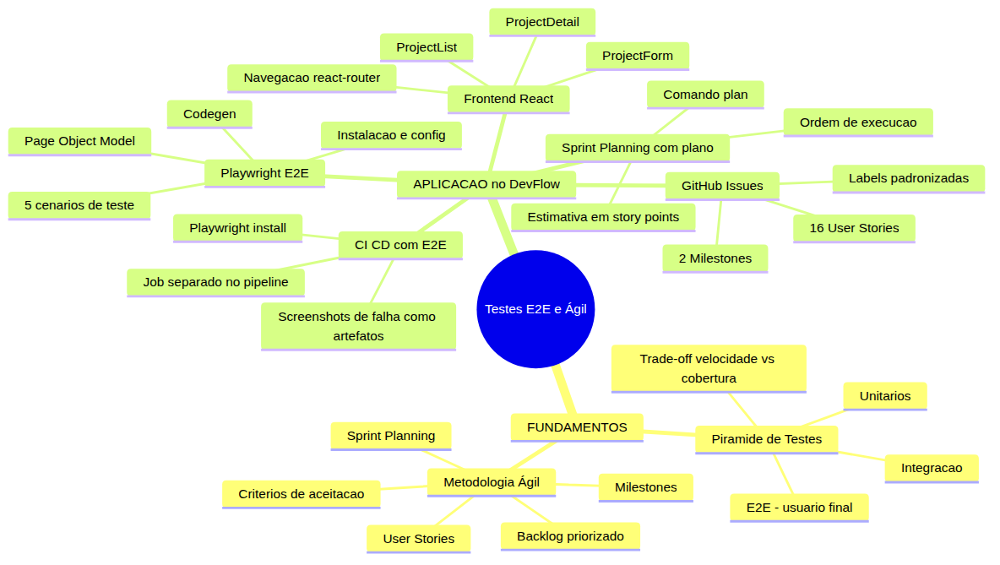
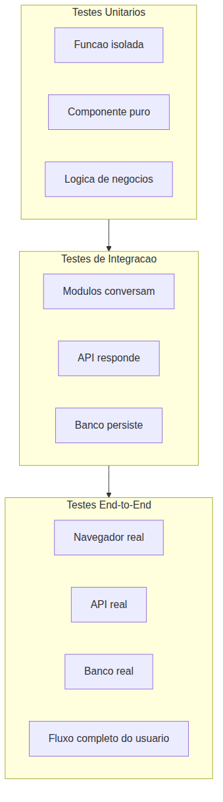
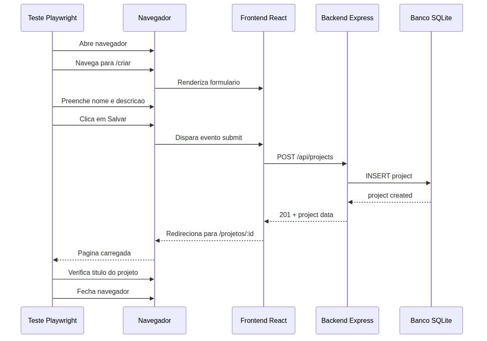
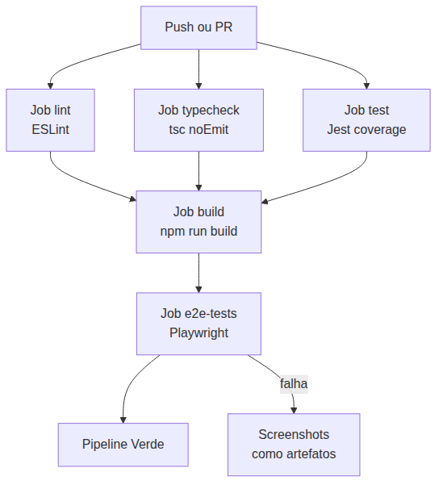

# Programador Profissional com Agentes — Aula 08

## Testes E2E com Playwright + Metodologia Ágil na Prática

**Duração estimada:** 55 minutos (30 de leitura + 25 de prática)

**Nível:** Intermediário

**Pré-requisitos:** Aula 07 concluída — DevFlow com pipeline CI/CD funcional (lint, typecheck, test, build), testes Jest com cobertura >= 80%, backend Express funcional com CRUD de Projetos e Tarefas, `.github/copilot-instructions.md` ativo, Node.js 20+, Git configurado, repositório DevFlow versionado no GitHub

---

## Objetivos de Aprendizagem

Ao final desta aula, você será capaz de:

- [ ] **Explicar** a diferença entre testes unitários, de integração e end-to-end — o que cada nível verifica na pirâmide de testes e quando usar cada um
- [ ] **Definir** o conceito de teste end-to-end (E2E): testar a aplicação completa da perspectiva do usuário final, com navegador real e API real
- [ ] **Explicar** por que testes E2E são o último guardião de qualidade — depois que unitários e integração passam, o E2E prova que o sistema funciona como um todo
- [ ] **Definir** os artefatos essenciais da metodologia ágil: user story (formato "Como [papel], quero [acao] para [beneficio]"), criterios de aceitação, backlog, milestone e sprint
- [ ] **Explicar** como o sprint planning transforma um backlog priorizado em um plano de execução com escopo definido para cada iteração
- [ ] **Criar** um frontend React para o DevFlow — 3 páginas (listar projetos, criar projeto, visualizar tarefas) que consomem a API REST construída nas aulas anteriores
- [ ] **Configurar** Playwright e escrever 5 cenários E2E que validem fluxos completos: criação de projeto, listagem, navegação entre páginas, visualização de tarefas e tratamento de erro
- [ ] **Estruturar** um backlog no GitHub Issues com 2 milestones, user stories no formato correto, labels de prioridade e tipo
- [ ] **Executar** sprint planning assistido com /plan — priorizar issues, estimar esforço e definir o escopo de cada milestone
- [ ] **Integrar** os testes E2E no workflow CI/CD existente do DevFlow como um job adicional que executa após o build

---

## Como Usar Esta Aula

Esta aula está organizada em duas partes. A **primeira parte** constrói os fundamentos universais de testes end-to-end e metodologia ágil — conceitos que valem para qualquer ferramenta ou plataforma. A **segunda parte** aplica esses conceitos na prática: você vai construir o frontend React do DevFlow, testá-lo com Playwright, estruturar o backlog no GitHub Issues e integrar os testes E2E ao pipeline CI/CD existente.

Ao longo do caminho, você encontrará seções **"Mão na Massa"** para fazer junto e **"Quick Check"** para verificar se entendeu antes de avançar. Ao final, o arquivo separado **Questões de Aprendizagem** traz as tarefas de checkpoint — só avance para a próxima aula quando conseguir completá-las por conta própria.

**Tempo estimado:** 30 minutos de leitura + 25 minutos de prática.

---

## Mapa Mental

Este diagrama mostra todos os conceitos que você vai dominar nesta aula:



> *O mapa mental acima mostra a estrutura da aula. Cada ramo representa um conceito que você vai explorar: dos fundamentos teóricos à aplicação prática com frontend React, testes Playwright e backlog ágil no DevFlow.*

---

## Recapitulação das Aulas 01, 02, 03, 04, 05, 06 e 07

| Aula | Conceito | Onde aparece nesta aula | Como se conecta |
|---|---|---|---|
| Aula 01 | **Ambiente profissional** (Seções 1-8) | Seções 3-7 | O repositório DevFlow que você criou agora vai ganhar frontend React |
| Aula 02 | **Instructions permanentes** (Seções 1-3) | Seções 4-6 | As regras do copilot-instructions.md guiam como o Copilot gera componentes e testes |
| Aula 03 | **Agent Mode** (Seções 1-5) | Seções 3-4 | Você vai usar Agent Mode para criar componentes React e cenários Playwright |
| Aula 04 | **ADRs e Handoff** (Seções 5-6) | Seções 5-6 | As decisões de arquitetura do backlog (milestones, prioridades) serão documentadas |
| Aula 05 | **Refatoração e Services** (Seções 4-6) | Seções 3-4 | O frontend consome os services refatorados — código limpo gera API clara |
| Aula 06 | **TDD e Testes** (Seções 1-7) | Seções 1, 4, 7 | Testes E2E complementam os testes unitários e de integração — você aprenderá a diferença |
| Aula 07 | **CI/CD Pipeline** (Seções 1-7) | Seção 7 | O pipeline que você construiu vai ganhar um novo job de testes E2E |

---

**FUNDAMENTOS: Testes End-to-End e Metodologia Ágil**

> *Os conceitos desta seção são universais — valem para qualquer tipo de teste ou método de gerenciamento de projetos, independentemente da ferramenta específica. Você aprenderá o papel dos testes E2E na pirâmide de qualidade e os artefatos essenciais da metodologia ágil. Na segunda parte, você verá como aplicar cada um desses conceitos com ferramentas concretas no seu projeto DevFlow.*

---

## 1. Testes E2E — O Último Guardião da Qualidade

### A pirâmide de testes

Você já conhece testes unitários (Aula 06) — eles provam que uma função isolada funciona. Você também já viu testes de integração — eles provam que duas ou mais partes do sistema conversam entre si. Mas quem prova que o SISTEMA INTEIRO funciona do começo ao fim, exatamente como um usuário usaria?

Essa é a função dos testes **end-to-end** (E2E).

A pirâmide de testes é um modelo clássico que organiza os três níveis de teste pela relação entre velocidade, custo e cobertura:



**Testes unitários** estão na base da pirâmide. São rápidos (milissegundos), baratos de escrever e fáceis de manter. Mas testam apenas uma unidade isolada — não provam que as peças se encaixam.

**Testes de integração** estão no meio. São mais lentos (segundos) e mais caros, mas provam que módulos conversam entre si — que o controller chama o service certo, que o service persiste no banco corretamente.

**Testes E2E** estão no topo. São os mais lentos (minutos), mais caros e mais frágeis. Mas são os únicos que provam que o sistema funciona como um TODO — da interface do usuário ao banco de dados, passando por toda a cadeia de componentes.

### O que um teste E2E verifica

Um teste E2E simula um usuário real interagindo com o sistema:

1. Abre um navegador real (ou simulador de navegador)
2. Navega para uma URL
3. Clica em botões, preenche formulários, lê textos
4. Verifica que o resultado esperado aconteceu na interface

Não é um teste de função. Não é um teste de API. É um teste de **cenário completo** — "o usuário consegue criar um projeto e vê-lo na lista?"

### Características de um bom teste E2E

| Característica | Por que importa |
|---|---|
| **Navegador real** | Só um navegador renderiza CSS, executa JavaScript e simula eventos como um usuário real |
| **Dados reais** | O teste deve conectar ao banco real (ou de teste), não a mocks |
| **Fluxo completo** | Não testa apenas uma tela — testa a jornada do usuário do início ao fim |
| **Asserções visuais** | Verifica se elementos aparecem, se textos estão corretos, se navegação aconteceu |
| **Idempotente** | Mesmo teste executado N vezes deve produzir o mesmo resultado |

### O custo dos testes E2E

Testes E2E têm um custo que você precisa conhecer:

- **Lentos**: cada cenário leva segundos ou minutos (um teste unitário leva milissegundos)
- **Frágeis**: uma mudança no CSS pode quebrar um seletor; uma mudança no layout pode quebrar a navegação
- **Caros**: exigem infraestrutura (navegador, servidor, banco) e manutenção constante

Por isso, a pirâmide de testes tem **poucos testes E2E** no topo. Você não testa cada função com E2E — você testa apenas os **caminhos críticos** do sistema: os fluxos que, se quebrarem, impedem o usuário de usar o produto.

> *Até aqui, você já entendeu o que são testes E2E, onde eles se encaixam na pirâmide e por que são poucos e focados. Isso já é MUITO. Respire. Se algo não ficou claro, pense na analogia: teste unitário é testar se cada peça do motor funciona; teste E2E é dar a partida e dirigir o carro.*

### Quick Check 1

**1. Por que testes unitários, de integração e E2E formam uma piramide e nao uma barra?**
**Resposta:** Porque ha um trade-off entre velocidade e cobertura. Testes unitarios sao muitos, rapidos e baratos (base da piramide). Testes de integracao sao menos, mais lentos e mais caros (meio). Testes E2E sao poucos, lentos e caros (topo). Se fossem uma barra, todos teriam o mesmo volume — mas voce nao testa cada funcao com E2E, seria inviavel.

**2. Um teste E2E passou, mas um teste unitario falhou. Isso e possivel? Por que?**
**Resposta:** Sim, e possivel. O teste E2E testa um fluxo completo e pode nao exercitar exatamente a funcao que falhou no teste unitario. Ou o teste E2E pode estar usando dados diferentes que nao ativam o caminho problematico. Isso mostra por que todos os niveis sao importantes: o E2E passou, mas o unitario revelou um bug que precisa ser corrigido.

---

## 2. Metodologia Ágil — Do Caos ao Backlog Estruturado

### O problema do "vamos fazendo"

Times de desenvolvimento que nao usam metodologia costumam trabalhar assim: alguem pede uma funcionalidade, o desenvolvedor implementa do jeito que acha certo, entrega, e descobre que nao era bem aquilo que o usuario queria. Ou pior: varias funcionalidades sao iniciadas ao mesmo tempo, nenhuma termina, e o backlog vira uma lista infinita de "isso seria legal um dia".

A metodologia agil resolve esse caos com artefatos e rituais que transformam desejos vagos em tarefas concretas, priorizadas e com prazo.

### User Stories — o formato canonico

Uma **user story** e a menor unidade de valor no desenvolvimento agil. E uma descricao simples de uma funcionalidade do ponto de vista do usuario final.

O formato canonico e:

> **Como** [papel do usuario], **quero** [acao desejada] **para** [beneficio esperado]

Exemplo:
- "Como gerente de projetos, quero criar um novo projeto para organizar as tarefas da minha equipe"
- "Como desenvolvedor, quero ver a lista de tarefas de um projeto para saber o que precisa ser feito"

**Por que tres partes?**
- O **papel** define quem pede — evita ambiguidade ("quem vai usar isso?")
- A **acao** define o que precisa ser feito — e o escopo da implementacao
- O **beneficio** explica por que isso importa — ajuda a priorizar e a tomar decisoes de design

### Criterios de aceitacao

Uma user story sozinha ainda e vaga. "Criar um novo projeto" pode significar coisas diferentes para pessoas diferentes. Os **criterios de aceitacao** transformam a story em condicoes verificaveis:

```
Cenario: Criacao de projeto com sucesso
  Dado que o usuario esta na pagina de criar projeto
  Quando ele preenche o nome e a descricao
  E clica em "Salvar"
  Entao o projeto e criado
  E o usuario e redirecionado para a pagina do projeto

Cenario: Criacao com nome vazio
  Dado que o usuario esta na pagina de criar projeto
  Quando ele tenta salvar sem preencher o nome
  Entao uma mensagem de erro e exibida
  E o projeto nao e criado
```

Criterios de aceitacao sao a ponte entre "o que o usuario quer" e "o que o time vai implementar". Eles tambem servem como base para escrever testes.

### Backlog — a lista viva

O **backlog** e uma lista priorizada de tudo que precisa ser feito no produto. Mas nao e uma lista de tarefas comum:

| Lista de tarefas comum | Backlog agil |
|---|---|
| Tarefas nao priorizadas | Topo = maior prioridade |
| Qualquer um adiciona sem criterio | Cada item tem valor de negocio |
| Nao tem estimativa | Itens sao estimados (story points) |
| Nao tem dono | Cada item tem um responsavel |
| Cresce sem controle | Refinado constantemente (grooming) |

O backlog e **vivo** — ele muda conforme o produto evolui, novas necessidades surgem e prioridades se ajustam.

### Milestones — agrupando entregas com valor

Um **milestone** (marco) agrupa um conjunto de user stories que, juntas, entregam um valor de negocio significativo. Um milestone tem:

- **Nome descritivo**: "MVP — CRUD de Projetos com Frontend"
- **Data alvo**: quando o conjunto deve estar completo
- **Lista de issues**: as user stories que compoem o marco

Milestones transformam "vamos fazendo" em "vamos entregar X ate data Y". Eles dao direcao e foco ao time.

### Sprint Planning — do backlog ao plano

**Sprint planning** e o ritual onde o time:
1. Seleciona as issues do topo do backlog (as mais prioritarias)
2. Estima o esforco de cada uma (em story points ou tempo relativo)
3. Define o escopo da iteracao (sprint) — o que cabe no periodo (tipicamente 1-2 semanas)
4. Atribui responsaveis para cada issue

O resultado e um plano de execucao claro: o que sera feito, por quem e em que ordem.

### O papel do assistente de IA no planejamento

Um assistente de IA pode acelerar o planejamento de varias formas:
- Gerar criterios de aceitacao a partir de descricoes vagas
- Sugerir decomposicao de issues grandes em tarefas menores
- Estimar complexidade relativa com base em issues similares
- Identificar dependencias entre issues que o time nao percebeu

Mas a decisao final e sempre do time. O assistente sugere; o time decide.

> *Ate aqui, voce ja entendeu os artefatos essenciais do metodo agil: user stories com criterios de aceitacao, backlog priorizado, milestones com prazo e sprint planning. Isso ja e MUITO. Respire. Na segunda parte, voce vai criar cada um desses artefatos no seu projeto real.*

### Quick Check 2

**1. Qual a diferenca entre um backlog e uma lista de tarefas comum?**
**Resposta:** Um backlog e priorizado (topo = maior valor), cada item tem valor de negocio explicito, e estimado e refinado constantemente. Uma lista de tarefas comum e apenas uma enumeracao sem prioridade, estimativa ou criterio de valor.

**2. Por que o formato de user story inclui explicitamente o papel e o beneficio?**
**Resposta:** O papel evita ambiguidade sobre quem usa a funcionalidade. O beneficio justifica por que a funcionalidade existe — ajuda a priorizar (stories com maior beneficio vao para o topo) e orienta decisoes de design (a implementacao deve maximizar o beneficio descrito).

---

**APLICACAO: Frontend React, Testes E2E e Planejamento Ágil no DevFlow**

> *Agora que voce entende o papel dos testes E2E e os artefatos da metodologia agil, vamos construir o frontend do DevFlow, testa-lo com Playwright e estruturar o backlog no GitHub Issues — tudo com o Copilot como parceiro.*

---

## 3. Frontend React do DevFlow — Da API REST ao Navegador

### Estrutura do frontend

O DevFlow ate agora e um backend Express com API REST. Chegou a hora de dar uma cara para ele. Voce vai criar um frontend React com 3 paginas que consomem a API que voce construiu nas aulas anteriores.

A estrutura do frontend sera:

```
devflow/frontend/
├── src/
│   ├── App.jsx          # Componente principal com rotas
│   ├── ProjectList.jsx  # Pagina 1: lista de projetos
│   ├── ProjectForm.jsx  # Pagina 2: criar projeto
│   └── ProjectDetail.jsx # Pagina 3: detalhes do projeto com tarefas
├── public/
├── package.json
└── ...
```

### Revisao dos endpoints da API

O backend do DevFlow expoe estes endpoints que o frontend vai consumir:

| Metodo | Endpoint | Descricao |
|---|---|---|
| GET | /api/projects | Lista todos os projetos |
| POST | /api/projects | Cria um novo projeto |
| GET | /api/projects/:id | Retorna detalhes de um projeto |
| GET | /api/tasks?projectId=X | Retorna tarefas de um projeto |

### Criando o frontend com Vite

Vamos usar Vite para inicializar o projeto React. Diferente do create-react-app, o Vite e mais rapido e moderno:

```bash
cd devflow
npm create vite@latest frontend -- --template react
cd frontend
npm install
npm install react-router-dom
```

### Configurando proxy para API

Para o frontend se comunicar com o backend sem problemas de CORS, configure um proxy no `vite.config.js`:

```javascript
import { defineConfig } from 'vite';
import react from '@vitejs/plugin-react';

export default defineConfig({
  plugins: [react()],
  server: {
    port: 3001,
    proxy: {
      '/api': {
        target: 'http://localhost:3000',
        changeOrigin: true
      }
    }
  }
});
```

Agora, quando o frontend fizer fetch para `/api/projects`, o Vite redireciona para o backend em `http://localhost:3000/api/projects`.

### Componente ProjectList — Listar Projetos

O primeiro componente lista todos os projetos. Ele precisa tratar tres estados: carregando, vazio e com dados:

```jsx
import { useState, useEffect } from 'react';
import { Link } from 'react-router-dom';

function ProjectList() {
  const [projects, setProjects] = useState([]);
  const [loading, setLoading] = useState(true);
  const [error, setError] = useState(null);

  useEffect(() => {
    fetch('/api/projects')
      .then(res => {
        if (!res.ok) throw new Error('Falha ao carregar projetos');
        return res.json();
      })
      .then(data => {
        setProjects(data);
        setLoading(false);
      })
      .catch(err => {
        setError(err.message);
        setLoading(false);
      });
  }, []);

  if (loading) return <div>Carregando projetos...</div>;
  if (error) return <div>Erro: {error}</div>;
  if (projects.length === 0) return <div>Nenhum projeto encontrado. Crie o primeiro!</div>;

  return (
    <div>
      <h1>Projetos</h1>
      <Link to="/criar">Criar Novo Projeto</Link>
      {projects.map(project => (
        <div key={project.id}>
          <Link to={`/projetos/${project.id}`}>
            <h2>{project.name}</h2>
          </Link>
          <p>{project.description}</p>
        </div>
      ))}
    </div>
  );
}

export default ProjectList;
```

**O que este componente faz:**
1. Ao montar, faz fetch para `/api/projects`
2. Enquanto carrega, exibe "Carregando projetos..."
3. Se a API retorna erro, exibe a mensagem de erro
4. Se a API retorna lista vazia, exibe mensagem de estado vazio
5. Se ha projetos, renderiza cada um como um card clicavel

### Componente ProjectForm — Criar Projeto

O formulario de criacao envia dados para a API via POST e redireciona apos sucesso:

```jsx
import { useState } from 'react';
import { useNavigate } from 'react-router-dom';

function ProjectForm() {
  const [name, setName] = useState('');
  const [description, setDescription] = useState('');
  const [error, setError] = useState(null);
  const navigate = useNavigate();

  const handleSubmit = async (e) => {
    e.preventDefault();
    if (!name.trim()) {
      setError('O nome do projeto e obrigatorio');
      return;
    }

    try {
      const res = await fetch('/api/projects', {
        method: 'POST',
        headers: { 'Content-Type': 'application/json' },
        body: JSON.stringify({ name, description })
      });

      if (!res.ok) throw new Error('Falha ao criar projeto');

      const project = await res.json();
      navigate(`/projetos/${project.id}`);
    } catch (err) {
      setError(err.message);
    }
  };

  return (
    <div>
      <h1>Criar Projeto</h1>
      <form onSubmit={handleSubmit}>
        <div>
          <label>Nome:</label>
          <input
            type="text"
            value={name}
            onChange={e => setName(e.target.value)}
          />
        </div>
        <div>
          <label>Descricao:</label>
          <textarea
            value={description}
            onChange={e => setDescription(e.target.value)}
          />
        </div>
        {error && <div style={{ color: 'red' }}>{error}</div>}
        <button type="submit">Salvar</button>
      </form>
    </div>
  );
}

export default ProjectForm;
```

### Componente ProjectDetail — Detalhes com Tarefas

A pagina de detalhes carrega o projeto e suas tarefas simultaneamente:

```jsx
import { useState, useEffect } from 'react';
import { useParams } from 'react-router-dom';

function ProjectDetail() {
  const { id } = useParams();
  const [project, setProject] = useState(null);
  const [tasks, setTasks] = useState([]);
  const [loading, setLoading] = useState(true);

  useEffect(() => {
    const loadData = async () => {
      try {
        const [projRes, tasksRes] = await Promise.all([
          fetch(`/api/projects/${id}`),
          fetch(`/api/tasks?projectId=${id}`)
        ]);
        const projectData = await projRes.json();
        const tasksData = await tasksRes.json();
        setProject(projectData);
        setTasks(tasksData);
      } catch (err) {
        console.error('Erro ao carregar dados:', err);
      } finally {
        setLoading(false);
      }
    };
    loadData();
  }, [id]);

  if (loading) return <div>Carregando...</div>;
  if (!project) return <div>Projeto nao encontrado</div>;

  return (
    <div>
      <h1>{project.name}</h1>
      <p>{project.description}</p>
      <h2>Tarefas</h2>
      {tasks.length === 0 ? (
        <p>Nenhuma tarefa cadastrada</p>
      ) : (
        <ul>
          {tasks.map(task => (
            <li key={task.id}>{task.title} - {task.status}</li>
          ))}
        </ul>
      )}
    </div>
  );
}

export default ProjectDetail;
```

### App.jsx — Roteamento

O componente principal configura as rotas:

```jsx
import { BrowserRouter, Routes, Route } from 'react-router-dom';
import ProjectList from './ProjectList';
import ProjectForm from './ProjectForm';
import ProjectDetail from './ProjectDetail';

function App() {
  return (
    <BrowserRouter>
      <Routes>
        <Route path="/" element={<ProjectList />} />
        <Route path="/criar" element={<ProjectForm />} />
        <Route path="/projetos/:id" element={<ProjectDetail />} />
      </Routes>
    </BrowserRouter>
  );
}

export default App;
```

### Mao na Massa — Criando o Frontend do DevFlow

**Dificuldade: Media | Duracao: 10 minutos**

- [ ] Navegue ate a pasta raiz do DevFlow: `cd devflow`
- [ ] Inicie o projeto React com Vite: `npm create vite@latest frontend -- --template react`
- [ ] Instale as dependencias: `cd frontend && npm install && npm install react-router-dom`
- [ ] Configure o proxy no `vite.config.js` conforme o exemplo acima
- [ ] Crie os 4 arquivos: `ProjectList.jsx`, `ProjectForm.jsx`, `ProjectDetail.jsx` e atualize `App.jsx`
- [ ] Use o Copilot em Agent Mode: selecione o arquivo e peca "crie um componente React ProjectList que lista projetos consumindo /api/projects com estados de loading, empty e error"
- [ ] Rode o backend em um terminal: na raiz do DevFlow, `npm start` (ou `node src/index.js`)
- [ ] Em outro terminal, rode o frontend: `cd frontend && npm run dev`
- [ ] Abra `http://localhost:3001` e verifique as 3 paginas funcionando

**Verificacao:** Voce deve ver a lista de projetos (mesmo que vazia). Navegue para criar um novo projeto, preencha os campos e salve. O projeto deve aparecer na lista e, ao clicar, mostrar os detalhes com tarefas.

### Quick Check 3

**1. Por que o componente ProjectList precisa tratar os estados de loading e vazio?**
**Resposta:** Porque a API e assincrona — leva tempo para responder. Sem o estado de loading, o usuario ve uma tela branca enquanto aguarda. Sem o estado vazio, o usuario ve uma lista vazia sem saber se e porque nao ha projetos ou se algo quebrou. Tratar estados e parte da experiencia do usuario.

**2. O que acontece se o backend nao estiver rodando quando o frontend tentar buscar projetos?**
**Resposta:** O fetch retorna um erro de rede (network error). O catch no useEffect captura o erro e atualiza o estado de error. O componente renderiza a mensagem de erro em vez da lista de projetos. O usuario ve "Erro: Failed to fetch" ou similar, em vez de uma tela quebrada.

---

## 4. Testes E2E com Playwright — Testando como um Usuario Real

### Por que Playwright?

Playwright e uma ferramenta de automacao de navegador criada pela Microsoft que permite escrever testes que interagem com paginas web exatamente como um usuario faria: clicando, preenchendo formularios, navegando e verificando resultados.

Diferente de ferramentas mais antigas (como Selenium), o Playwright:
- Instala os navegadores automaticamente (Chromium, Firefox, WebKit)
- Espera automaticamente por elementos (nao precisa de `sleep` ou `wait` manuais)
- Gera screenshots e videos das execucoes
- Tem um gerador de codigo chamado Codegen

### Instalacao e configuracao

Na raiz do DevFlow (nao dentro de `frontend/`), instale o Playwright:

```bash
cd devflow
npm init playwright@latest
```

O instalador pergunta algumas coisas:
- **Onde colocar os testes?** — Aceite o padrao `tests/` ou escolha `e2e-tests/`
- **Adicionar GitHub Actions?** — Nao por enquanto (voce ja tem um workflow)
- **Instalar navegadores?** — Sim

Apos a instalacao, a estrutura fica assim:

```
devflow/tests/
├── e2e/           # seus testes E2E
│   ├── example.spec.js  # teste exemplo (pode deletar)
│   └── devflow.spec.js  # seus cenarios
└── playwright.config.ts  # configuracao
```

Configure o `playwright.config.ts`:

```typescript
import { defineConfig } from '@playwright/test';

export default defineConfig({
  testDir: './tests/e2e',
  timeout: 30000,
  retries: 1,
  use: {
    baseURL: 'http://localhost:3001',
    headless: true,
    screenshot: 'only-on-failure',
    video: 'retain-on-failure'
  }
});
```

### O fluxo de um teste E2E



### Os 5 cenarios do DevFlow

Vamos escrever 5 cenarios que validam os fluxos mais importantes do sistema:

```javascript
// tests/e2e/devflow.spec.js
const { test, expect } = require('@playwright/test');

test.describe('DevFlow E2E', () => {

  // Cenário 1: Smoke test
  test('1. Smoke test - pagina inicial carrega', async ({ page }) => {
    await page.goto('/');
    await expect(page).toHaveTitle(/DevFlow/);
    await expect(page.locator('h1')).toContainText('Projetos');
  });

  // Cenário 2: Criar projeto
  test('2. Criar projeto com sucesso', async ({ page }) => {
    await page.goto('/criar');
    await page.fill('input[type="text"]', 'Projeto Teste E2E');
    await page.fill('textarea', 'Descricao do projeto teste');
    await page.click('text=Salvar');

    // Verifica redirecionamento para pagina de detalhes
    await expect(page).toHaveURL(/\/projetos\/\d+/);
    await expect(page.locator('h1')).toContainText('Projeto Teste E2E');
  });

  // Cenário 3: Listar projetos
  test('3. Listar projetos existentes', async ({ page }) => {
    // Primeiro cria um projeto para garantir que existe
    await page.goto('/criar');
    await page.fill('input[type="text"]', 'Projeto para Listagem');
    await page.fill('textarea', 'Descricao');
    await page.click('text=Salvar');

    // Navega para a lista
    await page.goto('/');
    const projectCards = page.locator('h2');
    await expect(projectCards.first()).toContainText('Projeto para Listagem');
  });

  // Cenário 4: Navegar para detalhes
  test('4. Navegar para detalhes do projeto', async ({ page }) => {
    // Cria projeto com tarefa
    await page.goto('/criar');
    await page.fill('input[type="text"]', 'Projeto com Tarefas');
    await page.fill('textarea', 'Descricao');
    await page.click('text=Salvar');
    await expect(page).toHaveURL(/\/projetos\/\d+/);

    // Verifica se a secao de tarefas aparece
    await expect(page.locator('h2')).toContainText('Tarefas');
  });

  // Cenário 5: Tratamento de erro
  test('5. Validacao de formulario - nome vazio', async ({ page }) => {
    await page.goto('/criar');
    await page.click('text=Salvar');

    // Verifica mensagem de erro
    await expect(page.locator('text=O nome do projeto e obrigatorio')).toBeVisible();
  });
});
```

### Playwright Codegen

Uma das ferramentas mais uteis do Playwright e o **Codegen**. Ele grava suas interacoes no navegador e gera o codigo do teste automaticamente:

```bash
npx playwright codegen http://localhost:3001
```

Uma janela do navegador abre. Tudo que voce clicar, digitar e navegar sera traduzido em codigo Playwright na janela ao lado. Voce pode copiar o codigo gerado e adaptar para seus cenarios.

### Copilot gerando cenarios a partir de criterios de aceitacao

Com o Copilot, voce pode transformar criterios de aceitacao diretamente em testes. Por exemplo, peca no Chat:

> "A partir desta user story, gere um teste Playwright:
> Como gerente de projetos, quero criar um novo projeto preenchendo nome e descricao para organizar as tarefas da minha equipe.
> Criterios de aceitacao:
> - Deve ser possivel preencher nome e descricao
> - Ao salvar, o usuario e redirecionado para a pagina do projeto
> - Se o nome estiver vazio, uma mensagem de erro e exibida"

O Copilot gera o cenario completo com base nos criterios.

### Page Object Model simples

Para organizar melhor os testes, voce pode usar o padrao Page Object Model — uma classe que representa uma pagina e expoe metodos para interagir com ela:

```javascript
// tests/e2e/pages/ProjectListPage.js
class ProjectListPage {
  constructor(page) {
    this.page = page;
  }

  async goto() {
    await this.page.goto('/');
  }

  async getProjectNames() {
    return this.page.locator('h2').allTextContents();
  }

  async clickProject(name) {
    await this.page.locator(`text=${name}`).click();
  }
}

module.exports = { ProjectListPage };
```

### Mao na Massa — Configurando Playwright e Escrevendo os 5 Cenarios

**Dificuldade: Media | Duracao: 10 minutos**

- [ ] Instale o Playwright na raiz do DevFlow: `npm init playwright@latest`
- [ ] Aceite as configuracoes padrao (diretorio `tests/`, navegadores instalados)
- [ ] Atualize o `playwright.config.ts` com `baseURL: 'http://localhost:3001'`
- [ ] Crie o arquivo `tests/e2e/devflow.spec.js` com os 5 cenarios acima
- [ ] Rode o backend e o frontend em terminais separados
- [ ] Execute os testes: `npx playwright test`
- [ ] Use o Codegen para gravar um cenario: `npx playwright codegen http://localhost:3001`

**Verificacao:** `npx playwright test` deve mostrar todos os 5 cenarios passando (verdes). Se algum falhar, leia o log — o Playwright mostra exatamente qual assercao falhou e em qual linha.

### Quick Check 4

**1. Por que o Playwright precisa que o servidor (frontend + backend) esteja rodando antes dos testes?**
**Resposta:** Porque testes E2E testam o sistema completo. O Playwright abre um navegador real e acessa a URL do frontend. Se o frontend nao estiver rodando, o navegador nao consegue carregar a pagina. Se o backend nao estiver rodando, o frontend carrega mas as requisicoes a API falham.

**2. Qual a diferenca entre usar page.click('button') e page.click('text=Criar Projeto') em termos de robustez do teste?**
**Resposta:** `page.click('button')` clica no primeiro botao da pagina — se houver mais de um, o teste pode clicar no botao errado. `page.click('text=Criar Projeto')` clica especificamente no elemento que contem o texto "Criar Projeto" — e mais robusto porque o seletor e mais especifico e resiste a mudancas de estrutura (se o botao mudar de `<button>` para `<a>`, o seletor de texto ainda funciona).

---

## 5. Backlog com GitHub Issues — Issues, Labels e Milestones

### GitHub Issues como ferramenta de backlog

O GitHub Issues e a ferramenta nativa do GitHub para gerenciar tarefas. Cada **issue** representa uma unidade de trabalho — pode ser uma user story, um bug, uma melhoria ou uma tarefa tecnica.

Um backlog bem estruturado no GitHub Issues usa tres mecanismos principais:

1. **Issues**: as tarefas individuais
2. **Labels**: categorias para filtrar e organizar (tipo, prioridade, area)
3. **Milestones**: agrupamentos com prazo e progresso

### Template de issue

Cada issue deve seguir um formato padrao para garantir que todas tenham as informacoes necessarias:

```markdown
### Descricao
**Como** [papel], **quero** [acao] **para** [beneficio]

### Criterios de Aceitacao
- [ ] Criterio 1
- [ ] Criterio 2

### Notas Tecnicas
- Informacoes adicionais sobre implementacao
```

### Labels padronizadas

Labels sao essenciais para filtrar e organizar o backlog. Crie estas labels no repositório do DevFlow:

| Label | Cor | Descricao |
|---|---|---|
| `feature` | Verde | Nova funcionalidade |
| `bug` | Vermelha | Correcao de defeito |
| `enhancement` | Azul | Melhoria em funcionalidade existente |
| `frontend` | Roxa | Tarefa do frontend React |
| `backend` | Laranja | Tarefa do backend Express |
| `priority:high` | Vermelha | Deve ser feito com urgencia |
| `priority:medium` | Amarela | Importante, mas pode esperar |
| `priority:low` | Cinza | Faz se sobrar tempo |

**Por que separar labels de tipo e prioridade?** Porque voce pode filtrar combinacoes: "mostre todas as features de prioridade alta no frontend" (feature + priority:high + frontend). Se tudo fosse uma label so, voce teria combinacoes como `feature-frontend-high` — infinitas labels.

### Milestones do DevFlow

O backlog do DevFlow tem 2 milestones, cada um com 8 issues:

**Milestone 1: "MVP — CRUD de Projetos com Frontend"**

| # | Título da Issue | Tipo | Prioridade |
|---|---|---|---|
| 1 | Como gerente, quero ver a lista de projetos para saber o que esta em andamento | feature | high |
| 2 | Como gerente, quero criar um novo projeto para registrar demandas | feature | high |
| 3 | Como gerente, quero ver detalhes de um projeto para acompanhar o progresso | feature | high |
| 4 | Como dev, quero configurar o roteamento entre paginas para navegar no sistema | feature | medium |
| 5 | Como dev, quero escrever testes E2E basicos para garantir que os fluxos principais funcionam | feature | high |
| 6 | Como gerente, quero uma mensagem amigavel quando nao ha projetos cadastrados | enhancement | low |
| 7 | Como dev, quero configurar preview de deploy para testar em ambiente similar a producao | feature | medium |
| 8 | Como gerente, quero uma interface agradavel e responsiva para usar em qualquer dispositivo | enhancement | medium |

**Milestone 2: "Gestao de Tarefas e Dashboard"**

| # | Título da Issue | Tipo | Prioridade |
|---|---|---|---|
| 1 | Como gerente, quero criar tarefas dentro de um projeto para detalhar o que precisa ser feito | feature | high |
| 2 | Como gerente, quero atualizar o status da tarefa para acompanhar o progresso | feature | high |
| 3 | Como dev, quero criar um componente TaskList para exibir as tarefas do projeto | feature | high |
| 4 | Como gerente, quero filtrar tarefas por status para focar no que e importante | feature | medium |
| 5 | Como gerente, quero um dashboard com metricas para ter visao geral do projeto | feature | medium |
| 6 | Como dev, quero integrar tarefas ao projeto para manter a consistencia dos dados | feature | high |
| 7 | Como dev, quero escrever testes E2E para o fluxo de tarefas | feature | medium |
| 8 | Como dev, quero configurar deploy em producao para disponibilizar o sistema ao time | feature | medium |

### Copilot gerando issues

Com o Copilot, voce pode gerar as issues automaticamente. No Chat do Copilot, peca:

> "Gere 8 issues no formato de user story para um milestone de frontend React.
> O milestone se chama 'MVP — CRUD de Projetos com Frontend'.
> O sistema e o DevFlow, um gerenciador de projetos dev.
> Inclua criterios de aceitacao para cada issue."

O Copilot gera as issues completas — voce copia e cola no GitHub.

### Mao na Massa — Estruturando o Backlog do DevFlow

**Dificuldade: Media | Duracao: 10 minutos**

- [ ] Abra seu repositório do DevFlow no GitHub
- [ ] Vá ate a aba "Issues" e clique em "Milestones"
- [ ] Crie 2 milestones: "MVP — CRUD de Projetos com Frontend" e "Gestao de Tarefas e Dashboard"
- [ ] Defina uma data alvo para cada milestone (ex: 2 semanas para o primeiro, 4 semanas para o segundo)
- [ ] Vá ate "Labels" e crie as 8 labels padronizadas (feature, bug, enhancement, frontend, backend, priority:high, priority:medium, priority:low)
- [ ] Use o Copilot para gerar as 16 issues e cole cada uma como uma nova issue no GitHub
- [ ] Para cada issue, adicione as labels de tipo e prioridade correspondentes
- [ ] Atribua cada issue ao milestone correspondente

**Verificacao:** A aba "Issues" deve mostrar 16 issues. Cada milestone mostra o progresso (quantas issues estao abertas/fechadas). As labels filtram corretamente (clique em uma label e veja apenas as issues daquela categoria).

### Quick Check 5

**1. Por que separar labels de tipo (feature, bug) de labels de prioridade (priority:high)?**
**Resposta:** Porque sao dimensoes ortogonais. Uma feature pode ser de prioridade alta, media ou baixa — assim como um bug. Com labels separadas, voce pode combinar filtros: "mostre todos os bugs de prioridade alta". Se fossem combinadas, voce teria labels como `bug-high`, `bug-medium`, `feature-high` — duplicacao e menos flexivel.

**2. Uma issue no Milestone 1 depende de codigo que so sera implementado no Milestone 2. Isso e um problema? Como resolver?**
**Resposta:** Sim, e um problema de dependencia entre milestones. A solucao e mover a issue para o milestone correto ou reavaliar a divisao dos milestones. Se a issue so pode ser implementada apos o codigo do Milestone 2, ela pertence ao Milestone 2 (ou a um milestone posterior). Milestones devem ser independentes entre si.

---

## 6. Sprint Planning com /plan — Do Backlog ao Plano de Execucao

### O comando /plan

O comando `/plan` e uma ferramenta do Copilot no Chat que ajuda a transformar um backlog em um plano de execucao. Quando invocado, ele:

1. Le as issues do milestone ativo (ou do contexto que voce fornecer)
2. Analisa dependencias entre as issues
3. Sugere uma ordem de implementacao
4. Estima complexidade (story points: 1, 2, 3, 5, 8)
5. Propoe uma distribuicao por sprint

### Preparacao

Antes de usar o `/plan`, voce precisa:

1. Ter o backlog populado com issues no GitHub (voce acabou de criar)
2. Ter as issues organizadas em milestones
3. Ter o contexto do projeto claro — o Copilot precisa entender o que ja foi construido

### Fluxo do sprint planning com /plan

No Chat do Copilot, digite:

```
/plan para o milestone "MVP — CRUD de Projetos com Frontend" do DevFlow
```

O Copilot analisa as 8 issues do milestone e retorna algo como:

```
## Plano Sugerido para o Milestone: MVP — CRUD de Projetos com Frontend

### Ordem de Implementacao

1. [Story Points: 3] Configurar roteamento React (dependencia base)
2. [Story Points: 5] Componente ProjectList com fetch da API
3. [Story Points: 5] Componente ProjectForm com validacao
4. [Story Points: 3] Componente ProjectDetail com tarefas
5. [Story Points: 3] Testes E2E basicos
6. [Story Points: 2] Estados vazios e mensagens amigaveis
7. [Story Points: 5] Preview de deploy
8. [Story Points: 3] Interface responsiva e UX

### Estimativas
- Total: 29 story points
- Sprint recomendada: 2 semanas
- Capacidade estimada: 15-20 pontos/sprint
- Duração estimada: 2 sprints

### Riscos Identificados
- Roteamento depende de decisoes de arquitetura (definir estrutura de paginas antes)
- Testes E2E dependem dos componentes prontos (devem ser os ultimos)
- Preview de deploy requer configuracao externa (pode ser paralelizado)
```

### Interpretando a saida do /plan

A saida do `/plan` nao e uma verdade absoluta — e uma sugestao. Voce deve analisar:

1. **Ordem sugerida**: faz sentido para o seu contexto? Tem dependencias que voce conhece que o agente nao capturou?
2. **Estimativas**: os story points parecem razoaveis? Voce ja implementou componentes similares e sabe que um e mais complexo que o outro?
3. **Riscos**: o agente identificou riscos reais? Perdeu algum?

### Ajustando o plano

Digamos que o `/plan` sugeriu fazer os testes E2E antes do preview de deploy. Voce discorda — o preview de deploy e mais simples e pode ser feito em paralelo. Voce ajusta:

1. Move "Preview de deploy" para depois dos componentes (posicao 5)
2. Move "Testes E2E" para a posicao 6 (a frente de preview)
3. Re-estima: preview e 2 pontos, nao 5

O plano final e uma **decisao do time**. O `/plan` sugere; voce decide.

### Do plano a acao

Com o plano definido, cada issue priorizada vira uma tarefa executada em Agent Mode:

1. Peca ao Copilot: "Implemente a issue 1: configurar roteamento React"
2. Aguarde o Agent Mode concluir
3. Teste o resultado
4. Peca a proxima issue
5. A cada conclusao, feche a issue no GitHub com um comentario sobre o que foi feito

### Quick Check 6

**1. O /plan sugeriu uma ordem diferente da que voce imaginava. Voce deve segui-la cegamente ou questionar? Por que?**
**Resposta:** Questionar. O /plan e uma ferramenta de sugestao baseada na analise do backlog, mas o time tem conhecimento de dominio que o agente nao tem — restricoes tecnicas, dividas tecnicas, preferencias do time, prazos externos. O plano gerado e um ponto de partida para discussao, nao uma ordem.

**2. Por que estimar em story points (complexidade relativa) em vez de horas?**
**Resposta:** Porque horas sao afetadas por interrupcoes, reunioes, cansaco e habilidades individuais. Story points medem complexidade relativa entre tarefas — "esta issue e o dobro de complexa que esta outra". Isso permite que o time melhore a estimativa ao longo do tempo sem se prender a metricas de "horas reais vs horas estimadas".

---

## 7. Testes E2E no Pipeline CI/CD — O Guardiao Final

### Revisao do pipeline existente

Na Aula 07, voce construiu um pipeline CI/CD com 4 jobs:

```
lint → typecheck → test → build
```

Agora voce vai adicionar um quinto job: `e2e-tests`. Este job executa os testes Playwright apos o build, validando que nao apenas o codigo compila e os testes unitarios passam, mas que o sistema completo funciona.

### Por que E2E como job separado

O job de testes E2E e separado por tres razoes:

1. **Dependencias**: precisa do build concluido (para ter o frontend compilado) e do servidor rodando
2. **Tempo**: testes E2E sao mais lentos — nao querem atrasar jobs mais rapidos como lint
3. **Fragilidade**: testes E2E sao mais propensos a falhas intermitentes — um job separado permite reexecuta-los sem reexecutar o pipeline inteiro

### Fluxo do pipeline completo



### Configuracao do job E2E

Adicione este job ao seu `ci.yml` existente:

```yaml
  e2e-tests:
    name: E2E Tests
    runs-on: ubuntu-latest
    needs: [build]
    steps:
      - uses: actions/checkout@v4
      - uses: actions/setup-node@v4
        with:
          node-version: '20'
          cache: 'npm'
      - run: npm ci
      - run: npx playwright install --with-deps
      - name: Start backend
        run: |
          npm start &
          npx wait-on http://localhost:3000/api/projects
      - name: Start frontend
        working-directory: ./frontend
        run: |
          npm run build
          npm run preview &
          npx wait-on http://localhost:3001
      - run: npx playwright test
      - uses: actions/upload-artifact@v4
        if: failure()
        with:
          name: playwright-screenshots
          path: test-results/
```

### Entendendo cada passo

| Passo | O que faz |
|---|---|
| `checkout` | Baixa o codigo do repositorio |
| `setup-node` | Configura Node.js 20 com cache |
| `npm ci` | Instala dependencias |
| `npx playwright install --with-deps` | Instala os navegadores Playwright e dependencias de sistema |
| `npm start &` | Inicia o backend em background |
| `npx wait-on http://localhost:3000` | Aguarda o backend responder antes de prosseguir |
| `npm run build && npm run preview &` | Compila o frontend e inicia servidor de preview |
| `npx playwright test` | Executa os 5 cenarios E2E |
| `upload-artifact if: failure()` | Salva screenshots e videos se algum teste falhar |

### Estrategias para execucao de E2E

Nem todo push precisa executar testes E2E. Como eles sao mais lentos e caros, uma estrategia comum e executa-los apenas em condicoes especificas:

```yaml
on:
  push:
    branches: [main]
  pull_request:
    branches: [main]
```

Assim, os E2E rodam em:
- Push para `main` (codigo pronto para entrar em producao)
- Pull requests para `main` (codigo sendo revisado)

Em branches de feature intermediarios, apenas lint, test e build executam — feedback mais rapido.

### Diagnosticando falhas no CI

Quando um teste E2E falha no CI, o Playwright gera automaticamente:
- **Screenshot** do estado da pagina no momento da falha
- **Video** da execucao completa (se configurado)
- **Trace** com o log de todas as acoes e chamadas de rede

Esses artefatos sao salvos pelo `upload-artifact` e ficam disponiveis na aba "Actions" do GitHub. Para baixar:

1. Abra o workflow que falhou
2. Clique no job `e2e-tests`
3. Na seção "Artifacts", clique em "playwright-screenshots"
4. Baixe o arquivo ZIP

Se um teste passa localmente mas falha no CI, as causas mais comuns sao:

| Causa | Solucao |
|---|---|
| Timeout muito curto para o CI (maquina mais lenta) | Aumentar `timeout` no playwright.config.ts |
| Porta diferente no CI | Usar `baseURL` configurado via `process.env.BASE_URL` |
| Dados de teste que ja existem localmente mas nao no CI | Garantir que o teste cria seus proprios dados |
| Diferenca de versao do navegador | Usar `npx playwright install` para garantir versao correta |

### Mao na Massa — Adicionando E2E ao Pipeline

**Dificuldade: Dificil | Duracao: 8 minutos**

- [ ] Abra o arquivo `.github/workflows/ci.yml` do DevFlow
- [ ] Adicione o job `e2e-tests` conforme o exemplo acima
- [ ] O job deve depender de `build` e executar apos ele
- [ ] Faca commit e push:
```bash
git add .github/workflows/ci.yml
git commit -m "feat: adiciona job de testes E2E com Playwright ao pipeline"
git push origin main
```
- [ ] Abra a aba "Actions" e verifique que o workflow executa com 5 jobs
- [ ] Confirme que o job `e2e-tests` executa apos o `build` e fica verde

**Verificacao:** O pipeline mostra 5 jobs (lint, typecheck, test, build, e2e-tests). O job e2e-tests comeca apenas apos o build terminar. Todos os 5 jobs ficam verdes.

### Quick Check 7

**1. Por que o job E2E precisa esperar o build concluir antes de executar?**
**Resposta:** Porque o job E2E precisa do frontend compilado para testar. O build gera os arquivos estaticos que o servidor de preview vai servir. Sem o build concluido, nao ha frontend para testar. Alem disso, o build ja validou que o codigo compila — o E2E testa se o sistema completo funciona.

**2. Se um teste E2E falha no CI mas passa localmente, quais sao as causas mais provaveis?**
**Resposta:** (1) Timeout — o CI e mais lento que a maquina local, aumente o timeout. (2) Dados — localmente o banco tem dados que o CI nao tem, o teste deve criar seus proprios dados. (3) Portas — o servidor pode estar em porta diferente no CI, use `baseURL` configurado por variavel de ambiente. (4) Versao do navegador — o CI pode ter versao diferente, use `npx playwright install` para garantir.

---

## Autoavaliacao: Quiz Rapido

**1. Qual a diferenca entre um teste unitario, um teste de integracao e um teste E2E?**
**Resposta:**

Teste unitario verifica uma funcao ou componente isolado, sem dependencias externas. Teste de integracao verifica se dois ou mais modulos conversam entre si (ex: controller + service + banco). Teste E2E verifica o sistema completo do ponto de vista do usuario, com navegador real, API real e banco real.

**2. O que e uma user story e quais sao as tres partes do seu formato canonico?**
**Resposta:**

User story e a menor unidade de valor no desenvolvimento agil. O formato canonico tem tres partes: "Como [papel], quero [acao] para [beneficio]". O papel define quem usa, a acao define o escopo, o beneficio justifica a prioridade.

**3. Por que o componente ProjectList precisa tratar os estados de loading, empty e error?**
**Resposta:**

Porque a API e assincrona. Sem loading, o usuario ve tela branca enquanto carrega. Sem empty, o usuario nao sabe se a lista vazia e normal ou se algo quebrou. Sem error, falhas de rede passam despercebidas. Tratar os tres estados e essencial para a experiencia do usuario.

**4. O que o comando /plan faz no contexto de sprint planning?**
**Resposta:**

O /plan le as issues de um milestone, analisa dependencias, sugere ordem de implementacao, estima complexidade em story points (1, 2, 3, 5, 8) e propoe distribuicao por sprint. E uma ferramenta de sugestao — o time decide o plano final.

**5. O que e necessario configurar no pipeline CI/CD para executar testes E2E com Playwright?**
**Resposta:**

(1) Instalar Playwright com `npx playwright install --with-deps`. (2) Iniciar o servidor (backend + frontend) em background. (3) Usar `wait-on` para aguardar os servidores responderem. (4) Executar `npx playwright test`. (5) Opcional: configurar `upload-artifact` para salvar screenshots em caso de falha.

---

## Mao na Massa N: Exercicios Graduados

**Exercicio 1 (Facil) — Smoke Test com Playwright**

Escreva um teste Playwright que:
1. Acesse a pagina inicial do DevFlow (`/`)
2. Verifique que o titulo da pagina contem "DevFlow"
3. Verifique que existe um link ou botao com o texto "Criar Novo Projeto"

**Gabarito:**

```javascript
test('Smoke test - pagina inicial', async ({ page }) => {
  await page.goto('/');
  await expect(page).toHaveTitle(/DevFlow/);
  await expect(page.locator('text=Criar Novo Projeto')).toBeVisible();
});
```

**Exercicio 2 (Medio) — User Stories e Cenario E2E**

Parte A: Escreva 3 user stories completas para as seguintes funcionalidades do DevFlow:
1. Visualizar tarefas de um projeto
2. Atualizar o status de uma tarefa (pendente → em andamento → concluida)
3. Excluir um projeto

Parte B: Escolha UMA das user stories acima e escreva um teste Playwright que valide a funcionalidade.

**Gabarito:**

Parte A:

1. "Como gerente de projetos, quero visualizar as tarefas de um projeto para saber o que precisa ser feito."
2. "Como desenvolvedor, quero atualizar o status de uma tarefa para refletir meu progresso no trabalho."
3. "Como gerente de projetos, quero excluir um projeto que nao e mais relevante para manter o backlog organizado."

Parte B (para a user story 1):

```javascript
test('Visualizar tarefas de um projeto', async ({ page }) => {
  // Cria um projeto primeiro
  await page.goto('/criar');
  await page.fill('input[type="text"]', 'Projeto com Tarefas');
  await page.fill('textarea', 'Testando visualizacao de tarefas');
  await page.click('text=Salvar');
  await expect(page).toHaveURL(/\/projetos\/\d+/);

  // Verifica que a secao de tarefas existe
  await expect(page.locator('h2')).toContainText('Tarefas');
  await expect(page.locator('text=Nenhuma tarefa cadastrada')).toBeVisible();
});
```

**Desafio (Dificil) — Ciclo Completo: /plan + Implementacao + Teste E2E + Pipeline**

Complete o ciclo completo de desenvolvimento agil:

1. Execute `/plan` para o Milestone 2 do DevFlow ("Gestao de Tarefas e Dashboard")
2. Documente a ordem sugerida e os story points estimados
3. Implemente a primeira issue do plano (criar componente TaskList)
4. Escreva um teste E2E para a funcionalidade implementada
5. Execute os testes localmente e verifique que passam
6. Faca commit e push — verifique que o pipeline CI/CD executa o job E2E

**Gabarito:**

Passo 1 — Execute o /plan no Chat do Copilot:
```
/plan para o milestone "Gestao de Tarefas e Dashboard" do DevFlow
```

Passo 2 — Documente a saida. Exemplo de saida esperada:
```
Ordem sugerida:
1. [SP: 5] Componente TaskList
2. [SP: 5] Componente TaskForm
3. [SP: 3] Atualizar status da tarefa
4. [SP: 3] Filtros de busca
5. [SP: 8] Dashboard com metricas
6. [SP: 3] Integracao Task-Project
7. [SP: 5] Testes E2E de tarefas
8. [SP: 5] Deploy producao
Total: 37 story points
```

Passo 3 — Implemente o TaskList usando Agent Mode:
```
Agent Mode: "Crie um componente React TaskList que recebe um array de tarefas e renderiza cada uma com titulo e status. O componente deve aceitar uma prop onStatusChange para atualizar o status."
```

Passo 4 — Teste E2E para TaskList:
```javascript
test('Criar projeto com tarefas e listar', async ({ page }) => {
  await page.goto('/criar');
  await page.fill('input[type="text"]', 'Projeto Final');
  await page.fill('textarea', 'Testando o ciclo completo');
  await page.click('text=Salvar');
  await expect(page).toHaveURL(/\/projetos\/\d+/);

  // Verifica que a pagina de detalhes mostra o titulo do projeto
  await expect(page.locator('h1')).toContainText('Projeto Final');
});
```

Passo 5 — Execute localmente:
```bash
npx playwright test
```

Passo 6 — Commit, push e verifique o pipeline:
```bash
git add .
git commit -m "feat: adiciona TaskList e testes E2E"
git push origin main
```

Verifique na aba "Actions" que todos os 5 jobs (incluindo e2e-tests) ficam verdes.

---

## Resumo da Aula

### Os 10 Conceitos Fundamentais

1. **Piramide de testes**: unitarios (base, muitos, rapidos), integracao (meio, moderados), E2E (topo, poucos, lentos). Cada nivel cobre o que o anterior nao cobre.

2. **Testes E2E**: testam o sistema completo do ponto de vista do usuario final — navegador real, API real, banco real. Sao o ultimo guardiao de qualidade.

3. **User stories**: formato "Como [papel], quero [acao] para [beneficio]". Cada parte tem uma funcao: quem usa, o que fazer, por que importa.

4. **Criterios de aceitacao**: condicoes verificaveis que transformam uma user story vaga em requisitos testaveis. Servem de base para testes.

5. **Backlog**: lista priorizada de tudo que precisa ser feito. Diferente de lista de tarefas porque e priorizada, estimada e refinada constantemente.

6. **Milestones**: agrupamentos de issues com prazo e valor de negocio. Transformam "vamos fazendo" em entregas com data.

7. **Sprint planning**: ritual onde o time seleciona issues do backlog, estima esforco e define o escopo da iteracao. O /plan acelera esse processo.

8. **Playwright**: ferramenta de automacao de navegador para testes E2E. Instala navegadores, interage com paginas e gera screenshots/videos.

9. **Backlog no GitHub Issues**: usa issues (tarefas), labels (categorias) e milestones (agrupamentos). Labels separam tipo de prioridade para filtros flexiveis.

10. **E2E no pipeline CI/CD**: job separado que executa apos o build, instala Playwright, inicia servidores e executa testes. Screenshots de falha sao artefatos.

### O Que Voce Construiu Hoje

- [x] Frontend React do DevFlow com 3 paginas (ProjectList, ProjectForm, ProjectDetail)
- [x] 5 cenarios E2E com Playwright (smoke test, criar projeto, listar, navegar, validacao de erro)
- [x] Backlog no GitHub Issues com 2 milestones e 16 user stories
- [x] Labels padronizadas (feature, bug, enhancement, frontend, backend, prioridades)
- [x] Sprint planning executado com /plan
- [x] Pipeline CI/CD com job E2E integrado

---

## Proxima Aula

**Aula 09: Skills de Documentacao Viva — O Conhecimento Que o Copilot Carrega Sob Demanda**

Voce construiu o frontend, os testes E2E e o backlog agil. Agora o DevFlow esta funcional, testado e organizado. Na proxima aula, voce vai aprender a criar skills que permitem ao Copilot consultar documentacao oficial de bibliotecas (React, Express, MUI) sem sair do editor — eliminando alucinacoes de API e tornando o codigo sempre baseado em documentacao atualizada. O conhecimento que hoje esta na sua cabeca ou em abas do navegador vai virar conhecimento vivo que o Copilot carrega sob demanda.

---

## Referencias

### Documentacao Oficial

- [Playwright — Introducao](https://playwright.dev/docs/intro) — primeiros passos, instalacao, primeiros testes
- [Playwright — Locators](https://playwright.dev/docs/locators) — como selecionar elementos na pagina
- [React — Documentacao](https://react.dev/learn) — componentes, hooks, estado
- [React Router](https://reactrouter.com/en/main) — roteamento no React
- [GitHub Issues — Documentacao](https://docs.github.com/en/issues) — criando e gerenciando issues
- [GitHub Milestones](https://docs.github.com/en/issues/using-labels-and-milestones-to-track-work/about-milestones) — sobre milestones
- [Scrum Guide 2020](https://scrumguides.org/scrum-guide.html) — o guia oficial do Scrum

### Ferramentas

- [Vite](https://vitejs.dev/) — build tool para frontend React
- [Playwright Codegen](https://playwright.dev/docs/codegen) — gravador de testes
- [wait-on](https://www.npmjs.com/package/wait-on) — aguarda recursos ficarem disponiveis

### Artigos para Aprofundamento

- [The Practical Test Pyramid](https://martinfowler.com/articles/practical-test-pyramid.html) — Martin Fowler sobre a piramide de testes
- [User Stories e Criterios de Aceitacao](https://www.atlassian.com/agile/project-management/user-stories) — guia da Atlassian
- [Playwright vs Selenium](https://playwright.dev/docs/selenium-grid) — comparativo oficial

---

## FAQ

**P: Preciso saber React para fazer esta aula?**
R: Conhecimento basico de React e util, mas nao obrigatorio. A aula ensina cada componente passo a passo e voce usa o Copilot para gerar a maior parte do codigo. Se nunca usou React, recomendamos ler a documentacao oficial de primeiros passos antes.

**P: Posso usar create-react-app em vez de Vite?**
R: Sim, mas Vite e recomendado por ser mais rapido e moderno. O react-router-dom funciona igual em ambos. Se preferir CRA, use `npx create-react-app frontend` e ajuste o proxy no `package.json` com `"proxy": "http://localhost:3000"`.

**P: O Playwright e so para React? Funciona com outros frameworks?**
R: Funciona com QUALQUER aplicacao web — React, Vue, Angular, HTML puro, etc. Playwright interage com o navegador, nao com o framework. O que importa e que a aplicacao rode em uma URL acessivel.

**P: Quantos testes E2E devo escrever para meu projeto?**
R: A regra pratica e: 1 cenario E2E para cada fluxo critico do usuario. Para o DevFlow, os 5 cenarios que escrevemos cobrem os caminhos principais. Nao escreva E2E para cada detalhe — use testes unitarios para isso.

**P: O que e um falso positivo em testes E2E?**
R: Um teste que falha por razoes que nao sao bugs no codigo — exemplo: o servidor estava lento e o timeout foi atingido, um seletor CSS mudou sem alterar a funcionalidade, o navegador apresentou um erro intermitente. Falsos positivos sao comuns em E2E e uma das razoes para mante-los em numero reduzido.

**P: O comando /plan funciona sem o GitHub MCP configurado?**
R: Sim, o /plan e uma ferramenta nativa do Copilot no Chat. Voce nao precisa configurar MCP para usa-lo. O Copilot le as issues do contexto que voce fornecer — seja do GitHub, seja digitando manualmente o backlog.

**P: Preciso criar as 16 issues manualmente ou o Copilot cria para mim?**
R: O Copilot gera o texto das issues. Voce copia e cola no GitHub. Mas a criacao das issues no repositorio (abrir cada uma, preencher, adicionar labels) e manual. Em aulas futuras, voce aprendera formas de automatizar esse processo.

**P: Meu teste E2E passa localmente mas falha no CI. O que fazer?**
R: As causas mais comuns sao: (1) timeout menor no CI — aumente de 30s para 60s. (2) Porta diferente — verifique se o servidor esta na porta 3001 no CI. (3) Dados de teste — o CI comeca com banco vazio; seu teste precisa criar os dados que usa. (4) Verifique os screenshots gerados na aba "Actions" para ver o estado da pagina no momento da falha.

---

## Glossario

| Termo | Definicao |
|---|---|
| **Backlog** | Lista priorizada de todas as funcionalidades, melhorias e correcoes planejadas para um produto (Ver secao 2) |
| **Codegen** | Ferramenta do Playwright que grava interacoes no navegador e gera codigo de teste automaticamente (Ver secao 4) |
| **Criterio de aceitacao** | Condicao verificavel que define quando uma user story esta completa (Ver secao 2) |
| **E2E (End-to-End)** | Teste que valida o sistema completo do ponto de vista do usuario final — navegador, API e banco reais (Ver secao 1) |
| **Label** | Marcador de categorizacao no GitHub Issues para filtrar e organizar tarefas (Ver secao 5) |
| **Milestone** | Marco que agrupa issues com prazo e valor de negocios definidos (Ver secoes 2 e 5) |
| **Page Object Model** | Padrao de design para organizar testes E2E, representando cada pagina como uma classe (Ver secao 4) |
| **Piramide de testes** | Modelo que organiza testes em camadas: unitarios (base), integracao (meio), E2E (topo) (Ver secao 1) |
| **Playwright** | Ferramenta de automacao de navegador para testes E2E, criada pela Microsoft (Ver secao 4) |
| **Sprint** | Iteracao de trabalho com duracao fixa (tipicamente 1-2 semanas) que entrega um conjunto de funcionalidades (Ver secao 6) |
| **Sprint planning** | Reuniao onde o time seleciona e estima as issues do backlog para a sprint (Ver secao 6) |
| **Story point** | Unidade relativa de medida de complexidade de uma issue (1, 2, 3, 5, 8) (Ver secao 6) |
| **User story** | Descricao simples de uma funcionalidade no formato "Como [papel], quero [acao] para [beneficio]" (Ver secao 2) |
| **Vite** | Build tool moderna para projetos frontend, mais rapida que create-react-app (Ver secao 3) |
