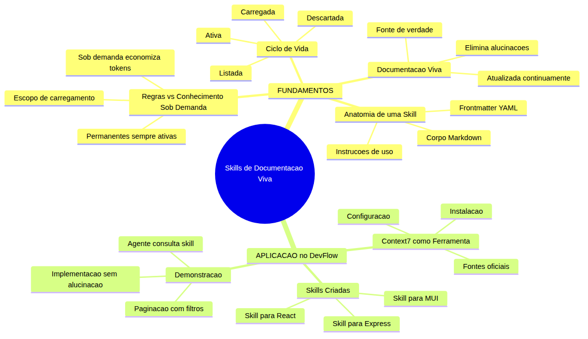

# Programador Profissional com Agentes — Aula 09

## Skills de Documentação Viva — O Conhecimento Que o Copilot Carrega Sob Demanda

**Duração estimada:** 50 minutos (30 de leitura + 20 de prática)

**Nível:** Intermediário

**Pré-requisitos:** Aula 08 concluída — DevFlow com frontend React funcional, 5 cenários Playwright E2E, backlog estruturado com 2 milestones no GitHub Issues, pipeline CI/CD com job de testes E2E

---

## Objetivos de Aprendizagem

Ao final desta aula, você será capaz de:

- [ ] **Diferenciar** regras permanentes de conhecimento injetável — o que cada um resolve, quando usar e o custo de tokens envolvido
- [ ] **Definir** o ciclo de vida de uma skill: listada, carregada, ativa e descartada
- [ ] **Explicar** o conceito de documentação viva como fonte de verdade que o assistente consulta sob demanda
- [ ] **Identificar** a anatomia de um arquivo de skill: frontmatter YAML, corpo markdown e instruções de uso
- [ ] **Criar** arquivos SKILL.md para documentação de bibliotecas no diretório `.github/skills/` do projeto
- [ ] **Configurar** uma ferramenta de consulta de documentação oficial como fonte de conhecimento para o assistente
- [ ] **Aplicar** skills de documentação para implementar funcionalidades sem alucinações de API
- [ ] **Decidir** quando criar uma skill versus quando manter o conhecimento em regras permanentes

---

## Como Usar Esta Aula

Esta aula está organizada em duas partes. A **primeira parte** constrói os fundamentos universais de conhecimento injetável — a diferença entre regras que carregam sempre e conhecimento que só chega quando solicitado, a anatomia dos arquivos de skill, seu ciclo de vida e o conceito de documentação viva. A **segunda parte** aplica esses conceitos na prática: você vai configurar uma ferramenta de consulta de documentação oficial, criar skills para as bibliotecas que seu projeto usa (React, Express e MUI) e implementar uma funcionalidade complexa usando as skills como referência.

Ao longo do caminho, você encontrará seções **"Mão na Massa"** para fazer junto e **"Quick Check"** para verificar se entendeu antes de avançar. Ao final, o arquivo separado **Questões de Aprendizagem** traz as tarefas de checkpoint — só avance para a próxima aula quando conseguir completá-las por conta própria.

**Tempo estimado:** 30 minutos de leitura + 20 minutos de prática.

---

## Mapa Mental

Este diagrama mostra todos os conceitos que você vai dominar nesta aula:



> *O mapa mental acima mostra a estrutura da aula. Cada ramo representa um conceito que você vai explorar: dos fundamentos teóricos sobre conhecimento injetável à aplicação prática com skills de documentação no DevFlow.*

---

## Recapitulação das Aulas 01, 02, 03, 04, 05, 06, 07 e 08

| Aula | Conceito | Onde aparece nesta aula | Como se conecta |
|---|---|---|---|
| Aula 01 | **Ambiente profissional** (Seções 1-8) | Seções 5-7 | O repositório DevFlow agora ganha um diretório de skills — extensão do ambiente configurado |
| Aula 02 | **Instructions permanentes** (Seções 1-3) | Seções 1-4 | Regras permanentes vs skills sob demanda: você aprenderá a diferença fundamental entre os dois tipos de conhecimento |
| Aula 03 | **Agent Mode** (Seções 1-5) | Seções 5-7 | O agente autônomo agora consulta skills como fonte de documentação — mais preciso e sem alucinações |
| Aula 04 | **ADRs e Handoff** (Seções 5-6) | Seções 2-4 | Skills são uma forma de conhecimento versionado — como ADRs, mas para documentação de bibliotecas |
| Aula 05 | **Código Limpo** (Seções 4-6) | Seções 6-7 | Skills bem escritas seguem os mesmos princípios de código limpo: concisas, focadas, com propósito único |
| Aula 06 | **TDD e Testes** (Seções 1-7) | Seção 7 | Skills de documentação ajudam o agente a escrever testes com APIs corretas, sem inventar métodos |
| Aula 07 | **CI/CD Pipeline** (Seções 1-7) | Seções 5-6 | Skills versionadas no repositório passam pelo mesmo pipeline de qualidade que o código |
| Aula 08 | **Frontend React + E2E** (Seções 3-7) | Seções 5-7 | O frontend React do DevFlow ganha skills de documentação — o agente consulta as mesmas APIs que você usou |

---

**FUNDAMENTOS: Conhecimento Injetável e Ciclo de Vida de Skills**

> *Os conceitos desta seção são universais — valem para qualquer sistema de assistência de código, independentemente da ferramenta específica. Você aprenderá a diferença entre regras permanentes e conhecimento sob demanda, a anatomia de um arquivo de skill, seu ciclo de vida e o conceito de documentação viva. Na segunda parte, você verá como criar skills concretas no seu projeto DevFlow usando ferramentas de documentação oficial.*

---

## 1. Regras Permanentes vs Conhecimento Sob Demanda

### O problema do conhecimento que nunca muda

Na Aula 02, você criou regras permanentes que o assistente carrega em toda sessão: stack do projeto, estilo de código, convenções de commit, templates de PR. Essas regras são como a **constituição do time** — o que vale sempre, para qualquer conversa.

Mas existe outro tipo de conhecimento que seu assistente precisa: a documentação das bibliotecas que você usa. Saber como funciona um hook de estado em uma biblioteca de interface, como configurar rotas em um framework de servidor, como usar componentes de uma biblioteca de UI. Esse conhecimento **muda** — bibliotecas lançam novas versões, métodos são deprecados, novas APIs surgem.

Colocar documentação de bibliotecas nas regras permanentes é um erro por duas razões:

1. **Custo de tokens**: regras permanentes são carregadas em TODAS as sessões, mesmo quando você não está usando aquela biblioteca. Cada linha paga em tokens consumidos.
2. **Atualização**: a documentação muda. Suas regras permanentes ficariam desatualizadas até você lembrar de revisá-las.

### Conhecimento sob demanda

Skills resolvem esse problema com **carregamento sob demanda**. Em vez de carregar tudo o tempo todo, o conhecimento fica disponível em um catálogo e só entra no contexto quando o assistente ou o desenvolvedor o solicita.

A analogia é uma **biblioteca vs um bolso**: regras permanentes são o que você carrega no bolso o tempo todo (chaves, carteira). Skills são os livros na estante — você só pega quando precisa.

### Quando usar cada um

| Tipo | Carregamento | Ideal para | Custo |
|---|---|---|---|
| Regras permanentes | Sempre, em toda sessão | Stack, estilo, convenções, segurança | Paga tokens mesmo sem usar |
| Skills (conhecimento sob demanda) | Quando solicitado | Documentação de APIs, exemplos de código, guias de uso | Paga tokens só quando ativada |

### A regra de ouro

Coloque em regras permanentes o que **não muda** sobre o seu time. Coloque em skills o que **muda frequentemente** ou o que **só é relevante em contextos específicos**.

> *Respire. Até aqui você entendeu a diferença entre regras que carregam sempre e conhecimento que chega sob demanda. Esse é o conceito mais importante da aula — dominá-lo define se suas skills serão ferramentas poderosas ou arquivos abandonados.*

### Quick Check 1

**1. Por que colocar documentacao de bibliotecas em regras permanentes e um erro?**
**Resposta:** Por dois motivos. Primeiro, custo de tokens — regras permanentes sao carregadas em toda sessao, mesmo quando voce nao esta usando aquela biblioteca. Segundo, desatualizacao — bibliotecas mudam, e regras permanentes ficam obsoletas ate voce revisa-las manualmente.

**2. Qual analogia melhor descreve a diferenca entre regras permanentes e skills: mapa na parede vs bussola no bolso, ou livros na estante vs chaves no bolso?**
**Resposta:** Livros na estante vs chaves no bolso. Regras permanentes sao o que voce carrega sempre (chaves no bolso). Skills sao conhecimento disponivel que voce consulta quando precisa (pegar um livro da estante). A bussola no bolso tambem carrega sempre — seria regra permanente.

---

## 2. Anatomia de uma Skill — O Que É um Arquivo de Conhecimento

### A estrutura básica

Uma skill é, em sua essência, um **arquivo markdown com metadados** que descreve um conjunto de conhecimento que o assistente pode carregar sob demanda. O formato combina um cabeçalho descritivo (metadados) com o conteúdo instrucional (o conhecimento em si).

A estrutura genérica é:

```yaml
---
name: nome-da-skill
description: Descricao clara do que esta skill oferece, em ate 200 caracteres
---
# Titulo da Skill

Conteudo do conhecimento.

## Subtitulo

Topicos e exemplos.
```

### O frontmatter — a identidade da skill

O **frontmatter** é o bloco YAML entre `---` no início do arquivo. Ele contém os metadados que identificam a skill e descrevem seu propósito:

| Campo | Obrigatório? | O que faz |
|---|---|---|
| `name` | Sim | Nome único da skill (ex: `docs-biblioteca-interface`, `docs-framework-servidor`) |
| `description` | Sim | Descrição curta que o assistente usa para decidir se deve carregar esta skill |
| Outros campos | Não | Depende da ferramenta — algumas aceitam `version`, `author`, `tags` |

O `name` é o identificador que o assistente usa para referenciar a skill. Deve ser curto, descritivo e sem espaços. O `description` é o **resumo que aparece no catálogo** — o assistente leu este texto para decidir se a skill é relevante para a tarefa atual.

### O corpo — o conhecimento em si

Abaixo do frontmatter vem o conteúdo da skill. Aqui você coloca:

1. **Documentação de APIs**: parâmetros, retornos, exemplos de uso
2. **Padrões de código**: como implementar algo específico do seu domínio
3. **Exemplos práticos**: trechos de código que o assistente pode usar como referência
4. **Regras de domínio**: conhecimento específico que o assistente não aprendeu durante o treinamento

O corpo segue a mesma sintaxe markdown que você já conhece: títulos, parágrafos, listas, blocos de código, tabelas.

### Onde as skills vivem

As skills ficam em um diretório dedicado dentro do repositório do projeto. Esse diretório funciona como um **catálogo de conhecimento** — tudo que está lá está disponível para o assistente consultar, nada que está fora está acessível.

### Erro comum

**Erro:** criar uma skill sem frontmatter ou com frontmatter incompleto.

```yaml
---
# ERRADO: sem name nem description
---
Conteudo sobre biblioteca de interface
```

O assistente não consegue catalogar esta skill. Ela fica invisível no catálogo — existe no arquivo mas nunca é carregada porque o sistema não sabe o que ela contém.

**Correto:**

```yaml
---
name: docs-biblioteca-interface
description: Documentacao oficial de biblioteca de interface sobre hooks, componentes e gerenciamento de estado
---
Conteudo da documentacao
```

### Quick Check 2

**1. Qual o papel do campo `description` no frontmatter de uma skill?**
**Resposta:** O description e o resumo que aparece no catalogo de skills. O assistente le este texto para decidir se a skill e relevante para a tarefa atual. Uma descricao clara e essencial para que o assistente carregue a skill certa no momento certo.

**2. O que acontece com uma skill que tem frontmatter vazio ou ausente?**
**Resposta:** A skill fica invisivel no catalogo. O arquivo existe no diretorio de skills, mas o sistema nao consegue cataloga-lo porque nao sabe seu nome nem seu proposito. A skill nunca e carregada pelo assistente, mesmo quando seria util para a tarefa.

---

## 3. Ciclo de Vida da Skill — Listada, Carregada, Ativa, Descartada

### Os quatro estados

Uma skill não fica "ligada" o tempo todo. Ela passa por quatro estados ao longo de seu ciclo de vida dentro de uma sessão de desenvolvimento:

### Listada

A skill existe no diretório de skills e aparece no catálogo. O assistente sabe que ela existe, sabe seu nome e sua descrição (graças ao frontmatter), mas **não leu o conteúdo ainda**. Neste estado, a skill não consome tokens de contexto — apenas o frontmatter ocupa espaço no catálogo.

**Analogia:** o título do livro na estante. Você sabe que ele existe e do que se trata, mas não abriu ainda.

### Carregada

O assistente decidiu que esta skill é relevante para a tarefa atual e **leu o conteúdo** para o contexto. Agora a skill inteira está disponível para o modelo usar como referência. O custo de tokens foi pago: cada linha do corpo da skill entrou no contexto.

**Como o assistente decide carregar?**
- Pela descrição: se a tarefa menciona algo que corresponde à descrição da skill
- Por solicitação explícita: se você pedir "carregue a skill de documentação de interface"
- Por inferência de contexto: se o assistente identifica que a tarefa envolve aquela biblioteca

### Ativa

A skill carregada está sendo **usada ativamente** pelo modelo para gerar código ou responder perguntas. O assistente consulta o conteúdo, extrai exemplos, verifica parâmetros de API. Neste estado, a skill está fazendo seu trabalho — fornecendo conhecimento preciso para a tarefa.

### Descartada

O assistente concluiu a tarefa ou o contexto ficou muito grande. A skill é **removida do contexto ativo** mas permanece no catálogo. O conhecimento não está mais disponível para consulta imediata, mas pode ser carregado novamente se necessário.

### Por que o ciclo de vida importa

Entender este ciclo é fundamental por uma razão prática: **gestão de tokens**. Skills são eficientes justamente porque só consomem tokens no estado "carregada" e "ativa". Se você criar skills muito grandes (dezenas de páginas), o custo de carregá-las será alto. Skills devem ser **concisas e focadas**.

| Estado | Tokens consumidos | O que acontece |
|---|---|---|
| Listada | Apenas frontmatter (nome + descrição) | Skill visível no catálogo, conteúdo não carregado |
| Carregada | Conteúdo completo da skill | Conteúdo lido no contexto do assistente |
| Ativa | Conteúdo completo + tokens de raciocínio | Assistente consulta e usa o conhecimento |
| Descartada | Zero (remoção do contexto) | Skill volta ao catálogo, disponível para recarregar |

> *Até aqui, você já entendeu os quatro estados do ciclo de vida de uma skill. Isso é o suficiente para entender como o sistema gerencia conhecimento. Na prática, você não controla cada estado manualmente — o assistente gerencia isso automaticamente com base na descrição da skill e na tarefa atual.*

### Quick Check 3

**1. Em que estado uma skill consome mais tokens: listada ou carregada?**
**Resposta:** Carregada. No estado listada, apenas o frontmatter (nome e descricao) consome tokens. No estado carregada, o conteudo completo da skill e lido no contexto — cada linha paga em tokens. Por isso skills devem ser concisas e focadas.

**2. O que faz uma skill transitar do estado listada para o estado carregada?**
**Resposta:** O assistente decide carregar a skill quando identifica que ela e relevante para a tarefa atual. Isso pode acontecer por correspondencia entre a descricao da skill e o contexto da tarefa, por solicitacao explicita do desenvolvedor, ou por inferencia de que a skill e necessaria para o que esta sendo pedido.

---

## 4. Documentação Viva — A Fonte de Verdade do Desenvolvedor

### O problema da documentação paralela

Antes das skills, como um assistente de código obtinha informações sobre bibliotecas? Existem três abordagens, e todas têm problemas:

1. **Conhecimento do treinamento**: o modelo foi treinado com dados até uma certa data. Se a biblioteca lançou uma versão nova depois, o modelo não sabe — e **alucina** métodos que não existem.
2. **Descrições em regras permanentes**: você coloca um resumo no arquivo de instruções. O resumo é limitado, desatualizado rapidamente e paga tokens em toda sessão.
3. **Pesquisa manual**: você abre a documentação no navegador, le, volta para o editor. Isso quebra o fluxo de desenvolvimento.

### Documentação viva

**Documentação viva** é o conceito de manter o conhecimento técnico atualizado dentro do ecossistema de desenvolvimento, onde o assistente pode consultá-lo sem sair do editor. Em vez de o modelo depender do que aprendeu durante o treinamento, ele consulta a fonte oficial atualizada.

O ciclo funciona assim:

```
[Documentação oficial da biblioteca]
    ↓ consulta automatizada
    ↓ a cada execução
[Assistente recebe a documentação atualizada]
    ↓ aplica no contexto do projeto
[Código gerado com APIs corretas]
```

### Por que "viva"?

Porque o conhecimento não é estático. Uma skill de documentação é atualizada sempre que:

- A biblioteca lança uma nova versão com novas APIs
- O time adota novos padrões de código
- Um padrão anterior é deprecado

A skill encapsula a **fonte de verdade** do time para aquele domínio — não a opinião de um desenvolvedor específico, não um tutorial de blog que pode estar desatualizado, mas o conhecimento acordado pelo time como correto.

### O que muda com documentação viva

Antes de skills de documentação viva:

> Desenvolvedor: "Assistente, crie um componente com paginação."
> Assistente: **gera código usando uma API que foi deprecada na versão 18 da biblioteca.**
> Desenvolvedor: "Isso não compila. A API mudou."

Depois de skills de documentação viva:

> Desenvolvedor: "Assistente, crie um componente com paginação usando a skill de documentação da biblioteca."
> Assistente: **Carrega a skill → consulta a documentação oficial atualizada → gera código com a API correta.**

A diferença é que o assistente não depende do que "lembra" — ele consulta a fonte.

### Quick Check 4

**1. O que significa "alucinacao" no contexto de assistentes de codigo?**
**Resposta:** Alucinacao e quando o assistente inventa metodos, parametros ou APIs que nao existem na biblioteca real. Isso acontece porque o modelo tenta preencher lacunas de conhecimento com informacoes que parecem plausiveis mas sao incorretas. Skills de documentacao eliminam esse problema fornecendo a fonte oficial atualizada.

**2. Por que o termo "documentacao viva" em vez de simplesmente "documentacao"?**
**Resposta:** Porque a documentacao nao e estatica — ela evolui com as bibliotecas e com o time. "Viva" significa que esta ativamente atualizada, que reflete a versao corrente das APIs e as convencoes atuais do time, e que o assistente a consulta em tempo real em vez de depender de conhecimento congelado no treinamento.

---

**APLICAÇÃO: Skills de Documentação Viva no Projeto DevFlow**

> *Agora que você entende os conceitos de conhecimento injetável, ciclo de vida de skills e documentação viva, vamos aplicá-los no DevFlow. Você vai configurar uma ferramenta de consulta de documentação oficial, criar skills para as bibliotecas que seu projeto usa (React, Express e MUI) e implementar uma funcionalidade complexa usando apenas as skills como referência.*

---

## 5. Context7 — Documentação Oficial como Ferramenta do Agente

### O que é o Context7

**Context7** é uma ferramenta que conecta assistentes de código à documentação oficial de bibliotecas e frameworks. Em vez de o assistente adivinhar APIs baseado no treinamento, ele consulta a documentação real, atualizada, e retorna informações precisas.

O Context7 funciona em três etapas:

1. **Resolve o nome da biblioteca**: você pergunta sobre "React" e o Context7 encontra a documentação oficial do React no repositório de bibliotecas
2. **Consulta a documentação**: o Context7 busca na documentação oficial a resposta para sua pergunta
3. **Retorna o resultado**: o assistente recebe o trecho de documentação relevante e usa para gerar código

### Por que Context7 e não pesquisa web?

Pesquisa web em assistentes de código traz problemas: resultados inconsistentes, conteúdo de blogs não oficiais, páginas que mudam de URL. O Context7 consulta **fontes oficiais** — a documentação mantida pelos próprios criadores da biblioteca.

### Instalação

O Context7 se integra ao ecossistema de ferramentas do assistente via configuração. Para conectar:

```bash
npm install @context7/cli
```

Após a instalação, a ferramenta fica disponível como uma fonte oficial que o assistente pode consultar.

### Como o assistente usa o Context7

Quando o assistente precisa de documentação sobre uma biblioteca, ele:

1. **Resolve o ID da biblioteca**: identifica qual biblioteca está sendo consultada (ex: `/react/react` para React, `/expressjs/express` para Express)
2. **Envia a consulta**: pergunta específica sobre a API (ex: "How to create a paginated list with useState and useEffect")
3. **Recebe a resposta**: retorna o trecho de documentação oficial mais relevante
4. **Aplica ao código**: usa a documentação recebida para gerar código correto

### Mão na Massa — Instalando e Configurando o Context7

**Dificuldade: Fácil | Duração: 5 minutos**

- [ ] Na raiz do DevFlow, instale o Context7:
```bash
cd devflow
npm install @context7/cli
```
- [ ] Verifique a instalação:
```bash
npx context7 --help
```
- [ ] Teste a consulta a uma biblioteca:
```bash
npx context7 resolve "React"
```
- [ ] Confirme que o Context7 retorna o ID correto da biblioteca React: `/react/react`

**Verificação:** O comando `npx context7 --help` mostra a lista de comandos disponíveis. O comando `npx context7 resolve "React"` retorna o ID da biblioteca React e sua descrição oficial.

### Quick Check 5

**1. Qual a diferenca entre o Context7 consultar a documentacao oficial e o assistente usar conhecimento do treinamento?**
**Resposta:** O conhecimento do treinamento esta congelado na data em que o modelo foi treinado — APIs novas ou alteradas sao desconhecidas. O Context7 consulta a documentacao oficial em tempo real, sempre atualizada. O resultado e codigo que usa as APIs corretas da versao atual da biblioteca, sem alucinacoes.

**2. O que acontece se o Context7 nao encontrar a biblioteca que voce consultou?**
**Resposta:** O Context7 retorna uma lista de bibliotecas similares ou informa que nao encontrou correspondencia. Nesse caso, voce pode tentar um nome alternativo para a biblioteca ou verificar se ela esta no catalogo de bibliotecas suportadas pelo Context7.

---

## 6. Criando Skills no DevFlow — React, Express e MUI

### A estrutura de diretórios

As skills do projeto ficam em `.github/skills/` dentro da raiz do repositório. Cada skill é um arquivo `.md` em seu próprio subdiretório:

```
devflow/.github/skills/
├── react-docs/
│   └── SKILL.md
├── express-docs/
│   └── SKILL.md
└── mui-docs/
    └── SKILL.md
```

O nome do subdiretório e o nome do arquivo (SKILL.md) são padronizados — o assistente procura por arquivos chamados `SKILL.md` dentro de `.github/skills/`.

### Skill para React

A skill de React deve conter a documentação essencial que o assistente precisa para implementar componentes no DevFlow: hooks mais usados, padrões de componente, JSX e gerenciamento de estado.

Crie o arquivo `.github/skills/react-docs/SKILL.md`:

```yaml
---
name: react-docs
description: Official React documentation for hooks, components, JSX, and state management patterns used in DevFlow
---
# React Documentation

React is a JavaScript library for building user interfaces.

## Hooks

- **useState**: manages state in functional components
  - `const [state, setState] = useState(initialValue)`
  - setState triggers re-render
  - State can be any type: string, number, object, array
- **useEffect**: handles side effects
  - `useEffect(() => { /* effect */ }, [dependencies])`
  - Empty deps array: runs once on mount
  - Return function: cleanup on unmount
- **useContext**: consumes React context
  - `const value = useContext(MyContext)`
- **useRef**: creates mutable references
  - `const ref = useRef(initialValue)`
  - ref.current persists across renders without causing re-render

## Components

- Functional component: `function Component(props) { return JSX; }`
- Props are read-only
- State changes trigger re-render of the component and its children
- Conditional rendering: `{condition && <Element />}` or `{condition ? <A /> : <B />}`
- Lists: `{items.map(item => <Item key={item.id} />)}`

## JSX

- JavaScript XML syntax extension
- `{expression}` for JavaScript expressions inside JSX
- `className` instead of `class`
- Self-closing tags: `<Component />`
- Event handlers: `onClick`, `onChange`, `onSubmit`

## State Management

- Lift state up to the nearest common ancestor
- Callback pattern: parent passes a setter function to child
- Context API for global state across multiple components
```

### Skill para Express

A skill de Express deve cobrir rotas, middleware, tratamento de requisições e respostas — o essencial para manter e evoluir o backend do DevFlow.

Crie o arquivo `.github/skills/express-docs/SKILL.md`:

```yaml
---
name: express-docs
description: Official Express.js documentation for routing, middleware, request handling, and error management in DevFlow
---
# Express.js Documentation

Express is a fast, unopinionated, minimalist web framework for Node.js.

## Basic Server

- `import express from 'express'`
- `const app = express()`
- `app.listen(PORT, callback)`
- `app.use(express.json())` for JSON body parsing

## Routing

- `app.get('/path', handler)` — GET requests
- `app.post('/path', handler)` — POST requests
- `app.put('/path/:id', handler)` — PUT requests
- `app.delete('/path/:id', handler)` — DELETE requests
- Route parameters: `req.params.id`
- Query parameters: `req.query`
- Request body: `req.body`

## Middleware

- `express.json()` - parses incoming JSON requests
- `express.static('public')` - serves static files
- Custom middleware: `(req, res, next) => { /* logic */ next() }`
- Error middleware: `(err, req, res, next) => { /* handle error */ }`
- Middleware runs in the order it is registered with `app.use()`

## Response Methods

- `res.json(data)` — sends JSON response
- `res.status(code)` — sets HTTP status code
- `res.send(data)` — sends various response types
- `res.redirect(url)` — redirects client
- `res.status(404).json({ error: 'Not found' })` — chained status with JSON

## Error Handling

- Wrap async handlers in try-catch
- Pass errors to error middleware: `next(error)`
- Error middleware signature: `(err, req, res, next) => {}`
```

### Skill para MUI (Material UI)

A skill de MUI cobre os componentes de interface que o DevFlow usa ou pode vir a usar: botões, cartões, tabelas, grid de layout e formulários.

Crie o arquivo `.github/skills/mui-docs/SKILL.md`:

```yaml
---
name: mui-docs
description: Official Material UI documentation for components, theming, layout, and customization patterns used in DevFlow
---
# Material UI Documentation

MUI is a comprehensive component library for React implementing Material Design.

## Core Components

- **Button**: `<Button variant="contained" color="primary">Click</Button>`
- **TextField**: `<TextField label="Name" variant="outlined" fullWidth />`
- **Card**: `<Card><CardContent><Typography>text</Typography></CardContent></Card>`
- **AppBar**: `<AppBar position="static"><Toolbar><Typography>Title</Typography></Toolbar></AppBar>`
- **Typography**: `<Typography variant="h4">Heading</Typography>`
- **Table**: `<Table><TableHead><TableRow><TableCell>Header</TableCell></TableRow></TableHead><TableBody>...</TableBody></Table>`

## Layout

- **Container**: centers content horizontally with max-width
- **Grid**: 12-column grid system, `<Grid container spacing={2}><Grid item xs={6}>...</Grid></Grid>`
- **Box**: utility component for CSS with `sx` prop
- **Stack**: one-dimensional layout with spacing

## Theming

- `createTheme()` creates a custom theme object
- `ThemeProvider` applies the theme to all child components
- Custom palette: `{ palette: { primary: { main: '#1976d2' } } }`
- The `sx` prop accepts all CSS properties as a JavaScript object

## Forms

- TextField supports: `value`, `onChange`, `error`, `helperText`
- Validation patterns: check value, set error state, display helperText
- Form submission: `onSubmit` handler on the `<form>` element

## Props Pattern

- `sx` prop for inline CSS: `sx={{ marginTop: 2, display: 'flex' }}`
- `component` prop changes the rendered HTML element
- Spacing units: 1 = 8px, 2 = 16px, 3 = 24px, etc.
```

### Mão na Massa — Criando as 3 Skills de Documentação

**Dificuldade: Médio | Duração: 10 minutos**

- [ ] Crie a estrutura de diretórios:
```bash
mkdir -p devflow/.github/skills/react-docs
mkdir -p devflow/.github/skills/express-docs
mkdir -p devflow/.github/skills/mui-docs
```
- [ ] Crie o arquivo `devflow/.github/skills/react-docs/SKILL.md` com o conteúdo da skill React
- [ ] Crie o arquivo `devflow/.github/skills/express-docs/SKILL.md` com o conteúdo da skill Express
- [ ] Crie o arquivo `devflow/.github/skills/mui-docs/SKILL.md` com o conteúdo da skill MUI
- [ ] Use o assistente para criar os arquivos: em Agent Mode, peça "Crie os 3 arquivos SKILL.md em `.github/skills/` seguindo o formato com frontmatter e conteúdo de documentação oficial para React, Express e MUI"
- [ ] Verifique a estrutura:
```bash
ls -R devflow/.github/skills/
```

**Verificação:** O comando `ls -R devflow/.github/skills/` mostra 3 subdiretórios, cada um com seu `SKILL.md`. Cada arquivo tem frontmatter YAML válido com `name` e `description`.

### Erro comum: skill com corpo muito grande

**Erro:** copiar a documentação inteira de uma biblioteca para dentro da skill.

```markdown
---
name: react-docs
description: Full React documentation
---
# React Documentation - Complete Reference

(Páginas e páginas de documentação copiada do site oficial)
```

**Por que é um erro:** skills grandes consomem muitos tokens quando carregadas. Se a documentação completa do React (que tem milhares de páginas) coubesse em uma skill, ela ocuparia todo o contexto disponível — e não sobraria espaço para o código.

**Como fazer certo:** extraia apenas o que é relevante para o seu projeto. Se o DevFlow usa `useState`, `useEffect`, componentes funcionais e JSX, a skill deve cobrir apenas esses tópicos. Se amanhã o projeto adotar `useReducer`, você adiciona à skill.

### Quick Check 6

**1. Por que cada skill fica em um subdiretorio separado (react-docs, express-docs, mui-docs) em vez de tudo em um unico arquivo?**
**Resposta:** Porque o ciclo de vida da skill funciona por arquivo. Se tudo estiver em um arquivo, o assistente carrega a documentacao de React, Express e MUI toda vez que qualquer uma delas for solicitada — desperdicio de tokens. Skills separadas permitem carregar apenas o conhecimento necessario para a tarefa atual.

**2. O que deve guiar a escolha do que incluir em uma skill de documentacao?**
**Resposta:** O uso real do projeto. A skill deve conter apenas as APIs e padroes que o projeto efetivamente usa. Se o DevFlow usa useState e useEffect, a skill cobre esses hooks. Se nao usa useReducer, nao inclui. Isso mantem a skill concisa, focada e eficiente em tokens.

---

## 7. Demonstração — Paginação com Filtros Usando Skills

### A funcionalidade

O DevFlow tem uma lista de projetos. Conforme o time cresce, a lista fica longa. Vamos implementar **paginação com filtros**: o usuário pode buscar projetos por nome e navegar entre páginas de resultados.

### O que a skill de React contém que ajuda

A skill de React que você criou tem a documentação de:
- `useState` para gerenciar estado da página atual e termo de busca
- `useEffect` para disparar a requisição à API quando os filtros mudam
- Componentes funcionais com props e renderização condicional
- Padrão de callback para passar dados entre componentes

Em vez de o assistente adivinhar como implementar paginação no React, ele consulta a skill e usa a documentação oficial como guia.

### O fluxo com skills

```
1. Voce pede: "Implemente paginacao com filtro por nome na lista de projetos,
   usando a skill de documentacao do React como referencia"
2. Assistente carrega a skill react-docs (transicao: listada -> carregada)
3. Consulta a documentacao de useState e useEffect na skill
4. Usa os exemplos da skill para implementar o componente
5. Gera codigo correto, com as APIs certas, sem alucinacao
```

### O que o assistente gera

Com base na skill de React, o assistente implementa:

```jsx
import { useState, useEffect } from 'react';
import { Link } from 'react-router-dom';

function ProjectList() {
  const [projects, setProjects] = useState([]);
  const [loading, setLoading] = useState(true);
  const [error, setError] = useState(null);
  const [searchTerm, setSearchTerm] = useState('');
  const [page, setPage] = useState(1);
  const [totalPages, setTotalPages] = useState(1);
  const limit = 5;

  useEffect(() => {
    const fetchProjects = async () => {
      setLoading(true);
      try {
        const params = new URLSearchParams({
          page: page.toString(),
          limit: limit.toString(),
          search: searchTerm
        });
        const res = await fetch(`/api/projects?${params}`);
        if (!res.ok) throw new Error('Falha ao carregar projetos');
        const data = await res.json();
        setProjects(data.projects);
        setTotalPages(data.totalPages);
      } catch (err) {
        setError(err.message);
      } finally {
        setLoading(false);
      }
    };
    fetchProjects();
  }, [page, searchTerm]);

  if (loading) return <div>Carregando projetos...</div>;
  if (error) return <div>Erro: {error}</div>;

  return (
    <div>
      <h1>Projetos</h1>
      <input
        type="text"
        placeholder="Buscar projetos..."
        value={searchTerm}
        onChange={e => { setSearchTerm(e.target.value); setPage(1); }}
      />
      <Link to="/criar">Criar Novo Projeto</Link>
      {projects.length === 0 ? (
        <div>Nenhum projeto encontrado.</div>
      ) : (
        projects.map(project => (
          <div key={project.id}>
            <Link to={`/projetos/${project.id}`}>
              <h2>{project.name}</h2>
            </Link>
            <p>{project.description}</p>
          </div>
        ))
      )}
      <div>
        <button onClick={() => setPage(p => Math.max(1, p - 1))}
          disabled={page === 1}>Anterior</button>
        <span>Pagina {page} de {totalPages}</span>
        <button onClick={() => setPage(p => Math.min(totalPages, p + 1))}
          disabled={page === totalPages}>Proxima</button>
      </div>
    </div>
  );
}

export default ProjectList;
```

Observe que o `useState` e `useEffect` usados no componente seguem exatamente a documentação da skill: `useState(initialValue)` retorna estado e setter, `useEffect` com array de dependências para recarregar quando `page` ou `searchTerm` mudam.

### A diferença que a skill faz

Sem a skill, o assistente poderia:
- Usar `componentDidMount` (API antiga de classes, não funciona em componentes funcionais)
- Esquecer de incluir `searchTerm` no array de dependências do `useEffect`
- Usar padrão incorreto de callback para mudança de página

Com a skill, cada um desses pontos é coberto pela documentação oficial no contexto.

### Mão na Massa — Implementando Paginação com Filtros

**Dificuldade: Médio | Duração: 8 minutos**

- [ ] Abra o componente `ProjectList.jsx` no frontend do DevFlow
- [ ] No Chat do assistente, peça:
> "Usando a skill de documentacao do React como referencia, adicione paginacao com filtro por nome no componente ProjectList. Cada pagina deve mostrar 5 projetos. Inclua campo de busca que filtra em tempo real e botoes de navegacao entre paginas."
- [ ] Verifique que o assistente carregou a skill `react-docs` e consultou a documentação de `useState` e `useEffect`
- [ ] Teste a funcionalidade: abra `http://localhost:3001`, digite um termo no campo de busca, navegue entre páginas
- [ ] Se não houver projetos suficientes para testar paginação, crie 10+ projetos via Agent Mode
- [ ] Verifique que o backend aceita os parâmetros `page`, `limit` e `search` na rota `GET /api/projects`

**Verificação:** A lista de projetos mostra no máximo 5 itens por página. O campo de busca filtra os projetos pelo nome. Os botões "Anterior" e "Proxima" navegam entre as páginas. O assistente usou a skill de documentação como referência — nenhuma API inventada.

### Quick Check 7

**1. Como a skill de React ajuda o assistente a implementar a paginacao corretamente?**
**Resposta:** A skill fornece a documentacao oficial dos hooks useState e useEffect, incluindo a sintaxe exata e os padroes de uso. O assistente consulta a skill e ve que useState(initialValue) retorna estado e setter, e que useEffect com array de dependencias controla quando o efeito executa. Assim ele implementa o componente usando as APIs corretas, sem alucinar metodos que nao existem.

**2. O que aconteceria se a skill de React nao existisse e o assistente tentasse implementar a paginacao so com conhecimento do treinamento?**
**Resposta:** O assistente poderia gerar codigo com APIs desatualizadas ou incorretas. Por exemplo, usar this.setState de componentes de classe em vez de useState, ou esquecer o array de dependencias no useEffect, causando loop infinito de requisicoes. O codigo pareceria correto mas teria bugs sutis que so apareceriam em execucao.

---

## Autoavaliação: Quiz Rápido

**1. Qual a diferenca fundamental entre regras permanentes e skills?**
**Resposta:**

Regras permanentes sao carregadas em toda sessao, custam tokens mesmo quando o assunto nao as utiliza, e sao ideais para convencoes que nao mudam (stack, estilo). Skills sao carregadas sob demanda, custam tokens apenas quando ativadas, e sao ideais para conhecimento que muda ou e relevante apenas em contextos especificos (documentacao de APIs).

**2. Quais sao os quatro estados do ciclo de vida de uma skill?**
**Resposta:**

Listada (skill existe no catalogo, frontmatter visivel), Carregada (conteudo lido no contexto do assistente), Ativa (conteudo sendo usado para gerar codigo), Descartada (conteudo removido do contexto, mas skill permanece no catalogo).

**3. O que e uma alucinacao de API e como skills de documentacao previnem esse problema?**
**Resposta:**

Alucinacao de API e quando o assistente inventa um metodo, parametro ou comportamento que nao existe na biblioteca real, porque esta preenchendo lacunas de conhecimento. Skills de documentacao previnem isso fornecendo a fonte oficial atualizada — o assistente consulta o conhecimento real em vez de depender de memorizacao do treinamento.

**4. Quais sao os dois campos obrigatorios no frontmatter de uma skill?**
**Resposta:**

`name` (nome unico da skill, usado como identificador) e `description` (descricao curta que o assistente le para decidir se a skill e relevante para a tarefa).

**5. O que o Context7 faz e por que ele e importante para skills de documentacao?**
**Resposta:**

O Context7 consulta a documentacao oficial de bibliotecas e retorna informacoes atualizadas para o assistente. Ele e importante porque garante que o conteudo das skills reflita a documentacao oficial mais recente, eliminando a necessidade de manter a documentacao manualmente e evitando que as skills fiquem desatualizadas.

**6. Por que skills devem ser concisas e focadas em vez de conter documentacao completa?**
**Resposta:**

Porque skills consomem tokens proporcionais ao seu tamanho quando carregadas. Uma skill muito grande ocupa espaco no contexto que poderia ser usado para codigo. Skills concisas e focadas no que o projeto efetivamente usa sao mais eficientes, mais faceis de manter e mais rapidas de carregar.

---

## Mão na Massa N: Exercícios Graduados

**Exercício 1 (Fácil) — Criar uma Skill de Documentação para Axios**

Crie uma skill de documentação para a biblioteca Axios (cliente HTTP para Node.js e navegador) no diretório `.github/skills/axios-docs/`. A skill deve cobrir:

1. Instalação e importação
2. Métodos HTTP básicos (GET, POST, PUT, DELETE)
3. Tratamento de erros com try-catch

**Gabarito:**

Crie o arquivo `.github/skills/axios-docs/SKILL.md`:

```yaml
---
name: axios-docs
description: Official Axios documentation for HTTP requests, error handling, and request configuration
---
# Axios Documentation

Axios is a promise-based HTTP client for Node.js and the browser.

## Installation

```bash
npm install axios
```

## Import

```javascript
import axios from 'axios';
```

## HTTP Methods

- `axios.get(url, config)` — GET request
- `axios.post(url, data, config)` — POST request
- `axios.put(url, data, config)` — PUT request
- `axios.delete(url, config)` — DELETE request

## Response Object

- `response.data` — response body
- `response.status` — HTTP status code
- `response.headers` — response headers

## Error Handling

```javascript
try {
  const response = await axios.get('/api/projects');
  console.log(response.data);
} catch (error) {
  if (error.response) {
    // Server responded with error status
    console.error(error.response.data);
  } else if (error.request) {
    // Request was sent but no response
    console.error('No response received');
  } else {
    // Request setup error
    console.error(error.message);
  }
}
```
```

**Exercício 2 (Médio) — Implementar Lista de Tarefas com Paginação Usando Skills**

Usando a skill de React que você criou, implemente a página de detalhes do projeto (`ProjectDetail.jsx`) com:

1. Lista paginada de tarefas (3 tarefas por página)
2. Filtro por status da tarefa (todas, pendente, em andamento, concluída)
3. Botão para alternar entre as visualizações

O assistente deve consultar a skill `react-docs` para implementar o gerenciamento de estado com `useState` e a requisição à API com `useEffect`.

**Gabarito:**

No Chat do assistente, peça:

> "Usando a skill de documentacao do React, implemente paginacao com filtro por status no componente ProjectDetail. Exiba 3 tarefas por pagina com botoes Anterior e Proxima. Adicione um seletor de filtro com as opcoes: todas, pendente, em andamento, concluida."

O assistente gera um componente similar a:

```jsx
import { useState, useEffect } from 'react';
import { useParams } from 'react-router-dom';

function ProjectDetail() {
  const { id } = useParams();
  const [project, setProject] = useState(null);
  const [tasks, setTasks] = useState([]);
  const [loading, setLoading] = useState(true);
  const [filter, setFilter] = useState('all');
  const [page, setPage] = useState(1);
  const [totalPages, setTotalPages] = useState(1);
  const limit = 3;

  useEffect(() => {
    const loadData = async () => {
      try {
        const params = new URLSearchParams({
          projectId: id,
          page: page.toString(),
          limit: limit.toString(),
          status: filter
        });
        const [projRes, tasksRes] = await Promise.all([
          fetch(`/api/projects/${id}`),
          fetch(`/api/tasks?${params}`)
        ]);
        setProject(await projRes.json());
        const tasksData = await tasksRes.json();
        setTasks(tasksData.tasks);
        setTotalPages(tasksData.totalPages);
      } catch (err) {
        console.error('Erro:', err);
      } finally {
        setLoading(false);
      }
    };
    loadData();
  }, [id, page, filter]);

  if (loading) return <div>Carregando...</div>;
  if (!project) return <div>Projeto nao encontrado</div>;

  return (
    <div>
      <h1>{project.name}</h1>
      <p>{project.description}</p>
      <div>
        <label>Filtrar por status: </label>
        <select value={filter} onChange={e => { setFilter(e.target.value); setPage(1); }}>
          <option value="all">Todas</option>
          <option value="pending">Pendente</option>
          <option value="in_progress">Em andamento</option>
          <option value="completed">Concluida</option>
        </select>
      </div>
      <h2>Tarefas</h2>
      {tasks.length === 0 ? (
        <p>Nenhuma tarefa encontrada.</p>
      ) : (
        <ul>
          {tasks.map(task => (
            <li key={task.id}>
              <strong>{task.title}</strong> - {task.status}
            </li>
          ))}
        </ul>
      )}
      <div>
        <button onClick={() => setPage(p => Math.max(1, p - 1))}
          disabled={page === 1}>Anterior</button>
        <span>Pagina {page} de {totalPages}</span>
        <button onClick={() => setPage(p => Math.min(totalPages, p + 1))}
          disabled={page === totalPages}>Proxima</button>
      </div>
    </div>
  );
}

export default ProjectDetail;
```

**Desafio (Difícil) — Skill com Context7 para Implementar Novo Componente MUI**

Combine Context7 com skills de documentação para implementar um componente complexo:

1. Use o Context7 para consultar a documentação oficial do MUI sobre o componente `DataGrid` (tabela avançada com ordenação, filtros e paginação)
2. Extraia o exemplo de uso do DataGrid da documentação oficial
3. Crie uma skill complementar `mui-datagrid` em `.github/skills/mui-datagrid/SKILL.md` com o exemplo extraído
4. Implemente uma tabela de projetos no DevFlow usando o componente DataGrid, com:
   - Colunas: Nome, Descrição, Data de criação, Número de tarefas
   - Ordenação por qualquer coluna
   - Paginação integrada
   - Filtro por nome

**Gabarito:**

Passo 1 — Consulte o Context7 sobre o DataGrid:

```bash
npx context7 resolve "MUI X DataGrid"
```

Passo 2 — Extraia a documentação do DataGrid:

```bash
npx context7 query "/mui/material-ui" "How to implement DataGrid with sorting, filtering, and pagination"
```

Passo 3 — Crie a skill complementar `mui-datagrid/SKILL.md`:

```yaml
---
name: mui-datagrid
description: MUI X DataGrid component with sorting, filtering, pagination, and column definitions for DevFlow
---
# MUI X DataGrid

DataGrid is a powerful data table component with built-in sorting, filtering, and pagination.

## Basic Usage

```jsx
import { DataGrid } from '@mui/x-data-grid';

const columns = [
  { field: 'id', headerName: 'ID', width: 90 },
  { field: 'name', headerName: 'Name', width: 200 },
  { field: 'description', headerName: 'Description', width: 300 },
  { field: 'createdAt', headerName: 'Created', width: 150 },
  { field: 'taskCount', headerName: 'Tasks', width: 100 }
];

const rows = [ /* data array */ ];

<DataGrid
  rows={rows}
  columns={columns}
  pageSize={5}
  rowsPerPageOptions={[5, 10, 25]}
  sortingOrder={['asc', 'desc']}
  disableSelectionOnClick
/>
```

## Features

- **Sorting**: click column header to sort ascending/descending
- **Filtering**: built-in filter menu per column
- **Pagination**: `pageSize` and `rowsPerPageOptions` props
- **Custom columns**: render custom components with `renderCell`

## Installation

```bash
npm install @mui/x-data-grid
```
```

Passo 4 — Implemente o componente:

```jsx
import { useState, useEffect } from 'react';
import { DataGrid } from '@mui/x-data-grid';

function ProjectTable() {
  const [projects, setProjects] = useState([]);
  const [loading, setLoading] = useState(true);

  useEffect(() => {
    fetch('/api/projects')
      .then(res => res.json())
      .then(data => {
        setProjects(data.map(p => ({
          ...p,
          createdAt: new Date(p.createdAt).toLocaleDateString(),
          taskCount: p.tasks ? p.tasks.length : 0
        })));
        setLoading(false);
      });
  }, []);

  const columns = [
    { field: 'id', headerName: 'ID', width: 90 },
    { field: 'name', headerName: 'Nome', width: 200 },
    { field: 'description', headerName: 'Descricao', width: 300 },
    { field: 'createdAt', headerName: 'Criado em', width: 150 },
    { field: 'taskCount', headerName: 'Tarefas', width: 100 }
  ];

  return (
    <div style={{ height: 400, width: '100%' }}>
      <DataGrid
        rows={projects}
        columns={columns}
        pageSize={5}
        rowsPerPageOptions={[5, 10, 25]}
        sortingOrder={['asc', 'desc']}
        disableSelectionOnClick
        loading={loading}
      />
    </div>
  );
}

export default ProjectTable;
```

---

## Resumo da Aula

### Os 8 Conceitos Fundamentais

1. **Regras Permanentes vs Skills**: regras carregam sempre e custam tokens mesmo sem uso; skills carregam sob demanda e custam só quando ativadas. Cada uma tem seu propósito.
2. **Anatomia de uma Skill**: frontmatter YAML (name + description obrigatórios) + corpo markdown com o conhecimento. O frontmatter é o catálogo; o corpo é o conhecimento.
3. **Ciclo de Vida**: listada (catálogo) → carregada (contexto) → ativa (uso) → descartada (remoção). Skills eficientes são concisas para minimizar custo no estado carregada.
4. **Documentação Viva**: conhecimento mantido atualizado dentro do ecossistema de desenvolvimento. O assistente consulta a fonte oficial em vez de depender de memorização.
5. **Alucinação x Precisão**: skills eliminam alucinações de API porque o assistente usa documentação real em vez de inferir APIs do treinamento.
6. **Context7**: ferramenta que conecta o assistente à documentação oficial de bibliotecas. Resolve o ID da biblioteca, consulta a documentação e retorna resultados atualizados.
7. **Skills no DevFlow**: 3 skills criadas (React, Express, MUI) em `.github/skills/`. Cada uma em seu próprio subdiretório com SKILL.md contendo frontmatter e documentação essencial.
8. **Implementação Guiada**: o assistente consulta a skill para implementar paginação com filtros — useState e useEffect usados conforme a documentação oficial, sem alucinações.

### O Que Você Construiu Hoje

- [x] Configuração do Context7 como ferramenta de consulta de documentação oficial
- [x] Skill de documentação para React em `.github/skills/react-docs/SKILL.md`
- [x] Skill de documentação para Express em `.github/skills/express-docs/SKILL.md`
- [x] Skill de documentação para MUI em `.github/skills/mui-docs/SKILL.md`
- [x] Funcionalidade de paginação com filtro por nome na lista de projetos do DevFlow
- [x] Implementação guiada pelo assistente usando skills como referência de documentação

---

## Próxima Aula

**Aula 10: MCPs para Frontend — Do Protótipo ao Código**

Agora que o assistente carrega documentação oficial sob demanda via skills, o próximo passo é conectar ferramentas externas que ampliam ainda mais o que ele pode fazer. Na próxima aula, você vai conectar MCPs de Figma, Playwright e Browser ao seu fluxo — permitindo que o assistente extraia specs de design, execute testes visuais e debugue o layout diretamente do editor. O DevFlow vai ganhar integração com o mundo real do design e da interface.

---

## Referências

### Documentação Oficial

- [Context7 — Documentação](https://context7.com/docs) — instalação, configuração e consulta de bibliotecas
- [React — Documentação Oficial](https://react.dev/learn) — hooks, componentes, JSX
- [Express.js — Documentação](https://expressjs.com/en/4x/api.html) — roteamento, middleware, API
- [MUI — Documentação](https://mui.com/material-ui/getting-started/) — componentes, temas, layout
- [MUI X DataGrid](https://mui.com/x/react-data-grid/) — tabela avançada com paginação e filtros

### Ferramentas

- [Context7 CLI](https://www.npmjs.com/package/@context7/cli) — pacote npm para consulta de documentação
- [Axios](https://axios-http.com/) — cliente HTTP para Node.js e navegador

### Artigos para Aprofundamento

- [The Practical Test Pyramid](https://martinfowler.com/articles/practical-test-pyramid.html) — Martin Fowler (revisitando com skills de doc)
- [Documentation as Code](https://www.writethedocs.org/guide/docs-as-code/) — Write the Docs, princípios de documentação versionada
- [Effective AI Prompts with Context](https://docs.github.com/en/copilot/using-github-copilot/using-github-copilot-chat) — GitHub Docs sobre contexto no Copilot

---

## FAQ

**P: Skills substituem as regras permanentes que criei na Aula 02?**
R: Não. Skills complementam regras permanentes. Regras permanentes são para o que não muda (stack, estilo, convenções). Skills são para conhecimento que muda ou é contextual (documentação de APIs). Use ambos.

**P: Quantas skills posso criar no meu projeto?**
R: Quantas precisar. Cada skill é um arquivo em `.github/skills/`. O limite prático é o bom senso — muitas skills poluem o catálogo. Crie uma skill por biblioteca ou domínio de conhecimento. Se você tem 5 bibliotecas, crie 5 skills.

**P: Preciso atualizar as skills manualmente quando uma biblioteca muda de versão?**
R: Sim e não. O conteúdo da skill é manual, mas o Context7 consulta a documentação oficial em tempo real. Se você usou o Context7 como referência ao criar a skill, a skill reflete a documentação atual. Quando a biblioteca atualizar, você pode recriar a skill consultando o Context7 novamente.

**P: O Context7 funciona offline?**
R: Não. O Context7 consulta documentação online. Você precisa de conexão com a internet para usá-lo. As skills, uma vez criadas, ficam no repositório e podem ser lidas offline — mas para recriá-las com documentação atualizada, você precisa de conexão.

**P: Minha skill de React é muito grande. Isso é problema?**
R: Sim. Skills grandes consomem muitos tokens quando carregadas. A skill deve caber em alguns parágrafos — cubra apenas o que seu projeto realmente usa. Se o projeto usa useState e useEffect, não inclua useReducer só "por precaução". Adicione quando precisar.

**P: Posso ter uma skill que mistura documentação de React e Express?**
R: Tecnicamente sim, mas é anti-padrão. Se você misturar, o assistente carrega documentação de React toda vez que precisar de Express, e vice-versa. Crie skills separadas — uma por biblioteca — para que o assistente carregue apenas o necessário.

**P: O que é melhor: criar a skill manualmente ou pedir para o assistente criar?**
R: Ambos funcionam. Criar manualmente dá controle total sobre o conteúdo. Pedir ao assistente é mais rápido — ele consulta o Context7, extrai a documentação relevante e gera a skill. O ideal é combinar: peça ao assistente para gerar, revise e ajuste.

**P: Como sei se uma skill está sendo usada pelo assistente?**
R: Você percebe pelo comportamento. Se o assistente consulta a skill, ele usa as APIs exatas da documentação. Se ele inventa APIs, provavelmente não carregou a skill. Você também pode pedir explicitamente: "Use a skill de React como referencia para esta implementacao."

**P: Uma skill muito específica (ex: "como implementar paginação com MUI") é melhor que uma skill genérica (ex: "documentação MUI")?**
R: Skills específicas são melhores porque são mais focadas e consomem menos tokens. Uma skill "paginacao-mui" com 10 linhas é mais eficiente que carregar a skill "mui-docs" inteira só para pegar o exemplo de paginação. Crie skills no nível de granularidade que fizer sentido para seu uso.

---

## Glossário

| Termo | Definição |
|---|---|
| **Alucinação** | Fenômeno onde o assistente de IA inventa informações (APIs, métodos, parâmetros) que não existem na fonte real (Ver seção 4) |
| **Carregada** | Estado do ciclo de vida onde a skill teve seu conteúdo lido no contexto do assistente, consumindo tokens proporcionais ao seu tamanho (Ver seção 3) |
| **Ciclo de Vida da Skill** | Sequência de quatro estados que uma skill percorre: listada, carregada, ativa e descartada (Ver seção 3) |
| **Context7** | Ferramenta que consulta documentação oficial de bibliotecas e retorna informações atualizadas para o assistente de código (Ver seção 5) |
| **Descartada** | Estado onde a skill é removida do contexto ativo, mas permanece no catálogo disponível para recarregar (Ver seção 3) |
| **Documentação Viva** | Prática de manter conhecimento técnico atualizado dentro do ecossistema de desenvolvimento, onde o assistente consulta a fonte oficial sob demanda (Ver seção 4) |
| **Frontmatter** | Bloco YAML no início do arquivo de skill contendo metadados como `name` e `description` que identificam e catalogam a skill (Ver seção 2) |
| **Harness Engineering** | Disciplina de projetar e refinar o ambiente (instruções, skills, ferramentas) que guia o assistente de IA, tema central do Bloco C do curso |
| **Listada** | Estado inicial onde a skill aparece no catálogo com nome e descrição, mas o conteúdo ainda não foi carregado (Ver seção 3) |
| **Regra Permanente** | Instrução carregada em toda sessão do assistente, ideal para convenções que não mudam (stack, estilo, padrões do time) (Ver seção 1) |
| **Skill** | Arquivo markdown com metadados que encapsula conhecimento carregado sob demanda pelo assistente, ativado apenas quando relevante para a tarefa (Ver seções 2-3) |
| **SKILL.md** | Nome padronizado do arquivo de skill dentro de seu subdiretório em `.github/skills/` (Ver seção 6) |
| **Sob Demanda** | Padrão de carregamento onde o conhecimento só entra no contexto quando necessário, economizando tokens e mantendo o contexto focado (Ver seção 1) |
| **Token** | Unidade de medida de texto que o modelo de IA processa. Skills consomem tokens equivalentes ao seu tamanho quando carregadas no contexto (Ver seção 3) |
