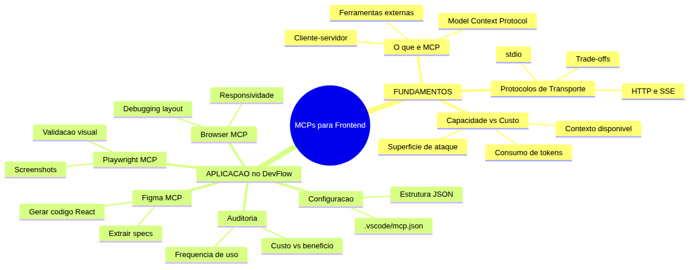
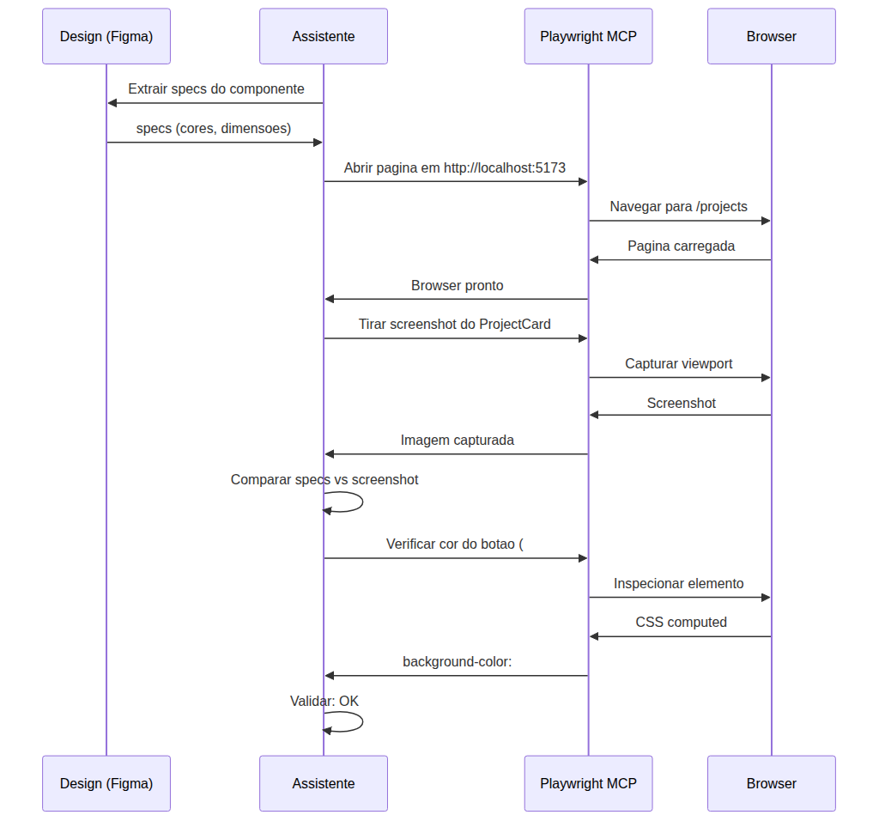
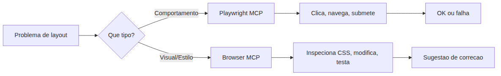
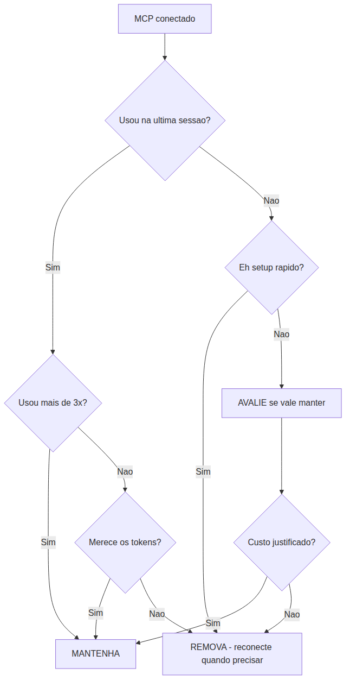

# Programador Profissional com Agentes — Aula 10

## MCPs para Frontend — Do Protótipo ao Código

**Duração estimada:** 55 minutos (30 de leitura + 25 de prática)

**Nível:** Intermediário

**Pré-requisitos:** Aula 09 concluída — DevFlow com skills de documentação (React, Express, MUI), Context7 configurado, paginação com filtros implementada na lista de projetos

---

## Objetivos de Aprendizagem

Ao final desta aula, você será capaz de:

- [ ] **Explicar** o que é o Model Context Protocol (MCP) e sua arquitetura cliente-servidor
- [ ] **Diferenciar** os protocolos de transporte stdio e HTTP/SSE, identificando quando usar cada um
- [ ] **Analisar** o custo de cada MCP em tokens, contexto e superfície de ataque
- [ ] **Configurar** MCPs no assistente via arquivo `.vscode/mcp.json`
- [ ] **Extrair** specs de design de um componente no Figma usando o Figma MCP
- [ ] **Gerar** código React fiel ao design a partir das specs extraídas
- [ ] **Validar** visualmente a implementação usando o Playwright MCP
- [ ] **Auditar** os MCPs conectados ao projeto e decidir quando manter ou remover cada um

---

## Como Usar Esta Aula

Esta aula está organizada em duas partes. A **primeira parte** constrói os fundamentos conceituais do Model Context Protocol — a arquitetura cliente-servidor, os protocolos de transporte, e o trade-off essencial entre capacidade ampliada e custo de tokens. A **segunda parte** aplica esses conceitos no DevFlow: você vai configurar MCPs no arquivo `.vscode/mcp.json`, usar o Figma MCP para extrair specs de design e gerar código React, usar o Playwright MCP para validação visual, usar o Browser MCP para debugging de layout, e fazer uma auditoria completa das ferramentas conectadas.

Ao longo do caminho, você encontrará seções **"Mão na Massa"** para fazer junto e **"Quick Check"** para verificar se entendeu antes de avançar. Ao final, o arquivo separado **Questões de Aprendizagem** traz as tarefas de checkpoint — só avance para a próxima aula quando conseguir completá-las por conta própria.

**Tempo estimado:** 30 minutos de leitura + 25 minutos de prática.

---

## Mapa Mental

Este diagrama mostra todos os conceitos que você vai dominar nesta aula:



> *O mapa mental acima mostra a estrutura da aula. Cada ramo representa um conceito que você vai explorar: dos fundamentos teóricos do MCP à aplicação prática com três MCPs de frontend no DevFlow.*

---

## Recapitulação das Aulas 01, 02, 03, 04, 05, 06, 07, 08 e 09

| Aula | Conceito | Onde aparece nesta aula | Como se conecta |
|---|---|---|---|
| Aula 01 | **Ambiente profissional** (Seções 1-8) | Seções 4-8 | O repositório DevFlow ganha agora configuração de MCPs — extensão do ambiente |
| Aula 02 | **Instructions permanentes** (Seções 1-3) | Seções 4-5 | MCPs seguem as mesmas convenções do time: stack, estilo, padrões |
| Aula 03 | **Agent Mode** (Seções 1-5) | Seções 5-7 | O agente autônomo agora invoca ferramentas externas via MCP — muito mais poderoso que só código |
| Aula 04 | **ADRs e Handoff** (Seções 5-6) | Seção 8 | A auditoria de MCPs gera decisões documentadas como ADRs |
| Aula 05 | **Código Limpo** (Seções 4-6) | Seções 5-6 | Código gerado por MCPs deve passar pela mesma refatoração que código manual |
| Aula 06 | **TDD e Testes** (Seções 1-7) | Seção 6 | Playwright MCP complementa os testes E2E com validação visual |
| Aula 07 | **CI/CD Pipeline** (Seções 1-7) | Seções 4-8 | MCPs conectados são versionados no repositório como parte do pipeline |
| Aula 08 | **Frontend React + E2E** (Seções 3-7) | Seções 5-7 | O frontend React do DevFlow agora recebe specs direto do Figma via MCP |
| Aula 09 | **Skills de Documentação** (Seções 1-7) | Seções 1-3 | Skills fornecem CONHECIMENTO; MCPs fornecem AÇÕES — dois lados da mesma moeda |

---

**FUNDAMENTOS: Arquitetura MCP**

> *O Model Context Protocol (MCP) é um padrão aberto que permite ao seu assistente de código se conectar com ferramentas externas — de forma padronizada, segura e controlada. Esta seção explica a arquitetura, os protocolos de transporte e o trade-off fundamental entre capacidade e custo. Nenhum nome de produto específico é usado aqui — os conceitos são universais.*

---

## 1. O Que É MCP — Arquitetura Cliente-Servidor

### O problema que o MCP resolve

Até agora, seu assistente de código trabalhava com o que estava dentro do editor: arquivos do projeto, terminal, pesquisa web, documentação via skills. Mas o mundo do desenvolvimento frontend é maior que isso — existem ferramentas de design (onde as interfaces são criadas), ferramentas de teste visual (que comparam pixels), ferramentas de debugging (que inspecionam o navegador).

Cada uma dessas ferramentas tem sua própria linguagem, sua própria API, seu próprio jeito de funcionar. Sem um padrão, conectar o assistente a cada uma delas exigiria integrações customizadas — uma para cada ferramenta, para cada editor, para cada provedor de assistente.

O **Model Context Protocol (MCP)** resolve esse problema criando um padrão universal de comunicação.

### A arquitetura em três camadas

O MCP funciona com três papéis:

1. **Cliente MCP**: o editor ou ambiente de desenvolvimento que hospeda o assistente. Ele gerencia a conexão com os servidores MCP.
2. **Servidor MCP**: um programa que expõe ferramentas, recursos e prompts para o assistente usar. Cada ferramenta externa (design, teste visual, debugging) tem seu próprio servidor MCP.
3. **Cliente de IA (o assistente)**: o modelo de linguagem que usa as ferramentas expostas pelos servidores MCP para executar tarefas.

```
[Assistente de Codigo]
    |  (usa ferramentas)
    v
[Cliente MCP]  ──── conexão ────>  [Servidor MCP 1: Design]
    |                               [Servidor MCP 2: Teste Visual]
    |                               [Servidor MCP 3: Debugging]
    v
[Editor / Ambiente]
```

O assistente nunca se conecta diretamente às ferramentas externas. Ele sempre passa pelo cliente MCP, que gerencia as conexões, a segurança e o ciclo de vida dos servidores.

### A analogia do adaptador universal

Imagine que você tem três aparelhos: um com plugue de dois pinos, um com três pinos e um com carregador USB-C. Sem um adaptador, você precisaria de três tomadas diferentes. O MCP é como um **adaptador universal** — cada servidor MCP é um adaptador que converte a linguagem da ferramenta para o padrão que o assistente entende.

### MCP vs Skills: conhecimento vs ação

Na Aula 09, você aprendeu que **skills fornecem conhecimento** — documentação que o assistente consulta para entender como algo funciona. MCPs fornecem **ações** — o assistente pode executar comandos em ferramentas externas.

| Característica | Skills | MCPs |
|---|---|---|
| O que fornece | Conhecimento (docs, APIs) | Ações (executar comandos) |
| Estado | Passivo (só leitura) | Ativo (executa operações) |
| Exemplo | "Como usar useState" | "Extraia specs deste componente do Figma" |
| Custo | Tokens quando carregada | Tokens + execução da ferramenta |
| Atualização | Manual ou via Context7 | Automática (versão do servidor) |

### Erro comum: confundir MCP com skill

**Erro:** achar que MCP substitui skill.

```markdown
# ERRADO: "Não preciso da skill de React, o MCP do Figma já gera código"
```

MCP e skill são complementares. O Figma MCP extrai as specs visuais (cores, tamanhos, fontes), mas é a skill de React que garante que o código gerado use as APIs corretas. Use ambos.

### Quick Check 1

**1. Qual problema o MCP resolve?**
**Resposta:** O MCP resolve o problema de cada ferramenta externa ter sua própria API e linguagem. Sem um padrao, conectar o assistente a cada ferramenta exigiria integracoes customizadas. O MCP cria um padrao universal de comunicacao entre o assistente e ferramentas externas.

**2. Qual a diferenca fundamental entre uma skill e um MCP?**
**Resposta:** Skills fornecem CONHECIMENTO (documentacao, exemplos de API) que o assistente consulta de forma passiva. MCPs fornecem ACOES — o assistente pode executar comandos em ferramentas externas (extrair specs, tirar screenshot, inspecionar elemento). Skills sao passivas e de leitura; MCPs sao ativos e executam operacoes.

---

## 2. Protocolos de Transporte: stdio vs HTTP/SSE

### Como o cliente e o servidor se comunicam

O MCP define que o cliente e o servidor se comunicam através de um **protocolo de transporte** — o "canal" por onde as mensagens trafegam. Existem dois protocolos principais, e a escolha entre eles tem implicações práticas importantes.

### Transporte stdio (Standard Input/Output)

No transporte stdio, o servidor MCP é iniciado como um **processo filho** do editor. O cliente MCP escreve comandos na entrada padrão (stdin) do servidor, e o servidor responde pela saída padrão (stdout). Tudo acontece localmente, na mesma máquina.

```
[Editor]  ── stdin ──>  [Servidor MCP]
          <── stdout ──
          (processo filho, local)
```

**Vantagens do stdio:**
- **Mais rápido**: não há latência de rede. A comunicação é direta entre processos na mesma máquina.
- **Mais seguro**: o servidor não expõe nenhuma porta de rede. Só o editor consegue se comunicar com ele.
- **Mais simples**: não requer configuração de rede, autenticação HTTP ou certificados SSL.
- **Isolamento**: cada servidor roda em seu próprio processo. Se um servidor quebrar, os outros continuam funcionando.

**Desvantagens do stdio:**
- **Local apenas**: o servidor precisa estar instalado na mesma máquina do editor.
- **Um cliente por servidor**: cada servidor stdio atende apenas um editor.
- **Gerenciamento de processo**: o editor precisa iniciar, monitorar e encerrar o processo.

### Transporte HTTP/SSE (Server-Sent Events)

No transporte HTTP/SSE, o servidor MCP roda como um **serviço HTTP** que aceita conexões de clientes. O cliente envia requisições HTTP e o servidor pode enviar eventos de volta usando SSE (Server-Sent Events) — um padrão onde o servidor mantém uma conexão aberta e envia dados quando disponíveis.

```
[Editor]  ── HTTP POST ──>  [Servidor MCP (servico HTTP)]
          <── SSE stream ──
          (conexao remota, via rede)
```

**Vantagens do HTTP/SSE:**
- **Remoto**: o servidor pode rodar em outra máquina, em um container, ou na nuvem.
- **Múltiplos clientes**: vários editores podem se conectar ao mesmo servidor.
- **Escalável**: o servidor pode ser replicado para atender muitos usuários simultâneos.
- **Atualização centralizada**: você atualiza o servidor uma vez, e todos os clientes usam a nova versão.

**Desvantagens do HTTP/SSE:**
- **Latência de rede**: cada requisição adiciona milissegundos (ou segundos) de rede.
- **Superfície de ataque**: o servidor expõe uma porta de rede que precisa ser protegida.
- **Mais complexo**: requer configuração de rede, possivelmente autenticação, HTTPS.
- **Dependência de conectividade**: se a rede cair, o MCP para de funcionar.

### Quando usar cada um

| Critério | stdio | HTTP/SSE |
|---|---|---|
| Latência | Mínima (0-1ms) | Variável (1-100ms+) |
| Segurança | Máxima (sem rede) | Requer HTTPS + auth |
| Instalação | Local (pacote via terminal) | Servidor dedicado |
| Clientes simultâneos | 1 | Múltiplos |
| Ideal para | Ferramentas locais (CLI, testes) | Serviços remotos (API, banco) |

### A regra prática

Use **stdio** para ferramentas que rodam na sua máquina: interpretadores de linha de comando, runners de teste, ferramentas de build. Use **HTTP/SSE** para serviços que rodam em servidores remotos: bancos de dados, APIs de terceiros, ambientes de staging.

> *Até aqui, você já entendeu os dois protocolos de transporte do MCP. Isso é o suficiente para entender como a comunicação acontece. Na prática, a maioria dos MCPs de frontend que você vai usar (Figma, Playwright, Browser) usa stdio — rodam localmente como processos do editor.*

### Quick Check 2

**1. Qual transporte e mais seguro: stdio ou HTTP/SSE? Por que?**
**Resposta:** stdio e mais seguro porque o servidor roda como processo filho do editor sem expor nenhuma porta de rede. So o editor consegue se comunicar com ele. HTTP/SSE expoe uma porta que precisa ser protegida com autenticacao e HTTPS.

**2. Em que cenario voce usaria HTTP/SSE em vez de stdio?**
**Resposta:** Quando o servidor MCP precisa rodar remotamente (outra maquina, container, nuvem) ou quando varios editores precisam se conectar ao mesmo servidor simultaneamente. Por exemplo, um servidor MCP de banco de dados compartilhado pelo time.

---

## 3. Capacidade vs Custo — O Preço de Cada Ferramenta Conectada

### Nada é de graça

Cada MCP que você adiciona ao seu ambiente tem um custo — mesmo antes de você usá-lo pela primeira vez na sessão. Entender esse custo é essencial para tomar decisões inteligentes sobre quais MCPs conectar.

### Os três custos de um MCP

**1. Custo de tokens do manifesto**

Quando o editor inicializa uma sessão, ele carrega o **manifesto** de cada servidor MCP configurado. O manifesto descreve quais ferramentas o servidor expõe, seus parâmetros, suas descrições. Esse manifesto é incluído no contexto do assistente — e consome tokens.

Mesmo que você não use o MCP uma única vez na sessão, o manifesto já pagou tokens para estar lá. Um manifesto típico de MCP tem entre 200 e 800 tokens, dependendo da quantidade de ferramentas que expõe.

**2. Custo de contexto**

O contexto do assistente é finito. Cada MCP adicional reduz o espaço disponível para código, arquivos abertos e histórico da conversa. Se você tem 5 MCPs conectados, cada um com manifesto de 500 tokens, são 2500 tokens consumidos antes de qualquer conversa ou código.

**3. Superfície de ataque e manutenção**

MCPs são software. Eles podem ter bugs, podem quebrar com atualizações, podem consumir CPU e memória mesmo quando ociosos. Cada MCP adicionado é um ponto de possível falha no seu ambiente de desenvolvimento.

### A regra de ouro da conexão

A pergunta que você deve fazer para cada MCP é:

> *"Eu uso esta ferramenta pelo menos uma vez a cada sessão de desenvolvimento?"*

Se a resposta for **sim**, o custo do manifesto vale a pena — você vai usar a ferramenta e o custo é amortizado pelo uso.

Se a resposta for **não**, o MCP está consumindo tokens sem benefício. Desconecte-o e conecte apenas quando precisar.

### A analogia do canivete suíço

Um canivete suíço com 20 ferramentas é útil — mas ele é mais pesado, mais grosso, e você raramente usa mais de 3 ferramentas no dia a dia. Os MCPs são como as ferramentas do canivete: ter muitas ferramentas "por precaução" torna o canivete pesado demais para usar confortavelmente.

Conecte apenas os MCPs que você usa **ativamente**. O resto, deixe para conectar quando surgir a necessidade.

### Custo estimado por MCP

| MCP | Manifesto (tokens estimados) | Ferramentas expostas | Quando vale |
|---|---|---|---|
| Design (extrair specs) | ~300-500 | 2-3 | Trabalhando com design |
| Teste visual | ~400-600 | 3-5 | Durante desenvolvimento de componentes |
| Debugging de browser | ~500-800 | 4-6 | Durante debugging de layout |
| CLI/terminal | ~200-400 | 1-3 | Durante automação de build |

> *Respire. Até aqui você entendeu o trade-off fundamental: cada MCP adicionado amplia o que o assistente pode fazer, mas consome tokens e contexto. Você vai aplicar essa análise na prática na segunda parte da aula.*

### Quick Check 3

**1. Quais sao os tres custos de conectar um MCP?**
**Resposta:** 1) Custo de tokens do manifesto — o servidor envia a descricao de suas ferramentas para o contexto do assistente, consumindo tokens mesmo sem uso. 2) Custo de contexto — cada MCP reduz o espaco disponivel para codigo, arquivos e historico. 3) Superficie de ataque e manutencao — MCPs sao software que podem ter bugs, quebrar ou consumir recursos.

**2. Qual a pergunta que voce deve fazer para decidir se mantem um MCP conectado?**
**Resposta:** "Eu uso esta ferramenta pelo menos uma vez a cada sessao de desenvolvimento?" Se sim, o custo do manifesto vale a pena. Se nao, o MCP esta consumindo tokens sem beneficio.

---

**APLICAÇÃO: MCPs no Projeto DevFlow**

> *Agora que você entende os fundamentos do MCP — arquitetura, transporte e trade-off de custo — vamos aplicá-los no DevFlow. Você vai configurar o arquivo de conexão, conectar três MCPs de frontend (Figma, Playwright e Browser), extrair specs de design, gerar código React, validar visualmente e debugar layout.*

## 4. Configuração de MCPs: .vscode/mcp.json

### O arquivo de configuração central

O arquivo `.vscode/mcp.json` é onde você declara quais servidores MCP o seu assistente pode usar. Ele segue o formato JSON e fica dentro da pasta `.vscode` na raiz do projeto, o que significa que pode ser versionado no Git e compartilhado com o time.

Quando o editor abre o projeto, ele lê este arquivo e inicializa cada servidor MCP listado. Cada servidor recebe seu próprio processo, com seu próprio manifesto — e cada um deles consome tokens do contexto do assistente, como você aprendeu na seção anterior.

### Estrutura do JSON

O arquivo `.vscode/mcp.json` tem a seguinte estrutura:

```json
{
  "servers": [
    {
      "name": "nome-do-mcp",
      "type": "stdio",
      "command": "comando-para-iniciar",
      "args": ["arg1", "arg2"],
      "env": {
        "VARIAVEL": "valor"
      }
    }
  ]
}
```

**Campos principais:**

| Campo | Obrigatório | Descrição |
|---|---|---|
| `name` | Sim | Nome único que identifica o MCP. Use um nome descritivo como "figma-design" |
| `type` | Sim | Protocolo de transporte: `"stdio"` ou `"http"` |
| `command` | Sim | Comando para iniciar o servidor MCP (ex: `npx`, `node`, `python`) |
| `args` | Não | Array de argumentos passados ao comando |
| `env` | Não | Objeto com variáveis de ambiente necessárias (API keys, tokens, config) |

### Exemplo completo: três MCPs de frontend

Abaixo está a configuração completa para os três MCPs que você vai usar no DevFlow:

```json
{
  "servers": [
    {
      "name": "figma-design",
      "type": "stdio",
      "command": "npx",
      "args": [
        "@figma/mcp-server",
        "--token",
        "${FIGMA_ACCESS_TOKEN}"
      ],
      "env": {}
    },
    {
      "name": "playwright-test",
      "type": "stdio",
      "command": "npx",
      "args": [
        "@playwright/mcp-server",
        "--project",
        "devflow"
      ],
      "env": {}
    },
    {
      "name": "browser-debug",
      "type": "stdio",
      "command": "npx",
      "args": [
        "@browser/mcp-server",
        "--headless",
        "false"
      ],
      "env": {}
    }
  ]
}
```

> *Os nomes e pacotes acima são ilustrativos. Consulte a documentação oficial de cada ferramenta para obter o comando exato de instalação e configuração do seu servidor MCP.*

### Onde colocar secrets

Note o uso de `${FIGMA_ACCESS_TOKEN}` no exemplo acima. Esta sintaxe faz referência a uma variável de ambiente definida no sistema operacional ou no arquivo `.env` do projeto.

**NUNCA** coloque tokens, chaves de API ou senhas diretamente no `.vscode/mcp.json`. Use variáveis de ambiente e um arquivo `.env` que está no `.gitignore`.

### Mão na Massa 1: Configurar o Arquivo .vscode/mcp.json

**Objetivo:** Criar o arquivo de configuração MCP no seu projeto DevFlow.

**Passo 1:** Abra o terminal na raiz do projeto DevFlow e verifique se a pasta `.vscode` existe:

```bash
ls -la .vscode/
```

Se não existir, crie-a:

```bash
mkdir -p .vscode
```

**Passo 2:** Crie o arquivo `.vscode/mcp.json` com o conteúdo abaixo:

```json
{
  "servers": [
    {
      "name": "figma-design",
      "type": "stdio",
      "command": "npx",
      "args": [
        "@figma/mcp-server",
        "--token",
        "${FIGMA_ACCESS_TOKEN}"
      ],
      "env": {}
    },
    {
      "name": "playwright-test",
      "type": "stdio",
      "command": "npx",
      "args": [
        "@playwright/mcp-server",
        "--project",
        "devflow"
      ],
      "env": {}
    },
    {
      "name": "browser-debug",
      "type": "stdio",
      "command": "npx",
      "args": [
        "@browser/mcp-server",
        "--headless",
        "false"
      ],
      "env": {}
    }
  ]
}
```

**Passo 3:** Crie o arquivo `.env` na raiz do projeto (se não existir) e adicione:

```bash
FIGMA_ACCESS_TOKEN=seu_token_aqui
```

Certifique-se de que `.env` está no `.gitignore`.

**Passo 4:** Abra o projeto no editor e verifique se os MCPs foram carregados. Você deve ver os três servidores listados no painel de ferramentas do assistente.

**Passo 5:** Teste a conexão pedindo ao assistente para listar as ferramentas disponíveis:

```text
@assistente liste as ferramentas disponíveis para você
```

**Resultado esperado:** O assistente lista as ferramentas do Figma MCP, Playwright MCP e Browser MCP.

---

## 5. Figma MCP — Do Design ao Código React

### Como o Figma MCP funciona

O Figma MCP conecta seu assistente diretamente a um arquivo de design no Figma. Em vez de você olhar para o design e descrever manualmente o que precisa, o assistente pode:

1. **Conectar-se** a um arquivo de design específico (via URL ou file key)
2. **Extrair specs** de um componente ou frame: cores, dimensões, fontes, espaçamentos, variantes
3. **Exportar assets** como SVGs ou PNGs
4. **Gerar código** React que reproduz o design com fidelidade

### O fluxo de trabalho completo

```
[Design no Figma]
    |
    | (1) Conectar
    v
[Figma MCP]  ── extrai specs ──>  [Assistente]
    |                                  |
    | (2) Analisa specs                 | (3) Gera codigo
    v                                  v
[Specs extraidas]                  [Componente React]
    - cores: #1A73E8, #FFFFFF        - JSX fiel
    - fontes: Inter 16px bold        - MUI/Chakra
    - dimensoes: 320x48              - Responsivo
    - espacamentos: 12px padding     - Acessivel
```

O assistente analisa as specs extraídas e produz código React que corresponde exatamente ao design — mesmas cores, mesmas fontes, mesmos espaçamentos.

### Exemplo de specs extraídas

Quando você pede ao assistente para extrair specs de um botão no Figma, ele retorna algo como:

```json
{
  "component": "Button/Primary",
  "properties": {
    "width": 320,
    "height": 48,
    "borderRadius": 8,
    "backgroundColor": "#1A73E8",
    "textColor": "#FFFFFF",
    "fontFamily": "Inter",
    "fontSize": 16,
    "fontWeight": 600,
    "paddingHorizontal": 24,
    "paddingVertical": 12,
    "states": [
      {
        "name": "hover",
        "backgroundColor": "#1557B0",
        "boxShadow": "0 2px 8px rgba(26,115,232,0.3)"
      },
      {
        "name": "disabled",
        "backgroundColor": "#C4C4C4",
        "textColor": "#A0A0A0"
      }
    ]
  }
}
```

### O que o Figma MCP NÃO faz

É importante saber os limites:

- **Não substitui design system**: o Figma MCP extrai specs visuais, não regras de negócio
- **Não gera lógica**: ele produz a camada visual, não handlers de evento ou validação
- **Não cria testes**: o código gerado precisa ser coberto por testes (Aula 06)
- **Não refatora**: o código gerado pode precisar de refatoração (Aula 05)

### Código React gerado a partir das specs

Com essas specs, o assistente gera o componente React:

```jsx
import Button from '@mui/material/Button';
import { styled } from '@mui/material/styles';

const PrimaryButton = styled(Button)(({ theme }) => ({
  width: 320,
  height: 48,
  borderRadius: 8,
  backgroundColor: '#1A73E8',
  color: '#FFFFFF',
  fontFamily: 'Inter, sans-serif',
  fontSize: 16,
  fontWeight: 600,
  padding: '12px 24px',
  textTransform: 'none',
  '&:hover': {
    backgroundColor: '#1557B0',
    boxShadow: '0 2px 8px rgba(26,115,232,0.3)',
  },
  '&:disabled': {
    backgroundColor: '#C4C4C4',
    color: '#A0A0A0',
  },
}));
```

O código gerado já segue o padrão MUI do DevFlow (definido nas Instructions da Aula 02), usa `styled` para customização e respeita os estados do componente.

### Mão na Massa 2: Extrair Specs e Gerar Código

**Objetivo:** Usar o Figma MCP para extrair specs de um componente de design e gerar o código React correspondente no DevFlow.

**Passo 1:** Abra o arquivo de design do DevFlow no Figma e copie a URL do frame do componente "ProjectCard".

**Passo 2:** No editor, peça ao assistente para extrair as specs:

```text
@assistente conecte-se ao arquivo Figma em [URL_DO_DESIGN]
e extraia as specs do frame "ProjectCard"
```

**Passo 3:** Analise as specs retornadas. Verifique se todas as propriedades estão presentes: cores, dimensões, fontes, espaçamentos, variantes (hover, disabled, etc).

**Passo 4:** Peça ao assistente para gerar o componente React:

```text
@assistente com base nas specs extraidas, gere o componente
ProjectCard como um componente React usando MUI styled.
Siga o padrao do DevFlow: pasta src/components/, arquivo
ProjectCard.tsx, export default.
```

**Passo 5:** Salve o código gerado no arquivo `src/components/ProjectCard.tsx`.

**Passo 6:** Verifique se o componente compila sem erros:

```bash
npx tsc --noEmit
```

**Resultado esperado:** O componente `ProjectCard.tsx` foi criado, compila sem erros e corresponde visualmente ao design do Figma.

---

## 6. Playwright MCP — Validação Visual Automatizada

### Por que validação visual?

Na Aula 08, você aprendeu a escrever testes E2E com Playwright para verificar comportamento — cliques, navegação, formulários. Mas testes de comportamento não garantem que a interface **parece** correta.

O Playwright MCP permite que o assistente execute **validação visual**: ele abre a aplicação, tira screenshots e compara com o design original para verificar se cores, dimensões e posicionamentos estão corretos.

### Como o Playwright MCP funciona

O Playwright MCP expõe ferramentas que o assistente pode chamar:

1. **Abrir URL**: navega para uma página da aplicação
2. **Tirar screenshot**: captura a tela atual
3. **Comparar com design**: recebe a imagem do design original e compara pixel a pixel
4. **Extrair cores e dimensões**: lê valores CSS de elementos específicos

### Fluxo de validação visual



### Quando usar o Playwright MCP

| Situação | Playwright E2E (Aula 08) | Playwright MCP |
|---|---|---|
| Testar comportamento | Sim (submit, navegação) | Não |
| Validar cores | Não (só texto) | Sim (pixel) |
| Validar layout responsivo | Parcial (viewport) | Sim (screenshot) |
| Comparar com design | Não | Sim |
| CI/CD | Sim | Sim (com ressalvas) |

O Playwright MCP é excelente para **validação exploratória** durante o desenvolvimento. Para regressão visual em CI/CD, use ferramentas especializadas de snapshot testing.

### Exemplo de validação visual

```text
@assistente valide visualmente o componente ProjectCard.
1. Abra http://localhost:5173/projects
2. Tire um screenshot do primeiro card
3. Compare com as specs extraidas do Figma
4. Verifique: cor de fundo #1A73E8, altura 48px, fonte Inter 16px
5. Reporte discrepancias
```

O assistente executa cada passo, chamando as ferramentas do Playwright MCP, e retorna um relatório de validação.

### Limitações

- Screenshots podem variar entre sistemas operacionais (fontes, anti-aliasing)
- Animações precisam ser desabilitadas para capturas consistentes
- Tempo de carregamento da página afeta o resultado

---

## 7. Browser MCP — Debugging de Layout

### Debugging com o assistente

O Browser MCP vai um passo além do Playwright MCP: em vez de apenas abrir páginas e tirar screenshots, ele permite que o assistente **inspecione** o DOM, leia estilos computados, teste variações de CSS em tempo real e depure problemas de layout.

### Ferramentas expostas pelo Browser MCP

1. **Abrir URL**: navega para qualquer página
2. **Inspecionar elemento**: retorna o HTML e CSS computado de um seletor
3. **Modificar CSS**: aplica estilos temporários e captura o resultado
4. **Testar responsividade**: muda o viewport e verifica o layout
5. **Console**: executa JavaScript no contexto da página

### Exemplo de debugging

Imagine que o card "ProjectCard" está quebrado em mobile: os elementos ficam sobrepostos. Você pede:

```text
@assistente o ProjectCard esta quebrado em mobile.
Use o Browser MCP para:
1. Abrir http://localhost:5173/projects em viewport 375x812 (iPhone)
2. Inspecionar o primeiro ProjectCard
3. Identificar o problema de layout
4. Sugerir correcao CSS
```

O assistente abre a página, inspeciona o elemento, identifica que o `flex-direction` está como `row` em vez de `column`, e sugere a correção:

```css
/* Sugestao do assistente */
@media (max-width: 600px) {
  .MuiCardContent-root {
    flex-direction: column;
  }
}
```

### Browser MCP vs Playwright MCP



| Característica | Playwright MCP | Browser MCP |
|---|---|---|
| Screenshot | Sim | Sim |
| Inspecionar CSS | Limitado | Completo (computed) |
| Modificar CSS | Não | Sim |
| Console JS | Não | Sim |
| Responsividade | Por viewport | Por viewport + elementos |

### Boa prática: usar os dois

Use **Playwright MCP** para validação visual rápida (screenshot + comparação) e **Browser MCP** para debugging aprofundado (inspeção + modificação). Eles são complementares.

---

## 8. Auditoria de MCPs — Quando Manter, Quando Remover

### O hábito que separa profissionais

Conectar MCPs é fácil. Saber quando **removê-los** é o que separa um desenvolvedor profissional de um amador. Cada MCP conectado consome tokens, contexto e adiciona complexidade.

A auditoria regular de MCPs é o equivalente a limpar o armário: se você não usa há semanas, tire do contexto. Conecte novamente quando precisar.

### Checklist de auditoria

Para cada MCP conectado, responda:

| Pergunta | Resposta | Ação |
|---|---|---|
| Eu usei este MCP na última semana? | Sim | Mantenha |
| | Não | Considere remover |
| Eu usei este MCP na última sessão? | Sim | Mantenha |
| | Não | Remova (reconecte quando precisar) |
| O custo do manifesto é justificado pelo uso? | Sim | Mantenha |
| | Não | Remova |
| Este MCP tem alternativas mais leves? | Sim | Migre |
| | Não | Mantenha |
| Este MCP está quebrando ou dando erro? | Sim | Remova até corrigir |
| | Não | Mantenha |

### Fluxo de decisão



### Registro da decisão como ADR

Seguindo o padrão da Aula 04, documente a auditoria como um ADR:

```markdown
# ADR-010: Auditoria de MCPs Conectados

## Data
2026-07-01

## Contexto
Revisão mensal dos MCPs conectados ao projeto DevFlow.
Avaliacao de uso, custo de tokens e superficie de ataque.

## Decisão

### Mantidos
- **figma-design**: usado toda sessao de frontend. ~400 tokens.
  Justifica o custo.
- **playwright-test**: usado 2x na ultima semana. ~500 tokens.
  Justifica o custo.

### Removidos
- **browser-debug**: usado 2x no mes. ~600 tokens sem uso frequente.
  Remover e reconectar apenas durante debugging de layout.

## Consequencias
- **Positiva**: reducao de ~600 tokens de manifesto por sessao
- **Negativa**: se precisar debugar layout, preciso esperar a
  reconexao do MCP (cerca de 2 segundos)

## Status
Aceito
```

### Mão na Massa 3: Auditoria Completa

**Objetivo:** Executar uma auditoria completa dos MCPs conectados ao DevFlow e documentar a decisão como ADR.

**Passo 1:** Liste todos os MCPs atualmente conectados no `.vscode/mcp.json`.

```bash
which jq || echo "Instale jq: sudo apt-get install -y jq" && cat .vscode/mcp.json | jq '.servers[].name'
```

**Passo 2:** Para cada MCP, registre em uma tabela:

- Nome
- Quantas vezes usou nas últimas 5 sessões
- Custo estimado de manifesto (tokens)
- Último uso
- Vale manter? (sim/não)

**Passo 3:** Decida quais MCPs manter e quais remover.

**Passo 4:** Crie um arquivo `docs/adrs/ADR-010-auditoria-mcps.md` com a decisão documentada (use o template acima).

**Passo 5:** Atualize o `.vscode/mcp.json` removendo os MCPs que não passaram na auditoria.

**Passo 6:** Verifique se o assistente reconhece a nova configuração:

```text
@assistente liste as ferramentas disponíveis
```

**Resultado esperado:** O assistente lista apenas os MCPs mantidos. A auditoria está documentada como ADR no repositório.

---

## Exercícios Graduados

### Exercício 1 (Fácil): Configurar Novo MCP

**Contexto:** O time do DevFlow decidiu adicionar um MCP de terminal/CLI para automatizar builds e execução de scripts. Você precisa configurá-lo.

**Tarefa:**
1. Adicione um novo servidor MCP ao `.vscode/mcp.json` com as seguintes características:
   - Nome: `terminal-cli`
   - Tipo: `stdio`
   - Comando: `npx`
   - Args: `["@terminal/mcp-server", "--cwd", "${workspaceFolder}"]`

2. Verifique se o JSON continua válido
3. Confirme que o assistente reconhece o novo MCP

**Critério de sucesso:** O arquivo `.vscode/mcp.json` tem 4 servidores (os 3 existentes + o novo) e o JSON é válido.

---

### Exercício 2 (Médio): Gerar Componente a Partir de Specs do Figma MCP

**Contexto:** O designer do DevFlow criou um novo componente "FilterBar" no Figma. Você precisa implementá-lo no React seguindo o design.

**Tarefa:**
1. Use o Figma MCP para extrair as specs do componente "FilterBar" do arquivo de design do DevFlow
2. Analise as specs: identifique cores, dimensões, fontes, estados (hover, active, disabled)
3. Peça ao assistente para gerar o componente React usando MUI styled, seguindo o padrão do DevFlow
4. Salve em `src/components/FilterBar.tsx`
5. Valide visualmente com o Playwright MCP: abra a página, tire screenshot, compare com as specs

**Critério de sucesso:** O componente `FilterBar.tsx` compila sem erros, corresponde visualmente ao design do Figma validado por screenshot.

---

### Exercício 3 (Difícil): Auditoria Completa com Relatório e ADR

**Contexto:** Você recebeu a tarefa de fazer a auditoria mensal de MCPs do DevFlow. O time está preocupado com o consumo de tokens.

**Tarefa:**
1. Conecte 2 MCPs adicionais ao `.vscode/mcp.json` (invente um cenário: um MCP de banco de dados e um de API de terceiros)
2. Execute a auditoria completa usando o checklist da Seção 8 para cada um dos 5 MCPs (3 originais + 2 novos)
3. Decida quais manter e quais remover
4. Crie o ADR de decisão em `docs/adrs/ADR-011-auditoria-mensal-mcps.md`
5. Atualize o `.vscode/mcp.json` com a configuração final
6. Justifique cada decisão (manter ou remover) em 2-3 linhas

**Critério de sucesso:** O ADR está completo com data, contexto, decisão para cada MCP, consequências e status. O `.vscode/mcp.json` final tem apenas os MCPs aprovados na auditoria.

---

## Autoavaliação: Quiz Rápido

**1. Qual é a função do Cliente MCP na arquitetura do Model Context Protocol?**

> a) Executar código no servidor
> b) Gerenciar a conexão com os servidores MCP e expor as ferramentas ao assistente
> c) Substituir o editor de código
> d) Gerar código automaticamente

**Resposta:** b) Gerenciar a conexão com os servidores MCP e expor as ferramentas ao assistente.

---

**2. Qual a diferença fundamental entre o transporte stdio e HTTP/SSE?**

> a) stdio é mais lento que HTTP/SSE
> b) stdio roda localmente como processo filho sem expor porta de rede; HTTP/SSE roda como serviço remoto via rede
> c) HTTP/SSE não suporta múltiplos clientes
> d) stdio requer certificado SSL

**Resposta:** b) stdio roda localmente como processo filho sem expor porta de rede; HTTP/SSE roda como serviço remoto via rede.

---

**3. Quais são os três custos de conectar um MCP ao ambiente de desenvolvimento?**

> a) Custo de licença, custo de hardware, custo de energia
> b) Custo de tokens do manifesto, custo de contexto, superfície de ataque
> c) Custo de instalação, custo de configuração, custo de aprendizado
> d) Custo de rede, custo de armazenamento, custo de CPU

**Resposta:** b) Custo de tokens do manifesto, custo de contexto, superfície de ataque.

---

**4. O que o Figma MCP NÃO faz?**

> a) Extrair specs de cores e dimensões de um componente
> b) Conectar-se a um arquivo de design específico
> c) Gerar código React automaticamente
> d) Substituir o design system e criar regras de negócio

**Resposta:** d) Substituir o design system e criar regras de negócio.

---

**5. Em que situação o Playwright MCP é mais adequado que o Browser MCP?**

> a) Para inspecionar CSS computado de um elemento
> b) Para validação visual rápida com screenshot e comparação com o design
> c) Para modificar CSS em tempo real e testar variações
> d) Para executar JavaScript no console da página

**Resposta:** b) Para validação visual rápida com screenshot e comparação com o design.

---

**6. Qual a pergunta fundamental para decidir se um MCP deve permanecer conectado?**

> a) "Este MCP é gratuito?"
> b) "Eu usei esta ferramenta pelo menos uma vez a cada sessão de desenvolvimento?"
> c) "Este MCP é popular na comunidade?"
> d) "O fabricante oferece suporte?"

**Resposta:** b) "Eu usei esta ferramenta pelo menos uma vez a cada sessão de desenvolvimento?"

---

## Resumo da Aula

1. **MCP é um padrão aberto** que conecta assistentes de código a ferramentas externas via arquitetura cliente-servidor, resolvendo o problema de integrações customizadas

2. **Skills e MCPs são complementares**: skills fornecem conhecimento (passivo), MCPs fornecem ações (ativo) — use ambos

3. **Transporte stdio** é local, rápido e seguro (sem rede); **transporte HTTP/SSE** é remoto, escalável e suporta múltiplos clientes

4. **Cada MCP tem três custos**: tokens do manifesto, espaço no contexto, superfície de ataque — conecte apenas o que usar ativamente

5. **.vscode/mcp.json** é o arquivo de configuração central, versionado no repositório, que declara os servidores MCP do projeto

6. **Figma MCP** extrai specs de design (cores, dimensões, fontes) e gera código React fiel ao protótipo

7. **Playwright MCP** valida visualmente a implementação com screenshots comparados ao design original

8. **Auditoria regular de MCPs** é essencial para gerenciar custo de tokens — documente decisões como ADRs

---

## Próxima Aula

**Aula 11: GitHub MCP Nativo**

Você aprenderá a usar o MCP nativo do GitHub para gerenciar issues, PRs, code review e releases diretamente pelo assistente. Vamos conectar o DevFlow a um workflow completo de GitHub: abrir issue, criar branch, implementar, abrir PR, revisar e mergear — tudo com comandos naturais.

---

## Referências

- Model Context Protocol — documentação oficial do protocolo
- Model Context Protocol — especificação de transporte (stdio e HTTP/SSE)
- Práticas recomendadas de configuração de MCPs para VS Code
- Documentação do Figma API — referência para extração de dados de design
- Playwright — documentação de testes visuais e screenshot

---

## FAQ

**1. Preciso instalar algo para usar MCPs?**

Sim. Cada servidor MCP precisa ser instalado via npm (ou outro gerenciador de pacotes). O arquivo `.vscode/mcp.json` apenas declara a configuração — os pacotes precisam estar disponíveis no sistema.

**2. MCPs funcionam em qualquer editor?**

O MCP é um protocolo aberto, mas a implementação do cliente MCP é específica de cada editor. VS Code, Cursor e alguns outros já têm suporte nativo a MCPs via `.vscode/mcp.json`.

**3. Quantos MCPs posso conectar ao mesmo tempo?**

Depende do seu limite de contexto. Cada MCP adiciona 200-800 tokens de manifesto. Com 128k tokens de contexto, você poderia teoricamente conectar dezenas, mas na prática recomenda-se no máximo 5-7 MCPs ativos simultaneamente.

**4. Um MCP pode quebrar meu projeto?**

MCPs rodam em processos isolados e não modificam arquivos do projeto por conta própria — eles só executam comandos quando o assistente chama. O risco é baixo, mas MCPs podem consumir recursos (CPU, memória) mesmo ociosos.

**5. Posso usar MCPs em CI/CD?**

Depende do MCP e do ambiente de CI. MCPs stdio que dependem de um navegador (como Playwright e Browser MCPs) podem ser complexos de configurar em CI. Prefira ferramentas nativas de CI para regressão visual em pipelines.

---

## Glossário

| Termo | Definição |
|---|---|
| **MCP** | Model Context Protocol — padrão aberto para conectar assistentes de código a ferramentas externas |
| **Cliente MCP** | Componente no editor que gerencia conexões com servidores MCP |
| **Servidor MCP** | Programa que expõe ferramentas, recursos e prompts para o assistente |
| **Manifesto MCP** | Descrição das ferramentas que um servidor MCP expõe, consumindo tokens do contexto |
| **stdio** | Protocolo de transporte que comunica cliente e servidor via stdin/stdout (local, processo filho) |
| **SSE** | Server-Sent Events — padrão HTTP para streaming de eventos do servidor para o cliente |
| **Specs** | Especificações de design: cores, dimensões, fontes, espaçamentos de um componente |
| **Auditoria de MCPs** | Revisão periódica dos MCPs conectados para avaliar custo-benefício |
| **Figma MCP** | Servidor MCP que extrai dados de design de arquivos Figma |
| **Playwright MCP** | Servidor MCP que automatiza navegador para testes visuais |
| **Browser MCP** | Servidor MCP que permite inspeção e debugging de páginas web |
