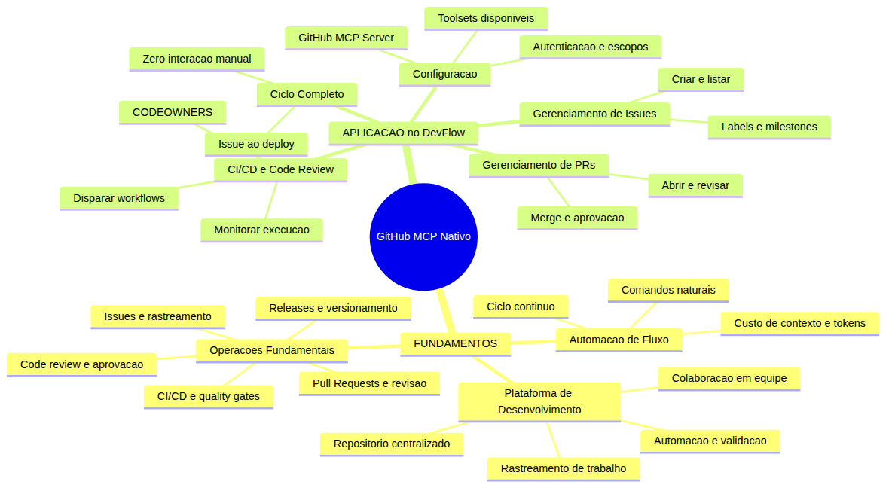
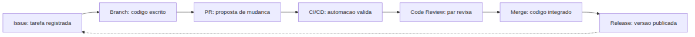

# Programador Profissional com Agentes — Aula 11

## GitHub MCP Nativo no Pipeline

**Duracao estimada:** 55 minutos (30 de leitura + 25 de pratica)

**Nivel:** Intermediario

**Pre-requisitos:** Aula 10 concluida — DevFlow com MCPs de frontend configurados (Figma, Playwright, Browser), `.vscode/mcp.json` funcional, auditoria de MCPs realizada e documentada como ADR

---

## Objetivos de Aprendizagem

Ao final desta aula, voce sera capaz de:

- [ ] **Explicar** o que e uma plataforma de desenvolvimento e seu papel no fluxo profissional de software
- [ ] **Identificar** as operacoes fundamentais de uma plataforma: issues, pull requests, CI/CD, code review e releases
- [ ] **Analisar** como um assistente de codigo pode interagir com essas operacoes de forma nativa, eliminando a alternancia entre ferramentas
- [ ] **Configurar** o servidor MCP da plataforma de desenvolvimento com autenticacao e selecao de toolsets
- [ ] **Diferenciar** os grupos de ferramentas (toolsets) disponiveis e selecionar os necessarios para cada tarefa
- [ ] **Executar** operacoes de gerenciamento de trabalho (criar, listar, atualizar issues) via comandos naturais ao assistente
- [ ] **Executar** operacoes de revisao e integracao (abrir PR, revisar, mergear, disparar CI/CD) via comandos naturais
- [ ] **Executar** um ciclo completo de desenvolvimento — da issue ao deploy — usando apenas comandos naturais, sem interacao manual com a interface da plataforma

---

## Como Usar Esta Aula

Esta aula esta organizada em duas partes. A **primeira parte** constroi os fundamentos conceituais de uma plataforma de desenvolvimento — o que ela oferece, quais operacoes fundamentais ela suporta e como a automacao dessas operacoes transforma o fluxo profissional. A **segunda parte** aplica esses conceitos no DevFlow: voce vai configurar o servidor MCP da sua plataforma, conectar o assistente de codigo ao ecossistema de desenvolvimento, e executar um ciclo completo de trabalho — da criacao de uma tarefa ao merge de codigo revisado e aprovado pela automacao.

Ao longo do caminho, voce encontrara secoes **"Mao na Massa"** para fazer junto e **"Quick Check"** para verificar se entendeu antes de avancar. Ao final, o arquivo separado **Questoes de Aprendizagem** traz as tarefas de checkpoint — so avance para a aula seguinte quando conseguir completa-las por conta propria.

**Tempo estimado:** 30 minutos de leitura + 25 minutos de pratica.

---

## Mapa Mental

Este diagrama mostra todos os conceitos que voce vai dominar nesta aula:



> *O mapa mental acima mostra a estrutura da aula. Cada ramo representa um conceito que voce vai explorar: dos fundamentos conceituais de uma plataforma de desenvolvimento a aplicacao pratica com o GitHub MCP Server no DevFlow.*

---

## Recapitulacao das Aulas 01 a 10

| Aula | Conceito | Onde aparece nesta aula | Como se conecta |
|---|---|---|---|
| Aula 01 | **Ambiente profissional** | Secoes 4-6 | O ambiente agora inclui acesso direto a plataforma de desenvolvimento |
| Aula 02 | **Instructions permanentes** | Secoes 5-6 | Convencoes do time sao aplicadas automaticamente nas operacoes via MCP |
| Aula 03 | **Agent Mode** | Secoes 5-6 | O agente autonomo agora gerencia todo o ciclo de vida no repositorio |
| Aula 04 | **ADRs e Handoff** | Secao 6 | Decisoes documentadas como ADR sao criadas e revisadas via PR |
| Aula 05 | **Codigo Limpo** | Secao 6 | Todo codigo proposto em PR passa pelo mesmo padrao de qualidade |
| Aula 06 | **TDD e Testes** | Secao 6 | Testes sao executados automaticamente via CI/CD disparado pelo MCP |
| Aula 07 | **CI/CD Pipeline** | Secoes 5-6 | O MCP interage diretamente com o pipeline que voce construiu |
| Aula 08 | **Frontend React + E2E** | Secao 6 | Features de frontend seguem o mesmo fluxo issue-PR-revisao |
| Aula 09 | **Skills de Documentacao** | Secao 4 | Skills fornecem conhecimento; MCP fornece acao na plataforma |
| Aula 10 | **MCPs de Frontend** | Secoes 4-5 | Voce ja sabe configurar MCPs no .vscode/mcp.json — mesmo principio |

---

**FUNDAMENTOS: Plataforma de Desenvolvimento**

> *Uma plataforma de desenvolvimento e o sistema centralizado que integra repositorio de codigo, rastreamento de trabalho, automacao de validacao e ferramentas de colaboracao. Esta secao explica os conceitos universais por tras desse ecossistema, sem usar nomes de produtos especificos. Toda plataforma moderna de desenvolvimento compartilha estas caracteristicas fundamentais.*

---

## 1. O Que E uma Plataforma de Desenvolvimento

### O problema que a plataforma resolve

Imagine que voce esta construindo o DevFlow. Ate agora, seu fluxo de trabalho envolve varias ferramentas distintas:

- Um **editor de codigo** para escrever o software
- Um **sistema de controle de versao** para gerenciar historico e branches
- Uma **ferramenta de rastreamento** para registrar bugs e tarefas
- Um **servidor de automacao** para rodar testes e validacoes
- Uma **ferramenta de revisao** para seus colegas analisarem o codigo
- Um **sistema de deploy** para publicar as alteracoes

Cada uma dessas ferramentas tem sua propria interface, suas proprias credenciais, seu proprio jeito de funcionar. Para concluir uma unica tarefa — corrigir um bug — voce precisa alternar entre elas dezenas de vezes: abre a tarefa na ferramenta de rastreamento, cria uma branch no sistema de versao, escreve o codigo no editor, abre uma proposta de mudanca na ferramenta de revisao, espera a automacao rodar, volta para revisar comentarios, faz ajustes no editor, e finalmente faz o merge.

Cada alternancia e uma **quebra de contexto**. Cada quebra de contexto custa tempo, atencao e energia mental.

### O que a plataforma oferece

Uma **plataforma de desenvolvimento** resolve esse problema integrando todas essas funcionalidades em um unico sistema centralizado. Em vez de seis ferramentas separadas, voce tem um ecossistema coeso onde:

- O **codigo** vive em repositorios versionados com historico completo
- O **trabalho** e rastreado como unidades atomicas (tarefas, bugs, melhorias)
- As **mudancas** sao propostas, discutidas e revisadas em um fluxo padronizado
- A **automacao** valida cada proposta antes de integrar ao codigo principal
- As **versoes** sao empacotadas e publicadas com rastreabilidade

Tudo isso no mesmo lugar, com as mesmas credenciais, a mesma interface e — o mais importante — os mesmos **dados interligados**. Uma tarefa sabe em qual branch foi implementada. Um pull request sabe quais testes rodaram. Um deploy sabe qual commit gerou o artefato.

### A analogia do centro de controle

Pense em uma plataforma de desenvolvimento como o **centro de controle de uma fabrica de software**. Sem ele, voce teria que correr entre o almoxarifado (repositorio), a sala de reunioes (rastreamento de tarefas), o laboratorio de qualidade (testes) e a expedicao (deploy) — cada um em um predio diferente, com crachas diferentes e papeis diferentes.

Com o centro de controle, voce ve tudo em um unico painel: quais tarefas estao em andamento, quais foram revisadas, quais estao em teste, quais ja foram publicadas. E, mais importante, voce pode **agir** sobre qualquer parte do processo sem sair do painel.

### O papel do assistente de codigo na plataforma

Ate a Aula 10, seu assistente de codigo operava dentro do editor — ele via seus arquivos, executava comandos no terminal, acessava a web e consultava documentacao via skills. Mas ele nao tinha acesso a plataforma de desenvolvimento.

Isso significa que, mesmo com um assistente poderoso, voce ainda precisava:

1. **Alternar para o navegador** para criar uma tarefa
2. **Alternar para o terminal** para criar uma branch e fazer push
3. **Alternar para o navegador** para abrir um pull request
4. **Alternar para o navegador** para revisar comentarios
5. **Alternar para o navegador** para verificar se a automacao passou

Cada alternancia e uma interrupcao no fluxo. O MCP da plataforma de desenvolvimento elimina essas alternancias — o assistente pode executar **todas** essas operacoes como parte natural da conversa.

> *Ate aqui, voce ja entendeu o papel de uma plataforma de desenvolvimento e por que integra-la ao assistente elimina dezenas de alternancias de contexto por dia. Isso ja e um ganho enorme de produtividade. Vamos agora explorar as operacoes fundamentais que essa plataforma oferece.*

### Quick Check 1

**1. Qual problema central uma plataforma de desenvolvimento resolve?**
**Resposta:** Ela resolve o problema da fragmentacao de ferramentas. Sem uma plataforma, o desenvolvedor precisa alternar entre ferramentas separadas para codigo, rastreamento, automacao e deploy — cada uma com interface e credenciais diferentes. A plataforma integra tudo em um unico sistema, eliminando quebras de contexto.

**2. O que muda quando o assistente de codigo tem acesso a plataforma de desenvolvimento?**
**Resposta:** O assistente pode executar operacoes da plataforma (criar tarefa, abrir proposta, disparar automacao) como parte natural da conversa, sem que o desenvolvedor precise alternar para o navegador. Isso elimina dezenas de interrupcoes de contexto por dia.

---

## 2. Operacoes Fundamentais: Issues, PRs, CI/CD e Code Review

### As cinco operacoes essenciais

Toda plataforma de desenvolvimento oferece um conjunto padrao de operacoes. Estas operacoes formam o **ciclo de vida de uma mudanca de software**.

### 1. Issues: rastreamento de trabalho

Uma **issue** (ou tarefa) e a representacao de uma unidade de trabalho. Pode ser um bug para corrigir, uma funcionalidade para implementar, uma melhoria para aplicar, ou qualquer outra acao que precise ser executada no projeto.

Cada issue contem:
- **Titulo e descricao**: o que precisa ser feito
- **Tipo**: bug, feature, melhoria, tarefa
- **Prioridade**: baixa, media, alta, critica
- **Responsavel**: quem esta trabalhando nela
- **Labels**: categorias para filtro e organizacao
- **Milestone**: a qual versao ou entrega esta vinculada
- **Status**: aberta, em andamento, fechada

Issues sao o **ponto de partida** de todo trabalho profissional. Nenhum codigo deveria ser escrito sem uma issue associada — e essa e uma das convencoes que voce definiu nas Instructions na Aula 02.

### 2. Pull Requests: propostas de mudanca

Um **pull request** (ou PR) e a proposta formal de integrar uma alteracao ao codigo principal. Ele documenta:

- **O que mudou**: diff do codigo alterado
- **Por que mudou**: descricao contextualizada, vinculada a uma issue
- **Como foi validado**: testes que rodaram, checklists preenchidos
- **Quem revisou**: aprovacoes de colegas antes do merge

O PR e o **coração da colaboracao** em desenvolvimento de software. E o momento onde o codigo individual se torna codigo do time.

### 3. CI/CD: automacao de qualidade

CI/CD (Integracao Continua / Entrega Continua) e a **camada de automacao** que valida cada proposta de mudanca. Quando um PR e aberto, a plataforma automaticamente:

1. **Compila** o codigo para verificar se nao ha erros de sintaxe
2. **Executa testes** unitarios e de integracao
3. **Verifica qualidade** com linters e analise estatica
4. **Mede cobertura** para garantir que testes cobrem o codigo novo
5. **Gera artefatos** para deploy

Se qualquer etapa falhar, o PR recebe um alerta vermelho — e o merge so e permitido quando tudo passa.

### 4. Code Review: revisao por pares

**Code review** e o processo onde outros desenvolvedores do time analisam o codigo proposto no PR antes de integra-lo. O revisor verifica:

- **Logica**: o codigo faz o que deveria fazer?
- **Qualidade**: segue os padroes do time? (Aula 05)
- **Testes**: as alteracoes sao cobertas por testes? (Aula 06)
- **Seguranca**: ha vulnerabilidades potenciais?
- **Manutibilidade**: o codigo sera facil de entender no futuro?

Code review nao e uma formalidade — e o principal mecanismo de **transferencia de conhecimento** e **elevacao de qualidade** do time.

### 5. Releases: empacotamento e deploy

Uma **release** e o empacotamento de um conjunto de mudancas em uma versao publicada. Ela vincula:

- Um **numero de versao** (ex: 1.2.0)
- Um **conjunto de commits** que compoem a versao
- **Notas de release** descrevendo o que mudou (em linguagem de usuario, nao tecnica)
- **Artefatos compilados** (binarios, pacotes, imagens Docker)

Releases sao o **ponto de chegada** de cada ciclo de desenvolvimento.

### O fluxo completo

Estas cinco operacoes se conectam em um fluxo continuo:



Cada operacao alimenta a proxima. Nenhuma pode ser pulada em um fluxo profissional — e as convencoes do time (Aula 02) garantem que todas sejam seguidas consistentemente.

### O que voce ja construiu se encaixa aqui

Cada aula ate agora contribuiu para este fluxo:

| Aula | Contribui para |
|---|---|
| Aula 03 Agent Mode | Escrever codigo (etapa B) |
| Aula 06 TDD | Validar com testes (etapa D) |
| Aula 07 CI/CD | Automacao de validacao (etapa D) |
| Aula 08 Issues | Rastreamento de trabalho (etapa A) |
| Aula 05 Codigo Limpo | Qualidade na revisao (etapa E) |

Agora, com o MCP da plataforma, o assistente vai conectar **todas** essas etapas.

### Quick Check 2

**1. Quais sao as cinco operacoes fundamentais de uma plataforma de desenvolvimento?**
**Resposta:** 1) Issues (rastreamento de trabalho), 2) Pull Requests (propostas de mudanca), 3) CI/CD (automacao de qualidade), 4) Code Review (revisao por pares), 5) Releases (empacotamento e deploy).

**2. Por que um PR nunca deveria ser mergeado sem CI/CD e code review?**
**Resposta:** CI/CD garante que o codigo compila, passa nos testes e atende aos padroes de qualidade automaticamente. Code review garante que a logica esta correta, o codigo e manutenivel e o conhecimento e compartilhado entre o time. Pular qualquer um dos dois aumenta o risco de introduzir bugs, divida tecnica e perda de qualidade.

---

## 3. Estrategia de Automacao de Fluxo de Trabalho

### O custo de fazer cada operacao manualmente

Vamos quantificar o custo de um ciclo manual tipico. Para implementar uma correcao simples no DevFlow:

1. Abrir o navegador, logar na plataforma, criar uma issue: **45 segundos**
2. Voltar ao editor, criar branch: **15 segundos**
3. Implementar a correcao: **5 minutos** (com assistente, 2 minutos)
4. Commit e push: **20 segundos**
5. Abrir navegador, criar PR: **60 segundos**
6. Esperar CI/CD rodar: **2 minutos** (automatico)
7. Abrir navegador, verificar resultado: **20 segundos**
8. Se falhou, voltar ao passo 3: **+5 minutos**
9. Se passou, pedir revisao: **30 segundos**
10. Revisor aprova, fazer merge: **20 segundos**

Total de custo manual (somente alternancias entre ferramentas): cerca de **3-4 minutos** de idas e vindas ao navegador para cada tarefa. Multiplique por 10 tarefas por dia e voce perde **30-40 minutos** apenas alternando contexto.

### O que o MCP da plataforma muda

Com o MCP da plataforma conectado ao assistente, o mesmo fluxo se torna:

1. **"Crie uma issue para corrigir o erro na listagem de projetos"** — o assistente cria a issue
2. **"Crie uma branch para essa issue e implemente a correcao"** — o assistente cria branch e codigo
3. **"Abra um PR com a correcao"** — o assistente cria o PR, adiciona descricao e vincula a issue
4. **"O CI/CD passou?"** — o assistente consulta e informa
5. **"O code review esta ok? Pode mergear"** — o assistente faz o merge

Toda interacao com a plataforma acontece **dentro do editor**, como parte da mesma conversa. Zero alternancias para o navegador. Zero quebras de contexto.

### As tres dimensoes da automacao

A automacao de fluxo via assistente tem tres dimensoes:

**1. Automacao de execucao**: o assistente executa as operacoes (criar issue, abrir PR, disparar CI/CD) por voce. Voce descreve o que quer em linguagem natural, e ele executa.

**2. Automacao de consistencia**: o assistente aplica automaticamente as convencoes do time em cada operacao — labels corretas, templates de issue, descricoes de PR no formato padrao, assignees corretos. Nada de "esqueci de adicionar o label".

**3. Automacao de contexto**: como todas as operacoes acontecem na mesma conversa, o assistente tem visibilidade do contexto completo. Ele sabe qual issue voce esta resolvendo, qual branch voce criou, qual PR esta aberto — e usa essas informacoes para agir sem que voce precise repetir.

### Custos e consideracoes

A automacao nao e gratuita. Cada operacao executada pelo assistente consome tokens e requer permissoes adequadas.

| Operacao | Tokens estimados | Requer autenticacao | Risco |
|---|---|---|---|
| Listar issues | ~200 | Leitura | Baixo |
| Criar issue | ~300 | Escrita | Baixo |
| Listar PRs | ~200 | Leitura | Baixo |
| Abrir PR | ~500 | Escrita | Medio |
| Fazer merge | ~300 | Escrita + protecao | Alto |
| Disparar CI/CD | ~400 | Escrita | Medio |

A **regra de ouro** e a mesma da auditoria de MCPs (Aula 10): cada operacao que voce automatiza deve ser frequente o suficiente para justificar o custo em tokens das ferramentas carregadas.

> *Respire. Ate aqui voce entendeu o fluxo completo de operacoes de uma plataforma de desenvolvimento e como a automacao via assistente elimina as alternancias de contexto. Isso e a base conceitual para colocar a mao na massa. Na segunda parte, voce vai configurar o servidor MCP e executar todas essas operacoes no DevFlow.*

### Quick Check 3

**1. Quanto tempo um desenvolvedor pode economizar por dia eliminando alternancias entre plataforma e editor?**
**Resposta:** Cerca de 30-40 minutos por dia (considerando 10 tarefas com ~3-4 minutos de alternancia cada). Esse tempo e recuperado para trabalho real de codigo e design.

**2. Quais sao as tres dimensoes da automacao de fluxo via assistente?**
**Resposta:** 1) Automacao de execucao (assistente faz a operacao por voce), 2) Automacao de consistencia (convencoes do time sao aplicadas automaticamente), 3) Automacao de contexto (assistente tem visibilidade do fluxo completo e age sem repeticoes).

---

**APLICACAO: GitHub MCP Server no DevFlow**

> *Agora que voce entende os fundamentos — o papel de uma plataforma de desenvolvimento, suas operacoes essenciais e o valor da automacao de fluxo — vamos aplicar tudo no DevFlow. Voce vai configurar o servidor MCP nativo da plataforma, aprender a gerenciar issues e pull requests por comando natural, e executar um ciclo completo de desenvolvimento sem tocar no navegador.*

---

## 4. Configuracao do GitHub MCP Server

### O que e o GitHub MCP Server

O GitHub MCP Server e um servidor MCP oficial que expoe as ferramentas da plataforma GitHub para o seu assistente de codigo. Com ele conectado, o assistente ganha a capacidade de interagir com praticamente todas as funcionalidades do GitHub:

- **Repositorios**: criar, listar, gerenciar configuracoes
- **Issues**: criar, listar, atualizar, atribuir labels e milestones
- **Pull Requests**: abrir, revisar, comentar, mergear
- **Actions**: listar workflows, disparar execucoes, monitorar resultados
- **Code Review**: adicionar comentarios, aprovar, solicitar alteracoes
- **Code Security**: verificar alertas de seguranca, gerenciar Dependabot

### Os 19 toolsets disponiveis

O servidor organiza suas ferramentas em **toolsets** — grupos logicos de funcionalidades relacionadas. Cada toolset pode ser ativado ou desativado independentemente.

| Toolset | Funcionalidades | Incluso no padrao |
|---|---|---|
| `context` | Informacoes do contexto atual do usuario | Sim |
| `repos` | Gerenciamento de repositorios | Sim |
| `issues` | Gerenciamento de issues e tarefas | Sim |
| `pull_requests` | Gerenciamento de pull requests | Sim |
| `users` | Informacoes de usuarios | Sim |
| `git` | Operacoes de branch e referencia | Nao |
| `organizations` | Gerenciamento de organizacoes | Nao |
| `actions` | Workflows CI/CD | Nao |
| `code_quality` | Analise de qualidade de codigo | Nao |
| `code_security` | Alertas de seguranca | Nao |
| `secret_protection` | Protecao de segredos | Nao |
| `dependabot` | Atualizacao de dependencias | Nao |
| `discussions` | Fóruns e discussoes | Nao |
| `gists` | Fragmentos de codigo | Nao |
| `security_advisories` | Avisos de vulnerabilidade | Nao |
| `projects` | Quadros de projeto | Nao |
| `labels` | Gerenciamento de labels | Nao |
| `stargazers` | Informacoes de estrelas | Nao |
| `notifications` | Notificacoes | Nao |

O **toolset padrao** inclui `context`, `repos`, `issues`, `pull_requests` e `users`. Para a maioria das tarefas do DevFlow, voce vai precisar adicionar `actions` e `git`.

Para ativar todos de uma vez, use o valor especial `all`. Mas lembre-se da regra da Aula 10: cada MCP adicional custa tokens de manifesto. O mesmo vale para cada toolset dentro do MCP.

### Autenticacao e permissoes

Para conectar o servidor, voce precisa de um **token de acesso pessoal** do GitHub com as permissoes adequadas. O token e como uma chave digital: ele prova que o assistente esta autorizado a agir em seu nome.

Existem dois tipos de token:

1. **Token classico (classic)**: voce escolhe manualmente cada escopo (leitura, escrita, administracao)
2. **Token fino (fine-grained)**: voce escolhe repositorios especificos e permissoes granulares

Para o DevFlow, recomendamos um token classico com os seguintes escopos:

| Escopo | Necessario para | Nivel |
|---|---|---|
| `repo` | Operacoes em repositorios, issues, PRs | Essencial |
| `workflow` | Disparar e monitorar GitHub Actions | Essencial |
| `read:org` | Ler dados da organizacao (se aplicavel) | Opcional |

**Principio do menor privilegio:** conceda apenas os escopos que voce realmente vai usar. Se uma operacao falhar por falta de permissao, o proprio assistente vai informar qual escopo esta faltando — e voce pode adiciona-lo entao.

### Configuracao no .vscode/mcp.json

O servidor MCP do GitHub e configurado no mesmo arquivo que voce ja conhece da Aula 10: `.vscode/mcp.json`.

Existem duas formas de execucao:

**Opcao 1: Servidor remoto (recomendado)**

Esta opcao usa a infraestrutura hospedada do GitHub. Nao requer instalacao local:

```json
{
  "servers": {
    "github": {
      "type": "http",
      "url": "https://api.githubcopilot.com/mcp/",
      "headers": {
        "Authorization": "Bearer ${input:github_mcp_pat}"
      }
    }
  },
  "inputs": [
    {
      "type": "promptString",
      "id": "github_mcp_pat",
      "description": "GitHub Personal Access Token",
      "password": true
    }
  ]
}
```

**Opcao 2: Servidor local (com Docker)**

Esta opcao roda o servidor localmente usando um container Docker. Requer Docker instalado:

```json
{
  "servers": {
    "github": {
      "type": "stdio",
      "command": "docker",
      "args": [
        "run", "-i", "--rm",
        "-e", "GITHUB_PERSONAL_ACCESS_TOKEN",
        "-e", "GITHUB_TOOLSETS=default,actions,git",
        "ghcr.io/github/github-mcp-server"
      ],
      "env": {
        "GITHUB_PERSONAL_ACCESS_TOKEN": "${input:github_pat}"
      }
    }
  },
  "inputs": [
    {
      "id": "github_pat",
      "description": "GitHub Personal Access Token",
      "type": "promptString",
      "password": true
    }
  ]
}
```

Note o uso de `${input:nome}` no lugar de `${VARIAVEL_DE_AMBIENTE}`. Essa sintaxe faz o editor pedir o valor toda vez que inicia uma sessao — mais seguro do que armazenar o token em arquivo.

### Selecionando toolsets especificos

Voce pode limitar quais toolsets o servidor carrega usando a variavel `GITHUB_TOOLSETS`:

```bash
GITHUB_TOOLSETS="repos,issues,pull_requests,actions,git"
```

Isso reduz o manifesto do MCP — menos ferramentas carregadas, menos tokens consumidos. Para o DevFlow, este conjunto cobre 90% das operacoes que voce vai executar.

### Verificando a conexao

Apos configurar, abra o projeto no editor e faca uma pergunta simples ao assistente:

```text
@assistente quais ferramentas do GitHub estao disponiveis para voce?
```

O assistente deve listar as ferramentas dos toolsets que voce configurou. Se ele nao reconhecer nenhuma ferramenta do GitHub, verifique o token, os escopos e o arquivo de configuracao.

### Mao na Massa 1: Configurar o GitHub MCP Server

**Objetivo:** Conectar o servidor MCP do GitHub ao seu ambiente de desenvolvimento e verificar que as ferramentas estao disponiveis.

**Passo 1:** Crie um token de acesso pessoal no GitHub:
- Acesse GitHub.com, va em Settings > Developer settings > Personal access tokens > Tokens (classic)
- Clique em "Generate new token (classic)"
- De um nome descritivo como "DevFlow MCP"
- Selecione os escopos: `repo` (tudo), `workflow`
- Clique em "Generate token" e copie o token gerado

> **IMPORTANTE:** O token so e exibido uma vez. Se perder, tera que gerar outro.

**Passo 2:** Adicione o GitHub MCP Server ao `.vscode/mcp.json` do DevFlow:

```json
{
  "servers": {
    "github": {
      "type": "http",
      "url": "https://api.githubcopilot.com/mcp/",
      "headers": {
        "Authorization": "Bearer ${input:github_mcp_pat}"
      }
    }
  },
  "inputs": [
    {
      "type": "promptString",
      "id": "github_mcp_pat",
      "description": "GitHub Personal Access Token",
      "password": true
    }
  ]
}
```

> **Nota:** Se voce ja tem MCPs de frontend configurados (Aula 10), adicione este bloco `"github"` dentro do objeto `"servers"` existente, ao lado de `"figma-design"`, `"playwright-test"` e `"browser-debug"`.

**Passo 3:** Recarregue a janela do editor (Command Palette > "Developer: Reload Window" ou feche e abra o VS Code).

**Passo 4:** Quando o editor pedir o token, cole o token que voce gerou no Passo 1.

**Passo 5:** Teste a conexao:

```text
@assistente liste as issues abertas do repositorio DevFlow
```

**Resultado esperado:** O assistente consulta o GitHub via MCP e retorna a lista de issues abertas (ou informa que nao ha issues — o que tambem e um resultado valido).

**Passo 6:** Verifique os toolsets ativos:

```text
@assistente quais toolsets do GitHub MCP voce tem disponiveis?
```

**Resultado esperado:** O assistente lista as ferramentas disponiveis, que devem incluir operacoes de repositorios, issues, pull requests e (se voce configurou toolsets adicionais) actions e git.

---

## 5. Gerenciamento de Issues e Pull Requests

### Issues como ponto de partida

Com o GitHub MCP conectado, toda interacao com o repositorio comeca por uma **issue**. Nao importa se e um bug, uma melhoria ou uma nova feature — o primeiro passo e registrar o trabalho.

O assistente pode executar as seguintes operacoes com issues:

| Operacao | Comando natural | Exemplo |
|---|---|---|
| Listar issues | "Liste as issues abertas" | Mostra todas com status, labels, responsavel |
| Criar issue | "Crie uma issue para..." | Cria com titulo, corpo, labels, milestone |
| Atualizar issue | "Atualize a issue #5..." | Muda status, adiciona comentario, reatribui |
| Filtrar issues | "Issues com label bug" | Filtra por label, milestone, responsavel, status |
| Fechar issue | "Feche a issue #5" | Marca como concluida |

### Exemplo: criando uma issue com template

```text
@assistente crie uma issue no repositorio DevFlow com o seguinte:
- Titulo: "Adicionar filtro por status na listagem de projetos"
- Corpo: "Precisamos de um filtro dropdown na pagina de projetos que permita ao usuario filtrar por status (Ativo, Arquivado, Todos)"
- Labels: enhancement, frontend
- Assignee: [seu usuario do GitHub]
- Milestone: v2.0
```

O assistente chama a ferramenta de criacao de issues do MCP, passando todos os parametros. Em segundos, a issue existe no GitHub — sem abrir o navegador.

### Labels e milestones como organizacao

Labels e milestones sao as categorias que estruturam o backlog. O MCP permite gerenciar ambos:

```text
@assistente crie uma label "frontend" com cor azul no repositorio DevFlow
```

```text
@assistente liste os milestones do repositorio DevFlow
```

### Pull Requests: da branch ao merge

Com a issue criada, o proximo passo e implementar e abrir um PR. O MCP oferece:

| Operacao | Comando natural | Descricao |
|---|---|---|
| Criar PR | "Abra um PR para..." | Cria PR com titulo, corpo, branch, revisores |
| Listar PRs | "Liste PRs abertos" | Mostra todos com status, CI/CD, revisoes |
| Revisar PR | "Revise o PR #7" | Adiciona comentarios, aprova ou solicita mudancas |
| Fazer merge | "Mergeie o PR #7" | Integra ao branch principal |

### Exemplo: abrindo um PR

```text
@assistente abra um pull request:
- Branch: feature/filtro-status
- Base: main
- Titulo: "Adiciona filtro por status na listagem de projetos"
- Corpo: "Implementa o filtro dropdown discutido na issue #5. O componente FilterBar foi adicionado a pagina de projetos e permite filtrar por Ativo, Arquivado ou Todos."
- Revisores: [usuario do revisor]
- Labels: frontend
- Link: "Closes #5" no corpo do PR
```

O assistente cria a branch (se necessario), faz o push do codigo (se ja implementado), e abre o PR com todas as informacoes.

### A magia do vinculo automatico

Quando o corpo do PR inclui `Closes #5` (ou `Resolves #5`, `Fixes #5`), o GitHub automaticamente vincula o PR a issue. Quando o PR e mergeado, a issue e fechada automaticamente.

O assistente cuida desse vinculo — voce so precisa dizer "vincula a issue #5".

### Code review via assistente

O assistente tambem pode atuar como intermediario no code review:

```text
@assistente o PR #7 precisa de revisao. Pode me mostrar um resumo do que mudou?
```

```text
@assistente adicione um comentario no PR #7: "O componente FilterBar esta bem estruturado. Sugiro adicionar testes para o caso de lista vazia."
```

```text
@assistente aprove o PR #7 — o codigo esta dentro dos padroes do DevFlow
```

### Mao na Massa 2: Criar Issue e Abrir PR no DevFlow

**Objetivo:** Usar o GitHub MCP para criar uma issue, implementar a funcionalidade e abrir um pull request — tudo via assistente.

**Passo 1:** Pec,a ao assistente para criar uma issue:

```text
@assistente crie uma issue no DevFlow com:
- Titulo: "Adicionar indicador visual de status nos cards de projeto"
- Corpo: "Cada card de projeto na pagina inicial deve exibir um badge ou indicador visual mostrando o status do projeto (Ativo, Arquivado, Em pausa). Usar cores: verde para ativo, cinza para arquivado, amarelo para em pausa."
- Labels: enhancement, frontend, good-first-issue
```

**Passo 2:** Implemente a funcionalidade no codigo (use o Agent Mode da Aula 03 para isso, ou implemente manualmente).

**Passo 3:** Pec,a ao assistente para abrir o PR:

```text
@assistente abra um PR com a implementacao do indicador de status:
- Branch: feature/status-indicator
- Base: main
- Titulo: "Adiciona indicador visual de status nos cards de projeto"
- Corpo: implementacao que vincula Closes #[NUMERO_DA_ISSUE]
- Labels: frontend
- Revisores: deixe em branco por enquanto
```

**Passo 4:** Verifique se o PR foi criado corretamente:

```text
@assistente me mostre o PR que acabou de ser criado
```

**Resultado esperado:** A issue foi criada com labels corretas. O PR foi aberto com titulo, corpo e vinculo com a issue. Tudo sem abrir o navegador.

---

## 6. Ciclo Completo no DevFlow: Issue, PR, Revisao, CI/CD

### O fluxo completo em acao

Com o GitHub MCP configurado, voce pode executar o **ciclo completo de desenvolvimento** sem sair do editor. Vamos percorrer um exemplo completo no DevFlow.

### Cenario: nova feature de arquivamento de projetos

O DevFlow precisa de uma funcionalidade para arquivar projetos. Em vez de abrir o GitHub, criar uma issue, depois implementar, depois abrir PR, voce faz tudo em uma unica sessao com o assistente.

**Etapa 1: Criar a issue**

```text
@assistente crie uma issue no DevFlow:
- Titulo: "Implementar arquivamento de projetos"
- Corpo: feature para arquivar projetos
- Labels: enhancement
```

**Etapa 2: Criar branch e implementar**

```text
@assistente crie uma branch feature/arquivar from main e implemente:
- Botao "Arquivar" na pagina de detalhes do projeto
- Endpoint PATCH /api/projects/:id/archive no backend
- Confirmacao antes de arquivar
- Testes unitarios para o novo endpoint
```

O assistente cria a branch, implementa o codigo no backend e frontend, escreve os testes e faz o commit.

**Etapa 3: Abrir o PR**

```text
@assistente abra um pull request da branch feature/arquivar para main
- Titulo: "Implementa arquivamento de projetos"
- Labels: enhancement
- Vincula a issue criada na etapa 1
```

**Etapa 4: Verificar CI/CD**

```text
@assistente o CI/CD passou no PR? Mostre o status dos checks
```

O assistente consulta o status do GitHub Actions e informa se todos os checks passaram.

**Etapa 5: Code review e merge**

```text
@assistente faca o code review do PR. O codigo esta dentro dos padroes do DevFlow?
```

O assistente analisa o diff e da seu parecer.

```text
@assistente aprove e faca o merge do PR #7 para main
```

O assistente aprova e faz o merge.

**Tudo isso sem abrir o navegador uma unica vez.**

### CODEOWNERS: revisao automatica

O arquivo `CODEOWNERS` define quem e responsavel por revisar mudancas em partes especificas do codigo. Quando um PR modifica arquivos com `CODEOWNERS` definido, o GitHub atribui automaticamente os revisores.

Exemplo de `.github/CODEOWNERS` para o DevFlow:

```
## Responsaveis por areas do projeto
/src/backend/    @backend-team
/src/frontend/   @frontend-team
/docs/           @tech-writer
*.md             @docs-owner
```

Com o CODEOWNERS configurado, voce nao precisa especificar revisores manualmente — o GitHub atribui automaticamente.

### Monitoramento de CI/CD

Uma das operacoes mais uteis do MCP de plataforma e o monitoramento de CI/CD:

```text
@assistente como esta o workflow do PR #7?
```

```text
@assistente o ultimo workflow run falhou. Quais jobs foram afetados?
```

```text
@assistente dispare novamente o workflow do branch feature/arquivar
```

### A regra de ouro do ciclo completo

O ciclo completo so funciona se cada etapa estiver preparada para a proxima:

1. **Issue** tem descricao clara, labels e milestone
2. **Branch** segue o padrao de nomenclatura do time
3. **Commit** segue o padrao de mensagens do time
4. **PR** tem descricao, vinculo com issue, revisores
5. **CI/CD** passa em todos os checks
6. **Code review** aprova ou solicita ajustes
7. **Merge** integra ao branch principal
8. **Deploy** publica a versao

O MCP garante que voce pode executar cada etapa com comandos naturais. O arquivo `copilot-instructions.md` (Aula 02) garante que cada etapa segue as convencoes do time. O CI/CD (Aula 07) garante que cada etapa e validada automaticamente.

### Mao na Massa 3: Ciclo Completo no DevFlow

**Objetivo:** Executar o ciclo completo de desenvolvimento — issue, branch, implementacao, PR, CI/CD e merge — usando apenas comandos naturais ao assistente.

**Passo 1:** Crie uma issue para adicionar uma feature de "ordenacao de projetos por data":

```text
@assistente crie uma issue no DevFlow:
- Titulo: "Ordenar projetos por data de criacao"
- Corpo: "Na pagina de listagem de projetos, adicionar a opcao de ordenar por data de criacao (mais recentes primeiro). Deve ser um toggle no cabecalho da listagem."
- Labels: enhancement, frontend, backend
```

Anote o numero da issue gerada.

**Passo 2:** Implemente a feature no Agent Mode:

```text
@assistente crie uma branch feature/ordenar-data a partir de main.
Implemente:
- Backend: query param ?sort=createdAt&order=desc no GET /api/projects
- Frontend: toggle de ordenacao no cabecalho da listagem
- Testes: ajuste os testes existentes para cobrir a ordenacao
```

**Passo 3:** Abra o PR vinculando a issue:

```text
@assistente abra um pull request da branch feature/ordenar-data para main.
Titulo: "Adiciona ordenacao de projetos por data de criacao"
Labels: enhancement
Use "Closes #[NUMERO_DA_ISSUE]" no corpo do PR
```

**Passo 4:** Verifique o status do CI/CD:

```text
@assistente o CI/CD passou no PR que eu acabei de abrir?
```

Se falhou, corrija e faca novo commit. O assistente pode ajudar.

**Passo 5:** Se tudo passou, faca o code review e merge:

```text
@assistente o codigo esta dentro dos padroes? Faca uma revisao rapida e me diga se pode mergear.

@assistente pode fazer o merge entao.
```

O assistente faz o merge do PR para main.

**Passo 6:** Verifique se o workflow de deploy foi disparado:

```text
@assistente o merge disparou o workflow de deploy? Qual o status?
```

**Resultado esperado:** Uma issue criada, implementada, revisada e mergeada — tudo via comandos naturais ao assistente, sem abrir o GitHub no navegador.

---

## Exercicios Graduados

### Exercicio 1 (Facil): Configurar Toolsets Especificos

**Contexto:** Voce configurou o GitHub MCP com o toolset padrao (default), mas agora precisa de acesso ao Actions para monitorar CI/CD.

**Tarefa:**
1. Identifique qual toolset voce precisa adicionar para acessar GitHub Actions
2. Atualize a configuracao do GitHub MCP no `.vscode/mcp.json` para incluir `actions` e `git`
3. Verifique a configuracao perguntando ao assistente quais ferramentas estao disponiveis

**Criterio de sucesso:** O assistente lista ferramentas de `actions` e `git` entre as disponiveis. O manifesto do MCP consumiu mais tokens (porque mais ferramentas foram carregadas).

---

### Exercicio 2 (Medio): Gerenciar Labels e Milestones

**Contexto:** O time do DevFlow decidiu organizar o backlog com labels e milestones padronizadas.

**Tarefa:**
1. Crie as seguintes labels no repositorio DevFlow (via MCP):

| Label | Cor |
|---|---|
| `frontend` | #1A73E8 (azul) |
| `backend` | #34A853 (verde) |
| `bug` | #EA4335 (vermelho) |
| `enhancement` | #FBBC04 (amarelo) |
| `documentation` | #8E24AA (roxo) |

2. Crie um milestone chamado "Sprint 1" com data de entrega para daqui a 2 semanas
3. Crie 3 issues, cada uma com uma label diferente e associada ao milestone "Sprint 1"
4. Liste todas as issues do milestone e verifique se as labels estao corretas

**Criterio de sucesso:** 5 labels criadas com as cores especificadas. Milestone "Sprint 1" criado. 3 issues no milestone com labels corretas. Tudo via assistente.

---

### Exercicio 3 (Dificil): Ciclo Completo com Code Review e CI/CD

**Contexto:** Voce precisa implementar uma feature completa no DevFlow — do registro ao merge — usando apenas comandos naturais. Nenhuma interacao manual com o GitHub.

**Tarefa:**
1. Crie uma issue para adicionar "validacao de email no formulario de cadastro de projeto"
2. Crie uma branch e implemente: validacao no backend (express-validator) e feedback visual no frontend
3. Abra um PR com descricao detalhada, vinculando a issue
4. Verifique o status do CI/CD — se falhar, corrija
5. Fac,a code review do PR (simule a revisao com o assistente)
6. Fac,a o merge apos aprovacao
7. Verifique se o merge disparou o workflow de deploy
8. Documente o ciclo em um ADR (formato da Aula 04) em `docs/adrs/ADR-012-ciclo-completo-github-mcp.md`

**Criterio de sucesso:** Ciclo completo executado sem abrir o navegador. Issue, branch, commits, PR, CI/CD verificacao, code review, merge e deploy monitoring — tudo via assistente. ADR documentando o fluxo.

---

## Autoavaliacao: Quiz Rapido

**1. Quantos toolsets o GitHub MCP Server oferece no total?**

> a) 5
> b) 12
> c) 19
> d) 25

**Resposta:** c) 19. O GitHub MCP Server oferece 19 toolsets que cobrem desde repositorios e issues ate seguranca, notificacoes e stargazers.

---

**2. Qual escopo de token e essencial para operacoes basicas como criar issues e abrir PRs?**

> a) `read:org`
> b) `repo`
> c) `workflow`
> d) `gist`

**Resposta:** b) `repo`. O escopo `repo` concede acesso a repositorios, issues e pull requests. O escopo `workflow` e adicional para GitHub Actions.

---

**3. O que o arquivo CODEOWNERS faz?**

> a) Define quem pode fazer merge em branches protegidos
> b) Atribui automaticamente revisores para PRs baseado nos arquivos alterados
> c) Lista todos os proprietarios do repositorio
> d) Configura permissoes de deploy

**Resposta:** b) Atribui automaticamente revisores para PRs baseado nos arquivos alterados. Quando um PR modifica arquivos com CODEOWNERS definido, o GitHub atribui automaticamente os revisores responsaveis.

---

**4. Qual a principal vantagem de integrar o MCP da plataforma ao fluxo de desenvolvimento?**

> a) O codigo fica mais rapido
> b) Elimina a necessidade de alternar entre o editor e o navegador para operacoes da plataforma
> c) Remove a necessidade de code review
> d) O CI/CD passa automaticamente

**Resposta:** b) Elimina a necessidade de alternar entre o editor e o navegador para operacoes da plataforma. Todas as operacoes (criar issue, abrir PR, revisar, mergear) acontecem dentro do editor como parte da conversa.

---

**5. O que acontece quando um PR contem "Closes #5" no corpo e e mergeado?**

> a) Nada — e so uma referencia textual
> b) A issue #5 e automaticamente fechada
> c) O PR e fechado sem merge
> d) Um novo milestone e criado

**Resposta:** b) A issue #5 e automaticamente fechada. O GitHub reconhece palavras-chave como "Closes", "Fixes" e "Resolves" seguidas do numero da issue, e fecha a issue automaticamente quando o PR e mergeado.

---

**6. Qual toolset voce precisa adicionar ao padrao para gerenciar GitHub Actions via MCP?**

> a) `workflows`
> b) `actions`
> c) `cicd`
> d) `pipeline`

**Resposta:** b) `actions`. O toolset `actions` expoe ferramentas para listar, disparar e monitorar workflows do GitHub Actions.

---

## Resumo da Aula

1. **Plataforma de desenvolvimento** e o sistema centralizado que integra repositorio, rastreamento de trabalho, automacao e colaboracao — eliminando a fragmentacao de ferramentas

2. **Cinco operacoes fundamentais** formam o ciclo de vida de uma mudanca: issues (rastreamento), PRs (propostas), CI/CD (automacao), code review (revisao) e releases (publicacao)

3. **Automacao de fluxo via assistente** elimina 30-40 minutos diarios de alternancia entre ferramentas, com tres dimensoes: execucao, consistencia e contexto

4. **GitHub MCP Server** expoe 19 toolsets que cobrem todas as operacoes da plataforma, configurados via `.vscode/mcp.json`

5. **Tokens de acesso pessoal** com escopos `repo` e `workflow` sao a chave de autenticacao para o assistente agir no GitHub

6. **Issues sao gerenciadas** por comandos naturais: criar, listar, filtrar, atualizar, atribuir labels e milestones

7. **Pull Requests sao gerenciados** por comandos naturais: abrir, revisar, comentar, aprovar e mergear — com vinculo automatico a issues

8. **Ciclo completo** do desenvolvimento pode ser executado sem abrir o navegador: issue → branch → implementacao → PR → CI/CD → code review → merge

---

## Proxima Aula

**Aula 12: Subagentes e Delegacao — Seu Time de Agentes Especializados**

Voce vai criar subagentes especializados no `.github/agents/` do DevFlow: `@reviewer` (revisao de codigo seguindo checklist do time), `@tester` (geracao e execucao de testes) e `@documenter` (documentacao a partir do codigo). O fio condutor: o GitHub MCP que voce configurou hoje e a plataforma onde esses subagentes vao atuar — eles vao criar issues, revisar PRs e disparar CI/CD autonomamente.

---

## Referencias

- GitHub MCP Server — documentacao oficial do servidor (toolsets, instalacao, configuracao)
- GitHub Personal Access Tokens — criacao e escopos de tokens classicos e fine-grained
- CODEOWNERS — documentacao do arquivo de atribuicao automatica de revisores
- GitHub Issues — documentacao de formatos e templates
- Pull Requests — documentacao de revisao e merge

---

## FAQ

**1. Preciso instalar algo para usar o GitHub MCP Server?**

Depende da opcao escolhida. O servidor remoto (recomendado) nao requer instalacao — a configuracao aponta para a URL hospedada do GitHub. O servidor local requer Docker para rodar o container.

**2. Qual a diferenca entre o servidor remoto e o local?**

O remoto e mais simples (sem instalacao), mas requer conexao com a internet e usa a infraestrutura hospedada do GitHub. O local roda no seu computador, oferece mais controle sobre toolsets e funciona offline (para operacoes em cache).

**3. Posso conectar o GitHub MCP junto com os MCPs de frontend (Aula 10)?**

Sim. O `.vscode/mcp.json` aceita varios servidores simultaneamente. Basta adicionar um novo objeto `"github"` dentro do bloco `"servers"` ao lado dos existentes. Lembre-se de auditar o custo de tokens (Aula 10, Secao 3).

**4. E seguro dar um token de acesso ao assistente?**

Sim, desde que voce siga duas regras: 1) Use o principio do menor privilegio — conceda apenas os escopos necessarios; 2) Use `${input:nome}` no lugar de variaveis de ambiente para que o token nunca seja salvo em arquivo.

**5. O que fazer se uma operacao falhar por falta de permissao?**

O proprio assistente informa qual escopo esta faltando na mensagem de erro. Voce pode atualizar o token no GitHub adicionando o escopo necessario e reiniciar a sessao.

**6. O GitHub MCP Server funciona com GitHub Enterprise?**

A versao oficial do servidor suporta GitHub.com. Para GitHub Enterprise, consulte a documentacao especifica de configuracao de servidores MCP em ambientes corporativos.

**7. Quantos toolsets devo ativar para o dia a dia?**

Comece com o padrao (`repos`, `issues`, `pull_requests`, `users`, `context`). Adicione `actions` e `git` apenas quando precisar deles. O toolset `all` e util para exploracao, mas nao para uso continuo — ele carrega mais de 100 ferramentas, consumindo muitos tokens de manifesto.

---

## Glossario

| Termo | Definicao |
|---|---|
| **Plataforma de desenvolvimento** | Sistema centralizado que integra repositorio de codigo, rastreamento de trabalho, automacao e colaboracao |
| **Issue** | Unidade de trabalho (bug, feature, melhoria) registrada na plataforma |
| **Pull Request (PR)** | Proposta formal de integracao de alteracao ao codigo principal |
| **CI/CD** | Integracao Continua e Entrega Continua — automacao que valida e publica alteracoes |
| **Code Review** | Processo de revisao de codigo por pares antes da integracao |
| **Release** | Empacotamento de mudancas em uma versao publicada |
| **GitHub MCP Server** | Servidor MCP oficial que expoe ferramentas do GitHub para o assistente |
| **Toolset** | Grupo logico de ferramentas relacionadas dentro do MCP (ex: `issues`, `actions`) |
| **Token de acesso pessoal** | Chave de autenticacao que permite ao assistente agir no GitHub em seu nome |
| **Escopo (scope)** | Nivel de permissao concedido a um token (ex: `repo`, `workflow`) |
| **CODEOWNERS** | Arquivo que define revisores automaticos para partes especificas do codigo |
| **Quebra de contexto** | Interrupcao no fluxo de trabalho causada por alternar entre ferramentas ou interfaces |
