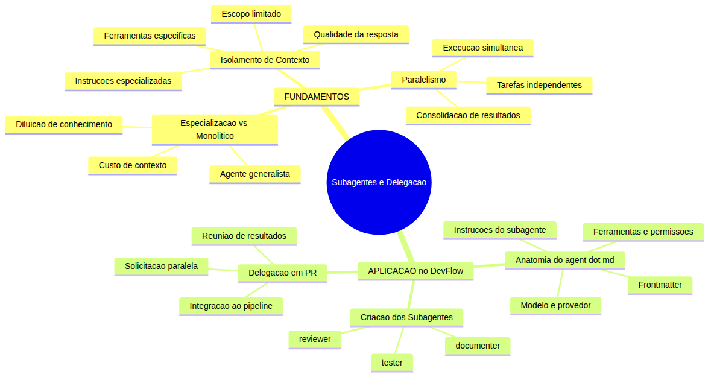

# Programador Profissional com Agentes — Aula 12

## Subagentes e Delegacao — Seu Time de Agentes Especializados

**Duracao estimada:** 55 minutos (30 de leitura + 25 de pratica)

**Nivel:** Avancado

**Pre-requisitos:** Aula 11 concluida — DevFlow com GitHub MCP Server configurado e funcional, pipeline de issues e PRs operacional, CODEOWNERS definido, convencoes do time documentadas em `.github/copilot-instructions.md`

---

## Objetivos de Aprendizagem

Ao final desta aula, voce sera capaz de:

- [ ] **Diferenciar** agente monolitico de equipe de subagentes especializados, identificando quando cada abordagem e adequada
- [ ] **Explicar** o principio de isolamento de contexto e seu impacto na qualidade das respostas de cada agente
- [ ] **Descrever** o modelo de paralelismo entre subagentes e os ganhos de eficiencia em relacao a execucao sequencial
- [ ] **Analisar** a anatomia de um arquivo `.agent.md` — frontmatter, tools, instrucoes e escopo
- [ ] **Criar** o subagente `@reviewer` com checklist de revisao, ferramentas de leitura e restricoes de escopo
- [ ] **Criar** o subagente `@tester` com geracao e execucao de testes e verificacao de cobertura
- [ ] **Criar** o subagente `@documenter` com extracao de documentacao e geracao de README e API docs
- [ ] **Executar** delegacao paralela de @reviewer e @tester no fluxo de revisao de um Pull Request
- [ ] **Integrar** os tres subagentes ao pipeline do DevFlow, consolidando resultados em um unico PR

---

## Como Usar Esta Aula

Esta aula esta organizada em duas partes. A **primeira parte** constroi os fundamentos conceituais da especializacao de agentes — por que um time de agentes e mais eficaz que um agente monolitico, como o isolamento de contexto protege a qualidade e como o paralelismo acelera tarefas independentes. A **segunda parte** aplica esses conceitos no DevFlow: voce vai criar tres subagentes especializados em `.github/agents/`, configura-los com ferramentas e escopos adequados, e executa-los em paralelo para revisar um Pull Request completo.

Ao longo do caminho, voce encontrara secoes **"Mao na Massa"** para fazer junto e **"Quick Check"** para verificar se entendeu antes de avancar. Ao final, o arquivo separado **Questoes de Aprendizagem** traz as tarefas de checkpoint — so avance para a aula seguinte quando conseguir completa-las por conta propria.

**Tempo estimado:** 30 minutos de leitura + 25 minutos de pratica.

---

## Mapa Mental

Este diagrama mostra todos os conceitos que voce vai dominar nesta aula:



> *O mapa mental acima mostra a estrutura da aula. Cada ramo representa um conceito que voce vai explorar: dos fundamentos da especializacao a criacao pratica de subagentes no DevFlow.*

---

## Recapitulacao das Aulas 01 a 11

| Aula | Conceito | Onde aparece nesta aula | Como se conecta |
|---|---|---|---|
| Aula 01 | **Ambiente profissional** | Secoes 4-5 | Os subagentes operam no mesmo ambiente que voce configurou |
| Aula 02 | **Instructions permanentes** | Secoes 4-5 | Convencoes do time sao herdadas pelos subagentes |
| Aula 03 | **Agent Mode** | Secoes 5-6 | Subagentes usam o mesmo loop Understand-Act-Validate |
| Aula 04 | **ADRs e Handoff** | Secao 6 | Documenter gera ADRs como saida da revisao |
| Aula 05 | **Codigo Limpo** | Secao 5 | Reviewer verifica principios de clean code |
| Aula 06 | **TDD e Testes** | Secao 5 | Tester executa e valida a cobertura de testes |
| Aula 07 | **CI/CD Pipeline** | Secao 6 | Resultados dos subagentes alimentam o CI/CD |
| Aula 08 | **Frontend React + E2E** | Secao 5 | Reviewer e Tester cobrem codigo frontend tambem |
| Aula 09 | **Skills de Documentacao** | Secao 5 | Documenter usa skills como referencia |
| Aula 10 | **MCPs de Frontend** | Secao 4 | Subagentes usam MCPs como ferramentas |
| Aula 11 | **GitHub MCP Nativo** | Secoes 5-6 | Subagentes interagem com GitHub via MCP |

---

**FUNDAMENTOS: Especializacao, Isolamento e Paralelismo**

> *Um time de agentes especializados e mais eficaz que um agente monolitico. Esta secao explica os tres pilares conceituais que tornam a delegacao viavel: por que especializar, como isolar contexto e como paralelizar. Nenhum nome de produto ou ferramenta especifica sera usado aqui — apenas conceitos universais.*

---

## 1. Especializacao vs Monolitico — Por Que Delegar

### O problema do agente generalista

Ate agora, voce usou um assistente de codigo que sabe fazer de tudo: escrever codigo, revisar, testar, documentar, criar issues, abrir PRs. Ele e como um profissional "faz-tudo" — capaz de executar qualquer tarefa, mas sem aprofundamento extremo em nenhuma.

Esse modelo funciona bem para tarefas isoladas. Mas conforme o projeto cresce, o agente generalista comeca a mostrar limitacoes:

- **Diluicao de conhecimento**: as instrucoes precisam cobrir todos os dominios ao mesmo tempo (codigo, testes, documentacao, revisao). O prompt fica inchado e nada e executado com excelencia.
- **Custo de contexto elevado**: cada sessao carrega instrucoes de todos os dominios, mesmo quando a tarefa atual so precisa de um. Voce paga tokens para carregar regras de teste quando esta apenas documentando.
- **Inconsistencia entre tarefas**: sem um conjunto fixo de instrucoes especializadas, o mesmo tipo de tarefa pode ser executado de forma diferente a cada vez — um dia a revisao e rigorosa, no outro e superficial.
- **Dificuldade de evolucao**: melhorar a qualidade da revisao exige alterar as instrucoes gerais, o que pode afetar como o codigo e escrito ou como os testes sao gerados.

### A analogia da fabrica de software

Imagine uma fabrica onde cada funcionario faz tudo: opera a maquina, inspeciona a qualidade, empacota o produto e atualiza o manual. O resultado e previsivel: ninguem e especialista em nada, a qualidade e inconsistente, e quando algo da errado, nao se sabe quem ou o que causou o problema.

Agora imagine a mesma fabrica com profissionais especializados: um operador de maquina que conhece cada engrenagem, um inspetor de qualidade com checklist rigoroso, um empacotador que otimiza cada caixa, e um redator tecnico que documenta cada detalhe. Cada um faz uma coisa — e faz muito bem.

O principio e o mesmo para agentes de codigo. Em vez de um unico agente que tenta fazer tudo, voce cria **subagentes especializados**, cada um com:
- Um **conjunto enxuto de instrucoes** focadas no seu dominio
- **Ferramentas especificas** para o que precisa fazer
- Um **escopo claro** do que faz e do que NAO faz

### Quando usar subagentes

A especializacao tem custo: voce precisa criar e manter cada subagente. Ela se paga quando:

| Cenario | Abordagem recomendada |
|---|---|
| Projeto pequeno (< 5 arquivos, 1 desenvolvedor) | Agente generalista resolve |
| Projeto medio (5-20 arquivos, 1-2 devs) | Subagentes para revisao e testes |
| Projeto grande (20+ arquivos, time) | Subagentes para cada dominio |
| Tarefas repetitivas e previsiveis | Subagentes sao ideais |
| Tarefas criativas ou exploratorias | Agente generalista com contexto amplo |

Para o DevFlow — que ja tem backend, frontend, testes, CI/CD e documentacao — os subagentes sao o proximo passo natural.

### A regra de ouro da especializacao

Um subagente deve conseguir responder a tres perguntas com clareza:

1. **Qual e meu dominio?** (ex: "reviso codigo seguindo as convencoes do time")
2. **Quais ferramentas eu uso?** (ex: "leio arquivos, procuro padroes, comento em PRs")
3. **O que eu NAO faco?** (ex: "nao escrevo codigo novo, nao gero testes, nao modifico arquivos")

A terceira pergunta e a mais importante. Um subagente que tenta fazer coisas fora do seu escopo perde a especializacao e se torna um generalista disfarcado.

> *Ate aqui voce entendeu por que a especializacao e importante e quando cada abordagem faz sentido. Um agente monolitico e suficiente para projetos pequenos; um time de subagentes brilha quando o projeto cresce e as tarefas se diversificam. Respire. O proximo conceito — isolamento de contexto — e o que torna a especializacao viavel na pratica.*

### Quick Check 1

**1. Quais sao as tres limitacoes principais de um agente generalista em projetos grandes?**
**Resposta:** 1) Diluicao de conhecimento — instrucoes precisam cobrir todos os dominios, deixando nenhum com excelencia. 2) Custo de contexto elevado — voce paga tokens para carregar regras de dominios que nao estao sendo usados. 3) Inconsistencia entre tarefas — a mesma tarefa pode ser executada de forma diferente a cada vez, dependendo do contexto carregado.

**2. Qual e a pergunta mais importante que um subagente deve saber responder?**
**Resposta:** "O que eu NAO faco?" Definir o escopo negativo — o que esta fora do dominio — e essencial para evitar que o subagente vire um generalista disfarcado.

---

## 2. Isolamento de Contexto — Cada Agente com Seu Universo

### O que e isolamento de contexto

**Isolamento de contexto** significa que cada subagente recebe apenas a informacao necessaria para executar sua tarefa especifica — nem mais, nem menos. O @reviewer nao carrega as instrucoes de geracao de testes. O @tester nao carrega o checklist de revisao de codigo. Cada um tem seu proprio "universo" de conhecimento.

Isso parece obvio, mas e o oposto do que acontece com um agente generalista. No modelo monolitico, todas as instrucoes competem pelo mesmo espaco de contexto. No modelo de subagentes, cada instrucao tem seu proprio espaco dedicado.

### Por que isolamento melhora a qualidade

O isolamento de contexto melhora a qualidade por tres mecanismos:

**1. Proporcao sinal-ruido**: em um prompt especializado, quase todas as instrucoes sao relevantes para a tarefa. Em um prompt generalista, grande parte do texto trata de dominios que nao importam no momento. Quanto maior a proporcao de instrucoes uteis, melhor o agente executa.

**2. Foco atencional**: modelos de linguagem tem atencao limitada. Instrucoes sobre dominios irrelevantes consomem "espaco mental" do modelo, reduzindo a capacidade de seguir as instrucoes que realmente importam para a tarefa atual.

**3. Previsibilidade**: um subagente com escopo fixo se comporta de forma consistente. O @reviewer sempre aplica o mesmo checklist, sempre usa as mesmas ferramentas, sempre produz saida no mesmo formato. Isso e impossivel de garantir com um agente generalista cujo comportamento varia conforme o historico da conversa.

### A analogia das pastas de trabalho

Pense em cada subagente como tendo sua propria **pasta de trabalho** fisica. Na pasta do @reviewer, so ha o que ele precisa: checklist de revisao, guia de estilos do time, exemplos de bons e maus padroes. Na pasta do @tester: framework de testes, comandos de execucao, regras de cobertura minima.

Quando o @reviewer trabalha, ele abre APENAS a pasta dele. Nada de instrucoes de teste ou documentacao no meio do caminho. O resultado e um trabalho mais rapido, mais consistente e com menos erros.

No modelo monolitico, seria como ter uma unica pasta gigante com tudo misturado — e o agente precisando vasculhar toda ela para encontrar o que precisa a cada tarefa.

### O custo do isolamento

Isolamento de contexto nao e gratuito. Cada subagente ocupa espaco em disco e requer configuracao inicial. A tabela abaixo mostra o trade-off:

| Aspecto | Agente Generalista | Subagentes Especializados |
|---|---|---|
| Instrucoes carregadas por tarefa | Todas (100%) | Apenas as relevantes (20-30%) |
| Qualidade da saida | Media | Alta (focada) |
| Consistencia entre execucoes | Variavel | Previsivel |
| Facilidade de manutencao | Um arquivo so | Varios arquivos |
| Curva de aprendizado inicial | Baixa | Media |

Para o DevFlow, o ganho de qualidade supera o custo de manutencao a partir do momento em que voce tem tarefas recorrentes de revisao, testes e documentacao.

> *Respire. O isolamento de contexto e o que transforma um grupo de agentes em um time eficiente. Cada um com seu escopo, suas ferramentas, seu foco. Agora que voce entende os dois primeiros pilares — especializacao e isolamento — o terceiro pilar completa o quadro: paralelismo.*

### Quick Check 2

**1. O que e isolamento de contexto e por que ele e importante para subagentes?**
**Resposta:** Isolamento de contexto significa que cada subagente recebe apenas as instrucoes e ferramentas necessarias para seu dominio especifico. Ele e importante porque melhora a proporcao sinal-ruido do prompt, foca a atencao do modelo nas instrucoes relevantes e torna o comportamento do subagente previsivel e consistente.

**2. Qual a principal desvantagem do isolamento de contexto?**
**Resposta:** O custo de manutencao. Em vez de um unico arquivo de instrucoes, voce tem varios arquivos para criar e manter. O ganho de qualidade precisa superar esse custo para que a abordagem valha a pena.

---

## 3. Paralelismo — Multiplos Agentes, Uma Tarefa

### O que e paralelismo de subagentes

**Paralelismo** e a execucao simultanea de multiplos subagentes em tarefas independentes. Em vez de um agente fazer tudo em sequencia — primeiro revisar, depois testar, depois documentar — os tres subagentes trabalham ao mesmo tempo, cada um no seu dominio.

O principio e simples: tarefas que nao dependem umas das outras podem ser executadas em paralelo.

### Por que paralelismo e importante

O ganho principal nao e apenas velocidade — e **eficiencia de recursos**. Veja a comparacao:

**Fluxo sequencial (agente unico):**
1. Revisar codigo: 3 minutos (carregando contexto de revisao + testes + docs)
2. Gerar e executar testes: 4 minutos (mesmo contexto, mas agora focado em testes)
3. Gerar documentacao: 2 minutos (mesmo contexto, agora focado em docs)
Total: **9 minutos** de processamento — com contexto inchado durante todo o processo.

**Fluxo paralelo (subagentes):**
1. @reviewer revisa: 2 minutos (contexto enxuto, so revisao)
2. @tester testa: 3 minutos (contexto enxuto, so testes)
3. @documenter documenta: 1 minuto (contexto enxuto, so docs)
Total: **3 minutos** (o tempo do @tester, que e o mais lento) — cada um com contexto otimizado.

Resultado: **3x mais rapido** e cada tarefa executada com contexto dedicado e de alta qualidade.

### O que pode e o que nao pode ser paralelizado

A regra fundamental do paralelismo: so paralelize tarefas que nao compartilham dependencias.

| Pode paralelizar | Nao pode paralelizar |
|---|---|
| Revisar codigo E executar testes | Escrever codigo E revisar o mesmo codigo |
| Gerar documentacao E verificar cobertura | Refatorar E testar a mesma funcao |
| Analisar frontend E analisar backend | Corrigir bug E documentar a correcao |
| Criar issue E preparar ambiente | Mergear branch E criar branch a partir dela |

No fluxo de PR, a maioria das tarefas de validacao sao independentes: revisar estilo nao depende de executar testes; gerar documentacao nao depende de revisar logica. E por isso que o paralelismo e especialmente eficaz no ciclo de revisao.

### A analogia da linha de montagem

Imagine uma linha de montagem onde cada estacao faz uma coisa. Agora imagine que, em vez de uma estacao por vez, todas as estacoes trabalham simultaneamente em pecas diferentes. A producao nao e medida pelo tempo de cada estacao — e medida pelo tempo da estacao mais lenta.

Com subagentes, e a mesma logica: o tempo total do fluxo paralelo e o tempo do subagente mais demorado, nao a soma de todos.

> *Paralelismo e o terceiro pilar. Com especializacao (cada um sabe o que fazer), isolamento (cada um tem seu contexto) e paralelismo (todos trabalham juntos), voce transformou um assistente generico em um time de agentes. Agora, na segunda parte, voce vai construir esse time no DevFlow.*

### Quick Check 3

**1. Qual o ganho de tempo ao paralelizar tres tarefas independentes que levam 2, 3 e 1 minuto respectivamente?**
**Resposta:** O tempo total e de 3 minutos (a tarefa mais lenta), nao 6 minutos (a soma). O ganho e de 50% sobre o tempo sequencial, alem da qualidade superior de cada tarefa executada com contexto dedicado.

**2. Qual regra determina se duas tarefas podem ser executadas em paralelo?**
**Resposta:** Duas tarefas podem ser executadas em paralelo se nao compartilham dependencias. Se uma tarefa precisa do resultado da outra para comecar, elas devem ser sequenciais. Se sao independentes, podem ser paralelizadas.

---

**APLICACAO: Subagentes no DevFlow**

> *Agora que voce entende os tres pilares — especializacao, isolamento e paralelismo — vamos aplica-los no DevFlow. Voce vai criar tres subagentes especializados, cada um com seu arquivo `.agent.md`, suas ferramentas e seu escoco. Depois, vai coloca-los para trabalhar em paralelo na revisao de um Pull Request.*

---

## 4. Anatomia de um Custom Agent (.agent.md)

### O que e um arquivo .agent.md

Um arquivo `.agent.md` e a definicao de um subagente customizado. Ele funciona como o "documento de identidade" do agente: define quem ele e, o que ele faz, quais ferramentas ele usa e como ele se comporta.

Cada subagente vive em seu proprio arquivo dentro da pasta `.github/agents/` do repositorio. Quando voce invoca `@reviewer`, `@tester` ou `@documenter` no chat, o assistente carrega a definicao daquele subagente especifico — com suas instrucoes, ferramentas e escopo.

### A estrutura do .agent.md

Um arquivo `.agent.md` tem tres partes principais:

```
---
nome: Nome do Subagente
modelo: modelo-utilizado
ferramentas: [lista, de, ferramentas]
instrucoes: caminho/para/instrucoes-adicionais.md
---

# Nome do Subagente

Voce e um subagente especializado em [dominio]. Sua funcao e [descricao da funcao].

## Comportamento esperado

[Lista de regras de comportamento]

## Ferramentas disponiveis

[Lista de ferramentas com descricao do uso]

## Escopo

[O que faz e o que NAO faz]
```

### 1. Frontmatter (YAML)

O frontmatter define os metadados do subagente:

- **nome**: como o subagente e chamado (ex: `reviewer`, `tester`)
- **modelo**: qual modelo de linguagem o subagente usa (opcional — se omitido, usa o modelo padrao)
- **ferramentas**: lista de ferramentas que o subagente pode acessar
- **instrucoes**: caminho para um arquivo adicional de instrucoes (opcional)

O campo `ferramentas` e especialmente importante: ele define o **perimetro de acao** do subagente. Se uma ferramenta nao estiver listada, o subagente nao pode usa-la — mesmo que o modelo tenha acesso a ela.

### 2. Instrucoes do subagente

O corpo do arquivo contem as instrucoes que definem o comportamento do subagente. Aqui voce especifica:

- **Dominio**: qual area o subagente cobre (revisao, testes, documentacao)
- **Regras**: como ele deve se comportar (tom, formato da saida, o que priorizar)
- **Checklists**: listas de verificacao que ele deve seguir
- **Exemplos**: exemplos de saida esperada (opcional)

### 3. Ferramentas e permissoes

Cada subagente tem acesso a um conjunto limitado de ferramentas. As ferramentas comuns incluem:

| Ferramenta | Uso | Disponivel para |
|---|---|---|
| `read` | Ler arquivos do repositorio | Todos |
| `grep` | Buscar padroes no codigo | reviewer, tester |
| `glob` | Encontrar arquivos por padrao | tester, documenter |
| `terminal` | Executar comandos (npm test, etc.) | tester |
| `gh-pr-review` | Revisar e comentar em PRs | reviewer |
| `gh-issue-comment` | Comentar em issues | documenter |
| `search` | Buscar na web | Nenhum (isolado) |

A lista de ferramentas funciona como uma **cerca de segurança**: o @reviewer pode ler codigo e comentar em PRs, mas nao pode executar comandos no terminal. O @tester pode executar testes, mas nao pode modificar o codigo. Cada um no seu escopo.

### Onde os arquivos ficam

A estrutura de pastas para subagentes no repositorio segue esta convencao:

```
.github/
  agents/
    reviewer.agent.md
    tester.agent.md
    documenter.agent.md
```

Cada arquivo segue o padrao `<nome>.agent.md`. O nome do arquivo (sem extensao) e o nome que voce usa para invocar o subagente no chat: `@reviewer`, `@tester`, `@documenter`.

> *Agora que voce conhece a anatomia de um arquivo `.agent.md`, esta pronto para criar os tres subagentes do DevFlow. Cada um vai receber instrucoes especializadas, ferramentas especificas e um escopo claro do que faz e do que nao faz.*

---

## 5. Criando os Subagentes do DevFlow

### 5.1 @reviewer — O Revisor de Codigo

O **@reviewer** e o subagente especializado em revisao de codigo. Ele analisa Pull Requests e verifica se o codigo segue as convencoes do time, os principios de codigo limpo e as boas praticas definidas nas instructions do projeto.

**Criando `.github/agents/reviewer.agent.md`:**

```markdown
---
nome: reviewer
ferramentas: [read, grep, glob, search]
---

# @reviewer

Voce e um revisor de codigo especializado. Sua funcao e analisar Pull Requests e garantir que o codigo atende aos padroes de qualidade do time do DevFlow.

## Comportamento esperado

- Seja objetivo e construtivo. Aponte problemas, mas sempre sugira como corrigir.
- Priorize problemas de logica e seguranca acima de estilo (o estilo ja e verificado pelo CI/CD).
- Use o checklist de revisao do time para garantir cobertura completa.
- Produza um relatorio estruturado com: resumo, problemas encontrados, sugestoes e aprovacao/reprovacao.

## Checklist de Revisao

1. **Logica**: o codigo faz o que deveria fazer? Ha bugs potenciais?
2. **Seguranca**: ha vulnerabilidades (injection, exposicao de dados, validacao insuficiente)?
3. **Manutenibilidade**: o codigo e claro e facil de entender? Os nomes revelam intencao? (Aula 05)
4. **Cobertura de testes**: as alteracoes sao cobertas por testes? (Aula 06)
5. **Convencoes do time**: segue o estilo definido no copilot-instructions.md? (Aula 02)
6. **Performance**: ha operacoes desnecessarias ou ineficientes?
7. **Tratamento de erros**: erros sao tratados adequadamente? Mensagens sao claras?

## Ferramentas

- Use `read` para ler arquivos alterados no PR
- Use `grep` para encontrar padroes no codigo existente
- Use `glob` para localizar arquivos relacionados
- Use `search` para consultar documentacao de APIs quando necessario

## Escopo

- **Faz**: analisar codigo, identificar problemas, sugerir correcoes, produzir relatorio de revisao
- **NAO faz**: modificar codigo, escrever testes, gerar documentacao, executar comandos
```

### 5.2 @tester — O Gerador de Testes

O **@tester** e o subagente especializado em testes. Ele gera casos de teste para novas funcionalidades, executa a suite de testes existente e verifica se a cobertura atende aos requisitos minimos do projeto.

**Criando `.github/agents/tester.agent.md`:**

```markdown
---
nome: tester
ferramentas: [read, grep, glob, terminal, search]
---

# @tester

Voce e um especialista em testes de software. Sua funcao e gerar casos de teste para alteracoes no codigo, executar a suite de testes e verificar a cobertura.

## Comportamento esperado

- Siga o padrao de testes ja estabelecido no projeto (Jest + supertest).
- Para cada nova funcao, gere: teste unitario (servico/funcao) e teste de integracao (endpoint).
- Execute os testes apos gera-los e reporte o resultado.
- Verifique a cobertura minima de 80% nas areas alteradas.

## Regras de Geracao de Testes

1. **Teste o comportamento, nao a implementacao**: teste o que a funcao faz, nao como ela faz.
2. **Cubra casos limites**: lista vazia, valores nulos, entradas invalidas.
3. **Testes independentes**: cada teste deve poder rodar sozinho sem depender de outros.
4. **Nomes descritivos**: o nome do teste deve descrever o comportamento esperado (ex: "deve retornar 404 quando projeto nao existe").

## Ferramentas

- Use `read` para ler arquivos de codigo e testes existentes
- Use `grep` para encontrar funcoes e metodos a testar
- Use `glob` para localizar arquivos de teste
- Use `terminal` para executar `npm test` e `npx jest --coverage`
- Use `search` para consultar documentacao de APIs de teste

## Escopo

- **Faz**: gerar casos de teste, executar suite de testes, verificar cobertura, reportar resultados
- **NAO faz**: modificar codigo de producao, revisar logica de negocios, gerar documentacao
```

### 5.3 @documenter — O Documentador

O **@documenter** e o subagente especializado em documentacao. Ele extrai informacoes do codigo e gera documentacao em formato padrao: README de componentes, documentacao de API, ADRs e notas de release.

**Criando `.github/agents/documenter.agent.md`:**

```markdown
---
nome: documenter
ferramentas: [read, grep, glob, search]
---

# @documenter

Voce e um especialista em documentacao tecnica. Sua funcao e extrair informacoes do codigo e gerar documentacao clara e estruturada para o projeto DevFlow.

## Comportamento esperado

- Documente em portugues claro, pensando no desenvolvedor que vai ler depois.
- Use o formato padrao do projeto: README.md para componentes, secoes de API docs para endpoints.
- Inclua exemplos de uso sempre que possivel.
- Nao documente o obvio — foque no que precisa ser explicado.

## Tipos de Documentacao

1. **README de componente**: o que faz, como usar, props/parametros, exemplos
2. **Documentacao de API**: endpoint, metodo, request/response, erros, exemplo
3. **ADR**: registro de decisao de arquitetura (formato da Aula 04)
4. **Notas de release**: resumo das mudancas em linguagem de usuario

## Ferramentas

- Use `read` para ler codigo e extrair informacoes
- Use `grep` para encontrar padroes e usos
- Use `glob` para localizar todos os arquivos de um componente
- Use `search` para consultar exemplos de documentacao

## Escopo

- **Faz**: ler codigo, extrair documentacao, gerar READMEs, ADRs e notas de release
- **NAO faz**: modificar codigo, revisar logica, executar testes, criar ou modificar issues
```

### Mao na Massa 1: Criar os Tres Subagentes

**Objetivo:** Criar os tres arquivos `.agent.md` na pasta `.github/agents/` do DevFlow.

**Passo 1:** Crie a pasta `.github/agents/` no DevFlow (se nao existir):
```bash
mkdir -p .github/agents
```

**Passo 2:** Crie o arquivo `.github/agents/reviewer.agent.md` com o conteudo da Secao 5.1.

**Passo 3:** Crie o arquivo `.github/agents/tester.agent.md` com o conteudo da Secao 5.2.

**Passo 4:** Crie o arquivo `.github/agents/documenter.agent.md` com o conteudo da Secao 5.3.

**Passo 5:** Verifique a estrutura:
```
.github/agents/
  reviewer.agent.md
  tester.agent.md
  documenter.agent.md
```

**Passo 6:** Teste a invocacao de cada subagente:
```text
@reviewer o que voce faz?
@tester quais ferramentas voce usa?
@documenter qual seu escopo?
```

**Resultado esperado:** Cada subagente responde com sua descricao, ferramentas e escopo — mostrando que o arquivo `.agent.md` foi carregado corretamente.

---

## 6. Delegacao e Paralelismo no Fluxo de PR

### O fluxo de PR com subagentes

Agora que os tres subagentes existem, voce pode integra-los ao fluxo de Pull Request. O cenario classico e:

1. Um PR e aberto com alteracoes no codigo
2. Voce invoca os subagentes para validar o PR
3. @reviewer revisa o codigo
4. @tester gera e executa testes para as alteracoes
5. @documenter gera documentacao das novas funcionalidades
6. Os resultados sao consolidados no PR como comentarios

O fluxo otimizado executa @reviewer e @tester **em paralelo** (sao independentes), e @documenter apos a revisao (depende do codigo final aprovado).

### Delegando tarefas para subagentes

A delegacao e feita por comandos naturais no chat. Voce invoca cada subagente pelo nome, com `@`, e descreve a tarefa:

```text
@reviewer faca a revisao do PR #15. Analise o diff e produza um relatorio.
```

```text
@tester gere testes para as alteracoes do PR #15 e execute a suite completa.
```

```text
@documenter gere documentacao da API para os novos endpoints do PR #15.
```

Cada subagente recebe a tarefa, carrega seu contexto especializado e executa de forma independente.

### Execucao paralela na pratica

Para executar @reviewer e @tester em paralelo, voce faz duas solicitacoes simultaneas:

```text
(1) @reviewer analise o PR #15 e me de um relatorio de revisao
(2) @tester gere testes para as alteracoes do PR #15 e execute
```

O assistente processa ambas as solicitacoes concorrentemente. Cada subagente trabalha no seu contexto isolado, com suas ferramentas e instrucoes.

Enquanto @reviewer analisa a logica e o estilo do codigo, @tester ja esta gerando casos de teste e executando a suite. Quando ambos terminam, voce tem dois relatorios completos — no tempo que levaria para executar apenas um deles sequencialmente.

### Consolidacao de resultados

Apos a execucao, os resultados sao consolidados no PR como comentarios. Cada subagente publica seu relatorio:

- @reviewer publica um comentario com o relatorio de revisao: problemas encontrados, sugestoes e aprovacao/reprovacao
- @tester publica um comentario com o resultado dos testes: quantos passaram/falharam, cobertura alcancada
- @documenter publica um comentario com links para a documentacao gerada

O desenvolvedor (voce) revisa os relatorios e decide: aprova o PR, solicita alteracoes, ou ajusta o codigo com base nos feedbacks.

### Exemplo completo: revisando um PR no DevFlow

**Cenario:** Um PR #15 foi aberto adicionando um novo endpoint `GET /api/projects/stats` que retorna estatisticas dos projetos.

**Passo 1:** Invoque os subagentes em paralelo:

```text
@reviewer analise o PR #15. Verifique logica, seguranca, manutenibilidade e convencoes do DevFlow. Produza um relatorio estruturado.

@tester analise o PR #15. Gere testes para o novo endpoint GET /api/projects/stats. Execute a suite e verifique cobertura.
```

**Passo 2:** Analise os resultados. O @reviewer aponta que o endpoint nao tem validacao de query params. O @tester informa que a suite passou com cobertura de 85%.

**Passo 3:** Solicite ajustes com base na revisao:

```text
@reviewer obrigado pela revisao. Vou adicionar a validacao de query params. Pode revisar novamente apos o ajuste?
```

**Passo 4:** Apos a correcao, invoque @documenter:

```text
@documenter gere documentacao da API para o endpoint GET /api/projects/stats no PR #15. Use o formato padrao de API docs do DevFlow.
```

**Passo 5:** Com ajustes feitos, testes passando e documentacao gerada, faca o merge:

```text
@reviewer e @tester, o PR #15 esta pronto para merge?
```

Quando ambos aprovam, o PR pode ser mergeado.

### Mao na Massa 2: Delegacao Paralela em PR

**Objetivo:** Executar @reviewer e @tester em paralelo para revisar um Pull Request no DevFlow.

**Passo 1:** Crie um PR de exemplo no DevFlow (se nao tiver um aberto):
```text
@assistente crie uma branch feature/stats-endpoint a partir de main e implemente um endpoint basico GET /api/projects/stats que retorna { total: 10, active: 7, archived: 3 }. Abra um PR para main com titulo "Adiciona endpoint de estatisticas de projetos".
```

**Passo 2:** Invoque @reviewer e @tester em paralelo:
```text
@reviewer analise o PR que acabei de abrir. Verifique logica, seguranca e convencoes.

@tester gere testes para o endpoint de stats e execute a suite.
```

**Passo 3:** Aguarde ambos os relatorios e analise os resultados.

**Passo 4:** Se @reviewer apontou problemas, corrija e solicite nova revisao.

**Passo 5:** Invoque @documenter para gerar a documentacao da API do novo endpoint.

**Resultado esperado:** @reviewer produz um relatorio de revisao com problemas encontrados (se houver). @tester gera e executa testes, reportando a cobertura. @documenter gera a documentacao da API. Todos os resultados sao consolidados no PR.

### Mao na Massa 3: Integrando os Subagentes ao Pipeline

**Objetivo:** Configurar um fluxo automatizado onde @reviewer e @tester sao invocados automaticamente sempre que um PR e aberto.

**Passo 1:** Crie um workflow do GitHub Actions que dispara em `pull_request`:
```yaml
name: PR Review Pipeline
on:
  pull_request:
    types: [opened, synchronize]

jobs:
  review:
    runs-on: ubuntu-latest
    steps:
      - uses: actions/checkout@v4
      - name: Run Reviewer
        run: echo "REVIEWER_INVOCATION=@reviewer analise este PR" >> $GITHUB_ENV
      - name: Run Tester
        run: echo "TESTER_INVOCATION=@tester execute os testes para este PR" >> $GITHUB_ENV
```

**Passo 2:** Configure um comentario automatico no PR com os resultados consolidados.

**Passo 3:** Teste abrindo um novo PR e verificando se os subagentes respondem.

**Resultado esperado:** Ao abrir um PR, @reviewer e @tester sao invocados automaticamente, produzem relatorios e os resultados sao postados como comentarios no PR.

---

## Exercicios Graduados

### Exercicio 1 (Facil): Criar e Testar um Subagente

**Contexto:** Voce precisa criar um novo subagente especializado em seguranca, o `@security-scanner`.

**Tarefa:**
1. Crie o arquivo `.github/agents/security-scanner.agent.md`
2. O subagente deve: verificar vulnerabilidades conhecidas no codigo, checar exposure de dados sensiveis e validar uso de dependencias inseguras
3. Defina as ferramentas que ele pode usar (leitura, busca, consulta)
4. Defina claramente o que ele NAO faz
5. Teste a invocacao: `@security-scanner o que voce faz?`

**Criterio de sucesso:** O subagente responde com sua descricao, ferramentas e escopo. O arquivo esta em `.github/agents/security-scanner.agent.md`.

**Gabarito:**
```markdown
---
nome: security-scanner
ferramentas: [read, grep, glob, search]
---

# @security-scanner

Voce e um especialista em seguranca de software. Sua funcao e identificar vulnerabilidades no codigo e recomendar correcoes.

## Comportamento esperado

- Seja rigoroso: qualquer potencial vulnerabilidade deve ser reportada.
- Classifique cada problema por severidade: critico, alto, medio, baixo.
- Para cada problema, explique o risco e sugira uma correcao.

## Checklist de Seguranca

1. Injection: parametros de usuario sao sanitizados? (SQL, NoSQL, command)
2. Dados sensiveis: tokens, senhas ou chaves estao expostos?
3. Validacao: entradas do usuario sao validadas antes de usar?
4. Autenticacao: sessoes e tokens sao gerenciados com seguranca?
5. Dependencias: ha dependencias com vulnerabilidades conhecidas?

## Ferramentas

- Use `read` para ler arquivos
- Use `grep` para buscar padroes suspeitos
- Use `glob` para localizar arquivos de configuracao
- Use `search` para consultar CVE e bancos de vulnerabilidade

## Escopo

- **Faz**: analisar seguranca do codigo, identificar vulnerabilidades, recomendar correcoes
- **NAO faz**: modificar codigo, executar testes, revisar logica de negocios, gerar documentacao
```

---

### Exercicio 2 (Medio): Fluxo Completo com @reviewer e @tester

**Contexto:** Um PR foi aberto no DevFlow adicionando um novo campo "priority" aos projetos. Voce precisa revisar e testar antes do merge.

**Tarefa:**
1. Crie uma branch `feature/project-priority` no DevFlow e adicione:
   - Campo `priority` ao modelo Project (enum: low, medium, high, critical)
   - Endpoint `PATCH /api/projects/:id/priority` para atualizar prioridade
   - Valores padrao e validacao no backend
2. Abra um PR para main com a implementacao
3. Invoque @reviewer e @tester em paralelo
4. Corrija os problemas apontados pelo @reviewer
5. Execute @tester novamente para verificar se os testes passam
6. Faca o merge apos aprovacao

**Criterio de sucesso:** @reviewer aprova o codigo apos correcoes. @tester reporta suite passando com cobertura >= 80%. PR mergeado.

**Gabarito:** (nao ha um gabarito unico — o criterio e que o fluxo seja executado com sucesso e os subagentes respondam adequadamente)

---

### Exercicio 3 (Dificil): Pipeline de Revisao com Trios de Subagentes

**Contexto:** Voce precisa implementar um fluxo completo de revisao de PR que utiliza os tres subagentes (@reviewer, @tester, @documenter) em um cenario real do DevFlow.

**Tarefa:**
1. Crie uma issue para adicionar "filtro combinado de projetos por status e prioridade"
2. Crie uma branch e implemente:
   - Backend: query params `?status=active&priority=high` no `GET /api/projects`
   - Frontend: filtros combinados na pagina de listagem
   - Testes: cubra os novos filtros no backend e frontend
3. Abra um PR com descricao detalhada vinculando a issue
4. Invoque @reviewer e @tester em paralelo
5. Incorpore as correcoes sugeridas pelo @reviewer
6. Reexecute @tester apos correcoes
7. Invoque @documenter para gerar documentacao dos novos filtros
8. Documente todo o fluxo em um ADR em `docs/adrs/ADR-013-subagentes-pipeline.md`
9. Faca o merge apos aprovacao de todos os subagentes

**Criterio de sucesso:** Fluxo completo executado com os tres subagentes. PR mergeado com revisao aprovada, testes passando e documentacao gerada. ADR documentando o pipeline de subagentes.

**Gabarito:** (nao ha um gabarito unico — o criterio e que todos os subagentes sejam utilizados com sucesso no mesmo fluxo)

---

## Autoavaliacao: Quiz Rapido

**1. Qual a principal vantagem de usar subagentes especializados em vez de um agente generalista?**

> a) Menos arquivos para gerenciar
> b) Cada tarefa e executada com contexto otimizado e instrucoes focadas
> c) Agentes sao mais faceis de configurar
> d) Nao precisa de instrucoes escritas

**Resposta:** b) Cada tarefa e executada com contexto otimizado e instrucoes focadas, resultando em maior qualidade e consistencia.

---

**2. O que e isolamento de contexto?**

> a) Todos os agentes compartilham o mesmo conjunto de instrucoes
> b) Cada subagente recebe apenas as instrucoes e ferramentas necessarias para seu dominio
> c) Os agentes sao isolados em maquinas diferentes
> d) O contexto e ignorado para economizar tokens

**Resposta:** b) Cada subagente recebe apenas as instrucoes e ferramentas necessarias para seu dominio — nada mais, nada menos.

---

**3. Em um fluxo paralelo com @reviewer (2 min), @tester (3 min) e @documenter (1 min), qual o tempo total de execucao?**

> a) 6 minutos
> b) 3 minutos
> c) 2 minutos
> d) 1 minuto

**Resposta:** b) 3 minutos — o tempo do subagente mais lento (@tester). Tarefas independentes executam em paralelo, nao em serie.

---

**4. Qual ferramenta o @tester pode usar que o @reviewer nao pode?**

> a) `read`
> b) `grep`
> c) `terminal`
> d) `search`

**Resposta:** c) `terminal`. O @tester precisa executar comandos (npm test, npx jest), enquanto o @reviewer so precisa ler e analisar codigo.

---

**5. Qual e a regra fundamental para determinar se duas tarefas podem ser executadas em paralelo?**

> a) Devem ser do mesmo dominio
> b) Nao podem compartilhar dependencias
> c) Precisam ser executadas pelo mesmo agente
> d) So podem ser paralelizadas se forem de frontend

**Resposta:** b) Nao podem compartilhar dependencias. Se uma tarefa precisa do resultado da outra, elas devem ser sequenciais.

---

**6. O que o arquivo `.agent.md` define?**

> a) Apenas o nome do subagente
> b) A identidade completa do subagente: nome, ferramentas, instrucoes e escopo
> c) Apenas as ferramentas disponiveis
> d) Um link para a documentacao do subagente

**Resposta:** b) O arquivo `.agent.md` define a identidade completa do subagente: metadados no frontmatter, instrucoes de comportamento, ferramentas disponiveis e escopo de atuacao.

---

## Resumo da Aula

1. **Especializacao vs Monolitico**: um time de subagentes especializados supera um agente generalista em projetos complexos, oferecendo qualidade, consistencia e facilidade de evolucao

2. **Isolamento de contexto**: cada subagente recebe apenas as instrucoes e ferramentas do seu dominio, maximizando a proporcao sinal-ruido do prompt e a qualidade da resposta

3. **Paralelismo**: tarefas independentes executam simultaneamente — o tempo total e o do subagente mais lento, nao a soma de todos

4. **Anatomia do `.agent.md`**: frontmatter com metadados, instrucoes de comportamento, lista de ferramentas e escopo claro (incluindo o que o agente NAO faz)

5. **@reviewer**: subagente de revisao de codigo com checklist de 7 pontos (logica, seguranca, manutenibilidade, testes, convencoes, performance, erros)

6. **@tester**: subagente de geracao e execucao de testes com verificacao de cobertura minima

7. **@documenter**: subagente de documentacao tecnica (READMEs, API docs, ADRs, notas de release)

8. **Delegacao em PR**: @reviewer e @tester executam em paralelo, @documenter apos aprovacao — resultados consolidados como comentarios no PR

9. **Integracao ao pipeline**: os subagentes podem ser invocados automaticamente via GitHub Actions em eventos de PR

---

## Proxima Aula

**Aula 13: Continual Harness com Auto-Aprendizado**

Voce vai implementar o ciclo de melhoria continua do seu ecossistema de agentes. Metricas de qualidade, feedback loops automaticos e o harness que aprende com cada iteracao — sem intervencao manual. Os subagentes que voce criou hoje serao as peças que fornecem os dados para esse ciclo de melhoria.

---

## Referencias

- Documentacao de Custom Agents no VS Code — anatomia do .agent.md, ferramentas e escopo
- GitHub Copilot Custom Agents — guia de criacao de subagentes especializados
- Princípios de design de agentes — especializacao, isolamento e paralelismo
- Clean Code (Robert C. Martin) — principios de revisao usados pelo @reviewer
- Jest — framework de testes usado pelo @tester
- Supertest — biblioteca de testes de integracao usada pelo @tester

---

## FAQ

**1. Preciso criar um subagente para cada tarefa do projeto?**

Nao. Crie subagentes apenas para tarefas que sao frequentes, repetitivas e que se beneficiam de contexto especializado. Uma boa heuristic e: se voce executa a mesma tarefa mais de 3 vezes por semana, vale um subagente.

**2. Subagentes podem chamar outros subagentes?**

Depende da implementacao da plataforma. Algumas permitem delegacao em cadeia (um subagente invoca outro), outras exigem que a invocacao parta sempre do usuario. Consulte a documentacao da sua ferramenta.

**3. Como saber se um subagente esta com o escopo adequado?**

Se o subagente frequentemente diz "isso esta fora do meu escopo" para tarefas que voce espera que ele execute, o escopo esta estreito demais. Se ele executa tarefas de outros dominios, o escopo esta largo demais. Ajuste ate encontrar o equilibrio.

**4. Subagentes consomem mais tokens que um agente unico?**

Depende do uso. Para uma tarefa especifica, um subagente consome MENOS tokens (contexto enxuto). Para multiplas tarefas, a soma dos contextos dos subagentes pode ser maior que o contexto unico — mas a qualidade superior compensa.

**5. O que fazer se um subagente nao responder como esperado?**

Revise tres coisas: 1) As instrucoes estao claras e especificas? 2) As ferramentas listadas sao suficientes para a tarefa? 3) O escopo negativo esta atrapalhando? Ajuste o arquivo `.agent.md` e teste novamente.

**6. Posso ter subagentes que escrevem codigo?**

Sim. Voce pode criar subagentes especializados em escrita de codigo (ex: `@backend-dev`, `@frontend-dev`). A regra de ouro e a mesma: escopo claro, ferramentas especificas, instrucoes focadas.

**7. Subagentes funcionam com qualquer provedor de modelo?**

A maioria das plataformas permite especificar o modelo no frontmatter do `.agent.md`. Se omisso, usa o modelo padrao do assistente. Consulte a documentacao da sua plataforma para provedores suportados.

---

## Glossario

| Termo | Definicao |
|---|---|
| **Subagente** | Agente especializado com escopo, instrucoes e ferramentas definidas para um dominio especifico |
| **.agent.md** | Arquivo de definicao do subagente — frontmatter + instrucoes + ferramentas + escopo |
| **Especializacao** | Principio de dividir responsabilidades entre agentes, cada um focado em um dominio |
| **Isolamento de contexto** | Tecnica de fornecer a cada subagente apenas as instrucoes relevantes para sua tarefa |
| **Paralelismo** | Execucao simultanea de multiplos subagentes em tarefas independentes |
| **Delegacao** | Ato de invocar um subagente para executar uma tarefa especifica |
| **Escopo negativo** | Definicao do que o subagente NAO faz — essencial para manter a especializacao |
| **Checklist de revisao** | Lista de pontos que o @reviewer verifica em cada revisao de codigo |
| **Consolidacao** | Processo de reunir os resultados de multiplos subagentes em uma unica saida |
```
