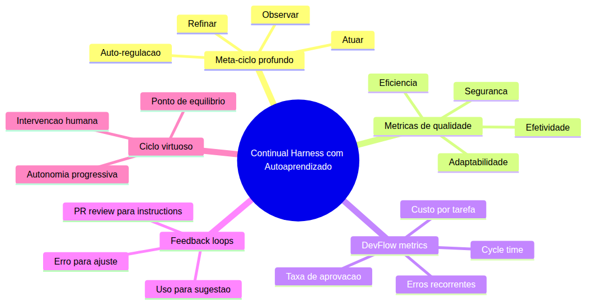
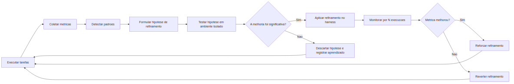

# Aula 13: Continual Harness com Auto-Aprendizado

---

## Objetivos de Aprendizagem

Ao final desta aula, você será capaz de:

- [ ] **Explicar** o meta-ciclo atuar→observar→refinar como um sistema de auto-regulação, não apenas um processo manual de ajuste
- [ ] **Definir** métricas de qualidade para avaliar a efetividade de um harness de coding agent em múltiplas dimensões
- [ ] **Descrever** como instrumentar um fluxo de desenvolvimento para coleta automática de métricas de DevFlow
- [ ] **Projetar** um feedback loop automático que conecta revisão de PR a refinamento de instruções do harness
- [ ] **Implementar** um mecanismo de auto-aprendizado baseado em padrões de erro e acerto observados no uso diário
- [ ] **Analisar** métricas de DevFlow para identificar gargalos e oportunidades de refinamento no harness
- [ ] **Aplicar** o ciclo virtuoso de melhoria contínua com autonomia progressiva, reduzindo intervenção manual a cada iteração
- [ ] **Reconhecer** o ponto de equilíbrio entre automatizar o refinamento e pedir ajuda humana quando o custo da automação supera o benefício

---

## Como Usar Esta Aula

Esta é a **aula de coroação** do curso — a última peça do quebra-cabeça. Diferente das aulas anteriores, que construíram peças concretas do harness (regras, skills, agentes, MCPs, plugins), esta aula opera em um nível acima: o **meta-ciclo** que refina o próprio harness.

A aula está dividida em duas partes. A **primeira parte** é puramente conceitual — constrói o modelo mental do meta-ciclo e das métricas sem mencionar ferramentas específicas. A **segunda parte** materializa esses conceitos em métricas de DevFlow, loops de feedback e mecanismos de auto-aprendizado.

**Pré-requisitos:** Aulas 01 a 12 concluídas. Você já construiu um harness funcional com regras, skills, subagentes, permissões, MCPs, plugins e custom tools. Você já aplicou ao menos um ciclo básico de melhoria contínua na Aula 12.

**Tempo estimado:** 40 minutos de leitura + 15 minutos de prática e reflexão.

---

## Mapa Mental



---

## Recapitulação das Aulas 01-12

Antes de mergulhar no meta-ciclo com auto-aprendizado, vale a pena olhar para trás e ver o caminho percorrido. Esta recapitulação não é apenas um resumo — é um **diagnóstico do estado atual do seu harness**.

### O que você construiu

Nas 12 aulas anteriores, você evoluiu de um desenvolvedor que nunca tinha usado um coding agent para alguém que construiu e opera seu próprio harness de programação agêntica. Veja o que cada aula entregou:

| Aula | O que você construiu | Estado atual do harness |
|------|---------------------|------------------------|
| 01 | Modelo mental: LLM, tokens, contexto, tool calling, paradigma agêntico | Conceitual (sem artefato) |
| 02 | Instalação do runtime, `opencode.json`, `AGENTS.md` mínimo | Semente plantada |
| 03 | Regras detalhadas de stack, estilo, convenções no `AGENTS.md` | Regras de identidade |
| 04 | Estratégia de 3 sessões, protocolo de handoff entre trabalhos | Gestão de continuidade |
| 05 | Subagente `@revisor`, delegação por `task`, paralelismo | Primeiro agente especializado |
| 06 | Skill `meus-padroes`, command `/revisar` que orquestra pipeline | Conhecimento sob demanda |
| 07 | Permissões granulares (`allow`/`ask`/`deny` por agente) | Controle de acesso |
| 08 | MCPs conectados (GitHub, banco de dados, APIs externas) | Alcance expandido |
| 09 | Custom tool TypeScript com validação Zod | Extensão programável |
| 10 | Plugin que intercepta eventos do ciclo de vida | Observabilidade |
| 11 | Rubrica de avaliação, critérios de qualidade do harness | Métricas conceituais |
| 12 | Primeiro ciclo completo de melhoria contínua (atuar→observar→refinar) | Autoavaliação |

### O padrão que emerge

Se você observar a tabela acima, um padrão fica evidente: as primeiras 10 aulas foram **construtivas** — cada uma adicionou uma peça nova. As aulas 11 e 12 foram **reflexivas** — ensinaram a avaliar e melhorar o que já existe.

**Aula 13 é o salto qualitativo:** o harness começa a aprender sozinho. As métricas deixam de ser conceituais e passam a ser coletadas automaticamente. Os feedback loops deixam de ser manuais e passam a ser acionados por eventos reais (um PR, um erro recorrente, um padrão de uso). O refinamento deixa de ser uma tarefa que você agenda e passa a ser um processo contínuo que o próprio harness alimenta.

---

**FUNDAMENTOS: O Ciclo que se Realimenta**

> *As próximas seções constroem o modelo mental puro — sem nomes de produtos, sem ferramentas específicas. O objetivo é que você entenda a **essência** do meta-ciclo e das métricas antes de aplicá-los ao seu harness concreto.*

---

## 1. O Meta-Ciclo Atuar→Observar→Refinar

### O que é o meta-ciclo

O ciclo fundamental de um coding agent é simples: ele recebe um prompt, monta o contexto, chama ferramentas e produz uma resposta. É o **ciclo operacional**. O meta-ciclo opera **um nível acima**: ele observa o ciclo operacional, coleta dados sobre seu desempenho e ajusta os parâmetros que controlam o ciclo operacional — as regras, as skills, as permissões, os prompts.

Pense na diferença entre um piloto automático de avião e o engenheiro que calibra o piloto automático. O piloto automático opera o avião (ciclo operacional). O engenheiro observa os dados de voo, identifica que o piloto automático está desviando 2 graus à esquerda em vento cruzado, e ajusta os parâmetros de correção (meta-ciclo).

No contexto do harness, você tem sido o engenheiro até agora. A Aula 13 ensina o harness a ser **seu próprio engenheiro**.

### Os três estágios em profundidade

**Atuar** é o estágio que você já domina: o harness executa tarefas reais de desenvolvimento — criar componentes, refatorar código, revisar PRs, escrever testes, documentar APIs. Cada tarefa é uma iteração do ciclo operacional. No meta-ciclo, "atuar" significa **produzir dados observáveis**. Não basta executar — é preciso executar de forma que o comportamento possa ser medido.

**Observar** é o estágio que a Aula 12 introduziu: coletar feedback do reviewer, aplicar rubricas, refletir sobre o que funcionou e o que não funcionou. No meta-ciclo profundo, "observar" significa **coletar dados estruturados e comparáveis**. Não basta "achar que foi bem" — é preciso ter métricas objetivas: quantos tokens foram gastos, quantas iterações foram necessárias, quantos erros o agente cometeu, quanto tempo levou.

**Refinar** é o estágio de ajuste: modificar regras, skills, prompts e permissões com base no que foi observado. No meta-ciclo profundo, "refinar" significa **aplicar mudanças sistemáticas com base em evidências**, não em palpites. Cada refinamento é uma hipótese testável: "se eu adicionar esta regra, a taxa de erro na tarefa X vai cair Y%."

### O meta-ciclo como sistema de auto-regulação

O salto da Aula 12 para a Aula 13 é a **autonomia do ciclo**. Na Aula 12, você era o observador e refinador. Na Aula 13, o próprio harness se torna capaz de:

1. **Detectar** quando uma métrica está fora do esperado (ex: taxa de erros em PRs subiu de 5% para 15%)
2. **Diagnosticar** a causa provável (ex: 80% dos erros são em arquivos TypeScript — falta uma regra de tipos)
3. **Propor** um refinamento (ex: uma skill de verificação de tipos que o agente carrega ao editar `.ts`)
4. **Aplicar** o refinamento em um ambiente controlado (ex: primeiro no branch de desenvolvimento do harness)
5. **Validar** se o refinamento melhorou a métrica (ex: taxa de erros caiu para 4% após 10 PRs)
6. **Reter ou reverter** a mudança com base na validação

Este ciclo de 6 passos é o coração do auto-aprendizado. Cada passo pode ser automatizado em graus diferentes. Você decide o nível de autonomia em cada um.

> *Você pode estar pensando: "Isso não é só um loop de feedback normal?" Sim e não. Um loop de feedback reage a um erro. Um sistema de auto-regulação **antecipa** o erro porque conhece seus próprios padrões. A diferença é reativo vs. proativo — e está nas métricas.*

**Quick Check:**

**1. Qual a diferença entre ciclo operacional e meta-ciclo?**

**Resposta:** O ciclo operacional executa tarefas (receber prompt, chamar ferramentas, produzir resposta). O meta-ciclo observa o ciclo operacional, coleta métricas e ajusta os parâmetros que controlam o ciclo operacional (regras, skills, permissões). Um opera **dentro** do sistema; o outro opera **sobre** o sistema.

**2. Por que métricas objetivas são necessárias para o auto-aprendizado?**

**Resposta:** Porque um sistema não pode aprender com "achismo". Se você não consegue medir se uma mudança melhorou ou piorou o desempenho, não consegue decidir se deve reter ou reverter a mudança. Métricas objetivas transformam refinamento de palpite em hipótese testável.

---

## 2. Métricas de Qualidade do Harness

### Por que métricas importam no meta-ciclo

Sem métricas, o meta-ciclo é cego. Você pode refinar, refinar, refinar — mas não sabe se está indo para frente ou para trás. Métricas são os **sensores** do sistema de auto-regulação. Elas transformam a observação subjetiva ("o agente parece estar melhor") em observação objetiva ("a taxa de primeira tentativa correta subiu de 60% para 78%").

### As quatro dimensões de qualidade

Um harness de coding agent pode ser avaliado em quatro dimensões independentes. Cada dimensão exige métricas diferentes:

**1. Efetividade** — o harness faz o que deveria fazer?

Métricas típicas:
- Taxa de conclusão: % de tarefas que o agente completa sem intervenção
- Qualidade da saída: % de PRs aprovados sem revisões maiores
- Precisão da primeira tentativa: % de tarefas onde a primeira resposta do agente já está correta (sem iterações de correção)
- Cobertura de cenários: % de tipos de tarefa que o harness consegue executar

**2. Eficiência** — o harness faz com bom uso de recursos?

Métricas típicas:
- Tokens gastos por tarefa (média e mediana)
- Número de iterações (tool calls) por tarefa
- Tempo de execução por tarefa
- Custo financeiro por tarefa (se aplicável)
- Taxa de re-trabalho: % de tarefas que precisam ser refeitas

**3. Segurança** — o harness opera dentro dos limites estabelecidos?

Métricas típicas:
- Taxa de violação de permissão: % de tool calls bloqueadas
- Taxa de doom loop: % de sessões que entram em loop
- Operações destrutivas evitadas: número de vezes que uma permissão `ask` impediu uma ação indesejada
- Vazamento de contexto: % de sessões onde o agente acessou arquivos fora do escopo permitido

**4. Adaptabilidade** — o harness melhora com o tempo?

Métricas típicas:
- Velocidade de aprendizado: redução de erros por semana
- Estabilidade de refinamentos: % de mudanças no harness que são retidas (vs. revertidas)
- Cobertura de feedback: % de problemas detectados que geraram refinamentos
- Tempo de resposta a novos padrões: quantos ciclos até o harness se adaptar a um novo tipo de tarefa

### Como escolher quais métricas acompanhar

A pior armadilha é tentar medir tudo ao mesmo tempo. Métricas demais geram ruído; métricas de menos geram pontos cegos. A regra prática:

- **Comece com 3 métricas**, uma de cada dimensão que mais importa para seu contexto
- Por exemplo: taxa de conclusão (efetividade), tokens por tarefa (eficiência), violações de permissão (segurança)
- **Adicione métricas conforme necessário**, quando um refinamento específico exigir validação
- **Remova métricas que não geram decisões** — se uma métrica está sempre verde e você nunca age sobre ela, ela é ruído

> *Talvez você tenha tentado criar um dashboard com 15 métricas na Aula 11 e se sentiu sobrecarregado. Isso é completamente normal. O meta-ciclo funciona melhor com poucas métricas, bem escolhidas, do que com muitas métricas mal definidas. Comece pequeno.*

**Quick Check:**

**3. Quais são as quatro dimensões de qualidade de um harness?**

**Resposta:** Efetividade (faz o que deveria?), Eficiência (faz com bom uso de recursos?), Segurança (opera dentro dos limites?), Adaptabilidade (melhora com o tempo?).

**4. Por que você não deve medir tudo ao mesmo tempo?**

**Resposta:** Métricas demais geram ruído — você não consegue distinguir sinal de ruído e acaba paralisado por dados. O ideal é começar com 3 métricas (uma de cada dimensão prioritária) e adicionar conforme necessário para validar refinamentos específicos.

---

**APLICAÇÃO: DevFlow Metrics e Feedback Loops**

> *A partir daqui, os conceitos abstratos ganham forma concreta. Você vai aprender a instrumentar seu harness para coletar métricas reais e a construir feedback loops automáticos que conectam a observação ao refinamento.*

---

## 3. Instrumentação para Coleta de Métricas

### O que é DevFlow

DevFlow é o conjunto de métricas que descrevem como o desenvolvimento de software acontece no seu fluxo real: quanto tempo leva uma tarefa, quantas revisões um PR precisa, quantos bugs são detectados em produção, qual o custo médio de uma feature. Quando o harness é parte ativa do DevFlow, as métricas do harness **são** métricas de DevFlow — não há separação.

### O que instrumentar

Para que o meta-ciclo funcione, você precisa de dados de três fontes:

**Fonte 1: O sistema de controle de versão (Git)**

Métricas extraíveis:
- Número de commits por sessão de agente
- Tamanho médio de PR gerado pelo agente (arquivos modificados, linhas alteradas)
- Taxa de PRs abertos vs. PRs merged (abandono)
- Tempo entre primeiro commit e abertura de PR (cycle time do agente)
- Número de revisões por PR (indica qualidade da primeira versão)

**Fonte 2: O sistema de revisão (PRs)**

Métricas extraíveis:
- Número de comentários de revisão por PR
- Categorias de comentários (estilo, lógica, performance, segurança)
- Taxa de mudanças solicitadas vs. aprovadas diretamente
- Tempo de resposta a revisões (quanto tempo o agente leva para corrigir)
- Padrões de erro recorrentes (os mesmos tipos de comentário aparecendo em PRs diferentes)

**Fonte 3: O harness em execução (logs do agente)**

Métricas extraíveis:
- Tokens gastos por tarefa e por arquivo
- Número de tool calls por tarefa (indica eficiência)
- Tipos de tool calls mais frequentes (leitura, escrita, busca, terminal)
- Taxa de erros de ferramenta (tool call que falhou)
- Sessões que entraram em doom loop
- Compactions forçadas vs. automáticas

### Construindo um coletor de métricas

Um coletor de métricas para o meta-ciclo não precisa ser complexo. A abordagem mais prática é:

1. **Script pós-tarefa**: um hook que executa após cada sessão do agente, extraindo métricas básicas do log da sessão
2. **Webhook de PR**: um serviço que escuta eventos de PR no repositório e extrai métricas de revisão
3. **Planilha ou dashboard**: onde as métricas são agregadas para visualização

O formato mais simples e eficaz é uma tabela temporal:

```
| Data | Tarefa | Tokens | Tool calls | Erros | PR aprovado? | Revisões |
|------|--------|--------|------------|-------|--------------|----------|
| 10/07 | Criar card de projeto | 12.450 | 23 | 2 | Sim | 1 |
| 11/07 | Refatorar filtro | 8.230 | 15 | 0 | Sim | 0 |
| 12/07 | Adicionar testes | 15.600 | 31 | 3 | Não | 3 |
```

> *Lembre-se: o objetivo não é criar um sistema de métricas perfeito. É criar um sistema **suficientemente bom** para que o meta-ciclo tenha dados para operar. Uma planilha com 20 linhas já é melhor que nenhum dado.*

---

## 4. Feedback Loops Automáticos: Do PR ao Refinamento

### O padrão fundamental

O feedback loop mais valioso para o auto-aprendizado conecta a **revisão de PR** ao **refinamento de instruções**. O raciocínio é simples:

1. O agente produz código
2. O código é revisado (por humano ou por outro agente)
3. A revisão aponta problemas
4. Os problemas são categorizados
5. Se o mesmo tipo de problema aparece N vezes, o harness precisa ser refinado
6. O refinamento é proposto, testado e validado

### Loop de primeiro nível: revisão humana → sugestão

No nível mais básico, o loop é semi-automático:

```
PR do agente → Revisor humano aponta: "esta função não valida entrada"
→ O revisor (ou um script) categoriza o comentário como "validação"
→ Após 3 ocorrências da mesma categoria, o sistema sugere:
  "Detectei 3 PRs com comentários sobre validação de entrada.
   Deseja adicionar uma regra ao AGENTS.md sobre validação?"
→ Você revisa e aprova ou rejeita a sugestão
→ Se aprovada, a regra entra em vigor
→ PRs futuros são avaliados pela nova regra
```

### Loop de segundo nível: revisão automática → refinamento automático

No nível intermediário, parte da revisão é automatizada:

```
PR do agente → Runner de verificação automática detecta:
  "arquivo X não tem testes para o cenário Y"
→ O runner consulta as regras atuais e identifica que não há regra sobre cobertura de testes
→ O runner propõe um refinamento: adicionar regra "para toda função pública, gere teste"
→ Um agente de avaliação testa o refinamento em um PR de exemplo
→ Se o resultado melhora a cobertura sem quebrar nada, o refinamento é aplicado
→ Você recebe uma notificação: "Refinamento aplicado: regra de cobertura de testes"
```

### Loop de terceiro nível: aprendizado autônomo

No nível mais avançado, o harness refina a si mesmo:

```
O harness executa uma tarefa → coleta métricas da execução
→ Compara com a linha de base histórica
→ Se uma métrica degradou (ex: tokens por tarefa subiu 20%), o harness:
  1. Analisa as últimas N execuções para identificar o padrão
  2. Testa 2-3 variações de regras/skills que podem corrigir
  3. Executa cada variação em um ambiente isolado (simulação)
  4. Escolhe a variação que melhorou a métrica
  5. Aplica a mudança no harness de produção
  6. Continua monitorando para validar ou reverter
```

### Implementando o primeiro feedback loop

Para implementar o loop de primeiro nível no seu harness:

**Passo 1:** Defina categorias de comentários de revisão. Exemplos:
- `validacao`: falta de validação de entrada
- `tipagem`: erros de tipo ou falta de tipos
- `estilo`: violação de convenções de estilo
- `performance`: código ineficiente
- `seguranca`: vulnerabilidades potenciais
- `testes`: cobertura insuficiente

**Passo 2:** Crie um script pós-revisão que extrai comentários e os categoriza. O formato mais simples: uma planilha onde você marca a categoria de cada comentário.

**Passo 3:** Estabeleça um limiar de ação. Exemplo: "se a categoria `validacao` aparecer 3 vezes em 10 PRs consecutivos, o harness precisa de uma regra de validação."

**Passo 4:** Crie um template de refinamento para cada categoria. Exemplo para `validacao`:

```
Se o comentário for da categoria "validacao", a sugestão de refinamento é:
  "Adicione ao AGENTS.md: 'Toda função pública deve validar seus parâmetros
   antes de processá-los. Use early return com mensagem de erro clara.'"
```

**Passo 5:** Após aplicar o refinamento, monitore a categoria pelos próximos 10 PRs. Se a taxa de comentários daquela categoria caiu, o refinamento foi eficaz. Se não, reverta e tente outra abordagem.

> *Talvez você esteja pensando: "Isso parece muito trabalho para automatizar." E é verdade — o primeiro loop dá trabalho. Mas cada loop que você automatiza libera energia mental para loops mais sofisticados. O investimento inicial paga juros compostos.*

**Quick Check:**

**5. Qual a diferença entre um feedback loop de primeiro nível e um de terceiro nível?**

**Resposta:** O loop de primeiro nível é semi-automático — a revisão é humana, a categorização pode ser automática, e o refinamento é proposto mas requer aprovação humana. O loop de terceiro nível é totalmente autônomo — o harness detecta a degradação, formula hipóteses, testa variações em ambiente isolado, aplica a melhor e monitora o resultado, tudo sem intervenção humana.

---

## 5. Auto-Aprendizado: O Ciclo que se Realimenta

### O motor do auto-aprendizado

Auto-aprendizado no contexto do harness significa que o sistema **extrai padrões do próprio comportamento** e **ajusta seu comportamento futuro** com base nesses padrões. O motor desse aprendizado tem três componentes:

1. **Memória de longo prazo**: onde o harness armazena o que aprendeu. Não é o histórico da sessão (que é efêmero e vai embora na compaction). É um repositório persistente de padrões, refinamentos e resultados.
2. **Mecanismo de inferência**: como o harness identifica padrões nos dados coletados. Pode ser tão simples quanto um script que conta frequências de categorias de erro ou tão sofisticado quanto um modelo leve de classificação.
3. **Mecanismo de ação**: como o harness traduz um padrão identificado em uma mudança concreta no harness (regra nova, skill modificada, permissão ajustada).

### Padrões que o harness pode aprender sozinho

**Padrão 1 — Erro recorrente em arquivos de um tipo específico**

O harness observa que 70% dos erros de tipo acontecem em arquivos de configuração. Ele infere que falta uma regra específica para config files e propõe: "adicione regras de validação de tipo para arquivos de configuração."

**Padrão 2 — Custo excessivo em tarefas de um domínio**

O harness observa que tarefas de refatoração de componentes visuais gastam 3x mais tokens que tarefas equivalentes em lógica de negócio. Ele infere que o contexto está muito pesado e propõe: "crie uma skill específica para refatoração visual, carregada sob demanda em vez de regras permanentes."

**Padrão 3 — Loop de correção em um padrão arquitetural**

O harness observa que, sempre que gera um hook personalizado, o revisor pede alterações na gestão de estado. Ele infere que as regras atuais são insuficientes para hooks e propõe: "adicione à skill de React Native as regras específicas de gestão de estado em hooks."

### Ciclo de auto-aprendizado completo

O ciclo completo de auto-aprendizado tem 7 passos:



Cada passo do ciclo admite um nível de autonomia:

| Passo | Manual | Semi-automático | Autônomo |
|-------|--------|----------------|----------|
| Executar tarefas | Você executa manualmente | Você inicia, agente executa | Agente executa em background |
| Coletar métricas | Você anota manualmente | Script coleta, você valida | Coleta automática total |
| Detectar padrões | Você percebe padrões | Script alerta sobre padrões | Detecção automática |
| Formular hipótese | Você formula | Sistema sugere, você aprova | Sistema formula e valida |
| Testar hipótese | Você testa manualmente | Sistema testa em sandbox, você revisa | Teste autônomo em sandbox |
| Aplicar refinamento | Você edita o harness | Sistema propõe diff, você aplica | Aplicação automática |
| Validar resultado | Você monitora | Dashboard mostra antes/depois | Validação estatística automática |

### Progressão de autonomia

O objetivo não é passar do nível 1 ao nível 3 em uma semana. A progressão recomendada é:

1. **Mês 1**: comece manual — você coleta métricas, detecta padrões e refina. O harness apenas executa tarefas. O objetivo é estabelecer a **linha de base** de métricas.

2. **Mês 2**: automatize a coleta — scripts extraem métricas das sessões e dos PRs. Você ainda analisa e decide. O objetivo é **eliminar o trabalho braçal** de coleta.

3. **Mês 3**: automatize a detecção — o sistema alerta quando um padrão emerge. Você ainda aprova refinamentos. O objetivo é **não perder padrões** que você não teria percebido.

4. **Mês 4+**: automatize o refinamento em um domínio específico — comece com um tipo de refinamento bem definido (ex: regras de validação) e automatize o ciclo completo apenas para ele. O objetivo é **ganhar confiança** na automação.

> *Se você está se sentindo sobrecarregado com a quantidade de automação descrita aqui, respire. Ninguém implementa tudo de uma vez. Escolha UM padrão (o mais doloroso do seu dia a dia) e automatize apenas ele. Quando estiver funcionando, passe para o próximo.*

**Quick Check:**

**6. Quais são os três componentes do motor de auto-aprendizado?**

**Resposta:** (1) Memória de longo prazo — repositório persistente de padrões, refinamentos e resultados; (2) Mecanismo de inferência — como o harness identifica padrões nos dados coletados; (3) Mecanismo de ação — como o harness traduz um padrão em uma mudança concreta.

**7. Qual a progressão recomendada de autonomia no auto-aprendizado?**

**Resposta:** Mês 1 — manual (estabelecer linha de base); Mês 2 — coleta automatizada (eliminar trabalho braçal); Mês 3 — detecção automatizada (não perder padrões); Mês 4+ — refinamento automatizado em domínio específico (ganhar confiança).

---

## 6. O Ciclo Virtuoso e o Ponto de Equilíbrio

### O ciclo virtuoso

Quando o auto-aprendizado funciona bem, o harness entra em um ciclo virtuoso:

1. **Mais dados** — cada tarefa executada gera mais métricas
2. **Melhores padrões** — mais métricas permitem detectar padrões mais sutis
3. **Refinamentos mais precisos** — padrões melhores geram refinamentos mais eficazes
4. **Melhor desempenho** — refinamentos eficazes melhoram as métricas
5. **Mais confiança** — desempenho melhor permite delegar tarefas mais complexas
6. **Mais dados** — tarefas mais complexas geram métricas mais ricas → volta ao passo 1

Este ciclo tem uma propriedade importante: ele **acelera com o tempo**. As primeiras iterações são lentas porque a base de métricas é pequena e os padrões são imprecisos. Com o tempo, o harness acumula dados históricos que tornam cada iteração mais rápida e mais precisa.

### Quando o ciclo vicioso aparece

O ciclo virtuoso tem um inimigo: o **ruído**. Se as métricas são mal definidas, se a coleta é inconsistente, se os padrões detectados são falsos positivos, o ciclo entra em espiral negativa:

1. Métricas ruidosas → padrões falsos
2. Padrões falsos → refinamentos errados
3. Refinamentos errados → degradação do desempenho
4. Degradação → desconfiança no processo
5. Desconfiança → abandono do meta-ciclo

A prevenção do ciclo vicioso está na **validação rigorosa**. Nunca aplique um refinamento sem testá-lo em ambiente isolado primeiro. Nunca confie em um padrão observado menos de 5 vezes. Nunca mantenha um refinamento que não mostrou melhoria mensurável após N execuções.

### O ponto de equilíbrio: quando automatizar vs. quando pedir ajuda

Nem todo refinamento deve ser automatizado. A decisão de automatizar ou não depende de três fatores:

**1. Frequência do padrão**
- Padrão aparece todo dia → automatize
- Padrão aparece toda semana → automatize se o custo de implementação for baixo
- Padrão aparece uma vez por mês → mantenha manual

**2. Risco do refinamento**
- Refinamento de regra de estilo → baixo risco, pode automatizar
- Refinamento de permissão de segurança → médio risco, requer aprovação humana
- Refinamento de custom tool → alto risco, requer validação humana completa

**3. Custo da automação**
- Já existe ferramenta pronta → automatize
- Precisa de 1 hora de script → automatize se o padrão for frequente
- Precisa de 1 semana de desenvolvimento → só automatize se o padrão estiver custando muito

### Quando pedir ajuda humana

O meta-ciclo com auto-aprendizado não elimina o humano — ele **eleva o nível** da intervenção humana. Você pede ajuda humana quando:

1. **O padrão é inédito**: o harness encontrou um tipo de erro que nunca viu antes. Sem dados históricos, não há base para inferência. Um humano precisa classificar o novo padrão.

2. **O refinamento tem alto risco**: alterar permissões de segurança, expor uma nova tool, modificar o comportamento de um subagente crítico. Mesmo que o sistema detecte o padrão, a aplicação requer supervisão.

3. **A métrica não melhora**: o harness testou 3 refinamentos diferentes para o mesmo padrão e nenhum funcionou. Isso indica que o problema pode não estar no harness — pode ser uma questão de processo, de ferramenta ou de conhecimento do time.

4. **O custo da automação supera o benefício**: se o harness gasta mais tokens detectando e testando refinamentos do que os refinamentos economizam, é hora de reavaliar a estratégia.

### Encerramento: o harness que aprende

Esta aula termina o curso, mas o harness que você construiu não termina aqui. Ele começa uma nova fase: a fase onde ele **aprende sozinho**. Seu papel muda de construtor para **curador** — você não constrói mais peças novas, você guia e valida o aprendizado contínuo do sistema.

O verdadeiro teste do seu harness não é o que ele faz hoje. É o que ele será capaz de fazer daqui a 6 meses, depois de centenas de ciclos de auto-aprendizado.

---

## Exercícios Graduados

### Exercício 1 (Fácil): Defina 3 métricas para seu harness

Com base nas quatro dimensões de qualidade (Efetividade, Eficiência, Segurança, Adaptabilidade), escolha 3 métricas para acompanhar no seu harness. Para cada uma, defina:
- O nome da métrica
- A dimensão a que pertence
- Como você vai coletá-la
- Qual o valor atual (linha de base)
- Qual valor você considera "bom"

**Resposta:** (exemplo)
1. Taxa de conclusão (Efetividade) — % de tarefas completadas sem intervenção. Coleta: script pós-sessão. Linha de base: 70%. Bom: > 85%.
2. Tokens por tarefa (Eficiência) — média de tokens gastos por tarefa. Coleta: log do agente. Linha de base: 12.000. Bom: < 8.000.
3. Violações de permissão (Segurança) — tool calls bloqueadas por sessão. Coleta: log de permissões. Linha de base: 1.2/sessão. Bom: < 0.5/sessão.

### Exercício 2 (Médio): Projete um feedback loop

Escolha um tipo de erro recorrente no seu fluxo de desenvolvimento (ex: testes quebrados após refatoração, código sem validação de entrada, imports incorretos). Projete um feedback loop de primeiro nível seguindo os 5 passos da Seção 4:

1. Defina a categoria do erro
2. Crie um script ou hook que detecte o erro
3. Estabeleça o limiar de ação
4. Crie o template de refinamento
5. Defina como validar o refinamento

**Resposta:** (exemplo para "testes quebrados após refatoração")
1. Categoria: `testes-regressao`
2. Detecção: hook pós-tool-use que executa o test suite nos arquivos modificados
3. Limiar: 2 ocorrências em 5 tarefas de refatoração consecutivas
4. Template: "Ao refatorar um arquivo, identifique seus testes correspondentes (mesmo diretório `/__tests__/` ou sufixo `.test.ts`). Após modificar o arquivo, execute apenas os testes relacionados (não a suite inteira) entre cada modificação."
5. Validação: monitorar a categoria `testes-regressao` por 10 tarefas de refatoração. Se cair de 40% para < 15%, o refinamento é eficaz.

### Exercício 3 (Difícil): Implemente um ciclo de auto-aprendizado para um domínio

Escolha um domínio bem delimitado do seu harness (ex: geração de testes, revisão de PRs, refatoração de componentes). Implemente o ciclo de 7 passos da Seção 5 para este domínio:

1. Instrumente a execução para coletar métricas específicas do domínio
2. Crie um script de detecção de padrões (pode ser simples: contagem de frequências)
3. Defina 2 hipóteses de refinamento testáveis
4. Crie um ambiente de teste isolado (um branch do harness, um repositório de teste)
5. Execute as 2 hipóteses e meça o resultado
6. Aplique a vencedora e monitore por 10 execuções

**Resposta:** (exemplo para "geração de testes")
1. Coleta: script pós-tarefa extrai `testes_gerados`, `testes_falharam`, `cobertura_atingida` do log da sessão
2. Detecção: se `testes_falharam / testes_gerados > 0.3` por 3 tarefas consecutivas, dispara alerta
3. Hipóteses: (A) "Adicionar regra: gere testes mockando dependências externas primeiro" vs (B) "Adicionar skill específica de padrões de teste com exemplos do projeto"
4. Teste: branch `experimento-auto-aprendizado`, executa 5 tarefas de geração de teste com cada hipótese
5. Resultado: Hipótese A reduziu falhas para 15%, Hipótese B para 22%. A venceu.
6. Aplicação: merge do refinamento no branch principal. Monitoramento por 10 tarefas. Se falhas mantiverem < 20%, refinamento é bem-sucedido.

---

**Gabarito dos Quick Checks**

1. **Resposta:** O ciclo operacional executa tarefas; o meta-ciclo observa e ajusta os parâmetros do ciclo operacional.
2. **Resposta:** Métricas objetivas transformam refinamento de palpite em hipótese testável — permitem decidir se uma mudança deve ser retida ou revertida.
3. **Resposta:** Efetividade, Eficiência, Segurança, Adaptabilidade.
4. **Resposta:** Métricas demais geram ruído e paralisia. Comece com 3 métricas e adicione conforme necessário.
5. **Resposta:** Loop de primeiro nível é semi-automático (revisão humana, refinamento proposto). Loop de terceiro nível é totalmente autônomo (detecção, teste, aplicação, validação sem intervenção).
6. **Resposta:** (1) Memória de longo prazo, (2) Mecanismo de inferência, (3) Mecanismo de ação.
7. **Resposta:** Mês 1 manual, Mês 2 coleta automatizada, Mês 3 detecção automatizada, Mês 4+ refinamento automatizado em domínio específico.

---

## Resumo

- O **meta-ciclo atuar→observar→refinar** é o coração do Continual Harness. Na Aula 13, ele ganha auto-aprendizado: o próprio harness detecta padrões, formula hipóteses, testa refinamentos e valida resultados.
- **Métricas de qualidade** são os sensores do meta-ciclo. Sem elas, o sistema é cego. As quatro dimensões são: Efetividade, Eficiência, Segurança e Adaptabilidade.
- **DevFlow metrics** conectam as métricas do harness ao fluxo real de desenvolvimento: Git, PRs, logs de sessão.
- **Feedback loops automáticos** conectam observação a refinamento em três níveis de autonomia: semi-automático (nível 1), revisão automática (nível 2) e aprendizado autônomo (nível 3).
- O **auto-aprendizado** se apoia em três componentes: memória de longo prazo, mecanismo de inferência e mecanismo de ação.
- A **progressão de autonomia** é gradual: comece manual, automatize coleta, depois detecção, depois refinamento em um domínio específico.
- O **ponto de equilíbrio** entre automatizar e pedir ajuda humana depende da frequência do padrão, do risco do refinamento e do custo da automação.

---

## Próximos Passos

Esta é a última aula do curso — mas não é o fim da jornada. O harness que você construiu está vivo e continuará evoluindo. Seu papel agora é de **curador e guia** do aprendizado contínuo.

**O que fazer a partir de agora:**

1. **Estabeleça sua linha de base**: escolha 3 métricas e comece a coletar dados manuais por 2 semanas. Não refine nada ainda — apenas observe.
2. **Implemente seu primeiro feedback loop**: escolha o padrão de erro mais frequente e implemente o loop de primeiro nível da Seção 4.
3. **Aumente a autonomia gradualmente**: passe da coleta manual para a automatizada, depois da detecção manual para a automatizada, e só então automatize o refinamento em um domínio específico.
4. **Revise este curso periodicamente**: volte às aulas anteriores quando o harness encontrar um problema que você não sabe resolver. O conhecimento está todo aqui — você só precisa saber onde procurar.

**Para aprofundamento:**

Aprofunde seu conhecimento sobre os conceitos que sustentam o Continual Harness:
- **Sistemas de auto-regulação** — teoria de controle, feedback loops, homeostase (cibernética, teoria de sistemas)
- **Métricas de software** — DORA metrics, SPACE framework, Accelerate book (Nicole Forsgren)
- **Machine learning para padrões** — classificação, clustering, detecção de anomalias (se quiser levar o auto-aprendizado ao nível 3+)
- **Filosofia da melhoria contínua** — Kaizen, Toyota Production System, DevOps (a base cultural do Continual Harness)

---

## Referências

1. **Forsgren, N., Humble, J., Kim, G.** — *Accelerate: The Science of Lean Software and DevOps*. IT Revolution Press, 2018. (Base das métricas de DevFlow e DORA.)
2. **Humble, J., Farley, D.** — *Continuous Delivery*. Addison-Wesley, 2010. (Fundamentos de deployment pipeline que inspiram o ciclo de auto-aprendizado.)
3. **Wiener, N.** — *Cybernetics: Or Control and Communication in the Animal and the Machine*. MIT Press, 1948. (Base teórica dos feedback loops e auto-regulação.)
4. **Kerth, N.** — *Project Retrospectives*. Dorset House, 2001. (Padrões de retrospectiva que inspiram o meta-ciclo de observação e refinamento.)
5. **Documentação do OpenCode** — [opencode.ai/docs](https://opencode.ai/docs/) — Configuração de hooks, plugins e ciclo de vida.
6. **Repositório do OpenCode** — [github.com/anomalyco/opencode](https://github.com/anomalyco/opencode) — Código-fonte, AGENTS.md e .opencode/ do próprio projeto.
