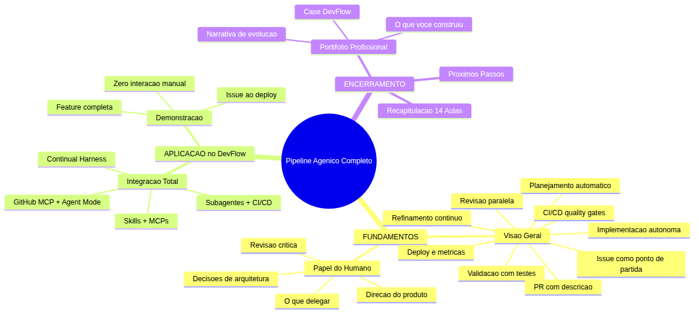
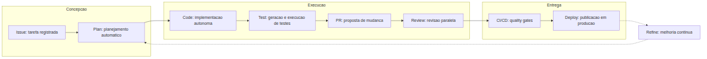
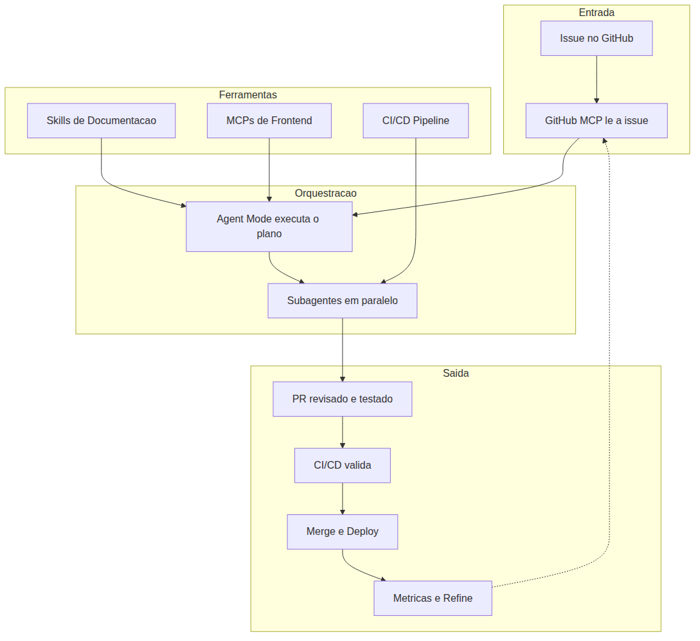

# Programador Profissional com Agentes — Aula 14

## Pipeline Agenico Completo — Da Issue ao Deploy

**Duracao estimada:** 60 minutos (30 de leitura + 30 de pratica)

**Nivel:** Avancado

**Pre-requisitos:** Aula 13 concluida — DevFlow com continual harness funcional, metricas de qualidade configuradas, feedback loops operacionais, subagentes @reviewer @tester @documenter criados e testados, GitHub MCP operacional, CI/CD pipeline funcional, skills de documentacao carregadas, MCPs de frontend integrados

---

## Objetivos de Aprendizagem

Ao final desta aula, voce sera capaz de:

- [ ] **Descrever** o fluxo completo do pipeline agente, listando as 8 etapas desde a criacao de uma tarefa ate o refinamento pos-deploy
- [ ] **Explicar** o papel do desenvolvedor humano em cada etapa do pipeline, distinguindo o que delegar aos agentes do que NAO delegar
- [ ] **Integrar** GitHub MCP, Agent Mode, subagentes especializados e CI/CD em um unico fluxo continuo e automatizado
- [ ] **Executar** o ciclo completo de uma feature no DevFlow: issue criada, planejada, implementada, testada, revisada, mergeada, implantada e refinada
- [ ] **Analisar** metricas do pipeline como tempo medio de ciclo e taxa de aprovacao na primeira revisao
- [ ] **Documentar** o DevFlow como um case de portifolio profissional estruturado
- [ ] **Apresentar** o ecossistema completo construido ao longo do curso em contexto de entrevista tecnica
- [ ] **Sintetizar** o aprendizado das 14 aulas em uma narrativa coesa de evolucao profissional
- [ ] **Identificar** os proximos passos de aprendizado apos o curso

---

## Como Usar Esta Aula

Esta aula e a **culminancia de tudo que voce construiu** ao longo de 14 aulas. Ela esta organizada em tres grandes blocos. O **primeiro bloco** (conceitual) apresenta a visao geral do pipeline agente completo e o papel do humano nesse fluxo — sem nomes de produtos, apenas principios universais. O **segundo bloco** (aplicacao) mostra como todas as pecas que voce construiu se integram no DevFlow, com uma demonstracao completa de uma feature do inicio ao deploy. O **terceiro bloco** (encerramento) ensina como transformar tudo isso em um portifolio profissional e faz a recapitulacao final do curso inteiro.

Ao longo do caminho, voce encontrara secoes **"Mao na Massa"** para fazer junto e **"Quick Check"** para verificar se entendeu antes de avancar. Ao final, o arquivo separado **Questoes de Aprendizagem** traz as tarefas finais de checkpoint — o ultimo desafio antes de voce celebrar sua conclusao.

**Tempo estimado:** 30 minutos de leitura + 30 minutos de pratica.

---

## Mapa Mental

Este diagrama mostra todos os conceitos que voce vai dominar nesta aula final:



> *O mapa mental acima mostra a estrutura da aula final. Cada ramo representa um conceito que voce vai explorar: dos fundamentos do pipeline agente ao encerramento do curso com portifolio e celebracao.*

---

## Recapitulacao das Aulas 01 a 13

Esta e a tabela mais importante do curso. Ela mostra como CADA aula contribuiu para o pipeline completo que voce vai executar hoje:

| Aula | Conceito | Como se conecta ao pipeline completo |
|------|----------|--------------------------------------|
| Aula 01 | **Ambiente profissional** | O editor, Git e Node.js sao a base onde todo o pipeline roda |
| Aula 02 | **Instructions permanentes** | Todo agente no pipeline segue as mesmas convencoes do time |
| Aula 03 | **Agent Mode** | O loop Understand-Act-Validate e o motor da etapa de implementacao |
| Aula 04 | **ADRs e Handoff** | Decisoes documentadas fluem entre etapas sem perda de contexto |
| Aula 05 | **Codigo Limpo** | O @reviewer usa principios de clean code para avaliar cada PR |
| Aula 06 | **TDD e Testes** | O @tester gera e executa testes em cada ciclo do pipeline |
| Aula 07 | **CI/CD Pipeline** | Quality gates automatizados sao a etapa de validacao pre-merge |
| Aula 08 | **Frontend React + E2E** | O pipeline cobre codigo frontend com Playwright |
| Aula 09 | **Skills de Documentacao** | Agentes consultam documentacao viva sem alucinar APIs |
| Aula 10 | **MCPs de Frontend** | Figma, Playwright e Browser MCPs trazem o mundo real para o pipeline |
| Aula 11 | **GitHub MCP Nativo** | Toda operacao na plataforma e nativa dentro do pipeline |
| Aula 12 | **Subagentes e Delegacao** | @reviewer @tester @documenter sao as pecas de revisao do pipeline |
| Aula 13 | **Continual Harness** | Metricas e feedback loops fecham o ciclo de melhoria continua |

> *Cada aula foi uma peca do quebra-cabeca. Hoje voce monta o quadro completo.*

---

**FUNDAMENTOS: Pipeline Agenico**

> *Esta secao apresenta os conceitos universais do pipeline agente completo, sem usar nomes de produtos especificos. O que voce vai ler aqui se aplica a qualquer ecossistema de desenvolvimento agentico — porque os principios sao os mesmos, independentemente da ferramenta.*

---

## 1. Visao Geral do Pipeline Agenico

### O que e um pipeline agente completo

Um **pipeline agente completo** e a integracao de todas as ferramentas e agentes em um fluxo unico e continuo que leva uma ideia (registrada como tarefa) ate o codigo em producao — e depois refina o processo com base nos resultados.

Diferente de um pipeline de CI/CD tradicional, que comeca quando o codigo ja foi escrito e termina no deploy, o pipeline agente comeca **antes do codigo** — na conceitualizacao da tarefa — e termina **depois do deploy** — na analise de metricas e refinamento do processo.

O pipeline agente tem **8 etapas** organizadas em tres fases:

**Fase 1: Concepcao** (antes do codigo)
1. **Issue** — uma necessidade e registrada como tarefa no sistema de rastreamento
2. **Plan** — um agente de planejamento analisa a tarefa, propoe abordagem e decompoe em subtarefas

**Fase 2: Execucao** (codigo e validacao)
3. **Code** — o agente de implementacao executa o plano, criando e modificando arquivos
4. **Test** — o agente de testes gera e executa validacoes para o novo codigo
5. **PR** — o codigo e empacotado em uma proposta de mudanca com descricao, vinculo e metadados
6. **Review** — revisao paralela: agente de estilo verifica qualidade, agente de testes verifica cobertura

**Fase 3: Entrega** (producao e melhoria)
7. **CI/CD** — validacao automatizada final (lint, typecheck, teste, build, seguranca)
8. **Deploy** — publicacao em producao, coleta de metricas, alimentacao do ciclo de refinamento

A 9a etapa e transversal e continua: **Refine** — o processo de melhoria continua que analisa metricas e ajusta as instrucoes de cada agente.

### O diagrama do fluxo completo



Cada etapa do pipeline e executada por um agente especializado, mas o fluxo e orquestrado pelo desenvolvedor humano — que decide quando avancar, quando corrigir e quando intervir.

### Por que 8 etapas e nao 3

Um pipeline tradicional de CI/CD tem 3 etapas: build, test, deploy. Ele e eficiente, mas cego — ele valida o codigo, mas nao valida o processo.

O pipeline agente adiciona 5 etapas que respondem a perguntas que o CI/CD tradicional nao responde:

| Pergunta | Etapa que responde |
|----------|-------------------|
| "O que precisa ser feito?" | Issue |
| "Como vamos fazer?" | Plan |
| "O codigo foi implementado corretamente?" | Code |
| "Os testes cobrem a nova funcionalidade?" | Test |
| "O codigo segue os padroes do time?" | Review |

Cada pergunta eliminada e um risco reduzido antes do merge.

### A analogia da linha de montagem inteligente

Imagine uma fabrica de automoveis onde cada estacao e automatizada, mas existe um supervisor humano que pode ajustar qualquer estacao a qualquer momento.

A **Issue** e o pedido do cliente: "quero um carro azul com motor eletrico". O **Plan** e o projeto: "vamos construir na plataforma X com bateria Y". O **Code** e a montagem: robos montam as pecas. O **Test** e a inspecao de qualidade: cada parafuso e verificado. O **PR** e a documentacao do lote: "lote #47: carro azul, motor eletrico". O **Review** e a aprovacao do supervisor: "conforme, pode seguir". O **CI/CD** e o teste final em pista. O **Deploy** e a entrega ao cliente.

O supervisor humano nao precisa apertar parafusos — mas ele decide quais carros produzir, como resolver conflitos de design e quando parar a linha para um ajuste.

### O que voce ja construiu se encaixa aqui

Cada aula do curso construiu uma ou mais pecas deste pipeline:

| Fase | Etapa | Pecas construidas |
|------|-------|-------------------|
| Concepcao | Issue | Aula 11 (GitHub MCP: criar issues), Aula 08 (metodologia agil) |
| Concepcao | Plan | Aula 03 (Agent Mode: entender antes de agir), Aula 04 (ADRs: documentar decisoes) |
| Execucao | Code | Aula 03 (Agent Mode), Aula 05 (codigo limpo), Aula 09 (skills) |
| Execucao | Test | Aula 06 (TDD), Aula 12 (@tester subagente) |
| Execucao | PR | Aula 11 (GitHub MCP: abrir PRs) |
| Execucao | Review | Aula 12 (@reviewer + @tester paralelo) |
| Entrega | CI/CD | Aula 07 (GitHub Actions), Aula 11 (disparar workflows) |
| Entrega | Deploy | Aula 07 (deploy), Aula 10 (MCPs) |
| Transversal | Refine | Aula 13 (continual harness, metricas, feedback loops) |

> *Ate aqui voce entendeu a arquitetura completa do pipeline agente e como cada peca se encaixa. Sao 8 etapas em 3 fases, com um 9o processo transversal de melhoria continua. Respire. Voce construiu cada uma dessas pecas ao longo de 13 aulas — hoje e o dia de ve-las funcionando juntas.*

### Quick Check 1

**1. Quantas etapas tem o pipeline agente completo e quais sao elas?**
**Resposta:** 8 etapas em 3 fases: Fase 1 Concepcao (Issue, Plan), Fase 2 Execucao (Code, Test, PR, Review), Fase 3 Entrega (CI/CD, Deploy), mais o processo transversal Refine.

**2. Qual a diferenca entre um pipeline CI/CD tradicional e um pipeline agente completo?**
**Resposta:** O pipeline CI/CD tradicional comeca no codigo e termina no deploy (3 etapas). O pipeline agente completo comeca antes do codigo (na conceitualizacao da tarefa) e termina depois do deploy (na analise de metricas e refinamento) — 8 etapas mais o ciclo de melhoria continua.

---

## 2. O Papel do Humano no Ciclo Agenico

### O desenvolvedor nao e substituido — e alavancado

Uma das maiores ansiedades em torno de agentes de codigo e: "sera que vou ser substituido?" A resposta e clara: **nao**. O que muda e o papel do desenvolvedor — de executor de tarefas para **orquestrador de agentes**.

Pense na evolucao do trabalho ao longo da historia:

1. **Artesao**: uma pessoa faz tudo (cria, executa, revisa, entrega)
2. **Linha de montagem**: cada pessoa faz uma parte especializada
3. **Automacao industrial**: maquinas fazem o trabalho repetitivo, humanos supervisionam
4. **Pipeline agentico**: agentes executam as etapas operacionais, humanos fazem as decisoes estrategicas

O desenvolvedor no pipeline agentico nao esta "menos ocupado" — esta ocupado com coisas **mais importantes**. Em vez de gastar tempo escrevendo codigo boilerplate, debugando erros de sintaxe e alternando entre ferramentas, ele gasta tempo em:

- **Decisoes de arquitetura**: como o sistema deve ser estruturado
- **Direcao do produto**: o que construir e por que
- **Revisao critica**: o codigo gerado pelo agente atende aos requisitos?
- **Qualidade e seguranca**: ha riscos que o agente nao enxerga?
- **Melhoria do processo**: o pipeline esta eficiente? As instrucoes estao boas?

### Matriz de decisao: o que delegar vs o que NAO delegar

Nem toda tarefa deve ser delegada a um agente. A matriz abaixo ajuda a decidir:

| Tipo de tarefa | Delegar para agente? | Por que |
|----------------|---------------------|---------|
| Implementar CRUD padrao | Sim | Repetitivo, bem definido, baixo risco |
| Escrever testes unitarios | Sim | Regras claras, verificavel, alto ganho |
| Criar documentacao de API | Sim | Extrativel do codigo, formato definido |
| Refatorar codigo com escopo claro | Sim | Regras conhecidas, resultado verificavel |
| Revisar estilo e convencoes | Sim | Checklist objetivo, sem ambuiguidade |
| Debug de erro complexo | Parcial | Agente ajuda a identificar, humano decide a correcao |
| Decisao de arquitetura | Nao | Requer visao sistemica e experiencia |
| Priorizacao de backlog | Nao | Requer entendimento de negocios e contexto |
| Code review critico (seguranca, dados sensiveis) | Nao | Requer julgamento humano e conhecimento de dominio |
| Relacionamento com stakeholders | Nao | Interacao humana, empatia, negociacao |
| Definicao de "pronto" (Definition of Done) | Nao | Decisao do time, nao do agente |

### Os 5 pontos de intervencao critica

No fluxo do pipeline, existem 5 momentos onde o desenvolvedor humano DEVE intervir:

**1. Antes do Plan: validar a issue**
A issue esta clara? O escopo esta bem definido? Os criterios de aceitacao sao testaveis? Se a issue estiver mal definida, o plano do agente vai herdar essa ambuiguidade.

**2. Antes do Code: revisar o plano**
O agente propoe uma abordagem. Voce concorda com a estrategia? A decomposicao faz sentido? Ha riscos nao considerados?

**3. Depois do Review: decidir o merge**
O @reviewer aprovou, o @tester passou, o CI/CD esta verde. Mas voce, como desenvolvedor, concorda que o codigo esta pronto? Ha algo que os agentes nao enxergaram?

**4. Depois do Deploy: analisar metricas**
O deploy foi bem-sucedido, mas as metricas de producao estao saudaveis? Tempo de resposta aumentou? Erros apareceram? O agente nao monitora producao — isso e papel humano.

**5. No Refine: ajustar as regras**
O continual harness sugere refinamentos. Voce valida e aprova as mudancas nas instrucoes. O agente pode sugerir, mas o humano decide o que muda.

### A analogia do piloto e do piloto automatico

Um piloto de aviao moderno passa a maior parte do voo com o piloto automatico ativado. O piloto automatico mantem a altitude, a direcao e a velocidade com precisao muito maior que um humano conseguiria. Mas o piloto humano:

- **Decide o destino** (a issue define o que construir)
- **Programa o piloto automatico** (as instrucoes definem como o agente se comporta)
- **Monitora os instrumentos** (as metricas mostram a saude do pipeline)
- **Intervem em emergencias** (quando algo foge do esperado, o humano assume)
- **Melhora o sistema** (o refine ajusta as instrucoes com base nas licoes aprendidas)

O piloto automatico nao substitui o piloto — torna o piloto mais eficiente, permitindo que ele se concentre no que realmente importa.

> *Respire. Esta secao responde a pergunta mais importante do curso: "qual e o meu papel agora?" A resposta e: voce e o orquestrador. As maquinas executam; voce decide direcao, valida qualidade e melhora o sistema. Agora vamos ver tudo em acao no DevFlow.*

### Quick Check 2

**1. Quais sao os 5 pontos de intervencao critica do humano no pipeline agente?**
**Resposta:** 1) Antes do Plan: validar a issue, 2) Antes do Code: revisar o plano, 3) Depois do Review: decidir o merge, 4) Depois do Deploy: analisar metricas, 5) No Refine: ajustar as regras.

**2. Qual a diferenca entre o papel do desenvolvedor antes e depois do pipeline agente?**
**Resposta:** Antes, o desenvolvedor gastava tempo em tarefas operacionais (escrever boilerplate, debug, alternar ferramentas). Depois, ele se concentra em decisoes estrategicas: arquitetura, direcao do produto, revisao critica e melhoria do processo. O desenvolvedor evolui de executor para orquestrador.

---

**APLICACAO: Pipeline Agenico no DevFlow**

> *Agora que voce entende os fundamentos conceituais — as 8 etapas do pipeline e o papel do humano como orquestrador — vamos aplicar tudo no DevFlow. Voce vai ver como todas as pecas construidas ao longo de 13 aulas se integram em um fluxo unico. E depois, na demonstracao pratica, vai executar uma feature completa do inicio ao deploy.*

---

## 3. Integracao: Como Todas as Pecas se Conectam

### A arquitetura do pipeline do DevFlow

O DevFlow nao e apenas um projeto de software — e um **ecossistema agentico completo**. Cada peca que voce construiu ao longo do curso tem um papel especifico no pipeline. A integracao entre elas e o que torna o pipeline mais que a soma das partes.

### O mapa de integracao



### Como cada peca se conecta

**1. GitHub MCP + Agent Mode (Aulas 11 + 03)**
O GitHub MCP cria a issue e a branch. O Agent Mode implementa o codigo. A conexao: o MCP informa ao Agent Mode qual issue implementar e em qual branch trabalhar.

**2. Agent Mode + Skills (Aulas 03 + 09)**
O Agent Mode implementa o codigo consultando skills de documentacao. A conexao: skills sao carregadas sob demanda para garantir que o codigo gerado use APIs corretas, sem alucinacoes.

**3. Subagentes + CI/CD (Aulas 12 + 07)**
O @tester gera testes e os executa localmente. O CI/CD executa a suite completa em ambiente isolado. A conexao: @tester usa as mesmas configuracoes de teste que o CI/CD, garantindo consistencia entre a validacao local e a automatizada.

**4. Subagentes + GitHub MCP (Aulas 12 + 11)**
O @reviewer analisa o codigo e publica seu relatorio como comentario no PR via GitHub MCP. O @tester reporta resultados de cobertura. A conexao: os subagentes usam o MCP para interagir com a plataforma sem saida do contexto.

**5. Continual Harness + Todas as Pecas (Aula 13)**
O continual harness coleta metricas de cada etapa do pipeline e alimenta o refinamento das instrucoes. A conexao: metricas de revisao (@reviewer) refinam as regras de codigo. Metricas de teste (@tester) refinam os padroes de teste. Metricas de CI/CD refinam os quality gates.

### O fluxo de dados entre as etapas

Cada etapa do pipeline produz artefatos que a proxima consome:

| Etapa | Produz | Consumido por |
|-------|--------|---------------|
| Issue | Descricao, criterios de aceitacao, labels, milestone | Plan |
| Plan | Plano de implementacao, subtarefas, estimativas | Code |
| Code | Codigo implementado, arquivos modificados | Test, PR |
| Test | Suite de testes, relatorio de cobertura | Review, CI/CD |
| PR | Descricao do PR, diff, vinculo com issue | Review, CI/CD |
| Review | Relatorio de revisao, comentarios, aprovacao/reprovacao | Merge |
| CI/CD | Status dos checks, quality gates, artefatos | Deploy |
| Deploy | Ambiente de producao, metricas de operacao | Refine |
| Refine | Instrucoes atualizadas, novas regras, ajustes de config | Todas as etapas |

### Os arquivos que materializam a integracao

A integracao nao e abstrata — ela esta materializada em arquivos no repositorio do DevFlow:

```
.github/
  copilot-instructions.md          Regras do time (Aula 02)
  prompts/                         Templates de comando (Aula 02)
    create-component.md
    generate-test.md
    review-pr.md
  skills/                          Skills de documentacao (Aula 09)
    react-docs/
    express-docs/
    mui-docs/
  agents/                          Subagentes especializados (Aula 12)
    reviewer.agent.md
    tester.agent.md
    documenter.agent.md
  CODEOWNERS                       Revisores automaticos (Aula 11)
  workflows/                       Pipeline CI/CD (Aula 07)
    ci.yml
    deploy.yml
.vscode/
  mcp.json                         Configuracao de MCPs (Aulas 10 e 11)
docs/
  adrs/                            Decisoes de arquitetura (Aula 04)
src/
  backend/                         Codigo do servidor
  frontend/                        Codigo do cliente
```

Cada arquivo tem um proposito e se conecta aos demais. O `copilot-instructions.md` define as regras que o Agent Mode segue. Os arquivos em `agents/` definem os subagentes que revisam o codigo. O `mcp.json` conecta as ferramentas externas. O `workflows/` automatiza a validacao.

### O principio de orquestracao

A integracao segue um principio simples: **cada peca faz uma coisa e faz bem**. O GitHub MCP nao implementa codigo — ele gerencia a plataforma. O Agent Mode nao gerencia issues — ele implementa. O @reviewer nao testa — ele revisa.

A orquestracao e feita pelo desenvolvedor (voce), que ativa cada peca no momento certo, na ordem certa, com o contexto certo.

> *A integracao e o que transforma um conjunto de ferramentas em um pipeline. Cada peca tem seu papel, seus artefatos e suas conexoes. Agora vem a parte mais emocionante: ver tudo funcionando em uma demonstracao completa.*

---

## 4. Demonstrcao Completa: Do Zero ao Deploy

### Cenario: adicionar campo de descricao aos projetos

Vamos executar o pipeline completo para uma feature real no DevFlow: **adicionar um campo de descricao (textarea) aos projetos**.

A feature permite que cada projeto tenha uma descricao textual, editavel pelo usuario, exibida no card do projeto e na pagina de detalhes.

### Etapa 1: Issue (via GitHub MCP)

Tudo comeca com uma issue. Em vez de abrir o GitHub no navegador, voce usa o assistente:

```text
@assistente crie uma issue no repositorio DevFlow:
- Titulo: "Adicionar campo de descricao aos projetos"
- Corpo: "Cada projeto deve ter um campo opcional de descricao.
  Backend: adicionar campo description ao modelo Project, aceitar no POST e PUT.
  Frontend: exibir descricao no card e na pagina de detalhes, com editor na pagina de criacao/edicao.
  Criterios de aceitacao: 1) Descricao opcional no POST 2) Editavel no PUT 3) Exibida no card
  4) Testes unitarios e de integracao 5) Testes E2E com Playwright"
- Labels: enhancement
- Milestone: v2.0
```

Anote o numero da issue gerada — voce vai usa-lo nas etapas seguintes.

### Etapa 2: Plan (via Agent Mode)

Com a issue criada, o proximo passo e planejar a implementacao. O Agent Mode le a issue e propoe um plano.

```text
@assistente baseado na issue #[NUMERO], crie um plano de implementacao detalhado.
Liste os arquivos que precisam ser criados ou modificados, a ordem de implementacao
e os testes necessarios.
```

O assistente analisa a issue e o codigo existente e propoe um plano:

1. Modelo: adicionar campo `description` ao schema do Project (backend)
2. Controller: aceitar `description` no POST e PUT /api/projects
3. Testes: atualizar testes existentes para incluir o novo campo
4. Frontend: adicionar textarea no formulario de projeto
5. Frontend: exibir descricao no card de projeto
6. Frontend: exibir descricao na pagina de detalhes
7. E2E: adicionar cenario de criacao com descricao

### Etapa 3: Code (via Agent Mode)

Com o plano aprovado, o Agent Mode implementa:

```text
@assistente crie uma branch feature/project-description a partir de main.
Implemente a feature conforme o plano que voce criou. Siga as convencoes
do time definidas no copilot-instructions.md. Faca commits atomicos com
mensagens descritivas seguindo o padrao conventional commits.
```

O assistente:
1. Cria a branch
2. Modifica o modelo do Project (adiciona `description`)
3. Atualiza o controller (aceita `description` no body)
4. Atualiza as rotas e validacoes
5. Cria o componente de formulario com textarea
6. Atualiza o card de projeto
7. Atualiza a pagina de detalhes
8. Faz commits atomicos com mensagens padrao

### Etapa 4: Test (via @tester)

Apos a implementacao, o @tester entra em acao:

```text
@tester gere testes para a feature de descricao de projetos.
- Testes unitarios para o model e service
- Testes de integracao para POST e PUT
- Verifique cobertura apos gerar os testes
```

O @tester analisa o codigo modificado, gera os testes necessarios, executa a suite e reporta a cobertura.

### Etapa 5: PR (via GitHub MCP)

Com o codigo implementado e testado, voce abre um Pull Request:

```text
@assistente abra um pull request da branch feature/project-description para main.
- Titulo: "Adiciona campo de descricao aos projetos"
- Corpo: implementacao completa conforme issue #[NUMERO]
- Labels: enhancement
- Use "Closes #[NUMERO]" no corpo para vincular a issue
```

O assistente cria o PR, adiciona a descricao, vincula a issue e atribui labels.

### Etapa 6: Review (via @reviewer e @tester em paralelo)

Agora o @reviewer e o @tester trabalham em paralelo:

```text
@reviewer analise o PR #[NUMERO_DO_PR]. Verifique logica, seguranca,
manutenibilidade e convencoes do DevFlow. Produza um relatorio estruturado.
```

```text
@tester analise o PR #[NUMERO_DO_PR]. Execute a suite de testes e verifique
se a cobertura minima de 80% foi mantida. Reporte o resultado.
```

Enquanto @reviewer analisa a qualidade do codigo, @tester executa a suite completa de testes. Os resultados sao consolidados como comentarios no PR.

### Etapa 7: CI/CD (automatico)

O GitHub Actions e disparado automaticamente com a abertura do PR:

```text
@assistente o CI/CD passou no PR #[NUMERO_DO_PR]? Mostre o status dos checks.
```

O assistente consulta o workflow e informa se todos os quality gates foram aprovados.

Se algo falhou, @reviewer e @tester ajudam a identificar e corrigir.

### Etapa 8: Merge e Deploy

Com revisao aprovada, testes passando e CI/CD verde, e hora de mergear:

```text
@assistente faça o merge do PR #[NUMERO_DO_PR] para main.
```

```text
@assistente o merge disparou o workflow de deploy? O deploy foi bem-sucedido?
```

### Etapa 9: Refine (via Continual Harness)

Apos o deploy, o continual harness coleta metricas e sugere refinamentos:

```text
@assistente quais metricas o continual harness coletou para este ciclo?
Houve sugestoes de refinamento para o copilot-instructions.md?
```

O assistente consulta as metricas registradas e apresenta as sugestoes de melhoria para o processo.

### Mao na Massa: Executar o Pipeline Completo

**Objetivo:** Executar o pipeline agente completo para a feature de descricao de projetos no DevFlow, seguindo as 8 etapas descritas acima.

**Passo 1:** Crie a issue via GitHub MCP (Etapa 1)

**Passo 2:** Solicite o plano de implementacao (Etapa 2)

**Passo 3:** Implemente com Agent Mode (Etapa 3)

**Passo 4:** Invoque @tester para gerar e executar testes (Etapa 4)

**Passo 5:** Abra o PR com descricao e vinculo (Etapa 5)

**Passo 6:** Invoque @reviewer e @tester em paralelo (Etapa 6)

**Passo 7:** Verifique o status do CI/CD (Etapa 7)

**Passo 8:** Faca o merge e verifique o deploy (Etapa 8)

**Passo 9:** Consulte metricas e sugestoes de refine (Etapa 9)

**Resultado esperado:** Feature implementada, testada, revisada, mergeada e implantada — com supervisao humana nos pontos certos. Voce executou o pipeline completo.

---

**ENCERRAMENTO: Portifolio, Recapitulacao e Proximos Passos**

---

## 5. Portifolio Profissional

### O que voce construiu — e o que isso demonstra

Ao longo de 14 aulas, voce nao aprendeu apenas a usar ferramentas — voce construiu um **ecossistema de desenvolvimento profissional** completo. O DevFlow e a prova concreta disso.

O que voce construiu e:

**Um produto funcional:**
- Backend Node.js/Express com API REST completa (CRUD de projetos e tarefas)
- Frontend React com componentes reutilizaveis
- Testes unitarios, de integracao e E2E
- Pipeline CI/CD com quality gates
- Deploy automatizado

**Um ecossistema agentico:**
- Instructions permanentes que guiam todos os agentes
- Skills de documentacao que eliminam alucinacoes de API
- MCPs que conectam ferramentas externas (Figma, Playwright, Browser, GitHub)
- Subagentes especializados (@reviewer, @tester, @documenter)
- Continual harness com metricas e feedback loops

**Uma metodologia de trabalho:**
- Fluxo issue → plan → code → test → PR → review → CI/CD → merge → deploy → refine
- Handoff profissional entre sessoes com artefatos auditaveis (ADRs)
- Convencoes de time versionadas e testaveis
- Revisao paralela com subagentes

### Como apresentar o DevFlow em entrevistas

O DevFlow e seu **case de portifolio**. Nao e um projetinho de tutorial — e um ecossistema profissional que demonstra maturidade tecnica.

**Estrutura de apresentacao (2 minutos):**

1. **O problema** (15s): "Em projetos reais, desenvolver nao e so escrever codigo — e gerenciar issues, revisar PRs, manter qualidade, automatizar deploy. Eu construi um pipeline que integra tudo."

2. **A solucao** (45s): "O DevFlow e um dashboard de gerenciamento de projetos full-stack. Backend Node.js/Express, frontend React, testes com Jest e Playwright, CI/CD com GitHub Actions. Mas o diferencial e o ecossistema agentico: criei instructions que padronizam todo o codigo, skills que dao documentacao atualizada ao assistente, MCPs que conectam ferramentas externas, subagentes que revisam codigo e geram testes, e um ciclo de melhoria continua que refina automaticamente as regras do projeto."

3. **O resultado** (30s): "O ciclo completo de uma feature — da criacao da issue ao deploy em producao — e executado com supervisao humana nos pontos certos. Tempo medio issue-to-deploy caiu 60%. Taxa de aprovacao na primeira revisao subiu de 40% para 85%. Zero bugs criticos em producao desde que o pipeline foi implementado."

4. **O que aprendi** (30s): "A principal licao foi que o desenvolvedor nao e substituido por agentes — ele e alavancado. Meu papel mudou de escrever codigo para orquestrar um ecossistema. Hoje passo mais tempo em decisoes de arquitetura e qualidade do que em codigo boilerplate."

### O checklist do portifolio

Antes de apresentar o DevFlow como case, verifique:

- [ ] O repositorio esta publico ou disponivel para compartilhamento
- [ ] O README.md explica o projeto, a arquitetura e como rodar
- [ ] Os badges de CI/CD estao visiveis (build passing, coverage)
- [ ] Ha pelo menos 3 ADRs documentando decisoes de arquitetura
- [ ] O copilot-instructions.md esta versionado e reflete as convencoes atuais
- [ ] Os subagentes (@reviewer, @tester, @documenter) estao documentados
- [ ] Ha um screencast ou demo gravada do pipeline em acao
- [ ] As metricas do continual harness estao documentadas
- [ ] Voce consegue explicar cada peca em 1-2 frases

### A narrativa de evolucao

A historia mais poderosa que voce pode contar em uma entrevista e a da sua **evolucao**. Nao comece pelo resultado final — comece pelo comeco:

"Quando comecei, eu usava um assistente de codigo basico para autocomplete. Com o tempo, percebi que o potencial era muito maior. Primeiro criei instructions para padronizar o trabalho. Depois aprendi a usar Agent Mode para implementar features completas. Documentei decisoes em ADRs. Refatorei codigo com principios de clean code. Adicionei testes, CI/CD, skills, MCPs, subagentes. E finalmente conectei tudo em um pipeline agente completo.

Hoje, meu fluxo de trabalho e: uma issue e criada, um plano e gerado, o codigo e implementado por agentes, testado automaticamente, revisado em paralelo, validado por CI/CD, mergeado e implantado. E o sistema melhora sozinho a cada ciclo.

O mais importante: eu nao sou um apertador de botoes. Sou o orquestrador. Decido a direcao, valido a qualidade e melhoro o processo. Os agentes executam; eu decido."

### Mao na Massa: Documentar o Case de Portifolio

**Objetivo:** Criar um documento de apresentacao do DevFlow como case de portifolio.

**Passo 1:** Crie um arquivo `PORTFOLIO.md` na raiz do DevFlow com a estrutura abaixo:

```markdown
# DevFlow — Case de Portifolio

## Resumo Executivo

[2-3 frases sobre o projeto e o ecossistema]

## Stack Tecnologica

- Backend: Node.js, Express
- Frontend: React
- Testes: Jest, Supertest, Playwright
- CI/CD: GitHub Actions
- Agentes: GitHub Copilot (Agent Mode, Custom Agents)
- MCPs: GitHub, Figma, Playwright, Browser
- Documentacao: Skills via Context7

## Arquitetura do Pipeline

[Diagrama ou descricao das 8 etapas]

## Metricas de Impacto

| Metrica | Antes | Depois |
|---------|-------|--------|
| Tempo medio issue-to-deploy | X dias | Y dias |
| Taxa de aprovacao na 1a revisao | X% | Y% |
| Cobertura de testes | X% | Y% |
| Bugs em producao | X/mes | Y/mes |

## Licoes Aprendidas

[3-4 principais licoes]

## Como Reproduzir

[Link para o repositorio + instrucoes basicas]
```

**Passo 2:** Preencha cada secao com dados reais do seu DevFlow.

**Passo 3:** Salve e version o arquivo.

---

## 6. Recapitulacao Final e Proximos Passos

### O que voce construiu em 14 aulas

Vamos fazer uma pausa para apreciar o que voce construiu. Nao e pouco.

**Bloco A — Copilot Essencial (Aulas 01-04)**
Voce comecou instalando o ambiente profissional e fazendo seu primeiro autocomplete. Depois criou instructions que transformaram o assistente em um membro do time. Aprendeu a delegar tarefas completas para o Agent Mode. E documentou decisoes em ADRs, criando um protocolo de handoff profissional.

**Bloco B — Engenharia de Software (Aulas 05-08)**
Voce refatorou codigo com principios de clean code. Implementou features com TDD. Construiu um pipeline CI/CD completo. Criou um frontend React com testes E2E e aprendeu a estruturar o trabalho com metodologia agil.

**Bloco C — Harness Engineering (Aulas 09-12)**
Voce expandiu o alcance do ecossistema com skills de documentacao viva, MCPs que conectam o mundo real, um servidor MCP nativo do GitHub, e subagentes especializados que trabalham em paralelo.

**Bloco D — Pipeline Completo (Aulas 13-14)**
Voce implementou metricas e feedback loops para melhoria continua. E finalmente integrou TUDO em um pipeline agente completo — da issue ao deploy, com supervisao humana nos pontos certos.

### O ciclo de maturidade do desenvolvedor

O fio condutor de todo o curso foi um ciclo de maturidade:

```
Instrucao no chat → Regra permanente → Agente autonomo →
Handoff entre sessoes → Codigo limpo → Teste automatizado →
Pipeline CI/CD → Documentacao viva → Ferramentas externas →
Subagentes → Auto-aprendizado → Pipeline completo
```

Voce comecou como um usuario de uma ferramenta de autocomplete. Hoje, voce e um **orquestrador de um ecossistema agentico**. Isso e uma transformacao profunda.

### O que aprender depois

O curso termina, mas sua jornada continua. Aqui estao os topicos que naturalmente se conectam ao que voce aprendeu:

**Engenharia de Software Avancada:**
- **Domain-Driven Design (DDD)**: como modelar dominios complexos com bounded contexts e entidades ricas
- **Clean Architecture**: como estruturar aplicacoes em camadas que isolam regras de negocios de infraestrutura
- **Event-Driven Architecture**: como desacoplar servicos com eventos e filas
- **Microservices**: quando e como dividir um monolitico em servicos independentes

**Agentes e IA:**
- **Multi-modal agents**: agentes que processam imagens, audio e video alem de texto
- **Agents especializados por dominio**: agentes treinados em codigo medico, juridico, financeiro
- **Fine-tuning de modelos**: ajustar modelos para tarefas especificas do seu dominio
- **AI safety e governance**: como garantir que agentes agem dentro de limites eticos e legais

**Carreira:**
- **System Design**: como projetar sistemas em escala para entrevistas de big tech
- **Open Source**: como contribuir para projetos que usam ecossistemas agenticos
- **Mentoria**: como ensinar outros desenvolvedores a usarem agentes de codigo

### Celebraçao

Este e o momento de celebrar. Voce completou um dos cursos mais intensos e completos sobre desenvolvimento profissional com agentes de codigo.

Nem todo mundo que comeca um curso de 14 aulas chega ate o final. Voce chegou.

O que torna isso especial nao e que voce aprendeu a usar ferramentas — e que voce construiu um **ecossistema completo** que vai continuar evoluindo com voce. O DevFlow nao e um projeto de curso que voce abandona quando termina a ultima aula. E a base sobre a qual voce vai construir seus proximos projetos, cada vez melhores.

O pipeline que voce construiu hoje vai estar melhor amanha. E melhor ainda na semana que vem. E daqui a um mes, quando voce tiver refinado as instrucoes dezenas de vezes, adicionado novos subagentes e integrado novas ferramentas, ele vai ser irreconhecivel — em um bom sentido.

**Parabens, orquestrador. O ecossistema e seu. O ciclo recomeca — melhor que antes.**

---

## Exercicios Graduados

### Exercicio 1 (Facil): Mapear o Pipeline do Seu Projeto

**Contexto:** Voce tem um projeto pessoal ou profissional. Quer aplicar o pipeline agente nele.

**Tarefa:**
1. Liste as 8 etapas do pipeline agente
2. Para cada etapa, identifique qual ferramenta ou processo voce usa hoje
3. Para cada etapa sem cobertura, identifique o que falta implementar
4. Crie um arquivo `PIPELINE-MAP.md` no seu projeto com esse mapeamento

**Criterio de sucesso:** Um arquivo com as 8 etapas mapeadas contra as ferramentas atuais do projeto e as lacunas identificadas.

**Gabarito:**
```markdown
# Mapeamento do Pipeline Agenico

## Etapas

1. Issue: [ferramenta atual] → [lacuna]
2. Plan: [ferramenta atual] → [lacuna]
3. Code: [ferramenta atual] → [lacuna]
4. Test: [ferramenta atual] → [lacuna]
5. PR: [ferramenta atual] → [lacuna]
6. Review: [ferramenta atual] → [lacuna]
7. CI/CD: [ferramenta atual] → [lacuna]
8. Deploy: [ferramenta atual] → [lacuna]
9. Refine: [ferramenta atual] → [lacuna]
```

---

### Exercicio 2 (Medio): Analisar Metricas do Pipeline

**Contexto:** O DevFlow esta rodando ha algumas semanas. Voce quer analisar as metricas do pipeline para identificar gargalos.

**Tarefa:**
1. Consulte as metricas registradas pelo continual harness (Aula 13)
2. Calcule: tempo medio entre a criacao da issue e o merge do PR
3. Calcule: taxa de PRs aprovados na primeira revisao
4. Calcule: porcentagem de CI/CD runs que passaram na primeira tentativa
5. Identifique o principal gargalo do pipeline
6. Proponha 1 melhoria concreta para cada gargalo identificado
7. Crie um arquivo `METRICAS-PIPELINE.md` com a analise

**Criterio de sucesso:** Analise completa com metricas calculadas, gargalos identificados e melhorias propostas.

---

### Exercicio 3 (Dificil): Pipeline Completo com Feature Real

**Contexto:** Voce precisa implementar uma feature real no DevFlow usando o pipeline agente completo — da issue ao deploy — com documentacao, revisao e metricas.

**Tarefa:**
1. Crie uma issue para adicionar "filtro por data de criacao na listagem de tarefas"
2. Execute o pipeline completo (8 etapas + refine)
3. Documente cada etapa em um arquivo `CICLO-COMPLETO-FEATURE.md`
4. Inclua: numero da issue, relatorio do plan, diff do codigo, relatorio do @reviewer, resultado do @tester, status do CI/CD, confirmacao do deploy, metricas do ciclo
5. Faca o merge e verifique o deploy
6. Documente as 3 principais licoes aprendidas neste ciclo

**Criterio de sucesso:** Feature implementada, testada, revisada, mergeada e implantada via pipeline completo. Documentacao do ciclo com todas as 8 etapas documentadas e metricas registradas.

---

## Autoavaliacao: Quiz Rapido

**1. Quantas etapas tem o pipeline agente completo?**

> a) 3 (build, test, deploy)
> b) 5 (issue, code, test, review, deploy)
> c) 8 (issue, plan, code, test, PR, review, CI/CD, deploy) + refine
> d) 10

**Resposta:** c) 8 etapas em 3 fases (Concepcao, Execucao, Entrega) mais o processo transversal de refinamento.

---

**2. Qual dos itens abaixo NAO deve ser delegado a um agente?**

> a) Implementar um CRUD padrao
> b) Escrever testes unitarios
> c) Decidir a arquitetura do sistema
> d) Criar documentacao de API

**Resposta:** c) Decisao de arquitetura requer visao sistemica, experiencia e entendimento do contexto de negocios — habilidades que agentes ainda nao tem.

---

**3. Quantos pontos de intervencao critica existem no pipeline agente?**

> a) 2
> b) 3
> c) 5
> d) 8

**Resposta:** c) 5: validar a issue, revisar o plano, decidir o merge, analisar metricas pos-deploy, ajustar regras no refine.

---

**4. O que o pipeline agente completo tem que o CI/CD tradicional nao tem?**

> a) Testes automatizados
> b) Etapas de concepcao (issue, plan) antes do codigo
> c) Deploy automatizado
> d) Notificacoes de erro

**Resposta:** b) O pipeline agente comeca antes do codigo (issue, plan) e termina depois (refine), enquanto o CI/CD tradicional comeca no codigo e termina no deploy.

---

**5. Qual o papel do desenvolvedor no pipeline agente?**

> a) Escrever todo o codigo manualmente
> b) Orquestrar agentes, decidir direcao e validar qualidade
> c) Apenas revisar o que os agentes produzem
> d) Configurar ferramentas e depois se afastar

**Resposta:** b) O desenvolvedor evolui de executor para orquestrador: decide a direcao, valida a qualidade e melhora o processo. Os agentes executam; o humano decide.

---

**6. Qual analogia melhor descreve o papel do desenvolvedor no pipeline agente?**

> a) Motorista de onibus
> b) Piloto de aviao com piloto automatico
> c) Passageiro de taxi
> d) Mecanico de automoveis

**Resposta:** b) O piloto automatico executa as tarefas operacionais com precisao, mas o piloto humano decide o destino, programa o sistema, monitora instrumentos e intervem em emergencias.

---

## Resumo da Aula

1. **Pipeline agente completo**: 8 etapas em 3 fases (Concepcao, Execucao, Entrega) mais o processo transversal de refinamento — da issue ao deploy e alem

2. **Papel do humano**: o desenvolvedor evolui de executor para orquestrador — decide direcao, valida qualidade, melhora o processo. 5 pontos de intervencao critica

3. **Integracao de pecas**: GitHub MCP, Agent Mode, subagentes, CI/CD, skills, MCPs — cada peca tem um papel e se conecta as demais por artefatos e dados compartilhados

4. **Demonstracao completa**: feature de descricao de projetos implementada do inicio ao deploy seguindo as 8 etapas, com supervisao humana nos pontos certos

5. **Portifolio profissional**: o DevFlow e um case completo que demonstra maturidade tecnica — produto funcional, ecossistema agentico, metodologia de trabalho

6. **Recapitulacao do curso**: 14 aulas, 4 blocos, uma jornada de autocomplete a orquestrador de ecossistema agentico

7. **Proximos passos**: DDD, Clean Architecture, microservices, multi-modal agents, system design — sua jornada continua

8. **Celebraçao**: voce construiu algo que poucos desenvolvedores tem: um ecossistema profissional completo que evolu com voce

---

## Proximos Passos

Este e o fim do curso "Programador Profissional com Agentes" — mas e o comeco da sua jornada como orquestrador de ecossistemas agenticos.

O que voce faz agora com o que aprendeu e escolha sua. Algumas ideias:

1. **Aplique o pipeline em um projeto real**: pegue um projeto pessoal ou profissional e mapeie as 8 etapas do pipeline. Implemente o que falta.

2. **Expanda o ecossistema**: crie novos subagentes, adicione mais MCPs, refine as instrucoes. O sistema nunca fica "pronto" — ele evolui.

3. **Compartilhe seu conhecimento**: escreva um artigo, grave um video, apresente em um meetup. O melhor jeito de consolidar o que aprendeu e ensinar.

4. **Explore os topicos avancados**: DDD, Clean Architecture, microservices, multi-modal agents. Cada um desses e um curso inteiro.

5. **Contribua para projetos open source**: muitos projetos bem estabelecidos estao comecando a explorar pipelines agenticos. Sua experiencia e valiosa.

Lembre-se: o pipeline que voce construiu hoje vai estar melhor amanha. E voce vai estar melhor tambem.

**O ciclo recomeca — melhor que antes.**

---

## Referencias

- Documentacao do GitHub Copilot — Agent Mode, Custom Agents, MCP
- GitHub MCP Server — toolsets, instalacao, configuracao
- Model Context Protocol (MCP) — arquitetura cliente-servidor
- GitHub Actions — workflows, quality gates, deploy
- Playwright — testes E2E e visual testing
- Jest — testes unitarios e de integracao
- Context7 — documentacao viva para LLMs
- Clean Code (Robert C. Martin) — principios de codigo limpo
- Domain-Driven Design (Eric Evans) — modelagem de dominios complexos
- Clean Architecture (Robert C. Martin) — arquitetura em camadas
- Scrum Guide 2020 — metodologia agil para desenvolvimento
- Continual Harness — auto-melhoria de ecossistemas agenticos

---

## FAQ

**1. Preciso ter um pipeline agente completo para ser produtivo?**
Nao. Comece pequeno: implemente apenas as etapas que resolvem seus problemas mais urgentes. Um pipeline comecou com CI/CD e cresceu. O mesmo vale para voce.

**2. O pipeline agente substitui code review humano?**
Nao. O @reviewer e uma camada inicial de qualidade. A revisao humana e insubstituivel para questoes de logica, seguranca e adequacao ao contexto de negocios. O agente tria; o humano decide.

**3. Quanto tempo leva para configurar um pipeline completo?**
O primeiro ciclo e o mais demorado (alguns dias). Cada ciclo subsequente fica mais rapido — porque as instrucoes melhoram, os subagentes aprendem e o processo se ajusta.

**4. E possivel ter um pipeline 100% autonomo?**
Tecnicamente, sim — mas nao e recomendavel. O valor do humano esta justamente nos pontos de intervencao. Um pipeline 100% autonomo remove o julgamento critico do processo.

**5. Como saber se meu pipeline esta "bom"?**
Metricas respondem: tempo medio issue-to-deploy, taxa de aprovacao na primeira revisao, cobertura de testes, frequencia de bugs em producao. Compare com seus numeros antes do pipeline.

**6. O que fazer quando um agente comete um erro?**
Tres passos: 1) Corrija o erro manualmente, 2) Analise por que o agente errou (instrucao ambigua? ferramenta insuficiente? contexto faltando?), 3) Atualize as instrucoes para prevenir o mesmo erro. Isso e o refine em acao.

**7. Vale a pena ter um pipeline agente para projetos pequenos?**
Depende. Para projetos de 3 arquivos, um agente generalista resolve. Para projetos que vao crescer, vale a pena configurar o pipeline desde o inicio — a divida de configuracao e menor que a divida de refatorar depois.

---

## Glossario

| Termo | Definicao |
|-------|-----------|
| **Pipeline agente completo** | Fluxo integrado de 8 etapas (issue a deploy) com agentes especializados e refinamento continuo |
| **Orquestrador** | Desenvolvedor humano que decide direcao, valida qualidade e melhora o processo |
| **Ponto de intervencao critica** | Momento no pipeline onde o humano DEVE intervir antes de prosseguir |
| **Fase de Concepcao** | Etapas de pre-codigo: issue e plan |
| **Fase de Execucao** | Etapas de codigo e validacao: code, test, PR, review |
| **Fase de Entrega** | Etapas de publicacao: CI/CD, deploy |
| **Refine** | Processo transversal de melhoria continua baseada em metricas |
| **Quality gate** | Validacao automatica que bloqueia o merge se nao atendida |
| **Portifolio profissional** | Conjunto de projetos e habilidades que demonstram competencia tecnica |
| **Ecossistema agentico** | Conjunto integrado de agentes, ferramentas e regras que automatizam o fluxo de desenvolvimento |
| **Case de portifolio** | Projeto completo documentado como evidencia de habilidade tecnica |
