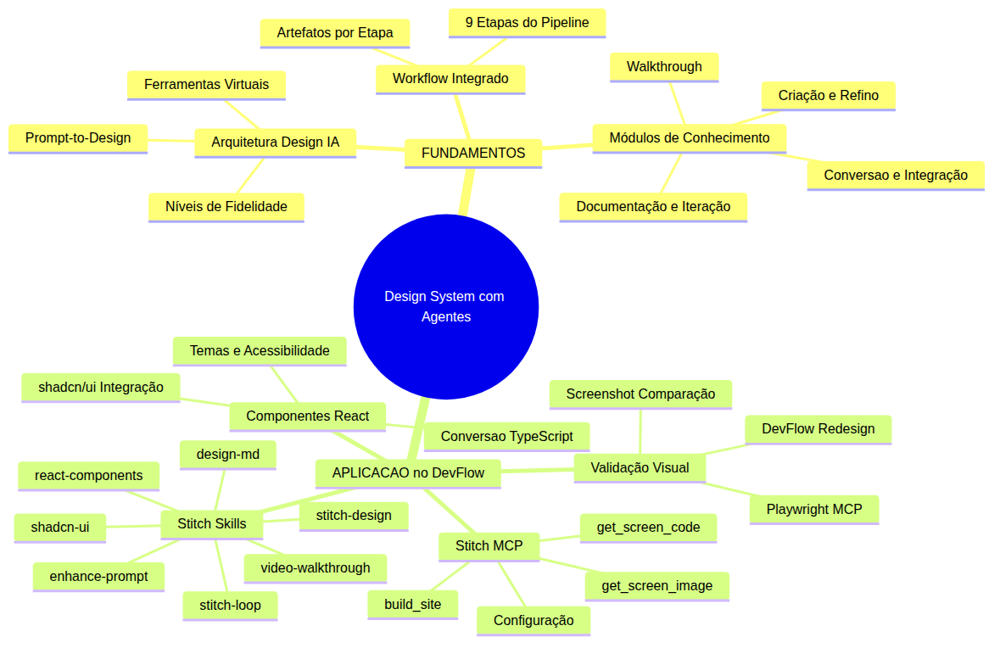
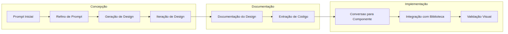
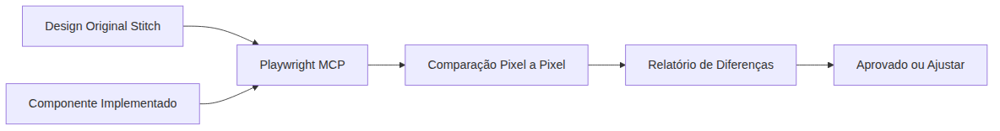

# Programador Profissional com Agentes — Aula 15

## Stitch — Design System com Agentes, do Prompt ao Componente React

**Duração estimada:** 55 minutos (30 de leitura + 25 de prática)

**Nível:** Avançado

**Pré-requisitos:** Aula 14 concluída — DevFlow com pipeline agêntico completo funcional, GitHub MCP operacional, subagentes @reviewer @tester @documenter criados, CI/CD pipeline funcional, MCPs de frontend (Figma, Playwright, Browser) conectados

---

## Objetivos de Aprendizagem

Ao final desta aula, você será capaz de:

- [ ] **Explicar** a arquitetura de design com IA — como uma plataforma de design transforma prompts textuais em interfaces de alta fidelidade
- [ ] **Descrever** o papel do protocolo de extensão (MCP) como ponte entre a plataforma de design e o ambiente de desenvolvimento
- [ ] **Diferenciar** os 7 tipos de módulos de conhecimento especializado, identificando o propósito e o momento de uso de cada um
- [ ] **Mapear** o workflow completo de prompt a componente, listando as 9 etapas e os artefatos produzidos em cada uma
- [ ] **Configurar** o servidor de extensão de design no ambiente de desenvolvimento, validando as 3 ferramentas virtuais principais
- [ ] **Aplicar** os módulos de conhecimento para refinar prompts, iterar sobre designs e documentar sistemas de design
- [ ] **Converter** telas geradas em componentes React TypeScript utilizando módulos especializados de conversão
- [ ] **Integrar** os componentes gerados com uma biblioteca de interface (shadcn/ui), aplicando temas, variantes e acessibilidade
- [ ] **Validar** visualmente a implementação comparando o componente final com o design original usando ferramentas de automação de navegador
- [ ] **Redesenhar** uma tela completa do DevFlow seguindo o fluxo completo: prompt → design → componente → validação

---

## Como Usar Esta Aula

Esta aula está organizada em duas partes. A **primeira parte** (conceitual) apresenta a arquitetura de design com IA — como plataformas de design generativo funcionam, o papel do protocolo de extensão como ponte, os módulos de conhecimento especializado e o workflow integrado de 9 etapas que leva de um prompt textual a um componente React funcional. Nesta parte, nenhum produto específico é mencionado — apenas os conceitos universais.

A **segunda parte** (aplicação) materializa todos os conceitos no DevFlow: você vai configurar um servidor de extensão de design (Stitch MCP), aplicar os 7 módulos de conhecimento (Stitch Skills), converter telas em componentes React TypeScript com shadcn/ui, integrar com o build_site para mapear telas em rotas, e validar visualmente com testes de navegador automatizados (Playwright MCP).

Ao longo do caminho, você encontrará seções **"Mão na Massa"** para fazer junto e **"Quick Check"** para verificar se entendeu antes de avançar. Ao final, o arquivo separado **Questões de Aprendizagem** traz as tarefas de checkpoint — só avance quando conseguir completá-las por conta própria.

**Tempo estimado:** 30 minutos de leitura + 25 minutos de prática.

---

## Mapa Mental

Este diagrama mostra todos os conceitos que você vai dominar nesta aula:



> *O mapa mental acima mostra a estrutura da aula. Cada ramo representa um conceito que você vai explorar: dos fundamentos da arquitetura de design com IA ao redesign completo do DevFlow.*

---

## Recapitulação das Aulas 01 a 14

Antes de mergulhar no novo conteúdo, veja como cada aula anterior construiu a base para o que você vai aprender hoje:

| Aula | Conceito | Conexão com Design System com Agentes |
|------|----------|---------------------------------------|
| Aula 01 | **Ambiente profissional** | O editor e o Node.js são a base onde o servidor de extensão de design vai rodar |
| Aula 02 | **Instructions permanentes** | As convenções do time guiam como os componentes gerados devem seguir o padrão do DevFlow |
| Aula 03 | **Agent Mode** | O loop Understand-Act-Validate é o motor que executa as skills de design automaticamente |
| Aula 04 | **ADRs e Handoff** | Decisões de design system são documentadas em ADRs para uso em sessões futuras |
| Aula 05 | **Código Limpo** | Componentes gerados precisam seguir princípios de clean code para serem mantíveis |
| Aula 06 | **TDD e Testes** | Testes visuais validam se o componente implementado corresponde ao design gerado |
| Aula 07 | **CI/CD Pipeline** | O pipeline valida que componentes gerados passam pelos quality gates |
| Aula 08 | **Frontend React + E2E** | Componentes React gerados precisam de testes E2E para validar fluxos completos |
| Aula 09 | **Skills de Documentação** | Skills de design estendem o conceito: não só documentação, mas conhecimento especializado de domínio |
| Aula 10 | **MCPs de Frontend** | **PONTE CRÍTICA**: o Figma MCP extrai specs, o Playwright MCP valida visualmente — ambos são pré-requisitos diretos do Stitch MCP |
| Aula 11 | **GitHub MCP Nativo** | O GitHub MCP gerencia o fluxo de PRs com componentes gerados |
| Aula 12 | **Subagentes e Delegação** | **PONTE CRÍTICA**: subagentes especializados são a base do conceito de skills — skills são receitas que agentes seguem |
| Aula 13 | **Continual Harness** | Métricas de qualidade de design alimentam o refinamento das skills de design |
| Aula 14 | **Pipeline Agêntico Completo** | O pipeline de 8 etapas agora inclui design como etapa pre-code |

> *As Aulas 10 e 12 são as pontes mais diretas para esta aula. MCPs (Aula 10) e subagentes com skills (Aula 12) são os dois pilares que o Stitch une: ferramentas externas + receitas de conhecimento especializado.*

---

**FUNDAMENTOS: Arquitetura de Design com IA**

> *Esta seção apresenta os conceitos universais de design com IA, sem usar nomes de produtos específicos. O que você vai ler aqui se aplica a qualquer plataforma de design generativo — porque os princípios são os mesmos, independentemente da ferramenta.*

---

## 1. Arquitetura de Design com IA e Protocolo de Extensão

### O que é design com IA generativa

**Design com IA generativa** é o processo de criar interfaces de usuário a partir de descrições textuais. Em vez de usar ferramentas visuais tradicionais (arrastar e soltar componentes, ajustar pixels no Figma ou Sketch), você descreve o que quer em linguagem natural, e uma plataforma de design com IA gera a interface correspondente.

O processo é semelhante a como você usa um assistente de código: você descreve o que precisa, e o assistente gera o código. Só que aqui, o resultado não é código — é um **design visual de alta fidelidade**, com cores, espacamentos, tipografia e layout definidos.

A diferença fundamental entre design com IA e design tradicional:

| Aspecto | Design Tradicional | Design com IA Generativa |
|---------|--------------------|---------------------------|
| Entrada | Arrastar componentes, ajustar propriedades | Prompt textual descritivo |
| Iteração | Modificar manualmente cada elemento | Refinar o prompt ou ajustar parâmetros |
| Velocidade | Horas para um protótipo | Segundos para uma tela |
| Fidelidade | Do wireframe ao high-fidelity | Direto em alta fidelidade |
| Consistência | Manual (design system) | Incorporada no prompt e no modelo |

### Níveis de fidelidade

O design com IA generativa produz interfaces em diferentes níveis de fidelidade, dependendo do modelo e dos parâmetros usados:

1. **Baixa fidelidade (wireframe)**: layouts esqueleto, sem cores ou tipografia definida. Uso: exploração rápida de estrutura.
2. **Media fidelidade (mockup)**: cores, tipografia e espacamento definidos, mas sem conteúdo real ou interações. Uso: aprovação de layout.
3. **Alta fidelidade (protótipo)**: design completo com cores, tipografia, imagens, espacamento e micro-interações. Uso: ready for development.

Para desenvolvimento profissional, o target e sempre **alta fidelidade** — porque e o único nível que permite extrair especificações precisas para implementação.

### O prompt como especificação de design

No design com IA generativa, o prompt é a especificação. Quanto mais detalhado o prompt, melhor o resultado. Um prompt eficaz inclui:

- **Contexto**: qual o propósito da tela (login, dashboard, checkout)
- **Estrutura**: quais seções e componentes (header, formulário, tabela, footer)
- **Estilo**: referências de design (moderno, minimalista, colorido, escuro)
- **Restrições**: o que NÃO incluir (sem sidebar, sem animações)
- **Dispositivo**: mobile, desktop, tablet

### O protocolo de extensão como ponte

Uma plataforma de design com IA, isoladamente, gera imagens e HTML. Mas para um desenvolvedor, o valor real está em **integrar** esse design ao fluxo de desenvolvimento. É aqui que entra o **protocolo de extensão** (MCP — Model Context Protocol).

O MCP atua como ponte entre a plataforma de design e o ambiente de desenvolvimento. Ele expõe **ferramentas virtuais** que o assistente de código pode chamar para:

1. **Criar** projetos e telas na plataforma de design
2. **Ler** o código HTML gerado para cada tela
3. **Obter** a imagem (screenshot) de cada tela
4. **Listar** projetos e telas existentes
5. **Construir** um site completo a partir de múltiplas telas

### As 3 ferramentas virtuais principais

Toda plataforma de design com IA que se integra ao ambiente de desenvolvimento via MCP expõe pelo menos 3 ferramentas virtuais essenciais:

**1. get_screen_code**
Recupera o código HTML completo de uma tela específica. O assistente de código usa esta ferramenta para obter o markup e os estilos gerados pela plataforma de design — a matéria-prima para a conversão em componentes.

**2. get_screen_image**
Recupera a screenshot da tela como imagem (tipicamente em base64). Usada para:
- Validação visual (comparar implementação com design)
- Documentação (incluir a imagem no ADR ou no README)
- Contexto visual para o assistente (que pode "ver" o design)

**3. build_site**
Constrói um site completo a partir de múltiplas telas e um mapeamento de rotas. Dado um projeto com N telas e um array de pares {screenId, route}, a ferramenta gera páginas HTML completas, cada uma com o conteúdo da tela correspondente.

### A analogia do arquiteto e do construtor

Imagine que você é o arquiteto de uma casa. No método tradicional, você desenhava cada detalhe a mão (planta baixa, elevações, detalhamentos) — horas ou dias de trabalho. O design com IA generativa é como ter um **arquiteto IA** que, a partir da sua descrição ("uma casa de 3 quartos com estilo moderno, varanda ampla e cozinha integrada"), gera a planta completa em segundos.

O MCP é o **portal de obras** que conecta o arquiteto (plataforma de design) ao construtor (assistente de código). Sem o portal, o arquiteto entrega a planta em PDF, e o construtor precisa redigitar tudo. Com o portal, o construtor recebe a planta em formato digital que pode ser convertido diretamente em materiais e ordens de serviço.

> *Até aqui você entendeu os fundamentos: o design com IA generativa transforma prompts em interfaces de alta fidelidade, e o protocolo de extensão (MCP) é a ponte que leva esse design para o ambiente de desenvolvimento. São 3 ferramentas virtuais principais: get_screen_code, get_screen_image e build_site. Respire. Agora vamos ver como o conhecimento especializado potencializa esse fluxo.*

### Quick Check 1

**1. Quais são as 3 ferramentas virtuais essenciais que um MCP de design expõe e qual a função de cada uma?**
**Resposta:** 1) get_screen_code — recupera o código HTML da tela, 2) get_screen_image — recupera a screenshot como imagem base64, 3) build_site — constrói um site completo a partir de múltiplas telas e rotas.

**2. Qual a diferença entre um design de baixa fidelidade e um de alta fidelidade no contexto de desenvolvimento profissional?**
**Resposta:** Baixa fidelidade (wireframe) mostra apenas estrutura, sem cores ou tipografia definidas. Alta fidelidade inclui cores, espacamento, tipografia e micro-interações — necessário para extrair especificações precisas para implementação em código.

---

## 2. Módulos de Conhecimento Especializado

### O problema: ferramentas atômicas não são suficientes

As 3 ferramentas virtuais do MCP são **atômicas** — cada uma faz uma operação simples e bem definida. Mas o fluxo real de design para código e composto por **processos multi-etapas** que combinam várias ferramentas em sequência:

- "Refinar este prompt para gerar um design melhor" não é uma ferramenta — é um processo.
- "Documentar o design system desta tela" não é uma ferramenta — é um processo.
- "Converter este design HTML em um componente React com shadcn/ui" não é uma ferramenta — é um processo.

Para resolver isso, existem os **módulos de conhecimento especializado** — também chamados de **skills** ou **receitas**. Cada módulo é um conjunto organizado de instruções que ensina o assistente a executar um processo completo de design, combinando ferramentas, conhecimento de domínio e boas práticas.

### As 7 categorias de módulos de conhecimento

O ecossistema de design com IA possui 7 categorias de módulos de conhecimento especializado, cada um com um propósito distinto:

**1. Criação (stitch-design)**
Propósito: gerar designs completos a partir de prompts, aplicando princípios de UI/UX e boas práticas de layout. O módulo sabe como estruturar um prompt para obter designs de alta qualidade, quais parâmetros de dispositivo usar e como iterar sobre resultados.

**2. Refino (enhance-prompt)**
Propósito: transformar prompts vagos ou simples em prompts detalhados e estruturados, prontos para geração. O módulo aplica técnicas de engenharia de prompt especificas para design: adiciona contexto de plataforma, específica seções, define estilo visual e inclui restrições.

**3. Documentação (design-md)**
Propósito: extrair e documentar o design system de uma ou mais telas geradas. O módulo analisa cores, tipografia, espacamentos, componentes e padrões — e produz documentação estruturada em Markdown.

**4. Iteração (stitch-loop)**
Propósito: criar múltiplas telas de forma iterativa, construindo um site completo página por página. O módulo gerencia o estado entre iterações, mantendo consistência visual entre telas consecutivas.

**5. Conversão (react-components)**
Propósito: converter o HTML gerado pela plataforma de design em componentes React TypeScript. O módulo aplica boas práticas de React: componentização, props, tipos, estilos (Tailwind CSS) e estrutura de pastas.

**6. Integração (shadcn-ui)**
Propósito: adaptar os componentes convertidos para usar uma biblioteca de interface (shadcn/ui). O módulo mapeia elementos HTML para componentes da biblioteca, aplica temas e variantes, e garante acessibilidade.

**7. Walkthrough (vídeo-walkthrough)**
Propósito: gerar um vídeo gravado que demonstra o fluxo completo de design — do prompt ao componente final. Usado para documentação, apresentações e portfólio.

### Isolamento de domínio

Cada módulo de conhecimento e **isolado por domínio** — ele sabe tudo sobre seu domínio específico e quase nada sobre os outros. O módulo de refino não sabe converter React. O módulo de conversão não sabe documentar design system. Isso é intencional: o isolamento permite que cada módulo seja:

- **Testável** individualmente (o módulo de conversão pode ser testado sem dependência dos outros)
- **Substituível** (você pode trocar o módulo de integração sem afetar o de criação)
- **Componível** (os módulos se combinam em pipelines sem conflito de instruções)

### A analogia da cozinha profissional

Uma cozinha profissional tem estações especializadas: a estação de cortes prepara os ingredientes, a estação de fogo cozinha, a estação de doces finaliza as sobremesas. Cada estação tem suas ferramentas, seus técnicos e seus processos.

Os módulos de conhecimento especializado são as **estações da sua cozinha de design**. A estação de refino (enhance-prompt) prepara o prompt — como o cozinheiro que corta e tempera os ingredientes antes de cozinhar. A estação de criação (stitch-design) cozinha o design — como o fogo que transforma ingredientes em prato. A estação de documentação (design-md) apresenta o prato — como o chef que descreve os ingredientes e o método.

Nenhuma estação faz tudo. cada uma é especializada. É o desenvolvedor (você) e o **chef de cozinha** que orquestra as estações na ordem certa.

> *Você conheceu as 7 categorias de módulos de conhecimento especializado: criação, refino, documentação, iteração, conversão, integração e walkthrough. cada uma é isolada por domínio, testável, substituível e componível. Agora vamos ver como elas se encaixam em um workflow integrado.*

### Quick Check 2

**1. Quais são as 7 categorias de módulos de conhecimento especializado para design com IA?**
**Resposta:** 1) Criação, 2) Refino, 3) Documentação, 4) Iteração, 5) Conversão, 6) Integração, 7) Walkthrough.

**2. Por que o isolamento de domínio entre módulos e importante?**
**Resposta:** O isolamento permite que cada módulo seja testável individualmente, substituível (trocar um módulo sem afetar os outros) e componível (combinar módulos em pipelines sem conflito de instruções).

---

## 3. Workflow Integrado: Pipeline de Prompt a Componente

### As 9 etapas do fluxo completo

O workflow completo de um prompt textual a um componente React funcional e composto por 9 etapas, organizadas em 3 fases:

**Fase 1: Concepção do Design**
1. **Prompt Inicial** — você descreve a tela que precisa em linguagem natural
2. **Refino de Prompt** — o módulo de refino transforma o prompt vago em uma especificação estruturada
3. **Geração de Design** — a plataforma de design gera a tela a partir do prompt refinado
4. **Iteração de Design** — você ajusta o prompt e regenera até o design ficar conforme esperado

**Fase 2: Documentação e Extração**
5. **Documentação do Design** — o módulo de documentação analisa o design final e produz a documentação do design system
6. **Extração de Código** — a ferramenta get_screen_code extrai o HTML da tela gerada

**Fase 3: Implementação e Validação**
7. **Conversão para Componente** — o módulo de conversão transforma o HTML em componente React TypeScript
8. **Integração com Biblioteca** — o módulo de integração adapta o componente para usar a biblioteca de interface (shadcn/ui)
9. **Validação Visual** — ferramenta de automação de navegador compara screenshot do componente implementado com o design original

### O diagrama do fluxo completo



Cada etapa produz um artefato que alimenta a próxima:

| Etapa | Artefato de Entrada | Artefato de Saída |
|-------|---------------------|-------------------|
| 1. Prompt Inicial | Ideia ou requisito | Prompt textual |
| 2. Refino de Prompt | Prompt simples | Prompt estruturado com contexto, seções, estilo |
| 3. Geração de Design | Prompt refinado | Design de alta fidelidade (imagem + HTML) |
| 4. Iteração de Design | Design gerado + feedback | Design final ajustado |
| 5. Documentação | Design final | Documentação Markdown do design system |
| 6. Extração de Código | Design final | Código HTML completo da tela |
| 7. Conversão | HTML da tela | Componente React TypeScript com Tailwind |
| 8. Integração | Componente React | Componente adaptado para a biblioteca de interface |
| 9. Validação | Componente final + design original | Relatório de discrepâncias visuais |

### O princípio de valor incremental

Cada etapa do pipeline agrega valor incremental ao artefato anterior. O prompt vago virá prompt estruturado, que virá design, que virá documentação, que virá código, que virá componente integrado e validado.

Você pode parar em qualquer etapa e ter um artefato útil:
- Parou na etapa 3? Tem um design de alta fidelidade para apresentar ao stakeholder.
- Parou na etapa 5? Tem documentação do design system para compartilhar com o time.
- Parou na etapa 7? Tem um componente React funcional.
- Parou na etapa 9? Tem um componente validado visualmente contra o design original.

### A analogia da linha de montagem de design

O pipeline de prompt a componente é como uma **linha de montagem de design**. O prompt inicial é a matéria-prima (o minério de ferro). O refino transforma em aço tratado. A geração forja a peça. A documentação é o controle de qualidade. A extração de código é o transporte para a fábrica de software. A conversão usina a peça no formato final. A integração monta a peça no produto. E a validação visual é o teste de qualidade final.

Cada estação da linha de montagem adiciona valor. Nenhuma estação trabalha sozinha. E o supervisor (você) garante que o fluxo inteiro funciona em sincronia.

> *Respire. O workflow completo tem 9 etapas em 3 fases — da concepção do design a implementação validada. Cada etapa produz um artefato que é consumido pela próxima. Agora vamos aplicar TUDO no DevFlow.*

### Quick Check 3

**1. Quantas etapas tem o workflow de prompt a componente e quais são as 3 fases?**
**Resposta:** 9 etapas em 3 fases: Fase 1 Concepção (Prompt Inicial, Refino, Geração, Iteração), Fase 2 Documentação (Documentação do Design, Extração de Código), Fase 3 Implementação (Conversão, Integração, Validação Visual).

**2. Qual o princípio que permite que você pare em qualquer etapa do pipeline e ainda ter um artefato útil?**
**Resposta:** O princípio de valor incremental — cada etapa agrega valor ao artefato anterior, e o resultado de qualquer etapa intermediária já é um artefato útil por si só (design para stakeholders, documentação para o time, componente React funcional, etc.).

---

**Aplicação: Stitch no DevFlow**

> *Agora que você entende os fundamentos conceituais — arquitetura de design com IA, protocolo de extensão, módulos de conhecimento especializado e o workflow de 9 etapas — vamos aplicar TUDO no DevFlow usando o ecossistema Stitch: Stitch MCP como servidor de extensão, Stitch Skills como módulos de conhecimento e Playwright MCP para validação visual.*

---

## 4. Stitch MCP — Configuração e Primeiros Passos

### O que é Stitch

**Stitch** é uma plataforma de design com IA desenvolvida pelo Google Labs que transforma prompts textuais em designs de alta fidelidade para web, dispositivos móveis e tablets. Diferente de ferramentas de design tradicionais, Stitch gera não apenas a imagem do design, mas também o código HTML completo e acessível — permitindo que o ciclo de design para código seja quase instantâneo.

O ecossistema Stitch tem 3 componentes principais:

1. **Stitch SDK** (`@google/stitch-sdk`): biblioteca JavaScript/TypeScript para interagir com a plataforma programaticamente
2. **Stitch MCP** (`@_davideast/stitch-mcp`): servidor MCP que expõe as ferramentas de design como ferramentas virtuais para o assistente de código
3. **Stitch Skills** (`google-labs-code/stitch-skills`): repositório de módulos de conhecimento especializado (skills) que ensinam o assistente a executar fluxos completos de design

### Instalação e configuração do Stitch MCP

O Stitch MCP é instalado como um servidor MCP no arquivo de configuração do assistente. Você não precisa instalar nada globalmente — o `npx` baixa e executa o pacote sob demanda.

A configuração é feita no arquivo `.vscode/mcp.json` do DevFlow:

```json
{
  "mcpServers": {
    "stitch": {
      "command": "npx",
      "args": ["@_davideast/stitch-mcp", "proxy"]
    }
  }
}
```

Se você usa autenticação via gcloud configurada no sistema, pode adicionar a variável de ambiente:

```json
{
  "mcpServers": {
    "stitch": {
      "command": "npx",
      "args": ["@_davideast/stitch-mcp", "proxy"],
      "env": {
        "STITCH_USE_SYSTEM_GCLOUD": "1"
      }
    }
  }
}
```

### Autenticação

O Stitch MCP precisa de autenticação para acessar a API do Google. Duas formas:

1. **API Key**: defina a variável de ambiente `STITCH_API_KEY` com sua chave de API do Google
2. **gcloud**: se você já tem o Google Cloud CLI configurado, use `STITCH_USE_SYSTEM_GCLOUD=1`

A forma mais simples para desenvolvimento e a API Key:

```bash
export STITCH_API_KEY="sua-chave-aqui"
```

### Ferramentas disponíveis no Stitch MCP

Apos configurado, o Stitch MCP expõe as seguintes ferramentas para o assistente:

**Ferramentas de projeto:**
- `create_project` — cria um novo projeto de design
- `list_projects` — lista todos os projetos existentes
- `get_project` — obtem detalhes de um projeto específico

**Ferramentas de tela:**
- `generate_screen` — gera uma nova tela a partir de um prompt textual
- `get_screen` — obtem detalhes de uma tela específica
- `list_screens` — lista todas as telas de um projeto

**Ferramentas virtuais (proxy):**
- `get_screen_code` — recupera o código HTML completo de uma tela
- `get_screen_image` — recupera a screenshot da tela como base64
- `build_site` — constrói um site completo a partir de telas e rotas

### Testando o Stitch MCP

Para verificar se o Stitch MCP esta funcionando, você pode pedir ao assistente:

```text
@assistente liste meus projetos no Stitch
```

O assistente vai chamar a ferramenta `list_projects` e retornar a lista. Se for a primeira vez, a lista estará vazia.

Para criar um projeto e gerar uma tela:

```text
@assistente crie um projeto no Stitch chamado "DevFlow Redesign"
e gere uma tela de login com email e senha para desktop
```

O assistente vai:
1. Chamar `create_project` com o título "DevFlow Redesign"
2. Anotar o projectId retornado
3. Chamar `generate_screen` com o prompt é o dispositivo DESKTOP
4. Anotar o screenId retornado
5. Chamar `get_screen_code` para obter o HTML
6. Chamar `get_screen_image` para obter a screenshot

### Mão na Massa 1: Configurar Stitch MCP é Testar Ferramentas

**Objetivo:** Configurar o Stitch MCP no DevFlow e testar as 3 ferramentas virtuais principais.

**Passo 1:** Adicione o Stitch MCP ao `.vscode/mcp.json` do DevFlow

Abra o arquivo `.vscode/mcp.json` e adicione a configuração do Stitch:

```json
{
  "mcpServers": {
    "stitch": {
      "command": "npx",
      "args": ["@_davideast/stitch-mcp", "proxy"]
    }
  }
}
```

Salve o arquivo. O assistente detecta automaticamente a mudanca.

**Passo 2:** Defina a variável de ambiente

```bash
export STITCH_API_KEY="sua-chave-aqui"
```

Adicione esta linha ao seu `~/.bashrc` ou `~/.zshrc` para persistir entre sessões.

**Passo 3:** Teste a ferramenta `get_screen_code`

Peça ao assistente para criar um projeto e uma tela de exemplo:

```text
@assistente usando o Stitch MCP, crie um projeto "DevFlow Test"
e gere uma tela de dashboard com cards de métricas para desktop.
Depois use get_screen_code para obter o HTML e get_screen_image para obter a imagem.
```

**Passo 4:** Teste a ferramenta `build_site`

```text
@assistente usando o projeto que voce criou, use build_site para
mapear a tela gerada para a rota "/dashboard".
```

**Resultado esperado:** Stitch MCP configurado, projeto criado, tela gerada, HTML extraído e build_site testado.

> *O Stitch MCP esta configurado e funcionando. Agora vamos dar o próximo passo: aplicar os módulos de conhecimento especializado (Stitch Skills) para refinar prompts, documentar designs e iterar sobre telas.*

### Quick Check 4

**1. Qual arquivo deve ser modificado para configurar o Stitch MCP é qual a estrutura básica da configuração?**
**Resposta:** O arquivo `.vscode/mcp.json`, com a estrutura `{"mcpServers":{"stitch":{"command":"npx","args":["@_davideast/stitch-mcp","proxy"]}}}`.

**2. Quais são as 3 ferramentas virtuais que o Stitch MCP proxy expõe?**
**Resposta:** `get_screen_code` (recupera HTML da tela), `get_screen_image` (recupera screenshot como base64), `build_site` (constrói site a partir de telas e rotas).

---

## 5. Stitch Skills — Módulos de Conhecimento Especializado

### Instalando as skills

As Stitch Skills estão no repositório `google-labs-code/stitch-skills`. Cada skill é instalada individualmente via CLI:

```bash
npx skills add google-labs-code/stitch-skills --skill stitch-design --global
npx skills add google-labs-code/stitch-skills --skill enhance-prompt --global
npx skills add google-labs-code/stitch-skills --skill design-md --global
npx skills add google-labs-code/stitch-skills --skill stitch-loop --global
npx skills add google-labs-code/stitch-skills --skill react-components --global
npx skills add google-labs-code/stitch-skills --skill shadcn-ui --global
npx skills add google-labs-code/stitch-skills --skill video-walkthrough --global
```

Ou instale todas de uma vez com um script:

```bash
for skill in stitch-design enhance-prompt design-md stitch-loop react-components shadcn-ui video-walkthrough; do
  npx skills add google-labs-code/stitch-skills --skill "$skill" --global
done
```

A flag `--global` torna a skill disponível em qualquer projeto. Sem ela, a skill fica restrita ao projeto atual.

### Skill 1: stitch-design — Criação de Design

**Propósito:** Gerar designs completos a partir de prompts, aplicando princípios de UI/UX.

**Quando usar:** Quando você tem uma descrição de tela e quer um design de alta fidelidade.

**Exemplo de uso:**

```text
@assistente use a skill stitch-design para criar um design de
tela de login para o DevFlow. A tela deve ter:
- Logo do DevFlow no topo
- Campo de email
- Campo de senha
- Botao "Entrar"
- Link "Esqueci minha senha"
- Design moderno, cores escuras (dark theme)
```

A skill orienta o assistente a:
1. Estruturar o prompt com contexto, seções e estilo
2. Chamar `generate_screen` com o prompt refinado
3. Chamar `get_screen_image` para mostrar o resultado
4. Solicitar feedback para iterar

### Skill 2: enhance-prompt — Refino de Prompt

**Propósito:** Transformar prompts vagos em prompts detalhados e estruturados.

**Quando usar:** Antes de gerar um design, se o prompt ainda estiver vago ou incompleto.

**Exemplo de uso:**

```text
@assistente use a skill enhance-prompt para refinar este prompt:
"Criar uma tela de dashboard para o DevFlow"
```

A skill produz um prompt estruturado como:

```
Plataforma: Desktop
Propósito: Dashboard principal do DevFlow, sistema de gerenciamento de projetos
Secoes:
  - Header: logo, avatar do usuário, notificações
  - Sidebar: navegacao com icones (Projetos, Tarefas, Relatorios, Configuracoes)
  - Main: cards com métricas (projetos ativos, tarefas pendentes, conclusão, horas)
  - Grid de projetos recentes com status
Estilo: Moderno, dark theme, cantos arredondados, sombras suaves
Cores: Primaria #6366f1 (indigo), fundo #0f172a (slate 900)
Tipografia: Inter, sem serifa
Restricoes: Sem animacoes complexas, sem overload de informacao
```

### Skill 3: design-md — Documentação de Design System

**Propósito:** Extrair e documentar o design system de telas geradas.

**Quando usar:** Depois de gerar o design final, para documentar cores, tipografia, espacamentos e componentes.

**Exemplo de uso:**

```text
@assistente use a skill design-md para documentar o design system
da tela de login que acabamos de gerar. Produza um arquivo
DESIGN-SYSTEM-LOGIN.md no diretório docs/design/.
```

A skill analisa o HTML da tela, extrai:
- Paleta de cores (primária, secundária, fundo, texto)
- Escala tipográfica (fontes, tamanhos, pesos)
- Espacamentos (padding, margin, gap)
- Componentes identificados (botões, inputs, cards)
- Padrões de layout (grid, flexbox)

### Skill 4: stitch-loop — Iteração Multi-Telas

**Propósito:** Criar múltiplas telas de forma iterativa, mantendo consistência.

**Quando usar:** Quando você precisa de um conjunto de telas que compartilham o mesmo design system.

**Exemplo de uso:**

```text
@assistente use a skill stitch-loop para criar 3 telas para o DevFlow:
1. Dashboard (visão geral com metricas)
2. Lista de Projetos (tabela com filtros)
3. Detalhes do Projeto (cards com informacoes)
Use o design system dark theme.
```

A skill:
1. Gera a primeira tela
2. Documenta o design system
3. Gera as telas seguintes aplicando o mesmo design system
4. Chama `build_site` para criar um site com as 3 telas mapeadas para rotas

### Skill 5: react-components — Conversão para React TypeScript

**Propósito:** Converter HTML de telas Stitch em componentes React TypeScript.

**Quando usar:** Depois de gerar e aprovar o design, para converter em componentes.

**Exemplo de uso:**

```text
@assistente use a skill react-components para converter a tela de login
do DevFlow em um componente React TypeScript. Use Tailwind CSS para os estilos.
```

A skill:
1. Chama `get_screen_code` para obter o HTML
2. Analisa a estrutura do HTML e identifica componentes
3. Converte cada componente para React TypeScript
4. Usa Tailwind CSS para estilização
5. Cria a estrutura de pastas: `src/components/Login/`
6. Gera: `Login.tsx`, `Login.types.ts`, `index.ts`

### Skill 6: shadcn-ui — Integração com Biblioteca de Interface

**Propósito:** Adaptar componentes React para usar shadcn/ui.

**Quando usar:** Depois de converter para React, para integrar com shadcn/ui.

**Exemplo de uso:**

```text
@assistente use a skill shadcn-ui para adaptar o componente de login
do DevFlow para usar componentes shadcn/ui: Button, Input, Card, Label.
```

A skill:
1. Identifica elementos HTML que podem ser substituidos por componentes shadcn/ui
2. Substitui: `<button>` por `<Button>`, `<input>` por `<Input>`, etc.
3. Aplica variantes e temas do shadcn/ui
4. Garante acessibilidade (aria-labels, roles, focus management)
5. Atualiza o arquivo de tipos se necessário

### Skill 7: vídeo-walkthrough — Gravação de Walkthrough

**Propósito:** Gerar um vídeo gravado demonstrando o fluxo de design completo.

**Quando usar:** No final do processo, para documentar o fluxo ou criar material de apresentação.

**Exemplo de uso:**

```text
@assistente use a skill video-walkthrough para gerar um video do
fluxo completo de design da tela de login do DevFlow.
```

A skill usa a biblioteca Remotion para gerar um vídeo programaticamente, mostrando cada etapa: prompt, geração, extração, conversão e resultado final.

### Mão na Massa 2: Aplicar Skills de Refino e Documentação

**Objetivo:** Usar as skills enhance-prompt e design-md para refinar um prompt e documentar o design system de uma tela do DevFlow.

**Passo 1:** Instale as skills necessarias

```bash
npx skills add google-labs-code/stitch-skills --skill enhance-prompt --global
npx skills add google-labs-code/stitch-skills --skill stitch-design --global
npx skills add google-labs-code/stitch-skills --skill design-md --global
```

**Passo 2:** Refine um prompt para o DevFlow

Peça ao assistente para refinar o prompt da tela de projetos:

```text
@assistente use a skill enhance-prompt para refinar este prompt:
"Tela de listagem de projetos do DevFlow com tabela e filtros"
```

**Passo 3:** Gere o design com o prompt refinado

```text
@assistente use a skill stitch-design para gerar o design da tela
de listagem de projetos usando o prompt refinado.
```

**Passo 4:** Documente o design system

```text
@assistente use a skill design-md para documentar o design system
da tela de listagem de projetos. Salve em docs/design/design-system-projetos.md
```

**Resultado esperado:** Prompt refinado e estruturado, design de alta fidelidade gerado, documentação do design system salva em Markdown.

> *As skills estão instaladas e funcionando. Você refinou um prompt, gerou um design e documentou o design system. Agora vamos ao passo mais importante: converter o design em componentes React e integrar com shadcn/ui.*

### Quick Check 5

**1. Qual comando instala uma skill do repositório stitch-skills?**
**Resposta:** `npx skills add google-labs-code/stitch-skills --skill <nome-da-skill> --global`

**2. Qual a diferença entre as skills react-components e shadcn-ui?**
**Resposta:** A skill react-components converte o HTML da tela em componentes React TypeScript com Tailwind CSS. A skill shadcn-ui adapta esses componentes para usar os componentes da biblioteca shadcn/ui (Button, Input, Card, etc.), aplicando temas, variantes e acessibilidade.

---

## 6. Componentes React com Stitch é shadcn/ui

### O fluxo de conversão

A conversão de um design Stitch para um componente React TypeScript funcional segue 3 etapas:

1. **Extração**: `get_screen_code` obtem o HTML completo da tela
2. **Análise**: o assistente analisa a estrutura HTML e identifica componentes, estados e props
3. **Conversão**: o assistente gera os arquivos React TypeScript com Tailwind CSS

### Exemplo prático: componente de login

Antes da conversão, o HTML extraído do Stitch se parece com:

```html
<div class="container">
  <div class="login-card">
    
    <h1>Entrar no DevFlow</h1>
    <form>
      <label for="email">Email</label>
      <input type="email" id="email" placeholder="seu@email.com" />
      <label for="password">Senha</label>
      <input type="password" id="password" placeholder="********" />
      <button type="submit">Entrar</button>
    </form>
    <a href="/forgot">Esqueci minha senha</a>
  </div>
</div>
```

Apos a conversão com a skill react-components, o componente gerado:

```tsx
// src/components/Login/Login.tsx
import React from 'react';
import { LoginProps } from './Login.types';

export const Login: React.FC<LoginProps> = ({ onSubmit, isLoading }) => {
  return (
    <div className="min-h-screen bg-slate-900 flex items-center justify-center p-4">
      <div className="bg-slate-800 rounded-xl p-8 w-full max-w-md shadow-2xl">
        
        <h1 className="text-2xl font-semibold text-white text-center mb-6">
          Entrar no DevFlow
        </h1>
        <form onSubmit={onSubmit} className="space-y-4">
          <div>
            <label htmlFor="email" className="block text-sm font-medium text-slate-300 mb-1">
              Email
            </label>
            <input
              type="email"
              id="email"
              placeholder="seu@email.com"
              className="w-full px-4 py-2 bg-slate-700 border border-slate-600 rounded-lg text-white placeholder-slate-400 focus:outline-none focus:ring-2 focus:ring-indigo-500"
            />
          </div>
          <div>
            <label htmlFor="password" className="block text-sm font-medium text-slate-300 mb-1">
              Senha
            </label>
            <input
              type="password"
              id="password"
              placeholder="********"
              className="w-full px-4 py-2 bg-slate-700 border border-slate-600 rounded-lg text-white placeholder-slate-400 focus:outline-none focus:ring-2 focus:ring-indigo-500"
            />
          </div>
          <button
            type="submit"
            disabled={isLoading}
            className="w-full py-2 px-4 bg-indigo-500 hover:bg-indigo-600 text-white font-medium rounded-lg transition-colors disabled:opacity-50 disabled:cursor-not-allowed"
          >
            {isLoading ? 'Entrando...' : 'Entrar'}
          </button>
        </form>
        <a href="/forgot" className="block text-center text-sm text-indigo-400 hover:text-indigo-300 mt-4">
          Esqueci minha senha
        </a>
      </div>
    </div>
  );
};
```

```tsx
// src/components/Login/Login.types.ts
export interface LoginFormData {
  email: string;
  password: string;
}

export interface LoginProps {
  onSubmit: (data: LoginFormData) => Promise<void>;
  isLoading?: boolean;
  error?: string;
}
```

```tsx
// src/components/Login/index.ts
export { Login } from './Login';
export type { LoginFormData, LoginProps } from './Login.types';
```

### Integração com shadcn/ui

Apos a conversão básica, a skill shadcn-ui adapta o componente para usar os componentes do shadcn/ui:

```tsx
// src/components/Login/Login.shadcn.tsx
import React from 'react';
import { Button } from '@/components/ui/button';
import { Input } from '@/components/ui/input';
import { Card, CardContent, CardHeader, CardTitle } from '@/components/ui/card';
import { Label } from '@/components/ui/label';
import { LoginProps, LoginFormData } from './Login.types';

export const LoginShadcn: React.FC<LoginProps> = ({ onSubmit, isLoading }) => {
  const [formData, setFormData] = React.useState<LoginFormData>({
    email: '',
    password: '',
  });

  const handleSubmit = (e: React.FormEvent) => {
    e.preventDefault();
    onSubmit(formData);
  };

  return (
    <div className="min-h-screen bg-background flex items-center justify-center p-4">
      <Card className="w-full max-w-md">
        <CardHeader className="text-center">
          
          <CardTitle>Entrar no DevFlow</CardTitle>
        </CardHeader>
        <CardContent>
          <form onSubmit={handleSubmit} className="space-y-4">
            <div className="space-y-2">
              <Label htmlFor="email">Email</Label>
              <Input
                id="email"
                type="email"
                placeholder="seu@email.com"
                value={formData.email}
                onChange={(e) => setFormData({ ...formData, email: e.target.value })}
              />
            </div>
            <div className="space-y-2">
              <Label htmlFor="password">Senha</Label>
              <Input
                id="password"
                type="password"
                placeholder="********"
                value={formData.password}
                onChange={(e) => setFormData({ ...formData, password: e.target.value })}
              />
            </div>
            <Button type="submit" className="w-full" disabled={isLoading}>
              {isLoading ? 'Entrando...' : 'Entrar'}
            </Button>
          </form>
        </CardContent>
      </Card>
    </div>
  );
};
```

Note as diferenças:
- `<button>` virá `<Button>` com variantes do shadcn/ui
- `<input>` virá `<Input>` com tema padrão
- `<div class="card">` virá `<Card>`, `<CardHeader>`, `<CardTitle>`, `<CardContent>`
- `<label>` virá `<Label>` com estilos consistentes
- Cores usam variáveis CSS do tema (`bg-background`) em vez de valores fixos
- Estado local gerenciado com `React.useState`

### Build_site: mapeando telas para rotas

A ferramenta `build_site` mapeia telas do Stitch para rotas do seu site. Dado um projeto com N telas, você específica um array de {screenId, route}, e a ferramenta gera páginas HTML completas.

Exemplo de chamada via assistente:

```text
@assistente use build_site para mapear as telas do projeto DevFlow:
- Tela de login -> rota "/login"
- Tela de dashboard -> rota "/"
- Tela de projetos -> rota "/projetos"
```

O assistente chama:

```text
npx @_davideast/stitch-mcp tool build_site -d '{
  "projectId": "ID_DO_PROJETO",
  "routes": [
    { "screenId": "ID_TELA_LOGIN", "route": "/login" },
    { "screenId": "ID_TELA_DASHBOARD", "route": "/" },
    { "screenId": "ID_TELA_PROJETOS", "route": "/projetos" }
  ]
}'
```

O resultado é um objeto com `success: true` e um array de `pages`, cada uma com `route`, `title` e `html`.

### Mão na Massa 3: Converter Telas em Componentes React com shadcn/ui

**Objetivo:** Usar as skills react-components e shadcn-ui para converter uma tela Stitch em componente React TypeScript integrado com shadcn/ui, e mapear com build_site.

**Passo 1:** Instale as skills de conversão

```bash
npx skills add google-labs-code/stitch-skills --skill react-components --global
npx skills add google-labs-code/stitch-skills --skill shadcn-ui --global
```

**Passo 2:** Gere uma tela de dashboard para o DevFlow

```text
@assistente use a skill stitch-design para gerar uma tela de dashboard
para o DevFlow com cards de métricas (projetos ativos, tarefas pendentes,
taxa de conclusão, horas registradas) e um gráfico simples.
```

**Passo 3:** Converta para React TypeScript

```text
@assistente use a skill react-components para converter a tela de
dashboard em componentes React TypeScript com Tailwind CSS.
Salve em src/components/Dashboard/.
```

**Passo 4:** Integre com shadcn/ui

```text
@assistente use a skill shadcn-ui para adaptar os componentes do
dashboard para usar componentes shadcn/ui (Card, Button, Badge, etc.).
```

**Passo 5:** Mapeie com build_site

```text
@assistente use build_site para mapear a tela de dashboard para
a rota "/dashboard" do DevFlow.
```

**Resultado esperado:** Componentes React TypeScript funcionais no diretório `src/components/Dashboard/`, adaptados para shadcn/ui, com rota mapeada via build_site.

> *A conversão de design para código esta completa. Você tem componentes React TypeScript com shadcn/ui prontos para usar no DevFlow. Agora, a etapa final: validar visualmente que o componente implementado corresponde ao design original.*

### Quick Check 6

**1. Qual a principal diferença entre um componente convertido com react-components e o mesmo componente apos a skill shadcn-ui?**
**Resposta:** O componente react-components usa HTML puro com Tailwind CSS. O componente shadcn-ui substitui elementos HTML por componentes da biblioteca (Button, Input, Card, Label), usa variáveis de tema CSS em vez de cores fixas, e adiciona estado local gerenciado com React hooks.

**2. Como a ferramenta build_site mapeia telas Stitch para rotas de um site?**
**Resposta:** Recebe um array de pares {screenId, route} e gera páginas HTML completas para cada par, cada página contendo o HTML da tela correspondente acessível na rota especificada.

---

## 7. Validação Visual com Playwright MCP é Vídeo Walkthrough

### O problema da fidelidade visual

Um componente pode estar funcionalmente correto (renderiza, aceita props, responde a eventos) mas visualmente diferente do design original. Diferenças de 2px no padding, um tom de cor ligeiramente diferente, ou uma fonte que não carregou podem passar despercebidas em code review mas são evidentes para o olho do designer ou do cliente.

A validação visual automatizada resolve este problema comparando **pixel a pixel** o componente implementado com o design original.

### Playwright MCP para validação visual

O Playwright MCP (configurado na Aula 10) expõe ferramentas de automação de navegador que permitem:

1. Navegar para uma URL
2. Tirar screenshot de um elemento ou página
3. Comparar screenshots com imagens de referência
4. Reportar diferenças visualmente

O fluxo de validação visual com Stitch + Playwright MCP:



### Executando a validação

Depois de implementar o componente, você pede ao assistente:

```text
@assistente use o Stitch MCP para obter a screenshot da tela de login
(use get_screen_image). Depois use o Playwright MCP para tirar um screenshot
do componente em http://localhost:3000/login. Compare os dois screenshots
e reporte as diferencas.
```

O assistente:
1. Chama `get_screen_image` para obter a imagem do design original
2. Usa o Playwright MCP para navegar até `http://localhost:3000/login`
3. Tira um screenshot do componente implementado
4. Compara as duas imagens pixel a pixel
5. Produz um relatório estruturado

### Relatório de discrepâncias

O relatório gerado segue o formato:

```markdown
## Validacao Visual: Tela de Login

### Correspondencias
- [x] Cor de fundo corresponde (#0f172a)
- [x] Largura do card corresponde (max-w-md)
- [x] Espacamento interno do card corresponde (p-8)
- [x] Tamanho da fonte do título corresponde (text-2xl)

### Discrepâncias
- [ ] Padding do formulario: 16px -> deveria ser 20px (design usa 20px)
- [ ] Cor do botao: bg-indigo-600 -> deveria ser bg-[#4f46e5] (tom mais escuro)
- [ ] Altura do input: 40px -> deveria ser 44px (design usa 44px)
- [ ] Margem inferior do logo: mb-6 -> deveria ser mb-8 (design usa 32px)

### Diferenca total: 4.2% dos pixels
- [ ] Aprovado? NAO (threshold: 2%)
```

### Integrando com vídeo-walkthrough

A skill `vídeo-walkthrough` pega todo o fluxo — do prompt inicial ao componente validado — e gera um vídeo gravado usando Remotion. O vídeo mostra:

1. O prompt inicial sendo digitado
2. O design sendo gerado pelo Stitch
3. O HTML sendo extraído com get_screen_code
4. O código React sendo gerado
5. A integração com shadcn/ui
6. A validação visual com Playwright MCP
7. O resultado final lado a lado

Para gerar:

```text
@assistente use a skill video-walkthrough para gerar um video do
fluxo completo de design da tela de login do DevFlow, do prompt
ao componente validado.
```

### Redesign completo do DevFlow

Agora que você domina o fluxo completo, pode aplicar tudo ao DevFlow. O redesign completo envolve:

1. **Analisar** as telas atuais do DevFlow (login, dashboard, projetos)
2. **Criar** prompts refinados para cada tela usando enhance-prompt
3. **Gerar** designs de alta fidelidade com stitch-design
4. **Iterar** sobre os designs até aprovar com stitch-loop
5. **Documentar** o design system com design-md
6. **Converter** para React TypeScript com react-components
7. **Integrar** com shadcn/ui
8. **Validar** visualmente com Playwright MCP
9. **Gerar** vídeo walkthrough com vídeo-walkthrough

### Aplicando ao DevFlow: fluxo completo

Vamos aplicar o fluxo completo de 9 etapas para redesenhar a tela de dashboard do DevFlow:

**Etapa 1: Prompt Inicial**
```text
Quero redesenhar o dashboard do DevFlow com um visual mais moderno
```

**Etapa 2: Refino (enhance-prompt)**
```text
@assistente refine este prompt para o Stitch: "Dashboard do DevFlow
com metricas, gráficos e projetos recentes, dark theme"
```

**Etapa 3: Geração (stitch-design)**
```text
@assistente gere o design do dashboard com o prompt refinado
```

**Etapa 4: Iteração (stitch-loop)**
```text
@assistente ajuste o design: aumente o tamanho dos cards de metrica,
adicione um gráfico de barras, e mova a lista de projetos para baixo
```

**Etapa 5: Documentação (design-md)**
```text
@assistente documente o design system do dashboard em docs/design/
```

**Etapa 6: Extração (get_screen_code)**
```text
@assistente extraia o HTML do dashboard aprovado
```

**Etapa 7: Conversão (react-components)**
```text
@assistente converta o dashboard em componentes React TypeScript
```

**Etapa 8: Integração (shadcn-ui)**
```text
@assistente adapte o dashboard para usar shadcn/ui
```

**Etapa 9: Validação (Playwright MCP)**
```text
@assistente valide visualmente o dashboard implementado contra o design original
```

> *O fluxo completo de 9 etapas esta mapeado e aplicado ao DevFlow. Do prompt ao componente validado — passando por refino, geração, iteração, documentação, extração, conversão, integração e validação visual. O ciclo se fecha: o design virá código, e o código e verificado contra o design.*

### Quick Check 7

**1. Como o Playwright MCP valida visualmente um componente?**
**Resposta:** O Playwright MCP navega até a URL do componente, tira um screenshot da página ou elemento, e compara pixel a pixel com a imagem do design original obtida via get_screen_image. O resultado é um relatório de discrepâncias com correspondências e diferenças.

**2. Qual skill gera um vídeo do fluxo completo de design e qual tecnologia ela usa?**
**Resposta:** A skill vídeo-walkthrough, que usa a biblioteca Remotion para gerar vídeos programaticamente.

---

## Exercicios Graduados

### Exercicio 1 (Fácil): Configurar Stitch MCP é Gerar Primeira Tela

**Contexto:** Você esta configurando o DevFlow para usar design com IA. O primeiro passo e conectar o Stitch MCP é gerar uma tela de exemplo.

**Tarefa:**
1. Configure o Stitch MCP no `.vscode/mcp.json` do DevFlow
2. Defina a variável de ambiente STITCH_API_KEY
3. Peça ao assistente para criar um projeto "DevFlow" e gerar uma tela de "página de login com email e senha, dark theme"
4. Use get_screen_code para obter o HTML da tela gerada
5. Use get_screen_image para obter a screenshot

**Critério de sucesso:** Stitch MCP conectado, projeto criado, tela gerada, HTML extraído e screenshot salva.

**Gabarito:**
```
Arquivo .vscode/mcp.json criado ou atualizado com a configuracao:
{
  "mcpServers": {
    "stitch": {
      "command": "npx",
      "args": ["@_davideast/stitch-mcp", "proxy"]
    }
  }
}

Variavel STITCH_API_KEY definida no ambiente.

Comando executado com sucesso: projeto criado, tela de login gerada,
HTML e screenshot extraidos. Screenshot salva como dashboard-screenshot.png.
```

---

### Exercicio 2 (Medio): Design System de uma Tela do DevFlow

**Contexto:** Você tem uma tela de dashboard gerada pelo Stitch é quer documentar o design system completo, converter para React e integrar com shadcn/ui.

**Tarefa:**
1. Use a skill enhance-prompt para refinar o prompt: "Dashboard com cards de métricas para o DevFlow"
2. Use a skill stitch-design para gerar o design
3. Use a skill design-md para documentar o design system (salve em `docs/design/dashboard-design-system.md`)
4. Use a skill react-components para converter em componentes React TypeScript
5. Use a skill shadcn-ui para integrar com shadcn/ui

**Critério de sucesso:** Documentação do design system salva, componentes React TypeScript criados em `src/components/Dashboard/`, componentes adaptados para shadcn/ui.

**Gabarito:**
```
1. Prompt refinado de "Dashboard com cards" para especificacao estruturada
   com contexto, secoes, estilo, cores e restricoes.

2. Design de alta fidelidade gerado com stitch-design.

3. Arquivo docs/design/dashboard-design-system.md criado contendo:
   - Paleta de cores
   - Escala tipografica
   - Espacamentos
   - Componentes identificados
   - Padroes de layout

4. Componentes criados em src/components/Dashboard/:
   - Dashboard.tsx
   - Dashboard.types.ts
   - DashboardCard.tsx
   - index.ts

5. Componentes adaptados para shadcn/ui com Card, Badge, Button.
```

---

### Exercicio 3 (Difícil): Redesign Completo de uma Tela do DevFlow com Validação Visual

**Contexto:** Você precisa redesenhar a tela de listagem de projetos do DevFlow seguindo o fluxo completo de 9 etapas, com validação visual.

**Tarefa:**
1. Execute as 9 etapas do workflow para redesenhar a tela de listagem de projetos:
   - Prompt inicial descrevendo a tela atual e o que melhorar
   - Refino com enhance-prompt
   - Geração com stitch-design
   - Iteração com stitch-loop (no mínimo 2 iterações)
   - Documentação com design-md
   - Extração com get_screen_code
   - Conversão com react-components
   - Integração com shadcn-ui
   - Validação visual com Playwright MCP (comparar implementação com design original)
2. Documente cada etapa em um arquivo `REDESIGN-PROJETOS.md`
3. Inclua o relatório de discrepâncias visuais e as correções aplicadas

**Critério de sucesso:** Redesign completo documentado, componente implementado e validado visualmente com menos de 2% de discrepância.

**Gabarito:**
```
Arquivo REDESIGN-PROJETOS.md contendo:

## Redesign: Listagem de Projetos do DevFlow

### Etapa 1: Prompt Inicial
"Redesenhar a tela de listagem de projetos com visual mais moderno,
tabela com filtros, busca em tempo real e design responsivo"

### Etapa 2: Prompt Refinado
[Prompt estruturado gerado pelo enhance-prompt]

### Etapa 3: Design Gerado
[Screenshot do design gerado pelo Stitch]

### Etapa 4: Iteracoes
- Iteracao 1: Design inicial com cards
- Iteracao 2: Ajuste de espacamentos e cores
- [Design final aprovado]

### Etapa 5: Design System
[Link para docs/design/projetos-design-system.md]

### Etapa 6: HTML Extraido
[Resumo do HTML extraido]

### Etapa 7: Componentes React
[Lista de componentes criados em src/components/Projetos/]

### Etapa 8: Integracao shadcn/ui
[Lista de componentes shadcn/ui utilizados]

### Etapa 9: Validacao Visual
[Relatorio do Playwright MCP]
- Discrepancias encontradas: N
- Discrepancias corrigidas: N
- Discrepancia final: X%

### Aprovado? SIM
```

---

## Autoavaliação: Quiz Rápido

**1. Quantas etapas tem o workflow completo de prompt a componente validado?**

> a) 5
> b) 7
> c) 9
> d) 12

**Resposta:** c) 9 etapas em 3 fases: Concepção (Prompt Inicial, Refino, Geração, Iteração), Documentação (Documentação do Design, Extração de Código), Implementação (Conversão, Integração, Validação Visual).

---

**2. Qual a função da ferramenta virtual build_site no Stitch MCP?**

> a) Gerar imagens das telas
> b) Construir um site completo a partir de múltiplas telas e rotas
> c) Compilar o código React
> d) Validar visualmente os componentes

**Resposta:** b) build_site recebe um array de pares {screenId, route} e gera páginas HTML completas para cada par.

---

**3. Qual skill deve ser usada para converter HTML de uma tela Stitch em componentes React TypeScript?**

> a) stitch-design
> b) design-md
> c) react-components
> d) enhance-prompt

**Resposta:** c) react-components converte o HTML em componentes React TypeScript com Tailwind CSS.

---

**4. Qual a diferença entre react-components e shadcn-ui?**

> a) São a mesma skill com nomes diferentes
> b) react-components gera HTML puro; shadcn-ui gera React
> c) react-components converte para React; shadcn-ui adapta para usar componentes shadcn/ui
> d) react-components só funciona com JavaScript; shadcn-ui só funciona com TypeScript

**Resposta:** c) react-components converte o HTML em componentes React TypeScript; shadcn-ui adapta esses componentes para usar os componentes da biblioteca shadcn/ui (Button, Input, Card, etc.), aplicando temas, variantes e acessibilidade.

---

**5. Como o Playwright MCP valida visualmente um componente?**

> a) Executa testes unitarios no componente
> b) Compara pixel a pixel o screenshot do componente implementado com a imagem do design original
> c) Analisa o código CSS em busca de erros
> d) Gera um relatório de acessibilidade

**Resposta:** b) O Playwright MCP navega até a URL do componente, tira um screenshot e compara pixel a pixel com a imagem do design original obtida via get_screen_image.

---

**6. Qual das seguintes opções NÃO e uma skill do repositório stitch-skills?**

> a) stitch-design
> b) enhance-prompt
> c) tailwind-css
> d) vídeo-walkthrough

**Resposta:** c) tailwind-css não é uma skill do repositório stitch-skills. As 7 skills são: stitch-design, enhance-prompt, design-md, stitch-loop, react-components, shadcn-ui e vídeo-walkthrough.

---

## Resumo da Aula

1. **Arquitetura de design com IA**: plataformas de design generativo transformam prompts textuais em interfaces de alta fidelidade. O protocolo de extensão (MCP) é a ponte entre a plataforma de design e o ambiente de desenvolvimento.

2. **Três ferramentas virtuais**: get_screen_code (extrai HTML), get_screen_image (extrai screenshot), build_site (constrói site de múltiplas telas).

3. **Sete módulos de conhecimento**: criação (stitch-design), refino (enhance-prompt), documentação (design-md), iteração (stitch-loop), conversão (react-components), integração (shadcn-ui) e walkthrough (vídeo-walkthrough) — cada um isolado por domínio, testável e componível.

4. **Workflow de 9 etapas**: Prompt Inicial → Refino → Geração → Iteração → Documentação → Extração → Conversão → Integração → Validação Visual. Cada etapa agrega valor incremental.

5. **Stitch MCP**: servidor MCP que expõe as ferramentas de design para o assistente. Configurado em `.vscode/mcp.json` com `npx @_davideast/stitch-mcp proxy`.

6. **Stitch Skills**: repositório `google-labs-code/stitch-skills` com 7 skills instalaveis via `npx skills add`.

7. **Conversão React**: a skill react-components converte HTML em componentes TypeScript com Tailwind CSS. A skill shadcn-ui adapta para usar componentes da biblioteca shadcn/ui.

8. **Validação visual**: Playwright MCP compara screenshots do componente implementado com o design original, produzindo relatório de discrepâncias.

9. **Redesign do DevFlow**: fluxo completo aplicado para redesenhar telas do DevFlow, do prompt ao componente validado.

---

## Próximos Passos

Esta aula estende o Bloco C do curso, adicionando design com IA ao ecossistema que você construiu. Com o Stitch, você fecha a lacuna entre design e código — o prompt virá design, e o design virá componente React validado.

O que explorar depois desta aula:

1. **Stitch SDK direto**: use o SDK `@google/stitch-sdk` para automatizar fluxos de design via código, sem depender do assistente.
2. **Criar suas próprias skills**: siga o padrão das Stitch Skills para criar skills personalizadas de design para o DevFlow.
3. **Integrar com o pipeline**: adicione o fluxo de design como etapa pre-code no pipeline agente da Aula 14.
4. **Multiplos dispositivos**: gere designs para MOBILE, TABLET e DESKTOP e valide a responsividade com Playwright MCP.
5. **Temas customizados**: crie temas shadcn/ui personalizados que correspondam exatamente ao design system do DevFlow.

Na próxima aula (se houver extensão), você pode explorar como criar suas próprias skills de design com o Stitch SDK.

---

## Referências

- **Stitch SDK**: `@google/stitch-sdk` — documentação oficial no GitHub
- **Stitch MCP**: `@_davideast/stitch-mcp` — servidor MCP com ferramentas virtuais
- **Stitch Skills**: `google-labs-code/stitch-skills` — repositório de módulos de conhecimento
- **Playwright MCP**: automação de navegador para validação visual
- **shadcn/ui**: biblioteca de componentes React com temas e variantes
- **Remotion**: biblioteca para geração de vídeos programaticos em React
- **Model Context Protocol (MCP)**: arquitetura cliente-servidor para ferramentas de IA
- **Google Stitch Platform**: plataforma de design com IA generativa

---

## FAQ

**1. Preciso de uma conta Google para usar o Stitch?**
Sim. O stitch é uma plataforma Google. Você precisa de uma conta Google e de uma API Key (ou autenticação via gcloud) para usar o SDK é o MCP.

**2. O Stitch MCP substitui o Figma MCP?**
Não. São ferramentas complementares. O Figma MCP extrai especificações de designs existentes no Figma. O Stitch MCP gera designs a partir de prompts. Use Figma MCP para designs prontos, Stitch MCP para criar novos designs.

**3. Posso usar Stitch sem o MCP, apenas com o SDK?**
Sim. O SDK `@google/stitch-sdk` pode ser usado diretamente em scripts Node.js. O MCP é um facilitador para integrar com o assistente de código.

**4. Quanto custa usar o Stitch?**
O Stitch tem um tier gratuito com limites de uso. Para uso profissional, verifique os precos na documentação oficial do Google.

**5. Posso treinar o Stitch com meu próprio design system?**
Sim. Você pode criar um design system programaticamente com `project.createDesignSystem()` e aplica-lo a todas as telas geradas.

**6. O código gerado pelo Stitch é production-ready?**
O código HTML gerado e um ponto de partida de alta qualidade, mas você precisa revisar e adaptar para produção — especialmente questões de performance, acessibilidade e integração com o backend real.

**7. As skills funcionam em qualquer assistente de código?**
Sim. Skills seguem o formato padrão `SKILL.md` e funcionam em qualquer assistente que suporte o protocolo de skills. A instalação via `npx skills add` e universal.

---

## Glossário

| Termo | Definição |
|-------|-----------|
| **Stitch** | Plataforma de design com IA do Google Labs que gera interfaces a partir de prompts |
| **Stitch MCP** | Servidor MCP que expõe ferramentas de design para assistentes de código |
| **Stitch SDK** | Biblioteca JavaScript/TypeScript para interagir com a plataforma Stitch programaticamente |
| **Stitch Skills** | Repositório de módulos de conhecimento especializado para fluxos de design |
| **get_screen_code** | Ferramenta virtual que recupera o código HTML de uma tela Stitch |
| **get_screen_image** | Ferramenta virtual que recupera a screenshot de uma tela como base64 |
| **build_site** | Ferramenta virtual que constrói um site completo a partir de telas e rotas |
| **enhance-prompt** | Skill que refina prompts vagos em especificações estruturadas de design |
| **stitch-design** | Skill que gera designs completos aplicando princípios de UI/UX |
| **design-md** | Skill que documenta o design system de telas geradas |
| **stitch-loop** | Skill que cria múltiplas telas iterativamente mantendo consistência |
| **react-components** | Skill que converte HTML de telas em componentes React TypeScript |
| **shadcn-ui** | Skill que adapta componentes React para usar a biblioteca shadcn/ui |
| **vídeo-walkthrough** | Skill que gera vídeo gravado do fluxo de design usando Remotion |
| **Validação visual** | Comparação pixel a pixel entre componente implementado e design original |
