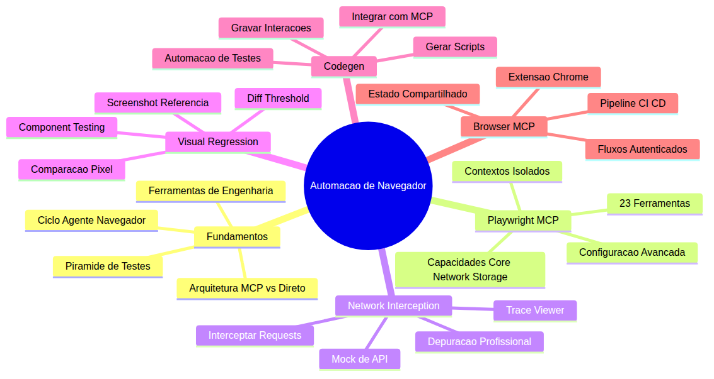
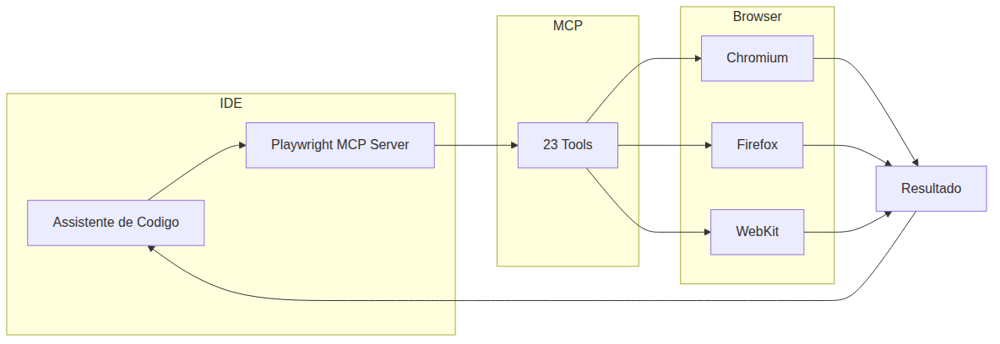
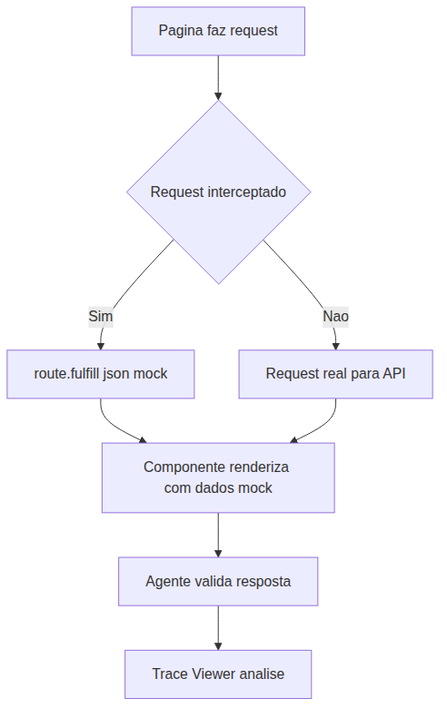
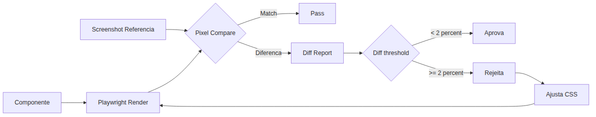
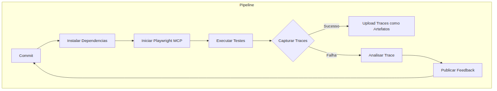

# Programador Profissional com Agentes — Aula 16

## Playwright + Browser MCP — Automação de Navegador Profissional com Agentes

**Duração estimada:** 60 minutos

**Nível:** Avançado

**Pré-requisitos:** Aulas 01 a 15 completas. Familiaridade com DevFlow (projeto construído ao longo do módulo). Conhecimento de MCPs (Aula 10), testes E2E com automação de navegador (Aula 08), agentes de código (Aula 11), integração contínua (Aula 12) e conceitos de quality assurance (Aula 15). Terminal e VS Code instalados com Node.js 18+.

---

## Objetivos da Aula

Ao final desta aula, você será capaz de:

- [ ] Distinguir as duas abordagens de automação de navegador — MCP vs framework direto — e escolher a adequada para cada contexto
- [ ] Compreender a arquitetura completa de um servidor MCP de navegador e seu ciclo de interação com agentes
- [ ] Configurar o Playwright MCP com capacidades avançadas e filtragem por `--caps`
- [ ] Utilizar as 23 ferramentas do Playwright MCP para navegação, inspeção, rede e armazenamento
- [ ] Implementar interceptação de rede e mocking de API com agentes de código
- [ ] Capturar e analisar traces com o Trace Viewer para depuração profissional
- [ ] Criar testes de regressão visual com comparação pixel a pixel
- [ ] Usar o Codegen para gerar scripts de teste a partir de interações gravadas
- [ ] Integrar o Browser MCP com extensão para fluxos autenticados
- [ ] Combinar Playwright MCP, Browser MCP e assistente de código em um pipeline completo de CI/CD

---

## Como Usar Esta Aula

| Parte | Seções | O que você vai aprender | Duração estimada |
|---|---|---|---|
| Fundamentos | 1, 2, 3 | Arquitetura de automação de navegador, engenharia com navegador, pirâmide de testes | 20 min |
| Aplicação | 4, 5, 6, 7 | Playwright MCP, network interception, visual regression, Browser MCP, pipeline completo | 30 min |
| Exercícios | Fácil, Médio, Difícil | Prática guiada com DevFlow e automação de navegador | 10 min |

---

## Mapa Mental



---

## Recapitulação das Aulas 01 a 15

| Aula | Conceito | Conexão com Automação de Navegador |
|---|---|---|
| 01 | Introdução ao módulo | Base para entender o papel da automação no fluxo profissional |
| 02 | O que são agentes de código | Agentes são os orquestradores que controlam o navegador via MCP |
| 03 | Hello World com agente | Primeiro contato com execução mediada por agente |
| 04 | LLMs e provedores | Modelos que interpretam snapshots do navegador e decidem ações |
| 05 | Tokens e contexto | Otimização de prompts com snapshots e screenshots |
| 06 | Prompt engineering | Como instruir o agente a interagir com o navegador |
| 07 | Estrutura de projetos | Organização de testes e scripts de automação |
| 08 | Playwright E2E | **PONTE CRÍTICA:** Primeiro contato com automação de navegador, localizadores e asserções |
| 09 | Agentes especialistas | Agentes que inspecionam e validam páginas web |
| 10 | MCPs de Frontend | **PONTE CRÍTICA:** Conceito de MCP aplicado a ferramentas de frontend, pipeline de ferramentas |
| 11 | Criando agentes com Deep Agents | Agentes que podem usar ferramentas de navegador como MCPs |
| 12 | CI/CD e deploy | Pipeline onde testes de navegador são executados |
| 13 | Testes e QA | Estratégias de qualidade que incluem testes visuais |
| 14 | Refatoração guiada | Agentes que refatoram código com base em feedback de testes |
| 15 | Debugging avançado | Depuração com traces e logs do navegador |

---

**FUNDAMENTOS: A Arquitetura por Trás da Automação de Navegador com Agentes**

## Arquitetura de Automação de Navegador

Antes de escrever uma linha de código com ferramentas específicas, é essencial entender como a automação de navegador funciona quando mediada por agentes. A arquitetura determina desde a velocidade de resposta até a confiabilidade dos resultados.

Existem duas abordagens fundamentais para controlar um navegador com agentes. A primeira é via **servidor MCP de navegador**: o agente envia uma chamada de ferramenta (tool call) para o servidor MCP, que por sua vez se comunica com o núcleo do framework de automação de navegador, que então executa a ação no navegador e retorna o resultado para o agente. A segunda é via **framework direto**: o código de teste importa diretamente a API do framework de automação de navegador e controla o navegador sem mediação de um servidor MCP.

A escolha entre as duas abordagens depende do cenário. O servidor MCP de navegador é ideal para exploração, depuração e tarefas ad-hoc onde um agente precisa investigar uma página dinamicamente. O framework direto é superior para testes repetíveis em CI, onde toda a lógica está encapsulada em arquivos de teste versionados.

O ciclo de interação entre agente e navegador segue um padrão previsível. Primeiro, o agente "enxerga" a página por meio de um snapshot (representação textual da árvore de acessibilidade) ou screenshot. Com base nessa representação, o agente decide qual ação tomar — clicar em um botão, preencher um formulário, extrair um texto. Então o agente executa a ação via MCP ou API direta. Por fim, o agente valida o resultado, seja via asserção programática ou nova inspeção visual.

É fundamental entender uma **limitação importante**: o snapshot é baseado em texto (árvore de acessibilidade), não em pixels. O agente não "vê" cores, fontes ou layouts como um humano vê. Ele recebe uma representação estruturada do DOM acessível. Para validação visual, é necessário usar comparação de screenshots.

Vamos a três exemplos que ilustram essa arquitetura. Primeiro, **âncora**: um agente que precisa extrair o preço de um produto em um e-commerce. O agente navega até a página, solicita um snapshot, localiza o elemento que contém "R$", extrai o texto e retorna o valor. Segundo, **espelho**: um agente que precisa preencher um formulário de login. O agente captura o snapshot para identificar os campos de input, usa a ferramenta de digitação para preencher cada campo e clica no botão de submit. Terceiro, **ponte**: um agente que monitora uma dashboard de CI/CD. O agente tira screenshot periódicos da página e compara com screenshots anteriores para detectar mudanças visuais no pipeline.

Pause para reflexão: como você decidiria entre usar um servidor MCP ou o framework direto para um teste de registro de usuário que precisa rodar a cada deploy?

### Quick Check 1

**1. Qual a principal diferença entre a abordagem MCP e a abordagem direta para automação de navegador?**
**Resposta:** Na abordagem MCP, o agente envia tool calls para um servidor MCP que media a comunicação com o navegador. Na abordagem direta, o código de teste importa a API do framework diretamente, sem mediação. MCP é ideal para exploração ad-hoc com agentes; direta é superior para testes repetíveis em CI.

**2. Por que um snapshot de acessibilidade é uma representação limitada da página para o agente?**
**Resposta:** Porque o snapshot é baseado em texto (árvore de acessibilidade), não em pixels. O agente não "vê" cores, fontes ou layouts. Para validação visual, é necessário usar comparação de screenshots.

---

## O Navegador como Ferramenta de Engenharia

Automação de navegador vai muito além de clicar em botões e extrair textos. Um navegador controlado programaticamente é uma **plataforma completa de engenharia** que oferece capacidades que vão do teste funcional ao monitoramento de performance.

Considere as seguintes capacidades profissionais. **Interceptação de rede**: você pode interceptar e modificar requisições antes que elas cheguem ao servidor, permitindo testar cenários de erro sem precisar derrubar serviços. **Mocking de API**: você pode simular respostas falsas do backend para testar componentes sem depender de APIs externas. **Regressão visual**: você pode comparar screenshots pixel a pixel para detectar mudanças visuais não intencionais. **Manipulação de armazenamento**: você pode ler e escrever localStorage, sessionStorage e cookies para simular estados específicos. **Monitoramento de console**: você pode capturar todos os logs, warnings e erros do console do navegador durante a execução.

Três exemplos demonstram o poder dessa abordagem. Primeiro, **âncora**: um agente que intercepta todas as chamadas de API de um dashboard e verifica se alguma retorna status 500, registrando automaticamente um bug no sistema de tracking. Segundo, **espelho**: um agente que manipula o localStorage para injetar um token de autenticação expirado e verifica se o componente de login é exibido corretamente. Terceiro, **ponte**: um agente que grava um trace completo de uma sessão de usuário, incluindo todas as interações, snapshots do DOM e requisições de rede, e depois analisa esse trace para identificar gargalos de performance.

Para depuração profissional, o framework de automação de navegador oferece três ferramentas essenciais. **Tracing**: grava cada ação executada com snapshots completos do DOM, permitindo reproduzir exatamente o que aconteceu. **Gravação de vídeo**: captura um vídeo da tela durante a execução do teste, útil para revisão visual. **Timeline**: registra a linha do tempo de todos os eventos, incluindo navegação, cliques e requisições de rede.

O navegador funciona como um **ambiente de runtime** completo. Você pode executar JavaScript arbitrário nas páginas, inspecionar o DOM em tempo real, monitorar o tráfego de rede e capturar mensagens do console — tudo programaticamente. Isso é particularmente importante para agentes, porque o agente não pode "ver" o que acontece na página como um humano. Ele precisa dessas ferramentas instrumentais para entender o estado atual da aplicação.

Pause para reflexão: se um agente não consegue ver cores ou animações, como ele pode detectar que uma transição CSS não está funcionando corretamente?

### Quick Check 2

**1. Quais são as três ferramentas de depuração profissional oferecidas pelo framework de automação de navegador?**
**Resposta:** Tracing (grava cada ação com snapshots do DOM), gravação de vídeo (captura a tela durante execução) e timeline (registra a linha do tempo de eventos como navegação e requisições).

**2. Por que a interceptação de rede é importante para testes com agentes?**
**Resposta:** Porque permite testar cenários de erro sem derrubar serviços reais, simular respostas lentas ou falhas de API e verificar se a aplicação se comporta corretamente em condições adversas.

---

## Estratégias de Teste em Múltiplas Camadas

Testar aplicações web modernas exige uma estratégia que cubra múltiplas camadas, cada uma com seu propósito e nível de granularidade. A **pirâmide de testes** clássica organiza essas camadas da base para o topo: testes unitários, testes de integração, testes end-to-end e testes visuais.

Testes **unitários** verificam funções e componentes isoladamente. São rápidos, confiáveis e rodam em milissegundos. No entanto, não detectam problemas de integração entre componentes nem bugs visuais. Testes de **integração** verificam a interação entre componentes e serviços. São mais lentos que unitários, mas capturam problemas de contrato entre camadas. Testes **end-to-end** (E2E) simulam o fluxo completo do usuário no navegador. São os mais lentos e frágeis (flaky), mas os únicos que garantem que o sistema funciona como um todo. Testes **visuais** comparam screenshots pixel a pixel para detectar mudanças não intencionais no layout.

A automação de navegador se posiciona nas camadas E2E e visual. Cada camada tem lacunas que a camada superior cobre. Testes unitários não pegam bugs visuais — um componente pode passar em todos os testes unitários mas estar com a margem errada. Testes de integração não pegam problemas de fluxo entre páginas — o login pode funcionar isoladamente mas quebrar o fluxo de checkout. Testes E2E não pegam diferenças sutis de pixel — um botão pode estar funcional mas com 2 pixels deslocado.

O agente tem um papel único em cada camada. Para testes unitários, o agente pode gerar casos de teste baseados na análise do código fonte. Para testes de integração, o agente pode configurar mocks e validar contratos de API. Para testes E2E, o agente pode explorar fluxos complexos que testes pré-escritos não cobririam. Para testes visuais, o agente pode analisar diffs e decidir se a mudança é intencional ou um bug.

A estratégia ideal combina **loops rápidos de feedback** com **loops lentos e abrangentes**. Testes unitários e de integração rodam a cada commit no CI, dando feedback em segundos. Testes E2E rodam a cada pull request, levando minutos. Testes visuais rodam nightly ou antes de releases, levando horas. Essa estratificação garante que problemas simples sejam detectados cedo e problemas complexos sejam capturados antes de chegar em produção.

Flakiness em testes de navegador é um dos maiores desafios profissionais. Testes falham intermitentemente por timeouts, animações não concluídas, ou alterações no layout. Os agentes ajudam a mitigar flakiness de três formas: auto-retry com waits inteligentes (em vez de sleeps fixos), screenshots de comparação em vez de asserções frágeis de texto, e análise de traces para diagnosticar a causa raiz de falhas intermitentes.

Pause para reflexão: como você estruturaria a estratégia de testes de um e-commerce para garantir que uma mudança no CSS do carrinho não quebre o checkout?

### Quick Check 3

**1. Quais camadas da pirâmide de testes são cobertas pela automação de navegador?**
**Resposta:** As camadas E2E e visual. Testes unitários e de integração usam ferramentas diferentes (Jest, Vitest) e não envolvem navegador.

**2. Como os agentes ajudam a mitigar flakiness em testes de navegador?**
**Resposta:** Com três estratégias: auto-retry com waits inteligentes baseados no estado real da página, screenshots de comparação em vez de asserções frágeis de texto, e análise de traces para diagnosticar a causa raiz de falhas intermitentes.

---

**APLICAÇÃO: Colocando a Mão no Código — Playwright MCP, Network Interception, Visual Regression e Browser MCP**

## Playwright MCP Profissional

O Playwright MCP é um servidor MCP oficial da Microsoft que expõe 23 ferramentas organizadas por capacidades. Ele permite que agentes de código controlem um navegador Chromium, Firefox ou WebKit de forma programática, abrindo um leque enorme de possibilidades para automação assistida.

As 23 ferramentas estão organizadas em **nove capacidades**. A capacidade `core` é obrigatória e inclui navegação (`browser_navigate`), snapshot de acessibilidade (`browser_snapshot`), clique (`browser_click`), preenchimento (`browser_type`), extração de texto (`browser_get_text_content`) e execução de JavaScript (`browser_execute_javascript`). A capacidade `core-navigation` adiciona ferramentas como voltar (`browser_go_back`), avançar (`browser_go_forward`), fechar aba (`browser_close`) e recarregar (`browser_reload`). A capacidade `core-input` inclui seleção em dropdown (`browser_select_dropdown`), scroll (`browser_scroll_to_element`), hover (`browser_hover`) e foco (`browser_focus`).

A capacidade `network` expõe as ferramentas de requisição de rede (`browser_network_request` e `browser_network_requests`), permitindo que o agente inspecione o tráfego. A capacidade `storage` dá acesso a localStorage e cookies (`browser_get_storage`, `browser_set_storage`, `browser_get_cookies`, `browser_set_cookies`). A capacidade `vision` permite tirar screenshots (`browser_take_screenshot`). A capacidade `pdf` permite gerar PDFs da página (`browser_generate_pdf`). A capacidade `testing` inclui asserções como `expect` adaptadas para o contexto MCP. A capacidade `devtools` expõe ferramentas de desenvolvedor do navegador. A capacidade `codegen` ativa a gravação de interações.

Você pode filtrar quais capacidades carregar usando o parâmetro `--caps`. Por exemplo, `--caps core,network,storage` carrega apenas as ferramentas essenciais mais as de rede e armazenamento, reduzindo a carga cognitiva do agente e tornando as respostas mais rápidas.

A configuração avançada é feita no arquivo `.vscode/mcp.json`. Você pode definir `launchOptions` para controlar se o navegador roda em modo headless (sem interface gráfica), o tamanho da viewport, o idioma e outras preferências. Timeouts, diretório de output e atributo `testIdAttribute` também são configuráveis.

Um conceito importante é a diferença entre **contextos isolados e compartilhados**. Um contexto isolado cria uma nova sessão de navegador sem cookies, localStorage ou histórico. Um contexto compartilhado reutiliza o estado de sessões anteriores. Para testes de autenticação, o contexto compartilhado é essencial — você faz login uma vez e reutiliza os cookies em testes subsequentes.

A Microsoft também oferece uma extensão para assistente de código que permite ativar o servidor `@playwright` diretamente no Agent Mode do VS Code. Isso significa que você pode invocar o Playwright MCP como um agente especializado dentro do seu fluxo de desenvolvimento, sem configurar manualmente o MCP.

Vamos detalhar as 23 ferramentas para que você entenda o potencial completo do servidor. Na capacidade `core`, as ferramentas fundamentais são: `browser_navigate` para navegar a URLs, `browser_snapshot` para capturar a árvore de acessibilidade, `browser_click` para clicar em elementos, `browser_type` para digitar texto em campos, `browser_get_text_content` para extrair texto visível e `browser_execute_javascript` para executar código arbitrário na página. Cada uma dessas ferramentas recebe um seletor de elemento (CSS, XPath, texto, role) ou uma URL como parâmetro.

Na capacidade `core-navigation`, as ferramentas permitem controlar o histórico do navegador: `browser_go_back` e `browser_go_forward` navegam pelo histórico, `browser_reload` recarrega a página atual, e `browser_close` fecha a aba ativa. A capacidade `core-input` adiciona interações mais refinadas: `browser_select_dropdown` para selecionar opções em menus suspensos, `browser_scroll_to_element` para rolar até um elemento específico, `browser_hover` para passar o mouse sobre um elemento e `browser_focus` para dar foco a um campo.

A capacidade `network` é particularmente poderosa para depuração. `browser_network_request` retorna detalhes de uma requisição específica (URL, método, headers, status code, corpo). `browser_network_requests` lista todas as requisições feitas pela página desde a navegação, permitindo que o agente identifique chamadas de API lentas ou com erro. A capacidade `storage` gerencia estado persistente: `browser_get_storage` e `browser_set_storage` leem e escrevem localStorage, enquanto `browser_get_cookies` e `browser_set_cookies` manipulam cookies da sessão.

A capacidade `vision` com `browser_take_screenshot` captura screenshots da página inteira ou de um elemento específico. A capacidade `pdf` gera PDFs completos da página com `browser_generate_pdf`, preservando layout e estilos. A capacidade `testing` inclui ferramentas de asserção adaptadas para o contexto MCP. A capacidade `devtools` expõe ferramentas de desenvolvedor como console, elementos e rede. A capacidade `codegen` ativa a gravação de interações para gerar scripts automaticamente.



### Mão na Massa 1: Configurar Playwright MCP com Capacidades Avançadas

**Objetivo:** Configurar o Playwright MCP com capacidades avançadas e testar as 23 ferramentas disponíveis.

**Passo 1 — Instalar Playwright MCP:** Execute o comando de instalação via npm para adicionar o servidor MCP ao seu projeto.

```bash
npm install -g @playwright/mcp
```

Verifique a instalação com `npx @playwright/mcp --version`.

**Passo 2 — Configurar `.vscode/mcp.json`:** Crie ou edite o arquivo `.vscode/mcp.json` na raiz do seu projeto DevFlow com a seguinte configuração:

```json
{
  "servers": {
    "playwright": {
      "command": "npx",
      "args": [
        "@playwright/mcp",
        "--caps",
        "core,network,storage,vision"
      ]
    }
  }
}
```

Esta configuração carrega as capacidades core (obrigatória), network para interceptação de rede, storage para cookies e localStorage, e vision para screenshots.

**Passo 3 — Iniciar servidor MCP:** Abra o VS Code, pressione `Cmd+Shift+P` (Mac) ou `Ctrl+Shift+P` (Windows/Linux) e execute "MCP: List Servers". Verifique se o servidor `playwright` aparece na lista com status "Running". Se não estiver rodando, reinicie o VS Code.

**Passo 4 — Testar navegação com `browser_navigate`:** No chat do assistente de código (Agent Mode), solicite:

```
Use playwright browser_navigate to open http://localhost:5173 (DevFlow) and take a screenshot.
```

O agente deve navegar até o DevFlow, capturar um screenshot e exibir o resultado.

**Passo 5 — Listar todas as 23 ferramentas disponíveis:** Peça ao assistente:

```
List all available tools from the playwright MCP server with their descriptions.
```

O agente deve retornar a lista completa das 23 ferramentas organizadas por capacidade.

**Resultado esperado:** Playwright MCP configurado e funcional, com capacidade de navegar, capturar screenshots, inspecionar rede e gerenciar armazenamento. Você consegue invocar qualquer uma das 23 ferramentas via linguagem natural.

### Quick Check 4

**1. Qual a finalidade do parâmetro `--caps` no Playwright MCP?**
**Resposta:** Filtrar quais capacidades do servidor MCP serão carregadas, reduzindo a carga cognitiva do agente e tornando as respostas mais rápidas. Por exemplo, `--caps core,network,storage` carrega apenas ferramentas essenciais, de rede e armazenamento.

**2. Qual a diferença entre contexto isolado e contexto compartilhado no navegador?**
**Resposta:** Contexto isolado cria uma nova sessão sem cookies, localStorage ou histórico. Contexto compartilhado reutiliza o estado de sessões anteriores, sendo essencial para fluxos autenticados onde o login é feito uma vez e reutilizado.

---

## Network Interception, API Mocking e Trace Viewer

Uma das capacidades mais poderosas da automação de navegador é a **interceptação de rede**. Com ela, você pode inspecionar, modificar ou bloquear requisições HTTP antes que elas atinjam o servidor. Isso abre possibilidades enormes para testes de resiliência, cenários de erro e depuração.

O Playwright MCP expõe duas ferramentas principais para rede: `browser_network_request` para inspecionar uma requisição específica e `browser_network_requests` para listar todas as requisições feitas pela página. Com essas ferramentas, o agente pode perguntar "quais requisições foram feitas?" e inspecionar cada uma.

Quando você usa a API direta do Playwright (em vez do MCP), o padrão é `page.route()`. Você define um padrão de URL e um handler que pode modificar, abortar ou responder à requisição. O método `route.fulfill()` permite retornar uma resposta falsa com status code, headers e body personalizados.

```javascript
await page.route('**/api/tasks', async route => {
  await route.fulfill({
    status: 500,
    contentType: 'application/json',
    body: JSON.stringify({ error: 'Internal Server Error' })
  });
});
```

Este padrão é extremamente útil para testar como a aplicação se comporta quando uma API específica falha. Você pode simular erros 500, timeouts, respostas lentas e dados malformados sem precisar modificar o backend.

O **Trace Viewer** é a ferramenta de depuração mais valiosa do ecossistema. Quando você executa um teste com `--trace on`, o Playwright grava um arquivo `trace.zip` contendo cada ação executada, snapshots completos do DOM antes e depois de cada ação, requisições de rede, console logs e muito mais. Para abrir o trace, execute:

```bash
npx playwright show-trace trace.zip
```

No Trace Viewer, você pode inspecionar cada passo da execução, ver o estado do DOM em qualquer ponto, examinar requisições de rede individuais e identificar exatamente onde um teste falhou.

A combinação agente + trace é particularmente poderosa. O fluxo de depuração funciona assim: agente executa uma ação no navegador, ação falha, agente captura o trace da sessão, agente analisa o trace para identificar a causa raiz, agente sugere uma correção. O agente pode perguntar "quais requisições de rede foram feitas?" e o MCP responde com a lista completa, permitindo que o agente diagnostique problemas de API em tempo real.

Existem três padrões principais de interceptação de rede que todo profissional deve conhecer. O primeiro é **abortar requisições**: você pode bloquear requisições para recursos específicos, como imagens ou scripts de tracking, para testar como a página se comporta sem eles. O segundo é **modificar respostas**: você pode alterar o body, headers ou status code de uma resposta antes que ela chegue ao navegador, útil para testar diferentes cenários de erro. O terceiro é **injetar dados**: você pode fazer a API retornar dados específicos para testar estados particulares da aplicação, como uma lista vazia ou um erro de validação.

```javascript
// Padrão 1: Abortar requisições de imagens
await page.route('**/*.{png,jpg,gif}', route => route.abort());

// Padrão 2: Modificar resposta de API
await page.route('**/api/users', async route => {
  const response = await route.fetch();
  const body = await response.json();
  body.push({ id: 999, name: 'Usuário Mockado' });
  await route.fulfill({ response, body: JSON.stringify(body) });
});

// Padrão 3: Injetar erro específico
await page.route('**/api/tasks/1', async route => {
  await route.fulfill({
    status: 404,
    contentType: 'application/json',
    body: JSON.stringify({ error: 'Task não encontrada' })
  });
});
```



### Mão na Massa 2: Interceptar Requisição de API do DevFlow e Depurar com Trace Viewer

**Objetivo:** Interceptar uma requisição de API do DevFlow, simular uma resposta de erro e depurar o comportamento com Trace Viewer.

**Passo 1 — Identificar endpoint de API no DevFlow:** Abra o DevFlow no navegador e peça ao assistente de código:

```
Navigate to DevFlow, then use browser_network_requests to list all API requests made during page load.
```

Identifique o endpoint que lista as tarefas, geralmente algo como `GET /api/tasks` ou `GET /api/projects`.

**Passo 2 — Configurar interceptação de rede:** Usando a API direta do Playwright (em um arquivo de teste), escreva um script que intercepte o endpoint identificado:

```javascript
import { test, expect } from '@playwright/test';

test('deve mostrar mensagem de erro quando API falha', async ({ page }) => {
  await page.route('**/api/tasks', async route => {
    await route.fulfill({
      status: 500,
      contentType: 'application/json',
      body: JSON.stringify({ message: 'Erro interno do servidor' })
    });
  });

  await page.goto('http://localhost:5173');
  await expect(page.locator('text=Erro interno')).toBeVisible();
});
```

**Passo 3 — Simular resposta mockada:** Execute o teste com Playwright:

```bash
npx playwright test --headed
```

Observe como a aplicação exibe a mensagem de erro em vez da lista de tarefas.

**Passo 4 — Capturar trace da sessão:** Modifique o teste para capturar trace:

```javascript
import { test, expect } from '@playwright/test';

test('deve capturar trace da interceptacao', async ({ page, context }) => {
  await context.tracing.start({ screenshots: true, snapshots: true });

  await page.route('**/api/tasks', async route => {
    await route.fulfill({
      status: 500,
      contentType: 'application/json',
      body: JSON.stringify({ message: 'Erro interno do servidor' })
    });
  });

  await page.goto('http://localhost:5173');
  await expect(page.locator('text=Erro interno')).toBeVisible();

  await context.tracing.stop({ path: 'trace-interceptacao.zip' });
});
```

**Passo 5 — Analisar trace com Trace Viewer:** Execute o comando para abrir o trace:

```bash
npx playwright show-trace trace-interceptacao.zip
```

No Trace Viewer, examine o passo onde a requisição foi interceptada, verifique o status 500 na aba "Network" e confirme que o componente de erro foi renderizado corretamente.

**Resultado esperado:** Você conseguiu interceptar uma requisição real do DevFlow, mockar uma resposta de erro 500, capturar o trace completo da sessão e analisar cada passo no Trace Viewer. O agente pode agora diagnosticar problemas de API com precisão cirúrgica.

### Quick Check 5

**1. Qual a diferença entre `browser_network_request` e `page.route()` no Playwright?**
**Resposta:** `browser_network_request` é uma ferramenta MCP para inspecionar requisições já feitas pela página. `page.route()` é uma API direta do Playwright para interceptar e modificar requisições antes que cheguem ao servidor.

**2. O que o Trace Viewer permite fazer durante a depuração?**
**Resposta:** Inspecionar cada passo da execução do teste, ver o estado do DOM antes e depois de cada ação, examinar requisições de rede individuais e identificar exatamente onde um teste falhou — tudo a partir de um arquivo trace.zip.

---

## Visual Regression, Component Testing e Codegen

Testes de **regressão visual** comparam screenshots da aplicação em dois pontos no tempo para detectar mudanças não intencionais no layout. O Playwright oferece `expect(page).toHaveScreenshot()` para essa finalidade, realizando uma comparação pixel a pixel com uma imagem de referência.

```javascript
await expect(page).toHaveScreenshot('homepage.png');
```

Na primeira execução, o Playwright cria uma imagem de referência no diretório `__screenshots__`. Nas execuções subsequentes, ele compara cada pixel da nova screenshot com a referência. Se a diferença exceder um limite configurável, o teste falha e um diff report é gerado.

O **threshold de diff** é configurável via opção `maxDiffPixels` ou `maxDiffPixelRatio`. Um valor típico é `0.02` (2%), que ignora diferenças mínimas como anti-aliasing de fontes em sistemas operacionais diferentes.

```javascript
await expect(page).toHaveScreenshot('homepage.png', {
  maxDiffPixelRatio: 0.02
});
```

**Component testing** é uma modalidade onde você monta componentes React isoladamente para testar seu comportamento visual sem carregar a aplicação inteira. O Playwright oferece `@playwright/experimental-ct-react` para isso.

```javascript
import { test, expect } from '@playwright/experimental-ct-react';
import TaskCard from './TaskCard';

test('TaskCard deve exibir prioridade alta em vermelho', async ({ mount }) => {
  const component = await mount(<TaskCard title="Urgente" priority="alta" />);
  await expect(component).toHaveScreenshot('taskcard-alta.png');
});
```

Isso permite testar componentes em isolamento total, sem depender de APIs, autenticação ou estado global da aplicação.

O **Codegen** (`npx playwright codegen`) grava todas as interações do usuário com o navegador e gera código Playwright correspondente. Você navega, clica, digita e o Codegen traduz cada ação em código. Isso é extremamente útil para acelerar a criação de testes e explorar localizadores sem precisar consultar o DOM manualmente.

A integração Codegen-MCP funciona assim: o desenvolvedor usa Codegen para gravar um fluxo, o Codegen gera o script de teste, e o agente (via MCP) executa e valida esse script. O agente pode até sugerir melhorias no código gerado, como substituir seletores frágeis por localizadores mais robustos.



### Mão na Massa 3: Teste de Regressão Visual com Codegen

**Objetivo:** Criar um teste de regressão visual para um componente do DevFlow, usar Codegen para gerar script e executar comparação pixel a pixel.

**Passo 1 — Capturar screenshot de referência:** Crie um arquivo de teste visual:

```javascript
import { test, expect } from '@playwright/test';

test('TaskCard visual regression', async ({ page }) => {
  await page.goto('http://localhost:5173');
  const card = page.locator('[data-testid="task-card"]').first();
  await expect(card).toHaveScreenshot('taskcard-ref.png');
});
```

Execute pela primeira vez para gerar a imagem de referência:

```bash
npx playwright test --update-snapshots
```

**Passo 2 — Modificar CSS do componente:** Faça uma alteração no CSS do TaskCard, por exemplo, mude o `border-radius` de `8px` para `16px` ou altere a cor de fundo. A mudança deve ser sutil para simular um cenário real.

**Passo 3 — Executar comparação visual:** Execute o teste novamente sem a flag `--update-snapshots`:

```bash
npx playwright test
```

O teste deve falhar. O Playwright gera três imagens no diretório `test-results`: a imagem de referência, a nova imagem e o diff (diferenças destacadas em rosa).

**Passo 4 — Analisar diff report:** Abra o diff report gerado. Analise visualmente as diferenças destacadas. Se a mudança no CSS for intencional (uma melhoria de design), atualize a referência com `--update-snapshots`. Se for um bug, corrija o CSS.

**Passo 5 — Usar Codegen para gerar script de teste:** Execute o Codegen apontando para o DevFlow:

```bash
npx playwright codegen http://localhost:5173
```

Interaja com alguns componentes: clique em uma tarefa, abra o modal de edição, feche o modal. O Codegen gera o código automaticamente. Copie esse código para um arquivo de teste e execute:

```bash
npx playwright test
```

**Resultado esperado:** Você tem um teste de regressão visual funcional, com screenshot de referência, diff report e threshold configurado. Além disso, gerou automaticamente um script de teste via Codegen baseado em interações reais.

### Quick Check 6

**1. O que acontece na primeira execução de `expect(page).toHaveScreenshot()`?**
**Resposta:** O Playwright cria uma imagem de referência no diretório `__screenshots__`. Nas execuções subsequentes, ele compara cada pixel da nova screenshot com essa referência.

**2. Qual a vantagem do component testing com `@playwright/experimental-ct-react`?**
**Resposta:** Permite montar componentes React isoladamente e testar seu comportamento visual sem carregar a aplicação inteira, sem depender de APIs, autenticação ou estado global.

---

## Browser MCP, Copilot #browser e Pipeline Completo

O ecossistema de automação de navegador com agentes não se limita ao Playwright MCP. Três ferramentas complementares formam um arsenal completo: Playwright MCP, Browser MCP e a ferramenta `#browser` do assistente de código.

O **Browser MCP** (pacote `@browsermcp/mcp`) é um servidor MCP que requer uma extensão de navegador para funcionar. Diferente do Playwright MCP, que lança seu próprio navegador controlado, o Browser MCP se conecta a uma janela de navegador existente, compartilhando o estado — cookies, sessões, histórico. Isso é particularmente útil para testar fluxos autenticados sem precisar refazer o login a cada execução.

A escolha entre Playwright MCP e Browser MCP depende do cenário. Playwright MCP é superior para testes estruturados e repetíveis: ele controla o navegador do zero, sem estado residual. Browser MCP é superior para exploração de fluxos autenticados: você faz o login manualmente uma vez, ativa a extensão, e todos os comandos MCP executam na sessão autenticada.

O assistente de código também possui uma ferramenta embutida chamada `#browser`. Ela permite abrir URLs, interagir com elementos e capturar screenshots sem precisar de um servidor MCP externo. É a opção mais rápida para verificações pontuais, mas com capacidades limitadas comparada aos servidores MCP dedicados.

A combinação ideal das três ferramentas segue esta divisão:

- **Playwright MCP** para testes estruturados, regressão visual e asserções programáticas
- **Browser MCP** para fluxos autenticados, debugging em sessão real e exploração de páginas com login
- **`#browser`** do assistente de código para verificações rápidas, consultas pontuais e prototipação

Em CI/CD, o Playwright MCP pode ser executado em pipelines, com traces armazenados como artefatos da build. Um fluxo típico de CI: instalar dependências, iniciar servidor MCP, executar testes, capturar traces, fazer upload dos traces como artefatos, publicar relatório HTML.

Vamos detalhar a orquestração entre as três ferramentas em um fluxo de desenvolvimento real. Imagine que você precisa testar uma funcionalidade que requer login. Primeiro, você usa o Browser MCP (com extensão conectada à sua sessão autenticada do DevFlow) para explorar a funcionalidade e entender o comportamento esperado. Depois, você usa o Codegen para gravar as interações e gerar um script de teste. Em seguida, você refina o script com o Playwright MCP, executando-o em modo headless e verificando asserções. Por fim, a ferramenta `#browser` do assistente de código faz uma verificação rápida para confirmar que tudo está funcionando antes do commit.

Em CI/CD, a integração do Playwright MCP segue uma pipeline bem definida. O primeiro estágio é a instalação: baixar dependências e instalar os navegadores necessários. O segundo estágio é a execução: iniciar o servidor MCP, rodar os testes (que podem ser scripts Playwright tradicionais ou chamadas MCP orquestradas por agentes), capturar traces de cada execução. O terceiro estágio é a coleta de artefatos: fazer upload dos traces, screenshots de falha e relatórios HTML para a plataforma de CI. O quarto estágio é a notificação: publicar o resultado no Slack, email ou sistema de tracking de bugs.

A escolha do navegador na pipeline também importa. Chromium é o mais rápido e confiável para CI, Firefox oferece maior cobertura de mercado, e WebKit é essencial se seu público usa Safari. Testar nos três navegadores é recomendado para aplicações públicas, mas para aplicações internas (intranet, dashboards corporativos), Chromium sozinho cobre a maioria dos cenários.

O **Continual Harness** encontra no ecossistema de automação de navegador um terreno fértil para refinamento. Thresholds de regressão visual que disparam refinamentos no harness, agentes que aprendem padrões de flakiness e ajustam waits automaticamente, e um ciclo de feedback onde o resultado dos testes influencia a qualidade das aulas seguintes. Cada execução de teste que falha por um motivo não previsto vira um caso de refinamento: o harness é atualizado para tratar aquele cenário na próxima iteração.



### Quick Check 7

**1. Qual a principal diferença entre Playwright MCP e Browser MCP?**
**Resposta:** Playwright MCP lança seu próprio navegador controlado, ideal para testes estruturados e repetíveis. Browser MCP se conecta a uma janela de navegador existente via extensão, compartilhando estado e sessões, ideal para fluxos autenticados.

**2. Quando usar a ferramenta `#browser` do assistente de código em vez dos servidores MCP?**
**Resposta:** Para verificações rápidas, consultas pontuais e prototipação que não exigem a infraestrutura completa de um servidor MCP. É a opção mais rápida, mas com capacidades limitadas.

---

## Exercícios Graduados

### Fácil: Configurar Playwright MCP e Navegar no DevFlow

**Enunciado:** Configure o Playwright MCP com as capacidades `core` e `network`. Navegue até a página inicial do DevFlow, tire um screenshot e descreva o que o agente retornou. Em seguida, feche o navegador.

**Gabarito:**

Primeiro, configure o `.vscode/mcp.json`:

```json
{
  "servers": {
    "playwright": {
      "command": "npx",
      "args": ["@playwright/mcp", "--caps", "core,network"]
    }
  }
}
```

Em seguida, reinicie o VS Code e peça ao assistente:

```
Use playwright browser_navigate to open http://localhost:5173. Then take a screenshot. Finally close the browser.
```

O agente deve retornar: confirmação de navegação bem-sucedida, um screenshot da página inicial do DevFlow e confirmação de que o navegador foi fechado. Se o agente não fechar automaticamente, solicite explicitamente o fechamento. A capacidade `core` inclui `browser_navigate`, `browser_take_screenshot` e `browser_close`. A capacidade `network` permite inspecionar requisições, embora não seja usada neste exercício.

### Médio: Mock de API com Interceptação e Trace

**Enunciado:** Intercepte o endpoint de listagem de tarefas do DevFlow, mock uma resposta de erro 500, capture o trace completo da sessão e analise o trace com o Trace Viewer para verificar se o componente de erro foi renderizado. Se o DevFlow não tiver um tratamento de erro adequado para esse cenário, escreva o código necessário e refaça o teste.

**Gabarito:**

Teste completo com interceptação e trace:

```javascript
import { test, expect } from '@playwright/test';

test('Deve tratar erro 500 na listagem de tarefas', async ({ page, context }) => {
  // Iniciar trace com screenshots e snapshots
  await context.tracing.start({ screenshots: true, snapshots: true });

  // Interceptar todas as chamadas para a API de tarefas
  await page.route('**/api/tasks', async route => {
    await route.fulfill({
      status: 500,
      contentType: 'application/json',
      body: JSON.stringify({ message: 'Erro interno do servidor' })
    });
  });

  // Navegar para a página
  await page.goto('http://localhost:5173');

  // Aguardar a renderização do componente de erro
  await page.waitForTimeout(2000);

  // Verificar se alguma mensagem de erro apareceu
  const errorVisible = await page.locator('text=Erro').first().isVisible().catch(() => false);

  if (!errorVisible) {
    // O DevFlow não trata erro 500 - precisamos adicionar tratamento
    console.log('DevFlow nao trata erro 500. Adicione tratamento de erro no componente TaskList.');
  }

  // Capturar screenshot do estado atual
  await page.screenshot({ path: 'erro-500.png' });

  // Parar e salvar trace
  await context.tracing.stop({ path: 'trace-erro-500.zip' });
});
```

Para analisar o trace:

```bash
npx playwright show-trace trace-erro-500.zip
```

No Trace Viewer, examine a aba Network para confirmar que a requisição foi interceptada com status 500, e a aba Snapshot para ver como a UI respondeu. Se o DevFlow não mostrar erro, implemente um handler de erro no componente TaskList para capturar rejeições de Promise e exibir uma mensagem amigável.

### Difícil: Pipeline Completo de Regressão Visual com CI

**Enunciado:** Implemente um pipeline completo de regressão visual para o DevFlow. Crie um screenshot de referência da página inicial, modifique o CSS de um componente, execute a comparação pixel a pixel, configure um job de CI no GitHub Actions que executa os testes visuais e faz upload dos traces como artefatos da build. Documente todo o processo.

**Gabarito:**

Arquivo de teste visual `tests/visual/homepage.spec.js`:

```javascript
import { test, expect } from '@playwright/test';

test.describe('Regressao Visual DevFlow', () => {
  test('Homepage deve corresponder a referencia', async ({ page }) => {
    await page.goto('http://localhost:5173');
    await expect(page).toHaveScreenshot('homepage.png', {
      maxDiffPixelRatio: 0.02
    });
  });

  test('TaskCard deve corresponder a referencia', async ({ page }) => {
    await page.goto('http://localhost:5173');
    const card = page.locator('[data-testid="task-card"]').first();
    await expect(card).toHaveScreenshot('taskcard.png', {
      maxDiffPixelRatio: 0.01
    });
  });
});
```

Configuração do Playwright (`playwright.config.ts`):

```typescript
import { defineConfig } from '@playwright/test';

export default defineConfig({
  testDir: './tests/visual',
  timeout: 30000,
  expect: {
    toHaveScreenshot: {
      maxDiffPixelRatio: 0.02
    }
  },
  use: {
    baseURL: 'http://localhost:5173',
    viewport: { width: 1280, height: 720 },
    trace: 'on'
  },
  projects: [
    {
      name: 'chromium',
      use: { browserName: 'chromium' }
    }
  ]
});
```

Pipeline GitHub Actions (`.github/workflows/visual-regression.yml`):

```yaml
name: Visual Regression
on: [push, pull_request]

jobs:
  visual:
    runs-on: ubuntu-latest
    steps:
      - uses: actions/checkout@v4
      - uses: actions/setup-node@v4
        with:
          node-version: 18
      - run: npm ci
      - run: npx playwright install chromium
      - run: npm run dev &
      - run: npx playwright test --project=chromium
      - uses: actions/upload-artifact@v4
        if: always()
        with:
          name: playwright-traces
          path: test-results/
          retention-days: 7
```

Para gerar referências iniciais:

```bash
npx playwright test --update-snapshots
git add tests/visual/__screenshots__/
git commit -m "Add visual regression reference screenshots"
```

Para modificar o CSS propositalmente e testar, altere um arquivo CSS do componente TaskCard, por exemplo mudando `background-color` de `#fff` para `#f0f0f0`. Execute o teste: ele deve falhar com um diff report. Analise o diff, decida se a mudança é intencional e atualize a referência se necessário.

---

## Autoavaliação: Quiz Rápido

**1. Qual a principal limitação do snapshot de acessibilidade para agentes?**

a) O snapshot é muito lento para ser capturado em tempo real
b) O snapshot é baseado em texto, não em pixels — o agente não vê cores ou layouts
c) O snapshot só funciona em navegadores Chromium

**Resposta:** b

**2. O que o parâmetro `--caps core,network,storage` faz no Playwright MCP?**

a) Instala as capacidades core, network e storage no navegador
b) Filtra quais capacidades do servidor MCP serão carregadas
c) Define o tempo máximo de execução para cada capacidade

**Resposta:** b

**3. Qual método do Playwright permite interceptar e modificar requisições antes que cheguem ao servidor?**

a) `page.intercept()`
b) `page.route()`
c) `page.network()`

**Resposta:** b

**4. Qual a diferença entre Playwright MCP e Browser MCP?**

a) Playwright MCP só funciona com Chromium, Browser MCP só com Firefox
b) Playwright MCP lança navegador próprio, Browser MCP conecta a navegador existente via extensão
c) Playwright MCP é grátis, Browser MCP é pago

**Resposta:** b

**5. O que acontece na primeira execução de `expect(page).toHaveScreenshot()`?**

a) O teste falha porque não há referência para comparar
b) O Playwright cria uma imagem de referência no diretório `__screenshots__`
c) O Playwright baixa uma referência da internet

**Resposta:** b

**6. Para qual cenário o Browser MCP é mais indicado que o Playwright MCP?**

a) Testes de regressão visual em CI
b) Fluxos autenticados onde o login é feito manualmente uma vez
c) Testes unitários de componentes React

**Resposta:** b

---

## Resumo da Aula

1. A automação de navegador com agentes pode ser feita via servidor MCP (para exploração ad-hoc) ou framework direto (para testes repetíveis em CI).
2. O snapshot de acessibilidade é baseado em texto, não em pixels — o agente não enxerga cores ou layouts como um humano.
3. O navegador controlado programaticamente é uma plataforma completa de engenharia com interceptação de rede, mocking de API, regressão visual e monitoramento de console.
4. A pirâmide de testes posiciona a automação de navegador nas camadas E2E e visual, cada uma com lacunas que a camada superior cobre.
5. O Playwright MCP expõe 23 ferramentas organizadas em nove capacidades, filtráveis pelo parâmetro `--caps`.
6. A interceptação de rede com `page.route()` permite simular cenários de erro sem modificar o backend.
7. O Trace Viewer grava cada ação com snapshots DOM, requisições de rede e console logs para depuração profissional.
8. Testes de regressão visual comparam screenshots pixel a pixel com thresholds configuráveis para detectar mudanças não intencionais.
9. A combinação Playwright MCP + Browser MCP + `#browser` cobre desde testes estruturados até fluxos autenticados e verificações rápidas.

---

## Próximos Passos

Com esta aula, você construiu uma base sólida em automação de navegador profissional com agentes. Os próximos tópicos naturais são: criação de servidores MCP customizados para ferramentas específicas do seu domínio, orquestração multi-agente onde múltiplos agentes controlam navegadores em paralelo para testes de carga e stress, integração com ferramentas de observabilidade como OpenTelemetry para rastrear requisições do navegador em sistemas distribuídos, e evolução do Continual Harness onde os thresholds de regressão visual e padrões de flakiness alimentam refinamentos automáticos no harness.

A habilidade de controlar um navegador com precisão cirúrgica através de agentes é o que separa um programador profissional de um entusiasta. Você agora tem as ferramentas e a arquitetura mental para construir sistemas de automação que não apenas testam, mas aprendem e evoluem.

---

## Referências

- Microsoft Playwright MCP — github.com/microsoft/playwright-mcp: Repositório oficial do servidor MCP com documentação das 23 ferramentas e capacidades
- Playwright Documentation — playwright.dev: Documentação completa do Playwright, incluindo API reference, guias de testes visuais, interceptação de rede e Trace Viewer
- Browser MCP — browsermcp.io: Servidor MCP alternativo com extensão de navegador para fluxos autenticados
- VS Code MCP Guide — code.visualstudio.com/docs/copilot/overview: Guia oficial de configuração de MCP servers no VS Code
- Playwright Trace Viewer — playwright.dev/docs/trace-viewer: Documentação do Trace Viewer com exemplos de análise de traces
- Playwright Component Testing — playwright.dev/docs/test-components: Guia de testes de componentes com React, Vue e Svelte
- Playwright CI Setup — playwright.dev/docs/ci: Configuração de pipelines de CI para Playwright com GitHub Actions, Azure Pipelines e outros

---

## FAQ

**1. Playwright MCP não consegue encontrar o navegador instalado.**
O Playwright MCP procura pelos navegadores no diretório padrão de instalação. Execute `npx playwright install` para baixar Chromium, Firefox e WebKit. Se os navegadores estiverem em local personalizado, configure a variável de ambiente `PLAYWRIGHT_BROWSERS_PATH` ou passe o caminho nas `launchOptions` do `mcp.json`. Em ambientes Docker, pode ser necessário instalar dependências do sistema com `npx playwright install-deps`.

**2. Snapshot retorna conteúdo vazio ou minimo.**
Isso geralmente acontece quando a página ainda está carregando ou quando o snapshot captura um overlay (modal, cookie banner). Use `browser_navigate` com wait até a página estar completamente carregada. Se houver overlays, peça ao agente para fechá-los antes de capturar o snapshot. Outra causa comum é a página usar renderização 100% client-side sem conteúdo acessível — nesse caso, prefira `browser_take_screenshot` combinado com `browser_execute_javascript` para extrair dados do DOM.

**3. A ferramenta `browser_navigate` funciona mas `browser_snapshot` retorna erro.**
O snapshot depende da árvore de acessibilidade da página. Páginas com Shadow DOM profundo, iframes de origem cruzada ou renderização 100% canvas podem não produzir snapshots úteis. Use `browser_take_screenshot` como alternativa visual e `browser_execute_javascript` para inspecionar o DOM programaticamente. Componentes web com Shadow DOM fechado (closed mode) não expõem sua árvore interna para a acessibilidade, exigindo JavaScript para acesso.

**4. Trace Viewer não abre o arquivo trace.zip.**
Verifique se você está usando uma versão do Playwright compatível com o formato do trace. Execute `npx playwright --version` e atualize se necessário. Se o arquivo estiver corrompido, regenere o trace com `context.tracing.stop({ path: 'novo-trace.zip' })`. O comando correto para abrir é `npx playwright show-trace trace.zip`. Se o navegador padrão não conseguir abrir, use a flag `--host 0.0.0.0` para acessar o viewer de outro dispositivo na rede.

**5. Teste de regressão visual sempre falha com diferenças mínimas.**
Isso é comum devido a anti-aliasing de fontes, renderização em diferentes sistemas operacionais ou animações não concluídas antes do screenshot. Ajuste o `maxDiffPixelRatio` para 0.02 (2%) para ignorar diferenças de renderização. Considere também desabilitar animações CSS com `page.addStyleTag({ content: '* { animation: none !important; }' })`. Para testes cross-platform, use um container Docker padronizado para garantir ambiente consistente de renderização.

**6. Browser MCP extensão não conecta ao servidor.**
Verifique se a extensão do Browser MCP está instalada e ativada no navegador. Confirme que o servidor MCP está rodando na porta correta. Se estiver usando um proxy ou VPN, a conexão pode ser bloqueada — teste sem proxy. A extensão geralmente exibe um ícone colorido quando conectada. Reiniciar o navegador após instalar a extensão resolve a maioria dos problemas de conexão inicial.

**7. Múltiplos agentes tentando controlar o mesmo navegador.**
Isso causa conflitos de estado. Para evitar, cada agente deve usar seu próprio contexto de navegador. No Playwright MCP, isso é feito configurando contextos isolados (sem compartilhar cookies/storage). No Browser MCP, cada agente precisa de sua própria janela de navegador com extensão dedicada. Para orquestração multi-agente, considere usar um pool de contexts com fila de execução serializada.

---

## Glossário

| Termo | Definição |
|---|---|
| Acessibility Snapshot | Representação textual da árvore de acessibilidade do DOM, usada por agentes para entender o estado da página |
| Browser MCP | Servidor MCP que se conecta a um navegador existente via extensão, compartilhando cookies e sessões |
| Codegen | Ferramenta que grava interações do usuário no navegador e gera código Playwright automaticamente |
| Component Testing | Modalidade de teste que monta componentes isoladamente para verificar comportamento visual sem carregar a aplicação inteira |
| Contexto Compartilhado | Sessão de navegador que reutiliza cookies, localStorage e histórico entre execuções |
| Contexto Isolado | Sessão de navegador sem estado residual, criada do zero a cada execução |
| Diff Report | Imagem gerada pela comparação pixel a pixel que destaca as diferenças entre screenshot atual e referência |
| Flakiness | Tendência de um teste falhar intermitentemente sem mudança no código, comum em testes de navegador |
| Interceptação de Rede | Técnica de capturar e modificar requisições HTTP antes que cheguem ao servidor |
| MCP Server | Servidor que expõe ferramentas para agentes de código via protocolo Model Context Protocol |
| Network Mock | Simulação de respostas de API falsas para testar componentes sem depender de servidores reais |
| Playwright MCP | Servidor MCP oficial da Microsoft que expõe 23 ferramentas para controle programático de navegadores |
| Regressão Visual | Técnica de comparação pixel a pixel de screenshots para detectar mudanças não intencionais no layout |
| Threshold de Diff | Limite percentual de diferença aceitável entre screenshots, usado para ignorar variações mínimas |
| Trace Viewer | Ferramenta visual para inspecionar traces gravados durante execução de testes, incluindo DOM, rede e console |
| Tracing | Gravação de cada ação executada no navegador com snapshots completos do DOM para depuração posterior |
| Visual Regression | Processo de comparar screenshots atuais com referências para detectar mudanças visuais não intencionais |
| Headless Mode | Execução do navegador sem interface gráfica, ideal para servidores e pipelines de CI |
| Localizador | Estratégia de seleção de elementos no DOM usando texto, role, testid, CSS ou XPath |
| Page Object Model | Padrão de design que encapsula seletores e interações de uma página em uma classe reutilizável |
| Playwright Test Runner | Executor de testes oficial do Playwright com suporte a paralelismo, sharding e relatórios |
| Screenshot | Captura de imagem da viewport ou de um elemento específico do navegador |
| Session Storage | Armazenamento de dados na aba do navegador, similar ao localStorage mas por sessão |
| Wait Inteligente | Mecanismo que aguarda condições específicas do DOM em vez de usar sleeps fixos |
