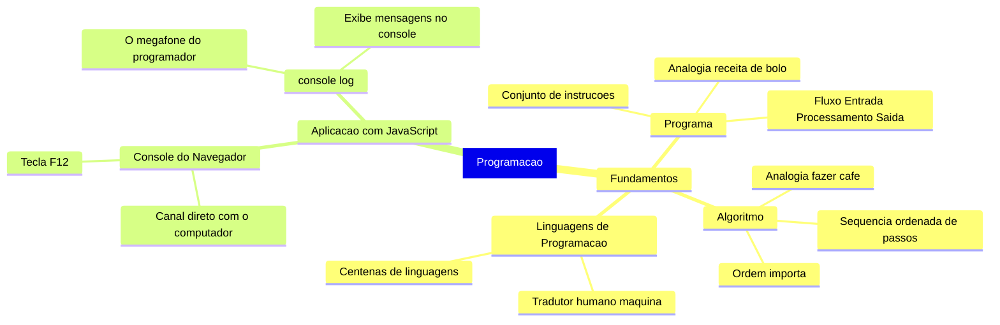
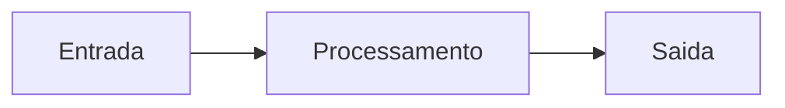
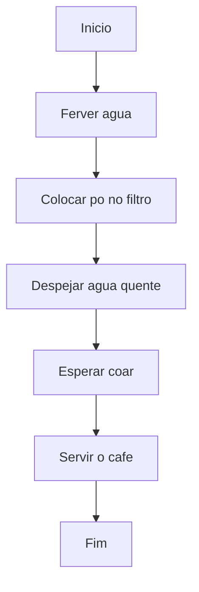
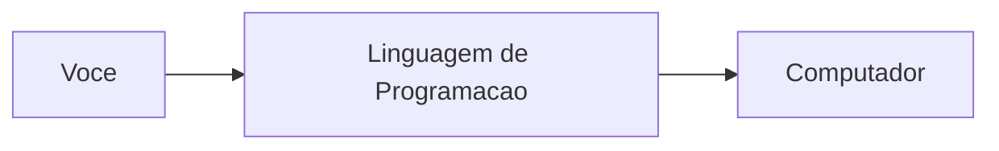

# JavaScript — Do Zero ao Profissional — Aula 01

## O Que É Programação? — Algoritmos, Instruções e Seu Primeiro Código

**Duração estimada:** 80 minutos (40 de leitura + 40 de prática)
**Nível:** Iniciante
**Pré-requisitos:** Nenhum — esta é a primeira aula do curso

> *Bem-vindo ao mundo da programação. Se você nunca escreveu uma linha de código na vida, está no lugar certo. Respire fundo — a única habilidade que você precisa ter é curiosidade.*

---

## Objetivos de Aprendizagem

Ao final desta aula, você será capaz de:

- [ ] **Definir** o que é um programa de computador como um conjunto de instruções em ordem, usando pelo menos 2 analogias diferentes
- [ ] **Explicar** o conceito de algoritmo como uma sequência ordenada de passos, com exemplos cotidianos e demonstrando por que a ordem importa
- [ ] **Distinguir** linguagens de programação de linguagens humanas, explicando o papel de "tradutor" entre você e a máquina
- [ ] **Abrir** o console do navegador (DevTools) usando F12 ou alternativas sem hesitar
- [ ] **Executar** código JavaScript diretamente no console e interpretar o resultado
- [ ] **Utilizar** `console.log()` para exibir mensagens no console, com e sem aspas, identificando a estrutura completa da instrução
- [ ] **Ler** mensagens de erro simples no console e identificar a causa (aspas faltando, ponto trocado, comando inexistente)
- [ ] **Identificar** o fluxo Entrada, Processamento e Saída em exemplos do cotidiano e em código

---

## Como Usar Esta Aula

Esta aula tem duas partes bem diferentes.

Na **primeira parte** (secoes 1 a 3), vamos conversar sobre os fundamentos da programacao. Sao conceitos universais — valem para QUALQUER linguagem. Leia com calma. Crie suas proprias analogias. Nao tem codigo aqui ainda.

Na **segunda parte** (secoes 4 e 5), voce coloca a mao no teclado. Vai abrir o navegador que voce usa todo dia e escrever seu primeiro codigo. E aqui que a magica acontece.

Cada secao tem um **Quick Check** no final — duas perguntas para voce verificar se entendeu antes de seguir. As respostas estao logo abaixo. Sem pegadinhas.

No fim da aula, voce encontra exercicios graduados (facil, medio, dificil) e um resumo. Depois, o arquivo separado **Questoes de Aprendizagem** traz as tarefas de checkpoint — so avance para a proxima aula quando conseguir completa-las por conta propria.

> **Dica:** Nao adianta so ler. Programacao se aprende fazendo. Quando chegar na secao 4, pare e ABRA o navegador. Digite cada exemplo. Sinta o clique.

---

## Mapa Mental

Este diagrama mostra todos os conceitos que voce vai dominar nesta aula:



> *O mapa mental acima mostra a estrutura da aula. Cada ramo representa um conceito que voce vai explorar.*

---

**FUNDAMENTOS: O Que E Programar**

> *Os conceitos desta secao sao universais — valem para QUALQUER linguagem de programacao. Python, Java, C++ — todas compartilham a mesma base que voce vai aprender agora. Na segunda parte, voce aplicara tudo na pratica. Por enquanto, vamos entender o que significa "programar".*

---

## 1. O Que E Um Programa? — A Receita de Bolo

Voce ja seguiu uma receita de bolo? Pense em uma agora.

Ela tem ingredientes, quantidades e um passo a passo: "bata as claras em neve", "adicione a farinha aos poucos", "leve ao forno por 40 minutos". Se voce seguir exatamente o que esta escrito, o bolo sai.

**Um programa de computador funciona exatamente assim.**

Um **programa** e um conjunto de instrucoes escritas em ordem, dizendo ao computador o que fazer. A receita diz a voce o que fazer com os ingredientes. O programa diz ao computador o que fazer com os dados que ele recebe.

A diferenca? O computador e MUITO mais rapido e MUITO mais burro que voce.

Ele faz exatamente o que esta escrito — nem mais, nem menos. Se a receita disser "adicione sal a gosto", o computador trava. Ele nao sabe o que e "a gosto". Ele precisa de instrucoes precisas, sem ambiguidade.

### A Receita de Bolo e o Modelo (Ancora)

Pegue uma receita real na sua cabeca. Ingredientes (entrada). Passos (processamento). Bolo pronto (saida).

Percebeu? Tudo que um programa faz pode ser resumido em tres estagios:



Esse **fluxo Entrada, Processamento e Saida** e a base de TODO programa. Voce fornece dados (entrada). O computador aplica as instrucoes (processamento). Ele devolve um resultado (saida).

### Manual de Montagem de Movel (Espelho)

Ja montou um movel daqueles que veem em caixa? Ikea, por exemplo.

Cada passo tem um numero e uma ilustracao. Se voce pular o passo 3, o movel fica torto. Se trocar o parafuso certo pelo errado, a porta nao fecha.

Mesma logica do programa: passos em ordem, precisao absoluta, sem atalhos.

### GPS / Waze (Ponte)

Voce abre o Waze, digita um destino (entrada). O aplicativo calcula a rota (processamento). Ele diz "vire a direita em 200 metros" (saida).

O GPS e um programa. Ele executa um algoritmo de navegacao. A cada quilometro, ele pega sua posicao atual (entrada), calcula o proximo passo (processamento) e te instrui (saida).

Percebeu? O fluxo E-P-S esta em tudo que voce usa.

> **Reflexao:** Toda vez que voce usa um aplicativo no celular, esta interagindo com um programa. Cada toque e uma entrada. Cada animacao e uma saida. Voce ja esta acostumado com programas — so nao sabia o nome.

### Quando Da Errado (Erro como Ferramenta)

Imagine uma receita que diz: "bata as claras em neve por 5 minutos a gosto".

O que significa "a gosto"? 3 minutos? 10 minutos? Depende do gosto de quem?

O computador nao lida com "a gosto". Ele precisa de "bata por exatamente 5 minutos". Se voce nao especificar, ele nao "deduz" — ele simplesmente nao executa.

**Moral da historia:** Programas exigem precisao absoluta. O computador nao interpreta. Ele segue ordens. Ordens ambiguas = programa quebrado.

> *"Voce pode estar pensando: 'mas eu nao sei cozinhar, essa analogia nao funciona para mim.' Tudo bem! Pense em qualquer instrucao que voce ja seguiu: montar um brinquedo, configurar o celular novo, seguir uma coreografia no TikTok. Tudo isso sao programas — instrucoes em ordem que produzem um resultado."*

### Quick Check 1

**1. O que e um programa de computador?**
**Resposta:** E um conjunto de instrucoes escritas em ordem que dizem ao computador o que fazer, como uma receita de bolo ou um manual de montagem.

**2. Quais sao os tres estagios de todo programa? De um exemplo com o GPS.**
**Resposta:** Entrada (voce digita o destino no Waze), Processamento (o aplicativo calcula a rota) e Saida (o GPS diz "vire a direita").

---

## 2. O Que E Um Algoritmo? — Instrucoes Passo a Passo

Voce acordou hoje de manha e foi tomar cafe. Pense nos passos: pegar a garrafa, colocar agua para ferver, pegar o filtro, colocar po, despejar a agua, esperar coar, servir.

Se voce tivesse servido antes de coar, o resultado seria desastroso, certo?

Isso e um **algoritmo**: uma sequencia ordenada de passos para resolver um problema.

A palavra parece complicada. Mas voce usa algoritmos o tempo todo sem perceber.

### Fazer Cafe (Ancora)

Veja o algoritmo de fazer cafe em um fluxo:



Cada passo e simples e direto. Nao tem "adicione acucar a gosto" ou "espere o ponto certo". Sao instrucoes que qualquer pessoa (ou computador) consegue seguir sem interpretar.

### Escovar os Dentes (Espelho)

Pegue a escova, coloque pasta, escovar, enxaguar, guardar.

Se voce enxaguar a escova ANTES de escovar os dentes, o que acontece? A pasta sai da escova e voce escova sem pasta. Nao funciona.

Mesmo algoritmo, acao diferente. A ordem continua sendo essencial.

### Toda Receita E Um Algoritmo (Ponte)

Lembra da receita de bolo da Secao 1? Ela e um algoritmo.

A receita descreve os passos em ordem para resolver um problema (fazer um bolo). O programa de computador e esse mesmo algoritmo — so que escrito em uma linguagem que o computador entende.

**Programar e, essencialmente, traduzir algoritmos do seu cerebro para uma linguagem que o computador entenda.**

### Quando Da Errado (Erro como Ferramenta)

Algoritmo "errado" para fazer cafe:

1. Servir o cafe
2. Ferver a agua
3. Colocar po no filtro

Resultado: voce serve uma xicara vazia. Depois ferve agua. Depois coloca po. Ninguem toma cafe.

O problema nao sao os passos — e a ORDEM dos passos.

**Moral da historia:** A ordem dos passos e tao importante quanto os passos em si. Um algoritmo com a sequencia errada produz um resultado errado — ou nenhum resultado.

> *"Voce pode estar pensando: 'algoritmo parece uma palavra de gente muito inteligente, nao e para mim.' Errado. Voce executa dezenas de algoritmos por dia sem perceber. Trocar de roupa e um algoritmo. Atravessar a rua e um algoritmo. A diferenca e que agora voce vai APRENDER A ESCREVE-LOS para o computador."*

### Quick Check 2

**1. O que e um algoritmo? De um exemplo diferente dos que apareceram na aula.**
**Resposta:** E uma sequencia ordenada de passos para resolver um problema. Exemplo: preparar um sanduiche (pegar pao, passar manteiga, colocar recheio, fechar).

**2. Por que a ordem dos passos importa? O que acontece se inverter?**
**Resposta:** Porque o resultado depende da sequencia. Se voce servir o cafe antes de coar, o cafe nao sai. Se inverter passos, o resultado da errado ou nao acontece.

---

## 3. Linguagens de Programacao — O Idioma do Computador

Agora voce sabe: programar e dar instrucoes ao computador. Mas em que LINGUA voce escreve essas instrucoes?

O computador, na sua essencia mais profunda, so entende **0s e 1s** — corrente eletrica passando ou nao passando. Isso e a **linguagem de maquina**.

Ninguem (sao) programa assim. Seria como conversar usando apenas pontos e tracos em codigo Morse, o tempo todo, para tudo.

E ai que entram as **linguagens de programacao**.

### O Tradutor (Ancora)

Voce fala portugues. Quer conversar com alguem que so fala japones. O que voce faz? Chama um tradutor.

A linguagem de programacao e esse tradutor — mas entre voce e o computador. Voce escreve instrucoes em uma linguagem mais parecida com o ingles. O "tradutor" (o compilador ou interpretador) converte isso para 0s e 1s.



### Controle Remoto (Espelho)

Voce aperta o botao "aumentar volume" no controle remoto. Esse e o seu comando, na sua "linguagem". O controle emite um sinal infravermelho — e a "linguagem" que a TV entende. A TV aumenta o volume.

Se voce apertar o botao "mudo" em vez de "aumentar", a TV nao aumenta o volume. Ela obedece ao comando errado porque recebeu a instrucao errada.

Com linguagens de programacao e a mesma coisa: cada comando tem uma funcao especifica. O computador obedece ao que voce escreveu, nao ao que voce QUIS dizer.

### Centenas de Linguagens (Ponte)

Existem centenas de linguagens de programacao: Python, Java, C++, Ruby, PHP, Go, Rust...

Por que tantas? Cada uma e otimizada para um tipo de problema. Python e otima para ciencia de dados. C++ e otima para jogos. Java e otima para sistemas corporativos.

Mas TODAS fazem a mesma coisa no fundo: traduzir instrucoes humanas para 0s e 1s.

### Quando Da Errado (Erro como Ferramenta)

Voce fala portugues fluentemente. Tenta ler um texto em alemao sem nunca ter estudado alemao. O que acontece? Voce nao entende nada. As palavras estao ali, mas as regras sao diferentes.

Com linguagens de programacao e igual: cada uma tem sua **sintaxe** — suas regras de escrita. Voce nao pode pegar um comando de Python e jogar em Java esperando que funcione. O tradutor (a linguagem) precisa ser o correto.

**Moral da historia:** Existem muitas linguagens porque cada uma e otimizada para um contexto diferente. A boa noticia: depois que voce aprende a PRIMEIRA, as outras veem muito mais faceis — porque a logica de programar e universal.

> *"Voce pode estar pensando: 'mas se existem centenas de linguagens, eu vou ter que aprender todas?' Nao. A primeira e a mais dificil — porque voce esta aprendendo a LOGICA de programar, nao apenas a sintaxe. Depois que voce domina uma, aprender a segunda e 10x mais facil. O importante agora e entender os fundamentos — eles valem para qualquer linguagem."*

### Quick Check 3

**1. Por que nao programamos diretamente em 0s e 1s?**
**Resposta:** Porque seria extremamente lento, dificil e propenso a erros. Linguagens de programacao funcionam como tradutores, tornando o processo produtivo para humanos.

**2. Se duas linguagens diferentes (como Python e Java) sao diferentes, o que elas tem em comum?**
**Resposta:** Ambas servem para traduzir instrucoes humanas para 0s e 1s que o computador entende. A diferenca esta na sintaxe e nos tipos de problema para os quais sao otimizadas.

---

## Pausa para Respirar — Voce Acabou de Entender a Base de Tudo

Pare um instante. Nao role para baixo ainda.

Voce acabou de entender tres conceitos que sao a BASE de toda a computacao:

1. **Programa** — um conjunto de instrucoes em ordem (receita de bolo)
2. **Algoritmo** — a sequencia logica de passos (fazer cafe)
3. **Linguagem de programacao** — o tradutor entre voce e a maquina

Isso que voce entendeu agora esta por tras de TODO software que voce ja usou na vida. Do WhatsApp ao Google. Do Instagram ao Pix. Do Netflix ao Spotify.

> *"Mas eu so li algumas paginas..."*

Sim. E ja entendeu a essencia. O resto do curso e aprender a ESCREVER essas instrucoes. Mas a BASE — o que e programar, de verdade — voce ja tem.

**Antes de continuar:**
- Levante da cadeira por 1 minuto
- Tome um gole d'agua
- Pense em um aplicativo que voce usa todo dia. Agora voce sabe: ele e um programa, que executa algoritmos, escritos em uma linguagem de programacao.

Quando voltar, voce vai abrir o navegador e escrever codigo de verdade. Nao e mais teoria.

---

**APLICACAO: Seu Primeiro Codigo em JavaScript**

> *Agora que voce entende o que e programar, vamos experimentar na pratica. A linguagem que vamos usar e o JavaScript. Ela roda em todo navegador — Chrome, Firefox, Edge, Safari. Voce nao precisa instalar nada. E a linguagem da web. Abra seu navegador. Voce vai escrever codigo de verdade.*

---

## 4. Conhecendo o Console do Navegador

Voce ja viu que todo programa precisa de um jeito de se comunicar. Lembra do fluxo Entrada, Processamento e Saida?

A **saida** e o resultado que o programa produz. O console do navegador e a ferramenta que permite essa conversa.

Pense no console como um canal direto entre voce e o computador. Voce digita um comando. Aperta Enter. O navegador responde na hora. E o ambiente mais simples para comecar a programar — sem criar arquivos, sem instalar nada.

### F12 — A Tecla Magica (Ancora)

Aperte **F12** agora mesmo. Nao espera. Abre o navegador e aperta F12.

Uma janela vai se abrir com varias abas. Nao se assuste. Clique na aba que se chama **Console**.

Pronto. Voce esta olhando para o console. Deve aparecer um cursor piscando com um simbolo `>` ou `>>`. Isso e o **prompt** — ele esta esperando voce digitar algo.

Digite `2 + 2` e aperte Enter. O navegador responde com `4`. Experimente!

### Ctrl+Shift+I / Cmd+Opt+I (Espelho)

Em alguns teclados, F12 tem outra funcao (especialmente em notebooks e Macs). Se F12 nao funcionou, tente:

- **Windows/Linux:** Ctrl + Shift + I
- **Mac:** Cmd + Opt + I

O resultado e o mesmo: as ferramentas do desenvolvedor aparecem.

### Menu do Navegador (Ponte)

Prefere usar o mouse? Todos os navegadores tem um caminho visual:

- **Chrome:** Menu (tres pontinhos), Mais ferramentas, Ferramentas do desenvolvedor
- **Firefox:** Menu, Mais ferramentas, Console do navegador
- **Edge:** Menu, Mais ferramentas, Ferramentas do desenvolvedor

Nao importa COMO voce abre. O importante e VER o prompt `>` piscando.

### Mao na Massa — Abrindo o Console

Siga estes passos AGORA:

- [ ] Abra seu navegador (Chrome, Firefox ou Edge)
- [ ] Pressione F12 (ou Ctrl+Shift+I, ou Cmd+Opt+I)
- [ ] Clique na aba **Console**
- [ ] Digite `2 + 2` e aperte Enter
- [ ] Veja o resultado: `4`

**Verificacao:** O console entende JavaScript. Tudo que voce digitar ali sera executado imediatamente. Se apareceu `4`, seu console esta funcionando.

### Quando Da Errado (Erro como Ferramenta)

Apertou F12 e apareceu uma tela cheia de HTML colorido? Codigos com setinhas? Parabens! Voce nao fez nada errado.

Voce esta na aba **Elements** (ou Inspector). E a tela que mostra a estrutura da pagina. O console e outra aba.

**Solucao:** Clique na aba que diz "Console" no topo da janela das DevTools.

> *"Voce pode estar pensando: 'isso parece coisa de hacker, estou vendo o interior do site.' Sim e nao. Voce esta vendo as ferramentas de DESENVOLVEDOR — mas nao esta quebrando nada. Tudo que voce digitar no console so afeta o SEU navegador, na SUA tela. Ninguem mais ve. Pode experimentar a vontade."*

**Moral da historia:** Se voce viu a aba errada e encontrou a certa, PARABENS. Voce acabou de resolver seu primeiro "erro" sozinho. Programar e exatamente isso: algo nao sai como esperado, voce investiga, descobre o por que, corrige.

### Quick Check 4

**1. Qual tecla abre o console do navegador? E qual alternativa para Mac?**
**Resposta:** F12 na maioria dos navegadores. No Mac: Cmd+Opt+I.

**2. O que significa o simbolo `>` no console?**
**Resposta:** E o prompt. Ele indica que o console esta pronto para receber um comando seu.

---

## 5. console.log() — Sua Primeira Linha de Codigo

Chegou o momento que voce esperava. Vamos escrever codigo de verdade.

Imagine que `console.log()` e um megafone: voce fala alguma coisa, e o computador repete aquilo de volta para voce no console.

O nome e bem descritivo:
- **console** — e o console do navegador (o lugar da conversa)
- **log** — significa "registrar" ou "exibir" (como um registro no diario de bordo)
- **()** — os parenteses delimitam o que voce quer exibir

### "Ola, mundo!" — O Classico (Ancora)

No console do navegador, digite exatamente isto e aperte Enter:

```javascript
console.log("Ola, mundo!");
```

O navegador responde com:

```
Ola, mundo!
```

Voce acabou de programar. Ponto. Essa e a tradicao. Todo programador, em qualquer linguagem, comeca com "Ola, mundo!". Voce esta oficialmente na comunidade.

### Seu Nome (Espelho)

Agora teste com seu proprio nome:

```javascript
console.log("Meu nome e Maria!");
```

O console responde:

```
Meu nome e Maria!
```

Mesma estrutura. Valor diferente. Voce trocou o texto dentro das aspas, e o computador exibiu o novo texto. Simples assim.

Experimente mais algumas variacoes:

```javascript
console.log("Estou aprendendo a programar!");
console.log("JavaScript e incrivel!");
console.log("Eu consigo fazer o computador falar!");
```

### A Semente do Gerenciador de Tarefas (Ponte)

Lembra que este curso tem um projeto progressivo? Um Gerenciador de Tarefas?

Pois e: voce ja pode comecar a construi-lo. Digite no console:

```javascript
console.log("=== GERENCIADOR DE TAREFAS ===");
```

Isso nao e um teste. E o PRIMEIRO PASSO do seu projeto. Voce acabou de criar a "interface" inicial do Gerenciador no console.

### Anatomia da Instrucao

Vamos entender o que cada parte faz:

```
console . log ( "Ola, mundo!" ) ;
   ↑        ↑        ↑       ↑     ↑
   |        |        |       |     ponto e virgula (fim)
   |        |        |       aspas (delimitam o texto)
   |        |        abre e fecha parenteses
   |        subcomando (exibir)
   comando (o console)
```

Cada parte tem um papel:

- `console` — voce diz "vou usar o console"
- `.log` — voce diz "quero exibir algo"
- `(` — abre espaco para dizer o que exibir
- `"Ola, mundo!"` — o texto que voce quer mostrar
- `)` — fecha o espaco
- `;` — marca o fim da instrucao (como um ponto final)

> **Dica:** As aspas podem ser duplas (`"`) ou simples (`'`). Funcionam igual. Mas precisam formar um par — abriu com dupla, fecha com dupla. Abriu com simples, fecha com simples.

### Quando Da Errado (E Isso E Bom!)

Erros sao a melhor ferramenta de aprendizado. Vamos causar erros de proposito para entender como o computador pensa.

**Erro 1: Esquecer as aspas**

Voce digita:

```javascript
console.log(Ola);
```

O console responde:

```
Uncaught ReferenceError: Ola is not defined
```

Por que? Sem aspas, o computador acha que "Ola" e um comando ou uma variavel. Ele procura algo chamado "Ola" na memoria e nao encontra.

As aspas dizem: "isso aqui e TEXTO, nao e codigo."

**Como corrigir:** Adicione aspas:

```javascript
console.log("Ola");
```

---

**Erro 2: Esquecer de FECHAR as aspas**

Voce digita:

```javascript
console.log("Ola, mundo!);
```

O console responde:

```
Uncaught SyntaxError: Invalid or unexpected token
```

Por que? As aspas funcionam como parenteses de texto — toda abertura precisa de um fechamento. O computador acha que o texto nunca termina.

**Como corrigir:** Feche as aspas:

```javascript
console.log("Ola, mundo!");
```

---

**Erro 3: Trocar ponto por virgula**

Voce digita:

```javascript
console,log("Ola");
```

O console responde:

```
Uncaught SyntaxError: Unexpected token ','
```

Por que? O ponto (`.`) conecta "console" com "log". A virgula quebra essa conexao. E como escrever "Joao , Silva" em vez de "Joao Silva".

**Como corrigir:** Use ponto:

```javascript
console.log("Ola");
```

**Moral da historia:** Cada caractere importa. Uma virgula no lugar do ponto. Uma aspa esquecida. O computador nao "adivinha" o que voce quis dizer. Ele executa exatamente o que esta escrito. Precisao e tudo.

### Mao na Massa — Pratique Agora

Digite cada uma destas linhas no console. Uma por uma. Veja o resultado:

- [ ] `console.log("Ola, mundo!");`
- [ ] `console.log("Meu nome e [seu nome]");`
- [ ] `console.log("Estou aprendendo a programar!");`
- [ ] `console.log("=== MEU PRIMEIRO PROGRAMA ===");`

**Verificacao:** O console deve mostrar 4 mensagens, uma embaixo da outra. Se apareceu, funcionou. Se apareceu um erro, leia a mensagem. Ela diz qual foi o problema. Tente corrigir e digite de novo.

> *"Voce pode estar pensando: 'mas isso e muito simples, eu so escrevi uma frase.' Sim. E isso e TUDO que um programa faz, no fundo: recebe instrucoes e executa. A complexidade vem de ENCADEAR milhares dessas instrucoes simples. Todo programador profissional, nao importa ha quantos anos programa, escreveu `console.log('Ola, mundo!')` no seu primeiro dia. Voce esta no caminho certo."*

### Quick Check 5

**1. Escreva a instrucao completa para exibir "Bom dia!" no console.**
**Resposta:** console.log("Bom dia!");

**2. O que acontece se voce esquecer as aspas em console.log(Ola)?**
**Resposta:** O console exibe "Uncaught ReferenceError: Ola is not defined". O computador acha que "Ola" e um comando, nao texto.

---

## Pausa para Sentir — Voce Esta Programando

Pare. Nao e metafora. Nao e "teoricamente". Nao e "quase".

Voce digitou comandos em uma linguagem de programacao e o computador OBEDECEU.

Olhe para o console agora. Aquelas palavras na tela — "Ola, mundo!", seu nome, suas frases — foram VOCE que colocou ali. Nao foi magica. Foi codigo. SEU codigo.

> *"Mas foi so uma frase..."*

A primeira casa que se constroi tambem e "so um tijolo". A primeira nota que se toca no piano tambem e "so um do". Toda jornada comeca com UM passo. O seu foi `console.log()`.

**Como voce esta se sentindo agora?**
- Ansiedade? (normal — e o desconhecido)
- Curiosidade? (otimo — e o combustivel)
- Vontade de fazer mais? (perfeito — e isso que move programadores)

Guardou essa sensacao? Nas proximas 27 aulas, quando algo parecer dificil, lembre-se: voce ja PROVOU que consegue fazer o computador te obedecer. O resto e so aprender mais palavras desse novo idioma.

---

## Autoavaliacao: Quiz Rapido

Teste seu conhecimento. Tente responder de cabeca antes de olhar a resposta.

**1. O que e um programa? Use a analogia da receita de bolo.**
**Resposta:**

Um programa e um conjunto de instrucoes em ordem que o computador executa, como uma receita de bolo que voce segue passo a passo.

**2. O que e um algoritmo? De um exemplo pessoal.**
**Resposta:**

E uma sequencia ordenada de passos para resolver um problema. Exemplo pessoal: meu algoritmo para acordar (despertador toca, levantar, escovar dentes, tomar cafe, vestir roupa).

**3. Por que existem tantas linguagens de programacao?**
**Resposta:**

Porque cada linguagem e otimizada para um tipo de problema. JavaScript para web, Python para dados, C++ para jogos. Mas todas traduzem instrucoes humanas para 0s e 1s.

**4. Qual tecla abre o console do navegador?**
**Resposta:**

F12. Ou Ctrl+Shift+I no Windows/Linux, Cmd+Opt+I no Mac.

**5. Escreva a instrucao para exibir "JavaScript e demais!" no console.**
**Resposta:**

console.log("JavaScript e demais!");

**6. (Integracao) No fluxo Entrada, Processamento e Saida, qual parte corresponde ao console.log()? Explique.**
**Resposta:**

A **saida**. console.log() exibe o resultado na tela. A entrada e o texto entre aspas. O processamento e o navegador interpretando o comando.

**7. (Erros) O que acontece se voce escrever console.log("Ola) sem fechar as aspas?**
**Resposta:**

O console exibe "Uncaught SyntaxError: Invalid or unexpected token". O computador interpreta que o texto nunca termina, pois toda aspa aberta precisa ser fechada.

---

## Mao na Massa: Exercicios Graduados

### Exercicio 1 (Facil) — Minhas Primeiras 3 Mensagens

Escreva 3 instrucoes `console.log()`:
1. Uma com seu nome
2. Uma com sua cidade
3. Uma com o que voce quer aprender

**Gabarito:**

```javascript
console.log("Maria Silva");
console.log("Sao Paulo");
console.log("Quero aprender JavaScript para criar sites");
```

> **Explicacao:** Cada `console.log()` exibe uma linha no console. A ordem das linhas no codigo e a ordem em que aparecem no console.

### Exercicio 2 (Medio) — Debugging: Encontre os Erros

O codigo abaixo tem 3 erros. Identifique cada um, explique por que acontece e reescreva a versao corrigida.

```javascript
console.log("Ola)
console,log("Tudo bem?");
console.log("Estou aprendendo);
```

**Gabarito:**

```javascript
console.log("Ola");               // Erro 1 corrigido: aspas fechadas
console.log("Tudo bem?");         // Erro 2 corrigido: virgula trocada por ponto
console.log("Estou aprendendo");  // Erro 3 corrigido: aspas fechadas
```

**Explicacao dos erros:**
- **Erro 1:** Faltou fechar as aspas em `"Ola"`. O navegador exibe `SyntaxError: Invalid or unexpected token`.
- **Erro 2:** `console,log` usa virgula em vez de ponto. O navegador exibe `SyntaxError: Unexpected token ','`.
- **Erro 3:** Faltou fechar as aspas em `"Estou aprendendo"`. Mesmo erro do erro 1, mas em outra linha. Mostra como o mesmo erro pode aparecer em lugares diferentes.

### Desafio (Dificil) — Simulando a Interface do Gerenciador de Tarefas

Crie um "layout" de console que represente o Gerenciador de Tarefas. Use:
- Titulo com borda de `=`
- 3 "tarefas" exibidas com `console.log()`
- Rodape com `---`
- Total de tarefas no final

**Gabarito:**

```javascript
console.log("================================");
console.log("        GERENCIADOR DE TAREFAS       ");
console.log("================================");
console.log("");
console.log("Tarefa 1: Estudar JavaScript");
console.log("Tarefa 2: Fazer exercicios da aula");
console.log("Tarefa 3: Revisar o conteudo");
console.log("");
console.log("------------------------------------");
console.log("Total de tarefas: 3");
console.log("Status: Em andamento");
```

> **Explicacao:** Este codigo nao tem interatividade — ele so EXIBE informacoes. Mas e o primeiro passo do seu projeto. Nas proximas aulas, voce vai aprender a armazenar essas tarefas em variaveis (Aula 02), criar listas (Aula 09) e, eventualmente, construir uma interface visual completa que funciona de verdade.

---

## Resumo da Aula

### Os 5 Conceitos que Voce Domina Agora

1. **Programa** — Conjunto de instrucoes em ordem. Como uma receita de bolo. Todo programa segue o fluxo Entrada, Processamento e Saida.

2. **Algoritmo** — Sequencia ordenada de passos para resolver um problema. Como fazer cafe ou escovar os dentes. A ordem importa tanto quanto os passos.

3. **Linguagens de Programacao** — Tradutores entre voce (humano) e o computador (que so entende 0s e 1s). JavaScript e uma delas.

4. **Console do Navegador** — Canal direto de comunicacao. Abre com F12. Voce digita comandos e ve os resultados na hora.

5. **console.log()** — O "megafone" do programador. Exibe mensagens no console. Estrutura: `console.log("mensagem");`. Aspas sao obrigatorias para texto.

**Se voce tivesse que explicar esta aula para um amigo em 2 minutos:**

"Programar e dar instrucoes ao computador em ordem, igual uma receita de bolo. A gente escreve essas instrucoes em uma linguagem que o computador entende (JavaScript). Usei o console do navegador (F12) e escrevi `console.log('Ola')` — e o computador obedeceu. E simples assim."

---

## Proxima Aula

**Aula 02: Variaveis e Memoria — Do Console para o Arquivo**

Agora voce sabe FALAR com o computador. Na proxima aula, voce vai aprender a GUARDAR informacao.

Imagine caixinhas etiquetadas dentro do computador. Voce pode guardar seu nome em uma, sua idade em outra, suas tarefas em uma terceira. E depois consultar cada uma quando precisar.

Isso e uma **variavel**. Na Aula 02, voce tambem vai criar seu primeiro arquivo HTML com JavaScript de verdade — e o codigo vai durar entre sessoes.

---

## Referencias

### Documentacao Oficial (MDN Web Docs)

- [O que e JavaScript?](https://developer.mozilla.org/pt-BR/docs/Learn_web_development/Core/Scripting/What_is_JavaScript) — Leitura complementar em portugues
- [Console](https://developer.mozilla.org/pt-BR/docs/Web/API/Console) — Documentacao do console do navegador

### Tutoriais Alternativos

- [JavaScript.info: Hello, World!](https://javascript.info/hello-world) — Primeiro programa em JavaScript
- [FreeCodeCamp: JavaScript Basics](https://www.freecodecamp.org/learn/javascript-algorithms-and-data-structures/) — Curso gratuito e interativo

### Conceitos Gerais

- [Code.org: O que e programacao?](https://code.org/) — Conceitos fundamentais de forma visual

---

## FAQ

**P: Preciso instalar alguma coisa para programar em JavaScript?**
R: Nao. JavaScript roda nativamente em todo navegador moderno. Voce so precisa do navegador que ja esta usando para ler esta aula.

**P: O que significa o "undefined" que aparece depois de algumas instrucoes no console?**
R: O console mostra `undefined` quando uma instrucao nao produz um valor de retorno. O `console.log()` exibe a mensagem, mas nao "devolve" nada — por isso o `undefined` aparece depois. E normal, pode ignorar.

**P: Posso usar acentos e caracteres especiais no JavaScript?**
R: Sim! JavaScript aceita UTF-8, entao voce pode usar acentos, cedilha, ate emojis: `console.log("Ola, voce! 👍")`.

**P: Aspas simples ou duplas? Da diferenca?**
R: Nenhuma diferenca para o computador. Escolha uma e seja consistente. Neste curso usamos aspas duplas, mas aspas simples funcionam igual.

**P: Precisa do ponto e virgula no final?**
R: O JavaScript e inteligente o bastante para funcionar sem o `;` na maioria dos casos. Mas coloca-lo e uma boa pratica — evita bugs em situacoes mais avancadas. Vamos usar sempre.

**P: O console serve so para testar codigos pequenos?**
R: Sim, ele e otimo para experimentos rapidos. Para programas maiores, voce vai criar arquivos `.js` (veremos em aulas futuras).

**P: Eu errei um comando e o console mostrou texto vermelho. Quebrou algo?**
R: Nao! Erros sao normais e fazem parte do aprendizado. O texto vermelho e o computador tentando te ajudar, explicando o que deu errado. Leia a primeira linha — geralmente ela diz qual foi o erro.

**P: Quanto tempo ate eu conseguir fazer um site de verdade?**
R: Com dedicacao (1-2 horas por dia), em cerca de 2 meses voce consegue criar um site simples com HTML, CSS e JavaScript. Este curso tem 28 aulas — uma por dia — e ao final voce tera seu Gerenciador de Tarefas funcionando.

---

## Glossario

| Termo | Definicao |
|---|---|
| **Algoritmo** | Sequencia ordenada de passos para resolver um problema |
| **Console** | Ferramenta do navegador que executa comandos JavaScript e mostra resultados |
| **Entrada** | Dados que um programa recebe para processar |
| **Instrucao** | Um comando individual que diz ao computador o que fazer |
| **JavaScript** | Linguagem de programacao que roda em navegadores, usada neste curso |
| **Linguagem de Programacao** | Sistema de comunicacao para escrever instrucoes que o computador executa |
| **Processamento** | Etapa onde o computador executa as instrucoes sobre os dados de entrada |
| **Programa** | Conjunto de instrucoes organizadas que o computador executa |
| **Prompt** | Simbolo (`>`) no console indicando que esta pronto para receber comandos |
| **Saida** | Resultado produzido pelo programa depois de processar a entrada |
| **Sintaxe** | Regras de escrita de uma linguagem de programacao |
