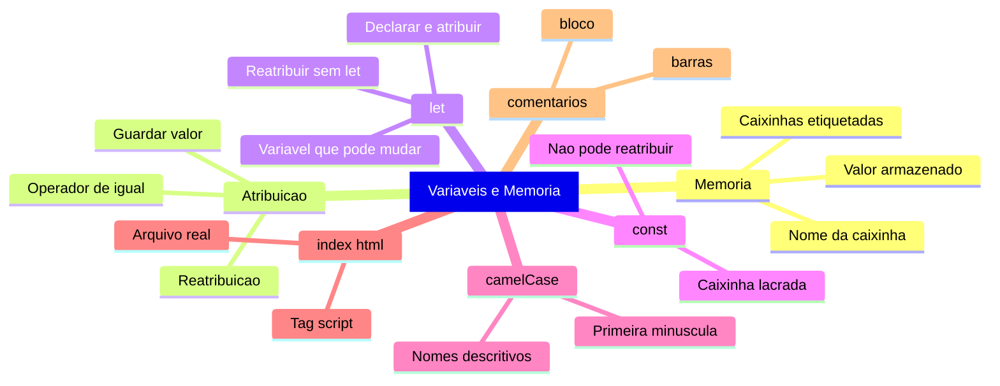
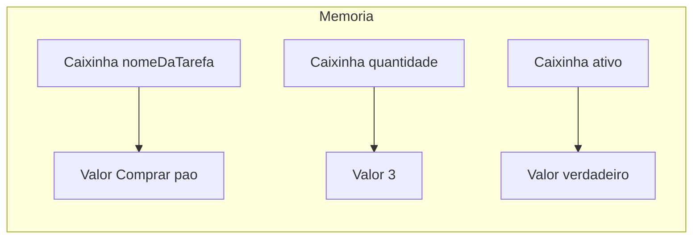
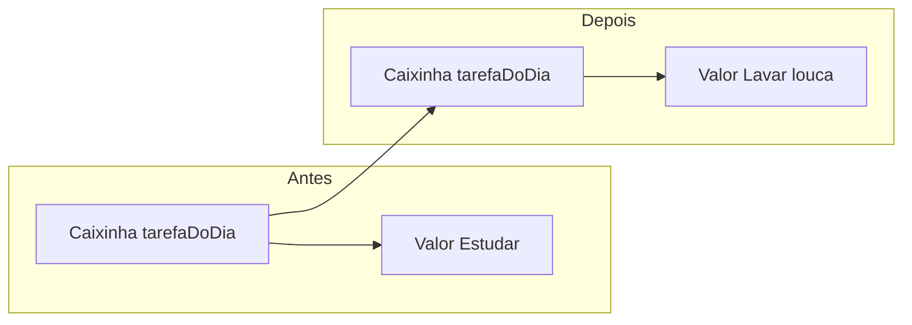

# JavaScript — Do Zero ao Profissional — Aula 02

## Variaveis e Memoria — Do Console para o Arquivo

> *Variaveis sao a base de TUDO em programacao. Sem elas, todo programa seria linear e descartavel — voce nao conseguiria guardar informacao de um passo para o outro. Dedique tempo a esta aula. Mexa nos exemplos. Teste. Quebre. Aprenda.*

---

## Objetivos de Aprendizagem

Ao final desta aula, voce sera capaz de:

- [ ] **Explicar** o conceito de memoria do computador usando a analogia da caixinha etiquetada, com pelo menos 2 exemplos do cotidiano
- [ ] **Distinguir** o nome de uma variavel (a etiqueta) do valor que ela armazena (o conteudo da caixinha)
- [ ] **Explicar** o que e atribuicao (=) e reatribuicao, e o que acontece com o valor antigo na reatribuicao
- [ ] **Criar** variaveis com `let` usando o operador de atribuicao `=`
- [ ] **Criar** constantes com `const`
- [ ] **Diferenciar** declarar uma variavel (criar a caixinha) de reatribuir seu valor (trocar o conteudo), identificando quando usar `let` ou apenas o nome
- [ ] **Escolher** entre `let` e `const` com base em se o valor precisa ou nao mudar durante o programa
- [ ] **Usar** `console.log()` para inspecionar o valor armazenado em uma variavel (sem aspas) vs exibir um texto literal (com aspas)
- [ ] **Nomear** variaveis seguindo a convencao camelCase com nomes descritivos em portugues
- [ ] **Identificar e corrigir** erros comuns de nomenclatura: nomes comecando com numero, hifens, espacos e palavras reservadas
- [ ] **Criar** um arquivo HTML com a tag `<script>` e executar JavaScript no navegador a partir de um arquivo real
- [ ] **Adicionar** comentarios de linha (`//`) e de bloco (`/* */`) para documentar o codigo

---

## Como Usar Esta Aula

Esta aula esta organizada em tres partes que se complementam.

Na **primeira parte** (secoes 1 e 2), voce vai entender como a memoria do computador funciona. Sao conceitos universais — valem para JavaScript, Python, Java, qualquer linguagem. A analogia principal e a **caixinha etiquetada**: uma imagem mental que vai te acompanhar para sempre.

Na **segunda parte** (secoes 3 a 5), voce vai aprender a criar variaveis em JavaScript usando `let` e `const`, dar nomes que fazem sentido e inspecionar valores com `console.log()`.

Na **terceira parte** (secoes 6 e 7), voce vai sair do console temporario e criar um arquivo HTML de verdade, onde seu JavaScript vai viver para sempre. E vai aprender a deixar comentarios — recados no codigo que explicam o que cada parte faz.

Cada secao tem um **Quick Check** no final. As respostas estao logo abaixo. Tente responder de cabeca antes de olhar.

**Tempo estimado:** 55 minutos de leitura + 45 minutos de pratica.

Ao final, o arquivo separado **Questoes de Aprendizagem** traz as tarefas de checkpoint — so avance para a proxima aula quando conseguir completa-las por conta propria.

---

## Mapa Mental

Este diagrama mostra todos os conceitos que voce vai dominar nesta aula:



> *O mapa mental acima mostra a estrutura da aula. Cada ramo representa um conceito que voce vai explorar.*

---

**FUNDAMENTOS: Memoria e Variaveis — Conceitos Universais**

> *Os conceitos desta secao sao universais — valem para qualquer linguagem de programacao, em qualquer computador. Na segunda parte, voce vera como JavaScript implementa cada um deles. Por enquanto, vamos entender o que significa "o computador guardar informacao". Sem JavaScript. Sem console. So a ideia pura.*

---

## 1. O Que E Memoria? — As Caixinhas Etiquetadas

Voce ja parou para pensar como o computador "lembra" das coisas? Quando voce abre um programa, digita seu nome ou clica em um botao, o computador precisa guardar essas informacoes em algum lugar para usar depois. Esse lugar e a **memoria** (especificamente a memoria RAM).

Mas como a memoria funciona no dia a dia da programacao? Vamos construir essa ideia com tres exemplos.

**Exemplo 1 — Ancora (o mundo fisico):** Imagine um armario gigante com milhares de gavetinhas identicas. Cada gavetinha pode guardar UM item. Mas sem etiqueta, voce nunca acharia nada — teria que abrir gaveta por gaveta ate encontrar o que procura. A solucao? **Etiquetas.** Uma gaveta com etiqueta "documentos" e facil de achar. Uma sem etiqueta e um poco de frustracao.

**Exemplo 2 — Espelho (seu dia a dia):** Pense em um fichario de escola. Cada ficha tem um campo "nome do aluno" (a etiqueta) e os dados do aluno (o conteudo). Voce puxa a ficha pelo nome — "Maria", "Joao" — nao pelo numero da gaveta onde ela esta guardada.

**Exemplo 3 — Ponte (a tecnologia que voce usa):** Abra o app de notas do seu celular. Cada nota tem um titulo (o nome da variavel) e um texto (o valor). Voce procura a nota pelo titulo, nao por um codigo interno que o app usa para guarda-la.

O computador funciona exatamente assim. A memoria e o armario, e cada posicao da memoria e uma gavetinha com um endereco unico (tipo "rua 42, numero 7"). Mas enderecos numericos sao dificeis de decorar — entao o computador permite que voce de NOMES para essas gavetinhas.

**E ai que entram as variaveis.**

Uma **variavel** e uma caixinha (um espaco na memoria) que tem um nome (a etiqueta) e guarda um valor (o conteudo). Voce escolhe o nome, o computador reserva o espaco.



Cada caixinha tem:
- **Um nome** (a etiqueta) — e como voce se refere a ela
- **Um valor** (o conteudo) — e o que esta guardado dentro

> *Reflexao: Quando voce ouve "o computador guardou sua senha", na verdade ele guardou um valor dentro de uma caixinha com um nome. O nome e algo que o programa escolheu (tipo senhaDoUsuario), e o valor e a sua senha. Simples assim.*

A beleza das variaveis e que voce nao precisa saber ONDE na memoria o dado esta. O computador gerencia isso. Voce so precisa saber o NOME da caixinha.

> *Voce pode estar pensando: "Mas eu nao sou engenheiro de computacao, preciso saber como a memoria funciona?" Sim — nao os detalhes eletricos, mas o modelo mental da caixinha etiquetada. E ele que vai te acompanhar em TODAS as linguagens de programacao. Promessa.*

**Erro didatico — O que acontece se voce nao etiquetar as gavetas?** Situacao: voce esta em um galpao com 10.000 gavetas identicas, todas sem etiqueta. Voce precisa encontrar um documento especifico. O que acontece? Frustracao total. Voce abre gaveta por gaveta, uma por uma, ate desistir. O computador tambem "se perde" sem nomes de variaveis — ele nao sabe onde guardou ou onde buscar a informacao. Moral: o nome da variavel e sua unica forma de encontrar o valor depois. Sem nome, nao ha variavel.

### Quick Check 1

**1. O que e uma variavel, usando a analogia da caixinha etiquetada?**
**Resposta:** Uma variavel e como uma caixinha dentro da memoria do computador, com uma etiqueta (o nome) e um conteudo (o valor). A etiqueta permite que voce encontre e use o valor sem saber o endereco exato na memoria.

**2. Qual a diferenca entre o nome de uma variavel e o valor que ela guarda?**
**Resposta:** O nome e a etiqueta que voce usa para se referir a caixinha (ex: nomeDaTarefa). O valor e o conteudo que esta guardado dentro dela (ex: Comprar pao). O nome nao muda; o valor pode mudar.

---

## 2. Atribuicao e Reatribuicao — Guardando e Trocando Valores

Agora que voce entende o que e uma caixinha etiquetada, vamos aprender as duas operacoes basicas: guardar um valor dentro e trocar esse valor depois.

**Exemplo 1 — Ancora (o mundo fisico):** Imagine um pote de mantimentos na cozinha com a etiqueta "arroz". Voce coloca arroz dentro do pote — isso e **atribuir** um valor. Depois de alguns dias, o arroz acaba e voce decide guardar feijao no mesmo pote. Voce esvazia e coloca feijao — isso e **reatribuir**. O pote e o mesmo. A etiqueta e a mesma. O conteudo mudou.

**Exemplo 2 — Espelho (seu dia a dia):** Pense em um quadro branco na parede. Voce escreve "Reuniao 14h" — essa e a **atribuicao**. Depois a reuniao e adiada e voce apaga e escreve "Reuniao 15h" — essa e a **reatribuicao**. O quadro (a variavel) e o mesmo. O texto (o valor) mudou.

**Exemplo 3 — Ponte (tecnologia que voce usa):** Imagine um campo de formulario em um site. O usuario digita "Maria" no campo de nome — isso e **atribuicao**. Depois percebe que errou e digita "Mariana" no mesmo campo — isso e **reatribuicao**. O campo (a variavel) e o mesmo. O texto dentro dele mudou.

### Guardando um valor (Atribuicao)

**Atribuir** e colocar um valor dentro da caixinha pela primeira vez. E como pegar um objeto e colocar dentro de uma gaveta vazia.

Em termos de computador, a atribuicao usa o simbolo `=`. A leitura e: "guarde este valor nesta caixinha".

Por exemplo: se voce quer guardar o texto "Estudar" em uma caixinha chamada tarefaDoDia, voce coloca o valor dentro dela usando o simbolo de atribuicao. A caixinha tarefaDoDia agora contem o valor "Estudar".

### Trocando o valor (Reatribuicao)

**Reatribuir** e trocar o valor que esta dentro da caixinha. Voce usa o MESMO simbolo `=`, com o MESMO nome de caixinha, mas com um valor novo.

Agora a caixinha tarefaDoDia nao contem mais "Estudar". Ela foi substituida por "Lavar a louca". O nome da caixinha continua o mesmo. O que mudou foi o conteudo.



> *Pegadinha comum: muita gente confunde `=` com "igual". Em programacao, `=` NAO e "igual". E "guarde este valor nesta caixinha". Sao operacoes diferentes. O "igual" em outras linguagens e `===` (voce aprendera sobre comparacoes em breve).*

> *Voce pode estar se perguntando: "O valor antigo some para sempre quando eu reatribuo?" Sim, some. A nao ser que voce tenha guardado uma copia em OUTRA caixinha antes de trocar. Isso e importante: reatribuicao e destrutiva. O valor anterior e perdido permanentemente.*

**Erro didatico — E se eu tentar usar uma caixinha que nunca criei?** Situacao: voce tenta abrir uma gaveta que nao existe no armario. Sua mao passa pelo vazio. Nao ha nada ali. O computador faz a mesma coisa: se voce tenta usar o valor de uma caixinha que nunca foi criada, ele nao encontra nada e trava com um erro. Moral: voce precisa CRIAR a caixinha antes de USAR. Primeiro atribui, depois consulta.

### Por que isso importa?

Sem variaveis, todo programa seria linear e descartavel — voce nao conseguiria guardar informacao de um passo para o outro. Com variaveis, voce pode:

- **Acumular** informacoes ao longo do programa
- **Consultar** valores que foram definidos antes
- **Modificar** valores conforme a execucao avanca

Pense no Gerenciador de Tarefas que voce vai construir ao longo do curso. Voce precisa de uma caixinha para a tarefaAtual, outra para o statusDaTarefa, outra para o numeroDeTarefas. Cada caixinha guarda uma informacao que o programa usa para funcionar.

### Quick Check 2

**1. O que significa "atribuir" um valor a uma variavel?**
**Resposta:** Atribuir e colocar um valor dentro da caixinha pela primeira vez, usando o operador `=`. O valor fica guardado na caixinha e pode ser consultado depois pelo nome dela.

**2. O que acontece com o valor antigo quando voce reatribui um novo valor a mesma variavel?**
**Resposta:** O valor antigo e substituido pelo novo. A caixinha continua com o mesmo nome, mas o conteudo muda. O valor antigo e perdido — a reatribuicao e destrutiva.

---

### Checkpoint Emocional 1 — Voce entendeu como o computador guarda informacao

Respire. Voce acabou de entender como TODO computador no mundo guarda informacao. Serio. O modelo da caixinha etiquetada nao e uma "simplificacao para iniciantes" — e como programadores profissionais pensam sobre variaveis em qualquer linguagem.

Agora voce vai ver como a linguagem JavaScript implementa isso na pratica. A partir daqui, cada exemplo e para ser digitado, nao so lido.

Se a analogia da caixinha ficou clara, a sintaxe do JavaScript vai ser so uma traducao. Vamos nessa?

---

**APLICACAO: Variaveis em JavaScript com let e const**

> *Agora que voce entende o conceito de caixinhas etiquetadas, vai aprender a criar essas caixinhas em JavaScript. Voce vai conhecer dois tipos de caixinha: uma que permite trocar o conteudo (let) e uma que nao permite (const). Abra o console do navegador — voce vai testar cada conceito em tempo real.*

---

## 3. let — Criando Variaveis que Podem Mudar

Lembra das caixinhas etiquetadas da primeira parte? Em JavaScript, voce cria uma caixinha com **`let`**. O nome `let` vem do ingles "permitir" — voce esta permitindo que o computador crie uma caixinha com aquele nome.

**Exemplo 1 — Ancora (seu programa):** `let statusDaTarefa = "Pendente"` — uma tarefa comeca pendente, mas pode evoluir para "Em andamento" e depois "Concluida". A caixinha `statusDaTarefa` existe justamente para ter o conteudo trocado.

**Exemplo 2 — Espelho (seu dia a dia):** `let nomeDoUsuario = "Visitante"` — quando o usuario faz login, o valor muda: `nomeDoUsuario = "Maria"`. Mesma caixinha, outro valor.

**Exemplo 3 — Ponte (um jogo):** Placar de jogo: `let pontuacao = 0`. A cada ponto, o valor aumenta: `pontuacao = 10`, depois `pontuacao = 25`. Reatribuicao constante.

### Declarando e atribuindo

**Declarar** uma variavel significa pedir ao computador: "crie uma caixinha com este nome". Esta palavra — **declarar** — e importante: ela se refere ao momento em que a caixinha e criada pela primeira vez. Depois que a caixinha existe, voce nao declara de novo — voce so reatribui.

A sintaxe para declarar e:

```javascript
let nomeDaTarefa = "Comprar pao";
```

Traduzindo para o portugues: "Crie uma caixinha chamada `nomeDaTarefa` e guarde o valor 'Comprar pao' dentro dela."

Vamos ver isso na pratica. Abra o console do navegador (F12) e digite:

```javascript
let nomeDaTarefa = "Comprar pao";
```

Aperte Enter. O console mostra `undefined`. **Nao se assuste** — isso e normal. O `undefined` aparece porque declarar uma variavel nao produz um resultado visivel. Ela simplesmente... existe agora.

> *Talvez voce tenha notado que `let nomeDaTarefa = "Comprar pao"` mostrou `undefined` no console. Nao se assuste. `undefined` nao e um erro — e o JavaScript dizendo: "a operacao foi concluida, mas nao gerou um resultado para mostrar". E como um funcionario que executou a tarefa e ficou em silencio. Para VER o resultado, voce usa `console.log()`.*

Para ver o que tem dentro da caixinha, use o `console.log()` — voce ja conhece ele:

```javascript
console.log(nomeDaTarefa);
```

O console mostra:

```
Comprar pao
```

Veja a diferenca sutil: dentro do `console.log()` voce escreveu o NOME da variavel (`nomeDaTarefa`), NAO um texto entre aspas. Se voce tivesse escrito `console.log("nomeDaTarefa")`, o console mostraria o texto "nomeDaTarefa" — nao o valor dentro da caixinha.

**Mao na Massa — Criando sua primeira variavel:**

- [ ] Abra o console do navegador (F12)
- [ ] Digite: `let nomeDaTarefa = "Comprar pao";`
- [ ] Digite: `console.log(nomeDaTarefa);`
- [ ] Veja o valor aparecer no console

**Verificacao:** Se o console mostrou "Comprar pao", funcionou. Se mostrou `undefined`, voce pode ter esquecido de dar um valor — tente de novo.

### Reatribuindo com let

Aqui esta o poder do `let`: voce pode trocar o valor da caixinha quantas vezes quiser.

```javascript
let statusDaTarefa = "Pendente";
console.log(statusDaTarefa);

statusDaTarefa = "Concluida";
console.log(statusDaTarefa);
```

Perceba que na reatribuicao voce NAO usa `let` de novo. O `let` e usado APENAS na primeira vez que a variavel e criada (a declaracao). Depois, para trocar o valor, voce usa so o nome da variavel e o `=`.

```javascript
let tarefa = "Estudar JavaScript";
console.log(tarefa);

tarefa = "Lavar a louca";
console.log(tarefa);
```

**Mao na Massa — Reatribuindo valores:**

- [ ] Declare: `let meuNome = "Maria";`
- [ ] Mostre: `console.log(meuNome);`
- [ ] Troque: `meuNome = "Joao";`
- [ ] Mostre de novo: `console.log(meuNome);`
- [ ] Observe como o valor mudou

**Verificacao:** A primeira execucao mostra "Maria". A segunda mostra "Joao". Se apareceu "Maria" duas vezes, voce usou `let` de novo na reatribuicao — so use `meuNome = "Joao"` sem `let`.

> *Reflexao: O nome da caixinha (`meuNome`) nao mudou. So o conteudo dentro dela. E exatamente como o pote de mantimentos do Exemplo 1 — mesma embalagem, conteudo diferente.*

**Erro didatico — Redeclarando uma variavel que ja existe:**

1. **Codigo errado:** `let tarefa = "Estudar"; let tarefa = "Lavar";`
2. **Mensagem real do console:** `SyntaxError: Identifier 'tarefa' has already been declared`
3. **Traducao:** "Erro de sintaxe: o identificador 'tarefa' ja foi declarado." Em portugues claro: "Voce esta tentando criar uma caixinha com um nome que ja existe. Nao pode ter duas caixinhas com a mesma etiqueta."
4. **Correcao:** `let tarefa = "Estudar"; tarefa = "Lavar";` — sem `let` na segunda linha.
5. **Moral:** Declare UMA vez com `let`. Para trocar o valor, use so o nome da variavel + `=`.

### Quick Check 3

**1. Qual a sintaxe para declarar uma variavel chamada `tarefaDoDia` com o valor "Estudar" usando `let`?**
**Resposta:** `let tarefaDoDia = "Estudar";`

**2. O que acontece se voce tentar declarar a MESMA variavel duas vezes com `let`?**
**Resposta:** O JavaScript mostra um erro: `SyntaxError: Identifier 'tarefa' has already been declared`. Voce nao pode criar duas caixinhas com o mesmo nome.

**3. Como voce inspeciona o valor armazenado em uma variavel chamada `meuNome`?**
**Resposta:** Usando `console.log(meuNome);` — sem aspas, para mostrar o conteudo da caixinha, nao o texto "meuNome".

---

## 4. const — Criando Constantes (Caixinhas Lacradas)

Se `let` e uma caixinha normal que permite trocar o conteudo, **`const`** e uma caixinha LACRADA. Depois que voce coloca um valor dentro, nao pode mais trocar. O nome `const` vem de "constante" — algo que nao varia, nao muda.

**Exemplo 1 — Ancora (seu programa):** `const nomeDoApp = "Gerenciador de Tarefas"`. O nome do aplicativo nao muda nunca. Faz sentido ser constante. Se alguem tentar trocar, e um erro de logica.

**Exemplo 2 — Espelho (sua vida):** `const dataNascimento = "15/03/1990"`. Data de nascimento e fixa por natureza. Ninguem muda de data de nascimento. Usar `const` aqui e uma declaracao de verdade: "isso e imutavel".

**Exemplo 3 — Ponte (software):** `const versaoDoPrograma = "1.0.0"`. A versao atual do programa e fixa. Se mudar, e outro programa, outra versao.

### Declarando com const

A sintaxe e identica ao `let`, mas a intencao e diferente:

```javascript
const nomeDoApp = "Gerenciador de Tarefas";
```

Pronto. A caixinha `nomeDoApp` agora contem "Gerenciador de Tarefas" e, diferentemente do `let`, voce NAO pode trocar esse valor.

```javascript
const nomeDoApp = "Gerenciador de Tarefas";
console.log(nomeDoApp);

nomeDoApp = "Meu App";
```

O JavaScript mostra um erro:

```
TypeError: Assignment to constant variable.
```

**Erro didatico — Reatribuindo uma constante:**

1. **Codigo errado:** `const nomeDoApp = "App"; nomeDoApp = "Novo App";`
2. **Mensagem real do console:** `TypeError: Assignment to constant variable.`
3. **Traducao:** "Erro de tipo: atribuicao a uma variavel constante." Em portugues claro: "Voce esta tentando trocar o conteudo de uma caixinha LACRADA. A tampa nao abre."
4. **Correcao:** Se o valor precisa mudar, declare com `let` em vez de `const`.
5. **Moral:** `const` e uma protecao — voce esta dizendo "este valor e fixo, nao mexa". O JavaScript impede ativamente qualquer tentativa de reatribuicao.

> *Voce pode estar pensando: "Mas e se eu precisar mudar o valor de uma const depois?" Ai voce usou a ferramenta errada. `const` nao e "teimoso" — e um tipo diferente de caixinha. Se o valor vai mudar, use `let`. Se nao vai, use `const`. Simples assim.*

**Mao na Massa — Testando const:**

- [ ] Declare: `const nomeDoApp = "Gerenciador de Tarefas";`
- [ ] Mostre: `console.log(nomeDoApp);`
- [ ] Tente trocar: `nomeDoApp = "Novo Nome";`
- [ ] Veja o erro aparecer no console

**Verificacao:** O console mostra o nome do app na primeira linha. Na tentativa de troca, aparece o erro `TypeError`. O valor original permanece.

### Quando usar let e quando usar const?

Esta e uma das perguntas mais comuns de quem esta comecando. A regra de ouro: **use `const` sempre que possivel, `let` quando necessario.**

| Situacao | Palavra-chave | Por que? |
|---|---|---|
| O valor nunca vai mudar | `const` | Seguranca — ninguem troca por acidente |
| O valor precisa mudar | `let` | Necessidade — o programa precisa evoluir o dado |

Exemplos praticos:

```javascript
const nomeDoApp = "Gerenciador de Tarefas";
const autorDoApp = "Seu Nome";

let tarefaAtual = "Estudar JavaScript";
let statusDaTarefa = "Pendente";
let numeroDeTarefas = 0;

statusDaTarefa = "Em andamento";
numeroDeTarefas = 1;
```

> *Dica profissional: Programadores experientes usam `const` sempre que possivel e `let` quando necessario. Por que? Quanto mais coisas podem mudar no seu programa, mais dificil e acompanhar o que esta acontecendo. O `const` e como um "travamento de seguranca" — voce sabe que aquela caixinha nunca vai trocar de valor.*

### Quick Check 4

**1. Qual a diferenca entre `let` e `const` em JavaScript?**
**Resposta:** `let` cria uma variavel que pode ser reatribuida (o valor pode ser trocado). `const` cria uma constante que NAO pode ser reatribuida (o valor e fixo depois da primeira atribuicao).

**2. O que acontece se voce tentar reatribuir um valor a uma constante declarada com `const`?**
**Resposta:** O JavaScript mostra um erro: `TypeError: Assignment to constant variable.` O programa para e o valor original nao e alterado.

**3. Em qual situacao voce usaria `const` em vez de `let`?**
**Resposta:** Quando o valor nao precisa (ou nao deve) mudar. Por exemplo: o nome de um aplicativo, uma data fixa, a versao de um programa.

---

### Checkpoint Emocional 2 — Voce ja sabe criar variaveis

Respire. Voce acabou de criar suas primeiras variaveis em JavaScript. Nao e mais teoria — e codigo real executando no seu navegador.

O `undefined` que voce viu na declaracao nao e um erro. E o comportamento normal. O JavaScript esta dizendo: "criei a caixinha, missao cumprida, sem resultado para relatar."

Voce ja sabe a diferenca entre `let` e `const`, ja sabe dar nomes descritivos e ja sabe diagnosticar erros de nomenclatura. So que tudo isso ainda esta no console — um ambiente temporario que some quando voce fecha a aba.

E se voce pudesse salvar esse codigo para sempre? E se pudesse abrir amanha e ele ainda estar la?

Bem-vindo a Secao 6.

---

## 5. Nomenclatura — Dando Nomes que Fazem Sentido

Voce ja sabe que variaveis sao caixinhas etiquetadas. Agora vamos aprender a escrever ETIQUETAS boas — nomes que explicam o que tem dentro sem voce precisar abrir a caixinha.

Dar nomes para variaveis e uma das habilidades mais importantes (e mais subestimadas) na programacao. Um bom nome e autoexplicativo.

**Exemplo 1 — Ancora (simples e direto):** `let nomeDaTarefa = "Estudar"`. Duas palavras em camelCase, descritivo, voce le e sabe exatamente o que e.

**Exemplo 2 — Espelho (um pouco mais longo):** `let statusDaTarefaPrincipal = "Pendente"`. Tres palavras, ainda legivel, diz exatamente o que a variavel guarda.

**Exemplo 3 — Ponte (completamente autoexplicativo):** `let dataDeEntregaPrevista = "30/06/2026"`. Nome longo mas cristalino. Voce nao precisa de comentario para entender.

### Nomes descritivos em portugues

Nas aulas iniciais deste curso, vamos usar **portugues** para nomes de variaveis. Isso reduz a barreira de entrada — voce pensa no nome na sua lingua nativa enquanto aprende os conceitos.

```javascript
let tarefaDoDia = "Estudar";
let statusDaTarefa = "Pendente";
let nomeDoUsuario = "Maria";
let totalDeTarefas = 5;
let dataDeEntrega = "2026-06-30";

let a = "Estudar";
let x = "Pendente";
let coisa = "Maria";
```

O nome deve responder a pergunta: **"o que esta variavel guarda?"**

> *Voce pode estar pensando: "Por que camelCase e nao snake_case como em Python?" Boa pergunta. Cada linguagem tem suas convencoes. JavaScript adotou camelCase como padrao da comunidade. Usar o padrao da linguagem e como falar o idioma local — voce e entendido por todos os programadores JavaScript do mundo.*

### camelCase — A convencao do JavaScript

Em JavaScript, a convencao mais usada para nomes de variaveis e o **camelCase**.

A regra e simples:

1. A **primeira palavra** comeca com letra minuscula
2. As **proximas palavras** comecam com letra maiuscula
3. **Sem espacos**, **sem hifens**, sem caracteres especiais

```javascript
let nomedatarefa = "Errado";
let nome_da_tarefa = "Errado";
let nome-da-tarefa = "Errado";
let NomeDaTarefa = "Errado";
let nomeDaTarefa = "Certo!";
```

### Regras que o JavaScript IMPOE

JavaScript tem regras rigidas sobre nomes de variaveis:

| Regra | Exemplo Valido | Exemplo Invalido | Por que? |
|---|---|---|---|
| Nao pode comecar com numero | `tarefa1` | `1tarefa` | O parser confunde com numero literal |
| Sem espacos | `nomeDaTarefa` | `nome da tarefa` | Espaco separa tokens no parser |
| Sem hifens | `nomeDaTarefa` | `nome-da-tarefa` | `-` e operador de subtracao |
| So letras, digitos, `_` e `$` | `nomeDaTarefa1` | `nome@tarefa` | `@` nao faz parte de identificadores |
| Nao pode ser palavra reservada | `let variavel = "ok"` | `let let = "erro"` | Palavras reservadas sao comandos |

**Tres erros didaticos completos:**

**Erro A — Hifen no nome:**

1. **Codigo errado:** `let status-da-tarefa = "Pendente";`
2. **Mensagem real do console:** `SyntaxError: Unexpected token '-'`
3. **Traducao:** O JavaScript interpreta `-` como operador de subtracao. Ele le `status` menos `da` menos `tarefa`.
4. **Correcao:** `let statusDaTarefa = "Pendente";` — camelCase resolve.
5. **Moral:** Nunca use hifen em nome de variavel. JavaScript acha que e conta de subtracao.

**Erro B — Nome comecando com numero:**

1. **Codigo errado:** `let 1tarefa = "Estudar";`
2. **Mensagem real do console:** `SyntaxError: Invalid or unexpected token`
3. **Traducao:** JavaScript exige que nomes comecem com letra, `_` ou `$`. Numero no inicio e ambiguo.
4. **Correcao:** `let tarefa1 = "Estudar";` — numero no FINAL funciona perfeitamente.
5. **Moral:** Numero pode aparecer, mas so no final ou no meio. Nunca na primeira posicao.

**Erro C — Palavra reservada como nome:**

1. **Codigo errado:** `let let = "teste";`
2. **Mensagem real do console:** `SyntaxError: let is disallowed as a lexically bound name`
3. **Traducao:** `let` ja e um comando do JavaScript. Voce nao pode "sequestrar" uma palavra que a linguagem usa.
4. **Correcao:** `let minhaVariavel = "teste";` — use outro nome qualquer.
5. **Moral:** Palavras como `let`, `const`, `if`, `for` pertencem ao JavaScript, nao a voce.

**Mao na Massa — Testando nomes invalidos:**

- [ ] No console, tente: `let 1tarefa = "teste";` — veja o erro
- [ ] Tente: `let nome-tarefa = "teste";` — veja o erro
- [ ] Tente: `let let = "teste";` — veja o erro
- [ ] Crie uma variavel valida: `let minhaPrimeiraTarefa = "Estudar";`
- [ ] Mostre: `console.log(minhaPrimeiraTarefa);`

**Verificacao:** Os tres primeiros passos produzem erros no console. O ultimo passo mostra "Estudar" sem erro. Se algum nome invalido nao produziu erro, voce pode ter digitado algo diferente — tente copiar exatamente.

### A conexao com o Gerenciador de Tarefas

Agora que voce sabe criar variaveis com nomes descritivos, da para esbocar o Gerenciador de Tarefas com dados reais:

```javascript
const nomeDoApp = "Gerenciador de Tarefas";

let tarefa1 = "Comprar pao";
let tarefa2 = "Estudar JavaScript";
let tarefa3 = "Lavar a louca";

let statusTarefa1 = "Pendente";
let statusTarefa2 = "Em andamento";
let statusTarefa3 = "Pendente";

let totalDeTarefas = 3;

console.log(nomeDoApp);
console.log(tarefa1);
console.log(tarefa2);
console.log(tarefa3);
```

Cada tarefa e uma caixinha. O status de cada tarefa e outra caixinha. O total de tarefas e mais uma caixinha.

> *Reflexao: Nas proximas aulas, voce vai aprender jeitos mais elegantes de organizar esses dados (com arrays e objetos). Mas, por ora, veja como voce ja consegue representar um sistema real usando apenas variaveis!*

### Quick Check 5

**1. Por que `nomeDaTarefa` e um bom nome de variavel?**
**Resposta:** Porque ele e descritivo (diz exatamente o que a variavel guarda), segue camelCase (primeira palavra minuscula, "Tarefa" com T maiusculo), e esta em portugues.

**2. Quais destes nomes sao invalidos em JavaScript? Por que?**
   a) `minhaTarefa` | b) `1tarefa` | c) `status-da-tarefa` | d) `tarefaDois`
**Resposta:** b) `1tarefa` comeca com numero, invalido. c) `status-da-tarefa` contem hifens interpretados como subtracao. a) e d) sao validos em camelCase.

**3. O que acontece se voce tentar usar `let` como nome de variavel?**
**Resposta:** Da erro (`SyntaxError: let is disallowed as a lexically bound name`), porque `let` e uma palavra reservada do JavaScript.

---

### Checkpoint Emocional 2 — Voce ja sabe criar variaveis

Respire. Voce acabou de criar suas primeiras variaveis em JavaScript. Nao e mais teoria — e codigo real executando no seu navegador.

O `undefined` que voce viu na declaracao nao e um erro. E o comportamento normal. O JavaScript esta dizendo: "criei a caixinha, missao cumprida, sem resultado para relatar."

Voce ja sabe a diferenca entre `let` e `const`, ja sabe dar nomes descritivos e ja sabe diagnosticar erros de nomenclatura. So que tudo isso ainda esta no console — um ambiente temporario que some quando voce fecha a aba.

E se voce pudesse salvar esse codigo para sempre? E se pudesse abrir amanha e ele ainda estar la?

Bem-vindo a Secao 6.

---

## 6. Do Console para o Arquivo — Seu Codigo Ganha Vida Permanente

Ate agora, todo codigo que voce escreveu viveu no console do navegador. Abre o F12, digita, ve o resultado, fecha — e o codigo desaparece. O console e como um quadro branco: voce escreve, apaga, e nao sobra nada.

Mas na programacao de verdade, o codigo mora em **arquivos**. Arquivos que voce pode fechar, abrir de novo amanha, e o codigo ainda esta la. Arquivos que voce pode enviar para um amigo, colocar num site, guardar no seu computador.

**Hora de criar seu primeiro arquivo de codigo.**

### O que e um arquivo HTML?

HTML e a linguagem que os navegadores entendem para mostrar paginas. Todo site que voce visita e um arquivo HTML (ou varios). Quando voce abre um arquivo HTML no navegador, ele mostra a pagina.

A estrutura minima de um HTML e esta:

```html
<!DOCTYPE html>
<html>
<head>
    <title>Meu Programa</title>
</head>
<body>
    <!-- O conteudo visivel vai aqui -->
</body>
</html>
```

Voce nao precisa decorar tudo agora. O importante e entender as partes:

- `<!DOCTYPE html>` — avisa o navegador que e um HTML moderno
- `<html>` — a raiz de tudo
- `<head>` — informacoes sobre a pagina (como o titulo na aba)
- `<body>` — o que aparece na tela

### Colocando JavaScript dentro do HTML

Para colocar JavaScript dentro de um HTML, usamos a tag **`<script>`**. Ela funciona como um "aviso" para o navegador: "a partir daqui, e codigo JavaScript, nao HTML."

```html
<!DOCTYPE html>
<html>
<head>
    <title>Meu Primeiro Programa</title>
</head>
<body>
    <h1>Ola, mundo!</h1>
    
    <script>
        console.log("Meu primeiro codigo em um arquivo!");
    </script>
</body>
</html>
```

O `console.log()` dentro do `<script>` funciona EXATAMENTE igual ao console. A diferenca e que agora o codigo esta SALVO em um arquivo. Voce pode fechar o navegador, abrir de novo amanha, e o codigo ainda esta la.

> *O `undefined` que aparece no console quando voce abre a pagina nao e um erro. E o JavaScript dizendo "terminei de executar o script, nao tenho nada para retornar." O que importa e que a mensagem "Meu primeiro codigo em um arquivo!" apareceu no console.*

### Mao na Massa — Criando seu primeiro arquivo HTML

Siga cada passo. Na primeira vez parece magica, mas e so tecnologia.

- [ ] Abra o Bloco de Notas (Windows), TextEdit (Mac) ou seu editor de codigo favorito
- [ ] Crie um arquivo novo
- [ ] Copie e cole o codigo abaixo exatamente como esta:

```html
<!DOCTYPE html>
<html>
<head>
    <title>Minha Primeira Pagina</title>
</head>
<body>
    <h1>Ola, mundo!</h1>
    
    <script>
        let nomeDaTarefa = "Comprar pao";
        console.log(nomeDaTarefa);
        
        const app = "Gerenciador de Tarefas";
        console.log(app);
    </script>
</body>
</html>
```

- [ ] Salve o arquivo com o nome `index.html` na sua area de trabalho (Desktop)
- [ ] Abra o arquivo no navegador: clique duas vezes no arquivo, ou arraste para o navegador
- [ ] Abra o console com F12
- [ ] Procure suas mensagens no console

**Verificacao:** Voce deve ver duas mensagens no console:
```
Comprar pao
Gerenciador de Tarefas
```

Se nao apareceu nada, verifique:
- O arquivo foi salvo com extensao `.html`? (nao `.txt`)
- O console esta na aba "Console"? (nao na aba "Elements")
- O `console.log` esta DENTRO da tag `<script>`?

### O momento "Uau"

Feche o navegador. Abra o arquivo `index.html` de novo. O codigo continua la. As mensagens aparecem no console de novo.

**Seu codigo agora EXISTE.** Ele nao some quando voce fecha o navegador. Ele mora no arquivo. Voce pode abrir amanha, depois de amanha, daqui a um ano — e ele ainda vai estar la.

> *Isso e um marco. Ate agora voce era um "espectador" de codigo. Agora voce e um **criador** de arquivos que o computador entende.*

**Por que isso e importante?** Porque e assim que programas de verdade funcionam. O Gerenciador de Tarefas que voce vai construir ao longo do curso vai ser feito de arquivos — HTML, CSS e JavaScript. Cada aula vai adicionar uma peca nova. E tudo comeca com um simples `index.html`.

### Editando o arquivo

Agora que o arquivo existe, voce pode editar ele. Abra o `index.html` no seu editor, mude as variaveis, adicione novas, salve e atualize o navegador (F5).

```html
<script>
    let tarefaDoDia = "Estudar JavaScript";
    console.log(tarefaDoDia);
    
    let statusTarefa = "Em andamento";
    console.log(statusTarefa);
    
    const nomeDoCurso = "JavaScript do Zero ao Profissional";
    console.log(nomeDoCurso);
</script>
```

- [ ] Edite o arquivo, troque as variaveis
- [ ] Salve (Ctrl+S ou Cmd+S)
- [ ] Atualize o navegador (F5)
- [ ] Veja as novas mensagens no console

> *Esse ciclo — editar, salvar, atualizar, ver — e o coracao do desenvolvimento web. Voce vai repetir isso milhares de vezes na sua carreira. Acostume-se.*

### Quick Check 6

**1. O que faz a tag `<script>` dentro de um HTML?**
**Resposta:** Ela avisa o navegador que o conteudo dentro dela e codigo JavaScript, nao HTML. O navegador executa esse codigo quando carrega a pagina.

**2. Qual a principal diferenca entre escrever codigo no console e escrever em um arquivo HTML?**
**Resposta:** No console, o codigo desaparece quando voce fecha a pagina. No arquivo, o codigo fica salvo e pode ser reaberto e reexecutado quantas vezes quiser.

**3. O que voce precisa fazer para ver o resultado de uma alteracao no arquivo `index.html`?**
**Resposta:** Salvar o arquivo e atualizar o navegador (F5). O navegador recarrega a pagina e executa o JavaScript novamente.

---

## 7. Comentarios — Deixando Recados no Codigo

Agora que seu codigo vive em um arquivo, voce pode escrever algo que no console era inutil: **comentarios**.

Lembra os post-its que voce coloca em livros de receita? "Nao esqueca de pre-aquecer o forno" ou "rende 4 porcoes". Eles nao sao parte da receita — sao lembretes para quem esta cozinhando.

**Comentarios em codigo funcionam exatamente assim.** Sao mensagens que voce deixa para si mesmo (ou para outros programadores) explicando o que o codigo faz. O computador IGNORA completamente os comentarios. Eles existem so para seres humanos.

> *Pense: antes, no console, comentarios nao faziam sentido — voce digitava, via o resultado e pronto. Nao tinha onde guardar. Mas agora que seu codigo vive em um arquivo, comentarios sao essenciais. Voce fecha o arquivo hoje, volta amanha, e os comentarios estao la para lembrar voce do que cada parte faz.*

### Comentario de linha — //

O **comentario de linha** comeca com duas barras `//` e vai ate o final da linha. Tudo depois do `//` e ignorado pelo JavaScript.

```javascript
// Esta linha e um comentario — o JavaScript ignora ela
let nome = "Maria"; // Isto tambem e um comentario, depois do codigo
```

O `//` funciona como "a partir daqui, e recado para humanos." O computador le o que vem antes (se houver) e ignora o que vem depois.

Exemplo pratico no arquivo que voce acabou de criar:

```html
<script>
    // ===== DADOS DO GERENCIADOR DE TAREFAS =====
    
    // Nome do app — nunca muda
    const nomeDoApp = "Gerenciador de Tarefas";
    
    // Tarefas do dia
    let tarefa1 = "Comprar pao";       // Primeira tarefa
    let tarefa2 = "Estudar JavaScript"; // Segunda tarefa
    let tarefa3 = "Lavar a louca";     // Terceira tarefa
    
    // Status das tarefas (Pendente, Em andamento, Concluida)
    let statusTarefa1 = "Pendente";
    let statusTarefa2 = "Em andamento";
    
    console.log(nomeDoApp);
    console.log(tarefa1);
    console.log(tarefa2);
</script>
```

Perceba como os comentarios tornam o codigo muito mais facil de entender. Mesmo sem nunca ter visto este codigo, voce consegue entender o que cada variavel guarda.

**Boa pratica:** Comentarios explicam o "por que", nao o "o que". O "o que" o codigo ja mostra. O "por que" e o contexto que so um humano pode fornecer.

```javascript
// Ruim — o codigo ja mostra o que esta fazendo
let x = 10; // Atribui 10 a x

// Bom — explica o contexto que o codigo nao mostra
let limiteDeTarefas = 10; // Maximo de tarefas que o usuario gratuito pode criar
```

### Comentario de bloco — /* */

O **comentario de bloco** usa `/*` para comecar e `*/` para terminar. Tudo entre eles e ignorado, mesmo que tenha varias linhas.

```javascript
/*
   Este e um comentario de bloco.
   Ele pode ocupar varias linhas.
   Tudo aqui dentro e ignorado pelo JavaScript.
*/
let nome = "Maria";
```

E util para:
- Explicar uma secao inteira do codigo
- "Desligar" temporariamente um trecho de codigo sem apagar
- Documentar funcoes (que voce aprendera em aulas futuras)

```javascript
/*
   GERENCIADOR DE TAREFAS — Versao 1.0
   Autor: Seu Nome
   Descricao: Dados iniciais do gerenciador
   
   Cada tarefa tem um nome e um status.
   O status pode ser: Pendente, Em andamento ou Concluida.
*/

const nomeDoApp = "Gerenciador de Tarefas";

let tarefa1 = "Comprar pao";
/*
   Se voce quiser desligar uma linha sem apagar:
   let tarefa2 = "Estudar JavaScript";
*/
let tarefa2 = "Lavar a louca"; // Tarefa alterada

console.log(nomeDoApp);
```

### Diferenca entre // e /* */

| Caracteristica | `//` | `/* */` |
|---|---|---|
| Quantas linhas | Uma linha | Varias linhas |
| Onde comeca | Do `//` ate o fim da linha | Do `/*` ate o `*/` |
| Uso comum | Explicar uma linha especifica | Explicar um bloco, desligar codigo |
| Pode estar no meio da linha | Sim (`codigo // comentario`) | Nao (se abrir `/*`, tudo e comentario ate fechar) |

**Mao na Massa — Adicionando comentarios ao seu arquivo:**

- [ ] Abra o `index.html` que voce criou na Secao 6
- [ ] Localize a tag `<script>`
- [ ] Adicione um comentario de linha `//` no inicio, explicando o que o programa faz
- [ ] Adicione um comentario de bloco `/* */` com seu nome e a data
- [ ] Adicione `//` ao lado de cada variavel explicando o que ela guarda
- [ ] Salve o arquivo
- [ ] Atualize o navegador (F5)
- [ ] Confirme que o console mostra as mesmas mensagens de antes

**Verificacao:** O console deve mostrar exatamente as mesmas mensagens de antes. Os comentarios sao invisiveis para o JavaScript — eles estao la apenas para voce e outros programadores.

Aqui esta um exemplo do que seu arquivo pode parecer depois de adicionar os comentarios:

```html
<!DOCTYPE html>
<html>
<head>
    <title>Meu Programa com Comentarios</title>
</head>
<body>
    <h1>Gerenciador de Tarefas</h1>
    
    <script>
        /*
            Meu Primeiro Programa em Arquivo
            Autor: Maria Silva
            Data: 23/06/2026
        */
        
        // ===== CONFIGURACAO =====
        const nomeDoApp = "Gerenciador de Tarefas"; // Nome fixo do app
        
        // ===== TAREFAS =====
        let tarefa1 = "Comprar pao";       // Tarefa 1
        let tarefa2 = "Estudar JavaScript"; // Tarefa 2 - a mais importante!
        
        // ===== STATUS =====
        let statusTarefa1 = "Pendente";      // Ainda nao comecou
        let statusTarefa2 = "Em andamento";  // Ja esta estudando
        
        // ===== EXIBICAO =====
        console.log(nomeDoApp);
        console.log(tarefa1);
        console.log(statusTarefa1);
        console.log(tarefa2);
        console.log(statusTarefa2);
    </script>
</body>
</html>
```

> *Reflexao: Compare este codigo com o que voce escreveu na Secao 6. Os comentarios transformaram um amontoado de linhas em um documento organizado e facil de entender. Daqui a uma semana, quando voce abrir este arquivo de novo, os comentarios vao te salvar minutos de "o que isso fazia mesmo?"*

**Erro didatico — Comentario sem fechar:**

1. **Codigo errado:** `let nome = "Maria"; /* Este comentario nunca fecha`
2. **Mensagem no console:** O JavaScript nao mostra erro do comentario em si — mas TODO o codigo depois do `/*` fica "comentado" e nao executa. Seu programa simplesmente para de funcionar a partir dali.
3. **Traducao:** "Voce abriu um comentario de bloco mas esqueceu de fechar. JavaScript esta ignorando tudo que vem depois, inclusive codigo que deveria executar."
4. **Correcao:** Sempre feche `/*` com `*/`. E uma boa pratica escrever `*/` logo depois de abrir `/*`, e depois preencher o meio.
5. **Moral:** Comentarios de bloco NAO FECHADOS sao um dos erros mais comuns de iniciantes. E silencioso — nao da erro, mas seu codigo simplesmente nao funciona. Sempre verifique se todo `/*` tem um `*/` correspondente.

### Quick Check 7

**1. Qual a diferenca entre `//` e `/* */` nos comentarios?**
**Resposta:** `//` faz comentario de uma unica linha — tudo do `//` ate o final da linha e ignorado. `/* */` faz comentario de multiplas linhas — tudo entre `/*` e `*/` e ignorado.

**2. O que acontece se voce esquecer de fechar um comentario de bloco com `*/`?**
**Resposta:** O JavaScript ignora todo o codigo que vem depois do `/*` ate encontrar um `*/` — ou ate o final do arquivo, se nunca fechar. O programa simplesmente para de funcionar a partir do comentario nao fechado, sem mostrar erro.

**3. Por que comentarios sao mais uteis agora que o codigo esta em um arquivo do que quando estava no console?**
**Resposta:** Porque no console o codigo desaparece quando voce fecha a aba — comentarios seriam perdidos. No arquivo, os comentarios persistem entre sessoes. Voce fecha o arquivo hoje, volta amanha, e os comentarios ainda estao la para explicar o codigo.

---

### Checkpoint Emocional 3 — Voce tem um arquivo de verdade

Tres checkpoints depois e a historia e outra. Voce comecou esta aula entendendo o conceito abstrato de "caixinhas etiquetadas". Depois criou variaveis no console. Depois criou um ARQUIVO de verdade — `index.html` — com JavaScript dentro. E ainda aprendeu a deixar comentarios para documentar tudo.

Amanha, quando voce abrir esse arquivo, ele ainda vai estar la. O codigo vai executar. Os comentarios vao te lembrar do que cada parte faz.

Isso e programacao de verdade.

Na proxima aula, voce vai descobrir que os valores dentro das caixinhas tem "naturezas" diferentes. Mas antes, complete o Quiz e os Exercicios abaixo para fixar tudo.

---

## Autoavaliacao: Quiz Rapido

Teste seu conhecimento com estas 8 perguntas.

**1. Usando a analogia da aula, o que e uma variavel?**
**Resposta:**

Uma caixinha etiquetada na memoria do computador. A etiqueta e o nome da variavel, e o conteudo dentro da caixinha e o valor armazenado.

**2. Qual a diferenca entre `let` e `const`?**
**Resposta:**

`let` permite reatribuir o valor (trocar o conteudo da caixinha). `const` nao permite — depois de atribuido, o valor nao pode ser trocado.

**3. Escreva o codigo para criar uma variavel chamada `nomeDoUsuario` com seu nome e depois exibir no console.**
**Resposta:**

```javascript
let nomeDoUsuario = "Maria";
console.log(nomeDoUsuario);
```

**4. O que o console exibe neste codigo?**
```javascript
let fruta = "banana";
console.log(fruta);
```
**Resposta:** `banana` (o valor dentro da variavel, sem aspas).

**5. O que o console exibe neste codigo?**
```javascript
let cidade = "Sao Paulo";
cidade = "Rio de Janeiro";
console.log(cidade);
```
**Resposta:** `Rio de Janeiro` (a reatribuicao trocou o valor).

**6. Para que serve a tag `<script>` em um arquivo HTML?**
**Resposta:** Para incluir codigo JavaScript dentro do HTML. O navegador executa esse codigo quando carrega a pagina.

**7. Qual a diferenca entre `//` e `/* */`?**
**Resposta:** `//` comenta apenas uma linha. `/* */` comenta um bloco de varias linhas.

**8. O que ha de errado neste codigo?**
```javascript
const dataNascimento = "15/03/1990";
dataNascimento = "20/07/1995";
console.log(dataNascimento);
```
**Resposta:** A variavel foi declarada com `const`, que nao permite reatribuicao. A linha `dataNascimento = "20/07/1995"` gera `TypeError: Assignment to constant variable.`

---

## Exercicios Graduados

**Exercicio 1 (Facil) — Seu Cartao de Visita em Arquivo**

Crie um arquivo HTML com JavaScript que declare variaveis com suas informacoes e exiba cada uma no console:

1. Crie um arquivo `cartao-visita.html`
2. Adicione a estrutura HTML basica com `<script>`
3. Crie uma variavel `let` chamada `seuNome` com seu nome
4. Crie uma `const` chamada `curso` com o valor "JavaScript"
5. Crie uma `let` chamada `tempoEstudo` com quantos minutos voce estudou hoje
6. Exiba cada variavel com `console.log()`
7. Adicione comentarios explicando cada linha
8. Abra no navegador e veja o resultado no console

**Gabarito:**

```html
<!DOCTYPE html>
<html>
<head>
    <title>Cartao de Visita</title>
</head>
<body>
    <h1>Meu Cartao de Visita</h1>
    
    <script>
        // ===== DADOS PESSOAIS =====
        let seuNome = "Maria Silva";    // Meu nome
        const curso = "JavaScript";     // Nome do curso (fixo)
        let tempoEstudo = 45;           // Minutos estudados hoje
        
        // ===== EXIBICAO =====
        console.log(seuNome);
        console.log(curso);
        console.log(tempoEstudo);
    </script>
</body>
</html>
```

> *Explicacao: `seuNome` usa `let` porque pode mudar. `curso` usa `const` porque o nome do curso e fixo. `tempoEstudo` usa `let` porque amanha voce pode estudar 60 minutos. Os comentarios `//` explicam o que cada bloco e variavel significam.*

**Exercicio 2 (Medio) — Caixinha que Troca de Valor com Comentarios**

Voce esta acompanhando o status de uma tarefa ao longo do dia. Crie um arquivo HTML que:

1. Declare uma variavel `statusDaTarefa` com `let` e valor inicial "Pendente"
2. Exiba o status no console
3. Reatribua para "Em andamento"
4. Exiba o status de novo
5. Reatribua para "Concluida"
6. Exiba o status pela ultima vez
7. Adicione um comentario de bloco no inicio explicando o programa
8. Adicione comentarios de linha em cada reatribuicao

**Gabarito:**

```html
<!DOCTYPE html>
<html>
<head>
    <title>Status da Tarefa</title>
</head>
<body>
    <h1>Acompanhamento de Tarefa</h1>
    
    <script>
        /*
            Acompanhamento de Status de Tarefa
            Simula a evolucao de uma tarefa ao longo do dia
            Os status possiveis sao: Pendente, Em andamento, Concluida
        */
        
        let statusDaTarefa = "Pendente";        // Comeca pendente
        console.log(statusDaTarefa);            // Mostra: Pendente
        
        statusDaTarefa = "Em andamento";        // O usuario comecou a fazer
        console.log(statusDaTarefa);            // Mostra: Em andamento
        
        statusDaTarefa = "Concluida";           // A tarefa foi finalizada
        console.log(statusDaTarefa);            // Mostra: Concluida
    </script>
</body>
</html>
```

**Desafio (Dificil) — Diagnostico de Erros com Arquivo**

Voce recebeu o codigo abaixo de um colega. Ele contem 6 erros. Identifique todos, crie um arquivo HTML corrigido e adicione comentarios explicando cada correcao.

```javascript
let nome = "Carlos"
const nome = "Joao"
console.log(nome)

let 1aTarefa = "Estudar"
let status-da-tarefa = "Pendente"

const pi = 3.14
pi = 3.1415

let tarefa = "Codar" /* Este comentario nunca foi fechado
console.log(tarefa)
```

**Gabarito:**

```html
<!DOCTYPE html>
<html>
<head>
    <title>Diagnostico de Erros - Corrigido</title>
</head>
<body>
    <h1>Codigo Corrigido</h1>
    
    <script>
        /*
            DIAGNOSTICO DE ERROS - CORRIGIDO
            Erros encontrados e corrigidos:
            1. Duas declaracoes de 'nome' com let e const
            2. Variavel '1aTarefa' comeca com numero
            3. Variavel 'status-da-tarefa' com hifens
            4. Reatribuicao de 'pi' que e const
            5. Comentario de bloco nao fechado (/* sem */)
            6. Ponto e virgula faltando (boa pratica)
        */
        
        // Correcao 1: Usar um nome so, com let (pois pode mudar)
        let nome = "Carlos";
        console.log(nome); // Carlos
        
        // Correcao 2: Numero no final, nao no inicio
        let primeiraTarefa = "Estudar";
        
        // Correcao 3: camelCase em vez de hifens
        let statusDaTarefa = "Pendente";
        
        // Correcao 4: Se o valor precisava mudar, usar let
        let pi = 3.14;
        pi = 3.1415;
        
        // Correcao 5: Comentario de bloco fechado corretamente
        let tarefa = "Codar"; /* Este comentario agora esta fechado */
        console.log(tarefa); // Codar
    </script>
</body>
</html>
```

---

## Resumo da Aula

### Os 7 Conceitos Fundamentais

1. **Memoria como caixinhas etiquetadas**: o computador guarda informacoes em espacos nomeados dentro da memoria. Cada espaco e uma "caixinha" com um nome e um valor.
2. **Atribuicao e reatribuicao**: atribuir e colocar um valor na caixinha pela primeira vez. Reatribuir e trocar o valor antigo por um novo. A reatribuicao e destrutiva.
3. **let**: cria variaveis que podem ter o valor alterado (caixinha reutilizavel).
4. **const**: cria constantes que nao podem ser reatribuidas (caixinha lacrada). Use sempre que possivel.
5. **camelCase descritivo**: nomes em portugues, primeira palavra minuscula, proximas maiusculas. Ex: `nomeDaTarefa`, `statusDaTarefaPrincipal`.
6. **Arquivo HTML com script**: codigo JavaScript pode viver em um arquivo `.html` dentro da tag `<script>`. Ele persiste entre sessoes.
7. **Comentarios // e /* */**: mensagens para humanos que o computador ignora. `//` para uma linha, `/* */` para varias.

### O Que Voce Construiu Hoje

- [x] Criei variaveis com `let` e atribui valores com `=`
- [x] Criei constantes com `const`
- [x] Reatribui valores de variaveis existentes
- [x] Usei `console.log()` para inspecionar o valor de variaveis
- [x] Identifiquei a diferenca entre o nome da variavel e seu valor
- [x] Nomeei variaveis em camelCase descritivo em portugues
- [x] Diagnostiquei erros comuns de variaveis
- [x] Entendi quando usar `let` versus `const`
- [x] Criei meu primeiro arquivo HTML com `<script>` e JavaScript
- [x] Adicionei comentarios `//` e `/* */` para documentar o codigo
- [x] Esbocei os primeiros dados do Gerenciador de Tarefas com variaveis

---

## Proxima Aula

Na proxima aula, voce vai descobrir que os valores dentro das caixinhas tem "naturezas" diferentes — alguns sao numeros, outros sao textos, outros sao verdadeiro/falso. Voce vai aprender a identificar e usar cada tipo corretamente, alem de conhecer o `typeof` para inspecionar o tipo de qualquer valor. Seu Gerenciador de Tarefas vai ganhar dados mais precisos.

---

## Referencias

### Documentacao Oficial

- [MDN: let](https://developer.mozilla.org/pt-BR/docs/Web/JavaScript/Reference/Statements/let) — documentacao completa da declaracao `let`
- [MDN: const](https://developer.mozilla.org/pt-BR/docs/Web/JavaScript/Reference/Statements/const) — documentacao completa da declaracao `const`
- [MDN: Expressoes e operadores — atribuicao](https://developer.mozilla.org/pt-BR/docs/Web/JavaScript/Reference/Operators/Assignment) — operador `=` em detalhes
- [MDN: Comentarios](https://developer.mozilla.org/pt-BR/docs/Web/JavaScript/Reference/Lexical_grammar#comentarios) — sintaxe de comentarios em JavaScript

### Guias de Estilo

- [JavaScript CamelCase Convention](https://www.freecodecamp.org/news/camel-case-in-javascript/) — guia pratico sobre camelCase

### Artigos para Aprofundamento

- [JavaScript.info: Variables](https://javascript.info/variables) — tutorial alternativo sobre variaveis (em ingles)
- [JavaScript.info: let e const](https://javascript.info/let-const) — diferencas entre let e const

---

## FAQ

**P: Posso declarar uma variavel sem atribuir um valor a ela?**
R: Sim, voce pode fazer `let tarefa;` sem o `=`. A variavel e criada, mas fica com o valor `undefined`. Com `const` isso nao funciona — voce precisa dar um valor na hora.

**P: O que significa `undefined` que aparece no console?**
R: `undefined` e um valor especial em JavaScript que significa "nada foi definido ainda". Quando voce declara uma variavel sem dar valor, ou quando uma instrucao nao produz resultado, o JavaScript responde com `undefined`.

**P: Posso mudar o valor de uma constante se ela for um objeto ou array?**
R: Com objetos e arrays (que voce vera em aulas futuras), o conteudo interno pode mudar mesmo com `const`. O que nao pode mudar e a VARIAVEL em si apontar para outro objeto. Mas isso e assunto para aulas futuras.

**P: Qual a diferenca entre `=` e `===`?**
R: `=` e ATRIBUICAO: "guarde este valor nesta variavel". `===` e COMPARACAO: "este valor e igual aquele?". Voce aprendera mais sobre comparacoes em breve neste curso.

**P: Preciso sempre usar ponto e virgula?**
R: E uma boa pratica. O JavaScript tem um mecanismo chamado ASI que coloca `;` para voce em muitos casos, mas pode causar bugs inesperados.

**P: Por que nomes descritivos sao tao importantes?**
R: Porque voce passa mais tempo LENDO codigo do que ESCREVENDO. Um nome descritivo como `statusDaTarefa` e autoexplicativo. Um nome como `x` exige que voce pare e descubra o que significa.

**P: E se eu esquecer a diferenca entre declarar e reatribuir?**
R: A regra de ouro: declare UMA vez com `let nome = valor`. Depois, para trocar o valor, use so `nome = novoValor` (sem `let`).

**P: Por que o `const` e preferivel ao `let`?**
R: Porque menos coisas podem mudar = menos surpresas. Se voce declara algo com `const`, voce e quem ler o codigo sabem que aquele valor nunca vai ser trocado acidentalmente.

**P: Posso usar acentos em nomes de variaveis?**
R: Tecnicamente, JavaScript permite acentos e caracteres Unicode em nomes de variaveis. Na pratica, EVITE. Acentos podem causar problemas de encoding entre diferentes editores e sistemas.

**P: O que acontece se eu abrir o `index.html` e o console estiver vazio?**
R: Verifique: (1) o `console.log` esta dentro da tag `<script>`? (2) a tag `<script>` esta dentro do `<body>`? (3) voce salvou o arquivo antes de atualizar o navegador? (4) o console esta na aba "Console" do DevTools?

**P: Comentarios deixam o codigo mais lento?**
R: Nao. Quando o JavaScript e executado, os comentarios sao ignorados completamente. Eles nao afetam a performance. Sao como post-its num livro — nao alteram o texto, so ajudam quem le.

---

## Glossario

| Termo | Definicao |
|---|---|
| **Atribuicao** | Operacao de guardar um valor em uma variavel usando o operador `=`. |
| **camelCase** | Convencao de nomenclatura onde a primeira palavra comeca com minuscula e as seguintes com maiuscula. Ex: `nomeDaTarefa`. |
| **Comentario** | Texto no codigo que e ignorado pelo JavaScript. Usado para documentar e explicar. `//` para uma linha, `/* */` para bloco. |
| **Constante** | Variavel declarada com `const` cujo valor nao pode ser reatribuido. |
| **Declarar** | Pedir ao computador para criar uma variavel com um nome especifico. |
| **HTML** | Linguagem de marcacao para criar paginas web. A tag `<script>` permite incluir JavaScript. |
| **Memoria (RAM)** | Espaco fisico no computador onde os dados sao armazenados temporariamente durante a execucao. |
| **Nome de variavel** | O identificador usado para se referir a caixinha na memoria. Ex: `tarefaDoDia`. |
| **Palavra reservada** | Palavra que o JavaScript usa para seus proprios comandos e nao pode ser usada como nome de variavel. |
| **Reatribuicao** | Trocar o valor de uma variavel existente por um novo. O valor antigo e perdido. |
| **Tag script** | Elemento HTML que permite incluir codigo JavaScript em uma pagina web. |
| **Valor** | O conteudo armazenado dentro da variavel. Ex: "Comprar pao". |
| **Variavel** | Espaco nomeado na memoria do computador que guarda um valor. Analogia: caixinha etiquetada. |
| **`let`** | Palavra-chave do JavaScript para declarar variaveis que podem ser reatribuidas. |
| **`const`** | Palavra-chave do JavaScript para declarar constantes que nao podem ser reatribuidas. |
