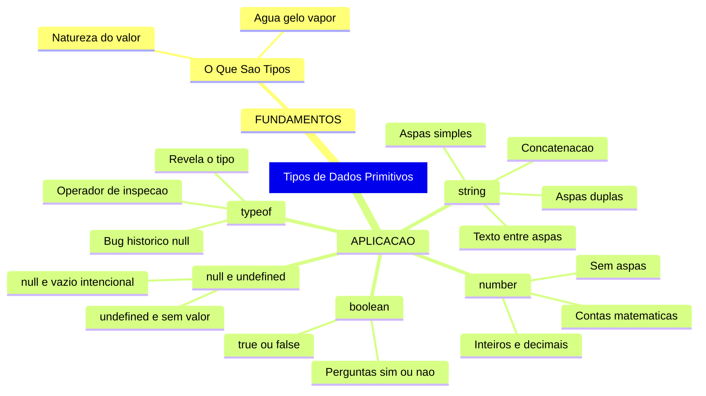
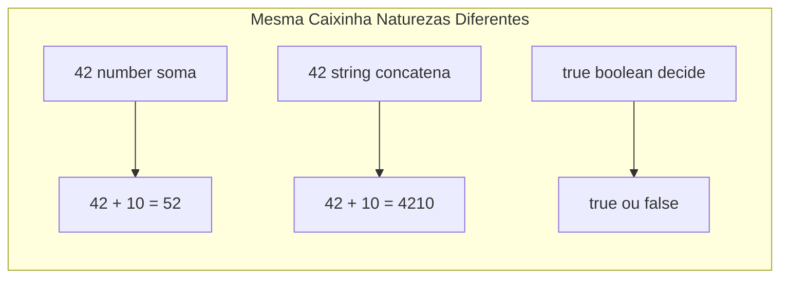
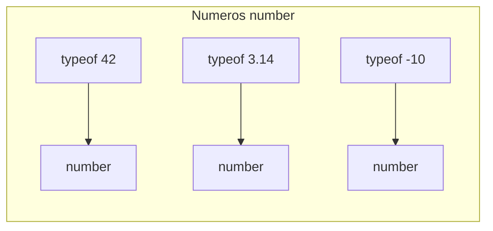
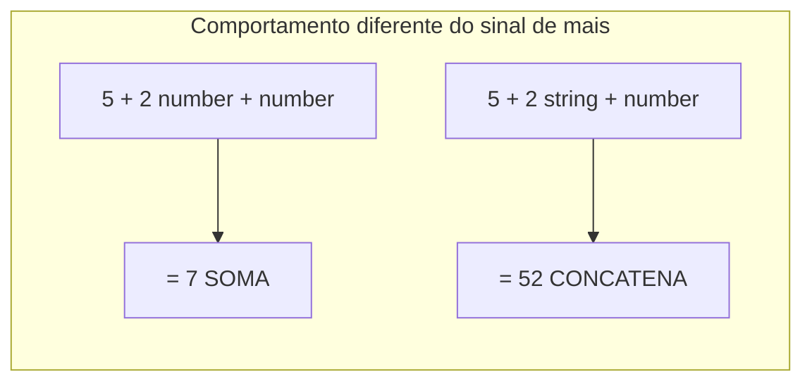
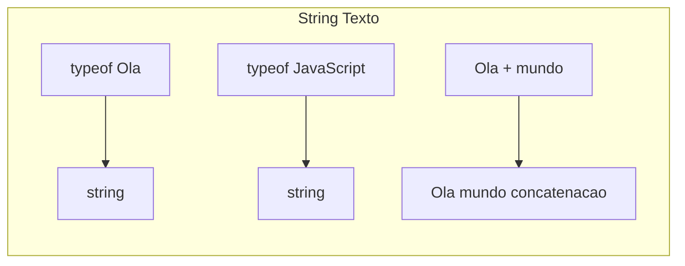
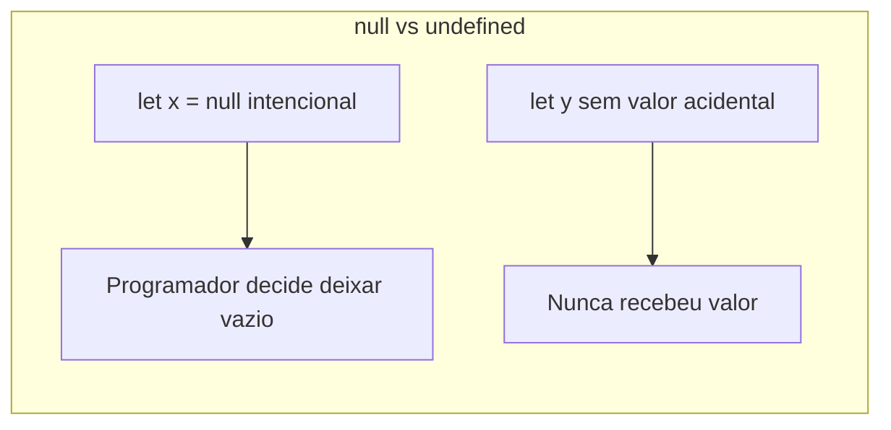

# JavaScript — Do Zero ao Profissional — Aula 03

## Tipos de Dados Primitivos

**Duração estimada:** 90 minutos (50 de leitura + 40 de prática)
**Nível:** Iniciante
**Pré-requisitos:** Aula 01 + Aula 02

---

## Objetivos de Aprendizagem

Ao final desta aula, você será capaz de:

- [ ] **Explicar** o conceito de tipo de dado usando a analogia agua/gelo/vapor com exemplos do cotidiano
- [ ] **Distinguir** visualmente valores number, string e boolean pela aparência (aspas, digitos, true/false)
- [ ] **Usar** o operador typeof para inspecionar o tipo de qualquer valor ou variável
- [ ] **Criar** variáveis do tipo number e verificar com typeof
- [ ] **Criar** variáveis do tipo string com aspas simples e duplas e verificar com typeof
- [ ] **Criar** variáveis do tipo boolean e verificar com typeof
- [ ] **Explicar** por que o operador + se comporta diferente com numbers (soma) e strings (concatenação)
- [ ] **Diferenciar** null (vazio intencional) de undefined (ausência acidental)
- [ ] **Identificar** o bug histórico typeof null retornar object
- [ ] **Aplicar** os tipos corretos às variáveis do Gerenciador de Tarefas

---

## Como Usar Esta Aula

Esta aula está organizada em duas partes que se complementam.

Na **primeira parte** (seção 1), você vai entender o que são tipos de dados. São conceitos universais — valem para qualquer linguagem de programação. A analogia principal é a **água, gelo e vapor**: uma imagem mental que vai te acompanhar em todas as aulas seguintes.

Na **segunda parte** (seções 2 a 6), você vai aprender os tipos primitivos do JavaScript na prática: typeof, number, string, boolean, null e undefined. Cada seção tem prática guiada — edite seu arquivo index.html da Aula 02 (dentro da tag script) e veja os resultados no console do navegador.

Ao longo do caminho, você encontrará seções **Mão na Massa** (para fazer, não só ler) e **Quick Check** (para verificar se entendeu antes de avançar). Ao final, o arquivo separado **Questões de Aprendizagem** traz as tarefas de checkpoint — só avance quando conseguir completá-las por conta própria.

**Tempo estimado:** 50 minutos de leitura + 40 minutos de prática.

---

## Mapa Mental

Este diagrama mostra todos os conceitos que você vai dominar nesta aula:



---

## Recapitulação da Aula 02

| Aula | Conceito | Onde aparece nesta aula | Como se conecta |
|---|---|---|---|
| Aula 02 | **Variáveis (caixinhas)** | Seções 1 a 6 | Cada caixinha agora tem um TIPO. O conteúdo não é só um valor — é um valor de uma natureza específica |
| Aula 02 | **let e const** | Seções 3, 4, 5 e 6 | Usamos let e const para declarar variáveis de diferentes tipos. A escolha let/const é independente do tipo do valor |
| Aula 02 | **Atribuição (=)** | Seções 3, 4, 5 e 6 | Atribuímos valores de diferentes tipos a variáveis. O operador = funciona igual para todos os tipos |
| Aula 02 | **camelCase** | Seções 3, 4, 5 e 6 | Nomes descritivos agora sugerem o tipo: totalDeTarefas (número), tarefaConcluida (booleano) |
| Aula 02 | **index.html com script** | Seções 2 a 6 | Você edita o mesmo arquivo para testar cada tipo. Abra, edite, salve, atualize o navegador |
| Aula 02 | **console.log()** | Seções 2 a 6 | Continua sendo nossa principal ferramenta de inspeção de valores |

---

**FUNDAMENTOS: A Natureza dos Dados — Agua, Gelo e Vapor**

> *Os conceitos desta seção são universais — valem para qualquer linguagem de programação, em qualquer computador. Na segunda parte, você verá como JavaScript implementa cada um deles. Por enquanto, vamos entender o que significa "a natureza de um dado". Sem console, sem sintaxe — só a ideia pura.*

---

## 1. O Que Sao Tipos

Você aprendeu na Aula 02 que variáveis são como caixinhas etiquetadas na memória. Cada caixinha tem um nome (a etiqueta) e guarda um valor (o conteúdo). Mas aqui está o detalhe que transforma tudo: **o conteúdo tem uma natureza**.

Pense na água. A mesma substância H2O pode se apresentar de três formas: líquida (você bebe), sólida (gelo, você coloca no suco) e gasosa (vapor, que você respira). É a mesma molécula, mas três estados com comportamentos completamente diferentes.

Na programação é exatamente a mesma coisa.

**Exemplo 1 — A analogia principal:** 42 (número), "42" (texto) e true (verdadeiro/falso) podem ocupar a mesma "caixinha" variável, mas têm naturezas diferentes. Com 42 você faz contas (42 + 10 = 52). Com "42" você junta textos ("42" + "10" = "4210"). Com true você só tem duas opções — sim ou não. Mesma "caixinha", três comportamentos totalmente diferentes.



**Exemplo 2 — Formulário do dia a dia:** Pense em um formulário de cadastro. O campo "Nome" aceita texto — você escreve "Maria". O campo "Idade" aceita números — você digita 25. O campo "Aceito os termos" tem uma caixinha de marcar — sim ou não. Você nunca escreveria "vinte e cinco" no campo idade se o sistema espera um número. **Tipos são isso: regras do que cabe em cada campo.**

**Exemplo 3 — Seu Gerenciador de Tarefas:** No seu projeto, tarefa1 = "Comprar pão" é um texto. totalDeTarefas = 3 é um número. Se você tentar "fazer conta" com "Comprar pão", o computador não vai entender — assim como você não soma "maçã" + "banana" na feira.

**Por que isso importa:** 3 e "3" parecem a mesma coisa, mas para o computador são completamente diferentes. O número 3 ocupa 8 bytes na memória como um valor binário pronto para contas. Já "3" ocupa espaço como um caractere de texto, igual à letra "A". O computador trata os dois de formas diferentes — e você precisa saber qual é qual.

**Erro como ferramenta — Quando o tipo não corresponde:**

1. **Situação:** Você tenta usar um texto onde um número é esperado para fazer uma conta
2. **Resultado esperado:** O computador não consegue realizar a operação
3. **Moral:** Cada tipo aceita operações específicas. Subtrair texto de número não faz sentido — o computador não sabe como "transformar" uma palavra em uma operação matemática.

### Quick Check 1

**1. Usando a analogia agua/gelo/vapor, explique por que 42 e "42" são diferentes.**
**Resposta:** Agua, gelo e vapor são a mesma substância (H2O) mas com comportamentos diferentes. Da mesma forma, 42 (número) e "42" (string) podem representar o mesmo valor, mas se comportam de forma diferente: 42 + 10 = 52, enquanto "42" + 10 = "4210". O computador trata cada um de acordo com o seu tipo.

**2. O que é um tipo de dado?**
**Resposta:** Tipo de dado é a "natureza" de um valor — define o que você PODE fazer com ele e como o computador o interpreta. Exemplos: número (para contas), texto (para exibir e concatenar), booleano (para decisões sim/não).

---

### Checkpoint Emocional 1 — Você entendeu o conceito mais importante da programação

Respire. Você acabou de entender um conceito que separa quem programa profissionalmente de quem só copia e cola código: **TIPOS**. Toda linguagem de programação tem tipos. O que muda é a sintaxe — a ideia é universal.

Se a analogia agua/gelo/vapor ficou clara, o resto desta aula é aplicar esses conceitos na prática com JavaScript.

---

**APLICAÇÃO: Tipos em JavaScript — typeof, number, string, boolean e os especiais**

> *Agora que você entende o conceito de tipos, vai conhecer o operador typeof e cada tipo primitivo do JavaScript na prática. Abra seu arquivo index.html da Aula 02, adicione os exemplos dentro da tag script, e veja os resultados no console do navegador. Cada exemplo é para ser digitado e testado — não só lido.*

---

## 2. typeof — A Lupa do Programador

A primeira ferramenta que você precisa conhecer em JavaScript é o operador **typeof**.

typeof revela o tipo de qualquer valor. Você escreve typeof na frente do valor que quer inspecionar, e o JavaScript responde com o nome do tipo.

```javascript
typeof 42      // retorna 'number'
typeof "Ola"   // retorna 'string'
typeof true    // retorna 'boolean'
```

**Exemplo 1 — Instrumento de diagnóstico:** Um médico usa um termômetro para saber se o paciente está com febre. O programador usa typeof para saber a natureza de um valor. É o instrumento de diagnóstico universal.

**Exemplo 2 — Abrir a caixinha para ver a etiqueta:** Quando você recebe uma encomenda sem etiqueta, você abre para ver o que tem dentro. typeof é o "abrir a caixinha para ver a etiqueta de tipo".

**Exemplo 3 — No console do navegador:** Abra o console (F12) e digite:
```javascript
typeof 42
typeof "ola"
typeof true
```
O console responde: 'number', 'string', 'boolean'. Experimente agora mesmo.

**Por que typeof existe?** Em programas com centenas de variáveis, dados que vêm de APIs, valores digitados por usuários — você nunca tem certeza do tipo. typeof é seu aliado para confirmar.

**Erro como ferramenta — typeof revela algo inesperado:**

1. **Código:** let nome; console.log(typeof nome);
2. **Resultado:** 'undefined'
3. **Tradução:** A variável nome existe (declarada com let), mas nunca recebeu valor. typeof revela que o conteúdo é undefined.
4. **Moral:** typeof sempre retorna uma string com o nome do tipo. Os valores para tipos primitivos são: 'number', 'string', 'boolean', 'undefined', 'object' (para null).

**Peculiaridade historica — typeof null:**

```javascript
typeof null  // retorna 'object' — não retorna 'null'
```

Isso é um BUG conhecido do JavaScript desde 1995. O criador da linguagem, Brendan Eich, admitiu que foi um erro. Mas corrigir agora quebraria milhões de sites. Convivemos com ele.

**Regra prática:** Para verificar se algo é null, não confie em typeof. Compare diretamente (conceito que você verá em aulas futuras).

### Mão na Massa — Testando typeof no console

Abra o console (F12) e execute cada linha:

```javascript
typeof 42
typeof "JavaScript"
typeof 'ola'
typeof true
typeof undefined
typeof null         // Resultado: 'object'!
typeof typeof 42    // Desafio: qual o tipo do proprio typeof?
```

**Mão na Massa — checklist:**

- [ ] Digitei typeof 42 e vi 'number'
- [ ] Digitei typeof "JavaScript" e vi 'string'
- [ ] Digitei typeof true e vi 'boolean'
- [ ] Digitei typeof null e vi 'object' (o bug historico!)
- [ ] Digitei typeof typeof 42 e vi 'string'

### Quick Check 2

**1. O que o operador typeof retorna? De exemplos para number, string e boolean.**
**Resposta:** typeof retorna uma string com o nome do tipo do valor. Exemplos: typeof 42 retorna 'number', typeof "ola" retorna 'string', typeof true retorna 'boolean'.

**2. Por que typeof null retorna 'object'?**
**Resposta:** E um bug historico do JavaScript desde 1995. O criador da linguagem reconheceu o erro, mas corrigi-lo quebraria milhões de sites.

---

## 3. number — Valores Numericos

O primeiro tipo primitivo do JavaScript é **number**.

Números são escritos **sem aspas**. Representam valores numéricos — inteiros (como 42) e decimais (como 3.14). typeof confirma: 'number'.

```javascript
let idade = 25;         // number
let preco = 4.5;        // number (decimal)
let temperatura = -5;   // number (negativo)
typeof idade;           // 'number'
```

**Exemplo 1 — Sua idade:** let idade = 25. Você faz contas com ela: idade + 5 dá 30.

**Exemplo 2 — Seu dia a dia:** let quantidadeDeCafe = 3. let precoDoCafe = 4.5 também é number. Não existe tipo separado para decimais.

**Exemplo 3 — Gerenciador de Tarefas:** let totalDeTarefas = 3 já é um número no seu projeto.



**Detalhe importante:** Todo número — inteiro ou decimal — é do tipo number. Não existe tipo separado para inteiros.

**Erro como ferramenta — A armadilha das aspas:**

1. **Código:** let quantidade = "5"; let total = quantidade + 2; console.log(total);
2. **Resultado:** "52" (não é 7!)
3. **Explicação:** quantidade é STRING (tem aspas). + com string CONCATENA, não soma.
4. **Correção:** let quantidade = 5; (sem aspas!) — total = quantidade + 2 exibe 7.
5. **Moral:** 5 é number, "5" é string. O operador + se comporta diferente com cada tipo.



### Mão na Massa — numbers em ação

Abra o console e execute:

```javascript
let anoAtual = 2026;
typeof anoAtual;        // 'number'
anoAtual + 1;           // 2027
typeof (anoAtual + 1);  // 'number'

let anoErrado = "2026";
typeof anoErrado;       // 'string'
anoErrado + 1;          // '20261' — concatenacao!
```

**Mão na Massa — checklist:**

- [ ] Declarei let anoAtual = 2026
- [ ] Usei typeof anoAtual e vi 'number'
- [ ] Somei anoAtual + 1 e vi 2027
- [ ] Usei typeof (anoAtual + 1) e vi 'number'
- [ ] Criei let anoErrado = "2026"
- [ ] Vi que typeof anoErrado retorna 'string'
- [ ] Vi que anoErrado + 1 retorna "20261"

### Quick Check 3

**1. Como identificar visualmente que um valor é do tipo number?**
**Resposta:** Valores number são escritos SEM aspas. Exemplos: 42, 3.14, -10, 0.

**2. Por que "5" + 2 resulta em "52" e não em 7?**
**Resposta:** "5" é string (tem aspas). O operador + entre string e número faz CONCATENAÇÃO, não soma. "5" + 2 vira "5" + "2" = "52".

---

## 4. string — Texto Entre Aspas

O segundo tipo primitivo é **string**.

Strings representam texto entre aspas. JavaScript aceita **aspas simples** ('...') e **aspas duplas** ("..."). A regra: abriu com um tipo, feche com o MESMO tipo.

```javascript
let nome = "Maria";   // aspas duplas
let apelido = 'Ana';  // aspas simples
typeof nome;          // 'string'
```

**Exemplo 1 — Sua identidade:** let meuNome = "Maria". Você exibe, concatena, busca — não faz contas.

**Exemplo 2 — Comunicação:** let endereco = "Rua das Flores, 123". Mesmo com números, é string se tiver aspas.

**Exemplo 3 — Gerenciador de Tarefas:** Todas as variáveis de tarefa são strings: tarefa1 = "Comprar pão", statusTarefa1 = "Pendente".



### Aspas simples vs aspas duplas

Para o JavaScript, tanto faz. Seja consistente.

```javascript
let nomeComSimples = 'Maria';
let nomeComDupla = "Joao";
typeof nomeComSimples;  // 'string'
typeof nomeComDupla;    // 'string'
```

### Concatenação com o operador +

Com strings, + **concatena** (junta textos):

```javascript
"Ola, " + "mundo!"  // "Ola, mundo!"
"Java" + "Script"   // "JavaScript"
```

Prova que tipos importam:
- number + number = SOMA (5 + 2 = 7)
- string + string = CONCATENA ("5" + "2" = "52")
- string + number = CONCATENA ("5" + 2 = "52")

**Erro como ferramenta A — Aspas não fechadas:**

1. **Código errado:** let nome = "Maria;
2. **Resultado:** SyntaxError
3. **Correção:** let nome = "Maria"; — feche com a MESMA aspa.
4. **Moral:** Aspas sempre em pares.

**Erro como ferramenta B — Aspas misturadas:**

1. **Funciona:** let frase = 'Ela disse "ola" para mim';
2. **Não funciona:** let frase = "Ela disse "ola" para mim";
3. **Correção:** Use o tipo OPOSTO de aspa para delimitar.
4. **Moral:** Se o texto contém aspas, use o outro tipo para delimitar.

### Mão na Massa — strings no console

```javascript
let nome = "Ana";
let apelido = 'Aninha';
console.log(nome);
console.log(apelido);

let saudacao = "Ola, " + "tudo bem?";
console.log(saudacao);

typeof nome;       // 'string'
typeof saudacao;   // 'string'
```

**Mão na Massa — checklist:**

- [ ] Criei strings com aspas simples e duplas
- [ ] Testei typeof em cada string
- [ ] Concatenei duas strings com +
- [ ] Testei typeof no resultado (ainda e string)
- [ ] Testei aspas duplas dentro de aspas simples (funciona)

### Conexão com o Gerenciador de Tarefas

```javascript
const nomeDoApp = "Gerenciador de Tarefas";
let tarefa1 = "Comprar pao";
let statusTarefa2 = "Em andamento";

console.log(typeof nomeDoApp);     // 'string'
console.log(typeof tarefa1);       // 'string'
console.log(typeof statusTarefa2); // 'string'
```

Você sabia intuitivamente que isso era texto. Agora você SABE com consciência de tipo.

### Quick Check 4

**1. Qual a diferença entre aspas simples e duplas no JavaScript?**
**Resposta:** Nenhuma. 'texto' e "texto" são equivalentes. A regra é: abriu com um tipo, feche com o MESMO tipo.

**2. Como incluir aspas dentro de uma string sem causar erro?**
**Resposta:** Use o tipo OPOSTO de aspa para delimitar. Ex: aspas simples por fora, duplas por dentro: 'Ela disse "ola"'.

---

## 5. boolean, null e undefined

Esta seção junta três tipos especiais que completam os tipos primitivos do JavaScript.

### boolean — Verdadeiro ou Falso

**boolean** tem só dois valores: true (verdadeiro) ou false (falso).

```javascript
let lampadaAcesa = true;
let tarefaConcluida = false;
typeof lampadaAcesa;     // 'boolean'
typeof tarefaConcluida;  // 'boolean'
```

**Exemplo 1 — Decisões:** "O onibus já passou?" — sim (true) ou não (false).

**Exemplo 2 — Interruptor:** Lampada acesa (true) ou apagada (false). Binário.

**Exemplo 3 — Gerenciador:** let tarefa1Concluida = false. Perfeito para rastrear conclusão.

**Atenção:** true e false em minúsculas, sem aspas. True com T maiúsculo gera erro.

### null — O Vazio Intencional

**null** é vazio proposital. O programador diz: "está vazio DE PROPÓSITO".

```javascript
let tarefaSelecionada = null;
typeof null;  // 'object' — bug historico
```

Analogia: copo virado de boca para baixo. Você DECIDIU que está vazio.

### undefined — O Vazio Acidental

**undefined** é o valor padrão de variáveis declaradas sem valor.

```javascript
let proximaTarefa;
console.log(proximaTarefa);  // undefined
typeof proximaTarefa;        // 'undefined'
```

Analogia: copo recém-tirado do armário. Existe, mas ainda não decidiu o que colocar.

### Diferença entre null e undefined

| Situacao | Tipo | Analogia | Intencao |
|---|---|---|---|
| let copo = null | null | Copo virado de proposito | Vazio por vontade propria |
| let copo (sem valor) | undefined | Copo recem-tirado do armario | Ainda nao decidiu |



**Erro como ferramenta — Operar sobre undefined:**

1. **Código:** let tarefa; console.log(tarefa.length);
2. **Resultado:** TypeError
3. **Tradução:** "Não posso ler propriedades de undefined." Caixinha nunca recebeu valor.
4. **Correção:** Atribua um valor antes de usar.
5. **Moral:** undefined não é erro — mas OPERAR sobre undefined gera erro.

### Mão na Massa — boolean, null e undefined

```javascript
let lampadaAcesa = true;
let tarefaConcluida = false;
console.log(typeof lampadaAcesa);    // 'boolean'
console.log(typeof tarefaConcluida); // 'boolean'

let tarefaSelecionada = null;
console.log(tarefaSelecionada);      // null
console.log(typeof tarefaSelecionada); // 'object'

let proximaTarefa;
console.log(proximaTarefa);          // undefined
console.log(typeof proximaTarefa);   // 'undefined'
```

**Mão na Massa — checklist:**

- [ ] Criei variaveis booleanas com true e false
- [ ] Usei typeof e vi 'boolean'
- [ ] Criei let tarefaSelecionada = null
- [ ] Usei typeof null e vi 'object'
- [ ] Criei let proximaTarefa sem valor
- [ ] Usei typeof e vi 'undefined'
- [ ] Entendi: null e intencional, undefined e acidental

### Seu Gerenciador de Tarefas Agora Tem Tipos

Adicione este código no seu index.html, dentro da tag script:

```javascript
const nomeDoApp = "Gerenciador de Tarefas";
console.log(typeof nomeDoApp); // 'string'

let tarefa1 = "Comprar pao";
console.log(typeof tarefa1); // 'string'
let tarefa2 = "Estudar JavaScript";
console.log(typeof tarefa2); // 'string'
let tarefa3 = "Lavar a louca";
console.log(typeof tarefa3); // 'string'

let statusTarefa1 = "Pendente";
console.log(typeof statusTarefa1); // 'string'
let statusTarefa2 = "Em andamento";
console.log(typeof statusTarefa2); // 'string'
let statusTarefa3 = "Pendente";
console.log(typeof statusTarefa3); // 'string'

let totalDeTarefas = 3;
console.log(typeof totalDeTarefas); // 'number'

let tarefa1Concluida = false;
let tarefa2Concluida = false;
let tarefa3Concluida = false;
console.log(typeof tarefa1Concluida); // 'boolean'
console.log(typeof tarefa2Concluida); // 'boolean'
console.log(typeof tarefa3Concluida); // 'boolean'

let tarefaSelecionada = null;
console.log(tarefaSelecionada);      // null
console.log(typeof tarefaSelecionada); // 'object'

let contador;
console.log(contador);      // undefined
console.log(typeof contador); // 'undefined'
```

Agora seu projeto sabe a diferença entre:
- **nome** da tarefa (string)
- **contagem** de tarefas (number)
- **status de conclusão** (boolean)
- valor **intencionalmente vazio** (null)
- valor **ainda não definido** (undefined)

Isso é **modelagem de dados**.

### Quick Check 5

**1. Quais são os dois únicos valores possíveis para o tipo boolean?**
**Resposta:** true (verdadeiro) e false (falso). Em minúsculas, sem aspas.

**2. Qual a diferença prática entre null e undefined?**
**Resposta:** null é vazio INTENCIONAL. undefined é acidental — a variável foi declarada mas nunca recebeu valor. null é copo virado de propósito; undefined é copo do armário ainda não preenchido.

---

### Checkpoint Emocional — Você conhece os tipos primitivos do JavaScript

Você já conhece os tipos primitivos fundamentais: number, string, boolean, null e undefined. Sabe criar, inspecionar com typeof e diagnosticar confusões.

A metáfora agua/gelo/vapor te acompanha: mesma caixinha, naturezas diferentes de valor. typeof é sua lupa.

Antes de avançar, complete o Quiz e os Exercícios abaixo. Depois, faça as Questões de Aprendizagem — só avance quando conseguir tudo sem consultar.

---

## Autoavaliação: Quiz Rápido

Teste seu conhecimento com estas 6 perguntas.

**1. Usando a analogia agua/gelo/vapor, explique por que e importante saber o tipo de um dado.**
**Resposta:** Agua, gelo e vapor são a mesma substância (H2O) mas com comportamentos diferentes. 42, "42" e true têm naturezas diferentes: com number soma, com string concatena, com boolean decide. Saber o tipo evita bugs.

**2. O que typeof retorna para cada tipo primitivo que você aprendeu?**
**Resposta:**
- typeof 42 retorna 'number'
- typeof "texto" retorna 'string'
- typeof true retorna 'boolean'
- typeof undefined retorna 'undefined'
- typeof null retorna 'object' (bug histórico)

**3. Qual a diferença entre 5 + 2 e "5" + 2?**
**Resposta:** 5 + 2 = 7 (soma). "5" + 2 = "52" (concatenação). O operador + se comporta diferente dependendo do tipo.

**4. Escreva duas strings que produzem o mesmo resultado, uma com aspas simples e outra com aspas duplas.**
**Resposta:**
```javascript
let nome1 = "Maria";
let nome2 = 'Maria';
console.log(nome1); // Maria
console.log(nome2); // Maria
```

**5. O que este código exibe?**
```javascript
let tarefa;
console.log(tarefa);
console.log(typeof tarefa);
```
**Resposta:** undefined e 'undefined'. A variável foi declarada mas nunca recebeu valor.

**6. O que há de errado neste código?**
```javascript
let concluido = True;
let contador;
console.log(contador + 1);
```
**Resposta:** True com T maiúsculo — boolean deve ser true. contador + 1 com undefined produz NaN.

---

## Mão na Massa: Exercícios Graduados

**Exercício 1 (Fácil) — Suas Primeiras Variáveis Tipadas**

Crie no console uma variável de cada tipo primitivo e verifique com typeof:

1. Crie let do tipo number com sua idade
2. Crie let do tipo string com seu nome
3. Crie const do tipo boolean (já estudou JavaScript antes?)
4. Use typeof em cada uma e exiba com console.log()

**Gabarito:**

```javascript
let minhaIdade = 25;          // number
let meuNome = "Maria";        // string
const jaEstudeiJS = false;    // boolean

console.log(minhaIdade);           // 25
console.log(typeof minhaIdade);    // 'number'
console.log(meuNome);              // Maria
console.log(typeof meuNome);       // 'string'
console.log(jaEstudeiJS);          // false
console.log(typeof jaEstudeiJS);   // 'boolean'
```

**Exercício 2 (Médio) — A Armadilha do +**

Demonstre a diferença entre + com números e com strings:

1. Declare duas variáveis number e some-as
2. Declare duas variáveis string e concatene-as
3. Declare string "10" + number 5 e mostre o resultado
4. Explique por que cada resultado é diferente

**Gabarito:**

```javascript
let a = 10;
let b = 5;
let soma = a + b;
console.log(a + " + " + b + " = " + soma); // 10 + 5 = 15

let inicio = "Ola, ";
let fim = "mundo!";
let saudacao = inicio + fim;
console.log(saudacao); // Ola, mundo!

let numero = 10;
let texto = "5";
let resultado = numero + texto;
console.log(resultado); // "105" — concatenacao
console.log(typeof resultado); // 'string'
```

**Desafio (Difícil) — Diagnóstico de Tipos**

Identifique e corrija 5 confusões de tipo:

```javascript
let quantidade = "10";
let total = quantidade + 5;
console.log(total);

let nome = 'Carlos;
console.log(nome);

let concluido = True;
console.log(concluido);

let tarefa;
console.log(tarefa.length);

let vazio = null;
console.log(typeof vazio);
```

**Gabarito:**

```javascript
// Problema 1: quantidade e string, nao number
let quantidade = 10;
let total = quantidade + 5;
console.log(total); // 15

// Problema 2: Aspas nao fechadas
let nome = 'Carlos';
console.log(nome); // Carlos

// Problema 3: True com T maiusculo
let concluido = true;
console.log(concluido); // true

// Problema 4: tarefa e undefined, sem length
let tarefa = "Estudar";
console.log(tarefa.length); // 7

// Problema 5: typeof null retorna 'object'
let vazio = null;
console.log(typeof vazio); // 'object' (comportamento esperado)
```

---

## Resumo da Aula

### Os 5 Conceitos Fundamentais

1. **Tipos de dados** são a "natureza" de um valor. Analogia: agua, gelo e vapor (mesma substância, comportamentos diferentes).
2. **typeof** é a lupa do programador — revela o tipo de qualquer valor ou variável.
3. **number** — valores numéricos (sem aspas). Operações matemáticas.
4. **string** — texto entre aspas. Concatena com +. O mesmo + se comporta diferente com numbers (soma) e strings (concatenação).
5. **boolean, null, undefined** — boolean (true/false), null (vazio intencional), undefined (ausência acidental de valor).

### O Que Você Construiu Hoje

- [x] Entendi o conceito de tipo de dado com a analogia agua/gelo/vapor
- [x] Usei typeof para inspecionar o tipo de valores e variaveis
- [x] Criei variaveis do tipo number, string e boolean
- [x] Entendi a diferenca entre 5 (number) e "5" (string)
- [x] Vi como o operador + muda com tipos diferentes
- [x] Aprendi a usar aspas simples e duplas em strings
- [x] Entendi a diferenca entre null e undefined
- [x] Descobri o bug historico: typeof null retorna 'object'
- [x] Diagnostiquei confusoes de tipo com typeof
- [x] Adicionei variaveis booleanas ao Gerenciador de Tarefas

---

## Próxima Aula

**Operadores — Aritmética, Comparação e Lógica**

Agora que você sabe que number é para contas, string é para texto e boolean é para decisões, a próxima aula expande o que você pode fazer com cada tipo. Os operadores aritméticos vão além de + e -. Os booleanos vão brilhar com operadores lógicos.

Prepare-se: seu Gerenciador de Tarefas vai ganhar comparações e decisões.

---

## Referências

### Documentação Oficial

- [MDN: Grammar and types](https://developer.mozilla.org/en-US/docs/Web/JavaScript/Guide/Grammar_and_types)
- [MDN: typeof](https://developer.mozilla.org/en-US/docs/Web/JavaScript/Reference/Operators/typeof)
- [MDN: null](https://developer.mozilla.org/en-US/docs/Web/JavaScript/Reference/Operators/null)
- [MDN: undefined](https://developer.mozilla.org/en-US/docs/Web/JavaScript/Reference/Global_Objects/undefined)

### Tutoriais e Guias

- [JavaScript.info: Types](https://javascript.info/types)
- [JavaScript.info: Numbers](https://javascript.info/number)
- [JavaScript.info: Strings](https://javascript.info/string)

---

## FAQ

**P: Por que typeof null retorna 'object' se null não é um objeto?**
R: Bug histórico do JavaScript desde 1995. Corrigir quebraria milhões de sites.

**P: Posso misturar tipos em uma mesma variável?**
R: Sim. JavaScript é de tipagem dinâmica. Use typeof para confirmar o tipo atual.

**P: Qual a diferença entre undefined e "não declarado"?**
R: undefined = variável existe sem valor. Não declarado = variável nunca foi criada (ReferenceError).

**P: typeof é uma função?**
R: Não, é um OPERADOR. typeof 42 funciona sem parênteses.

**P: Existe diferença entre número inteiro e decimal no JavaScript?**
R: Não. Tudo é number.

**P: Posso usar True com T maiúsculo?**
R: Não. Gera ReferenceError. Sempre true e false em minúsculas.

**P: Por que "5" - 2 funciona (dá 3) mas "5" + 2 não (dá "52")?**
R: + é ambíguo (soma ou concatena), então JS prefere concatenação com string. - só tem um significado (subtração), então JS converte a string. Coerção implícita.

**P: typeof NaN retorna 'number'?**
R: Sim. NaN (Not a Number) é um resultado numérico inválido. Por ser uma operação que deveria produzir número, seu tipo é 'number'.

---

## Glossário

| Termo | Definicao |
|---|---|
| **Tipo de dado** | Natureza de um valor que determina o que fazer com ele (Ver secao 1) |
| **Tipo primitivo** | Tipo fundamental, nao composto por outros tipos (Ver secoes 3-5) |
| **number** | Valores numericos sem aspas (Ver secao 3) |
| **string** | Texto entre aspas simples ou duplas (Ver secao 4) |
| **boolean** | Tipo logico: true ou false (Ver secao 5) |
| **null** | Vazio intencional (Ver secao 5) |
| **undefined** | Ausencia acidental de valor (Ver secao 5) |
| **typeof** | Operador que revela o tipo de um valor (Ver secao 2) |
| **Concatenacao** | Juntar duas strings com + (Ver secao 4) |
| **NaN** | Not a Number — resultado invalido de operacao numerica (Ver secao 1) |
| **Bug historico** | Erro nao corrigido para manter compatibilidade. Ex: typeof null (Ver secao 2) |

