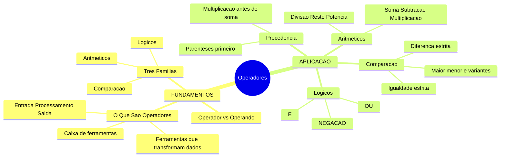
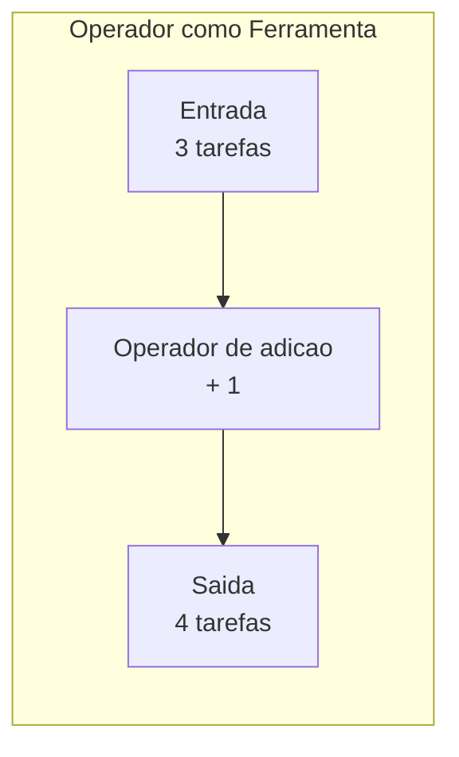
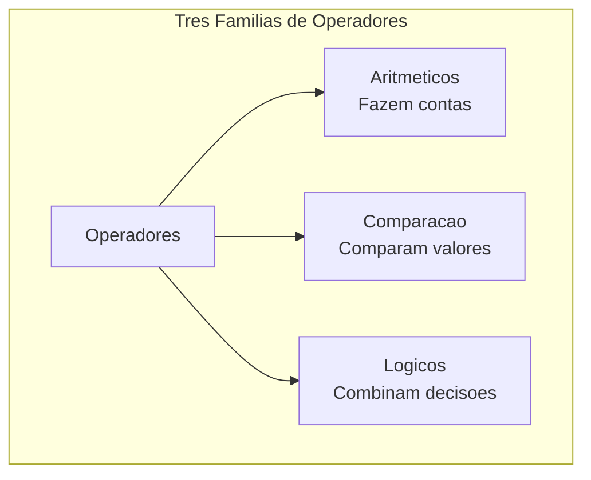
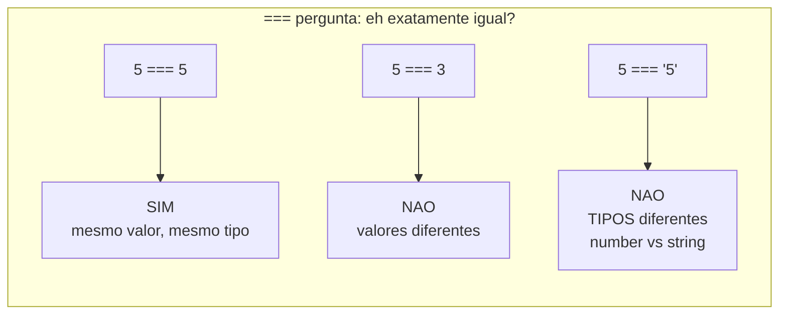
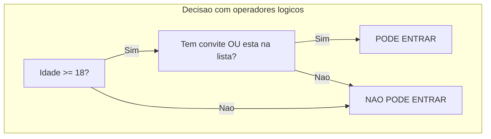

# JavaScript — Do Zero ao Profissional — Aula 04

## Operadores — Aritmética, Comparação e Lógica

**Duração estimada:** 110 minutos (60 de leitura + 50 de prática)
**Nível:** Iniciante
**Pré-requisitos:** Aula 01 (console.log, console do navegador) + Aula 02 (let, const, atribuição, reatribuição) + Aula 03 (number, string, boolean, typeof, null, undefined)

---

## Objetivos de Aprendizagem

Ao final desta aula, você será capaz de:

- [ ] **Explicar** o conceito de operador usando a analogia da caixa de ferramentas, identificando pelo menos 3 famílias de operadores e o tipo de trabalho que cada uma faz
- [ ] **Usar** os 6 operadores aritméticos (`+`, `-`, `*`, `/`, `%`, `**`) para realizar cálculos com números
- [ ] **Diferenciar** o operador de atribuição (`=`) do operador de comparação (`===`), explicando que um GUARDA valor e o outro COMPARA valores
- [ ] **Usar** `===` e `!==` para comparar valores, reconhecendo por que `===` é preferível ao `==`
- [ ] **Usar** os operadores relacionais (`>`, `<`, `>=`, `<=`) para comparar números e strings
- [ ] **Usar** os operadores lógicos (`&&`, `||`, `!`) para combinar condições, distinguindo-os de `&` e `|` (operadores bitwise)
- [ ] **Prever** o resultado de expressões combinadas aplicando a regra de precedência (parênteses primeiro)
- [ ] **Explicar** o comportamento do `+` com números (soma) vs strings (concatenação) e alertar sobre a coerção em `"5" - 2`
- [ ] **Identificar e corrigir** confusões comuns: `=` em vez de `===`, `&` em vez de `&&`, esquecimento de parênteses
- [ ] **Aplicar** operadores de comparação e lógicos nas variáveis do Gerenciador de Tarefas para verificar status e combinar condições

---

## Como Usar Esta Aula

Esta aula está organizada em duas partes que se complementam.

Na **primeira parte** (seções 1 e 2), você vai entender o conceito de operador como "ferramenta que transforma dados". São conceitos universais — valem para qualquer linguagem de programação. A analogia principal é a **caixa de ferramentas**: cada ferramenta serve para um tipo de trabalho específico. Sem JavaScript ainda.

Na **segunda parte** (seções 3 a 7), você vai aprender as três famílias de operadores do JavaScript: aritméticos (para contas), comparação (para comparar valores) e lógicos (para combinar decisões). Cada família tem prática guiada no console do navegador.

Na **seção 7**, você vai aplicar os operadores aprendidos ao Gerenciador de Tarefas — seu projeto progressivo.

Cada seção termina com um **Quick Check**. As respostas estão logo abaixo. Tente responder de cabeça antes de olhar.

> *"Operadores são as ferramentas que transformam dados. Sem operadores, seus dados são apenas valores parados — com operadores, eles ganham vida, se transformam, se comparam e geram novos resultados."*

---

## Mapa Mental



---

## Recapitulação das Aulas 01, 02 e 03

| Aula | Conceito | Onde aparece nesta aula | Como se conecta |
|---|---|---|---|
| Aula 01 | **console.log()** | Seções 3, 4, 5, 6 e 7 | Usamos console.log() para ver resultados de operações |
| Aula 01 | **Console do navegador** | Todas as seções | Todo exemplo é executado no console |
| Aula 01 | **Fluxo E-P-S** | Seções 1 e 3 | Operadores são o PROCESSAMENTO — transformam dados |
| Aula 02 | **Variáveis (caixinhas)** | Todas as seções | Operadores usam valores DENTRO das caixinhas |
| Aula 02 | **Operador =** (atribuição) | Seções 2, 3, 4 | `=` GUARDA um valor. Os novos operadores fazem coisas diferentes |
| Aula 03 | **number, string, boolean** | Seções 3, 4, 5, 6 e 7 | Cada família opera com tipos específicos |
| Aula 03 | **typeof** | Seções 3 e 4 | typeof revela o tipo do RESULTADO de uma expressão |
| Aula 03 | **"5" + 2 vs "5" - 2** | Seção 3 (alerta) | O + concatena com string. O - tenta converter |

---

**FUNDAMENTOS: Operadores — As Ferramentas que Transformam Dados**

> *Os conceitos desta seção são universais — valem para qualquer linguagem de programação, em qualquer computador. Na segunda parte, você verá como JavaScript materializa cada família de operadores. Por enquanto, só a ideia pura — sem JavaScript, sem console.*

---

## 1. O Que São Operadores? — A Caixa de Ferramentas

Você aprendeu até agora que variáveis guardam dados (Aula 02) e que esses dados têm naturezas diferentes (Aula 03). Mas dados GUARDADOS não fazem nada sozinhos. Eles são como ingredientes na despensa — você precisa de ferramentas para transformá-los em algo útil.

**Operadores são essas ferramentas.** Cada operador pega um ou mais valores (chamados de **operandos**), faz alguma transformação, e produz um novo valor.

**Exemplo 1 — Âncora (a analogia que você nunca vai esquecer):** Imagine uma caixa de ferramentas. Cada ferramenta serve para um tipo de trabalho: martelo para pregar, chave de fenda para apertar parafusos, serra para cortar. Na programação é a mesma coisa: cada operador é uma ferramenta projetada para um tipo específico de trabalho com dados.

| Operador | O que faz |
|---|---|
| Símbolo de adição (`+`) | Soma (juntar números) |
| Símbolo de subtração (`-`) | Subtração (diferença) |
| Símbolo de multiplicação (`*`) | Multiplicação |
| Símbolo de igualdade tripla | Igualdade (é exatamente igual?) |
| Símbolo de maior que (`>`) | Maior que (é maior?) |
| Símbolo de E comercial duplo | E lógico (os dois?) |

Você não usa um martelo para apertar um parafuso — você escolhe a ferramenta certa para o trabalho. Com operadores é exatamente a mesma coisa.

**Exemplo 2 — Espelho (seu dia a dia):** Pense em uma calculadora. Você digita `5`, aperta o botão de adição, digita `3`, aperta o de igualdade, e a calculadora mostra `8`. O botão de adição é o operador, `5` e `3` são os operandos (os valores de entrada), e `8` é o resultado. A calculadora executa a operação — o computador faz o mesmo.

**Exemplo 3 — Ponte (seu Gerenciador de Tarefas):** Você tem `totalDeTarefas = 3` e adiciona mais uma tarefa. Para atualizar o total, você precisa do operador de adição: `totalDeTarefas = totalDeTarefas + 1`. Ele transforma o valor antigo (3) em um valor novo (4). Sem operadores, seus dados ficam congelados para sempre.



> *Você pode estar pensando: "Mas eu já usei operadores na Aula 02 — o sinal de igual!" Sim! O `=` é um operador — o **operador de atribuição**. Ele pega o valor à direita e GUARDA na caixinha à esquerda. A diferença é que na Aula 02 você aprendeu a GUARDAR dados. Nesta aula, você vai aprender a TRANSFORMAR dados.*

### O que um operador NÃO é

Muita gente confunde **operador** com **função** ou **comando**. A diferença é simples:

- Um operador é um símbolo que produz um valor NOVO a partir de valores existentes
- Exibir uma mensagem na tela é feito com uma função (você aprenderá em detalhes em aulas futuras), não um operador
- `let` é uma palavra-chave para declarar variáveis, não é um operador

Operadores SEMPRE produzem um novo valor como resultado.

### Quick Check 1

**1. O que é um operador? Use a analogia da caixa de ferramentas.**
**Resposta:** Um operador é como uma ferramenta em uma caixa de ferramentas — cada operador pega um ou mais valores (operandos), aplica uma transformação específica e produz um novo valor. Assim como você não usa martelo para apertar parafuso, cada operador serve para um tipo de trabalho com dados.

**2. Qual a diferença entre operador e operando?**
**Resposta:** Operador é a FERRAMENTA (o símbolo, como o de adição, o de subtração, o de igualdade tripla). Operandos são os VALORES que a ferramenta processa (ex: em uma expressão com 5, adição e 3, `5` e `3` são operandos, o de adição é o operador).

**3. O que um operador SEMPRE produz?**
**Resposta:** Um novo valor. Operadores não "fazem algo acontecer na tela" — eles transformam dados em outros dados.

---

## 2. As Três Famílias de Operadores — Visão Conceitual

Agora que você entende o conceito de operador como ferramenta, vamos conhecer as três famílias que existem em praticamente toda linguagem de programação. Cada família resolve um tipo diferente de problema.

| Família | Pergunta que responde | Analogia | O que produz |
|---|---|---|---|
| **Aritméticos** | "Quanto dá?" | Calculadora | Números |
| **Comparação** | "É igual? É maior?" | Porteiro de balada | Verdadeiro ou Falso |
| **Lógicos** | "As duas condições são verdade?" | Regras combinadas | Verdadeiro ou Falso |

**Operadores aritméticos** fazem contas com números. Eles pegam números como entrada e produzem números como saída. São as operações matemáticas que você conhece desde a escola: adicionar, subtrair, multiplicar, dividir, calcular resto e potência.

**Operadores de comparação** comparam dois valores e produzem uma resposta do tipo SIM ou NÃO. Eles respondem perguntas como "este número é maior que aquele?", "estes dois valores são iguais?". A resposta é sempre um valor verdadeiro/falso.

**Operadores lógicos** combinam respostas SIM/NÃO para formar decisões mais complexas. Eles respondem perguntas como "as duas condições são verdade?" (E lógico) ou "pelo menos uma é verdade?" (OU lógico).



**Exemplo — Ponte (seu Gerenciador de Tarefas):** Você quer saber quais tarefas mostrar na tela. Primeiro você usa comparação: um comparador de igualdade pergunta "esta tarefa está concluída?". Depois usa lógicos: um operador "ou" pergunta "está concluída OU cancelada?". Os operadores são os blocos que constroem a lógica do seu programa.

### Quick Check 2

**1. Quais são as três famílias de operadores e o que cada uma faz?**
**Resposta:** Aritméticos (fazem contas com números), Comparação (comparam valores e produzem verdadeiro/falso), Lógicos (combinam decisões verdadeiro/falso).

**2. Que tipo de valor um operador de comparação sempre produz?**
**Resposta:** Um valor booleano — verdadeiro (`true`) ou falso (`false`). Ele responde uma pergunta do tipo SIM/NÃO.

**3. Qual a diferença entre um operador aritmético e um operador lógico?**
**Resposta:** Operadores aritméticos trabalham com números e produzem números. Operadores lógicos trabalham com valores verdadeiro/falso e produzem valores verdadeiro/falso. São ferramentas para tipos diferentes de dados.

---

**APLICAÇÃO: As Três Famílias em JavaScript**

> *Agora que você entende o conceito de operadores como ferramentas, vai aprender a sintaxe concreta em JavaScript. Abra seu console do navegador (F12) — cada operador é para ser testado, não só lido.*

---

## 3. Operadores Aritméticos — Fazendo Contas no JavaScript

A primeira ferramenta que você vai usar no JavaScript são os **operadores aritméticos**. Eles trabalham com números e produzem números. São seis:

| Operador | Nome | O que faz | Exemplo | Resultado |
|---|---|---|---|---|
| `+` | Adição | Soma dois números | `10 + 3` | `13` |
| `-` | Subtração | Subtrai o segundo do primeiro | `10 - 3` | `7` |
| `*` | Multiplicação | Multiplica dois números | `10 * 3` | `30` |
| `/` | Divisão | Divide o primeiro pelo segundo | `10 / 3` | `3.333...` |
| `%` | Resto (módulo) | Resto da divisão inteira | `10 % 3` | `1` |
| `**` | Potenciação | Eleva à potência | `10 ** 3` | `1000` |

> *Observação: O asterisco `*` é o símbolo de multiplicação — não é o `x` da escola. O computador usa `*` porque `x` pode ser confundido com a letra. `**` são dois asteriscos seguidos para potenciação.*

### Mão na Massa — Primeiros operadores no console

Abra o console (F12) e digite cada linha. Veja o resultado antes de ler a explicação:

```javascript
// Soma
10 + 3

// Subtração
10 - 3

// Multiplicação
10 * 3

// Divisão
10 / 3

// Resto (módulo)
10 % 3

// Potenciação
10 ** 3
```

**Mão na Massa — checklist:**

- [ ] Digitei `10 + 3` e vi `13`
- [ ] Digitei `10 - 3` e vi `7`
- [ ] Digitei `10 * 3` e vi `30`
- [ ] Digitei `10 / 3` e vi `3.3333333333333335`
- [ ] Digitei `10 % 3` e vi `1`
- [ ] Digitei `10 ** 3` e vi `1000`

> *Note que a divisão `10 / 3` produziu `3.3333333333333335` — não `3.333...` exato. Isso acontece porque computadores têm precisão limitada para números decimais. É normal.*

### Operando com variáveis

Operadores funcionam com valores diretos E com variáveis. O computador primeiro PEGA o valor dentro da caixinha, depois aplica o operador:

```javascript
let a = 10;
let b = 3;

a + b;  // 13  (a vale 10, b vale 3)
a - b;  // 7
a * b;  // 30
a / b;  // 3.333...
a % b;  // 1
a ** b; // 1000
```

**Mão na Massa — operadores com variáveis:**

```javascript
let horasEstudoPorDia = 2;
let diasPorSemana = 5;

horasEstudoPorDia * diasPorSemana;  // 10 horas por semana
```

### Os usos práticos de % (resto)

O operador `%` (resto da divisão) parece estranho no começo, mas é extremamente útil:

- Saber se um número é par: se `numero % 2` der 0, o número é par
- Distribuir tarefas em grupos: `indice % numeroDeGrupos`
- Ciclos e repetições: se `contador % 5` der 0, passaram-se exatamente 5 iterações

```javascript
// Testando no console
17 % 2;  // 1 (ímpar — sobra 1)
20 % 2;  // 0 (par — não sobra nada)
15 % 4;  // 3 (15 dividido por 4 = 3, resta 3)
```

### Alerta: Divisão por zero

```javascript
10 / 0;  // Infinity
```

No JavaScript, dividir por zero não dá erro — produz `Infinity`. É um valor especial que representa "infinito".

### Alerta: String + Number (o alerta da Aula 03)

Lembra da Aula 03? `"5" + 2` produz `"52"`, não `7`. Isso porque `+` com string CONCATENA.

```javascript
"5" + 2;   // "52"
5 + "2";   // "52"
"5" - 2;   // 3  — surpresa! O - força conversão
```

O comportamento do `-` é diferente: como `-` SÓ serve para subtração (não tem significado alternativo), o JavaScript TENTA converter a string para número. É a **coerção implícita**.

**Regra prática:** SEMPRE use números de verdade para fazer contas. Se você tiver uma string que parece número, converta explicitamente. Confiar na coerção implícita leva a bugs difíceis de encontrar.

```javascript
// O que fazer vs o que NÃO fazer:
let entradaDoUsuario = "5";  // Vem de um formulário (sempre string)
let total = entradaDoUsuario + 2;     // "52" — ERRO!
let totalCorreto = 5 + 2;             // 7 — CERTO
```

### Alerta: Confundir = com comparação

O operador `=` (atribuição) GUARDA um valor. Este é um dos erros MAIS comuns de iniciantes:

```javascript
let x = 5;   // CERTO: atribuição — guarda 5 na caixinha x
```

Se você quisesse PERGUNTAR se x é igual a 5, você usaria outro operador (que verá na seção 4). Usar `=` onde deveria usar o operador de comparação é a fonte mais comum de bugs silenciosos.

### Quick Check 3

**1. Quais são os 6 operadores aritméticos do JavaScript? O que cada um faz?**
**Resposta:** `+` (adição), `-` (subtração), `*` (multiplicação), `/` (divisão), `%` (resto/módulo), `**` (potenciação). Exemplos: `10 + 3 = 13`, `10 % 3 = 1`, `10 ** 3 = 1000`.

**2. Explique o resultado de "5" + 2 e "5" - 2. Por que são diferentes?**
**Resposta:** `"5" + 2` produz `"52"` porque `+` com string faz CONCATENAÇÃO. `"5" - 2` produz `3` porque `-` SÓ serve para subtração, então o JavaScript força a conversão (coerção implícita). Sempre use números de verdade para contas.

**3. O que `17 % 5` retorna? E `20 % 2`?**
**Resposta:** `17 % 5` retorna `2` (17 dividido por 5 = 3, resto 2). `20 % 2` retorna `0` (20 é par, resto zero).

---

## 4. Operadores de Comparação — Ferramentas para Comparar

A segunda gaveta da sua caixa de ferramentas contém os **operadores de comparação**. Eles comparam dois valores e SEMPRE produzem um resultado booleano: `true` (verdadeiro) ou `false` (falso).

Se os operadores aritméticos respondem "quanto?", os operadores de comparação respondem "é igual?", "é maior?", "é diferente?".

| Operador | Nome | Pergunta que responde | Exemplo | Resultado |
|---|---|---|---|---|
| `===` | Igualdade estrita | É exatamente igual? | `5 === 5` | `true` |
| `!==` | Diferença estrita | É diferente? | `5 !== 3` | `true` |
| `>` | Maior que | É maior? | `5 > 3` | `true` |
| `<` | Menor que | É menor? | `5 < 3` | `false` |
| `>=` | Maior ou igual | É maior ou igual? | `5 >= 5` | `true` |
| `<=` | Menor ou igual | É menor ou igual? | `5 <= 3` | `false` |

**Exemplo 1 — Âncora (o porteiro da balada):** Imagine um porteiro na entrada de uma festa. Ele verifica: "Sua idade é maior ou igual a 18?" Se `true`, você entra. Se `false`, você não entra. O porteiro é um operador de comparação vivo.

**Exemplo 2 — Espelho (seu dia a dia):** Promoção "Leve 3, pague 2". "A quantidade de itens no meu carrinho é maior ou igual a 3?" Se `true`, desconto. Se `false`, compra mais um.

**Exemplo 3 — Ponte (seu Gerenciador de Tarefas):** `statusTarefa1 === "Concluida"` — você compara o status de uma tarefa para saber se pode removê-la. `tarefas.length > 0` — tem tarefas para mostrar?

### O HERÓI DA AULA: === (igualdade estrita)

`===` é o operador mais importante que você vai aprender hoje. E provavelmente o que você mais vai usar na sua vida de programadora. Preste MUITA atenção.

**`===` pergunta: "Estes dois valores são exatamente iguais, inclusive no tipo?"**

```javascript
5 === 5;     // true  — mesmo número
5 === 3;     // false — números diferentes
5 === "5";   // false — TIPOS diferentes (number vs string)
```

Veja a última linha: `5 === "5"` é `false`. Por quê? Porque um é número e o outro é string. `===` é ESTRITO — ele não faz conversão de tipo.



### Por que === e não ==?

JavaScript tem DOIS operadores de igualdade: `===` (estrito) e `==` (abstrato).

- `==` tenta converter os tipos antes de comparar (coerção)
- `===` NÃO tenta converter — exige mesmíssimo valor e mesmíssimo tipo

```javascript
5 == "5";    // true  — == CONVERTE a string para número
5 === "5";   // false — === NÃO converte, tipos diferentes
0 == false;  // true  — == converte 0 em false
0 === false; // false — tipos diferentes
"" == false; // true  — == converte... é confuso
"" === false;// false — === é direto
```

**A regra de ouro que você vai usar PARA SEMPRE: USE `===` SEMPRE. NUNCA USE `==`.**

Por quê? Porque `==` tem regras de conversão esquisitas que geram bugs. `===` é previsível: ou é igual (mesmo valor + mesmo tipo) ou não é.

> *Todo programador profissional JavaScript usa `===`. O `==` é considerado problemático. Use `===` — é mais seguro, mais previsível e mais fácil de entender.*

### !== (diferença estrita)

Se `===` pergunta "é igual?", `!==` pergunta "é DIFERENTE?". É o inverso exato.

```javascript
5 !== 3;    // true  — 5 é diferente de 3
5 !== 5;    // false — 5 NÃO é diferente de 5
5 !== "5";  // true  — tipos diferentes, então são diferentes
```

### Maior, menor e variantes

```javascript
10 > 5;     // true  — 10 é maior que 5
5 > 10;     // false — 5 não é maior que 10
5 < 10;     // true  — 5 é menor que 10
10 <= 10;   // true  — 10 é menor ou IGUAL a 10
10 >= 11;   // false — 10 não é maior ou igual a 11
```

> *Dica: a "boca" do símbolo aponta para o valor MAIOR. `10 > 5` — a abertura está virada para o 10. `5 < 10` — a ponta aponta para o 5. É como a boca de um jacaré faminto — ele sempre come o maior número.*

### Comparando strings

Operadores relacionais também funcionam com strings. O JavaScript compara caractere por caractere usando a ordem alfabética:

```javascript
"a" < "b";      // true  — 'a' vem antes de 'b'
"abc" < "abd";  // true  — 'c' vem antes de 'd'
"Ana" < "Joao"; // true  — 'A' vem antes de 'J'
```

Mas cuidado com maiúsculas vs minúsculas:

```javascript
"a" < "B";  // false — na tabela Unicode, maiúsculas vêm ANTES de minúsculas
```

Isso pode parecer estranho. Você aprenderá métodos próprios para comparar strings em aulas futuras.

### Mão na Massa — comparações no console

```javascript
// Igualdade e diferença estrita
5 === 5;    // true
5 === "5";  // false — TIPOS diferentes!
5 !== 3;    // true
"abc" === "abc"; // true
"abc" === "ABC"; // false — maiúscula vs minúscula

// Relacionais
10 > 5;     // true
3 < 1;      // false
7 >= 7;     // true
8 <= 5;     // false

// Com variáveis
let idadeMinima = 18;
let idadeUsuario = 20;
idadeUsuario >= idadeMinima;  // true — pode entrar!
```

### Erro comum: = em vez de ===

```javascript
// ERRADO (quando a intenção é comparar):
let x = 5;
x = 10;     // Isso REATRIBUI, não compara!

// CERTO:
x === 10;   // Isso COMPARA — retorna true ou false
```

- `=` é o operador de ATRIBUIÇÃO: "guarde este valor na caixinha"
- `===` é o operador de IGUALDADE: "este valor é igual àquele?"

### Erro comum: esquecer que === compara TIPO também

```javascript
0 === false;    // false — tipos diferentes
"" === false;   // false — tipos diferentes
1 === true;     // false — tipos diferentes
```

### Quick Check 4

**1. Qual a diferença entre = e ===?**
**Resposta:** `=` é ATRIBUIÇÃO — guarda um valor na variável (ex: `let x = 5`). `===` é IGUALDADE ESTRITA — compara dois valores e retorna `true` se forem exatamente iguais em valor E tipo.

**2. Por que 5 === "5" retorna false?**
**Resposta:** Porque `===` compara valor E tipo. `5` é number, `"5"` é string. Tipos diferentes → `false`. Por isso `===` é mais seguro que `==` — sem conversão automática.

**3. O que 10 >= 10 retorna? E 10 > 10?**
**Resposta:** `10 >= 10` retorna `true` (10 é maior OU igual a 10). `10 > 10` retorna `false` (10 NÃO é maior que 10).

---

## 5. Operadores Lógicos — Ferramentas para Combinar Decisões

A terceira gaveta contém os **operadores lógicos**. Trabalham com valores booleanos (`true`/`false`) e produzem novos booleanos.

São três ferramentas:

| Operador | Nome | O que faz | Exemplo | Resultado |
|---|---|---|---|---|
| `&&` | AND (E) | Retorna true se AMBOS forem true | `true && true` | `true` |
| `||` | OR (OU) | Retorna true se PELO MENOS UM for true | `true || false` | `true` |
| `!` | NOT (NÃO) | INVERTE o valor | `!true` | `false` |

**Exemplo 1 — Âncora (as regras da vida real):**

- **E (&&):** "Você só entra se tiver DINHEIRO E DOCUMENTO." Ambas as condições precisam ser true.
- **OU (||):** "Você pode pagar com DINHEIRO OU CARTÃO." Pelo menos uma condição precisa ser true.
- **NÃO (!):** "NÃO pode entrar de chinelos." Inverte a regra.

**Exemplo 2 — Ponte (seu Gerenciador de Tarefas):**

```javascript
// E lógico: mostrar tarefa se estiver PENDENTE E for URGENTE
status === "Pendente" && prioridade === "Urgente"

// OU lógico: esconder tarefa se estiver CONCLUÍDA OU CANCELADA
status === "Concluida" || status === "Cancelada"

// NÃO lógico: mostrar tarefas que NÃO estão concluídas
!tarefaConcluida
```

### Tabela verdade do && (E)

| A | B | A && B |
|---|---|---|
| true | true | **true** |
| true | false | false |
| false | true | false |
| false | false | false |

> *Regra: "E" é exigente — só fica feliz se TODO MUNDO estiver feliz.*

```javascript
(10 > 5) && (3 < 7);    // true && true → true
(10 > 5) && (3 > 7);    // true && false → false
```

### Tabela verdade do || (OU)

| A | B | A \|\| B |
|---|---|---|
| true | true | **true** |
| true | false | true |
| false | true | true |
| false | false | **false** |

> *Regra: "OU" é tranquilo — fica feliz se PELO MENOS UM estiver feliz.*

```javascript
(10 > 5) || (3 < 7);    // true || true → true
(10 > 5) || (3 > 7);    // true || false → true
(10 < 5) || (3 < 7);    // false || true → true
(10 < 5) || (3 > 7);    // false || false → false
```

### Tabela verdade do ! (NÃO)

| A | !A |
|---|---|
| true | false |
| false | true |

```javascript
!true;   // false
!false;  // true
!(10 > 5);  // !true → false
```

### Mão na Massa — operadores lógicos no console

```javascript
// E (&&)
true && true;     // true
true && false;    // false
(10 > 5) && (3 < 7);  // true

// OU (||)
true || false;    // true
false || false;   // false
(10 > 5) || (3 > 7);  // true

// NÃO (!)
!true;            // false
!false;           // true
!(10 === 5);      // true
```

### Combinando operadores lógicos

O poder real aparece quando você COMBINA os operadores:

```javascript
// Situação: entrada em uma festa
let idade = 20;
let temConvite = true;
let estaNaLista = false;

// Para entrar: precisa ter 18+ E (convite OU estar na lista)
(idade >= 18) && (temConvite || estaNaLista);
// true && (true || false)
// true && true
// true — PODE ENTRAR!
```



### Erro comum: && vs &, || vs |

JavaScript tem operadores `&` e `|` (um único caractere). Eles são operadores **bitwise** — operam nos BITS dos números, não na lógica true/false.

```javascript
true && true;   // true — lógico
true & true;    // 1 — bitwise (trabalha com bits, não booleanos!)
```

Para 99% do que você vai fazer: USE `&&` e `||` (dois caracteres).

### Erro comum: esquecer os parênteses ao combinar

```javascript
// ERRADO — ambíguo e difícil de ler:
idade >= 18 && temConvite || estaNaLista

// CERTO — parênteses deixam a intenção clara:
(idade >= 18) && (temConvite || estaNaLista)
```

### Quick Check 5

**1. Complete: true && true = __; true && false = __; false && false = __.**
**Resposta:** `true && true = true`; `true && false = false`; `false && false = false`. O `&&` só retorna true quando AMBOS são true.

**2. Complete: true || false = __; false || false = __.**
**Resposta:** `true || false = true`; `false || false = false`. O `||` retorna true quando PELO MENOS UM é true.

**3. Qual a diferença entre & e &&?**
**Resposta:** `&&` é o operador lógico E — opera com booleanos. `&` é o operador bitwise E — opera nos BITS individuais dos números. Para 99% dos casos, use `&&`.

**4. O que !true retorna? E !(10 > 5)?**
**Resposta:** `!true` retorna `false`. `!(10 > 5)` retorna `false` porque `10 > 5` é `true`, e `!true` é `false`.

---

## 6. Precedência e Parênteses — A Ordem das Operações

O que você acha que o JavaScript calcula primeiro em `3 + 4 * 2`?

Se você respondeu `11` (primeiro `4 * 2 = 8`, depois `3 + 8 = 11`), você acertou. Se respondeu `14`, você precisa de parênteses.

**Precedência** é a ordem que o JavaScript usa para decidir QUAL operador executar primeiro quando vários aparecem juntos.

**Exemplo 1 — Âncora (a matemática da escola):** Lembra do "primeiro multiplicação, depois adição"? É exatamente a mesma coisa. `3 + 4 * 2` = `3 + (4 * 2)` = `11`.

**Exemplo 2 — Ponte (seu Gerenciador de Tarefas):** `totalDeTarefas + tarefasNovas * 2` — se você quer adicionar o DOBRO das tarefas novas, a multiplicação vem primeiro. Mas se a intenção é adicionar e DEPOIS multiplicar tudo por 2, você precisa de parênteses: `(totalDeTarefas + tarefasNovas) * 2`.

### A hierarquia simplificada

1. **Parênteses `()`** têm a MAIOR precedência — tudo dentro deles é calculado primeiro
2. **Potenciação `**`** vem antes de multiplicação/divisão
3. **Multiplicação `*`, Divisão `/`, Resto `%`** vêm antes de adição/subtração
4. **Adição `+`, Subtração `-`** vêm depois dos anteriores
5. **Comparação `===`, `>`, `<`, etc.** vêm depois dos aritméticos
6. **Lógicos**: `!` primeiro, depois `&&`, depois `||`

```javascript
// Parênteses primeiro
(3 + 4) * 2;   // 14 — soma primeiro, depois multiplica
3 + 4 * 2;     // 11 — multiplica primeiro, depois soma

// Potenciação antes de multiplicação
2 * 3 ** 2;    // 18 — 3**2 = 9, depois 2 * 9 = 18

// Comparação depois de aritmética
10 + 5 > 3 * 4; // true — 15 > 12

// Lógicos por último
10 > 5 && 3 < 7; // true && true → true
```

### A REGRA DE OURO: QUANDO TIVER DÚVIDA, USE PARÊNTESES

> *Se você não tem certeza da ordem, USE PARÊNTESES. Eles não custam nada, não deixam dúvidas e funcionam SEMPRE.*

```javascript
// Sem parênteses — depende de você saber a precedência
10 - 5 + 2;   // 7 — mas você sabia disso com certeza?

// Com parênteses — SEMPRE claro
(10 - 5) + 2; // 7 — inequívoco
10 - (5 + 2); // 3 — completamente diferente!
```

Parênteses não são "para crianças" ou "para iniciantes". Programadores profissionais usam parênteses o tempo todo para tornar o código mais legível.

### Mão na Massa — testando precedência

```javascript
// Teste 1: Precedência aritmética
3 + 4 * 2;      // 11 (multiplicação primeiro)
(3 + 4) * 2;    // 14 (parênteses primeiro)

// Teste 2: Potenciação
2 * 3 ** 2;     // 18 (potenciação primeiro)
(2 * 3) ** 2;   // 36 (parênteses primeiro)

// Teste 3: Combinando tudo
(3 + 5) * 2 > 10 && (4 + 2) === 6;
// (8) * 2 > 10 && (6) === 6
// 16 > 10 && true
// true && true
// true
```

**Mão na Massa — checklist:**

- [ ] Calculei `3 + 4 * 2` mentalmente (resposta: 11)
- [ ] Testei com parênteses `(3 + 4) * 2` (resposta: 14)
- [ ] Entendi que parênteses MUDAM o resultado
- [ ] Testei a expressão combinada

### Erro comum: assumir ordem da esquerda para a direita

```javascript
3 + 4 * 2;   // 11, não 14 — multiplicação TEM precedência
```

### Quick Check 6

**1. Qual o resultado de 2 + 3 * 4? E de (2 + 3) * 4? Por que são diferentes?**
**Resposta:** `2 + 3 * 4` = `2 + 12` = `14` (multiplicação tem precedência). `(2 + 3) * 4` = `5 * 4` = `20` (parênteses têm precedência máxima).

**2. Qual a REGRA DE OURO sobre precedência?**
**Resposta:** Quando tiver dúvida sobre a ordem, USE PARÊNTESES. Eles têm a maior precedência, não custam nada e eliminam ambiguidade.

**3. Determine: (5 + 3) * 2 > 15 && (10 / 2) === 5.**
**Resposta:** `(5 + 3) * 2 > 15 && (10 / 2) === 5` → `(8) * 2 > 15 && (5) === 5` → `16 > 15 && true` → `true && true` → `true`.

---

## 7. Aplicando no Gerenciador de Tarefas

Chegou a hora de colocar tudo junto. Você vai usar operadores para dar vida às variáveis do seu Gerenciador.

### Situação 1: Verificando status com ===

```javascript
// Variáveis do Gerenciador (das aulas anteriores)
const nomeDoApp = "Gerenciador de Tarefas";
let tarefa1 = "Estudar JavaScript";
let tarefa2 = "Lavar a louça";
let statusTarefa1 = "Pendente";
let statusTarefa2 = "Concluida";
let totalDeTarefas = 2;

// === para verificar status
statusTarefa1 === "Concluida";  // false — ainda está pendente
statusTarefa2 === "Concluida";  // true — já foi concluída

// !== para verificar o oposto
statusTarefa1 !== "Concluida";  // true — não está concluída
```

### Situação 2: Condições combinadas com &&

```javascript
// Mostrar tarefas URGENTES que estão PENDENTES
let tarefa1Prioridade = "Alta";
let tarefa2Prioridade = "Baixa";

(statusTarefa1 === "Pendente") && (tarefa1Prioridade === "Alta");
// true && true → true — precisa de atenção AGORA

(statusTarefa2 === "Pendente") && (tarefa2Prioridade === "Alta");
// false && false → false — já concluída
```

### Situação 3: Condições combinadas com ||

```javascript
// Esconder tarefas CONCLUÍDAS ou CANCELADAS
let statusTarefa3 = "Cancelada";

(statusTarefa2 === "Concluida") || (statusTarefa3 === "Cancelada");
// true || true → true — ambas se encaixam

// Mostrar tarefas URGENTES ou IMPORTANTES
let tarefa1Importante = true;
(tarefa1Prioridade === "Alta") || tarefa1Importante;
// true || true → true
```

### Situação 4: Operadores combinados com precedência

```javascript
// "Pode remover" se estiver CONCLUÍDA ou CANCELADA
let podeRemover1 = (statusTarefa1 === "Concluida") || (statusTarefa1 === "Cancelada");
// false || false → false — tarefa1 ainda ativa

let podeRemover2 = (statusTarefa2 === "Concluida") || (statusTarefa2 === "Cancelada");
// true || false → true — tarefa2 concluída

// "Precisa de atenção" se estiver PENDENTE e (URGENTE ou IMPORTANTE)
let precisaAtencao1 = (statusTarefa1 === "Pendente") && (tarefa1Prioridade === "Alta" || tarefa1Importante);
// true && (true || true) → true && true → true
```

### Mão na Massa — Gerenciador com operadores

Abra seu `index.html` e substitua o conteúdo do `<script>` por:

```html
<!DOCTYPE html>
<html>
<head>
    <title>Gerenciador de Tarefas</title>
</head>
<body>
    <h1>Gerenciador de Tarefas</h1>
    <script>
        // Configuração do app
        const nomeDoApp = "Gerenciador de Tarefas";
        console.log("=== " + nomeDoApp + " ===");

        // Tarefas e seus status
        let tarefa1 = "Estudar JavaScript";
        let statusTarefa1 = "Pendente";
        let prioridadeTarefa1 = "Alta";
        let tarefa1Concluida = false;

        let tarefa2 = "Lavar a louça";
        let statusTarefa2 = "Concluida";
        let prioridadeTarefa2 = "Baixa";
        let tarefa2Concluida = true;

        let totalDeTarefas = 2;

        // === VERIFICANDO STATUS
        console.log("Tarefa 1 esta concluida?", statusTarefa1 === "Concluida");
        console.log("Tarefa 2 esta concluida?", statusTarefa2 === "Concluida");

        // === TAREFAS PENDENTES
        console.log("Tarefa 1 esta pendente?", statusTarefa1 === "Pendente");
        console.log("Tarefa 2 esta pendente?", statusTarefa2 === "Pendente");

        // && TAREFAS URGENTES E PENDENTES
        let urgentesPendentes = (statusTarefa1 === "Pendente") && (prioridadeTarefa1 === "Alta");
        console.log("Tarefa 1 e urgente e pendente?", urgentesPendentes);

        // || TAREFAS CONCLUIDAS OU CANCELADAS
        let podeRemoverTarefa2 = (statusTarefa2 === "Concluida") || (statusTarefa2 === "Cancelada");
        console.log("Pode remover tarefa 2?", podeRemoverTarefa2);

        // ! INVERTENDO LOGICA
        console.log("Tarefa 1 NAO esta concluida?", !tarefa1Concluida);

        // OPERADORES COMBINADOS
        let precisaAtencao = (statusTarefa1 === "Pendente") && (prioridadeTarefa1 === "Alta" || tarefa1Concluida);
        console.log("Tarefa 1 precisa de atencao?", precisaAtencao);

        // RESUMO via operadores
        let tarefasPendentes = 0;
        tarefasPendentes = tarefasPendentes + 1;
        console.log("Total de tarefas:", totalDeTarefas);
        console.log("Tarefas pendentes (aproximado):", totalDeTarefas - 1);
    </script>
</body>
</html>
```

**Mão na Massa — checklist:**

- [ ] Adicionei as variáveis de prioridade e status booleano
- [ ] Usei `===` para verificar status
- [ ] Usei `&&` para combinar condições (urgente E pendente)
- [ ] Usei `||` para combinar condições (concluída OU cancelada)
- [ ] Usei `!` para inverter lógica
- [ ] Usei parênteses para garantir a ordem correta
- [ ] Abri o arquivo no navegador e vi os resultados no console

### Quick Check 7 (Aplicação)

**1. Escreva uma expressão com === que verifica se tarefa1 está "Concluida".**
**Resposta:** `statusTarefa1 === "Concluida"`. Retorna `true` se a tarefa foi concluída, `false` caso contrário.

**2. Escreva uma expressão com && que verifica se uma tarefa está "Pendente" E tem prioridade "Alta".**
**Resposta:** `(statusTarefa1 === "Pendente") && (prioridadeTarefa1 === "Alta")`. Retorna `true` apenas se AMBAS forem verdadeiras.

**3. Escreva uma expressão com || que verifica se uma tarefa está "Concluida" OU "Cancelada".**
**Resposta:** `(statusTarefa1 === "Concluida") || (statusTarefa1 === "Cancelada")`. Retorna `true` se PELO MENOS UMA for verdadeira.

---

## Autoavaliação: Quiz Rápido

Teste seu conhecimento antes de partir para os exercícios. Cada questão tem UMA resposta correta.

**Q1. Qual operador você usa para comparar se dois valores são exatamente iguais?**
a) `=`
b) `===`
c) `==`
d) `!=`

**Resposta:** b) `===`. `=` é atribuição. `==` faz coerção. `===` é a igualdade estrita.

**Q2. O que "5" + 2 produz?**
a) `7`
b) `"52"`
c) `52`
d) Erro

**Resposta:** b) `"52"`. O operador `+` com string faz CONCATENAÇÃO.

**Q3. O que 10 > 5 retorna?**
a) `"true"`
b) `true`
c) `false`
d) `10`

**Resposta:** b) `true`. 10 é maior que 5.

**Q4. Complete: true && false = ___**
a) `true`
b) `false`
c) `0`
d) `1`

**Resposta:** b) `false`. O `&&` só retorna `true` quando AMBOS são `true`.

**Q5. Qual a REGRA DE OURO sobre precedência?**
a) Multiplicação sempre vem primeiro
b) Parênteses sempre vêm primeiro
c) Esquerda para direita sempre
d) Depende do operador

**Resposta:** b) Parênteses sempre vêm primeiro. Quando tiver dúvida, use parênteses.

**Q6. O que !false retorna?**
a) `true`
b) `false`
c) `undefined`
d) Erro

**Resposta:** a) `true`. O `!` INVERTE o valor booleano.

**Q7. Qual a diferença entre & e &&?**
a) São a mesma coisa
b) `&` é para números, `&&` é para booleanos
c) `&` é lógico, `&&` é bitwise
d) `&` é bitwise, `&&` é lógico

**Resposta:** d) `&` é bitwise, `&&` é lógico. Use `&&` no dia a dia.

**Q8. O que (5 + 3) * 2 > 15 retorna?**
a) `true`
b) `false`
c) `16`
d) Erro

**Resposta:** a) `true`. `(5 + 3) = 8`, `8 * 2 = 16`, `16 > 15 = true`.

---

## Exercícios Graduados

**Exercício 1 (Fácil) — Suas Primeiras Expressões**

Crie no console:
1. Uma expressão que soma 15 com 7 e exibe o resultado
2. Uma expressão que verifica se 20 é maior que 10
3. Uma expressão com `===` que verifica se "JavaScript" é igual a "JavaScript"
4. Uma expressão com `&&` que combina `true` com `false`
5. Use `typeof` para verificar o tipo do resultado de `10 > 5`

**Gabarito:**

```javascript
// 1. Soma
console.log(15 + 7);  // 22

// 2. Comparação
console.log(20 > 10);  // true

// 3. Igualdade estrita
console.log("JavaScript" === "JavaScript");  // true

// 4. E lógico
console.log(true && false);  // false

// 5. typeof do resultado de comparação
console.log(typeof (10 > 5));  // 'boolean'
```

**Exercício 2 (Médio) — Diagnóstico de Operadores**

O código abaixo contém 5 erros relacionados a operadores. Identifique cada um, explique e corrija.

```javascript
let a = 10;
let b = "5";

// Erro 1: usar = em vez de ===
a = 10;  // queria COMPARAR se a é 10

// Erro 2: soma com string
let total = a + b;
console.log(total);

// Erro 3: precedência errada
let resultado = a + 5 * 2;
console.log(resultado);  // queria (a + 5) * 2

// Erro 4: lógico com símbolo errado
let condicao = a > 5 & b < 10;
console.log(condicao);

// Erro 5: confundir ! com !==
let diferente = !a === 10;
console.log(diferente);
```

**Gabarito:**

```javascript
// Erro 1: = em vez de ===
// Correção:
a === 10;  // true

// Erro 2: soma com string
// "5" + 10 = "510", não 15
let bCorreta = 5;
let total = a + bCorreta;  // 15

// Erro 3: precedência
// a + 5 * 2 = 20 (primeiro 5*2)
let resultado = (a + 5) * 2;  // 30

// Erro 4: & em vez de &&
let condicao = a > 5 && bCorreta < 10;  // true

// Erro 5: ! em vez de !==
let diferente = a !== 10;  // false
```

**Desafio (Difícil) — Validação de Tarefa**

Crie expressões que validam se uma tarefa pode ser EXCLUÍDA. Regras:
- Pode excluir se estiver CONCLUÍDA ou CANCELADA
- NÃO pode excluir se estiver PENDENTE
- Se criada há mais de 30 dias, pode excluir mesmo PENDENTE
- É URGENTE se PENDENTE e prioridade "Alta"

**Gabarito:**

```javascript
let status = "Concluida";
let prioridade = "Alta";
let criadaHaDias = 45;

// Pode excluir (CONCLUÍDA ou CANCELADA)
let podeExcluirPadrao = (status === "Concluida") || (status === "Cancelada");
console.log("Pode excluir:", podeExcluirPadrao);  // true

// Pode excluir pendente por tempo
let podeExcluirPendente = (status === "Pendente") && (criadaHaDias > 30);
console.log("Pode excluir pendente por tempo:", podeExcluirPendente);  // false

// Regra geral
let podeExcluirGeral = podeExcluirPadrao || podeExcluirPendente;
console.log("Pode excluir (geral):", podeExcluirGeral);  // true

// Tarefa urgente (PENDENTE e ALTA)
let tarefaUrgente = (status === "Pendente") && (prioridade === "Alta");
console.log("Tarefa urgente:", tarefaUrgente);  // false
```

---

## Resumo da Aula

### Os 6 Conceitos Fundamentais

1. **Operadores são ferramentas que transformam dados.** Cada família serve para um tipo específico de trabalho. Analogia: caixa de ferramentas.

2. **Operadores aritméticos** (`+`, `-`, `*`, `/`, `%`, `**`) fazem contas. Cuidado: `+` com string concatena, não soma.

3. **Operadores de comparação** (`===`, `!==`, `>`, `<`, `>=`, `<=`) comparam valores e produzem `true`/`false`. `===` é o herói — use SEMPRE.

4. **Operadores lógicos** (`&&`, `||`, `!`) combinam decisões. `&&` exige tudo true. `||` exige pelo menos um. `!` inverte.

5. **Precedência** define a ordem das operações. Parênteses `()` têm a maior precedência — USE-OS quando tiver dúvida.

6. **`=` é ATRIBUIÇÃO (guardar). `===` é COMPARAÇÃO (perguntar).** Confundir os dois é o erro mais comum de iniciantes.

### O Que Você Construiu Hoje

- [ ] Entendi o conceito de operador como ferramenta que transforma dados
- [ ] Usei os 6 operadores aritméticos no console
- [ ] Entendi o alerta sobre `"5" + 2` e `"5" - 2`
- [ ] Usei `===` e `!==` para comparar valores
- [ ] Usei `>`, `<`, `>=`, `<=` para comparar grandezas
- [ ] Usei `&&`, `||` e `!` para combinar condições
- [ ] Entendi a diferença entre `&&` (lógico) e `&` (bitwise)
- [ ] Apliquei a regra de parênteses para controlar precedência
- [ ] Diferenciei `=` (atribuição) de `===` (comparação)
- [ ] Apliquei operadores ao Gerenciador de Tarefas

---

## Próxima Aula

**Aula 05: Entrada e Saída — Interagindo com o Usuário**

Você aprendeu a transformar dados com operadores. Mas até agora os dados estavam FIXOS no código. Na Aula 05, você vai aprender a RECEBER dados do usuário com `prompt()`, mostrar mensagens com `alert()`, montar textos com template literals e converter tipos explicitamente.

Seu Gerenciador de Tarefas vai finalmente INTERAGIR com o usuário.

---

## Referências

### Documentação Oficial

- [MDN: Operadores de comparação](https://developer.mozilla.org/en-US/docs/Web/JavaScript/Guide/Expressions_and_Operators#comparison_operators)
- [MDN: Operadores aritméticos](https://developer.mozilla.org/en-US/docs/Web/JavaScript/Reference/Operators/Arithmetic_operators)
- [MDN: Operadores lógicos](https://developer.mozilla.org/en-US/docs/Web/JavaScript/Reference/Operators/Logical_operators)
- [MDN: Precedência de operadores](https://developer.mozilla.org/en-US/docs/Web/JavaScript/Reference/Operators/Operator_Precedence)

### Tutoriais e Guias

- [JavaScript.info: Operadores básicos](https://javascript.info/operators)
- [JavaScript.info: Comparações](https://javascript.info/comparison)
- [JavaScript.info: Operadores lógicos](https://javascript.info/logical-operators)

---

## FAQ

**P: Qual a diferença entre =, == e ===?**
R: `=` é ATRIBUIÇÃO — guarda um valor. `==` é IGUALDADE ABSTRATA — compara com conversão (não use). `===` é IGUALDADE ESTRITA — compara valor E tipo (use sempre).

**P: Por que "5" + 2 dá "52" mas "5" - 2 dá 3?**
R: `+` tem dois significados: soma e concatenação. Com string, ele concatena. `-` só tem um significado (subtração), então o JavaScript força a conversão (coerção implícita).

**P: && e & são a mesma coisa?**
R: NÃO. `&&` é lógico (booleanos). `&` é bitwise (bits de números). Para 99% dos casos, use `&&`.

**P: Posso usar parênteses em qualquer lugar?**
R: Sim! Parênteses são GRATUITOS — não custam performance e tornam o código mais legível.

**P: O que acontece se eu dividir um número por zero?**
R: No JavaScript, `10 / 0` retorna `Infinity` — não dá erro. `typeof Infinity` retorna `'number'`.

**P: Qual a diferença entre ! e !==?**
R: `!` é NOT — INVERTE um booleano (`!true` → `false`). `!==` é DIFERENÇA ESTRITA — compara dois valores.

**P: Posso comparar strings com > e <?**
R: Sim! JavaScript compara strings caractere por caractere pela ordem Unicode. `"a" < "b"` → `true`.

**P: O que é precedência de operadores?**
R: É a ordem de execução dos operadores. `3 + 4 * 2` = `11` (multiplicação primeiro). Parênteses têm a maior precedência.

---

## Glossário

| Termo | Definição |
|---|---|
| **Operador** | Símbolo que transforma operandos em um novo valor. Ex: `+`, `===`, `&&`. (Seção 1) |
| **Operando** | Valor sobre o qual um operador atua. Ex: em `5 + 3`, `5` e `3` são operandos. (Seção 1) |
| **Operador aritmético** | Operador matemático: `+`, `-`, `*`, `/`, `%`, `**`. (Seção 3) |
| **Resto (módulo)** | Operador `%` que retorna o resto da divisão inteira. (Seção 3) |
| **Operador de comparação** | Operador que compara valores e retorna booleano: `===`, `!==`, `>`, `<`. (Seção 4) |
| **Igualdade estrita** | `===` — retorna `true` apenas se valor E tipo são idênticos. (Seção 4) |
| **Operador lógico** | Operador que combina booleanos: `&&` (E), `||` (OU), `!` (NÃO). (Seção 5) |
| **Precedência** | Ordem de avaliação dos operadores. Parênteses têm a maior. (Seção 6) |
| **Coerção implícita** | Conversão automática de tipo pelo JavaScript. Ex: `"5" - 2` → `3`. (Seção 3) |
