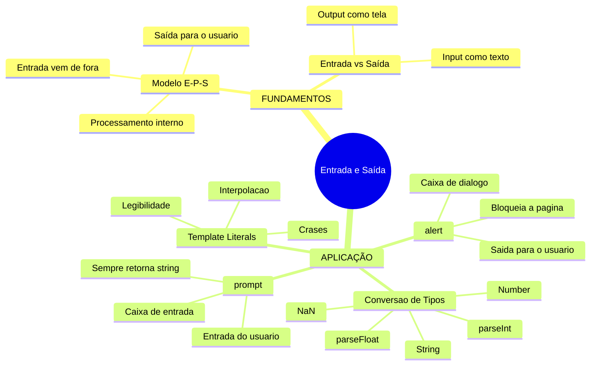

# JavaScript — Do Zero ao Profissional — Aula 05

## Entrada e Saída — Interagindo com o Usuário

**Duração estimada:** 100 minutos (55 de leitura + 45 de prática)
**Nível:** Iniciante
**Pré-requisitos:** Aula 01 (console.log, console do navegador) + Aula 02 (let, const) + Aula 03 (tipos, typeof) + Aula 04 (operadores)

---

## Objetivos de Aprendizagem

Ao final desta aula, você será capaz de:

- [ ] **Explicar** o modelo Entrada → Processamento → Saída com analogias do mundo real
- [ ] **Usar** `alert()` para exibir mensagens em uma caixa de diálogo, diferenciando saída para o usuário de saída para o desenvolvedor
- [ ] **Usar** `prompt()` para receber texto do usuário e guardar o valor em uma variável
- [ ] **Explicar** que `prompt()` SEMPRE retorna uma string, independentemente do que o usuário digitar
- [ ] **Usar** template literals com `${}` para montar strings de forma legível, substituindo a concatenação com `+`
- [ ] **Converter** strings para números com `Number()` e identificar quando a conversão produz `NaN`
- [ ] **Usar** `parseInt()` e `parseFloat()` para converter strings com caracteres não numéricos
- [ ] **Usar** `String()` para converter números em strings
- [ ] **Aplicar** entrada, saída, template literals e conversão de tipos no Gerenciador de Tarefas
- [ ] **Descrever** o comportamento de bloqueio de `alert()` e `prompt()` — a execução do JavaScript para até o usuário interagir

---

## Como Usar Esta Aula

Esta aula está organizada em duas partes que se complementam.

Na **primeira parte** (seção 1), você vai entender o modelo Entrada → Processamento → Saída de forma conceitual. São conceitos universais — valem para qualquer linguagem de programação. A analogia principal é a do **garçom e da cozinha**: o garçom anota o pedido (entrada), a cozinha prepara (processamento), o garçom serve (saída). Sem JavaScript ainda.

Na **segunda parte** (seções 2 a 5), você vai aprender as quatro ferramentas do JavaScript para interagir com o usuário: `alert()` (saída popup), `prompt()` (entrada por caixa de diálogo), template literals (como montar mensagens bonitas) e funções de conversão de tipo (`Number()`, `String()`, `parseInt()`, `parseFloat()`). Cada ferramenta tem prática guiada.

Na **seção 6**, você vai aplicar TUDO ao Gerenciador de Tarefas — seu projeto vai finalmente CONVERSAR com o usuário.

Cada seção termina com um **Quick Check**. As respostas estão logo abaixo. Tente responder de cabeça antes de olhar.

> *"Até agora seu programa era um monólogo — ele rodava e pronto. Hoje ele vai aprender a OUVIR e RESPONDER. Seu código vai finalmente CONVERSAR com o usuário."*

---

## Mapa Mental



---

## Recapitulação das Aulas 01, 02, 03 e 04

| Aula | Conceito | Onde aparece nesta aula | Como se conecta |
|---|---|---|---|
| Aula 01 | **console.log()** | Seções 2, 3, 4, 5, 6 | Continuamos usando console.log para inspecionar — mas agora ele divide espaço com alert() e prompt() |
| Aula 01 | **Fluxo E-P-S** | Seção 1 (aprofundamento) | O modelo ganha vida: prompt() é a ENTRADA, alert() é a SAÍDA visível |
| Aula 02 | **Variáveis (caixinhas)** | Seções 3, 4, 6 | prompt() GUARDA o valor digitado numa variável — você usa a caixinha para não perder o dado |
| Aula 03 | **String vs Number** | Seções 4, 5 | Template literals montam strings. Conversão de tipo transforma string em número. A diferença entre "5" e 5 é CRÍTICA hoje |
| Aula 03 | **typeof** | Seções 3, 5 | typeof mostra que prompt() SEMPRE retorna string. typeof confirma se Number() converteu corretamente |
| Aula 04 | **Operador +** | Seção 4 | Concatenação com + vs template literal com `${}` — duas formas de montar texto |
| Aula 04 | **Operadores de comparação** | Seção 6 | Para validar a entrada do usuário no Gerenciador de Tarefas |

---

**FUNDAMENTOS: O Modelo Entrada → Processamento → Saída**

> *Os conceitos desta seção são universais — valem para qualquer linguagem de programação, em qualquer computador. Na segunda parte, você verá como o JavaScript implementa entrada e saída no navegador. Por enquanto, vamos entender o que significa "um programa que recebe dados de fora e mostra resultados para fora". Sem código. Só a ideia pura.*

---

## 1. O Modelo Entrada → Processamento → Saída (Aprofundamento)

Nas aulas anteriores, você escreveu programas que processavam dados que você mesmo colocou no código. Você definia valores dentro do programa e ele os usava. Os dados estavam FIXOS no código-fonte.

Isso resolve metade do problema. Na vida real, um programa recebe dados de FORA — do usuário que digita, de um sensor, de um arquivo, da internet — e mostra resultados para FORA — na tela, num arquivo.

Esse ciclo se chama **Entrada → Processamento → Saída** (E-P-S). É o modelo mais fundamental da computação.

### As três perguntas do modelo E-P-S

Todo programa interativo responde a três perguntas:

1. **ENTRADA:** De onde vêm os dados? Quem fornece?
2. **PROCESSAMENTO:** O que o programa faz com esses dados?
3. **SAÍDA:** Para onde vão os resultados? Quem recebe?

**Exemplo 1 — Restaurante (o garçom e a cozinha):** Você está num restaurante. O garçom anota seu pedido (ENTRADA). Leva para a cozinha, que prepara o prato (PROCESSAMENTO). Depois, o garçom traz o prato pronto para sua mesa (SAÍDA). Sem entrada, o cozinheiro não sabe o que fazer. Sem saída, você nunca recebe a comida.

**Exemplo 2 — Calculadora:** Você digita os números e a operação (ENTRADA). A calculadora processa internamente (PROCESSAMENTO). Mostra o resultado no visor (SAÍDA). Se ela não tivesse teclas, você nunca conseguiria usá-la. Se não tivesse visor, nunca veria o resultado.

**Exemplo 3 — Totem de autoatendimento:** Você seleciona os itens e a forma de pagamento (ENTRADA). O sistema calcula e processa o pagamento (PROCESSAMENTO). A tela mostra a confirmação e imprime o comprovante (SAÍDA). Cada etapa depende da anterior.

### Três formas de entrada, três formas de saída

Toda entrada se encaixa em uma categoria:

| Tipo de Entrada | Como funciona | Exemplo cotidiano |
|---|---|---|
| Texto digitado | Usuário escreve via teclado | Digitar seu nome em um formulário |
| Clique ou toque | Usuário seleciona uma opção | Escolher um item em um menu |
| Leitura de dados | Programa importa informação | Carregar um arquivo salvo |

Toda saída também tem seu lugar:

| Tipo de Saída | Como funciona | Exemplo cotidiano |
|---|---|---|
| Exibição na tela | Mensagem aparece para o usuário | Confirmação de uma ação |
| Log interno | Informação para diagnóstico | Histórico de operações |
| Armazenamento | Dados salvos para uso futuro | Salvar preferências |

### Por que isso é um marco?

Até agora, você era a única pessoa que interagia com seu programa — e interagia indiretamente, editando o código. A partir do momento em que seu programa recebe entrada e produz saída, QUALQUER pessoa pode usá-lo. Alguém abre, digita uma resposta, vê um resultado. Seu código sai do seu computador e vai para o mundo.

> *Se até aqui seu programa era uma carta fechada, a partir desta aula ele aprende a ouvir e responder. Isso separa um "script que roda" de um "programa que conversa".*

### Erro comum: confundir entrada com dado fixo

A diferença é enorme. No dado fixo, o valor está escrito no código — você decide o que vai aparecer. Na entrada, o programa pergunta e guarda a resposta — a informação vem de fora, no momento da execução. Seu programa se torna flexível, adaptável, capaz de responder a cada pessoa de forma diferente.

### Quick Check 1

**1. Quais são as três etapas do modelo E-P-S? Dê um exemplo do dia a dia.**
**Resposta:** Entrada (receber dados), Processamento (transformar dados), Saída (mostrar resultado). Exemplo: num restaurante, o pedido do cliente é a entrada, a cozinha preparando é o processamento, o garçom servindo o prato é a saída.

**2. Qual a diferença entre dados fixos no código e dados recebidos como entrada?**
**Resposta:** Dados fixos estão escritos no programa e não mudam sem editar o código. Dados de entrada vêm de fora — do usuário, de um arquivo — no momento da execução, tornando o programa flexível e adaptável.

**3. Por que um programa com entrada e saída é mais poderoso que um com dados fixos?**
**Resposta:** Porque ele se adapta a diferentes usuários e situações. Um programa com dados fixos sempre faz a mesma coisa. Um programa com entrada pode responder a cada pessoa de forma diferente, como um totem que atende cada cliente individualmente.

---

**APLICAÇÃO: As Quatro Ferramentas de Interação em JavaScript**

> *Agora que você entende o modelo E-P-S, vai aprender as quatro ferramentas que o JavaScript do navegador oferece para conversar com o usuário. Abra seu editor e seu navegador — cada ferramenta é para ser testada, não só lida. A ordem importa: primeiro a SAÍDA (você já conhece console.log), depois a ENTRADA, depois como formatar e como converter.*

---

## 2. alert() — A Saída que Pula na Tela

`alert()` é a ferramenta de saída mais simples do JavaScript no navegador. Ela exibe uma **caixa de diálogo** com uma mensagem e um botão "OK". A página inteira CONGELA até o usuário clicar em OK.

```javascript
alert("Olá, mundo!");
```

Quando essa linha executa, o navegador abre uma janelinha no centro da tela com a mensagem "Olá, mundo!" e um botão OK. Nada mais funciona na página até clicar em OK.

### Para que serve alert()?

- Mostrar **mensagens importantes** para o usuário
- Dar **boas-vindas** ou **feedback** ("Tarefa adicionada com sucesso!")
- **Confirmar** ações ("Cadastro realizado!")
- **Alertar** sobre erros ("Preencha todos os campos")

### alert() vs console.log()

| Característica | console.log() | alert() |
|---|---|---|
| Onde aparece | Console do navegador | Caixa de diálogo na tela |
| Quem vê | Desenvolvedor (F12) | Usuário final |
| Bloqueia a página? | Não | Sim — trava até clicar OK |
| Para depuração? | Sim | Não (atrapalha) |
| Para comunicar com usuário? | Não (ninguém abre console) | Sim |

**A diferença fundamental:** `console.log()` é seu diário de bordo — você escreve para você mesmo, desenvolvedor. `alert()` é seu megafone — você fala com o usuário.

> *Regra prática: use console.log() quando estiver DESENVOLVENDO e precisar inspecionar. Use alert() quando quiser que o USUÁRIO veja uma mensagem.*

### O bloqueio de página é uma CARACTERÍSTICA, não um defeito

Muita gente reclama que alert() "trava a página". Mas isso é INTENCIONAL. O bloqueio força o usuário a PRESTAR ATENÇÃO na mensagem. É um recurso de atenção — você usa para mensagens que o usuário NÃO PODE IGNORAR.

```javascript
alert("ATENÇÃO: Esta ação não pode ser desfeita!");
```

A página trava. O usuário PRECISA ler e clicar OK.

### alert() aceita qualquer coisa como mensagem

O alert() converte automaticamente para string o que você passar:

```javascript
alert("Texto");          // string
alert(42);               // número → vira "42"
alert(true);             // booleano → vira "true"
alert(10 + 5);           // expressão → primeiro calcula 15, depois mostra "15"
alert("Total: " + 50);   // concatenação → "Total: 50"
```

### Mão na Massa — Seu primeiro alert()

Crie ou abra seu arquivo `index.html` e substitua o conteúdo da tag `<script>` por:

```html
<!DOCTYPE html>
<html>
<head>
    <title>Testando alert()</title>
</head>
<body>
    <h1>Teste de alert()</h1>
    <script>
        // Seu primeiro alert!
        alert("Bem-vindo ao mundo da interação!");

        // alert com expressão
        alert("A soma de 10 + 5 é: " + (10 + 5));

        // alert depois de console.log
        console.log("Isso aparece no console");
        alert("Isso aparece na tela");
    </script>
</body>
</html>
```

**Verificação:**
- [ ] Abri no navegador e vi a caixa de diálogo com "Bem-vindo ao mundo da interação!"
- [ ] Cliquei OK e vi o segundo alert: "A soma de 10 + 5 é: 15"
- [ ] Notei que console.log apareceu no console, não na tela
- [ ] Entendi: alert() é para o usuário, console.log() é para o desenvolvedor

### Erro comum: achar que alert() substitui console.log()

```javascript
// ERRADO — você não consegue DEPURAR com alert()
let x = 10;
alert("O valor de x é: " + x);
// Bloqueia a página a cada alert, não mostra objetos complexos

// CERTO — console.log() para depuração
let x = 10;
console.log("O valor de x é:", x);
// Não bloqueia, mostra objetos, não atrapalha ninguém
```

### Quick Check 2

**1. O que alert() faz?**
**Resposta:** alert() exibe uma caixa de diálogo com uma mensagem e um botão "OK". A mensagem é mostrada na tela para o usuário ver. É uma ferramenta de SAÍDA.

**2. Qual a diferença entre alert() e console.log()?**
**Resposta:** console.log() mostra no Console do navegador (só o desenvolvedor vê, não bloqueia). alert() mostra uma caixa de diálogo na tela (o usuário vê, BLOQUEIA a página até clicar OK).

**3. O que acontece quando alert() é executado?**
**Resposta:** A página CONGELA — o usuário não consegue interagir com nada até clicar em OK. Isso é intencional: força o usuário a prestar atenção na mensagem.

---

## 3. prompt() — A Entrada que Pergunta

`prompt()` é a ferramenta de entrada mais simples do JavaScript no navegador. Ela exibe uma **caixa de diálogo com um campo de texto**, permitindo que o usuário DIGITE uma resposta.

```javascript
prompt("Qual seu nome?");
```

O navegador abre uma janelinha com a pergunta, um campo de texto vazio e dois botões: OK e Cancelar.

### O que prompt() retorna?

**ESTA É A INFORMAÇÃO MAIS IMPORTANTE DESTA AULA:**

**prompt() SEMPRE retorna uma STRING.** SEMPRE. Não importa o que o usuário digite — um número, uma palavra, um email — o valor retornado é SEMPRE do tipo string.

```javascript
let resposta = prompt("Digite algo:");
console.log(typeof resposta);  // "string" — SEMPRE!
console.log(resposta);         // O que o usuário digitou (ou null se cancelou)
```

Se o usuário digitar `25`, a variável `resposta` guarda a string `"25"`, NÃO o número `25`. Isso é CRÍTICO porque mais tarde você vai querer fazer contas com esse valor.

### E se o usuário clicar em Cancelar?

Se o usuário clicar em **Cancelar** (ou apertar ESC), `prompt()` retorna `null`. `null` é um valor especial que significa "nada" ou "vazio intencional", visto na Aula 03.

```javascript
let resposta = prompt("Digite algo:");
console.log(resposta);      // null (se clicou em Cancelar)
console.log(typeof resposta); // "object" — null é considerado object (peculiaridade do JS)
```

### prompt() com valor padrão

Você pode fornecer um **valor padrão** que aparece pré-preenchido no campo de texto:

```javascript
let nome = prompt("Qual seu nome?", "João");
// O campo já vem com "João" escrito — o usuário pode apagar e escrever outro
```

O segundo argumento é o valor que aparece como sugestão.

### prompt() também BLOQUEIA a página

Assim como `alert()`, `prompt()` bloqueia a execução do JavaScript e a interação com a página até o usuário responder. A diferença é que prompt() ESPERA uma resposta — o programa PAUSA e só continua depois que o usuário digitar algo e clicar OK (ou Cancelar).

### Mão na Massa — Seu primeiro prompt()

Atualize seu `index.html`:

```html
<!DOCTYPE html>
<html>
<head>
    <title>Testando prompt()</title>
</head>
<body>
    <h1>Teste de prompt()</h1>
    <script>
        // Pergunta o nome
        let nome = prompt("Qual é o seu nome?");

        // Mostra o que foi digitado
        console.log("O nome digitado foi:", nome);
        console.log("O tipo da resposta é:", typeof nome);

        // Mostra um alert com o nome
        alert("Olá, " + nome + "!");

        // Pergunta idade
        let idade = prompt("Quantos anos você tem?");
        console.log("Idade digitada:", idade);
        console.log("Tipo da idade:", typeof idade);
        // ATENÇÃO: idade é STRING, não número!
    </script>
</body>
</html>
```

**Verificação:**
- [ ] Criei/atualizei o arquivo com prompt()
- [ ] Digitei meu nome e cliquei OK
- [ ] Vi o alert com "Olá, [meu nome]!"
- [ ] Abri o console (F12) e vi o tipo da resposta: "string"
- [ ] Confirmei no console que o tipo da idade também é "string"
- [ ] Entendi: prompt() SEMPRE retorna string

### Erro comum: tentar fazer conta com o resultado de prompt()

```javascript
let idade = prompt("Quantos anos você tem?");
let anoQueVem = idade + 1;  // ERRO!
console.log(anoQueVem);     // "251" — concatenou string com número!

// idade é "25" (string)
// "25" + 1 → "251" (concatenação, não soma!)
```

Este é o erro MAIS comum de quem aprende prompt(). O usuário DIGITA um número, mas o JavaScript recebe uma STRING. Você PRECISA converter antes de fazer contas.

### Pegadinha: prompt() retorna string MESMO quando você digita número

```javascript
let numero = prompt("Digite um número:");
console.log(numero === 25);     // false — "25" !== 25
console.log(numero === "25");   // true — ambos são string

// Nunca confie no tipo do prompt — SEMPRE é string!
```

### Quick Check 3

**1. O que prompt() faz?**
**Resposta:** prompt() exibe uma caixa de diálogo com uma pergunta e um campo de texto. O usuário digita uma resposta e clica OK (ou Cancelar). O valor digitado é RETORNADO pelo prompt().

**2. Qual o tipo do valor retornado por prompt()?**
**Resposta:** SEMPRE string. Não importa se o usuário digitou "25", "João" ou "3.14" — o tipo é string. Se clicar Cancelar, retorna null.

**3. O que acontece se você tentar somar 1 ao resultado de prompt("Digite sua idade:")?**
**Resposta:** Obtém concatenação, não soma. Se o usuário digitar "25", o resultado de `prompt("Digite sua idade:") + 1` é "251", não 26. Para somar, você PRECISA converter a string para número primeiro.

---

## 4. Template Literals — Concatenando como Gente Grande

Até agora, para montar mensagens com variáveis, você usou concatenação com `+`:

```javascript
let nome = "Maria";
let idade = 30;
console.log("Olá, " + nome + "! Você tem " + idade + " anos.");
// "Olá, Maria! Você tem 30 anos."
```

Funciona, mas é trabalhoso. Você precisa ficar abrindo e fechando aspas, cuidando dos espaços, lembrando do `+` em cada pedaço.

**Template literals** resolvem isso. Com eles, você escreve a mensagem inteira dentro de **crases** (`` ` ``) e usa `${}` para inserir variáveis ou expressões:

```javascript
let nome = "Maria";
let idade = 30;
console.log(`Olá, ${nome}! Você tem ${idade} anos.`);
// "Olá, Maria! Você tem 30 anos."
```

Veja a diferença:

| Concatenação com + | Template literal |
|---|---|
| `"Olá, " + nome + "! Você tem " + idade + " anos."` | `` `Olá, ${nome}! Você tem ${idade} anos.` `` |
| Precisa abrir/fechar aspas várias vezes | Escreve tudo de uma vez nas crases |
| Precisa de + entre cada parte | Usa `${}` dentro do texto |
| Fácil de errar espaço | Espaços são exatamente como escritos |

### Dentro de ${} você pode colocar QUALQUER expressão

Não só variáveis — você pode colocar expressões completas:

```javascript
let a = 10;
let b = 5;
console.log(`A soma de ${a} e ${b} é ${a + b}.`);
// "A soma de 10 e 5 é 15."

console.log(`${a} é maior que ${b}? ${a > b}`);
// "10 é maior que 5? true"
```

O JavaScript avalia a expressão dentro de `${}`, converte o resultado para string e insere no texto.

### Template literals com múltiplas linhas

Outra vantagem: template literals mantêm quebras de linha NATURALMENTE:

```javascript
// Com aspas normais — você precisa de \n:
console.log("Linha 1\nLinha 2\nLinha 3");

// Com template literal — escreve naturalmente:
console.log(`Linha 1
Linha 2
Linha 3`);
```

> *Dica: Sempre que precisar montar uma mensagem com variáveis, use template literals. São mais legíveis, mais seguros e mais poderosos.*

### Mão na Massa — Template literals na prática

Atualize seu `index.html`:

```html
<!DOCTYPE html>
<html>
<head>
    <title>Template Literals</title>
</head>
<body>
    <h1>Template Literals</h1>
    <script>
        // Pergunta dados
        let nome = prompt("Qual seu nome?");
        let cidade = prompt("Onde você mora?");
        let idade = prompt("Quantos anos você tem?");

        // COM CONCATENAÇÃO (jeito antigo)
        console.log("Olá, " + nome + "! Você mora em " + cidade + " e tem " + idade + " anos.");

        // COM TEMPLATE LITERAL (jeito moderno)
        console.log(`Olá, ${nome}! Você mora em ${cidade} e tem ${idade} anos.`);

        // COM EXPRESSÃO DENTRO DE ${}
        console.log(`Em 10 anos, ${nome} terá ${Number(idade) + 10} anos.`);

        // ALERT com template literal
        alert(`Bem-vindo, ${nome}!`);
    </script>
</body>
</html>
```

**Verificação:**
- [ ] Usei prompt() para receber nome, cidade e idade
- [ ] Comparei concatenação com + vs template literal com `${}`
- [ ] Entendi que template literal é MAIS LEGÍVEL
- [ ] Usei expressão dentro de `${}` para calcular idade futura
- [ ] Usei template literal dentro de alert()

### Erro comum: esquecer as CRASES em vez de aspas

```javascript
// ERRADO — aspas normais não funcionam com ${}:
console.log("Olá, ${nome}!");   // Mostra literalmente "${nome}" — sem interpolação!

// CERTO — crases:
console.log(`Olá, ${nome}!`);   // Mostra "Olá, Maria!"
```

A crase é a tecla do lado esquerdo do teclado (próximo ao P, no layout brasileiro). É diferente de aspas simples (`'`).

### Erro comum: esquecer espaços na concatenação com +

```javascript
let nome = "João";
// ERRADO — sem espaço:
console.log("Olá," + nome + "!");      // "Olá,João!"
// CERTO — com espaço dentro das aspas:
console.log("Olá, " + nome + "!");     // "Olá, João!"
// COM TEMPLATE LITERAL — espaços são literais:
console.log(`Olá, ${nome}!`);          // "Olá, João!"
```

### Quick Check 4

**1. Qual a diferença entre template literals e concatenação com +?**
**Resposta:** Template literals usam crases (`` ` ``) em vez de aspas, e `${}` para inserir variáveis. É mais legível porque você escreve o texto todo de uma vez, sem abrir/fechar aspas e sem operadores `+` entre cada parte.

**2. Como você escreve um template literal que diz "Olá, João! Você tem 25 anos." usando as variáveis nome e idade?**
**Resposta:** `` `Olá, ${nome}! Você tem ${idade} anos.` ``

**3. O que console.log(`Resultado: ${10 + 5}`) exibe?**
**Resposta:** "Resultado: 15". A expressão `${10 + 5}` é avaliada primeiro (dá 15), depois convertida para string e inserida no texto.

---

## 5. Conversão de Tipos — De Texto para Número

Você aprendeu na Seção 3 que `prompt()` SEMPRE retorna string. Agora vem a segunda informação mais importante desta aula:

**Se você precisa fazer contas com o que o usuário digitou, você PRECISA converter a string para número.**

### Number() — O conversor universal

`Number()` tenta converter qualquer valor para número:

```javascript
Number("5");     // 5  (string → número)
Number("5.5");   // 5.5 (string → decimal)
Number("");      // 0  (string vazia → 0)
Number("abc");   // NaN (não é um número!)
Number(true);    // 1  (booleano → número)
Number(false);   // 0  (booleano → número)
Number(null);    // 0  (null → 0)
Number("  5  "); // 5  (espaços são ignorados)
```

**Aplicação prática com prompt():**

```javascript
let idadeString = prompt("Quantos anos você tem?");  // "25" (string)
let idadeNumero = Number(idadeString);                 // 25 (número!)

console.log(idadeString + 1);   // "251" — concatenação (erro)
console.log(idadeNumero + 1);   // 26 — soma (correto!)
```

### parseInt() — Para números inteiros

`parseInt()` converte string para número INTEIRO. Diferente de `Number()`, ele IGNORA caracteres não numéricos no final:

```javascript
parseInt("5");       // 5
parseInt("5.9");     // 5  — ignora a parte decimal (trunca)
parseInt("5px");     // 5  — útil para CSS! Ignora "px"
parseInt("abc");     // NaN — não começa com número
parseInt("  5  ");   // 5  — espaços ignorados
```

**Onde parseInt() brilha:** quando você trabalha com valores que têm texto junto, como `"5px"`, `"10em"`, `"100%"`:

```javascript
let largura = "300px";
let larguraNumero = parseInt(largura);  // 300 — o "px" é ignorado!
console.log(larguraNumero + 100);       // 400
```

### parseFloat() — Para números decimais

`parseFloat()` é como `parseInt()`, mas PRESERVA a parte decimal:

```javascript
parseFloat("5.5");        // 5.5
parseFloat("5.5px");      // 5.5
parseFloat("5.99");       // 5.99
parseFloat("5");          // 5
parseFloat("abc");        // NaN
```

### String() — O caminho inverso

Se `Number()` vai de string para número, `String()` vai de número para string:

```javascript
String(5);       // "5"
String(5.5);     // "5.5"
String(true);    // "true"
String(null);    // "null"
String(10 + 5);  // "15" — primeiro calcula, depois converte
```

### NaN — O resultado de conversões impossíveis

Quando `Number()`, `parseInt()` ou `parseFloat()` não conseguem converter, retornam `NaN` (Not a Number):

```javascript
Number("abc");        // NaN
parseInt("abc");      // NaN
parseFloat("abc");    // NaN
Number(undefined);    // NaN
```

`NaN` tem uma propriedade ESTRANHA: ele NUNCA é igual a nada, nem a ele mesmo:

```javascript
NaN === NaN;        // false — NaN nunca é igual a NaN!
isNaN(NaN);         // true — use isNaN() para verificar
isNaN("abc");       // true — "abc" não é número
isNaN(Number("5")); // false — Number("5") = 5, que É número
```

> *`isNaN()` é uma função que pergunta: "isto É ou NÃO É um número?" Se retornar true, significa que o valor não pode ser usado como número.*

### Tabela de conversão rápida

| Função | Entrada | Saída | Quando usar |
|---|---|---|---|
| `Number()` | `"5"` | `5` | Quando a string é APENAS número |
| `Number()` | `"5.5"` | `5.5` | Para decimais limpos |
| `parseInt()` | `"5px"` | `5` | Quando tem texto DEPOIS do número |
| `parseFloat()` | `"5.5px"` | `5.5` | Decimal com texto depois |
| `String()` | `5` | `"5"` | Quando você precisa de string |

### Mão na Massa — Conversão na prática

Atualize seu `index.html`:

```html
<!DOCTYPE html>
<html>
<head>
    <title>Conversão de Tipos</title>
</head>
<body>
    <h1>Conversão de Tipos</h1>
    <script>
        // 1. O PROBLEMA: prompt sempre retorna string
        let idade = prompt("Quantos anos você tem?");
        console.log(`Tipo: ${typeof idade}, Valor: "${idade}"`);

        // 2. Tentar somar SEM converter — ERRO!
        console.log(`Ano que vem (sem converter): ${idade + 1}`);
        // "251" — concatenação!

        // 3. Converter com Number()
        let idadeNum = Number(idade);
        console.log(`Após Number(): ${idadeNum}, Tipo: ${typeof idadeNum}`);

        // 4. Agora sim podemos somar
        console.log(`Ano que vem (com Number): ${idadeNum + 1}`);

        // 5. parseInt com texto
        let distancia = prompt("Qual a distância (em km)?");
        let distanciaNum = parseInt(distancia);
        console.log(`Distância: ${distanciaNum} km, Tipo: ${typeof distanciaNum}`);

        // 6. parseFloat com decimal
        let preco = prompt("Qual o preço?");
        let precoNum = parseFloat(preco);
        console.log(`Preço: R$ ${precoNum}, Tipo: ${typeof precoNum}`);

        // 7. isNaN para verificar conversão válida
        console.log(`É um número válido? ${!isNaN(idadeNum)}`);
    </script>
</body>
</html>
```

**Verificação:**
- [ ] Digitei minha idade e vi que prompt retorna STRING
- [ ] Vi o erro: `idade + 1` deu concatenação ("251")
- [ ] Usei `Number(idade)` e vi o tipo mudar para "number"
- [ ] Depois da conversão, `idadeNum + 1` funcionou como soma (26)
- [ ] Testei `parseInt("5px")` e vi que funciona
- [ ] Testei `parseFloat` com decimal
- [ ] Entendi que `isNaN()` verifica se a conversão deu certo

### Erro comum: esquecer de converter

```javascript
// ERRADO — clássico de iniciante:
let nota1 = prompt("Nota 1:");
let nota2 = prompt("Nota 2:");
let media = (nota1 + nota2) / 2;
// Se nota1 = "8" e nota2 = "7", resultado é "87" / 2 = 43.5
// A concatenação acontece ANTES da divisão!

// CERTO — converte primeiro:
let nota1 = Number(prompt("Nota 1:"));
let nota2 = Number(prompt("Nota 2:"));
let media = (nota1 + nota2) / 2;
// 8 + 7 = 15, 15 / 2 = 7.5
```

### Erro comum: parseInt vs Number

```javascript
// Diferença sutil mas importante:
parseInt("5.9");    // 5  — trunca o decimal
Number("5.9");      // 5.9 — preserva o decimal

parseInt("5px");    // 5  — funciona!
Number("5px");      // NaN — NÃO funciona!
```

Use `Number()` quando o valor é apenas número. Use `parseInt()`/`parseFloat()` quando pode ter texto junto.

### Quick Check 5

**1. Por que você precisa converter o resultado de prompt() antes de fazer contas?**
**Resposta:** Porque prompt() SEMPRE retorna string. Se você somar "5" + 3, obtém "53" (concatenação), não 8. Precisa converter com Number(), parseInt() ou parseFloat() primeiro.

**2. Qual a diferença entre Number("5.9") e parseInt("5.9")?**
**Resposta:** Number("5.9") retorna 5.9 (preserva o decimal). parseInt("5.9") retorna 5 (trunca a parte decimal).

**3. O que Number("5px") retorna? E parseInt("5px")?**
**Resposta:** Number("5px") retorna NaN (não é um número válido). parseInt("5px") retorna 5 (ignora caracteres não numéricos depois do número).

**4. O que NaN significa e como verificar se um valor é NaN?**
**Resposta:** NaN significa "Not a Number" — resultado de operações matemáticas inválidas. Verifique com `isNaN(valor)`. IMPORTANTE: `NaN === NaN` é false — nunca compare com ===.

---

## 6. Aplicando no Gerenciador de Tarefas

Chegou a hora de juntar TUDO. Seu Gerenciador de Tarefas vai:

1. **Perguntar ao usuário** o nome da tarefa (prompt)
2. **Confirmar** que a tarefa foi adicionada (alert)
3. **Mostrar** as informações no console com template literals
4. **Converter** entradas numéricas para fazer cálculos

### Código completo do Gerenciador (aula 05)

Substitua TODO o conteúdo do `<script>` do seu HTML:

```html
<!DOCTYPE html>
<html>
<head>
    <title>Gerenciador de Tarefas</title>
</head>
<body>
    <h1>Gerenciador de Tarefas</h1>
    <script>
        // ==========================================
        // GERENCIADOR DE TAREFAS — VERSÃO INTERATIVA
        // ==========================================

        // === BOAS-VINDAS ===
        const nomeDoApp = "Gerenciador de Tarefas";
        alert(`Bem-vindo ao ${nomeDoApp}!`);

        // === ENTRADA DO USUÁRIO ===
        let tarefa1 = prompt("Qual o nome da primeira tarefa?");
        let tarefa2 = prompt("Qual o nome da segunda tarefa?");

        // === VALIDAÇÃO SIMPLES ===
        console.log(`Tarefa 1 digitada: ${tarefa1}`);
        console.log(`Tarefa 2 digitada: ${tarefa2}`);

        // === CONFIRMAÇÃO ===
        alert(`Tarefas adicionadas:
        1. ${tarefa1}
        2. ${tarefa2}`);

        // === STATUS INICIAL ===
        let statusTarefa1 = "Pendente";
        let statusTarefa2 = "Pendente";

        // === PRIORIDADE via prompt + conversão ===
        let prioridadeInput = prompt("Qual a prioridade da tarefa 1? (1 = Alta, 2 = Média, 3 = Baixa)");
        let prioridadeNumero = Number(prioridadeInput);

        // === CONVERSÃO do número para texto ===
        let prioridadeTarefa1 = "";
        if (prioridadeNumero === 1) {
            prioridadeTarefa1 = "Alta";
        } else if (prioridadeNumero === 2) {
            prioridadeTarefa1 = "Média";
        } else {
            prioridadeTarefa1 = "Baixa";
        }

        // === RESUMO NO CONSOLE ===
        console.log(`=== ${nomeDoApp} ===`);
        console.log(`Tarefa 1: ${tarefa1}`);
        console.log(`Status 1: ${statusTarefa1}`);
        console.log(`Prioridade 1: ${prioridadeTarefa1}`);
        console.log(`Tarefa 2: ${tarefa2}`);
        console.log(`Status 2: ${statusTarefa2}`);

        // === TOTAL DE TAREFAS ===
        let totalDeTarefas = 2;
        console.log(`Total de tarefas: ${totalDeTarefas}`);

        // === VERIFICAÇÕES COM OPERADORES (Aula 04) ===
        console.log(`Tarefa 1 está pendente? ${statusTarefa1 === "Pendente"}`);
        console.log(`Tarefa 2 está pendente? ${statusTarefa2 === "Pendente"}`);

        // === MENSAGEM FINAL ===
        alert(`Tudo pronto! Você tem ${totalDeTarefas} tarefas no ${nomeDoApp}.
        Abra o console (F12) para ver os detalhes.`);
    </script>
</body>
</html>
```

### O que mudou (e por que isso é incrível)

| Antes (Aula 04) | Agora (Aula 05) | O que mudou |
|---|---|---|
| `let tarefa1 = "Estudar JavaScript"` | `let tarefa1 = prompt("Qual o nome?")` | O USUÁRIO digita o nome |
| `console.log("Bem-vindo")` | `alert("Bem-vindo")` | Mensagem aparece PARA o usuário |
| `console.log("Tarefa: " + nome)` | `` console.log(`Tarefa: ${nome}`) `` | Template literal mais legível |
| Dados fixos | Dados vindos do prompt | Programa se adapta |

### Mão na Massa — Gerenciador versão interativa

**Verificação:**
- [ ] Atualizei o arquivo com o novo código interativo
- [ ] VI o alert de boas-vindas ao abrir a página
- [ ] Digitei o nome da primeira e segunda tarefa nos prompts
- [ ] VI o alert confirmando as tarefas adicionadas
- [ ] Digitei a prioridade e o programa converteu para texto
- [ ] Abri o console (F12) e vi todas as mensagens com template literals
- [ ] VI o alert final com o resumo
- [ ] Testei clicar em Cancelar em algum prompt (viu null no console?)
- [ ] ENTENDI: meu programa agora CONVERSA com o usuário

### Desafio extra

Que tal melhorar seu Gerenciador? Tente:

1. Perguntar também o prazo da tarefa em dias
2. Converter com parseInt() e mostrar "Prazo: X dias"
3. Perguntar se a tarefa é importante (digitar "sim" ou "não")
4. Usar template literal para montar um resumo COMPLETO no console

```javascript
// Exemplo de como fazer o desafio:
let prazoInput = prompt("Qual o prazo da tarefa 1 (em dias)?");
let prazoDias = parseInt(prazoInput);
console.log(`Prazo da tarefa 1: ${prazoDias} dias`);
console.log(`Data limite: daqui a ${prazoDias} dias`);
```

### Quick Check 6 (Aplicação)

**1. Escreva um prompt que pergunta "Qual o nome da tarefa?" e guarda em uma variável.**
**Resposta:** `let nomeTarefa = prompt("Qual o nome da tarefa?");`

**2. Escreva um alert que usa template literal para dizer "Tarefa [nome] adicionada!".**
**Resposta:** `` alert(`Tarefa ${nomeTarefa} adicionada!`); ``

**3. Escreva o código que converte o resultado de um prompt para número usando Number().**
**Resposta:** `let valor = Number(prompt("Digite um número:"));`

**4. Por que o Gerenciador de Tarefas agora é "interativo"?**
**Resposta:** Porque ele usa prompt() para receber dados do usuário em vez de ter dados fixos no código. O programa conversa com o usuário: pergunta, recebe resposta e reage.

---

## Autoavaliação: Quiz Rápido

Teste seu conhecimento antes de partir para os exercícios. Cada questão tem UMA resposta correta.

**Q1. O que alert("Olá") faz?**
a) Mostra "Olá" no console
b) Mostra uma caixa de diálogo com "Olá" e um botão OK
c) Mostra "Olá" na página HTML
d) Pergunta "Olá" ao usuário

**Resposta:** b) alert() exibe uma caixa de diálogo com a mensagem e um botão OK. Bloqueia a página até o usuário clicar.

**Q2. Qual o tipo do valor retornado por prompt()?**
a) number
b) boolean
c) string — SEMPRE
d) Depende do que o usuário digitar

**Resposta:** c) string — SEMPRE. Mesmo que o usuário digite um número, o prompt retorna string. Se clicar Cancelar, retorna null.

**Q3. O que acontece se você escrever console.log(`Olá, ${nome}`) em vez de console.log("Olá, " + nome)?**
a) Dá erro
b) Funciona igual, mas com template literal (mais legível)
c) Mostra "undefined"
d) Só funciona se nome for string

**Resposta:** b) Funciona igual, mas com template literal. `${nome}` avalia a variável e insere no texto.

**Q4. O que Number("5.5") retorna?**
a) "5.5"
b) 5
c) 5.5
d) NaN

**Resposta:** c) 5.5. Number() converte string para número preservando decimais.

**Q5. O que parseInt("5px") retorna?**
a) NaN
b) 5
c) "5px"
d) 5.5

**Resposta:** b) 5. parseInt() ignora caracteres não numéricos depois do número inicial.

**Q6. Qual a diferença entre alert() e console.log()?**
a) Não há diferença
b) alert() é para o usuário (bloqueia), console.log() é para o desenvolvedor (não bloqueia)
c) alert() é mais rápido
d) console.log() bloqueia a página

**Resposta:** b) alert() mostra uma caixa de diálogo para o USUÁRIO (bloqueia). console.log() mostra no Console para o DESENVOLVEDOR (não bloqueia).

**Q7. O que NaN === NaN retorna?**
a) true
b) false
c) NaN
d) undefined

**Resposta:** b) false. NaN nunca é igual a nada, nem a si mesmo. Use `isNaN()` para verificar.

**Q8. Se o usuário digita "10" em um prompt e você quer somar 5, qual o código correto?**
a) `prompt("Valor:") + 5`
b) `Number(prompt("Valor:")) + 5`
c) `String(prompt("Valor:")) + 5`
d) `parseFloat(prompt("Valor:")) + 5`

**Resposta:** b) `Number(prompt("Valor:")) + 5` — converte para número e DEPOIS soma.

---

## Exercícios Graduados

**Exercício 1 (Fácil) — Sua Primeira Interação**

Crie um arquivo HTML com um `<script>` que:

1. Pergunta o nome do usuário com prompt()
2. Pergunta a cidade onde mora com prompt()
3. Mostra um alert() com template literal: "Olá, [nome]! Você mora em [cidade]."
4. Mostra no console: "Nome: [nome], Cidade: [cidade]" usando template literal
5. Mostra no console o tipo de cada variável com typeof

**Gabarito:**

```html
<!DOCTYPE html>
<html>
<head>
    <title>Exercício 1</title>
</head>
<body>
    <h1>Exercício 1 — Interação</h1>
    <script>
        let nome = prompt("Qual seu nome?");
        let cidade = prompt("Onde você mora?");

        alert(`Olá, ${nome}! Você mora em ${cidade}.`);

        console.log(`Nome: ${nome}, Cidade: ${cidade}`);
        console.log(`Tipo de nome: ${typeof nome}`);
        console.log(`Tipo de cidade: ${typeof cidade}`);
    </script>
</body>
</html>
```

> *Explicação: O exercício testa os três pilares da aula: prompt (entrada), alert (saída) e template literals (formatação). O typeof confirma que ambos são strings.*

**Exercício 2 (Médio) — Calculadora de Idade**

Crie um programa que:

1. Pergunta o nome do usuário
2. Pergunta o ano de nascimento
3. Converte o ano para número com Number()
4. Calcula a idade aproximada (anoAtual - anoNascimento)
5. Mostra um alert: "[nome], você tem aproximadamente [idade] anos."
6. Mostra no console um resumo com template literal em várias linhas

Dica: use `let anoAtual = 2026;` para o ano atual.

**Gabarito:**

```html
<!DOCTYPE html>
<html>
<head>
    <title>Exercício 2 — Calculadora de Idade</title>
</head>
<body>
    <h1>Calculadora de Idade</h1>
    <script>
        let nome = prompt("Qual seu nome?");
        let anoNascimento = Number(prompt("Em que ano você nasceu?"));

        let anoAtual = 2026;
        let idade = anoAtual - anoNascimento;

        alert(`${nome}, você tem aproximadamente ${idade} anos.`);

        console.log(`=== CALCULADORA DE IDADE ===`);
        console.log(`Nome: ${nome}`);
        console.log(`Ano de nascimento: ${anoNascimento}`);
        console.log(`Ano atual: ${anoAtual}`);
        console.log(`Idade aproximada: ${idade} anos`);
        console.log(`Tipo do ano de nascimento: ${typeof anoNascimento}`);
        console.log(`Tipo da idade: ${typeof idade}`);
    </script>
</body>
</html>
```

> *Explicação: A chave é converter o prompt com Number() ANTES de fazer a subtração. A forma explícita com Number() é mais segura que depender da conversão implícita do operador -.*

**Desafio (Difícil) — Validação de Entrada do Gerenciador**

Crie um programa que:

1. Pergunta o nome da tarefa (prompt)
2. Verifica se o usuário CANCELOU (resposta é null)
3. Se cancelou, mostra alert "Nenhuma tarefa adicionada."
4. Se não cancelou, pergunta a prioridade (1, 2 ou 3)
5. Converte a prioridade com Number()
6. Usa isNaN() para verificar se a conversão foi válida
7. Se a prioridade for inválida (NaN), define como "Média" (padrão)
8. Mostra um alert final com resumo completo usando template literal multilinha
9. Mostra no console todas as variáveis e seus tipos

**Gabarito:**

```html
<!DOCTYPE html>
<html>
<head>
    <title>Desafio — Validação de Entrada</title>
</head>
<body>
    <h1>Validação de Entrada</h1>
    <script>
        // 1. Pergunta o nome da tarefa
        let tarefa = prompt("Qual o nome da tarefa?");

        // 2. Verifica se o usuário cancelou
        if (tarefa === null) {
            alert("Nenhuma tarefa adicionada.");
            console.log("Usuário cancelou a operação.");
        } else {
            // 3. Pergunta a prioridade
            let prioridadeInput = prompt("Qual a prioridade? (1 = Alta, 2 = Média, 3 = Baixa)");

            // 4. Converte para número
            let prioridadeNum = Number(prioridadeInput);

            // 5. Verifica se a conversão foi válida
            let prioridadeTexto = "";
            if (isNaN(prioridadeNum)) {
                prioridadeTexto = "Média";  // padrão se inválido
                console.log("Prioridade inválida, usando padrão: Média");
            } else if (prioridadeNum === 1) {
                prioridadeTexto = "Alta";
            } else if (prioridadeNum === 2) {
                prioridadeTexto = "Média";
            } else if (prioridadeNum === 3) {
                prioridadeTexto = "Baixa";
            } else {
                prioridadeTexto = "Média";  // padrão se número fora do intervalo
            }

            // 6. Resumo
            alert(`Tarefa adicionada:
            Nome: ${tarefa}
            Prioridade: ${prioridadeTexto}`);

            console.log(`=== TAREFA ADICIONADA ===`);
            console.log(`Nome: ${tarefa}`);
            console.log(`Prioridade (número): ${prioridadeNum}`);
            console.log(`Prioridade (texto): ${prioridadeTexto}`);
            console.log(`Tipo do nome: ${typeof tarefa}`);
            console.log(`Tipo da prioridade: ${typeof prioridadeNum}`);
            console.log(`É NaN? ${isNaN(prioridadeNum)}`);
        }
    </script>
</body>
</html>
```

> *Explicação: Este desafio integra TODOS os conceitos da aula. prompt() para entrada, alert() para saída, template literals para formatar, Number() para converter, isNaN() para validar, e null para detectar Cancelar.*

---

## Resumo da Aula

### Os 5 Conceitos Fundamentais

1. **Modelo E-P-S**: Todo programa interativo recebe dados (entrada), processa e devolve (saída). Dados fixos no código vs dados vindos do usuário.

2. **alert()**: Exibe uma caixa de diálogo com mensagem. Bloqueia a página (intencional). É para o USUÁRIO final. console.log() é para o DESENVOLVEDOR.

3. **prompt()**: Exibe caixa com campo de texto. SEMPRE retorna string. Se clicar Cancelar, retorna null. Bloqueia a página.

4. **Template literals**: Use crases `` ` `` em vez de aspas. Use `${}` para inserir variáveis e expressões. Mais legível que concatenação com `+`.

5. **Conversão de tipos**: `Number()` para string → número. `parseInt()` para inteiros (ignora texto depois). `parseFloat()` para decimais. `String()` para número → string. `isNaN()` para verificar se a conversão foi válida.

### O Que Você Construiu Hoje

- [ ] Entendi o modelo Entrada → Processamento → Saída na prática
- [ ] Usei `alert()` para mostrar mensagens ao usuário
- [ ] Entendi que alert() bloqueia a página (e por que isso é útil)
- [ ] Usei `prompt()` para receber dados do usuário
- [ ] Entendi que prompt() SEMPRE retorna string
- [ ] Usei template literals com `${}` no lugar da concatenação
- [ ] Converti strings para números com `Number()`, `parseInt()`, `parseFloat()`
- [ ] Usei `isNaN()` para verificar se uma conversão deu certo
- [ ] Usei `String()` para converter número em string
- [ ] Apliquei entrada, saída e conversão no Gerenciador de Tarefas

---

## Próxima Aula

**Aula 06: Strings em Profundidade**

Você aprendeu a receber e exibir dados do usuário. Mas os dados que o usuário digita são TEXTOS — strings. Na Aula 06, você vai mergulhar no mundo das strings: comprimento, acesso a caracteres, maiúsculas/minúsculas, busca, extração de partes e muito mais.

Vai aprender métodos como `.length`, `.toUpperCase()`, `.toLowerCase()`, `.includes()`, `.indexOf()`, `.slice()` e outros que transformam e analisam textos.

Seu Gerenciador de Tarefas vai ganhar a capacidade de validar e manipular os nomes das tarefas.

---

## Referências

### Documentação Oficial

- [MDN: alert()](https://developer.mozilla.org/en-US/docs/Web/API/Window/alert) — documentação oficial do método alert()
- [MDN: prompt()](https://developer.mozilla.org/en-US/docs/Web/API/Window/prompt) — documentação oficial do método prompt(), incluindo o retorno de string
- [MDN: Template literals](https://developer.mozilla.org/en-US/docs/Web/JavaScript/Reference/Template_literals) — guia completo sobre template literals
- [MDN: Number()](https://developer.mozilla.org/en-US/docs/Web/JavaScript/Reference/Global_Objects/Number/Number) — referência da função Number()
- [MDN: parseInt()](https://developer.mozilla.org/en-US/docs/Web/JavaScript/Reference/Global_Objects/parseInt) — referência da função parseInt()
- [MDN: parseFloat()](https://developer.mozilla.org/en-US/docs/Web/JavaScript/Reference/Global_Objects/parseFloat) — referência da função parseFloat()
- [MDN: NaN](https://developer.mozilla.org/en-US/docs/Web/JavaScript/Reference/Global_Objects/NaN) — explicação do valor NaN e como lidar com ele

### Tutoriais e Guias

- [JavaScript.info: Interaction — alert, prompt, confirm](https://javascript.info/alert-prompt-confirm) — tutorial interativo sobre interação com o usuário
- [JavaScript.info: Types — Type Conversions](https://javascript.info/type-conversions) — guia sobre conversão de tipos em JavaScript
- [JavaScript.info: Strings](https://javascript.info/string) — introdução a strings (inclui template literals)

---

## FAQ

**P: alert() e prompt() são a mesma coisa?**
R: Não. alert() APENAS EXIBE uma mensagem (saída). prompt() PERGUNTA e RECEBE uma resposta (entrada). Os dois bloqueiam a página, mas prompt() retorna o valor digitado.

**P: O que acontece se eu clicar em Cancelar no prompt()?**
R: prompt() retorna null. null significa "nada" ou "vazio intencional". Você pode verificar com `if (resposta === null)` para tratar esse caso.

**P: Por que template literals são melhores que concatenação?**
R: São mais legíveis (escreve o texto todo de uma vez), não precisa de operadores + entre cada parte, aceita expressões dentro de `${}`, e preserva quebras de linha naturalmente.

**P: Qual a diferença entre Number() e parseInt()?**
R: Number() preserva decimais (`Number("5.5")` = 5.5) mas falha com texto depois do número (`Number("5px")` = NaN). parseInt() trunca decimais (`parseInt("5.9")` = 5) mas ignora texto depois (`parseInt("5px")` = 5).

**P: O que é NaN e como verifico?**
R: NaN significa "Not a Number" — resultado de operações matemáticas inválidas. Use `isNaN(valor)` para verificar. NUNCA use `=== NaN` porque NaN nunca é igual a nada.

**P: Eu preciso SEMPRE converter prompt() para número?**
R: Só se for fazer contas. Se for exibir o valor, não precisa converter. Se vai somar, subtrair ou comparar numericamente, PRECISA converter.

**P: console.log() vai sumir agora que tenho alert()?**
R: Não! console.log() continua sendo sua principal ferramenta de depuração. alert() é para o USUÁRIO final. console.log() é para o DESENVOLVEDOR (você). Os dois se complementam.

---

## Glossário

| Termo | Definição |
|---|---|
| **Entrada (input)** | Dados que o programa RECEBE de fora. Ex: prompt(), clique do mouse, arquivo. (Ver seção 1) |
| **Saída (output)** | Dados que o programa EXIBE para fora. Ex: alert(), console.log(), texto na página. (Ver seção 1) |
| **alert()** | Função que exibe caixa de diálogo com mensagem e botão OK. Bloqueia a página. (Ver seção 2) |
| **prompt()** | Função que exibe caixa de diálogo com campo de texto e retorna o valor digitado como STRING. (Ver seção 3) |
| **null** | Valor especial que representa "nada". Retornado por prompt() quando o usuário clica Cancelar. (Ver seção 3) |
| **Template literal** | String delimitada por crases (`` ` ``) que permite interpolar variáveis com `${}`. (Ver seção 4) |
| **Interpolação** | Inserção de valores de variáveis dentro de uma string usando `${}`. (Ver seção 4) |
| **Number()** | Função que converte valor para número. Ex: `Number("5")` → 5. (Ver seção 5) |
| **parseInt()** | Função que converte string para inteiro, ignorando texto após o número. (Ver seção 5) |
| **parseFloat()** | Função que converte string para decimal, ignorando texto após o número. (Ver seção 5) |
| **NaN** | "Not a Number". Resultado de conversões impossíveis ou operações inválidas. (Ver seção 5) |
| **isNaN()** | Função que verifica se um valor é ou não número válido. (Ver seção 5) |
